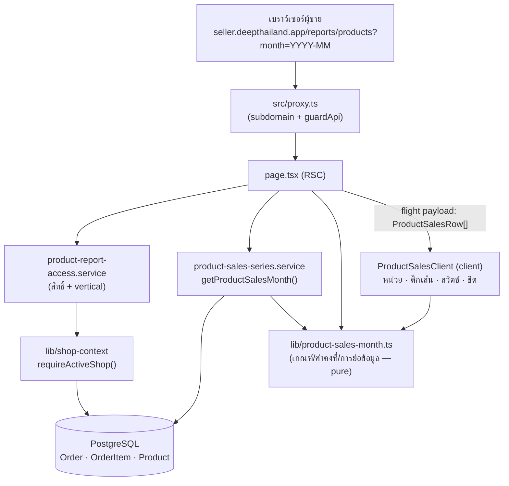
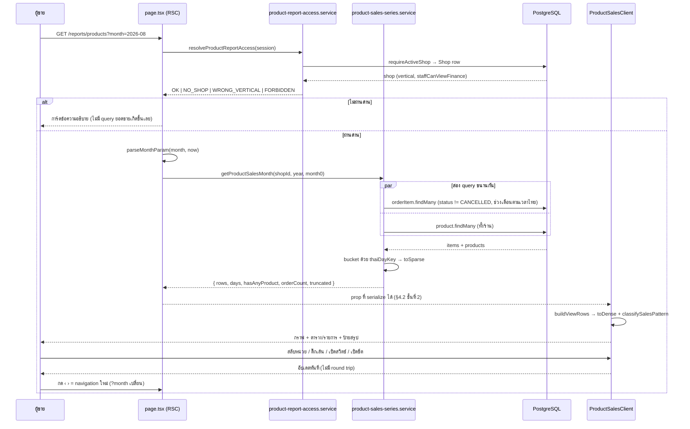
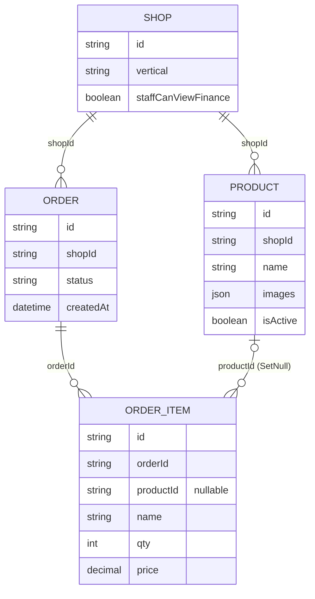

> **โมดูล:** M63-ProductSalesTimeSeries
> **ประเภทเอกสาร:** Software Requirements Specification (SRS) — TECHNICAL
> **เวอร์ชัน:** 1.0
> **วันที่จัดทำ:** 2026-08-29
> **สถานะ:** Draft
> **เจ้าของเอกสาร:** SA (ดู [[Feature-Docs-Ownership]])

# SRS: ยอดขายรายสินค้า (Software Requirements Specification — Technical)

---

## 1. บทนำ (Introduction)

### 1.1 วัตถุประสงค์ของเอกสาร

เอกสารนี้คือ **นิยามเชิงเทคนิคของทุกตัวเลขและทุกคำ** บนหน้า `/reports/products` สำหรับ DEV/QA
ถ้าหน้าจอกับเอกสารไม่ตรงกัน ให้ถือว่าเอกสารต้องถูกแก้ตามโค้ด ไม่ใช่กลับกัน — เพราะตัวที่บังคับใช้จริง
คือ `src/lib/product-sales-month.ts` (ฟังก์ชันบริสุทธิ์ล้วน + เทส `[blocker]` 51 เคส) และ
`src/lib/__tests__/product-report-guards.test.ts` (13 เคส) ไม่ใช่ประโยคในไฟล์ `.md`
(`docs/conventions/rule-must-be-enforced-not-described.md`)

ประเด็นที่เอกสารนี้ตอบซึ่ง PRD/BRD ตอบไม่ได้:

- ค่าคงที่ทุกตัวอยู่ที่ไหน และใครเป็นคนบังคับ
- ทำไมฟีเจอร์นี้ **ไม่มี API endpoint · ไม่มี migration · ไม่มี DB index ใหม่** แม้แต่ตัวเดียว
- ขอบเขตของ "สัญญา" ระหว่าง RSC กับ client component (รูปร่างของ `ProductSalesRow`)
- พฤติกรรมที่รับประกันเมื่อ input ผิดรูป · ข้อมูลชนเพดาน · ฐานข้อมูลล่ม

### 1.2 ขอบเขตเชิงระบบ (System Scope)

**อยู่ในขอบเขต**

| สิ่งที่เพิ่ม | ไฟล์ |
|-------------|------|
| ชั้นเกณฑ์/ค่าคงที่ (pure) | `src/lib/product-sales-month.ts` |
| ชั้นสิทธิ์ | `src/services/product-report-access.service.ts` |
| ชั้นข้อมูล | `src/services/product-sales-series.service.ts` |
| หน้าจอ (RSC + client) | `src/app/(paces)/seller/(dashboard)/reports/products/**` (page + loading + 9 component) |
| เมนู | `src/lib/seller-menu.ts` (เพิ่ม slug `seller:reports-products` + ใส่ใน `ONLINE_SALES_ONLY_SLUGS`) |
| คำแปลเมนู | `src/i18n/dictionaries/th.ts` · `en.ts` (คีย์ `menu.reportsProducts`) |
| เทส | `src/lib/__tests__/product-sales-month.test.ts` · `product-report-guards.test.ts` |

**อยู่นอกขอบเขตทางเทคนิค (ยืนยันจากโค้ดแล้วว่าไม่มีจริง)**

- **ไม่มีไฟล์ใน `prisma/migrations/`** — ไม่มีคอลัมน์/ตาราง/CHECK/index ใดถูกเพิ่ม
- **ไม่มีไฟล์ใน `src/app/api/**`** — ทั้งฟีเจอร์ไม่มี HTTP endpoint ของตัวเอง (ดู §4)
- ไม่มีการแก้ `Order` / `OrderItem` / `Product` / `Shop` ทั้งในสคีมาและในเส้นทางเขียน
- ไม่มี job/cron/pre-aggregate — ทุกตัวเลขคำนวณสดต่อคำขอ

### 1.3 เอกสารอ้างอิง (References)

| เอกสาร | ความสัมพันธ์ |
|--------|-------------|
| [[PRD]] ของโมดูลนี้ | ที่มาของเป้าหมาย G-1/G-2, KPI, ข้อจำกัดเชิงธุรกิจ §4 |
| [[BRD]] ของโมดูลนี้ | ที่มาของ FR-PST-01..16 และ AC-PST-01..20 ที่ TFR ทุกข้อต้อง trace กลับ |
| [[SDS]] ของโมดูลนี้ | การออกแบบเชิงระบบที่ realize ข้อกำหนดในเอกสารนี้ |
| [[API]] ของโมดูลนี้ | บันทึกว่าไม่มี endpoint ใหม่ + สัญญาของหน้า (query param / รูปร่างข้อมูล) |
| `docs/SRS.md` §3.4 | ทะเบียน route ฝั่ง seller — `/reports/products` ถูกเพิ่มในรอบนี้ |
| `docs/conventions/domain-term-single-definition.md` (HR16) | เหตุผลที่ต้องมี `SALES_BASIS_NOTE` / `MONEY_MODE_CAVEAT` บนหน้าจอ |
| `docs/conventions/ui-boolean-needs-a-testable-home.md` | เหตุผลที่เกณฑ์ป้ายอยู่ในไฟล์ pure ไม่ใช่ในเทอร์นารีกลาง JSX |
| `docs/conventions/partial-data-must-be-labeled-or-filled.md` | เหตุผลของแถบเทา "ยังไม่ถึง" และธง `truncated` |
| `docs/conventions/paces-charts-source.md` (HR10) | เหตุผลที่กราฟต้องผ่าน `ApexChart` และที่ `DayStrip` ต้องไม่ผ่าน |

### 1.4 นิยามและตัวย่อ (Definitions & Acronyms)

| คำ/ตัวย่อ | ความหมายเชิงเทคนิค |
|-----------|----------------------|
| **RSC** | React Server Component — `page.tsx` ของหน้านี้ทำงานฝั่งเซิร์ฟเวอร์ล้วน ส่งผลลัพธ์ลงมาเป็น flight payload |
| **แถวรวม (custom row)** | แถวเดียวที่รวม `OrderItem` ทุกใบที่ `productId = null` — คีย์คือ `CUSTOM_ITEM_KEY = '__custom__'` |
| **`SparseSeries`** | `[dayIndex0based, value][]` — อนุกรมรายวันที่เก็บเฉพาะวันที่ค่าไม่เป็น 0 |
| **dense array** | อนุกรมรายวันความยาวเท่าจำนวนวันจริงของเดือน (`toDense()` คลายจาก sparse) |
| **`dayIndex`** | ดัชนีวัน 0-based ภายในเดือนที่เลือก (`0` = วันที่ 1) |
| **วันอ้างอิง (`referenceDayIndex`)** | dayIndex ที่ใช้เป็นจุดตั้งต้นนับ "เงียบมากี่วัน" |
| **`futureFrom`** | dayIndex แรกที่ "ยังมาไม่ถึง" · `null` = เดือนนั้นจบไปแล้ว |
| **`saleEvents`** | จำนวนบรรทัด `OrderItem` ของสินค้านั้นในเดือนนั้น = "ขายได้กี่ครั้ง" |
| **ป้ายสรุป (`SalesPattern`)** | union 4 ค่า: `NONE` / `CONCENTRATED` / `STEADY` / `DORMANT{days}` |

---

## 2. ภาพรวมสถาปัตยกรรม (Architecture Overview)

### 2.1 บริบทระบบ (System Context)



🛑 ลูกศรจาก `CLI` ไป `PURE` มีอยู่จริงและสำคัญ: เกณฑ์ป้ายสรุปถูกคำนวณ **ฝั่ง client** ใน
`components/data.ts::buildViewRows()` โดยเรียก `classifySalesPattern()` ตัวเดียวกับที่เทสจับ —
ไม่มีการเขียนเกณฑ์ชุดที่สองไว้ในฝั่งเซิร์ฟเวอร์

### 2.2 องค์ประกอบหลัก (Components)

| Component | หน้าที่ | Stack / ตำแหน่ง |
|-----------|---------|------------------|
| **`product-sales-month.ts`** | ค่าคงที่ · เกณฑ์ป้าย · การแปลงเดือน · การย่อ/คลายอนุกรม · ระดับความเข้ม | TypeScript pure (ไม่ import อะไรเลย แม้แต่ `format-date`) |
| **`product-report-access.service.ts`** | ตัดสิน `OK / NO_SHOP / WRONG_VERTICAL / FORBIDDEN` | Node (เรียก `requireActiveShop`) |
| **`product-sales-series.service.ts`** | query + bucket รายวัน + ประกอบ `ProductSalesRow[]` | Node + Prisma |
| **`page.tsx`** | RSC: ตัดสินสิทธิ์ → แปลง query → เรียก service → ส่งของที่ serialize ได้ลง client | Next.js App Router (Paces) |
| **`loading.tsx`** | skeleton ที่เลียนโครงจริง (ซ่อนโครงกราฟต่ำกว่า `md`) | RSC |
| **`components/data.ts`** | คลาย sparse + คำนวณป้าย + ตัวเลือกค่าเริ่มต้นของเส้นกราฟ | TypeScript pure (ฝั่ง client bundle) |
| **`ProductSalesClient.tsx`** | ถือ state 4 อย่าง + จัดวางตาม breakpoint | client component |
| **`ProductSalesChart.tsx`** | กราฟเส้น ผ่าน `@/components/wrappers/ApexChart` | client |
| **`ProductSalesTable.tsx`** | ตาราง TanStack + ช่องติ๊ก + pagination | client (`'use no memo'`) |
| **`ProductMobileList.tsx`** · **`ProductDetailSheet.tsx`** | รายการการ์ด + ชีตเต็มจอรายสินค้า | client |
| **`DayStrip.tsx`** | แถบ 1 ช่อง = 1 วัน — **`div` ล้วน ไม่ใช่ chart** | server-safe component (ไม่มี `'use client'`) |
| **`PatternBadge.tsx`** | เรนเดอร์ป้ายสรุปจาก `SalesPattern` | server-safe component |
| **`MonthSwitcher.tsx`** | ปุ่ม ‹ › เป็น `<Link>` จริง | **server component ล้วน** |

### 2.3 มุมมองการ Deploy (Deployment View)

ไม่มีการเปลี่ยน topology ใด ๆ — หน้านี้เป็น route เพิ่มในแอป Next.js เดิมบน Vercel
(nodejs runtime เดียวกับหน้าอื่นของ `(paces)`) อ่านฐานข้อมูลเดิมผ่าน Prisma client ตัวเดิม

- ไม่มี service ใหม่ · ไม่มี queue · ไม่มี env var ใหม่
- ไม่มี migration ⇒ `prisma migrate deploy` ตอน build ไม่มีอะไรให้รันเพิ่ม (Hard Rule 15)
- การ deploy ย้อนกลับ (rollback) ทำได้ด้วยการ revert commit ล้วน ไม่มีสถานะฐานข้อมูลค้าง

---

## 3. ข้อกำหนดเชิงฟังก์ชันเชิงเทคนิค (Technical Functional Requirements)

### TFR-001: เมนูและการมองเห็นตาม vertical

- **Trace to:** FR-PST-01, FR-PST-02 (ส่วนเมนู)
- **คำอธิบายเชิงเทคนิค:** เพิ่มรายการเมนูในกลุ่ม `seller-analytics` ของ `sellerMenuItems`
  (`src/lib/seller-menu.ts:74`) ด้วย `{ url: '/reports/products', slug: 'seller:reports-products',
  label: 'ยอดขายรายสินค้า', icon: 'package' }` และใส่ slug นี้ใน
  `ONLINE_SALES_ONLY_SLUGS` (`seller-menu.ts:357`) ซึ่งไหลเข้า `VERTICAL_VISIBLE_SLUGS.ONLINE_SALES`
  และ `ALL_VERTICAL_SCOPED_SLUGS` ⇒ `applyVerticalMenu()` ซ่อน slug นี้ให้ทุก vertical ที่ไม่ใช่
  `ONLINE_SALES` โดยอัตโนมัติ · คำแปลผูกที่ `applyMenuLocale()` (`seller-menu.ts:791`) →
  `menu.reportsProducts`
- **Precondition:** ผู้ใช้ล็อกอินฝั่ง seller และมีร้านที่ใช้งานอยู่
- **Postcondition:** เมนูปรากฏเฉพาะร้าน `ONLINE_SALES` และแสดงคำแปลตามภาษาที่เลือก
- **Error / Edge cases:**
  - `vertical` ค่าที่ระบบไม่รู้จัก → `applyVerticalMenu()` ถอยไปชุดของ `ONLINE_SALES` (พฤติกรรมเดิมของระบบ
    ไม่ได้ถูกเปลี่ยนในรอบนี้ · เทสยืนยันไว้ที่ `product-report-guards.test.ts` เคส `SOMETHING_NEW`)
  - 🛑 **การซ่อนเมนูไม่นับเป็นด่าน** — `seller-menu.ts` ประกาศตัวเองว่า "ทำหน้าที่แค่ไม่รกตา"
    ด่านจริงอยู่ที่ TFR-002

### TFR-002: ด่านสิทธิ์และ vertical ฝั่งเซิร์ฟเวอร์

- **Trace to:** FR-PST-02, FR-PST-03 · AC-PST-02/03/18
- **คำอธิบายเชิงเทคนิค:** `resolveProductReportAccess(session)` คืน union 4 ค่า ตามลำดับตัดสินนี้
  (ลำดับเป็นส่วนหนึ่งของข้อกำหนด ไม่ใช่รายละเอียดการเขียน):

  1. `requireActiveShop(session)` คืน `null` **หรือ** `session.user.id` ไม่มีค่า → `NO_SHOP`
  2. `(shop.vertical ?? 'ONLINE_SALES') !== 'ONLINE_SALES'` → `WRONG_VERTICAL`
  3. `role === 'OWNER'` → `OK`
  4. `shop.staffCanViewFinance === true` → `OK` (role `ADMIN`)
  5. อื่น ๆ → `FORBIDDEN`

- **Precondition:** มี session ฝั่ง seller
- **Postcondition:** ผู้เรียกได้คำตอบเดียวที่ตัดสินทั้ง "เห็นไหม" และ "เพราะอะไรถึงไม่เห็น"
- **Error / Edge cases:**
  - 🛑 **ตรวจ vertical ก่อนสิทธิ์โดยตั้งใจ** — ทั้งสองฝ่ายเป็นคนในร้านอยู่แล้ว การบอกว่า
    "รายงานนี้ใช้กับร้านประเภทนี้ไม่ได้" ไม่ใช่การรั่วข้อมูล และตรงกับสิ่งที่ผู้ใช้กำลังงงมากกว่า
  - 🛑 **เทียบธงด้วย `=== true` เท่านั้น ห้าม `!== false`** — คอลัมน์เป็น `@default(true)` การลัดด้วย
    `!== false` จะทำให้สวิตช์ของเจ้าของร้านกลายเป็นของหลอกในวันที่ค่าเป็น `null` ด้วยเหตุใดก็ตาม
    (มีเทส `[blocker]` ตรวจทั้งขาบวกและขาลบ)
  - **ไม่มีธงสิทธิ์ตัวใหม่ถูกเพิ่ม** — ใช้ `Shop.staffCanViewFinance` ตัวเดียวกับ `/expenses` และ
    `/reports/agents` · ผลข้างเคียงที่ต้องรู้: ปิดสวิตช์นี้จะพลอยปิดอีกสองหน้าไปด้วยเสมอ

### TFR-003: ด่านต้องอยู่เหนือการดึงข้อมูล

- **Trace to:** FR-PST-02 (AC "เมื่อ vertical ไม่ผ่าน ระบบไม่ query ข้อมูลยอดขายเลย") · BRD §6.4
- **คำอธิบายเชิงเทคนิค:** ใน `page.tsx` การเรียก `resolveProductReportAccess(` ต้องเกิด **ก่อน**
  การเรียก `getProductSalesMonth(` และทั้งสามทางปฏิเสธต้อง `return` ออกจากฟังก์ชันก่อนถึงบรรทัด query
- **Postcondition:** ผู้ที่ไม่ผ่านด่านไม่มีตัวเลขยอดขายอยู่ใน flight payload เลย ไม่ใช่แค่ "ไม่ render"
- **Error / Edge cases:** เทส `[blocker]` เทียบตำแหน่ง `indexOf('resolveProductReportAccess(')` กับ
  `indexOf('getProductSalesMonth(')` บนซอร์สที่ **ตัดคอมเมนต์ออกแล้ว** และตรวจว่าสตริง `'NO_SHOP'`
  `'WRONG_VERTICAL'` `'FORBIDDEN'` ปรากฏครบทั้งสามตัว (ขาดตัวไหน = ตกลงไปที่การแสดงข้อมูล)

### TFR-004: การแปลงพารามิเตอร์เดือน

- **Trace to:** FR-PST-04 · AC-PST-01/19
- **คำอธิบายเชิงเทคนิค:** `parseMonthParam(raw, now)` คืน
  `{ year, month0, iso: 'YYYY-MM', clamped: boolean }`

  | input | ผลลัพธ์ |
  |-------|---------|
  | ไม่ส่งมา / `undefined` / `''` | เดือนปัจจุบันตามเวลาไทย · `clamped=false` |
  | ไม่ match `/^(\d{4})-(\d{2})$/` | เดือนปัจจุบัน · `clamped=true` |
  | เดือนนอกช่วง `01..12` | เดือนปัจจุบัน · `clamped=true` |
  | เก่ากว่า `MIN_MONTH_ISO = '2024-01'` | เดือนปัจจุบัน · `clamped=true` |
  | ใหม่กว่า `maxSelectableMonth(now)` | เดือนปัจจุบัน · `clamped=true` |
  | อยู่ในช่วง | เดือนนั้น · `clamped=false` |

- **Precondition:** ไม่มี — ฟังก์ชันรับ `string | undefined | null` ได้ทุกกรณี
- **Postcondition:** **ไม่ throw และไม่ 404 ในทุก input** · `clamped=true` ทำให้หน้าจอขึ้นแถบแจ้ง
  "เดือนที่ระบุมาในลิงก์ใช้ไม่ได้ — แสดงข้อมูลของ{เดือน}แทน"
- **Error / Edge cases:**
  - เพดานบน = **เดือนถัดจากเดือนปัจจุบัน 1 เดือน** เพราะ `order-date-window` ยอมให้คีย์วันที่
    ล่วงหน้าได้ 7 วัน ⇒ ปลายเดือนมีออเดอร์ตกไปเดือนถัดไปได้จริง การล็อกไว้แค่เดือนปัจจุบัน
    จะทำให้ข้อมูลชุดนั้นดูไม่ได้เลย
  - การตัดสิน "เดือนปัจจุบัน" ใช้เวลาไทยเสมอ (`now + 7 ชม.` แล้วอ่านด้วย `getUTC*`) — เทสปักหมุด
    เคส `2026-08-31T20:00Z` ต้องได้ `2026-09`
  - `MIN_MONTH_ISO` และ `maxSelectableMonth()` ถูกใช้ซ้ำใน `page.tsx` เพื่อคำนวณ `prevHref`/`nextHref`
    ⇒ ปุ่มที่ชนเพดานเป็น **ปุ่มที่กดไม่ได้** ไม่ใช่ปุ่มที่พาไปหน้า `clamped`

### TFR-005: นิยาม "ขายแล้ว" และการดึงข้อมูล

- **Trace to:** FR-PST-05 · AC-PST-04
- **คำอธิบายเชิงเทคนิค:** `getProductSalesMonth(shopId, year, month0)` ยิง 2 query ขนานกันด้วย
  `Promise.all`:

  1. `prisma.orderItem.findMany({ where: { order: { shopId, status: { not: 'CANCELLED' },
     createdAt: { gte, lt } } }, select: { productId, name, qty, price, orderId,
     order: { select: { createdAt } } }, take: MAX_ITEM_ROWS + 1 })`
  2. `prisma.product.findMany({ where: { shopId }, select: { id, name, images, isActive },
     orderBy: { createdAt: 'desc' } })` — สินค้า **ทั้งร้าน** ไม่ใช่เฉพาะที่ขายได้

  ขอบเขตเวลา: `gte = thaiMidnightUtc(year, month0, 1)` และ `lt = thaiMidnightUtc(year, month0 + 1, 1)`
  (`Date.UTC` รับ `month = 12` แล้วข้ามปีให้เอง จึงไม่ต้องคำนวณปีเอง)

- **Precondition:** `shopId` มาจาก `access.shop.id` ที่ผ่านด่าน TFR-002 แล้วเท่านั้น
- **Postcondition:** ทุกแถวที่คืนกลับเป็นของร้านเดียวเสมอ — scope ด้วย `shopId` ใน `where`
  ตั้งแต่ query แรก ไม่ใช่ดึงมาแล้วกรองทีหลัง
- **Error / Edge cases:**
  - 🛑 **นิยามนี้ต่างจาก `revenueOrderWhere` ที่ `/sales` และ `/expenses` ใช้โดยตั้งใจ** —
    เป็นชุดเดียวกับ `getBestSellerProducts()` เพราะร้านที่ขายผ่านแชท ผู้ซื้อแทบไม่กลับมากดยืนยัน
    (เคสจริงที่บันทึกไว้ในโค้ด: SHIPPED 23 ใบ / CONFIRMED 0) ⇒ ใช้เกณฑ์ยืนยันแล้ว = ร้านกลุ่มนี้
    เปิดมาเจอกราฟว่างทั้งเดือนทั้งที่ขายได้ทุกวัน
  - 🛑 เพราะนิยามต่าง หน้าจอ **ต้อง** แสดง `SALES_BASIS_NOTE` เสมอ (HR16) — สตริงนั้นเป็น SSOT
    ของประโยคนี้ ห้ามพิมพ์ซ้ำที่ component
  - ฐานข้อมูลล่ม → service throw ขึ้นไปให้ `page.tsx` จับใน `try/catch` แล้วแสดง `SellerErrorState`
    คนละแบบกับ empty state (ดู TFR-015)

### TFR-006: การจัดกลุ่มเป็นแถว

- **Trace to:** FR-PST-09, FR-PST-10 · AC-PST-08/09
- **คำอธิบายเชิงเทคนิค:** คีย์ของแถว = `it.productId ?? CUSTOM_ITEM_KEY` — **ไม่ใช่ `it.name`**
  ทุกแถวสะสมลง `Map<string, Acc>` ที่ถือ `qty[]`, `amount[]` (dense ความยาว = จำนวนวันในเดือน),
  `saleEvents`, `totalQty`, `totalAmount`, `fallbackName`
- **Postcondition:**
  - `OrderItem` ที่ `productId = null` ทุกที่มา (พิมพ์เองในแชท / ประมูล / สินค้าที่เคยถูกลบ)
    รวมเป็นแถวเดียวชื่อ `CUSTOM_ITEM_LABEL = 'รายการที่พิมพ์เอง'` มี `isCustom = true`,
    `image = null`, `isActive = true`
  - สินค้าที่ยัง resolve เจอ → `name`/`image`/`isActive` มาจากแถว `Product` ปัจจุบัน
  - สินค้าของร้านที่ไม่มียอดในเดือนนั้น ถูก **push เพิ่มเข้าไปเสมอ** ด้วย `qty: []`, `amount: []`,
    `totalQty: 0`, `saleEvents: 0`, `lastSoldDayIndex: null`
  - เรียง `rows` ด้วย `b.totalQty - a.totalQty || b.totalAmount - a.totalAmount` ตั้งแต่ฝั่งเซิร์ฟเวอร์
- **Error / Edge cases:**
  - **ไม่แตกตาม `OrderItem.name`** เพราะพิมพ์ผิด/เว้นวรรคต่างกันจะกลายเป็นคนละสินค้า และชื่อซ้ำ
    จากคนละสินค้าจริงจะถูกยุบรวมเงียบ ๆ
  - `fallbackName` (ชื่อจาก snapshot ของ `OrderItem`) เป็นตาข่ายกันพลาด ไม่ใช่เส้นทางหลัก —
    `OrderItem.product` ประกาศ `onDelete: SetNull` และการลบสินค้าเป็น hard delete ⇒ ในทางปฏิบัติ
    ไม่มีเคส "productId มีค่าแต่หา Product ไม่เจอ"
  - **สินค้าที่ถูกลบจริงแยกป้ายไม่ได้** — `productId` ถูกล้างเป็น `null` ที่ระดับฐานข้อมูลก่อนถึงชั้น UI
    จึงมีค่าเหมือนรายการที่พิมพ์เองทุกประการ (ข้อจำกัดเชิงโครงสร้าง ไม่ใช่งานที่ยังไม่ได้ทำ)

### TFR-007: การตัดวันด้วยเวลาไทย

- **Trace to:** FR-PST-07 · AC-PST-20 · BRD §6.1
- **คำอธิบายเชิงเทคนิค:** สร้าง `dayIndexByKey: Map<string, number>` ล่วงหน้าโดยวนวันที่ `1..days`
  แล้วใส่ `thaiDayKey(thaiMidnightUtc(year, month0, d)) → d - 1` จากนั้นแต่ละ `OrderItem` หา dayIndex
  ด้วย `dayIndexByKey.get(thaiDayKey(it.order.createdAt))`
- **Postcondition:** ไม่มีจุดใดในฟีเจอร์นี้คำนวณ offset วันเอง และไม่มีจุดใดใช้ `getFullYear()`/
  `getMonth()` ของเซิร์ฟเวอร์ (ซึ่งเป็น UTC บน Vercel)
- **Error / Edge cases:**
  - `idx === undefined` (ไม่ควรเกิดเพราะกรองใน `where` แล้ว) → **`continue` ข้ามทิ้ง**
    ห้ามยัดลงวันที่ 1 — การยัดจะสร้างยอดปลอมที่อธิบายที่มาไม่ได้
  - จำนวนวันมาจาก `daysInMonth(year, month0)` = `new Date(Date.UTC(y, m0+1, 0)).getUTCDate()`
    ⇒ ก.พ. ได้ 28/29 ตามปีจริง ไม่ใช่ 31 ตายตัว

### TFR-008: หน่วยเงินและคำเตือนที่ผูกกับมัน

- **Trace to:** FR-PST-06 · AC-PST-05
- **คำอธิบายเชิงเทคนิค:** `amount = qty * Number(price)` ต่อบรรทัด สะสมลงวันเดียวกับ `qty`
  แล้วปัดสองตำแหน่งด้วย `round2()` ทั้งรายวันและยอดรวม (กันเศษทศนิยมลอยสะสมข้ามวัน)
- **Postcondition:** ผลรวมของทุกแถว **จะไม่เท่ากับ** `Σ Order.totalAmount` ของเดือนเดียวกัน
  และนั่นคือพฤติกรรมที่ถูกต้อง
- **Error / Edge cases:**
  - 🛑 `Order.discount` และ `Order.vatAmount` เก็บที่ **ระดับออเดอร์** — `OrderItem` ไม่มีคอลัมน์ทั้งสอง
    การเฉลี่ยลงรายบรรทัดคือการสร้างนิยาม "ยอดขาย" ชุดที่ 4 ในระบบที่มีอยู่แล้ว 3 ชุด และเป็นตัวเลข
    ที่อธิบายที่มาให้ผู้ขายไม่ได้เลย
  - `MONEY_MODE_CAVEAT` ต้องแสดง **เฉพาะเมื่อ `unit === 'baht'`** — คำเตือนที่ขึ้นตลอดเวลา
    จะกลายเป็นของประดับที่ไม่มีใครอ่าน

### TFR-009: การย่อ payload (`SparseSeries`)

- **Trace to:** FR-PST-13 (AC "สลับสวิตช์ไม่ยิงเซิร์ฟเวอร์ใหม่") · PRD §6.2
- **คำอธิบายเชิงเทคนิค:** `toSparse(dense)` เก็บเฉพาะ index ที่ `dense[i] !== 0` เป็น `[i, v][]` ·
  `toDense(sparse, length)` คลายกลับเป็น array ยาว `length` ที่เติม 0
- **Precondition:** ฝั่ง client ต้องรู้ `days` เพื่อคลาย — ส่งลงมาเป็น prop แยก
- **Postcondition:** ไป-กลับแล้วได้ค่าเดิมเป๊ะ (เทส `[blocker]`)
- **Error / Edge cases:**
  - **ค่าติดลบต้องไม่ถูกตัดทิ้งเหมือนศูนย์** — เงื่อนไขคือ `!== 0` ไม่ใช่ `> 0` (เทสปักหมุดเคส `-2`)
  - `toDense` ทิ้ง index ที่เกินความยาวโดยไม่ระเบิด (ข้อมูลจากเดือน 31 วันถูกคลายในบริบท 28 วัน)
  - เหตุผลที่ต้องย่อ: หน้านี้ส่งอนุกรมของสินค้า **ทุกตัว** ลง client เพื่อให้ติ๊กสลับเส้นและ
    เปิดสวิตช์ได้โดยไม่ยิง API (มติ "ไม่มี endpoint ใหม่") ร้านที่มีสินค้าเป็นร้อยตัวส่วนใหญ่
    ขายได้ไม่กี่วันต่อเดือน ⇒ การส่งเลขศูนย์ 28 ตัวต่อสินค้าคือ payload ที่จ่ายไปกับความว่างเปล่า

### TFR-010: เพดานปริมาณข้อมูลและการบอกผู้ใช้

- **Trace to:** PRD §6.2 · BRD §6.3
- **คำอธิบายเชิงเทคนิค:** `MAX_ITEM_ROWS = 20_000` · query ใช้ `take: MAX_ITEM_ROWS + 1` แล้วตั้ง
  `truncated = items.length > MAX_ITEM_ROWS` จากนั้นตัดเหลือ `MAX_ITEM_ROWS` แถวก่อนประมวลผล
- **Postcondition:** `truncated` เดินทางขึ้นไปถึงหน้าจอเป็นแถบเตือนสีเหลือง ไม่ใช่ค่าที่ตายอยู่ใน service
- **Error / Edge cases:** 🛑 **ห้ามตัดเงียบ** — ตัวเลขบางส่วนที่หน้าตาเหมือนตัวเลขที่ครบแล้ว
  อันตรายกว่าไม่มีตัวเลข (`partial-data-must-be-labeled-or-filled.md`) · เพดานนี้เป็น
  **ตัวกันหน้าจอค้าง ไม่ใช่ pagination** (idiom เดียวกับ `badge.service.ts`) และอยู่ที่ ~40 เท่า
  ของร้านใหญ่สุดบน prod วันนี้

### TFR-011: เกณฑ์ป้ายสรุปพฤติกรรม

- **Trace to:** FR-PST-14 · AC-PST-12/13
- **คำอธิบายเชิงเทคนิค:** `classifySalesPattern(dailyQty, saleEvents, referenceDayIndex)` ตัดสินตามลำดับ:

  | ลำดับ | เงื่อนไข | ผลลัพธ์ |
  |------|---------|---------|
  | 0 | `saleEvents < MIN_EVENTS_FOR_PATTERN (3)` | `NONE` |
  | 0 | ยอดรวม `<= 0` หรือไม่มีวันที่มียอดเลย | `NONE` |
  | 1 | `referenceDayIndex − lastActiveDay >= DORMANT_DAY_THRESHOLD (14)` | `DORMANT { days }` |
  | 2 | ผลรวมของ `CONCENTRATED_TOP_DAYS (3)` วันที่สูงสุด **> ครึ่งหนึ่งของยอดรวม** | `CONCENTRATED` |
  | 3 | จำนวนวันที่มียอด **> ครึ่งหนึ่งของจำนวนวันในเดือน** | `STEADY` |
  | 4 | อื่น ๆ | `NONE` |

- **Precondition:** `dailyQty` เป็น dense array ความยาวเท่าจำนวนวันจริงของเดือน
- **Postcondition:** คืนป้ายเดียวเสมอ · คำที่แสดงมาจาก `salesPatternLabel()` และคำอธิบายยาว
  มาจาก `salesPatternDescription()` — **ห้ามพิมพ์คำเหล่านี้ซ้ำที่ component** (HR16)
- **Error / Edge cases:**
  - "เกินครึ่ง" คือ **มากกว่า** 50% จริง ๆ ไม่ใช่ `>=` — สินค้าที่ขายวันเว้นวันพอดีจะได้ 50% เป๊ะ
    ซึ่งไม่ควรอ่านว่า "กระจุก" (เทสปักหมุดเคสนี้ไว้ และเคสนั้นตกไปเป็น `STEADY`)
  - **`DORMANT` ชนะทุกป้าย** เพราะป้ายมีไว้ชี้ว่า "ควรไปดูอะไรต่อ" ของที่เงียบมาสองสัปดาห์คือสิ่งนั้น
    และมันไม่ใช่ "ขายสม่ำเสมอ" อยู่แล้วโดยนิยาม ส่วนการเรียกมันว่า "ขายกระจุก" จะกลบข้อเท็จจริง
    ที่ทำอะไรต่อได้มากกว่าไว้ข้างหลังคำที่บรรยายรูปร่างเฉย ๆ
  - **`saleEvents` นับ "บรรทัด" ไม่ใช่ "ชิ้น"** — ขาย 50 ชิ้นในใบเดียวคือ 1 ครั้ง

### TFR-012: วันอ้างอิงและวันที่ยังมาไม่ถึง

- **Trace to:** FR-PST-08 · AC-PST-16
- **คำอธิบายเชิงเทคนิค:**

  | ฟังก์ชัน | เดือนที่ผ่านไปแล้ว | เดือนปัจจุบัน | เดือนอนาคต |
  |---------|-------------------|--------------|-----------|
  | `futureFromDayIndex()` | `null` | วันที่ของวันนี้ (เช่น 29 ส.ค. → `29`) | `0` |
  | `referenceDayIndex()` | `daysInMonth − 1` | `futureFrom − 1` (วันนี้) | `0` |

- **Postcondition:** `futureFrom = null` ⇒ หน้าจอไม่วาดแถบเทาเลยทั้งในกราฟและใน `DayStrip`
- **Error / Edge cases:**
  - 🛑 **`null` ไม่ใช่ `days`** — สองค่านี้ต้องทำให้หน้าจอทำคนละเรื่อง (เดือนที่จบแล้วต้องไม่มี
    แถบเทาอะไรเลย) การคืนความยาวเดือนแทน `null` จะทำให้เดือนเก่าไม่มีวันไหนถูกเทา ซึ่งบังเอิญ
    ให้ผลเหมือนกันในบางเคส แล้วซ่อนความผิดไว้
  - **วันนี้ยังนับว่า "ถึงแล้ว"** (ข้อมูลของวันนี้กำลังทยอยเข้า) จึงเทาเริ่มที่วันพรุ่งนี้
  - ถ้าใช้วันสุดท้ายของเดือนเป็นวันอ้างอิงกับเดือนปัจจุบันเสมอ สินค้าที่ขายเมื่อวานจะถูกป้ายว่า
    "เงียบมาแล้ว 20 วัน"

### TFR-013: กราฟและเพดานจำนวนเส้น

- **Trace to:** FR-PST-11 · AC-PST-06/14/20
- **คำอธิบายเชิงเทคนิค:**
  - `CHART_SERIES_CAP = 6` และ `CHART_COLOR_TOKENS` มี 6 โทเคน — เทส `[blocker]` บังคับให้
    `CHART_COLOR_TOKENS.length === CHART_SERIES_CAP` เสมอ, ห้ามซ้ำ, ต้องขึ้นต้นด้วย `chart-`,
    และ **ต้องไม่มี `chart-gamma`**
  - สีส่งผ่าน `getColor(token)` เท่านั้น (`colors: CHART_COLOR_TOKENS.map(t => getColor(t))`)
    ห้าม hardcode hex (HR7/HR10)
  - กราฟ render ผ่าน `@/components/wrappers/ApexChart` — ห้าม import `react-apexcharts` ตรง
  - แกน X มี `days` ป้าย · formatter แสดงเฉพาะวันที่ `1`, วันสุดท้าย, และทุก ๆ 5 วัน
  - แถบ annotation "ยังไม่ถึง" วาดเมื่อ `futureFrom !== null && futureFrom < days` โดยใช้
    `getColor('default-200')` opacity `0.45`
  - `key` ของ `<ApexChart>` = `` `${unit}-${series.map(s => s.key).join('|')}` `` เพื่อบังคับให้
    React ทิ้ง instance เดิมเมื่อชุดเส้นเปลี่ยน (ไม่งั้น animation ของเส้นที่ถูกถอดจะค้างเป็นเงา)
- **Postcondition:** อันดับเส้นตั้งต้นยึด **จำนวนชิ้น** เสมอ ไม่ผันตามหน่วยที่เลือก
  (`defaultSelectedKeys()` filter `totalQty > 0` แล้ว `slice(0, 5)` จาก `rows` ที่ service เรียงมาแล้ว)
- **Error / Edge cases:**
  - `series.length === 0` → ข้อความ "เลือกสินค้าจากตารางด้านล่างเพื่อดูแนวโน้ม" ไม่ใช่กราฟเปล่า
  - ข้าม `chart-gamma` (`#f9bf59`) เพราะเหลืองอำพันอ่านเป็น "สถานะเตือน" ปนกับ badge warning
    ในตารางเดียวกัน — `AgentTrendChart.tsx` ข้ามตัวนี้ด้วยเหตุผลเดียวกันอยู่แล้ว

### TFR-014: การแบ่งจอ 3 ช่วง และ `DayStrip` ที่จงใจไม่ใช่ chart

- **Trace to:** FR-PST-15, FR-PST-12 · AC-PST-15
- **คำอธิบายเชิงเทคนิค:** 🛑 **ระบุตามโค้ดจริง ซึ่งละเอียดกว่าที่ BRD เขียนไว้ (ดู §7.3 หมายเหตุ)**

  | ช่วงจอ | กราฟ | รายการสินค้า | ช่องติ๊กเลือกเส้น |
  |--------|------|--------------|-------------------|
  | `<768` (ต่ำกว่า `md`) | ไม่มี | `ProductMobileList` (การ์ด + `DayStrip`) | ไม่มี |
  | `768–1023` (`md` ถึงต่ำกว่า `lg`) | **มี** (Top 5 ตายตัว) | `ProductMobileList` | **ไม่มี** — หัวการ์ดเขียน "แสดง 5 อันดับแรกของเดือน" |
  | `≥1024` (`lg` ขึ้นไป) | มี | `ProductSalesTable` 6 คอลัมน์ | มี — หัวการ์ดเขียน "เลือกได้สูงสุด 6 รายการ" |

  การสลับทำด้วย CSS (`hidden md:block`, `hidden lg:block`, `card-body lg:hidden`) ไม่ใช่ JS ⇒
  ไม่มีการวัดหน้าจอแล้วเปลี่ยนสิ่งที่วัด (`measurement-must-not-decide-what-it-measures.md`)

- **Postcondition:** `DayStrip` วาดด้วย `<span>` จำนวน `days` ช่องใน `grid grid-flow-col auto-cols-fr`
  ⇒ จำนวนช่องตรงกับปฏิทินจริงโดยไม่ต้องรู้จำนวนวันล่วงหน้า
- **Error / Edge cases:**
  - 🛑 **`DayStrip` ห้ามถูกเปลี่ยนกลับไปใช้ `ApexChart`** — `ApexChart.tsx` ยิง
    `window.dispatchEvent(new Event('resize'))` สองครั้งต่อการ mount หนึ่งครั้ง และ ApexCharts
    ทุกตัวบนหน้าติด listener ของ window ไว้ ⇒ N กราฟบนหน้าเดียว = O(N²) การวาดใหม่พร้อมกัน
    ตอนเปิดหน้า ขณะที่ตารางนี้มี 20 แถว/หน้า · **โค้ดที่ยิง resize ห้ามถอด** เพราะมันแก้บั๊ก
    กราฟเรนเดอร์กลับหัวบน iOS ที่ผู้ใช้เจอจริง ⇒ ทางออกเดียวคือแถบนี้ต้องไม่เป็น chart
    (มีเทส `[blocker]` 2 เคสกันการ import กลับเข้ามา)
  - ระดับความเข้ม `dayIntensity(value, maxValue)` แบ่ง 5 ระดับ (`0` และ `1..4` ที่เกณฑ์
    `>0.75 / >0.5 / >0.25 / ที่เหลือ`) เทียบกับ **วันที่ดีที่สุดของสินค้าตัวเอง** ไม่ใช่เทียบข้ามสินค้า
    — normalize ข้ามสินค้าจะทำให้ตัวที่ขายน้อยกลายเป็นแถบเทาทั้งแถบ แล้วมองไม่ออกว่าขายวันไหน
  - `maxValue = 0` ต้องไม่หารศูนย์ → คืน `0`
  - `DayStrip` ใช้ `role="img"` + `aria-label` ที่สรุปเป็นประโยค เพราะ `<div>` เปล่าไม่รองรับ
    "ชื่อจากผู้เขียน" (`aria-name-requires-supporting-role.md`) และช่องทุกช่องเป็น `aria-hidden`

### TFR-015: สถานะพิเศษของหน้า

- **Trace to:** FR-PST-02/03/04 · AC-PST-02/03/19 · BRD §6.3 · BRD Scenario 5/6
- **คำอธิบายเชิงเทคนิค:** `page.tsx` มีทางออก 6 ทางก่อนถึงเนื้อหารายงาน โดยแต่ละทางเป็น UI คนละแบบ:

  | เงื่อนไข | ผลลัพธ์ |
  |---------|---------|
  | `!session?.user` | `return null` (proxy/layout เป็นผู้จัดการเส้นทางล็อกอิน — ท่าเดียวกับ `/reports/agents`) |
  | `access.kind === 'NO_SHOP'` | `SellerEmptyState` "ยังไม่มีร้านค้า" + ปุ่มไป `/shop` |
  | `access.kind === 'WRONG_VERTICAL'` | `SellerEmptyState` "รายงานนี้ใช้ได้เฉพาะร้านขายออนไลน์" + ปุ่มไป `/dashboard` |
  | `access.kind === 'FORBIDDEN'` | `SellerEmptyState` "ยังไม่มีสิทธิ์ดูรายงานนี้" — **ไม่มีปุ่ม action โดยตั้งใจ** (ผู้ใช้แก้เองไม่ได้) |
  | `getProductSalesMonth` throw | `console.error` + `SellerErrorState` "โหลดรายงานไม่สำเร็จ" + ปุ่มลองใหม่ที่กลับมาเดือนเดิม |
  | `!data.hasAnyProduct` | `SellerEmptyState` "ร้านนี้ยังไม่มีสินค้า" + ปุ่มไป `/products/new` |
  | `data.orderCount === 0` | การ์ด empty state "ยังไม่มีคำสั่งซื้อใน{เดือน}" + ลิงก์ไป `/orders` |

- **Postcondition:** ไม่มีเส้นทางไหนจบด้วยหน้าเปล่า · redirect เงียบ · หรือ 404
- **Error / Edge cases:** 🛑 **ฐานข้อมูลล่มต้องไม่หน้าตาเหมือน "เดือนนี้ขายไม่ได้เลย"** —
  จึงต้องแยก `SellerErrorState` ออกจาก `SellerEmptyState` เด็ดขาด · `month.clamped === true`
  แสดงแถบแจ้งเหนือเนื้อหา **โดยยังแสดงรายงานของเดือนที่ถอยมาให้ดูตามปกติ**

### TFR-016: ชีตเต็มจอรายสินค้า

- **Trace to:** FR-PST-16
- **คำอธิบายเชิงเทคนิค:** `ProductDetailSheet` เป็น `fixed inset-0 z-50` ที่ประกอบเองด้วย React state
  ⇒ ต้องเรียก `useLockBodyScroll(true)` เอง (Preline ไม่ได้เป็นผู้เปิด) และกล่องเนื้อหาใช้
  `overflow-y-auto overscroll-contain` · ปุ่มย้อนกลับของเครื่องปิดชีตด้วยการ
  `window.history.pushState({ deepProductSheet: true }, '')` ตอนเปิด แล้วฟัง `popstate`
- **Postcondition:** กด back ของเครื่อง = ปิดชีต ไม่ใช่ออกจากหน้ารายงาน · ปิดด้วยปุ่มบนจอเรียก
  `history.back()` เพื่อไม่ให้เหลือ entry ค้าง
- **Error / Edge cases:** `pushedRef` กันการดัน state ซ้ำเมื่อ component re-render — ดันซ้ำแปลว่า
  ผู้ใช้ต้องกดย้อนกลับสองครั้งกว่าชีตจะปิด ซึ่งอ่านเป็น "ปุ่มย้อนกลับเสีย" · `onCloseRef` ถือ
  callback ล่าสุดไว้เพื่อให้ effect ผูก listener ครั้งเดียว (`[]`) โดยไม่ปิดทับ closure เก่า

---

## 4. ข้อกำหนดส่วนต่อประสาน (Interface / API Specification)

### 4.1 API Endpoints

🛑 **ฟีเจอร์นี้ไม่เพิ่ม API endpoint แม้แต่ตัวเดียว** — ตรวจยืนยันแล้วว่าไม่มีไฟล์ใหม่ใน `src/app/api/**`

| Method | Path | คำอธิบาย | Auth |
|--------|------|----------|------|
| — | — | ไม่มี endpoint ใหม่ในโมดูลนี้ | — |

เหตุผลและ "สัญญาของหน้า" ที่มาแทน (query param ที่รับ · รูปร่างข้อมูลที่ส่งลง client ·
พฤติกรรมเมื่อ param ผิดรูป) อยู่ใน [[API]] ของโมดูลนี้ทั้งฉบับ

### 4.2 รายละเอียดต่อ Endpoint

ไม่มี — ส่วนต่อประสานเดียวของฟีเจอร์นี้คือ **หน้า RSC** ซึ่งมีสัญญา 2 ชั้น:

#### ชั้นที่ 1 — `GET /reports/products` (HTML/RSC ฝั่ง seller subdomain)

- **Request (query):**
```json
{ "month": "YYYY-MM (ไม่บังคับ — ไม่ส่ง = เดือนปัจจุบันเวลาไทย)" }
```
- **Response (success):** HTML/flight payload ของหน้ารายงาน
- **Error codes:** ไม่มี HTTP error code ของตัวเอง — ทุกความล้มเหลวถูกแปลงเป็น UI state
  (ตาราง TFR-015) และ `?month=` ที่ผิดรูปคืนสถานะ 200 พร้อมแถบแจ้ง **ไม่ใช่ 400/404**
- **Idempotency / Rate limit:** เป็น `GET` อ่านอย่างเดียว ไม่มี side effect ·
  rate-limit ที่บังคับใช้คือของ `guardApi` ระดับแพลตฟอร์มเดิม ไม่มีตัวเพิ่มเฉพาะหน้านี้

#### ชั้นที่ 2 — สัญญา RSC → client component

`page.tsx` ส่ง prop ชุดนี้ให้ `ProductSalesClient` (ทุกค่า serialize ได้ ไม่มี `Date` ไม่มีฟังก์ชัน):

```json
{
  "rows": "ProductSalesRow[] (ดู §5.1)",
  "days": "number — จำนวนวันจริงของเดือน",
  "year": "number", "month0": "number (0-based)",
  "monthLabel": "string — ชื่อเดือนไทยที่ format แล้ว",
  "futureFrom": "number | null",
  "refDayIndex": "number",
  "orderCount": "number",
  "truncated": "boolean"
}
```

🛑 **`monthLabel` ถูก format ที่เซิร์ฟเวอร์แล้วส่งเป็นสตริง** ไม่ส่ง `Date` ลงไปให้ client format เอง
— ทั้ง `year`/`month0` ที่ส่งคู่กันมีไว้สร้าง `Date` ของ "วันที่ขายล่าสุด" เท่านั้น

### 4.3 Events / Messaging

| Event / Queue | Producer | Consumer | Payload |
|---------------|----------|----------|---------|
| — | — | — | ไม่มี — ฟีเจอร์นี้ไม่ผลิตและไม่บริโภค event ใด ๆ |

### 4.4 Sequence ของ flow สำคัญ



---

## 5. ข้อกำหนดด้านข้อมูล (Data Requirements)

### 5.1 Data Model / Entities

**ตารางที่อ่าน (ไม่มีการเขียนใด ๆ)**

| Entity | คอลัมน์ที่ใช้ | บทบาทในฟีเจอร์นี้ |
|--------|----------------|---------------------|
| **`Order`** | `shopId`, `status`, `createdAt` | ตัวกรองทั้งหมด — `createdAt` คือ "วันที่ลูกค้าสั่ง" (feature 00033) |
| **`OrderItem`** | `productId`, `name`, `qty`, `price`, `orderId` | หน่วยข้อมูลของรายงาน — 1 แถว = 1 "ครั้ง" |
| **`Product`** | `id`, `name`, `images`, `isActive` | ชื่อ/รูป/ป้าย "ปิดการขาย" + รายชื่อสินค้าที่ยอด 0 |
| **`Shop`** | `id`, `vertical`, `staffCanViewFinance` | ด่าน vertical + ด่านสิทธิ์ |
| **`ShopMember`** | `role` (ผ่าน `requireActiveShop`) | แยก `OWNER` ออกจาก `ADMIN` |

**ชนิดข้อมูลที่ฟีเจอร์นี้นิยามขึ้นใหม่ (อยู่ในหน่วยความจำล้วน ไม่แตะฐานข้อมูล)**

| Type | ที่อยู่ | รูปร่าง |
|------|--------|---------|
| `ProductSalesRow` | `product-sales-series.service.ts` | `{ key, name, image, isActive, isCustom, qty: SparseSeries, amount: SparseSeries, totalQty, totalAmount, saleEvents, lastSoldDayIndex }` |
| `ProductSalesMonth` | เดียวกัน | `{ rows, days, hasAnyProduct, orderCount, truncated }` |
| `SparseSeries` | `product-sales-month.ts` | `[number, number][]` |
| `SalesPattern` | เดียวกัน | `{kind:'NONE'} \| {kind:'CONCENTRATED'} \| {kind:'STEADY'} \| {kind:'DORMANT', days:number}` |
| `MonthSelection` | เดียวกัน | `{ year, month0, iso, clamped }` |
| `ProductSalesViewRow` | `components/data.ts` | `ProductSalesRow & { denseQty, denseAmount, pattern }` |
| `SalesUnit` | เดียวกัน | `'qty' \| 'baht'` |

### 5.2 ความสัมพันธ์ (ERD)



🛑 เส้น `PRODUCT |o--o{ ORDER_ITEM` เป็น optional ทั้งสองข้างโดยตั้งใจ — `onDelete: SetNull`
บวกกับการลบสินค้าที่เป็น hard delete คือเหตุผลทั้งหมดที่ "แถวรวมรายการที่พิมพ์เอง" ต้องมีอยู่
และเป็นเหตุผลที่สินค้าที่ถูกลบแยกป้ายไม่ได้ (TFR-006)

### 5.3 Migration / Data Lifecycle

- **ไม่มี migration** — ไม่มีคอลัมน์ ตาราง enum CHECK หรือ index ใดถูกเพิ่ม/แก้/ลบ
- **ไม่มี backfill** — รายงานอ่านข้อมูลที่มีอยู่แล้วทั้งหมด
- **ไม่มี retention ของตัวเอง** — ข้อมูลหายไปเมื่อออเดอร์ถูกลบเท่านั้น ซึ่งไม่ใช่เส้นทางของฟีเจอร์นี้
- **`OrderItem` ไม่มี index บน `productId`** และรอบนี้ **จงใจไม่เพิ่ม** — query กรองที่
  `Order` (มี `@@index([shopId, status, createdAt])` อยู่แล้วจาก feature 00016) แล้ว join ผ่าน
  `OrderItem.@@index([orderId])` ที่มีอยู่ · เกณฑ์ที่จะกลับมาพิจารณาคือ ~1,500 ออเดอร์/เดือน
  ต่อร้าน (ร้านใหญ่สุดบน prod วันนี้ ~500/เดือน)
- **ตัวเลขของเดือนที่ปิดแล้วยังขยับได้** เพราะ `Order.createdAt` คือวันที่ลูกค้าสั่งที่ผู้ขายระบุเองได้
  ย้อนหลัง 90 วัน / ล่วงหน้า 7 วัน (`src/lib/order-date-window.ts`) — หน้าจอจึงต้องมีบรรทัด
  "อัปเดตล่าสุด {เวลา} · ออเดอร์ที่คีย์ย้อนหลังจะทำให้ตัวเลขของเดือนที่ผ่านไปแล้วเปลี่ยนได้" เสมอ

---

## 6. ข้อกำหนดที่ไม่ใช่ฟังก์ชัน (Non-Functional Requirements)

| ด้าน | ข้อกำหนด | เป้าหมายที่วัดได้ |
|------|----------|-------------------|
| **Performance** | เวลาโหลดหน้าเมื่อเลือกเดือน | p90 < 1.5 วินาที ที่ขนาดข้อมูล prod ปัจจุบัน · **ยังไม่ได้วัดจริง** (ดู §8 R-3) |
| **Performance** | จำนวน query ต่อการโหลดหนึ่งครั้ง | 2 query ขนานกัน (+ query ของ `requireActiveShop`) · ไม่มี N+1 |
| **Performance** | การสลับหน่วย/ติ๊กเส้น/เปิดสวิตช์ | 0 network request — ข้อมูลทั้งสองหน่วยถูกส่งลงมาพร้อมกันตั้งแต่ RSC แรก |
| **Performance** | จำนวน chart instance บนหน้า | ≤ 1 ตัวเสมอ (แถบรายวันเป็น `div`) — กันการวาดใหม่ระดับ O(N²) |
| **Scalability** | เพดานบรรทัดที่ประมวลผล | `MAX_ITEM_ROWS = 20,000` ต่อเดือนต่อร้าน · เกินแล้ว `truncated = true` และ **บอกผู้ใช้** |
| **Scalability** | ขนาด payload | ย่อด้วย `SparseSeries` (เก็บเฉพาะวันที่ค่าไม่เป็น 0) · **ต้องวัดเป็น KB จริงก่อน merge** (ดู §8 R-3) |
| **Availability** | ไม่เพิ่ม dependency runtime ใหม่ | หน้าล่มได้เฉพาะเมื่อฐานข้อมูลล่ม ซึ่งแสดง `SellerErrorState` ไม่ใช่ empty state |
| **Security** | authz ที่ server-side | ด่านต้องอยู่เหนือ query (TFR-003) · ผู้ไม่มีสิทธิ์ไม่มีตัวเลขใน payload เลย |
| **Security** | ไม่เพิ่มพื้นที่ผิวใหม่ | ไม่มี endpoint · ไม่รับ input จากผู้ใช้นอกจาก `?month=` ที่ถูก parse ด้วย regex เข้ม |
| **Observability** | ความล้มเหลวต้องอ่านได้ | `console.error('[reports/products] getProductSalesMonth failed', e)` ก่อนแสดง error state |
| **Maintainability** | เกณฑ์ทุกข้อต้องมีที่ให้เทสจับ | 51 + 13 เคส · ทุก `describe` ที่ติด `[blocker]` พิสูจน์ด้วย mutation แล้ว |
| **Maintainability** | คำบนหน้าจอต้องมี SSOT เดียว | `SALES_BASIS_NOTE` · `MONEY_MODE_CAVEAT` · `CUSTOM_ITEM_LABEL` · `salesPatternLabel()` · `UNIT_LABELS` · `UNIT_COLUMN_LABELS` |
| **Accessibility** | พื้นที่แตะ | ปุ่ม ‹ › · ปุ่มสลับหน่วย · แถวในรายการมือถือ · ปุ่มปิดชีต ทุกตัว `min-h-11` (44px) |
| **Accessibility** | องค์ประกอบกราฟิก | `DayStrip` ใช้ `role="img"` + `aria-label` สรุปเป็นประโยค · ช่องรายวัน `aria-hidden` |

---

## 7. ข้อจำกัดทางเทคนิคและการพึ่งพา (Technical Constraints & Dependencies)

### 7.1 ข้อจำกัดทางเทคนิค

- **ห้ามเพิ่ม endpoint เพื่อรองรับการติ๊กเส้น/สวิตช์** — ข้อมูลทุกอย่างถูกส่งลงมาแล้ว การเพิ่ม
  endpoint จะทำให้เกิดนิยาม "ขายแล้ว" ชุดที่สองในเส้นทางที่สอง
- **`product-sales-month.ts` ต้องไม่ import อะไรเลย** (แม้แต่ `format-date`) — มันถือสำเนาเฉพาะกิจของ
  offset เวลาไทย (`TZ_OFFSET_MS_LOCAL`) ไว้เอง เพื่อให้เทสเบาและเป็นฟังก์ชันบริสุทธิ์จริง ๆ
  ⚠️ **แลกด้วยหนี้ที่ต้องรู้:** ค่าคงที่ `7 ชม.` ถูกเขียนไว้สองที่ในระบบ (ที่นี่กับ `date-range.ts`)
  ประเทศไทยไม่มี DST ค่านี้จึงคงที่ แต่ถ้าวันหนึ่งมีการรวมศูนย์ ต้องแก้ทั้งสองที่พร้อมกัน
- **`ProductSalesTable` ต้องมี `'use no memo'`** — `useReactTable` คืนฟังก์ชันที่ memo ไม่ได้อย่างปลอดภัย
  (ท่าเดียวกับ `src/components/table/DataTable.tsx`)
- **`MonthSwitcher` ต้องเป็น server component และปุ่มต้องเป็น `<Link>`** — ผู้ใช้ต้องกด back
  แล้วกลับมาเดือนเดิมได้ และส่งลิงก์ให้กันดูได้
- **ห้ามใช้คลาส `btn-light` / `btn-primary` / `btn-warning`** — `_buttons.css` ของธีม Paces มีแค่
  `.btn` / `.btn-lg` / `.btn-sm` / `.btn-icon` สีมาจาก utility เสมอ
- **`.btn.btn-icon` ของธีมสูง 37px** ต่ำกว่าเกณฑ์ 44px ที่ `PRODUCT.md` ประกาศไว้เอง ⇒ ทุกที่ที่ใช้
  ต้องเติม `min-h-11 min-w-11`
- **ป้ายสรุปใช้ `bg-{semantic}/15 text-{semantic}-ink`** ห้าม `text-{semantic}` เปล่า (คอนทราสต์ตก)
  และ **ไม่มีเขียวในหน้านี้เลย** — Verified-Means-Green สงวนเขียวไว้ให้ "ความเชื่อใจที่ยืนยันแล้ว"
  ส่วน "ขายสม่ำเสมอ" เป็นคำบรรยายรูปแบบ ไม่ใช่ "ผ่าน/สำเร็จ"

### 7.2 การพึ่งพาภายนอก/ภายใน

| Dependency | ประเภท | ความเสี่ยงเมื่อเปลี่ยน/ล่ม |
|------------|--------|-----------------------------|
| **`requireActiveShop()`** (`lib/shop-context`) | internal | เป็นตัวที่ตัดสิน `role` และคืน `Shop` row เต็ม — ถ้าเปลี่ยนเป็น `select` เฉพาะบางคอลัมน์ ต้องมี `vertical` และ `staffCanViewFinance` อยู่ ไม่งั้นด่านพังเงียบ |
| **`thaiDayKey()`** (`lib/format-date`) | internal | SSOT ของการตัดวันตามเวลาไทย — เปลี่ยนรูปแบบคีย์เมื่อไร bucket ของหน้านี้เพี้ยนทันที |
| **`thaiMidnightUtc()`** (`lib/date-range`) | internal | ขอบเขตต้น/ปลายเดือน |
| **`getBestSellerProducts()`** (`services/product.service`) | internal | **นิยามอ้างอิง** ของเกณฑ์ "ขายแล้ว" — ถ้าที่นั่นเปลี่ยนนิยาม หน้านี้จะกลายเป็นนิยามที่ 4 ทันทีโดยไม่มีอะไรฟ้อง |
| **`ApexChart` wrapper** | internal | ห้าม import ไลบรารีกราฟตรง (HR10) · โค้ดยิง `resize` ในนั้น **ห้ามถอด** |
| **`getColor()`** (`utils/helpers`) | internal | ตัวแปลงโทเคน CSS → ค่าสีจริงที่ ApexCharts รับได้ |
| **โทเคน `--color-chart-*`** (`src/assets/css/config/_root.css`, skin `default`) | internal | เพดานจำนวนเส้น — ธีมมี 7 โทเคนเชิงหมวดหมู่ ใช้จริง 6 (ข้าม `chart-gamma`) |
| **`DataTable` / `TablePagination`** (`components/table`) | internal | โครงตารางกลางของโปรเจกต์ |
| **`SellerEmptyState` / `SellerErrorState` / `SellerCardSkeleton`** | internal | สถานะกลางที่ใช้ร่วมกับหน้าอื่นใน `(dashboard)` |
| **`useLockBodyScroll`** (`hooks`) | internal | บังคับตาม `overlay-scroll-lock.md` |
| **`@tanstack/react-table`** | external (มีอยู่แล้ว) | ไม่ได้เพิ่ม dependency ใหม่ |
| **`apexcharts` / `react-apexcharts`** | external (มีอยู่แล้ว) | เข้าถึงผ่าน wrapper เท่านั้น |

### 7.3 สมมติฐานทางเทคนิค (Assumptions)

- **A-1** ปริมาณข้อมูลของร้านส่วนใหญ่เล็กพอให้คำนวณสดต่อคำขอโดยไม่ต้อง pre-aggregate
  (~500 ออเดอร์/เดือนของร้านใหญ่สุดบน prod ⇒ `OrderItem` หลักพันแถว)
- **A-2** ผู้ใช้ยอมรับได้ที่ตัวเลขบาทไม่เท่ากับ `/sales` ตราบใดที่มีคำอธิบายกำกับชัดเจน
- **A-3** จำนวนสินค้าต่อร้านไม่มากพอที่ payload อนุกรมรายวันจะเกินขนาดที่รับได้ — **ยังไม่ได้พิสูจน์**
- **A-4** `Order.status` ที่มีอยู่ในระบบครอบคลุมด้วย `!= 'CANCELLED'` ได้ครบ — สถานะใหม่ที่เพิ่มในอนาคต
  จะถูก **นับรวมโดยอัตโนมัติ** เพราะเกณฑ์เป็น deny-list ไม่ใช่ allow-list (ตั้งใจให้ตรงกับ
  `getBestSellerProducts()` แต่เป็นจุดที่ต้องทบทวนถ้ามีสถานะเชิง "ยังไม่เป็นการขาย" เพิ่มเข้ามา)

> 🛑 **หมายเหตุความไม่ตรงกันระหว่างเอกสารกับโค้ด (ต้องแก้ที่เอกสารต้นทาง):**
> BRD §1.2 และ FR-PST-11/12/15/16 เขียนเส้นแบ่งไว้ที่ **768px** สำหรับทั้งกราฟ ตาราง และช่องติ๊ก
> แต่โค้ดจริงแบ่ง **3 ช่วง** (ดู TFR-014): ช่วง 768–1023 มีกราฟแต่ยังใช้รายการแบบการ์ดและ
> **ไม่มีช่องติ๊ก** · ตารางเต็มพร้อมช่องติ๊กเริ่มที่ **1024px** · และชีตเต็มจอ (FR-PST-16)
> จึงใช้ได้ถึง <1024px ไม่ใช่แค่ <768px เอกสารนี้ยึดตามโค้ด

---

## 8. ความเสี่ยงเชิงสถาปัตยกรรม (Architectural Risks)

| ความเสี่ยง | ผลกระทบเชิงระบบ | แนวทางลด |
|-----------|-------------------|----------|
| **R-1 นิยาม "ขายแล้ว" แตกออกเป็นชุดที่ 4** — มีคนเห็นหน้านี้แล้วก็อปเกณฑ์ไปใช้ที่อื่นโดยเปลี่ยนนิดหน่อย | ผู้ขายเทียบเลขสองหน้าไม่ตรงแล้วเลิกเชื่อทั้งระบบ · ไม่มี gate ไหนจับได้เพราะทั้งสองนิยาม "ถูก" ในตัวเอง (HR16) | คอมเมนต์หัวไฟล์ทั้ง service และ lib ชี้กลับหา `getBestSellerProducts()` · `SALES_BASIS_NOTE` แสดงบนจอเสมอ · ทุกคำอยู่ในค่าคงที่เดียว |
| **R-2 ป้ายสรุปพูดคำที่ฟังดูมั่นใจแต่ผิด** | เสียความเชื่อถือทั้งหน้า และไม่พังเสียงดัง — `tsc`/build/theme-guard/grep ผ่านหมดเพราะทุกบรรทัดถูกตามชนิด | ด่านขั้นต่ำ 3 ครั้ง · เกณฑ์ทุกข้ออยู่ในฟังก์ชันบริสุทธิ์ · 51 เทสพร้อม mutation · เคสขอบ (50% เป๊ะ, เงียบ 13 vs 14 วัน) ถูกปักหมุดไว้ทั้งคู่ |
| **R-3 payload/เวลา query ยังไม่เคยถูกวัดจริง** | ถ้าโตเกินคาด หน้าจะช้าโดยที่ไม่มีใครรู้จนกว่าผู้ใช้จะบ่น | ต้องวัด KB และ ms จริงก่อน merge (NFR §6) · มี `truncated` เป็นสัญญาณเมื่อชนเพดาน · เกณฑ์เพิ่ม index ตั้งไว้ล่วงหน้าแล้ว (§5.3) |
| **R-4 มีคนเปลี่ยน `DayStrip` เป็น sparkline** | 20–50 chart instance บนหน้าเดียว ⇒ การวาดใหม่ระดับ O(N²) ตอนเปิดหน้า จอค้างบนมือถือ | เทส `[blocker]` 2 เคสห้าม import `ApexChart` และไลบรารีกราฟใด ๆ ในไฟล์นั้น + คอมเมนต์อธิบายเหตุผลไว้บนหัวไฟล์ |
| **R-5 ด่านถูกย้ายลงไปใต้ query ตอน refactor** | ผู้ไม่มีสิทธิ์ได้ตัวเลขยอดขายใน flight payload แม้หน้าจอไม่ render | เทส `[blocker]` เทียบตำแหน่งการเรียกสองฟังก์ชันบนซอร์สที่ตัดคอมเมนต์แล้ว |
| **R-6 `staffCanViewFinance` เป็น `@default(true)`** | พนักงานเห็นรายงานเป็นค่าตั้งต้น ซึ่งไม่ตรงกับเจตนา "เปิดกว้างทีหลังง่ายกว่าปิดทีหลัง" เต็มร้อย | บันทึกไว้ตรง ๆ ทั้งใน PRD §4.4 และคอมเมนต์หัวไฟล์ของ service · การทำให้ปิดเป็นค่าตั้งต้นต้องมี migration ซึ่งอยู่นอกขอบเขต |
| **R-7 vertical ที่ระบบไม่รู้จัก fail-open ไปทาง `ONLINE_SALES`** | ร้านที่มี `vertical` เพี้ยนจะเห็นทั้งเมนูและหน้ารายงาน | เป็นพฤติกรรมเดิมของ `applyVerticalMenu()` และของ `?? PRODUCT_REPORT_VERTICAL` ในด่าน — ตั้งใจให้สอดคล้องกันทั้งสองชั้นและมีเทสปักหมุดไว้ ไม่ให้เปลี่ยนข้างเดียวโดยไม่รู้ตัว |
| **R-8 ยังไม่เคยเปิดหน้าจริงในเบราว์เซอร์** | บั๊กชั้นภาพ (ตกบรรทัด · คอนทราสต์ · ชีตบนเครื่องจริง) ไม่มีชั้นไหนจับได้ | ต้องทำ browser QA ตาม `TestCase.md` ก่อนถือว่าเสร็จ (`known-limitation-vs-unfinished.md`) |

---

## 9. Traceability Matrix

| BRD FR-ID | AC ที่เกี่ยว | SRS TFR-ID | Component | สถานะ |
|-----------|--------------|------------|-----------|-------|
| FR-PST-01 | — | TFR-001 | `seller-menu.ts` + i18n | Done |
| FR-PST-02 | AC-PST-02 | TFR-001, TFR-002, TFR-003, TFR-015 | `seller-menu.ts` · `product-report-access.service` · `page.tsx` | Done |
| FR-PST-03 | AC-PST-18 | TFR-002, TFR-015 | `product-report-access.service` | Done |
| FR-PST-04 | AC-PST-01, AC-PST-19 | TFR-004 | `product-sales-month.ts` · `MonthSwitcher.tsx` | Done |
| FR-PST-05 | AC-PST-04 | TFR-005 | `product-sales-series.service` · `SALES_BASIS_NOTE` | Done |
| FR-PST-06 | AC-PST-05 | TFR-008 | `product-sales-series.service` · `MONEY_MODE_CAVEAT` · `data.ts` | Done |
| FR-PST-07 | AC-PST-20 | TFR-007 | `product-sales-series.service` (`thaiDayKey`) | Done |
| FR-PST-08 | AC-PST-16, AC-PST-17 | TFR-012, TFR-015 | `futureFromDayIndex` · `referenceDayIndex` · `page.tsx` | Done |
| FR-PST-09 | AC-PST-08 | TFR-006 | `CUSTOM_ITEM_KEY` / `CUSTOM_ITEM_LABEL` | Done |
| FR-PST-10 | AC-PST-09 | TFR-006 | `ProductSalesTable` · `ProductMobileList` | Done |
| FR-PST-11 | AC-PST-06, AC-PST-14 | TFR-013 | `ProductSalesChart` · `CHART_COLOR_TOKENS` · `defaultSelectedKeys` | Done |
| FR-PST-12 | AC-PST-07 | TFR-014 | `ProductSalesTable` | Done |
| FR-PST-13 | AC-PST-10, AC-PST-11 | TFR-009, TFR-014 | `ProductSalesClient` (`showZero`) | Done |
| FR-PST-14 | AC-PST-12, AC-PST-13 | TFR-011 | `classifySalesPattern` · `PatternBadge` | Done |
| FR-PST-15 | AC-PST-15, AC-PST-20 | TFR-014 | `ProductMobileList` · `DayStrip` | Done |
| FR-PST-16 | AC-PST-15 | TFR-016 | `ProductDetailSheet` | Done |
| BRD §6.2 (NFR) | — | TFR-009, TFR-010 · §6 | `SparseSeries` · `MAX_ITEM_ROWS` | Done (ยังไม่วัดจริง) |
| BRD §6.3 (NFR) | AC-PST-03 | TFR-015 | `SellerErrorState` vs `SellerEmptyState` | Done |
| BRD §6.4 (NFR) | AC-PST-02 | TFR-003 | เทส `[blocker]` ลำดับด่าน | Done |

---

## 10. สรุป (Summary)

เอกสาร SRS นี้กำหนดข้อกำหนดเชิงเทคนิคของ **รายงานยอดขายรายสินค้า (`/reports/products`)**
เพื่อให้ DEV/QA implement และทดสอบได้ตรงกับเจตนาธุรกิจใน [[PRD]] และ [[BRD]]

**ขอบเขตที่ครอบคลุม:**

- ด่านสิทธิ์/vertical ที่บังคับฝั่งเซิร์ฟเวอร์ และต้องอยู่เหนือการดึงข้อมูลเสมอ (TFR-002/003)
- นิยาม "ขายแล้ว" ที่ต่างจากหน้าอื่นโดยตั้งใจ พร้อมกลไกที่บังคับให้หน้าจอพูดความต่างนั้นออกมา (TFR-005/008)
- การ bucket รายวันด้วยเวลาไทยที่จุดเดียว และการแยก "วันที่ยังไม่ถึง" ออกจาก "ยอด 0 จริง" (TFR-007/012)
- เกณฑ์ป้ายสรุป 4 ค่า พร้อมด่านขั้นต่ำและลำดับการตัดสินที่พิสูจน์ได้ด้วยเทส (TFR-011)
- การย่อ payload และเพดานปริมาณข้อมูลที่ **บอกผู้ใช้เมื่อชน** (TFR-009/010)
- เหตุผลเชิงประสิทธิภาพที่ทำให้แถบรายวันต้องไม่เป็น chart (TFR-014)

**ประเด็นที่ต้องตัดสินใจเพิ่ม (Open Questions):**

- **OQ-1** ยังไม่ได้วัดเวลา query จริงและขนาด payload จริงเป็นตัวเลข — ต้องทำก่อน merge
  (เป็นสิ่งที่ PRD §6.2 และ BRD §6.2 เรียกร้องไว้เอง)
- **OQ-2** เกณฑ์ป้ายทั้งสี่ค่า (3 ครั้ง / 14 วัน / 3 วัน / 50%) คงที่ในรอบนี้ — ยังไม่มีข้อมูลจริง
  ยืนยันว่าค่าเหล่านี้ให้ผลที่ผู้ขายเห็นด้วย
- **OQ-3** สถานะออเดอร์ที่อาจเพิ่มในอนาคตจะถูกนับเข้ารายงานอัตโนมัติ (deny-list) — ต้องตัดสินว่า
  จะคงพฤติกรรมนี้ไว้ หรือเปลี่ยนเป็น allow-list ทั้งที่นี่และที่ `getBestSellerProducts()` พร้อมกัน
- **OQ-4** เอกสาร BRD ยังระบุเส้นแบ่งจอไว้ที่ 768px จุดเดียว ขณะที่โค้ดแบ่ง 3 ช่วง (ดู §7.3) —
  ต้องแก้ BRD ให้ตรง หรือแก้โค้ดให้ตรง BRD ข้อใดข้อหนึ่ง
