> **โมดูล:** M63-ProductSalesTimeSeries
> **ประเภทเอกสาร:** Test Case
> **เวอร์ชัน:** 1.0
> **วันที่จัดทำ:** 2026-08-29
> **สถานะ:** Draft
> **เจ้าของเอกสาร:** QA (ดู [[Feature-Docs-Ownership]])

# Test Case: ยอดขายรายสินค้า (รายงานไทม์ซีรีส์รายเดือน)

---

## 0. สถานะจริง ณ วันที่จัดทำ (อ่านก่อนใช้เอกสารนี้)

🛑 **ยังไม่เคยเปิดหน้า `/reports/products` จริงสักครั้ง** — เวิร์กทรีที่พัฒนาฟีเจอร์นี้ไม่มีไฟล์
`.env` จึงรัน dev server ไม่ได้และต่อฐานข้อมูลไม่ได้เลย ⇒ **ทุกเคสในหมวด "ตรวจด้วยตา" (§2.2)
ยังไม่เคยรันแม้แต่เคสเดียว** และไม่มีภาพหน้าจอจริงประกอบสักภาพ

| หมวด | จำนวน | สถานะ |
|---|---|---|
| อัตโนมัติ (Vitest) | **64 เคส** ใน 2 ไฟล์ | ✅ รันแล้ว เขียวทั้งหมด (2026-08-29 — ดู §5) |
| ตรวจด้วยตา (browser QA) | **20 เคส × 3 breakpoint** | 🔴 **ยังไม่เคยรันสักเคส** |
| E2E (Playwright) | 0 | ❌ ไม่มี |
| เทสระดับ service (แตะฐานข้อมูล) | 0 | ❌ ไม่มี |

🛑 **การเขียนกำกับไว้ว่า "ยังไม่ได้ตรวจ" ไม่ได้ลดความเสียหาย มันแค่ทำให้สืบสวนเร็วขึ้น**
(บทเรียนซ้ำจาก 00024 เมื่อ 2026-08-09 และ 00056 เมื่อ 2026-08-25) — เอกสารนี้ระบุด้วยว่า
**AC ข้อไหนที่ยังไม่มีเทสอัตโนมัติคุมเลย** (§3) เพื่อไม่ให้ตารางที่ดูครบกลบช่องโหว่จริง

---

## 1. Overview

ชุดทดสอบนี้ครอบคลุมรายงาน "ยอดขายรายสินค้า" (`/reports/products`) ซึ่งเป็น **หน้า RSC อ่านอย่างเดียว**
ที่ไม่มี migration ไม่มี API endpoint ใหม่ และไม่มี write path ใด ๆ (ดู [[DATABASE]] §1)
⇒ ความเสี่ยงของฟีเจอร์นี้ไม่ได้อยู่ที่ "ข้อมูลเสียหาย" แต่อยู่ที่ **"หน้าจอพูดคำที่ฟังดูมั่นใจแล้วผิด"**
(ป้าย "ขายกระจุก" จากข้อมูล 2 ใบ · วันที่ยังไม่ถึงถูกอ่านเป็นยอดร่วง · ตัวเลขบาทที่ผู้ใช้เอาไปเทียบ
กับ `/sales` แล้วสรุปว่าระบบคำนวณผิด) ซึ่งเป็นความผิดพลาดที่ `tsc`/`build`/`eslint`/`theme-guard`
มองไม่เห็นเลยเพราะทุกบรรทัดถูกต้องตามชนิด

- **เอกสารต้นทาง:** [[BRD]] — ทุก scenario trace กลับ `AC-PST-01..20` (§3)
- **ขอบเขต (in-scope):** สิทธิ์/vertical guard · การเลือกเดือน · นิยามยอดขายและหน่วย ·
  การจัดกลุ่มสินค้า · กราฟและตาราง (≥768px / ≥1024px) · รายการและชีตเต็มจอ (<1024px) ·
  ป้ายสรุปพฤติกรรม · แถบวันอนาคต · empty state และการ์ดปฏิเสธ
- **นอกขอบเขต (out-of-scope):** export CSV/PDF · เทียบเดือนก่อนหน้า · ช่วงวันอิสระ ·
  ร้าน `SERVICE_QUEUE`/`LODGING` (ทดสอบเฉพาะว่า **ถูกกันออก** ไม่ได้ทดสอบว่ารายงานถูกต้องสำหรับร้านนั้น) ·
  การเปลี่ยนการลบสินค้าเป็น soft delete
- **สภาพแวดล้อม:**
  - อัตโนมัติ — Vitest (`environment: "node"`) ไม่มี jsdom/testing-library ในรีโป
    ⇒ เทสฝั่ง UI ทั้งหมดเป็น **การสแกนซอร์ส** ไม่ใช่การยืนยันพฤติกรรมใน DOM (ข้อจำกัดที่ต้องรู้)
  - ตรวจด้วยตา — `seller.deepth.local:4000` ด้วยบัญชีร้าน `ONLINE_SALES` ที่มีออเดอร์จริงในฐาน dev
- **Breakpoint ที่ต้องตรวจทุกเคสของ §2.2:** **360 / 768 / 1280 px**
  🛑 การแบ่งจอของหน้านี้ **ไม่เท่ากันสองจุดโดยตั้งใจ** — ต้องรู้ก่อนตรวจ ไม่งั้นจะรายงานว่าเป็นบั๊ก:

  | ความกว้าง | กราฟรวม | ตารางเต็ม (มีช่องติ๊ก) | รายการการ์ด + แถบรายวัน |
  |---|---|---|---|
  | `<768` | ❌ ไม่มี | ❌ | ✅ |
  | `768–1023` | ✅ **มี** (Top 5 ตายตัว ไม่มีช่องติ๊ก) | ❌ | ✅ |
  | `≥1024` | ✅ มี | ✅ | ❌ |

---

## 2. Test Scenarios

### 2.1 เทสอัตโนมัติที่ **มีอยู่จริงแล้ว** (64 เคส · รันแล้วเขียว)

> ทั้งหมดเป็น unit test ของฟังก์ชันบริสุทธิ์และการสแกนซอร์ส — **ไม่มีเคสไหนแตะฐานข้อมูลหรือ DOM**

#### ไฟล์ A: `src/lib/__tests__/product-sales-month.test.ts` — 51 เคส

| TC | describe | จำนวน | `[blocker]` | ยืนยันอะไร | AC ที่คุม |
|---|---|---|---|---|---|
| TC-A-01 | `classifySalesPattern` — ด่านกันการติดป้ายจากข้อมูลที่น้อยเกินไป | 4 | ✅ | ขาย 2 ครั้ง = ไม่ติดป้ายแม้รูปร่างกระจุกชัด · ครบ 3 ครั้งรูปร่างเดิมเป๊ะ = ติดได้ · ขอบพอดี · ยอดรวม 0 ทั้งที่นับครั้งได้ = ไม่ระเบิด | AC-PST-12 |
| TC-A-02 | `classifySalesPattern` — ลำดับความสำคัญเมื่อเข้าหลายเกณฑ์ | 7 | ✅ | เงียบ ≥14 วัน ชนะกระจุก · เงียบ 13 วันยังไม่ใช่ DORMANT · ขอบพอดี · กระจุกชนะสม่ำเสมอ · สม่ำเสมอจริง = STEADY · **50% เป๊ะไม่ใช่กระจุก** · กระจายแต่ไม่ถึงครึ่งเดือน = ไม่ติดป้าย | AC-PST-13 |
| TC-A-03 | `salesPatternLabel` | 2 | — | DORMANT ใส่จำนวนวันจริงลงในคำ · NONE คืน `null` ไม่ใช่สตริงว่าง (หน้าจอต้องแยก "ไม่มีป้าย" ออกจาก "ป้ายว่าง") | AC-PST-12/13 |
| TC-A-04 | `parseMonthParam` — ลิงก์ที่ผิดรูปต้องไม่พาไปหน้าพัง | 7 | ✅ | ไม่ส่งค่า = เดือนปัจจุบันเวลาไทย · **31 ส.ค. 20:00 UTC = 1 ก.ย. ที่ไทย** · รูปแบบผิด = clamped ไม่ throw · เกิน/ต่ำกว่าเพดาน = clamped · เดือนถัดไปพอดีใช้ได้ | AC-PST-01, AC-PST-19 |
| TC-A-05 | `shiftMonthIso` — ปุ่ม ‹ › ต้องข้ามปีได้ถูก | 3 | — | ถอย/เดินหน้าข้ามปี · ถอยหลายเดือนข้ามปี | AC-PST-19 (บางส่วน) |
| TC-A-06 | `daysInMonth` | 4 | — | ก.พ. อธิกสุรทิน 29 · ก.พ. ปกติ 28 · เม.ย. 30 · ธ.ค. 31 | AC-PST-20 (ฝั่งคำนวณ) |
| TC-A-07 | `futureFromDayIndex` — วันที่ยังไม่ถึงต้องเทา | 4 | ✅ | เดือนปัจจุบันเทาตั้งแต่พรุ่งนี้ (วันนี้นับว่าถึงแล้ว) · **เดือนที่ผ่านไปแล้ว = `null` ไม่ใช่ความยาวเดือน** · เดือนอนาคต = 0 · ข้ามปี | AC-PST-16 |
| TC-A-08 | `referenceDayIndex` | 2 | ✅ | เดือนปัจจุบัน = วันนี้ ไม่ใช่วันสุดท้ายของเดือน (ไม่งั้นของที่ขายเมื่อวานถูกป้ายว่าเงียบ 20 วัน) · เดือนที่ผ่านไปแล้ว = วันสุดท้าย | AC-PST-13 (วันอ้างอิง) |
| TC-A-09 | `isCurrentThaiMonth` | 3 | — | ตรงเดือน · คนละเดือน · เดือนเดียวกันคนละปี | AC-PST-16 (สนับสนุน) |
| TC-A-10 | `toSparse`/`toDense` — payload ที่ย่อแล้วต้องคืนค่าเดิมเป๊ะ | 5 | ✅ | ไป-กลับได้ค่าเดิม · เก็บเฉพาะวันที่มียอด · ศูนย์ทั้งเดือน = ไม่ส่งอะไรเลย · **ค่าติดลบต้องไม่ถูกตัดทิ้งเหมือนศูนย์** · index เกินความยาวถูกทิ้งไม่ระเบิด | (ไม่มี AC ตรง — คุม NFR payload BRD §6.2) |
| TC-A-11 | `dayIntensity` | 5 | — | ไม่มียอด = 0 · วันที่ดีที่สุด = เข้มสุด · ครึ่งพอดีตกระดับ 2 · ยอดน้อยมากยังต้องเห็น (ระดับ 1) · `maxValue = 0` ไม่หารศูนย์ | FR-PST-15 (ความเข้มเทียบสินค้าตัวเอง) |
| TC-A-12 | เพดานเส้นกราฟต้องผูกกับจำนวนโทเคนสีที่มีจริง | 4 | ✅ | `CHART_SERIES_CAP` = จำนวนโทเคนพอดี · ไม่มีโทเคนซ้ำ · ทุกตัวขึ้นต้น `chart-` · ไม่ใช้ `chart-gamma` | AC-PST-14 (ฝั่งค่าคงที่) |
| TC-A-13 | `CONCENTRATED_TOP_DAYS` ถูกใช้จริง ไม่ใช่ค่าคงที่ที่ไม่มีใครอ่าน | 1 | — | เปลี่ยนจำนวนวันที่นับแล้วผลลัพธ์ต้องเปลี่ยน | AC-PST-13 (สนับสนุน) |

#### ไฟล์ B: `src/lib/__tests__/product-report-guards.test.ts` — 13 เคส

| TC | describe | จำนวน | `[blocker]` | ยืนยันอะไร | AC ที่คุม |
|---|---|---|---|---|---|
| TC-A-14 | เมนูโผล่เฉพาะร้าน `ONLINE_SALES` | 4 | ✅ | `ONLINE_SALES` เห็น · `SERVICE_QUEUE`/`LODGING` ไม่เห็น · vertical ที่ไม่รู้จัก fail-closed ไปทาง `ONLINE_SALES` (พฤติกรรมเดิมของระบบ) | AC-PST-02 (ฝั่งเมนู) |
| TC-A-15 | หน้า `/reports/products` ต้องมี guard ฝั่งเซิร์ฟเวอร์จริง | 3 | ✅ | เรียก `resolveProductReportAccess(` จริงไม่ใช่แค่ import · จัดการครบทั้ง 3 ทางปฏิเสธ · **ตำแหน่ง guard อยู่ก่อน `getProductSalesMonth(`** | AC-PST-02, AC-PST-03, AC-PST-18 |
| TC-A-16 | `product-report-access` — fail-closed และไม่ตั้งธงใหม่ | 4 | ✅ | ใช้ `staffCanViewFinance` ไม่สร้างคอลัมน์ของตัวเอง · เทียบด้วย `=== true` เท่านั้น (ห้าม `!== false`) · OWNER ผ่านก่อนดูธง · ตรวจ vertical ก่อนคืน `OK` | AC-PST-18, AC-PST-02 |
| TC-A-17 | แถบรายวันต้องไม่ถูกเปลี่ยนกลับไปใช้ ApexChart | 2 | ✅ | `DayStrip` ไม่ import `ApexChart` และไม่ import ไลบรารีกราฟตรง ๆ (HR10) | FR-PST-15 |

**ข้อจำกัดที่ต้องรู้ของเทสชุด B** — ทั้ง 9 เคสของ TC-A-15/16 เป็น **การอ่านไฟล์ซอร์สแล้วจับสตริง/
ตำแหน่ง** (`readFileSync` + `indexOf`) ไม่ใช่การรัน guard จริง ⇒ มันพิสูจน์ว่า *โค้ดถูกเขียนไว้*
แต่ไม่ได้พิสูจน์ว่า *ผลลัพธ์ที่ผู้ใช้เห็นถูกต้อง* — ไฟล์เทสมี `stripComments()` กันตัวเองไปเจอ
คอมเมนต์ที่อธิบายกฎ (คลาสเดียวกับ grep gate ของ HR9 ที่เคยแดงค้างจากคำเตือนของตัวเอง)

**mutation ที่หัวไฟล์ประกาศว่าทำแล้ว** — ทุก `describe` ที่ติด `[blocker]` ระบุว่า "คืนตรรกะผิด
กลับไปต้องแดง" ⚠️ **รอบนี้ยังไม่ได้รัน mutation ซ้ำเพื่อยืนยันคำประกาศนั้น** — ตามหลัก
`docs/conventions/mutation-silence-means-weak-corpus.md` คำประกาศในคอมเมนต์ไม่ใช่หลักฐาน
(ดู §6 หนี้ข้อ 4)

---

### 2.2 เคสที่ต้องกดมือ (browser QA) — **ยังไม่เคยรันสักเคส**

> ทุกเคสต้องทำครบ **360 / 768 / 1280 px** เว้นที่ระบุเป็นอย่างอื่น
> **Precondition กลางของทุกเคส:** ล็อกอินฝั่ง `seller.deepth.local` ด้วยบัญชีที่ `activeShopId`
> ชี้ร้าน `Shop.vertical = 'ONLINE_SALES'` ซึ่งมีสินค้า ≥6 ชิ้นและมีออเดอร์กระจายหลายวันในเดือนที่ดู

#### TC-M-01: เลือกเดือนด้วยปุ่ม ‹ › และปุ่มย้อนกลับของเบราว์เซอร์

- **Linked to:** AC-PST-01, AC-PST-19 · FR-PST-04
- **Precondition:** เปิด `/reports/products` โดยไม่ใส่ query
- **Steps:**
  1. ดูว่าเดือนที่แสดงคือเดือนปัจจุบันตามเวลาไทย และ URL **ยังไม่มี** `?month=`
  2. กด ‹ หนึ่งครั้ง → สังเกต URL
  3. กด ‹ อีกสองครั้ง แล้วกดปุ่มย้อนกลับของเบราว์เซอร์สองครั้ง
  4. ทำซ้ำที่ 360px (ปุ่มอยู่ในแถบหัวเรื่อง)
- **Expected Result:** เดือนตั้งต้นถูกต้อง · URL เปลี่ยนเป็น `?month=YYYY-MM` ทุกครั้ง (เป็น **ลิงก์จริง**
  ไม่ใช่ปุ่มที่แก้ state) · ปุ่มย้อนกลับพากลับเดือนก่อนหน้าตามลำดับ ไม่ใช่ออกจากหน้า ·
  ตัวเลขและกราฟเปลี่ยนตามเดือนทุกครั้ง

#### TC-M-02: ปุ่ม ‹ › ตอนชนเพดาน

- **Linked to:** AC-PST-19 · FR-PST-04
- **Precondition:** —
- **Steps:**
  1. เปิด `?month=2024-01` (เพดานล่าง `MIN_MONTH_ISO`) → สังเกตปุ่ม ‹
  2. เปิดเดือนถัดจากเดือนปัจจุบัน 1 เดือน (เพดานบนจาก `maxSelectableMonth`) → สังเกตปุ่ม ›
  3. พยายามกดปุ่มที่ชนเพดานทั้งสองฝั่ง
- **Expected Result:** ปุ่มที่ชนเพดาน **กดไม่ได้จริง** (ไม่ใช่ปุ่มที่พาไปหน้าที่ถูก clamp แล้วเด้งกลับ) ·
  ต้องมองออกด้วยตาว่ากดไม่ได้ ไม่ใช่แค่ไม่มีอะไรเกิดขึ้น · เดือนถัดไป 1 เดือน **ต้องเปิดได้**
  (ผู้ขายคีย์วันที่ล่วงหน้าได้ 7 วัน)

#### TC-M-03: `?month=` ผิดรูปแบบหรือเกินขอบเขต

- **Linked to:** AC-PST-19
- **Precondition:** —
- **Steps:** เปิดทีละค่า: `?month=abcd` · `?month=2026-13` · `?month=2026-00` · `?month=1999-05` ·
  `?month=2030-01` · `?month=` (ว่าง)
- **Expected Result:** ทุกค่าได้เดือนปัจจุบัน · **ไม่ throw ไม่ 404 ไม่จอขาว** ·
  มีแถบข้อความ "เดือนที่ระบุมาในลิงก์ใช้ไม่ได้ — แสดงข้อมูลของ{เดือน}แทน" ปรากฏจริง
  (ธง `clamped`) · กรณี `?month=` ว่างต้องพิจารณาว่าขึ้นแถบหรือไม่ และผลที่ได้สมเหตุสมผล

#### TC-M-04: สลับหน่วย จำนวนชิ้น ↔ ยอดขายบาท

- **Linked to:** AC-PST-05, AC-PST-06, AC-PST-07 · FR-PST-06
- **Precondition:** เดือนที่มีสินค้าอย่างน้อย 6 ตัวมียอด และมีสินค้าที่ "ขายชิ้นเยอะแต่ราคาถูก"
  กับ "ขายชิ้นน้อยแต่ราคาแพง" อยู่พร้อมกัน (ไม่งั้นเคสนี้พิสูจน์อะไรไม่ได้)
- **Steps:**
  1. จำลำดับเส้นบนกราฟและลำดับ 5 แถวแรกของตารางในโหมด "จำนวน (ชิ้น)"
  2. กดปุ่ม "ยอดขาย (บาท)"
  3. สังเกตกราฟ · หัวคอลัมน์ตัวเลข · ลำดับแถวในตาราง · แถบข้อความใต้ปุ่ม
  4. กดกลับเป็นจำนวนชิ้น
- **Expected Result:** **เส้นบนกราฟเป็นชุดเดิมและอันดับไม่สลับ** (Top N ยึดจำนวนชิ้นเสมอ) —
  เปลี่ยนแค่หน่วยแกน Y · หัวคอลัมน์เปลี่ยนจาก "จำนวนที่ขาย" → "ยอดขาย" · **ตารางเรียงใหม่ตามหน่วย
  ที่เลือก** · แถบเตือน `MONEY_MODE_CAVEAT` (ไม่หักส่วนลด/ไม่รวม VAT/ไม่เท่ากับหน้ากำไรขาดทุน)
  ขึ้น **เฉพาะโหมดบาท** และหายไปเมื่อกลับเป็นจำนวนชิ้น

#### TC-M-05: ติ๊กเส้นบนกราฟจนครบเพดาน 6

- **Linked to:** AC-PST-14 · FR-PST-11
- **Precondition:** ≥1024px · เดือนที่มีสินค้ามียอด ≥8 ตัว
- **Steps:**
  1. นับเส้นตอนเปิดหน้า และเทียบกับ 5 แถวแรกของตาราง
  2. ติ๊กเพิ่มทีละตัวจนถึง 6
  3. พยายามติ๊กตัวที่ 7 · เอาเมาส์ไปวางบนช่องติ๊กที่กดไม่ได้
  4. ยกเลิกเส้นหนึ่ง แล้วติ๊กตัวใหม่
  5. เลื่อนไปหน้าที่ 2 ของตาราง แล้วดูว่าช่องติ๊กยังจำสถานะเดิมไหม
- **Expected Result:** เปิดหน้าครั้งแรกได้ **5 เส้น = 5 แถวแรกของตารางพอดี** · ติ๊กได้สูงสุด 6 ·
  ช่องติ๊กที่เหลือถูกปิดพร้อม `title` อธิบายว่า "เลือกได้สูงสุด 6 เส้น — ยกเลิกเส้นอื่นก่อน"
  (ไม่ใช่ปิดเงียบ) · สีของเส้นมาจากโทเคนธีม ไม่มีสองเส้นสีซ้ำกัน · ปลดแล้วติ๊กใหม่ได้ทันที

#### TC-M-06: สวิตช์ "แสดงสินค้าที่ไม่มียอดขาย"

- **Linked to:** AC-PST-10, AC-PST-11 · FR-PST-13
- **Precondition:** ร้านมีสินค้าที่ยอด 0 ในเดือนที่ดูอย่างน้อย 1 ชิ้น · **เปิด DevTools แท็บ Network ไว้**
- **Steps:**
  1. ดูว่าสวิตช์ปิดอยู่ และตารางไม่มีแถวยอด 0 · จำตัวเลขในวงเล็บข้างหัวข้อ "รายสินค้า (n)"
  2. เปิดสวิตช์ → ดู Network
  3. ลองติ๊กช่องกราฟของแถวที่ยอด 0 · เอาเมาส์วางบนช่องนั้น
  4. ดูคอลัมน์ "รูปแบบการขาย" และ "ขายล่าสุด" ของแถวยอด 0
- **Expected Result:** ค่าเริ่มต้นปิด · เปิดแล้วแถวยอด 0 โผล่และตัวนับ `(n)` เพิ่มขึ้นตรงกับจำนวน
  ในป้ายสวิตช์ · **ไม่มี request ใหม่ใน Network เลย** · แถวยอด 0 **ติ๊กขึ้นกราฟไม่ได้** พร้อม `title`
  "สินค้านี้ไม่มียอดขายในเดือนนี้ จึงไม่มีเส้นให้แสดง" · ไม่มีป้ายสรุป · "ขายล่าสุด" เป็น `—`

#### TC-M-07: แถวรวม "รายการที่พิมพ์เอง"

- **Linked to:** AC-PST-08 · FR-PST-09
- **Precondition:** เดือนที่มี `OrderItem.productId = null` จากอย่างน้อย 2 ที่มา (พิมพ์เองในแชท/POS
  และ/หรือสินค้าที่เคยถูกลบ) โดยชื่อที่พิมพ์ **ต่างกัน**
- **Steps:**
  1. หาแถว "รายการที่พิมพ์เอง" ในตาราง
  2. นับว่ามีกี่แถวที่เป็นรายการพิมพ์เอง
  3. ติ๊กแถวนี้ขึ้นกราฟ
  4. เอาเมาส์วางบนชื่อแถว · ลองกดที่ชื่อแถว
  5. ปิดสวิตช์ "แสดงสินค้าที่ไม่มียอดขาย" แล้วดูว่าแถวนี้ยังอยู่ไหม
- **Expected Result:** **มีแถวเดียวเสมอ ไม่แตกตามชื่อที่พิมพ์** · ติ๊กขึ้นกราฟได้เหมือนสินค้าอื่น ·
  มี `title` อธิบายว่ารวมรายการพิมพ์เอง/ประมูล/สินค้าที่เคยลบ · **ชื่อไม่เป็นลิงก์** (ไม่มีหน้าสินค้าให้ไป) ·
  แถวนี้อยู่ในตารางเสมอเมื่อมียอด โดยไม่ต้องเปิดสวิตช์ · ไอคอนต่างจากสินค้าปกติ

#### TC-M-08: ป้ายสรุปพฤติกรรมครบทั้ง 4 แบบ (รวม "ไม่มีป้าย")

- **Linked to:** AC-PST-12, AC-PST-13 · FR-PST-14
- **Precondition:** ต้อง **จัดข้อมูลให้เกิดครบทั้ง 4 กรณี** ในเดือนเดียวกัน — นี่คือเคสที่เตรียมข้อมูล
  ยากที่สุดของชุดนี้ และเป็นเหตุผลที่มันยังไม่ถูกรัน
- **Steps:**
  1. สินค้า A: ขาย ≥3 ครั้ง โดยยอด **มากกว่า** ครึ่งเดือนกระจุกอยู่ใน ≤3 วัน → คาด "ขายกระจุก"
  2. สินค้า B: ขาย ≥3 ครั้ง มียอดเกินครึ่งของจำนวนวันในเดือน และไม่กระจุก → คาด "ขายสม่ำเสมอ"
  3. สินค้า C: ขาย ≥3 ครั้ง แต่ครั้งสุดท้ายห่างจากวันอ้างอิง ≥14 วัน → คาด "เงียบมาแล้ว N วัน"
  4. สินค้า D: ขาย **2 ครั้ง** ในรูปร่างกระจุกชัดเจน → คาด **ไม่มีป้ายเลย**
  5. สินค้า E: ขายวันเว้นวันจนได้ 50% **เป๊ะ** ใน 3 วันที่ดีที่สุด → คาด **ไม่ใช่** "ขายกระจุก"
  6. เอาเมาส์วางบนป้ายทุกใบ · เปิดชีตมือถือของแต่ละตัวแล้วดูคำอธิบายยาว
- **Expected Result:** ป้ายตรงกับที่คาดทุกตัว · ตัวเลข N ใน "เงียบมาแล้ว N วัน" ตรงกับจำนวนวันจริง
  นับถึงวันอ้างอิง (วันนี้สำหรับเดือนปัจจุบัน / วันสุดท้ายของเดือนสำหรับเดือนที่ผ่านไปแล้ว) ·
  **สินค้า D ไม่มีป้ายใด ๆ ไม่ใช่ป้ายว่างหรือขีด** · คำอธิบายยาวสอดคล้องกับคำสั้น ไม่ใช่คนละเรื่อง

#### TC-M-09: ป้าย "ปิดการขาย"

- **Linked to:** AC-PST-09 · FR-PST-10
- **Precondition:** สินค้าที่ `isActive = false` แต่ **มียอดขายในเดือนที่ดู**
- **Steps:** หาแถวนั้นในตาราง (1280px) และในรายการการ์ด (360px) · ติ๊กขึ้นกราฟ · กดที่ชื่อสินค้า
- **Expected Result:** แสดงในตาราง/รายการพร้อมป้าย "ปิดการขาย" ทั้งสอง breakpoint ·
  **ติ๊กขึ้นกราฟได้** (ยอดในอดีตยังเป็นข้อเท็จจริง) · ชื่อยังลิงก์ไป `/products/{id}` ได้ ·
  ยอดของแถวนี้ถูกนับรวมในผลรวมของหน้า ไม่ได้ถูกกันออก

#### TC-M-10: แถบเทาของวันที่ยังไม่ถึง

- **Linked to:** AC-PST-16 · FR-PST-08
- **Precondition:** ต้องตรวจ **3 เดือน** — เดือนปัจจุบัน · เดือนที่ผ่านไปแล้ว · เดือนถัดไป
- **Steps:**
  1. เดือนปัจจุบัน: นับช่องในแถบรายวันของแถวใดแถวหนึ่ง เทียบกับวันที่วันนี้
  2. เดือนที่ผ่านไปแล้ว: มองหาช่องสีเทาอ่อน
  3. เดือนถัดไป (เพดานบน): ดูทั้งแถบ
  4. ดูกราฟด้วย ไม่ใช่แค่แถบในแถว
- **Expected Result:** เดือนปัจจุบัน — **วันนี้ยังนับว่าถึงแล้ว** เทาเริ่มที่พรุ่งนี้ ·
  เดือนที่ผ่านไปแล้ว **ไม่มีช่องเทาแม้แต่ช่องเดียว** · เดือนถัดไปเทาทั้งแถบ ·
  🛑 สีของ "วันอนาคต" ต้องแยกออกจาก "ยอด 0 จริง" **ด้วยตาเปล่า** ที่ทั้ง 3 breakpoint —
  นี่คือจุดที่ static ตรวจไม่ได้เลยและเป็นความเสี่ยงระดับสูงตาม PRD §6.1

#### TC-M-11: ชีตเต็มจอบนมือถือ + ปุ่มย้อนกลับของเครื่อง + การล็อก scroll

- **Linked to:** AC-PST-15 · FR-PST-16
- **Precondition:** **เครื่องจริงหรืออย่างน้อย device emulation ที่ 360px** (เดสก์ท็อปย่อหน้าต่าง
  ไม่พอสำหรับเรื่อง scroll lock บน iOS)
- **Steps:**
  1. แตะแถวสินค้าหนึ่งแถว
  2. ลากนิ้วบน **ตัวชีต** และลากบน **ขอบนอกชีต**
  3. สลับหน่วยจากในชีต แล้วปิดชีต ดูว่าหน่วยของหน้าหลักตามไปด้วยไหม
  4. กด **ปุ่มย้อนกลับของเครื่อง/เบราว์เซอร์**
  5. เปิดชีตอีกครั้งแล้วกดปุ่มปิด (✕) แทน
  6. เปิด-ปิดชีตสลับสินค้าหลายตัวติดกัน 5 รอบ แล้วกดย้อนกลับ
- **Expected Result:** ชีตเปิดเต็มจอแสดงกราฟของสินค้าตัวเดียว · **หน้าหลังไม่เลื่อนตามนิ้วเลย**
  (`useLockBodyScroll`) · ปุ่มย้อนกลับของเครื่อง **ปิดชีต ไม่ใช่ออกจากหน้ารายงาน** และ
  **กดครั้งเดียวพอ** (ไม่ใช่สองครั้ง — `pushedRef` กันการดัน history ซ้ำ) · ปิดด้วย ✕ แล้ว
  ปุ่มย้อนกลับต้องไม่ค้าง state หลอกไว้ใน history · หลังปิดชีต หน้าหลักเลื่อนได้ตามปกติ

#### TC-M-12: empty state ทั้ง 3 แบบ

- **Linked to:** AC-PST-03 (ญาติ) · BRD Scenario 5/6 · BRD §6.3
- **Precondition:** ต้องมีร้านทดสอบ 2 ร้าน + วิธีจำลองฐานข้อมูลล่ม
- **Steps:**
  1. **ร้านที่ยังไม่มีสินค้าเลย** → เปิดหน้า
  2. **ร้านที่มีสินค้าแต่เลือกเดือนที่ไม่มีออเดอร์เลย** → เปิดหน้า
  3. **จำลองฐานข้อมูลล่ม** (ปิด container Postgres แล้วรีเฟรช) → เปิดหน้า
- **Expected Result:**
  1. การ์ด "ร้านนี้ยังไม่มีสินค้า" + ปุ่ม "เพิ่มสินค้าแรก"
  2. การ์ด "ยังไม่มีคำสั่งซื้อใน{เดือน}" + คำแนะนำให้กดลูกศร + ลิงก์ "ดูคำสั่งซื้อทั้งหมด"
     — **ไม่ใช่กราฟเปล่าที่ดูเหมือนพัง** และปุ่ม ‹ › ยังกดได้อยู่
  3. 🛑 **การ์ด "โหลดรายงานไม่สำเร็จ" ต้องหน้าตาไม่เหมือนข้อ 2 เลย** (BRD §6.3: ฐานข้อมูลล่ม
     ต้องไม่หน้าตาเหมือน "เดือนนี้ขายไม่ได้เลย") + มีทางลองใหม่

#### TC-M-13: การ์ดปฏิเสธ 3 แบบ (สิทธิ์ / vertical / ไม่มีร้าน)

- **Linked to:** AC-PST-02, AC-PST-03, AC-PST-18 · FR-PST-02/03
- **Precondition:** ต้องมี 3 บัญชี/สถานะ · **เปิด DevTools แท็บ Network + ดู flight payload ด้วย**
- **Steps:**
  1. บัญชีที่ไม่มีร้านที่ใช้งานอยู่ → เปิด `/reports/products`
  2. บัญชีเจ้าของร้าน `SERVICE_QUEUE` แล้ว `LODGING` → **พิมพ์ URL เข้าตรง**
     (ต้องยืนยันด้วยว่าเมนูฝั่งซ้ายไม่มีรายการนี้)
  3. บัญชี `ShopMember(role='ADMIN')` ของร้านที่ `staffCanViewFinance = false` → เปิดหน้า
  4. เปิดสวิตช์ให้เป็น `true` แล้วเปิดหน้าใหม่
  5. ทุกกรณี: ค้นใน payload ของหน้าว่ามีตัวเลขยอดขายหลุดมาไหม
- **Expected Result:**
  1. การ์ด "ยังไม่มีร้านค้า" + ปุ่มสร้างร้าน
  2. การ์ด "รายงานนี้ใช้ได้เฉพาะร้านขายออนไลน์" + ปุ่มกลับหน้าภาพรวม — **ไม่ redirect เงียบ
     ไม่ 404 ไม่จอเปล่า** · เมนูไม่มีรายการนี้ทั้งสอง vertical
  3. การ์ด "ยังไม่มีสิทธิ์ดูรายงานนี้ — ให้เจ้าของร้านเปิดสิทธิ์ผู้ดูแลให้ก่อน" **โดยไม่มีปุ่ม action**
     (ผู้ใช้แก้เองไม่ได้)
  4. เห็นรายงานเต็ม
  5. 🛑 **ทั้ง 3 กรณีปฏิเสธ ต้องไม่มีตัวเลขยอดขายอยู่ใน payload เลย** ไม่ใช่แค่ไม่ render (BRD §6.4)

#### TC-M-14: ชื่อสินค้ายาว 34+ ตัวอักษร

- **Linked to:** FR-PST-12 · BRD §6.5
- **Precondition:** สร้างสินค้าชื่อยาว ≥34 ตัวอักษรภาษาไทยที่มียอดขายในเดือนนั้น
  (บทเรียน 2026-08-12: fixture ที่ใช้ชื่อสั้นทำให้บั๊กคลาสนี้ไม่มีวันถูกเจอ)
- **Steps:** ดูแถวนั้นในตาราง (1280) · ในการ์ด (360, 768) · ในหัวชีตเต็มจอ · ใน legend/tooltip ของกราฟ
  · **ลากหน้าจอไปทางขวาที่ 360px**
- **Expected Result:** ชื่อถูกตัดด้วย `…` ทุกจุด · 🛑 **หน้าจอเลื่อนออกด้านข้างไม่ได้เลยที่ 360px**
  และการ์ดไม่ถูกดันหลุดขอบซ้าย · ชื่อเต็มยังเข้าถึงได้ (`title`/ชีต) · ป้าย "ปิดการขาย" ไม่ถูกดันตกบรรทัดจนหาย

#### TC-M-15: เดือนกุมภาพันธ์ (28 วัน) และปีอธิกสุรทิน (29 วัน)

- **Linked to:** AC-PST-20 · FR-PST-11
- **Precondition:** —
- **Steps:**
  1. เปิด `?month=2026-02` → **นับช่องในแถบรายวัน** ของแถวใดแถวหนึ่ง
  2. นับป้ายบนแกน X ของกราฟ
  3. เปิด `?month=2024-02` (อธิกสุรทิน) แล้วนับซ้ำ
  4. เปิด `?month=2026-04` (30 วัน) เทียบ
- **Expected Result:** จำนวนช่อง/ป้ายแกน X = **28 / 29 / 30 ตามปฏิทินจริง** ไม่ใช่ 31 ตายตัว
  และไม่มีช่องท้ายที่ว่างเปล่าโดยไม่มีความหมาย · ความกว้างของช่องยืดเต็มพื้นที่เท่ากันทุกช่อง

#### TC-M-16: เรียงคอลัมน์และการแบ่งหน้า

- **Linked to:** AC-PST-07 · FR-PST-12
- **Precondition:** ≥1024px · ร้านที่มีสินค้า >20 ชิ้นในตาราง
- **Steps:** เรียงทุกคอลัมน์ที่เรียงได้ (สินค้า · รูปแบบการขาย · ขายล่าสุด · ตัวเลข) ทั้งขึ้นและลง ·
  ดูจำนวนแถวต่อหน้า · เปลี่ยนหน้า · เรียงแล้วเปลี่ยนหน้า · เรียงแล้วสลับหน่วย
- **Expected Result:** ค่าเริ่มต้นเรียงตามตัวเลขมาก→น้อย และ **5 แถวแรกคือ 5 เส้นบนกราฟพอดี** ·
  20 แถว/หน้า · คอลัมน์ "ขายวันไหนบ้าง" เรียงไม่ได้ (ถูกต้อง) · แถวที่ "ขายล่าสุด" เป็น `—`
  ต้องไม่ไปแทรกกลางรายการอย่างมั่ว · สลับหน่วยแล้วลำดับอัปเดตตามหน่วยใหม่

#### TC-M-17: ครบทั้ง 3 breakpoint (เคสกำกับของทุกเคสข้างบน)

- **Linked to:** AC-PST-15 · BRD §6.5
- **Precondition:** เดือนที่มีข้อมูลจริง
- **Steps:** ตั้งความกว้าง 360 → 768 → 1280 แล้วดูองค์ประกอบตามตารางใน §1
- **Expected Result:**
  - **360:** ไม่มีกราฟรวมเลย · มีรายการการ์ด + แถบรายวัน · ปุ่ม/ช่องติ๊กมีพื้นที่แตะ ≥44px ·
    แถบควบคุมไม่ล้นขอบ
  - **768:** **มีกราฟรวม** แสดง Top 5 ตายตัว พร้อมคำกำกับ "แสดง 5 อันดับแรกของเดือน"
    และ **ยังไม่มีช่องติ๊ก** (ถูกต้องตามการออกแบบ ไม่ใช่บั๊ก)
  - **1280:** กราฟ + ตารางเต็ม 6 คอลัมน์พร้อมช่องติ๊ก และคำกำกับเปลี่ยนเป็น "เลือกได้สูงสุด 6 รายการ"

#### TC-M-18: "อัปเดตล่าสุด" และคำเตือนเรื่องออเดอร์คีย์ย้อนหลัง

- **Linked to:** AC-PST-17 · FR-PST-08
- **Precondition:** —
- **Steps:** เปิดหน้า → อ่านบรรทัดใต้แถบหัวเรื่อง · รีเฟรชแล้วดูว่าเวลาขยับ ·
  เปิดเดือนที่ผ่านไปแล้ว → ยืนยันว่าข้อความยังอยู่ · อ่านบรรทัดท้ายหน้า ("นับจากคำสั่งซื้อ n ใบใน{เดือน}")
- **Expected Result:** มี "อัปเดตล่าสุด {เวลา} น." พร้อมประโยคอธิบายว่าออเดอร์ที่คีย์ย้อนหลัง
  ทำให้ตัวเลขของเดือนที่ผ่านไปแล้วเปลี่ยนได้ · แสดงทุกเดือนที่มีข้อมูล ·
  ข้อความนิยาม `SALES_BASIS_NOTE` อยู่ในตำแหน่งที่ **เห็นก่อนอ่านตัวเลข** ไม่ใช่ซ่อนใน tooltip

#### TC-M-19: การกดในแถวแยกหน้าที่ถูกต้อง

- **Linked to:** FR-PST-12
- **Precondition:** ≥1024px แล้วทำซ้ำที่ 360px
- **Steps:** กดช่องติ๊ก · กดชื่อสินค้า · กดที่ตัวเลข/แถบรายวัน/พื้นที่ว่างของแถว ·
  ที่ 360px แตะทุกจุดของการ์ด
- **Expected Result:** ช่องติ๊ก = สลับเส้นบนกราฟเท่านั้น · ชื่อสินค้า = ไปหน้า `/products/{id}` ·
  **ส่วนที่เหลือของแถวกดไม่ได้** (ไม่มี stretched-link ทับทั้งแถว) · ที่ 360px แตะที่ใดก็ได้ของการ์ด
  = เปิดชีต ซึ่งเป็นพฤติกรรมคนละแบบกับเดสก์ท็อปโดยตั้งใจ — ต้องยืนยันว่าลิงก์ชื่อสินค้ากับการเปิดชีต
  ไม่ชนกันจนกดชื่อแล้วเปิดชีตแทน (หรือกลับกัน)

#### TC-M-20: ออเดอร์สถานะ `RETURNED` ถูกนับเข้ารายงาน

- **Linked to:** AC-PST-04 · FR-PST-05 · [[DATABASE]] §3.2
- **Precondition:** เดือนที่มีออเดอร์อย่างน้อย 1 ใบสถานะ `RETURNED` (feature 00056) และ 1 ใบ `CANCELLED`
- **Steps:** จดยอดของสินค้าในใบ `RETURNED` และใบ `CANCELLED` · เปิดรายงานเดือนนั้น · เทียบตัวเลข
  ของสินค้านั้นและตัวนับ "นับจากคำสั่งซื้อ n ใบ"
- **Expected Result:** ยอดของใบ `RETURNED` **ถูกนับรวม** (เกณฑ์คือ `!= CANCELLED`) ·
  ยอดของใบ `CANCELLED` ไม่ถูกนับ
  🛑 เคสนี้มีอยู่เพราะ **BRD FR-PST-05 เขียนวงเล็บกำกับว่า "(PENDING + SHIPPED + CONFIRMED)"
  ซึ่งแจกแจงไม่ครบ** — ถ้าผลที่ได้ไม่ตรงกับข้างบน ให้ตรวจว่าโค้ดถูกแก้เป็น allow-list ไปหรือยัง
  ก่อนสรุปว่าเป็นบั๊กของรายงาน

---

## 3. Traceability Matrix

🛑 **ตารางนี้จงใจบอกความจริงว่า AC ข้อไหน "ยังไม่มีเทสอัตโนมัติคุมเลย"** — AC ที่มีแต่เคสมือ
คือ AC ที่ **ไม่มีอะไรกันการถอยหลังหลัง merge** เพราะเคสมือยังไม่เคยถูกรันด้วยซ้ำ
(`docs/conventions/rule-must-be-enforced-not-described.md`)

| AC ใน [[BRD]] | เทสอัตโนมัติ | เคสมือ | สถานะการคุ้มครอง |
|---|---|---|---|
| AC-PST-01 | TC-A-04 (`parseMonthParam` 2 เคส) | TC-M-01 | ✅ อัตโนมัติ |
| AC-PST-02 | TC-A-14, TC-A-15, TC-A-16 | TC-M-13 | ⚠️ อัตโนมัติแบบ **สแกนซอร์ส** — ไม่ได้รัน guard จริง |
| AC-PST-03 | TC-A-15 (เช็คว่ามีสตริง `'NO_SHOP'` ในไฟล์เท่านั้น) | TC-M-12, TC-M-13 | ⚠️ อ่อนมาก — พิสูจน์แค่ว่ามีคำนี้ในซอร์ส ไม่ได้พิสูจน์ว่าการ์ดขึ้นจริง |
| AC-PST-04 | ❌ **ไม่มี** | TC-M-20 | 🔴 **ยังไม่มีเทสคุม** — `getProductSalesMonth()` ไม่มีเทสสักตัว |
| AC-PST-05 | ❌ **ไม่มี** | TC-M-04 | 🔴 **ยังไม่มีเทสคุม** — สูตร `qty × price` และการแสดง `MONEY_MODE_CAVEAT` |
| AC-PST-06 | ❌ **ไม่มี** | TC-M-04, TC-M-05 | 🔴 **ยังไม่มีเทสคุม** — `defaultSelectedKeys()` เป็นฟังก์ชันบริสุทธิ์ที่เทสได้ทันทีแต่ไม่มีเทส |
| AC-PST-07 | ❌ **ไม่มี** | TC-M-04, TC-M-16 | 🔴 **ยังไม่มีเทสคุม** — `rowTotal()` เทสได้ทันทีแต่ไม่มีเทส |
| AC-PST-08 | ❌ **ไม่มี** | TC-M-07 | 🔴 **ยังไม่มีเทสคุม** — การยุบ `productId = null` เป็นแถวเดียวอยู่ใน service ที่ไม่มีเทส |
| AC-PST-09 | ❌ **ไม่มี** | TC-M-09 | 🔴 **ยังไม่มีเทสคุม** |
| AC-PST-10 | ❌ **ไม่มี** | TC-M-06 | 🔴 **ยังไม่มีเทสคุม** |
| AC-PST-11 | ❌ **ไม่มี** | TC-M-06 | 🔴 **ยังไม่มีเทสคุม** — โดยเฉพาะข้อ "ไม่ยิงเซิร์ฟเวอร์ใหม่" ที่พิสูจน์ได้เฉพาะใน Network tab |
| AC-PST-12 | TC-A-01 (4), TC-A-03 | TC-M-08 | ✅ อัตโนมัติ `[blocker]` |
| AC-PST-13 | TC-A-02 (7), TC-A-08, TC-A-13 | TC-M-08 | ✅ อัตโนมัติ `[blocker]` |
| AC-PST-14 | TC-A-12 (4) — เฉพาะ **ค่าคงที่/โทเคนสี** | TC-M-05 | ⚠️ บางส่วน — **การบังคับเพดาน 6 ตอนติ๊กจริงยังไม่มีเทส** (`toggle()` อยู่ใน component) |
| AC-PST-15 | TC-A-17 (DayStrip ไม่ใช้ chart lib) | TC-M-11, TC-M-17 | ⚠️ บางส่วน — "ไม่มีกราฟรวมบนมือถือ" อาศัยคลาส `hidden md:block` ล้วน ไม่มีเทส |
| AC-PST-16 | TC-A-07 (4), TC-A-09 | TC-M-10 | ✅ อัตโนมัติ `[blocker]` (ฝั่งคำนวณ) — ฝั่ง **สีที่ตาเห็น** ยังไม่มีอะไรคุม |
| AC-PST-17 | ❌ **ไม่มี** | TC-M-18 | 🔴 **ยังไม่มีเทสคุม** |
| AC-PST-18 | TC-A-15, TC-A-16 (4) | TC-M-13 | ⚠️ อัตโนมัติแบบสแกนซอร์ส — แข็งแรงที่สุดในกลุ่มนี้ (จับทั้ง `=== true`, ลำดับ OWNER, ห้ามธงใหม่) |
| AC-PST-19 | TC-A-04 (7), TC-A-05 (3) | TC-M-02, TC-M-03 | ✅ อัตโนมัติ `[blocker]` (ฝั่ง parse) — **"แจ้งผู้ใช้" (แถบ clamped) ยังไม่มีเทส** |
| AC-PST-20 | TC-A-06 (4) | TC-M-15 | ⚠️ บางส่วน — `daysInMonth()` ถูกคุม แต่ **จำนวนช่องที่เรนเดอร์จริง** ไม่มีเทส |

### สรุปช่องโหว่

| กลุ่ม | AC | จำนวน |
|---|---|---|
| ✅ มีเทสอัตโนมัติคุมจริง | 01, 12, 13, 16, 19 | 5 |
| ⚠️ คุมบางส่วน / คุมด้วยการสแกนซอร์ส | 02, 03, 14, 15, 18, 20 | 6 |
| 🔴 **ไม่มีเทสอัตโนมัติคุมเลย** | **04, 05, 06, 07, 08, 09, 10, 11, 17** | **9** |

🛑 **AC ทั้ง 9 ข้อในกลุ่มสีแดงคือ "หัวใจของรายงาน"** — นิยามยอดขาย (04, 05) · การไม่สลับอันดับ
เมื่อเปลี่ยนหน่วย (06, 07) · การจัดกลุ่มสินค้า (08, 09) · สวิตช์แสดงสินค้าที่ไม่มียอด (10, 11) ·
คำเตือนความน่าเชื่อถือของตัวเลข (17)

**สาเหตุร่วมของทั้ง 9 ข้อ:** ตรรกะอยู่ใน `product-sales-series.service.ts` (แตะ prisma ⇒ ไม่มีเทส)
และใน component (⇒ ไม่มี jsdom ให้เทส) — ต่างจาก `product-sales-month.ts` ที่เป็นฟังก์ชันบริสุทธิ์
และถูกคุมแน่นหนา ⇒ **ทางแก้ที่ถูกคือสกัดส่วนที่ตัดสินใจออกจาก service/component ไปเป็นฟังก์ชัน
บริสุทธิ์** (การจัดกลุ่ม · การเลือก Top N · การตัดสินว่าแถวไหนโชว์) ไม่ใช่การเขียนเทสที่ต้องต่อฐานข้อมูล
— ดู §6 หนี้ข้อ 1

---

## 4. Flow

```mermaid
flowchart TD
    Start([เริ่มทดสอบ /reports/products]) --> G1{มีร้านที่ใช้งานอยู่}
    G1 -- ไม่มี --> C1[TC-M-13: การ์ด ยังไม่มีร้านค้า]
    G1 -- มี --> G2{Shop.vertical = ONLINE_SALES}
    G2 -- ไม่ใช่ --> C2[TC-M-13: การ์ด ใช้ได้เฉพาะร้านขายออนไลน์<br/>+ ยืนยันว่าไม่มี query ยอดขายใน payload]
    G2 -- ใช่ --> G3{OWNER หรือ staffCanViewFinance = true}
    G3 -- ไม่ --> C3[TC-M-13: การ์ด ยังไม่มีสิทธิ์ดูรายงานนี้]
    G3 -- ใช่ --> G4{ร้านมีสินค้าอย่างน้อย 1 ชิ้น}
    G4 -- ไม่มี --> C4[TC-M-12: การ์ด ร้านนี้ยังไม่มีสินค้า]
    G4 -- มี --> G5{เดือนที่เลือกมีคำสั่งซื้อ}
    G5 -- ไม่มี --> C5[TC-M-12: การ์ด ยังไม่มีคำสั่งซื้อในเดือนนี้<br/>ต้องต่างจากจอฐานข้อมูลล่มอย่างชัดเจน]
    G5 -- มี --> W{ความกว้างหน้าจอ}
    W -- 360 --> M1[TC-M-17: ไม่มีกราฟรวม + รายการการ์ด]
    W -- 768 --> M2[TC-M-17: มีกราฟ Top 5 ตายตัว ไม่มีช่องติ๊ก]
    W -- 1280 --> M3[TC-M-17: กราฟ + ตารางเต็มพร้อมช่องติ๊ก]
    M1 --> S1[TC-M-11: แตะแถว เปิดชีตเต็มจอ<br/>ล็อก scroll + ปุ่มย้อนกลับปิดชีต]
    M2 --> D1[TC-M-04/06/07/08/09/10/15/18/20]
    M3 --> D2[TC-M-04/05/06/07/08/09/10/14/15/16/18/19/20]
    S1 --> End([สรุปผล])
    D1 --> End
    D2 --> End
```

---

## 5. ผลล่าสุด

| Run | วันที่ | ขอบเขต | ผล | ผู้ทดสอบ |
|-----|--------|---------|-----|-----------|
| 1 | 2026-08-29 | อัตโนมัติเท่านั้น — `npx vitest run src/lib/__tests__/product-sales-month.test.ts src/lib/__tests__/product-report-guards.test.ts` | ✅ **Pass — 2 ไฟล์ / 64 เคส เขียวทั้งหมด** (344 ms) | agent (session เอกสาร 00063) |
| — | — | ตรวจด้วยตา (§2.2 — TC-M-01..20 × 3 breakpoint) | 🔴 **ยังไม่เคยรัน** (เวิร์กทรีไม่มี `.env`) | — |
| — | — | E2E (Playwright) | ❌ ไม่มีชุดทดสอบ | — |

🛑 **ห้ามอ่านบรรทัด Run 1 ว่า "ฟีเจอร์นี้ผ่านการทดสอบแล้ว"** — 64 เคสนั้นคุม AC ได้เต็มเพียง
**5 จาก 20 ข้อ** (§3) และไม่มีเคสไหนแตะฐานข้อมูลหรือ DOM เลยแม้แต่เคสเดียว

---

## 6. สรุป (Summary)

เอกสารนี้ map ทุก `AC-PST-01..20` ของ [[BRD]] กับสิ่งที่ทดสอบจริง แล้วแยกให้เห็นชัดว่าอะไรคือ
**เทสที่มีอยู่จริงและเขียวแล้ว** (64 เคส · คุมป้ายสรุป · การ parse เดือน · วันอนาคต · การย่อ payload ·
เพดานเส้นกราฟ · ด่านสิทธิ์ระดับซอร์ส) และอะไรคือ **สิ่งที่ยังไม่มีอะไรกันเลย** (9 AC ที่เป็นหัวใจ
ของรายงาน — นิยามยอดขาย การจัดกลุ่มสินค้า และสวิตช์แสดงสินค้าที่ไม่มียอด)

**Open Questions / หนี้ที่ยังเปิดอยู่:**

| # | หนี้ | ทำไมยังไม่ปิด / ทางแก้ที่เสนอ |
|---|---|---|
| 1 | 🔴 **9 AC ไม่มีเทสอัตโนมัติคุมเลย** (04–11, 17) | ตรรกะอยู่ใน service ที่แตะ prisma และใน component ที่ไม่มี jsdom ⇒ **สกัดส่วนที่ตัดสินใจ (จัดกลุ่ม · Top N · แถวไหนโชว์) ออกมาเป็นฟังก์ชันบริสุทธิ์ใน `src/lib/`** แล้วเทส — ไม่ใช่เขียนเทสที่ต้องต่อฐานข้อมูล |
| 2 | 🔴 **ยังไม่เคยเปิดหน้าจริงสักครั้ง** — เคสมือ 20 เคส × 3 breakpoint | เวิร์กทรีไม่มี `.env` ⇒ รัน dev server ไม่ได้ · จุดเสี่ยงสูงสุดที่ static มองไม่เห็น: **สีของวันอนาคต** (TC-M-10) · **scroll lock + ปุ่มย้อนกลับของชีต** (TC-M-11) · **ชื่อยาวดันหน้าจอที่ 360px** (TC-M-14) |
| 3 | ไม่มี E2E (Playwright) | ต้องมีข้อมูลจริงในฐาน dev ที่จัดรูปให้เกิดป้ายครบทั้ง 4 แบบ ซึ่งยังไม่มี |
| 4 | ⚠️ **ยังไม่ได้รัน mutation ซ้ำเพื่อยืนยันคำประกาศในหัวไฟล์เทส** | หัวไฟล์เขียนว่าทุก `[blocker]` ผ่าน mutation แล้ว — **คำประกาศในคอมเมนต์ไม่ใช่หลักฐาน** ต้องรันจริงอย่างน้อยกับ TC-A-01/02/04/07 |
| 5 | ⚠️ เทส 9 เคสของ TC-A-15/16 เป็นการ **สแกนซอร์ส** | ผูกกับ *วิธีเขียน* ไม่ใช่ *พฤติกรรม* ⇒ จะแดงเมื่อมีคน refactor ทั้งที่ของยังครบ (บทเรียนเดียวกับด่าน `provider="apple"` ที่แดงตอนแถวถูกรวบเป็น `.map()` เมื่อ 2026-08-15) |
| 6 | ⚠️ BRD FR-PST-05 แจกแจงสถานะไม่ครบ (ขาด `RETURNED`) | ต้องแก้ที่ **BRD** ไม่ใช่แก้โค้ด — TC-M-20 ถูกเขียนขึ้นเพื่อดักความเข้าใจผิดนี้โดยเฉพาะ (ดู [[DATABASE]] §3.2) |
| 7 | ยังไม่ได้วัดเวลาโหลด p90 และขนาด payload เป็นตัวเลขจริง | BRD §6.2 กำหนดไว้เองว่าต้องวัดก่อน merge — ต้องต่อฐานข้อมูลได้ก่อน |
| 8 | ยังไม่ได้ผ่าน `safepay-ux` (HR8) และยังไม่ได้รัน `/impeccable critique` + `/impeccable clarify` | ต้องทำก่อน mark complete ตาม HR8 |
| 9 | โมดูลนี้ยังขาด **`API.md`** (มี 6/7 ไฟล์: PRD · BRD · SRS · SDS · DATABASE · TestCase) | นับความครบด้วย `diff <(ls template) <(ls โฟลเดอร์ฟีเจอร์)` ไม่ใช่จำนวนไฟล์ (HR11) — แม้เนื้อหาจะเป็น "ไม่มี endpoint ใหม่" ก็ต้องมีไฟล์บันทึก |
| 10 | ⚠️ **SRS/SDS ถูกเขียนขนานกับเอกสารนี้ในรอบเดียวกัน** | ยังไม่มีใครอ่านทั้งชุดเทียบกันเพื่อหาจุดที่เล่าไม่ตรงกัน — จุดเสี่ยงสูงสุดคือรายการค่า `Order.status` (หนี้ข้อ 6) |
