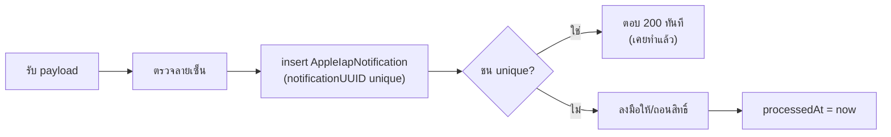

# API: In-App Purchase (iOS) — feature 00064

> สถานะ 2026-09-05 — ✅ = เขียนแล้วมีเทสคุม · ⏳ = รอของจาก App Store Connect
>
> | endpoint | สถานะ |
> |---|---|
> | `POST /api/iap/apple/verify` | ✅ เขียนแล้ว |
> | `POST /api/webhooks/apple-iap` | ✅ เขียนแล้ว |
> | `GET /api/cron/apple-iap-reconcile` | ⏳ รอ `.p8` (ครึ่งที่ลองใหม่ทำได้ ครึ่งที่ยิง App Store API ยังไม่ได้) |
>
> 🛑 **URL ที่ต้องกรอกใน App Store Connect คือ `/api/webhooks/apple-iap`**
> (เดิมเอกสารนี้เขียนว่า `/api/iap/apple/notifications` — เปลี่ยนเพราะ `proxy.ts`
> ยกเว้น CSRF Origin-check ให้ `/api/webhooks/*` อยู่แล้ว ⇒ ไม่ต้องแก้ proxy
> วางผิดที่ = Apple ยิงมาแล้วโดน 403 ทุกใบโดยที่เราไม่รู้เลย)

---

## 1. `POST /api/iap/apple/verify`

ยืนยันการซื้อจากเครื่องผู้ใช้ แล้วเปิดสิทธิ์

| | |
|---|---|
| ผู้เรียก | **หน้าเว็บใน WebView** (ไม่ใช่ native — native ไม่มี cookie ดู SDS §1.1) |
| auth | session cookie ของผู้ขาย · `ownerId` derive จาก session เท่านั้น **ห้ามรับจาก body** |
| rate limit | ผ่าน `guardApi` ปกติ |

**Request**
```json
{ "signedTransaction": "<JWS>" }
```

**Response 200**
```json
{ "status": "ACTIVE", "tier": "GROWTH", "nextRenewalAt": "2026-10-04T00:00:00.000Z" }
```

| รหัส | เมื่อไร |
|---|---|
| 400 `INVALID_SIGNATURE` | ตรวจลายเซ็นไม่ผ่าน / ห่วงโซ่ใบรับรองไม่ถึง Apple Root |
| 400 `BUNDLE_MISMATCH` | `bundleId` ไม่ใช่ของเรา |
| 400 `ENVIRONMENT_MISMATCH` | ธุรกรรม Sandbox บน production |
| 409 `TRANSACTION_OWNED_BY_ANOTHER_ACCOUNT` | `originalTransactionId` ผูกกับ `ownerId` อื่นแล้ว (BR-IAP-04) |
| 409 `WALLET_SUBSCRIPTION_EXISTS` | มีใบที่จ่ายด้วยกระเป๋าเงินอยู่ (เคส Q-2 · ยังไม่ตัดสิน) |
| 401 | ไม่มี session |

🛑 **client ห้าม `finishTransaction` จนกว่าจะได้ 200** (FR-IAP-12)

---

## 2. `POST /api/webhooks/apple-iap`

webhook ของ App Store Server Notifications v2

| | |
|---|---|
| ผู้เรียก | **Apple** (server-to-server) |
| auth | **ไม่มี session** — ความน่าเชื่อถือมาจากลายเซ็นใน payload เท่านั้น |
| CSRF | อยู่ใต้ `/api/webhooks/` ซึ่ง `proxy.ts` ยกเว้น Origin-check ไว้แล้ว — **ไม่ต้องแก้ proxy** |

**Request** — `{ "signedPayload": "<JWS>" }`

**Response**

| รหัส | เมื่อไร | ทำไม |
|---|---|---|
| `200` | รับไว้ได้ (รวมกรณีประมวลผลไม่สำเร็จ) | Apple ยิงซ้ำเมื่อไม่ได้ 2xx · ตอบ 5xx เพราะ "ข้อมูลไม่ถูกใจ" = ยิงซ้ำไม่รู้จบโดยผลไม่มีวันเปลี่ยน ⇒ เก็บ `error` ไว้ในแถวให้ตัวเดินตรวจซ้ำตามเก็บ |
| `200 {duplicate:true}` | `notificationUUID` ซ้ำ | เคยรับแล้ว ห้ามทำงานซ้ำ |
| `401` | ลายเซ็นไม่ผ่าน | ไม่ได้มาจาก Apple — **ห้ามตอบ 200** เพราะเท่ากับบอกคนยิงมั่วว่า endpoint นี้รับของ |
| `503` | เขียนฐานไม่ได้ | เคสเดียวที่การยิงซ้ำช่วยได้จริง |

### 2.1 ลำดับที่ห้ามสลับ



🛑 **insert ก่อนลงมือเสมอ** — insert ทีหลัง = การยิงซ้ำที่มาถึงระหว่างรอบแรกยังทำงานอยู่
จะลอดเข้าไปทำซ้ำได้ (บทเรียน 00038 Critical #3)

🛑 **ตอบ 200 แม้ประมวลผลไม่สำเร็จ** แต่ต้องเขียน `error` ไว้ — ถ้าตอบ 5xx Apple จะยิงซ้ำ
ซึ่งไม่ช่วยถ้าสาเหตุอยู่ที่ข้อมูล และตัวเดินตรวจซ้ำจะเก็บให้อยู่แล้ว

### 2.2 ชนิดที่รองรับ

| notificationType | ทำอะไร |
|---|---|
| `SUBSCRIBED` · `DID_RENEW` | ตั้ง `nextRenewalAt` = `expiresDate` ของ Apple · status `ACTIVE` |
| `EXPIRED` | หมดสิทธิ์ → ล็อกร้านตามกติกา 00008 |
| `DID_FAIL_TO_RENEW` | subtype `GRACE_PERIOD` → ยังใช้ได้ · หมด grace → `LOCKED_RENEWAL_FAILED` |
| `REFUND` | ถอนสิทธิ์ทันที + ล็อกร้าน |
| `DID_CHANGE_RENEWAL_STATUS` | บันทึกอย่างเดียว (ยกเลิกอัตโนมัติ ≠ หมดสิทธิ์ทันที) |
| `TEST` | บันทึกอย่างเดียว ไม่แตะสิทธิ์ |
| อื่น ๆ | บันทึกไว้ · `processedAt` = now · ไม่แตะสิทธิ์ |

---

## 3. `GET /api/cron/apple-iap-reconcile`

ตัวเดินตรวจซ้ำ (BR-IAP-15) — **ตาข่ายชั้นสอง ไม่ใช่ของเสริม**

| | |
|---|---|
| ความถี่ | วันละครั้ง |
| ทำอะไร | (1) ใบ `AppleIapNotification` ที่ `processedAt IS NULL` → ลองใหม่ · (2) ใบ `source='APPLE_IAP'` ที่ `ACTIVE` → เทียบสถานะกับ App Store Server API |
| auth | header ของ cron ตามแพตเทิร์น cron อื่นในโปรเจกต์ |

🛑 **เหตุผลที่ต้องมี:** webhook หายได้ (Apple ยิงตอนเราล่ม/ตอบช้า/deploy อยู่)
พึ่ง webhook อย่างเดียว = วันหนึ่งจะมีคนใช้ฟรีตลอดไปโดยไม่มีใครรู้

---

## 4. สะพานคุยกับ native (ไม่ใช่ HTTP)

ผ่าน `window.ReactNativeWebView.postMessage` — allow-list ตาม `type` เท่านั้น
(`onMessage` รับข้อความจากทุกหน้าที่ WebView โหลด รวมหน้า OAuth ของ Meta/LINE)

| `type` | ทิศทาง | payload |
|---|---|---|
| `deep:iap-products` | เว็บ → native | `{ productIds: string[] }` |
| `deep:iap-products-result` | native → เว็บ | ราคาที่ StoreKit คืนมา |
| `deep:iap-buy` | เว็บ → native | `{ productId }` |
| `deep:iap-transaction` | native → เว็บ | `{ signedTransaction }` |
| `deep:iap-finish` | เว็บ → native | `{ transactionId }` — **หลัง server ตอบ 200 เท่านั้น** |
| `deep:iap-restore` | เว็บ → native | กู้คืนการซื้อ |

---

## 5. endpoint เดิมที่พฤติกรรมเปลี่ยน

| endpoint | เปลี่ยนอะไร |
|---|---|
| `POST /api/business/subscribe` | เขียน `source='WALLET'` ตรง ๆ · พฤติกรรมภายนอกเหมือนเดิม |
| `POST /api/business/upgrade` · `downgrade` · `cancel` · `reactivate` | ใบของ Apple → **409 `MANAGED_BY_APPLE`** (ต้องจัดการผ่าน Apple) |
| `GET /api/cron/business-package-lifecycle` | กรอง `source='WALLET'` — ใบของ Apple ไม่ถูกแตะเลย |
| `GET /api/shops/current/shortcuts` (+ pin/unpin/reset) | รับข้อจำกัดเปลือกแอป ⇒ ในแอปไม่มี "แพ็กเกจ"/"จัดการสต็อก" ให้ปักหมุด |

🛑 4 endpoint กลางยัง **ไม่มี UI ที่ส่ง 409 นี้ให้ผู้ใช้เห็นเป็นข้อความ** — อยู่ในรายการค้าง
