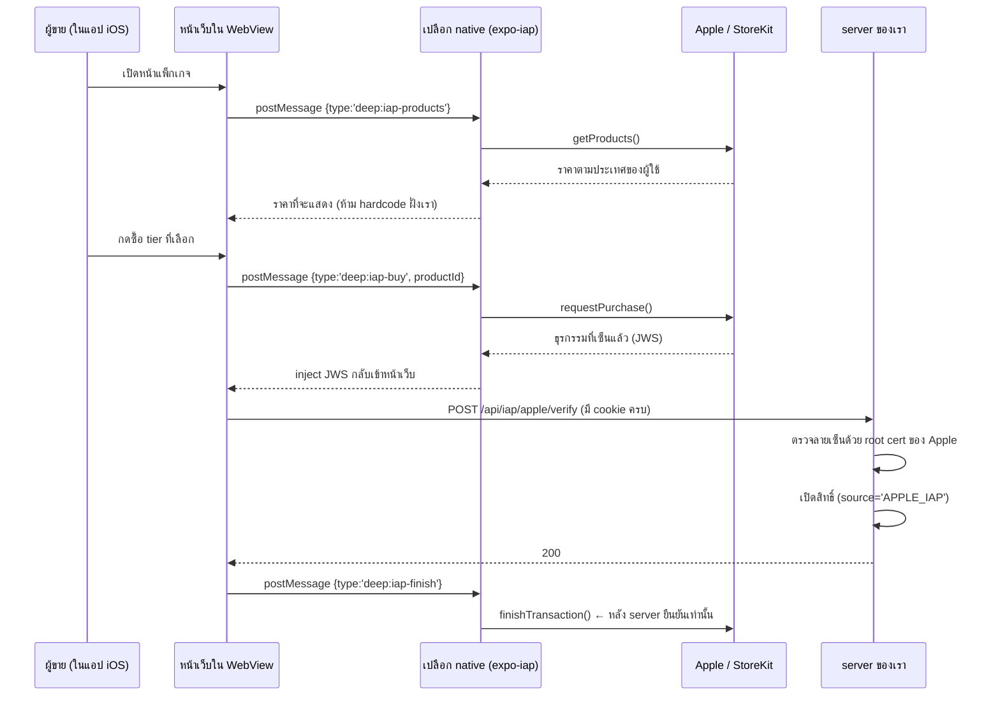
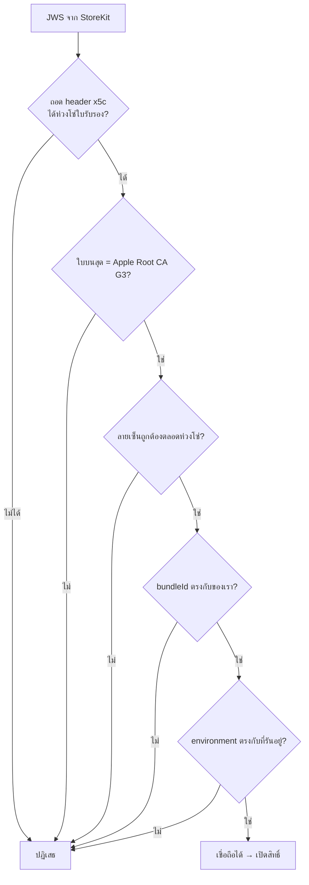
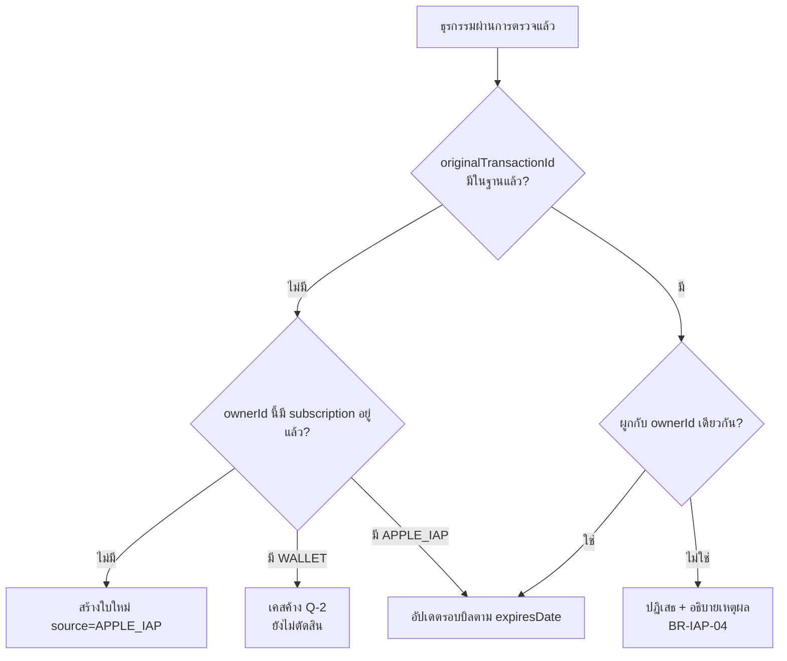
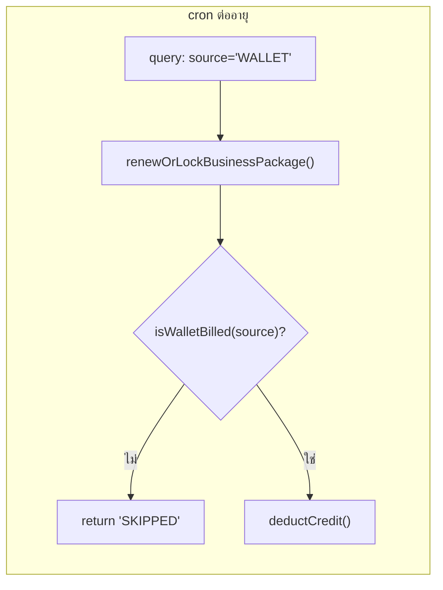

# SDS: In-App Purchase (iOS) — feature 00064

---

## 1. ภาพรวมการไหล

### 1.1 🛑 ทำไม native ไม่ยิง API เอง

ผู้ขายล็อกอินในเว็บ — session อยู่ในรูป cookie ของ WebView ฝั่ง native ไม่มี cookie/Bearer
ยิงเองจะได้ 401 เสมอ · การ inject ให้หน้าเว็บ `fetch` เองแปลว่า request วิ่งออกจาก origin
ของเว็บพร้อม cookie ครบ และมี `Origin` header ถูกต้อง ผ่าน CSRF check ของ `proxy.ts`
**แพตเทิร์นเดียวกับ push token ที่ใช้อยู่แล้ว** (`buildPushScript`)

### 1.2 🛑 ลำดับ finishTransaction

`finishTransaction` ต้องเกิด **หลัง** server ตอบ 200 เท่านั้น (FR-IAP-12)
ธุรกรรมที่ยังไม่ finish จะถูก StoreKit ส่งกลับมาใหม่ทุกครั้งที่เปิดแอป = กลไกกู้คืนในตัว
สำหรับเคส "จ่ายเงินแล้วแต่ server ล่ม"

---

## 2. โครงไฟล์

| ไฟล์ | สถานะ | หน้าที่ |
|---|---|---|
| `src/lib/subscription-source.ts` | ✅ **เสร็จ** | SSOT ของ "ใครเก็บเงินใบนี้" + fail-closed |
| `src/services/business-package.service.ts` | ✅ **เสร็จ** | ด่าน `assertWalletBilled` 6 จุด |
| `src/app/api/cron/business-package-lifecycle/route.ts` | ✅ **เสร็จ** | กรอง `source` ใน query |
| `src/lib/app-shell.ts` | ✅ **เสร็จ** | `isPaidFeatureRestricted` (กฎข้อที่ 3) |
| `src/lib/seller-menu.ts` · `seller-menu-server.ts` | ✅ **เสร็จ** | ซ่อน Deep Stock ในแอป |
| `src/services/shortcut.service.ts` | ✅ **เสร็จ** | ปิดรูแคตตาล็อกทางลัด |
| `src/lib/apple/jws.ts` | ✅ **เสร็จ** | ตรวจลายเซ็น JWS ออฟไลน์ + ปักหมุดใบรากของ Apple |
| `src/lib/apple/root-ca.ts` | ✅ **เสร็จ** | Apple Root CA G3 (ดาวน์โหลดจาก Apple) + ลายนิ้วมือปักหมุด |
| `src/lib/apple/product-ids.ts` | ✅ **เสร็จ** | รหัสสินค้า ↔ tier (fail-closed) |
| `src/lib/apple/transaction.ts` | ✅ **เสร็จ** | ตรวจ bundleId/Family Sharing/expiry แล้วสกัดข้อเท็จจริง |
| `src/lib/apple/entitlement.ts` | ✅ **เสร็จ** | ช่วงผ่อนผัน (BR-IAP-14) + ตัดสิน "ยังใช้ได้ไหม" |
| `src/services/apple-iap.service.ts` | ✅ **เสร็จ** | เปิด/ถอนสิทธิ์จากธุรกรรมที่ตรวจแล้ว · ช่วงผ่อนผันผ่าน `isEntitlementActive` |
| `src/app/api/iap/apple/verify/route.ts` | ✅ **เสร็จ** | รับ JWS จากหน้าเว็บ (มี session) |
| `src/app/api/webhooks/apple-iap/route.ts` | ✅ **เสร็จ** | webhook v2 — วางใต้ `/api/webhooks/` เพื่อใช้การยกเว้น CSRF ที่มีอยู่ · verify `signedRenewalInfo` แยกอีกก้อน |
| `src/app/api/cron/apple-iap-reconcile/route.ts` | ⏳ รอ .p8 | ตัวเดินตรวจซ้ำ (BR-IAP-15) |

---

## 3. การตรวจลายเซ็น (ออกแบบไว้ ยังไม่ implement)

🛑 **ตรวจแบบ offline** — ไม่ยิง network ต่อการยืนยันหนึ่งครั้ง (NFR-IAP-4)
Apple Root CA ฝังไว้ในโค้ด ไม่ดึงสด

---

## 4. การจับคู่ธุรกรรมกับบัญชี

🛑 กิ่ง **F** ต้องบอกเหตุผลกับผู้ใช้ ไม่ใช่เงียบ — Apple ID เดียวเปิดสิทธิ์ให้หลายบัญชี Deep ไม่ได้

---

## 5. ด่านความปลอดภัยที่วางแล้ว (เฟส 1)

**2 ชั้นโดยตั้งใจ** — ชั้น query ไว้ประสิทธิภาพ · ชั้นในฟังก์ชันไว้ความถูกต้อง
เพราะฟังก์ชัน export ออกไปและมีผู้เรียกรายอื่นได้

### 5.1 พิสูจน์แล้วด้วย mutation 14 แบบ

| กลุ่ม | จำนวน | ผล |
|---|---|---|
| ด่านกันเก็บเงินซ้ำ | 9 | 🔴 แดงครบ |
| ด่านซ่อน Deep Stock | 5 | 🔴 แดงครบ |

---

## 6. สิ่งที่ตัดสินใจไว้แล้วและห้ามเปลี่ยนโดยไม่อ่านเหตุผล

| # | การตัดสินใจ | เหตุผลย่อ |
|---|---|---|
| SDS-1 | กฎเปลือกแอป **3 ตัวแยกกัน** | ตอบคนละคำถาม · จะถูกผ่อนคนละเวลา · ยุบแล้วผ่อนทีเดียวจะเปิดหมด |
| SDS-2 | `source` เป็น `String` ไม่ใช่ enum | เพิ่ม Google Play ทีหลังไม่ต้อง `ALTER TYPE` บนฐาน prod |
| SDS-3 | ไม่เพิ่ม `source` ให้ `InventoryEntitlement` | ไม่มีแหล่งที่มาที่สอง · คอลัมน์ที่ไม่มีใครใช้แย่กว่าไม่มี |
| SDS-4 | ส่งข้อจำกัดเปลือกแอปเป็น **parameter** ไม่ถามเองในฟังก์ชัน | ให้ service ยัง test ได้โดยไม่ผูกกับ request — และมีเทสสแกนบังคับว่าต้องส่งจริง |
| SDS-5 | ไม่แตะผู้ใช้เดิม (D-3) | Apple ห้าม "ขาย" ในแอป ไม่ได้ห้าม "ให้สิทธิ์ที่ซื้อมาก่อนทำงานต่อ" |
