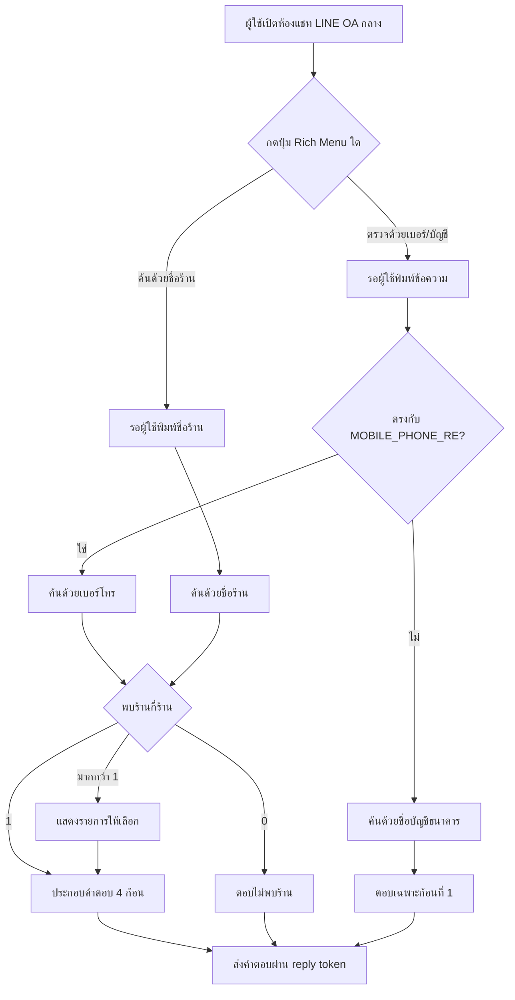
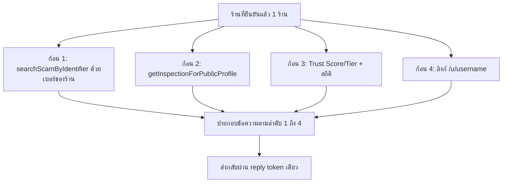
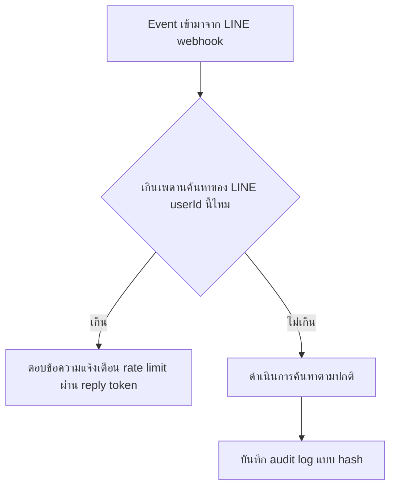

> **โมดูล:** M64-LineStatusBot
> **ประเภทเอกสาร:** Business Requirements Document (BRD) - NON-TECHNICAL
> **เวอร์ชัน:** 1.0
> **วันที่จัดทำ:** 2026-09-05
> **สถานะ:** Draft
> **เจ้าของเอกสาร:** BA (ดู [[Feature-Docs-Ownership]])

# BRD: บอทเช็คสถานะร้านค้าใน LINE (LINE Shop Status Bot) (Business Requirements Document)

---

## 1. บทนำ

### 1.1 วัตถุประสงค์ของเอกสาร

เอกสารนี้มีวัตถุประสงค์เพื่อ:
1. อธิบายความต้องการทางธุรกิจของบอท LINE ที่ตอบคำถาม "ร้านนี้สถานะเป็นอย่างไร" ผ่าน LINE Official Account กลางของแพลตฟอร์ม Deep
2. กำหนดขอบเขตของการค้นหา 2 ทาง (เบอร์โทร/ชื่อบัญชีธนาคาร และ ชื่อร้าน) และกติกาตายตัวที่ใช้แยกประเภทอินพุตโดยไม่ใช้ AI
3. อธิบายเงื่อนไขที่ทำให้การค้นหาแบบย้อนกลับ (reverse lookup) ไม่กลายเป็นเครื่องมือละเมิดความเป็นส่วนตัวหรือถูกใช้ผิดวัตถุประสงค์
4. สร้างความเข้าใจร่วมกันระหว่างทีมธุรกิจและทีมพัฒนาว่าถ้อยคำใดบังคับใช้ในทุกคำตอบ และอะไรคือขอบเขตที่ฟีเจอร์นี้ตอบไม่ได้

### 1.2 ขอบเขตของระบบ

**บอทเช็คสถานะร้านค้าใน LINE** คือบริการถาม-ตอบผ่าน LINE Official Account กลางของแพลตฟอร์ม Deep (ไม่ใช่ OA ของร้านใดร้านหนึ่ง) ที่รับอินพุตจากผู้ใช้ 2 ทาง แล้วตอบกลับข้อมูลความน่าเชื่อถือของร้านที่ตรงกันบน Deep เป็น 4 ก้อนเสมอเมื่อยืนยันร้านได้ 1 ร้าน

**เข้าสู่ระบบ (Input):**
- ข้อความที่ผู้ใช้พิมพ์เข้ามาหลังกดปุ่ม Rich Menu: เบอร์โทร / ชื่อบัญชีธนาคาร (ทางเข้า ก) หรือ ชื่อร้าน (ทางเข้า ข)
- การเลือกร้านจากรายการ (เมื่อพบมากกว่า 1 ร้าน)

**ออกจากระบบ (Output):**
- คำตอบ 4 ก้อน (สัญญาณอันตราย / ผลตรวจ 00060 / Trust Score+สถิติร้าน / ลิงก์โปรไฟล์สาธารณะ) เมื่อยืนยันร้านได้
- คำตอบเฉพาะก้อนที่ 1 เมื่อค้นด้วยชื่อบัญชีธนาคาร หรือเมื่อค้นด้วยเบอร์โทรแล้วไม่พบร้านบน Deep
- ข้อความ "ไม่พบร้านบน Deep" เมื่อค้นด้วยชื่อร้านแล้วไม่พบผลใด
- รายการร้านให้เลือก เมื่อพบมากกว่า 1 ร้าน
- ข้อความแจ้งเตือนเมื่อเกินเพดานการค้นหา

**ระบบที่เกี่ยวข้อง:**
- ฐานมิจฉาชีพ / `/check` (`scam-report.service.ts`)
- แผนการตรวจสอบต่อเนื่อง `00060` (`inspection-public.service.ts`)
- Trust Score / Trust Tier (`Tier Lists.md`)
- โปรไฟล์สาธารณะ `/u/[username]`
- ระบบ LINE Messaging API (ช่องทางใหม่ระดับแพลตฟอร์ม แยกจากระบบ LINE รายร้าน `00025`/`00045`)

### 1.3 กลุ่มผู้ใช้งาน

| กลุ่มผู้ใช้ | บทบาท | สิทธิ์การใช้งาน |
|-----------|--------|----------------|
| **ผู้ซื้อทั่วไป (ไม่ต้องมีบัญชี Deep)** | ผู้ถามคำถามผ่าน LINE OA กลาง | พิมพ์ค้นหาได้ 2 ทาง, เลือกร้านจากรายการ, กดลิงก์ไปโปรไฟล์สาธารณะ — ไม่มีสิทธิ์อื่นเพิ่มเติม |
| **ร้านค้าบน Deep (เจ้าของข้อมูลที่ถูกค้น)** | เจ้าของข้อมูลที่แสดงผล | ไม่มีสิทธิ์ปิดกั้น/แก้ไขผลลัพธ์ของบอทนี้ — ข้อมูลที่แสดงเป็นข้อมูลสาธารณะอยู่แล้วที่ `/u/[username]` |
| **ทีมปฏิบัติการ Deep (Ops)** | ผู้ดูแล OA กลางและเฝ้าระวังการใช้งานผิดวัตถุประสงค์ | เข้าถึง audit log แบบ hash (ไม่ใช่คำค้นดิบ), ปรับเพดานการค้นหา, จัดการบัญชี LINE OA กลาง |
| **ทีมพัฒนา** | ผู้ดูแล service layer ที่บอทเรียกใช้ | ต้องเรียกผ่านฟังก์ชันเดิมของ 00060/scam-report/Trust Tier เท่านั้น ห้าม derive กฎใหม่ |

---

## 2. ความต้องการหลัก (Functional Requirements)

### 2.1 บัญชี LINE OA กลางและ Rich Menu แนะนำการใช้งาน

#### FR-LINE-001: บัญชี LINE OA กลางแยกจากบัญชีของร้าน

**User Story:**
> ในฐานะทีมธุรกิจ Deep ฉันต้องการให้บอทตรวจสอบสถานะร้านทำงานบนบัญชี LINE OA ของแพลตฟอร์มเอง ไม่ใช่บัญชีของร้านใดร้านหนึ่ง เพื่อให้ผู้ซื้อเชื่อได้ว่าคำตอบมาจาก Deep ไม่ใช่จากร้านที่กำลังถูกตรวจสอบเอง

**Acceptance Criteria:**
- [ ] AC-LINE-01-1: ระบบใช้ LINE Official Account เดียวของแพลตฟอร์ม Deep (channel access token/secret แยกต่างหาก ไม่ใช้ค่าเดียวกับ `ShopChannel` ของร้านใดในฟีเจอร์ 00025)
- [ ] AC-LINE-01-2: Webhook ของบอทนี้เป็น endpoint แยกจาก `/api/channels/line/webhook` ที่ใช้กับร้าน
- [ ] AC-LINE-01-3: ชื่อบัญชี/รูปโปรไฟล์ของ OA กลางต้องใช้ชื่อ "Deep" ตามหลักการตั้งชื่อแบรนด์ (ไม่ใช่ "SafePay")

#### FR-LINE-002: Rich Menu กลางแนะนำ 2 ทางเข้า

**User Story:**
> ในฐานะผู้ซื้อที่เปิดห้องแชทกับ OA ของ Deep ครั้งแรก ฉันต้องการเห็นปุ่มที่บอกวิธีใช้งานทันทีโดยไม่ต้องพิมพ์อะไรเอง เพื่อให้เริ่มใช้งานได้เร็ว

**Acceptance Criteria:**
- [ ] AC-LINE-02-1: Rich Menu ของ OA กลางมีอย่างน้อย 2 ปุ่ม: (1) "ตรวจด้วยเบอร์/บัญชี" (2) "ค้นด้วยชื่อร้าน" ตรงกับ 2 ทางเข้าที่กำหนด
- [ ] AC-LINE-02-2: การกดปุ่มใดปุ่มหนึ่งสร้าง event (`postback` หรือ `message`) ที่ให้ระบบได้รับ reply token ใหม่ทันที
- [ ] AC-LINE-02-3: ขนาดรูป/ความยาว `chatBarText`/เพดานจำนวนช่องของ Rich Menu ต้องเป็นไปตามข้อจำกัดจริงของ LINE Messaging API เดียวกับที่ยืนยันไว้แล้วในฟีเจอร์ 00045 ไม่ใช่ค่าที่เดาใหม่

---

### 2.2 การตีความอินพุตด้วยกติกาตายตัว (ไม่ใช้ AI)

#### FR-LINE-003: แยกประเภทอินพุตของทางเข้า (ก) ด้วยกติกาเบอร์มือถือไทย

**User Story:**
> ในฐานะผู้ใช้ที่กดปุ่ม "ตรวจด้วยเบอร์/บัญชี" แล้วพิมพ์ข้อความเข้ามา ฉันต้องการให้ระบบรู้เองว่าฉันพิมพ์เบอร์โทรหรือชื่อบัญชี โดยไม่ต้องเลือกประเภทซ้ำอีกขั้น

**Acceptance Criteria:**
- [ ] AC-LINE-03-1: ระบบตัดอักขระที่ไม่ใช่ตัวเลขออกจากข้อความที่พิมพ์ แล้วทดสอบกับ `MOBILE_PHONE_RE` (`^0[689][0-9]{8}$`) จาก `src/lib/phone.ts` — ผ่าน = เบอร์โทร, ไม่ผ่าน = ชื่อบัญชีธนาคาร
- [ ] AC-LINE-03-2: กติกาการแยกประเภทนี้เป็น deterministic ล้วน ไม่มีการเรียกโมเดลภาษา/AI ใด ๆ
- [ ] AC-LINE-03-3: ห้ามสร้างกติกาการตัดสิน "เบอร์โทร" ขึ้นใหม่ในฟีเจอร์นี้ — ต้อง import ค่าคงที่จาก `src/lib/phone.ts` เท่านั้น (Hard Rule 16)

#### FR-LINE-004: ค้นด้วยเบอร์โทร (reverse lookup แบบยืนยันได้)

**User Story:**
> ในฐานะผู้ซื้อที่มีเบอร์โทรจากสลิป/QR การโอนเงิน ฉันต้องการพิมพ์เบอร์นั้นแล้วรู้ทันทีว่าเบอร์นี้ผูกกับร้านใดบน Deep หรือไม่ ก่อนที่ฉันจะโอนเงิน

**Acceptance Criteria:**
- [ ] AC-LINE-04-1: ระบบค้นหา `User` ที่ `phone` ตรงกับค่าที่พิมพ์แบบ exact match (ไม่ fuzzy) และ `isShop = true`
- [ ] AC-LINE-04-2: พบผู้ใช้ที่ตรงกัน → ดึงร้าน (`Shop`) ทั้งหมดของผู้ใช้นั้นที่ `deletedAt IS NULL` — มากกว่า 1 ร้าน เข้าสู่ FR-LINE-007
- [ ] AC-LINE-04-3: ไม่ว่าจะพบร้านหรือไม่ ต้องรันก้อนที่ 1 ด้วยเบอร์ที่พิมพ์เข้ามาเสมอ (`searchScamByIdentifier('PHONE', value)`) โดยไม่รอผลการจับคู่ร้าน

#### FR-LINE-005: ค้นด้วยชื่อบัญชีธนาคาร (ตรวจสัญญาณอันตรายเท่านั้น)

**User Story:**
> ในฐานะผู้ซื้อที่มีเฉพาะชื่อบัญชีธนาคารจากสลิปโอนเงิน ฉันต้องการรู้อย่างน้อยว่าชื่อนี้เคยถูกรายงานเป็นมิจฉาชีพหรือไม่ ก่อนโอนเงิน

**Acceptance Criteria:**
- [ ] AC-LINE-05-1: ระบบรัน `searchScamByIdentifier('NAME', value)` ด้วยข้อความที่พิมพ์เข้ามาตรง ๆ เพื่อแสดงก้อนที่ 1 เสมอ
- [ ] AC-LINE-05-2: ทางเข้านี้ **ไม่พยายามจับคู่กับร้านบน Deep โดยอัตโนมัติ** (ไม่รันก้อนที่ 2-4) เพราะไม่มีฟิลด์ชื่อบัญชีธนาคารที่ยืนยันแล้วให้จับคู่แม่นยำ (ดู OQ-1 ใน PRD)
- [ ] AC-LINE-05-3: คำตอบต้องแนะนำให้ค้นซ้ำด้วย "ชื่อร้าน" หรือ "เบอร์โทร" หากต้องการเห็นข้อมูลร้านบน Deep

#### FR-LINE-006: ค้นด้วยชื่อร้าน (fuzzy match)

**User Story:**
> ในฐานะผู้ซื้อที่เห็นชื่อร้านจากโพสต์ขายของ ฉันต้องการพิมพ์ชื่อร้านแล้วดูว่าร้านนี้มีอยู่จริงบน Deep และมีข้อมูลความน่าเชื่อถืออะไรบ้าง

**Acceptance Criteria:**
- [ ] AC-LINE-06-1: ระบบค้นหาร้านด้วยเงื่อนไขเดียวกับที่ใช้อยู่แล้วใน `shop.service.ts` (`shopName`/`displayName` ของเจ้าของ `contains` คำค้น แบบ case-insensitive, กรอง `deletedAt: null`/`purgedAt: null`)
- [ ] AC-LINE-06-2: พบ 1 ร้านพอดี → แสดงคำตอบ 4 ก้อนทันที (ก้อนที่ 1 คำนวณจากเบอร์ของร้านนั้น)
- [ ] AC-LINE-06-3: พบมากกว่า 1 ร้าน → เข้าสู่ FR-LINE-007
- [ ] AC-LINE-06-4: ทำงานได้ครบโดยไม่ต้องรอ `00061 — ไดเรกทอรีร้านค้า` ขึ้นระบบ เพราะ query เป็น service-layer function ที่มีอยู่แล้ว ไม่ใช่หน้าเว็บของ 00061

---

### 2.3 การจับคู่ร้าน: หลายร้าน / ไม่พบร้านเลย

#### FR-LINE-007: รายการให้เลือกเมื่อพบมากกว่า 1 ร้าน

**User Story:**
> ในฐานะผู้ซื้อที่ค้นแล้วเจอร้านชื่อคล้ายกันหลายร้าน ฉันต้องการเห็นรายการทั้งหมดแล้วเลือกร้านที่ใช่ด้วยตัวเอง แทนที่บอทจะเดาให้

**Acceptance Criteria:**
- [ ] AC-LINE-07-1: พบร้านมากกว่า 1 ร้าน (ไม่ว่าจากคำค้นชื่อคล้ายกัน หรือผู้ใช้ 1 คนเปิดหลายร้าน) ต้องแสดงรายการให้เลือก **ห้ามเลือกอัตโนมัติในทุกกรณี** แม้กรณีเบอร์โทรที่ unique ระดับบัญชีผู้ใช้
- [ ] AC-LINE-07-2: แต่ละรายการต้องมีข้อมูลแยกแยะอย่างน้อย: ชื่อร้าน, username (`@handle`), ป้ายยืนยันตัวตนที่มีอยู่แล้ว (ถ้ามี) — กดเลือกได้โดยตรงไม่ต้องพิมพ์ใหม่
- [ ] AC-LINE-07-3: จำนวนร้านในรายการมีเพดานสูงสุด (ค่าเริ่มต้น 5 รายการ — ยังไม่เคาะตัวเลขสุดท้าย) เกินเพดานตอบว่าคำค้นกว้างเกินไป พร้อมแนะนำให้พิมพ์เจาะจงขึ้น แทนที่จะตัดรายการออกอย่างไม่มีคำอธิบาย
- [ ] AC-LINE-07-4: หลังเลือกร้านแล้ว แสดงคำตอบ 4 ก้อนของร้านที่เลือกตามปกติ

#### FR-LINE-008: ไม่พบร้านบน Deep ที่ตรงกับคำค้น

**User Story:**
> ในฐานะผู้ซื้อที่ค้นด้วยเบอร์หรือชื่อร้านที่ไม่มีอยู่บน Deep ฉันต้องการรู้ตรง ๆ ว่าระบบตรวจสอบร้านนี้ไม่ได้ แทนที่จะได้คำตอบที่ทำให้เข้าใจผิด

**Acceptance Criteria:**
- [ ] AC-LINE-08-1: ค้นด้วยเบอร์โทรแล้วไม่พบผู้ใช้ `isShop=true` ตรงกัน → ยังคงแสดงก้อนที่ 1 (ตาม AC-LINE-04-3) แต่แทนที่ก้อนที่ 2-4 ด้วยข้อความ "ไม่พบร้าน" ตาม §4.3 ของ PRD
- [ ] AC-LINE-08-2: ค้นด้วยชื่อร้านแล้วไม่พบร้านใดตรงกันเลย → ตอบข้อความ "ไม่พบร้าน" เดียวกัน (ไม่มีก้อนที่ 1 เพราะไม่มีเบอร์ให้ตรวจ — ข้อจำกัดของทางเข้านี้ ไม่ใช่บั๊ก)
- [ ] AC-LINE-08-3: ข้อความ "ไม่พบร้าน" ต้องไม่ใช้คำ/สีที่สื่ออันตราย และต้องไม่ใช้คำที่สื่อว่าปลอดภัยเช่นกัน

---

### 2.4 คำตอบ 4 ก้อน

#### FR-LINE-009: ก้อนที่ 1 — สัญญาณอันตราย

**User Story:**
> ในฐานะผู้ซื้อ ฉันต้องการเห็นคำเตือนความเสี่ยงจากฐานมิจฉาชีพเป็นอันดับแรกเสมอ ไม่ว่าร้านจะจ่ายเงินให้แผนการตรวจสอบของ Deep หรือไม่

**Acceptance Criteria:**
- [ ] AC-LINE-09-1: อ่านผลจาก `searchScamByIdentifier()` ที่มีอยู่แล้วเท่านั้น ห้ามคำนวณสัญญาณอันตรายซ้ำด้วยตรรกะใหม่
- [ ] AC-LINE-09-2: แสดงเสมอไม่ขึ้นกับว่าร้านที่พบ (ถ้ามี) สมัครแผน 00060 หรือจ่ายเงินให้ฟีเจอร์ใดของ Deep หรือไม่ (สอดคล้อง AC-INS-21-1)
- [ ] AC-LINE-09-3: พบผลรายงาน (`found=true`) ต้องแสดงจำนวนครั้ง มูลค่าความเสียหายรวม วันที่รายงานล่าสุด ตามที่ `ScamSearchResult` คืนมา ไม่เพิ่มไม่ลด
- [ ] AC-LINE-09-4: ไม่พบผลรายงาน (`found=false`) ต้องใช้ถ้อยคำตาม §4.3 ของ PRD (ห้ามอ่านว่าปลอดภัย)

#### FR-LINE-010: ก้อนที่ 2 — ผลตรวจ 00060

**User Story:**
> ในฐานะผู้ซื้อที่กำลังพิจารณาจองที่พัก ฉันต้องการรู้ว่าร้านนี้ผ่านการตรวจสอบเพิ่มเติมจาก Deep ในระดับใดบ้าง

**Acceptance Criteria:**
- [ ] AC-LINE-10-1: เรียกผ่าน `getInspectionForPublicProfile(shopId, now)` ที่มีอยู่แล้วเท่านั้น ห้าม query ตาราง `InspectionResult`/`InspectionPlan` เองใหม่
- [ ] AC-LINE-10-2: ร้านที่ไม่ใช่ LODGING หรือไม่มีแผนเลย (`plan === null`) ต้องใช้ถ้อยคำที่แยก "ไม่รองรับประเภทร้านนี้" กับ "ยังไม่ได้สมัครแผน" อย่างชัดเจน
- [ ] AC-LINE-10-3: สถานะรายข้อ (ผ่าน/รอตรวจซ้ำ/ยังไม่มีข้อมูล/ไม่เกี่ยวกับร้านประเภทนี้) ต้องตรงกับที่ 00060 กำหนดทุกคำ ห้ามยุบรวมเป็นผ่าน/ไม่ผ่าน
- [ ] AC-LINE-10-4: ห้ามแสดงคำว่า "ไม่ผ่าน" หรือคำพ้องเชิงลงโทษสำหรับข้อตรวจที่ตก (สืบทอด AC-INS-18-2)

#### FR-LINE-011: ก้อนที่ 3 — Trust Score/Tier + สถิติร้าน

**User Story:**
> ในฐานะผู้ซื้อ ฉันต้องการเห็นระดับความน่าเชื่อถือสะสมของร้านบน Deep แยกจากผลตรวจ 00060

**Acceptance Criteria:**
- [ ] AC-LINE-11-1: ใช้ mapping เดียวกับ `Tier Lists.md` (`getTrustLevel`, ชื่อ tier มี prefix "Deep") ห้ามตั้ง mapping/ชื่อใหม่
- [ ] AC-LINE-11-2: แสดง completion rate/avg rating ตามเงื่อนไขเดิมของหน้าโปรไฟล์สาธารณะ (เช่น completion rate เป็น null เมื่อออเดอร์จบไม่ถึง 3 รายการ) ไม่ปัดเป็น 0% หรือค่าอื่นที่ทำให้เข้าใจผิด
- [ ] AC-LINE-11-3: ต้องแยกบล็อกและคำจากก้อนที่ 2 อย่างชัดเจนเสมอ ห้ามผสมข้อความจนดูเหมือนเป็นคะแนนเดียวกัน (สอดคล้อง 00060 §4.1)

#### FR-LINE-012: ก้อนที่ 4 — ลิงก์โปรไฟล์สาธารณะ

**User Story:**
> ในฐานะผู้ซื้อ ฉันต้องการกดลิงก์ไปดูรายละเอียดร้านเต็ม ๆ ต่อจากคำตอบสั้น ๆ ในแชท LINE

**Acceptance Criteria:**
- [ ] AC-LINE-12-1: เป็น URL เต็มไปยัง `/u/[username]` ของร้านที่พบ (ใช้ได้กับทุกร้านไม่ขึ้นกับประเภทร้าน/Business Package)
- [ ] AC-LINE-12-2: ลิงก์เป็นโดเมน prod จริง (`deepthailand.app`) ไม่ใช่ dev/localhost
- [ ] AC-LINE-12-3: ไม่แสดงเมื่อไม่พบร้านบน Deep (ตาม FR-LINE-008)

#### FR-LINE-013: ลำดับก้อนคงที่ + เหตุผลเมื่อก้อนใดแสดงไม่ได้

**User Story:**
> ในฐานะทีมธุรกิจ Deep ฉันต้องการให้ผู้ใช้เห็นสัญญาณอันตรายก่อนเสมอ ไม่ว่าจะมีข้อมูลก้อนอื่นครบหรือไม่

**Acceptance Criteria:**
- [ ] AC-LINE-13-1: ลำดับคงที่เสมอ: (1) สัญญาณอันตราย (2) ผลตรวจ 00060 (3) Trust Score/สถิติ (4) ลิงก์โปรไฟล์ — ห้ามสลับลำดับ
- [ ] AC-LINE-13-2: ก้อนที่ไม่มีข้อมูล (เช่นก้อน 2 ของร้านที่ไม่ใช่ LODGING) ต้องยังปรากฏพร้อมคำอธิบายตาม §4.3 ไม่ใช่หายไปเงียบ ๆ
- [ ] AC-LINE-13-3: แหล่งข้อมูลก้อนใดดึงไม่สำเร็จ (เช่น timeout) ต้องแสดง "ดึงข้อมูลไม่สำเร็จ ลองใหม่อีกครั้ง" แทนการข้ามหรือแสดงค่าว่างที่ดูเหมือนข้อมูลจริง

---

### 2.5 ถ้อยคำที่ต้องไม่ทำให้เข้าใจผิด

#### FR-LINE-014: ถ้อยคำ 3 สถานะของทุกก้อนข้อมูล

**User Story:**
> ในฐานะผู้ซื้อ ฉันต้องการแยกออกได้ชัดเจนระหว่าง "ตรวจแล้วไม่พบปัญหา", "ยังไม่เคยถูกตรวจ" และ "ไม่มีร้านนี้อยู่บน Deep เลย"

**Acceptance Criteria:**
- [ ] AC-LINE-14-1: ทุกก้อนต้องรองรับ 3 สถานะตามบริบท: มีข้อมูลครบ / มีข้อมูลบางส่วนหรือยังไม่มีข้อมูล / ไม่สามารถตรวจสอบได้เลย — ห้ามยุบสถานะกลางเข้ากับสถานะปลายด้านใดด้านหนึ่ง
- [ ] AC-LINE-14-2: ห้ามใช้ 0 หรือค่าว่างแทนความหมาย "ยังไม่มีข้อมูล" ในทุกก้อน
- [ ] AC-LINE-14-3: ถ้อยคำที่ใช้จริงต้องตรงกับตาราง §4.3 ของ PRD คำต่อคำ

#### FR-LINE-015: "ไม่พบในฐานมิจฉาชีพ" ≠ "ปลอดภัย"

**User Story:**
> ในฐานะทีมธุรกิจ ฉันต้องการป้องกันไม่ให้ผู้ซื้อเข้าใจผิดว่าร้านที่ไม่มีรายงานมิจฉาชีพคือร้านที่ปลอดภัย 100%

**Acceptance Criteria:**
- [ ] AC-LINE-15-1: ทุกครั้งที่ก้อนที่ 1 แสดง "ไม่พบ" ต้องมีประโยคกำกับ "ไม่ได้แปลว่าปลอดภัย" ต่อท้ายเสมอ ไม่มีข้อยกเว้น
- [ ] AC-LINE-15-2: ห้ามใช้ไอคอน/สี/คำที่สื่อการรับรองความปลอดภัยคู่กับผล "ไม่พบ"
- [ ] AC-LINE-15-3: กรณี "ไม่พบร้านบน Deep" ต้องมีประโยคเพิ่มว่า Deep ตรวจสอบเฉพาะร้านที่ลงทะเบียนในระบบเท่านั้น

#### FR-LINE-016: ผลตรวจ 00060 สะท้อน 5 สถานะเดิมเป๊ะ

**User Story:**
> ในฐานะทีมธุรกิจ ฉันต้องการให้บอทนี้ไม่ลดทอนความละเอียดของสถานะผลตรวจที่ 00060 ออกแบบไว้แล้ว

**Acceptance Criteria:**
- [ ] AC-LINE-16-1: ห้ามสร้างคำสรุป "ผ่าน N/M ข้อ" ที่นับ "รอตรวจซ้ำ"/"ยังไม่มีข้อมูล"/"ไม่เกี่ยวกับร้านประเภทนี้" รวมเป็นข้อที่ตก (สอดคล้อง AC-INS-11-3)
- [ ] AC-LINE-16-2: ร้านที่เคยอยู่ในแผนแล้วหยุดจ่ายเงิน (แถบเทาตาม FR-INS-019) ต้องแสดงสถานะนั้นตามจริงพร้อมวันที่ข้อมูลล่าสุด ไม่ซ่อนก้อนที่ 2 ไปเฉย ๆ
- [ ] AC-LINE-16-3: หลักฐานปิด (บัตรประชาชน เอกสารสิทธิ์ ฯลฯ) ต้องไม่ถูกส่งออกทาง LINE ไม่ว่ากรณีใด (สืบทอด AC-INS-17-1)

---

### 2.6 ความเป็นส่วนตัวและการป้องกันการใช้งานผิดวัตถุประสงค์

#### FR-LINE-017: ขอบเขตการเปิดเผยของ reverse lookup

**User Story:**
> ในฐานะทีมธุรกิจ ฉันต้องการจำกัดไม่ให้บอทนี้กลายเป็นเครื่องมือค้นหาตัวตนของบุคคลทั่วไปบน Deep

**Acceptance Criteria:**
- [ ] AC-LINE-17-1: จับคู่ได้เฉพาะบัญชีที่ `isShop=true` เท่านั้น — ห้ามเปิดเผยว่าเบอร์/ชื่อนั้นตรงกับบัญชีผู้ซื้อทั่วไป (isShop=false) หรือไม่ ไม่ว่ากรณีใด
- [ ] AC-LINE-17-2: ข้อมูลที่เปิดเผยในก้อนที่ 2-4 ต้องไม่เกินสิ่งที่ปรากฏอยู่แล้วบน `/u/[username]` ของร้านนั้น
- [ ] AC-LINE-17-3: ก้อนที่ 1 ไม่เปิดเผยชื่อผู้รายงานหรือรายละเอียดที่มากกว่าที่ `/check` เปิดเผยอยู่แล้ว

#### FR-LINE-018: เพดานการค้นหาต่อผู้ใช้

**User Story:**
> ในฐานะทีมปฏิบัติการ Deep ฉันต้องการจำกัดจำนวนครั้งที่ LINE user หนึ่งคนค้นหาได้ในช่วงเวลาหนึ่ง เพื่อป้องกันการไล่เก็บข้อมูลร้านจำนวนมาก

**Acceptance Criteria:**
- [ ] AC-LINE-18-1: จำกัดจำนวนครั้งค้นหาต่อ LINE userId ต่อหน้าต่างเวลา (ค่าเริ่มต้น 10 ครั้ง/ชั่วโมง — ยังไม่เคาะตัวเลขสุดท้าย)
- [ ] AC-LINE-18-2: เกินเพดาน → ตอบข้อความแจ้งว่าค้นหาบ่อยเกินไปพร้อมเวลาที่ค้นได้อีกครั้ง ไม่ตอบเงียบหรือ error ดิบ
- [ ] AC-LINE-18-3: นับเพดานด้วย LINE userId เป็นคีย์ ไม่ใช่ IP และไม่ผูกกับบัญชี Deep ใด ๆ

#### FR-LINE-019: การเก็บและลบข้อมูลผู้ถาม

**User Story:**
> ในฐานะทีมธุรกิจ Deep ฉันต้องการเก็บข้อมูลของผู้ถามให้น้อยที่สุดเท่าที่จำเป็นต่อการป้องกันการใช้งานผิดวัตถุประสงค์เท่านั้น

**Acceptance Criteria:**
- [ ] AC-LINE-19-1: ไม่เก็บคำค้น (เบอร์/ชื่อ/ชื่อร้าน) แบบข้อความเปล่าในบันทึกระยะยาว — ค่าที่เก็บเพื่อสอบสวนต้องผ่าน hash แบบเดียวกับ `hashIdentifier` หรือเทียบเท่า
- [ ] AC-LINE-19-2: บันทึกสำหรับตรวจสอบการใช้งานผิดวัตถุประสงค์ (LINE userId แบบ hash + เวลา + ประเภทอินพุต) มีอายุจัดเก็บจำกัด (ค่าเริ่มต้น 90 วัน — ยังไม่เคาะตัวเลขสุดท้าย) แล้วลบอัตโนมัติ
- [ ] AC-LINE-19-3: ไม่ผูก LINE userId ของผู้ถามเข้ากับบัญชี Deep ที่มีอยู่จริง แม้ผู้ถามจะเคยล็อกอิน Deep ด้วย LINE OAuth ที่อื่นก็ตาม ในรอบแรก

---

### 2.7 ต้นทุนข้อความ

#### FR-LINE-020: ตอบด้วย reply token เท่านั้น

**User Story:**
> ในฐานะทีมธุรกิจ Deep ฉันต้องการให้ทุกคำตอบของบอทนี้มีต้นทุนเป็นศูนย์ในรอบแรก โดยไม่ใช้โควตา push message ของ LINE

**Acceptance Criteria:**
- [ ] AC-LINE-20-1: ทุกข้อความขาออก (คำตอบ 4 ก้อน, รายการให้เลือก, ข้อความ error/rate-limit) ต้องส่งด้วย reply token ของ event ที่ผู้ใช้เพิ่งส่งเข้ามาเท่านั้น
- [ ] AC-LINE-20-2: ห้ามมีโค้ดพาธใดในฟีเจอร์นี้เรียก push message API ของ LINE ในรอบแรก
- [ ] AC-LINE-20-3: การประมวลผลคำถามต้องไม่เรียก network ภายนอกระหว่างคำนวณคำตอบ (query เฉพาะฐานข้อมูล Deep เอง) เพื่อตอบทันภายในอายุ reply token 1 นาที

---

## 3. Acceptance Criteria สรุป

### 3.1 การตีความอินพุตและการค้นหา

**เมื่อระบบทำงานถูกต้อง:**
- ✅ อินพุตที่ตรงรูปแบบเบอร์มือถือไทย (`MOBILE_PHONE_RE`) ถูกจัดเป็น "เบอร์โทร" เสมอ ไม่มีการเดา/AI
- ✅ อินพุตอื่นในทางเข้า (ก) ถูกจัดเป็น "ชื่อบัญชีธนาคาร" ให้ผลเฉพาะก้อนที่ 1
- ✅ การค้นด้วยชื่อร้านทำงานได้โดยไม่ต้องรอ 00061

### 3.2 การจับคู่ร้าน

**เมื่อพบมากกว่า 1 ร้าน:**
- ✅ แสดงรายการให้เลือกเสมอ ไม่มีการเลือกอัตโนมัติ

**เมื่อไม่พบร้านใด:**
- ✅ ก้อนที่ 1 (ถ้ามาจากทางเข้าเบอร์โทร) ยังคงแสดง
- ✅ ก้อนที่ 2-4 ถูกแทนที่ด้วยข้อความ "ไม่พบร้านบน Deep" ที่เป็นกลาง

### 3.3 คำตอบ 4 ก้อนและถ้อยคำ

**เมื่อยืนยันร้านได้ 1 ร้าน:**
- ✅ แสดงครบ 4 ก้อนตามลำดับคงที่
- ✅ ทุกก้อนใช้ฟังก์ชัน/mapping เดิมของระบบ ไม่ derive ใหม่
- ✅ ถ้อยคำ 3 สถานะตรงกับ §4.3 ของ PRD ทุกคำ

### 3.4 ความเป็นส่วนตัวและต้นทุน

**เมื่อระบบทำงานถูกต้อง:**
- ✅ ไม่มีการเปิดเผยว่าเบอร์/ชื่อใดตรงกับบัญชีผู้ซื้อทั่วไป
- ✅ เพดานการค้นหาทำงานและมี log แบบ hash เท่านั้น
- ✅ ไม่มีการเรียก push message ในทุกกรณี

---

## 4. Business Flows (กระบวนการทำงาน)

### 4.1 Flow หลัก: การตัดสินใจจากอินพุตถึงคำตอบ

### 4.2 Flow ประกอบคำตอบ 4 ก้อน

### 4.3 Flow เพดานการค้นหา (rate limit)

---

## 5. Use Case Scenarios (สถานการณ์การใช้งานจริง)

### Scenario 1: Best case — พบร้าน ไม่มีสัญญาณอันตราย

**ผู้เกี่ยวข้อง:** ผู้ซื้อ

**เงื่อนไขเริ่มต้น:** ผู้ซื้อมีเบอร์โทรจากสลิปโอนเงิน เบอร์นั้นตรงกับร้านที่ลงทะเบียนบน Deep

**ขั้นตอน:**
1. พิมพ์เบอร์โทรหลังกดปุ่ม "ตรวจด้วยเบอร์/บัญชี"
2. ระบบจับคู่ได้ 1 ร้าน

**ผลลัพธ์:**
- แสดง 4 ก้อนครบ: ไม่พบในฐานมิจฉาชีพ (พร้อมคำเตือน) → ผลตรวจ 00060 (ถ้ามี) → Trust Score/Tier+สถิติ → ลิงก์โปรไฟล์

### Scenario 2: พบสัญญาณอันตรายจากเบอร์โทร

**ผู้เกี่ยวข้อง:** ผู้ซื้อ

**เงื่อนไขเริ่มต้น:** เบอร์ที่พิมพ์เข้ามาตรงกับรายงานในฐานมิจฉาชีพ (ไม่ว่าจะมีร้านบน Deep ที่ตรงกันหรือไม่)

**ขั้นตอน:**
1. พิมพ์เบอร์โทร
2. ระบบพบรายงานมิจฉาชีพที่ตรงกัน

**ผลลัพธ์:**
- ก้อนที่ 1 แสดงคำเตือนทันที ไม่ว่าจะพบร้านบน Deep หรือไม่ก็ตาม (เป็นอิสระจากการมีบัญชี Deep)

### Scenario 3: ค้นชื่อร้านแล้วเจอหลายร้านชื่อคล้ายกัน

**ผู้เกี่ยวข้อง:** ผู้ซื้อ

**เงื่อนไขเริ่มต้น:** มีร้านหลายร้านที่ชื่อคล้ายกัน (รวมถึงร้านที่จงใจตั้งชื่อเลียนแบบ)

**ขั้นตอน:**
1. พิมพ์ชื่อร้านหลังกดปุ่ม "ค้นด้วยชื่อร้าน"
2. ระบบพบมากกว่า 1 ร้าน

**ผลลัพธ์:**
- แสดงรายการทั้งหมดพร้อม username กำกับ ให้ผู้ใช้กดเลือกเอง ไม่มีการเลือกอัตโนมัติ

### Scenario 4: ค้นด้วยเบอร์ที่ไม่ตรงกับร้านใดบน Deep

**ผู้เกี่ยวข้อง:** ผู้ซื้อ

**เงื่อนไขเริ่มต้น:** เบอร์ที่พิมพ์เข้ามาไม่ตรงกับ `User.phone` ของบัญชีที่ `isShop=true` ใด ๆ

**ขั้นตอน:**
1. พิมพ์เบอร์โทร
2. ระบบไม่พบผู้ใช้ที่ตรงกัน

**ผลลัพธ์:**
- ยังคงแสดงก้อนที่ 1 (ตรวจฐานมิจฉาชีพด้วยเบอร์นั้นโดยตรง) แต่แทนที่ก้อนที่ 2-4 ด้วยข้อความ "ไม่พบร้านบน Deep" ที่เป็นกลาง

### Scenario 5: ร้านยังไม่เคยอยู่ในแผนตรวจสอบ 00060 (ปกติ)

**ผู้เกี่ยวข้อง:** ผู้ซื้อ

**เงื่อนไขเริ่มต้น:** พบร้านบน Deep แต่ร้านนั้นไม่ใช่ประเภท LODGING หรือเป็น LODGING แต่ไม่เคยสมัครแผน

**ขั้นตอน:**
1. ระบบยืนยันร้านได้ 1 ร้าน
2. เรียก `getInspectionForPublicProfile` ได้ผลว่าไม่มีแผน/ไม่ใช่ประเภทที่รองรับ

**ผลลัพธ์:**
- ก้อนที่ 2 แสดงข้อความอธิบายเหตุผลตาม §4.3 (ไม่ใช่ "ไม่ผ่าน") — ก้อนอื่นแสดงตามปกติ

### Scenario 6: ผู้ใช้ค้นหาเกินเพดานที่กำหนด

**ผู้เกี่ยวข้อง:** ผู้ใช้ (อาจเป็นการใช้งานผิดวัตถุประสงค์)

**เงื่อนไขเริ่มต้น:** LINE userId เดียวค้นหาเกินเพดานที่ตั้งไว้ภายในหน้าต่างเวลาเดียวกัน

**ขั้นตอน:**
1. ผู้ใช้ส่งคำค้นครั้งที่เกินเพดาน

**ผลลัพธ์:**
- ระบบตอบข้อความแจ้งเตือนพร้อมเวลาที่ค้นได้อีกครั้ง ไม่ประมวลผลคำค้นจริง และบันทึก audit log แบบ hash

---

## 6. ความต้องการด้านคุณภาพ (Quality Requirements)

### 6.1 ความถูกต้องของข้อมูล
- ทุกก้อนต้องอ่านจาก service function เดิมของระบบ (SSOT) ห้าม derive ใหม่ — โดยเฉพาะกฎ 5-สถานะและกฎหลักฐานปิดของ 00060 ต้องสืบทอดมาทั้งหมด

### 6.2 ความรวดเร็ว
- ต้องตอบภายในเวลาที่ reply token ยังไม่หมดอายุ (1 นาที) — ห้ามเรียก network ภายนอกระหว่างประมวลผลคำถาม

### 6.3 ความน่าเชื่อถือ
- แหล่งข้อมูลก้อนใดล่ม ต้องแจ้งว่าก้อนนั้น "ดึงข้อมูลไม่สำเร็จ" ไม่ใช่เงียบหายหรือแสดงค่าว่างที่ดูเหมือนข้อมูลจริง

### 6.4 ความปลอดภัย
- Hashed logging เท่านั้นสำหรับข้อมูลของผู้ถาม, เพดานการค้นหาบังคับใช้จริง, ไม่มีทางเปิดเผยว่าเบอร์/ชื่อตรงกับบัญชีผู้ซื้อทั่วไป

### 6.5 ความสะดวกในการใช้งาน (Usability)
- ข้อความสั้น กระชับ อ่านจบในจอเดียวเท่าที่ทำได้ ภาษาไทยล้วน ไม่มี emoji (ใช้ icon/สัญลักษณ์ตามธรรมเนียม LINE เท่าที่จำเป็น)

---

## 7. ข้อจำกัด (Constraints)

### 7.1 ข้อจำกัดทางธุรกิจ
- ก้อนที่ 2 ผูกกับขอบเขตปัจจุบันของ 00060 (LODGING เท่านั้น)
- ทางเข้า "ชื่อบัญชีธนาคาร" ให้ได้เฉพาะก้อนที่ 1 ในรอบแรก
- ไม่มีทางเข้าอื่นนอกจาก 2 ทางที่กำหนด (ดู OQ-2 ใน PRD)

### 7.2 ข้อจำกัดทางเทคนิค
- Reply token มีอายุ 1 นาที — ทุก query ต้องเป็นการอ่านฐานข้อมูล Deep เองเท่านั้น
- ต้องมี LINE Official Account ใหม่ระดับแพลตฟอร์ม แยก credentials จากระบบ LINE รายร้านเดิม (00025/00045) โดยสิ้นเชิง

---

## 8. กฎทางธุรกิจ (Business Rules)

### 8.1 กติกาการตีความอินพุต
- ใช้ `MOBILE_PHONE_RE` เป็นตัวตัดสินเดียว ไม่มี AI/NLU ในรอบแรก

### 8.2 กฎการจับคู่ร้านและการเปิดเผยข้อมูล
- จับคู่เฉพาะ `isShop=true`, `deletedAt IS NULL`
- ผู้ใช้ 1 คนมีหลายร้าน → ต้องแสดงรายการให้เลือกเสมอ
- เปิดเผยได้ไม่เกินสิ่งที่ `/u/[username]` แสดงอยู่แล้ว

### 8.3 กฎถ้อยคำ
- ถ้อยคำ 3 สถานะบังคับตามตาราง §4.3 ของ PRD ทุกคำ
- ห้าม 0/ค่าว่างแทน "ยังไม่มีข้อมูล"

### 8.4 กฎความเป็นส่วนตัวและเพดานการใช้งาน
- เพดานการค้นหาต่อ LINE userId, log แบบ hash, ไม่ผูกบัญชี Deep

### 8.5 กฎต้นทุนและช่องทาง
- Reply-only ไม่มีข้อยกเว้น, credentials แยกจาก LINE รายร้าน, ไม่ผูก SellerWallet

---

## 9. อภิธานศัพท์ (Glossary)

| คำศัพท์ | ความหมาย |
|---------|----------|
| **LINE OA กลาง** | LINE Official Account ของแพลตฟอร์ม Deep เอง |
| **Reply token / Push message** | โทเคนตอบฟรีอายุ 1 นาที / ข้อความนอกกรอบ reply ที่มีต้นทุน |
| **Reverse lookup** | การค้นจากตัวระบุ (เบอร์/ชื่อ) เพื่อหาตัวตนร้านบน Deep |
| **Disambiguation** | ขั้นตอนแสดงร้านหลายรายการให้ผู้ใช้เลือกเอง |
| **ผลตรวจ 00060** | ผลจากแผนการตรวจสอบต่อเนื่อง 5 สถานะ |
| **ฐานมิจฉาชีพ / `/check`** | ระบบค้นหารายงานมิจฉาชีพที่มีอยู่แล้ว |

---

## 10. สรุป

เอกสาร BRD นี้อธิบายความต้องการหลักของ **บอทเช็คสถานะร้านค้าใน LINE** แบบไม่ใช่เทคนิค

**จุดเด่นของระบบ:**
- ยึดข้อมูล/กฎเดิมของระบบทั้งหมด (ฐานมิจฉาชีพ, 00060, Trust Tier) โดยไม่ derive ใหม่ — ลดความเสี่ยงข้อมูลไม่ตรงกับหน้าเว็บ
- ไม่ใช้ AI ในรอบแรก ทุกการตัดสินใจตรวจสอบย้อนกลับได้
- ป้องกันการใช้งานผิดวัตถุประสงค์ตั้งแต่ระดับออกแบบ (เพดาน, hash log, ขอบเขต reverse lookup)

**ผลลัพธ์ที่คาดหวัง:**
- ผู้ซื้อเข้าถึงข้อมูลความน่าเชื่อถือของร้านได้ในจังหวะที่ต้องการที่สุด (ก่อนโอนเงิน) โดยไม่ต้องมีบัญชี Deep
- ไม่มีคำตอบใดของบอทที่ทำให้ผู้ใช้เข้าใจผิดไปในทางที่อันตรายกว่าความจริง

---

**หมายเหตุ:**
สำหรับความต้องการทางธุรกิจระดับภาพรวม/personas/KPI/Open Questions ดู [[PRD]] ของโมดูลนี้
สำหรับ technical specification (architecture/API/data/NFR) ดู [[SRS]] ของโมดูลนี้ (ยังไม่จัดทำ)
