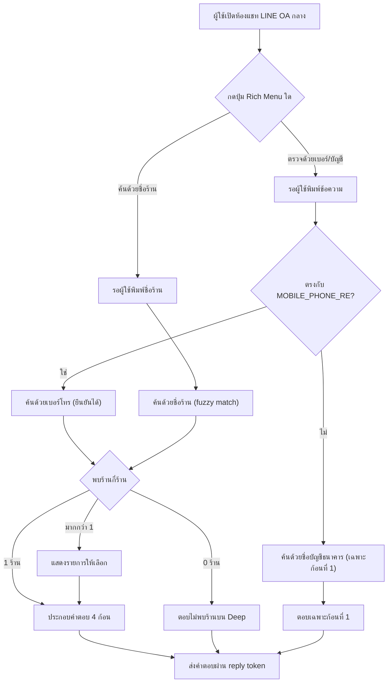

> **โมดูล:** M64-LineStatusBot
> **ประเภทเอกสาร:** Product Requirements Document (PRD)
> **เวอร์ชัน:** 1.0
> **วันที่จัดทำ:** 2026-09-05
> **สถานะ:** Draft — รอ user review ก่อน implement (HR11: ห้าม implement ก่อน PRD+BRD ผ่าน review); ตัวเลขเพดาน/ระยะเวลาเก็บข้อมูลใน §4/§9 เป็นค่าตั้งต้นเพื่อวางแผน ยังไม่ใช่มติสุดท้าย — ดู §11 Open Questions ประกอบ
> **เจ้าของเอกสาร:** BA + PO + PM (ดู [[Feature-Docs-Ownership]])

# PRD: บอทเช็คสถานะร้านค้าใน LINE (LINE Shop Status Bot)

---

## Executive Summary

ผู้ซื้อที่กำลังจะโอนเงินให้ร้านค้าออนไลน์ มักมีแค่ "เบอร์โทร" หรือ "ชื่อบัญชีธนาคาร" จากสลิป/QR การโอนเงินอยู่ในมือ และไม่รู้ว่าจะตรวจสอบความน่าเชื่อถือของสิ่งเหล่านี้ได้จากที่ไหนก่อนกดโอน วันนี้ Deep มีเครื่องมือตรวจสอบอยู่แล้วหลายชิ้น (ฐานมิจฉาชีพที่ `/check`, แผนการตรวจสอบต่อเนื่อง `00060`, Trust Score/Tier, โปรไฟล์สาธารณะ `/u/[username]`) แต่ทั้งหมดต้องเข้าเว็บ Deep เอง — ไม่มีช่องทางใดที่อยู่ตรงจังหวะที่ผู้ซื้อกำลังตัดสินใจจริง

ฟีเจอร์นี้เปิด **LINE Official Account กลางของแพลตฟอร์ม Deep** (ไม่ใช่ OA ของร้านใดร้านหนึ่ง — ต่างจากระบบ LINE OA รายร้านที่มีอยู่แล้วใน feature `00025`/`00045` โดยสิ้นเชิง) ให้ผู้ซื้อพิมพ์เข้ามาถามได้ 2 ทาง: **(ก) เบอร์โทร หรือ ชื่อบัญชีธนาคาร** (สิ่งที่มักปรากฏบนสลิปโอนเงิน) และ **(ข) ชื่อร้าน** แล้วบอทตอบกลับด้วยข้อมูล **4 ก้อนเสมอเมื่อพบร้านตรงกัน**: สัญญาณอันตรายจากฐานมิจฉาชีพ, ผลตรวจของ 00060 (ถ้ามี), Trust Score/Tier พร้อมสถิติร้าน, และลิงก์ไปหน้าโปรไฟล์สาธารณะ

การตีความคำถามใช้ **กติกาตายตัวล้วน ไม่มี AI ในรอบแรก** — ตัวตัดสินว่าอินพุตเป็น "เบอร์โทร" หรือ "ชื่อบัญชี" คือ `MOBILE_PHONE_RE` (`^0[689][0-9]{8}$`) ที่เป็น SSOT ของเบอร์มือถือไทยอยู่แล้วในระบบ (`src/lib/phone.ts`) ร่วมกับ Rich Menu ที่ให้ผู้ใช้เลือกเส้นทางเอง — ไม่มีจุดใดที่ต้องเดาเจตนาผู้ใช้ด้วยโมเดลภาษา

**จุดที่ต้องระวังที่สุดของฟีเจอร์นี้ไม่ใช่เรื่องเทคนิค แต่คือการที่ฟีเจอร์นี้เปิดความสามารถใหม่ที่ไม่เคยมีในระบบ: การค้นหาแบบย้อนกลับ (reverse lookup) จาก "เบอร์โทร/ชื่อ" ไปหา "ตัวตนร้านบน Deep"** ซึ่งต่างจาก `/check` เดิมที่ตอบได้แค่ "ตัวระบุนี้มีรายงานมิจฉาชีพไหม" โดยไม่เปิดเผยว่าใครเป็นเจ้าของ ฟีเจอร์นี้จึงถูกออกแบบให้ (1) จับคู่ได้เฉพาะบัญชีที่เปิดร้าน (`isShop=true`) เท่านั้น ไม่มีทางเปิดเผยว่าเบอร์ใดตรงกับบัญชีผู้ซื้อทั่วไป (2) เปิดเผยได้ไม่เกินสิ่งที่ปรากฏอยู่แล้วบนหน้าโปรไฟล์สาธารณะของร้านนั้น และ (3) มีเพดานการค้นหาต่อผู้ใช้ + บันทึกแบบ hash เพื่อป้องกันการไล่เก็บ (scrape) เบอร์ของร้านบน Deep เป็นชุดใหญ่

อีกจุดที่กำหนดถ้อยคำทั้งฟีเจอร์คือ **"ยังไม่มีข้อมูล" ต้องไม่ถูกอ่านว่า "ไม่ปลอดภัย" และ "ไม่พบในฐานมิจฉาชีพ" ต้องไม่ถูกอ่านว่า "ปลอดภัย"** — รวมถึงเคสที่พบมากที่สุดในช่วงแรก คือร้านที่ไม่มีอยู่บน Deep เลย ซึ่งบอทยังคงต้องแสดงผลตรวจฐานมิจฉาชีพต่อไป (เพราะไม่ผูกกับการมีบัญชี Deep) แต่ต้องบอกตรง ๆ ว่าไม่สามารถตรวจสอบข้อมูลอีก 3 ก้อนที่เหลือได้

**ต้นทุน:** OA นี้เป็นของแพลตฟอร์ม Deep เอง ไม่ผูกกับกระเป๋าเครดิตของร้านใด ทุกคำตอบต้องส่งผ่าน **reply token** (ฟรี) เท่านั้น ห้ามใช้ push message ในรอบแรกเพื่อคุมต้นทุนให้เป็นศูนย์โดยไม่ต้องพึ่งพา wallet ของใคร

---

## 1. Business Goals & KPIs

### 1.1 เป้าหมายทางธุรกิจ

| เป้าหมาย | รายละเอียด |
|----------|-----------|
| **ลดความเสี่ยงโอนเงินผิดร้าน/ให้มิจฉาชีพ ก่อนธุรกรรมเกิดขึ้นจริง** | ผู้ซื้อเช็คได้ทันทีจากสลิป/QR ที่มีในมือ โดยไม่ต้องรู้จัก Deep มาก่อนหรือมีบัญชี Deep |
| **ทำให้เครื่องมือความน่าเชื่อถือที่มีอยู่แล้ว (ฐานมิจฉาชีพ, 00060, Trust Score) ถูกใช้จริงในจังหวะตัดสินใจ** | ข้อมูลเหล่านี้มีค่าที่สุดตอน "ก่อนโอนเงิน" ไม่ใช่ตอนเปิดเว็บดูเล่น — ฟีเจอร์นี้ย้ายเครื่องมือไปอยู่ในที่ที่ผู้ซื้อใช้เวลาอยู่แล้ว (LINE) |
| **ขยายช่องทางเข้าถึง Deep โดยไม่ต้องมีบัญชี/ไม่ต้องติดตั้งแอป** | LINE เป็นแพลตฟอร์มที่คนไทยส่วนใหญ่ใช้อยู่แล้ว ลดแรงเสียดทานของการ "ต้องเข้าเว็บ Deep ก่อน" |
| **วางรากฐานต้นทุนศูนย์ก่อนขยายเป็นบทสนทนาที่ซับซ้อนขึ้น** | รอบแรกยึดกติกาตายตัว + reply-only เพื่อพิสูจน์คุณค่าก่อนลงทุนเพิ่ม (AI/push/ฟีเจอร์เสริม) ในเฟสถัดไป |

### 1.2 ตัวชี้วัดความสำเร็จ (KPIs)

| KPI | คำอธิบาย | เป้าหมาย |
|-----|----------|---------|
| **อัตราการค้นหาที่จบด้วยคำตอบสมบูรณ์** | จำนวนครั้งที่บอทตอบครบตามกติกา (ไม่ใช่ error/ไม่เข้าใจ) ÷ จำนวนครั้งที่ค้นหาทั้งหมด | ใช้เป็น baseline หลังเปิดใช้งาน — ยังไม่มีเป้าตายตัวในรอบแรก |
| **จำนวนครั้งที่สัญญาณอันตรายถูกแสดงจริง** | นับแยกจากจำนวนการค้นหา — วัดว่าฟีเจอร์นี้ "จับได้จริง" ไม่ใช่แค่มีคนใช้ | ติดตามเป็นสัญญาณเชิงคุณภาพ ไม่ใช่ตัวชี้วัดที่ยิ่งสูงยิ่งดี |
| **สัดส่วนคำตอบที่ส่งด้วย reply token** | นับข้อความขาออกของบอทที่ส่งด้วย reply ÷ ขาออกทั้งหมด | ต้องเป็น 100% เสมอในรอบแรก (ดู §4.1 — ห้ามใช้ push) |
| **จำนวนผู้ใช้ที่โดนเพดานการค้นหา (rate limit)** | เฝ้าดูรูปแบบการใช้งานผิดวัตถุประสงค์ ไม่ใช่ตัวชี้วัดที่ต้องกดให้ต่ำเสมอ | ใช้ประกอบการตรวจสอบ ไม่ใช่ KPI เชิงเป้าหมาย |

### 1.3 ขอบเขตการส่งมอบ

รอบแรกเป็น MVP แบบกติกาตายตัว (rule-based) บน LINE OA กลางบัญชีเดียวของ Deep เท่านั้น ไม่ใช้ AI/NLU และไม่ต้องพึ่งพาฟีเจอร์ `00061 — ไดเรกทอรีร้านค้า` ในการทำงาน (ดู §9.1) แต่เนื้อหาของก้อนที่ 2 (ผลตรวจ 00060) จะถูกจำกัดตามขอบเขตปัจจุบันของ 00060 เอง (รองรับเฉพาะร้านประเภท LODGING ในตอนนี้) — ร้านประเภทอื่นจะเห็นก้อนที่ 2 เป็นข้อความ "ยังไม่รองรับประเภทร้านนี้" ซึ่งเป็นข้อเท็จจริงที่ต้องบอกตรง ๆ ไม่ใช่ข้อจำกัดที่ปิดบัง

---

## 2. User Personas (กลุ่มผู้ใช้งาน)

### 2.1 ผู้ซื้อที่กำลังจะโอนเงิน (กลุ่มหลัก)

**ข้อมูลพื้นฐาน:**
- คนทั่วไปที่กำลังจะซื้อของจากร้านออนไลน์ที่เจอผ่านโซเชียลมีเดีย ไม่จำเป็นต้องมีบัญชี Deep หรือเคยรู้จัก Deep มาก่อน
- มีสลิป/QR การโอนเงินอยู่ในมือ ซึ่งมักมีแค่เบอร์โทร (พร้อมเพย์) หรือชื่อบัญชีธนาคาร

**เป้าหมาย:**
- เช็คให้ได้ว่าเบอร์/ชื่อบัญชีนี้เคยถูกรายงานเป็นมิจฉาชีพหรือไม่ ก่อนกดโอนเงิน

**ความต้องการ:**
- พิมพ์สิ่งที่มีในมือ (เบอร์/ชื่อบัญชี) แล้วได้คำตอบทันทีในแชทที่ใช้อยู่แล้ว ไม่ต้องเปิดเว็บ ไม่ต้องสมัครสมาชิก

**จุดปวด (Pain Points):**
- ไม่รู้ว่า Deep มีเครื่องมือตรวจสอบ (`/check`) อยู่แล้ว หรือรู้แต่ไม่อยากเปิดเว็บกลางที่กำลังคุยกับร้านผ่าน LINE

### 2.2 ผู้ซื้อที่เจอโพสต์ขายของแต่ไม่รู้จักร้านมาก่อน

**ข้อมูลพื้นฐาน:**
- เห็นชื่อร้านจากโพสต์ขายของ/รีวิวปากต่อปาก ยังไม่มีสลิปหรือช่องทางติดต่อโดยตรง

**เป้าหมาย:**
- อยากรู้ว่าร้านนี้ "มีตัวตนจริงบน Deep" ไหม และมีข้อมูลความน่าเชื่อถืออะไรให้ดูก่อนตัดสินใจติดต่อ

**ความต้องการ:**
- พิมพ์ชื่อร้านแล้วค้นหาได้ทันที แม้จำชื่อไม่แม่นเป๊ะ

**จุดปวด (Pain Points):**
- ชื่อร้านมักซ้ำหรือคล้ายกันหลายร้าน (รวมถึงร้านที่จงใจตั้งชื่อเลียนแบบร้านดัง) — เสี่ยงกดเข้าร้านผิดถ้าระบบเดาให้เอง

### 2.3 ทีมปฏิบัติการ Deep (Ops)

**ข้อมูลพื้นฐาน:**
- ทีมภายในที่ดูแลบัญชี LINE OA กลาง เฝ้าระวังการใช้งานผิดวัตถุประสงค์ และดูแลให้ถ้อยคำของบอทไม่ทำให้ผู้ใช้เข้าใจผิด

**เป้าหมาย:**
- มั่นใจว่าไม่มีใครใช้บอทนี้ไล่เก็บ (scrape) ข้อมูลเบอร์โทร/ชื่อร้านบน Deep เป็นชุดใหญ่

**ความต้องการ:**
- เห็นสัญญาณผิดปกติ (การค้นหาถี่ผิดปกติจาก LINE userId เดียว) ผ่านบันทึกที่ไม่เก็บ PII เกินจำเป็น

**จุดปวด (Pain Points):**
- (ที่ต้องป้องกันไม่ให้เกิด) ถ้าไม่มีเพดานการค้นหา บอทนี้จะกลายเป็นเครื่องมือสร้างรายชื่อ "เบอร์ไหนเป็นร้านบน Deep" ให้มิจฉาชีพหรือคู่แข่งใช้งานได้ฟรี

---

## 3. Business Requirements

### 3.1 บัญชี LINE OA กลางของแพลตฟอร์ม (ไม่ใช่ของร้าน)

**ความต้องการ:**
- ระบบต้องเปิดบัญชี LINE Official Account ใหม่ของแพลตฟอร์ม Deep เอง แยกขาดจากระบบ LINE OA รายร้านที่มีอยู่แล้ว (`00025`) โดยสิ้นเชิง และมี Rich Menu แนะนำ 2 ทางเข้าให้ผู้ใช้เลือก

**Business Rules:**
- ใช้ channel credentials ของตัวเอง ไม่ใช้ค่าเดียวกับ `ShopChannel` ของร้านใด — webhook เป็น endpoint แยกจาก `/api/channels/line/webhook`
- ชื่อ/รูปโปรไฟล์ของ OA กลางต้องใช้ชื่อแบรนด์ "Deep" ตามหลักการตั้งชื่อแบรนด์ของแพลตฟอร์ม

**เหตุผล:**
- คำตอบเรื่องความน่าเชื่อถือของร้านต้องมาจากบุคคลที่สามที่เป็นกลาง (Deep) ไม่ใช่จากร้านที่กำลังถูกตรวจสอบเอง — ปนกันแม้แต่ในระดับ infra จะบั่นทอนความน่าเชื่อถือของคำตอบทันที (หลักการเดียวกับที่ 00060 ยึดเรื่อง "ผู้ตรวจต้องเป็นกลาง")

### 3.2 การตีความอินพุตด้วยกติกาตายตัว ไม่ใช้ AI (FR-LINE-002, 003, 004, 005, 006)

**ความต้องการ:**
- ระบบต้องแยกได้ว่าผู้ใช้พิมพ์ "เบอร์โทร" หรือ "ชื่อบัญชีธนาคาร" ในทางเข้า (ก) ด้วยกติกาที่ตายตัวและตรวจสอบซ้ำได้ ไม่ใช้ AI/NLU ในการตัดสินใจใด ๆ ของรอบแรก

**Business Rules:**
- ตัวตัดสินคือ `MOBILE_PHONE_RE` (`^0[689][0-9]{8}$`) ซึ่งเป็น SSOT ของเบอร์มือถือไทยอยู่แล้วใน `src/lib/phone.ts` — ห้ามสร้างกติกาเบอร์ไทยชุดใหม่ในฟีเจอร์นี้
- ทางเข้า (ก) "เบอร์โทร" → ค้นหาแบบยืนยันได้ (exact match กับ `User.phone` ที่ `isShop=true`)
- ทางเข้า (ก) "ชื่อบัญชีธนาคาร" → ตรวจสัญญาณอันตรายเท่านั้น (ก้อนที่ 1) ไม่พยายามจับคู่ร้านบน Deep อัตโนมัติ เพราะไม่มีฟิลด์ "ชื่อบัญชีธนาคารที่ยืนยันแล้ว" ให้จับคู่แม่นยำในระบบปัจจุบัน (ดู §11 OQ-1)
- ทางเข้า (ข) "ชื่อร้าน" → ค้นหาแบบไม่ยืนยัน (fuzzy match บนชื่อร้าน/ชื่อผู้ใช้) พร้อมกลไกเลือกร้านเองเมื่อพบมากกว่า 1 ผล

**เหตุผล:**
- เบอร์โทรเป็นข้อมูลที่ยืนยันแล้วในระบบ (ตั้งครั้งเดียว ยืนยันด้วย OTP, `@unique`) จึงใช้เป็นฐานของการจับคู่แบบยืนยันได้ ในขณะที่ชื่อบัญชี/ชื่อร้านเป็นข้อความอิสระที่ไม่มีการยืนยันตัวตนใด ๆ รองรับ — ปฏิบัติทั้งสองแบบเหมือนกันจะทำให้ผู้ใช้เข้าใจผิดว่าการจับคู่ด้วยชื่อแม่นยำเท่าเบอร์โทร

### 3.3 การจับคู่ร้าน: หลายร้าน / ไม่พบร้านเลย (FR-LINE-007, 008)

**ความต้องการ:**
- เมื่อคำค้นนำไปสู่ร้านมากกว่า 1 ร้าน หรือไม่พบร้านใดเลย ระบบต้องมีคำตอบที่ชัดเจนสำหรับแต่ละกรณี โดยไม่เดาแทนผู้ใช้

**Business Rules:**
- พบมากกว่า 1 ร้าน (ไม่ว่าจะจากคำค้นชื่อที่คล้ายกันหลายร้าน หรือจากผู้ใช้ 1 คนที่เปิดหลายร้าน — เบอร์โทรยืนยันตัวบุคคลได้ แต่ไม่ได้ยืนยันว่าเป็นร้านเดียว) ต้องแสดงรายการให้ผู้ใช้เลือกเอง **ห้ามเลือกอัตโนมัติในทุกกรณี**
- ไม่พบร้านใดตรงกันเลย ต้องตอบว่า "ไม่พบร้านบน Deep" อย่างเป็นกลาง — ถ้าเป็นทางเข้าเบอร์โทร ยังคงแสดงก้อนที่ 1 (สัญญาณอันตราย) ของเบอร์นั้นต่อไป เพราะสัญญาณอันตรายไม่ผูกกับการมีบัญชี Deep

**เหตุผล:**
- การเลือกร้านให้อัตโนมัติเมื่อชื่อคล้ายกันคือการออกคำรับรองร้านผิดตัว ซึ่งเป็นความเสียหายที่ร้ายแรงกว่าการให้ผู้ใช้กดเลือกเองอีกหนึ่งขั้น — และ "ไม่มีร้านบน Deep" เป็นเคสที่พบบ่อยที่สุดในช่วงแรก ต้องตอบให้ชัดว่าไม่ใช่ทั้ง "ปลอดภัย" และไม่ใช่ "อันตราย" แต่คือ "อยู่นอกขอบเขตที่ Deep ตรวจสอบได้"

### 3.4 คำตอบ 4 ก้อนเสมอ ลำดับคงที่ (FR-LINE-009 ถึง 013)

**ความต้องการ:**
- เมื่อยืนยันร้านได้ 1 ร้านแล้ว ระบบต้องตอบครบ 4 ก้อนตามลำดับคงที่: สัญญาณอันตราย → ผลตรวจ 00060 → Trust Score/Tier+สถิติร้าน → ลิงก์โปรไฟล์สาธารณะ

**Business Rules:**
- ก้อนที่ 1 อ่านจาก `searchScamByIdentifier()` ที่มีอยู่แล้วเท่านั้น แสดงเสมอไม่ขึ้นกับว่าร้านจ่ายเงินให้ฟีเจอร์ใดของ Deep หรือไม่
- ก้อนที่ 2 อ่านจาก `getInspectionForPublicProfile()` ที่มีอยู่แล้วเท่านั้น สะท้อน 5 สถานะของ 00060 ทุกคำ ห้ามยุบรวมเป็นผ่าน/ไม่ผ่านสองค่า และห้ามแสดงหลักฐานปิด
- ก้อนที่ 3 ใช้ mapping ของ Trust Tier จาก `Tier Lists.md` เท่านั้น ห้ามตั้ง mapping ใหม่
- ก้อนที่ 4 คือลิงก์เต็มไปยัง `/u/[username]` บนโดเมน prod จริง
- ก้อนใดไม่มีข้อมูลให้แสดง (เช่นร้านไม่ใช่ LODGING) ต้องยังปรากฏพร้อมคำอธิบายเหตุผล ไม่ใช่หายไปเงียบ ๆ

**เหตุผล:**
- ลำดับที่สัญญาณอันตรายมาก่อนเสมอ สะท้อนหลักการของ 00060 ที่ว่าสัญญาณอันตรายต้องฟรีและเด่นกว่าข้อมูลที่ต้องจ่ายเงิน — และการใช้ฟังก์ชันเดิมของ 00060/Trust Score แทนการคำนวณใหม่ ป้องกันไม่ให้บอทตอบไม่ตรงกับหน้าเว็บเมื่อกฎเปลี่ยนในอนาคต

### 3.5 ถ้อยคำที่ต้องไม่ทำให้เข้าใจผิด (FR-LINE-014, 015, 016)

**ความต้องการ:**
- ทุกก้อนข้อมูลต้องสื่อสารได้ครบ 3 สถานะ (มีข้อมูลครบ / ยังไม่มีข้อมูลหรือไม่รองรับ / ไม่สามารถตรวจสอบได้เลย) และต้องไม่มีจุดใดที่ผู้ใช้อ่านแล้วสรุปผิดไปในทางที่อันตรายกว่าความจริง

**Business Rules:**
- "ไม่พบในฐานมิจฉาชีพ" ต้องมีประโยคกำกับว่า "ไม่ได้แปลว่าปลอดภัย" ต่อท้ายเสมอ
- "ยังไม่มีข้อมูล"/"ไม่รองรับประเภทร้านนี้" ของผลตรวจ 00060 ต้องไม่ใช้สี/คำเดียวกับ "ไม่ผ่าน"
- "ไม่พบร้านบน Deep" ต้องระบุชัดว่า Deep ตรวจสอบเฉพาะร้านที่ลงทะเบียนในระบบเท่านั้น
- ห้ามใช้ 0 หรือค่าว่างแทนความหมาย "ยังไม่มีข้อมูล" ในทุกก้อน

**เหตุผล:**
- ตัวเลข/สถานะที่ดูเหมือนครบแต่จริง ๆ ยังไม่มีข้อมูล อันตรายกว่าไม่มีตัวเลขเลย เพราะผู้ใช้ไม่มีทางรู้ด้วยตัวเองว่ามันยังไม่จบ (`docs/conventions/partial-data-must-be-labeled-or-filled.md`) — สำหรับฟีเจอร์นี้ผลที่ตามมาไม่ใช่แค่ "เข้าใจผิดเรื่องตัวเลข" แต่คือ "ตัดสินใจโอนเงินผิดพลาด"

### 3.6 ความเป็นส่วนตัวและการป้องกันการใช้งานผิดวัตถุประสงค์ (FR-LINE-017, 018, 019)

**ความต้องการ:**
- ระบบต้องจำกัดขอบเขตของการค้นหาแบบย้อนกลับ (reverse lookup) ไม่ให้กลายเป็นเครื่องมือค้นหาตัวตนบุคคลทั่วไป และต้องมีเพดานการใช้งานเพื่อป้องกันการไล่เก็บข้อมูลร้าน

**Business Rules:**
- จับคู่ได้เฉพาะบัญชีที่เปิดร้าน (`isShop=true`) เท่านั้น — ห้ามเปิดเผยว่าเบอร์/ชื่อนั้นตรงกับบัญชีผู้ซื้อทั่วไปหรือไม่
- ข้อมูลที่เปิดเผยในก้อนที่ 2-4 ต้องไม่เกินสิ่งที่ปรากฏอยู่แล้วบนหน้าโปรไฟล์สาธารณะของร้านนั้น
- จำกัดจำนวนครั้งค้นหาต่อ LINE userId ต่อหน้าต่างเวลา (ค่าเริ่มต้น 10 ครั้ง/ชั่วโมง — ยังไม่เคาะตัวเลขสุดท้าย)
- บันทึกเพื่อสอบสวนการละเมิดเก็บเฉพาะ LINE userId แบบ hash + เวลา + ประเภทอินพุต ไม่เก็บคำค้นดิบระยะยาว มีอายุจัดเก็บจำกัด (ค่าเริ่มต้น 90 วัน — ยังไม่เคาะตัวเลขสุดท้าย) แล้วลบอัตโนมัติ
- ไม่ผูก LINE userId ของผู้ถามเข้ากับบัญชี Deep ใด ๆ ในรอบแรก (ทำงานแบบไม่ระบุตัวตนเสมอ)

**เหตุผล:**
- ฟีเจอร์นี้เปิดความสามารถใหม่ที่ไม่เคยมี (เบอร์/ชื่อ → ตัวตนร้านบน Deep) ซึ่งมีประโยชน์ต่อผู้ซื้อที่สุจริต แต่ก็เป็นช่องทางไล่เก็บข้อมูลได้เช่นกันหากไม่มีเพดาน — ต้นทุนของการค้นหาแต่ละครั้งต้องไม่เป็นศูนย์ในเชิงความเสี่ยง แม้จะเป็นศูนย์ในเชิงเงิน

### 3.7 ต้นทุนข้อความเป็นศูนย์ (reply เท่านั้น) (FR-LINE-020)

**ความต้องการ:**
- ทุกคำตอบของบอทต้องส่งผ่าน reply token ของ LINE ห้ามใช้ push message ในรอบแรก

**Business Rules:**
- ทุกข้อความขาออกของฟีเจอร์นี้ (คำตอบ 4 ก้อน, รายการให้เลือก, ข้อความ error/rate-limit) ต้องอยู่ภายใน reply token เดียวกับ event ที่ผู้ใช้เพิ่งส่งเข้ามา
- การประมวลผลคำถามต้องไม่เรียก network ภายนอกระหว่างคำนวณคำตอบ (query ฐานข้อมูลของ Deep เองเท่านั้น) เพื่อให้ตอบทันภายในอายุ reply token (1 นาที)

**เหตุผล:**
- OA นี้เป็นของแพลตฟอร์ม ไม่มีกระเป๋าเครดิตของร้านมารองรับต้นทุน push — การบังคับ reply-only ทำให้ต้นทุนคงที่ที่ศูนย์บาทไม่ว่าจะมีคนใช้กี่ครั้ง ต่างจากฟีเจอร์ LINE รายร้าน (00025/00045) ที่มี SellerWallet รองรับ push ได้

---

## 4. Business Rules & Constraints

### 4.1 กฎทางธุรกิจหลัก (แตะไม่ได้)

| กฎ | คำอธิบาย |
|----|----------|
| **สัญญาณอันตรายฟรีเสมอ เป็นอิสระจากการมีบัญชี Deep** | ก้อนที่ 1 ทำงานได้แม้ไม่พบร้านบน Deep เลย — ไม่ผูกกับการจ่ายเงินหรือการลงทะเบียนใด ๆ (สอดคล้องหลักการเดียวกับ 00060 §4.1) |
| **ห้ามเลือกร้านให้อัตโนมัติเมื่อพบมากกว่า 1 ผล** | ต้องให้ผู้ใช้เลือกเองเสมอ ไม่ว่าจะมาจากคำค้นชื่อหรือเบอร์โทรของผู้ใช้ที่มีหลายร้าน |
| **reverse lookup จำกัดเฉพาะบัญชีที่เปิดร้าน (isShop=true)** | ห้ามเปิดเผยว่าเบอร์/ชื่อใดตรงกับบัญชีผู้ซื้อทั่วไปไม่ว่ากรณีใด |
| **เปิดเผยได้ไม่เกินสิ่งที่สาธารณะเห็นอยู่แล้วบน `/u/[username]`** | ฟีเจอร์นี้เป็นช่องทางเข้าถึงข้อมูลที่มีอยู่แล้วให้เร็วขึ้น ไม่ใช่ช่องทางเปิดเผยข้อมูลใหม่ที่ไม่เคยเป็นสาธารณะ |
| **ห้ามใช้ push message ในรอบแรก** | ทุกคำตอบต้องอยู่ในกรอบ reply token — ไม่มีข้อยกเว้น |
| **ไม่ใช้ AI/NLU ในการตีความคำถามของรอบแรก** | ทุกการตัดสินใจต้องตรวจสอบย้อนกลับได้ด้วยกติกาที่เขียนไว้ตายตัว |
| **"ยังไม่มีข้อมูล"/"ไม่พบ" ต้องไม่ถูกอ่านเป็นข้อสรุปด้านความปลอดภัย** | ทั้งสองทิศทาง (ยังไม่มีข้อมูล ≠ ไม่ปลอดภัย, ไม่พบในฐานมิจฉาชีพ ≠ ปลอดภัย) — ถ้อยคำบังคับตาม §4.3 |

### 4.2 ข้อจำกัดทางธุรกิจ

| ข้อจำกัด | รายละเอียด |
|---------|-----------|
| **ก้อนที่ 2 ผูกกับขอบเขตของ 00060 เอง** | ปัจจุบันรองรับเฉพาะร้านประเภท LODGING — ร้านประเภทอื่นเห็นข้อความ "ยังไม่รองรับ" ไม่ใช่ "ไม่ผ่าน" |
| **ทางเข้า "ชื่อบัญชีธนาคาร" ให้เฉพาะก้อนที่ 1** | ไม่มีฟิลด์ชื่อบัญชีที่ยืนยันแล้วให้จับคู่ร้านแบบแม่นยำในระบบปัจจุบัน (ดู OQ-1) |
| **ไม่มีทางเข้าอื่นนอกจาก 2 ทางที่กำหนด** | ลิงก์โปรไฟล์ตรง/QR ไม่ใช่ขอบเขตของรอบแรก (ดู OQ-2) |
| **ไม่ผูกกับ 00061** | ฟังก์ชันค้นหาด้วยชื่อร้านใช้ query ที่มีอยู่แล้วในระบบ ไม่ต้องรอไดเรกทอรีสาธารณะขึ้นระบบ |
| **ไม่ผูกกับ SellerWallet ของร้านใด** | ต้นทุนข้อความ LINE ของ OA กลางเป็นของแพลตฟอร์ม Deep เอง |
| **ทำงานแบบไม่ระบุตัวตนผู้ถามเสมอ** | ไม่ผูก LINE userId ของผู้ถามกับบัญชี Deep แม้ผู้ถามจะเคยล็อกอินด้วย LINE ที่อื่น |

### 4.3 ถ้อยคำ 3 สถานะ — ห้ามสับสน

| สถานการณ์ | ต้องสื่อว่าอะไร | ห้ามสื่อว่าอะไร |
|---|---|---|
| **พบรายงานในฐานมิจฉาชีพ** | จำนวนครั้ง / มูลค่าความเสียหายรวม / วันที่รายงานล่าสุด ตาม `ScamSearchResult` | ห้ามเพิ่มรายละเอียดที่มากกว่าที่ `/check` เปิดเผยอยู่แล้ว (เช่น ชื่อผู้รายงาน) |
| **ไม่พบในฐานมิจฉาชีพ** | "ยังไม่มีใครรายงานเข้ามา" + "ไม่ได้แปลว่าปลอดภัย 100% โปรดตรวจสอบข้อมูลอื่นประกอบ" | ห้ามใช้ไอคอน/สีที่สื่อการรับรองความปลอดภัย |
| **ร้านนี้ไม่ใช่ประเภทที่ 00060 รองรับ** | "แผนตรวจสอบต่อเนื่องรองรับเฉพาะร้านบ้านพักในขณะนี้ ร้านนี้จึงไม่มีผลตรวจส่วนนี้" | ห้ามพูดว่าร้านมีปัญหา/ไม่ผ่าน |
| **ร้านเป็น LODGING แต่ไม่เคยสมัครแผน** | "ยังไม่ได้อยู่ในแผนการตรวจสอบต่อเนื่องของ Deep" | ห้ามพูดว่าร้านมีปัญหา/ไม่ผ่าน |
| **ร้านมีผลตรวจ 00060 อยู่** | สถานะรายข้อตามที่ 00060 กำหนด (ผ่าน/รอตรวจซ้ำ/ยังไม่มีข้อมูล/ไม่เกี่ยวกับร้านประเภทนี้) | ห้ามใช้คำว่า "ไม่ผ่าน" หรือยุบรวมเป็นผ่าน/ไม่ผ่านสองค่า |
| **ไม่พบร้านใดบน Deep ที่ตรงกับคำค้น** | "Deep ตรวจสอบเฉพาะร้านที่ลงทะเบียนอยู่ในระบบเท่านั้น การไม่พบไม่ได้แปลว่าปลอดภัยหรืออันตราย" (ยังคงแสดงก้อนที่ 1 ถ้ามาจากทางเข้าเบอร์โทร) | ห้ามใช้สี/คำเชิงเตือนภัยหรือเชิงรับรอง |

---

## 5. Out of Scope (นอกขอบเขต)

| หัวข้อ | คำอธิบาย |
|--------|----------|
| **การใช้ AI/NLU ตีความข้อความอิสระ** | รอบแรกใช้กติกาตายตัว (`MOBILE_PHONE_RE`) + ปุ่ม Rich Menu เท่านั้น |
| **ทางเข้าอื่นนอกจาก 2 ทางที่กำหนด** | ลิงก์โปรไฟล์ตรง/QR ที่พาเข้าห้องแชทพร้อมระบุร้านอัตโนมัติ — ดู Open Question OQ-2 |
| **ช่องทางแจ้งเบาะแส/รายงานมิจฉาชีพ** | ยังคงใช้ `/check` (`ReportForm`) ตามเดิม — บอทนี้เป็นช่องทาง "ตรวจสอบ" อย่างเดียว ไม่ใช่ช่องทาง "แจ้ง" |
| **การเปิดห้องแชทกับร้าน/การต่อสายหาร้าน จากบอทนี้โดยตรง** | บอทให้ได้แค่ลิงก์โปรไฟล์สาธารณะ ผู้ใช้ไปดำเนินการต่อเอง |
| **การสนทนาต่อเนื่องหลายรอบ (multi-turn)** | นอกเหนือจากขั้นตอนเลือกร้านจากรายการเมื่อพบมากกว่า 1 ผล ไม่มีการถาม-ตอบต่อเนื่องอื่นใด |
| **การค้นหาด้วยเลขบัญชีธนาคาร (ตัวเลข) หรือเลขบัตรประชาชน** | ยังคงเป็นหน้าที่ของ `/check` เท่านั้น — รอบนี้รองรับเฉพาะเบอร์โทรกับชื่อ(บัญชี/ร้าน) |
| **การขยาย 00060 ไปร้านประเภทอื่น** | ผูกกับ scope ของ 00060 เอง ไม่ใช่การตัดสินใจของฟีเจอร์นี้ |
| **สิทธิ์ให้ร้านปิดกั้นตัวเองจากผลลัพธ์ของบอท** | ข้อมูลที่แสดงเป็นข้อมูลที่เปิดเผยต่อสาธารณะอยู่แล้ว ร้านไม่มีสิทธิ์ยับยั้ง (สอดคล้องหลักการ "อันดับ/ป้ายซื้อไม่ได้" ของ 00060/00061) |
| **การแจ้งเตือนอัตโนมัติต่อทีม ops เมื่อพบพฤติกรรมต้องสงสัย** | รอบแรกทีม ops ต้องเข้าไปตรวจ log เอง ระบบแจ้งเตือนอัตโนมัติเป็นของเฟสถัดไป |
| **การรองรับภาษาอื่นนอกจากไทย** | ยึดตามธรรมเนียม UI copy ภาษาไทยของทั้งแพลตฟอร์ม |
| **การผูกต้นทุนกับ SellerWallet ของร้าน** | ต้นทุนข้อความ LINE ของ OA กลางเป็นของแพลตฟอร์ม Deep เอง ไม่ใช่ของร้าน |
| **การผูกตัวตนผู้ถามกับบัญชี Deep ของผู้ถามเอง** | ทำงานแบบไม่ระบุตัวตนเสมอในรอบแรก แม้ผู้ถามจะเคยล็อกอิน Deep ด้วย LINE ที่อื่น |

---

## 6. Risks & Mitigation (ความเสี่ยงและแนวทางแก้ไข)

### 6.1 ความเสี่ยงทางธุรกิจ

| ความเสี่ยง | ผลกระทบ | ระดับความรุนแรง | แนวทางแก้ไข |
|-----------|---------|-----------------|-------------|
| **การไล่เก็บ (scrape/enumerate) เบอร์โทรของร้านบน Deep ผ่านการค้นซ้ำจำนวนมาก** | มิจฉาชีพ/คู่แข่งได้รายชื่อเบอร์ที่เป็นร้านบน Deep ไปใช้ต่อ | สูง | เพดานการค้นต่อ LINE userId + audit log แบบ hash ให้ ops ตรวจ pattern ผิดปกติ |
| **ผู้ใช้เข้าใจผิดว่า "ไม่พบ = ปลอดภัย" หรือ "ยังไม่มีข้อมูล = อันตราย"** | ตัดสินใจโอนเงินผิดพลาดโดยอ้างอิงคำตอบของบอท | สูง | ถ้อยคำบังคับตามตาราง §4.3 ทุกคำตอบ |
| **ชื่อร้าน/ชื่อบัญชีคล้ายกัน (มิจฉาชีพตั้งชื่อเลียนแบบ) ทำให้เลือกร้านผิด** | ยืนยันร้านผิดตัว เกิดความเสียหายจริง | สูง | ไม่มีการเลือกอัตโนมัติเมื่อพบมากกว่า 1 ร้าน + แสดงข้อมูลแยกแยะ (username/ป้ายยืนยัน) ในรายการเลือก |
| **ความคาดหวังเกินจริงต่อผลตรวจ 00060 ที่จำกัดเฉพาะ LODGING** | ผู้ใช้คาดหวังว่าร้านออนไลน์ทั่วไปต้องมีผลตรวจด้วย | กลาง | ถ้อยคำอธิบายขอบเขตชัดเจนตาม §4.3 |
| **ความเสี่ยง PDPA จากการเก็บข้อมูลของผู้ถามที่ไม่ใช่คู่ค้าของ Deep** | เก็บ PII เกินความจำเป็น | กลาง | anonymize/hash log, จำกัดระยะเวลาเก็บ, ไม่ผูกบัญชี |
| **ต้นทุนข้อความเพิ่มขึ้นแบบไม่คาดคิดหากมีการใช้ push แทน reply** | ค่าใช้จ่ายแพลตฟอร์มเพิ่มโดยไม่มี wallet รองรับ | กลาง | บังคับ reply-only เป็นกฎแตะไม่ได้ (§4.1) |

### 6.2 ความเสี่ยงทางเทคนิค

| ความเสี่ยง | ผลกระทบ | แนวทางแก้ไข |
|-----------|---------|-------------|
| **Reply token หมดอายุก่อนตอบ (คำนวณช้า/มี network call แทรก)** | ผู้ใช้ไม่ได้รับคำตอบเลย เพราะรอบแรกไม่มี fallback push | บังคับว่าทุก query เป็นการอ่านฐานข้อมูล Deep เองเท่านั้น ห้ามเรียก network ภายนอกระหว่างประมวลผล |
| **OA กลางใหม่ปนกับ infra LINE รายร้านเดิม (00025)** | ส่งข้อความผิดช่องทาง/ผิด credential | แยก channel access token/secret + webhook route ออกจากกันโดยเด็ดขาด ไม่ใช้ `ShopChannel` model |
| **ข้อมูลผลตรวจ 00060/Trust Score เปลี่ยนกฎในอนาคตแต่บอทไม่ sync** | บอทให้ข้อมูลไม่ตรงกับหน้าเว็บ | เรียกผ่าน service function เดิมเสมอ (`getInspectionForPublicProfile`, `getTrustLevel`) ห้าม derive กฎใหม่ในฟีเจอร์นี้ |
| **LINE Messaging API มีโควตาข้อความฟรีระดับ OA** | หากใช้งานหนักอาจถึงเพดานของ OA กลาง | เฝ้าดูผ่านหน้าจัดการของ LINE; reply-only ควบคุมต้นทุนต่ำกว่ารูปแบบที่ใช้ push |

---

## 7. Glossary (อภิธานศัพท์)

| คำศัพท์ | ความหมาย |
|---------|----------|
| **LINE OA กลาง** | LINE Official Account ของแพลตฟอร์ม Deep เอง — คนละบัญชีกับ LINE OA ของร้านค้าแต่ละร้าน |
| **Reply token** | โทเคนอายุ 1 นาทีที่ LINE ออกให้ทุกครั้งที่ผู้ใช้ส่ง event เข้ามา ใช้ตอบกลับได้ฟรี |
| **Push message** | ข้อความที่ส่งนอกกรอบ reply token — มีต้นทุนตามโควตาของ LINE OA |
| **Reverse lookup (การค้นหาแบบย้อนกลับ)** | การค้นจากตัวระบุ (เบอร์/ชื่อ) เพื่อหาว่าตรงกับตัวตนใดบน Deep — ต่างจากการค้นแบบ `/check` ที่ตอบแค่ "มีรายงานไหม" |
| **Disambiguation (รายการให้เลือก)** | ขั้นตอนที่บอทแสดงร้านหลายรายการให้ผู้ใช้เลือกเอง เมื่อคำค้นตรงกับมากกว่า 1 ร้าน |
| **ผลตรวจ 00060** | ผลจากแผนการตรวจสอบต่อเนื่อง (`Shop Inspection Plan`) — 5 สถานะ: ผ่าน/ไม่ผ่าน/รอตรวจซ้ำ/ยังไม่มีข้อมูล/ไม่เกี่ยวกับร้านประเภทนี้ |
| **ฐานมิจฉาชีพ / `/check`** | ระบบค้นหารายงานมิจฉาชีพที่มีอยู่แล้ว ค้นได้ 4 ประเภทตัวระบุ: เบอร์โทร/ชื่อ/เลขบัตร/เลขบัญชี |
| **ชื่อบัญชีธนาคาร (unverified name search)** | ทางเข้าที่ใช้ตรวจสัญญาณอันตรายด้วยชื่อคน แต่ไม่ใช่การจับคู่ร้านแบบยืนยันได้ |

---

## 8. Success Metrics (ตัวชี้วัดความสำเร็จ)

| ตัวชี้วัด | ค่าที่คาดหวัง | วิธีวัด |
|----------|---------------|--------|
| **สัดส่วนคำตอบที่ตอบครบตามกติกา** | ไม่มี error/ตอบผิดกติกาที่กำหนด | ตรวจ log ของทุกคำตอบเทียบกับกติกาใน §4.3 |
| **สัดส่วนคำตอบที่ส่งด้วย reply token** | 100% | ตรวจ log ทุกข้อความขาออก |
| **เวลาตอบเฉลี่ยต่อคำถาม** | น้อยกว่าอายุ reply token (1 นาที) อย่างมีระยะห่างปลอดภัย | วัด latency จากเวลารับ webhook ถึงเวลาส่งคำตอบ |
| **จำนวนครั้งที่ก้อนใดก้อนหนึ่งดึงข้อมูลไม่สำเร็จ** | ต้องมีข้อความแจ้ง "ดึงข้อมูลไม่สำเร็จ" กำกับทุกครั้ง ไม่มีก้อนที่หายไปเงียบ ๆ | ตรวจ log ของ error path |

---

## 9. Dependencies & Assumptions

### 9.1 สิ่งที่ต้องพึ่งพา (Dependencies)

| ระบบ/ส่วนประกอบ | ความสัมพันธ์ |
|-----------------|-------------|
| `searchScamByIdentifier()` (`src/services/scam-report.service.ts`) | ใช้เป็นแหล่งข้อมูลก้อนที่ 1 ทั้งหมด (ประเภท PHONE, NAME) — ไม่คำนวณสัญญาณอันตรายใหม่ |
| `getInspectionForPublicProfile()` (`src/services/inspection-public.service.ts`) | ใช้เป็นแหล่งข้อมูลก้อนที่ 2 ทั้งหมด — สืบทอดกฎ 5-สถานะและกฎหลักฐานปิดของ 00060 ทุกข้อ |
| Query ค้นหาร้านตามชื่อ (แพทเทิร์นเดียวกับ `shop.service.ts` ที่ใช้อยู่แล้วใน `/m/shops`) | ใช้เป็นกลไกค้นหาก้อนที่ 4/ทางเข้า (ข) — เป็น service-layer function ที่มีอยู่ก่อน 00061 ไม่ต้องรอ 00061 |
| `MOBILE_PHONE_RE` (`src/lib/phone.ts`) | ใช้เป็นกติกาตัดสินประเภทอินพุตของทางเข้า (ก) — ห้ามสร้างกติกาเบอร์ไทยชุดใหม่ |
| Trust Tier mapping (`docs/10 - Business Rules/Tier Lists.md`, `getTrustLevel`) | ใช้เป็นแหล่งข้อมูลก้อนที่ 3 — ห้ามตั้ง mapping ใหม่ |
| `/u/[username]` (public profile) | ปลายทางของก้อนที่ 4 — ใช้ได้กับทุกร้านไม่ขึ้นกับประเภทร้าน/แพ็กเกจ |
| **LINE Official Account ใหม่ระดับแพลตฟอร์ม (ยังไม่มีอยู่จริง)** | งาน ops ที่ต้องสมัคร/ยืนยันตัวตนกับ LINE เอง แยกจากงาน engineering — มีคิวเวลาที่ควบคุมไม่ได้ทั้งหมด |
| `00060 — Shop Inspection Plan` | กำหนดขอบเขตเนื้อหาของก้อนที่ 2 ทั้งหมด (ปัจจุบันจำกัดที่ LODGING) |

### 9.2 สมมติฐาน (Assumptions)

- ระบบไม่มีฟิลด์ "ชื่อบัญชีธนาคารที่ยืนยันแล้ว" เป็นข้อมูลโครงสร้างในปัจจุบัน (มีแต่เลขบัญชีในฐานมิจฉาชีพซึ่งเป็นคนละอย่าง) — ทางเข้า "ชื่อบัญชีธนาคาร" จึงให้ได้แค่ก้อนที่ 1 ในรอบแรก (ดู OQ-1)
- `User.phone` เป็นฟิลด์ที่ยืนยันแล้ว (ตั้งครั้งเดียวผ่าน OTP, `@unique`) จึงใช้เป็นฐานของการจับคู่แบบยืนยันได้อย่างปลอดภัย
- ฟีเจอร์นี้จับคู่ได้เฉพาะบัญชีที่ `isShop=true` และ `deletedAt IS NULL` เท่านั้น
- OA กลางไม่ต้องรอ App Review ระดับเดียวกับ Facebook/Instagram เพราะ LINE Messaging API ของ OA ระดับ Verified/Premium ใช้กระบวนการอนุมัติของ LINE เอง ซึ่งเป็นงาน ops แยกต่างหาก
- ค่าตั้งต้นของเพดานการค้นหาและระยะเวลาเก็บ log (§4.2, §9.1) เป็นค่าที่เสนอเพื่อวางแผน ยังไม่ใช่มติสุดท้าย

---

## 10. Appendix

### 10.1 ตัวอย่าง User Journey

**Scenario: ผู้ซื้อเช็คเบอร์ก่อนโอนเงิน**

1. ผู้ซื้อได้รับ QR/สลิปโอนเงินจากร้านที่เจอในโพสต์ขายของ เห็นเบอร์โทร `08xxxxxxxx`
2. เปิดแชท LINE OA "Deep" (เคยแอดไว้ก่อนหน้า หรือค้นหาจาก LINE OA directory)
3. กดปุ่ม "ตรวจด้วยเบอร์/บัญชี" บน Rich Menu แล้วพิมพ์เบอร์ที่ได้มา
4. บอทตรวจว่าเป็นรูปแบบเบอร์มือถือไทย → ค้นหาแบบยืนยันกับ `User.phone`
5. พบร้าน 1 ร้านที่ตรงกัน → บอทตอบ 4 ก้อน: ไม่พบในฐานมิจฉาชีพ (พร้อมคำเตือนว่าไม่ได้แปลว่าปลอดภัย) → ร้านนี้ไม่ใช่ LODGING จึงไม่มีผลตรวจ 00060 → Trust Score/Tier "Deep Gold" + ยอดออเดอร์/รีวิว → ลิงก์ `/u/username`
6. ผู้ซื้อกดลิงก์เข้าไปดูรายละเอียดเพิ่มก่อนตัดสินใจโอนเงิน

### 10.2 ตัวอย่างเคสพบมากกว่า 1 ร้าน

```
ผู้ใช้พิมพ์ชื่อร้าน "บ้านสวนริมน้ำ"
ระบบพบ 3 ร้านที่ชื่อคล้ายกัน: "บ้านสวนริมน้ำ", "บ้านสวนริมน้ำ2", "บ้านสวนริมน้ำ (สาขาใหม่)"

บอทแสดงรายการทั้ง 3 พร้อม username กำกับ ให้ผู้ใช้กดเลือกเอง
ไม่มีการเลือกอัตโนมัติแม้ร้านแรกจะดูเหมือนตรงที่สุด
```

### 10.3 Mermaid — ภาพรวมการตัดสินใจ



---

## 11. Open Questions

> คำถามด้านล่างเป็นสิ่งที่เอกสารนี้ตอบเองไม่ได้จากข้อมูล/โค้ดที่มีอยู่ในปัจจุบัน — ต้องให้ Controller/user ตัดสิน ก่อนเริ่ม implement ส่วนที่เกี่ยวข้อง

**OQ-1 (ทางเข้า "ชื่อบัญชีธนาคาร"):**
ระบบไม่มีฟิลด์ "ชื่อบัญชีธนาคาร" ที่เป็นข้อมูลโครงสร้างให้ค้นหาแบบยืนยันได้ในปัจจุบัน (มีแต่เลขบัญชีในฐานมิจฉาชีพซึ่งเป็นคนละอย่าง) — เอกสารนี้เสนอให้รอบแรกใช้ทางเข้านี้ตรวจสัญญาณอันตรายอย่างเดียว (ไม่จับคู่ร้านบน Deep) ยอมรับแนวทางนี้หรือต้องการให้สร้างฟิลด์ "ชื่อบัญชีรับเงิน" แบบยืนยันได้ (เก็บแบบ hash เหมือนข้อมูลอ่อนไหวอื่น) เพื่อรองรับการจับคู่ร้านแบบเต็มรูปแบบในภายหลัง?

**OQ-2 (ทางเข้าเสริม):**
ควรเพิ่มทางเข้าที่ 3 (ลิงก์โปรไฟล์ตรง/QR ที่พาผู้ใช้เข้าห้องแชท LINE OA กลางพร้อมระบุร้านที่ต้องการเช็คโดยอัตโนมัติ) เป็นฟีเจอร์เสริมในเฟสถัดไปหรือไม่?

---

**หมายเหตุ:**
เอกสารนี้เป็นการบันทึกความต้องการทางธุรกิจ (Business Requirements) โดยไม่มีรายละเอียดทางเทคนิค
สำหรับ Functional Requirements / User Story / Acceptance Criteria ดู [[BRD]] ของโมดูลนี้
สำหรับ technical specification ดู [[SRS]] ของโมดูลนี้ (ยังไม่จัดทำ — ตาม Documentation-First ต้องทำหลัง PRD+BRD ผ่าน review)
