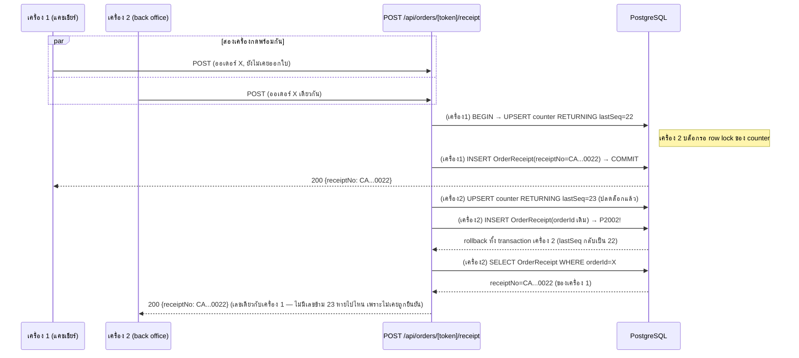

> **โมดูล:** M00065-ServiceReceiptPrinting
> **ประเภทเอกสาร:** API Contract
> **เวอร์ชัน:** 1.0
> **วันที่จัดทำ:** 2026-09-24
> **สถานะ:** Draft
> **เจ้าของเอกสาร:** SA (safepay-planner)

# API Contract: พิมพ์ใบเสร็จรับเงิน (Service Receipt Printing)

---

## 1. Overview

🛑 **สถานะ (2026-09-24): implement เสร็จครบแล้ว — เอกสารนี้แก้ให้ตรงกับโค้ดจริงตาม HR16 (ฉบับร่างเดิมมี `GET /api/shops/receipt-profile` ที่ไม่เคยถูกสร้าง — การ์ดตั้งค่าอ่านผ่าน RSC เรียก service ตรง ไม่ผ่าน HTTP)**

API ชุดนี้รองรับ 2 component ใน [[SDS]]: การออกใบเสร็จจากหน้าออเดอร์ (§4.1 `POST /api/orders/[token]/receipt`) และการบันทึกข้อมูลออกใบเสร็จของร้าน (§4.2 `PATCH /api/shops/receipt-profile`, เรียกจาก `ShopReceiptProfileField.tsx`) provider คือ Next.js 16 App Router Route Handler (`src/app/api/**`) เหมือนทุก API ของระบบ ผู้บริโภคคือ client component ฝั่งผู้ขายในโดเมน `(paces)/seller/**` เท่านั้น (ไม่มีผู้บริโภคภายนอก/3rd-party)

- **เอกสารออกแบบต้นทาง:** [[SDS]] ของโมดูลนี้ — ทุก endpoint trace กลับ Component §3 และ TD-001/TD-002
- **Base URL:** `https://{subdomain}.deepthailand.app` (prod) / `https://seller.deepth.local:4000` (dev) — relative path ตามตารางข้อ 3
- **Content-Type:** `application/json` ทุก endpoint (ไม่มี multipart — ตราประทับอัปโหลดผ่าน `/api/uploads/*` แยกต่างหากตาม `docs/conventions/upload-body-size-limit.md`, ไม่ใช่ endpoint ในเอกสารนี้)
- **Convention:** response envelope แบบ flat error (`{ error: "CODE" }`) เหมือน `requireShopMember()`/endpoint อื่นที่ใช้ guard เดียวกัน (เช่น `requireLodgingShop`) — **ไม่ใช่** nested `{error:{code,message}}` ของ `requireGeneralShop` (คนละ guard, คนละ convention ที่มีอยู่แล้วในระบบ — endpoint นี้เลือกใช้ `requireShopMember` ตามที่ SDS กำหนด) ทุก response header มี `cache-control: private, no-store` (`jsonNoStore()` ของ `shop-api-guard.ts`, Hard Rule auth-api-cache-control)

---

## 2. Authentication

| รายการ | ค่า |
|--------|-----|
| **วิธี (Auth Method)** | NextAuth.js v4 session cookie (ไม่ใช่ Bearer token) |
| **Header** | ไม่มี — session อ่านจาก cookie อัตโนมัติผ่าน `getServerSession(authOptions)` |
| **Token / Scope** | ต้องเป็นสมาชิกของร้าน active (`ShopMember.role ∈ {OWNER, ADMIN}` หรือเจ้าของร้าน PERSONAL) — ตรวจผ่าน `requireShopMember()` ทุก endpoint |
| **กรณีไม่ผ่าน** | ไม่มี session → 401 `{error:"unauthorized"}`; มี session แต่ไม่ใช่สมาชิกร้าน → 403 `{error:"FORBIDDEN"}` (รูปแบบ error ของ `requireShopMember()` เดิม ไม่ใช่ error code ใหม่ของฟีเจอร์นี้ — ดูตาราง §5) |

---

## 3. Endpoint List

| Method | Path | คำอธิบาย |
|--------|------|----------|
| `POST` | `/api/orders/[token]/receipt` | ออกใบเสร็จ (ครั้งแรก) หรือคืนเลขที่เดิม (พิมพ์ซ้ำ) ของออเดอร์ |
| `PATCH` | `/api/shops/receipt-profile` | บันทึกข้อมูลออกใบเสร็จของร้าน active |

🛑 **ไม่มี `GET /api/shops/receipt-profile`** — การ์ดตั้งค่าที่ `/shop` อ่านค่าเริ่มต้นผ่าน RSC (`shop/page.tsx` เรียก `getReceiptProfile()` ตรงเฉพาะร้าน `SERVICE_QUEUE`) ไม่ผ่าน HTTP endpoint เลย

---

## 4. Endpoint Detail

### 4.1 `POST /api/orders/[token]/receipt`

ออกเลขที่ใบเสร็จให้ออเดอร์นี้ครั้งแรก หรือคืนเลขที่เดิมถ้าเคยออกไปแล้ว (idempotent) — ไม่มี body ในคำขอ ปุ่ม "พิมพ์ใบเสร็จ" ในหน้าออเดอร์เรียก endpoint นี้ก่อนแล้วค่อย `router.push` ไปหน้าพิมพ์

**Request**

| ส่วน | ฟิลด์ | ชนิด | บังคับ | คำอธิบาย |
|------|-------|------|--------|----------|
| Path Param | `token` | `string` | yes | `Order.publicToken` |
| Body | — | — | — | ไม่มี body |

**Response — Success (200)**

| ฟิลด์ | ชนิด | คำอธิบาย |
|-------|------|----------|
| `receiptNo` | `string` | เลขที่ใบเสร็จ เช่น `"CA2026090043"` — เลขเดิมถ้าเคยออกแล้ว |
| `issuedAt` | `string` (ISO 8601) | เวลาที่ออกใบเสร็จ**ครั้งแรก** (ไม่เปลี่ยนแม้เรียกซ้ำ) |

**Response — Error**

| Error Code | HTTP Status | เงื่อนไข |
|---|---|---|
| `unauthorized` | 401 | ไม่มี session |
| `FORBIDDEN` | 403 | ไม่ใช่สมาชิกร้านของออเดอร์นี้ |
| `ORDER_NOT_FOUND` | 404 | ไม่พบออเดอร์ที่ `token` นี้ในร้านของผู้ใช้ (scope `shopId` แล้วยังหาไม่เจอ — รวมกรณี token มีอยู่จริงแต่เป็นของร้านอื่น เพื่อไม่ leak การมีอยู่ของออเดอร์ข้ามร้าน) |
| `NOT_SERVICE_SHOP` | 403 | ร้านของออเดอร์นี้ `vertical ≠ 'SERVICE_QUEUE'` และยังไม่เคยออกใบเสร็จมาก่อน |
| `ORDER_NOT_ISSUABLE` | 409 | ออเดอร์ `status ∈ {'CANCELLED', 'DRAFTED'}` และยังไม่เคยออกใบเสร็จมาก่อน |

**ตัวอย่าง JSON**

```json
// Request
// (ไม่มี body)

// Response 200
{
  "receiptNo": "CA2026090043",
  "issuedAt": "2026-09-24T07:15:00.000Z"
}

// Response 409
{
  "error": "ORDER_NOT_ISSUABLE"
}
```

### 4.2 `PATCH /api/shops/receipt-profile`

บันทึกข้อมูลออกใบเสร็จของร้าน active — ทุกช่อง optional, ค่าที่ไม่ส่งมา**ไม่เปลี่ยน**ค่าที่มีอยู่เดิม เฉพาะช่องที่ส่งค่าว่าง `""` เท่านั้นที่ถูกล้างเป็น `null` (พฤติกรรมของ `UpdateReceiptProfileSchema.optText()`)

🛑 **การ์ดตั้งค่า (`ShopReceiptProfileField.tsx`) ไม่มี GET ให้ยิงตอน mount** — รับค่าตั้งต้น (`profile: ReceiptProfileValue | null`) เป็น prop จาก `shop/page.tsx` (RSC เรียก `getReceiptProfile()` ตรง) แล้วยิง `PATCH` เฉพาะตอนกด "บันทึกการเปลี่ยนแปลง" — ไม่ใช่ auto-save

**Request**

| ส่วน | ฟิลด์ | ชนิด | บังคับ | คำอธิบาย |
|------|-------|------|--------|----------|
| Body | `legalName` | `string \| null` | no | maxLength 200 |
| Body | `address` | `string \| null` | no | maxLength 500 |
| Body | `phone` | `string \| null` | no | maxLength 30 |
| Body | `taxId` | `string \| null` | no | ต้องเป็นตัวเลข 13 หลักหลังตัดขีด/ช่องว่าง หรือว่าง |
| Body | `stamp` | `string \| null` | no | fileId จาก `uploadFileId(file, 'IMAGE')` — maxLength 300 |

**Response — Success (200)**

🛑 **คืนแถวดิบของ `ShopReceiptProfile` ตรง ๆ (`prisma...upsert({select:...})`) — ไม่มี `stampUrl`/`isFallback`** (ต่างจากดราฟต์เดิมของหัวข้อนี้ ซึ่งสมมติว่า service ประกอบ derived field ให้ — จริง ๆ แล้ว `stampUrl` คำนวณที่ฝั่ง client เอง (`toFileUrl(stamp)` ใน `ShopReceiptProfileField.tsx`) ไม่ใช่ที่ API):

| ฟิลด์ | ชนิด | คำอธิบาย |
|-------|------|----------|
| `legalName` | `string \| null` | ค่าหลังบันทึก (ช่องว่างที่ส่งมาถูกล้างเป็น `null` แล้ว) |
| `address` | `string \| null` | — |
| `taxId` | `string \| null` | ตัวเลข 13 หลักไม่มีขีด/ช่องว่าง (normalize แล้ว) หรือ `null` |
| `phone` | `string \| null` | — |
| `stamp` | `string \| null` | fileId ของรูปตราประทับ (storage key ดิบ) |

**Response — Error**

| Error Code | HTTP Status | เงื่อนไข |
|---|---|---|
| `unauthorized` | 401 | ไม่มี session |
| `FORBIDDEN` | 403 | ไม่ใช่สมาชิกร้าน active — ทุกสมาชิกที่ผ่านด่านนี้คือ OWNER/ADMIN อยู่แล้ว (ดู SRS TFR-001) |
| `VALIDATION_ERROR` | 400 | `taxId` ไม่ใช่ 13 หลัก หรือฟิลด์ใดเกิน maxLength — ตอบพร้อม `message` เดี่ยว **ไม่ใช่ `issues`** (ดู §5) |
| `NOT_SERVICE_SHOP` | 403 | ร้าน active ไม่ใช่ `SERVICE_QUEUE` |

**ตัวอย่าง JSON**

```json
// Request
{
  "legalName": "อู่ BT PremiumAutoXenon",
  "taxId": "1-1020-03093-35-1",
  "stamp": "f8b1c2..."
}

// Response 200
{
  "legalName": "อู่ BT PremiumAutoXenon",
  "address": null,
  "taxId": "1102003093351",
  "phone": null,
  "stamp": "f8b1c2..."
}

// Response 400
{
  "error": "VALIDATION_ERROR",
  "message": "เลขประจำตัวผู้เสียภาษีต้องเป็นตัวเลข 13 หลัก"
}
```

---

## 5. Error Code Table

ตารางนี้คือ **สัญญากลางของโมดูลนี้** — ตรงกับตาราง cross-file error-mapping ใน SRS §4.2 คำต่อคำ (แหล่งเดียวกัน คนละมุมมอง: SRS ผูกกับ *function ที่ throw*, ที่นี่ผูกกับ *endpoint ที่ตอบ*) DEV และ QA ใช้ตารางนี้ร่วมกันวางแผนทดสอบ negative case

🛑 **มีแค่ 2 endpoint ในโมดูลนี้ (ไม่มี `GET /api/shops/receipt-profile`)** — ดราฟต์เดิมของตารางนี้อ้าง "ทั้ง 3 endpoint" แก้เป็น 2 ทุกแถว

| Error Code | HTTP Status | ความหมาย / เงื่อนไข | Endpoint ที่คืนได้ |
|------------|-------------|----------------------|---------------------|
| `unauthorized` | 401 | ไม่มี session (รูปแบบเดิมของ `requireShopMember()` — lowercase ตามโค้ดจริงใน `shop-api-guard.ts:36`) | ทั้ง 2 endpoint |
| `FORBIDDEN` | 403 | มี session แต่ไม่ใช่สมาชิกร้านที่ระบุ | ทั้ง 2 endpoint |
| `NOT_SERVICE_SHOP` | 403 | ร้าน (ของออเดอร์ หรือร้าน active) ไม่ใช่ `Shop.vertical = 'SERVICE_QUEUE'` | ทั้ง 2 endpoint |
| `ORDER_NOT_FOUND` | 404 | ไม่พบออเดอร์ที่ `token` นี้ scope ด้วย `shopId` ของผู้เรียก | `POST /api/orders/[token]/receipt` เท่านั้น |
| `ORDER_NOT_ISSUABLE` | 409 | ออเดอร์ `CANCELLED`/`DRAFTED` และยังไม่เคยออกใบเสร็จ | `POST /api/orders/[token]/receipt` เท่านั้น |
| `VALIDATION_ERROR` | 400 | Body ไม่ผ่าน `UpdateReceiptProfileSchema` | `PATCH /api/shops/receipt-profile` เท่านั้น |
| `INTERNAL` | 500 | error ที่ไม่ใช่ `ReceiptError` (ไม่มีในดราฟต์เดิม — ยืนยันจากโค้ดจริงทั้ง 2 route: `catch` แล้ว `console.error` + ตอบ `{error:'INTERNAL'}` เอง ไม่ throw ต่อให้ Next.js error boundary จัดการ) | ทั้ง 2 endpoint |

**โครง error response มาตรฐาน**

```json
{
  "error": "NOT_SERVICE_SHOP"
}
```

```json
// 🛑 VALIDATION_ERROR ตอบ message เดี่ยว (ข้อความแรกจาก Valibot) ไม่ใช่ issues แยกรายฟิลด์
// ตามที่ดราฟต์เดิมของหัวข้อนี้เขียนไว้ — ยืนยันจาก route.ts:
//   { error: 'VALIDATION_ERROR', message: parsed.issues[0]?.message ?? 'ข้อมูลไม่ถูกต้อง' }
{
  "error": "VALIDATION_ERROR",
  "message": "เลขประจำตัวผู้เสียภาษีต้องเป็นตัวเลข 13 หลัก"
}
```

🛑 **envelope เป็น flat string ไม่ใช่ nested object** (`{error:"CODE"}` ไม่ใช่ `{error:{code:"CODE"}}`) — ตรงกับ `requireShopMember()` ที่มีอยู่แล้ว ผู้ implement route **ห้าม** ใช้รูปแบบ nested ของ `requireGeneralShop()` แม้จะเป็น guard ในไฟล์เดียวกัน (คนละ endpoint คนละ convention ที่มีอยู่แล้วจริงในระบบ — สับสนแล้ว mismatch กับ frontend ที่ parse `err.error` เป็น string)

---

## 6. Sequence (ถ้า flow ซับซ้อน)

flow การออกใบเสร็จมี concurrency edge case ที่สำคัญ (ดู SRS TFR-002 ข้อ 5) — วาดแยกจากภาพรวมใน §4.1



---

## 7. Traceability

| Endpoint | SDS Component / Decision | BRD FR |
|----------|--------------------------|--------|
| `POST /api/orders/[token]/receipt` | `receipt.service.ts::issueOrReadReceipt` / TD-001 | FR-RCP-03, FR-RCP-04, FR-RCP-05, FR-RCP-09 |
| `PATCH /api/shops/receipt-profile` | `receipt.service.ts::updateReceiptProfile` | FR-RCP-01, FR-RCP-10 |

🛑 `receipt.service.ts::getReceiptProfile` (FR-RCP-01, FR-RCP-02) **ไม่มี endpoint คู่** — เรียกตรงจาก RSC (`shop/page.tsx`) ไม่ใช่ผ่าน HTTP จึงไม่อยู่ในตารางนี้ (ตารางนี้คือสัญญา*ระดับ HTTP*เท่านั้น)

---

## 8. สรุป (Summary)

เอกสาร API Contract นี้กำหนดสัญญาการเชื่อมต่อของ **พิมพ์ใบเสร็จรับเงิน (00065)** ครบ **2 endpoint** (แก้จาก 3 ในดราฟต์เดิม — ไม่มี GET) — สถานะ 2026-09-24: implement ตรงตามสัญญานี้แล้วทั้งคู่ QA ใช้ตาราง §5 วางแผนทดสอบ negative case (7 error code × endpoint ที่เกี่ยวข้อง), และทุก endpoint trace กลับ [[SDS]] ได้ครบ

**Open Questions:**
- ไม่มี — สัญญา request/response ทั้งหมดปิดครบและ implement ตรงตามนี้แล้ว; ประเด็นที่เคยเป็น Open Question (ตำแหน่งปุ่ม, หน้าตาลายน้ำ) ตัดสินแล้วในโค้ดจริง (ดู [[SRS]] §10)
