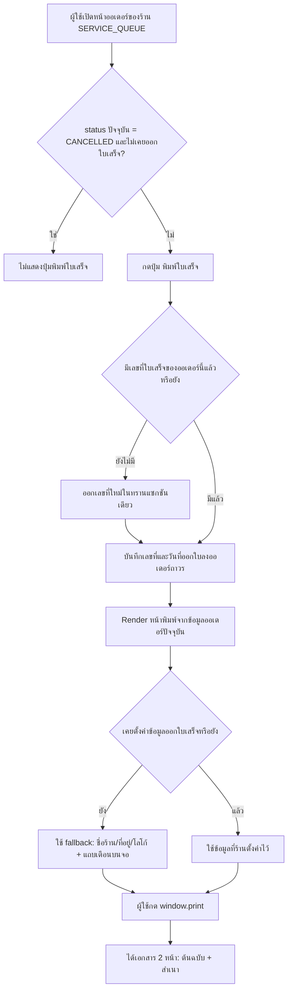
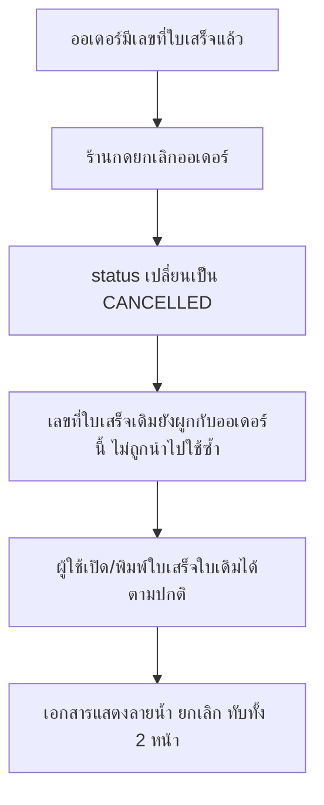

> **โมดูล:** M00065-ServiceReceiptPrinting
> **ประเภทเอกสาร:** Business Requirements Document (BRD) - NON-TECHNICAL
> **เวอร์ชัน:** 1.0
> **วันที่จัดทำ:** 2026-09-24
> **สถานะ:** Draft
> **เจ้าของเอกสาร:** BA (ดู [[Feature-Docs-Ownership]])

# BRD: พิมพ์ใบเสร็จรับเงิน (Service Receipt Printing) (Business Requirements Document)

---

## 1. บทนำ

### 1.1 วัตถุประสงค์ของเอกสาร

เอกสารนี้มีวัตถุประสงค์เพื่อ:
1. อธิบายความต้องการหลักของการพิมพ์ใบเสร็จรับเงินสำหรับร้าน SERVICE_QUEUE
2. กำหนดขอบเขตการทำงาน — การตั้งค่าข้อมูลออกใบเสร็จ, การออกเลขที่ใบเสร็จ, การพิมพ์, และพฤติกรรมเมื่อออเดอร์ถูกยกเลิกภายหลัง
3. อธิบายเงื่อนไขการใช้งาน สิทธิ์ และกฎทางธุรกิจของเลขที่ใบเสร็จ
4. สร้างความเข้าใจร่วมกันระหว่างทีมธุรกิจและทีมพัฒนาให้ตรงกับ PRD ก่อนเริ่มออกแบบทางเทคนิค (SRS/SDS)

### 1.2 ขอบเขตของระบบ

**ระบบพิมพ์ใบเสร็จรับเงิน** คือฟีเจอร์ที่เพิ่มปุ่ม "พิมพ์ใบเสร็จ" ในหน้าออเดอร์ของร้านประเภท "สินค้าและบริการ" (`SERVICE_QUEUE`) เปิดหน้าเว็บที่จัดวางตามผังใบเสร็จมาตรฐาน A4 ให้ผู้ใช้สั่งพิมพ์ผ่านหน้าต่างพิมพ์ของเบราว์เซอร์

**เข้าสู่ระบบ (Input):**
- ข้อมูลออเดอร์ (`Order`, `OrderItem`, `OrderPayment`) ที่มีอยู่แล้วในระบบ
- ข้อมูลร้าน (`Shop.vertical`, `Shop.logo`, `Shop.address`, `Shop.shopName`)
- ข้อมูลออกใบเสร็จที่ร้านตั้งค่าเอง (ชื่อบนใบเสร็จ/ที่อยู่/เลขภาษี/เบอร์/ตราประทับ)
- การกดปุ่ม "พิมพ์ใบเสร็จ" ของผู้ใช้ที่มีสิทธิ์

**ออกจากระบบ (Output):**
- หน้าพิมพ์ HTML/CSS ขนาด A4 ที่พร้อมสั่ง `window.print()` แสดง 2 หน้า (ต้นฉบับ + สำเนา)
- เลขที่ใบเสร็จที่บันทึกถาวรผูกกับออเดอร์นั้น

**ระบบที่เกี่ยวข้อง:**
- ระบบออเดอร์ (Simple OMS) และการนัดคิวบริการ (Service Appointment, feature 00024)
- ระบบสิทธิ์สมาชิกร้าน (`ShopMember`)
- ระบบตั้งค่าร้าน (`/shop`)

### 1.3 กลุ่มผู้ใช้งาน

| กลุ่มผู้ใช้ | บทบาท | สิทธิ์การใช้งาน |
|-----------|--------|----------------|
| **เจ้าของร้าน (OWNER)** | ผู้ดูแลร้าน SERVICE_QUEUE | ตั้งค่าข้อมูลออกใบเสร็จ + พิมพ์ใบเสร็จได้ทุกออเดอร์ของร้าน |
| **พนักงานร้าน (ADMIN, `ShopMember`)** | ผู้ดูแลร้านที่ถูกเชิญ | ตั้งค่าข้อมูลออกใบเสร็จ + พิมพ์ใบเสร็จได้ทุกออเดอร์ของร้าน (สิทธิ์เท่า OWNER สำหรับฟีเจอร์นี้) |
| **ลูกค้าที่รับบริการ** | ผู้รับเอกสาร | ไม่มีสิทธิ์เข้าระบบ — รับเฉพาะเอกสารที่พิมพ์ออกมา |

---

## 2. ความต้องการหลัก (Functional Requirements)

### 2.1 การตั้งค่าข้อมูลออกใบเสร็จ (Receipt Profile Settings)

#### FR-RCP-01: ตั้งค่าข้อมูลออกใบเสร็จ

**User Story:**
> ในฐานะเจ้าของ/ผู้ดูแลร้าน SERVICE_QUEUE ฉันต้องการตั้งค่าชื่อ ที่อยู่ เลขประจำตัวผู้เสียภาษี เบอร์โทร และรูปตราประทับที่จะแสดงบนใบเสร็จ เพื่อไม่ต้องกรอกข้อมูลร้านซ้ำทุกครั้งที่พิมพ์

**Acceptance Criteria:**
- [ ] AC-RCP-01: การ์ด "ข้อมูลออกใบเสร็จ" ปรากฏในหน้า `/shop` เฉพาะเมื่อ `Shop.vertical = SERVICE_QUEUE` เท่านั้น — ร้าน ONLINE_SALES/LODGING ไม่เห็นการ์ดนี้
- [ ] AC-RCP-02: ช่อง "ชื่อบนใบเสร็จ" มีค่าเริ่มต้นเป็น `Shop.shopName` เมื่อยังไม่เคยตั้งค่า และแก้ไขได้อิสระ
- [ ] AC-RCP-03: เลขประจำตัวผู้เสียภาษีและรูปตราประทับเป็นช่องไม่บังคับกรอก — บันทึกว่างได้โดยไม่มี error
- [ ] AC-RCP-04: เมื่อกรอกเลขประจำตัวผู้เสียภาษี ระบบตรวจว่าเป็นตัวเลข 13 หลัก ถ้าไม่ใช่ต้องแสดง error message ที่ช่องกรอกโดยไม่บันทึก
- [ ] AC-RCP-05: เฉพาะสมาชิกร้านที่มี `ShopMember.role` = OWNER หรือ ADMIN เท่านั้นที่บันทึกการเปลี่ยนแปลงได้ — สมาชิกอื่น (ถ้ามี) เห็นได้แต่แก้ไม่ได้/ไม่เห็นปุ่มบันทึก

#### FR-RCP-02: fallback เมื่อยังไม่ตั้งค่า

**User Story:**
> ในฐานะร้านที่ยังไม่เคยกรอก "ข้อมูลออกใบเสร็จ" ฉันต้องการพิมพ์ใบเสร็จได้ทันทีโดยใช้ข้อมูลร้านที่มีอยู่แล้ว เพื่อไม่ต้องตั้งค่าอะไรก่อนใช้งานครั้งแรก

**Acceptance Criteria:**
- [ ] AC-RCP-06: ร้านที่ไม่เคยตั้งค่าข้อมูลออกใบเสร็จเลย ยังกดพิมพ์ใบเสร็จได้สำเร็จ โดยหัวใบเสร็จแสดง `Shop.shopName` / `Shop.address` / `Shop.logo` แทน
- [ ] AC-RCP-07: เมื่ออยู่ในสถานะ fallback หน้าจอ (ไม่ใช่เอกสารที่พิมพ์ออกมา) ต้องแสดงแถบเตือนพร้อมลิงก์พาไปหน้าตั้งค่า "ข้อมูลออกใบเสร็จ"
- [ ] AC-RCP-08: ช่องเลขประจำตัวผู้เสียภาษีและรูปตราประทับที่ไม่มีข้อมูล (ทั้งกรณีตั้งค่าแล้วแต่เว้นว่าง และกรณี fallback) ต้องไม่แสดงเป็นช่องว่างเปล่าที่ดูเหมือนพิมพ์ผิด — ซ่อนแถวนั้นทั้งแถวแทน

### 2.2 การออกเลขที่ใบเสร็จ (Receipt Numbering)

#### FR-RCP-03: ออกเลขที่ใบเสร็จครั้งแรกที่กดพิมพ์

**User Story:**
> ในฐานะร้าน ฉันต้องการให้ระบบออกเลขที่ใบเสร็จให้อัตโนมัติตอนพิมพ์ครั้งแรก เพื่อให้ทุกใบมีเลขอ้างอิงโดยไม่ต้องกรอกเอง

**Acceptance Criteria:**
- [ ] AC-RCP-09: ออเดอร์ที่ยังไม่เคยออกใบเสร็จ เมื่อกดพิมพ์ครั้งแรก ระบบต้องออกเลขที่รูปแบบ `CA` + ปี ค.ศ. 4 หลัก + เดือน 2 หลัก (เวลาไทย) + ลำดับ 4 หลัก เช่น `CA2026090043`
- [ ] AC-RCP-10: ลำดับ 4 หลักท้ายรันต่อเนื่องเฉพาะภายในร้านเดียวกันและเดือนปฏิทินไทยเดียวกัน เริ่มที่ `0001` ทุกครั้งที่ขึ้นเดือนใหม่
- [ ] AC-RCP-11: ไม่มีสองออเดอร์ใดของร้านเดียวกันได้เลขที่ใบเสร็จซ้ำกัน (ตรวจได้ด้วย query uniqueness รายร้าน/รายเดือน)
- [ ] AC-RCP-12: ออเดอร์ที่ถูกยกเลิกก่อนเคยออกใบเสร็จเลย จะไม่มีการออกเลขที่ให้ — เลขที่ที่ "ควรจะเป็นของใบนั้น" ไม่ถูกข้ามในลำดับถัดไป (เพราะยังไม่เคยถูกจองเลย)

#### FR-RCP-04: เลขที่คงที่ตลอดไป (พิมพ์ซ้ำได้เลขเดิม)

**User Story:**
> ในฐานะร้าน ฉันต้องการพิมพ์ใบเสร็จซ้ำของออเดอร์เดิมได้เลขที่และวันที่เดียวกันทุกครั้ง เพื่อให้เอกสารอ้างอิงตรงกันไม่ว่าจะพิมพ์กี่รอบ

**Acceptance Criteria:**
- [ ] AC-RCP-13: ออเดอร์ที่เคยออกใบเสร็จแล้ว เมื่อกดพิมพ์ซ้ำ ระบบต้องแสดงเลขที่และวันที่ออกใบเดิมทุกประการ ไม่ออกเลขใหม่
- [ ] AC-RCP-14: สองเครื่อง (หรือสอง browser tab) กดพิมพ์ออเดอร์เดียวกันเป็นครั้งแรกพร้อมกัน ต้องได้เลขที่ใบเสร็จเดียวกันทั้งคู่ — ห้ามเกิดเลขสองเลขสำหรับออเดอร์เดียว และห้ามข้ามเลขถัดไปโดยไม่มีเหตุผล
- [ ] AC-RCP-15: การเปลี่ยนแปลงข้อมูลของออเดอร์ภายหลัง (เช่น แก้รายการ/ยอดเงิน) ไม่กระทบเลขที่และวันที่ออกใบเดิม — ใบเสร็จยังแสดงเลขที่/วันที่เดิม แต่รายการ/ยอดเงินจะปรับตามข้อมูลออเดอร์ปัจจุบัน

#### FR-RCP-05: รีเซ็ตเลขทุกเดือนตามเวลาไทย

**User Story:**
> ในฐานะร้าน ฉันต้องการให้เลขที่ใบเสร็จเริ่มนับใหม่ทุกเดือนตามเวลาไทย เพื่อให้เลขไม่ยาวเกินไปและอ้างอิงตามรอบบัญชีรายเดือนได้ง่าย

**Acceptance Criteria:**
- [ ] AC-RCP-16: ใบเสร็จที่ออกในเดือนปฏิทินไทยถัดไป (เช่น 1 กันยายน 00:01 น. เวลาไทย) ต้องมีเลขเดือนในเลขที่ต่างจากใบที่ออกในเดือนก่อนหน้า แม้เวลา UTC จะยังเป็นวันเดียวกันของเดือนก่อน (17:00 UTC ของวันสุดท้ายเดือนก่อน = 00:00 น. เวลาไทยของวันที่ 1 เดือนถัดไป)
- [ ] AC-RCP-17: ใบแรกของเดือนใหม่เริ่มลำดับที่ `0001` เสมอ โดยไม่เกี่ยวกับเลขลำดับสูงสุดของเดือนก่อนหน้า

### 2.3 การพิมพ์ใบเสร็จ (Printing)

#### FR-RCP-06: หน้าพิมพ์แสดงข้อมูลออเดอร์ครบตามผังใบเสร็จอ้างอิง

**User Story:**
> ในฐานะร้าน ฉันต้องการให้ใบเสร็จแสดงรายการ ยอดเงิน ผู้ซื้อ ผู้ขายให้ครบถูกต้องตามผังใบเสร็จมาตรฐาน เพื่อให้เอกสารใช้เป็นหลักฐานทางบัญชีได้

**Acceptance Criteria:**
- [ ] AC-RCP-18: ตารางรายการแสดงทุกแถวของ `OrderItem` (ชื่อ + คำอธิบายบรรทัดที่สอง ถ้ามี, จำนวน, ราคาต่อหน่วย, ยอดรวมต่อแถว) เรียงลำดับตามที่บันทึกในออเดอร์
- [ ] AC-RCP-19: ส่วนลด (`Order.discount`) และภาษีมูลค่าเพิ่ม (`Order.vatAmount`) แสดงเป็นบรรทัดแยกในสรุปยอด **เฉพาะเมื่อมีค่า** (ไม่ null และไม่เท่ากับ 0) — ออเดอร์ที่ไม่มีส่วนลด/ภาษี จะไม่มีบรรทัดว่างเหล่านี้ปรากฏ
- [ ] AC-RCP-20: "จำนวนเงินรวมทั้งสิ้น" แสดงทั้งตัวเลขและคำอ่านภาษาไทยในวงเล็บ ท้ายด้วย "ถ้วน" เมื่อไม่มีสตางค์ หรือ "...บาท...สตางค์" เมื่อมีเศษสตางค์
- [ ] AC-RCP-21: ชื่อผู้ขายบนใบเสร็จ = `User.displayName` ของ `Order.createdByUserId` — ถ้าเป็น `null` (ออเดอร์ที่ระบบสร้างให้ ไม่มีคนกดสร้าง) ให้เว้นว่างช่องนี้ ไม่แสดงคำว่า "ระบบ" หรือค่าอื่นแทน
- [ ] AC-RCP-22: ออเดอร์ที่ไม่มีรายการ (`OrderItem` 0 แถว) ต้องยังพิมพ์ได้โดยแสดงตารางว่างและยอดรวม 0 บาท (คำอ่าน "ศูนย์บาทถ้วน") โดยไม่มี error
- [ ] AC-RCP-23: ยอดรวมที่มีเศษสตางค์ (เช่น 350.50 บาท) ต้องแสดงตัวเลขและคำอ่านไทยถูกต้องตรงกัน ("สามร้อยห้าสิบบาทห้าสิบสตางค์")

#### FR-RCP-07: ทำเครื่องหมายวิธีชำระเงินอัตโนมัติ

**User Story:**
> ในฐานะร้าน ฉันต้องการให้ระบบติ๊กช่องวิธีชำระเงินให้อัตโนมัติเมื่อรู้ข้อมูล เพื่อลดขั้นตอนติ๊กมือ

**Acceptance Criteria:**
- [ ] AC-RCP-24: ออเดอร์ที่จัดเป็นเงินสด (`isCashPayment(Order.paymentMethod)` เป็นจริง หรือมี `OrderPayment` ที่ไม่ถูก void ด้วย `method = 'CASH'`) ต้องติ๊กช่อง "เงินสด" อัตโนมัติ
- [ ] AC-RCP-25: ออเดอร์ที่ระบุการโอนไว้ชัดเจน (`Order.paymentMethod` ตรงกับ `TRANSFER|PROMPTPAY|โอน|พร้อมเพย์` หรือมี `OrderPayment` ที่ไม่ถูก void ด้วย `method = 'TRANSFER'`) ต้องติ๊กช่อง "โอนเงิน" อัตโนมัติ — 🛑 **ห้ามใช้ `paymentMethodLabel()` ที่ตีค่าที่ไม่รู้จัก/null เป็น "โอน"** (ป้ายนั้นเลือกทางโอนเพื่อโชว์บัญชี แต่บนใบเสร็จ การติ๊กโดยไม่มีหลักฐาน = บันทึกเท็จบนเอกสารทางการ; ไม่รู้ = เว้นว่างตาม AC-RCP-28)
- [ ] AC-RCP-26: ออเดอร์ที่มีทั้งรายการรับเงินสดและรายการโอน (เช่น มัดจำเงินสด + ส่วนที่เหลือโอน ทั้งสองรายการไม่ถูก void) ต้องติ๊กทั้งสองช่องพร้อมกัน
- [ ] AC-RCP-27: ช่อง "เช็ค" และ "บัตรเครดิต" ไม่ถูกติ๊กโดยระบบไม่ว่ากรณีใด (ไม่มีแหล่งข้อมูลรองรับ) — เว้นว่างเสมอให้กรอกด้วยมือ
- [ ] AC-RCP-28: ออเดอร์ที่ไม่เข้าเงื่อนไขใดเลย (ไม่รู้วิธีชำระเงิน) ทุกช่องเว้นว่าง ไม่ติ๊กมั่ว

#### FR-RCP-08: พิมพ์ 2 หน้า (ต้นฉบับ + สำเนา)

**User Story:**
> ในฐานะร้าน ฉันต้องการให้กดพิมพ์ 1 ครั้งได้เอกสาร 2 หน้าคือต้นฉบับกับสำเนา เพื่อมอบให้ลูกค้าและเก็บไว้ที่ร้านได้ในคราวเดียว

**Acceptance Criteria:**
- [ ] AC-RCP-29: หน้าพิมพ์มี 2 หน้า A4 เนื้อหาเดียวกันทุกประการ ต่างกันเฉพาะป้าย "ต้นฉบับ" กับ "สำเนา"
- [ ] AC-RCP-30: กด `window.print()` ครั้งเดียวส่งทั้ง 2 หน้าเข้าคิวพิมพ์/หน้าต่างพิมพ์ของเบราว์เซอร์พร้อมกัน ผู้ใช้เลือกบันทึกเป็น PDF จากหน้าต่างพิมพ์ของระบบปฏิบัติการ/เบราว์เซอร์ได้ตามปกติ

### 2.4 สิทธิ์การเข้าถึง (Authorization)

#### FR-RCP-09: จำกัดเมนู/ปุ่มเฉพาะร้าน SERVICE_QUEUE

**User Story:**
> ในฐานะร้าน ONLINE_SALES หรือ LODGING ฉันไม่ต้องการเห็นปุ่ม/เมนูของฟีเจอร์ที่ไม่เกี่ยวกับร้านฉัน เพื่อไม่ให้หน้าจอรก

**Acceptance Criteria:**
- [ ] AC-RCP-31: ปุ่ม "พิมพ์ใบเสร็จ" ในหน้าออเดอร์ปรากฏเฉพาะเมื่อ `Shop.vertical = SERVICE_QUEUE` เท่านั้น
- [ ] AC-RCP-32: การยิง request พิมพ์ใบเสร็จโดยตรง (ข้ามการเห็นปุ่ม) กับออเดอร์ของร้านที่ไม่ใช่ SERVICE_QUEUE ต้องถูกปฏิเสธที่ฝั่งเซิร์ฟเวอร์ ไม่ใช่พึ่งการซ่อนปุ่มฝั่งหน้าจออย่างเดียว

#### FR-RCP-10: จำกัดสิทธิ์แก้ไขข้อมูลออกใบเสร็จ

**User Story:**
> ในฐานะเจ้าของร้าน ฉันต้องการให้เฉพาะคนที่ไว้ใจ (OWNER/ADMIN) แก้ไขข้อมูลที่จะพิมพ์ออกไปให้ลูกค้าได้ เพื่อป้องกันข้อมูลผิดพลาดบนเอกสารทางการ

**Acceptance Criteria:**
- [ ] AC-RCP-33: การบันทึกข้อมูลออกใบเสร็จของผู้ใช้ที่ไม่ใช่ OWNER/ADMIN ของร้านนั้นต้องถูกปฏิเสธที่ฝั่งเซิร์ฟเวอร์
- [ ] AC-RCP-34: การกดปุ่ม "พิมพ์ใบเสร็จ" (อ่านอย่างเดียว ไม่แก้ข้อมูล) ไม่จำกัดเฉพาะ OWNER/ADMIN — สมาชิกร้านที่เข้าถึงหน้าออเดอร์ได้ตามสิทธิ์เดิมของระบบพิมพ์ได้ตามปกติ

### 2.5 ออเดอร์ที่ถูกยกเลิกหลังออกใบ (Cancelled After Issue)

#### FR-RCP-11: ใบเสร็จของออเดอร์ที่ถูกยกเลิกภายหลังยังเปิด/พิมพ์ได้

**User Story:**
> ในฐานะร้าน ฉันต้องการเปิดดูใบเสร็จเดิมได้แม้ออเดอร์นั้นถูกยกเลิกไปแล้วภายหลัง เพื่อใช้ตรวจสอบย้อนหลังว่าเคยออกใบเสร็จอะไรไปบ้าง

**Acceptance Criteria:**
- [ ] AC-RCP-35: ออเดอร์ที่มีเลขที่ใบเสร็จอยู่แล้วก่อนถูกยกเลิก ยังกด "พิมพ์ใบเสร็จ" ซ้ำได้ตามปกติ ไม่ถูกซ่อนปุ่มไปเพราะสถานะเปลี่ยนเป็น CANCELLED
- [ ] AC-RCP-36: เอกสารของออเดอร์ที่ถูกยกเลิกแล้วต้องมีลายน้ำ/ป้ายคำว่า "ยกเลิก" ที่มองเห็นชัดเจนบนทั้ง 2 หน้า (ต้นฉบับและสำเนา)
- [ ] AC-RCP-37: เลขที่ใบเสร็จของออเดอร์ที่ถูกยกเลิกไปแล้ว ห้ามถูกนำไปออกให้ออเดอร์อื่นซ้ำไม่ว่ากรณีใด
- [ ] AC-RCP-38: ออเดอร์ที่ถูกยกเลิก**ก่อน**เคยออกใบเสร็จ (ไม่เคยมีเลขที่มาก่อน) ต้องไม่มีปุ่ม "พิมพ์ใบเสร็จ" ให้กดอีกต่อไป — สอดคล้องกับ AC-RCP-31 กลุ่มที่จำกัดว่าใบเสร็จออกให้ธุรกรรมที่ไม่เคยสำเร็จไม่ได้

---

## 3. Acceptance Criteria สรุป

### 3.1 การตั้งค่าและ fallback

**เมื่อระบบทำงานถูกต้อง:**
- ✅ ร้าน SERVICE_QUEUE ตั้งค่าข้อมูลออกใบเสร็จได้เองในหน้า `/shop` เฉพาะ OWNER/ADMIN
- ✅ ร้านที่ยังไม่ตั้งค่ายังพิมพ์ใบเสร็จได้ทันที ด้วยข้อมูลร้านที่มีอยู่แล้วเป็นค่าเริ่มต้น พร้อมแถบเตือนบนจอ (ไม่ปรากฏบนเอกสารที่พิมพ์)

### 3.2 เลขที่ใบเสร็จ

**เมื่อระบบทำงานถูกต้อง:**
- ✅ เลขที่ใบเสร็จออกครั้งแรกที่กดพิมพ์เท่านั้น รูปแบบ `CA` + ปีคศ 4 หลัก + เดือน 2 หลัก (เวลาไทย) + ลำดับ 4 หลัก
- ✅ พิมพ์ซ้ำกี่ครั้งก็ได้เลขที่/วันที่เดิม ไม่มีเลขซ้ำ ไม่มีเลขข้ามระหว่างร้าน/เดือนเดียวกัน แม้กดพร้อมกันจาก 2 เครื่อง
- ✅ ลำดับรีเซ็ตเป็น `0001` เมื่อขึ้นเดือนใหม่ตามเวลาไทย

### 3.3 เนื้อหาใบเสร็จ

**เมื่อออเดอร์มีข้อมูลครบ:**
- ✅ รายการ/ยอดรวม/ส่วนลด (เมื่อมี)/ภาษี (เมื่อมี) ตรงกับ `Order`/`OrderItem` ปัจจุบัน
- ✅ ยอดเงินมีคำอ่านภาษาไทยถูกต้องรวมกรณีมีสตางค์และกรณี 0 บาท
- ✅ วิธีชำระเงินติ๊กอัตโนมัติเฉพาะเงินสด/โอนเงินเมื่อมีข้อมูลรองรับ ช่องอื่นเว้นว่างเสมอ

**เมื่อออเดอร์ถูกยกเลิกหลังออกใบแล้ว:**
- ✅ ใบเสร็จยังเปิด/พิมพ์ซ้ำได้ พร้อมลายน้ำ "ยกเลิก" ชัดเจนทั้ง 2 หน้า

---

## 4. Business Flows (กระบวนการทำงาน)

### 4.1 Flow หลัก: พิมพ์ใบเสร็จจากหน้าออเดอร์

### 4.2 Flow: ออเดอร์ถูกยกเลิกหลังจากเคยออกใบเสร็จแล้ว

---

## 5. Use Case Scenarios (สถานการณ์การใช้งานจริง)

### Scenario 1: พิมพ์ใบเสร็จครั้งแรก (Best Case)

**ผู้เกี่ยวข้อง:** พนักงานร้าน (ADMIN), ลูกค้า

**เงื่อนไขเริ่มต้น:**
- ออเดอร์ SERVICE_QUEUE สถานะ CONFIRMED ยังไม่เคยออกใบเสร็จ
- ร้านตั้งค่าข้อมูลออกใบเสร็จไว้แล้วครบทุกช่อง

**ขั้นตอน:**
1. พนักงานเปิดออเดอร์ กดปุ่ม "พิมพ์ใบเสร็จ"
2. ระบบออกเลขที่ `CA2026090001` (ใบแรกของเดือนนี้) บันทึกวันที่ออกใบ = วันนี้
3. หน้าพิมพ์แสดงข้อมูลครบตามที่ร้านตั้งค่าไว้ วิธีชำระเงินติ๊กอัตโนมัติตรงกับที่ลูกค้าจ่าย
4. พนักงานกดพิมพ์ ได้ต้นฉบับมอบลูกค้า สำเนาเก็บที่ร้าน

**ผลลัพธ์:**
- ออเดอร์มีเลขที่ใบเสร็จถาวรผูกอยู่ พิมพ์ซ้ำครั้งต่อไปได้เลขเดิม

### Scenario 2: พิมพ์ซ้ำหลังออเดอร์ถูกยกเลิก

**ผู้เกี่ยวข้อง:** เจ้าของร้าน

**เงื่อนไขเริ่มต้น:**
- ออเดอร์เคยออกใบเสร็จเลขที่ `CA2026090015` ไปแล้ว
- ต่อมาลูกค้ายกเลิกงาน ร้านกดยกเลิกออเดอร์ (status = CANCELLED)

**ขั้นตอน:**
1. เจ้าของร้านเปิดออเดอร์ที่ถูกยกเลิกแล้ว เห็นปุ่ม "พิมพ์ใบเสร็จ" ยังอยู่
2. กดพิมพ์ซ้ำ ได้เลขที่และวันที่เดิม (`CA2026090015`)
3. เอกสารมีลายน้ำ "ยกเลิก" ทับทั้งต้นฉบับและสำเนา

**ผลลัพธ์:**
- เจ้าของร้านใช้เอกสารนี้ตรวจสอบย้อนหลังได้ โดยรู้ชัดจากลายน้ำว่าธุรกรรมนี้ไม่สมบูรณ์แล้ว
- ไม่มีการออกเลขที่ใหม่ให้ออเดอร์ที่ถูกยกเลิกไปแล้ว

### Scenario 3: กดพิมพ์พร้อมกัน 2 เครื่อง (Concurrency)

**ผู้เกี่ยวข้อง:** พนักงาน 2 คน (เครื่องคิดเงินหน้าร้าน + เครื่อง back office)

**เงื่อนไขเริ่มต้น:**
- ออเดอร์เดียวกันยังไม่เคยออกใบเสร็จ ถูกเปิดพร้อมกันในสองเครื่อง

**ขั้นตอน:**
1. พนักงานทั้งสองคนกด "พิมพ์ใบเสร็จ" ในเวลาไล่เลี่ยกัน
2. ระบบออกเลขที่ให้เพียงเลขเดียว (เช่น `CA2026090022`) ผูกกับออเดอร์นี้
3. เครื่องที่มาทีหลังได้เลขที่เดียวกันกับเครื่องแรก ไม่ใช่เลขถัดไป

**ผลลัพธ์:**
- ทั้งสองเครื่องเห็นใบเสร็จเลขเดียวกัน ไม่มีเลขซ้ำหรือเลขหายในลำดับของร้าน

---

## 6. ความต้องการด้านคุณภาพ (Quality Requirements)

### 6.1 ความถูกต้องของข้อมูล
- เลขที่ใบเสร็จต้องไม่ซ้ำและไม่ข้ามเลขภายในร้าน/เดือนเดียวกันไม่ว่าจะมีการกดพิมพ์พร้อมกันกี่ครั้ง
- ยอดเงิน/รายการที่แสดงบนใบเสร็จต้องตรงกับข้อมูลออเดอร์ปัจจุบัน ณ เวลาที่เปิดหน้าพิมพ์เสมอ
- คำอ่านตัวเลขเป็นภาษาไทยต้องตรงกับตัวเลขที่แสดงทุกกรณี รวมกรณีมีสตางค์และกรณี 0 บาท

### 6.2 ความรวดเร็ว
- หน้าพิมพ์ต้องเปิดขึ้นภายใน 2 วินาทีหลังกดปุ่ม "พิมพ์ใบเสร็จ" ในสภาพเครือข่ายปกติ

### 6.3 ความน่าเชื่อถือ
- การออกเลขที่ใบเสร็จต้องเป็นการดำเนินการแบบ atomic (ออกเลข + บันทึกผูกกับออเดอร์ในธุรกรรมเดียว) เพื่อกันเลขซ้ำ/เลขหายเมื่อมีการเรียกพร้อมกัน
- ระบบต้องไม่ทำให้ข้อมูลออเดอร์เดิมเปลี่ยนแปลง (ยกเว้นเลขที่/วันที่ออกใบที่บันทึกเพิ่ม) จากการกดพิมพ์

### 6.4 ความปลอดภัย
- ต้องตรวจสิทธิ์ที่ฝั่งเซิร์ฟเวอร์ทุกครั้งว่าออเดอร์ที่ขอพิมพ์เป็นของร้าน SERVICE_QUEUE ที่ผู้ใช้มีสิทธิ์เข้าถึงจริง ห้ามพึ่งการซ่อนปุ่มฝั่งหน้าจออย่างเดียว
- การแก้ไขข้อมูลออกใบเสร็จต้องตรวจสิทธิ์ OWNER/ADMIN ของร้านนั้นที่ฝั่งเซิร์ฟเวอร์เสมอ

### 6.5 ความสะดวกในการใช้งาน (Usability)
- ใช้งานฟีเจอร์นี้ได้ทันทีโดยไม่ต้องตั้งค่าอะไรก่อน (fallback ครอบคลุม)
- ปุ่ม "พิมพ์ใบเสร็จ" เข้าถึงได้จากหน้าออเดอร์ที่ผู้ใช้เปิดอยู่แล้วเป็นประจำ ไม่ต้องไปหน้าใหม่

---

## 7. ข้อจำกัด (Constraints)

### 7.1 ข้อจำกัดทางธุรกิจ
- ใบเสร็จนี้ไม่ใช่ใบกำกับภาษี — ไม่มีการคำนวณ/แสดงผลตามข้อกำหนดใบกำกับภาษีเต็มรูปของกรมสรรพากร
- ใช้ได้เฉพาะร้าน `Shop.vertical = SERVICE_QUEUE` เท่านั้นในเวอร์ชันนี้
- prefix เลขที่ใบเสร็จ (`CA`) ตายตัว ร้านไม่สามารถกำหนดเองได้

### 7.2 ข้อจำกัดทางเทคนิค
- ไม่มีการสร้างไฟล์ PDF ฝั่งเซิร์ฟเวอร์ — ผู้ใช้ต้องพึ่งหน้าต่างพิมพ์ของเบราว์เซอร์/ระบบปฏิบัติการเพื่อบันทึกเป็น PDF เอง
- ยังไม่มีตัวแปลงตัวเลขเป็นคำอ่านภาษาไทยในระบบปัจจุบัน ต้องพัฒนาใหม่
- ยังไม่มีกลไกออกเลขที่แบบรันต่อร้าน/รีเซ็ตรายเดือนในระบบปัจจุบัน ต้องออกแบบใหม่ในระดับฐานข้อมูล/service layer (รายละเอียดอยู่ใน SRS/DATABASE ของฟีเจอร์นี้)
- ข้อมูลหัวใบเสร็จ (ชื่อ/ที่อยู่/เลขภาษี/เบอร์/ตราประทับ) อ่านสดจากการตั้งค่าร้าน ไม่ได้ snapshot ต่อออเดอร์ — การแก้ไขข้อมูลร้านภายหลังมีผลย้อนหลังกับใบเสร็จเก่าที่พิมพ์ซ้ำ (ดูสมมติฐานใน PRD §9.2)

---

## 8. กฎทางธุรกิจ (Business Rules)

### 8.1 กฎการออกเลขที่ใบเสร็จ
- BR-RCP-01: เลขที่ใบเสร็จออกครั้งเดียวต่อออเดอร์ ตอนกดพิมพ์ครั้งแรกเท่านั้น
- BR-RCP-02: รูปแบบเลขที่ = `CA` + ปีคริสต์ศักราช 4 หลัก + เดือน 2 หลัก (เวลาไทย, Asia/Bangkok) + ลำดับรันต่อร้าน 4 หลัก
- BR-RCP-03: ลำดับรันต่อร้านรีเซ็ตเป็น `0001` เมื่อขึ้นเดือนปฏิทินไทยใหม่
- BR-RCP-04: ห้ามนำเลขที่กลับมาใช้ซ้ำไม่ว่ากรณีใด รวมถึงเมื่อออเดอร์เจ้าของเลขนั้นถูกยกเลิกภายหลัง
- BR-RCP-05: การออกเลขที่ต้องเป็นการดำเนินการแบบ atomic เพื่อรองรับการเรียกพร้อมกันจากหลายเครื่อง โดยไม่เกิดเลขซ้ำหรือเลขกระโดดข้ามที่อธิบายไม่ได้
- BR-RCP-06: ออเดอร์สถานะ `DRAFTED` (ร่างจากระบบสร้างออเดอร์อัตโนมัติจากแชท ที่ยังไม่มีรายการสินค้าและยอดเป็น 0 เสมอ) ไม่ถือเป็นออเดอร์ที่ออกใบเสร็จได้ — ต้องถูกยืนยันเป็นออเดอร์จริงก่อน

### 8.2 กฎการพิมพ์และเนื้อหาใบเสร็จ
- BR-RCP-07: ปุ่ม/เมนูพิมพ์ใบเสร็จปรากฏและใช้งานได้เฉพาะออเดอร์ของร้านที่ `Shop.vertical = SERVICE_QUEUE`
- BR-RCP-08: ออเดอร์ที่ status = `CANCELLED` และไม่เคยมีเลขที่ใบเสร็จมาก่อน จะไม่สามารถออกใบเสร็จใหม่ได้
- BR-RCP-09: ออเดอร์ที่มีเลขที่ใบเสร็จอยู่แล้วก่อนถูกยกเลิก ยังคงเปิดดู/พิมพ์ซ้ำได้ตลอดไป โดยเอกสารต้องมีลายน้ำ/ป้าย "ยกเลิก" ที่มองเห็นชัดเจนทั้งหน้าต้นฉบับและสำเนา
- BR-RCP-10: วันที่บนใบเสร็จ = วันที่ออกใบครั้งแรกเสมอ ไม่เปลี่ยนตามวันที่พิมพ์ซ้ำ
- BR-RCP-11: รายการ/ยอดเงิน/ส่วนลด/ภาษีที่แสดงบนใบเสร็จต้อง render จากข้อมูลออเดอร์ปัจจุบัน ณ เวลาที่เปิดหน้าพิมพ์ — บรรทัดส่วนลด/ภาษีแสดงเฉพาะเมื่อมีค่าจริงเท่านั้น
- BR-RCP-12: ยอดรวมต้องแสดงคำอ่านภาษาไทยกำกับในวงเล็บ ครอบคลุมกรณีมีเศษสตางค์และกรณี 0 บาท
- BR-RCP-13: ทำเครื่องหมายวิธีชำระเงินอัตโนมัติได้เฉพาะ "เงินสด" และ "โอนเงิน" ซึ่งมีข้อมูลรองรับในระบบ (`Order.paymentMethod` / `OrderPayment.method` ที่ไม่ถูก void) — ช่องอื่นเว้นว่างให้กรอกมือเสมอ
- BR-RCP-14: การพิมพ์ 1 ครั้งต้องได้เอกสาร 2 หน้าเสมอ คือ "ต้นฉบับ" และ "สำเนา" เนื้อหาเดียวกัน

### 8.3 กฎสิทธิ์การเข้าถึง
- BR-RCP-15: การแก้ไขข้อมูลออกใบเสร็จของร้าน จำกัดเฉพาะสมาชิกที่มี `ShopMember.role` เป็น OWNER หรือ ADMIN ของร้านนั้น
- BR-RCP-16: การกดพิมพ์ใบเสร็จ (อ่านอย่างเดียว) ไม่จำกัดเพิ่มเติมเกินกว่าสิทธิ์เข้าถึงหน้าออเดอร์เดิมของระบบ
- BR-RCP-17: ทุกการตรวจสิทธิ์และเงื่อนไข vertical ต้องบังคับที่ฝั่งเซิร์ฟเวอร์ ห้ามพึ่งการซ่อนปุ่มฝั่งหน้าจอเพียงอย่างเดียว

---

## 9. อภิธานศัพท์ (Glossary)

| คำศัพท์ | ความหมาย |
|---------|----------|
| **ใบเสร็จรับเงิน** | เอกสารยืนยันการรับเงินของร้าน SERVICE_QUEUE — ไม่ใช่ใบกำกับภาษี |
| **เลขที่ใบเสร็จ** | รหัสรูปแบบ `CA` + ปีคศ 4 หลัก + เดือน 2 หลัก + ลำดับ 4 หลัก รันต่อร้าน รีเซ็ตทุกเดือนตามเวลาไทย |
| **ข้อมูลออกใบเสร็จ (Receipt Profile)** | ชื่อ/ที่อยู่/เลขประจำตัวผู้เสียภาษี/เบอร์โทร/รูปตราประทับที่ร้านตั้งค่าเองสำหรับใช้บนหัวใบเสร็จ |
| **fallback** | ค่าที่ระบบใช้แทนเมื่อร้านยังไม่ตั้งค่าข้อมูลออกใบเสร็จ (ชื่อร้าน/ที่อยู่ร้าน/โลโก้ร้านที่มีอยู่แล้ว) |
| **ต้นฉบับ/สำเนา** | สองหน้าที่พิมพ์ออกมาต่อการพิมพ์ 1 ครั้ง มอบให้ลูกค้า (ต้นฉบับ) และเก็บที่ร้าน (สำเนา) |
| **ลายน้ำยกเลิก** | ป้าย/ลายน้ำที่แปะทับใบเสร็จของออเดอร์ที่ถูกยกเลิกหลังจากมีเลขที่ใบเสร็จแล้ว |
| **การออกเลขแบบ atomic** | การผูกเลขที่ใบเสร็จกับออเดอร์ในธุรกรรมฐานข้อมูลเดียวกับการตรวจ/จองลำดับถัดไป เพื่อกันเลขซ้ำเมื่อมีคำขอพร้อมกัน |
| **SERVICE_QUEUE** | ค่า `Shop.vertical` ของร้านที่รับนัดคิวเข้ารับบริการ ไม่มีการจัดส่งสินค้า — ป้ายบนจอ "สินค้าและบริการ" |

---

## 10. สรุป

เอกสาร BRD นี้อธิบายความต้องการหลักของ **ระบบพิมพ์ใบเสร็จรับเงิน (Service Receipt Printing)** แบบไม่ใช่เทคนิค

**จุดเด่นของระบบ:**
- ออกเอกสารรับเงินที่เป็นทางการจากข้อมูลออเดอร์ที่มีอยู่แล้วในระบบ ไม่ต้องพึ่งเครื่องมือนอกระบบ
- เลขที่ใบเสร็จออกแบบอัตโนมัติ ไม่ซ้ำ ไม่หาย แม้กดพร้อมกันจากหลายเครื่อง
- ใช้งานได้ทันทีแม้ยังไม่ตั้งค่าอะไรก่อน (fallback ครบ) และยังคงตรวจสอบย้อนหลังได้แม้ออเดอร์ถูกยกเลิกภายหลัง

**ผลลัพธ์ที่คาดหวัง:**
- ร้าน SERVICE_QUEUE อย่างน้อย 30% ตั้งค่าข้อมูลออกใบเสร็จภายใน 30 วันหลัง release
- ไม่มี incident เลขที่ใบเสร็จซ้ำหรือกระโดดข้ามที่อธิบายไม่ได้
- จำนวนใบเสร็จที่ออกจริงต่อเดือนเพิ่มขึ้นต่อเนื่อง

---

**หมายเหตุ:**
สำหรับความต้องการทางธุรกิจระดับภาพรวม/personas/KPI ดู [[PRD]] ของโมดูลนี้
สำหรับ technical specification (architecture/API/data/NFR) ดู [[SRS]] ของโมดูลนี้
