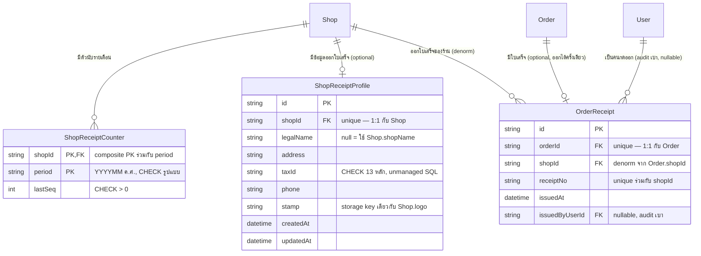

> **โมดูล:** M65-ServiceReceipt
> **ประเภทเอกสาร:** DATABASE Design
> **เวอร์ชัน:** 1.0
> **วันที่จัดทำ:** 2026-09-24
> **สถานะ:** Draft — schema + migration เขียนแล้วใน worktree `safepay-receipt` (ยังไม่ apply บนฐานใด ๆ — ผ่านแค่ `prisma validate`/`prisma generate`)
> **เจ้าของเอกสาร:** SA (safepay-database)

> 🛑 **HR13/14/15:** migration นี้ยังไม่ถูก apply ด้วยคำสั่งใด ๆ ในรอบนี้ (รันได้แค่ `prisma validate`/`prisma format`/`prisma generate` ตามกติกาที่ controller กำหนด) — controller เป็นผู้รัน `prisma migrate dev` บนฐาน local เอง และต้องแจ้ง user ก่อนเสมอว่า push เข้า `main` = migrate ขึ้น prod อัตโนมัติ (deploy รัน `prisma migrate deploy` ให้อยู่แล้ว)

---

## 1. Overview

ฟีเจอร์นี้เพิ่ม **3 ตารางใหม่ทั้งหมด** ไม่มีการ ALTER ตารางเดิม (`Shop`/`Order` มีแถวจริงบน prod — เพิ่มแค่ relation field ฝั่ง Prisma ซึ่งไม่สร้าง DDL):

| ตาราง | ความสัมพันธ์ | หน้าที่ |
|---|---|---|
| `ShopReceiptProfile` | 1:1 กับ `Shop` | ข้อมูลออกใบเสร็จของร้าน (ชื่อ/ที่อยู่/เลขผู้เสียภาษี/เบอร์/ตราประทับ) — ทุกฟิลด์ optional |
| `OrderReceipt` | 1:1 กับ `Order` | บันทึกว่าออเดอร์ใบนี้ออกใบเสร็จแล้ว พร้อมเลขที่ใบเสร็จที่ออกจริง |
| `ShopReceiptCounter` | 1:N กับ `Shop` (คีย์คือ `shopId`+`period`) | ตัวนับเลขที่ใบเสร็จของร้าน แยกตามเดือน (`period` = YYYYMM ค.ศ.) |

- **Store:** PostgreSQL 16 บน Supabase, ORM = Prisma (single store — ทั้งระบบไม่ใช่ polyglot)
- **เอกสารออกแบบต้นทาง:** งานนี้ถูกสั่งออกแบบ schema โดยตรงจากมติ user (ยังไม่มี SDS ของโมดูล 00065 ณ วันที่เขียน) — trace กลับได้เฉพาะข้อกำหนดที่ควบคุมงานนี้ (§7) เมื่อ SRS/SDS ของโมดูลนี้ถูกเขียนภายหลัง ต้องย้อนมาตรวจว่าตรงกันหรือไม่ (ระบุเป็น Open Question ท้ายเอกสาร)
- **Engine:** InnoDB ไม่เกี่ยว (Postgres) — ไม่มี charset setting แยก (utf8 ตาม cluster เดิม)

---

## 2. ERD

---

## 3. Tables

### 3.1 `ShopReceiptProfile` (PostgreSQL — Supabase)

ข้อมูลออกใบเสร็จของร้าน 1:1 กับ `Shop` ทุกฟิลด์เป็น optional โดยเจตนา — ร้านที่ยังไม่เคยเปิดหน้าตั้งค่านี้ยังพิมพ์ใบเสร็จได้ปกติ (fallback ไปใช้ `Shop.shopName` แทน `legalName`) ไม่มีแถว = ยังไม่เคยตั้งค่า ไม่ใช่ error

| Column | Type | Null | Default | Key |
|--------|------|------|---------|-----|
| `id` | `text` (uuid) | NO | `gen` (app-side uuid) | PK |
| `shopId` | `text` | NO | — | FK → `Shop.id` (Cascade), UNIQUE |
| `legalName` | `text` | YES | NULL | — |
| `address` | `text` | YES | NULL | — |
| `taxId` | `text` | YES | NULL | CHECK 13 หลัก (unmanaged SQL) |
| `phone` | `text` | YES | NULL | — |
| `stamp` | `text` | YES | NULL | storage key/fileId (แสดงผ่าน `toFileUrl()`), รูปแบบเดียวกับ `Shop.logo` |
| `createdAt` | `timestamp(3)` | NO | `CURRENT_TIMESTAMP` | — |
| `updatedAt` | `timestamp(3)` | NO | (Prisma `@updatedAt`) | — |

### 3.2 `OrderReceipt` (PostgreSQL — Supabase)

ใบเสร็จรับเงินที่ออกแล้วของออเดอร์ 1:1 กับ `Order` — แถวนี้มีขึ้นแปลว่าออเดอร์ใบนั้นออกใบเสร็จไปแล้วจริง (ออกซ้ำไม่ได้ในระดับ DB เพราะ `orderId` เป็น unique)

| Column | Type | Null | Default | Key |
|--------|------|------|---------|-----|
| `id` | `text` (uuid) | NO | `gen` (app-side uuid) | PK |
| `orderId` | `text` | NO | — | FK → `Order.id` (Cascade), UNIQUE |
| `shopId` | `text` | NO | — | FK → `Shop.id` (Cascade); denorm จาก `Order.shopId` |
| `receiptNo` | `text` | NO | — | UNIQUE ร่วมกับ `shopId` |
| `issuedAt` | `timestamp(3)` | NO | `CURRENT_TIMESTAMP` | — |
| `issuedByUserId` | `text` | YES | NULL | FK → `User.id` (SetNull); audit เบา |

**รูปแบบ `receiptNo`:** `"CA" + period(YYYYMM ค.ศ., เวลาไทย) + lastSeq pad 4 หลัก` เช่น `CA2026090043` — ประกอบที่ app layer ไม่มี CHECK บังคับรูปแบบนี้ที่ DB (ตัวที่บังคับ "ไม่ซ้ำจริง" คือ `@@unique([shopId, receiptNo])` ไม่ใช่รูปแบบตัวเลข)

### 3.3 `ShopReceiptCounter` (PostgreSQL — Supabase)

ตัวนับเลขที่ใบเสร็จของร้าน แยกตามเดือน — 1 แถวต่อ 1 คู่ (`shopId`, `period`) แถวนี้ **คือ** ตัวนับของคู่นั้นโดยตรง จึงใช้ `(shopId, period)` เป็น composite primary key แทนการมี `id` เดี่ยวแยกต่างหาก

| Column | Type | Null | Default | Key |
|--------|------|------|---------|-----|
| `shopId` | `text` | NO | — | PK (ร่วม), FK → `Shop.id` (Cascade) |
| `period` | `text` | NO | — | PK (ร่วม); รูปแบบ `YYYYMM` (ค.ศ., ตัดเดือนตามเวลาไทย); CHECK รูปแบบ 6 หลัก (unmanaged SQL) |
| `lastSeq` | `integer` | NO | — | CHECK `> 0` (unmanaged SQL) |

---

## 4. Indexes

| Table | Columns | Type | Rationale (query pattern ที่รองรับ) |
|-------|---------|------|--------------------------------------|
| `ShopReceiptProfile` | `(shopId)` | UNIQUE | บังคับ 1:1 กับ Shop + ใช้เป็น lookup หลักของหน้าตั้งค่า (`findUnique({ where: { shopId } })`) |
| `OrderReceipt` | `(orderId)` | UNIQUE | บังคับ 1:1 กับ Order — กันออกใบเสร็จซ้ำในระดับ DB แม้กดสองแท็บพร้อมกัน |
| `OrderReceipt` | `(shopId, receiptNo)` | UNIQUE (composite) | กันเลขที่ใบเสร็จซ้ำ**ภายในร้านเดียวกัน** (เลขที่ออกแยกช่วงตามร้าน — ร้าน A กับร้าน B ออก `CA2026090001` ซ้ำกันได้) ครอบคลุม `shopId` เดี่ยวเป็นคำนำหน้าด้วย จึงไม่ต้องเพิ่ม `@@index([shopId])` แยก |
| `OrderReceipt` | `(shopId, issuedAt)` | BTREE composite | รองรับหน้ารายการ/ประวัติใบเสร็จของร้าน กรองด้วย `shopId` แล้วเรียงตามเวลาออก (คาดว่าเป็น query pattern หลักของหน้ารายการ — ยังไม่มี SDS ยืนยัน ดู Open Question) |
| `ShopReceiptCounter` | `(shopId, period)` | PRIMARY KEY (composite) | ตัวคีย์หลักของการ upsert อะตอมมิก (`ON CONFLICT (shopId, period)`) — ครอบคลุมทั้งการล็อกแถวตอนออกเลขและการ query counter ปัจจุบันของร้าน |

**ไม่เพิ่ม index บน `OrderReceipt.issuedByUserId`** — เป็น audit เบาเหมือน `Order.createdByUserId` แต่ต่างจากตัวนั้นตรงที่ยังไม่มี query pattern ที่ต้องใช้ (`Order.createdByUserId` มี index เพราะมีหน้าจอ "ดูว่าพนักงานคนไหนเปิดบิลอะไรไว้บ้าง" อยู่แล้ว งานนี้ยังไม่มีหน้าจอแบบนั้น) — เพิ่มทีหลังได้เมื่อมี query pattern จริง (additive, ไม่ breaking)

---

## 5. Migration Plan

### 5.1 ลำดับการ Migrate

ไฟล์เดียว `prisma/migrations/20260924120000_service_receipt/migration.sql` — additive ล้วน ไม่มี `ALTER`/`DROP` บนตารางเดิม:

| ลำดับ | การเปลี่ยนแปลง | หมายเหตุ (dependency) |
|-------|----------------|------------------------|
| 1 | `CREATE TABLE "ShopReceiptProfile"` + unique index `shopId` + CHECK `taxId` + FK → `Shop` (Cascade) | ไม่มี dependency |
| 2 | `CREATE TABLE "OrderReceipt"` + unique `orderId` + unique composite `(shopId, receiptNo)` + index `(shopId, issuedAt)` + FK → `Order`/`Shop`/`User` | ไม่มี dependency ข้ามลำดับ (อ้าง `Shop`/`Order`/`User` ที่มีอยู่แล้ว) |
| 3 | `CREATE TABLE "ShopReceiptCounter"` (PK composite) + CHECK `period`/`lastSeq` + FK → `Shop` (Cascade) | ไม่มี dependency |

ไม่ใช้ `CREATE INDEX CONCURRENTLY` — ตารางใหม่ทั้ง 3 ว่างอยู่แล้วตอน migrate (ไม่มี lock contention กับ traffic จริง) และ `prisma migrate deploy` ห่อทุกไฟล์ไว้ในทรานแซกชันเดียวอยู่แล้ว (CONCURRENTLY ใช้ในทรานแซกชันไม่ได้)

### 5.2 Rollback

ตารางใหม่ทั้ง 3 ตัวไม่มีข้อมูลก่อนหน้า (feature ใหม่) — rollback ปลอดภัยเต็มที่คือ `DROP TABLE "OrderReceipt", "ShopReceiptProfile", "ShopReceiptCounter";` (ตามลำดับ FK: `OrderReceipt` ก่อน เพราะไม่มีใครอ้างอิงมันกลับ ส่วน `ShopReceiptProfile`/`ShopReceiptCounter` ไม่มี FK ขาเข้าจากตารางอื่นเลย) — **ไม่มีการ backfill ที่ rollback ไม่ได้** ในรอบนี้เพราะเป็นตารางใหม่ล้วน ไม่มีข้อมูลเดิมให้เสียหาย

🛑 ข้อควรระวังเรื่อง rollback ที่ไม่ใช่ของงานนี้แต่ต้องรู้ไว้ก่อนรัน: ตาม HR14 ห้ามใช้ `prisma migrate reset`/`db push --force-reset` เพื่อ "ย้อน" migration นี้ — วิธี rollback ที่ถูกต้องคือเขียน migration ใหม่ที่มี `DROP TABLE` ข้างต้น ไม่ใช่ล้างทั้งฐาน

### 5.3 ผลกระทบ (Impact)

- **Downtime:** ไม่มี — `CREATE TABLE` บนตารางที่ยังไม่มีอยู่คือ metadata-only operation ไม่ lock ตารางอื่น
- **Lock ตารางใหญ่:** ไม่มี — ไม่มีคำสั่ง `ALTER TABLE` บน `Shop`/`Order`/`User` เลยในไฟล์นี้ (relation field ที่เพิ่มใน `schema.prisma` ฝั่ง Prisma ไม่สร้าง DDL ใด ๆ เพราะ FK อยู่ฝั่งตารางลูกอยู่แล้ว)
- **ข้อมูลเดิม:** ไม่กระทบ — ไม่มีการอ่าน/เขียนแถวเดิมของ `Shop`/`Order`/`User`
- **Backward compatibility:** service layer เดิมที่ query `Shop`/`Order`/`User` ไม่ต้องแก้อะไร (ไม่มี column ใหม่บนตารางเดิม, relation field เป็น optional list/object ที่ไม่ query มาก็ได้)

---

## 6. Retention / ข้อควรระวัง

- **Data Retention:** ใบเสร็จ (`OrderReceipt`) เป็นเอกสารทางบัญชี — ไม่มี job ลบ/archive (เก็บถาวรตามอายุ `Order` ที่มันผูกอยู่ ลบพร้อมกันเมื่อ `Order` ถูกลบเท่านั้น ซึ่งในทางปฏิบัติแทบไม่เกิดเพราะ `Order` ไม่ hard-delete ในระบบนี้)
- **PII / ข้อมูลอ่อนไหว:** `ShopReceiptProfile.taxId` (เลขผู้เสียภาษี 13 หลัก) และ `ShopReceiptProfile.address`/`phone` เป็นข้อมูลธุรกิจของร้าน (ไม่ใช่ PII ของบุคคลที่สามที่ไม่ยินยอมแบบ `ScamReportIdentifier` — เทียบกับ pattern ที่มีอยู่แล้วใน `Shop.payoutAccountNo` ซึ่งเก็บ plaintext ด้วยเหตุผลเดียวกัน: เป็นข้อมูลที่ร้าน**ตั้งใจเผยแพร่**ให้ลูกค้าเห็นบนใบเสร็จ) — เก็บ plaintext ได้ ไม่ต้อง HMAC/encrypt แต่ต้องระวังไม่ให้หลุดเข้า log/flight payload ของหน้าที่ไม่เกี่ยว เหมือนกฎเดิมที่ใช้กับ `payoutAccountNo` (DATABASE.md ของ 00062 §6.2)
- **Performance:** ตารางเล็ก โตช้า (1 แถวต่อร้านสำหรับ `ShopReceiptProfile`, 1 แถวต่อออเดอร์ที่ออกใบเสร็จสำหรับ `OrderReceipt`, 1 แถวต่อร้านต่อเดือนสำหรับ `ShopReceiptCounter`) — ไม่มีความเสี่ยง hot row ยกเว้น `ShopReceiptCounter` ที่ร้านเดียวกันออกใบเสร็จพร้อมกันหลาย request ในเดือนเดียวกัน (อัปเดตแถวเดียวกันซ้ำ ๆ) ซึ่งเป็นพฤติกรรมที่ตั้งใจ — `ON CONFLICT ... DO UPDATE` ของ Postgres row-lock แถวนั้นสั้น ๆ ระหว่างทรานแซกชัน ปริมาณคำขอออกใบเสร็จต่อร้านต่อวินาทีต่ำมากจนไม่มีนัยสำคัญ
- **Consistency ข้าม store:** ไม่เกี่ยว — ระบบนี้เป็น single-store (Postgres ตัวเดียว) ไม่มี MongoDB/Redis ให้ต้อง sync

---

## 7. Traceability

| Table | ข้อกำหนดที่ควบคุม | สถานะ |
|-------|-------------------|-------|
| `ShopReceiptProfile` | มติ user 2026-09-24 ข้อ 1 (ฟิลด์ข้อมูลออกใบเสร็จของร้าน) | Draft — schema/migration เขียนแล้ว |
| `OrderReceipt` | มติ user 2026-09-24 ข้อ 2 (1:1 กับ Order, เลขที่ใบเสร็จไม่ซ้ำในร้าน) | Draft — schema/migration เขียนแล้ว |
| `ShopReceiptCounter` | มติ user 2026-09-24 ข้อ 3 (ตัวนับ atomic รายเดือน, รูปแบบเลข `CA`+period+seq) | Draft — schema/migration เขียนแล้ว |

🛑 **ยังไม่มี SDS ของโมดูล 00065** ณ วันที่เขียนเอกสารนี้ — เมื่อ PRD/BRD/SRS/SDS ของฟีเจอร์นี้ถูกจัดทำ (Doc-First, Hard Rule 11) ต้องย้อนมาเทียบว่า data model ที่นี่ตรงกับ component/decision ใน SDS จริง โดยเฉพาะ:
  - service layer ที่ออกใบเสร็จต้องเรียก upsert ของ `ShopReceiptCounter` กับ insert ของ `OrderReceipt` **ในทรานแซกชันเดียวกัน** เท่านั้น (ไม่งั้นเลขที่ถูกจองไปแล้วแต่ `OrderReceipt` ไม่ถูกสร้าง = เลขหาย/กระโดด)
  - ใครมีสิทธิ์กดออกใบเสร็จ (OWNER/ADMIN เท่านั้น หรือทุกคนในร้าน) ยังไม่ถูกกำหนดในรอบนี้ — เป็นเรื่องของ service layer/SRS ไม่ใช่ schema

---

## 8. สรุป (Summary)

เอกสาร DATABASE นี้กำหนดโครงสร้างข้อมูลของฟีเจอร์ **พิมพ์ใบเสร็จรับเงิน (00065)** — 3 ตารางใหม่ทั้งหมด (`ShopReceiptProfile`, `OrderReceipt`, `ShopReceiptCounter`) แบบ additive ล้วน ไม่แตะตาราง `Shop`/`Order`/`User` เดิมเลย migration `20260924120000_service_receipt` เขียนและตรวจสอบแล้วด้วย `prisma validate`/`prisma generate` (ผ่านทั้งคู่) แต่ **ยังไม่ apply บนฐานข้อมูลใด ๆ** — รอ controller apply บนฐาน local ตามขั้นตอน Hard Rule 13/14/15

**Open Questions:**
- ยังไม่มี SDS ของโมดูล 00065 — ต้องย้อนมาตรวจ traceability เต็มรูปเมื่อมี (§7)
- สิทธิ์ผู้ใช้ที่กดออกใบเสร็จได้ (ทุกคนในร้าน / OWNER+ADMIN เท่านั้น) ยังไม่ถูกกำหนด — ไม่กระทบ schema ที่ออกแบบไว้ (ไม่ว่าคำตอบเป็นอะไร ก็ยังใช้ `issuedByUserId` ตัวเดิมได้) แต่ต้องตัดสินก่อนเขียน service layer
- query pattern จริงของหน้ารายการใบเสร็จ (filter/sort อะไรบ้าง) ยังไม่ยืนยัน — index `OrderReceipt_shopId_issuedAt_idx` เป็นการคาดการณ์ตาม pattern ที่พบบ่อยในโปรเจกต์นี้ (list + sort by time) ไม่ใช่ query ที่พิสูจน์แล้วจากหน้าจอจริง
