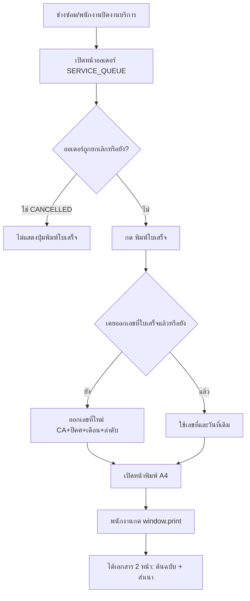

> **โมดูล:** M00065-ServiceReceiptPrinting
> **ประเภทเอกสาร:** Product Requirements Document (PRD)
> **เวอร์ชัน:** 1.0
> **วันที่จัดทำ:** 2026-09-24
> **สถานะ:** Draft
> **เจ้าของเอกสาร:** BA + PO + PM (ดู [[Feature-Docs-Ownership]])

# PRD: พิมพ์ใบเสร็จรับเงิน (Service Receipt Printing)

---

## Executive Summary

ร้านค้าประเภท "สินค้าและบริการ" (`Shop.vertical = SERVICE_QUEUE` — ร้านซ่อม/คลินิก/สปา/ร้านตัดผม ฯลฯ ที่รับนัดคิวงานแทนการจัดส่งสินค้า) ยังไม่มีเอกสารรับเงินที่เป็นทางการให้ลูกค้าถือกลับ ทุกวันนี้ร้านต้องเขียนใบเสร็จด้วยมือหรือใช้เอกสารนอกระบบ Deep ทั้งที่ข้อมูลรายการ/ยอดเงิน/วิธีชำระเงินของออเดอร์นั้นมีอยู่ครบในระบบอยู่แล้ว

ฟีเจอร์นี้เพิ่มปุ่ม "พิมพ์ใบเสร็จ" ในหน้าออเดอร์ของร้าน SERVICE_QUEUE ที่เปิดหน้าพิมพ์ตามผังใบเสร็จมาตรฐาน (อ้างอิงใบเสร็จจริงของร้าน BT PremiumAutoXenon) ออกเลขที่ใบเสร็จรันต่อร้าน รีเซ็ตทุกเดือน ครั้งแรกที่กดพิมพ์เท่านั้น แล้วคงที่ตลอดไป ผู้ใช้กดพิมพ์ผ่านหน้าต่างพิมพ์ของเบราว์เซอร์เอง (บันทึกเป็น PDF ได้จากตรงนั้น) ไม่มีการสร้างไฟล์ PDF ฝั่งเซิร์ฟเวอร์ ผลลัพธ์คือร้าน SERVICE_QUEUE มีเอกสารรับเงินที่ดูเป็นทางการ ใช้เวลาไม่กี่คลิก โดยไม่ต้องพึ่งเครื่องมือนอกระบบ

---

## 1. Business Goals & KPIs

### 1.1 เป้าหมายทางธุรกิจ

| เป้าหมาย | รายละเอียด |
|----------|-----------|
| **ลดการพึ่งพาเอกสารนอกระบบ** | ร้าน SERVICE_QUEUE ออกใบเสร็จรับเงินที่มีเลขที่อ้างอิงได้จากในระบบ Deep โดยตรง ไม่ต้องเปิดโปรแกรมอื่นหรือเขียนมือ |
| **เพิ่มความน่าเชื่อถือของร้าน** | ใบเสร็จที่มีโลโก้/ชื่อร้าน/เลขที่/ลายเซ็นครบตามรูปแบบธุรกิจจริง ทำให้ลูกค้าเชื่อมั่นร้านมากขึ้นและร้านนำไปใช้เบิกค่าใช้จ่าย/ทำบัญชีต่อได้ |
| **ต่อยอดความสมบูรณ์ของ vertical "สินค้าและบริการ"** | เดิม SERVICE_QUEUE มีระบบนัดคิว/บันทึกรับเงิน (`OrderPayment`) อยู่แล้วแต่ไม่มีเอกสารส่งออก ฟีเจอร์นี้ปิดช่องว่างสุดท้ายของวงจร "รับนัด → ให้บริการ → เก็บเงิน → ออกหลักฐาน" |

### 1.2 ตัวชี้วัดความสำเร็จ (KPIs)

| KPI | คำอธิบาย | เป้าหมาย |
|-----|----------|---------|
| **อัตราการตั้งค่าข้อมูลออกใบเสร็จ** | % ของร้าน SERVICE_QUEUE ที่กรอก "ข้อมูลออกใบเสร็จ" อย่างน้อย 1 ครั้งภายใน 30 วันหลังเปิดใช้ฟีเจอร์ | ≥ 30% ของร้าน SERVICE_QUEUE ที่ active |
| **จำนวนใบเสร็จที่ออกจริง** | จำนวนออเดอร์ SERVICE_QUEUE ที่ status ≠ CANCELLED และมีเลขที่ใบเสร็จออกแล้ว หารด้วยจำนวนออเดอร์ SERVICE_QUEUE ทั้งหมดในเดือนนั้น | ค่านี้เพิ่มขึ้นต่อเนื่องหลัง release (ไม่ตั้งตัวเลขตายตัว — วัด trend) |
| **ความถูกต้องของเลขที่ใบเสร็จ** | จำนวน incident เลขที่ใบเสร็จซ้ำ/ข้ามเลข/reset ผิดเดือน | 0 incident |

---

## 2. User Personas (กลุ่มผู้ใช้งาน)

### 2.1 เจ้าของ/ผู้ดูแลร้านบริการ (OWNER / ADMIN ของร้าน `SERVICE_QUEUE`)

**ข้อมูลพื้นฐาน:**
- เจ้าของร้านหรือพนักงานที่ถูกเชิญเข้าเป็นสมาชิกร้าน (`ShopMember.role = OWNER | ADMIN`) ของร้านที่ตั้ง vertical เป็น "สินค้าและบริการ" เช่น ร้านซ่อมรถ คลินิกเสริมความงาม สปา ร้านตัดผม

**เป้าหมาย:**
- มอบใบเสร็จที่ดูเป็นทางการให้ลูกค้าทันทีหลังให้บริการ/รับเงินเสร็จ โดยไม่ต้องออกจากระบบ Deep

**ความต้องการ:**
- พิมพ์ใบเสร็จจากหน้าออเดอร์ที่ใช้อยู่แล้วได้ในไม่กี่คลิก
- ใบเสร็จมีเลขที่อ้างอิงย้อนหลังได้ ไม่ซ้ำ ไม่หาย
- ตั้งค่าข้อมูลร้าน (ชื่อ/ที่อยู่/เลขภาษี/เบอร์/ตราประทับ) ที่จะไปโชว์บนใบเสร็จได้เองครั้งเดียว ไม่ต้องกรอกซ้ำทุกใบ

**จุดปวด (Pain Points):**
- ทุกวันนี้ต้องเขียนใบเสร็จด้วยมือหรือพิมพ์จากโปรแกรมอื่นที่ไม่เชื่อมกับข้อมูลออเดอร์ในระบบ ทำให้ยอด/รายการต้องคัดลอกเองและเสี่ยงพิมพ์ผิด

### 2.2 ลูกค้าที่รับบริการ (ผู้รับใบเสร็จ)

**ข้อมูลพื้นฐาน:**
- ลูกค้าที่จ่ายเงินให้ร้าน SERVICE_QUEUE ไม่มีบัญชี Deep และไม่เข้าระบบ — รับผลลัพธ์เป็นเอกสารกระดาษ/PDF เท่านั้น

**เป้าหมาย:**
- มีหลักฐานการจ่ายเงินที่ระบุชื่อร้าน รายการ ยอดเงิน วันที่ ชัดเจน ใช้เบิกค่าใช้จ่ายกับบริษัทต้นสังกัดหรือเก็บไว้อ้างอิงได้

**ความต้องการ:**
- ใบเสร็จอ่านง่าย มีเลขที่ วันที่ ยอดเงินเป็นตัวเลขและตัวอักษรตรงกัน ไม่มีความกำกวม

**จุดปวด (Pain Points):**
- ใบเสร็จเขียนมือบางครั้งอ่านยาก ไม่มีเลขที่อ้างอิง ทำให้เบิกค่าใช้จ่ายถูกปฏิเสธ

---

## 3. Business Requirements

### 3.1 การตั้งค่าข้อมูลออกใบเสร็จของร้าน

**ความต้องการ:**
- ร้าน SERVICE_QUEUE ต้องตั้งค่าข้อมูลที่จะแสดงบนหัวใบเสร็จได้เองในหน้าตั้งค่าร้าน ได้แก่ ชื่อบนใบเสร็จ ที่อยู่ เลขประจำตัวผู้เสียภาษี (ไม่บังคับ) เบอร์โทร และรูปตราประทับ (ไม่บังคับ)
- ถ้ายังไม่เคยตั้งค่า ระบบต้องยังพิมพ์ได้โดยใช้ข้อมูลร้านที่มีอยู่แล้วเป็นค่าเริ่มต้น พร้อมเตือนบนจอ (ไม่เตือนบนเอกสารที่พิมพ์ออกมา)

**Business Rules:**
- การ์ดตั้งค่านี้แสดงเฉพาะร้าน `vertical = SERVICE_QUEUE` เท่านั้น
- แก้ไขได้เฉพาะสมาชิกร้านที่มีบทบาท OWNER หรือ ADMIN (`ShopMember.role`) — สอดคล้องกับสิทธิ์แก้ไขการตั้งค่าร้านจุดอื่นทั้งระบบ
- โลโก้บนใบเสร็จใช้โลโก้ร้าน (`Shop.logo`) เสมอ ไม่มีช่องอัปโหลดแยกในการ์ดนี้

**เหตุผล:**
- ร้านส่วนใหญ่มีข้อมูลร้านซ้ำกันทุกใบเสร็จ (ชื่อ/ที่อยู่/เลขภาษี/เบอร์) การกรอกครั้งเดียวแล้วใช้ซ้ำลดภาระงานซ้ำซากทุกครั้งที่พิมพ์ และการยังพิมพ์ได้แม้ยังไม่ตั้งค่าทำให้ฟีเจอร์ใช้งานได้ทันทีโดยไม่ต้องผ่านขั้นตอนบังคับก่อน

### 3.2 การออกเลขที่ใบเสร็จ

**ความต้องการ:**
- ทุกใบเสร็จต้องมีเลขที่อ้างอิงที่ไม่ซ้ำกัน ไล่ลำดับได้ต่อร้าน และนับใหม่ทุกเดือน
- เลขที่ต้องออกเพียงครั้งเดียวต่อออเดอร์และคงที่ตลอดไป แม้พิมพ์ซ้ำหลายครั้งหรือออเดอร์ถูกยกเลิกภายหลัง

**Business Rules:**
- รูปแบบ: `CA` + ปี ค.ศ. 4 หลัก + เดือน 2 หลัก (ตามเวลาไทย) + ลำดับรันต่อร้าน 4 หลัก เช่น `CA2026090043`
- ออกเลขที่ในธุรกรรมเดียวกับการบันทึกว่าออเดอร์ใบนี้ "ออกใบเสร็จแล้ว" เพื่อกันเลขซ้ำ/เลขหายเมื่อมีการกดพิมพ์พร้อมกันจากหลายเครื่อง
- ห้ามนำเลขที่กลับมาใช้ซ้ำไม่ว่ากรณีใด รวมถึงเมื่อออเดอร์ถูกยกเลิกหลังออกใบแล้ว

**เหตุผล:**
- เลขที่ใบเสร็จคือสิ่งที่ทำให้เอกสารมี "ตัวตน" อ้างอิงย้อนหลังได้ — เลขซ้ำหรือขาดหายทำให้เอกสารใช้เป็นหลักฐานทางบัญชีไม่ได้ ซึ่งเป็นคุณค่าหลักของฟีเจอร์นี้

### 3.3 การพิมพ์ใบเสร็จ

**ความต้องการ:**
- ร้านพิมพ์ใบเสร็จของออเดอร์ SERVICE_QUEUE ที่ยังไม่ถูกยกเลิกได้จากหน้าออเดอร์โดยตรง เนื้อหาบนใบต้องตรงกับข้อมูลออเดอร์ปัจจุบัน (รายการ ยอดรวม ส่วนลด ภาษี ผู้ซื้อ ผู้ขาย) และมีช่องทำเครื่องหมายวิธีชำระเงิน + ช่องลายเซ็นทั้งสองฝ่าย
- พิมพ์ออกมา 2 หน้า: ต้นฉบับ และ สำเนา

**Business Rules:**
- วันที่บนใบเสร็จ = วันที่ออกใบครั้งแรก (วันที่กดพิมพ์ครั้งแรก) ไม่ใช่วันที่พิมพ์ซ้ำ
- ระบบทำเครื่องหมายวิธีชำระเงินให้อัตโนมัติเมื่อระบบมีข้อมูลรองรับ (เงินสด/โอนเงิน) ส่วนวิธีอื่น (เช็ค/บัตรเครดิต) เว้นว่างให้ติ๊กด้วยมือเพราะระบบไม่มีข้อมูลนั้น
- ออเดอร์ที่ถูกยกเลิกหลังออกเลขที่ใบเสร็จแล้ว ยังเปิดดู/พิมพ์ซ้ำได้ แต่ต้องมีลายน้ำ "ยกเลิก" บนเอกสาร เพื่อไม่ให้ถูกนำไปใช้อ้างว่าธุรกรรมยังสมบูรณ์

**เหตุผล:**
- ต้นฉบับ/สำเนาคือรูปแบบมาตรฐานของใบเสร็จรับเงินที่ร้านอ้างอิงอยู่แล้ว การทำเครื่องหมายวิธีชำระเงินอัตโนมัติลดความผิดพลาดจากการติ๊กมือ ส่วนลายน้ำยกเลิกป้องกันไม่ให้เอกสารของธุรกรรมที่ล้มเหลวถูกเข้าใจผิดว่าสมบูรณ์

---

## 4. Business Rules & Constraints

### 4.1 กฎทางธุรกิจหลัก

| กฎ | คำอธิบาย |
|----|----------|
| **จำกัด vertical** | ปรากฏเฉพาะร้าน `Shop.vertical = SERVICE_QUEUE` ("สินค้าและบริการ") เท่านั้น ร้าน ONLINE_SALES และ LODGING ไม่มีปุ่มนี้ |
| **เลขที่ออกครั้งเดียว** | เลขที่ใบเสร็จออกเมื่อกดพิมพ์ครั้งแรกเท่านั้น พิมพ์ซ้ำใช้เลขเดิม วันที่เดิมเสมอ |
| **ไม่พิมพ์ออเดอร์ยกเลิก (ครั้งแรก)** | ออเดอร์ที่ status = CANCELLED อยู่แล้ว **ก่อน** เคยออกใบเสร็จ จะไม่มีปุ่มพิมพ์ให้กด — ออกใบเสร็จใหม่ให้ธุรกรรมที่ไม่เคยสำเร็จไม่ได้ |
| **ยกเลิกหลังออกใบยังเปิดดูได้** | ถ้าออเดอร์มีเลขที่ใบเสร็จอยู่แล้วก่อนถูกยกเลิก ใบเสร็จเดิมยังเปิด/พิมพ์ซ้ำได้เสมอ (มีลายน้ำ) |
| **สิทธิ์แก้ไขข้อมูลออกใบเสร็จ** | เฉพาะ `ShopMember.role` = OWNER หรือ ADMIN ของร้านนั้น |

### 4.2 ข้อจำกัดทางธุรกิจ

| ข้อจำกัด | รายละเอียด |
|---------|-----------|
| **ไม่ใช่ใบกำกับภาษี** | เอกสารนี้คือ "ใบเสร็จรับเงิน" เท่านั้น ไม่ใช่ใบกำกับภาษีตามประมวลรัษฎากร ร้านที่ต้องออกใบกำกับภาษีเต็มรูปต้องใช้ระบบอื่นควบคู่ |
| **ไม่มีการแก้ไขย้อนหลังของ "เอกสารที่พิมพ์แล้ว"** | ใบเสร็จ render สดจากข้อมูลออเดอร์ปัจจุบันทุกครั้งที่เปิด ไม่มีสถานะ "ล็อกเนื้อหา" หรือ "void เอกสาร" แยกจากสถานะออเดอร์ — ถ้าร้านแก้ไขรายการ/ยอดของออเดอร์ภายหลัง ใบเสร็จที่พิมพ์ซ้ำจะแสดงข้อมูลใหม่ตามออเดอร์ ณ ตอนนั้น (เลขที่และวันที่ออกใบยังคงเดิม) |
| **เดือน/ปีอิงเวลาไทย ไม่ใช่ UTC** | เลขที่ใบเสร็จรีเซ็ตตามเดือนปฏิทินไทย (Asia/Bangkok) ตามธรรมเนียมการแสดงวันที่ทั้งระบบ |

### 4.3 เหตุผลที่รูปแบบเลขที่ใบเสร็จใช้ปี ค.ศ. ไม่ใช่ พ.ศ.

ระบบ Deep ใช้ปี พ.ศ. เป็นมาตรฐานแสดงวันที่ทุกจุด (`formatDate`/`formatDateTH`) และเลขคำสั่งซื้อ (`Order.orderNo`) ก็ขึ้นต้นด้วยปี พ.ศ. เช่นกัน แต่มติที่อนุมัติสำหรับฟีเจอร์นี้กำหนดรูปแบบเลขที่ใบเสร็จเป็น `CA` + ปี ค.ศ. โดยตั้งใจ เพื่อให้ตรงกับผังใบเสร็จอ้างอิงของร้านจริง (ตัวอย่าง `CA2026090043`) — เลขที่ใบเสร็จเป็น **รหัสอ้างอิงเอกสาร** ไม่ใช่ "วันที่ที่แสดงให้ลูกค้าอ่าน" (วันที่แสดงผลอื่นบนใบเสร็จ เช่น วันที่ออกใบ ยังคงใช้รูปแบบวันที่ไทย พ.ศ. ตามธรรมเนียมเดิมทั้งระบบ) จึงไม่ขัดกับธรรมเนียมการแสดงผลวันที่ที่ผู้ใช้อ่าน

---

## 5. Out of Scope (นอกขอบเขต)

สิ่งที่ระบบนี้ **ไม่รองรับ** หรือ **ไม่รับผิดชอบ**:

| หัวข้อ | คำอธิบาย/เหตุผล |
|--------|----------|
| **ใบกำกับภาษี (Tax Invoice)** | ต้องมีเลขประจำตัวผู้เสียภาษีของทั้งสองฝ่าย, ภาษีซื้อ/ขายแยกตามกฎสรรพากรเต็มรูป — คนละเอกสารกับใบเสร็จรับเงิน ไม่อยู่ในขอบเขตนี้ |
| **ส่ง PDF เข้าห้องแชท** | ฟีเจอร์นี้จบที่หน้าต่างพิมพ์ของเบราว์เซอร์ ไม่มี endpoint สร้าง PDF ฝั่งเซิร์ฟเวอร์ให้แนบเข้าแชทอัตโนมัติ |
| **vertical อื่นนอกจาก SERVICE_QUEUE** | ร้าน ONLINE_SALES (มีใบส่งของ/ใบกำกับสินค้าคนละรูปแบบ) และ LODGING ไม่อยู่ในขอบเขตของรอบนี้ |
| **ตั้ง prefix เลขที่เอง** | prefix `CA` ตายตัว ร้านแก้ไขไม่ได้ในรอบนี้ |
| **แก้ไข/ยกเลิก (void) ใบเสร็จที่ออกแล้วแบบแยกจากออเดอร์** | ใบเสร็จไม่มีสถานะของตัวเอง อ้างอิงสถานะออเดอร์เสมอ ไม่มีปุ่ม "ยกเลิกใบเสร็จ" แยกต่างหาก |
| **พิมพ์หลายใบพร้อมกัน (batch print)** | พิมพ์ได้ครั้งละ 1 ออเดอร์เท่านั้นในรอบนี้ |

---

## 6. Risks & Mitigation (ความเสี่ยงและแนวทางแก้ไข)

### 6.1 ความเสี่ยงทางธุรกิจ

| ความเสี่ยง | ผลกระทบ | ระดับความรุนแรง | แนวทางแก้ไข |
|-----------|---------|-----------------|-------------|
| **ผู้ใช้เข้าใจผิดว่าเป็นใบกำกับภาษี** | ร้านนำไปอ้างกับสรรพากรผิดประเภท เกิดปัญหาทางกฎหมาย | กลาง | หัวเอกสารระบุคำว่า "ใบเสร็จรับเงิน" ชัดเจนตามผังอ้างอิง ไม่มีคำว่า "ใบกำกับภาษี" ปรากฏที่ใดในเอกสาร |
| **ร้านพึ่งพาใบเสร็จนี้เป็นหลักฐานทางบัญชีทั้งที่เนื้อหาย้ายตามออเดอร์ได้** | ร้านแก้ไขออเดอร์หลังพิมพ์แล้ว ทำให้พิมพ์ซ้ำได้ยอดต่างจากที่ลูกค้าถือ | ต่ำ | เอกสารแสดงชัดว่าข้อมูล ณ เวลาพิมพ์ (วันที่ออกใบ) — เป็นพฤติกรรมที่สอดคล้องกับข้อมูลออเดอร์ที่ render สดอยู่แล้วทุกจุดของระบบ |

### 6.2 ความเสี่ยงทางเทคนิค

| ความเสี่ยง | ผลกระทบ | แนวทางแก้ไข |
|-----------|---------|-------------|
| **race condition เมื่อกดพิมพ์พร้อมกันจาก 2 เครื่อง** | เลขที่ใบเสร็จซ้ำ หรือกระโดดข้ามเลข | ออกเลขที่ในธุรกรรมฐานข้อมูลเดียวกับการบันทึกว่าออกใบแล้ว (atomic) — ทั้งสองเครื่องต้องได้เลขเดียวกันเสมอ ไม่มีการออกเลขซ้ำซ้อน |
| **ไม่มีตัวแปลงตัวเลขเป็นคำอ่านภาษาไทยในระบบปัจจุบัน** | เสี่ยงคำอ่านผิด (เช่น จุดทศนิยม/สตางค์/จำนวนเงินสูง) | ต้องพัฒนา utility ใหม่พร้อม unit test ครอบคลุม edge case (0 บาท, มีสตางค์, จำนวนเงินสูง) |
| **หน้าตาเอกสารต่างกันข้ามเบราว์เซอร์/เครื่องพิมพ์** | ใบเสร็จพิมพ์ออกมาเพี้ยนจากผังอ้างอิง | ใช้ CSS `@page A4` มาตรฐานของธีมที่มีอยู่แล้ว (`_print.css`) ทดสอบกับเบราว์เซอร์หลักที่ร้านใช้งานจริง (Chrome/Edge/Safari) |

---

## 7. Glossary (อภิธานศัพท์)

| คำศัพท์ | ความหมาย |
|---------|----------|
| **ใบเสร็จรับเงิน** | เอกสารยืนยันการรับเงินที่ร้าน SERVICE_QUEUE พิมพ์ให้ลูกค้า — ไม่ใช่ใบกำกับภาษี |
| **เลขที่ใบเสร็จ** | รหัสอ้างอิงรูปแบบ `CA` + ปี ค.ศ. 4 หลัก + เดือน 2 หลัก + ลำดับ 4 หลัก รันต่อร้าน รีเซ็ตทุกเดือน (เวลาไทย) |
| **ข้อมูลออกใบเสร็จ (Receipt Profile)** | ข้อมูลหัวใบเสร็จที่ร้านตั้งค่าเอง: ชื่อบนใบเสร็จ ที่อยู่ เลขประจำตัวผู้เสียภาษี เบอร์โทร รูปตราประทับ |
| **ต้นฉบับ/สำเนา** | สองหน้าที่พิมพ์ออกมาต่อการพิมพ์ 1 ครั้ง — หน้าแรกระบุ "ต้นฉบับ" มอบให้ลูกค้า หน้าที่สองระบุ "สำเนา" เก็บไว้ที่ร้าน |
| **ลายน้ำยกเลิก** | ข้อความ/ลายน้ำที่แปะทับใบเสร็จของออเดอร์ที่ถูกยกเลิกภายหลังจากมีเลขที่ใบเสร็จแล้ว |
| **SERVICE_QUEUE** | ค่า `Shop.vertical` ที่แปลว่าร้านรับนัดคิวเข้ารับบริการ ไม่มีการจัดส่งสินค้า — ป้ายบนหน้าจอคือ "สินค้าและบริการ" |

---

## 8. Success Metrics (ตัวชี้วัดความสำเร็จ)

เมื่อระบบทำงานได้ดี ควรมีผลลัพธ์ดังนี้:

| ตัวชี้วัด | ค่าที่คาดหวัง | วิธีวัด |
|----------|---------------|--------|
| **อัตราการตั้งค่าข้อมูลออกใบเสร็จ** | ≥ 30% ของร้าน SERVICE_QUEUE ที่ active ภายใน 30 วันหลัง release | นับร้านที่มีข้อมูลออกใบเสร็จไม่ว่างอย่างน้อย 1 ช่อง |
| **จำนวนใบเสร็จที่ออกจริงต่อเดือน** | เพิ่มขึ้นต่อเนื่อง (trend) | นับออเดอร์ SERVICE_QUEUE ที่มีเลขที่ใบเสร็จออกแล้วในเดือนนั้น |
| **ความถูกต้องของเลขที่** | ไม่มีเลขซ้ำ ไม่มีเลขกระโดดข้ามที่อธิบายไม่ได้ | ตรวจสอบ uniqueness ของเลขที่ใบเสร็จรายร้าน/รายเดือนเป็นระยะ |
| **เวลาที่ใช้พิมพ์ 1 ใบ** | ผู้ขายกดจากหน้าออเดอร์ถึงเห็นหน้าพิมพ์ภายใน < 2 วินาที | วัดเวลาโหลดหน้าพิมพ์ |

---

## 9. Dependencies & Assumptions

### 9.1 สิ่งที่ต้องพึ่งพา (Dependencies)

| ระบบ/ส่วนประกอบ | ความสัมพันธ์ |
|-----------------|-------------|
| **หน้าออเดอร์ที่มีอยู่แล้ว (`/orders/[token]`)** | จุดเข้าใช้งานปุ่ม "พิมพ์ใบเสร็จ" — ไม่สร้างหน้าจอออเดอร์ใหม่ |
| **`Order` / `OrderItem` / `OrderPayment`** | แหล่งข้อมูลรายการ ยอดเงิน ส่วนลด ภาษี วิธีชำระเงินที่แสดงบนใบเสร็จ (ทั้งหมดมีอยู่แล้วในระบบ) |
| **`Shop.vertical` / `Shop.logo` / `Shop.address`** | ใช้ตัดสินว่าเมนูควรแสดงหรือไม่ และเป็นค่าเริ่มต้น/ค่า fallback ของหัวใบเสร็จ |
| **`ShopMember.role`** | ใช้ตรวจสิทธิ์แก้ไขข้อมูลออกใบเสร็จ (OWNER/ADMIN) |
| **CSS พิมพ์ของธีม Paces (`_print.css`)** | ใช้เป็นฐานของ layout `@page A4` — ไม่ประกอบ CSS พิมพ์ขึ้นใหม่ทั้งหมด (ตาม Hard Rule ห้ามสร้าง UI จากศูนย์) |
| **ตัวแปลงตัวเลขเป็นคำอ่านภาษาไทย (ใหม่)** | ยังไม่มีในระบบ ต้องพัฒนาใหม่สำหรับข้อความ "(...บาทถ้วน)" |
| **ตัวออกเลขที่ใบเสร็จแบบ atomic ต่อร้าน/เดือน (ใหม่)** | ยังไม่มีกลไกนี้ในระบบ ต้องออกแบบระดับฐานข้อมูล/service — เป็นความรับผิดชอบของเอกสาร SRS/DATABASE ของฟีเจอร์นี้ |

### 9.2 สมมติฐาน (Assumptions)

- ที่อยู่เริ่มต้นในการ์ด "ข้อมูลออกใบเสร็จ" ดึงมาจาก `Shop.address` ถ้ามีค่าอยู่แล้ว (มติที่อนุมัติระบุ default เฉพาะ "ชื่อบนใบเสร็จ" ไม่ได้ระบุที่อยู่ชัดเจน — สมมติเพื่อลดแรงกรอกซ้ำ ร้านแก้ไขเป็นค่าอื่นได้อิสระ)
- ข้อมูลหัวใบเสร็จ (ชื่อ/ที่อยู่/เลขภาษี/เบอร์/ตราประทับ) อ่านสดจากการตั้งค่าร้าน ณ เวลาเปิด/พิมพ์เอกสารเสมอ **ไม่ snapshot** ต่อออเดอร์ (ต่างจาก `payoutSnapshot`/`receiverSnapshot` ที่ระบบ snapshot ไว้ในจุดอื่น) — เพราะมติที่อนุมัติระบุเฉพาะว่าเลขที่และวันที่ออกใบคงที่ ไม่ได้สั่งให้ snapshot ข้อมูลร้าน ผลคือถ้าร้านแก้ที่อยู่ภายหลัง แล้วพิมพ์ใบเก่าซ้ำ จะเห็นที่อยู่ใหม่ (สอดคล้องกับหลักที่ว่ารายการ/ยอดเงินก็ render สดจากออเดอร์ปัจจุบันอยู่แล้ว) — Controller ควรยืนยันว่ายอมรับพฤติกรรมนี้ก่อนเข้าสู่การพัฒนา
- ออเดอร์สถานะ `DRAFTED` (ร่างจากฟีเจอร์สร้างออเดอร์อัตโนมัติจากแชท — ยังไม่มีรายการสินค้า ยอด 0 เสมอ) ไม่นับเป็นออเดอร์ที่พิมพ์ใบเสร็จได้ แม้ตามตัวอักษร `DRAFTED ≠ CANCELLED` เพราะยังไม่ใช่ออเดอร์จริงตามนิยามของระบบ
- ช่องทำเครื่องหมายวิธีชำระเงินอัตโนมัติครอบคลุมเฉพาะ "เงินสด" และ "โอนเงิน" เพราะเป็นสองทางเดียวที่ระบบมีข้อมูลรองรับ (`isCashPayment()`/`OrderPayment.method`) — "เช็ค" และ "บัตรเครดิต" ไม่มีแหล่งข้อมูลใดในระบบ เว้นว่างให้ร้านติ๊กมือเสมอ
- `Shop.vertical` เป็น immutable หลังตั้งค่าครั้งแรก (ยืนยันจาก schema) ฉะนั้นเคส "ร้านเปลี่ยน vertical หลังออกใบเสร็จ" แทบไม่เกิดขึ้นจริงในทางปฏิบัติปัจจุบัน — ข้อกำหนดที่ใบเสร็จเดิมต้องเปิดได้แม้ vertical ปัจจุบันไม่ใช่ SERVICE_QUEUE เป็นการออกแบบเชิงป้องกันล่วงหน้า (defensive) เผื่อกฎ immutable นี้เปลี่ยนในอนาคต ไม่ใช่ flow ที่ผู้ใช้เข้าถึงได้จากหน้าจอวันนี้

---

## 10. Appendix

### 10.1 ตัวอย่าง User Journey

**Scenario: ร้านซ่อมมอเตอร์ไซค์พิมพ์ใบเสร็จให้ลูกค้าหน้าร้าน**

1. ช่างซ่อมเสร็จงาน กดปิดงานในออเดอร์คิวบริการของลูกค้า (SERVICE_QUEUE)
2. พนักงาน (ADMIN) เปิดหน้าออเดอร์ใบนั้น กด "พิมพ์ใบเสร็จ"
3. ระบบออกเลขที่ใบเสร็จใหม่ (เช่น `CA2026090043`) เพราะเป็นการพิมพ์ครั้งแรกของออเดอร์นี้
4. หน้าพิมพ์เปิดขึ้น แสดงรายการบริการ ยอดรวม วิธีชำระเงิน (ติ๊ก "เงินสด" อัตโนมัติเพราะลูกค้าจ่ายสด) — ร้านยังไม่เคยตั้งค่า "ข้อมูลออกใบเสร็จ" มาก่อน จึงเห็นแถบเตือนบนจอ (ไม่ปรากฏบนเอกสารที่พิมพ์) และใบเสร็จใช้ชื่อ/ที่อยู่/โลโก้ร้านเป็นค่าเริ่มต้น
5. พนักงานกดพิมพ์ (`window.print()`) ได้เอกสาร 2 หน้า: ต้นฉบับมอบให้ลูกค้า สำเนาเก็บไว้ที่ร้าน
6. สัปดาห์ต่อมา ลูกค้าโทรมาขอสำเนาใบเสร็จอีกใบ — พนักงานเปิดออเดอร์เดิม กด "พิมพ์ใบเสร็จ" ซ้ำ ได้เลขที่และวันที่เดิมทุกประการ

### 10.2 ตัวอย่างผังใบเสร็จอ้างอิง

รูปแบบอ้างอิงจากใบเสร็จจริงของร้าน BT PremiumAutoXenon: กระดาษ A4, มุมซ้ายบนเป็นโลโก้ + ชื่อร้าน + ที่อยู่ + เลขประจำตัวผู้เสียภาษี + เบอร์โทร, มุมขวาบนเป็นหัวสีเขียว "ใบเสร็จรับเงิน" พร้อมป้าย "ต้นฉบับ"/"สำเนา" เลขที่/วันที่/ชื่อผู้ขาย และสามเหลี่ยมเขียวมุมขวาบนระบุเลขหน้า จากนั้นเป็นบล็อกข้อมูลลูกค้า ตารางรายการ (ลำดับ/รายละเอียด/จำนวน/ราคาต่อหน่วย/ยอดรวม) สรุปยอดพร้อมคำอ่านไทยในวงเล็บ ท้ายหน้าเป็นช่องทำเครื่องหมายวิธีชำระเงินและช่องลายเซ็นทั้งสองฝ่ายพร้อมตราประทับ

---

**หมายเหตุ:**
เอกสารนี้เป็นการบันทึกความต้องการทางธุรกิจ (Business Requirements) โดยไม่มีรายละเอียดทางเทคนิค
สำหรับ Functional Requirements / User Story / Acceptance Criteria ดู [[BRD]] ของโมดูลนี้
สำหรับ technical specification ดู [[SRS]] ของโมดูลนี้
