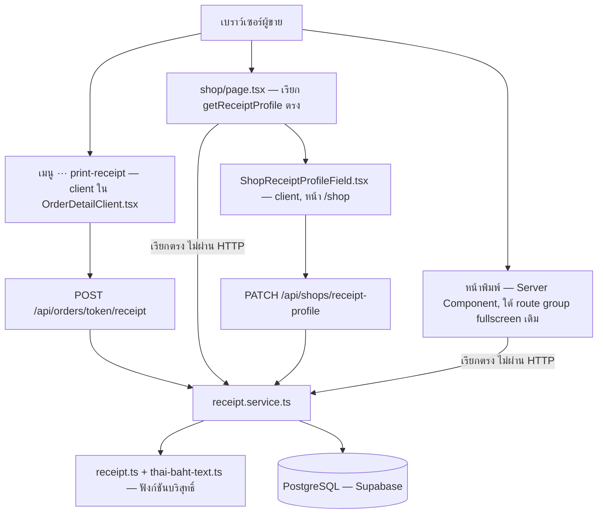
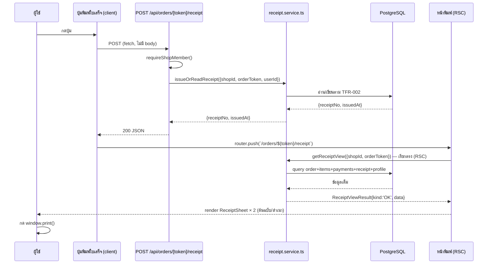
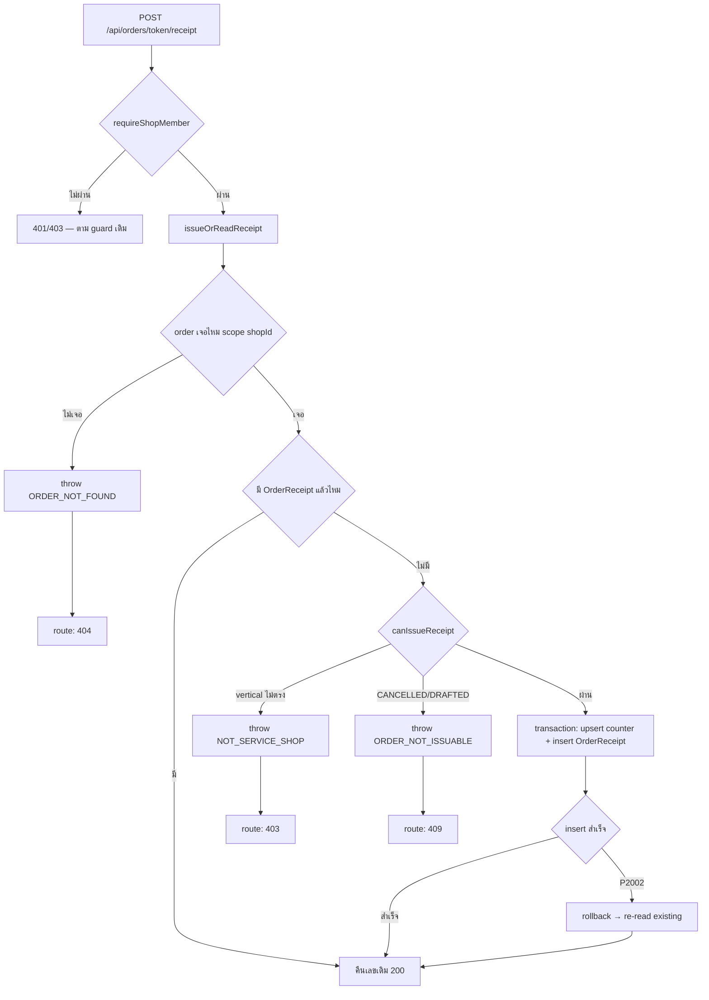

> **โมดูล:** M00065-ServiceReceiptPrinting
> **ประเภทเอกสาร:** System Design Spec (SDS)
> **เวอร์ชัน:** 1.0
> **วันที่จัดทำ:** 2026-09-24
> **สถานะ:** Draft
> **เจ้าของเอกสาร:** SA (safepay-planner)

# SDS: พิมพ์ใบเสร็จรับเงิน (Service Receipt Printing) (System Design Spec)

---

## 1. บทนำ & References

### 1.1 วัตถุประสงค์

เอกสารนี้ออกแบบการ implement ของฟีเจอร์ 00065 ให้ตรงกับข้อกำหนดใน [[SRS]] — ระบุ component แยกหน้าที่, data flow, และ technical decision ที่ผูกกับสถาปัตยกรรมเดิมของ SafePay (Next.js 16 App Router, service layer แยกจาก API layer, Prisma/PostgreSQL) ผู้อ่านคือ DEV ที่จะเขียนโค้ด และ QA ที่จะวางแผนทดสอบ

### 1.2 ขอบเขตการออกแบบ

🛑 **สถานะ (2026-09-24): implement เสร็จแล้วทั้งหมด — หัวข้อนี้อัปเดตให้ตรงกับโค้ดจริง ไม่ใช่แผนก่อนเขียน (HR16)**

อยู่ในขอบเขต: `src/lib/thai-baht-text.ts`, `src/services/receipt.service.ts` (รวม `ReceiptError`/`ReceiptErrorCode` ในไฟล์เดียวกัน — **ไม่มี `src/lib/receipt-error.ts` แยก**), API routes **2 เส้นทาง** (ไม่มี GET), หน้าพิมพ์ + การ์ดตั้งค่า + ปุ่มในหน้าออเดอร์

นอกขอบเขต (อยู่ที่ `safepay-ux` gate ก่อนเริ่มเขียน component จริง): markup/สไตล์ที่แน่นอนของปุ่ม, ตำแหน่งในลำดับชั้นปุ่มของหน้าออเดอร์, หน้าตาลายน้ำยกเลิก — SDS นี้กำหนดแค่ contract ระหว่าง component (props/state) ที่ต้องมี ไม่ใช่ JSX

### 1.3 เอกสารอ้างอิง

| เอกสาร | ความสัมพันธ์ |
|--------|-------------|
| [[SRS]] ของโมดูลนี้ | TFR-001..004 ที่ SDS นี้ realize |
| [[BRD]] ของโมดูลนี้ | FR-RCP-01..11, AC-RCP-01..38 |
| [[DATABASE]] ของโมดูลนี้ | schema 3 ตาราง (source of truth ของ data model) |
| `docs/conventions/rsc-mui-navigation.md` (Hard Rule 2) | ไม่เกี่ยว — โดเมนนี้เป็น Paces (`(paces)/**`) ไม่ใช่ MUI/RSC-Link |
| `docs/system/ui-guideline/README.md` + `paces-component-reference.md` (Hard Rule 1/8) | theme source ของทุก component ใหม่ — บังคับผ่าน `safepay-ux` ก่อนเขียน |

---

## 2. Architecture Overview

### 2.1 มุมมองสถาปัตยกรรม

เข้ากับ convention เดิมของโปรเจกต์เป๊ะ — ไม่มี pattern ใหม่: Next.js Route Handler บาง (auth + parse + call service + map error) → Service layer (business logic + Prisma) → PostgreSQL ตัวเดียว (ไม่ polyglot) หน้าพิมพ์เป็น React Server Component ที่เรียก service **ตรง** โดยไม่ผ่าน API (รูปแบบเดียวกับ `orders/[token]/page.tsx` ที่เรียก `getOrderForShop` ตรง — ไม่ใช่ fetch ตัวเอง)

### 2.2 มุมมองการ Deploy

ไม่มีการเปลี่ยนแปลง — deploy รวมกับ Next.js app เดิมบน Vercel, migration รันผ่าน `prisma migrate deploy` ตอน build (Hard Rule 15) ไม่มี infra ใหม่

---

## 3. Component Design

| Component | หน้าที่ (Responsibility) | Dependency (Submodule / Stack / Store) |
|-----------|--------------------------|-----------------------------------------|
| **`src/lib/thai-baht-text.ts`** | แปลง `number` → คำอ่านภาษาไทย (ฟังก์ชันบริสุทธิ์เดียว `thaiBahtText`) | ไม่มี dependency ภายนอก |
| **`src/lib/receipt.ts`** (มีอยู่แล้ว) | numbering format, eligibility, payment marks, validation schema | import `isCashPayment`/`isCODPayment` จาก `order-display.ts` |
| **`receiptPeriodTH()`** (มีอยู่แล้วใน `format-date.ts`) | ตัดรอบเดือน YYYYMM ค.ศ. เวลาไทย | ใช้ `partsInBangkok()` ภายในไฟล์เดียวกัน (helper timezone ที่มีอยู่แล้ว) |
| **`src/services/receipt.service.ts`** | `getReceiptProfile`, `updateReceiptProfile`, `issueOrReadReceipt`, `getReceiptNoForOrder`, `getReceiptView` — 🛑 **`ReceiptError`/`ReceiptErrorCode` ประกาศในไฟล์นี้เอง ไม่มี `receipt-error.ts` แยก** (ต่างจากแผนเดิม) | Prisma (`@/lib/prisma`), `src/lib/receipt.ts`, `src/lib/format-date.ts` (`receiptPeriodTH`) |
| **`POST /api/orders/[token]/receipt/route.ts`** | auth guard + เรียก `issueOrReadReceipt` + map error → HTTP ผ่าน `STATUS: Record<ReceiptError['code'], number>` | `@/lib/shop-api-guard` (`requireShopMember`, `jsonNoStore`), service ด้านบน |
| **`PATCH /api/shops/receipt-profile/route.ts`** | auth guard + parse `UpdateReceiptProfileSchema` (`v.safeParse`) + เรียก service + map error — 🛑 **ไม่มี GET route** | เหมือนด้านบน + `valibot` |
| **`(fullscreen)/orders/[token]/receipt/page.tsx`** | 🛑 **ใต้ route group `(fullscreen)` ที่มีอยู่แล้ว ไม่ใช่ route group ใหม่ `(print)`** (ดู TD-004 ที่แก้แล้ว) — Server Component: เรียก `getReceiptView` ตรง, `redirect(/orders/{token})` ถ้าคืน `null`, ประกอบ `ReceiptSheetData` (breakdown ผ่าน `buildBreakdown()` ที่ยืมมาจาก `order-detail-shared.tsx` — HR16), render `ReceiptSheet` × 2 | service ด้านบน, `@/lib/thai-baht-text`, `@/lib/receipt` (`formatReceiptAmount`/`receiptPaymentMarks`/`resolveReceiptHeader`), `order-detail-shared.tsx` (`buildBreakdown`) |
| **`ReceiptSheet.tsx`** (server component ล้วน — ไม่มีสถานะ) | Layout A4 หนึ่งหน้า (`copyLabel: 'ต้นฉบับ' \| 'สำเนา'`, `pageNo`) — รับ `data: ReceiptSheetData` เป็น prop (ประกอบเสร็จแล้วจาก `page.tsx`) | `receipt.module.css` — theme source: ไม่พบ theme match ตรงตัว closest primitive คือ `theme/paces/.../invoice/details/page.tsx` (โครงหัว/ตาราง/สรุปยอด), ผังกระดาษ/สี/ช่องติ๊ก = asset ของใบเสร็จจริงร้าน (HR6) |
| **`PrintButton.tsx`** (client) | ปุ่มใน `page.tsx` ที่เรียก `window.print()` โดยตรง | `@/components/wrappers/Icon` |
| **`ShopReceiptProfileField.tsx`** (client, ใต้ `shop/components/`) | ฟอร์มตั้งค่า — 🛑 **ไม่มี GET ตอน mount** รับ `profile: ReceiptProfileValue \| null` เป็น prop จาก `shop/page.tsx` (RSC เรียก `getReceiptProfile()` ตรง) แล้วยิง PATCH ตอนกด "บันทึกการเปลี่ยนแปลง" | `@/lib/upload-client` (`uploadFileId`, purpose `'IMAGE'`), `@/lib/paces-toast`, `@/lib/file-url` (`toFileUrl`) |
| **เมนู ⋯ "พิมพ์ใบเสร็จ"/"ดูใบเสร็จ" ในหน้าออเดอร์** (ใน `OrderDetailClient.tsx`, client) | key `print-receipt` — POST `/api/orders/[token]/receipt` แล้ว `router.push()` ไปหน้าพิมพ์ (มี `receiptNo` แล้ว → `router.push` ตรง ไม่ยิง POST ซ้ำ) | 🛑 **ไม่ได้ wiring เข้า `order-action-set.ts`** — ดู TD-003 ที่แก้แล้ว (ต่างจากแผนเดิม) |

---

## 4. Data Flow

### 4.1 Flow หลัก: ออกใบเสร็จจากหน้าออเดอร์

### 4.2 Flow กรณีล้มเหลว / edge

ไม่มี compensating action ข้าม store (single-store) — ความล้มเหลวทั้งหมดจบภายในทรานแซกชันเดียวของ Postgres

---

## 5. Integration Points

| จุดเชื่อม | ประเภท | Protocol / Contract | ความเสี่ยงเมื่อล่ม |
|-----------|--------|----------------------|---------------------|
| **`requireShopMember()`** | internal | function call (ไม่ใช่ HTTP) | ต่ำ — ใช้ของเดิม ไม่แก้ |
| **`@/lib/upload-client` (ticket→PUT→commit)** | internal | REST (มีอยู่แล้ว, ไม่แก้) — อัปโหลดตราประทับ | ต่ำ — เพดาน 10MB ของ purpose `IMAGE` (มีอยู่แล้ว) |
| **`window.print()`** | external (browser API) | ไม่มี contract ฝั่งเซิร์ฟเวอร์ | กลาง — หน้าตาต่างกันข้ามเบราว์เซอร์ (PRD risk, mitigate ด้วย `@page A4`) |

- **Timeout / Retry / Idempotency:** `issueOrReadReceipt` เป็น idempotent โดยธรรมชาติ (เรียกซ้ำกี่ครั้งก็ได้ผลเดิมหลังออกเลขครั้งแรกแล้ว — TFR-002) ไม่ต้อง retry logic พิเศษที่ client
- **สัญญา API เต็ม:** ดู `API.md` ของโมดูลนี้

---

## 6. Technical Decisions

### TD-001: ออกเลขที่ด้วย raw SQL `UPSERT ... RETURNING` แทน `findUnique` + `update` แยก 2 คำสั่ง

- **ตัดสินใจ:** ใช้ `INSERT ... ON CONFLICT (shopId, period) DO UPDATE SET lastSeq = lastSeq + 1 RETURNING lastSeq` เป็นคำสั่งเดียวภายใน `$transaction`
- **เหตุผล:** Postgres ถือ row lock ตลอดคำสั่ง `INSERT ... ON CONFLICT` ตัวเดียว ทำให้ request คู่แข่งที่ชนกันที่คู่ `(shopId, period)` เดียวกัน **บล็อกรอ** โดยอัตโนมัติแทนที่จะอ่านค่าเก่าไปพร้อมกันแล้วเขียนทับกัน (classic lost-update) — ไม่ต้องเขียน retry loop หรือ optimistic locking เอง เข้ากับหลัก "ใช้ DB constraint แทน app code" (native feature ของ Postgres)
- **ทางเลือกที่ตัดทิ้ง:** (1) `findUnique` แล้ว `update` แยก 2 คำสั่ง — มี race window ระหว่างสองคำสั่ง ต้องพึ่ง Serializable isolation level ซึ่งเพิ่มความซับซ้อน (retry on serialization failure) โดยไม่จำเป็น (2) advisory lock (`pg_advisory_xact_lock`) — ผูกกับ hash ของ `(shopId, period)` ซึ่งซับซ้อนกว่าและไม่มี native Prisma API รองรับสะดวกเท่า raw upsert
- **ผลกระทบ:** DEV ต้องเขียน raw SQL ผ่าน `tx.$queryRaw` (ไม่ใช่ Prisma Client API ปกติ) — เป็น pattern ที่ยังไม่มีอยู่ในระบบ (ระบบอื่นใช้ `updateMany` conditional สำหรับ atomic deduct เช่น `wallet.service.ts` — คนละ pattern เพราะที่นี่ต้องได้ค่าที่ increment แล้วกลับมาใช้ทันที)

### TD-002: `sellerName` บนใบเสร็จมาจาก `Order.createdByUserId` ไม่ใช่ `OrderReceipt.issuedByUserId`

- **ตัดสินใจ:** field ทั้งสองเก็บแยกกัน — `issuedByUserId` เป็น audit เบาของ "ใครกดพิมพ์ครั้งแรก" (อาจเป็นพนักงานคนละคนกับที่สร้างออเดอร์) ส่วน "ชื่อผู้ขาย" ที่พิมพ์บนเอกสารมาจาก `Order.createdByUserId` เสมอ (AC-RCP-21)
- **เหตุผล:** BRD ระบุชัดว่าชื่อผู้ขาย = ผู้สร้างออเดอร์ ไม่ใช่ผู้กดพิมพ์ — สองเหตุการณ์นี้มักเป็นคนละเวลา คนละคน (ช่างปิดงาน ≠ แคชเชียร์ที่กดพิมพ์ทีหลัง) การสลับสองค่านี้จะทำให้ใบเสร็จอ้างชื่อผิดคน
- **ทางเลือกที่ตัดทิ้ง:** ใช้ `issuedByUserId` เป็นชื่อผู้ขายเลย (ง่ายกว่า) — ตัดทิ้งเพราะขัด AC-RCP-21 ตรง ๆ
- **ผลกระทบ:** DEV ต้อง join สองความสัมพันธ์แยกกัน (`order.createdBy` และ `order.receipt.issuedBy`) — คนละ purpose ห้ามรวม query เป็นตัวเดียวแล้วสลับ field โดยไม่ได้ตั้งใจ

### TD-003 (แก้ 2026-09-24 — ต่างจากที่ตัดสินใจไว้ในแผน ยึดโค้ดจริงตาม HR16): ปุ่มพิมพ์ใบเสร็จอยู่ในเมนู ⋯ ของ `OrderDetailClient.tsx` โดยตรง ไม่ผ่าน `order-action-set.ts`

- **สิ่งที่ implement จริง:** `OrderDetailClient.tsx` เช็ค `showReceiptButton({vertical, status, hasReceipt: Boolean(receiptNo)})` เอง (import ตรงจาก `@/lib/receipt`) แล้ว unshift รายการเข้า `menu` ของ action set ที่มีอยู่แล้ว (`withReturnOnly.menu`) — **ไม่ได้แก้ `order-action-set.ts`** ไม่มี field `vertical`/`hasReceipt` ใน `GetOrderActionSetInput` และไม่มี key `printReceipt` ที่คืนจากฟังก์ชันนั้น key ที่ใช้จริงคือ `print-receipt` (มีขีด ประกาศตรงใน `OrderDetailClient.tsx`) label ผัน "ดูใบเสร็จ"/"พิมพ์ใบเสร็จ" ตาม `receiptNo`
- **เหตุผลที่ implement เลือกทางนี้ (อนุมานจากคอมเมนต์ในโค้ด):** ไฟล์เดียวกันมีแพตเทิร์นนี้อยู่แล้วสำหรับเมนู "คืนของ" (feature 00056 — vertical-gated ด้วยวิธีเดียวกัน) — เพิ่มใบเสร็จตามแพตเทิร์นเดิมที่มีอยู่แทนที่จะเปิด choke point ใหม่ใน `order-action-set.ts`
- **ผลต่างจากแผนเดิม:** SDS ฉบับร่างเสนอให้ `order-action-set.ts` เป็น single source of truth ของปุ่มทั้งหมด — โค้ดจริงมี 2 แหล่ง (`order-action-set.ts` สำหรับปุ่มส่วนใหญ่ + เงื่อนไข inline ใน `OrderDetailClient.tsx` สำหรับ "คืนของ"/"พิมพ์ใบเสร็จ" ที่ผูกกับ vertical) ไม่ใช่ regression ของงานนี้ (แพตเทิร์น "คืนของ" มีมาก่อนแล้ว) แต่เป็นข้อเท็จจริงที่ต้องบันทึกแทนแผนที่ไม่ตรง
- **handler:** `handleAction()` switch เดิมใน `OrderDetailClient.tsx` เพิ่ม `case 'print-receipt': void handlePrintReceipt()` — `handlePrintReceipt()` เช็ค `receiptNo` ก่อน (มีแล้ว → `router.push` ตรง ไม่ยิง POST ซ้ำ), ไม่มี → POST แล้วค่อย `router.push`

### TD-004 (แก้ 2026-09-24 — ต่างจากที่ตัดสินใจไว้ในแผน ยึดโค้ดจริงตาม HR16): หน้าพิมพ์อยู่ใต้ route group `(fullscreen)` เดิม ไม่ใช่ `(print)` ใหม่

- **สิ่งที่ implement จริง:** `src/app/(paces)/seller/(fullscreen)/orders/[token]/receipt/page.tsx` — **ไม่มี route group `(print)` เกิดขึ้นเลย** ไม่มี `layout.tsx` แยก guard เดิม (`(fullscreen)/layout.tsx`) ยังใช้ร่วมกัน
- **วิธีแก้ปัญหาเดียวกับที่ TD-004 เดิมพยายามแก้ (fixed positioning ตัดงานพิมพ์เหลือแค่จอ):** เพิ่มคลาส `print:static print:block print:overflow-visible print:bg-transparent print:p-0` ลงบน wrapper `fixed inset-0 z-50 bg-card ...` เดิมของ `(fullscreen)/layout.tsx` โดยตรง (Tailwind `print:` variant ปลดกฎเฉพาะตอนสั่งพิมพ์) แล้วให้ `@page { size: A4; margin: 0 }` + `break-after: page` อยู่ใน **`receipt.module.css` ของฟีเจอร์นี้เอง** (ไม่ใช่ layout.tsx)
- **เหตุผลที่ implement เลือกทางนี้แทนแยก route group:** ปลด CSS เฉพาะตอน print media query แทนที่จะสร้าง layout คู่ขนานที่ซ้ำ guard logic (session + `requireActiveShop`) — ลดพื้นผิวที่ต้อง sync 2 ที่เหลือ 0 ที่ (guard เขียนที่เดียว)
- **ผลกระทบ:** คลาส `print:*` ที่เพิ่มมีผลกับ**ทุกหน้าใต้ `(fullscreen)/**`** ไม่ใช่แค่ใบเสร็จ (ดู SRS §8 ความเสี่ยง — ประเมินแล้วว่าต่ำ/เป็นพฤติกรรมที่ถูกต้องกว่าเดิม) — แลกกับไม่ต้องดูแล route group ที่สอง

---

## 7. Traceability

| SRS Requirement (TFR/NFR) | SDS Element (component / decision / flow) | สถานะ |
|---------------------------|-------------------------------------------|-------|
| TFR-001 | `receipt.service.ts::getReceiptProfile/updateReceiptProfile`, `ShopReceiptProfileField.tsx` | Draft |
| TFR-002 | `receipt.service.ts::issueOrReadReceipt`, TD-001, Flow 4.1/4.2 | Draft |
| TFR-003 | `receipt.service.ts::getReceiptView`, `ReceiptSheet.tsx`, TD-002 | Draft |
| TFR-004 | `requireShopMember()` ทุก route (Component §3) | Draft |
| NFR Performance | Flow 4.1 (query เดียวต่อ order, ไม่มี N+1) | Draft |
| NFR Concurrency | TD-001 | Draft |

---

## 8. สรุป (Summary)

เอกสาร SDS นี้กำหนดการออกแบบเชิงระบบของ **พิมพ์ใบเสร็จรับเงิน (00065)** — component แยกหน้าที่ชัดเจน (lib บริสุทธิ์ → service → route/RSC), การออกเลขที่แบบ atomic ด้วย raw SQL upsert ภายในทรานแซกชันเดียว, และ route group พิมพ์แยกจาก fullscreen overlay เดิมด้วยเหตุผลทาง CSS

**สถานะ (2026-09-24): implement เสร็จครบทั้งฟีเจอร์แล้ว** ("ลำดับการ build ที่แนะนำ" ด้านล่างคือลำดับที่ถูกทำจริง เก็บไว้เพื่อ traceability — ต่างจากแผนเดิม 2 จุด: ไม่มี `receipt-error.ts` แยก (รวมอยู่ใน `receipt.service.ts`), หน้าพิมพ์อยู่ใต้ `(fullscreen)` เดิมไม่ใช่ `(print)` ใหม่ (ดู TD-004)):
1. `src/lib/thai-baht-text.ts` — ปลดล็อกเทสที่แดงอยู่ทั้งไฟล์ (`receipt.test.ts` import ไฟล์นี้)
2. `src/services/receipt.service.ts` (ทั้ง 5 function + `ReceiptError`/`ReceiptErrorCode` ในไฟล์เดียวกัน) — มี integration test ครอบ concurrency case (TFR-002 ข้อ 5) ที่ `tests/services/receipt.test.ts`
3. 2 API routes (ตามตาราง §4.2 ของ SRS ให้ครบทุก branch error)
4. หน้าพิมพ์ (`(fullscreen)/orders/[token]/receipt/`) + `ReceiptSheet.tsx` + `PrintButton.tsx`
5. การ์ดตั้งค่า `ShopReceiptProfileField.tsx` + เมนู ⋯ ในหน้าออเดอร์ (TD-003)

**Open Questions:** ไม่มี — ทั้งสองข้อที่เคยเป็น Open Question (ตำแหน่งปุ่ม, หน้าตาลายน้ำ) ตัดสินแล้วในโค้ดจริง ดู SRS §10 · **สิ่งที่ยังไม่ทำ:** browser QA (Chrome DevTools MCP/มือถือ)
