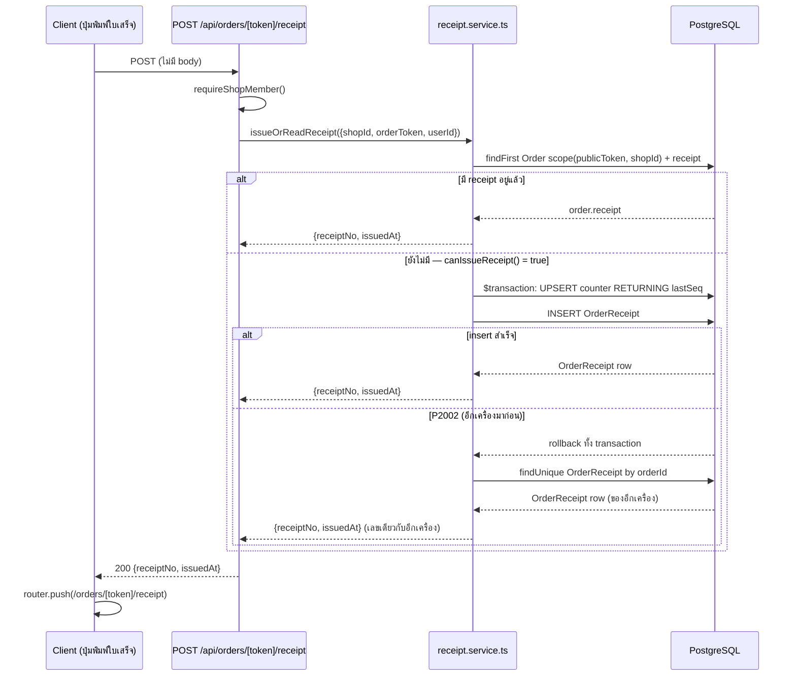
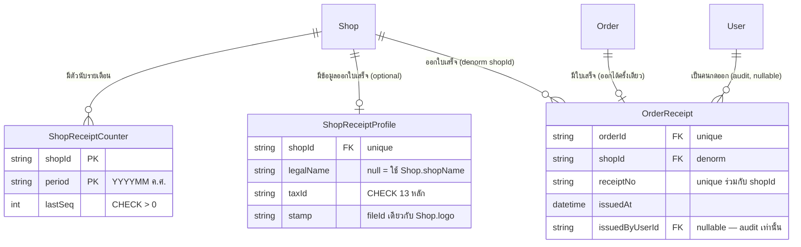

> **โมดูล:** M00065-ServiceReceiptPrinting
> **ประเภทเอกสาร:** Software Requirements Specification (SRS) - TECHNICAL
> **เวอร์ชัน:** 1.0
> **วันที่จัดทำ:** 2026-09-24
> **สถานะ:** Draft
> **เจ้าของเอกสาร:** SA (safepay-planner)

# SRS: พิมพ์ใบเสร็จรับเงิน (Service Receipt Printing) (Software Requirements Specification — Technical)

---

## 1. บทนำ (Introduction)

### 1.1 วัตถุประสงค์ของเอกสาร

เอกสารนี้กำหนดข้อกำหนดเชิงเทคนิคของฟีเจอร์ "พิมพ์ใบเสร็จรับเงิน" (00065) ให้ DEV นำไป implement, QA นำไปวางแผนทดสอบ ครอบคลุม: การออกเลขที่ใบเสร็จแบบ atomic ต่อร้าน/รายเดือน, service layer ที่ render ข้อมูลใบเสร็จสดจากออเดอร์ปัจจุบัน, endpoint 2 ชุด (ออกใบเสร็จ + ตั้งค่าข้อมูลออกใบเสร็จ), และหน้าพิมพ์ A4 แบบ 2 หน้า (ต้นฉบับ/สำเนา)

### 1.2 ขอบเขตเชิงระบบ (System Scope)

**อยู่ในขอบเขต (สถานะ: implement เสร็จทั้งหมดแล้ว ดู §7.4):**
- `src/lib/thai-baht-text.ts` — ตัวแปลงตัวเลขเป็นคำอ่านภาษาไทย (ฟังก์ชันบริสุทธิ์)
- `src/lib/receipt.ts` + `receiptPeriodTH()` ใน `src/lib/format-date.ts` — กฎที่ตัดสินพฤติกรรมของใบเสร็จ (ฟังก์ชันบริสุทธิ์ทั้งหมด)
- `src/services/receipt.service.ts` — service layer (`ReceiptError`/`ReceiptErrorCode` ประกาศอยู่ในไฟล์นี้ **ไม่ใช่ไฟล์แยก** — ไม่มี `src/lib/receipt-error.ts`)
- `POST /api/orders/[token]/receipt`, `PATCH /api/shops/receipt-profile` — 🛑 **มีแค่ 2 endpoint ไม่ใช่ 3** — ไม่มี `GET /api/shops/receipt-profile` เลย การ์ดตั้งค่าที่ `/shop` อ่านข้อมูลผ่าน RSC (`getReceiptProfile()` เรียกตรงจาก `shop/page.tsx`) ไม่ผ่าน HTTP
- หน้าพิมพ์ `src/app/(paces)/seller/(fullscreen)/orders/[token]/receipt/{page.tsx,ReceiptSheet.tsx,PrintButton.tsx,receipt.module.css}` — 🛑 **อยู่ใต้ route group `(fullscreen)` ที่มีอยู่แล้ว ไม่ใช่ route group ใหม่ `(print)`** (ดู §7.1/TD-004 ที่แก้แล้ว) + เมนู ⋯ key `print-receipt` ใน `OrderDetailClient.tsx` (ไม่ได้แก้ `order-action-set.ts` — ดู TD-003 ที่แก้แล้ว) + ข้อความ "ใบเสร็จเลขที่ …" ใน `OrderSummary.tsx` + การ์ด `ShopReceiptProfileField.tsx` ใน `/shop`
- Data model: `ShopReceiptProfile`, `OrderReceipt`, `ShopReceiptCounter` (migration `20260924120000_service_receipt` — ดู [[DATABASE]])

**นอกขอบเขต:** PDF ฝั่งเซิร์ฟเวอร์, ใบกำกับภาษี, vertical อื่นนอกจาก `SERVICE_QUEUE`, พิมพ์หลายใบพร้อมกัน — ดู [[PRD]] §5

### 1.3 เอกสารอ้างอิง (References)

| เอกสาร | ความสัมพันธ์ |
|--------|-------------|
| [[PRD]] ของโมดูลนี้ | เป้าหมายธุรกิจ, KPI, ผังใบเสร็จอ้างอิง (§10.2), เหตุผลเลขที่ใช้ปี ค.ศ. (§4.3) |
| [[BRD]] ของโมดูลนี้ | Functional Requirements FR-RCP-01..11, Acceptance Criteria AC-RCP-01..38, Business Rules BR-RCP-01..17 |
| [[DATABASE]] ของโมดูลนี้ | schema 3 ตารางใหม่ (`ShopReceiptProfile`/`OrderReceipt`/`ShopReceiptCounter`), migration `20260924120000_service_receipt` — เขียน+validate แล้ว ยังไม่ apply |
| `docs/conventions/date-format.md` | มาตรฐานวันที่ พ.ศ./เวลาไทยของระบบ — ใบเสร็จเบี่ยงเฉพาะ "เลขที่" (ดู §7.1 TD ด้านล่าง) วันที่แสดงผลยังคง พ.ศ. ปกติ |
| `docs/conventions/service-error-route-mapping` (Hard Rule) | ทุก custom Error ที่ service throw ต้องมี route-catch ครบ — ดู §4.2 |

### 1.4 นิยามและตัวย่อ (Definitions & Acronyms)

| คำ/ตัวย่อ | ความหมาย |
|-----------|----------|
| **period** | รอบเดือนของตัวนับเลขที่ใบเสร็จ รูปแบบ `YYYYMM` ปี ค.ศ. ตัดตามเวลาไทย (Asia/Bangkok) |
| **receiptNo** | เลขที่ใบเสร็จ รูปแบบ `CA` + period (6 หลัก) + ลำดับ 4 หลัก เช่น `CA2026090043` |
| **issuedAt** | เวลาที่ออกใบเสร็จครั้งแรก — ค่าคงที่ตลอดไปของออเดอร์นั้น (BR-RCP-10) |
| **Receipt Profile** | ข้อมูลหัวใบเสร็จที่ร้านตั้งค่าเอง (`ShopReceiptProfile`) |
| **fallback** | ค่าที่ระบบใช้แทนเมื่อร้านไม่มี `ShopReceiptProfile` (ใช้ `Shop.shopName`/`Shop.address`/`Shop.logo`) |

---

## 2. ภาพรวมสถาปัตยกรรม (Architecture Overview)

### 2.1 บริบทระบบ (System Context)

```mermaid
flowchart LR
    Seller[ผู้ใช้ฝั่งร้าน — เบราว์เซอร์]
    OrderPage[หน้าออเดอร์ /orders/token RSC + client island]
    ShopPage[หน้า /shop RSC — เรียก getReceiptProfile ตรง + การ์ด ShopReceiptProfileField]
    PrintPage[หน้าพิมพ์ RSC — (fullscreen)/orders/token/receipt]
    API1[POST /api/orders/token/receipt]
    API2[PATCH /api/shops/receipt-profile]
    SVC[receipt.service.ts]
    DB[(PostgreSQL — Supabase)]
    Upload[/api/uploads/ticket+commit — ตราประทับ/]

    Seller --> OrderPage --> API1
    Seller --> ShopPage -->|เรียก service ตรง — Server Component| SVC
    ShopPage --> API2
    Seller --> Upload
    Seller --> PrintPage
    API1 --> SVC
    API2 --> SVC
    PrintPage -->|เรียก service ตรง — Server Component| SVC
    SVC --> DB
```

### 2.2 องค์ประกอบหลัก (Components)

| Component | หน้าที่ | Submodule / Stack |
|-----------|---------|-------------------|
| **`src/lib/thai-baht-text.ts`** | แปลงจำนวนเงินเป็นคำอ่านภาษาไทย (ฟังก์ชันบริสุทธิ์) | Next.js 16 lib (TypeScript, ไม่แตะ DB) |
| **`src/lib/receipt.ts`** | กฎที่ตัดสิน: ออกใบเสร็จใหม่ได้ไหม, แสดงปุ่มไหม, ช่องติ๊กวิธีชำระเงิน, validation schema | Next.js lib (TypeScript, ฟังก์ชันบริสุทธิ์ — **มีอยู่แล้ว**) |
| **`receiptPeriodTH()`** | ตัดรอบเดือน YYYYMM (ค.ศ., เวลาไทย) — อยู่ใน `format-date.ts` ร่วมกับ helper ช่วงเวลาอื่นของระบบ (`orderPeriodTH`) | Next.js lib (**มีอยู่แล้ว**) |
| **`src/services/receipt.service.ts`** | ออกเลขที่แบบ atomic, อ่าน/เขียน `ShopReceiptProfile`, ประกอบข้อมูลสำหรับหน้าพิมพ์ | Service layer (Prisma → PostgreSQL) |
| **API routes** | สัญญา HTTP สำหรับปุ่ม "พิมพ์ใบเสร็จ" และฟอร์มบันทึกตั้งค่า (การ์ดตั้งค่าอ่านผ่าน RSC ไม่ผ่าน HTTP) | `src/app/api/**` (Next.js Route Handler) |
| **หน้าพิมพ์ (RSC)** | Render ข้อมูลใบเสร็จสด 2 หน้า (ต้นฉบับ/สำเนา) A4 | `src/app/(paces)/seller/(fullscreen)/orders/[token]/receipt/**` (route group `(fullscreen)` ที่มีอยู่แล้ว ไม่ใช่ `(print)`) |
| **`ShopReceiptProfileField.tsx`** | การ์ดตั้งค่าในหน้า `/shop` | Client component (Paces) |

### 2.3 มุมมองการ Deploy (Deployment View)

Vercel serverless (Next.js App Router) เดิมทั้งหมด — ไม่มี infra ใหม่ ไม่มี background job/queue เพิ่ม การออกเลขที่ทำงานแบบ synchronous ภายใน request เดียว (transaction เดียว) ไม่มี async worker

---

## 3. ข้อกำหนดเชิงฟังก์ชันเชิงเทคนิค (Technical Functional Requirements)

### TFR-001: อ่าน/ตั้งค่า Receipt Profile ของร้าน

- **Trace to:** FR-RCP-01, FR-RCP-02, FR-RCP-10 (BRD)
- **คำอธิบายเชิงเทคนิค (ยืนยันจากโค้ดจริง 2026-09-24):**
  - `getReceiptProfile(shopId): Promise<{legalName, address, taxId, phone, stamp} | null>` — `prisma.shopReceiptProfile.findUnique({where:{shopId}})`; ไม่พบแถว → คืน `null` ตรง ๆ (ไม่ครอบเป็น view object, ไม่มี `isFallback` ที่ชั้นนี้) 🛑 **ไม่มี HTTP endpoint สำหรับฟังก์ชันนี้** — เรียกตรงจาก `src/app/(paces)/seller/(dashboard)/shop/page.tsx` (RSC) เฉพาะตอน `shop.vertical === 'SERVICE_QUEUE'` เท่านั้น **ฟังก์ชันนี้เองไม่เช็ค vertical ซ้ำ** (ไม่มี defense-in-depth ชั้นนี้ — ด่านเดียวคือเงื่อนไขที่เรียกจาก page.tsx)
  - ค่า fallback (`legalName → Shop.shopName` ฯลฯ) และ `isFallback` **ไม่ได้ประกอบที่ `getReceiptProfile`** — คำนวณที่ `resolveReceiptHeader()` (`src/lib/receipt.ts`, ฟังก์ชันบริสุทธิ์) ซึ่งถูกเรียกเฉพาะตอน render หน้าพิมพ์ (`ReceiptPage`) ไม่ใช่ตอนแสดงการ์ดตั้งค่าที่ `/shop` (การ์ดนั้นแค่ prefill ฟอร์มด้วยค่าดิบ ช่องว่างก็แสดงเป็นช่องว่าง)
  - `updateReceiptProfile(shopId, input: UpdateReceiptProfileInput)` — **รับ 2 พารามิเตอร์ ไม่ใช่ 3** (ไม่มี `userId` — ไม่มีการบันทึก audit ว่าใครแก้โปรไฟล์) query `Shop.vertical` ของ `shopId` ก่อนเสมอ → ถ้า ≠ `'SERVICE_QUEUE'` → `throw new ReceiptError('NOT_SERVICE_SHOP')` (ด่านนี้**มีจริง**เฉพาะฟังก์ชันนี้) แล้ว `prisma.shopReceiptProfile.upsert({where:{shopId}, create:{shopId, ...input}, update:input})`; `input` ผ่าน `UpdateReceiptProfileSchema` (Valibot, `src/lib/receipt.ts`) มาก่อนแล้วที่ route layer — service ไม่ validate ซ้ำ
  - สิทธิ์แก้ไข (OWNER/ADMIN) **ไม่ต้องเช็คแยกในนี้** — `requireShopMember()` ที่ route เรียกก่อนถึง service คืนสำเร็จได้เฉพาะสมาชิกที่ `ShopMember.role ∈ {OWNER, ADMIN}` หรือเจ้าของร้าน PERSONAL (role=OWNER เสมอ) อยู่แล้ว เพราะ schema ของ `ShopMember.role` ไม่มีค่าที่สามนอกจากสองค่านี้ → ทุกคำขอที่ผ่าน `requireShopMember()` คือ OWNER/ADMIN โดยอัตโนมัติ ไม่มี "สมาชิกอื่น" ที่ผ่านด่านนี้แล้วไม่มีสิทธิ์แก้ (AC-RCP-33/34 เป็นจริงโดยไม่ต้องเขียนด่านเพิ่ม)
- **Precondition:** ผู้เรียกผ่าน `requireShopMember()` แล้ว (route) หรืออยู่ใน RSC ที่ resolve `shopId` แล้ว (การ์ดตั้งค่า)
- **Postcondition:** PATCH คืนข้อมูลหลังบันทึก — ไม่มีผลข้างเคียงต่อตารางอื่น
- **Error / Edge cases:**
  - `taxId` ไม่ใช่ 13 หลัก → Valibot ปฏิเสธที่ route ก่อนถึง service (400 VALIDATION_ERROR) — ไม่บันทึก (AC-RCP-04)
  - ร้าน vertical ไม่ใช่ SERVICE_QUEUE ยิง PATCH ตรง → 403 NOT_SERVICE_SHOP (AC-RCP-32 หลักการเดียวกัน แม้ AC นั้นพูดถึงปุ่มพิมพ์)
  - บันทึกทุกช่องว่าง (ยกเลิกทั้งหมด) → สำเร็จ ได้แถวที่ทุกช่อง `null` (ไม่ error) — AC-RCP-03

### TFR-002: ออกเลขที่ใบเสร็จแบบ Atomic + Idempotent ต่อออเดอร์

- **Trace to:** FR-RCP-03, FR-RCP-04, FR-RCP-05, FR-RCP-09 (BRD)
- **คำอธิบายเชิงเทคนิค:**

  `issueOrReadReceipt({shopId, orderToken, userId}): Promise<{receiptNo: string; issuedAt: Date}>`

  1. หา Order: `prisma.order.findFirst({where:{publicToken: orderToken, shopId}, include:{shop:{select:{vertical:true}}, receipt:true}})` — **scope `shopId` ใน `WHERE` เสมอ** (ห้าม fetch แล้วเทียบทีหลัง — `feedback_rsc_dal_authz`) ไม่เจอ → `throw new ReceiptError('ORDER_NOT_FOUND')`
  2. มี `order.receipt` อยู่แล้ว (1:1 กับ `OrderReceipt`) → คืน `{receiptNo: order.receipt.receiptNo, issuedAt: order.receipt.issuedAt}` ทันที **ไม่ตรวจ vertical/status ปัจจุบันซ้ำ** (BR-RCP-09 — ใบที่ออกแล้วเปิดได้เสมอแม้ vertical/สถานะเปลี่ยนภายหลัง)
  3. ยังไม่มี `order.receipt` → เช็ค 2 ชั้นแยกกัน (โค้ดจริง `receipt.service.ts::issueOrReadReceipt`): (ก) `order.shop.vertical !== 'SERVICE_QUEUE'` → `throw new ReceiptError('NOT_SERVICE_SHOP')` (ข) ถ้าผ่านชั้น (ก) แล้ว เรียก `canIssueReceipt({vertical, status: order.status})` (จาก `src/lib/receipt.ts`) เป็น `false` → `throw new ReceiptError('ORDER_NOT_ISSUABLE')` (status เป็น `CANCELLED`/`DRAFTED`) — ดู §4.2 ตาราง mapping
  4. ออกเลขที่ในทรานแซกชันเดียว (`prisma.$transaction(async (tx) => {...})`):
     ```sql
     -- raw SQL ผ่าน tx.$queryRaw — ต้องเป็น atomic upsert ระดับ DB (BR-RCP-05)
     INSERT INTO "ShopReceiptCounter" ("shopId", "period", "lastSeq")
     VALUES ($1, $2, 1)
     ON CONFLICT ("shopId", "period")
     DO UPDATE SET "lastSeq" = "ShopReceiptCounter"."lastSeq" + 1
     RETURNING "lastSeq";
     ```
     - `period = receiptPeriodTH(new Date())`
     - ได้ `lastSeq` กลับมา → `receiptNo = formatReceiptNo(period, lastSeq)`
     - `tx.orderReceipt.create({data:{orderId: order.id, shopId, receiptNo, issuedByUserId: userId}})`
  5. **race condition (AC-RCP-14):** ถ้า `orderReceipt.create` ชน Prisma `P2002` บน `orderId` (อีก request ออกไปก่อนหน้าคอมิตทรานแซกชันนี้แล้ว) → `throw` sentinel error ภายใน callback ของ `$transaction` เพื่อบังคับ rollback ทั้งก้อน (ตัวนับ `lastSeq` ที่เพิ่งบวกไปก็ถูกย้อนกลับพร้อมกัน = ไม่มีเลขหาย) → นอก `$transaction` ดัก sentinel นั้น แล้ว `prisma.orderReceipt.findUnique({where:{orderId: order.id}})` อ่านแถวที่อีก request สร้างสำเร็จ คืนค่านั้นแทน
  - **เหตุผลที่ปลอดภัยแม้ไม่ใช้ Serializable isolation:** `INSERT ... ON CONFLICT DO UPDATE` ของ Postgres ถือ row lock บนแถว `(shopId, period)` ตลอดทรานแซกชัน — request ที่สองที่ยิงมาพร้อมกันในคู่ `(shopId, period)` เดียวกันจะ **บล็อกรอ** จนกว่า request แรกจะ commit/rollback เสร็จก่อน (ไม่ใช่อ่านค่าเก่าแล้วชนกันตอนเขียน) จึงไม่มีทางได้ `lastSeq` ซ้ำกันระหว่างสอง request ที่กำลังออกเลขให้ **ออเดอร์คนละใบ**; เคสที่ชนคือสอง request ยิง **ออเดอร์เดียวกัน** พร้อมกัน ซึ่งจับด้วย unique constraint ของ `OrderReceipt.orderId` ในขั้นตอนที่ 5
- **Precondition:** ผู้เรียกผ่าน `requireShopMember()` แล้ว
- **Postcondition:** `OrderReceipt` แถวเดียวผูกกับออเดอร์นั้นถาวร, `ShopReceiptCounter.lastSeq` ของคู่ `(shopId, period)` เพิ่มขึ้นสุทธิ 1 ต่อการออกเลขที่สำเร็จ 1 ใบ (ไม่นับที่ rollback)
- **Error / Edge cases:**
  - สอง tab กดพร้อมกันครั้งแรกของออเดอร์เดียวกัน → ทั้งคู่ได้ `receiptNo` เดียวกัน (ข้อ 5 ด้านบน) — AC-RCP-14
  - ออเดอร์ `DRAFTED` → `ORDER_NOT_ISSUABLE` (BR-RCP-06)
  - ออเดอร์ `CANCELLED` ที่ไม่เคยออกใบมาก่อน → `ORDER_NOT_ISSUABLE` (BR-RCP-08) — ปุ่มไม่ควรถูกกดได้จากหน้าจอด้วย (`showReceiptButton()` คืน false) แต่ server ต้องปฏิเสธเองเสมอ (AC-RCP-32/38)
  - ขึ้นเดือนใหม่ตามเวลาไทย (เช่น คำขอมาถึง 17:00:00.000Z ของวันสุดท้ายเดือน) → `receiptPeriodTH()` ตัดเป็นเดือนถัดไปแล้ว (**มีเทส `[blocker]` ยืนยันค่าขอบเขตนี้แล้ว** — `receipt.test.ts:44-47`)

### TFR-003: ประกอบข้อมูลสำหรับหน้าพิมพ์ (Render สด)

- **Trace to:** FR-RCP-06, FR-RCP-07, FR-RCP-08, FR-RCP-11 (BRD)
- **คำอธิบายเชิงเทคนิค (ยืนยันจากโค้ดจริง 2026-09-24 — ต่างจากดราฟต์เดิมของหัวข้อนี้):**

  `getReceiptView({shopId, orderToken}): Promise<ReceiptView | null>`

  🛑 **ไม่มี 3-kind union `ReceiptViewResult` — คืนแค่ 2 สถานะรวมกัน:** `null` (ไม่เจอออเดอร์ **หรือ** เจอแต่ยังไม่เคยออกใบเสร็จ — สองกรณีนี้แยกกันไม่ได้จากค่าที่คืน) กับแถวข้อมูลเต็ม `ReceiptView` (type alias = `NonNullable<Awaited<ReturnType<typeof getReceiptView>>>`) ผู้เรียก (`ReceiptPage`) จัดการทั้งสองกรณีด้วยบรรทัดเดียว: `if (!view) redirect(/orders/${token})`

  1. `prisma.order.findFirst({where:{publicToken, shopId}, select:{...}})` — scope `shopId` ใน `WHERE` เสมอ — `select` จริง (ไม่ใช่ `include`): `status`, `buyerName`, `buyerContact`, `paymentMethod`, `discount`, `vatRate`, `vatAmount`, `totalAmount`, `items:{select:{name,description,qty,price}}` (ไม่มี `orderBy` — ลำดับเดียวกับที่บันทึก ตาม comment ในโค้ดว่า "ลำดับเดียวกับ `getOrderForShop`"), `payments:{select:{method,voidedAt}}` (ทุกแถวไม่กรอง void — ให้ `receiptPaymentMarks()` เป็นผู้กรอง), `createdBy:{select:{displayName:true}}`, `receipt:{select:{receiptNo,issuedAt}}`, `shop:{select:{shopName,address,logo,receiptProfile:{select:{legalName,address,taxId,phone,stamp}}}}` — 🛑 **ไม่ select `shop.vertical` เลย** (ไม่มีการเช็ค vertical ในฟังก์ชันนี้ — ไม่จำเป็นเพราะมีใบเสร็จได้เฉพาะออเดอร์ของร้าน `SERVICE_QUEUE` อยู่แล้วตาม TFR-002)
  2. `!order?.receipt` (ไม่เจอ order **หรือ** เจอแต่ `receipt` เป็น `null`) → คืน `null`
  3. มี `order.receipt` → คืน `{...order, receipt: order.receipt}` (spread เพื่อ narrow ชนิดให้ `receipt` เป็น non-null โดยไม่ต้อง `!` ที่ผู้เรียก) — **ไม่มีการประกอบ `ReceiptViewData` ที่ชั้นนี้** ตัวเลข/คำอ่านไทย/breakdown ทั้งหมดคำนวณที่ `page.tsx` (ผู้เรียก) ไม่ใช่ที่ service:
     - `items[]`: page.tsx map เป็น `{name, description, qty, unitPrice, lineTotal}` ผ่าน `formatReceiptAmount()`
     - breakdown (ยอดสินค้า/ส่วนลด/VAT/รวม): เรียก `buildBreakdown()` จาก `order-detail-shared.tsx` — **ฟังก์ชันเดียวกับที่หน้ารายละเอียดออเดอร์ใช้ (HR16)** ไม่ใช่คำนวณเองใหม่ — เปลี่ยนเฉพาะป้ายแถว `subtotal`→"รวมเป็นเงิน" และ `total`→"จำนวนเงินรวมทั้งสิ้น" ผ่าน `RECEIPT_LABEL` map ในไฟล์ page.tsx
     - `totalWords = thaiBahtText(Number(view.totalAmount))`
     - `marks = receiptPaymentMarks({paymentMethod: view.paymentMethod, payments: view.payments})`
     - `cancelled = view.status === 'CANCELLED'` → ควบคุมลายน้ำ (BR-RCP-09)
     - `sellerName = view.createdBy?.displayName ?? ''` — **มาจาก `Order.createdByUserId` ไม่ใช่ `OrderReceipt.issuedByUserId`** (AC-RCP-21 — สองคนละความหมาย: คนสร้างออเดอร์ vs คนกดพิมพ์ครั้งแรก ห้ามสลับ) — `''` ไม่ใช่ `null` เมื่อไม่มีผู้สร้าง
     - `header = resolveReceiptHeader(view.shop, view.shop.receiptProfile)` (ฟังก์ชันบริสุทธิ์ใน `src/lib/receipt.ts`) → ช่องที่ร้านตั้งไว้ชนะ ช่องว่างถอยไปใช้ `Shop.shopName`/`Shop.address`; ไม่มีแถว `ShopReceiptProfile` เลย → `isFallback: true` (AC-RCP-06/07); `taxId`/`phone` ไม่มีของร้านให้ถอย → `null` = ซ่อนทั้งแถวที่ markup (AC-RCP-08)
     - `logoUrl = toFileUrl(view.shop.logo)`, `stampUrl = toFileUrl(view.shop.receiptProfile?.stamp)` (ทั้งคู่ `null`-safe)
- **Precondition:** เรียกจาก Server Component ของหน้าพิมพ์ หลัง `requireActiveShop()` resolve `shopId` แล้ว
- **Postcondition:** ไม่มีผลข้างเคียง (read-only) — เรียกซ้ำกี่ครั้งก็ได้ผลเดิมยกเว้นข้อมูลออเดอร์ถูกแก้ไขจริง (BR-RCP-11, เจตนา)
- **Error / Edge cases:**
  - ออเดอร์ไม่มีรายการ (`items.length === 0`) → ตารางว่าง + `totalAmount = 0` + `thaiBahtText(0) = 'ศูนย์บาทถ้วน'` (AC-RCP-22)

### TFR-004: การบังคับสิทธิ์/vertical ที่ฝั่งเซิร์ฟเวอร์ (ทุก endpoint)

- **Trace to:** FR-RCP-09, FR-RCP-10 (BRD), BR-RCP-17
- **คำอธิบายเชิงเทคนิค:** ทุก route handler เรียก `requireShopMember({shopId: <จากบริบทที่ระบุชัด ถ้ามี>})` เป็นด่านแรกเสมอก่อนแตะ service — ไม่มี route ใดพึ่งการซ่อนปุ่มฝั่งหน้าจออย่างเดียว (BR-RCP-17, mirror หลักการเดียวกับ `requireGeneralShop`/`requireLodgingShop` ที่มีอยู่แล้วในระบบ)
- **Precondition:** —
- **Postcondition:** คำขอที่ไม่มี session → 401; ไม่ใช่สมาชิกร้านที่ระบุ → 403; ตรง vertical ผิด → 403 `NOT_SERVICE_SHOP`
- **Error / Edge cases:** ดูตาราง mapping เต็มที่ §4.2 และ `API.md` §5

---

## 4. ข้อกำหนดส่วนต่อประสาน (Interface / API Specification)

รายละเอียด request/response เต็มอยู่ที่ `API.md` ของโมดูลนี้ — หัวข้อนี้สรุปเฉพาะภาพรวมและ **ตาราง cross-file error-mapping** ซึ่งเป็นสัญญาที่ต้องตรงกันระหว่าง service กับ route

### 4.1 API Endpoints

| Method | Path | คำอธิบาย | Auth |
|--------|------|----------|------|
| POST | `/api/orders/[token]/receipt` | ออกใบเสร็จ (ครั้งแรก) หรือคืนเลขที่เดิม (พิมพ์ซ้ำ) | `requireShopMember()` |
| PATCH | `/api/shops/receipt-profile` | บันทึกข้อมูลออกใบเสร็จ | `requireShopMember()` |

🛑 **ไม่มี `GET /api/shops/receipt-profile`** — การ์ดตั้งค่าที่ `/shop` อ่านข้อมูลผ่าน RSC (`getReceiptProfile()` เรียกตรงจาก `shop/page.tsx` เฉพาะร้าน `SERVICE_QUEUE`) ไม่ผ่าน HTTP endpoint เลย

### 4.2 Cross-file Error Mapping (บังคับ — ดู Hard Rule error-route-mapping)

`ReceiptErrorCode`/`ReceiptError` ประกาศอยู่ใน `src/services/receipt.service.ts` โดยตรง 🛑 **ไม่มีไฟล์แยก `src/lib/receipt-error.ts`**:

```ts
export type ReceiptErrorCode = 'ORDER_NOT_FOUND' | 'NOT_SERVICE_SHOP' | 'ORDER_NOT_ISSUABLE'

export class ReceiptError extends Error {
  constructor(public code: ReceiptErrorCode) { super(code) }
}
```

| Error ที่ service `throw` | เกิดใน function | Route ที่ catch | HTTP status | ยืนยันจากโค้ดจริง |
|---|---|---|---|---|
| `ReceiptError('ORDER_NOT_FOUND')` | `issueOrReadReceipt` | `POST /api/orders/[token]/receipt` | 404 | ✅ `route.ts` มี `STATUS` map ครบ |
| `ReceiptError('NOT_SERVICE_SHOP')` | `issueOrReadReceipt`, `updateReceiptProfile` (`getReceiptProfile` **ไม่** throw — ดู TFR-001) | `POST /api/orders/[token]/receipt` (map ผ่าน `STATUS` table), `PATCH /api/shops/receipt-profile` (ทุก `ReceiptError` ที่ route นี้ catch ตอบ 403 ตรง ๆ — มีแค่ `NOT_SERVICE_SHOP` ที่ throw ได้จริงจากฟังก์ชันนี้ จึงยังตรงกัน) | 403 | ✅ |
| `ReceiptError('ORDER_NOT_ISSUABLE')` | `issueOrReadReceipt` | `POST /api/orders/[token]/receipt` | 409 | ✅ |
| Valibot `parsed.success === false` (จาก `v.safeParse(UpdateReceiptProfileSchema, ...)` ที่ตัว route เอง — **ไม่ใช่ service throw**, ไม่ใช้ try/catch กับ `ValiError`) | route `PATCH /api/shops/receipt-profile` | route เดียวกัน (parse ก่อนเรียก service) | 400 `{error:'VALIDATION_ERROR', message}` (flat `message` ไม่ใช่ `issues` — ดู §5 ของ `API.md`) | ✅ |
| Error อื่นที่ไม่ใช่ `ReceiptError` (เช่น Prisma error ที่ไม่ใช่ P2002 ที่ดักไว้แล้วใน TFR-002 ข้อ 5) | ทุก service function | ทุก route — `console.error` แล้วตอบ `{error:'INTERNAL'}` 500 เอง (ไม่ throw ต่อให้ Next.js error boundary จัดการ — ต่างจาก draft เดิมของหัวข้อนี้เล็กน้อย) | 500 | ✅ |

🛑 **ทุก route ใน §4.1 ที่เรียก service function ที่ throw `ReceiptError` ต้องมี `switch(e.code)` ครบทุกค่าที่ function นั้น throw ได้จริง** (ดูคอลัมน์ "เกิดใน function" — เทียบกับ TFR-001/TFR-002/TFR-003 ว่า function ไหน throw code อะไรบ้าง) มิฉะนั้นจะตกไป fallback 500 ทั้งที่ควรเป็น 403/404/409 (บทเรียน 00003 `OutOfStockError` — memory `feedback_service_error_route_mapping`)

### 4.3 Events / Messaging

ไม่มี — ฟีเจอร์นี้ synchronous ล้วน ไม่มี event/queue

### 4.4 Sequence ของ flow สำคัญ



---

## 5. ข้อกำหนดด้านข้อมูล (Data Requirements)

### 5.1 Data Model / Entities

| Entity | คำอธิบาย | Owner store |
|--------|----------|-------------|
| **`ShopReceiptProfile`** | ข้อมูลหัวใบเสร็จของร้าน 1:1 กับ `Shop` — ทุกฟิลด์ optional | PostgreSQL (Supabase) — Prisma |
| **`OrderReceipt`** | ใบเสร็จที่ออกแล้ว 1:1 กับ `Order` | PostgreSQL (Supabase) — Prisma |
| **`ShopReceiptCounter`** | ตัวนับเลขที่ต่อร้าน/เดือน (composite PK) | PostgreSQL (Supabase) — Prisma |

รายละเอียดคอลัมน์/CHECK/index เต็มอยู่ใน [[DATABASE]] ของโมดูลนี้ — ที่นี่สรุปเฉพาะที่กระทบ service logic

### 5.2 ความสัมพันธ์ (ERD)



### 5.3 Migration / Data Lifecycle

migration `20260924120000_service_receipt` (3 `CREATE TABLE` additive, ไม่แตะตารางเดิม) เขียนและ `prisma validate`/`prisma generate` ผ่านแล้วโดย `safepay-database` — **ยังไม่ apply บนฐานใด ๆ** ตาม Hard Rule 13/14/15 Controller เป็นผู้ apply บนฐาน local เอง และต้องแจ้ง user ก่อนเสมอว่า push เข้า `main` = migrate ขึ้น prod อัตโนมัติ (deploy รัน `prisma migrate deploy` ให้อยู่แล้ว) ไม่มีการ backfill (ตารางใหม่ทั้งหมด)

---

## 6. ข้อกำหนดที่ไม่ใช่ฟังก์ชัน (Non-Functional Requirements)

| ด้าน | ข้อกำหนด | เป้าหมายที่วัดได้ |
|------|----------|-------------------|
| **Performance** | หน้าพิมพ์เปิดจากคลิกปุ่มถึงเห็นหน้าต่าง `window.print()` | < 2 วินาที (PRD §8) ในสภาพเครือข่ายปกติ — query เดียวต่อ order พร้อม `include` (ไม่ N+1) |
| **Concurrency** | ออกเลขที่พร้อมกันจากหลายเครื่อง | ไม่มีเลขซ้ำ/เลขหาย (TFR-002 ข้อ 5) — พิสูจน์ด้วยเทส integration ที่ยิง `issueOrReadReceipt` 2 ครั้งพร้อมกัน (`Promise.all`) กับออเดอร์เดียวกัน |
| **Availability** | ไม่มี SLA แยก — ใช้มาตรฐานเดียวกับ API อื่นของระบบ (Vercel serverless) | — |
| **Security** | ทุก endpoint บังคับสิทธิ์ที่เซิร์ฟเวอร์ (§4.2), `taxId` ตรวจรูปแบบก่อนบันทึกเสมอ | 0 endpoint ที่พึ่งการซ่อน UI อย่างเดียว |
| **Observability** | ไม่ต้องมี log พิเศษเพิ่ม (ไม่มี external call ให้ debug) — error ที่ไม่คาดคิดโผล่เป็น Next.js 500 ตามปกติของระบบ | — |
| **Maintainability** | ฟังก์ชันตัดสินใจทั้งหมด (numbering format, eligibility, payment marks, baht text) เป็นฟังก์ชันบริสุทธิ์แยกจาก I/O — มีเทส `[blocker]` กำกับ (มีอยู่แล้วสำหรับ `receipt.ts`) | เทสพิสูจน์ด้วย mutation (ดู `docs/conventions/mutation-silence-means-weak-corpus.md`) |

---

## 7. ข้อจำกัดทางเทคนิคและการพึ่งพา (Technical Constraints & Dependencies)

### 7.1 ข้อจำกัดทางเทคนิค

- ไม่มีการสร้าง PDF ฝั่งเซิร์ฟเวอร์ — พึ่ง `window.print()` ของเบราว์เซอร์ (`PrintButton.tsx` — ปุ่มเดียวในหน้าพิมพ์ที่เรียก `window.print()`) นี่คือจุดแรกในระบบที่ใช้ browser print API
- เลขที่ใบเสร็จใช้ปี **ค.ศ.** โดยตั้งใจ (ต่างจากมาตรฐานวันที่ พ.ศ. ทั้งระบบ) — `receiptPeriodTH()` **ไม่ผ่าน** `BE_OFFSET` ที่ `orderPeriodTH()` ใช้ (ยืนยันจากซอร์ส `format-date.ts:97-102`) — ตัวเลขที่แสดงบนใบเสร็จ (วันที่ออกใบ) ยังคงใช้ `formatDateTH` ปกติ (พ.ศ.) ไม่ใช่ปี ค.ศ.
- 🛑 **ไม่ได้แก้ `_print.css`** (`src/assets/css/custom/_print.css` — มีอยู่แล้วในระบบ ยังมีแค่กฎซ่อน sidebar/header/footer เหมือนเดิม ฟีเจอร์นี้ไม่แตะไฟล์นั้นเลย) — ทางที่ implement จริงใช้ **2 กลไกแยกกัน**: (1) `@page { size: A4; margin: 0 }` + `break-after: page` เขียนไว้ใน **`receipt.module.css` ไฟล์ใหม่ของฟีเจอร์นี้เอง** (CSS Module, carve-out HR7 เพราะต้องใช้หน่วยกายภาพ mm/pt) (2) `src/app/(paces)/seller/(fullscreen)/layout.tsx` (layout ที่ใช้ร่วมกันของทุกหน้า `(fullscreen)/**` ไม่ใช่เฉพาะใบเสร็จ) เพิ่มคลาส `print:static print:block print:overflow-visible print:bg-transparent print:p-0` บน wrapper `fixed inset-0` เดิม — เพราะเปลือก `fixed`+`overflow-hidden` เดิมจะตัดงานพิมพ์เหลือแค่เท่าจอโดยไม่มี error ใด ๆ ถ้าไม่ปลดระหว่างพิมพ์ **ผลข้างเคียง:** คลาส `print:*` นี้มีผลกับทุกหน้า `(fullscreen)/**` (สร้างออเดอร์/สินค้า/แก้ไข ฯลฯ) ไม่ใช่แค่หน้าใบเสร็จ — ความเสี่ยงต่ำเพราะหน้าอื่นไม่มีใครเรียก `window.print()` แต่ถ้ามีคนกด Ctrl+P บนหน้าเหล่านั้นโดยบังเอิญ จะได้ static layout แทน fixed-overlay-clipped (พฤติกรรมที่ถูกต้องกว่าเดิม ไม่ใช่ regression)

### 7.2 การพึ่งพาภายนอก/ภายใน

| Dependency | ประเภท | ความเสี่ยง |
|------------|--------|------------|
| **`requireShopMember()`** (`src/lib/shop-api-guard.ts`) | internal — มีอยู่แล้ว | ต่ำ — ใช้ตามเดิม ไม่แก้ไข |
| **`toFileUrl()`** (`src/lib/file-url.ts`) | internal — มีอยู่แล้ว | ต่ำ — resolve `stamp`/`logo` fileId → URL |
| **`@/lib/upload-client` (`uploadFileId`, purpose `IMAGE`)** | internal — มีอยู่แล้ว | ต่ำ — ใช้ตามเดิมสำหรับอัปโหลดตราประทับ |
| **เบราว์เซอร์ของผู้ใช้ (`window.print()`)** | external (runtime environment) | กลาง — หน้าตาเอกสารต่างกันเล็กน้อยข้ามเบราว์เซอร์/เครื่องพิมพ์ (PRD §6.2 risk) — mitigate ด้วย CSS `@page A4` มาตรฐาน |

### 7.3 สมมติฐานทางเทคนิค (Assumptions)

- `ShopMember.role` มีแค่ 2 ค่า (`OWNER`/`ADMIN`) ตาม schema ปัจจุบัน — ถ้าอนาคตเพิ่ม role ที่ 3 (เช่น "staff") TFR-001 เรื่องสิทธิ์แก้ไขต้องกลับมาทบทวน (ปัจจุบันไม่ต้องเขียนด่านแยกเพราะยังไม่มี role ที่ 3 จริง)
- `OrderItem` ไม่มีคอลัมน์ลำดับแยก — เรียงตามลำดับ default ของ query (insert order) ซึ่งเป็นพฤติกรรมเดิมที่หน้าออเดอร์อื่นในระบบใช้อยู่แล้ว (ไม่ใช่ของใหม่ที่ต้องประกาศ)
- `Order.discount`/`Order.vatAmount` เป็น `Decimal?` — แปลงเป็น `Number()` ก่อนส่งข้าม RSC boundary เสมอ (รูปแบบเดียวกับที่หน้า `orders/[token]/page.tsx` ทำอยู่แล้วกับ `OrderFactsCard`, T12 comment ในไฟล์นั้น) มิฉะนั้นจะพัง "Only plain objects can be passed to Client Components"

### 7.4 สถานะการ implement ปัจจุบัน (ยืนยันจากโค้ดจริง 2026-09-24 — Hard Rule 16)

🛑 **implement เสร็จครบทั้งฟีเจอร์แล้ว** — เอกสารฉบับร่างเดิมของหัวข้อนี้เขียนไว้ก่อนลงมือเขียนโค้ดจริง (ลำดับ "SDS.md §8 ลำดับการ build") ตอนนี้ทุกไฟล์อยู่บนดิสก์และผ่านเทสแล้ว:

- **lib บริสุทธิ์:** `src/lib/thai-baht-text.ts` (`thaiBahtText`), `src/lib/receipt.ts` (`RECEIPT_PREFIX`, `TAX_ID_RE`, `formatReceiptNo`, `canIssueReceipt`, `showReceiptButton`, `receiptPaymentMarks`, `UpdateReceiptProfileSchema`, `formatReceiptAmount`, `resolveReceiptHeader`), `receiptPeriodTH()` ใน `src/lib/format-date.ts`
- **service:** `src/services/receipt.service.ts` (`issueOrReadReceipt`, `getReceiptNoForOrder`, `getReceiptView`, `getReceiptProfile`, `updateReceiptProfile`, `ReceiptError`/`ReceiptErrorCode` — ทุกตัวอยู่ไฟล์เดียวกัน ไม่มี `receipt-error.ts` แยก)
- **API:** `POST /api/orders/[token]/receipt/route.ts`, `PATCH /api/shops/receipt-profile/route.ts` (ไม่มี GET)
- **UI:** หน้าพิมพ์ `src/app/(paces)/seller/(fullscreen)/orders/[token]/receipt/{page.tsx,ReceiptSheet.tsx,PrintButton.tsx,receipt.module.css}`, เมนู ⋯ key `print-receipt` + `handlePrintReceipt()` ใน `OrderDetailClient.tsx`, ข้อความ "ใบเสร็จเลขที่ …" ใน `OrderSummary.tsx`, การ์ด `src/app/(paces)/seller/(dashboard)/shop/components/ShopReceiptProfileField.tsx` (ต่อใน `shop/page.tsx`)
- **เทส:** `src/lib/__tests__/receipt.test.ts` (30 เคส unit, ผ่านทั้งหมด) + `tests/services/receipt.test.ts` (5 เคส DB local — ออกเลขต่อเนื่อง/concurrency 5 คำขอพร้อมกัน/ยกเลิกก่อน-หลังออก/vertical guard/scope ร้าน — ผ่านทั้งหมด, mutation แดงครบ 8 แบบตามที่ TestCase.md ระบุ)
- **ยังไม่ทำ:** browser QA (Chrome DevTools MCP/มือถือ), route-level test (ยิง HTTP จริงแทนเรียก service ตรง)

---

## 8. ความเสี่ยงเชิงสถาปัตยกรรม (Architectural Risks)

| ความเสี่ยง | ผลกระทบ | แนวทางลด |
|-----------|---------|----------|
| **route ใหม่ลืม branch error บางตัว** | ตกไป 500 ทั้งที่ควรเป็น 403/404/409 (บทเรียน 00003) | ตาราง §4.2 บังคับ enumerate ทุก code ต่อ route — reviewer เทียบตารางนี้กับ diff จริง |
| **คลาส `print:*` ที่เพิ่มใน `(fullscreen)/layout.tsx` กระทบทุกหน้าในกลุ่มนี้ ไม่ใช่แค่ใบเสร็จ** | หน้าอื่นใต้ `(fullscreen)/**` (สร้างออเดอร์/สินค้า/แก้ไข ฯลฯ) ได้ `print:static print:block print:overflow-visible` ไปด้วยโดยไม่ตั้งใจ ถ้ามีคนกด Ctrl+P บนหน้าเหล่านั้น | ความเสี่ยงต่ำ (ไม่มีหน้าอื่นเรียก `window.print()`) และผลที่ได้ (static layout แทน fixed-overlay-clipped) ถูกต้องกว่าพฤติกรรมเดิมอยู่แล้ว — `@page A4 margin:0` ของใบเสร็จอยู่ใน `receipt.module.css` แยกเฉพาะ **ไม่กระทบหน้าอื่น** เพราะเป็น CSS Module ผูกกับ class ที่ใช้เฉพาะไฟล์นี้ |
| **`ShopReceiptCounter` เป็น hot row เมื่อร้านพิมพ์รับเงินหน้าร้านถี่ (เช่น คิวยาว)** | row lock สั้น ๆ ต่อการออกเลข 1 ครั้ง — ที่ปริมาณจริงของร้าน SERVICE_QUEUE ไม่มีนัยสำคัญ (ยืนยันแล้วใน [[DATABASE]] §6) | ไม่ต้อง mitigate เพิ่มในรอบนี้ — เฝ้าดู latency จริงหลัง release |

---

## 9. Traceability Matrix

| BRD FR-ID | SRS TFR-ID | Component | สถานะ |
|-----------|------------|-----------|-------|
| FR-RCP-01, FR-RCP-02 | TFR-001 | `receipt.service.ts::getReceiptProfile` | Draft |
| FR-RCP-10 | TFR-001 | `requireShopMember()` (มีอยู่แล้ว) | Draft |
| FR-RCP-03, FR-RCP-04, FR-RCP-05 | TFR-002 | `receipt.service.ts::issueOrReadReceipt` | Draft |
| FR-RCP-09 (BRD §2.5) | TFR-002 | เงื่อนไข `order.receipt` ที่มีอยู่แล้วใน TFR-002 ข้อ 2 | Draft |
| FR-RCP-06, FR-RCP-07, FR-RCP-08 | TFR-003 | `receipt.service.ts::getReceiptView` + `ReceiptSheet` | Draft |
| FR-RCP-11 | TFR-003 | render สดจาก Order ปัจจุบันทุกครั้ง (ไม่ snapshot) | Draft |
| FR-RCP-09 (BRD §2.4) | TFR-004 | `requireShopMember()` ทุก route | Draft |

---

## 10. สรุป (Summary)

เอกสาร SRS นี้กำหนดข้อกำหนดเชิงเทคนิคของ **พิมพ์ใบเสร็จรับเงิน (00065)** — service layer ที่ออกเลขที่แบบ atomic ต่อร้าน/รายเดือน (upsert-counter pattern ผ่าน raw SQL ในทรานแซกชันเดียวกับการสร้าง `OrderReceipt`), API 3 endpoint, และหน้าพิมพ์ A4 ที่ render สดจากข้อมูลออเดอร์ปัจจุบันทุกครั้ง

**ขอบเขตที่ครอบคลุม:** การออกเลขที่ (numbering), การอ่าน/ตั้งค่า profile, การประกอบข้อมูลหน้าพิมพ์, การบังคับสิทธิ์ที่เซิร์ฟเวอร์ — ไม่รวม PDF/ใบกำกับภาษี/vertical อื่น (ดู [[PRD]] §5)

**ประเด็นที่เคยเป็น Open Questions — ตัดสินแล้วในโค้ดจริง (ปิด):**
- ตำแหน่งปุ่ม "พิมพ์ใบเสร็จ": อยู่ใน **เมนู ⋯ ของ `OrderDetailClient.tsx`** (key `print-receipt`, label ผัน "พิมพ์ใบเสร็จ"/"ดูใบเสร็จ" ตามว่ามี `receiptNo` แล้วหรือยัง) — **ไม่ได้ wiring เข้า `order-action-set.ts`** (ต่างจาก TD-003 ของ SDS ฉบับร่างเดิม) เพราะเป็นเงื่อนไขที่ผูกกับ vertical เดียวเหมือน "คืนของ" ที่ทำแบบเดียวกันอยู่แล้วในไฟล์นี้
- ลายน้ำ "ยกเลิก": ข้อความ "ยกเลิก" สีแดง (`var(--color-danger)`) opacity 0.16 หมุน -30 องศา ทับทั้งกระดาษ (`.void` ใน `receipt.module.css`) แสดงเมื่อ `order.status === 'CANCELLED'` ทั้งต้นฉบับและสำเนา

### ส่วนที่ต้องต้อง sync เข้า `docs/SRS.md` (ระบบ)

🛑 ทำโดย Controller (Hard Rule 11) — รายการที่ต้องเพิ่ม:
- **Data model:** โมเดล `ShopReceiptProfile`, `OrderReceipt`, `ShopReceiptCounter` (3 ตารางใหม่)
- **API reference:** `POST /api/orders/[token]/receipt`, `GET`/`PATCH /api/shops/receipt-profile`
- **Validation rules:** `UpdateReceiptProfileSchema` (Valibot, `src/lib/receipt.ts`) — เลขผู้เสียภาษี 13 หลัก
- **Enum/constants ใหม่:** `ReceiptErrorCode` (`ORDER_NOT_FOUND` / `NOT_SERVICE_SHOP` / `ORDER_NOT_ISSUABLE`)
- **Business rule ใหม่ที่ผูกกับ `Order`:** เลขที่ใบเสร็จ = คุณสมบัติถาวรของออเดอร์ (1:1 ผ่าน `OrderReceipt`) ที่ไม่ถูกลบแม้ออเดอร์ถูกยกเลิกภายหลัง — ควรบันทึกไว้ในหมวด Order lifecycle ของ SRS ระบบ
