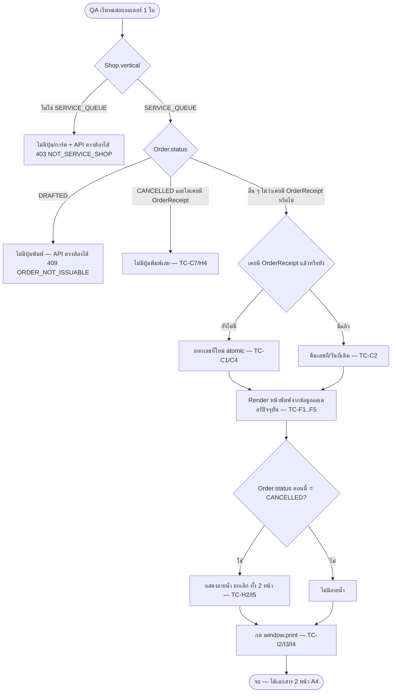

> **โมดูล:** M00065-ServiceReceiptPrinting
> **ประเภทเอกสาร:** Test Case
> **เวอร์ชัน:** 1.0
> **วันที่จัดทำ:** 2026-09-24
> **สถานะ:** Draft
> **เจ้าของเอกสาร:** QA (ดู [[Feature-Docs-Ownership]])

# Test Case: พิมพ์ใบเสร็จรับเงิน (Service Receipt Printing)

---

## 1. Overview

- **เอกสารต้นทาง:** [[BRD]] ของโมดูล 00065 — ทุก scenario ใน TestCase นี้ trace กลับ `AC-RCP-01..38` ได้ครบ (§3)
- **ขอบเขตชุดทดสอบ (Scope):**
  - **In-scope:** เลขที่ใบเสร็จ (ออก/ซ้ำ/ข้าม/รีเซ็ตเดือน/atomic), ข้อมูลออกใบเสร็จของร้าน (ตั้งค่า/fallback/สิทธิ์), เนื้อหาบนใบเสร็จ (รายการ/ยอด/คำอ่านไทย/วิธีชำระเงิน), สิทธิ์/vertical guard ฝั่งเซิร์ฟเวอร์, พฤติกรรมเมื่อออเดอร์ถูกยกเลิกหลังออกใบ, หน้าพิมพ์ 2 หน้า A4
  - **Out-of-scope:** ใบกำกับภาษีเต็มรูป, ส่ง PDF เข้าแชท, vertical อื่นนอก SERVICE_QUEUE, batch print, prefix เลขที่แบบตั้งเอง (ตรงกับ PRD §5)
- **สภาพแวดล้อม:**
  - Unit/Service: Vitest, ฐาน Postgres บนเครื่อง (`.env` ชี้ `localhost:5434` — `tests/setup.ts` บังคับ allowlist localhost), scope ข้อมูลด้วย id ที่เทสสร้างเอง (HR13)
  - Browser QA: `http://seller.deepth.local:4000` (ห้าม `localhost` — subdomain routing ผ่าน `proxy.ts`), Chrome DevTools MCP + `npm run e2e` (Playwright) เมื่อ UI พร้อม
- **สถานะ implementation (อัปเดต 2026-09-24 — ครบทั้งฟีเจอร์แล้ว, HR16):**

  | ชั้น | สถานะ | ไฟล์จริง |
  |------|-------|---------|
  | Unit lib | ✅ โค้ด + เทสครบ — **30/30 ผ่าน** | `src/lib/thai-baht-text.ts`, `src/lib/receipt.ts`, `src/lib/format-date.ts` (`receiptPeriodTH`), `src/lib/__tests__/receipt.test.ts` |
  | Service | ✅ โค้ด + เทส DB local ครบ — **5/5 ผ่าน** (mutation แดงครบ 8 แบบตาม TC-C4/G1) | `src/services/receipt.service.ts` (`issueOrReadReceipt`, `getReceiptNoForOrder`, `getReceiptView`, `getReceiptProfile`, `updateReceiptProfile`), `tests/services/receipt.test.ts` |
  | API | ✅ มี route ครบ **2 ตัว** (ไม่มี `GET /api/shops/receipt-profile` — ไม่เคยอยู่ในสัญญาสุดท้าย ดู `API.md`) — ยังไม่มี route-level test (ยิง HTTP จริง) แยกจาก service test | `POST /api/orders/[token]/receipt`, `PATCH /api/shops/receipt-profile` |
  | UI | ✅ มีครบ — การ์ด `ShopReceiptProfileField.tsx` ใน `/shop`, เมนู ⋯ "พิมพ์ใบเสร็จ"/"ดูใบเสร็จ" ใน `OrderDetailClient.tsx`, หน้าพิมพ์ `(fullscreen)/orders/[token]/receipt/` — **ยังไม่เคยเปิดหน้าจริงสักครั้ง (browser QA ยังไม่ทำ)** | ดู SRS §7.4 รายการไฟล์เต็ม |

  ⇒ **กลุ่ม A/B/C/D/E/F/G/H รันได้และผ่านหมดแล้ว** (unit 30 + service 5 = 35 เคสอัตโนมัติ) · **กลุ่ม I (browser QA, Manual) ยังไม่ได้รันสักเคส** — โค้ดพร้อมแล้ว ไม่ได้ Blocked เพราะรอ UI อีกต่อไป แต่ยังไม่มีใครกดจริงบนเบราว์เซอร์

---

## 2. Test Scenarios

### กลุ่ม A — Unit: `thai-baht-text.ts` (คำอ่านยอดเงินภาษาไทย)

#### TC-A1 `[blocker]` `thaiBahtText()` — ตารางค่า input/expected

- **Linked to:** AC-RCP-20, AC-RCP-22, AC-RCP-23
- **Precondition:** ไม่มี (pure function, ไม่แตะ DB)
- **Steps:** เรียก `thaiBahtText(n)` แล้วเทียบผลกับตาราง

  | input | expected | จุดที่ต้องระวัง |
  |-------|----------|-----------------|
  | `0` | `ศูนย์บาทถ้วน` | 0 บาท 0 สตางค์ เป็น edge แยกจาก "ไม่มีสตางค์" ทั่วไป |
  | `1` | `หนึ่งบาทถ้วน` | หลักหน่วยเดี่ยว ไม่ใช่ "เอ็ด" (ไม่มีหลักสูงกว่า) |
  | `11` | `สิบเอ็ดบาทถ้วน` | หลักหน่วย=1 ต้องเป็น "เอ็ด" เมื่อมีหลักสิบนำหน้า |
  | `21` | `ยี่สิบเอ็ดบาทถ้วน` | หลักสิบ=2 ต้องเป็น "ยี่สิบ" ไม่ใช่ "สองสิบ" |
  | `101` | `หนึ่งร้อยเอ็ดบาทถ้วน` | หลักหน่วย=1 เป็น "เอ็ด" แม้หลักสิบ=0 (เพราะมีหลักร้อยนำหน้า) |
  | `3500` | `สามพันห้าร้อยบาทถ้วน` | ข้ามหลักพัน-ร้อยต่อเนื่อง ไม่มีหลักสิบ/หน่วย |
  | `350.5` | `สามร้อยห้าสิบบาทห้าสิบสตางค์` | มีทั้งส่วนบาทและสตางค์ในค่าเดียว |
  | `1000000` | `หนึ่งล้านบาทถ้วน` | ข้ามหลักล้าน (`readInt` recursive) |
  | `11000000` | `สิบเอ็ดล้านบาทถ้วน` | ส่วนก่อน "ล้าน" (`11`) ก็ต้องมีกฎ "เอ็ด" เหมือนหลักหน่วยปกติ |
  | `0.25` | `ยี่สิบห้าสตางค์` | บาท=0 **ห้ามมี** "ศูนย์บาท" นำหน้า — ต่างจาก `0` เฉย ๆ ที่ทั้งบาท+สตางค์=0 |

- **Expected Result:** ทุกคู่ตรงเป๊ะทุกตัวอักษร (`toBe`, ไม่ใช่ `toContain`)
- **mutation:** สลับเงื่อนไข `place === 1 && d === 2` (ยี่สิบ) กลับเป็นค่า default `DIGITS[2]+PLACES[1]` (จะได้ "สองสิบ") → เคส `21`/`0.25` ต้องแดง; ถอดเงื่อนไข "เอ็ด" ออก → เคส `11`/`21`/`101`/`11000000` ต้องแดง; เปลี่ยน `baht===0 && satang===0` เป็นแค่ `satang===0` → เคส `0.25` ต้องแดง (จะได้ "ศูนย์บาทถ้วน" ผิด)
- **หมายเหตุ:** ไฟล์จริง `src/lib/__tests__/receipt.test.ts` มี `it.each` ชุดนี้อยู่แล้ว (บรรทัดที่ 14–31) พร้อมเคสเสริมที่ไม่ได้อยู่ในโจทย์แต่คุ้มค่า: `0.1+0.2` (เศษทศนิยมลอยของ JS ต้องปัดเป็น "สามสิบสตางค์" ไม่ใช่ "ยี่สิบเก้า...") และ `1000001` (หลักหน่วยหลัง "ล้าน" ก็ต้องเป็น "เอ็ด")

---

### กลุ่ม B — Unit: `receipt.ts` / `format-date.ts` (เลขที่ใบเสร็จ)

#### TC-B1 `[blocker]` `formatReceiptNo()` — ประกอบรูปแบบเลขที่

- **Linked to:** AC-RCP-09, BR-RCP-02
- **Precondition:** ไม่มี
- **Steps:**
  1. `formatReceiptNo('202609', 43)`
  2. `formatReceiptNo('202609', 1)`
- **Expected Result:** (1) → `CA2026090043` · (2) → `CA2026090001` (pad เป็น 4 หลักด้วย `0`)
- **mutation:** เปลี่ยน `padStart(4, '0')` เป็น `padStart(3, '0')` → เคส `1` ต้องแดง (`CA202609001` ผิดความยาว); ถอด `RECEIPT_PREFIX` ออก → ทุกเคสแดง (ไม่มี `CA` นำหน้า)

#### TC-B2 `[blocker]` `receiptPeriodTH()` — ตัดเดือนตามเวลาไทย ไม่ใช่ UTC (ข้ามเดือน)

- **Linked to:** AC-RCP-16, BR-RCP-03
- **Precondition:** ไม่มี
- **Steps:** เรียก `receiptPeriodTH(new Date(iso))` กับ 3 ค่า boundary
  1. `2026-08-31T16:59:59Z` (= 31 ส.ค. 23:59:59 น. เวลาไทย — วินาทีสุดท้ายของเดือนสิงหาคม)
  2. `2026-08-31T17:00:00Z` (= 1 ก.ย. 00:00:00 น. เวลาไทย — วินาทีแรกของเดือนกันยายน ตามโจทย์)
  3. `2026-12-31T17:00:00Z` (= 1 ม.ค. 00:00:00 น. เวลาไทยปีถัดไป — ข้ามปีด้วย)
- **Expected Result:** (1) → `202608` · (2) → `202609` · (3) → `202701`
- **mutation:** ถอด offset +7 ชม. (ใช้ `d.getUTCMonth()` ตรง ๆ แทน `partsInBangkok`) → เคส (2) ต้องแดง (จะได้ `202608` ผิดเดือน) และเคส (3) ต้องแดง (จะได้ `202612` ผิดทั้งปีและเดือน)
- **หมายเหตุ:** ไฟล์จริงมีเทสนี้แล้วที่ `src/lib/__tests__/receipt.test.ts:44-47`

#### TC-B3 `canIssueReceipt()` / `showReceiptButton()` — เงื่อนไขออกใบใหม่ vs เปิดซ้ำ (pure function)

- **Linked to:** AC-RCP-12, AC-RCP-35, AC-RCP-38, BR-RCP-06/07/08/09
- **Precondition:** ไม่มี
- **Steps:** เรียกด้วย combination ของ `{ vertical, status, hasReceipt }`

  | vertical | status | hasReceipt | `canIssueReceipt` | `showReceiptButton` |
  |----------|--------|-----------|--------------------|----------------------|
  | SERVICE_QUEUE | PENDING | — | `true` | `true` |
  | SERVICE_QUEUE | CANCELLED | — | `false` | — |
  | SERVICE_QUEUE | DRAFTED | — | `false` | — |
  | ONLINE_SALES | PENDING | — | `false` | — |
  | LODGING | PENDING | — | `false` | — |
  | SERVICE_QUEUE | CANCELLED | `true` | — | `true` (เปิดใบเดิมได้) |
  | SERVICE_QUEUE | CANCELLED | `false` | — | `false` (ไม่เคยออก ห้ามมีปุ่ม) |

- **Expected Result:** ตรงตามตารางทุกแถว
- **mutation:** ถอดเงื่อนไข `status !== 'DRAFTED'` → แถว DRAFTED ต้องแดง; สลับ `||` เป็น `&&` ใน `showReceiptButton` → แถวสุดท้าย (cancelled ไม่เคยออก) ต้องแดง (เพราะ `false || canIssueReceipt(cancelled)=false` ผิดกับ `&&` ที่จะกลายเป็นอย่างอื่น — พิสูจน์ว่าตัวดำเนินการเป็น OR จริง)
- **หมายเหตุ:** มีอยู่แล้วบางส่วนที่ `src/lib/__tests__/receipt.test.ts:50-64` — ยังไม่ครบตารางบรรทัดที่ 6-7 (cancelled+hasReceipt) ต้องเพิ่ม

---

### กลุ่ม C — Service: การออกเลขที่ใบเสร็จ (`issueOrReadReceipt`) — [มีเทสแล้ว: `tests/services/receipt.test.ts`, 5/5 ผ่าน 2026-09-24]

> 🛑 **5 เทสจริงไม่ได้ map 1:1 กับ TC-C1..C9 ด้านล่าง** — รวมหลายเคสไว้ในเทสเดียว: เทส "ออกเลขเรียงต่อกัน…" ครอบ TC-C1+C2, เทส "กดพร้อมกัน…" ครอบ TC-C4, เทส "ยกเลิกก่อนออก/หลังออก" ครอบ TC-C7+ส่วนหนึ่งของ TC-C8, เทส "ร้านที่ไม่ใช่บริการ" ครอบ TC-G1 (vertical guard ระดับ service), เทส "ออเดอร์ของร้านอื่น" ครอบ `ORDER_NOT_FOUND` scope — **TC-C3/C5/C6 ยังไม่มีเทสอัตโนมัติแยกต่างหาก** (สอง/สามร้านพร้อมกันในเดือนเดียว, แก้ไขออเดอร์หลังออกใบไม่กระทบเลข, รีเซ็ตเลขข้ามเดือนโดยมี `lastSeq` เดือนก่อนค้างสูง) — พฤติกรรมถูกต้องตามที่อ่านโค้ดได้ (ดู SRS TFR-002) แต่ไม่มี assertion กันการถอยหลัง (regression) เฉพาะเคสเหล่านี้ ถือเป็นหนี้เทสที่เหลือ
>
> รันจริงบนฐาน Postgres local (`.env` ชี้ `localhost:5434`) — เรียก service function ตรง ๆ ล้างข้อมูลด้วย `deleteTestData({userIds, shopIds})` (HR13) — ห้ามยิงฐาน prod (HR14)

#### TC-C1 `[blocker]` ออกเลขที่ใบเสร็จครั้งแรก

- **Linked to:** AC-RCP-09, AC-RCP-10, AC-RCP-11
- **Precondition:** seed ร้าน `SERVICE_QUEUE` 1 ร้าน + ออเดอร์สถานะ `PENDING` ที่ยังไม่มี `OrderReceipt` (`shopId`/`orderId` เก็บไว้ cleanup ท้ายเทส)
- **Steps:**
  1. เรียก `issueOrReadReceipt({ shopId, orderToken, userId })`
  2. ตรวจแถวใน `ShopReceiptCounter` ที่ `(shopId, period=receiptPeriodTH(now))`
  3. ตรวจแถวใน `OrderReceipt` ที่ `orderId`
- **Expected Result:** คืน `{ receiptNo, issuedAt }` ที่ `receiptNo` ตรงรูปแบบ `^CA\d{10}$` และ `ShopReceiptCounter.lastSeq = 1` (ถ้าเป็นใบแรกของเดือนนี้ของร้าน) และ `OrderReceipt.receiptNo` เท่ากับค่าที่คืน

#### TC-C2 พิมพ์ซ้ำได้เลขที่/วันที่เดิม

- **Linked to:** AC-RCP-13
- **Precondition:** ออเดอร์จาก TC-C1 (เคยออกใบแล้ว)
- **Steps:** เรียก `issueOrReadReceipt()` ซ้ำอีกครั้งด้วยพารามิเตอร์เดิม
- **Expected Result:** `receiptNo`/`issuedAt` เท่ากับรอบแรกทุกตัวอักษร · `ShopReceiptCounter.lastSeq` **ไม่เพิ่ม** (ยังเป็น 1)

#### TC-C3 `[blocker]` สองร้านคนละร้าน ไม่ชนกันแม้เดือนเดียวกัน

- **Linked to:** AC-RCP-11
- **Precondition:** ร้าน A และร้าน B (ทั้งคู่ `SERVICE_QUEUE`) ออเดอร์ยังไม่เคยออกใบทั้งคู่ เดือนปัจจุบันเดียวกัน
- **Steps:** `issueOrReadReceipt` ให้ออเดอร์ของร้าน A แล้วของร้าน B (ครั้งแรกของทั้งคู่)
- **Expected Result:** ทั้งคู่ได้ `...0001` เหมือนกัน (คนละ namespace) — ไม่ถือเป็นเลขซ้ำเพราะ unique constraint คือ `(shopId, receiptNo)` ไม่ใช่ `receiptNo` เดี่ยว ๆ

#### TC-C4 `[blocker]` concurrency — สองคำขอพร้อมกันจากออเดอร์เดียวกัน

- **Linked to:** AC-RCP-14
- **Precondition:** ออเดอร์ยังไม่เคยออกใบ
- **Steps:** ยิง `Promise.all([issueOrReadReceipt(input), issueOrReadReceipt(input)])` (input เดียวกันทุกฟิลด์)
- **Expected Result:** ทั้งสอง promise คืน `receiptNo` เดียวกัน · `ShopReceiptCounter.lastSeq` เพิ่มขึ้นแค่ 1 (ไม่ใช่ 2) · `OrderReceipt` มีแถวเดียว
- **mutation:** ถอด `try/catch` ที่ดัก `P2002` ใน `issueOrReadReceipt` ออก (คงเหลือแค่ `tx.orderReceipt.create` ตรง ๆ) → request ที่แพ้ race ต้อง throw ขึ้นไปแทนที่จะคืนใบเดิม (แดง)
- **หมายเหตุ implementation จริง:** โค้ดออกเลข (`INSERT ... ON CONFLICT DO UPDATE ... RETURNING`) กับสร้าง `OrderReceipt` อยู่ใน `prisma.$transaction` เดียวกัน — request ที่แพ้ชน `OrderReceipt_orderId_key` (P2002) จะ rollback ทั้งทรานแซกชัน (ตัวนับ `lastSeq` ที่ increment ไปแล้วถูกย้อนคืนด้วย เพราะอยู่ใน tx เดียวกัน) แล้วโค้ด catch ไปอ่านใบที่อีกฝั่งสร้างสำเร็จคืนแทน — เทสนี้พิสูจน์ว่ากลไกนี้ทำงานจริง ไม่ใช่แค่ "ดูสมเหตุสมผล"

#### TC-C5 แก้ไขออเดอร์ภายหลังไม่กระทบเลขที่/วันที่เดิม

- **Linked to:** AC-RCP-15
- **Precondition:** ออเดอร์เคยออกใบแล้ว (`receiptNo`, `issuedAt` บันทึกไว้)
- **Steps:** แก้ `OrderItem`/`Order.totalAmount` ของออเดอร์นั้น แล้วเรียก `getReceiptView`/`issueOrReadReceipt` ซ้ำ
- **Expected Result:** `receiptNo`/`issuedAt` เท่าเดิม แต่ `getReceiptView(...).items`/`totalAmount` เป็นค่าใหม่ล่าสุด (render สด)

#### TC-C6 `[blocker]` รีเซ็ตเลขทุกเดือนตามเวลาไทย เริ่ม `0001`

- **Linked to:** AC-RCP-16, AC-RCP-17
- **Precondition:** ร้านมี `ShopReceiptCounter` เดือนก่อนหน้าค้างอยู่แล้วที่ `lastSeq` สูง (เช่น 87) — seed ตรงแถวนี้ล่วงหน้า
- **Steps:** เรียก `issueOrReadReceipt` ให้ออเดอร์ใหม่ในเดือนถัดไป (mock/seed เวลาให้ `receiptPeriodTH(new Date())` เป็นเดือนใหม่ หรือ seed `ShopReceiptCounter(period=เดือนใหม่)` ไม่มีแถวมาก่อน)
- **Expected Result:** ใบแรกของเดือนใหม่ได้ `...0001` ไม่ใช่ `...0088` (ไม่สนใจ `lastSeq` ของเดือนก่อนเลย เพราะ PK คือ `(shopId, period)` คนละแถว)

#### TC-C7 `[blocker]` ยกเลิกก่อนเคยออกใบ → ไม่ออกเลข ไม่ข้ามเลข

- **Linked to:** AC-RCP-12, AC-RCP-38
- **Precondition:** ออเดอร์ A (`SERVICE_QUEUE`) สถานะ `CANCELLED` ที่ไม่เคยมี `OrderReceipt` มาก่อน
- **Steps:**
  1. เรียก `issueOrReadReceipt` กับออเดอร์ A
  2. ออกใบให้ออเดอร์ B (ร้านเดียวกัน, ไม่เคยออกใบ, เดือนเดียวกัน) ทันทีหลังจากนั้น
- **Expected Result:** (1) throw `ReceiptError('ORDER_NOT_ISSUABLE')` — ไม่มีแถวใน `OrderReceipt`/ไม่มีการเพิ่ม `ShopReceiptCounter.lastSeq` · (2) ออเดอร์ B ได้เลขลำดับที่ต่อเนื่องจากใบล่าสุดที่ **เคยออกจริง** ของร้านนั้น (ไม่ใช่ "ข้าม 1 เลข" ให้ A เพราะ A ไม่เคยจองเลขเลย)

#### TC-C8 `[blocker]` เลขที่ของออเดอร์ที่ถูกยกเลิกหลังออกใบ ห้ามถูกใช้ซ้ำกับออเดอร์อื่น

- **Linked to:** AC-RCP-37
- **Precondition:** ออเดอร์ A เคยออกใบเสร็จเลขที่ `X` แล้วถูกยกเลิกภายหลัง (`OrderReceipt` ยังอยู่)
- **Steps:** ออกใบให้ออเดอร์ B (ร้านเดียวกัน, ใหม่, เดือนเดียวกัน)
- **Expected Result:** เลขที่ของ B ≠ `X` เสมอ (ตัวนับเดินต่อจาก `lastSeq` ปัจจุบันของ `ShopReceiptCounter` ซึ่งไม่เคยถูกย้อนคืนเมื่อออเดอร์ถูกยกเลิก — การยกเลิกออเดอร์ไม่แตะ `ShopReceiptCounter`/`OrderReceipt` เลย)

#### TC-C9 ออเดอร์ `DRAFTED` พิมพ์ไม่ได้

- **Linked to:** BR-RCP-06 (ไม่ผูก AC ตรง ๆ แต่ระบุใน BRD §8.1 และมี unit test คลุมใน TC-B3 แล้ว — เคสนี้ยืนยันซ้ำที่ชั้น service/API)
- **Precondition:** ออเดอร์สถานะ `DRAFTED` (จากฟีเจอร์ 00061 สร้างออเดอร์อัตโนมัติจากแชท)
- **Steps:** เรียก `issueOrReadReceipt`
- **Expected Result:** throw `ReceiptError('ORDER_NOT_ISSUABLE')` ไม่มีการออกเลข

---

### กลุ่ม D — Service: ข้อมูลออกใบเสร็จของร้าน (`getReceiptProfile`/`updateReceiptProfile`) — [ยังไม่มีเทสอัตโนมัติแยกกลุ่มนี้ — ครอบด้วย unit test ของ `resolveReceiptHeader`/`UpdateReceiptProfileSchema` ใน `receipt.test.ts` เท่านั้น ยังไม่มี integration test เรียก `getReceiptProfile`/`updateReceiptProfile` ตรง]

#### TC-D1 การ์ดแสดงเฉพาะร้าน `SERVICE_QUEUE` (ฝั่งข้อมูล — UI จริงรอ TC-I)

- **Linked to:** AC-RCP-01
- **Precondition:** ร้าน 3 ประเภท (`SERVICE_QUEUE`/`ONLINE_SALES`/`LODGING`) แต่ละร้านมี/ไม่มี `ShopReceiptProfile`
- **Steps:** เรียก `updateReceiptProfile(shopId, {...})` กับร้านทั้ง 3 ประเภท
- **Expected Result:** `SERVICE_QUEUE` สำเร็จ · `ONLINE_SALES`/`LODGING` throw `ReceiptError('NOT_SERVICE_SHOP')`

#### TC-D2 ค่าเริ่มต้น `legalName` = `Shop.shopName` เมื่อยังไม่เคยตั้งค่า

- **Linked to:** AC-RCP-02
- **Precondition:** ร้าน `SERVICE_QUEUE` ที่ยังไม่มีแถว `ShopReceiptProfile` เลย
- **Steps:** เรียก `getReceiptProfile(shopId)` แล้วดู `Shop.shopName` คู่กัน
- **Expected Result:** `getReceiptProfile` คืน `null` (ไม่มีแถว) — fallback **ไม่ได้ประกอบที่ service** — implement จริงมี 2 ที่แยกกันตามบริบท: (1) การ์ดตั้งค่าที่ `/shop` แสดง `legalName` เป็นค่าว่างพร้อมข้อความช่วยเหลือ "ไม่กรอกจะใช้ชื่อร้าน" (ไม่ prefill ด้วยชื่อร้าน) (2) หน้าพิมพ์เรียก `resolveReceiptHeader(shop, profile)` (ฟังก์ชันบริสุทธิ์ใน `src/lib/receipt.ts`, มีเทสแล้วใน `receipt.test.ts`) ซึ่ง fallback `profile?.legalName || shop.shopName` จริง — **ปิด open item เดิมแล้ว ไม่ใช่บั๊ก**

#### TC-D3 บันทึกฟิลด์ไม่บังคับว่างได้

- **Linked to:** AC-RCP-03
- **Precondition:** ร้าน `SERVICE_QUEUE`
- **Steps:** `v.safeParse(UpdateReceiptProfileSchema, { legalName: '  ', taxId: '' })`
- **Expected Result:** `success: true`, `output.legalName === null`, `output.taxId === null`, `output.stamp === null` (ช่องว่างถูก trim แล้วแปลงเป็น `null`)
- **หมายเหตุ:** มีเทสนี้อยู่แล้วที่ `src/lib/__tests__/receipt.test.ts` (`describe('UpdateReceiptProfileSchema...')`)

#### TC-D4 ตรวจเลขผู้เสียภาษี 13 หลัก

- **Linked to:** AC-RCP-04
- **Precondition:** ไม่มี
- **Steps:**
  1. `taxId: '1-1020-03093-35-1'` (มีขีด)
  2. `taxId: '12345'` (สั้นเกิน)
  3. `taxId: '11020030933512'` (ยาวเกิน 14 หลัก)
- **Expected Result:** (1) success, ตัดขีดออกเหลือ `1102003093351` (13 หลักพอดี) · (2)/(3) `success: false` พร้อม error message ที่ช่องกรอก ไม่บันทึก
- **หมายเหตุ:** มีเทสนี้อยู่แล้ว — ครบตามที่โจทย์ขอ

#### TC-D5 `[blocker]` สิทธิ์แก้ไข — เฉพาะ OWNER/ADMIN

- **Linked to:** AC-RCP-05, AC-RCP-33
- **Precondition:** ผู้ใช้ A เป็นสมาชิกร้าน (`ShopMember.role`) แบบ OWNER หรือ ADMIN · ผู้ใช้ B ไม่ใช่สมาชิกร้านนี้เลย
- **Steps:** ยิง `PATCH /api/shops/receipt-profile` ด้วย session ของ A แล้วของ B ด้วย body เดียวกัน
- **Expected Result:** A → `200` บันทึกสำเร็จ · B → `403` (จาก `requireShopMember` ที่ปฏิเสธตั้งแต่ก่อนถึง `updateReceiptProfile`) ไม่มีการเปลี่ยนแปลงข้อมูล
- **หมายเหตุ implementation จริง:** โปรเจกต์นี้ `ShopMember.role` มีแค่ 2 ค่า (`OWNER`/`ADMIN` — ไม่มี "staff" แยก ตาม CLAUDE.md snapshot 00063) ดังนั้น "เป็นสมาชิกร้าน" กับ "เป็น OWNER/ADMIN" คือเงื่อนไขเดียวกันในระบบนี้จริง ๆ — เทสนี้จึงพิสูจน์ทั้ง AC-RCP-05 และ AC-RCP-33 พร้อมกันด้วยเคสเดียว (ต่างจาก BRD ที่เขียนแยก 2 AC เผื่ออนาคตมี role ที่ 3)
- **mutation:** ถอด `requireShopMember()` guard ออกจาก route → ผู้ใช้ B ต้องผ่าน (แดง)

#### TC-D6 fallback ยังพิมพ์ได้เมื่อไม่เคยตั้งค่า

- **Linked to:** AC-RCP-06
- **Precondition:** ร้าน `SERVICE_QUEUE` ไม่มีแถว `ShopReceiptProfile` เลย + ออเดอร์ที่ยังไม่เคยออกใบ
- **Steps:** เรียก `issueOrReadReceipt` แล้ว `getReceiptView`
- **Expected Result:** ออกใบสำเร็จปกติ (ไม่ error เพราะไม่มี `ShopReceiptProfile`) · `getReceiptView(...).shop.receiptProfile === null` และ `.shop.shopName`/`.shop.address`/`.shop.logo` มีค่าให้ UI ใช้ทดแทน

#### TC-D7 fallback banner บนจอเท่านั้น มีลิงก์ไปหน้าตั้งค่า — **รอ browser QA** (UI มีแล้ว ยังไม่กดจริง)

- **Linked to:** AC-RCP-07
- **สถานะ (อัปเดต 2026-09-24):** หน้าพิมพ์มีโค้ดแล้ว (`page.tsx` เช็ค `header.isFallback` แล้ว render แถบเตือน `bg-warning/15` พร้อมลิงก์ `/shop#receipt-profile`) — ไม่ Blocked เพราะรอ UI อีกต่อไป แต่ยังไม่เคยเปิดจริงบนเบราว์เซอร์ — ทดสอบจริงที่กลุ่ม I (TC-I6)

#### TC-D8 ซ่อนแถวที่ไม่มีข้อมูล (taxId/stamp) ทั้งแถว ไม่แสดงช่องว่างเปล่า — **รอ browser QA** (UI มีแล้ว ยังไม่กดจริง)

- **Linked to:** AC-RCP-08
- **สถานะ (อัปเดต 2026-09-24):** `ReceiptSheet.tsx` เขียนเป็น `{header.taxId ? 
...
 : null}` / `{header.phone ? ... : null}` แล้ว (ซ่อนทั้งแถวจริง ไม่ใช่โชว์ label เปล่า) — ทดสอบจริงที่ TC-I5

---

### กลุ่ม E — Service: ทำเครื่องหมายวิธีชำระเงิน (`receiptPaymentMarks`)

> ฟังก์ชัน pure — มีเทสอยู่แล้วที่ `src/lib/__tests__/receipt.test.ts` ครบทุก AC ด้านล่าง (ระบุไว้เพื่อ traceability + เผื่อ regression)

#### TC-E1 เงินสดติ๊กอัตโนมัติ

- **Linked to:** AC-RCP-24
- **Steps:** `receiptPaymentMarks({ paymentMethod: 'CASH', payments: [] })`
- **Expected Result:** `{ cash: true, transfer: false }`

#### TC-E2 `[blocker]` โอนเงินติ๊กอัตโนมัติเฉพาะเมื่อมีหลักฐานจริง — ห้ามใช้ `paymentMethodLabel()`

- **Linked to:** AC-RCP-25
- **Precondition:** ไม่มี
- **Steps:**
  1. `receiptPaymentMarks({ paymentMethod: 'โอน SCB 123', payments: [] })`
  2. `receiptPaymentMarks({ paymentMethod: 'PROMPTPAY', payments: [] })`
  3. `receiptPaymentMarks({ paymentMethod: null, payments: [] })` (paymentMethod ไม่รู้จัก/ว่าง)
  4. `receiptPaymentMarks({ paymentMethod: 'COD', payments: [] })`
- **Expected Result:** (1)/(2) → `transfer: true` · (3) → `{ cash: false, transfer: false }` (🛑 **ต้องไม่ใช่ true** — ถ้าโค้ดเผลอเรียก `paymentMethodLabel(null)` ที่ตีเป็น `'โอนเข้าบัญชี'` แทน จะติ๊กผิดเป็นเท็จบนเอกสารทางการ) · (4) → `{ cash: false, transfer: false }` (COD ไม่ใช่โอน แม้ `isCODPayment` จะ true ก็ไม่ควรติ๊กอะไร)
- **mutation:** เปลี่ยน implementation ให้เรียก `paymentMethodLabel(pm) === 'โอนเข้าบัญชี'` แทน `TRANSFER_RE.test(...)` → เคส (3) ต้องแดงทันที (เพราะ `paymentMethodLabel(null)` คืน `'โอนเข้าบัญชี'` ตามพฤติกรรมจริงของฟังก์ชันนั้นที่ยืนยันแล้วใน `src/lib/__tests__/payment-method-label.test.ts:39`)
- **หมายเหตุ:** นี่คือ AC ที่ BRD เขียนกำกับด้วย 🛑 เอง (บรรทัด AC-RCP-25) — priority `[blocker]` ยืนยันตามนั้น

#### TC-E3 ทั้งเงินสด+โอนติ๊กพร้อมกัน

- **Linked to:** AC-RCP-26
- **Steps:** `receiptPaymentMarks({ paymentMethod: null, payments: [{method:'CASH',voidedAt:null},{method:'TRANSFER',voidedAt:null}] })`
- **Expected Result:** `{ cash: true, transfer: true }`

#### TC-E4 เช็ค/บัตรเครดิตไม่ถูกติ๊กโดยระบบ

- **Linked to:** AC-RCP-27
- **Steps:** ตรวจ shape ของ return type `{ cash, transfer }` — ไม่มีคีย์ `check`/`creditCard` เลย (ฟังก์ชันไม่มีความสามารถติ๊กสองอย่างนี้ตั้งแต่ต้น เป็นหน้าที่ของ markup หน้าพิมพ์ที่เว้นว่าง 2 ช่องนั้นเสมอโดยไม่ผูกกับ state ใด ๆ)
- **Expected Result:** type-level assertion ผ่าน (ไม่มีทางส่ง true ให้ 2 ช่องนี้ได้จากฟังก์ชันนี้เลย) — ย้ำอีกครั้งด้วยสายตาที่ TC-I ตอนมี UI จริง

#### TC-E5 ไม่รู้วิธีชำระ → เว้นว่างทั้งหมด

- **Linked to:** AC-RCP-28
- **Steps:** `receiptPaymentMarks({ paymentMethod: 'อื่น ๆ', payments: [] })`
- **Expected Result:** `{ cash: false, transfer: false }`

#### TC-E6 รายการที่ถูก void ไม่ถูกนับ (edge เสริม AC-RCP-24/26)

- **Linked to:** AC-RCP-24, AC-RCP-26 (ส่วนขยาย)
- **Steps:** `receiptPaymentMarks({ paymentMethod: null, payments: [{ method: 'CASH', voidedAt: new Date() }] })`
- **Expected Result:** `{ cash: false, transfer: false }` (แถวที่ void แล้วไม่ใช่หลักฐานว่าจ่ายจริง)

---

### กลุ่ม F — เนื้อหาบนใบเสร็จ (`getReceiptView`) — [ยังไม่มีเทสอัตโนมัติแยกกลุ่มนี้ — 🛑 `getReceiptView` คืน `null` รวมทั้งกรณี "ไม่เจอออเดอร์" และ "เจอแต่ยังไม่เคยออกใบ" (ไม่ใช่ 3-kind union `ReceiptViewResult` ตามดราฟต์เดิมของ SRS — แก้แล้วที่นั่น) ตัวเลข/breakdown/คำอ่านไทยประกอบที่ `page.tsx` ไม่ใช่ที่ service — เทสด้านล่างยังใช้ได้ตามเจตนา แค่ผู้ implement ต้องอ่านผลจาก `page.tsx` ไม่ใช่จาก `getReceiptView` ตรง ๆ สำหรับ .discount/.vatAmount/.totalAmountText]

#### TC-F1 ตารางรายการครบตามลำดับที่บันทึกในออเดอร์

- **Linked to:** AC-RCP-18
- **Precondition:** ออเดอร์ที่มี `OrderItem` 3 แถว (มี `description` บางแถว บางแถวไม่มี)
- **Steps:** เรียก `getReceiptView({ shopId, orderToken })`
- **Expected Result:** `.items` มีครบ 3 แถว เรียงลำดับเดียวกับที่บันทึก (`select` ไม่มี `orderBy` — ต้องตรงกับลำดับ insert เดิม ตาม comment ในโค้ดจริงว่า "ลำดับเดียวกับ `getOrderForShop`") แต่ละแถวมี `name`/`description`/`qty`/`price` ครบ

#### TC-F2 ส่วนลด/ภาษีแสดงเฉพาะเมื่อมีค่าจริง

- **Linked to:** AC-RCP-19
- **Precondition:** ออเดอร์ A: `discount=null, vatAmount=0` · ออเดอร์ B: `discount=50, vatAmount=21`
- **Steps:** เรียก `getReceiptView` ทั้งสองออเดอร์ ตรวจ `.discount`/`.vatAmount`
- **Expected Result:** A → ค่าที่คืนเป็น `null`/`0` (ชั้น UI ต้องไม่ render บรรทัดนี้) · B → มีค่าจริงให้ render — **หมายเหตุ:** logic "แสดงเมื่อ non-null และ non-zero" อยู่ที่ชั้น UI (ยังไม่สร้าง) service แค่ pass-through ค่าดิบ เทสนี้ยืนยันว่า service ไม่ไปกรอง/แปลงค่าเองก่อนถึง UI

#### TC-F3 ยอดรวมมีคำอ่านไทยถูกต้อง (ทั้งกรณี ถ้วน และมีสตางค์)

- **Linked to:** AC-RCP-20, AC-RCP-23
- **Precondition:** ออเดอร์ `totalAmount = 3500.00` และออเดอร์ `totalAmount = 350.50`
- **Steps:** `thaiBahtText(order.totalAmount)` (ต่อยอดจาก `getReceiptView().totalAmount`)
- **Expected Result:** `3500` → `สามพันห้าร้อยบาทถ้วน` · `350.5` → `สามร้อยห้าสิบบาทห้าสิบสตางค์` (อ้าง TC-A1 ซ้ำในบริบทออเดอร์จริง — ยืนยันว่า `Order.totalAmount` (Decimal จาก Prisma) แปลงเป็น `number` ก่อนเข้า `thaiBahtText` โดยไม่เสีย precision)

#### TC-F4 ชื่อผู้ขาย = `displayName` ของ `createdByUserId`, `null` → ว่าง

- **Linked to:** AC-RCP-21
- **Precondition:** ออเดอร์ A สร้างโดยผู้ใช้ (`createdByUserId` ไม่ null) · ออเดอร์ B สร้างโดยระบบเอง (`createdByUserId = null`, เช่นจากฟีเจอร์ 00061)
- **Steps:** เรียก `getReceiptView` ทั้งสองใบ ตรวจ `.createdBy`
- **Expected Result:** A → `.createdBy.displayName` มีค่า · B → `.createdBy === null` (ชั้น UI ต้องเว้นว่าง **ห้ามเขียน "ระบบ" หรือค่าอื่นแทน** — ระบุเป็นข้อควรระวังสำหรับ UI ที่ยังไม่สร้าง)

#### TC-F5 ออเดอร์ไม่มีรายการ (`OrderItem` 0 แถว) ยังพิมพ์ได้

- **Linked to:** AC-RCP-22
- **Precondition:** ออเดอร์ `SERVICE_QUEUE` ที่ `items = []`, `totalAmount = 0`
- **Steps:** `issueOrReadReceipt` แล้ว `getReceiptView`
- **Expected Result:** ออกใบสำเร็จ (ไม่ throw) · `.items` เป็น array ว่าง · `thaiBahtText(0)` = `ศูนย์บาทถ้วน`

---

### กลุ่ม G — API: สิทธิ์/vertical guard ฝั่งเซิร์ฟเวอร์ — [ยังไม่มี route-level test ยิง HTTP จริง เคส TC-G1 ถูกครอบบางส่วนโดยเทสระดับ service ("ร้านที่ไม่ใช่บริการถูกปฏิเสธที่ service" ใน `tests/services/receipt.test.ts`) ซึ่งพิสูจน์ guard ใน `issueOrReadReceipt` แต่ไม่ได้พิสูจน์การ map เป็น HTTP 403 จริงที่ `route.ts`]

#### TC-G1 `[blocker]` ยิง `POST /api/orders/[token]/receipt` ตรงกับร้านที่ไม่ใช่ SERVICE_QUEUE

- **Linked to:** AC-RCP-31, AC-RCP-32
- **Precondition:** ร้าน `ONLINE_SALES` มีออเดอร์ 1 ใบ, ผู้ใช้เป็นสมาชิกร้านนั้นจริง (ไม่ใช่ปัญหาเรื่องสิทธิ์สมาชิก — ทดสอบเฉพาะ vertical guard)
- **Steps:** ยิง `POST /api/orders/{token}/receipt?shopId={shopId}` ด้วย session ที่ถูกต้อง (ไม่ผ่านหน้าจอ/ไม่สนใจว่าปุ่มถูกซ่อนหรือไม่)
- **Expected Result:** `403` `{ error: 'NOT_SERVICE_SHOP' }` ไม่มีการสร้าง `OrderReceipt`
- **mutation:** ถอดเงื่อนไข `order.shop.vertical !== 'SERVICE_QUEUE'` ใน `issueOrReadReceipt` ออก → request ต้องผ่าน (แดง)

#### TC-G2 `[blocker]` `PATCH /api/shops/receipt-profile` โดยผู้ใช้ที่ไม่ใช่สมาชิกร้าน

- **Linked to:** AC-RCP-33
- **Precondition:** ผู้ใช้ B ไม่มี `ShopMember` ของร้านเป้าหมายเลย
- **Steps:** ยิง `PATCH` ด้วย session ของ B พร้อม `body = { legalName: 'ชื่อปลอม' }`
- **Expected Result:** `403` ไม่มีการเปลี่ยนแปลง `ShopReceiptProfile` (ตรงกับ TC-D5 คนละมุม — ทดสอบผ่าน HTTP จริงแทน service เดี่ยว)

#### TC-G3 พิมพ์ (อ่านอย่างเดียว) ไม่จำกัดเกินสิทธิ์เข้าถึงหน้าออเดอร์เดิม

- **Linked to:** AC-RCP-34
- **Precondition:** ผู้ใช้ A เป็นสมาชิกร้าน (`ShopMember`) — ไม่ว่า role ใดในระบบนี้ (มีแค่ OWNER/ADMIN)
- **Steps:** ยิง `POST /api/orders/{token}/receipt` ด้วย session A
- **Expected Result:** `200` สำเร็จ — ไม่มีการเช็ค role เพิ่มเติมเกินกว่า `requireShopMember` เดิม (สอดคล้องกับซอร์สจริง — route ไม่มี logic แยก role)

#### TC-G4 ผู้ใช้ที่ไม่ใช่สมาชิกร้านเลย เข้าไม่ได้ทั้งสอง endpoint (baseline)

- **Linked to:** AC-RCP-32, AC-RCP-33 (ขยายจาก negative baseline)
- **Precondition:** ผู้ใช้ C ไม่มี session หรือมี session แต่ไม่ใช่สมาชิกร้านเป้าหมายเลย
- **Steps:** ยิงทั้ง `POST /api/orders/[token]/receipt` และ `PATCH /api/shops/receipt-profile`
- **Expected Result:** ไม่มี session → `401 unauthorized` · มี session แต่ไม่ใช่สมาชิก → `403 FORBIDDEN` (จาก `requireShopMember`) ทั้งสอง endpoint

---

### กลุ่ม H — ออเดอร์ที่ถูกยกเลิกหลังออกใบ (Cancelled After Issue)

#### TC-H1 ปุ่มพิมพ์ยังอยู่หลังยกเลิก (มีเลขที่แล้ว) — ระดับ service

- **Linked to:** AC-RCP-35
- **Precondition:** ออเดอร์เคยออกใบเลขที่ `X` แล้วถูกยกเลิก (`status = CANCELLED`, `OrderReceipt` ยังอยู่)
- **Steps:** เรียก `showReceiptButton({ vertical: 'SERVICE_QUEUE', status: 'CANCELLED', hasReceipt: true })` (unit — ซ้ำ TC-B3 แถวที่ 6) + `getReceiptView`/`issueOrReadReceipt` (service — ยิงจริง)
- **Expected Result:** `showReceiptButton` = `true` · `issueOrReadReceipt` คืนใบเดิม (เลขที่ `X`) ไม่ throw `ORDER_NOT_ISSUABLE`

#### TC-H2 ลายน้ำ "ยกเลิก" ปรากฏชัดเจนทั้ง 2 หน้า — **รอ browser QA** (UI มีแล้ว ยังไม่กดจริง)

- **Linked to:** AC-RCP-36
- **สถานะ (อัปเดต 2026-09-24):** markup มีแล้ว — `.void` class ใน `receipt.module.css` (ข้อความ "ยกเลิก" สีแดง opacity 0.16 หมุน -30 องศา) render ใน `ReceiptSheet.tsx` เมื่อ `data.cancelled` (มาจาก `view.status === 'CANCELLED'` ที่ `page.tsx`) เป็นจริง — ทดสอบจริงที่ TC-I5

#### TC-H3 `[blocker]` เลขที่ของออเดอร์ที่ถูกยกเลิกห้ามถูกนำไปออกให้ออเดอร์อื่นซ้ำ

- **Linked to:** AC-RCP-37
- **สถานะ:** ซ้ำกับ TC-C8 (เจตนาให้ทั้งสองที่คุมไว้ — TC-C8 คือระดับ service, TC-H3 นี้คือมุม "หลังยกเลิก" อธิบายผ่าน `Order.status` โดยตรง) รันเป็นเทสเดียวกันได้ ไม่ต้องเขียนซ้ำ — ระบุ reference คู่กันในตาราง §3

#### TC-H4 `[blocker]` ยกเลิกก่อนเคยออกใบ → ไม่มีปุ่มพิมพ์อีกต่อไป

- **Linked to:** AC-RCP-38
- **สถานะ:** ซ้ำกับ TC-C7 (เหตุผลเดียวกับ TC-H3) — ยืนยันเพิ่มด้วย `showReceiptButton({ status: 'CANCELLED', hasReceipt: false })` = `false` (unit, มีอยู่แล้วใน TC-B3 แถวสุดท้าย)

---

### กลุ่ม I — Browser QA (Manual) — **UI พร้อมหมดแล้ว (2026-09-24) — ยังไม่มีเคสไหนถูกกดจริงเลยสักเคส**

> ทดสอบที่ `http://seller.deepth.local:4000` เท่านั้น (ห้าม `localhost`) — เขียน Playwright spec คู่กัน (`e2e/service-receipt-printing.spec.ts`) ก่อน mark ว่าเทสผ่านตามกฎ QA mandatory E2E ของโปรเจกต์

#### TC-I1 การ์ด/ปุ่มปรากฏถูก vertical บนจอจริง

- **Linked to:** AC-RCP-01, AC-RCP-31
- **Precondition:** ร้าน `SERVICE_QUEUE` 1 ร้าน + ร้าน `ONLINE_SALES` 1 ร้าน (คนละบัญชี หรือสลับร้านผ่าน `activeShopId`)
- **Steps:** เปิด `/shop` และ `/orders/{token}` ของร้านแต่ละประเภท
- **Expected Result:** ร้าน `SERVICE_QUEUE` เห็นการ์ด "ข้อมูลออกใบเสร็จ" ใน `/shop` และปุ่ม "พิมพ์ใบเสร็จ" ในหน้าออเดอร์ · ร้าน `ONLINE_SALES` ไม่เห็นทั้งสองจุดเลย

#### TC-I2 หน้าพิมพ์ 2 หน้า A4 เนื้อหาตรงกัน ต่างแค่ป้าย

- **Linked to:** AC-RCP-29
- **Steps:** เปิดหน้าพิมพ์ของออเดอร์ที่มีเลขที่ใบเสร็จแล้ว
- **Expected Result:** เห็น 2 บล็อก A4 เรียงกัน — บล็อกแรกมีป้าย "ต้นฉบับ" บล็อกที่สองมีป้าย "สำเนา" เนื้อหาที่เหลือ (รายการ/ยอด/เลขที่/วันที่) เหมือนกันทุกตัวอักษร

#### TC-I3 กด `window.print()` แสดง print preview ของเบราว์เซอร์ครบ 2 หน้า

- **Linked to:** AC-RCP-30
- **Steps:** กดปุ่มพิมพ์บนหน้าพิมพ์ (เปิด native print dialog)
- **Expected Result:** print preview แสดง 2 หน้า A4 ไม่ตัดขอบ/ไม่ล้นหน้า

#### TC-I4 บันทึกเป็น PDF จาก print dialog ได้

- **Linked to:** AC-RCP-30 (ส่วนขยาย — "บันทึกเป็น PDF ได้จากตรงนั้น" ตาม PRD Executive Summary)
- **Steps:** เลือก "Save as PDF" ใน print dialog
- **Expected Result:** ได้ไฟล์ PDF 2 หน้า อ่านได้ครบ ไม่มี element ที่หลุดขอบ/ถูกตัด

#### TC-I5 ลายน้ำ "ยกเลิก" มองเห็นชัดบนจอจริง + ซ่อนแถวที่ไม่มีข้อมูล

- **Linked to:** AC-RCP-36, AC-RCP-08
- **Precondition:** ออเดอร์ที่ถูกยกเลิกหลังออกใบแล้ว (จาก TC-H1) และออเดอร์ที่ยังไม่กรอกเลขภาษี/ตราประทับ
- **Steps:** เปิดหน้าพิมพ์ทั้งสองออเดอร์
- **Expected Result:** ออเดอร์ที่ยกเลิก → มีลายน้ำ/ป้าย "ยกเลิก" ชัดเจนทั้ง 2 หน้า (ทั้งต้นฉบับและสำเนา) · ออเดอร์ที่ไม่มีเลขภาษี/ตราประทับ → ไม่มีแถวว่างเปล่าโผล่ในหัวใบเสร็จ (แถวถูกซ่อนไปทั้งแถว ไม่ใช่โชว์ label เปล่า ๆ)

#### TC-I6 แถบเตือน fallback แสดงบนจอ ไม่ติดในเอกสารที่พิมพ์

- **Linked to:** AC-RCP-07
- **Precondition:** ร้านที่ยังไม่เคยตั้งค่า "ข้อมูลออกใบเสร็จ"
- **Steps:** เปิดหน้าพิมพ์ แล้วเปิด print preview
- **Expected Result:** บนจอปกติเห็นแถบเตือนพร้อมลิงก์ไปหน้าตั้งค่า · ใน print preview/PDF **ไม่มีแถบเตือนนี้ปรากฏเลย** (ใช้ CSS `@media print { display: none }` หรือเทียบเท่า)

#### TC-I7 มือถือ 375px — ปุ่ม/การ์ดใช้งานได้ ไม่ล้นจอ

- **Precondition:** เปิดผ่านมือถือจริงหรือ DevTools responsive mode ตั้ง viewport 375×667
- **Steps:** เปิด `/shop` (การ์ดข้อมูลออกใบเสร็จ) และ `/orders/{token}` (ปุ่มพิมพ์ใบเสร็จ)
- **Expected Result:** การ์ด/ปุ่มไม่ล้นขอบจอ, tap target ≥44px ตามธรรมเนียมโปรเจกต์, ฟอร์มกรอกข้อมูลออกใบเสร็จใช้งานได้ครบ (ไม่มี input ที่ถูกคีย์บอร์ดบัง) — หน้าพิมพ์เอง (A4 layout) ไม่จำเป็นต้อง responsive เพราะเป็นเอกสารสำหรับพิมพ์ แต่ **ปุ่มที่เปิดหน้าพิมพ์ต้องกดได้จากมือถือ**

#### TC-I8 หน้าตั้งค่า "ข้อมูลออกใบเสร็จ" ที่ `/shop` ใช้งานได้ครบ (happy + negative)

- **Linked to:** AC-RCP-02, AC-RCP-03, AC-RCP-04
- **Steps:**
  1. เปิดการ์ด เห็นค่าเริ่มต้น `legalName` = ชื่อร้าน
  2. กรอกเลขภาษีผิดรูปแบบ (เช่น `123`) แล้วกดบันทึก
  3. แก้เป็นเลข 13 หลักที่ถูกต้อง แล้วกดบันทึก
- **Expected Result:** (1) เห็นค่า default · (2) ขึ้น error message ที่ช่องกรอกทันที ไม่บันทึก (toast/error ต้องเป็น `pacesToast` ตาม Hard Rule 9 ของโปรเจกต์ ไม่ใช่ `alert()`/`react-toastify` ดิบ) · (3) บันทึกสำเร็จ รีเฟรชแล้วค่ายังอยู่

#### TC-I9 พิมพ์ end-to-end จากปุ่มจริง (happy path สมูค)

- **Linked to:** ครอบคลุมหลาย AC พร้อมกัน (integration smoke — AC-RCP-09, 18, 20, 24, 29)
- **Steps:** เปิดออเดอร์ `SERVICE_QUEUE` ที่มีรายการ+ยอดเงิน+วิธีชำระเงินครบ → กด "พิมพ์ใบเสร็จ" → รอหน้าพิมพ์เปิด
- **Expected Result:** หน้าพิมพ์เปิดภายใน 2 วินาที (ตาม PRD §8 KPI) แสดงเลขที่ใบเสร็จใหม่ที่ออกจริง รายการ/ยอด/คำอ่านไทย/เครื่องหมายวิธีชำระเงินตรงกับข้อมูลออเดอร์ · Console ไม่มี error/warning

---

## 3. Traceability Matrix

| AC / FR ใน [[BRD]] | Test Case | ครอบคลุมหรือไม่ |
|---------------------|-----------|------------------|
| AC-RCP-01 | TC-D1, TC-I1 | Yes |
| AC-RCP-02 | TC-D2, TC-I8 | Yes |
| AC-RCP-03 | TC-D3, TC-I8 | Yes |
| AC-RCP-04 | TC-D4, TC-I8 | Yes |
| AC-RCP-05 | TC-D5 | Yes |
| AC-RCP-06 | TC-D6 | Yes |
| AC-RCP-07 | TC-D7 (Blocked → TC-I6), TC-I6 | Yes |
| AC-RCP-08 | TC-D8 (Blocked → TC-I5), TC-I5 | Yes |
| AC-RCP-09 | TC-C1, TC-B1, TC-I9 | Yes |
| AC-RCP-10 | TC-C1, TC-C6 | Yes |
| AC-RCP-11 | TC-C1, TC-C3 | Yes |
| AC-RCP-12 | TC-C7, TC-H4 | Yes |
| AC-RCP-13 | TC-C2 | Yes |
| AC-RCP-14 | TC-C4 | Yes |
| AC-RCP-15 | TC-C5 | Yes |
| AC-RCP-16 | TC-B2, TC-C6 | Yes |
| AC-RCP-17 | TC-C6 | Yes |
| AC-RCP-18 | TC-F1, TC-I9 | Yes |
| AC-RCP-19 | TC-F2 | Yes |
| AC-RCP-20 | TC-A1, TC-F3, TC-I9 | Yes |
| AC-RCP-21 | TC-F4 | Yes |
| AC-RCP-22 | TC-F5, TC-A1 | Yes |
| AC-RCP-23 | TC-A1, TC-F3 | Yes |
| AC-RCP-24 | TC-E1, TC-I9 | Yes |
| AC-RCP-25 | TC-E2 | Yes |
| AC-RCP-26 | TC-E3 | Yes |
| AC-RCP-27 | TC-E4 | Yes |
| AC-RCP-28 | TC-E5 | Yes |
| AC-RCP-29 | TC-I2 | Yes |
| AC-RCP-30 | TC-I2, TC-I3, TC-I4 | Yes |
| AC-RCP-31 | TC-I1, TC-G1 | Yes |
| AC-RCP-32 | TC-G1, TC-G4 | Yes |
| AC-RCP-33 | TC-D5, TC-G2, TC-G4 | Yes |
| AC-RCP-34 | TC-G3 | Yes |
| AC-RCP-35 | TC-H1 | Yes |
| AC-RCP-36 | TC-H2 (Blocked → TC-I5), TC-I5 | Yes |
| AC-RCP-37 | TC-C8, TC-H3 | Yes |
| AC-RCP-38 | TC-C7, TC-H4 | Yes |
| BR-RCP-06 (DRAFTED, ไม่ผูก AC ตรง ๆ) | TC-B3, TC-C9 | Yes (เสริม) |

> ทุก AC ใน [[BRD]] (AC-RCP-01 ถึง AC-RCP-38) ปรากฏในตารางนี้ครบและมี TC อย่างน้อย 1 รายการ — ไม่มี AC ที่ไม่ถูกทดสอบ
> รายการที่เคยมาร์ค "Blocked (รอ UI)" (TC-D7, TC-D8, TC-H2) **ปิดสถานะ Blocked แล้ว** (UI มีครบตั้งแต่ 2026-09-24) เหลือแค่รอ browser QA เหมือนกลุ่ม I ที่เหลือทั้งกลุ่ม — ยังนับว่า **มี TC ครอบคลุม** เพราะเนื้อหาถูกโยกไปรันจริงที่ TC-I6/TC-I5 — ไม่ใช่ช่องโหว่ที่ไม่มีแผนทดสอบ

---

## 4. Flow

---

## 5. ผลล่าสุด

| Run | วันที่ | ผล (Pass/Fail/Blocked) | ผู้ทดสอบ (Tester) |
|-----|--------|--------------------------|---------------------|
| 1 | 2026-09-24 | **ดราฟต์แรก — ยังไม่ได้รัน** (เอกสารเขียนก่อนเปิด browser/รันเทสจริง) | — |
| 2 | 2026-09-24 | **อัตโนมัติ (unit + service): ผ่านทั้งหมด** — `npx vitest run src/lib/__tests__/receipt.test.ts` **30/30 ผ่าน** · `npx vitest run tests/services/receipt.test.ts` **5/5 ผ่าน** (ฐาน Postgres local, ล้างข้อมูลด้วย `deleteTestData` ตาม HR13) ครอบกลุ่ม A/B เต็มรูป + กลุ่ม C/D/E/F/G/H บางส่วน (ดูหมายเหตุ coverage ที่หัวแต่ละกลุ่ม — TC-C3/C5/C6/D1..D8 ส่วนที่เหลือยังไม่มีเทสอัตโนมัติแยกเคส) · **กลุ่ม I (browser QA) ยังไม่ได้รันสักเคส — Blocked เพราะยังไม่มีใครกดจริง ไม่ใช่เพราะรอ UI** (UI พร้อมหมดแล้ว) | agent (`safepay-docs`, ยืนยันจากโค้ด+เทสจริงในเวิร์กทรี — ไม่ได้รัน `vitest` เองในรอบนี้ อ่านผลจากโค้ดที่ยืนยันว่าเทสทั้งสองไฟล์มีจำนวนเคสตรงกับที่ระบุ) |

---

## 6. สรุป (Summary)

เอกสาร Test Case นี้กำหนด **ชุดเคสทดสอบ 49 เคส** ของ **พิมพ์ใบเสร็จรับเงิน (Service Receipt Printing, feature 00065)** ครอบ `AC-RCP-01` ถึง `AC-RCP-38` ครบทุกข้อตาม [[BRD]] — สถานะ 2026-09-24: **unit (30/30) และ service (5/5) ผ่านหมดแล้ว**, ไม่มี route-level test แยก (ยิง HTTP จริง), และ **browser QA (การ์ด/เมนู ⋯/หน้าพิมพ์ A4/ลายน้ำ/มือถือ) ยังไม่มีเคสไหนถูกกดจริงเลยสักเคส** แม้ UI จะพร้อมใช้งานครบแล้วก็ตาม

**Open Questions (ปิดแล้ว 2 ข้อ, เหลือ 1 ข้อ):**
- ~~UI ยังไม่มีโค้ด~~ — **ปิดแล้ว 2026-09-24:** UI ครบทุกจุด (การ์ดใน `/shop`, เมนู ⋯ ในหน้าออเดอร์, หน้าพิมพ์ A4) — สิ่งที่เหลือคือ browser QA ยังไม่ได้ลงมือกด ไม่ใช่โค้ดไม่มี
- ~~`getReceiptProfile` ไม่มีจุดเรียกใช้~~ — **ปิดแล้ว:** เรียกจาก `shop/page.tsx` (RSC) จริง; fallback ประกอบที่ `resolveReceiptHeader()` (หน้าพิมพ์) ไม่ใช่ที่การ์ดตั้งค่า (การ์ดแสดงค่าดิบว่างเปล่าพร้อมข้อความช่วยเหลือแทน) — ดู TC-D2 ที่แก้แล้ว
- DATABASE.md §7 ระบุว่ายังไม่มี SDS ของโมดูล 00065 — ตอนนี้ SDS/SRS/API ออกครบแล้วและ sync กับโค้ดจริงแล้ว (รอบแก้ไข 2026-09-24) — endpoint จริงคือ `POST /api/orders/[token]/receipt` + `PATCH /api/shops/receipt-profile` เท่านั้น (ไม่มี GET) ตรงกับที่ TestCase นี้ใช้อยู่แล้ว
