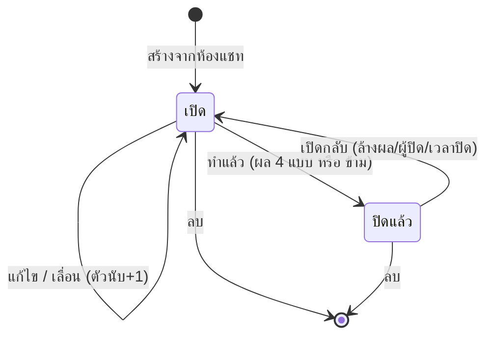
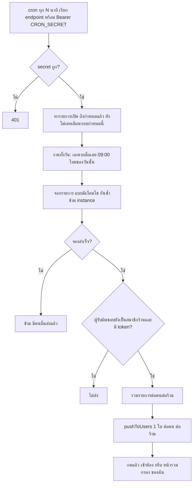
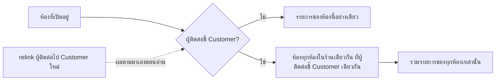
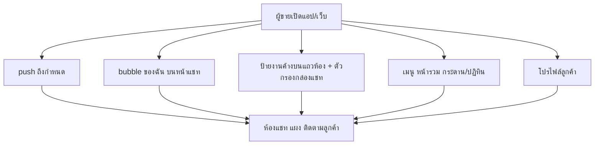

> **โมดูล:** 00066 — Customer Follow-up Activities
> **ประเภทเอกสาร:** Business Requirements Document (BRD) - NON-TECHNICAL
> **เวอร์ชัน:** 0.1
> **วันที่จัดทำ:** 2026-09-29
> **สถานะ:** Draft — รอ user ตัดสิน Open Questions (§13)
> **เจ้าของเอกสาร:** BA (ดู [[Feature-Docs-Ownership]])

# BRD: ติดตามลูกค้า (Customer Follow-up Activities) (Business Requirements Document)

> ศัพท์ในเอกสารนี้ใช้ชื่อที่เสนอใน PRD §3.1 ("ติดตามลูกค้า" / "รายการติดตาม") ระหว่างรอ Q1
> รหัส: `FR-ACT-xx` ความต้องการ · `BR-ACT-xx` กฎธุรกิจ · `AC-ACT-xx` เกณฑ์ตรวจรับ (ทดสอบได้)

---

## 1. บทนำ

### 1.1 วัตถุประสงค์ของเอกสาร

1. อธิบายความต้องการของระบบรายการติดตามลูกค้า (สร้างจากห้องแชท → เห็นในหลายพื้นผิว → ถึงกำหนด → push เตือน)
2. กำหนดขอบเขตและข้อจำกัด โดยแปลงจากระบบของ gochat-v3 เป็นโมเดลจริงของ Deep
3. กำหนดกฎธุรกิจเป็นรายข้อพร้อมเกณฑ์ตรวจรับที่ทดสอบได้
4. ให้ทีมธุรกิจและทีมพัฒนาเห็นตรงกัน รวมถึงจุดที่ต้องให้ user ตัดสิน

### 1.2 ขอบเขตของระบบ

**ติดตามลูกค้า** คือระบบที่ให้สมาชิกร้านจด "สิ่งที่ต้องทำกับลูกค้า" ผูกกับห้องแชท กำหนดเวลา ผู้รับผิดชอบ ปิดพร้อมผลลัพธ์ และได้รับ push เมื่อถึงกำหนด

**เข้าสู่ระบบ (Input):**
- การกระทำของสมาชิกร้านในห้องแชท: สร้าง/แก้/ปิด/เลื่อน/เปิดกลับ/ลบ
- เวลาปัจจุบัน (สำหรับ cron เตือน และการตัดสิน "เลยกำหนด")

**ออกจากระบบ (Output):**
- รายการบนพื้นผิว 5 จุด (แผงห้อง · bubble · กระดาน/ปฏิทิน · แท็บโปรไฟล์ · ตัวกรอง/ป้ายกล่องแชท)
- push เข้าแอปผู้ขายของผู้รับผิดชอบ
- **ไม่มีอะไรออกไปถึงลูกค้า**

**ระบบที่เกี่ยวข้อง (ยืนยันกับโค้ด):**
- `Conversation` `ExternalContact` `Customer` — `prisma/schema.prisma:1896, 1856, 1107`
- `Shop` / `ShopMember` / `canAccessShop` — `schema.prisma:1353-1368`, `src/lib/shop-context.ts:25-30`
- `pushToUsers` `PushToken` — `src/services/app-push.service.ts:14-42`, `schema.prisma:1658-1673`
- `ShopNotificationPref` — `schema.prisma:1686-1703`, `src/services/notification-pref.service.ts:83`
- Vercel Cron — `vercel.json:12-27`; ตัวอย่าง route `src/app/api/cron/auto-order-sweeper/route.ts:28-33`
- ตัวกรอง/แท็กกล่องแชท — `inbox/components/InboxFilterPanel.tsx:40-47, 308`, `src/services/chat-crm.service.ts:10-22`
- โปรไฟล์ลูกค้า 00057 — `seller/(dashboard)/customers/[id]/page.tsx`

### 1.3 กลุ่มผู้ใช้งาน

| กลุ่มผู้ใช้ | บทบาท | สิทธิ์การใช้งาน |
|-----------|--------|----------------|
| **เจ้าของร้าน** (`Shop.userId`) | ผู้ใช้หลัก / ผู้รับผิดชอบได้ | ทุกอย่าง (สร้าง แก้ ปิด เปิดกลับ เลื่อน ลบ ดูทั้งร้าน) |
| **สมาชิกร้าน BUSINESS** (`ShopMember` OWNER/ADMIN) | ผู้ใช้หลัก / ผู้รับผิดชอบได้ | เหมือนเจ้าของ (ไม่เทียบกับผู้สร้างรายการ) — ยืนยันใน Q7 |
| **เจ้าของร้าน PERSONAL** | ผู้ใช้เดียวของร้าน | เหมือนเจ้าของ; **ผู้รับผิดชอบ = เจ้าของเสมอ** ไม่มีตัวเลือกคน (ร้าน PERSONAL ไม่มีแถว ShopMember — `schema.prisma:1681`) |
| **ลูกค้า** | — | **ไม่มีสิทธิ์และไม่เห็นอะไรเลย** ไม่ได้รับข้อความจากฟีเจอร์นี้ |
| **ผู้ใช้ที่ไม่ใช่สมาชิกร้าน / ร้านอื่น** | — | เข้าไม่ถึงทุกกรณี (ขอบเขตร้านบังคับที่ `WHERE shopId` ของ query แรก) |

---

## 2. ความต้องการหลัก (Functional Requirements)

### 2.1 การสร้างและจัดการรายการ

#### FR-ACT-01: สร้างรายการติดตามจากห้องแชท

**User Story:**
> ในฐานะสมาชิกร้าน ฉันต้องการจดว่าต้องกลับไปทำอะไรกับลูกค้าในห้องแชทนี้เมื่อไร เพื่อไม่ให้ลืมลูกค้าที่ยังลังเล

**Acceptance Criteria:**
- [ ] สร้างได้จากแผงในห้องแชทเท่านั้น (ไม่มีปุ่มสร้างบนกระดาน/ปฏิทิน)
- [ ] ฟิลด์: หัวข้อ (บังคับ) · ชนิด · วัน-เวลากำหนด (บังคับ) · ทั้งวัน · ผู้รับผิดชอบ · โน้ต
- [ ] ค่าตั้งต้นชนิด = "ตามเรื่อง"; ผู้รับผิดชอบตั้งต้น = ผู้สร้าง
- [ ] ห้องที่ไม่ใช่ของร้านที่กำลังใช้งาน = สร้างไม่ได้ ตอบเหมือน "ไม่พบห้อง"

**Business Flow:**
1. ผู้ใช้เปิดห้อง → แผง "ติดตามลูกค้า" → กด "เพิ่ม"
2. กรอกฟอร์ม → บันทึก
3. รายการปรากฏในแผง และในพื้นผิวอื่นตามกติกา

#### FR-ACT-02: แก้ไขรายการ

**User Story:**
> ในฐานะสมาชิกร้าน ฉันต้องการแก้หัวข้อ/เวลา/ผู้รับผิดชอบ/โน้ต เพื่อปรับตามที่ลูกค้าเปลี่ยนใจ

**Acceptance Criteria:**
- [ ] แก้ได้ทุกฟิลด์ของรายการที่ยังเปิด; รายการที่ปิดแล้วแก้ได้เฉพาะหัวข้อ/โน้ต (ข้อเสนอ — ยืนยันตอน UX gate)
- [ ] ไม่ส่งค่าผู้รับผิดชอบมา = ไม่เปลี่ยนผู้รับผิดชอบ (ไม่ใช่ล้างเป็นว่าง)
- [ ] แก้เวลากำหนด = เตือนรอบใหม่ (BR-ACT-13) แต่ **ไม่เพิ่มตัวนับ "เลื่อน"** (ตัวนับเพิ่มเฉพาะปุ่ม "เลื่อน")

#### FR-ACT-03: ปิดงาน / เปิดกลับ

**User Story:**
> ในฐานะสมาชิกร้าน ฉันต้องการปิดรายการพร้อมบอกผลว่าเป็นอย่างไร เพื่อให้ทีมรู้ว่าลูกค้าตอบสนองแบบไหน

**Acceptance Criteria:**
- [ ] "ทำแล้ว" เลือกผลได้ 4 แบบหรือ "ข้าม"; บันทึกผู้ปิดและเวลาปิด
- [ ] "เปิดกลับ" ล้างผลลัพธ์/ผู้ปิด/เวลาปิด และรายการกลับเป็นเปิด
- [ ] ปิดแล้วทำซ้ำ (กดปิดซ้ำ) ไม่ error และไม่เขียนผู้ปิดทับ

#### FR-ACT-04: เลื่อน

**User Story:**
> ในฐานะสมาชิกร้าน ฉันต้องการเลื่อนรายการด้วยปุ่มเดียว เพื่อไม่ต้องกรอกวันเวลาใหม่ทุกครั้ง

**Acceptance Criteria:**
- [ ] ปุ่มลัด: "พรุ่งนี้ 09:00" (มีเวลา) · "อีก 3 วัน" (ทั้งวัน) · "สัปดาห์หน้า" (ทั้งวัน = +7 วันนับจากวันนี้) + เลือกเอง
- [ ] เลื่อนได้เฉพาะรายการที่เปิด; ตัวนับ "เลื่อนมา N ครั้ง" +1; N ≥ 2 ขึ้นป้ายเตือน
- [ ] ปุ่มลัดคำนวณเป็นเวลาไทย **ตายตัว** ไม่ขึ้นกับเขตเวลาเครื่องผู้ใช้ (BR-ACT-12)

#### FR-ACT-05: ลบ

**Acceptance Criteria:**
- [ ] ต้องผ่านการยืนยันก่อนลบ (ใช้ `pacesConfirm.danger` ตามมาตรฐาน Paces)
- [ ] ลบแล้วหายจากทุกพื้นผิวและไม่ถูกเตือน

### 2.2 การมองเห็น (5 พื้นผิว)

#### FR-ACT-06: แผง "ติดตามลูกค้า (n)" ในห้องแชท

**User Story:**
> ในฐานะสมาชิกร้านที่เปิดห้องอยู่ ฉันต้องการเห็นงานติดตามของลูกค้าคนนี้ทั้งหมด เพื่อรู้ว่าต้องทำอะไรต่อก่อนตอบ

**Acceptance Criteria:**
- [ ] หัวแผงแสดงจำนวน n = รายการที่ยังเปิด
- [ ] **กางเองเมื่อมีรายการเลยกำหนด**; ไม่มี = พับ
- [ ] รายการเปิดเรียงกำหนดใกล้สุดก่อน; รายการที่ปิดแสดง 3 ใบล่าสุด
- [ ] ขอบเขตรายการ: ห้องนี้ + ห้องอื่นในร้านเดียวกันที่เป็น "ลูกค้าเดียวกัน" (BR-ACT-10)
- [ ] การ์ดแสดง: ไอคอน+ป้ายชนิด · หัวข้อ · เวลากำหนด (ทั้งวันแสดงแค่วัน) · ผู้รับผิดชอบ (รูป+ชื่อ แถวของตัวเอง) · โน้ต · ชิป "เลื่อนมา N ครั้ง" · ป้ายแดง "เลยกำหนด" · งานที่ปิดแสดงผลลัพธ์ + ผู้ปิด/เวลา
- [ ] ปุ่มบนการ์ดชุดเดียวกันทุกพื้นผิว: ทำแล้ว · เลื่อน · แก้ · ลบ · เปิดกลับ

#### FR-ACT-07: Bubble "ของฉัน" มุมขวาล่าง

**User Story:**
> ในฐานะผู้รับผิดชอบ ฉันต้องการเห็นงานของฉันที่เลยกำหนดหรือครบวันนี้ ทุกครั้งที่เปิดหน้าแชท โดยไม่ต้องไปหา

**Acceptance Criteria:**
- [ ] แสดงบนหน้าแชท (`/inbox`) และหน้าความคิดเห็น (`/inbox/comments`)
- [ ] เนื้อหา = รายการ **ที่ผู้รับผิดชอบเป็นฉัน** และ (เลยกำหนด หรือ ครบกำหนดภายในวันนี้) เท่านั้น
- [ ] ไม่มีรายการ = **ไม่มีปุ่มเลย**; มีเลยกำหนดอย่างน้อย 1 = ปุ่มสีแดง
- [ ] แสดงสูงสุด 8 แถว + ลิงก์ไปหน้ารวม; กดแถว = เข้าห้อง
- [ ] "ทำแล้ว" บน bubble ปิดทันที ไม่ถามผลลัพธ์
- [ ] มือถือ: ซ่อนตอนเปิดห้องอยู่ (กันบังช่องพิมพ์)
- [ ] ไม่มี realtime — โหลดตอนเปิดหน้า/เปิดกล่อง/หลังทำ action (ตาม gochat)
- [ ] ระบุ "ฉัน" จาก session ที่ได้ user id จริง (session ไม่มี id = ไม่แสดง ไม่ใช่ error 500 — `docs/conventions/session-exists-is-not-identity.md`)

#### FR-ACT-08: หน้ารวม (กระดาน + ปฏิทิน)

**User Story:**
> ในฐานะเจ้าของร้าน ฉันต้องการเห็นงานติดตามทั้งร้านในที่เดียว เพื่อกระจายงานและตามงานที่ค้าง

**Acceptance Criteria:**
- [ ] กระดาน 5 คอลัมน์: เลยกำหนด · วันนี้ · 7 วันข้างหน้า · ภายหลัง · ทำแล้วใน 7 วัน; **ไม่มีการลากการ์ด**
- [ ] มือถือ: แท็บทีละคอลัมน์
- [ ] สลับเป็นปฏิทินเดือน: แสดงทุกสถานะ (ที่ปิดแล้วจาง) · ช่องละ 3 ใบ + "+N" · popover มี ทำแล้ว/เลื่อน/เปิดแชท · ไม่สร้างรายการจากปฏิทิน · เพดาน 1,000 ใบ/เดือน เกินแสดงแถบเตือนว่า "แสดงไม่ครบ" · มือถือแสดงเป็นจุดสี
- [ ] ตัวกรอง: ของฉัน | ทั้งร้าน · รายคน (มีตัวเลขค้างต่อคน + "ยังไม่มีคนรับ") · แท็บ (OR ระหว่างแท็ก) · ค้นชื่อลูกค้า (หน่วง 350 ms, escape `%` `_`)
- [ ] ตัวเลขนับของทั้งร้าน **ไม่ขึ้นกับตัวกรองอื่น**
- [ ] ค่าตัวกรองทุกตัวอยู่ใน URL; ค่าแปลกใน URL (id ปลอม/รูปแบบผิด) = "ไม่กรอง" ไม่ error 500
- [ ] **เมนูซ้ายไม่ใส่ตัวเลข** (ตัวเลขอยู่ที่ bubble/ป้ายแถวห้อง)
- [ ] เฉพาะสมาชิกร้านเข้าได้; ร้านอื่นเห็นไม่ได้

#### FR-ACT-09: ส่วน "ติดตามลูกค้า" ในโปรไฟล์ลูกค้า

**User Story:**
> ในฐานะสมาชิกร้านที่ดูโปรไฟล์ลูกค้า ฉันต้องการเห็นและจัดการงานติดตามของลูกค้าคนนี้ เพื่อไม่ต้องกลับไปที่กล่องแชท

**Acceptance Criteria:**
- [ ] ข้อมูลและปุ่มชุดเดียวกับแผงในห้อง (FR-ACT-06)
- [ ] การเพิ่มรายการต้องผูกห้อง: ใช้ห้องของ `latestConversationId` (ห้องของออเดอร์ล่าสุดที่ผูกห้องไว้ — `customers/[id]/page.tsx:98-103`)
- [ ] ลูกค้าที่ไม่มีห้องเลย: แสดง "งานติดตามต้องผูกกับห้องแชท จึงยังเพิ่มจากที่นี่ไม่ได้" และไม่มีปุ่มเพิ่ม
- [ ] ⚠️ ขอบเขตการ "ค้นรายการของลูกค้า" ยังไม่ตัดสิน — ดู Q4 (ติดกติกา BR-CUSTP-07)

#### FR-ACT-10: ตัวกรองและป้ายในกล่องแชท

**User Story:**
> ในฐานะแอดมินตอบแชท ฉันต้องการกรองรายการห้องให้เหลือเฉพาะห้องที่มีงานเลยกำหนด เพื่อไล่ปิดทีละห้อง

**Acceptance Criteria:**
- [ ] หมวดใหม่ในแผงตัวกรอง (`InboxFilterPanel`) ชื่อ "ติดตามลูกค้า": **เกินกำหนด** · **กำลังจะมาถึง** · **เสร็จสิ้น** (ห้องที่มีรายการและปิดครบทุกใบ)
- [ ] ในหมวดเดียวกันเลือกหลายค่า = OR; ข้ามหมวด (เช่น แท็ก+ติดตามลูกค้า) = AND
- [ ] มีตัวเลขต่อค่า; นับเป็น 1 ตัวกรองในป้ายจำนวนตัวกรองที่ใช้ (ตามวิธีเดิม `:40-47`)
- [ ] แถวห้องแสดงป้าย "งานค้าง n" (เทา) หรือ "เลยกำหนด n" (แดง) — ดึงเป็นก้อนเดียวต่อหน้ารายการ ไม่ยิงทีละแถว
- [ ] ขอบเขตของ "n" ต่อห้อง = ขอบเขตเดียวกับแผงในห้อง (BR-ACT-10)

### 2.3 การแจ้งเตือนเมื่อถึงกำหนด

#### FR-ACT-11: push เข้าแอปผู้ขายเมื่อถึงกำหนด

**User Story:**
> ในฐานะผู้รับผิดชอบ ฉันต้องการให้ระบบสะกิดฉันเมื่อถึงเวลา เพื่อไม่ต้องจำหรือรอเปิดหน้าจอ

**Acceptance Criteria:**
- [ ] ส่งให้ **ผู้รับผิดชอบคนเดียว** ของรายการ (ไม่ส่งให้ทั้งร้าน)
- [ ] รายการมีเวลา: ส่งเมื่อถึงเวลากำหนด (คลาดได้ไม่เกินความถี่ cron — Q10)
- [ ] รายการทั้งวัน: ส่งตอน 09:00 เวลาไทยของวันนั้น (ข้อเสนอ — Q3)
- [ ] ส่งครั้งเดียวต่อ "กำหนด" หนึ่งค่า; เลื่อน/แก้เวลา = เตือนรอบใหม่
- [ ] ปิดแล้ว/ลบแล้ว/ผู้รับผิดชอบไม่ใช่สมาชิกร้านแล้ว = ไม่ส่ง
- [ ] กดแจ้งเตือน = เข้า `/inbox/{conversationId}` ของรายการนั้น
- [ ] ข้อความไม่มีโน้ต ไม่มีเบอร์โทร
- [ ] ส่งแบบ best-effort: push ล้มไม่ทำให้รายการ/cron ล้ม (เหมือน `pushToUsers`, `app-push.service.ts:39-41`)
- [ ] ไม่มีข้อความใด ๆ ถึงลูกค้า

---

## 3. Acceptance Criteria สรุป (ทดสอบได้)

> ID คงที่ เพื่ออ้างในเทส/Tests.md; แต่ละข้อผูกกับ BR ที่บังคับ

### 3.1 การสร้าง / สิทธิ์ / ขอบเขตร้าน

**เมื่อระบบทำงานถูกต้อง:**
- ✅ **AC-ACT-01** สร้างรายการด้วยหัวข้อว่าง/มีแต่ช่องว่าง → ถูกปฏิเสธ (ผลเป็นข้อความอ่านได้ ไม่ใช่ 500); หัวข้อ 200 ตัวอักษรผ่าน, 201 ไม่ผ่าน (BR-ACT-02)
- ✅ **AC-ACT-02** โน้ต 1,000 ตัวอักษรผ่าน, 1,001 ไม่ผ่าน; ไม่กรอก = ผ่าน (BR-ACT-02)
- ✅ **AC-ACT-03** ส่ง conversationId ของร้านอื่น → สร้างไม่ได้ และผลตอบ **เหมือนห้องที่ไม่มีอยู่จริง** (ไม่บอกว่ามีอยู่ที่ร้านอื่น) (BR-ACT-01)
- ✅ **AC-ACT-04** ร้านมีสมาชิก A(เจ้าของ) B(ADMIN): B ปิด/แก้/ลบรายการที่ A สร้างได้ทุกกรณี (BR-ACT-05)
- ✅ **AC-ACT-05** สมาชิกร้านอื่นยิง API แก้/ปิด/ลบ รายการของร้านนี้ → ไม่พบ (ไม่ใช่ 403 ที่ยืนยันว่ามีอยู่) (BR-ACT-05)
- ✅ **AC-ACT-06** ผู้รับผิดชอบเป็น user ที่ไม่ใช่สมาชิกร้านนั้น → ถูกปฏิเสธ; ไม่ระบุ → = ผู้สร้าง (BR-ACT-04)
- ✅ **AC-ACT-07** ร้าน PERSONAL: ผู้รับผิดชอบทุกรายการ = เจ้าของ; UI ไม่แสดงตัวเลือกคน (BR-ACT-04)
- ✅ **AC-ACT-08** ยิง API ที่ไม่มี session user id → ตอบ 401/ไม่แสดง (ไม่ใช่ 500) (BR-ACT-05)

### 3.2 สถานะ / เลื่อน / เวลา

- ✅ **AC-ACT-09** ปิดงานพร้อมผล `reached` → สถานะปิดแล้ว, ผู้ปิด+เวลาปิดถูกบันทึก; ปิดแบบ "ข้าม" → ผลว่างแต่ปิดแล้ว (BR-ACT-06)
- ✅ **AC-ACT-10** ผลลัพธ์นอก 4 ค่า → ถูกปฏิเสธ; ส่งผลลัพธ์ให้รายการที่ยังเปิดโดยตรงไม่ผ่าน (ผลลัพธ์เก็บได้เฉพาะรายการปิดแล้ว) (BR-ACT-06)
- ✅ **AC-ACT-11** เปิดกลับ → ผล/ผู้ปิด/เวลาปิดว่างทั้งหมด (BR-ACT-06)
- ✅ **AC-ACT-12** เลื่อนรายการที่ปิดแล้ว → ถูกปฏิเสธ; เลื่อนรายการเปิด 2 ครั้ง → ตัวนับ = 2 และป้าย "เลื่อนมา 2 ครั้ง" ขึ้น; เลื่อน 1 ครั้ง ไม่ขึ้นป้ายเตือน (BR-ACT-07)
- ✅ **AC-ACT-13** แก้เวลากำหนดด้วยฟอร์มแก้ไข → ตัวนับเลื่อน **ไม่เพิ่ม** (BR-ACT-07)
- ✅ **AC-ACT-14** ปุ่มลัดเลื่อนให้ผลเท่ากันเมื่อรันโดยตั้ง TZ เครื่องเป็น `UTC`, `Asia/Bangkok`, `America/Los_Angeles` ที่เวลาจริงเดียวกัน (ทดสอบฟังก์ชันคำนวณด้วย `now` ที่ส่งเข้า) — โดยเฉพาะที่ 23:30 ไทย (ยังเป็น "วันนี้" ตามไทยแม้ UTC เป็นเมื่อวาน/ใน LA เป็นบ่าย) (BR-ACT-12)
- ✅ **AC-ACT-15** "พรุ่งนี้ 09:00" ที่ 23:30 ไทย = 09:00 ของวันถัดไปตามปฏิทินไทย (ไม่ใช่ +24 ชม.) (BR-ACT-12)
- ✅ **AC-ACT-16** รายการทั้งวันของวันที่ D: ไม่แสดงเป็น "เลยกำหนด" ตลอดทั้งวัน D (จนถึง 23:59:59 ไทย) และเป็น "เลยกำหนด" ตั้งแต่ 00:00 ไทยของ D+1 (BR-ACT-08)
- ✅ **AC-ACT-17** รายการมีเวลา: กำหนด 10:00 → 09:59 ไม่เลยกำหนด, 10:00:01 เลยกำหนด (BR-ACT-08)
- ✅ **AC-ACT-18** รายการทั้งวันไม่แสดงเวลาที่ใดเลย (แสดงวันเท่านั้น) (BR-ACT-03)

### 3.3 กระดาน / ปฏิทิน / bucket

- ✅ **AC-ACT-19** รายการ**ที่ปิดแล้ว**ไม่ตกใน "เลยกำหนด/วันนี้/7 วัน/ภายหลัง" ในกรณีใดเลย แม้กำหนดของมันคือวันนี้หรือเมื่อวาน — ปิดแล้วอยู่ได้เฉพาะ "ทำแล้วใน 7 วัน" (ช่องโหว่ที่ gochat เคยพลาด) (BR-ACT-09)
- ✅ **AC-ACT-20** ขอบ bucket: รายการมีกำหนด 23:59 วันนี้ = "วันนี้"; 00:00 พรุ่งนี้ = "7 วันข้างหน้า"; วันที่ 7 หลังสิ้นวันนี้ = "7 วันข้างหน้า"; วันที่ 8 = "ภายหลัง" (BR-ACT-09)
- ✅ **AC-ACT-21** "เลยกำหนด" ที่คำนวณด้วย SQL กับด้วย TS ให้ผลตรงกันบนชุดข้อมูลทดสอบที่ครอบขอบ ๆ (เทส parity `[blocker]`; พิสูจน์ด้วย mutation) (BR-ACT-08)
- ✅ **AC-ACT-22** ตัวเลขในหัวแผงห้อง = ตัวเลขป้ายแถวห้อง = ตัวเลขจำนวนบนกระดานในขอบเขตเดียวกัน (มาจาก symbol เดียว) (BR-ACT-20)
- ✅ **AC-ACT-23** ปฏิทินเดือนที่มีรายการ 1,001 ใบ → แสดง 1,000 ใบและแถบเตือน "แสดงไม่ครบ"; 1,000 ใบพอดี = ไม่มีแถบ (BR-ACT-18)
- ✅ **AC-ACT-24** ค้นชื่อลูกค้าด้วย `%` หรือ `_` ตามตัวอักษร (ไม่ทำหน้าที่ wildcard) (BR-ACT-18)
- ✅ **AC-ACT-25** ใส่ id คน/แท็ก/วันที่ปลอมใน URL → หน้าโหลดปกติเท่ากับไม่กรอง (BR-ACT-18)
- ✅ **AC-ACT-26** เลือกตัวกรอง "รายคน" แล้วตัวเลขของคนอื่นไม่เปลี่ยน (ตัวเลขนับทั้งร้าน) (BR-ACT-18)

### 3.4 ขอบเขต "ลูกค้าเดียวกัน" + รวม/ย้ายลูกค้า

- ✅ **AC-ACT-27** ห้อง Messenger และห้อง LINE ของร้านเดียวกัน ที่ผู้ติดต่อของทั้งคู่ชี้ `Customer` เดียวกัน: รายการที่จดในห้อง Messenger ปรากฏในแผงของห้อง LINE (และกลับกัน) (BR-ACT-10)
- ✅ **AC-ACT-28** ห้อง 2 ห้องที่ผู้ติดต่อไม่ชี้ Customer เดียวกัน (หรือไม่ชี้เลย) → **ไม่**ปนกัน (ไม่เดาจากชื่อ) (BR-ACT-10)
- ✅ **AC-ACT-29** **รวม/ย้ายลูกค้า:** จดรายการในห้อง H ขณะผู้ติดต่อของ H ชี้ Customer A; จากนั้นผู้ติดต่อของ H ถูก relink ไป Customer B (`relinkThreadCustomer`) → รายการเดิมยังอยู่ ไม่ซ้ำ ไม่หาย และปรากฏในขอบเขต "ลูกค้า B" ทันทีโดยไม่ต้องรัน migration/ย้ายแถว; ไม่ปรากฏในขอบเขต "ลูกค้า A" อีก (BR-ACT-10, BR-ACT-22)
- ✅ **AC-ACT-30** ห้อง DEEP (ไม่มี ExternalContact): รายการผูกเฉพาะห้องนั้น; ตัวกรองแท็กไม่ match ห้องนี้ (BR-ACT-10, BR-ACT-16)

### 3.5 push เตือน

- ✅ **AC-ACT-31** รายการมีเวลา 10:00 ผู้รับผิดชอบ U: cron รอบที่ตรงกับ 10:00 ส่ง push ให้ U **1 ครั้ง**; รันรอบถัดไป (ซ้ำ/ซ้อน) ไม่ส่งซ้ำ (BR-ACT-13)
- ✅ **AC-ACT-32** รัน cron 2 instance พร้อมกันบนรายการเดียวกัน → ส่งได้ 1 ครั้ง (BR-ACT-13)
- ✅ **AC-ACT-33** รายการทั้งวัน: ไม่ส่งก่อน 09:00 ไทย; ส่งที่รอบแรกตั้งแต่ 09:00 ของวันนั้น (BR-ACT-13)
- ✅ **AC-ACT-34** เลื่อนรายการที่เตือนไปแล้ว → รอบถัดไปตามกำหนดใหม่เตือนอีก 1 ครั้ง; แก้เวลาด้วยฟอร์มแก้ไขก็เตือนรอบใหม่เช่นกัน (BR-ACT-13)
- ✅ **AC-ACT-35** รายการที่ปิด/ลบก่อนถึงเวลา → ไม่ส่ง (BR-ACT-13)
- ✅ **AC-ACT-36** ผู้รับผิดชอบถูกถอดจากทีม (ไม่อยู่ใน ShopMember และไม่ใช่เจ้าของ) หรือบัญชีถูกลบ → ไม่ส่ง และไม่ error ทั้งรอบ (รายการอื่นยังส่งตามปกติ) (BR-ACT-13, BR-ACT-11)
- ✅ **AC-ACT-37** ผู้รับผิดชอบคนเดียวกันมีหลายรายการถึงกำหนดในรอบเดียว → ได้ 1 push ต่อร้านต่อรอบ; 1 รายการ = ข้อความรายการนั้น + เข้าห้อง; >1 = ข้อความสรุปจำนวน + เข้าหน้ารวม (กรอง "ของฉัน") (BR-ACT-13)
- ✅ **AC-ACT-38** payload ของ push ไม่มีค่า `note` และไม่มีเบอร์โทร (เทสสแกน payload) (BR-ACT-13)
- ✅ **AC-ACT-39** สร้างรายการที่กำหนดเวลาผ่านมาแล้ว (ย้อนหลัง) → ไม่ส่ง push ทันที (BR-ACT-13)
- ✅ **AC-ACT-40** เรียก endpoint cron ไม่มี/ผิด `Authorization` หรือ `CRON_SECRET` ว่าง → 401 (BR-ACT-13; ตามแพตเทิร์น `auto-order-sweeper/route.ts:28-33`)
- ✅ **AC-ACT-41** push ส่งไม่สำเร็จ (Expo ล้ม) → รายการและรอบ cron ไม่ล้ม; ค่าที่บันทึกว่า "เตือนแล้ว" ต้องสอดคล้องกับกติกาชดเชยใน BR-ACT-13 (ไม่ทำให้เตือนหายเงียบเมื่อล้ม — ตัดสินใน SRS ตาม Q10)
- ✅ **AC-ACT-42** ระบบไม่มีเส้นทางส่งข้อความหาลูกค้าจากฟีเจอร์นี้ (เทสสแกนซอร์ส: service ของฟีเจอร์ไม่ import ตัวส่งข้อความขาออก `sendMessage`/`sendOutboundMessage`/`channel-chat.service`) (BR-ACT-14)

### 3.6 ตัวกรองกล่องแชท / แท็ก / ชื่อ

- ✅ **AC-ACT-43** ตัวกรอง "เกินกำหนด" คืนเฉพาะห้องที่มีรายการเปิดที่เลยกำหนด ≥1; "กำลังจะมาถึง" = มีรายการเปิดที่ยังไม่เลยกำหนด และไม่มีที่เลยกำหนด (ข้อเสนอ) ; "เสร็จสิ้น" = มีรายการ ≥1 และ**ไม่มี**รายการเปิดเลย (ห้องที่ไม่เคยมีรายการไม่ตกที่นี่) (BR-ACT-19)
- ✅ **AC-ACT-44** เลือก "เกินกำหนด"+"กำลังจะมาถึง" = OR; เลือกร่วมกับแท็กหนึ่งอัน = AND (BR-ACT-19)
- ✅ **AC-ACT-45** ตัวกรองแท็กบนกระดานตรงเมื่อผู้ติดต่อของห้องที่จดรายการ (หรือห้องใดของลูกค้าเดียวกัน) มีแท็กนั้น; หลายแท็ก = OR (BR-ACT-16)
- ✅ **AC-ACT-46** ข้อความ UI ทั้งหมดของฟีเจอร์ (ไทย/อังกฤษ) มาจากพจนานุกรม i18n; ไม่พบสตริงไทยตายตัวใน component ของฟีเจอร์ (เทสสแกน) และไม่มีคำว่า "กิจกรรม" ใน UI ของฟีเจอร์นี้ (BR-ACT-20)

---

## 4. Business Flows (กระบวนการทำงาน)

### 4.1 Flow หลัก: วงชีวิตของรายการ

### 4.2 Flow: cron เตือนถึงกำหนด

### 4.3 Flow: แหล่งที่มาของ "รายการของลูกค้าคนนี้" (คำนวณตอนอ่าน)

### 4.4 Flow: จุดเข้าของผู้ใช้ 5 จุด

---

## 5. Use Case Scenarios (สถานการณ์การใช้งานจริง)

### Scenario 1: Best case — จด เตือน ปิด

**ผู้เกี่ยวข้อง:** แอดมิน A (ADMIN ของร้าน BUSINESS)

**เงื่อนไขเริ่มต้น:** A เปิดห้อง Messenger ของลูกค้า, เปิดสิทธิ์แจ้งเตือนในแอปแล้ว

**ขั้นตอน:**
1. A เพิ่มรายการ "ถามลูกค้าว่าตัดสินใจหรือยัง" พรุ่งนี้ 10:00 (ผู้รับผิดชอบ = A)
2. พรุ่งนี้ 10:00 A ได้ push
3. A กดเข้าห้อง คุยกับลูกค้า แล้วกด "ทำแล้ว → ติดต่อได้ · สนใจต่อ"

**ผลลัพธ์:** รายการปิดแล้ว บันทึกผลและผู้ปิด; ลูกค้าไม่ได้รับอะไรจากระบบ

### Scenario 2: ส่งต่อข้ามกะ

**ผู้เกี่ยวข้อง:** แอดมินกะบ่าย A, แอดมินกะดึก B

**เงื่อนไขเริ่มต้น:** A จดรายการให้ตัวเอง 21:00; A เลิกกะ 18:00

**ขั้นตอน:**
1. 21:00 A ไม่ได้อยู่ → push ไปหา A (ผู้รับผิดชอบ) ตามกติกา
2. B เปิดกระดาน ตัวกรอง "ทั้งร้าน" เห็นรายการเลยกำหนด กดเข้าห้อง ทำแล้วกด "ทำแล้ว"

**ผลลัพธ์:** B ปิดแทนได้โดยไม่ต้องขอสิทธิ์ (บันทึกผู้ปิด = B)

### Scenario 3: ร้านคนเดียว (PERSONAL)

**ผู้เกี่ยวข้อง:** เจ้าของร้าน

**ขั้นตอน:** สร้างรายการ — ฟอร์มไม่มีช่องผู้รับผิดชอบ; ระบบตั้งเป็นเจ้าของ; push ส่งถึงเจ้าของ

**ผลลัพธ์:** ใช้งานครบโดยไม่ต้องมี ShopMember

### Scenario 4: ลูกค้าเปลี่ยนเบอร์/ถูกผูกใหม่ (relink)

**ผู้เกี่ยวข้อง:** แอดมิน

**เงื่อนไขเริ่มต้น:** ห้อง H ผู้ติดต่อชี้ Customer A (เบอร์คีย์ผิด), มีรายการ 2 ใบในห้อง H

**ขั้นตอน:** แก้เบอร์บนออเดอร์ → `relinkThreadCustomer` ผูกผู้ติดต่อของ H ไป Customer B

**ผลลัพธ์:** รายการทั้ง 2 ใบยังอยู่ในห้อง H และขอบเขต "ลูกค้า B" ตามมา ไม่ต้องย้ายข้อมูล (AC-ACT-29)

### Scenario 5: งานทั้งวัน เตือนตอนเช้า

**ขั้นตอน:** สร้างรายการทั้งวัน ตรงกับวันนี้ตอน 08:00 → cron 09:00 (รอบแรกที่ถึง 09:00) ส่ง push; ตลอดวันไม่ขึ้น "เลยกำหนด" จนถึงเที่ยงคืนไทย

---

## 6. ความต้องการด้านคุณภาพ (Quality Requirements)

### 6.1 ความถูกต้องของข้อมูล
- นิยาม "เลยกำหนด" และ bucket มีฟังก์ชันเดียว; SQL ที่เขียนซ้ำต้องมีเทส parity `[blocker]` และพิสูจน์ด้วย mutation
- ตัวเลขเดียวกันที่โผล่ >1 จอ ต้องมาจาก symbol เดียว (`docs/conventions/sibling-surface-parity.md`)
- วัน-เวลาทั้งหมดเป็น Asia/Bangkok; แสดงผลด้วย `formatDate`/`formatDateTime` (พ.ศ.) ตาม `docs/conventions/date-format.md`

### 6.2 ความรวดเร็ว
- ป้ายงานค้างต่อแถวห้อง ดึงเป็น query เดียวต่อหน้า (ไม่ N+1)
- ตัวเรียก cron ทำงานภายใน `maxDuration` ที่กำหนด; งานเกินเพดานต่อรอบยกไปรอบถัดไป (แบบ `take: 200` ใน `auto-order-sweeper/route.ts:112`)
- ตัวเลขเพดานที่เสนอ: รายการต่อห้อง/ต่อหน้ารวม 200 · ปฏิทิน 1,000/เดือน · แผงห้องโชว์ปิดแล้ว 3 ใบ

### 6.3 ความน่าเชื่อถือ
- push best-effort ไม่ทำให้การทำงานหลักล้ม
- ส่งซ้ำไม่ได้ (กันข้าม instance)
- push ล้ม ต้องไม่ทำให้ "เตือนหายเงียบ" — ต้องสามารถตรวจย้อนหลังได้ว่า "เตือนแล้วหรือยัง" จากข้อมูลในระบบ (ไม่พึ่ง runtime log ที่ Vercel plan นี้อ่านย้อนหลังไม่ได้)

### 6.4 ความปลอดภัย
- ขอบเขตร้านบังคับที่ `WHERE shopId` ตั้งแต่ query แรก ไม่ใช่ตรวจทีหลัง (Deep ไม่มี RLS)
- ตัวตนผู้ใช้จาก `sessionUserId()` เท่านั้น; ไม่รับ shopId/userId/assignee จาก client โดยไม่ตรวจว่าอยู่ในร้าน
- ผู้ใช้ไม่ใช่สมาชิกร้าน ตอบ "ไม่พบ" (ไม่บอกว่ามีอยู่ที่ร้านอื่น)
- push payload ไม่มีโน้ต/เบอร์โทร; `note` เป็นข้อความอิสระ ต้องแสดงเป็นข้อความ (escape) ทุกจุด
- cron route: env ว่าง = 401 (ไม่เทียบกับ `Bearer undefined`)

### 6.5 ความสะดวกในการใช้งาน (Usability)
- ผ่าน `safepay-ux` + Impeccable (HR8) ทุกพื้นผิว; ห้าม emoji ใช้ไอคอน (HR12); ป้ายเลยกำหนดต้องไม่พึ่งสีอย่างเดียว (มีข้อความ/ไอคอน) และคอนทราสต์ผ่าน AA ทั้งโหมดสว่าง/มืด (gochat พลาดสีแดงโหมดมืด 3.54:1)
- tap target ≥ 44px บนมือถือ; ชื่อไทยยาวต้องไม่ดันผู้รับผิดชอบตกบรรทัด/ดันกล่องล้นจอ (`docs/conventions/flex-header-truncation.md`)
- toast ใน `(paces)` ใช้ `pacesToast` เท่านั้น (HR9)
- overlay/ชีตที่ประกอบเอง ต้อง `useLockBodyScroll` (`docs/conventions/overlay-scroll-lock.md`)
- ข้อความทุกจุดผ่านพจนานุกรม TH/EN (00047)

---

## 7. ข้อจำกัด (Constraints)

### 7.1 ข้อจำกัดทางธุรกิจ
- ไม่ส่งอะไรหาลูกค้า; ไม่มีเงิน; ไม่มีลากการ์ด; สร้างได้จากห้องแชทเท่านั้น (ดู §12)
- ห้องกลุ่มไม่มีใน Deep
- แท็บเดสก์ท็อป/มือถือต้องทำได้ครบ (ต่างจากตัวจัดหน้าร้าน 00035 ที่ desktop-only) — ยกเว้นปฏิทินเดือนบนมือถือเป็นจุดสี

### 7.2 ข้อจำกัดทางเทคนิค
- ข้อมูลที่ต้องเก็บ (ระดับธุรกิจ): ร้าน · ห้องแชท · หัวข้อ · ชนิด (3) · โน้ต · กำหนด · ทั้งวัน · ผู้รับผิดชอบ (ว่างได้เมื่อบัญชีถูกลบ) · สถานะ · ผลลัพธ์ · ผู้ปิด+เวลาปิด · จำนวนครั้งที่เลื่อน · ผู้สร้าง · เวลาสร้าง/แก้ · ตัวบอกว่าเตือนรอบกำหนดนี้แล้วหรือยัง (รายละเอียดคอลัมน์/ดัชนี = งาน SRS/DATABASE)
- ผูกห้อง (`Conversation`, `schema.prisma:1896`) และลบตามเมื่อห้องถูกลบ — ห้องถูกลบจริงได้ผ่าน cascade จากร้าน/ช่องทาง/ผู้ติดต่อ (`schema.prisma:1992, 1996, 1997`); ปัจจุบันไม่มีโค้ดเส้นทางลบห้อง/ช่องทางใน `src/` (ค้น `conversation.delete`/`shopChannel.delete` ไม่พบ)
- ต้อง migration additive (ตารางใหม่) — deploy รัน `prisma migrate deploy` บน prod ตอน build (HR15; `vercel.json:4`) ต้องแจ้ง user ก่อน push; ห้ามใช้คำสั่ง Prisma ที่ล้างฐาน (HR14)
- บังคับกฎด้วย CHECK ใน DB ได้ที่เหมาะสม (ชนิด 3 ค่า, ผล 4 ค่าเฉพาะเมื่อปิด) — migration CHECK ต้อง additive (`docs/conventions/migration-check-constraint-additive.md`)
- นิยามเลยกำหนดเขียนทั้ง TS และ SQL → เทส parity

---

## 8. กฎทางธุรกิจ (Business Rules)

### 8.1 การสร้างและข้อมูล

- **BR-ACT-01 (ผูกห้อง, ขอบเขตร้าน):** รายการต้องสร้างจากห้องแชทที่เป็นของร้านที่กำลังใช้งานเท่านั้น (ตรวจใน query `WHERE {conversationId, shopId}`); ไม่มีรายการลอย; ห้องของร้านอื่นตอบเหมือนไม่มีห้อง
- **BR-ACT-02 (ขนาดข้อมูล/ชนิด):** หัวข้อหลัง trim ยาว 1–200 · โน้ต ≤1,000 · ชนิดเป็น 1 ใน 3 (ตามเรื่อง/นัดคุยกับลูกค้า/อื่น ๆ; ตั้งต้น ตามเรื่อง) · กำหนดบังคับ
- **BR-ACT-03 (งานทั้งวัน):** งานทั้งวันผูกกับ "วันที่ตามปฏิทินไทย" ไม่ใช่ช่วงเวลา ห้ามแสดงเวลาที่ใดเลย
- **BR-ACT-04 (ผู้รับผิดชอบ):** ผู้รับผิดชอบ 1 คน เลือกได้เฉพาะ เจ้าของร้าน (`Shop.userId`) ∪ สมาชิก `ShopMember` ของร้านนั้น; ไม่เลือก = ผู้สร้าง; ร้าน PERSONAL = เจ้าของเสมอ ไม่มีตัวเลือก; ระบบต้องตรวจซ้ำฝั่ง server (ไม่เชื่อค่าจาก client)
- **BR-ACT-05 (สิทธิ์เท่ากัน):** ทุกคนที่เข้าร้านนั้นได้ (`canAccessShop`, `shop-context.ts:25-30`) สร้าง แก้ ปิด เปิดกลับ เลื่อน ลบ ได้กับทุกรายการของร้าน ไม่เทียบกับผู้สร้าง/ผู้รับผิดชอบ (ยืนยัน Q7). ตัวตนต้องมี user id จริง

### 8.2 สถานะ ผลลัพธ์ การเลื่อน

- **BR-ACT-06 (สถานะ):** มี 2 สถานะ เปิด/ปิดแล้ว. ปิดแล้วเลือกผลได้ 4 ค่า (reached=ติดต่อได้·สนใจต่อ · no_answer=ไม่รับสาย · call_later=ขอให้ติดต่อใหม่ · not_interested=ไม่สนใจแล้ว) หรือไม่เลือก; ผลลัพธ์มีค่าได้เฉพาะเมื่อปิดแล้ว; เปิดกลับล้างผล/ผู้ปิด/เวลาปิด
- **BR-ACT-07 (เลื่อน):** เลื่อนได้เฉพาะรายการที่เปิด; เปลี่ยนกำหนด/ทั้งวัน และตัวนับเลื่อน +1; ตัวนับเพิ่มเฉพาะการกด "เลื่อน" ไม่เพิ่มเมื่อแก้ฟอร์ม; ตัวนับ ≥2 ขึ้นป้ายเตือน "เลื่อนมา N ครั้ง"

### 8.3 เวลา

- **BR-ACT-08 (เลยกำหนด — นิยามเดียว):** รายการต้อง **เปิดอยู่** จึงเลยกำหนดได้. มีเวลา: เลยเมื่อ `กำหนด < ตอนนี้`. ทั้งวัน: เลยเมื่อขึ้นวันใหม่ตามเวลาไทย (00:00 ของวันถัดจากวันกำหนด). ฟังก์ชันรับ `now` จากภายนอก (ทดสอบได้). เขียนเป็น TS ที่เดียว; SQL ที่ต้องมีให้ใช้ `Asia/Bangkok` และผูกด้วยเทส parity
- **BR-ACT-09 (bucket):** เลยกำหนด · วันนี้ (ถึงสิ้นวันนี้ไทย) · 7 วันข้างหน้า (ภายใน 7 วันหลังสิ้นวันนี้) · ภายหลัง; **รายการที่ปิดแล้วไม่เข้า 4 bucket นี้เลย** (อยู่ใน "ทำแล้วใน 7 วัน" เท่านั้น) — ตรวจสถานะก่อนทุกเงื่อนไขเวลา
- **BR-ACT-12 (เวลาไทยตายตัว):** การคำนวณ "ต้นวัน/พรุ่งนี้ 09:00/อีก 3 วัน/สัปดาห์หน้า" และ "วันนี้/สิ้นวัน" ใช้ Asia/Bangkok (UTC+7 คงที่ — `date-range.ts:12`) เสมอ ไม่ใช้ `new Date()` ท้องถิ่นของเครื่องผู้ใช้ ตัวคำนวณอยู่ใน `src/lib` เป็นฟังก์ชันบริสุทธิ์ที่ใช้ทั้ง client และ server และมีเทสข้าม TZ

### 8.4 ลูกค้าเดียวกัน / รวม / ลบ

- **BR-ACT-10 (ขอบเขต "ของห้องนี้/ของลูกค้าคนนี้"):** รายการผูกกับห้อง; "รายการของห้องนี้" = รายการของห้องนี้ + ห้องอื่น **ในร้านเดียวกัน** ที่ผู้ติดต่อชี้ `Customer` เดียวกับผู้ติดต่อของห้องนี้ (`ExternalContact.customerId`, `schema.prisma:1870`). คำนวณตอนอ่าน ไม่ copy customerId ลงรายการ. ห้อง DEEP หรือผู้ติดต่อที่ยังไม่ชี้ Customer = เฉพาะห้องนั้น. ห้ามเดาจากชื่อ/เบอร์ที่ไม่ผูก
- **BR-ACT-11 (ชีวิตของรายการเมื่อของอื่นหาย):** ห้อง/ผู้ติดต่อ/ร้านถูกลบ → รายการลบตาม (cascade). ผู้รับผิดชอบถูกลบบัญชีหรือถอดจากทีม → รายการยังอยู่เป็นของร้านและแสดง "ทีมงานที่ถูกถอดออกแล้ว"; ไม่มีการเตือน; ผู้สร้าง/ผู้ปิดที่ถูกลบแสดงแบบเดียวกัน
- **BR-ACT-22 (ห้ามรวม/ลบโดยไม่ย้ายรายการ):** การดำเนินการใด ๆ ในอนาคตที่ลบหรือแทนที่ห้อง/ผู้ติดต่อ (รวมลูกค้า/รวมห้อง) ต้องย้ายรายการติดตามไปห้องปลายทางก่อนลบ ไม่ปล่อยให้ cascade ลบ; ต้องมีเทสที่ล้มเมื่อมีเส้นทางลบ `Conversation`/`ExternalContact` โดยไม่เรียกตัวย้าย (ปัจจุบันยังไม่มีเส้นทางดังกล่าวใน `src/`)

### 8.5 การแจ้งเตือน

- **BR-ACT-13 (push):**
  1. ผู้รับ = ผู้รับผิดชอบคนเดียว; ต้องยังเป็นสมาชิกของร้าน ณ ตอนส่ง; ไม่มีผู้รับผิดชอบ = ไม่ส่ง (ข้อเสนอ Q9)
  2. เมื่อไร: มีเวลา = ที่กำหนด; ทั้งวัน = 09:00 ไทย (ข้อเสนอ Q3)
  3. ครั้งเดียวต่อค่ากำหนดหนึ่งค่า; เลื่อน/แก้เวลา = เริ่มรอบเตือนใหม่; รายการที่สร้างโดยกำหนดผ่านไปแล้ว = ไม่เตือน
  4. กันซ้ำข้าม instance ด้วยการจองก่อนส่ง
  5. หน้าต่างชดเชย: ถ้า cron พลาดรอบ ส่งย้อนหลังได้ไม่เกิน 6 ชั่วโมงหลังกำหนด (มีเวลา) / ภายในวันเดียวกัน (ทั้งวัน); เกินนั้นไม่ส่ง (ข้อเสนอ Q10)
  6. รวม 1 push ต่อคนต่อร้านต่อรอบ; 1 รายการ = รายละเอียดรายการ + `url=/inbox/{conversationId}`; >1 = สรุปจำนวน + `url` หน้ารวมกรอง "ของฉัน"
  7. ข้อความไม่มี `note`/เบอร์โทร; หัวข้อของรายการเท่านั้น (อาจถูกตัดที่ความยาวปลอดภัยบนหน้าจอล็อก)
  8. best-effort; ล้ม = ไม่ทำให้อะไรล้ม; ต้องมีข้อมูลในระบบที่บอกได้ว่าเตือนแล้วหรือยัง/ครั้งล่าสุดเมื่อไร
  9. เรียก cron ต้องมี Bearer `CRON_SECRET` (env ว่าง = ปฏิเสธ)
- **BR-ACT-14 (ไม่ส่งหาลูกค้า):** ฟีเจอร์ไม่เรียกตัวส่งข้อความขาออกทุกช่องทาง (Deep/Messenger/IG/LINE), ไม่ส่ง SMS/อีเมล/Rich Menu ถึงลูกค้า แม้ชนิดคือ "นัดคุยกับลูกค้า"
- **BR-ACT-15 (ไม่มีเงิน):** ไม่มีฟิลด์ยอดเงิน/มูลค่าดีล/ต้นทุน; ไม่เขียนทับ `ExternalContact.salesStatus` (Q12)

### 8.6 การมองเห็น/ตัวกรอง

- **BR-ACT-16 (แท็ก):** แท็กมาจาก `ExternalContact.tags` (`schema.prisma:1876`) ของห้องที่จด **หรือห้องใดของลูกค้าเดียวกัน** (ตาม BR-ACT-10); หลายแท็ก = OR; ห้อง DEEP ไม่มีแท็ก (ไม่ match); รายการแท็กที่เลือกได้ใช้ `getShopTags()` (`chat-crm.service.ts:10-22`) ไม่สร้างรายการแท็กชุดใหม่
- **BR-ACT-17 (bubble):** ตามเกณฑ์ FR-ACT-07; "ของฉัน" = ผู้รับผิดชอบเป็นผู้ใช้ปัจจุบัน; ขอบเขตร้าน = ร้านที่ผู้ใช้กำลังดู (โหมดรวมหลายร้าน 00037 ดู Q5)
- **BR-ACT-18 (หน้ารวม):** ตามเกณฑ์ FR-ACT-08; ค่าใน URL เป็นแหล่งความจริงของตัวกรอง; ค่าที่ parse ไม่ได้/ไม่ใช่ของร้าน = ไม่กรอง; ตัวเลขของทั้งร้านไม่ขึ้นกับตัวกรอง; ปฏิทินเพดาน 1,000/เดือน; ค้นชื่อ escape `% _`
- **BR-ACT-19 (ตัวกรองกล่องแชท):** 3 ค่า เกินกำหนด/กำลังจะมาถึง/เสร็จสิ้น ตามนิยามใน AC-ACT-43; OR ในหมวด, AND ข้ามหมวด; ขอบเขตรายการต่อห้อง = BR-ACT-10; ป้ายแถว "งานค้าง n" (เทา) เมื่อมีรายการเปิดแต่ไม่เลยกำหนด, "เลยกำหนด n" (แดง) เมื่อมีเลยกำหนด
- **BR-ACT-20 (ชื่อ/นิยามคำเดียวทั้งระบบ — HR16):** ใช้ชื่อตาม PRD §3.1 ทุกที่; ตัวเลข "งานค้าง/เลยกำหนด" ที่โผล่หลายจอต้องมาจาก symbol เดียว; ห้าม import/reuse `activity.service.ts` หรือ `order-event` เพราะเป็นคนละเรื่อง; การ์ดรายการมีเนื้อหาชุดเดียวกันทุกพื้นผิว
- **BR-ACT-21 (ตัวตัดสินอยู่ที่ฟังก์ชันบริสุทธิ์ที่เทสได้):** เงื่อนไข boolean ที่ตัดสินว่า UI แสดง/ไม่แสดง bubble, กาง/พับแผง, ปุ่มไหนมี ต้องอยู่ในฟังก์ชันบริสุทธิ์ใน `src/lib` + เทส `[blocker]` + พิสูจน์ด้วย mutation (`docs/conventions/ui-boolean-needs-a-testable-home.md`)

---

## 9. อภิธานศัพท์ (Glossary)

| คำศัพท์ | ความหมาย |
|---------|----------|
| **รายการติดตาม** | หนึ่งรายการงาน/นัดติดตามลูกค้า ผูกห้องแชท |
| **ห้องแชท** | `Conversation` |
| **ผู้ติดต่อ** | `ExternalContact` (ต่อช่องทาง) |
| **ลูกค้าเดียวกัน** | ผู้ติดต่อหลายห้องในร้านเดียวกันที่ชี้ `Customer` เดียวกัน |
| **ผู้รับผิดชอบ** | คนเดียวที่ถูกเตือนและนับเป็น "ของฉัน" |
| **สมาชิกร้าน** | เจ้าของ + `ShopMember` |
| **ทั้งวัน** | รายการไม่มีเวลา ผูกวันที่ไทย |
| **เลยกำหนด / bucket** | ตาม BR-ACT-08/09 |
| **ผลลัพธ์** | 4 ค่าตอนปิดงาน |
| **bubble** | ปุ่มลอยมุมขวาล่างแสดงงานของฉัน |
| **กระดาน / ปฏิทิน** | หน้ารวม 2 มุมมอง |
| **ประวัติกิจกรรมคำสั่งซื้อ** | 00031 คนละเรื่อง |

---

## 10. สรุป

เอกสาร BRD นี้อธิบายความต้องการหลักของ **ติดตามลูกค้า** แบบไม่ใช่เทคนิค

**จุดเด่นของระบบ:**
- ยกแบบ gochat-v3 ครบ 5 พื้นผิว แปลงเป็นโมเดลจริงของ Deep (ผูกห้อง `Conversation`, ตัวตน `ExternalContact`, ร้าน/สมาชิก `Shop`/`ShopMember`)
- push เตือนเมื่อถึงกำหนด reuse `pushToUsers` + cron + deeplink `/inbox/{id}` ที่มีอยู่
- ปิด 2 ช่องโหว่: งานตามลูกค้าเมื่อ relink (คำนวณตอนอ่าน) และเวลาไทยตายตัว
- ไม่ส่งอะไรหาลูกค้า

**ผลลัพธ์ที่คาดหวัง:**
- ลูกค้าที่ลังเลถูกตามเป็นระบบ; งานเลยกำหนดต่อร้านลดลง; ปิดงานทันเวลา ≥ 60% (ข้อเสนอ)

---

## 11. Edge Cases

| # | กรณี | พฤติกรรมที่ต้องเป็น |
|---|---|---|
| E1 | ผู้ใช้ตั้ง TZ เครื่องเป็นประเทศอื่น กดปุ่มเลื่อน | ผลเท่ากับเครื่องไทย (AC-ACT-14/15) |
| E2 | 23:30 ไทย กด "พรุ่งนี้ 09:00" | 09:00 ของวันปฏิทินไทยถัดไป |
| E3 | งานทั้งวัน ตอน 23:59:59 ไทย | ยังไม่เลยกำหนด; 00:00:00 เลยกำหนด |
| E4 | รายการปิดแล้วที่กำหนดเป็นวันนี้ | ไม่อยู่ใน "วันนี้" (AC-ACT-19) |
| E5 | ผู้รับผิดชอบถูกถอดจากทีม/ลบบัญชี | รายการอยู่, ไม่เตือน, แสดง "ทีมงานที่ถูกถอดออกแล้ว" |
| E6 | ผู้รับผิดชอบไม่มี token/ปิดสิทธิ์แจ้งเตือนในเครื่อง | ไม่ error; รายการยังเห็นใน bubble/กระดาน |
| E7 | ร้านถือหลายร้าน, กด noti ของร้านที่ไม่ได้ active | สลับร้านให้แล้วเข้าห้อง (`ChatShopAutoSwitch`) |
| E8 | cron พลาดรอบ | ชดเชยตามหน้าต่าง BR-ACT-13.5; เกินหน้าต่าง = ไม่ส่ง |
| E9 | ผู้ใช้กดปิดพร้อมกัน 2 คน | ผลสุดท้ายเป็นปิดแล้ว; ผู้ปิดไม่ถูกเขียนทับโดยคำขอหลัง |
| E10 | ห้อง DEEP (ไม่มี ExternalContact) | รายการผูกเฉพาะห้อง; ไม่มีแท็ก |
| E11 | ลูกค้าไม่มีห้องเลย (ลูกค้า guest ที่มีแต่ออเดอร์) เปิดโปรไฟล์ | แสดงคำอธิบาย ไม่มีปุ่มเพิ่ม (FR-ACT-09) |
| E12 | เธรดเงียบ/ถูกซ่อน/สแปม (`isHidden`/`isSpam`) มีรายการเลยกำหนด | รายการยังนับและเตือนตามปกติ (ห้องซ่อนไม่ลบงาน); ป้ายแถวห้องแสดงเมื่อห้องแสดง — ยืนยันตอน UX |
| E13 | หัวข้อยาว/ชื่อไทยยาว | ตัดด้วย truncate ครบชุด ไม่ดันล้นจอ |
| E14 | สร้างรายการที่กำหนดย้อนหลัง | ยอมให้สร้าง (ขึ้นเลยกำหนดทันที) แต่ไม่ push ทันที |
| E15 | ผู้ใช้ session ไม่มี id | ไม่แสดง bubble/ปฏิเสธ API ด้วย 401 ไม่ใช่ 500 |
| E16 | ปฏิทินเดือนมี >1,000 ใบ | แถบเตือนแสดงไม่ครบ |
| E17 | ตัวกรองมีค่าที่ไม่ใช่ของร้าน/รูปแบบผิดใน URL | เท่ากับไม่กรอง |
| E18 | ผู้ขายเปิด 2 แท็บเบราว์เซอร์ แล้วทำ action ซ้ำ | ทำซ้ำได้ไม่ error (idempotent) |

---

## 12. Out of Scope (ระดับ BRD)

ตามรายการใน PRD §5 (ส่งหาลูกค้า · เงิน · ประวัติการเลื่อนรายครั้ง · ลากการ์ด · สร้างจากปฏิทิน/หน้ารวม · ห้องกลุ่ม · merge UI · push ให้ผู้ซื้อ/อีเมล/แจ้งเตือนเดสก์ท็อป · สวิตช์แจ้งเตือนแยกของฟีเจอร์นี้ · AI แนะนำ · audit ระดับ edit event · ต่อรายงาน 00059)

**Deferred → เฟสถัดไป (ยังไม่ทำ):** สวิตช์แจ้งเตือนเฉพาะ "ติดตามลูกค้า" ต่อร้านต่อคน · เตือนก่อนกำหนด (เช่น 15 นาทีก่อน) · เตือนซ้ำเมื่อเลยกำหนด · ต่อยอดกับตัวรวมลูกค้าเมื่อมีจริง

---

## 13. Assumptions และ Open Questions

### 13.1 Assumptions (สมมติไว้แล้ว ไม่หยุดงาน — ถ้าผิดให้แจ้ง)

| # | สมมติฐาน |
|---|---|
| A1 | ใช้ได้กับทุก `vertical` ที่มีกล่องแชท |
| A2 | ไม่มีห้องกลุ่มใน Deep จึงไม่ต้องทำ fallback "ห้องกลุ่มแสดงชื่อห้อง" |
| A3 | งานทั้งวันเตือน 09:00 ไทย |
| A4 | ข้อความ push ไม่มีโน้ต/เบอร์ |
| A5 | "สัปดาห์หน้า" = +7 วันจากวันนี้ตามปฏิทินไทย (ทั้งวัน) |
| A6 | รายการที่ปิดแล้วแก้ได้เฉพาะหัวข้อ/โน้ต |
| A7 | ผลลัพธ์การปิดงานเป็นข้อมูลอ้างอิง ไม่ทริกเกอร์ automation ใด (เช่น ไม่เปลี่ยน `salesStatus`) |
| A8 | UI ต้องผ่านมาตรฐานที่ Deep บังคับ: Paces primitive · `pacesToast` · ไม่มี emoji · Anuphan · i18n TH/EN · ux gate |
| A9 | ความถี่ cron 5 นาที (ไม่ใช่ทุกนาที) |
| A10 | ห้องที่ซ่อน/สแปมยังนับรายการและเตือนตามปกติ |

### 13.2 Open Questions — ต้องให้ user ตัดสิน

| # | คำถาม | ตัวเลือก | คำแนะนำ |
|---|---|---|---|
| **Q1** | ชื่อฟีเจอร์/รายการ/ชนิดใน UI | (ก) "ติดตามลูกค้า" / "รายการติดตาม" / ตามเรื่อง·นัดคุยกับลูกค้า·อื่น ๆ (ข) "กิจกรรม" ตามที่พูด (ค) ชื่ออื่น | (ก) — "กิจกรรม" ชนกับ 00031/แดชบอร์ด/activity.service.ts; "งาน"/"นัดหมาย" ชนกับ SERVICE_QUEUE/00024 |
| **Q2** | push เตือนต้องหักคนที่ปิด "แจ้งเตือนข้อความ" ของร้าน (`chatEnabled=false`) ไหม | (ก) ไม่หัก — เหตุผลเดียวกับข่าวระบบ (D-CH-8) เพราะงานที่ตั้งให้ตัวเองไม่ใช่ข้อความลูกค้า (ข) หัก (ค) เพิ่มสวิตช์ใหม่ | (ก) สำหรับ MVP; (ค) เป็นเฟสถัดไป |
| **Q3** | เวลาเตือนงานทั้งวัน + ช่วงเงียบ | 09:00 ไทย (ข้อเสนอ) · ตั้งได้ต่อร้าน · มีช่วงห้ามรบกวนไหม | 09:00 คงที่ ไม่มีช่วงเงียบใน MVP |
| **Q4** | แท็บในโปรไฟล์ลูกค้า: ค้นรายการของลูกค้าจาก **ไหน** — กติกา 00057 (BR-CUSTP-07, `customers/[id]/page.tsx:98-103`) บอกห้ามเดาเธรดจากเบอร์/Customer และ `[id]` เป็น opaque key (`c-`/`u-`/`g-`) ที่ลูกค้าจำนวนมากไม่มี `Customer` | (ก) เฉพาะห้องที่อยู่ในประวัติออเดอร์ของลูกค้า (`entry.orders[].conversationId`) (ข) เพิ่มห้องที่ `ExternalContact.customerId` ตรงกัน (เป็น FK จริง ไม่ใช่การเดา) สำหรับคีย์ `c-` (ค) ไม่ทำแท็บนี้ | (ก)+(ข) ผสมและแก้ข้อความ BR-CUSTP-07 ให้ชัดว่า FK จริงไม่นับเป็นการเดา — ต้องแก้ 00057 doc พร้อมกัน (HR11 sync) |
| **Q5** | โหมดกล่องแชทรวมหลายร้าน (00037): bubble/หน้ารวม "ของฉัน" นับข้ามทุกร้านที่ฉันเข้าถึงได้ หรือเฉพาะร้านที่กำลังดู | (ก) ข้ามร้านที่ดูอยู่ทั้งหมด (ข) เฉพาะร้าน active | (ก) ให้ตรงกับที่ตัวกรองแท็กทำ (`getShopTags(shopIds)` — `chat-crm.service.ts:10-22`) |
| **Q6** | ที่ตั้งหน้ารวมในเมนูซ้าย และ route | ใต้กลุ่ม "ลูกค้า" (`seller-menu.ts:126`) หรือกลุ่ม "ข้อความ" (`:155`); path เสนอ `/follow-ups` | ข้างเมนู "ลูกค้า"; ให้ ux gate ยืนยัน |
| **Q7** | สิทธิ์เท่ากันทุกคน (ลบรายการของกันได้) ตามมติ gochat — Deep มี role OWNER/ADMIN เท่านั้น | (ก) เท่ากันหมด (ข) ADMIN ลบได้เฉพาะของตัวเอง | (ก) ตามต้นแบบ; ลบมีการยืนยัน |
| **Q8** | ผลลัพธ์ "ไม่สนใจแล้ว/ติดต่อได้·สนใจต่อ" ควรตั้ง `ExternalContact.salesStatus` (`INTERESTED`/`NOT_INTERESTED`) ให้ไหม | (ก) ไม่ผูก (ข) เสนอปุ่ม "ตั้งสถานะลูกค้าด้วย" ตอนปิด | (ก) ใน MVP (อยู่ใน A7); มีสัญญาณซ้ำซ้อนที่ต้องนิยามให้ตรงตาม HR16 ก่อนผูก |
| **Q9** | รายการที่ไม่มีผู้รับผิดชอบ (ผู้รับผิดชอบถูกถอด/ลบ) ควรเตือนใคร | (ก) ไม่เตือนใคร (ข) เตือนเจ้าของร้าน | (ก) แล้วให้ขึ้น "ยังไม่มีคนรับ" ในตัวกรองหน้ารวม (ตรงกับ gochat) |
| **Q10** | ความถี่ cron และหน้าต่างชดเชย | 5 นาที + ชดเชย 6 ชม. (ข้อเสนอ) / ทุกนาที (มีแล้วที่ `chat-outbox`) | 5 นาที; ยืนยันกับ quota Vercel |
| **Q11** | audit: Deep ไม่มี `edit_events` แบบ gochat — พอแค่ผู้สร้าง/ผู้ปิด/เวลา ไหม | (ก) พอ (ข) สร้างตารางประวัติแก้ไข | (ก) |
| **Q12** | ข้อความไทยของผลลัพธ์ 4 ค่าและชนิด 3 ค่า | ตามตาราง PRD §4.3 (ยกจาก gochat) | ยืนยันตอน UX gate + `/impeccable clarify` |
| **Q13** | แอปผู้ขาย (deep-mobile-seller): รองรับ push ชนิดใหม่ `type:'follow-up'` ที่ต้องกดแล้วเข้า `data.url` ได้เลยไหม หรือ allow-list ตาม `type` — ต้องเปิดโค้ดแอปยืนยัน | ถ้าแอป route ตาม `url` ล้วน = ไม่ต้อง OTA; ถ้า allow-list = ต้อง OTA | ต้องตรวจก่อนเขียน SRS (ผมอ่านได้เฉพาะ repo เว็บ) |
| **Q14** | ทุก vertical ใช้ได้ไหม (ONLINE_SALES / SERVICE_QUEUE / LODGING) — ร้านบ้านพักมีระบบ booking/ห้องของตัวเอง | (ก) ทุก vertical ที่มีกล่องแชท (ข) จำกัดบาง vertical | (ก) |
| **Q15** | ห้องสแปม/ซ่อน: รายการยังนับ/เตือนไหม | (ก) นับเตือนตามปกติ (ข) ไม่นับ | (ก) (อยู่ใน A10) |

---

**หมายเหตุ:**
สำหรับความต้องการทางธุรกิจระดับภาพรวม/personas/KPI ดู [[PRD]] ของโมดูลนี้
สำหรับ technical specification (architecture/API/data/NFR) ดู [[SRS]] ของโมดูลนี้ (ยังไม่มี — ต้องผ่านการรีวิว PRD+BRD ก่อน ตาม HR11)
