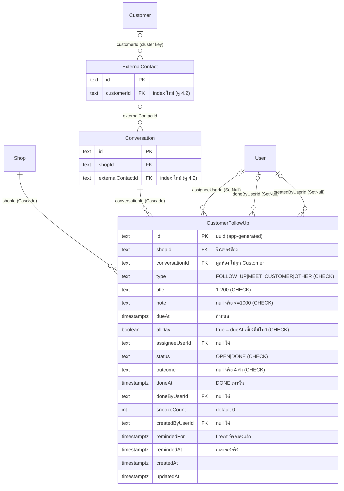

> **โมดูล:** 00066 Customer Follow-up Activities
> **ประเภทเอกสาร:** DATABASE Design
> **เวอร์ชัน:** 0.1
> **วันที่จัดทำ:** 2026-09-29
> **สถานะ:** Draft (ตรวจกับ `prisma/schema.prisma` + `prisma/migrations/` จริงแล้ว — ยังไม่ได้ต่อฐานใด ๆ)
> **เจ้าของเอกสาร:** `safepay-database`

# DATABASE: ติดตามลูกค้า (CustomerFollowUp)

---

## 1. Overview

ตารางใหม่ 1 ตาราง `CustomerFollowUp` + index 2 ตัวบนตารางเดิม (`ExternalContact`, `Conversation`) ไม่มีคอลัมน์ใหม่ในตารางเดิม ไม่มี backfill

- **ต้นทาง:** [[SDS]] TD-FU-1 (ผูก "ห้อง" คำนวณ cluster ตอนอ่าน ไม่เก็บ `customerId`), TD-FU-3 (`remindedFor` เทียบ fireAt), TFR-004/011
- **Store:** PostgreSQL 16 (Supabase) ผ่าน Prisma — เดียวเท่านั้น ไม่มี store อื่น ไม่มี RLS ไม่มี Realtime trigger
- **แพตเทิร์นที่ยึดจาก schema จริง**
  - PK = `String @id @default(uuid())` → SQL `TEXT` ไม่มี DB default (ตรงกับทุกตารางข้างเคียง เช่น `CustomerFile`)
  - enum = `String` + CHECK unmanaged (ตาม `OrderEvent.type`, `Shop.vertical`) ไม่ใช้ Prisma enum
  - timestamp: ตารางใหม่ล่าสุด (`Order.serviceStart`, ตระกูล subscription/inspection) ใช้ `@db.Timestamptz(3)`; ตารางเก่าใช้ `TIMESTAMP(3)` เปล่า → **ใช้ `Timestamptz(3)`** เพราะฟีเจอร์นี้เทียบเวลาไทยใน CHECK และสัญญากับ `thaiMidnightUtc` (ค่าเป็น instant ชัดเจน ไม่พึ่ง session TimeZone)
  - FK: `Shop`/`Conversation` = `onDelete: Cascade` · `User` (ฟิลด์คน) = `onDelete: SetNull` (ตรงกับ `AppointmentRescheduleActor`, `InspectionRoundInspector`)

---

## 2. ERD



---

## 3. Tables

### 3.1 `CustomerFollowUp` (PostgreSQL / Supabase)

รองรับ SDS §4.1–4.4 (สร้าง/อ่านแผงห้อง/ป้ายแถว/ตัวกรอง/กระดาน/ปฏิทิน/cron)

| Column | Type | Null | Default | Key |
|---|---|---|---|---|
| `id` | `TEXT` | NO | app `uuid()` | PK |
| `shopId` | `TEXT` | NO | - | FK → `Shop.id` CASCADE |
| `conversationId` | `TEXT` | NO | - | FK → `Conversation.id` CASCADE |
| `type` | `TEXT` | NO | `'FOLLOW_UP'` | CHECK |
| `title` | `TEXT` | NO | - | CHECK |
| `note` | `TEXT` | YES | NULL | CHECK |
| `dueAt` | `TIMESTAMPTZ(3)` | NO | - | IDX |
| `allDay` | `BOOLEAN` | NO | `false` | CHECK |
| `assigneeUserId` | `TEXT` | YES | NULL | FK → `User.id` SET NULL |
| `status` | `TEXT` | NO | `'OPEN'` | CHECK |
| `outcome` | `TEXT` | YES | NULL | CHECK |
| `doneAt` | `TIMESTAMPTZ(3)` | YES | NULL | - |
| `doneByUserId` | `TEXT` | YES | NULL | FK → `User.id` SET NULL |
| `snoozeCount` | `INTEGER` | NO | `0` | CHECK |
| `createdByUserId` | `TEXT` | YES | NULL | FK → `User.id` SET NULL |
| `remindedFor` | `TIMESTAMPTZ(3)` | YES | NULL | - |
| `remindedAt` | `TIMESTAMPTZ(3)` | YES | NULL | - |
| `createdAt` | `TIMESTAMPTZ(3)` | NO | `CURRENT_TIMESTAMP` | - |
| `updatedAt` | `TIMESTAMPTZ(3)` | NO | (Prisma `@updatedAt`) | - |

#### Prisma model (ให้ Developer วางลง `schema.prisma` — เอกสารนี้ไม่ได้แก้ไฟล์นั้น)

```prisma
// feature 00066 — รายการติดตามลูกค้า (ผูก "ห้องแชท" ไม่ผูก Customer — SDS TD-FU-1)
// 🛑 CHECK ทั้งชุด + partial index 4 ตัว = unmanaged SQL (Prisma DSL ประกาศไม่ได้)
//    ห้าม `prisma db pull` / `migrate dev` — ดู DATABASE.md §4.1 และ Shop_userId_personal_key ที่ Shop
model CustomerFollowUp {
  id              String    @id @default(uuid())
  shopId          String
  conversationId  String
  type            String    @default("FOLLOW_UP")
  title           String
  note            String?
  dueAt           DateTime  @db.Timestamptz(3)
  allDay          Boolean   @default(false)
  assigneeUserId  String?
  status          String    @default("OPEN")
  outcome         String?
  doneAt          DateTime? @db.Timestamptz(3)
  doneByUserId    String?
  snoozeCount     Int       @default(0)
  createdByUserId String?
  remindedFor     DateTime? @db.Timestamptz(3)
  remindedAt      DateTime? @db.Timestamptz(3)
  createdAt       DateTime  @default(now()) @db.Timestamptz(3)
  updatedAt       DateTime  @updatedAt @db.Timestamptz(3)

  shop         Shop         @relation(fields: [shopId], references: [id], onDelete: Cascade)
  conversation Conversation @relation(fields: [conversationId], references: [id], onDelete: Cascade)
  assignee     User?        @relation("FollowUpAssignee", fields: [assigneeUserId], references: [id], onDelete: SetNull)
  doneBy       User?        @relation("FollowUpDoneBy", fields: [doneByUserId], references: [id], onDelete: SetNull)
  createdBy    User?        @relation("FollowUpCreator", fields: [createdByUserId], references: [id], onDelete: SetNull)

  @@index([shopId, dueAt], map: "CustomerFollowUp_shopId_dueAt_idx")
  @@index([conversationId, status, dueAt], map: "CustomerFollowUp_conversationId_status_dueAt_idx")
}
```

Back-relation ที่ต้องเพิ่ม (ไม่มีคอลัมน์ใหม่): `Shop.followUps`, `Conversation.followUps`, `User.followUpsAssigned` / `followUpsDone` / `followUpsCreated`
(ชื่อ relation `FollowUp*` ยังไม่ชนกับของเดิม — grep `FollowUp` ใน `schema.prisma` ได้ 0)

#### CHECK constraints (unmanaged — อยู่ใน `migration.sql` เท่านั้น)

| ชื่อ | เงื่อนไข | เหตุผล |
|---|---|---|
| `CustomerFollowUp_type_check` | `type IN ('FOLLOW_UP','MEET_CUSTOMER','OTHER')` | มติ Q1 (3 ชนิด) |
| `CustomerFollowUp_status_check` | `status IN ('OPEN','DONE')` | SRS state machine |
| `CustomerFollowUp_outcome_check` | `outcome IS NULL OR outcome IN ('REACHED','NO_ANSWER','CALL_LATER','NOT_INTERESTED')` | ค่าที่ยอมรับ |
| `CustomerFollowUp_done_fields_check` | `(status='OPEN' AND doneAt IS NULL AND doneByUserId IS NULL AND outcome IS NULL) OR (status='DONE' AND doneAt IS NOT NULL)` | ผูก "outcome เฉพาะเมื่อ DONE" + บังคับให้ **เปิดกลับ (reopen) ต้องล้าง doneAt/doneBy/outcome** ที่ชั้น DB |
| `CustomerFollowUp_title_len_check` | `char_length(btrim(title)) BETWEEN 1 AND 200` | ตรง Valibot SRS §TFR-005 (TITLE_MAX) |
| `CustomerFollowUp_note_len_check` | `note IS NULL OR char_length(note) <= 1000` | ตรง Valibot |
| `CustomerFollowUp_snooze_nonneg_check` | `snoozeCount >= 0` | กัน decrement ผิด |
| `CustomerFollowUp_allday_midnight_check` | `NOT allDay OR (("dueAt" AT TIME ZONE 'Asia/Bangkok')::time = TIME '00:00:00')` | invariant SRS §TFR-002: `allDay ⇒ dueAt` = เที่ยงคืนไทยพอดี |

---

## 4. Indexes

### 4.1 บน `CustomerFollowUp`

| # | Index | Prisma ประกาศได้? | Query ที่รองรับ |
|---|---|---|---|
| 1 | `(shopId, dueAt)` | ใช่ `@@index` | **ปฏิทิน** ช่วงเดือน ทุกสถานะ (`take:1001`) — ห้ามทำ partial (ต้องเห็น DONE ด้วย; บทเรียน gochat 0107) + FK `shopId` |
| 2 | `(conversationId, status, dueAt)` | ใช่ `@@index` | **แผงห้อง/cluster** `conversationId IN (…) AND status='OPEN' ORDER BY dueAt` + DONE ล่าสุด 3 ใบ + FK `conversationId` |
| 3 | `(shopId, dueAt) WHERE status='OPEN'` | **ไม่** — raw SQL | **กระดาน** OPEN scan ต่อร้าน (≤2000) และ `countOpenAndLate` ของป้ายแถว: DONE สะสมไม่จำกัด (ไม่มี retention) index #1 จะกวาด DONE ด้วย |
| 4 | `(assigneeUserId, dueAt) WHERE status='OPEN'` | **ไม่** — raw SQL | **bubble "ของฉัน"** + ตัวกรอง `mine`/ผู้รับผิดชอบ |
| 5 | `(dueAt) WHERE status='OPEN'` | **ไม่** — raw SQL | **cron** `*/5`: `status='OPEN' AND dueAt > now-36h AND dueAt <= now` (ไม่กรองร้าน) |
| 6 | `(shopId, doneAt) WHERE status='DONE'` | **ไม่** — raw SQL | คอลัมน์ "ทำแล้วใน 7 วัน" + ตัวกรอง "เสร็จสิ้น" |

- **cron:** `fireAt` เป็นค่าคำนวณ (`allDay ? dueAt+9h : dueAt`) ไม่ใช่คอลัมน์ ⇒ SQL กรองด้วย `dueAt` เป็น superset ตามหน้าต่าง 36 ชม. แล้ว TS ตัดสิน `isReminderDue` (SDS TD-FU-2) · **ไม่ทำ index บน `remindedFor`** — หน้าต่าง 36 ชม. เล็กมากอยู่แล้ว การเช็ค `IS DISTINCT FROM` ทำหลัง index scan ไม่คุ้มต้นทุนเขียนทุกครั้งที่จอง/เลื่อน
- **ไม่ทำ index บน FK คน** (`doneByUserId`, `createdByUserId`; `assigneeUserId` มีแค่ partial OPEN) — จะถูกใช้เฉพาะตอน `SET NULL` เมื่อ User ถูก hard-delete จริง ซึ่งระบบใช้ soft delete + purge เป็นรอบ ตารางนี้เล็ก seq scan รับได้ ⇒ ยอมรับโดยรู้ตัว
- **Prisma drift:** partial index #3–#6 อยู่นอก `schema.prisma` เช่นเดียวกับ `Shop_userId_personal_key` (`20260702000002_…`) ⇒ **ห้าม `prisma db pull` / `migrate dev`** (introspection ไม่เห็นแล้วจะพยายามลบ) — ต้องเขียนคอมเมนต์เตือนบน model (อยู่ในโค้ด Prisma ข้างบนแล้ว)

### 4.2 บนตารางเดิม (จำเป็นต่อ cluster query — ตรวจแล้ว **ยังไม่มี**)

ตรวจแล้ว:
- `ExternalContact`: `schema.prisma` มีแค่ `@@unique([shopChannelId, externalUserId])` + `@@index([avatarUrl])`; grep `prisma/migrations/` ทั้งก้อนพบ **เฉพาะ FK constraint** `ExternalContact_customerId_fkey` (`20260722000000_facebook_chat`) ไม่มี index บน `customerId`
- `Conversation`: มี `UNIQUE (shopChannelId, externalContactId)` (`20260722000000_facebook_chat:58`) แต่ **ขึ้นต้นด้วย `shopChannelId`** จึงใช้ค้นด้วย `externalContactId` เดี่ยว ๆ ไม่ได้; ตัวอื่นขึ้นต้น `shopId`/`buyerUserId`/`chatGroupId` ⇒ ไม่มี index ใช้ได้

cluster query (SDS §4.3: `ea.customerId = eb.customerId` แล้วไปหา `b` ด้วย `externalContactId`) จึงจะ seq scan `ExternalContact` และไล่ทั้งร้านผ่าน index `shopId` ของ `Conversation` — และรันในทุกครั้งที่โหลดรายการกล่องแชท (ป้ายแถว) ⇒ **เสนอเพิ่ม 2 ตัว**

| Index | ต่างจากร่างของ planner | Prisma |
|---|---|---|
| `ExternalContact(customerId)` | ร่าง = partial `WHERE customerId IS NOT NULL` → **เปลี่ยนเป็น index ธรรมดา** | `@@index([customerId])` |
| `Conversation(externalContactId)` | ร่าง = partial `WHERE … IS NOT NULL` → **เปลี่ยนเป็น index ธรรมดา** | `@@index([externalContactId])` |

เหตุผลที่ตัด `WHERE`: ประหยัดขนาดได้น้อย (แถวส่วนใหญ่ของ `Conversation` ช่องทางนอกมีค่าอยู่แล้ว) แต่ทำให้เป็น **unmanaged object เพิ่มอีก 2 ตัวที่ Prisma ไม่เห็น** ⇒ ประกาศเป็น `@@index` ปกติ Prisma รู้จัก ไม่เพิ่มความเสี่ยง drift

---

## 5. Migration Plan

### 5.1 ลำดับ (2 ไฟล์ ไม่รวมกัน)

| ลำดับ | ไฟล์ (ชื่อเสนอ) | เนื้อหา | Lock |
|---|---|---|---|
| 1 | `<ts>_customer_follow_up` | `CREATE TABLE` + FK 5 ตัว + CHECK 8 ตัว + index #1–#6 | ตารางใหม่ว่าง = **ไม่มีผลต่อการอ่าน/เขียนใคร** (FK ชี้ `Shop`/`Conversation`/`User` ใช้ `SHARE ROW EXCLUSIVE` สั้นมากระดับ ms) |
| 2 | `<ts+1>_follow_up_cluster_indexes` | `CREATE INDEX "ExternalContact_customerId_idx"` · `CREATE INDEX "Conversation_externalContactId_idx"` | ดูข้างล่าง |

ชื่อ timestamp: migration ล่าสุดในรีโปคือ `20260914150100_…` ต้อง rebase เช็คว่า `<ts>` ใหม่กว่าของ `main` ก่อน (บทเรียน timestamp ชนกัน 2026-08-06)

CHECK ในไฟล์ 1 เขียนตรง ๆ ได้ (ตารางว่าง ไม่ต้อง `NOT VALID`). **ข้อควรจำ:** ค่ารายชื่อใน CHECK เป็น *สแนปช็อต ณ วันนี้* — ถ้าเพิ่มชนิด/ผลลัพธ์ทีหลัง ต้องใช้ท่า additive ใน `docs/conventions/migration-check-constraint-additive.md` (อ่านนิยามเดิมจาก `pg_constraint` มาต่อท้าย ห้าม hardcode รายชื่อทับ)

### 5.2 ความเสี่ยงล็อกไฟล์ 2 (ตารางเดิม)

- `CREATE INDEX` ธรรมดา = **`SHARE` lock: อ่านได้ต่อ แต่ `INSERT/UPDATE/DELETE` ตารางนั้นรอจนสร้างเสร็จ** · `CONCURRENTLY` ใช้ไม่ได้ (Prisma ห่อ migration ทั้งไฟล์ในทรานแซกชัน — ตามบทเรียน `20260914150100_chat_message_updated_at_index`)
- `Conversation` ถูกเขียนทุกข้อความ (`lastMessageAt`, `lastInboundAt`, unread ฯลฯ) ⇒ ช่วงสร้าง index การเขียนข้อความเข้า/ออกจะค้างรอ; `ExternalContact` เขียนน้อยกว่า
- **ขนาดตารางบน prod: ยังไม่ทราบ** (ฐานนี้ต่อไม่ได้ตามกรอบงาน) — ก่อน merge ให้ Controller วัด `count(*)` ของสองตารางแบบอ่านอย่างเดียวผ่าน Supabase PAT (`reference_prod_readonly_sql_via_supabase_pat`) เกณฑ์ประเมิน: หลักหมื่นแถวลงมา = สร้างเสร็จภายในวินาที ยอมรับได้ · หลักล้านแถว ต้องคุยแผนแยก (นอก Prisma)
- แยกเป็นไฟล์ที่ 2 เพื่อให้ `SHARE` lock ครอบเฉพาะสองคำสั่งนี้ ไม่ยาวไปพร้อม CREATE TABLE (แพตเทิร์นเดียวกับ `20260914150100`)
- ใส่ `IF NOT EXISTS` เผื่อฐาน local ที่ apply มือ

### 5.3 HR15 — deploy

`vercel.json` build = `prisma migrate deploy && prisma generate && next build` ⇒ **push ขึ้น `main` = migration ทั้ง 2 ไฟล์ขึ้น prod ในตัว ไม่มีใครต้องสั่งเอง**
1. Controller ต้องแจ้ง user ก่อนรัน/ก่อน push (ห้ามเงียบ)
2. **ฐาน local ต้อง apply เอง** — `prisma migrate deploy` ปักหมุด `localhost` ในคำสั่งตรง ๆ (HR14: ห้าม `migrate dev`, ห้ามตัวแปรจาก `.env.local`)
3. migrate ล้ม = build ล้ม = deploy ไม่ขึ้น (ของเก่ายังเสิร์ฟ) แก้ไฟล์ migration แล้ว push ใหม่ ไม่ใช่กด retry
4. cron `*/5` ที่ประกาศใน `vercel.json` ขึ้นพร้อมกัน — ตารางต้องมีก่อน (migrate รันก่อน build จึงเรียงถูก)

### 5.4 Rollback

- ไฟล์ 2: `DROP INDEX` สองตัว — ปลอดภัย ไม่มีข้อมูล
- ไฟล์ 1: `DROP TABLE "CustomerFollowUp"` — **destructive (ข้อมูลผู้ใช้ที่สร้างหลัง deploy หายหมด)** ทำเมื่อ Controller สั่งชัดเท่านั้น; ก่อนสั่งให้ export แถวเก็บไว้ · rollback ที่ปลอดภัยกว่า = ปิด UI/cron (ตารางค้างไว้เฉย ๆ ไม่มีผู้อ่านตารางนี้นอกฟีเจอร์นี้)
- เพราะ additive ล้วน โค้ดเก่าไม่แตะตารางนี้ ⇒ revert โค้ดโดยไม่ drop ตารางได้ ไม่พัง

---

## 6. Retention / ข้อควรระวัง

- **Retention:** ไม่มี job ลบ — DONE สะสมตลอดชีพร้านนั้น (ปริมาณ = จำนวนงานที่ร้านสร้าง น้อย); เพราะเหตุนี้ index #3 (partial OPEN) จึงมีค่า; ถ้าโตผิดคาดค่อยเพิ่ม archive · ห้อง/ร้านถูกลบ ⇒ ลบตาม (cascade, BR-ACT-11)
- 🛑 **BR-ACT-22:** Cascade จาก `Conversation`/`ExternalContact` จะลบรายการเงียบ ๆ ถ้ามีเส้นทางรวมลูกค้า/ลบห้องในอนาคต — ปัจจุบันไม่มีเส้นทางลบใน `src/` (BRD §7); ต้องมีเทสที่แดงเมื่อเพิ่มเส้นทางดังกล่าวโดยไม่เรียกตัวย้ายรายการ (นอกขอบเขตเอกสารนี้ แต่ DB คือที่ที่ตัวเลือก Cascade ถูกตัดสิน)
- **PII:** `title`/`note` เป็นข้อความอิสระที่ผู้ขายพิมพ์ อาจมีชื่อ/เบอร์ลูกค้า — ห้าม `select *`/ห้าม log เนื้อหา; ไม่มีสิทธิ์ฝั่งลูกค้า (ลูกค้าไม่เห็นอะไรเลย) การกันข้ามร้านอยู่ที่ service (`shopId` ใน `WHERE` ทุกคิวรี) ไม่ใช่ที่ DB — ไม่มี RLS
- **Consistency `shopId` ↔ `conversationId`:** DB ไม่บังคับว่า `shopId` ตรงกับ `Conversation.shopId` (FK แยกกัน) — service ต้อง resolve `shopId` จากห้อง (`resolveConversationShopId`) ห้ามรับจาก client · ไม่เพิ่ม composite FK เพราะ `Conversation` ไม่มี unique `(id, shopId)` และ cost/benefit ไม่คุ้ม (บันทึกเป็นความเสี่ยง)
- **`remindedFor` มีผู้เขียนแค่ service + cron** และห้ามเขียน null ทับเมื่อไม่ได้ตั้งใจ re-arm (TD-FU-3: แก้เวลา ⇒ fireAt เปลี่ยน ⇒ re-arm เอง)
- **Performance:** ตารางเล็ก ไม่มี hot row ยกเว้น UPDATE จอง `remindedFor` ต่อแถว (เงื่อนไข CAS ต่อ id ไม่ชนกันข้ามแถว) · การอ่าน cluster ขึ้นกับ index ใน §4.2

---

## 7. Traceability

| Table / Index | SDS / SRS | สถานะ |
|---|---|---|
| `CustomerFollowUp` | SDS §3 · TD-FU-1/2/3 · SRS TFR-001–011 | Draft |
| CHECK `allday_midnight` | SRS §TFR-002 (invariant), SDS §5 | Draft |
| CHECK `done_fields` | SRS state machine (reopen ล้างผลลัพธ์) | Draft |
| index #5 (cron) | SDS §4.1, TFR-011 | Draft |
| `ExternalContact(customerId)` + `Conversation(externalContactId)` | SDS TD-FU-1 "ผล", §4.3; SRS §9 ความเสี่ยง "cluster query ช้า" | Draft |

---

## 8. สรุป (Summary)

เพิ่มตาราง `CustomerFollowUp` ผูกห้อง (ไม่ผูก Customer) พร้อม CHECK 8 ตัวที่บังคับ invariant ธุรกิจที่ชั้น DB และ index 6 ตัวตาม query จริง 5 พื้นผิว + cron; เพิ่ม index ธรรมดา 2 ตัวบน `ExternalContact`/`Conversation` ที่ยังขาดอยู่ ซึ่งเป็นตัวเดียวที่แตะตารางเดิม (ต้องวัดขนาดก่อน deploy)

**Open Questions:**
- ขนาดแถวจริงของ `Conversation`/`ExternalContact` บน prod (ตัดสินว่า `SHARE` lock ยอมรับได้ไหม) — Controller วัดผ่าน Supabase PAT
- จำนวน OPEN ต่อร้านบน prod (SDS Open) — กำหนดว่า `OPEN_SCAN_MAX=2000` เพียงพอไหม
