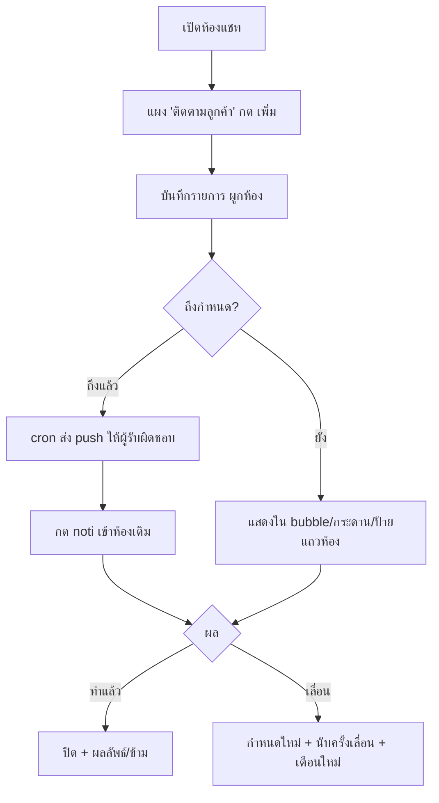

> **โมดูล:** 00066 — Customer Follow-up Activities (ชื่อเรียกในระบบ/UI ที่เสนอ: "ติดตามลูกค้า")
> **ประเภทเอกสาร:** Product Requirements Document (PRD)
> **เวอร์ชัน:** 0.1
> **วันที่จัดทำ:** 2026-09-29
> **สถานะ:** Draft — รอ user รีวิวและตัดสิน Open Questions ใน BRD §13
> **เจ้าของเอกสาร:** BA + PO + PM (ดู [[Feature-Docs-Ownership]])

# PRD: ติดตามลูกค้า (Customer Follow-up Activities)

---

## Executive Summary

ผู้ขายและแอดมินร้านของ Deep คุยกับลูกค้าในกล่องแชท (`/inbox`) วันละหลายสิบห้อง แต่ระบบไม่มีที่จด **"ต้องกลับไปทำอะไรกับลูกค้าคนนี้ เมื่อไร"** ตอนนี้ร้านต้องใช้โน้ตอิสระ (`ExternalContact.note`, `schema.prisma:1873`) หรือจำเอง ซึ่งไม่มีวันครบกำหนด ไม่มีผู้รับผิดชอบ และไม่มีใครมาสะกิดเมื่อถึงเวลา

ฟีเจอร์นี้เพิ่ม **รายการติดตามลูกค้า**: งาน/นัดที่พนักงานสร้างจากห้องแชท ระบุวันเวลา ผู้รับผิดชอบ และปิดพร้อมผลลัพธ์ได้ ยกแบบมาจากระบบกิจกรรมของ gochat-v3 ทั้งชุด (แผงในห้องแชท · bubble ของฉัน · หน้ารวมกระดาน+ปฏิทิน · แท็บในโปรไฟล์ลูกค้า · ตัวกรองในกล่องแชท). แล้วเพิ่ม 2 อย่าง:

1. **push เข้าแอปผู้ขายเมื่อถึงกำหนด** (gochat ไม่มี — บทเรียนของเขาคือ "bubble เห็นง่ายแต่ไม่มาสะกิด")
2. **ปิด 2 ช่องโหว่ของ gochat ตั้งแต่ต้น:** รวม/ย้ายลูกค้าแล้วงานต้องตามไป · ปุ่ม "เลื่อน" คำนวณเวลาไทยตายตัว ไม่พึ่งนาฬิกาเครื่องผู้ใช้

**ไม่ส่งอะไรหาลูกค้าเด็ดขาด** — เป็นเครื่องมือภายในร้านล้วน ๆ

---

## 1. Business Goals & KPIs

### 1.1 เป้าหมายทางธุรกิจ

| เป้าหมาย | รายละเอียด |
|----------|-----------|
| **ไม่ปล่อยลูกค้าหลุดจากการติดตาม** | ลูกค้าที่บอก "ขอคิดดูก่อน" / "โทรกลับพรุ่งนี้" ต้องมีที่จดที่ผูกกับห้องแชทเดิม และมีคนถูกสะกิดเมื่อถึงเวลา |
| **ทีมส่งต่องานกันได้** | กะบ่ายจดไว้ กะดึกปิดแทนได้ (ไม่ผูกสิทธิ์กับคนสร้าง) เห็นว่าใครรับผิดชอบ |
| **เห็นภาพรวมงานค้างทั้งร้านในที่เดียว** | หน้ารวม (กระดาน+ปฏิทิน) ตอบว่า "วันนี้ใครต้องทำอะไร มีอะไรเลยกำหนด" |
| **ใช้ของเดิมที่ Deep มี ไม่สร้างระบบคู่ขนาน** | ผูกกับ Conversation/ExternalContact/ShopMember/pushToUsers ที่มีอยู่ ไม่มีระบบลูกค้า/แจ้งเตือนชุดใหม่ |

### 1.2 ตัวชี้วัดความสำเร็จ (KPIs)

> ค่าเป้าหมายเป็น **ข้อเสนอ** — ยังไม่มี baseline ให้เทียบ (ไม่มีข้อมูลก่อนมีฟีเจอร์) ให้ user ยืนยันหรือตั้งใหม่

| KPI | คำอธิบาย | เป้าหมาย (ข้อเสนอ) |
|-----|----------|---------|
| **การนำไปใช้** | สัดส่วนร้านที่ active ด้านแชท (มีข้อความเข้า ≥1 ใน 30 วัน) และสร้างรายการติดตาม ≥1 ใน 30 วัน | 20% ภายใน 60 วันหลังขึ้น prod |
| **อัตราปิดงาน** | รายการที่ถึงกำหนดแล้วในเดือนนั้น ที่สถานะ `ปิดแล้ว` ภายใน 7 วันหลังกำหนด | ≥ 60% |
| **push ถึงมือ** | push เตือนที่ส่งสำเร็จ (Expo ไม่ตอบ error/ไม่ลบ token) ÷ push ที่ตั้งใจส่ง | ≥ 95% |
| **งานเลยกำหนดต่อร้าน** | จำนวน "เลยกำหนด" ณ สิ้นวัน เฉลี่ยต่อร้านที่ใช้งาน | แนวโน้มลดลงเดือนต่อเดือน |
| **ไม่มีข้อร้องเรียนเรื่องเวลา** | รายงานว่า "เลื่อนแล้วเวลาผิด/เตือนเพี้ยน" | 0 |

---

## 2. User Personas (กลุ่มผู้ใช้งาน)

### 2.1 เจ้าของร้าน / แอดมินตอบแชท (ผู้ใช้หลัก)

**ข้อมูลพื้นฐาน:**
- ร้านที่ขายผ่านแชท Messenger/Instagram/LINE/แอป Deep — เจ้าของร้าน (`Shop.userId`) หรือสมาชิกร้านใน `ShopMember` (role `OWNER`/`ADMIN`, `schema.prisma:1353-1368`)
- ใช้ทั้งเดสก์ท็อปและแอปผู้ขายบนมือถือ

**เป้าหมาย:**
- ปิดการขายให้ได้มากขึ้นโดยไม่ลืมลูกค้าที่ยังลังเล

**ความต้องการ:**
- จดสิ่งที่ต้องทำได้ใน 3 ขั้น โดยไม่ต้องออกจากห้องแชท
- เห็นงานของตัวเองที่ต้องทำวันนี้โดยไม่ต้องเข้าไปหา
- ได้รับแจ้งเตือนเมื่อถึงเวลา

**จุดปวด (Pain Points):**
- ไม่มีที่จดที่มีเวลา — โน้ตในโปรไฟล์ไม่มีกำหนด ไม่มีใครมาเตือน
- ลูกค้าบอกให้โทรกลับ/ทักใหม่ แล้วลืมเพราะห้องแชทถูกดันลงไปตามข้อความใหม่

### 2.2 ร้านที่มีทีมหลายคน (เจ้าของ + พนักงานหลายกะ)

**ข้อมูลพื้นฐาน:**
- ร้าน BUSINESS ที่มี `ShopMember` ตั้งแต่ 2 คนขึ้นไป

**เป้าหมาย:**
- ส่งต่องานข้ามกะ และรู้ว่าอะไรยังไม่มีคนรับ

**ความต้องการ:**
- มอบหมายผู้รับผิดชอบ · กรอง "ของฉัน / ทั้งร้าน / รายคน" · เห็นงานที่ยังไม่มีคนรับ

**จุดปวด (Pain Points):**
- ไม่มีทางรู้ว่างานที่ค้างเป็นของใคร งานหายเมื่อคนที่จดออกจากกะ

### 2.3 ร้านคนเดียว (ร้าน PERSONAL)

**ข้อมูลพื้นฐาน:**
- ร้านส่วนตัว **ไม่มีแถว `ShopMember`** (`schema.prisma:1681` ระบุตรง ๆ ว่า ShopMember ถูกสร้างเฉพาะร้าน BUSINESS) — คนเดียวที่เกี่ยวข้องคือเจ้าของร้าน `Shop.userId` (`src/lib/shop-context.ts:25-28`)

**เป้าหมายและความต้องการ:**
- ใช้ฟีเจอร์เดียวกัน แต่ไม่มีการมอบหมาย — ผู้รับผิดชอบคือเจ้าของเสมอ (ไม่แสดงตัวเลือกคน)

**จุดปวด (Pain Points):**
- เหมือน 2.1

---

## 3. Business Requirements

### 3.1 ชื่อเรียกในระบบ (ต้องตัดสินก่อนเขียน UI)

user เรียกฟีเจอร์ว่า "กิจกรรม" แต่ในโค้ด/หน้าจอ Deep คำนี้ถูกใช้ไปแล้ว 3 ความหมายที่ไม่เกี่ยวกัน (ค้น `กิจกรรม` ใน `src/`):

| ที่ที่ใช้อยู่แล้ว | หลักฐาน |
|---|---|
| ประวัติกิจกรรมคำสั่งซื้อ (Order Activity Log 00031) | `src/lib/order-event.ts:1`, `src/services/order-event.service.ts:11` |
| "กิจกรรมล่าสุด" บนแดชบอร์ด (ฟีดรวม 5 แหล่ง) | `src/i18n/dictionaries/th.ts:304-309`, `dashboard/components/ActivityTimeline.tsx:2`, `RecentActivityFeed.tsx` |
| `activity.service.ts` ของฝั่งแดชบอร์ด/ฟีด | `src/services/activity.service.ts` |

ถ้าใช้ "กิจกรรม" อีก ผู้ขายจะแยกไม่ออกว่า "กิจกรรมในห้องแชท" กับ "กิจกรรมล่าสุด" หน้าแรกเป็นของเดียวกันหรือไม่ และ dev จะ import service ผิดตัว

นอกจากนี้ 2 คำที่ดูเป็นตัวเลือกก็ชนเช่นกัน:
- **"งาน"** — ร้าน `SERVICE_QUEUE` ใช้ "งานใหม่" เป็นปุ่มสร้างคิว (`ORDER_VOCAB.SERVICE_QUEUE.createLabelShort`) และเมนู "ตารางงาน" (`src/lib/seller-menu.ts:111`)
- **"นัดหมาย"** (ชื่อชนิดของ gochat) — ชนกับระบบนัดหมายวันเข้าใช้บริการ 00024 (`src/lib/appointments.ts:2`)

**ข้อเสนอ (รอ user ยืนยัน — Open Question Q1):**

| ที่ใช้ | ชื่อ |
|---|---|
| ชื่อฟีเจอร์ / เมนู / หัวแผง | **ติดตามลูกค้า** |
| หนึ่งรายการ | **รายการติดตาม** |
| ชนิด 3 ค่า | **ตามเรื่อง** · **นัดคุยกับลูกค้า** · **อื่น ๆ** (แทน follow_up / appointment / other ของ gochat) |
| ชื่อ model/service ในโค้ด | `CustomerFollowUp` / `customer-follow-up.service.ts` (ห้ามใช้คำว่า `Activity`) |

### 3.2 สร้างรายการติดตามจากห้องแชท

**ความต้องการ:**
- ในห้องแชท ผู้ใช้เพิ่มรายการติดตามได้ด้วย: หัวข้อ · ชนิด · วัน-เวลา (หรือ "ทั้งวัน") · ผู้รับผิดชอบ · โน้ต (ไม่บังคับ)
- สร้างได้จากห้องแชทเท่านั้น (ไม่สร้างจากปฏิทิน/หน้ารวม)

**Business Rules:**
- ไม่เลือกผู้รับผิดชอบ = ผู้สร้าง
- ผู้รับผิดชอบเลือกได้เฉพาะสมาชิกของร้านนั้น (เจ้าของ + `ShopMember`); ร้าน PERSONAL ไม่มีตัวเลือก

**เหตุผล:**
- รายการที่ผูกห้องแชทมีบริบทครบ (ลูกค้าคุยอะไรมา) กดจากแจ้งเตือนแล้วเข้าห้องเดียวกันได้ทันที

### 3.3 ทำงานกับรายการ: ปิด · เลื่อน · แก้ · ลบ · เปิดกลับ

**ความต้องการ:**
- "ทำแล้ว" พร้อมเลือกผลลัพธ์ 4 แบบหรือข้าม: ติดต่อได้-สนใจต่อ · ไม่รับสาย · ขอให้ติดต่อใหม่ · ไม่สนใจแล้ว
- "เลื่อน" ด้วยปุ่มลัด (พรุ่งนี้ 09:00 / อีก 3 วัน / สัปดาห์หน้า) หรือเลือกเอง — ระบบนับว่าเลื่อนมากี่ครั้ง
- แก้ · ลบ (มีการยืนยัน) · เปิดกลับ

**Business Rules:**
- ทุกคนในร้านทำได้ทุกอย่างกับทุกรายการ ไม่เทียบกับเจ้าของรายการ (กะดึกปิดแทนกะบ่ายได้)
- เลื่อนตั้งแต่ 2 ครั้ง ขึ้นป้ายเตือน

**เหตุผล:**
- งานติดตามต้องส่งต่อข้ามกะได้ การล็อกสิทธิ์ให้เจ้าของรายการจะทำให้งานค้างเมื่อคนนั้นไม่อยู่

### 3.4 มองเห็นรายการ — 5 พื้นผิว (ยกจาก gochat ทั้งชุด)

| # | พื้นผิว | ที่ตั้งใน Deep |
|---|---|---|
| a | **แผง "ติดตามลูกค้า (n)" ในห้องแชท** — กางเองเมื่อมีงานเลยกำหนด | เพิ่มใน `src/app/(paces)/seller/(chat)/inbox/[conversationId]/components/` ข้าง `CustomerPanel.tsx` / `CustomerCrmSection.tsx` (มือถือ: `CustomerPanelSheet.tsx`) |
| b | **Bubble มุมขวาล่าง "ของฉัน"** ที่ค้าง/ครบวันนี้ บนหน้าแชทและหน้าความคิดเห็น | route group `(chat)` (`inbox/` + `inbox/comments/`) |
| c | **หน้ารวม: กระดาน 5 คอลัมน์ + ปฏิทินเดือน** พร้อมตัวกรอง | หน้าใหม่ใต้ `seller/(dashboard)/` เพิ่มเมนูใน `src/lib/seller-menu.ts` (ตำแหน่งดู Q6) |
| d | **แท็บ/ส่วน "ติดตามลูกค้า" ในโปรไฟล์ลูกค้า** | `seller/(dashboard)/customers/[id]/page.tsx` — ⚠️ ชนกับกติกา 00057 ดู Q4 |
| e | **ตัวกรองในกล่องแชท + ป้ายบนแถวห้อง** "งานค้าง n"/"เลยกำหนด n" | `InboxFilterPanel.tsx` (มีระบบนับตัวกรองอยู่แล้ว `:40-47` และหมวดแท็ก `:308`) และ `InboxList.tsx` |

### 3.5 แจ้งเตือนเข้าแอปผู้ขายเมื่อถึงกำหนด (ของใหม่ — gochat ไม่มี)

**ความต้องการ:**
- เมื่อรายการ "ถึงกำหนด" ระบบส่ง push เข้าแอปผู้ขายของ **ผู้รับผิดชอบ**
- รายการ "ทั้งวัน" เตือนตอนเช้าของวันนั้น (ข้อเสนอ 09:00 เวลาไทย — Q3)
- กดแจ้งเตือนแล้วเข้าห้องแชทของรายการนั้น

**Business Rules:**
- เตือนครั้งเดียวต่อกำหนดหนึ่งครั้ง; เลื่อน/แก้เวลา = เตือนใหม่ตามกำหนดใหม่
- ปิดแล้ว/ลบแล้ว = ไม่เตือน
- **ไม่ส่งอะไรหาลูกค้า**

**เหตุผล:**
- gochat ตั้ง 09:00 แล้วเช้ามาไม่มีอะไรเด้ง — bubble ช่วย "เห็นง่าย" แต่ไม่ "มาสะกิด" (`REFERENCE-gochat-v3.md` §5)

**ของเดิมที่ reuse (ไม่สร้างใหม่):**

| ต้องการ | ของเดิม | หลักฐาน |
|---|---|---|
| ส่ง push ถึง user หลายคนรวดเดียว, ลบ token เสีย | `pushToUsers()` | `src/services/app-push.service.ts:14-42` |
| token ของอุปกรณ์ผู้ขาย | `PushToken` (Expo) | `schema.prisma:1658-1673` |
| ชื่อลูกค้าบนแจ้งเตือน (alias ร้านชนะชื่อจริง) | `getConversationToastPreview()` | `src/services/seller-push.service.ts:107-110, 123-126` |
| deeplink `/inbox/{conversationId}` + สลับร้านให้ถ้าห้องเป็นของอีกร้าน | `data.url` + `ChatShopAutoSwitch` | `seller-push.service.ts:157`, `inbox/[conversationId]/components/ChatShopAutoSwitch.tsx` |
| งานที่วิ่งตามเวลา | Vercel Cron | `vercel.json:12-27` — มี cron ทุกนาที (`chat-outbox`, `:23`) และทุก 2 นาที (`auto-order-sweeper`, `:26`) อยู่แล้ว จึงไม่ใช่ครั้งแรกที่โปรเจกต์ใช้ความถี่ระดับนาที |
| ยืนยันตัวเรียก cron | `Bearer CRON_SECRET` (env ว่าง = 401) | `src/app/api/cron/auto-order-sweeper/route.ts:28-33` |

**สิ่งที่ยังไม่มีและต้องสร้าง:** `shopAudience()` เป็นฟังก์ชัน private ไม่ export (`seller-push.service.ts:39`) และยังหักคนที่ปิด "ข้อความใหม่" (`chatEnabled=false`, `:43-46`). ฟีเจอร์นี้ส่งให้ **คนเดียว** (ผู้รับผิดชอบ) ไม่ใช่ทั้งร้าน จึงไม่ใช้ฟังก์ชันนี้ตรง ๆ แต่ต้องตัดสินว่าจะหัก `chatEnabled` ไหม (Q2)

### 3.6 ปิด 2 ช่องโหว่ของ gochat

**(1) รวม/ย้ายลูกค้าแล้วรายการต้องตามไป**
- gochat: รวมลูกค้าแล้ว activities ไม่ย้ายตาม
- Deep: ยังไม่มีฟีเจอร์รวมลูกค้า (ค้น merge ใน `src/` ไม่พบ; `chat-crm.service.ts:6` และ `schema.prisma:1872` เขียนว่า Phase 2). ที่เปลี่ยน "ลูกค้าของห้อง" ได้จริงวันนี้คือ `relinkThreadCustomer` (`src/services/order.service.ts:179-192`) ตอนแก้เบอร์/สร้างออเดอร์
- **ทางแก้ระดับผลิตภัณฑ์:** รายการผูกกับ **ห้องแชท** ไม่ผูกกับ Customer และ "รายการทั้งหมดของลูกค้าคนนี้" คำนวณตอนอ่านจากความสัมพันธ์ปัจจุบัน (ห้องที่ `ExternalContact.customerId` เดียวกันในร้านนี้) ⇒ relink แล้วรายการตามไปเองโดยไม่ต้องย้ายข้อมูล และวันที่มีฟีเจอร์รวมลูกค้าจริง ต้องไม่ลบห้อง/ผู้ติดต่อโดยไม่ย้ายรายการก่อน (BR-ACT-22)

**(2) ปุ่มเลื่อนใช้เวลาไทยตายตัว**
- gochat: `quickWhen()` สร้าง "ต้นวัน" ตามนาฬิกาเครื่องผู้ใช้ ขณะที่ server ตัดวันตาม Bangkok
- Deep: คำนวณทุกวัน-เวลาเป็น Asia/Bangkok (UTC+7 ไม่มี DST — `src/lib/date-range.ts:12`) ทั้งปุ่มลัดและการตัดสิน "เลยกำหนด/วันนี้/7 วัน" ใช้ `todayThaiIsoDate` (`date-range.ts:79`) / `thaiDayKey` (`format-date.ts:398`); ผู้ใช้เปิดจากเครื่องที่ตั้งเขตเวลาอื่นแล้วต้องได้ผลเหมือนกัน

---

## 4. Business Rules & Constraints

### 4.1 กฎทางธุรกิจหลัก

| กฎ | คำอธิบาย |
|----|----------|
| **ผูกห้องแชท** | รายการทุกใบเกิดจากห้องแชทของร้านตัวเอง ไม่มีรายการลอย |
| **ทุกคนในร้านทำได้ทุกอย่าง** | ไม่เทียบกับผู้สร้าง/ผู้รับผิดชอบ |
| **เวลาไทยเดียว** | ทุกการคำนวณวัน-เวลาเป็น Asia/Bangkok |
| **นิยาม "เลยกำหนด" มีที่เดียว** | ฟังก์ชันเดียว (SQL เขียนซ้ำให้ตรง) ห้ามคนละหน้าจอนับต่างกัน |
| **ไม่ส่งหาลูกค้า** | ไม่มี LINE/Messenger/SMS/อีเมลถึงลูกค้าจากฟีเจอร์นี้ |
| **ไม่มีเงิน** | ไม่มีคอลัมน์ยอดเงิน (ยอดขายมีแหล่งเดียวคือออเดอร์ — HR16) |

### 4.2 ข้อจำกัดทางธุรกิจ

| ข้อจำกัด | รายละเอียด |
|---------|-----------|
| **ตัวกรองแท็กใช้ได้เฉพาะห้องที่มีผู้ติดต่อภายนอก** | แท็กเก็บที่ `ExternalContact.tags` (`schema.prisma:1876`); ห้อง `channel=DEEP` ไม่มี ExternalContact จึงไม่มีแท็ก (`chat-crm.service.ts:3-5, :100`) |
| **ไม่มีห้องกลุ่ม** | โมเดล Conversation ไม่มีแนวคิดกลุ่ม (อ่าน `schema.prisma:1896-2005`; ค้น group ใน `src/lib/line` ไม่พบ) — ส่วน "ห้องกลุ่ม" ของ gochat ไม่ยกมา |
| **ลูกค้าคนเดียวกันข้ามช่องทาง ≠ อัตโนมัติ** | ห้อง Messenger กับ LINE ของคนเดียวกันจะรวมเป็น "ลูกค้าเดียวกัน" ได้ก็ต่อเมื่อ `ExternalContact.customerId` ชี้ `Customer` เดียวกัน (ทั่วไปเกิดตอนมีออเดอร์ผูกเบอร์) — ไม่มีการเดาจากชื่อ |
| **เพดานจำนวน** | หัวข้อ 200 · โน้ต 1,000 ตัวอักษร · รายการในแผง/หน้ารวม/ปฏิทินมีเพดาน (BRD §7) |

### 4.3 ผลลัพธ์ของการปิดงาน (4 ค่า)

| ค่า | ป้ายไทย |
|---|---|
| reached | ติดต่อได้ · สนใจต่อ |
| no_answer | ไม่รับสาย |
| call_later | ขอให้ติดต่อใหม่ |
| not_interested | ไม่สนใจแล้ว |

ผลลัพธ์ไม่บังคับ — กด "ข้าม" ได้. **ไม่ผูกอัตโนมัติกับ `ExternalContact.salesStatus`** (`INTERESTED`/`NOT_INTERESTED`, `schema.prisma:1875`) — ดู Q12

---

## 5. Out of Scope (นอกขอบเขต)

| หัวข้อ | คำอธิบาย |
|--------|----------|
| **ส่งข้อความ/แจ้งเตือนหาลูกค้า** | มติ user — รวมถึงนัดคุยก็ไม่ส่งข้อความยืนยัน |
| **ช่องกรอกเงิน** | ยอดขายมีแหล่งเดียว (ออเดอร์) |
| **ประวัติการเลื่อนทีละครั้ง** | เก็บแค่จำนวนครั้งที่เลื่อน |
| **ลากการ์ดบนกระดาน** | กระดานเป็นการแสดงผล ไม่ใช่ที่ย้ายสถานะ |
| **สร้างรายการจากปฏิทิน/หน้ารวม** | สร้างได้จากห้องแชทเท่านั้น |
| **ห้องกลุ่ม** | Deep ไม่มีห้องกลุ่ม |
| **ตัวรวมลูกค้า (merge UI)** | ไม่มีใน Deep วันนี้ — ฟีเจอร์นี้แค่เตรียมกติกาไม่ให้รายการหาย (BR-ACT-22) |
| **push ให้ผู้ซื้อ / แจ้งเตือนบนเว็บเดสก์ท็อป / อีเมล** | มติ user คือ push เข้าแอปผู้ขายเท่านั้น (เดสก์ท็อปเห็นผ่าน bubble/กระดาน) |
| **สวิตช์เปิด/ปิดแจ้งเตือนของฟีเจอร์นี้แยกเอง** | MVP ใช้กติกาเดียวตาม Q2; ถ้า user ต้องการสวิตช์ใหม่ = เพิ่มคอลัมน์ใน `ShopNotificationPref` เฟสถัดไป |
| **การ์ด "ผู้ช่วยแนะนำ" (AI แนะนำว่าควรติดตามใคร)** | gochat ตัดทิ้ง; Deep ไม่ทำ |
| **audit log ระดับ edit event** | Deep ไม่มีตารางแบบ `edit_events` ของ gochat — เก็บแค่ผู้สร้าง/ผู้ปิด/เวลา (Q11) |
| **รายงานผลงานรายคนจากรายการติดตาม** | ไม่ต่อเข้า 00059 (รายงานผลงานแอดมิน) ในรอบนี้ |

---

## 6. Risks & Mitigation (ความเสี่ยงและแนวทางแก้ไข)

### 6.1 ความเสี่ยงทางธุรกิจ

| ความเสี่ยง | ผลกระทบ | ระดับความรุนแรง | แนวทางแก้ไข |
|-----------|---------|-----------------|-------------|
| **หาฟีเจอร์ไม่เจอหลังขึ้น prod** (gochat เจอจริง: เห็นแค่แผงขวาของห้องเดียว หน้ารวมซ่อนจากเมนู) | ไม่มีใครใช้ | สูง | bubble + push + ป้ายบนแถวห้อง ตั้งแต่วันแรก; หน้ารวมอยู่ในเมนูซ้าย |
| **push ถี่เกินจนถูกปิดแจ้งเตือนทั้งแอป** | ผู้ขายปิด noti ทั้งหมด รวมข้อความลูกค้า | สูง | รวบเป็น 1 push ต่อคนต่อรอบ (BR-ACT-13); ไม่ใส่โน้ตในข้อความ |
| **ชื่อ "กิจกรรม" สับสนกับของเดิม** | ผู้ขาย/ทีมพัฒนาใช้ผิดตัว | กลาง | ใช้ชื่อตาม §3.1 |
| **staff เห็น/ลบรายการของกันได้ทั้งหมด** | งานหายโดยคนอื่นลบ | ต่ำ-กลาง | ตามมติ gochat (สิทธิ์เท่ากัน); การลบมีการยืนยัน; ยืนยันใน Q7 |
| **รายการหายเงียบตอนห้อง/ผู้ติดต่อ/ร้านถูกลบ** | งานติดตามสูญ | กลาง | ผูกกับห้องที่ปัจจุบันไม่มีเส้นทางลบใน `src/` (ค้น `conversation.delete`/`shopChannel.delete` = 0); cascade ของร้าน (`schema.prisma:1992`) ยอมรับได้; BR-ACT-22 |

### 6.2 ความเสี่ยงทางเทคนิค

| ความเสี่ยง | ผลกระทบ | แนวทางแก้ไข |
|-----------|---------|-------------|
| **cron 2 รอบซ้อนกัน ส่ง push ซ้ำ** | ผู้ขายได้ noti ซ้ำ | กันซ้ำด้วยการ "จอง" ก่อนส่ง (อัปเดตแบบมีเงื่อนไขแล้วดูจำนวนแถว) — รายละเอียดใน SRS |
| **เขียน "เลยกำหนด" สองที่ (TS กับ SQL) แล้วไม่ตรงกัน** | ตัวเลขบนบอร์ดกับแผงห้องคนละค่า | ฟังก์ชันเดียว + เทส parity บังคับ (แบบ `[blocker]`) ตาม HR16/แนวเดียวกับ 00059 |
| **push เงียบเมื่อผู้ใช้ไม่ได้เปิดสิทธิ์แจ้งเตือนในเครื่อง** | ไม่รู้ว่าไม่ได้รับ | แอปส่งสถานะสิทธิ์ให้เว็บอยู่แล้ว (`src/lib/native-bridge.ts:36-40`) — ใช้ขึ้นแถบเตือนในหน้าฟีเจอร์นี้ (ทางเลือก, UX gate ตัดสิน) |
| **mobile app ต้อง build/OTA ใหม่เพื่อรับ push ชนิดใหม่** | ปล่อยล่าช้า | ใช้ `data.url` รูปแบบเดียวกับ noti แชท (แอปต่อ base URL เอง — `seller-push.service.ts:110-111`) เพื่อหลีกเลี่ยง; ยืนยันกับ repo แอปใน SRS (Q13) |
| **ค่าใช้จ่าย/โควตา cron** | เกินแผน Vercel | โปรเจกต์มี cron รายนาทีอยู่แล้ว (`vercel.json:23`); ความถี่ที่เสนอ 5 นาที (Q10) |

---

## 7. Glossary (อภิธานศัพท์)

| คำศัพท์ | ความหมาย |
|---------|----------|
| **รายการติดตาม** | หนึ่งรายการงาน/นัดที่ผูกกับห้องแชท (แทนคำว่า "activity" ของ gochat) |
| **ห้องแชท** | `Conversation` (`schema.prisma:1896`) — ต่อช่องทาง ต่อผู้ติดต่อ |
| **ผู้ติดต่อ** | `ExternalContact` = ตัวตนลูกค้าต่อช่องทาง/เพจ (PSID/IGSID/LINE id), ห้อง DEEP ไม่มี |
| **ลูกค้า (Customer)** | `Customer` = เบอร์โทรที่เป็นตัวตนกลาง ไม่ผูกร้าน (`schema.prisma:1107-1118`) — ห้องหลายช่องทางเป็น "ลูกค้าเดียวกัน" เมื่อผู้ติดต่อชี้มาที่ Customer เดียวกัน |
| **ผู้รับผิดชอบ** | สมาชิกของร้านคนเดียวที่ได้รับ push และถูกนับใน "ของฉัน" |
| **สมาชิกร้าน** | เจ้าของ `Shop.userId` + `ShopMember` (ร้าน PERSONAL = เจ้าของคนเดียว) |
| **ทั้งวัน** | รายการที่ไม่มีเวลา ผูกกับวันที่ปฏิทินไทย |
| **เลยกำหนด** | รายการที่ยังเปิดอยู่และเวลาผ่านกำหนดแล้ว (นิยามเต็มใน BRD BR-ACT-08) |
| **ติดตามลูกค้า** | ชื่อฟีเจอร์ที่เสนอสำหรับ UI (ดู §3.1) |
| **ประวัติกิจกรรมคำสั่งซื้อ** | 00031 — เป็นของอีกเรื่อง ไม่เกี่ยว |

---

## 8. Success Metrics (ตัวชี้วัดความสำเร็จ)

| ตัวชี้วัด | ค่าที่คาดหวัง | วิธีวัด |
|----------|---------------|--------|
| ร้านที่ใช้ฟีเจอร์ | ตาม KPI §1.2 | query จากตารางรายการติดตาม (distinct shop ที่สร้างใน 30 วัน) |
| สัดส่วนรายการที่ปิดภายใน 7 วันหลังกำหนด | ≥ 60% | รายการ `ปิดแล้ว` ที่ `ปิดเมื่อ ≤ กำหนด+7 วัน` ÷ รายการที่ครบกำหนดในเดือน |
| push ที่ส่งสำเร็จ | ≥ 95% | log ของ cron: ส่งแล้ว/ตั้งใจส่ง (ต้องมี log ที่อ่านย้อนหลังได้ — Vercel plan นี้ query runtime log ย้อนหลังไม่ได้ ควรเก็บตัวนับในแถวข้อมูลหรือตารางหลักฐานแบบ `ChatHandoverEvent`) |
| เวลาเตือนคลาด | ไม่เกินความถี่ cron + 1 นาที | เทียบ `เวลาเตือนที่ส่ง` กับ `กำหนด` |
| รายการเลยกำหนด ณ สิ้นวัน | แนวโน้มลด | นับด้วยฟังก์ชัน overdue เดียวกัน |

---

## 9. Dependencies & Assumptions

### 9.1 สิ่งที่ต้องพึ่งพา (Dependencies)

| ระบบ/ส่วนประกอบ | ความสัมพันธ์ |
|-----------------|-------------|
| **กล่องแชท 00018 / รวมหลายร้าน 00037** | ที่อยู่ของแผง/บับเบิล/ตัวกรอง; ห้องเป็นของร้านตาม `Conversation.shopId` |
| **CRM แชท (`chat-crm.service.ts`)** | แท็ก/alias ที่ใช้กรองและแสดงชื่อ |
| **โปรไฟล์ลูกค้า 00057** | ที่ตั้งของแท็บ (ติดกติกา BR-CUSTP-07 — Q4) |
| **push: `pushToUsers` + `PushToken` + แอปผู้ขาย (deep-mobile-seller)** | ช่องทางแจ้งเตือน |
| **Vercel Cron + `CRON_SECRET`** | ตัวยิงเตือนตามเวลา |
| **`ShopMember` / `shop-context`** | รายชื่อผู้รับผิดชอบ + สิทธิ์เข้าร้าน (`shop-context.ts:25-30`) |
| **i18n TH/EN (00047)** | ข้อความ UI ทั้งหมดต้องผ่านพจนานุกรม ไม่ hardcode |
| **`safepay-ux` gate + Impeccable (HR8)** | ทุกพื้นผิว UI |

### 9.2 สมมติฐาน (Assumptions)

- A1: ใช้ได้กับร้านทุก `vertical` ที่มีกล่องแชท (ไม่ผูกกับ ONLINE_SALES) — ยืนยันใน Q14
- A2: ผู้รับผิดชอบที่ถูกถอดจากทีม (หรือถูกลบบัญชี) ไม่ได้รับ push; รายการยังอยู่เป็นของร้าน
- A3: เวลาเตือนของงานทั้งวัน = 09:00 เวลาไทย
- A4: ข้อความ push ไม่มีโน้ตของรายการ (โน้ตอาจมีข้อมูลอ่อนไหว และจะโผล่บนหน้าจอล็อก)
- A5: ไม่มีการเตือนย้อนหลังนานเกินหน้าต่างชดเชย (ดู BRD BR-ACT-13)

---

## 10. Appendix

### 10.1 ตัวอย่าง User Journey

**Scenario: ลูกค้าลังเล ร้านมีทีม 2 กะ**

1. 15:20 ลูกค้าทัก Messenger ถามราคา แล้วบอก "ขอปรึกษาแฟนก่อน พรุ่งนี้ตอบ"
2. แอดมินกะบ่ายเปิดแผง "ติดตามลูกค้า" ในห้อง กด "เพิ่ม" ตั้ง "ถามลูกค้าว่าตัดสินใจหรือยัง" ชนิด "ตามเรื่อง" พรุ่งนี้ 10:00 ผู้รับผิดชอบ = ตัวเอง
3. วันรุ่งขึ้น 10:00 แอดมินได้ push "ติดตามลูกค้า: ถามลูกค้าว่าตัดสินใจหรือยัง" กดแล้วเข้าห้องนั้น
4. ลูกค้ายังไม่ตอบ แอดมินกด "ทำแล้ว → ไม่รับสาย" แล้วสร้างรายการใหม่ (หรือกดเลื่อน "อีก 3 วัน" ก่อนหน้านั้น)
5. ถ้าแอดมินหยุดงาน กะดึกเห็นรายการเลยกำหนดใน bubble/กระดาน "ทั้งร้าน" และปิดแทนได้

### 10.2 การแมป gochat → Deep (สรุป)

| gochat | Deep |
|---|---|
| tenant | `Shop` |
| contact | `ExternalContact` (ต่อช่องทาง) — ห้อง DEEP ไม่มี |
| conversation | `Conversation` |
| user / tenant member | `User` + เจ้าของ `Shop.userId` + `ShopMember` |
| RLS | ไม่มี — บังคับขอบเขตร้านที่ service layer (`WHERE shopId`) |
| แท็ก (ที่ห้อง) | `ExternalContact.tags` (`String[]`) |
| ห้องกลุ่ม | ไม่มี |
| edit_events audit | ไม่มี → เก็บ createdBy/doneBy |
| ตัวเตือน | ไม่มีใน gochat → เพิ่ม cron + push |

---

**หมายเหตุ:**
เอกสารนี้เป็นการบันทึกความต้องการทางธุรกิจ (Business Requirements) โดยไม่มีรายละเอียดทางเทคนิค
สำหรับ Functional Requirements / User Story / Acceptance Criteria ดู [[BRD]] ของโมดูลนี้
สำหรับ technical specification ดู [[SRS]] ของโมดูลนี้ (ยังไม่มี)
