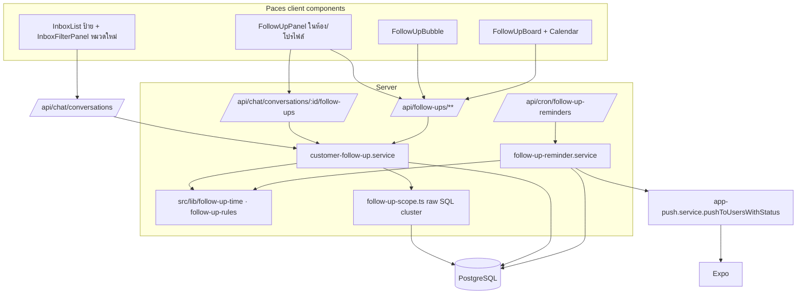
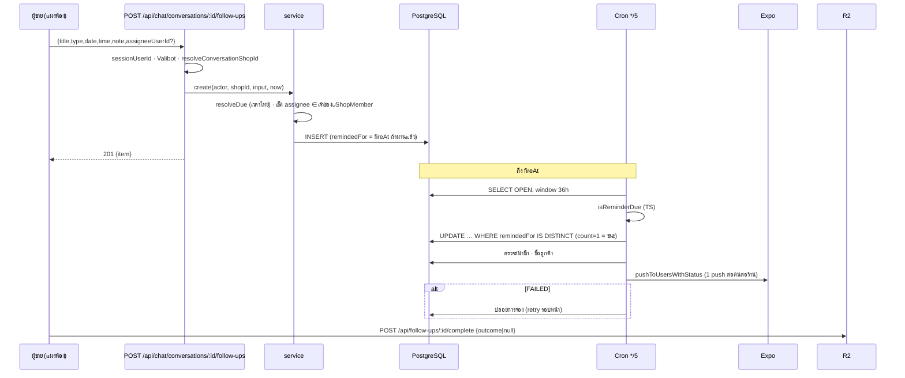

> **ประเภทเอกสาร:** System Design Spec (SDS) · **เวอร์ชัน:** 0.1 · **วันที่:** 2026-09-29 · **สถานะ:** Draft
> **เจ้าของ:** SA — **ออกแบบเรียบง่ายตามสถาปัตยกรรมเดิม ไม่เพิ่ม framework/dependency ใหม่**

# SDS: ติดตามลูกค้า

## 1. บทนำ
ออกแบบการสร้างสิ่งที่ [[SRS]] กำหนด stack จริง: Next.js 16 App Router · Prisma/PostgreSQL · NextAuth (session + service guard — ไม่มี RLS) · Vercel Cron · Expo Push. ก่อนเขียนโค้ดหน้าใด ๆ ให้ `node_modules/next/dist/docs/` ประกอบ (AGENTS.md: Next รุ่นนี้ต่างจากที่รู้).

## 2. Architecture

รูปแบบเดียวกับ `chat-crm.service` + route `crm/route.ts` (service รับ `shopId` แล้ว scope ใน WHERE; route เป็นคน resolve ร้านจาก session)

## 3. Component Design (ไฟล์ทั้งหมด — path เต็ม)
### 3.1 สร้างใหม่ (Backend / lib)
| ไฟล์ | หน้าที่ |
|---|---|
| `/Users/craftman/Projects/safepay-activity-chat/src/lib/follow-up-constants.ts` | `TITLE_MAX=200 NOTE_MAX=1000 LIST_MAX=200 DONE_IN_PANEL=3 CAL_MAX=1000 OPEN_SCAN_MAX=2000 BUBBLE_MAX=8 REMINDER_HOUR_ALLDAY=9 REMIND_WINDOW_MS=6h DUE_MIN_DAYS=-365 DUE_MAX_DAYS=730` + ค่า enum/ป้ายรหัส |
| `…/src/lib/follow-up-time.ts` | `resolveDue` `quickSnooze` `reminderFireAt` `reminderWindowEnd` (ใช้ `date-range.ts` เท่านั้น) |
| `…/src/lib/follow-up-rules.ts` | `isOverdue` `bucketOf` `isReminderDue` `initialRemindedFor` `filterStateOf` `countOpenAndLate` `bubbleModel` `panelModel` `isUnassigned` `buildReminderPush` `groupReminders` |
| `…/src/lib/follow-up-copy.ts` | ข้อความ push ไทย (แหล่งเดียว HR16) |
| `…/src/services/follow-up-scope.ts` | fragment SQL cluster key + `expandClusters(convIds)` `clusterKeysOf(convIds)` `conversationsByClusterKeys(keys)` |
| `…/src/services/customer-follow-up.service.ts` | CRUD + list* + `enrichWithFollowUpCounts` + `conversationIdsByFollowUpState` + error classes |
| `…/src/services/follow-up-reminder.service.ts` | `runFollowUpReminders(now)` |
| `…/src/app/api/follow-ups/_shared.ts` | `resolveFollowUpActor()` `mapFollowUpError()` |
| `…/src/app/api/follow-ups/[id]/route.ts` (PATCH,DELETE) · `[id]/complete|reopen|snooze/route.ts` · `mine/route.ts` · `board/route.ts` | Route Handlers |
| `…/src/app/api/chat/conversations/[id]/follow-ups/route.ts` | GET/POST (อยู่ใต้ `api/chat` เพราะผูกห้อง) |
| `…/src/app/api/cron/follow-up-reminders/route.ts` | cron |

### 3.2 แก้ไฟล์เดิม
| ไฟล์ | การแก้ |
|---|---|
| `prisma/schema.prisma` (+ `prisma/migrations/<ts>_customer_follow_up/`) | เพิ่ม model + back-relation `User`/`Shop`/`Conversation` |
| `src/lib/validations.ts` | `CreateFollowUpSchema` `UpdateFollowUpSchema` `CompleteFollowUpSchema` `SnoozeFollowUpSchema` `BoardQuerySchema` |
| `src/lib/expo-push.ts` | เพิ่ม `sendExpoPushWithStatus()` คืน `{ invalid, delivered }`; `sendExpoPush` เป็น wrapper คืน `invalid` (สัญญาเดิม) |
| `src/services/app-push.service.ts` | เพิ่ม `pushToUsersWithStatus(): 'SENT'\|'NO_TOKEN'\|'FAILED'`; `pushToUsers` เป็น wrapper คืน `void` |
| `vercel.json` | เพิ่ม cron `*/5 * * * *` |
| `src/services/chat.service.ts` | opts `followUp` ใน `listConversationsForShops` (ต่อจาก `:400-403`) |
| `src/app/api/chat/conversations/route.ts` | parse `?followUp=late,upcoming,done` (ต่อจาก `:217-220` แบบ `tags`) + เรียก `enrichWithFollowUpCounts` ต่อจาก `enrichWithCustomerBehavior` (`:304-308`) |
| `src/lib/seller-menu.ts` | เมนู `seller:follow-ups` (`:126`) + `BY_SLUG` (`:854`) + เทส `seller-menu.test.ts:47` |
| `src/i18n/dictionaries/th.ts` `en.ts` | `menu.followUps` + namespace `followUps` |
| `docs/20 - Features/00057…/BRD.md:400` `SRS.md:110` · `customers/[id]/page.tsx:98-101` · `customer-directory.ts:33` | ถ้อยคำ BR-CUSTP-07 (SRS §8) |
| `docs/SRS.md` | data model + API + enum (HR11) |

### 3.3 UI (ทุกชิ้นต้องผ่าน `safepay-ux` ก่อน — HR8; HR1 ต้องระบุ theme source)
| ไฟล์ (ใหม่) | ที่ตั้ง | theme/พี่น้องที่ต้องอ่าน |
|---|---|---|
| `FollowUpCard.tsx` (การ์ด + ปุ่มชุดเดียว) · `FollowUpFormDialog.tsx` · `CompleteMenu`/`SnoozeMenu` | `src/app/(paces)/seller/_follow-up/` **[ยังไม่ยืนยันโฟลเดอร์ shared ที่ถูก — ดู Explore ในแผน]** | ต้อง Explore |
| `FollowUpPanel.tsx` (แผงหัว "ติดตามลูกค้า (n)") | `…/(chat)/inbox/[conversationId]/components/` ข้าง `CustomerCrmSection.tsx` และเข้า `CustomerPanelSheet.tsx` (มือถือ) | พี่น้อง: `CustomerCrmSection.tsx` (sibling-surface-parity) |
| `FollowUpBubble.tsx` | mount ใน `…/(chat)/layout.tsx` (เหนือ `<div className='chat-shell …'>` `:253` หรือใน `.chat-body` `:284`) | ต้อง Explore (floating button ใน Paces) |
| `…/(dashboard)/follow-ups/page.tsx` + `FollowUpBoard.tsx` + `FollowUpCalendar.tsx` | `src/app/(paces)/seller/(dashboard)/follow-ups/` | ต้อง Explore: Paces kanban/calendar; พี่น้อง: `queues/` (ปฏิทินคิว 00024) |
| section ใน `customers/[id]/page.tsx` | `…/(dashboard)/customers/[id]/` | พี่น้อง: sections เดิมในหน้าเดียวกัน |
| ป้ายใน `InboxList.tsx` + หมวดใน `InboxFilterPanel.tsx` | `…/(chat)/inbox/components/` | พี่น้อง: ชิป `orderStage` ในแถวเดียวกัน; หมวด `tags` `:308` |
| `FollowUpShopAutoSwitch.tsx` | ข้าง `ChatShopAutoSwitch.tsx` | Base: `ChatShopAutoSwitch.tsx` (กด noti กองรวมของอีกร้าน) |

## 4. Data Flow
### 4.1 สร้าง + ถึงกำหนด + ปิด

### 4.2 แผงห้อง (อ่าน)
`GET …/follow-ups` → `resolveConversationShopId` → `expandClusters([conversationId], shopId)` (raw SQL §SRS TFR-004) → `prisma.customerFollowUp.findMany({ where:{ shopId, conversationId:{in:ids}, status:'OPEN' }, orderBy:{dueAt:'asc'}, take:LIST_MAX })` + DONE `take:3 orderBy doneAt desc` → เพิ่ม `roomLabel` ให้รายการที่มาจากห้องอื่น → `panelModel(items, now)` คืน `{ openCount, lateCount, expanded }`.

### 4.3 ป้ายแถวห้อง (ก้อนเดียว)
```sql
SELECT a."id" AS anchor, f."id", f."dueAt", f."allDay"
FROM "Conversation" a
LEFT JOIN "ExternalContact" ea ON ea."id" = a."externalContactId"
JOIN "Conversation" b ON b."shopId" = a."shopId"
LEFT JOIN "ExternalContact" eb ON eb."id" = b."externalContactId"
 AND <cluster key ของ b> = <cluster key ของ a>   -- fragment เดียวกัน
JOIN "CustomerFollowUp" f ON f."conversationId" = b."id" AND f."status" = 'OPEN'
WHERE a."id" = ANY($1::text[]) AND a."shopId" = ANY($2::text[])
```
คืนแถวแคบ → TS `countOpenAndLate` ต่อ anchor. (ผู้ implement เขียน join ให้ถูกไวยากรณ์ — สาระคือ "คีย์เดียวกันจาก fragment เดียว" ห้ามคัดลอกเงื่อนไขไปเขียนซ้ำ)

### 4.4 ตัวกรองกล่องแชท
OPEN rows ของ `shopIds` + `DISTINCT conversationId` ของ DONE → `clusterKeysOf` → aggregate ต่อคีย์ → `filterStateOf` → `conversationsByClusterKeys(matchedKeys)` → `id IN (…)` เข้า `orParts` เหมือน `shipment`.

### 4.5 Failure / ชดเชย
- cron ตายกลางรอบ: การจองที่ทำแล้วแต่ยังไม่ส่ง = หายเงียบ (at-most-once) ⇐ ยอมรับหน้าต่างเล็ก (ตายระหว่าง reserve↔send ไม่กี่ ms-วินาที); ทางเลือก at-least-once ตัดทิ้ง (TD-FU-3)
- FAILED → ปล่อยการจองภายในหน้าต่าง (SRS TFR-011)

## 5. Integration Points
| จุดเชื่อม | ชนิด | สัญญา | ล่มแล้ว |
|---|---|---|---|
| Expo Push | 3rd-party | `sendExpoPush*` `expo-push.ts:43` | เตือนไม่ถึง; ปล่อยการจอง/ยังเห็นใน bubble |
| แอปผู้ขาย | external | `data.url` path | A-FU-1 |
| Vercel Cron | platform | `Bearer CRON_SECRET` | ไม่มีเตือนจนรอบถัดไป (หน้าต่างชดเชย 6 ชม.) |
| `resolveChatScope` | internal | `chat-scope.ts:63` | — |
- Timeout/retry: ไม่ retry ใน request ของผู้ใช้; cron เป็นตัว retry (ผ่านการปล่อยจอง)

## 6. Technical Decisions
### TD-FU-1: ผูกห้อง คำนวณ cluster ตอนอ่าน ไม่เก็บ customerId
- **เลือก:** `conversationId` FK อย่างเดียว + cluster key ตอนอ่าน · **เหตุผล:** relink (`order.service.ts:179-192`) แล้วตามไปเอง (AC-ACT-29) ไม่มี migration ย้ายข้อมูล · **ตัดทิ้ง:** ผูก `contactId` แบบ gochat (Deep ไม่มีตัวตนลูกค้ารวมที่เสถียรต่อห้อง DEEP; ผูกแล้วต้องย้ายเมื่อ relink) · **ผล:** ต้องมี index สองตัวบนตารางเดิม + fragment SQL เดียว

### TD-FU-2: นิยาม overdue/bucket อยู่ TS ที่เดียว ไม่เขียน SQL คู่
- **เหตุผล:** HR16 — สองนิยามคือบั๊กรอเกิด; BRD ยอมให้เขียนซ้ำ + parity แต่ปริมาณ OPEN ต่อร้านเล็ก (ตัวเลขจริง: ยังไม่วัด **[ยังไม่ยืนยัน]** — ต้องไม่ดึงเกิน `OPEN_SCAN_MAX`) จึงดึงแล้วคำนวณใน TS ได้ · **ตัดทิ้ง:** SQL `CASE` + เทส parity กับ DB (พอทำได้แต่ต้องมีฐาน localhost ในเทสและยังเป็นสองที่) · **ผล:** ต้องแก้ AC-ACT-21 (S-3); ถ้า OPEN scan เกินเพดานให้ขึ้น `truncated`

### TD-FU-3: กันซ้ำแบบ "จองก่อนส่ง" ด้วย `remindedFor` เทียบ fireAt
- **เลือก:** คอลัมน์ `remindedFor` = fireAt ที่เคยจอง; เตือนได้ก็ต่อเมื่อ `remindedFor IS DISTINCT FROM fireAt` ⇒ **แก้/เลื่อนเวลา re-arm เองโดยไม่ต้องมีโค้ด reset ในทุกทางเขียน** (ทางเขียนใหม่ที่ลืมก็ยังถูก) · ผูกเงื่อนไข `dueAt/allDay` ตอนจอง กันแข่งกับการเลื่อน · **ตัดทิ้ง:** boolean `reminded` (ต้อง reset ทุกทาง = guard หายทั้งคลาส) · ส่งก่อนจอง (ซ้ำข้าม instance) · **ผล:** at-most-once; ชดเชยด้วยปล่อยจองเมื่อ FAILED (TD-FU-4)

### TD-FU-4: `pushToUsersWithStatus` (additive)
- `sendExpoPush` กลืน error เอง (`expo-push.ts:78-80`) และ `pushToUsers` คืน `void` ⇒ ตรวจไม่ได้ว่าล้ม → เพิ่ม variant ที่คืนสถานะ ตัวเดิมเป็น wrapper (สัญญาเดิมไม่เปลี่ยน) · `delivered = res.ok` · **ตัดทิ้ง:** แก้ตัวเดิมให้คืนค่า (ผู้เรียกเดิม 10+ ที่ต้องไล่)

### TD-FU-5: Route Handler ไม่ใช่ server action
ตามแพตเทิร์นจริง `src/app/api/chat/**` (34 route) + `guardApi` ครอบ `/api/*` (CSRF Origin + rate-limit)

### TD-FU-6: client ส่ง `{date,time}` เวลาไทย ไม่ส่ง timestamp; preset ให้ server คำนวณ
แก้ช่องโหว่ gochat `quickWhen()` ที่ต้นทาง — เขตเวลาเครื่องผู้ใช้ไม่เข้าเส้นทางเขียนเลย (`BR-ACT-12`); ⚠️ ตัวแสดงผลบนหน้าจอใช้ `formatDate/formatDateTime` (Thai tz — `format-date.ts:49,58`) เสมอ ห้าม `toLocaleString`

### TD-FU-7: bubble = client component เดียวใน `(chat)/layout.tsx` fetch เอง
ไม่มี realtime (BRD); ไม่ต้องยัดข้อมูลผ่าน RSC ของ layout (ที่มี fetch หนักอยู่แล้ว `layout.tsx:155-215`); session ไม่มี id → endpoint 401 → component render `null`; ซ่อนตอนเปิดห้องบนมือถือด้วย `usePathname` + `bubbleModel({ isMobile, inThread })` (ฟังก์ชันบริสุทธิ์ BR-ACT-21)

### TD-FU-8: `shopId` ของ noti board ต้องสลับร้านให้
url กอง = `/follow-ups?mine=1&shopId=X`; หน้า `/follow-ups` อ่าน `shopId` → intersect ด้วย `scope.shopIds` (`chat-scope.ts:166`) → ถ้า SINGLE mode และไม่ตรงร้าน active ⇒ `FollowUpShopAutoSwitch` (Base `ChatShopAutoSwitch`) ⇒ E7

### TD-FU-9: ป้ายแถวและตัวกรองไม่ใช้ Prisma relation filter
เกณฑ์ "ทั้ง cluster" แสดงใน `where` ตรง ๆ ไม่ได้ (บทเรียนเดียวกับ `conversationIdsByShipmentState` `chat.service.ts:208-219`) → raw SQL ดึง id/คีย์ แล้ว `id IN`

## 7. Traceability
| SRS | SDS |
|---|---|
| TFR-002 | TD-FU-6, follow-up-time.ts |
| TFR-003 | TD-FU-2, follow-up-rules.ts |
| TFR-004 | TD-FU-1/9, follow-up-scope.ts, §4.2–4.4 |
| TFR-005 | _shared.ts, resolveConversationShopId |
| TFR-011 | TD-FU-3/4, §4.1, reminder.service |
| TFR-014 | §3.2 seller-menu, TD-FU-8 |
| NFR ป้ายแถว | §4.3 |

## 8. สรุป / ลำดับ build
1. migration (database agent) → 2. lib+test ∥ push additive → 3. scope+service → 4. API → 5. cron → 6. i18n contract → 7. UI (ux gate ก่อน) แผงห้อง/การ์ดกลาง → ∥ bubble / กระดาน / โปรไฟล์ / ป้ายแถว-ตัวกรอง
**Open:** S-1, S-2, S-3, A-FU-1 (SRS §10); ตำแหน่งโฟลเดอร์ shared ของการ์ด UI; ตัวเลข OPEN ต่อร้านจริงบน prod (อ่านอย่างเดียวผ่าน Supabase PAT ตาม memory `reference_prod_readonly_sql_via_supabase_pat`)
