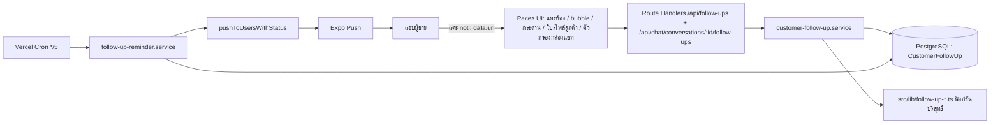
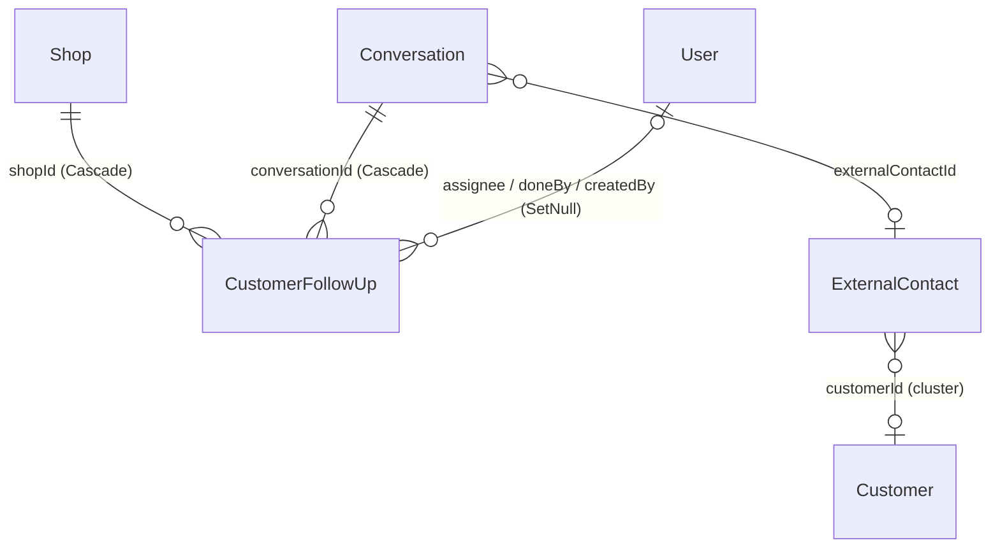

> **โมดูล:** 00066 — Customer Follow-up Activities ("ติดตามลูกค้า")
> **ประเภทเอกสาร:** Software Requirements Specification (SRS) — TECHNICAL
> **เวอร์ชัน:** 0.1 · **วันที่จัดทำ:** 2026-09-29 · **สถานะ:** Draft (รอ user รีวิว + database/ux gate)
> **เจ้าของเอกสาร:** SA (`safepay-planner`)
> **อ้างอิงโค้ดจาก worktree:** `/Users/craftman/Projects/safepay-activity-chat` — ทุก `path:line` ในเอกสารนี้เปิดอ่านแล้ว ส่วนที่ไม่ได้ยืนยันติดป้าย **[ยังไม่ยืนยัน]**

# SRS: ติดตามลูกค้า

---

## 1. บทนำ

### 1.1 วัตถุประสงค์
กำหนดข้อกำหนดเชิงเทคนิคของฟีเจอร์ "ติดตามลูกค้า" เพื่อให้ DEV/QA นำไป implement ได้โดยไม่ต้องตัดสินใจโครงข้อมูล / ขอบเขตร้าน / เวลาไทย / กลไกกันส่ง push ซ้ำ trace กลับ FR/BR/AC ใน [[BRD]] ได้ทุกข้อ

### 1.2 ขอบเขตเชิงระบบ
- **อยู่ใน:** ตาราง `CustomerFollowUp` · service layer · Route Handlers · cron ส่ง push · ฟังก์ชันบริสุทธิ์ใน `src/lib` · 5 พื้นผิว UI · เมนู `seller-menu.ts` · i18n TH/EN · การแก้ถ้อยคำ BR-CUSTP-07 ของ 00057
- **นอก:** การส่งอะไรหาลูกค้า · ช่องเงิน · ลากการ์ด · สร้างจากปฏิทิน · ห้องกลุ่ม · ตัวรวมลูกค้า (มีแต่กติกา BR-ACT-22) · สวิตช์แจ้งเตือนแยก · แก้แอปมือถือ

### 1.3 เอกสารอ้างอิง
| เอกสาร | ความสัมพันธ์ |
|---|---|
| [[PRD]] / [[BRD]] §13.3 | ที่มาของ FR/BR/AC และมติ user Q1/Q2/Q4/Q5 |
| [[REFERENCE-gochat-v3]] | ต้นแบบ (ระบบอื่น — แปลงเป็นโมเดล Deep แล้ว) |
| `docs/conventions/session-exists-is-not-identity.md` · `sibling-surface-parity.md` · `ui-boolean-needs-a-testable-home.md` · `known-limitation-vs-unfinished.md` · `migration-check-constraint-additive.md` | กติกาที่บังคับ |
| `docs/20 - Features/00057 - Customer Profile & Risk/BRD.md:400` | BR-CUSTP-07 ที่ต้องแก้ถ้อยคำ (§8) |

### 1.4 นิยาม
| คำ | ความหมายเชิงเทคนิค |
|---|---|
| **fireAt** | เวลาที่ระบบควรเตือน = `allDay ? dueAt + 9h : dueAt` (`dueAt` ของ allDay คือเที่ยงคืนไทย) |
| **cluster ของห้อง** | ชุดห้องที่ "ลูกค้าเดียวกัน" ในร้านเดียวกัน = ห้องที่ผู้ติดต่อชี้ `ExternalContact.customerId` เดียวกัน; ห้องที่ไม่มี `customerId` (รวม DEEP) = cluster ของตัวเองห้องเดียว |
| **cluster key** | `COALESCE(c."shopId" \|\| ':' \|\| e."customerId", 'v:' \|\| c."id")` — คีย์เดียวที่ใช้ทุก query |
| **OPEN scan** | ดึงแถว `status='OPEN'` ตามขอบเขตร้านมาคำนวณ overdue/bucket ใน TS |

---

## 2. สถาปัตยกรรม

### 2.1 บริบทระบบ


### 2.2 องค์ประกอบ
| Component | หน้าที่ | ที่อยู่ |
|---|---|---|
| `follow-up-time.ts` | เวลาไทยล้วน: `resolveDue` `quickSnooze` `reminderFireAt` | `src/lib/` (ใหม่) |
| `follow-up-rules.ts` | `isOverdue` `bucketOf` `isReminderDue` `filterStateOf` `bubbleModel` `panelModel` | `src/lib/` (ใหม่) |
| `follow-up-constants.ts` | เพดาน/ค่าคงที่ (TITLE_MAX ฯลฯ) | `src/lib/` (ใหม่) |
| `customer-follow-up.service.ts` | CRUD + query ขอบเขต cluster + board/calendar | `src/services/` (ใหม่) |
| `follow-up-scope.ts` | raw SQL cluster (fragment เดียว) | `src/services/` (ใหม่) |
| `follow-up-reminder.service.ts` | cron: หา → จอง → จัดกลุ่ม → ส่ง → ปล่อยจองถ้าล้ม | `src/services/` (ใหม่) |
| Route Handlers | validate (Valibot) · resolve ร้าน · map error | `src/app/api/follow-ups/**`, `src/app/api/chat/conversations/[id]/follow-ups/route.ts`, `src/app/api/cron/follow-up-reminders/route.ts` |

### 2.3 Deploy
Vercel serverless เดียวกับส่วนอื่น · cron ประกาศใน `vercel.json:12-27` เพิ่มบรรทัด `{ "path": "/api/cron/follow-up-reminders", "schedule": "*/5 * * * *" }` (มีแบบเดียวกันแล้ว `iship-status-sync` `:21`, และรายนาทีที่ `chat-outbox` `:23`) · **push ขึ้น `main` = migrate + cron ขึ้น prod ในตัว (HR15) ต้องแจ้ง user ก่อน**

---

## 3. ข้อกำหนดเชิงฟังก์ชันเชิงเทคนิค (TFR)

### TFR-001: โครงข้อมูล
- **Trace:** FR-ACT-01..05, BR-ACT-01/02/06/11 · **รายละเอียด:** ดู §5 และ `=====DB-DRAFT=====`
- ค่า enum เป็น `String` + CHECK (convention เดียวกับ `Order.status` ในโปรเจกต์ — `ShopMember.role` `schema.prisma:1357`) ไม่ใช้ Prisma enum
- ค่า: `type ∈ {FOLLOW_UP, MEET_CUSTOMER, OTHER}` · `status ∈ {OPEN, DONE}` · `outcome ∈ {REACHED, NO_ANSWER, CALL_LATER, NOT_INTERESTED}`
- 🛑 ห้ามใช้ `Activity`/`ACTIVITY` ในชื่อ model/ไฟล์/ค่า (BR-ACT-20) และไม่ใช้ `APPOINTMENT` เป็นค่า enum (ชนคำของ 00024)

### TFR-002: การแปลงวัน-เวลา (BR-ACT-03, BR-ACT-12)
- client **ไม่ส่ง timestamp** — ส่ง `{ date: 'YYYY-MM-DD', time: 'HH:mm' | null }` เป็นเวลาไทยล้วน (`time=null` ⇒ allDay)
- `resolveDue(input): { dueAt: Date; allDay: boolean }` = `thaiMidnightUtc(y,m-1,d)` (+ `h*3600000 + min*60000` ถ้ามีเวลา) — ใช้ `thaiMidnightUtc` `src/lib/date-range.ts:53` เท่านั้น ห้ามคำนวณ offset เอง (คอมเมนต์ `:49-52`)
- ปฏิทินที่ไม่มีจริง (`2026-02-30`) ⇒ throw `FollowUpDueError`; ช่วงที่ยอมรับ `[วันนี้ไทย − 365 วัน, วันนี้ไทย + 730 วัน]` (E14 อนุญาตย้อนหลัง; เพดานกันค่าเพี้ยน) — ตัวเลขนี้เป็นข้อเสนอ ปรับได้ที่ `follow-up-constants.ts`
- ปุ่มลัดเลื่อน **ไม่ส่งเวลา** — ส่ง `preset` ให้ server คำนวณจาก `now` ของ server (ตัดปัญหานาฬิกาเครื่องผู้ใช้เพี้ยนทั้งหมด ต่างจาก gochat `quickWhen()`)
  - `TOMORROW_9` → `thaiTodayBounds(now).to + 9h` (มีเวลา) · `IN_3_DAYS` → `thaiTodayBounds(now).from + 3d` (allDay) · `NEXT_WEEK` → `from + 7d` (allDay, A5)
  - +N วัน = บวก `N*86400000` ms ได้เพราะไทยไม่มี DST (`date-range.ts:18` `TZ_OFFSET_MS` คงที่)
- **invariant:** `allDay ⇒ dueAt` คือเที่ยงคืนไทยพอดี — บังคับด้วย CHECK ในฐานข้อมูล (§5) ไม่ใช่แค่ในโค้ด

### TFR-003: นิยาม "เลยกำหนด" และ bucket — TS ที่เดียว (BR-ACT-08/09, TD-FU-2)
```ts
isOverdue(f: {status, dueAt, allDay}, now: Date): boolean
  // status !== 'OPEN' → false เสมอ (ตรวจก่อนเงื่อนไขเวลา — AC-ACT-19)
  // allDay: now >= dueAt + 24h   (ขึ้นวันใหม่ไทย)
  // มีเวลา: dueAt < now          (AC-ACT-17: 10:00:00 ยังไม่เลย, 10:00:00.001 เลย)
bucketOf(f, now): 'late'|'today'|'week'|'later'|'done'
  // DONE → 'done' เสมอ (ไม่เข้า 4 bucket — AC-ACT-19)
  // isOverdue → 'late'; dueAt < thaiTodayBounds(now).to → 'today';
  // dueAt < to + 7d → 'week'; else 'later'   (AC-ACT-20)
```
- 🛑 **ไม่มี SQL ที่ตัดสิน overdue/bucket** — ทุกที่ที่ต้องรู้ "เลยกำหนดไหม" ดึงแถว OPEN (คอลัมน์แคบ) มาให้ `isOverdue` (TD-FU-2). SQL มีได้เฉพาะ pre-filter แบบ superset ที่ประกาศชัด (cron §TFR-011, bubble `dueAt < endOfTodayThai`) ซึ่ง TS ตรวจซ้ำเสมอ
- ⇒ **AC-ACT-21 (parity SQL↔TS) ถูกแทนด้วย:** "ไม่มีนิยามที่สอง" พิสูจน์ด้วยเทสสแกนซอร์ส `[blocker]` (ห้ามมี `interval '24 hours'`/`AT TIME ZONE`/เทียบ `dueAt` กับ `now` ใน `customer-follow-up*.ts` นอก pre-filter ที่ allow-list) — **ต้องแก้ถ้อยคำ AC-ACT-21 ใน BRD พร้อมกัน (HR11)**

### TFR-004: ขอบเขต "ลูกค้าเดียวกัน" (BR-ACT-10, BR-ACT-16)
- ความสัมพันธ์ "ห้อง a, b เป็นลูกค้าเดียวกัน" เป็น **equivalence relation** (cluster key เท่ากัน) ⇒ ทุก query ใช้ cluster key จาก fragment เดียว (`follow-up-scope.ts`) ห้ามเขียน join ความสัมพันธ์เองที่อื่น
- ขอบเขต = ในร้านเดียวกัน (`shopId` เป็นส่วนของคีย์) — ลูกค้าคนเดียวข้ามร้าน (Customer ไม่ผูกร้าน `schema.prisma:1107`) **ไม่ถูกรวม**
- คำนวณตอนอ่าน ไม่เก็บ customerId ลงรายการ ⇒ `relinkThreadCustomer` (`order.service.ts:179-192` ซึ่งทำ `externalContact.update({customerId})`) ทำให้รายการตามไปเอง (AC-ACT-29)
- SQL (panel — ห้องที่เกี่ยวข้องของห้อง `$1` ในร้าน `$2`):
```sql
WITH me AS (
  SELECT COALESCE(c."shopId" || ':' || e."customerId", 'v:' || c."id") AS k
  FROM "Conversation" c LEFT JOIN "ExternalContact" e ON e."id" = c."externalContactId"
  WHERE c."id" = $1 AND c."shopId" = $2)
SELECT c2."id" FROM "Conversation" c2
LEFT JOIN "ExternalContact" e2 ON e2."id" = c2."externalContactId"
WHERE c2."shopId" = $2
  AND COALESCE(c2."shopId" || ':' || e2."customerId", 'v:' || c2."id") = (SELECT k FROM me)
```
- counts แบบก้อนเดียว (`countsForConversations`) ใช้ fragment เดียวกัน join ตาม anchor (§4 SDS 4.3)
- **ห้อง DEEP:** cluster ของตัวเอง (BR-ACT-10, AC-ACT-30) — ⚠️ ต่างจากฟีเจอร์เดิม `conversationIdsByShipmentState` ที่ผูก DEEP กับลูกค้าผ่าน `Customer.userId` (`chat.service.ts:251-252`) → คำถาม **S-2** (§10)

### TFR-005: สิทธิ์และตัวตน (BR-ACT-01/04/05)
- ทุก route: `getServerSession(authOptions)` → `sessionUserId(session)` (`src/lib/session-user.ts:20`) → `null` ⇒ **401** (AC-ACT-08/E15) ห้าม cast `(session.user as {id}).id`
- resolve ร้านของ **ห้อง**: `resolveConversationShopId(session, conversationId)` (`src/lib/chat-scope.ts:126`) ⇒ คืน `null` เท่ากันทั้ง "ไม่มีห้อง"/"ไม่มีสิทธิ์" ⇒ **404** (AC-ACT-03)
- resolve ร้านของ **รายการ**: `prisma.customerFollowUp.findFirst({ where: { id, shopId: { in: scope.shopIds } }, select: { shopId } })` — scope ใน WHERE ตั้งแต่ query แรก (ไม่ดึงแล้วเช็คทีหลัง) ⇒ ไม่พบ = **404** (AC-ACT-05) — `scope` จาก `resolveChatScope` (`chat-scope.ts:63`) ตามกฎ `chat-scope.ts:12-18` (โฟลเดอร์ `api/chat/**` ห้ามเรียก `requireActiveShop` ตรง ๆ) และ route ใต้ `api/follow-ups/**` ใช้ตัวเดียวกันเพื่อให้กติกาเดียว
- ผู้รับผิดชอบ: อนุญาตเฉพาะ `Shop.userId ∪ ShopMember.userId` ของ **ร้านของห้อง** (BR-ACT-04) ตรวจใน service ทุกครั้งที่ตั้ง/แก้ (ไม่เชื่อ client) — ร้าน PERSONAL ⇒ ค่าเดียวที่ผ่านคือเจ้าของ (AC-ACT-07). FK พังตอน insert (`P2003`) ⇒ map เป็น `AssigneeNotMemberError`
- สิทธิ์เท่ากันทุกคนที่เข้าร้านได้ ไม่เทียบผู้สร้าง (BR-ACT-05/Q7) — service ไม่มี branch "เจ้าของรายการ"
- **package lock (`activeLocked`)**: ไม่ gate (ข้อมูลภายในร้าน ไม่ใช่การส่งข้อความ) — สมมติฐาน A-FU-4 / คำถาม S-1

### TFR-006: สร้าง (FR-ACT-01)
- input Valibot: `title` trim 1–200 · `type` picklist (ตั้งต้น FOLLOW_UP) · `date` · `time|null` · `note` trim ≤1000 (ว่าง→null) · `assigneeUserId?` (uuid)
- เขียน `createdByUserId = actor`; `assigneeUserId = input ?? actor`
- `remindedFor` ตอนสร้าง: ถ้า `fireAt <= now` ⇒ ตั้ง `remindedFor = fireAt` (กัน push ทันที — AC-ACT-39/E14) มิฉะนั้น `null`

### TFR-007: แก้ (FR-ACT-02)
- PATCH partial: `undefined` = ไม่แตะ (รวม `assigneeUserId` — AC ของ FR-ACT-02); ส่ง `null` ให้ assignee = **ปฏิเสธ** (ไม่มีการล้างผู้รับผิดชอบ; ว่างได้เฉพาะจากบัญชีถูกลบ)
- `status='DONE'`: แก้ได้เฉพาะ `title`/`note` (A6) — key อื่นที่มีค่า ⇒ `FollowUpStateError` (409)
- เปลี่ยน `date`/`time` ⇒ คำนวณ `dueAt/allDay` ใหม่ + ใช้กติกา `remindedFor` เดียวกับ TFR-006; **ไม่แตะ `snoozeCount`** (AC-ACT-13)

### TFR-008: ปิด / เปิดกลับ / เลื่อน / ลบ (FR-ACT-03/04/05)
| การกระทำ | กลไก | ผลซ้ำ/แข่ง |
|---|---|---|
| complete(outcome\|null) | `updateMany({ where: { id, shopId∈scope, status:'OPEN' }, data:{ status:'DONE', outcome, doneAt:now, doneByUserId:actor } })` | count=0 ⇒ อ่านแถว: ถ้า DONE คืนแถวปัจจุบัน **ไม่เขียนทับผู้ปิด** (E9/E18), ไม่ใช่ ⇒ 404 |
| reopen | `$transaction`: อ่านแถว → `updateMany({ where:{ id, shopId∈scope, status:'DONE' } })` ล้าง `outcome/doneAt/doneByUserId` + กติกา `remindedFor` | ซ้ำ = คืนแถวเดิม |
| snooze(preset\|custom) | `updateMany({ where:{ …, status:'OPEN' }, data:{ dueAt, allDay, snoozeCount:{ increment:1 }, remindedFor: rule } })` | count=0 และแถวเป็น DONE ⇒ `FollowUpStateError` (AC-ACT-12) |
| delete | `deleteMany({ where:{ id, shopId∈scope } })` | count=0 ⇒ 404 (client ถือ 404 ของ DELETE เป็นสำเร็จ — E18) |

### TFR-009: อ่าน 5 พื้นผิว (FR-ACT-06..10) — ผูกกับ service เดียว
| พื้นผิว | ฟังก์ชัน service | หมายเหตุ |
|---|---|---|
| a. แผงห้อง | `listForConversation(conversationId, shopId, now)` | OPEN ทั้งหมดของ cluster (เพดาน 200) + DONE 3 ใบล่าสุด + `assignees` (BUSINESS) |
| b. bubble | `listMine(scopeShopIds, userId, now)` | OPEN ∧ assignee=ฉัน ∧ `dueAt < endOfTodayไทย` (superset) → TS กรอง `bucketOf ∈ {late,today}` → ตัด 8 แถว + `lateCount` |
| c. กระดาน | `listBoard(params, now)` | OPEN scan (≤ `OPEN_SCAN_MAX`=2000) + DONE ใน 7 วัน (≤200) |
| c. ปฏิทิน | `listCalendarMonth(params)` | ช่วง `[thaiMidnightUtc(y,m,1), thaiMidnightUtc(y,m+1,1))` ทุกสถานะ `take: 1001` → คืน 1000 + `truncated` (AC-ACT-23) |
| d. โปรไฟล์ลูกค้า | `listForCustomerProfile(shopId, entry, now)` | seed = `entry.orders[].conversationId` (+ห้องของ `customerId` ถ้าคีย์ `c-`) → ขยาย cluster |
| e. ตัวกรอง/ป้ายแถว | `enrichWithFollowUpCounts(items, shopIds, now)` · `conversationIdsByFollowUpState(shopIds, states, now)` | ก้อนเดียว (§ SDS 4.3) |
- ตัวเลขที่โผล่หลายจอ (หัวแผง = ป้ายแถว = ตัวเลขกระดาน — AC-ACT-22) มาจาก **`countOpenAndLate(rows, now)`** ฟังก์ชันเดียวใน `follow-up-rules.ts`
- กระดาน: ตัวเลขต่อคอลัมน์/ต่อคนคำนวณจาก OPEN scan **ก่อน** ใช้ตัวกรอง (AC-ACT-26); ตัวกรอง = ผู้รับผิดชอบ (`mine`/userId/`unassigned`) · แท็ก (OR, ผ่าน cluster: ห้องใดใน cluster ติดแท็ก) · ค้นชื่อ (`contains` mode insensitive กับ `alias` / `externalContact.name` / `buyer.displayName` ของห้องของรายการ — Prisma escape `%`/`_` ให้; **พิสูจน์ด้วยเทส AC-ACT-24**) · ค่าใน URL ที่ parse ไม่ได้/ไม่ใช่ของร้าน = ไม่กรอง (AC-ACT-25)
- "ยังไม่มีคนรับ" = `assigneeUserId IS NULL` **หรือ** ไม่อยู่ในสมาชิกปัจจุบันของร้านนั้น (BR-ACT-11/Q9) — ตัดสินในตัวเดียว `isUnassigned(row, memberIdsByShop)`

### TFR-010: ตัวกรองกล่องแชท (FR-ACT-10, BR-ACT-19)
- state ต่อ cluster จาก `filterStateOf({ open, late, done }): 'late'|'upcoming'|'done'|null`:
  `late` = open≥1 ∧ late≥1 · `upcoming` = open≥1 ∧ late=0 · `done` = open=0 ∧ done≥1 (AC-ACT-43)
- ต่อกับ `listConversationsForShops` แบบเดียวกับ `shipment` (`chat.service.ts:400-403`: ดึง id แล้ว `orParts.push({ id: { in: ids } })`) เพิ่ม opts `followUp?: ('late'|'upcoming'|'done')[]` (OR ในหมวด) — AND กับหมวดอื่น เป็นผลของ `orParts` เดิม
- นับเป็น 1 ตัวกรองใน `countActiveFilters` (`InboxFilterPanel.tsx:40-47`) และมีตัวเลขต่อค่า (นับ cluster → ห้อง)

### TFR-011: cron เตือน (FR-ACT-11, BR-ACT-13)
`GET /api/cron/follow-up-reminders` · `maxDuration = 60` · auth เหมือน `auto-order-sweeper/route.ts:28-33` (env ว่าง ⇒ 401; ไม่เทียบ `Bearer undefined`)
1. **หา:** `findMany({ where:{ status:'OPEN', assigneeUserId:{ not:null }, shop:{ deletedAt:null, purgedAt:null }, dueAt:{ gt: now−36h, lte: now } }, orderBy:{dueAt:'asc'}, take: 500 })` — pre-filter แบบ superset (allDay ที่ fireAt = dueAt+9h ต้องอยู่ในหน้าต่าง 36 ชม.)
2. **ตัดสิน (TS):** `isReminderDue(row, now)` = `fireAt ≤ now ∧ now ≤ windowEnd ∧ row.remindedFor ≠ fireAt` โดย `windowEnd` = `fireAt + 6h` (มีเวลา) / `dueAt + 24h` (allDay = ภายในวันเดียวกัน) (BR-ACT-13.5, ข้อเสนอ Q10)
3. **จอง (กันซ้ำข้าม instance — AC-ACT-31/32):**
   `updateMany({ where:{ id, status:'OPEN', dueAt: row.dueAt, allDay: row.allDay, OR:[{ remindedFor:null },{ remindedFor:{ not: fireAt } }] }, data:{ remindedFor: fireAt, remindedAt: now } })` ⇒ `count===1` เท่านั้นที่ส่ง (เงื่อนไข `dueAt`/`allDay` เท่ากับที่อ่านมา ⇒ ถ้าผู้ใช้เลื่อนระหว่างทางการจองล้มเอง)
4. **กรองผู้รับ:** หลังจอง ตรวจว่า `assigneeUserId` ยังเป็น `Shop.userId ∪ ShopMember` (1 query ต่อ batch) ไม่ใช่ ⇒ ทิ้ง (AC-ACT-36) — ไม่ error ทั้งรอบ (try/catch ต่อกลุ่ม)
5. **จัดกลุ่ม** `(shopId, assigneeUserId)` ⇒ 1 push ต่อคนต่อร้านต่อรอบ (AC-ACT-37)
   - 1 รายการ: `title="ติดตามลูกค้า"`, `subtitle=ชื่อลูกค้า` (จาก `getConversationToastPreview` — alias ชนะชื่อจริง `seller-push.service.ts:107-110`), `body=หัวข้อรายการ` (ตัด ≤60 ตัวอักษร) , `data={ type:'follow-up', url:'/inbox/{conversationId}', shopId, conversationId, followUpId }`
   - >1: `body="มี {n} รายการถึงกำหนด"`, `url='/follow-ups?mine=1&shopId={shopId}'`
   - 🛑 payload ไม่มี `note` ไม่มีเบอร์ (AC-ACT-38) — สร้างผ่าน `buildReminderPush()` ที่รับเฉพาะ field ที่ allow-list
6. **ส่ง:** `pushToUsersWithStatus([assigneeUserId], …)` (TD-FU-4) — ไม่หัก `chatEnabled` (มติ Q2) ⇒ ไม่เรียก `shopAudience` (`seller-push.service.ts:39`, ซึ่งหักคนที่ปิดแชท)
   - `'SENT'` → จบ · `'NO_TOKEN'` → คงการจอง (ไม่มีอุปกรณ์ให้ส่ง; ไม่วนซ้ำ) · `'FAILED'` → **ปล่อยการจอง** `updateMany({ where:{ id, remindedFor: fireAt }, data:{ remindedFor: prev } })` ให้รอบถัดไปภายในหน้าต่างส่งซ้ำ (AC-ACT-41)
7. **หลักฐาน (BR-ACT-13.8):** คอลัมน์ `remindedFor`/`remindedAt` + response JSON `{ scanned, due, reserved, sent, noToken, failed, droppedNonMember }` (Vercel plan นี้ query runtime log ย้อนหลังไม่ได้ — ดู CLAUDE.md 2026-08-08 รอบค่ำ)
8. ต่อรอบไม่เกิน 500 แถว; ส่วนเกินรอบหน้า (แบบ `take:200` ที่ `auto-order-sweeper/route.ts:112`)

### TFR-012: ไม่ส่งหาลูกค้า (BR-ACT-14, AC-ACT-42)
`customer-follow-up*.ts`, `follow-up-reminder.service.ts`, routes ของฟีเจอร์ ห้าม import `chat.service`(sendMessage) / `channel-chat.service` / `sendOutboundMessage` / `lib/sms` / `line/**` — เทสสแกน import `[blocker]`

### TFR-013: ห้ามลบห้อง/ผู้ติดต่อโดยไม่ย้ายรายการ (BR-ACT-22)
เทสสแกน `src/` (ยกเว้น test) ห้ามมี `prisma.(conversation|externalContact|shopChannel).(delete|deleteMany)` — วันนี้ผลคือ 0 (PRD §6.1 ยืนยันด้วยการค้น); ถ้ามีคนเพิ่ม เทสแดงจนกว่าจะเพิ่มตัวย้ายรายการ + ปรับ allow-list พร้อมเหตุผล (ไม่เขียนตัวย้ายเผื่อไว้ล่วงหน้า — ไม่มีผู้เรียก)

### TFR-014: เมนู + route + i18n (Q6)
- หน้า `/follow-ups` ใต้ `src/app/(paces)/seller/(dashboard)/follow-ups/`; เมนู `{ url:'/follow-ups', slug:'seller:follow-ups', label:'ติดตามลูกค้า', icon:… }` ต่อท้าย `seller:customers` ที่ `seller-menu.ts:126` (กลุ่ม `seller-manage`)
- 🛑 **เมนูซ้ายไม่ใส่ตัวเลข** (AC ของ FR-ACT-08)
- `VERTICAL_VISIBLE_SLUGS`/`ALL_VERTICAL_SCOPED_SLUGS` (`seller-menu.ts:380-402`) เป็นรูปแบบ **deny-list** (ซ่อนเฉพาะ slug ที่ผูก vertical) ⇒ slug ใหม่ที่ไม่อยู่ในลิสต์เห็นทุก vertical = ตรงกับ A1 โดยไม่ต้องแก้ตัวกรอง (ยืนยันจากโค้ด `:404-414`)
- ต้องเพิ่ม: `BY_SLUG['seller:follow-ups'] = m.followUps` (`seller-menu.ts:854` บริเวณเดียวกัน), คีย์ `menu.followUps` ใน `th.ts`(`:89`)/`en.ts`, แก้เทส `seller-menu.test.ts:47` (รายการ slug), และตรวจ `dashboard/_constants/shortcut-icons.ts:68` ว่าต้องเพิ่ม mapping ไหม **[ยังไม่ยืนยัน — เปิดไฟล์ตอน implement]**
- i18n: namespace ใหม่ระดับบนสุด `followUps` (ไม่ซ้อนใน `inbox` เพราะใช้ทั้ง `/follow-ups`, แผงห้อง, โปรไฟล์) ใน `src/i18n/dictionaries/th.ts` + `en.ts` (`Dictionary` type มาจาก th — en ต้องครบคีย์ มิฉะนั้น tsc แดง)

### TFR-015: แท็บโปรไฟล์ลูกค้า (FR-ACT-09, Q4)
- ขอบเขตอ่าน = ห้องของประวัติออเดอร์ (`entry.orders[].conversationId`, `customer-directory.ts:36`) ∪ ห้องในร้านนี้ที่ `ExternalContact.customerId = entry.customerId` (เฉพาะคีย์ `c-`; `VALID_KEY_PREFIXES` `customer-directory.ts:238`) แล้วขยาย cluster
- ปุ่มเพิ่ม = ผูก `latestConversationId` (`customers/[id]/page.tsx:103`) เท่านั้น; ไม่มี = ข้อความอธิบาย ไม่มีปุ่ม (E11)

---

## 4. Interface
รายละเอียดเต็มใน [[API]] — สรุป:

| Method | Path | ทำอะไร |
|---|---|---|
| GET | `/api/chat/conversations/[id]/follow-ups` | แผงห้อง |
| POST | `/api/chat/conversations/[id]/follow-ups` | สร้าง |
| PATCH | `/api/follow-ups/[id]` | แก้ |
| POST | `/api/follow-ups/[id]/complete` | ปิด |
| POST | `/api/follow-ups/[id]/reopen` | เปิดกลับ |
| POST | `/api/follow-ups/[id]/snooze` | เลื่อน |
| DELETE | `/api/follow-ups/[id]` | ลบ |
| GET | `/api/follow-ups/mine` | bubble |
| GET | `/api/follow-ups/board` | กระดาน (`view=board`) / ปฏิทิน (`view=calendar&month=`) |
| GET | `/api/cron/follow-up-reminders` | cron |

**เลือก Route Handler ไม่ใช่ server action:** `src/app/api/chat/**` ทั้งชุดเป็น Route Handler + Valibot (ตัวอย่าง `crm/route.ts:1-70`) และ CSRF/rate-limit (`guardApi` ใน `proxy.ts`) ผูกกับ `/api/*` — server action ไม่ผ่านด่านนี้ และแอปมือถือ (WebView) เรียก fetch ได้เท่ากัน

---

## 5. ข้อมูล
- ตารางเดียว `CustomerFollowUp` (ร่างเต็มที่ `=====DB-DRAFT=====`) — **ต้อง dispatch `safepay-database` ตรวจก่อน implement**
- ERD:

- Migration additive ล้วน (ตารางใหม่ + 2 index บนตารางเดิม) ไม่ backfill · ⚠️ `CREATE INDEX` บน `Conversation`/`ExternalContact` ไม่ใช้ `CONCURRENTLY` ได้ (Prisma ห่อ migration ใน transaction — บทเรียน 2026-09-14) ⇒ ให้ database วัดจำนวนแถวก่อน
- ไม่มี Supabase Realtime (FR-ACT-07: ไม่มี realtime)

---

## 6. NFR
| ด้าน | ข้อกำหนด | เป้า |
|---|---|---|
| Performance | ป้ายแถวห้อง 1 query ต่อหน้ารายการ (ไม่ N+1) | ไม่เพิ่ม round-trip เกิน 1 ต่อ `GET /api/chat/conversations` |
| Performance | board: OPEN scan เดียว + DONE ใน 7 วัน | ≤ 2 query หลัก + 1 raw (แท็ก, เมื่อเลือกแท็ก) |
| Availability | cron ล้ม 1 รายการไม่ล้มทั้งรอบ | try/catch ต่อกลุ่ม |
| Security | scope ร้านใน WHERE ทุก query; ตอบ 404 ไม่ใช่ 403 | AC-ACT-03/05 |
| Security | payload push ไม่มี note/เบอร์ | AC-ACT-38 |
| Observability | `remindedFor/remindedAt` + JSON ของ cron | ตรวจย้อนหลังจากฐานได้ |
| Usability | HR7/8/9/12, tap ≥44px, `flex-header-truncation`, `overlay-scroll-lock`, `pacesToast` | ผ่าน ux gate + impeccable |

---

## 7. ข้อจำกัดและการพึ่งพา
- **Q13 (แอปผู้ขาย):** [ยังไม่ยืนยัน] ไม่พบโค้ด `deep-mobile-seller` ในเครื่อง (`Grep` ใน `~` ค้นได้เฉพาะเอกสารกับ `native-bridge.ts`). **A-FU-1:** แอปนำทางด้วย `data.url` เท่านั้น — หลักฐานทางอ้อม: push 3 ชนิดที่ server ส่งอยู่ (`chat` `seller-push.service.ts:157`, `chat-send-failed` `:233-235`, `channel-health` `:288`) ใช้กลไก `url` เดียวกันโดย `channel-health` ชี้ `/settings/channels` ซึ่งไม่ใช่เส้นทางแชท ⇒ แอปไม่น่าผูกกับ `type` — **ต้องทดสอบบนเครื่องจริงก่อน merge** ถ้าแอป allow-list `type` แล้วไม่รู้จัก `follow-up` ⇒ noti ยังโผล่แต่แตะแล้วไม่ไป (ไม่ crash) ทางแก้ = OTA แอป
- Expo ticket-level error (นอกจาก `DeviceNotRegistered`) และ receipt ไม่ถูกตรวจ (`expo-push.ts:69-77`) ⇒ `'SENT'` แปลว่า "Expo รับคำขอ (`res.ok`)" ไม่ใช่ "ถึงเครื่อง" — **ข้อจำกัดที่รับรู้:** ผลกระทบ = เตือนหายเป็นครั้งคราวเมื่อ ticket ถูกปฏิเสธรายเครื่อง; รายการยังเห็นใน bubble/กระดาน/ป้ายแถว ไม่ใช่ฟีเจอร์ที่ไม่เสร็จ (ไล่เคสแล้ว: เคสหลัก "Expo ล่มทั้งระบบ" ถูกกินโดยการปล่อยการจอง)
- Push ภาษาไทยล้วน (เหมือน push เดิมทุกตัว `seller-push.service.ts:131`) — ไม่ผ่านพจนานุกรมเพราะฝั่ง cron ไม่รู้ locale ผู้ใช้ (A-FU-3)

---

## 8. การแก้ BR-CUSTP-07 ของ 00057 (มติ Q4)
**เดิม** (`docs/20 - Features/00057 - Customer Profile & Risk/BRD.md:400`):
> BR-CUSTP-07 ปุ่มเปิดแชทผูกกับ `Order.conversationId` จริงเท่านั้น ห้ามเดาเธรดจากเบอร์/Customer; ไม่มีข้อมูล = ไม่แสดงปุ่ม (ไม่ disabled)

**ใหม่ (ถ้อยคำที่เสนอ):**
> BR-CUSTP-07 **ปุ่มเปิดแชท และปุ่มเพิ่มรายการติดตาม (00066)** ผูกกับ `Order.conversationId` จริงเท่านั้น ห้ามเดาเธรดจากเบอร์/ชื่อ; ไม่มีข้อมูล = ไม่แสดงปุ่ม (ไม่ disabled)
> **ข้อยกเว้นเฉพาะ "การอ่านรายการติดตาม" (00066 มติ Q4):** อ่านรายการของห้องที่ผู้ติดต่อชี้ `Customer` เดียวกันได้ผ่าน FK จริง `ExternalContact.customerId` (ในร้านเดียวกัน) — นี่คือความสัมพันธ์ที่ระบบบันทึกไว้ ไม่ใช่การเดา. **ห้ามใช้ข้อยกเว้นนี้เลือกห้องให้ปุ่มเปิดแชทหรือปุ่มเพิ่มรายการ.**

**ต้องแก้พร้อมกันในคอมมิตเดียว (HR11):** `00057/BRD.md:400` · `00057/SRS.md:110`(Trace อ้างข้อนี้) · คอมเมนต์ `customers/[id]/page.tsx:98-101` · คอมเมนต์ `customer-directory.ts:33` · `docs/SRS.md` (ส่วน data model/API/enums — เพิ่ม `CustomerFollowUp` + 10 endpoint + ค่า enum)

---

## 9. ความเสี่ยงสถาปัตยกรรม
| ความเสี่ยง | ผลกระทบ | ลด |
|---|---|---|
| Error ใหม่จาก service ไม่มี route catch (บทเรียน 00003 `OutOfStockError`) | 500 แทน 400/409 | ตาราง §11 + mapper เดียว + เทส enumerate class |
| OPEN scan โตเกิน `OPEN_SCAN_MAX` | ตัวเลขบนกระดานไม่ครบ | ป้าย `truncated` (แบบเดียวกับปฏิทิน) — ห้ามแสดงเลขบางส่วนโดยไม่บอก (`partial-data-must-be-labeled-or-filled.md`) |
| cluster query ช้า (ไม่มี index `ExternalContact.customerId`, `Conversation.externalContactId`) | หน้ารายการแชทช้า | index จาก DB-DRAFT + วัดก่อนเปิด |
| แอปไม่รู้จัก `type` | แตะ noti ไม่เข้าห้อง | A-FU-1 ทดสอบเครื่องจริง |
| `pushToUsers` เปลี่ยนสัญญา | ผู้เรียกเดิมพัง | เพิ่ม `…WithStatus` ใหม่ ตัวเดิมเป็น wrapper คืน `void` เหมือนเดิม |
| hook คืน object แล้วใส่ deps ทั้งก้อน (ลูป fetch — `hook-return-identity-in-deps.md`) | ยิง API รัว | UI ต้อง dep เฉพาะ `useCallback`; เทสสแกนแบบ 2026-08-09 ครอบไฟล์ใหม่ |

---

## 10. Assumptions / Open Questions
| # | รายการ | สถานะ |
|---|---|---|
| A-FU-1 | แอปผู้ขายนำทางตาม `data.url` | ยังไม่ยืนยัน (ไม่มีโค้ดแอป) |
| A-FU-2 | ค่า enum: `FOLLOW_UP/MEET_CUSTOMER/OTHER` ป้ายไทย ตามเรื่อง/นัดคุยกับลูกค้า/อื่น ๆ | เสนอ — ยืนยันที่ ux gate (Q12) |
| A-FU-3 | push ภาษาไทยล้วน | สมมติ |
| A-FU-4 | ร้านที่ package lock ยังสร้าง/ปิดรายการได้ | สมมติ → S-1 |
| A-FU-5 | เพดานวันที่ [−365, +730] วัน | เสนอ |
| **S-1** | `activeLocked` (Business ถูกล็อก `chat-scope.ts:37`) ควร read-only ไหม | ถาม user (แนะนำ: ไม่ gate) |
| **S-2** | ห้อง DEEP ผูกลูกค้าผ่าน `Customer.userId` ในฟีเจอร์เดิม (`chat.service.ts:251-252`) แต่ BRD สั่งให้ DEEP=ห้องเดียว — ถ้ามีลูกค้าคนเดียวมีทั้งห้อง DEEP และ Messenger จะไม่รวมกัน | ถาม user (แนะนำ: ยึด BRD ก่อน, ขยายภายหลังได้เพราะคำนวณตอนอ่าน) |
| **S-3** | แก้ถ้อยคำ AC-ACT-21 (parity → ไม่มีนิยามที่สอง) | ต้อง user เห็นชอบ |

## 11. Cross-file error mapping (บังคับ)
| Error (throw ที่ service) | โยนจาก | Route catch → HTTP | ครอบใน |
|---|---|---|---|
| `FollowUpNotFoundError` | ทุก mutation/อ่านรายการ/สร้าง (ห้องไม่ใช่ของร้าน) | **404** `{error,code:'NOT_FOUND'}` | ทุก route ผ่าน `mapFollowUpError()` |
| `AssigneeNotMemberError` (รวม Prisma `P2003`) | create, patch | **400** `ASSIGNEE_NOT_MEMBER` | POST follow-ups, PATCH |
| `FollowUpDueError` | create, patch, snooze(custom) | **400** `INVALID_DUE` | POST, PATCH, snooze |
| `FollowUpStateError` | patch (แก้ field ต้องห้ามตอน DONE), snooze ตอน DONE | **409** `INVALID_STATE` | PATCH, snooze |
| Valibot fail | ทุก route (ก่อนเรียก service) | **400** `VALIDATION` (ข้อความ issue แรก) | ทุก route |
| session ไม่มี id | ทุก route | **401** | ทุก route |
| อื่น ๆ | — | **500** ข้อความกลาง + `console.error` | ทุก route |
mapper เดียวที่ `src/app/api/follow-ups/_shared.ts`; เทส `[blocker]`: enumerate export class `*Error` ของ service แล้วยืนยันว่า mapper ไม่คืน 500 ให้ตัวใด (mutation: ลบ branch หนึ่ง ⇒ แดง)

## 12. Traceability
| BRD | TFR | Component |
|---|---|---|
| FR-ACT-01 | TFR-002/005/006 | service.create + POST route |
| FR-ACT-02 | TFR-007 | service.update + PATCH |
| FR-ACT-03/04/05 | TFR-008 | service.complete/reopen/snooze/delete |
| FR-ACT-06 | TFR-004/009 | listForConversation + panel |
| FR-ACT-07 | TFR-009 | listMine + FollowUpBubble |
| FR-ACT-08 | TFR-009/014 | listBoard/Calendar + หน้า `/follow-ups` |
| FR-ACT-09 | TFR-015/008(BR-CUSTP-07) | listForCustomerProfile |
| FR-ACT-10 | TFR-010 | conversationIdsByFollowUpState + enrich |
| FR-ACT-11 | TFR-011 | reminder.service + cron |
| BR-ACT-12 | TFR-002 | follow-up-time.ts |
| BR-ACT-22 | TFR-013 | เทสสแกน |


## มติ user (2026-09-29)
- **S-1:** ไม่ gate ร้านที่ `activeLocked` — สร้าง/ปิดได้ปกติ
- **S-2:** ยึด BRD — ห้อง DEEP เป็น cluster ของตัวเอง
- **S-3:** เห็นชอบ TD-FU-2 (นิยามเลยกำหนดที่ TS ที่เดียว) — BRD AC-ACT-21 แก้แล้ว
