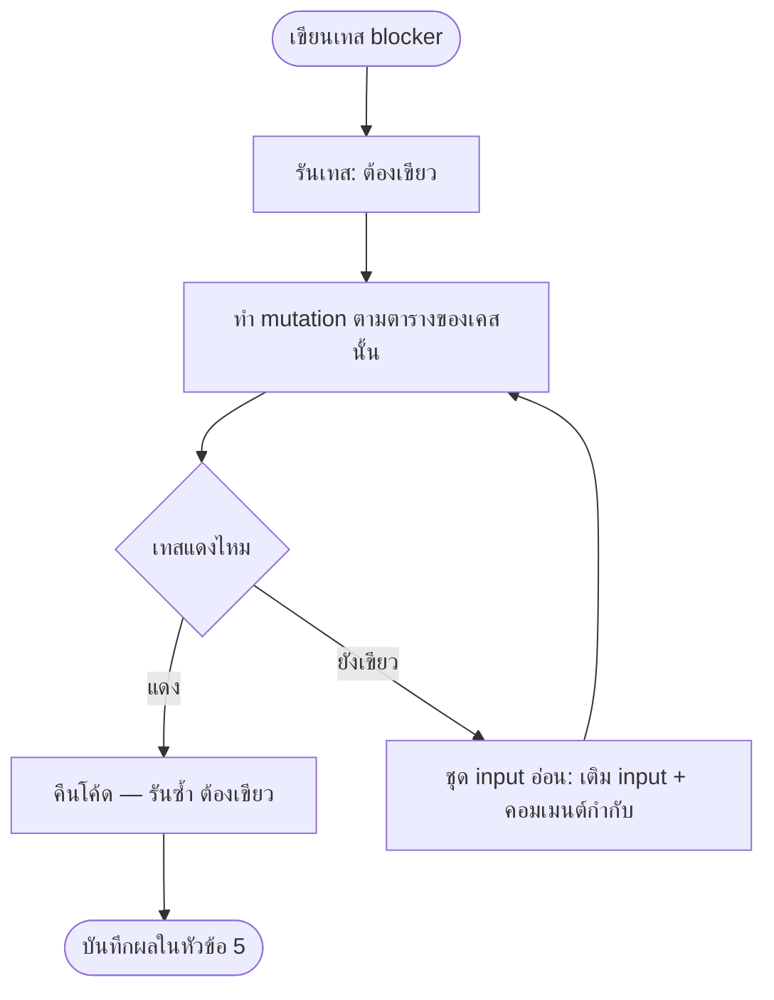

> **โมดูล:** 00066 — ติดตามลูกค้า
> **ประเภทเอกสาร:** Test Case
> **เวอร์ชัน:** 0.1
> **วันที่จัดทำ:** 2026-09-29
> **สถานะ:** Draft (ยังไม่เคยรันสักเคส — ยังไม่มีโค้ด)
> **เจ้าของเอกสาร:** QA (ดู [[Feature-Docs-Ownership]])

# Test Case: ติดตามลูกค้า

---

## 1. Overview

ชุดเคสครอบ AC-ACT-01..46 ใน [[BRD]] §3 และ edge E1–E18 (§11) ทุกเคสผูก AC. แบ่งชั้น: **U** unit (ฟังก์ชันบริสุทธิ์ ไม่แตะฐาน) · **S** service/integration (แตะฐาน localhost) · **A** API · **C** cron · **X** เทสสแกนซอร์ส · **B** browser QA · **P** push บนเครื่องจริง

- **ป้าย `[blocker]`** = แดงเมื่อไหร่ห้าม merge; ทุกตัวต้องมี **mutation** ที่ทำให้แดงจริง (ทำ mutation แล้วรันเทส ต้องแดง → คืนโค้ด → ต้องเขียว) — ตามแผน `/tmp/00066-plan.md` หัวข้อ "เทส [blocker]"
- **ตำแหน่งไฟล์เทส:** เทสที่ไม่แตะฐานอยู่ใต้ `src/**/__tests__/` (`follow-up-*.test.ts`); เทสที่แตะฐานใช้ `tests/setup.ts` (allowlist localhost) รัน `npx vitest run src/` (config ยังไม่ exclude `e2e/**`)
- 🛑 **HR13:** เทสที่แตะฐานต้องล้างด้วย `deleteTestData({ userIds, shopIds })` ที่ scope ด้วย id ที่เทสสร้างเอง ห้าม `deleteMany()` ไม่มี `where` / `TRUNCATE` / `DELETE FROM` ไม่มี `WHERE` ในไฟล์เทสทุกไฟล์ **HR14:** ห้ามรัน `npm run e2e`/`playwright test` เว้นแต่ปักหมุด URL localhost ในคำสั่งตรง ๆ
- **เวลา:** เทสฟังก์ชันเวลาทุกตัวส่ง `now` เข้าเป็นพารามิเตอร์ (ห้ามพึ่งนาฬิกาเครื่อง) กฎคำ: UI ห้ามมีคำว่า "กิจกรรม" (BR-ACT-20)
- **Corpus note (mutation-silence):** input ที่เติมเพื่อให้ mutation แดง ต้องมีคอมเมนต์กำกับในเทสว่าเติมไว้ฆ่า mutation ใดตัวใด (`docs/conventions/mutation-silence-means-weak-corpus.md`) มิฉะนั้นคนถัดไปจะลบทิ้งเพราะ "ซ้ำ"
- **นอกขอบเขต:** ส่งข้อความหาลูกค้า · สวิตช์แจ้งเตือนแยก · เตือนก่อนกำหนด/เตือนซ้ำ (Deferred ใน BRD §12)
- **สภาพแวดล้อม:** dev `localhost` เท่านั้น, seller `http://seller.deepth.local:4000`, แอป deep-mobile-seller (WebView) + iPhone จริงสำหรับ push

**ข้อมูลตั้งต้นกลาง (fixture F):** ร้าน BUSINESS `S1` (เจ้าของ A, ADMIN B) · ร้าน PERSONAL `SP` (เจ้าของ P) · ร้านอื่น `S2` (เจ้าของ Z) · ห้อง Messenger `Hm`, ห้อง LINE `Hl` ของ S1 (ผู้ติดต่อทั้งคู่ชี้ Customer `C1`) · ห้อง `Hx` (ผู้ติดต่อไม่ชี้ Customer) · ห้อง DEEP `Hd` (ไม่มี ExternalContact) · ห้อง `H2` ของ S2 · ผู้ใช้ U ที่ถูกถอดจากทีม · เครื่องมี Expo token ของ A

---

## 2. Test Scenarios

### 2.1 Unit — ฟังก์ชันบริสุทธิ์เวลา (`follow-up-time.ts`)

### TC-U01: `resolveDue` ทั้งวัน/มีเวลา/วันไม่มีจริง/นอกช่วง
- **Linked to:** AC-ACT-18, AC-ACT-01(รูปแบบวัน), BR-ACT-03
- **Precondition:** ส่ง `now` คงที่
- **Steps:** (1) `{date:'2026-09-30', time:'10:00'}` (2) `time:null` (3) `date:'2026-02-30'` (4) วันที่ −366 และ +731 วันจากวันนี้ไทย และขอบ −365/+730
- **Expected Result:** (1) `dueAt=2026-09-30T03:00:00Z, allDay=false` (2) `dueAt=` เที่ยงคืนไทย (=17:00Z ของวันก่อน) `allDay=true` (3) throw `FollowUpDueError` (4) ขอบ ±(365/730) ผ่าน, เกิน 1 วัน throw
- **[blocker]** — **Mutation:** เปลี่ยนเป็น `new Date(y,m,d)` ของเครื่อง · ตัดการเช็ควันไม่มีจริง · เพดาน `<=`→`<`

### TC-U02: `quickSnooze` ข้าม TZ เครื่อง — ผลเท่ากัน
- **Linked to:** AC-ACT-14, E1
- **Precondition:** `now` = 2026-09-29 16:30Z (= 23:30 ไทย; UTC ยังเป็นวันเดียวกัน, LA = 09:30) และ `now` = 2026-09-29 20:00Z
- **Steps:** เรียก `TOMORROW_9`/`IN_3_DAYS`/`NEXT_WEEK` ใต้ `TZ=UTC`, `Asia/Bangkok`, `America/Los_Angeles` (รันแยก process ต่อ TZ หรือยืนยันก่อนว่า `process.env.TZ` กลางรันมีผลกับ `Date` ใน vitest — [ยังไม่ยืนยัน])
- **Expected Result:** ทั้ง 3 TZ ให้ `dueAt` เท่ากันทุกตัว และ = ค่าที่คาดตามปฏิทินไทย
- **[blocker]** — **Mutation:** ใช้ `new Date(y,m,d)` เครื่อง · +24 ชม. แทนวันปฏิทิน (ต้องแดงที่เคสข้ามวัน 23:30 ไทย)

### TC-U03: "พรุ่งนี้ 09:00" ที่ 23:30 ไทย
- **Linked to:** AC-ACT-15, E2
- **Precondition:** `now`=23:30 ไทย 2026-09-29
- **Steps:** `quickSnooze('TOMORROW_9', now)`
- **Expected Result:** `2026-09-30 09:00 ไทย` (=02:00Z) ไม่ใช่ +24 ชม. (=23:30 ไทยของ 09-30)
- **[blocker]** — **Mutation:** +24h · `NEXT_WEEK` ≠ +7 วันปฏิทิน (A5)

### 2.2 Unit — `isOverdue` / `bucketOf` (`follow-up-rules.ts`)

### TC-U04: มีเวลา — ขอบวินาที
- **Linked to:** AC-ACT-17
- **Steps:** กำหนด 10:00 ไทย; `now`=09:59:59 / 10:00:00 / 10:00:01
- **Expected Result:** ไม่เลย / **ไม่เลย** (ข้อ AC: 10:00:01 เลยกำหนด; ณ 10:00:00 พอดีต้องตรงนิยามใน SRS §TFR-003 — ระบุค่าตามนิยามแล้วเขียนเคสให้ตรง) / เลยกำหนด
- **[blocker]** — **Mutation:** `<`→`<=` (ที่ 10:00:00)

### TC-U05: ทั้งวัน — 23:59:59 ไม่เลย, 00:00:00 วันถัดไปเลย
- **Linked to:** AC-ACT-16, E3
- **Steps:** allDay วัน D; `now`= D 00:00, D 23:59:59.999 ไทย, D+1 00:00:00 ไทย
- **Expected Result:** ไม่เลย, ไม่เลย, เลยกำหนด
- **[blocker]** — **Mutation:** allDay `>=`→`>` / ใช้ขอบ UTC แทนไทย

### TC-U06: รายการปิดแล้วไม่ตก 4 bucket ใด ๆ
- **Linked to:** AC-ACT-19, E4
- **Steps:** DONE ที่กำหนด: เมื่อวาน / วันนี้ / พรุ่งนี้ / +30 วัน; `isOverdue` และ `bucketOf`
- **Expected Result:** `isOverdue=false` ทุกตัว, `bucketOf='done'` ทุกตัว
- **[blocker]** — **Mutation:** ถอด guard `status==='DONE'` ใน `isOverdue` / `bucketOf`

### TC-U07: ขอบ bucket วันนี้ / 7 วัน / ภายหลัง
- **Linked to:** AC-ACT-20
- **Steps:** กำหนด 23:59 วันนี้ · 00:00 พรุ่งนี้ · วันที่ 7 หลังสิ้นวันนี้ (มีเวลาและทั้งวัน) · วันที่ 8
- **Expected Result:** today · week · week · later
- **[blocker]** — **Mutation:** `to+7d` เลื่อนขอบ ±1 วัน · `<`→`<=` ที่ `thaiTodayBounds(now).to`

### TC-U08: `countOpenAndLate` = symbol เดียวของตัวเลขหลายจอ
- **Linked to:** AC-ACT-22
- **Steps:** ป้อนชุดแถวผสม OPEN/DONE/late; เรียก `countOpenAndLate`
- **Expected Result:** open นับเฉพาะ OPEN; late = `isOverdue` เท่านั้น; DONE ไม่นับ
- **[blocker]** — **Mutation:** นับ DONE เข้า open · คำนวณ late ด้วยเงื่อนไขอื่นนอก `isOverdue`

### TC-U09: `filterStateOf` — 3 สถานะ
- **Linked to:** AC-ACT-43
- **Steps:** `{open,late,done}` = (0,0,0) (2,1,0) (2,0,0) (0,0,3) (1,0,2)
- **Expected Result:** `null` · `late` · `upcoming` · `done` · `upcoming` (ไม่เคยมีรายการ ⇒ ไม่ตก `done`)
- **[blocker]** — **Mutation:** สลับเงื่อนไข late/upcoming · ห้องไม่เคยมีรายการตกเป็น `done`

### TC-U10: `bubbleModel` / `panelModel`
- **Linked to:** AC-ACT-22, BR-ACT-21 (ซ่อนบนมือถือเมื่ออยู่ในห้อง), FR-ACT-06/07
- **Steps:** bubble: (ไม่มีรายการ→`none`), (มี today ไม่มี late→`normal`), (มี late→`late`), `isMobile+inThread`→ซ่อน · panel: `lateCount≥1`→`expanded=true`, 0→false
- **Expected Result:** ตามนั้น; "ไม่มีรายการ = ไม่มีปุ่ม"
- **[blocker]** — **Mutation:** กลับ guard "ไม่มีรายการ = ไม่มีปุ่ม" · ลืม `inThread`

### TC-U11: `isReminderDue` / `initialRemindedFor`
- **Linked to:** AC-ACT-31, 33, 34, 39, E8, BR-ACT-13.5
- **Steps:** มีเวลา: `now` = fireAt−1s / fireAt / fireAt+6h / fireAt+6h+1s · ทั้งวัน: 08:59 ไทย / 09:00 / 23:59 / วันถัดไป · `remindedFor===fireAt` ⇒ ไม่ due · `remindedFor` เก่า (หลังเลื่อน) ⇒ due · `initialRemindedFor` สร้างย้อนหลังคืน fireAt, อนาคตคืน null
- **Expected Result:** due เฉพาะในหน้าต่างและ `remindedFor≠fireAt`; ย้อนหลังไม่ push
- **[blocker]** — **Mutation:** ถอดเทียบ `remindedFor` · ขยาย/ยุบหน้าต่าง (±1 ชม.) · ไม่ตั้ง remindedFor ตอนสร้างย้อนหลัง

### TC-U12: `buildReminderPush` / `groupReminders`
- **Linked to:** AC-ACT-37, AC-ACT-38
- **Steps:** ป้อนรายการที่ `note` มีเบอร์ `0812345678` + title ยาว 100 ตัว · กลุ่ม: 1 รายการ, 3 รายการ (ร้านเดียว), 3 รายการข้าม 2 ร้าน
- **Expected Result:** JSON push ไม่มี `note`/เบอร์; body ≤60 ตัว; 1 รายการ = `url=/inbox/{id}`; >1 = "มี n รายการถึงกำหนด" + `url=/follow-ups?mine=1&shopId=…`; ข้ามร้าน = 1 push ต่อร้าน
- **[blocker]** — **Mutation:** ใส่ `note` ใน body · รวมข้ามร้านเป็น push เดียว

### 2.3 Validation (Valibot)

### TC-V01: หัวข้อ 0/ช่องว่าง/200/201
- **Linked to:** AC-ACT-01
- **Steps:** title `""`, `"   "`, 200 ตัว, 201 ตัว (ไทยผสม), นับเป็น code point
- **Expected Result:** ว่าง/ช่องว่าง/201 → 400 `VALIDATION` (ข้อความอ่านได้); 200 ผ่าน; ไม่เคย 500
- **[blocker]** — **Mutation:** `max 200`→`201` · ไม่ trim

### TC-V02: โน้ต 1000/1001/ไม่กรอก
- **Linked to:** AC-ACT-02
- **Expected Result:** 1000 ผ่าน, 1001 400, ไม่ส่ง/null ผ่าน
- **[blocker]** — **Mutation:** `max 1000`→`1001`

### TC-V03: outcome นอก 4 ค่า / ส่ง outcome กับรายการเปิด
- **Linked to:** AC-ACT-10
- **Steps:** complete `outcome:'MAYBE'` · PATCH ส่ง `outcome` ตรง ๆ กับรายการ OPEN
- **Expected Result:** 400 · ไม่มีทางตั้ง outcome ได้นอก `complete` (คงค่าว่าง)
- **[blocker]** — **Mutation:** เพิ่มค่า enum · เปิดให้ PATCH เขียน outcome

### 2.4 Service / Integration (localhost; scope id ของเทสตาม HR13)

### TC-S01: สร้างในห้องของร้านอื่น = เหมือนห้องไม่มีจริง
- **Linked to:** AC-ACT-03, BR-ACT-01
- **Steps:** ผู้ใช้ S1 สร้างรายการด้วย `conversationId=H2` (ร้าน S2) และอีกครั้งด้วย uuid ที่ไม่มีจริง
- **Expected Result:** ทั้งสองได้ผลเดียวกัน `FollowUpNotFoundError`/404 `NOT_FOUND` (ข้อความและรูปร่างเท่ากัน); ฐานไม่มีแถวใหม่
- **[blocker]** — **Mutation:** คืน 403 หรือข้อความต่างเมื่อห้องมีอยู่ร้านอื่น · ตรวจ shop หลังสร้าง

### TC-S02: สมาชิกร้านเดียวกันทำแทนกันได้ (A สร้าง B จัดการ)
- **Linked to:** AC-ACT-04, BR-ACT-05
- **Steps:** A สร้าง → B แก้ / ปิด / เปิดกลับ / ลบ (ราย case)
- **Expected Result:** ทุกกรณีสำเร็จ
- **Mutation:** เพิ่มเงื่อนไข `createdByUserId===user`

### TC-S03: สมาชิกร้านอื่นแก้/ปิด/ลบ → 404
- **Linked to:** AC-ACT-05
- **Steps:** Z (S2) ยิง PATCH/complete/reopen/snooze/DELETE กับรายการของ S1
- **Expected Result:** 404 `NOT_FOUND` ทุก endpoint (ไม่ใช่ 403); รายการไม่เปลี่ยน
- **[blocker]** — **Mutation:** ลบ `shopId` จาก where หนึ่ง query (ต้องจับได้ด้วย TC-X01 และเคสนี้)

### TC-S04: ผู้รับผิดชอบไม่ใช่สมาชิก → ปฏิเสธ; ไม่ระบุ = ผู้สร้าง; FK P2003
- **Linked to:** AC-ACT-06, BR-ACT-04
- **Steps:** สร้างด้วย `assigneeUserId`=Z (คนนอก) · ไม่ส่ง assignee · assignee = uuid ไม่มีในระบบ · PATCH ตั้ง assignee เป็นคนนอก · PATCH ส่ง `assigneeUserId:null`
- **Expected Result:** 400 `ASSIGNEE_NOT_MEMBER` · assignee=ผู้สร้าง · 400 `ASSIGNEE_NOT_MEMBER` (ไม่ใช่ 500) · 400 · 400 `VALIDATION` (ห้าม null)
- **[blocker]** — **Mutation:** ถอดตรวจสมาชิก · ไม่ map P2003

### TC-S05: ร้าน PERSONAL = เจ้าของเสมอ
- **Linked to:** AC-ACT-07
- **Steps:** สร้างในห้องของ SP โดยไม่ส่ง assignee / ส่ง assignee คนอื่น; GET แผง
- **Expected Result:** assignee=P; ส่งคนอื่นถูกปฏิเสธ; `assignees=null` ใน response GET
- **[blocker]** — **Mutation:** ถือว่า PERSONAL ยอมรับ assignee ใดก็ได้

### TC-S06: ปิดงาน 4 ผล + "ข้าม" + บันทึกผู้ปิด/เวลา
- **Linked to:** AC-ACT-09
- **Steps:** complete ด้วย `REACHED` / `NO_ANSWER` / `CALL_LATER` / `NOT_INTERESTED` / `null`
- **Expected Result:** `status=DONE`, `doneBy`=ผู้เรียก, `doneAt`≈เวลาปัจจุบัน; null → `outcome=null` แต่ DONE
- **Mutation:** ไม่เขียน `doneByUserId`

### TC-S07: complete ซ้ำ/ปิดพร้อมกัน 2 คน — ผู้ปิดไม่ถูกทับ
- **Linked to:** AC-ACT-09, E9, E18
- **Steps:** A complete แล้ว B complete ซ้ำ (ลำดับ + `Promise.all`); ลบซ้ำ 2 ครั้ง
- **Expected Result:** ผลสุดท้าย DONE; `doneBy`/`doneAt`/`outcome` = ของคำขอแรก; ลบซ้ำ = 404 (client ถือว่าสำเร็จ) ไม่ error
- **[blocker]** — **Mutation:** เปลี่ยน complete เป็น update ไม่มี `status:'OPEN'` ใน where (ผู้ปิดถูกทับ)

### TC-S08: reopen ล้างทั้งชุด
- **Linked to:** AC-ACT-11
- **Steps:** complete แล้ว reopen; reopen รายการที่เปิดอยู่
- **Expected Result:** `outcome/doneAt/doneBy` ว่างทั้งหมด `status=OPEN`; เปิดอยู่แล้ว = 200 ไม่เปลี่ยน
- **Mutation:** ลืมล้าง `outcome`

### TC-S09: snooze — รายการปิดแล้วถูกปฏิเสธ, ตัวนับ, แก้เวลาไม่เพิ่มตัวนับ
- **Linked to:** AC-ACT-12, AC-ACT-13
- **Steps:** snooze DONE → snooze OPEN 2 ครั้ง (count=2) → snooze 1 ครั้ง (count=1) → PATCH date/time
- **Expected Result:** 409 `INVALID_STATE` · `snoozeCount=2` (UI ป้าย "เลื่อนมา 2 ครั้ง") · 1 = ไม่มีป้ายเตือน · PATCH ไม่เพิ่ม `snoozeCount`
- **[blocker]** — **Mutation:** PATCH เพิ่มตัวนับ · snooze ไม่ตรวจสถานะ

### TC-S10: PATCH รายการปิดแล้ว — แก้ได้เฉพาะ title/note
- **Linked to:** BR-ACT (A6), AC-ACT-09/10
- **Steps:** PATCH DONE ด้วย title, note, date, assignee, type
- **Expected Result:** title/note สำเร็จ; อื่น ๆ → 409 `INVALID_STATE`
- **Mutation:** เปิดให้แก้ `dueAt` เมื่อ DONE

### TC-S11: ขอบเขตแผงห้อง (list + recentDone ≤3 + truncated)
- **Linked to:** AC-ACT-22, FR-ACT-06
- **Steps:** ห้องที่มี OPEN 5 + DONE 5; ห้องที่มี OPEN เกิน `LIST_MAX`(200)
- **Expected Result:** `open` ทั้ง 5, `recentDone` = 3 ใบล่าสุดตาม `doneAt`; เกินเพดาน → `truncated=true`
- **Mutation:** ตัด `take` ผิด

### TC-S12: ค้นชื่อลูกค้าด้วย `%` `_` ตามตัวอักษร
- **Linked to:** AC-ACT-24
- **Steps:** ลูกค้าชื่อ `100%คุ้ม`, `a_b`, `axb`; ค้น `%` และ `_`
- **Expected Result:** `%` พบเฉพาะ `100%คุ้ม`; `_` พบเฉพาะ `a_b` (ไม่พบ `axb`); ไม่ใช่ wildcard
- **[blocker]** — **Mutation:** ถอด escape ของ `%`/`_`

### TC-S13: ตัวกรอง URL ปลอม = ไม่กรอง
- **Linked to:** AC-ACT-25, E17
- **Steps:** `assignee=not-a-uuid`, `assignee=<uuid คนร้านอื่น>`, `tags=ปลอม,;DROP`, `month=2026-13`, `shopId=<ร้านนอกขอบเขต>`
- **Expected Result:** 200 ผลเท่ากับไม่กรอง (ร้านนอกขอบเขต = ผลว่าง ไม่ใช่ 403); ไม่ 500; `view` ผิด = 400 เพียงตัวเดียว
- **Mutation:** throw เมื่อ parse ไม่ได้

### TC-S14: counts นับก่อนใช้ตัวกรอง
- **Linked to:** AC-ACT-26
- **Steps:** board ไม่กรอง จด `counts.byUser`; board `assignee=A` แล้วเทียบตัวเลขของ B
- **Expected Result:** `counts` ของทุกคนไม่เปลี่ยน; `columns` เท่านั้นที่ถูกกรอง
- **[blocker]** — **Mutation:** คำนวณ counts จากชุดหลังกรอง

### TC-S15: ปฏิทิน 1,000 / 1,001 ใบ
- **Linked to:** AC-ACT-23, E16
- **Steps:** seed ทีละใบ (id ของเทสเท่านั้น) 1,000 แล้ว 1,001 ใบในเดือนเดียว → `view=calendar&month=…`
- **Expected Result:** 1,000 พอดี → `truncated=false`; 1,001 → คืน 1,000 ใบ + `truncated=true`
- **[blocker]** — **Mutation:** `take:CAL_MAX`→`+1` (หรือ `>`→`>=` ตอนตั้งธง)

### TC-S16: ลูกค้าเดียวกัน (cluster) — Messenger + LINE ปนกัน
- **Linked to:** AC-ACT-27, BR-ACT-10
- **Steps:** จดรายการที่ `Hm`; GET แผงของ `Hl`; จดที่ `Hl` แล้ว GET แผง `Hm`
- **Expected Result:** เห็นข้ามห้องทั้งสองทิศ พร้อม `room={label,channel}` ของห้องต้นทาง
- **[blocker]** — **Mutation:** เปลี่ยน cluster key เป็น `customerId` เปล่า (ไม่มี shopId — ต้องแดงที่ TC-S17 ข้ามร้าน) · เปลี่ยนเป็นห้องเดียว

### TC-S17: ห้ามปนข้ามร้าน/ข้ามลูกค้า/ห้องที่ contact ว่าง
- **Linked to:** AC-ACT-28, BR-ACT-10
- **Steps:** (ก) `Hx` (contact ไม่ชี้ Customer) + ห้องอื่นที่ contact ก็ไม่ชี้ (ข) สองห้องต่างร้าน แต่ contact ชี้ Customer id เดียวกัน (ค) ชื่อเหมือนกัน แต่ Customer ต่างกัน
- **Expected Result:** ไม่ปนทั้งสามกรณี (ไม่เดาจากชื่อ/เบอร์)
- **[blocker]** — **Mutation:** ปล่อยทุกห้อง `NULL` มารวมเป็น cluster เดียว · ตัด `shopId` ออกจาก key

### TC-S18: relink ลูกค้าแล้วรายการตามไปโดยไม่ย้ายแถว
- **Linked to:** AC-ACT-29, BR-ACT-22
- **Steps:** contact ของ H ชี้ A → จดรายการ 2 ใบที่ H → `relinkThreadCustomer` → B; ตรวจ `id`/จำนวนแถวก่อน-หลัง; GET ขอบเขตลูกค้า A และ B (`customers/[id]` ทั้ง `c-`)
- **Expected Result:** 2 แถวเดิม (id เดิม, ไม่ซ้ำ) ยังอยู่ที่ H; ปรากฏใน B; **ไม่**ปรากฏใน A; ไม่มี migration/UPDATE ตาราง follow-up
- **[blocker]** — **Mutation:** เก็บ `customerId` ลงแถวตอนสร้าง (denormalize) แล้ว query ตามคอลัมน์นั้น

### TC-S19: ห้อง DEEP — ผูกห้องเดียว, ตัวกรองแท็กไม่ match
- **Linked to:** AC-ACT-30, AC-ACT-45, E10
- **Steps:** จดที่ `Hd`; GET แผง; board `tags=<แท็กใด>`
- **Expected Result:** เห็นเฉพาะรายการของ `Hd`; board กรองแท็กแล้ว `Hd` ไม่ปรากฏ; ไม่ error
- **Mutation:** ให้ห้อง DEEP ตกเข้า cluster `NULL` ร่วมกับห้องอื่น

### TC-S20: ตัวกรองแท็กบนกระดาน — OR ในหมวด, ครอบห้องอื่นของลูกค้าเดียวกัน
- **Linked to:** AC-ACT-45, BR-ACT-16
- **Steps:** แท็ก T1 ที่ contact ของ `Hm` เท่านั้น; จดรายการที่ `Hl`; board `tags=T1` และ `tags=T1,T9`
- **Expected Result:** รายการของ `Hl` ปรากฏ (ลูกค้าเดียวกัน); หลายแท็ก = OR; แท็กที่ไม่มีใครมี = ผลว่างสำหรับแท็กนั้น
- **Mutation:** เทียบแท็กเฉพาะ contact ของห้องที่จดรายการ

### TC-S21: ตัวกรองกล่องแชท — 3 สถานะ + ห้องไม่เคยมีรายการไม่ตก "เสร็จสิ้น"
- **Linked to:** AC-ACT-43
- **Steps:** ห้อง a (มี late 1 + open อื่น) · b (open ทั้งหมดยังไม่เลย) · c (DONE ล้วน) · d (ไม่เคยมี) · `GET conversations?followUp=late|upcoming|done`
- **Expected Result:** `late`={a}; `upcoming`={b}; `done`={c}; d ไม่อยู่ที่ใดเลย
- **[blocker]** — **Mutation:** สลับเงื่อนไข upcoming/late · d ตกเป็น done

### TC-S22: ตัวกรอง OR ในหมวด / AND ข้ามหมวดกับแท็ก
- **Linked to:** AC-ACT-44, BR-ACT-19
- **Steps:** `followUp=late,upcoming` · `followUp=late,upcoming&tags=T1` · ค่าปลอม `followUp=xyz,late`
- **Expected Result:** union ของ a∪b · ตัดกับห้องที่มีแท็ก T1 · `xyz` ถูกทิ้ง เหลือ `late`
- **Mutation:** ใช้ AND ในหมวด · OR ข้ามหมวด

### TC-S23: ป้ายแถว (`followUp:{open,late}`) ก้อนเดียว, เท่ากับหัวแผง
- **Linked to:** AC-ACT-22, BR-ACT-19/20
- **Steps:** เทียบ `followUp` ของ item ใน `GET conversations` กับ `openCount/lateCount` ของ `GET …/follow-ups` ห้องเดียวกันและ `counts` ของ board (ขอบเขตร้านเดียวกัน)
- **Expected Result:** ตัวเลขเท่ากันทั้งสามที่; query เพิ่มไม่เกิน 1 ก้อนต่อหน้ารายการ (ไม่ N+1)
- **[blocker]** — **Mutation:** คำนวณอีกสูตรในอีกจอ (เช่น นับ DONE)

### TC-S24: ห้องซ่อน/สแปม — ยังนับและเตือน
- **Linked to:** E12, BR-ACT (A10)
- **Steps:** ตั้ง `isHidden`/`isSpam` ที่ห้องที่มีรายการ late; GET board/mine; รัน cron
- **Expected Result:** ยังอยู่ในกระดาน/นับ/เตือน
- **Mutation:** กรอง `isHidden=false`

### TC-S25: โหมดกล่องรวมหลายร้าน (Q5)
- **Linked to:** AC-ACT-22, มติ Q5
- **Steps:** ผู้ใช้เข้าถึง S1+S2; `mine` และ board ไม่ส่ง `shopId`; แล้วส่ง `shopId=S1`, `shopId=<ร้านที่ไม่มีสิทธิ์>`
- **Expected Result:** นับรวมทั้ง 2 ร้าน · เหลือ S1 · ร้านที่ไม่มีสิทธิ์ = ผล/ตัวกรองว่าง ไม่ 403 ไม่รั่วข้อมูล
- **Mutation:** ใช้ `shopId` จาก client เป็นสิทธิ์โดยไม่ intersect

### 2.5 API (401 / 404 / 400 / shape)

### TC-A01: ทุก route ตอบ 401 เมื่อ session ไม่มี id (table-driven)
- **Linked to:** AC-ACT-08, E15
- **Steps:** mock session `{user:{}}` และ `null` ยิงครบ 10 endpoint (GET/POST conv, PATCH, DELETE, complete, reopen, snooze, mine, board) + conversations?followUp
- **Expected Result:** 401 `{error, code:'UNAUTHORIZED'}` ทุกตัว ไม่ 500; ไม่เรียก prisma
- **[blocker]** — **Mutation:** คืนไปใช้ cast `(session.user as {id}).id` ใน route ใดหนึ่ง

### TC-A02: response headers + error shape
- **Linked to:** API §1/§5
- **Expected Result:** `Cache-Control: private, no-store, max-age=0, must-revalidate`; error = `{error, code}`; id ไม่ใช่ uuid → 400; 500 คืนข้อความกลาง ไม่รั่ว stack
- **Mutation:** ลืม header ใน route ใหม่

### TC-A03: `mapFollowUpError` ครอบทุก `*Error`
- **Linked to:** API §5 / SRS §11
- **Steps:** enumerate class ที่ export จาก service ทั้งหมด (`FollowUpNotFoundError` `FollowUpValidationError` `FollowUpDueError` `FollowUpAssigneeError` `FollowUpStateError` ฯลฯ) ผ่าน `mapFollowUpError`
- **Expected Result:** แต่ละตัวมี HTTP+`code` ตามตาราง §5; ตัวที่ไม่รู้จัก → 500 (ไม่กลืน)
- **[blocker]** — **Mutation:** ลบ branch หนึ่ง

### TC-A04: 404 ไม่ยืนยันว่ามีอยู่ (ร้านอื่น = ไม่มีจริง)
- **Linked to:** AC-ACT-03, AC-ACT-05
- **Expected Result:** body/status ของ "ไม่มีรายการ" กับ "รายการของร้านอื่น" เท่ากันทุกไบต์
- **[blocker]** — **Mutation:** ข้อความต่างกัน

### TC-A05: 201 สร้างสำเร็จ + shape ตาม `FollowUpDto`
- **Linked to:** AC-ACT-01, 06, API §4.2
- **Steps:** POST ตัวอย่าง `2026-09-30 10:00` (ต้องได้ `dueAt=…T03:00:00.000Z`)
- **Expected Result:** 201, `bucket`, `snoozeCount=0`, `assignee`=ผู้สร้าง; `assigneeRemoved=false`; `note` ส่งกลับเฉพาะ endpoint ที่ผู้เปิดได้
- **Mutation:** ตีความ `time` เป็น UTC

### TC-A06: INVALID_DUE
- **Linked to:** AC-ACT-01(รูปแบบวัน), API §5
- **Steps:** `date:'2026-02-30'`, `2020-01-01`, `2030-01-01`
- **Expected Result:** 400 `INVALID_DUE`
- **Mutation:** ไม่เช็คช่วง

### 2.6 Cron — `/api/cron/follow-up-reminders`

### TC-C01: 401 ไม่มี/ผิด Authorization หรือ `CRON_SECRET` ว่าง
- **Linked to:** AC-ACT-40
- **Steps:** ไม่ส่ง header · ส่งผิด · `CRON_SECRET=''` และส่ง `Bearer ` (ว่าง) · ส่งถูก
- **Expected Result:** 401 ทั้ง 3 แรก (ห้ามผ่านเพราะ `undefined===undefined`/ว่าง=ว่าง); ถูก = 200 พร้อมสรุป `{ok,scanned,due,reserved,sent,noToken,failed,droppedNonMember}`
- **[blocker]** — **Mutation:** ไม่ตรวจ env ว่าง · เทียบแบบหลวม

### TC-C02: ส่ง 1 ครั้งต่อค่ากำหนด; รันซ้ำไม่ส่ง
- **Linked to:** AC-ACT-31
- **Precondition:** รายการ 10:00 ของ A (มี token); `now`≈10:00
- **Steps:** รัน cron 2 รอบติดกัน
- **Expected Result:** push 1 ครั้ง; `remindedFor=fireAt`, `remindedAt` ตั้ง; รอบสองไม่ส่ง
- **[blocker]** — **Mutation:** ถอดเทียบ `remindedFor`

### TC-C03: จองด้วย `updateMany` — count 0 ⇒ ไม่ส่ง (unit, mock prisma)
- **Linked to:** AC-ACT-32
- **Steps:** mock `updateMany` คืน `{count:0}` แล้ว `{count:1}`
- **Expected Result:** count 0 ไม่เรียกตัวส่ง; count 1 เรียก 1 ครั้ง
- **[blocker]** — **Mutation:** ลบตรวจ `count===1`

### TC-C04: แข่ง 2 instance บนฐานจริง
- **Linked to:** AC-ACT-32
- **Steps:** `Promise.all` เรียกตัว reserve 2 ตัวกับแถวเดียว (ของเทสเอง; ล้างด้วย id)
- **Expected Result:** เพียงตัวเดียวได้ `count=1`
- **[blocker]** — **Mutation:** ถอดเงื่อนไข `dueAt`/`OR remindedFor` ออกจาก where

### TC-C05: จองล้มเมื่อผู้ใช้เลื่อนระหว่างทาง
- **Linked to:** AC-ACT-34, TD-FU-3
- **Steps:** อ่านแถว → (จำลอง) snooze เปลี่ยน `dueAt` → reserve ด้วย `dueAt` เดิม
- **Expected Result:** `count=0` ไม่ส่ง
- **Mutation:** ถอด `dueAt` จาก where

### TC-C06: รายการทั้งวัน — ไม่ก่อน 09:00 ไทย, ส่งรอบแรกตั้งแต่ 09:00
- **Linked to:** AC-ACT-33
- **Steps:** `now`=08:55 / 09:00 / 09:05 ไทย ของวัน D
- **Expected Result:** ไม่ส่ง / ส่ง / (ส่งแล้วไม่ซ้ำ)
- **[blocker]** — **Mutation:** ใช้ 09:00 UTC

### TC-C07: เลื่อน/แก้เวลาแล้วเตือนใหม่ 1 ครั้ง
- **Linked to:** AC-ACT-34
- **Steps:** เตือนไปแล้ว → snooze → เลื่อน `now` ถึงกำหนดใหม่ → cron; อีกกรณี PATCH เวลา
- **Expected Result:** ส่งอีก 1 ครั้ง (ทั้งสองกรณี) ไม่มีโค้ด reset แยก
- **Mutation:** เก็บ boolean `reminded` แทนเทียบ fireAt

### TC-C08: ปิด/ลบก่อนถึงเวลา → ไม่ส่ง
- **Linked to:** AC-ACT-35
- **Expected Result:** DONE หรือแถวหาย → ไม่ส่ง ไม่ error
- **Mutation:** ไม่กรอง `status='OPEN'`

### TC-C09: ผู้รับผิดชอบถูกถอด/บัญชีลบ → ไม่ส่ง รอบไม่ล้ม
- **Linked to:** AC-ACT-36, E5, BR-ACT-11
- **Steps:** รอบเดียว: รายการของ U (ถูกถอด) + รายการของ A ปกติ + assignee=null
- **Expected Result:** A ได้ push; U ไม่ได้; ไม่ throw; `droppedNonMember`≥1; assignee=null ไม่ส่งใคร; UI ภายหลังโชว์ "ทีมงานที่ถูกถอดออกแล้ว" (`assigneeRemoved=true`)
- **[blocker]** — **Mutation:** ถอดตรวจสมาชิก (ส่งให้ U)

### TC-C10: รวม push ต่อคนต่อร้านต่อรอบ
- **Linked to:** AC-ACT-37
- **Steps:** A มี 1 รายการ / 3 รายการ ถึงกำหนดพร้อมกันใน S1 · อีก 1 รายการใน S2
- **Expected Result:** S1 1 รายการ → ข้อความรายการ+`/inbox/{id}`; 3 → 1 push สรุป + `/follow-ups?mine=1&shopId=S1`; S2 แยก push
- **[blocker]** — **Mutation:** ส่งทีละรายการ

### TC-C11: payload ไม่มี note/เบอร์ (สแกน payload จริงจากตัวส่งที่ mock)
- **Linked to:** AC-ACT-38
- **Steps:** สร้างรายการ `note='โทร 0812345678'`; cron; ตรวจ arg ที่ส่งเข้า `sendExpoPushWithStatus` ทั้งก้อน (stringify)
- **Expected Result:** ไม่มี `note`, ไม่มีสตริง `0812345678`, ไม่มีเบอร์รูปแบบใดใน title/subtitle/body/data
- **[blocker]** — **Mutation:** ใส่ `note` ใน body

### TC-C12: สร้างย้อนหลัง ไม่ push ทันที
- **Linked to:** AC-ACT-39, E14
- **Steps:** POST due เมื่อวาน → รัน cron ทันที
- **Expected Result:** สร้างสำเร็จ (bucket=late) แต่ push 0 ครั้ง; `remindedFor=fireAt`
- **[blocker]** — **Mutation:** ไม่ตั้ง remindedFor ตอนสร้าง

### TC-C13: FAILED ⇒ ปล่อยจอง / NO_TOKEN ⇒ คงจอง
- **Linked to:** AC-ACT-41, E6
- **Steps:** mock ตัวส่งคืน `FAILED` แล้ว `NO_TOKEN` แล้ว `SENT`; รัน cron ซ้ำภายในหน้าต่าง
- **Expected Result:** FAILED → `remindedFor` กลับค่าก่อนจอง รอบหน้าส่งใหม่ + รายการ/cron ไม่ล้ม; NO_TOKEN → คงจอง ไม่วนซ้ำ; SENT → จบ; ตัวเลข `failed`/`noToken` ตรงจริง
- **[blocker]** — **Mutation:** สลับทิศ · ไม่เรียกปล่อยจอง

### TC-C14: cron พลาดรอบ — ชดเชยในหน้าต่าง 6 ชม. เท่านั้น
- **Linked to:** AC-ACT-31/33, E8, BR-ACT-13.5
- **Steps:** รัน cron ครั้งแรกที่ fireAt+5h59m / +6h01m; ทั้งวัน: ภายในวัน / วันถัดไป
- **Expected Result:** ส่ง / ไม่ส่ง; ส่ง / ไม่ส่ง
- **[blocker]** — **Mutation:** ขยาย/ยุบหน้าต่าง

### TC-C15: ไม่มี cron เพิ่มภาระเกินโควตา
- **Linked to:** A9/Q10
- **Steps:** ตรวจ `vercel.json` มี schedule `*/5 * * * *` ของ route นี้ และ path ตรง route จริง
- **Expected Result:** ตรง; ไม่ทับ cron อื่น

### 2.7 เทสสแกนซอร์ส (X) — เทสที่ไม่แตะฐาน ใต้ `src/**/__tests__/`

> กติกาสแกนทั้งหมด: อ่านไฟล์จริงจากดิสก์ (ไม่ hardcode รายชื่อ), **ตัดคอมเมนต์ก่อน**, regex ใช้ `^[ \t]+` ไม่ใช้ `^\s+`, จับ `ชื่อฟังก์ชัน(` + ตัวแปรปลายทาง ไม่ใช่แค่ชื่อ (บรรทัด `import` ก็ match)

### TC-X01: ทุก `prisma.customerFollowUp.*` ใน service มี `shopId` ใน where
- **Linked to:** AC-ACT-03, AC-ACT-05, BR-ACT-01/05
- **Expected Result:** ทุก call ของ `findMany/findFirst/update/updateMany/delete/deleteMany/count/aggregate/groupBy` มี `shopId` (หรือ `shopId: { in }`) ใน where; `create` มี `shopId` ใน data
- **[blocker]** — **Mutation:** ลบ `shopId` จากหนึ่ง query

### TC-X02: service ไม่มีเส้นทางส่งข้อความหาลูกค้า
- **Linked to:** AC-ACT-42, BR-ACT-14
- **Steps:** สแกน `src/services/customer-follow-up*.ts`, `follow-up-*.ts`, `follow-up-reminder.service.ts`, `src/app/api/follow-ups/**`, cron route: ห้าม import/เรียก `sendMessage`, `sendOutboundMessage`, `channel-chat.service`, SMS/อีเมล
- **Expected Result:** 0 match (ตัวส่ง push ให้ผู้ขายผ่านได้ — `pushToUsersWithStatus`)
- **[blocker]** — **Mutation:** เพิ่ม import `sendOutboundMessage`

### TC-X03: ไม่มี SQL/ตรรกะตัดสิน overdue ใน service (แทน parity)
- **Linked to:** AC-ACT-21
- **Expected Result:** ไม่พบ `interval '24 hours'`/`now()` เทียบ `dueAt` ที่ตัดสิน overdue ใน `customer-follow-up*.ts`/`follow-up-scope.ts`; SQL มีได้เฉพาะ pre-filter superset ที่ประกาศ (`dueAt < endOfTodayThai`, cron window) ซึ่ง TS ตรวจซ้ำ
- **[blocker]** — **Mutation:** เติม `interval '24 hours'` ใน service

### TC-X04: parity SQL↔TS ของ "เลยกำหนด" บนชุดข้อมูลครอบขอบ
- **Linked to:** AC-ACT-21
- **Steps:** (ถ้ายังมี pre-filter SQL) seed ชุดที่ครอบ: allDay D ที่ 23:59:59/00:00 · มีเวลา ±1s · DONE เมื่อวาน · ข้ามเที่ยงคืนไทยแต่ยังไม่ถึง UTC; ผลจาก pre-filter ⊇ ผล `isOverdue` และหลังกรอง TS = ผลจาก `isOverdue` ตรง ๆ
- **Expected Result:** ไม่มีแถวที่ `isOverdue=true` หลุดจาก pre-filter; ไม่มีแถวที่ผ่านทั้งที่ `isOverdue=false`
- **[blocker]** — **Mutation:** เลื่อนขอบ pre-filter ให้แคบกว่า · ตัดสิน overdue ใน SQL แทน TS

### TC-X05: session ไม่ใช้ cast
- **Linked to:** AC-ACT-08, E15
- **Expected Result:** ทุกไฟล์ใน `src/app/api/follow-ups/**`, `…/conversations/[id]/follow-ups/**`, cron ใช้ `sessionUserId()`; ไม่มี `(session.user as { id: string }).id`
- **[blocker]** — **Mutation:** ใส่ cast

### TC-X06: ห้ามลบ conversation/contact/channel ที่ทำให้ cluster เพี้ยน
- **Linked to:** AC-ACT-29, BR-ACT-22
- **Expected Result:** `rg "prisma\.(conversation|externalContact|shopChannel)\.delete(Many)?\("` ใน `src/` (ไม่รวม test) = 0
- **[blocker]** — **Mutation:** เพิ่ม `prisma.conversation.delete`

### TC-X07: i18n ครบ ไม่มีสตริงไทยดิบ / ไม่มีคำว่า "กิจกรรม"
- **Linked to:** AC-ACT-46, BR-ACT-20
- **Steps:** สแกน component ของฟีเจอร์ (`FollowUpPanel` `FollowUpBubble` `FollowUpBoard` `FollowUpCalendar` การ์ด/ฟอร์ม ฯลฯ) หาอักษรไทย `[฀-๿]` นอกคอมเมนต์; สแกน `th.ts`/`en.ts` namespace `followUps` + `menu.followUps`: คีย์ชุดเดียวกัน ไม่ตกหล่น; ไม่มีค่า "กิจกรรม" ใน namespace นี้
- **Expected Result:** 0 สตริงไทยดิบ; th/en คีย์เท่ากัน; ไม่มี "กิจกรรม"
- **[blocker]** — **Mutation:** ใส่สตริงไทยดิบใน component · ลบคีย์ en หนึ่งตัว

### TC-X08: ค่าที่ hook คืนไม่ถูกใส่ทั้งก้อนใน deps
- **Linked to:** hook-return-identity-in-deps (ไม่ผูก AC — ความปลอดภัยเชิงโครงสร้างของ bubble/board ที่ poll)
- **Expected Result:** ไฟล์ที่เรียก `useListBusy()`/hook ของฟีเจอร์ ไม่มีตัวแปรรับค่าทั้งก้อนใน dep array
- **Mutation:** ใส่ทั้งก้อนใน deps

### TC-X09: ห้ามประกาศ component ในตัว render + ไม่มี arbitrary value / emoji / react-toastify (gate ตามกฎโปรเจกต์)
- **Linked to:** AC-ACT-46 (คุณภาพ UI), HR7/9/12
- **Expected Result:** `rg` ตาม gate ของ HR9 (`from ['"]react-toastify`), HR12 (emoji) บนไฟล์ที่แตะ = 0; ใช้ `pacesToast`/`pacesConfirm`
- **Mutation:** ใส่ `import … from 'react-toastify'`

### 2.8 Browser QA (B) — 5 พื้นผิว × (desktop, มือถือ 320px, แอป WebView)

> ใช้ `http://seller.deepth.local:4000` เท่านั้น; ล็อกอินด้วยบัญชีทดสอบ; บันทึก screenshot ที่ `.screenshots/{YYYY}/{M}/{D}/…`. ทุกเคสตรวจ console ไม่มี error และตรวจ 3 มุมจอ: **D** = desktop ≥1280, **M** = 320px, **W** = แอป deep-mobile-seller (WebView)

#### พื้นผิว 1 — แผงในห้องแชท (`FollowUpPanel` ใน `CustomerPanel`/`CustomerPanelSheet`)

### TC-B01: สร้าง/ตรวจ validation ในฟอร์ม
- **Linked to:** AC-ACT-01, 02, 06, 07, 18
- **Steps:** (D/M/W) เปิดห้อง → เพิ่มรายการ: หัวข้อว่าง → บันทึก; 201 ตัวอักษร; โน้ต 1001; เลือกทั้งวัน; ร้าน PERSONAL ไม่เห็นตัวเลือกผู้รับผิดชอบ; ร้าน BUSINESS เห็น dropdown เฉพาะสมาชิก
- **Expected Result:** error ใต้ช่อง (`is-invalid` + `aria-describedby`) ข้อความจาก i18n ไม่ใช่ toast เดียว; ทั้งวันไม่แสดงเวลาที่ใดเลย; PERSONAL ไม่มีตัวเลือกคน; สำเร็จ = `pacesToast` + รายการโผล่ทันที

### TC-B02: ปิดงาน 4 ผล + ข้าม, เปิดกลับ, เลื่อน (ปุ่มลัด + กำหนดเอง), ลบ+ยืนยัน
- **Linked to:** AC-ACT-09, 11, 12, 13, 15
- **Steps:** ปิดด้วยแต่ละผล; ปิดแบบข้าม; เปิดกลับ; เลื่อน 2 ครั้ง (ป้าย "เลื่อนมา 2 ครั้ง" ขึ้น); เลื่อน 1 ครั้ง (ไม่ขึ้น); แก้เวลาด้วยฟอร์ม (ตัวนับไม่เพิ่ม); ลบ → ต้องมี `pacesConfirm.danger` ก่อน
- **Expected Result:** ตามข้อ; ปุ่มลบไม่อยู่ในโซนกดพลาด (อยู่ใน `⋯`+confirm ตาม `seller-action-placement.md`); ปุ่มมี tap target ≥44px ที่ M/W

### TC-B03: แผงกางเองเมื่อมีเลยกำหนด + ตัวเลขหัวแผง
- **Linked to:** AC-ACT-22, FR-ACT-06 (`panelModel`)
- **Steps:** ห้องที่ late≥1 → เปิดแผง; ห้องที่มีแค่ upcoming
- **Expected Result:** late→กางเอง; upcoming→พับ; ตัวเลขหัวแผง = ป้ายแถว = กระดาน (เทียบตาราง TC-S23 ด้วยตา)

### TC-B04: รายการจากห้องอื่นของลูกค้าเดียวกัน แสดงป้ายห้อง + ห้อง DEEP + ห้องไม่มีลูกค้า
- **Linked to:** AC-ACT-27, 28, 30
- **Steps:** จดที่ Messenger → เปิดห้อง LINE; เปิดห้อง `Hx`; เปิดห้อง DEEP
- **Expected Result:** ห้อง LINE เห็นรายการพร้อม `room` label/ช่องทาง; `Hx` ไม่ปน; DEEP เห็นเฉพาะของตัวเอง

### TC-B05: layout ที่ 320px — หัวข้อ/ชื่อไทยยาว truncate, ไม่ล้นจอ, ไม่มี scroll แนวนอน
- **Linked to:** E13
- **Steps:** (M) หัวข้อ 200 ตัว + ชื่อลูกค้าไทย 34 ตัว + ชื่อผู้รับผิดชอบยาว; sheet ที่เลื่อนได้ (scroll-lock/overscroll-contain); คีย์บอร์ดขึ้นตอนกรอกฟอร์มบน iOS WebView
- **Expected Result:** `truncate` ครบชุด (`min-w-0` กล่อง + `max-w-full` ลูก); ไม่มี overflow-x; ปุ่มบันทึกไม่ถูกคีย์บอร์ดบัง; ล็อก scroll body ตอนชีตเปิด (`useLockBodyScroll`)

#### พื้นผิว 2 — Bubble "ของฉัน" (`FollowUpBubble` ใน `(chat)/layout.tsx`)

### TC-B06: ซ่อนเมื่อไม่มีรายการ / โทน normal / late
- **Linked to:** AC-ACT-22, FR-ACT-07 (`bubbleModel`)
- **Steps:** บัญชีไม่มีรายการ → ไม่มีปุ่ม; มี today → ปุ่มปกติ; มี late → ปุ่มโทน late + ตัวเลข; เปิด popover: ≤8 แถว late ก่อน today; ลิงก์ไป `/follow-ups?mine=1`
- **Expected Result:** ตามข้อ; session ไม่มี id → ไม่ render (ไม่ error)

### TC-B07: มือถือ — ซ่อนตอนอยู่ในห้องแชท
- **Linked to:** BR-ACT-21
- **Steps:** (M/W) หน้ารายการแชท → เห็น bubble; เข้าห้อง → หาย; กลับ → มาอีก
- **Expected Result:** ซ่อนใน thread เท่านั้น; ไม่บัง composer/`SellerBottomNav`; ไม่มี safe-area บัง (iOS)

### TC-B08: Bubble ไม่ยิง API ซ้ำไม่หยุด
- **Linked to:** AC-ACT-08 (เสถียรภาพ), hook-return-identity
- **Steps:** เปิดหน้าแชทค้าง 60 วิ ดู Network
- **Expected Result:** `/api/follow-ups/mine` ยิงตามรอบที่ออกแบบ ไม่วนรัว

#### พื้นผิว 3 — หน้ารวม `/follow-ups` (กระดาน + ปฏิทิน)

### TC-B09: กระดาน 5 คอลัมน์ + ตัวเลข + ตัวกรอง
- **Linked to:** AC-ACT-19, 20, 22, 25, 26
- **Steps:** (D/M/W) เปิด `/follow-ups`; ตรวจ 5 คอลัมน์ (เลยกำหนด/วันนี้/7 วัน/ภายหลัง/ทำแล้วใน 7 วัน); รายการ DONE ของวันนี้ไม่ปรากฏใน "วันนี้"; กรองรายคน → ตัวเลขคนอื่นไม่เปลี่ยน; ตัวกรอง "ยังไม่มีคนรับ"; ค้นชื่อ (หน่วง 350ms) ด้วย `%`; ใส่ `?assignee=xxx&month=zzz` ใน URL
- **Expected Result:** ตามข้อ; URL ปลอมโหลดปกติเท่าไม่กรอง

### TC-B10: ปฏิทินเดือน + แถบ truncated
- **Linked to:** AC-ACT-23, E16
- **Steps:** เดือนที่มี 1,001 ใบ (seed ด้วยสคริปต์ที่ scope id) เทียบ 1,000 ใบ; เปลี่ยนเดือน; วันที่เป็นวันทั้งวันไม่แสดงเวลา
- **Expected Result:** 1,001 → แถบ "แสดงไม่ครบ"; 1,000 → ไม่มีแถบ; ขอบเดือนตามเวลาไทย (รายการ 00:30 ไทยวันที่ 1 ไม่หลุดไปเดือนก่อน)

### TC-B11: หลายร้าน — สลับ/นับรวม (Q5) + `FollowUpShopAutoSwitch`
- **Linked to:** E7, มติ Q5
- **Steps:** ผู้ใช้ 2 ร้าน เข้าจากลิงก์ push ของร้านที่ไม่ active `/follow-ups?mine=1&shopId=S2`; การ์ดแถวเข้าห้องของร้านอื่น
- **Expected Result:** สลับร้านให้แล้วโหลดต่อ ไม่ติดหน้าสปินเนอร์ค้าง (มี fallback เมื่อสลับล้ม); การ์ดเข้าห้องถูกร้าน

### TC-B12: ปุ่มบนการ์ดในกระดานทำงาน (ปิด/เลื่อน/เปิดกลับ/ลบ/เข้าห้อง)
- **Linked to:** AC-ACT-09, 11, 12
- **Expected Result:** เหมือนการ์ดในแผงห้อง (คอมโพเนนต์กลางตัวเดียวกัน); ไม่มีลาก (out of scope)

### TC-B13: พื้นผิวหน้ารวม บนมือถือ 320px + WebView
- **Linked to:** E13, AC-ACT-16/17/18
- **Steps:** (M/W) กระดานเลื่อนแนวนอน/เป็นลิสต์ตามดีไซน์; ตัวกรองใน sheet; ปฏิทินอ่านได้; หัว sticky ไม่บังเมนู `⋯`
- **Expected Result:** ไม่ล้นจอ; tap target ≥44px; ไม่มีข้อความ "กิจกรรม"; ทั้งวันไม่มีเวลา
- **หมายเหตุ:** เมนูซ้ายมี "ติดตามลูกค้า" (`menu.followUps`) ข้างเมนู "ลูกค้า" และซ่อนตาม vertical ตามที่ตัดสิน (A1: ทุก vertical ที่มีกล่องแชท)

#### พื้นผิว 4 — โปรไฟล์ลูกค้า (`customers/[id]`)

### TC-B14: section รายการติดตามในโปรไฟล์ — ห้องจากประวัติออเดอร์ + `ExternalContact.customerId`
- **Linked to:** AC-ACT-27, 29, มติ Q4, E11
- **Steps:** คีย์ `c-…` ที่ contact ชี้ Customer: เห็นรายการของห้องทั้งสอง; relink contact ไป Customer อื่น → รายการตาม; ลูกค้า guest (`g-`) ที่มีแต่ออเดอร์ ไม่มีห้อง → ข้อความอธิบาย ไม่มีปุ่มเพิ่ม; คีย์ `u-`
- **Expected Result:** ตามข้อ; ไม่เดาเธรดจากเบอร์/ชื่อ (BR-CUSTP-07 ตามถ้อยคำที่แก้ใน T0); ข้อมูลไม่รั่วข้ามร้าน

#### พื้นผิว 5 — กล่องแชท: ป้ายแถว + ตัวกรอง (`InboxList`/`InboxFilterPanel`)

### TC-B15: ป้ายแถว "งานค้าง n" (เทา) / "เลยกำหนด n" (แดง)
- **Linked to:** AC-ACT-22, BR-ACT-19
- **Steps:** ห้องมี open ไม่ late → เทา; มี late → แดง; ไม่มีรายการ/DONE ล้วน → ไม่มีป้าย
- **Expected Result:** ตัวเลข = หัวแผง; สีไม่พึ่งสีอย่างเดียว (มีข้อความ/ไอคอน); ไม่ตกบรรทัดที่ 320px

### TC-B16: ตัวกรอง "ติดตามลูกค้า" 3 ค่า + ผสมแท็ก + URL
- **Linked to:** AC-ACT-43, 44, 25
- **Steps:** เลือก "เลยกำหนด"; +"กำลังจะมาถึง" (OR); +แท็ก (AND); "เสร็จสิ้น"; ห้องไม่เคยมีรายการไม่อยู่ใน "เสร็จสิ้น"; ค่าปลอมใน URL
- **Expected Result:** ตาม TC-S21/S22; ทั้งเดสก์ท็อป (แผงกรอง) และมือถือ (โมดัลกรอง — ตรวจ scroll-lock + จำนวนผลลัพธ์)

### TC-B17: dark mode + ความคมชัดของโทน late/upcoming
- **Linked to:** AC-ACT-46 (มาตรฐาน UI), A8
- **Expected Result:** ทุกพื้นผิวอ่านได้; ไม่ใช้ `bg-primary` ทั้งการ์ด; ไม่มี emoji; ฟอนต์ Anuphan

### TC-B18: สลับภาษา TH/EN
- **Linked to:** AC-ACT-46
- **Steps:** สลับภาษาทุกพื้นผิว; ทริกเกอร์ error ทุก `code` ใน API §5
- **Expected Result:** ทุกสตริง (รวม error ตาม `code`, ป้ายผลลัพธ์ 4 ค่า, ชนิด 3 ค่า, ปุ่มลัดเลื่อน) เปลี่ยนภาษา; ไม่มีคำว่า "กิจกรรม"; ไม่มีสตริงดิบตกหล่น

### 2.9 Push บนอุปกรณ์จริง (P)

### TC-P01: push เตือนถึงเครื่อง iOS จริง — แตะแล้วเข้า `/inbox/{id}`
- **Linked to:** AC-ACT-31, 37, E7, Q13
- **Precondition:** iPhone ติดตั้งแอป deep-mobile-seller, ล็อกอิน A, อนุญาตแจ้งเตือน, มี Expo token; รายการ 1 ใบถึงกำหนดใน 5 นาที
- **Steps:** (1) รอ cron/เรียก cron ตรงด้วย Bearer (2) ดู noti: title "ติดตามลูกค้า", subtitle=ชื่อลูกค้า, body=หัวข้อ (ไม่มีโน้ต/เบอร์) (3) แตะ noti ขณะแอป ปิด/พื้นหลัง/เปิดอยู่
- **Expected Result:** เข้า `/inbox/{conversationId}` ของห้องถูกต้องทุกสถานะแอป
- **ถ้าไม่ผ่าน:** แอป allow-list ตาม `type` ⇒ ต้อง OTA (บันทึกผล Q13)

### TC-P02: ร้านถือหลายร้าน — noti ของร้านที่ไม่ active สลับร้านให้
- **Linked to:** E7
- **Steps:** active=S1, noti ของ S2 → แตะ
- **Expected Result:** สลับร้านเป็น S2 แล้วเข้าห้อง; ไม่ขึ้น "ไม่เจอช่องแชทนี้"; ไม่ติดสปินเนอร์

### TC-P03: หลายรายการ — 1 push สรุป, แตะแล้วเข้าหน้ารวมกรอง "ของฉัน"
- **Linked to:** AC-ACT-37
- **Expected Result:** "มี n รายการถึงกำหนด" → `/follow-ups?mine=1&shopId=…` โหลดโดยกรอง mine

### TC-P04: ไม่มี token / ปิดสิทธิ์ในเครื่อง — ไม่ error, รายการยังเห็นใน bubble/กระดาน
- **Linked to:** E6, AC-ACT-41
- **Expected Result:** cron รายงาน `noToken`; ไม่มี push; รายการยังเห็นครบ

### TC-P05: ปิดแจ้งเตือนข้อความ (`chatEnabled=false`) ยังได้ push
- **Linked to:** มติ Q2
- **Expected Result:** ยังได้รับ (ไม่หัก `chatEnabled`); ร้านที่ปิดรายร้านด้วย `ShopNotificationPref`: บันทึกผลจริงและเทียบกับ SRS (ถ้าขัด → รายงานเป็นช่องว่าง)

### 2.10 Regression / Cross-cutting

### TC-R01: ไม่กระทบตัวกรองกล่องแชทเดิม
- **Linked to:** AC-ACT-44 (regression)
- **Steps:** ไม่ส่ง `followUp` เลย; ตัวกรองอื่น (tags, orderStage, unread) ทำงานเหมือนเดิม; เธรดที่แสดงและลำดับเท่าเดิมก่อน/หลังเปลี่ยน
- **Expected Result:** ผลเท่าเดิมทุกกรณี; ไม่มี query เพิ่มเมื่อไม่ได้ใช้ตัวกรอง (ยกเว้น `enrichWithFollowUpCounts` ก้อนเดียว)

### TC-R02: migration เพิ่มตาราง — CHECK/index ตามที่ออกแบบ
- **Linked to:** AC-ACT-10, AC-ACT-01
- **Steps:** (localhost เท่านั้น — HR14/15) หลัง `migrate deploy`: ลอง insert ตรง ๆ ผ่าน SQL ของเทส: outcome นอก 4 ค่า, title ว่าง, DONE โดย outcome ค่าไม่อนุญาต, OPEN ที่มี outcome
- **Expected Result:** CHECK constraint ปฏิเสธ; ไม่มี unmanaged SQL ค้าง (`prisma db pull` ห้ามใช้)

---

## 3. Traceability Matrix

| AC ใน [[BRD]] | Test Case | ครอบคลุม |
|---|---|---|
| AC-ACT-01 | TC-U01, TC-V01, TC-A05, TC-A06, TC-B01, TC-R02 | Yes |
| AC-ACT-02 | TC-V02, TC-B01 | Yes |
| AC-ACT-03 | TC-S01, TC-A04, TC-X01 | Yes |
| AC-ACT-04 | TC-S02 | Yes |
| AC-ACT-05 | TC-S03, TC-A04, TC-X01 | Yes |
| AC-ACT-06 | TC-S04, TC-A05, TC-B01 | Yes |
| AC-ACT-07 | TC-S05, TC-B01 | Yes |
| AC-ACT-08 | TC-A01, TC-X05, TC-B06, TC-B08 | Yes |
| AC-ACT-09 | TC-S06, TC-S07, TC-S10, TC-B02, TC-B12 | Yes |
| AC-ACT-10 | TC-V03, TC-S10, TC-R02 | Yes |
| AC-ACT-11 | TC-S08, TC-B02, TC-B12 | Yes |
| AC-ACT-12 | TC-S09, TC-B02, TC-B12 | Yes |
| AC-ACT-13 | TC-S09, TC-B02 | Yes |
| AC-ACT-14 | TC-U02 | Yes |
| AC-ACT-15 | TC-U03, TC-B02 | Yes |
| AC-ACT-16 | TC-U05, TC-B13 | Yes |
| AC-ACT-17 | TC-U04, TC-B13 | Yes |
| AC-ACT-18 | TC-U01, TC-B01, TC-B13 | Yes |
| AC-ACT-19 | TC-U06, TC-B09 | Yes |
| AC-ACT-20 | TC-U07, TC-B09 | Yes |
| AC-ACT-21 | TC-X03, TC-X04 | Yes |
| AC-ACT-22 | TC-U08, TC-U10, TC-S11, TC-S23, TC-S25, TC-B03, TC-B06, TC-B09, TC-B15 | Yes |
| AC-ACT-23 | TC-S15, TC-B10 | Yes |
| AC-ACT-24 | TC-S12, TC-B09 | Yes |
| AC-ACT-25 | TC-S13, TC-B09, TC-B16 | Yes |
| AC-ACT-26 | TC-S14, TC-B09 | Yes |
| AC-ACT-27 | TC-S16, TC-B04, TC-B14 | Yes |
| AC-ACT-28 | TC-S17, TC-B04 | Yes |
| AC-ACT-29 | TC-S18, TC-X06, TC-B14 | Yes |
| AC-ACT-30 | TC-S19, TC-B04 | Yes |
| AC-ACT-31 | TC-U11, TC-C02, TC-C14, TC-P01 | Yes |
| AC-ACT-32 | TC-C03, TC-C04 | Yes |
| AC-ACT-33 | TC-U11, TC-C06, TC-C14 | Yes |
| AC-ACT-34 | TC-U11, TC-C05, TC-C07 | Yes |
| AC-ACT-35 | TC-C08 | Yes |
| AC-ACT-36 | TC-C09 | Yes |
| AC-ACT-37 | TC-U12, TC-C10, TC-P01, TC-P03 | Yes |
| AC-ACT-38 | TC-U12, TC-C11 | Yes |
| AC-ACT-39 | TC-U11, TC-C12 | Yes |
| AC-ACT-40 | TC-C01 | Yes |
| AC-ACT-41 | TC-C13, TC-P04 | Yes |
| AC-ACT-42 | TC-X02 | Yes |
| AC-ACT-43 | TC-U09, TC-S21, TC-B16 | Yes |
| AC-ACT-44 | TC-S22, TC-B16, TC-R01 | Yes |
| AC-ACT-45 | TC-S19, TC-S20 | Yes |
| AC-ACT-46 | TC-X07, TC-X09, TC-B17, TC-B18 | Yes |

**Edge cases → เคส:** E1→U02 · E2→U03 · E3→U05 · E4→U06 · E5→C09 · E6→C13/P04 · E7→B11/P02 · E8→C14 · E9→S07 · E10→S19 · E11→B14 · E12→S24 · E13→B05/B13 · E14→C12 · E15→A01/X05 · E16→S15/B10 · E17→S13 · E18→S07.
**BR ที่ไม่มี AC ตรง:** BR-ACT-21 (bubble ซ่อนบนมือถือใน thread) → U10/B07 · BR-ACT-22 → S18/X06 · Q2 → P05.

> **สถานะความครอบคลุม (ตอนเขียน):** AC-ACT-01..46 มี TC ครบทุกข้อ (46/46) — แต่ **เคสทั้งหมดยังไม่ถูกรัน** และหลายข้อพึ่งเคส browser/อุปกรณ์จริง ซึ่งไม่ใช่การพิสูจน์ด้วยเครื่องอัตโนมัติ (ดู "Open Questions")

---

## 4. Flow (การรันเพื่อพิสูจน์ [blocker])

---

## 5. ผลล่าสุด

| Run | วันที่ | ผล (Pass/Fail/Blocked) | ผู้ทดสอบ (Tester) |
|-----|--------|--------------------------|---------------------|
| 1 | — | ยังไม่ได้รัน (ยังไม่มีโค้ด; เอกสารนี้เขียนล่วงหน้าตามแผน `/tmp/00066-plan.md`) | — |

---

## 6. สรุป (Summary)

เอกสารนี้กำหนดชุดเคสของ **ติดตามลูกค้า (00066)** ที่ trace กลับ AC-ACT-01..46 ครบทุกข้อและ edge E1–E18. เคส `[blocker]` ทุกตัวระบุ mutation ที่ต้องทำให้แดง; ห้ามถือว่า AC ใด "บังคับได้" จนกว่าจะพิสูจน์ด้วย mutation (`rule-must-be-enforced-not-described.md`).

**Open Questions:**
- **AC-ACT-21 (parity SQL/TS):** แผนตัดสินให้ "ไม่มี SQL ตัดสิน overdue" แทน parity (TC-X03) — ถ้า implement มี pre-filter SQL ต้องรัน TC-X04 จริง; ถ้าไม่มี TC-X04 ตัดได้และ AC-ACT-21 ต้องแก้ถ้อยคำใน BRD ให้ตรง (T0)
- **AC-ACT-04 (TC-S02):** ยังไม่ได้ผูก mutation `[blocker]` (ไม่มีในแผน planner) — พิจารณาว่าควรเป็น blocker เพราะเป็นกฎสิทธิ์
- **TC-U04 (10:00:00 พอดี):** AC-ACT-17 ระบุเฉพาะ 09:59 / 10:00:01 — ต้องเคาะว่า `now=dueAt` เลยกำหนดหรือไม่ ใน SRS §TFR-003 แล้วแก้เคส
- **TC-U02:** [ยังไม่ยืนยัน] ว่าเปลี่ยน `process.env.TZ` กลางรันใน vitest มีผลกับ `Date` — ต้องลองจริง ไม่งั้นรันแยก process
- **ชื่อฟิลด์รูปของ `User`** (API §8) ยังไม่ยืนยัน — กระทบ `PersonDto.avatar` ใน TC-A05
- **TC-P05:** ปฏิสัมพันธ์กับ `ShopNotificationPref` (00018 E3) ไม่อยู่ใน BRD — ต้องตัดสินก่อนรัน
- **Q13:** ผล TC-P01 ตัดสินว่าต้อง OTA แอปหรือไม่
- **Browser QA ทั้งหมด (TC-B01..B18) และ push (TC-P01..P05) พิสูจน์ด้วยเครื่องอัตโนมัติไม่ได้** — ต้องมีคนกด/เครื่องจริง; และหน้าใหม่ทุกหน้ายังไม่ผ่าน `safepay-ux` + `/impeccable critique`/`clarify` (HR8) ก่อนถึงขั้น QA
