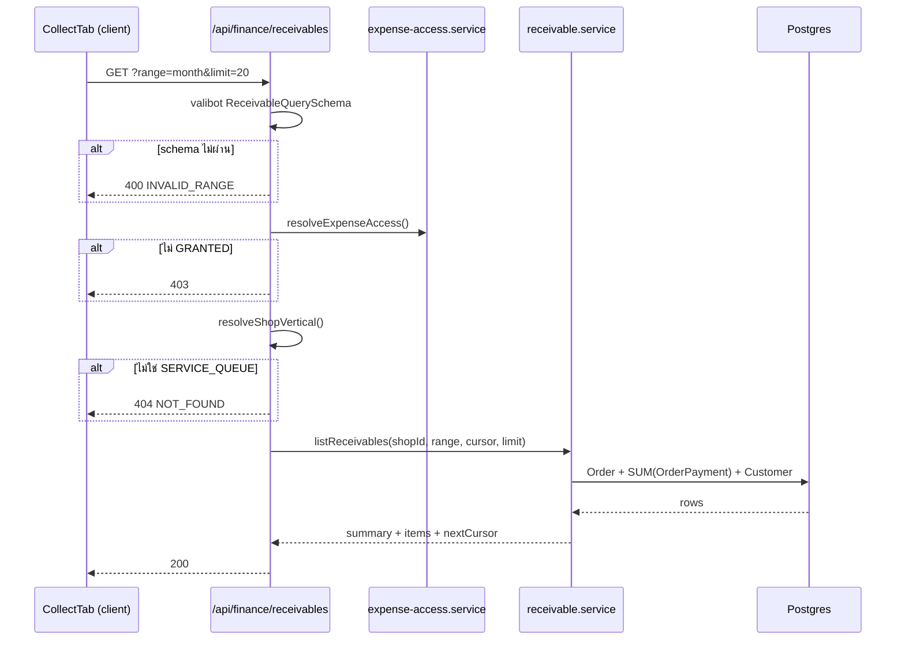

> **โมดูล:** 00067 — Shop Finance Tabs
> **ประเภทเอกสาร:** API Contract
> **เวอร์ชัน:** 1.0
> **วันที่จัดทำ:** 2026-09-30
> **สถานะ:** Draft

# API Contract: แท็บการเงินร้าน

---

## 1. Overview

ฟีเจอร์นี้ **ใช้ endpoint เดิมของ 00016 ทั้งหมดโดยไม่แก้สัญญา** และเพิ่ม endpoint ใหม่ **1 ตัว** สำหรับรายการที่ยังเก็บเงินไม่ครบ

ข้อมูลของแท็บถูกส่งมากับ RSC ตั้งแต่โหลดหน้าแรก — endpoint ใช้เฉพาะเมื่อผู้ใช้เปลี่ยนช่วงเวลาหรือโหลดรายการเพิ่ม

| หลักการ | รายละเอียด |
|---------|-----------|
| **ไม่แก้สัญญาเดิม** | `/api/expenses*` ทั้งหมดคงเดิม เพราะ vertical อื่นยังใช้อยู่ |
| **ตัดสินสิทธิ์ซ้ำเสมอ** | ทุก endpoint เรียก `resolveExpenseAccess` เอง ไม่เชื่อว่าหน้าเป็นคนกรอง |
| **ไม่มี endpoint เขียนใหม่** | การบันทึกค่าใช้จ่ายยังผ่าน `POST /api/expenses` เดิม |

---

## 2. Authentication

| หัวข้อ | รายละเอียด |
|--------|-----------|
| กลไก | NextAuth session cookie (เหมือนทุก endpoint ของ seller) |
| ไม่มี session | `401 UNAUTHORIZED` |
| มี session แต่ไม่มีร้านที่ active | `403 NO_SHOP` |
| เป็น ADMIN แต่ `staffCanViewFinance = false` | `403 STAFF_NOT_ALLOWED` |
| ร้านไม่ใช่ `SERVICE_QUEUE` (เฉพาะ endpoint ใหม่) | `404 NOT_FOUND` — ไม่ใช่ 403 เพราะ endpoint นั้นไม่มีอยู่สำหรับร้านประเภทนั้น |

---

## 3. Endpoint List

| # | Method | Path | สถานะ | คำอธิบาย |
|---|--------|------|-------|---------|
| 1 | GET | `/api/expenses/report` | **เดิม ไม่แก้** | PnL + รายการค่าใช้จ่ายในช่วง |
| 2 | GET | `/api/expenses` | **เดิม ไม่แก้** | รายการค่าใช้จ่าย (มีตัวกรองหมวด) |
| 3 | POST | `/api/expenses` | **เดิม ไม่แก้** | บันทึกค่าใช้จ่าย |
| 4 | PATCH | `/api/expenses/[id]` | **เดิม ไม่แก้** | แก้ไข |
| 5 | DELETE | `/api/expenses/[id]` | **เดิม ไม่แก้** | ลบ |
| 6 | GET | `/api/finance/receivables` | **ใหม่** | รายการบิลที่ยังเก็บเงินไม่ครบ |

---

## 4. Endpoint Detail

### 4.1 `GET /api/finance/receivables` (ใหม่)

รายการบิลที่ยังเก็บเงินไม่ครบ สำหรับแท็บ "ยอดเก็บเงิน"

**Query parameters**

| พารามิเตอร์ | ชนิด | บังคับ | ค่าเริ่มต้น | คำอธิบาย |
|-------------|------|-------|-------------|---------|
| `range` | `today \| 7d \| 30d \| month \| custom` | ไม่ | `month` | ใช้ `resolveDateRange` ตัวเดียวกับ `/api/expenses/report` |
| `start` | `YYYY-MM-DD` | เมื่อ `range=custom` | — | 🛑 ชื่อ `start`/`end` ไม่ใช่ `from`/`to` — ตามที่ `PnlReportQuerySchema` เดิมใช้ |
| `end` | `YYYY-MM-DD` | เมื่อ `range=custom` | — | |
| `cursor` | string | ไม่ | — | id ของรายการสุดท้ายหน้าก่อน |
| `limit` | int 1–50 | ไม่ | `20` | |

> validate ด้วย Valibot schema `ReceivableQuerySchema` ที่ **สืบทอดช่อง `range`/`start`/`end` จาก `PnlReportQuerySchema` เดิม** ด้วย `v.object({ ...PnlReportQuerySchema.entries })` — ห้ามเขียนกฎ range ชุดที่สอง (Hard Rule 16)

**Response 200**

```json
{
  "summary": {
    "salesTotal": 57300.00,
    "receivedTotal": 56400.00,
    "outstandingTotal": 900.00,
    "orderCount": 16,
    "outstandingCount": 1
  },
  "items": [
    {
      "orderId": "0f1e...",
      "orderNo": "SQ-2569-0912",
      "customerName": "คุณสมชาย ท.",
      "conversationId": "c-8a2f...",
      "title": "ติดตั้งไฟซีนอน",
      "createdAt": "2026-09-07T03:12:00.000Z",
      "totalAmount": 900.00,
      "receivedAmount": 0.00,
      "outstandingAmount": 900.00,
      "daysOutstanding": 23
    }
  ],
  "nextCursor": null,
  "daily": { "2026-09-07": { "sales": 900.00, "received": 0.00 } }
}
```

**กฎของ payload**

| กฎ | รายละเอียด |
|----|-----------|
| **R1** | `salesTotal` นับด้วย `withoutDrafted(['CANCELLED', 'RETURNED'])` — ตัดใบที่ยกเลิก · **คืนของครบทั้งใบ (`RETURNED`, เพิ่ม 2026-10-01)** · และ**ร่างออเดอร์ (`DRAFTED`, feature 00061)** 🛑 เขียนแค่ `status: { not: 'CANCELLED' }` จะนับร่างเป็นยอดค้างรับ แล้วร้านไปทวงเงินจากบิลที่ยังไม่เคยเปิดจริง — **คนละนิยามกับแท็บกำไร** ต้องมีข้อความกำกับบนหน้าจอ (ดู [[SRS]] TFR-005) |
| **R2** | `receivedTotal` นับเฉพาะ `OrderPayment.voidedAt IS NULL` |
| **R3** | `outstandingTotal = salesTotal − receivedTotal` เสมอ — ฝั่ง client ห้ามคำนวณเอง |
| **R4** | `daily` (เพิ่ม 2026-10-01) — คีย์ `thaiDayKey` ของวันเปิดบิล · คิดจาก**แถวชุดเดียวกับ summary** ⇒ Σ`sales` = `salesTotal`, Σ`received` = `receivedTotal` · ใช้แยกแท่ง รับจริง/ค้างรับ รายวันใน `/sales` |
| **R4** | `items` มีเฉพาะ `outstandingAmount > 0` เรียง `createdAt` เก่าสุดก่อน |
| **R5** | บิลที่ `receivedAmount > totalAmount` **ไม่อยู่ใน `items`** แต่ยังนับใน `summary` ตามจริง |
| **R6** | `conversationId` เป็น `null` ได้ — client ต้องตกไปลิงก์หน้าบิลแทน |
| **R7** | `customerName` ว่างไม่ได้ — มาจาก `Order.buyerName` เท่านั้น ว่าง → `'ไม่ระบุชื่อ'` 🛑 **ห้ามตกไปใช้เบอร์โทร** (payload ลง RSC flight = ส่ง PII ลูกค้าทุกคนในช่วงนั้น) และตาราง `Customer` ไม่มีช่องชื่อให้ดึงอยู่แล้ว |
| **R8** | จำนวนเงินเป็น string หรือ number ที่ผ่าน `Decimal` มาแล้ว ห้ามผ่าน float ที่คำนวณฝั่ง JS |
| **R9** | `daysOutstanding` นับด้วยวันปฏิทินไทย (`thaiDayKey`) ไม่ใช่ผลต่าง timestamp |

---

## 5. Error Code Table

| HTTP | code | เมื่อไหร่ | ข้อความที่ผู้ใช้เห็น |
|------|------|----------|---------------------|
| 400 | `INVALID_RANGE` | `range`/`from`/`to` ไม่ผ่าน schema | "ช่วงวันที่ไม่ถูกต้อง" |
| 400 | `INVALID_CURSOR` | cursor ไม่ใช่ id ที่รู้จัก | "โหลดรายการเพิ่มไม่สำเร็จ" |
| 401 | `UNAUTHORIZED` | ไม่มี session | ส่งไปหน้าเข้าสู่ระบบ |
| 403 | `NO_SHOP` | ไม่มีร้านที่ active | redirect |
| 403 | `STAFF_NOT_ALLOWED` | ADMIN ที่ไม่มีสิทธิ์การเงิน | จอปฏิเสธสิทธิ์ (ไม่บอกตัวเลขใด ๆ) |
| 404 | `NOT_FOUND` | ร้านไม่ใช่ `SERVICE_QUEUE` | หน้าไม่พบ |
| 500 | `INTERNAL` | อื่น ๆ | `SellerErrorState` พร้อมปุ่มลองใหม่ |

> ข้อความ error ทุกตัวต้องผ่าน dictionary (`src/i18n/dictionaries/`) ทั้ง th และ en ตาม feature 00047 — ห้าม hardcode สตริงใน route

---

## 6. Sequence



---

## 7. Traceability

| FR (BRD) | TFR (SRS) | Endpoint |
|----------|-----------|----------|
| FR-FIN-12 | TFR-005 | `GET /api/finance/receivables` (`summary`) |
| FR-FIN-13 | TFR-005 | `GET /api/finance/receivables` (`items`) |
| FR-FIN-14 | — | `/api/expenses*` เดิม |
| FR-FIN-17 | TFR-009 | ทุก endpoint |
| FR-FIN-18 | TFR-006 | `404` ของ endpoint ใหม่ |

---

## 8. สรุป

เพิ่ม endpoint เดียว ไม่แก้สัญญาเดิมแม้แต่ช่องเดียว

จุดที่ต้องรีวิวหนักที่สุดคือ **R1** — `salesTotal` ของ endpoint นี้ใช้นิยาม "ยอดขาย" คนละตัวกับแท็บกำไรโดยเจตนา ถ้าหน้าจอไม่เขียนกำกับให้ผู้ใช้เห็น มันจะกลายเป็นเคสเดียวกับที่เคยเกิดเมื่อ 2026-08-08 คือผู้ขายเทียบเลขสองที่แล้วไม่ตรง โดยไม่มีอะไรบอกว่าทำไม
