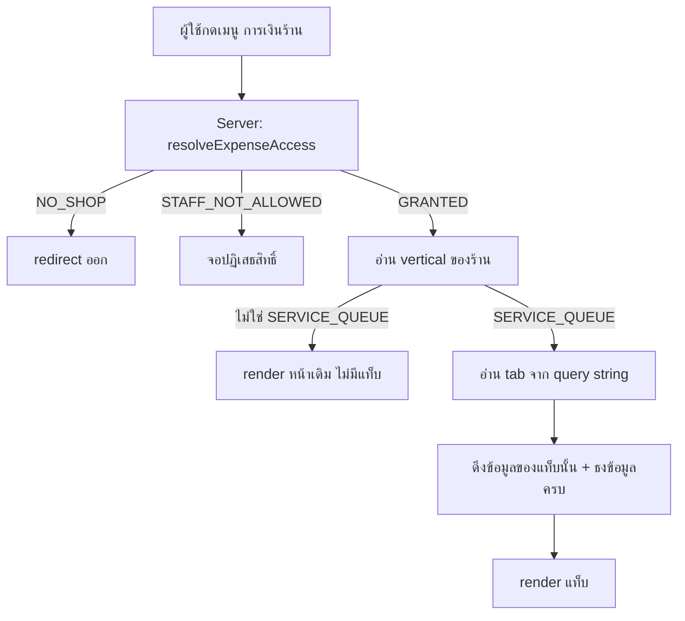
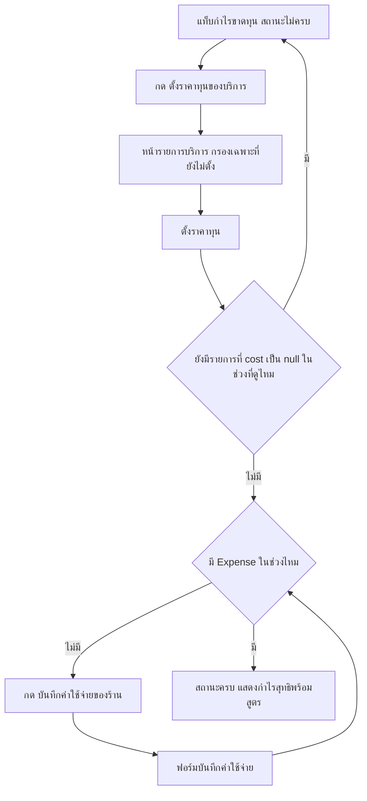
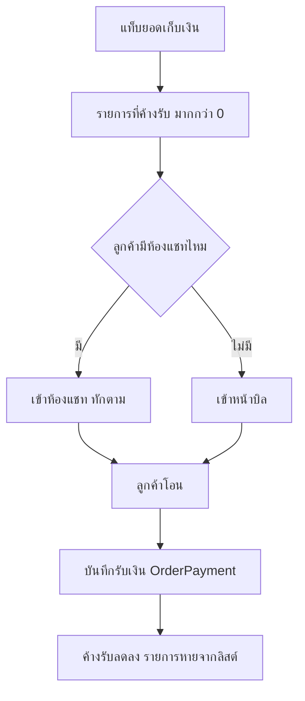

> **โมดูล:** 00067 — Shop Finance Tabs
> **ประเภทเอกสาร:** Business Requirements Document (BRD)
> **เวอร์ชัน:** 1.0
> **วันที่จัดทำ:** 2026-09-30
> **สถานะ:** Draft — รอ user review

# BRD: แท็บการเงินร้าน (Business Requirements Document)

---

## 1. บทนำ

### 1.1 วัตถุประสงค์ของเอกสาร

เอกสารนี้แปลงความต้องการทางธุรกิจใน [[PRD]] เป็น **Functional Requirements** พร้อม **Acceptance Criteria** ที่ตรวจสอบได้ เพื่อให้ทีมพัฒนาและ QA ใช้เป็นเกณฑ์ตัดสินว่างานเสร็จหรือยัง

ทุก FR ในเอกสารนี้ต้องมี AC ที่เขียนเป็นประโยคที่ตอบได้ว่า **ผ่าน/ไม่ผ่าน** — ห้ามมี AC ที่ต้องใช้ดุลพินิจ

### 1.2 ขอบเขตของระบบ

**อยู่ในขอบเขต:**

| ส่วน | รายละเอียด |
|------|-----------|
| หน้า `/seller/sales` | เปลี่ยนเป็น "การเงินร้าน" 3 แท็บ (เฉพาะ `SERVICE_QUEUE`) |
| หน้า `/seller/expenses` | ยกเนื้อหามาเป็นแท็บ 3 · route เดิมยังเปิดได้และพาไปแท็บที่ถูก |
| การ์ดยอดขายหน้าแรก | เพิ่มสวิตช์ 2 ทาง ยอดขาย ⟷ กำไรขาดทุน ใช้สูตรเดียวกับแท็บ |
| เมนูซ้าย/เมนูมือถือ | รวมรายการเรื่องเงินให้เหลือรายการเดียว |
| `ORDER_VOCAB` | เพิ่มคำเรียกต้นทุนต่อ vertical |
| สูตรกำไร | รวม `/sales` กับ `/expenses` ให้เหลือสูตรเดียว |

**ไม่อยู่ในขอบเขต:** ตาม [[PRD]] §5

### 1.3 กลุ่มผู้ใช้งาน

| กลุ่ม | สิทธิ์ | เห็นอะไร |
|------|-------|---------|
| **OWNER** | เต็ม | ทั้ง 3 แท็บ + บันทึก/แก้/ลบค่าใช้จ่าย |
| **ADMIN** + `staffCanViewFinance = true` | ดูและบันทึก | ทั้ง 3 แท็บ + บันทึกค่าใช้จ่าย |
| **ADMIN** + `staffCanViewFinance = false` | ไม่มี | จอปฏิเสธสิทธิ์ ไม่มีตัวเลขใด ๆ ใน HTML |
| ผู้ใช้ที่ไม่ใช่สมาชิกร้าน | ไม่มี | redirect ออก |

---

## 2. ความต้องการหลัก (Functional Requirements)

### 2.1 โครงหน้าและแท็บ

#### FR-FIN-01 — หน้า "การเงินร้าน" มี 3 แท็บ

หน้า `/seller/sales` ของร้าน `SERVICE_QUEUE` ต้องแสดงแถบแท็บ 3 แท็บตามลำดับ: กำไรขาดทุน · ยอดเก็บเงิน · ค่าใช้จ่าย

| AC | เกณฑ์ |
|----|-------|
| **AC-01** | เปิด `/seller/sales` โดยไม่มี query string → แท็บที่เลือกคือ **กำไรขาดทุน** |
| **AC-02** | แถบแท็บใช้โครง `nav-tabs`/`nav-link` ของ Paces (border-bottom 2px) ไม่ใช่ pill ที่เขียนเอง |
| **AC-03** | ทุกปุ่มแท็บมี `role="tab"`, `aria-selected`, และอยู่ใน `role="tablist"` ที่มี `aria-label` |
| **AC-04** | สลับแท็บแล้วหัวข้อหน้า (`<title>`) เปลี่ยนตามแท็บ |
| **AC-05** | ความสูงที่แตะได้ของปุ่มแท็บ ≥ 44px |

#### FR-FIN-02 — แท็บที่เลือกอยู่ใน URL

| AC | เกณฑ์ |
|----|-------|
| **AC-01** | เลือกแท็บแล้ว URL มี `?tab=pnl` / `?tab=collect` / `?tab=expense` |
| **AC-02** | เปิด URL ที่มี `?tab=expense` ตรง ๆ → ได้แท็บค่าใช้จ่ายทันที ไม่กระพริบผ่านแท็บแรก |
| **AC-03** | ค่า `tab` ที่ไม่รู้จัก → ตกไปแท็บกำไรขาดทุน ไม่ใช่จอว่างหรือ 500 |
| **AC-04** | กด back ของเบราว์เซอร์แล้วกลับไปแท็บก่อนหน้า |

#### FR-FIN-03 — `/seller/expenses` ยังเปิดได้

| AC | เกณฑ์ |
|----|-------|
| **AC-01** | ร้าน `SERVICE_QUEUE` เปิด `/seller/expenses` → ไปที่ `/seller/sales?tab=expense` |
| **AC-02** | ร้าน `ONLINE_SALES` / `LODGING` เปิด `/seller/expenses` → เห็นหน้าเดิมทุกอย่าง ไม่ redirect |
| **AC-03** | ลิงก์เก่าที่ผู้ใช้บุ๊กมาร์กไว้ต้องไม่ 404 |

#### FR-FIN-04 — เมนูเหลือรายการเดียว

| AC | เกณฑ์ |
|----|-------|
| **AC-01** | ร้าน `SERVICE_QUEUE` เห็นเมนูเรื่องเงิน **1 รายการ** ชื่อ "การเงินร้าน" |
| **AC-02** | ร้าน vertical อื่นยังเห็น 2 รายการเหมือนเดิม (`ภาพรวมกำไร/ขาดทุน` + `ค่าใช้จ่าย`) |
| **AC-03** | รายการเมนูที่ถูกตัดออกต้องไม่เหลือ slug ค้างที่ไม่มีหน้ารองรับ |

### 2.2 แท็บกำไรขาดทุน

#### FR-FIN-05 — สูตรกำไรสูตรเดียว

| AC | เกณฑ์ |
|----|-------|
| **AC-01** | ตัวเลขกำไรบนแท็บนี้ = ผลจาก `getPnlReport()` ตัวเดียวกับที่หน้า `/expenses` เดิมใช้ |
| **AC-02** | ค่ากำไรของช่วงเดียวกันที่แสดงบนการ์ดหน้าแรก กับบนแท็บนี้ **ต้องเท่ากันทุกบาท** |
| **AC-03** | สูตรถูก render เป็นข้อความบนหน้าจอ ไม่ใช่อยู่แค่ในคอมเมนต์ |
| **AC-04** | ไม่มีไฟล์ใดใน `src/app/(paces)/seller/(dashboard)/sales/**` คำนวณกำไรด้วยสูตรของตัวเอง |
| **AC-05** | คำ/สี/ไอคอนของกำไรมาจาก `order-profit-presentation.ts` เท่านั้น |

#### FR-FIN-06 — แถบองค์ประกอบของกำไร

แสดงที่มาของกำไรเป็นรายการ: ยอดขายที่ยืนยันแล้ว → หักต้นทุน → หักค่าใช้จ่ายร้าน → กำไรสุทธิ

| AC | เกณฑ์ |
|----|-------|
| **AC-01** | ผลบวก/ลบของทุกบรรทัดต้องเท่ากับตัวเลขใหญ่เป๊ะ |
| **AC-02** | บรรทัดที่เป็นเงินออกแสดงเครื่องหมายลบนำหน้า |
| **AC-03** | คำเรียกต้นทุนมาจาก `ORDER_VOCAB` ของ vertical นั้น (ร้านบริการ = "ต้นทุนอะไหล่") |

#### FR-FIN-07 — กราฟรายได้เทียบค่าใช้จ่าย

| AC | เกณฑ์ |
|----|-------|
| **AC-01** | กราฟมี 2 ซีรีส์: รายได้ และ ค่าใช้จ่าย |
| **AC-02** | ชื่อซีรีส์ที่อ้างใน `yaxis.seriesName` ต้องตรงกับชื่อซีรีส์ที่มีอยู่จริง |
| **AC-03** | สีทุกเส้น/แท่งมาจาก `getColor('chart-*')` ไม่มี hex ตรง ๆ |
| **AC-04** | เดือนที่ไม่มีข้อมูลต้องแสดงเป็นแท่งศูนย์ ไม่ใช่หายไปจากแกน |
| **AC-05** | เดือนที่ค่าใช้จ่ายสูงกว่ารายได้ต้องอ่านออกว่าขาดทุน |

#### FR-FIN-08 — ตารางแยกรายวัน

| AC | เกณฑ์ |
|----|-------|
| **AC-01** | คอลัมน์: วันที่ · จำนวนครั้ง · ยอดขาย · ต้นทุน · กำไร (มือถือ) และเพิ่มคอลัมน์ค่าใช้จ่าย + อัตรากำไร (จอใหญ่) |
| **AC-02** | ผลรวมทุกคอลัมน์เท่ากับตัวเลขบนหัวเสมอ |
| **AC-03** | ที่ความกว้าง 390px ตารางต้องไม่เลื่อนแนวนอน |
| **AC-04** | มีหมายเหตุใต้ตารางว่าค่าใช้จ่ายลงตามวันที่บันทึก ไม่ได้เฉลี่ยรายวัน |

### 2.3 สถานะข้อมูลไม่ครบ

#### FR-FIN-09 — ตรวจความครบของข้อมูล

| AC | เกณฑ์ |
|----|-------|
| **AC-01** | ถือว่าไม่ครบเมื่อ `PnlReport.hasMissingCost = true` **หรือ** ไม่มี `Expense` ในช่วงที่ดู |
| **AC-02** | การตัดสินนี้ทำที่ server ส่งมาเป็นค่าเดียว ไม่ให้ฝั่ง client เดาเอง |
| **AC-03** | ใช้ `isMissingCost()` ตัวเดิมเป็นเกณฑ์ ไม่เขียนเกณฑ์ใหม่ |

#### FR-FIN-10 — การแสดงผลเมื่อข้อมูลไม่ครบ

| AC | เกณฑ์ |
|----|-------|
| **AC-01** | ป้ายหัวข้อเปลี่ยนจาก "กำไรสุทธิ" เป็น **"กำไรได้มากที่สุด"** |
| **AC-02** | ตัวเลขมีเครื่องหมาย `≤` นำหน้า |
| **AC-03** | สีตัวเลขเป็นกลาง (`text-default-*`) ห้ามเขียวหรือแดง |
| **AC-04** | มีป้ายข้อความ "ตัวเลขนี้ยังไม่ใช่กำไรจริง" อยู่เหนือตัวเลข |
| **AC-05** | ไม่มีเส้นทางใดที่ทำให้แสดงคำว่า "กำไรสุทธิ" ในสถานะนี้ |

#### FR-FIN-11 — ทางลัดไปเติมข้อมูล

| AC | เกณฑ์ |
|----|-------|
| **AC-01** | ปุ่ม "ตั้งราคาทุนของบริการ" แสดงเมื่อ `hasMissingCost = true` พร้อมตัวนับ "ยังไม่ได้ตั้ง n จาก m" |
| **AC-02** | กดแล้วไปหน้ารายการบริการที่ **กรองเฉพาะรายการที่ยังไม่ตั้งต้นทุน** ไม่ใช่รายการทั้งหมด |
| **AC-03** | ปุ่ม "บันทึกค่าใช้จ่ายของร้าน" แสดงเมื่อไม่มี `Expense` ในช่วง และพาไปแท็บค่าใช้จ่ายพร้อมเปิดฟอร์ม |
| **AC-04** | เมื่อข้อมูลครบแล้ว ปุ่มทั้งสองต้องหายไป |
| **AC-05** | ตัวนับ n/m ต้องนับจากรายการที่ **ขายจริงในช่วงนั้น** ไม่ใช่รายการทั้งร้าน |

### 2.4 แท็บยอดเก็บเงิน

#### FR-FIN-12 — สมการการเก็บเงิน

| AC | เกณฑ์ |
|----|-------|
| **AC-01** | แสดง `รับจริง + ค้างรับ = ยอดขาย` และผลบวกต้องลงตัวเสมอ |
| **AC-02** | ตัวเลขทั้งสามเป็นชุดเดียวกับที่หน้าเดิมแสดง ไม่เปลี่ยนนิยาม |
| **AC-03** | มีหมายเหตุว่าค้างรับ = ยังไม่บันทึกรับเงิน ไม่ใช่ลูกค้าไม่จ่าย |

#### FR-FIN-13 — รายการต้องตามเก็บ

| AC | เกณฑ์ |
|----|-------|
| **AC-01** | แสดงเฉพาะบิลที่ `ค้างรับ > 0` เรียงจากค้างนานที่สุด |
| **AC-02** | แต่ละรายการแสดง ชื่อลูกค้า · ชื่อบริการ · วันที่ · ยอดค้าง · จำนวนวันที่ค้าง |
| **AC-03** | กดแล้วไปห้องแชทของลูกค้าคนนั้น ถ้ามี — ถ้าไม่มีให้ไปหน้าบิล |
| **AC-04** | ไม่มีรายการค้างเลย → แสดง empty state ด้วย `SellerEmptyState` ไม่ใช่ตารางว่าง |
| **AC-05** | บิลที่ยกเลิกแล้วต้องไม่ปรากฏ |

### 2.5 แท็บค่าใช้จ่าย

#### FR-FIN-14 — ย้ายเนื้อหาหน้า `/expenses` มาครบ

| AC | เกณฑ์ |
|----|-------|
| **AC-01** | มีครบทั้ง สรุปยอด · แยกตามหมวด · รายการ · ตัวกรองหมวด · ฟอร์มบันทึก/แก้/ลบ |
| **AC-02** | ทุกความสามารถที่หน้าเดิมทำได้ ต้องทำได้ในแท็บนี้ — ไม่มีความสามารถไหนหายไป |
| **AC-03** | ฟอร์มยังเรียก API เดิม (`/api/expenses`) ไม่สร้าง endpoint ใหม่ |

#### FR-FIN-15 — แยกให้ชัดว่าอะไรต้องกรอกเอง

| AC | เกณฑ์ |
|----|-------|
| **AC-01** | แสดงต้นทุนอะไหล่เป็นรายการอ่านอย่างเดียว พร้อมข้อความว่าระบบคิดให้เองจากราคาทุน |
| **AC-02** | ต้นทุนอะไหล่ต้องแยกออกจากรายการค่าใช้จ่ายที่กรอกเอง ไม่ปนกันในลิสต์เดียว |
| **AC-03** | มีข้อความบอกว่าบันทึกที่นี่เฉพาะค่าใช้จ่ายของร้าน |

### 2.6 การ์ดหน้าแรก

#### FR-FIN-16 — สวิตช์บนการ์ดยอดขาย · 🛑 **ยังทำไม่ได้ — ติดมติที่ยังไม่ถูกเคาะ**

> **สถานะ: BLOCKED (2026-09-30)** — ไม่ได้ implement ในรอบนี้โดยตั้งใจ
>
> AC-02 บอกว่า "โหมดกำไรใช้ตัวเลขชุดเดียวกับแท็บกำไรขาดทุน" แต่การ์ดหน้าแรก
> (`SalesChartSheet.tsx:504`) คำนวณ `heroValue` ด้วย **สูตรของ `/sales`**
> (`ยอดขาย − ต้นทุน − ค่าส่ง`) ซึ่งไม่เคย query ตาราง `Expense` เลยตั้งแต่มติ user 2026-08-09
>
> ⇒ จะทำให้ตรงตาม AC-02 ได้ ต้อง **รวมสูตรกำไรก่อน** (FR-FIN-05 / SRS TFR-003)
> ซึ่งเป็นการกลับมติ 2026-08-09 ที่ **ยังไม่มีใครเคาะ** และกระทบร้าน `ONLINE_SALES`
> ที่ใช้การ์ดใบเดียวกัน = นอกขอบเขต "ร้านบริการก่อน อีก 2 ไม่แตะ" ที่เคาะไว้
>
> 🛑 **ทางที่ห้ามทำ: ใส่สวิตช์ไปก่อนโดยให้โหมดกำไรใช้สูตรของการ์ดเอง** — จะได้ตัวเลขชุดที่สาม
> ของสิ่งเดียวกัน ซึ่งเป็นบั๊ก P0 ที่รีโปนี้เคยเจอมาแล้วเมื่อ 2026-08-08 และไม่มี gate ไหนจับได้
>
> **ทางเข้าที่มีอยู่แล้วและใช้ได้:** เมนู "การเงินร้าน" (FR-FIN-04) พาไปหน้าเดียวกันทุกแท็บ
>
> **ปลดล็อกเมื่อ:** user เคาะว่าจะรวมสูตรกำไรหรือไม่ (คำถามนี้ยังไม่เคยถูกถาม)

| AC | เกณฑ์ |
|----|-------|
| **AC-01** | การ์ดมีสวิตช์ 2 ทาง: ยอดขาย ⟷ กำไรขาดทุน |
| **AC-02** | โหมดกำไรใช้ตัวเลขชุดเดียวกับแท็บกำไรขาดทุน (FR-FIN-05 AC-02) |
| **AC-03** | โหมดกำไรในสถานะข้อมูลไม่ครบต้องใช้กฎเดียวกับ FR-FIN-10 |
| **AC-04** | ปุ่ม CTA ใต้การ์ดพาไปแท็บที่ตรงกับโหมดที่เลือกอยู่ |
| **AC-05** | ร้าน vertical อื่นไม่เห็นสวิตช์นี้ |

### 2.7 สิทธิ์และขอบเขต

#### FR-FIN-17 — สิทธิ์การเงิน

| AC | เกณฑ์ |
|----|-------|
| **AC-01** | ทั้ง 3 แท็บผ่าน `resolveExpenseAccess` ตัวเดียวกัน |
| **AC-02** | `STAFF_NOT_ALLOWED` → ไม่มีตัวเลขการเงินใด ๆ ใน HTML ที่ส่งออก (ตรวจที่ payload ไม่ใช่ที่สายตา) |
| **AC-03** | `NO_SHOP` → redirect ออกเหมือนเดิม |
| **AC-04** | เรียก API ของแท็บโดยตรงด้วยบัญชีที่ไม่มีสิทธิ์ → 403 |

#### FR-FIN-18 — ขอบเขต vertical

| AC | เกณฑ์ |
|----|-------|
| **AC-01** | ร้าน `ONLINE_SALES` เปิด `/seller/sales` → ไม่มีแถบแท็บ เห็นหน้าเดิม |
| **AC-02** | ร้าน `LODGING` เช่นเดียวกัน |
| **AC-03** | มีเทสที่ยืนยัน AC-01 และ AC-02 โดยตรง |
| **AC-04** | การตัดสินใช้ `resolveShopVertical` ตัวเดิม ไม่เทียบสตริงเอง |

### 2.8 คำศัพท์ต่อ vertical

#### FR-FIN-19 — คำเรียกต้นทุนเข้า `ORDER_VOCAB`

| AC | เกณฑ์ |
|----|-------|
| **AC-01** | `ORDER_VOCAB` มีช่อง `costNoun` ครบทั้ง 3 vertical |
| **AC-02** | `SERVICE_QUEUE` = "ต้นทุนอะไหล่" · `ONLINE_SALES` = "ต้นทุนสินค้า" (คำเดิม) · `LODGING` = "ต้นทุนต่อห้อง" |
| **AC-03** | ไม่มีไฟล์ใดเขียนคำว่า "ต้นทุนสินค้า" ตรง ๆ ในข้อความที่ผู้ใช้เห็น นอกจากในตารางคำนี้ |
| **AC-04** | มีเทสที่ยืนยันว่าทุก vertical ใน `ORDER_VOCAB` มี `costNoun` (มิเรอร์เทส `PRODUCT_VOCAB` ที่มีอยู่แล้ว) |

---

## 3. Acceptance Criteria สรุป

### 3.1 โครงหน้า
- [ ] 3 แท็บครบ ลำดับถูก แท็บเริ่มต้นคือกำไรขาดทุน
- [ ] แท็บอยู่ใน URL · back/forward ทำงาน · ค่าแปลกตกไปแท็บแรก
- [ ] `/seller/expenses` ไม่ 404 สำหรับทุก vertical
- [ ] เมนูร้านบริการเหลือรายการเดียว

### 3.2 ความถูกต้องของตัวเลข
- [ ] กำไรบนการ์ดหน้าแรก = กำไรบนแท็บ ทุกบาท
- [ ] `รับจริง + ค้างรับ = ยอดขาย` ลงตัว
- [ ] ผลรวมตารางรายวัน = ตัวเลขบนหัว
- [ ] ไม่มีไฟล์ใดคำนวณกำไรด้วยสูตรของตัวเอง

### 3.3 ข้อมูลไม่ครบ
- [ ] ป้าย "ตัวเลขนี้ยังไม่ใช่กำไรจริง" แสดงครบทุกเส้นทาง
- [ ] ไม่มีเส้นทางใดแสดงคำว่า "กำไรสุทธิ" ในสถานะไม่ครบ
- [ ] CTA ทั้งสองพาไปหน้าที่กรองแล้ว ไม่ใช่หน้ารวม

### 3.4 สิทธิ์และขอบเขต
- [ ] พนักงานที่ไม่มีสิทธิ์ไม่เห็นตัวเลขใน payload
- [ ] ร้าน vertical อื่นไม่เห็นแท็บ — มีเทสยืนยัน

---

## 4. Business Flows

### 4.1 Flow หลัก: เปิดหน้าการเงินร้าน

### 4.2 Flow: ร้านเติมข้อมูลจนกำไรมีความหมาย

### 4.3 Flow: ตามเก็บเงิน

---

## 5. Use Case Scenarios

### Scenario 1: Best Case — ร้านที่ข้อมูลครบ

**ก่อน:** ร้านตั้งราคาทุนครบ และบันทึกค่าเช่า 3,000 กับค่าโฆษณา 2,000 แล้ว

1. เจ้าของเปิด "การเงินร้าน"
2. แท็บกำไรขาดทุนแสดง **กำไรสุทธิ +18,700** สีเขียว พร้อมสูตรใต้ตัวเลข
3. แถบองค์ประกอบแสดง 33,500 − 9,800 − 5,000 = 18,700
4. กราฟแสดง 6 เดือนย้อนหลัง เดือน ส.ค. เป็นแท่งที่ค่าใช้จ่ายสูงกว่ารายได้ อ่านออกว่าขาดทุน
5. เจ้าของเลื่อนดูตารางรายวัน ผลรวมตรงกับหัว

**ผลที่คาดหวัง:** ไม่มีป้ายเตือน ไม่มีปุ่ม CTA ตั้งค่า

### Scenario 2: สภาพจริงวันนี้ — ยังไม่มีข้อมูลเลย

**ก่อน:** ร้าน BT Premium — ไม่มี `Product.cost` และไม่มี `Expense` แม้แต่แถวเดียว

1. เจ้าของเปิดแท็บกำไรขาดทุน
2. เห็นป้าย "ตัวเลขนี้ยังไม่ใช่กำไรจริง"
3. ตัวเลขคือ **≤ 33,500** สีเทา ไม่ใช่เขียว
4. รายการด้านล่างแสดง ต้นทุนอะไหล่ = "ยังไม่ได้ตั้ง" · ค่าใช้จ่ายร้าน = "ยังไม่มีรายการ"
5. มีปุ่มสองปุ่มพาไปเติมข้อมูล

**ผลที่คาดหวัง:** ไม่มีคำว่า "กำไรสุทธิ" ปรากฏที่ใดเลยบนจอนี้

### Scenario 3: Negative — พนักงานที่ไม่มีสิทธิ์

1. ADMIN ที่ `staffCanViewFinance = false` เปิด `/seller/sales`
2. เห็นจอปฏิเสธสิทธิ์
3. ผู้ทดสอบเปิด view-source / ดู RSC payload
4. **ต้องไม่พบตัวเลขยอดขาย กำไร หรือค่าใช้จ่ายใด ๆ**
5. ผู้ทดสอบยิง `GET /api/expenses/report` ตรง ๆ ด้วยบัญชีนั้น → **403**

### Scenario 4: Negative — ร้านขายของออนไลน์

1. เจ้าของร้าน `ONLINE_SALES` เปิด `/seller/sales`
2. เห็นหน้าเดิม ไม่มีแถบแท็บ
3. เปิด `/seller/expenses` → เห็นหน้าเดิม ไม่ถูก redirect
4. เมนูยังมี 2 รายการเหมือนเดิม

### Scenario 5: Edge — ข้อมูลครบครึ่งเดียว

1. ร้านตั้งราคาทุนครบแล้ว แต่ยังไม่มีค่าใช้จ่ายในเดือนนี้
2. สถานะยังเป็น "ไม่ครบ" ตาม FR-FIN-09 AC-01
3. ปุ่ม "ตั้งราคาทุน" **หายไป** เหลือแต่ปุ่ม "บันทึกค่าใช้จ่าย"

### Scenario 6: Edge — เปลี่ยนช่วงเวลาแล้วสถานะเปลี่ยน

1. เดือนนี้มีค่าใช้จ่ายครบ → สถานะครบ
2. ผู้ใช้เลื่อนไปดูเดือนก่อนซึ่งไม่มี `Expense` เลย
3. สถานะกลับเป็น "ไม่ครบ" และป้ายกลับมา

---

## 6. ความต้องการด้านคุณภาพ

### 6.1 ความถูกต้องของข้อมูล
- ตัวเลขเดียวกันที่ปรากฏบนหลายจอ ต้องมาจากฟังก์ชันเดียวกัน
- ผลรวมทุกตารางต้องเท่ากับหัวเสมอ ตรวจด้วยเทส ไม่ใช่ด้วยสายตา
- เงินใช้ `Decimal(12,2)` ตลอดสายจนถึงจุด format สุดท้าย

### 6.2 ความรวดเร็ว
- การเปิดแต่ละแท็บต้องไม่เพิ่มจำนวน query เกินที่หน้าเดิมใช้ — ดึงเฉพาะข้อมูลของแท็บที่เปิดอยู่
- สลับแท็บไม่ต้องโหลดหน้าใหม่ทั้งหน้า

### 6.3 ความน่าเชื่อถือ
- ข้อมูลบางส่วนหาย (เช่น ยังไม่รู้ค่าส่ง) ต้องติดป้าย ไม่ใช่แสดงเป็น 0 เงียบ ๆ
- ทุกตัวเลขที่เป็นเพดานบนต้องมีป้ายเสมอ

### 6.4 ความปลอดภัย
- สิทธิ์ตัดสินที่ server ทุกครั้ง
- ไม่ส่งข้อมูลการเงินไปกับ payload ของผู้ที่ไม่มีสิทธิ์

### 6.4a ภาษา

หน้านี้และหน้าพี่น้องทั้งหมด (`/expenses`, `/sales`, `/reports/*`) **hardcode ภาษาไทย** —
ยืนยันแล้วว่า `PnlReportCard.tsx` และ `ExpenseList.tsx` ไม่ import dictionary ของ feature 00047 เลย
ฟีเจอร์นี้จึงเขียนไทยตรง ๆ ให้ตรงกับพี่น้อง (`sibling-surface-parity.md`)
**เป็นหนี้ระดับ section ที่มีอยู่ก่อนแล้ว ไม่ใช่หนี้ที่ฟีเจอร์นี้สร้าง** — แปลทั้ง section พร้อมกันวันหลัง

### 6.5 ความสะดวกในการใช้งาน
- ใช้งานได้ที่ความกว้าง 390px โดยไม่เลื่อนแนวนอน
- ปุ่มและแท็บสูง ≥ 44px
- เข้าถึงด้วยคีย์บอร์ดได้ (`role="tablist"` + roving tabindex)
- ตัวอักษรบนพื้นต้องผ่าน contrast 4.5:1

---

## 7. ข้อจำกัด (Constraints)

### 7.1 ข้อจำกัดทางธุรกิจ
- ไม่รองรับระบบเจ้าหนี้ในรอบนี้
- ไม่ทำภาษี/VAT
- ไม่ย้อนเติมต้นทุนออเดอร์เก่า

### 7.2 ข้อจำกัดทางเทคนิค
- ห้ามแก้ schema — ฟีเจอร์นี้เป็นงาน presentation ล้วน (ดู [[DATABASE]])
- UI ต้องประกอบจาก Paces primitive เท่านั้น (Hard Rule 7) ห้าม arbitrary Tailwind value
- กราฟต้อง copy โครงจาก `theme/paces/.../widgets/charts/components/` และผ่าน `@/components/wrappers/ApexChart` (Hard Rule 10)
- Toast ต้องเป็น `pacesToast` (Hard Rule 9)
- ห้าม emoji (Hard Rule 12)
- ต้องผ่าน `safepay-ux` ก่อนเขียนโค้ด (Hard Rule 8)
- แก้เอกสาร FROZEN CONTRACT ของ 00016 ในงานเดียวกัน

---

## 8. กฎทางธุรกิจ (Business Rules)

### 8.1 กฎเรื่องตัวเลข
- **BR-FIN-01** นิยามกำไรเดียวทั้งระบบ
- **BR-FIN-02** ตัวเลขจากข้อมูลไม่ครบ = เพดานบน ต้องมีป้าย
- **BR-FIN-04** ยอดขายที่ใช้คิดกำไร = `revenueOrderWhere`
- **BR-FIN-05** ต้นทุนเป็น snapshot ณ วันเปิดบิล
- **BR-FIN-06** ค่าใช้จ่ายลงตามวันที่บันทึก ไม่เฉลี่ย

### 8.2 กฎเรื่องสิทธิ์และขอบเขต
- **BR-FIN-03** สิทธิ์การเงินตัดสินที่ server ด้วย `resolveExpenseAccess`
- **BR-FIN-07** มีผลเฉพาะ `SERVICE_QUEUE`

---

## 9. อภิธานศัพท์

ดู [[PRD]] §7 — ใช้ชุดเดียวกัน ห้ามนิยามซ้ำในเอกสารนี้

---

## 10. สรุป

ฟีเจอร์นี้ไม่เพิ่มตารางและไม่เพิ่ม endpoint ใหม่ — เป็นการ **จัดระเบียบสิ่งที่มีอยู่แล้วให้ตอบคำถามเดียวได้ครบ** พร้อมกับปิดช่องที่ทำให้ตัวเลขโกหกเมื่อข้อมูลไม่ครบ

ความสำเร็จวัดที่ว่า **ร้านเริ่มกรอกต้นทุน** ไม่ใช่ที่ว่ากราฟสวยแค่ไหน
