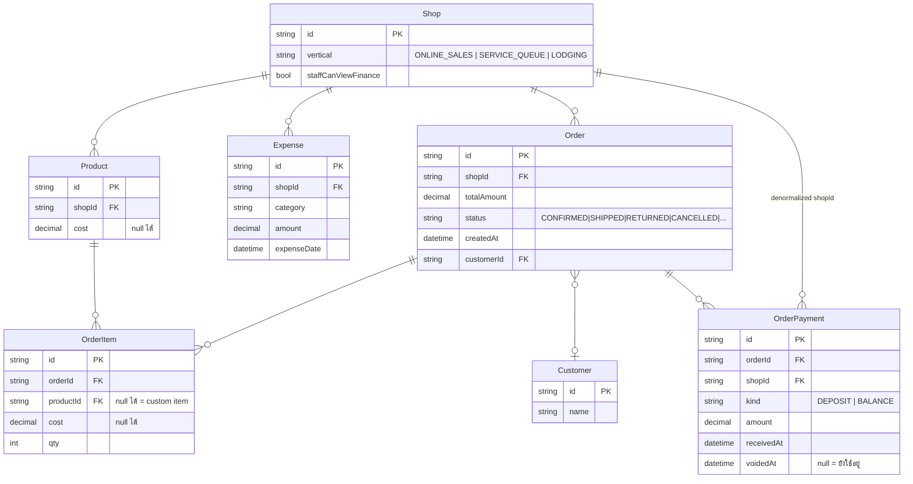

> **โมดูล:** 00067 — Shop Finance Tabs
> **ประเภทเอกสาร:** Database Design
> **เวอร์ชัน:** 1.0
> **วันที่จัดทำ:** 2026-09-30
> **สถานะ:** Draft

# DATABASE: แท็บการเงินร้าน

---

## 1. Overview

> 🛑 **ฟีเจอร์นี้ไม่มีการเปลี่ยนแปลง schema ใด ๆ — ไม่มีตารางใหม่ ไม่มีคอลัมน์ใหม่ ไม่มี index ใหม่ ไม่มีไฟล์ migration**

เอกสารนี้จึงทำหน้าที่สองอย่าง:

1. **ยืนยันว่าข้อมูลที่ฟีเจอร์ต้องการมีครบแล้ว** — เพื่อไม่ให้ใครในอนาคตเปิด PR เพิ่มคอลัมน์สรุปโดยคิดว่าจำเป็น
2. **บันทึกข้อจำกัดของ schema ปัจจุบัน** — โดยเฉพาะสาเหตุที่ทำแท็บ "ยอดชำระเงิน" (เจ้าหนี้) ไม่ได้

การ deploy ยังรัน `prisma migrate deploy` ตามปกติ (Hard Rule 15) แต่จะไม่มีไฟล์ใหม่ให้ apply

---

## 2. ERD (ตารางที่ฟีเจอร์นี้อ่าน)

---

## 3. Tables

### 3.1 `Shop` (Postgres) — อ่านอย่างเดียว

| คอลัมน์ | ชนิด | ใช้ทำอะไรในฟีเจอร์นี้ |
|---------|------|---------------------|
| `vertical` | String | ตัดสินว่าจะแสดงแท็บหรือไม่ (BR-FIN-07) |
| `staffCanViewFinance` | Boolean | ด่านสิทธิ์ของ ADMIN (BR-FIN-03) |

**ไม่แก้** — `vertical` ไม่มี CHECK constraint ตาม convention ของโปรเจกต์ จึง**ต้องอ่านผ่าน `resolveShopVertical()` ที่ fail-closed** ไม่ใช่เทียบสตริงเอง

### 3.2 `Order` / `OrderItem` — อ่านอย่างเดียว

| คอลัมน์ | ใช้ทำอะไร | ข้อควรระวัง |
|---------|-----------|-------------|
| `Order.totalAmount` | ยอดขาย | รวม VAT — ฟีเจอร์นี้ไม่แยกภาษี |
| `Order.status` | ตัวกรอง | **มี 5 ค่า ไม่มี CHECK constraint** · `RETURNED` ถูกนับเป็นยอดขายในบางนิยาม ยังไม่เคยมีใครตัดสินว่าควรกันออกไหม |
| `Order.createdAt` | จัดกลุ่มตามวัน | ต้องแปลงเป็นวันปฏิทินไทยด้วย `thaiDayKey` ไม่ใช่ UTC |
| `OrderItem.cost` | COGS | **null ได้** — null แปลว่า "ไม่รู้" ไม่ใช่ 0 |
| `OrderItem.productId` | ตัวนับรายการที่ยังไม่ตั้งต้นทุน | **null ได้** (custom item) — ต้องไม่นับเข้า `uncostedItemCount` |

### 3.3 `OrderPayment` — อ่านอย่างเดียว

| คอลัมน์ | ใช้ทำอะไร | ข้อควรระวัง |
|---------|-----------|-------------|
| `amount` | รับจริง | ต้องกรอง `voidedAt IS NULL` เสมอ |
| `receivedAt` | จัดกลุ่มตามวัน | **คนละแกนกับ `Order.createdAt`** — บิลของเดือนก่อนอาจรับเงินเดือนนี้ |
| `kind` | `DEPOSIT`/`BALANCE` | **ห้ามแสดง "มัดจำ" เป็นคอลัมน์แยกในตารางสรุป** — เป็น subset ที่บวกรวมแล้วเกินยอดขาย (บทเรียน v9 ถอดคอลัมน์นี้ออกไปแล้ว) |

### 3.4 `Expense` — อ่านอย่างเดียว (เขียนผ่าน API เดิมของ 00016)

| คอลัมน์ | ใช้ทำอะไร |
|---------|-----------|
| `amount` | ค่าใช้จ่ายร้าน |
| `category` | แยกหมวด 7 ค่า |
| `expenseDate` | จัดกลุ่มตามวัน/ช่วง (แยกจาก `createdAt` รองรับ backdate) |

> 🛑 **ช่องที่ตารางนี้ไม่มี และเป็นเหตุผลที่ทำ "ยอดชำระเงิน" ไม่ได้:**
> ไม่มีสถานะ `จ่ายแล้ว/ค้างจ่าย` · ไม่มี `เจ้าหนี้/ผู้ขาย` · ไม่มี `วันครบกำหนด` · ไม่มีการผูกกับเอกสารรับของ
> ⇒ `Expense` เป็น **สมุดบันทึกเงินออก** ไม่ใช่ **ระบบเจ้าหนี้** การทำแท็บเจ้าหนี้ต้องเปิดฟีเจอร์ใหม่ที่แก้ schema

### 3.5 `Product` — อ่านอย่างเดียว

`cost` เป็น nullable/opt-in ตาม 00016 — ใช้เพื่อตอบว่า "ยังไม่ได้ตั้ง n จาก m รายการ"

---

## 4. Indexes

**ไม่เพิ่ม index ใหม่** — index ที่มีอยู่รองรับ query ของฟีเจอร์นี้ครบแล้ว:

| Index ที่มีอยู่ | รองรับ query ไหน |
|----------------|-----------------|
| `Expense(shopId, expenseDate)` | ผลรวมค่าใช้จ่ายต่อช่วง · รายการในแท็บค่าใช้จ่าย |
| `OrderPayment(shopId, receivedAt)` | ผลรวมรับจริงต่อช่วง/ต่อวัน |
| `OrderPayment(orderId)` | รับจริงต่อบิล (ใช้คำนวณค้างรับรายใบ) |

**สิ่งที่ต้องเฝ้าดูหลังปล่อย:** query "รายการต้องตามเก็บ" ต้อง aggregate `OrderPayment` ต่อ `Order` — ถ้าร้านมีออเดอร์ต่อเดือนหลักพันแล้ว p95 เกิน NFR-02 ให้พิจารณา index เพิ่มในรอบถัดไป **อย่าเพิ่มล่วงหน้าโดยไม่มีตัวเลข**

---

## 5. Migration Plan

### 5.1 ลำดับการ Migrate

**ไม่มี** — ไม่มีไฟล์ใน `prisma/migrations/` ที่ถูกเพิ่มในฟีเจอร์นี้

หากผู้ทำงานพบว่าต้องเพิ่มคอลัมน์ ให้หยุดและกลับไปอ่าน [[SDS]] TD-005 ก่อน — เกือบทุกกรณีคือการสร้างแหล่งความจริงที่สองซึ่ง Hard Rule 16 ห้าม

### 5.2 Rollback

Rollback = revert โค้ด เท่านั้น ไม่มีสถานะในฐานข้อมูลที่ต้องย้อน

### 5.3 ผลกระทบ (Impact)

| ด้าน | ผลกระทบ |
|------|---------|
| ข้อมูลเดิม | ไม่มีการเปลี่ยนแปลงข้อมูลใด ๆ |
| เวลา deploy | ไม่เพิ่ม (ไม่มี migration ให้รัน) |
| ข้อมูลย้อนหลัง | ตัวเลข**ที่แสดง**อาจเปลี่ยน เพราะสูตรถูกรวม (ดู [[SRS]] TFR-003) — แต่ **ข้อมูลในฐานไม่เปลี่ยน** |
| ร้าน vertical อื่น | ไม่มีผลใด ๆ |

> ⚠️ **ต้องสื่อสารให้ชัดว่า "ตัวเลขเปลี่ยน" ไม่ได้แปลว่า "ข้อมูลถูกแก้"** — ร้านที่จดตัวเลขเดือนก่อนไว้จะเห็นค่าต่างจากเดิม เพราะนิยามเปลี่ยน ไม่ใช่เพราะข้อมูลหาย

---

## 6. Retention / ข้อควรระวัง

| หัวข้อ | รายละเอียด |
|--------|-----------|
| **ไม่ backfill `cost`** | ออเดอร์เก่าที่ `cost = null` คงไว้ตลอดไป ตามหลัก historical accuracy ของ 00016 — กำไรเดือนเก่าจะเป็นเพดานบนถาวร และ**ต้องมีป้ายกำกับถาวรด้วย** |
| **`null` ไม่ใช่ 0** | `OrderItem.cost = null` แปลว่าไม่รู้ต้นทุน `pnl.service` **ข้ามไป** ไม่ได้บวก 0 ⇒ กำไรที่ได้สูงกว่าความจริงเสมอ |
| **สองแกนเวลา** | `Order.createdAt` (วันเปิดบิล) กับ `OrderPayment.receivedAt` (วันรับเงิน) เป็นคนละแกน — ห้ามเอาสองแกนมาลบกันในตารางเดียวโดยไม่บอกผู้ใช้ |
| **ไม่มีข้อมูลเจ้าหนี้** | ดู §3.4 |
| **Hard Rule 13/14** | เทสของฟีเจอร์นี้ห้ามมีคำสั่งลบข้อมูลแบบไม่ scope · unit test ที่ทดสอบ pure function ให้วางใต้ `src/**/__tests__/` ไม่แตะ DB เลย |

---

## 7. Traceability

| TFR (SRS) | ตารางที่เกี่ยวข้อง | หมายเหตุ |
|-----------|-------------------|---------|
| TFR-002 | `OrderItem`, `Product`, `Expense` | ตัวนับรายการที่ยังไม่ตั้งต้นทุน |
| TFR-003 | `Order`, `OrderItem`, `Expense` | สูตรกำไร |
| TFR-005 | `Order`, `OrderPayment`, `Customer` | ยอดเก็บเงิน + รายการตามเก็บ |
| TFR-006 | `Shop.vertical` | ขอบเขต |
| TFR-009 | `Shop.staffCanViewFinance` | สิทธิ์ |

---

## 8. สรุป

**ไม่มี migration** ฟีเจอร์นี้อ่านอย่างเดียวจาก 7 ตารางที่มีอยู่แล้ว

คุณค่าหลักของเอกสารนี้คือการบันทึกว่า **ทำไมถึงไม่ต้องเพิ่มอะไร** และ **ทำไมแท็บเจ้าหนี้ถึงทำไม่ได้** — เพื่อให้คนถัดไปที่ได้รับคำขอเดียวกันไม่ต้องไปไล่ schema ซ้ำ
