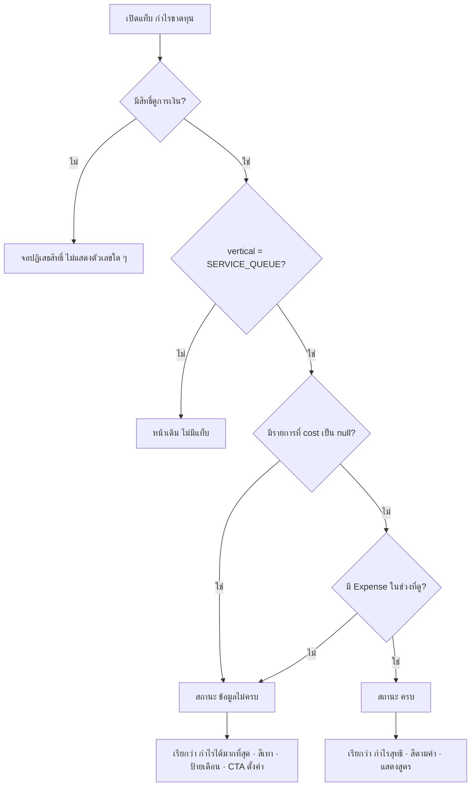

> **โมดูล:** 00067 — Shop Finance Tabs
> **ประเภทเอกสาร:** Product Requirements Document (PRD)
> **เวอร์ชัน:** 1.0
> **วันที่จัดทำ:** 2026-09-30
> **สถานะ:** Draft — รอ user review (Hard Rule 11: ห้าม implement ก่อน PRD+BRD ผ่าน)
> **เจ้าของเอกสาร:** BA + PO + PM

# PRD: แท็บการเงินร้าน (ร้านบริการ)

---

## Executive Summary

ทุกวันนี้ผู้ขายที่เป็น **ร้านบริการ** (`Shop.vertical = 'SERVICE_QUEUE'`) เปิดหน้า `/seller/sales` แล้วเห็นแค่ "เงินที่รับจริง" กับ "ค้างรับ" — ตอบได้ว่าเก็บเงินครบหรือยัง แต่ตอบไม่ได้ว่า **เดือนนี้กำไรหรือขาดทุน** เพราะต้นทุนและค่าใช้จ่ายของร้านไม่เคยถูกนำมาแสดงบนหน้าจอเดียวกัน

ฟีเจอร์นี้รวมคำถามเรื่องเงินทั้งหมดของร้านบริการไว้ในหน้าเดียวชื่อ **"การเงินร้าน"** แบ่งเป็น 3 แท็บ: **กำไรขาดทุน** · **ยอดเก็บเงิน** · **ค่าใช้จ่าย** โดยยกหน้า `/seller/expenses` เดิมเข้ามาเป็นแท็บที่ 3 ทั้งหน้า

จุดสำคัญที่สุดของฟีเจอร์นี้ **ไม่ใช่กราฟ** แต่คือการจัดการกรณีที่ร้าน **ยังไม่มีข้อมูลต้นทุน** ซึ่งเป็นสภาพจริงของร้านบริการแทบทุกร้านวันนี้ — ถ้าไม่จัดการ หน้าจอจะแสดงคำว่า "กำไร" ทับตัวเลขที่เท่ากับยอดขายเป๊ะทุกบาท ซึ่งเป็นปัญหาที่ทีมเพิ่งถอดออกไปเมื่อ 2026-08-23

---

## 1. Business Goals & KPIs

### 1.1 เป้าหมายทางธุรกิจ

| เป้าหมาย | รายละเอียด |
|----------|-----------|
| **ร้านบริการรู้กำไรจริงของตัวเอง** | ตอบคำถาม "เดือนนี้เหลือเท่าไหร่" ได้ในหน้าจอเดียว ไม่ต้องไปเปิดแอปบัญชีแยก |
| **ดึงข้อมูลต้นทุนเข้าระบบ** | กำไรจะมีความหมายก็ต่อเมื่อร้านตั้งราคาทุนและบันทึกค่าใช้จ่าย — หน้าจอต้องพาไปทำ ไม่ใช่รอให้ร้านหาเอง |
| **เลิกมีหน้าเรื่องเงิน 2 หน้าที่ตัวเลขไม่ตรงกัน** | `/sales` กับ `/expenses` ใช้สูตรกำไรคนละสูตร ผู้ขายบวกเลขสองหน้าจอแล้วไม่ตรง (บทเรียน P0 2026-08-08) |
| **ไม่กระทบร้านประเภทอื่น** | ร้านขายของออนไลน์และที่พักต้องไม่เห็นความเปลี่ยนแปลงใด ๆ ในรอบนี้ |

### 1.2 ตัวชี้วัดความสำเร็จ (KPIs)

| KPI | คำอธิบาย | เป้าหมาย |
|-----|----------|---------|
| **อัตราร้านบริการที่ตั้งราคาทุนแล้ว** | `COUNT(DISTINCT shopId WHERE มี Product.cost IS NOT NULL ≥ 1) ÷ COUNT(ร้านบริการที่ใช้งาน)` | จาก ~0% → ≥ 40% ใน 60 วัน |
| **อัตราร้านบริการที่บันทึกค่าใช้จ่าย** | ร้านที่มี `Expense` ≥ 1 แถวในเดือนล่าสุด ÷ ร้านบริการที่ใช้งาน | ≥ 30% ใน 60 วัน |
| **ร้านที่เปิดแท็บกำไรขาดทุนแล้วกดปุ่มตั้งค่า** | คลิก CTA จากสถานะข้อมูลไม่ครบ ÷ การเปิดแท็บในสถานะนั้น | ≥ 25% |
| **จำนวนตัวเลขกำไรที่แสดงโดยไม่มีป้ายกำกับ** | ตรวจด้วยเทส ไม่ใช่ analytics | **ต้องเป็น 0 เสมอ** |

---

## 2. User Personas (กลุ่มผู้ใช้งาน)

### 2.1 เจ้าของร้านบริการ (Owner)

**ข้อมูลพื้นฐาน:**
- เจ้าของอู่/ร้านติดตั้ง/ร้านบริการหน้าร้าน มีทีม 1–7 คน
- ร้านอ้างอิง: BT Premium - สุขสวัสดิ์ (ติดตั้งไฟซีนอน/ฟิล์ม) — 16 งาน/เดือน ยอดขาย 57,300 บาท
- ปัจจุบันใช้แอปบัญชีแยกอีกตัวเพื่อดูกำไร แล้วคีย์ข้อมูลซ้ำสองที่

**เป้าหมาย:**
- รู้ว่าเดือนนี้เหลือเงินเท่าไหร่หลังหักทุกอย่าง
- รู้ว่าค่าใช้จ่ายก้อนไหนกินกำไรมากที่สุด

**ความต้องการ:**
- ตัวเลขเดียวที่เชื่อได้ ไม่ต้องบวกเอง
- กรอกต้นทุนครั้งเดียวแล้วระบบคิดให้ตลอด

**จุดปวด (Pain Points):**
- หน้า `/sales` บอกแค่เงินเข้า ไม่บอกเงินออก
- หน้า `/expenses` มีอยู่แต่ไม่เคยเจอ เพราะซ่อนอยู่คนละกลุ่มเมนู
- ตัวเลขใน `/sales` กับ `/expenses` ไม่ตรงกัน ไม่รู้ว่าอันไหนถูก

### 2.2 แอดมินร้าน (ShopMember role = ADMIN)

**ข้อมูลพื้นฐาน:**
- พนักงานที่เจ้าของให้สิทธิ์ดูตัวเลขการเงิน ผ่านสวิตช์ `Shop.staffCanViewFinance`
- ร้านอ้างอิงมีแอดมิน 6 คน หนึ่งในนั้นมีข้อความแชท 1,513 ข้อความ

**เป้าหมาย:**
- ช่วยเจ้าของบันทึกค่าใช้จ่ายและตามเก็บเงินลูกค้า

**ความต้องการ:**
- เห็นรายการที่ยังเก็บเงินไม่ครบ พร้อมทางเข้าแชทเพื่อตามทันที

**จุดปวด (Pain Points):**
- ต้องไล่เปิดออเดอร์ทีละใบเพื่อดูว่าใบไหนยังค้าง

### 2.3 พนักงานที่ไม่ได้รับสิทธิ์การเงิน

**ข้อมูลพื้นฐาน:**
- `ShopMember.role = 'ADMIN'` แต่ `Shop.staffCanViewFinance = false`

**เป้าหมาย:**
- ทำงานหน้าร้านได้โดยไม่เห็นตัวเลขกำไร

**ความต้องการ:**
- ระบบต้องกันตั้งแต่ชั้น server ไม่ใช่แค่ซ่อนปุ่ม

**จุดปวด (Pain Points):**
- ถ้าเห็นตัวเลขที่ไม่ควรเห็น = ปัญหาความไว้ใจในร้าน

---

## 3. Business Requirements

### 3.1 รวมหน้าเรื่องเงินให้เหลือหน้าเดียว 3 แท็บ

**ความต้องการ:**
- หน้า `/seller/sales` เปลี่ยนชื่อเป็น **"การเงินร้าน"** และมี 3 แท็บ: กำไรขาดทุน · ยอดเก็บเงิน · ค่าใช้จ่าย
- แท็บเริ่มต้นคือ **กำไรขาดทุน**
- หน้า `/seller/expenses` เดิมยกมาเป็นแท็บ "ค่าใช้จ่าย" ทั้งหน้า (ทั้งสรุป รายการ และฟอร์มบันทึก)
- `/seller/expenses` ต้องยัง**เปิดได้อยู่** และพาไปยังแท็บที่ถูกต้อง ไม่ใช่ 404

**Business Rules:**
- แท็บที่เลือกอยู่ต้องอ่านได้จาก URL (แชร์ลิงก์/รีเฟรชแล้วได้แท็บเดิม)
- เมนูซ้ายต้องเหลือรายการเรื่องเงินรายการเดียว ไม่ใช่สองรายการที่พาไปที่เดียวกัน

**เหตุผล:**
- วันนี้เมนูมี `/sales` ("ภาพรวมกำไร/ขาดทุน") กับ `/expenses` ("ค่าใช้จ่าย") อยู่คนละกลุ่ม ทั้งที่ตอบคำถามต่อเนื่องกัน
- ผู้ขายที่อยากรู้กำไรต้องเปิดสองหน้าแล้วบวกเอง ซึ่งบวกไม่ตรงเพราะสองหน้าใช้สูตรคนละสูตร

### 3.2 กำไรต้องมีนิยามเดียวทั้งระบบ

**ความต้องการ:**
- ทั้ง 3 แท็บและหน้าแรกต้องใช้สูตรกำไรสูตรเดียว
- สูตรที่ยึด: **กำไรสุทธิ = ยอดขายที่ยืนยันแล้ว − ต้นทุน − ค่าใช้จ่ายร้าน**
- ต้องแสดงสูตรบนหน้าจอเสมอ ไม่ใช่เก็บไว้ในคอมเมนต์

**Business Rules:**
- ห้ามมีคำว่า "กำไร" บนหน้าจอใดที่คำนวณด้วยสูตรอื่น
- ถ้าจำเป็นต้องมีตัวเลขที่ต่างกัน (เช่น กำไรขั้นต้น) ต้องตั้งชื่อต่างชัดเจนและวางติดกัน พร้อมอธิบายว่าทำไมสองตัวไม่เท่ากัน

**เหตุผล:**
- Hard Rule 16 — ศัพท์ธุรกิจต้องมีนิยามเดียว
- วันนี้มีสองสูตรอยู่จริง: `/sales` ใช้ `ยอดขาย − ต้นทุน − ค่าส่ง` (ไม่หักค่าใช้จ่ายร้าน ตามมติ 2026-08-09) ส่วน `/expenses` ใช้ `ยอดขาย − ต้นทุน − ค่าใช้จ่าย`
- และคอมเมนต์ในเมนู (`src/lib/seller-menu.ts:55`) ยังเขียนว่า `/sales` คำนวณ `revenue − COGS − expense` ซึ่ง **ไม่ตรงกับโค้ดปัจจุบัน** — เอกสารที่อ้างพฤติกรรมโค้ดผิดคือกับดักรอคนถัดไป

### 3.3 ข้อมูลไม่ครบ ต้องบอกตรง ๆ ห้ามเรียกว่ากำไร

**ความต้องการ:**
- เมื่อร้านยังไม่ตั้งราคาทุน หรือยังไม่มีรายการค่าใช้จ่ายในช่วงที่ดู ตัวเลขที่แสดงต้องถูกเรียกว่า **"กำไรได้มากที่สุด"** พร้อมเครื่องหมาย `≤` ไม่ใช่ "กำไรสุทธิ"
- ต้องมีป้ายกำกับว่า **"ตัวเลขนี้ยังไม่ใช่กำไรจริง"**
- ต้องมีทางลัดไปตั้งราคาทุน และไปบันทึกค่าใช้จ่าย พร้อมบอกจำนวนที่ยังไม่ได้ตั้ง
- สีของตัวเลขในสถานะนี้ต้องเป็นกลาง (ไม่ใช่เขียว) เพราะเขียวสงวนไว้ให้ค่าที่ยืนยันแล้ว

**สถานะที่ต้องรองรับ:**

| สถานะ | เงื่อนไข | ตัวเลขที่แสดง | ป้าย |
|-------|---------|--------------|------|
| **ครบ** | มีต้นทุนครบทุกรายการที่ขาย และมีค่าใช้จ่ายในช่วง | กำไรสุทธิ (สีเขียว/แดงตามค่า) | แสดงสูตร |
| **ต้นทุนไม่ครบ** | มีบางรายการที่ `cost IS NULL` | กำไรได้มากที่สุด `≤ X` (สีเทา) | "ตัวเลขนี้ยังไม่ใช่กำไรจริง" + CTA ตั้งราคาทุน |
| **ไม่มีค่าใช้จ่าย** | ไม่มี `Expense` ในช่วงที่ดู | เหมือนด้านบน | + CTA บันทึกค่าใช้จ่าย |
| **ไม่มีทั้งคู่** | ทั้งสองอย่าง | เหมือนด้านบน | ทั้งสอง CTA |

**เหตุผล:**
- ร้านบริการไม่มีต้นทุนสินค้าโดยธรรมชาติ และถูกล็อกไม่ให้มีค่าส่ง ⇒ ถ้าไม่มีข้อมูล **กำไรจะเท่ากับยอดขายเป๊ะทุกบาท**
- นี่คือเหตุผลที่ทีมถอดคำว่า "กำไร/ขาดทุน" ออกจากหน้านี้เมื่อ 2026-08-23 โดยบันทึกไว้ว่า *"คำว่ากำไรจึงไม่ได้ให้ข้อมูลเพิ่มเลย มันแค่เรียกยอดขายด้วยชื่อที่ผิด"*
- การเอาคำว่ากำไรกลับมาโดยไม่จัดการสถานะนี้ = พาปัญหาเดิมกลับมาในวันแรก

### 3.4 ยอดเก็บเงินต้องกดตามได้ ไม่ใช่แค่ดู

**ความต้องการ:**
- แท็บ "ยอดเก็บเงิน" ต้องมีรายการงานที่ยังเก็บเงินไม่ครบ พร้อมชื่อลูกค้าและยอดค้าง
- แต่ละรายการต้องกดเข้าไปยังบิลหรือห้องแชทของลูกค้าคนนั้นได้

**Business Rules:**
- "ค้างรับ" คือยอดที่ยังไม่มีการบันทึกรับเงินในระบบ — **ไม่ใช่** "ลูกค้าไม่จ่าย"
- ต้องเขียนกำกับบนหน้าจอว่า ถ้ารับเงินสดแล้วยังไม่ได้คีย์ ยอดนี้จะสูงกว่าความจริง

**เหตุผล:**
- Deep มีบิลกับแชทอยู่ระบบเดียวกัน ซึ่งเป็นสิ่งที่แอปบัญชีทั่วไปทำไม่ได้ — นี่คือจุดที่เราชนะ ไม่ใช่การลอกหน้าตาเขา

### 3.5 ขอบเขตเฉพาะร้านบริการ

**ความต้องการ:**
- ทุกอย่างในฟีเจอร์นี้มีผลเฉพาะร้านที่ `Shop.vertical = 'SERVICE_QUEUE'`
- ร้าน `ONLINE_SALES` และ `LODGING` ต้องเห็นหน้า `/seller/sales` และ `/seller/expenses` เหมือนเดิมทุกพิกเซล

**Business Rules:**
- ต้องมีเทสที่ยืนยันข้อนี้ ไม่ใช่แค่เขียนไว้ในเอกสาร

**เหตุผล:**
- วิธีเดียวกับที่ v9 (2026-08-23) ทำ ซึ่งบันทึกไว้ว่า "ร้าน vertical อื่นไม่ถูกแตะเลยสักจุด"
- ร้านขายของออนไลน์มีทั้งต้นทุนสินค้าและค่าส่งจริง ตัวเลขกำไรของเขามีความหมายอยู่แล้วโดยไม่ต้องรอฟีเจอร์นี้

---

## 4. Business Rules & Constraints

### 4.1 กฎทางธุรกิจหลัก

| กฎ | คำอธิบาย |
|----|----------|
| **BR-FIN-01 นิยามกำไรเดียว** | ทุก surface ที่พูดถึงกำไรต้องใช้สูตรและคำจาก SSOT เดียวกัน (`order-profit-presentation.ts`) ห้ามก็อปคำไปเขียนซ้ำ |
| **BR-FIN-02 เพดานบนต้องมีป้าย** | ตัวเลขกำไรที่คำนวณจากข้อมูลไม่ครบ ต้องถูกเรียกว่าเพดานบนและมีป้ายกำกับเสมอ |
| **BR-FIN-03 สิทธิ์การเงิน** | ทั้ง 3 แท็บอยู่ใต้ `resolveExpenseAccess` เดียวกัน — OWNER เห็นเสมอ, ADMIN เห็นเมื่อ `staffCanViewFinance = true`, นอกนั้นไม่เห็น |
| **BR-FIN-04 นิยามยอดขาย** | ยอดขายที่ใช้คำนวณกำไรคือ `revenueOrderWhere` (ยืนยันแล้ว หรือขนส่งรับของแล้ว) ต้องเขียนนิยามบนหน้าจอ |
| **BR-FIN-05 ต้นทุนเป็น snapshot** | ต้นทุนมาจาก `OrderItem.cost` ที่ถ่ายไว้ ณ วันเปิดบิล การแก้ราคาทุนภายหลังไม่กระทบยอดเดิม |
| **BR-FIN-06 ค่าใช้จ่ายลงตามวันที่บันทึก** | ไม่เฉลี่ยรายวัน ไม่ปันส่วน — ต้องเขียนกำกับว่าค่าใช้จ่ายจะกระจุกในวันที่จ่ายจริง |
| **BR-FIN-07 ขอบเขต vertical** | มีผลเฉพาะ `SERVICE_QUEUE` |

### 4.2 ข้อจำกัดทางธุรกิจ

| ข้อจำกัด | รายละเอียด |
|---------|-----------|
| **ไม่มีระบบเจ้าหนี้** | ไม่รองรับ "ยอดชำระเงิน" แบบแอปบัญชี เพราะ `Expense` ไม่มีสถานะจ่ายแล้ว/ค้างจ่าย ไม่มีเจ้าหนี้ ไม่มีวันครบกำหนด |
| **ไม่มีภาษี** | ตัวเลขทั้งหมดไม่แยก VAT ไม่คำนวณภาษีหัก ณ ที่จ่าย |
| **ไม่มีเอกสารทางบัญชี** | ไม่ออกใบแจ้งหนี้/ใบเสร็จตามรูปแบบสรรพากรในฟีเจอร์นี้ |
| **ข้อมูลเก่าไม่ย้อนหลัง** | ออเดอร์ที่ปิดไปแล้วโดยไม่มี `cost` จะไม่ถูกเติมย้อนหลัง — กำไรเดือนเก่ายังเป็นเพดานบนตลอดไป |

### 4.3 เหตุผลที่ไม่ลอก 3 แท็บของแอปบัญชีมาตรง ๆ

แอปบัญชีที่ใช้เป็นตัวอ้างอิงมี 3 แท็บคือ ยอดเก็บเงิน · ยอดชำระเงิน · สรุปภาพรวม

| แท็บของเขา | เราทำอะไร | เหตุผล |
|-----------|-----------|--------|
| สรุปภาพรวม | → **กำไรขาดทุน** | ข้อมูลมีครบแล้ว (`pnl.service.ts`) |
| ยอดเก็บเงิน | → **ยอดเก็บเงิน** | ข้อมูลมีครบแล้ว (`OrderPayment`) |
| ยอดชำระเงิน | → **เปลี่ยนเป็นค่าใช้จ่าย** | เป็นระบบเจ้าหนี้ ซึ่งฐานข้อมูลเราไม่มีข้อมูลเลย · และคำขอต้นทางคือ "ให้เพิ่มแสดงค่าใช้จ่าย" ไม่ใช่เจ้าหนี้ |

---

## 5. Out of Scope (นอกขอบเขต)

| หัวข้อ | คำอธิบาย |
|--------|----------|
| **ยอดชำระเงิน / เจ้าหนี้** | ต้องแก้ schema `Expense` ก่อน — แยกเป็นฟีเจอร์ต่างหากถ้าจะทำ |
| **ร้านขายของออนไลน์ / ที่พัก** | รอบนี้ไม่แตะ |
| **VAT / ภาษี / เอกสารสรรพากร** | ไม่อยู่ในขอบเขต |
| **การเฉลี่ยค่าใช้จ่ายรายวัน** | เป็นการตีความทางบัญชี ไม่ประดิษฐ์เอง |
| **การ backfill ต้นทุนออเดอร์เก่า** | ขัดกับหลัก historical accuracy ของ 00016 |
| **การส่งออกไฟล์ (Excel/PDF)** | ยังไม่อยู่ในรอบนี้ |
| **เปลี่ยนแถบเมนูล่างของแอปมือถือ** | ไม่เพิ่มแท็บ "บัญชี" ในแถบล่าง — เข้าถึงผ่านเมนูเดิม |

---

## 6. Risks & Mitigation

### 6.1 ความเสี่ยงทางธุรกิจ

| ความเสี่ยง | ผลกระทบ | ระดับ | แนวทางแก้ไข |
|-----------|---------|-------|-------------|
| **ร้านเชื่อตัวเลขกำไรที่ยังไม่ครบ** | ตัดสินใจธุรกิจผิด · เสียความไว้ใจในระบบ | **สูง** | สถานะข้อมูลไม่ครบตาม §3.3 + เทสที่บังคับให้ทุกตัวเลขเพดานบนมีป้าย |
| **ร้านไม่ยอมกรอกต้นทุน แท็บจึงไร้ประโยชน์** | KPI ไม่ถึง · ฟีเจอร์ตาย | สูง | CTA พร้อมตัวนับ "ยังไม่ได้ตั้ง n จาก m" · ทางลัดจากทุกแท็บ |
| **ตัวเลขไม่ตรงกับแอปบัญชีที่ร้านใช้อยู่** | ร้านคิดว่าเราคำนวณผิด | กลาง | เขียนนิยามยอดขายและสูตรบนหน้าจอเสมอ (BR-FIN-04) |
| **แอดมินเห็นตัวเลขที่ไม่ควรเห็น** | ปัญหาภายในร้าน | กลาง | ใช้ `resolveExpenseAccess` เดิมทั้ง 3 แท็บ ตรวจที่ server |

### 6.2 ความเสี่ยงทางเทคนิค

| ความเสี่ยง | ผลกระทบ | แนวทางแก้ไข |
|-----------|---------|-------------|
| **รวมสูตรกำไรแล้วตัวเลขเดือนเก่าเปลี่ยน** | ร้านเห็นตัวเลขขยับโดยไม่มีคำอธิบาย | ประกาศบนหน้าจอครั้งแรกที่เปิด + บันทึกใน retro |
| **การ์ด/แท็บหลุดไปโผล่ที่ vertical อื่น** | ร้านขายของออนไลน์เห็นของที่ยังไม่เสร็จ | เทส guard ที่ยืนยันว่า `ONLINE_SALES`/`LODGING` ไม่เห็นแท็บ |
| **แก้ FROZEN CONTRACT ของ 00016** | เอกสาร 00016 กับ 00067 ขัดกัน | แก้เอกสาร 00016 ในงานเดียวกัน ระบุว่าถูก supersede โดย 00067 |
| **กราฟใช้ ApexChart ผิดแกน** | สเกลแท่งเพี้ยนทั้งกราฟโดยไม่มี error | ยึด `seriesName` ให้ตรงชื่อซีรีส์จริง (บทเรียน v9) |

---

## 7. Glossary (อภิธานศัพท์)

| คำศัพท์ | ความหมาย |
|---------|----------|
| **ยอดขายที่ยืนยันแล้ว** | ยอดจากออเดอร์ที่เข้าเกณฑ์ `revenueOrderWhere` (CONFIRMED หรือขนส่งรับของแล้ว) |
| **รับจริง** | ผลรวม `OrderPayment.amount` ที่ยังไม่ถูก void |
| **ค้างรับ** | ยอดบิล − รับจริง |
| **ต้นทุนอะไหล่** | คำของร้านบริการ สำหรับ `OrderItem.cost` (ร้านขายของออนไลน์เรียก "ต้นทุนสินค้า") |
| **ค่าใช้จ่ายร้าน** | แถวในตาราง `Expense` — ค่าเช่า ค่าจ้าง โฆษณา ค่าน้ำ-ค่าไฟ ฯลฯ |
| **กำไรสุทธิ** | ยอดขายที่ยืนยันแล้ว − ต้นทุน − ค่าใช้จ่ายร้าน |
| **กำไรได้มากที่สุด** | กำไรที่คำนวณจากข้อมูลไม่ครบ = เพดานบน ค่าจริงต่ำกว่านี้เสมอ |
| **vertical** | ประเภทกิจการของร้าน: `ONLINE_SALES` · `SERVICE_QUEUE` · `LODGING` |

---

## 8. Success Metrics

| ตัวชี้วัด | ค่าที่คาดหวัง | วิธีวัด |
|----------|---------------|--------|
| ร้านบริการที่ตั้งราคาทุนอย่างน้อย 1 รายการ | ≥ 40% ใน 60 วัน | query `Product.cost IS NOT NULL` |
| ร้านบริการที่บันทึกค่าใช้จ่ายในเดือนล่าสุด | ≥ 30% ใน 60 วัน | query `Expense` |
| การเปิดแท็บกำไรขาดทุนต่อร้านต่อเดือน | ≥ 4 ครั้ง | analytics |
| ตัวเลขเพดานบนที่ไม่มีป้าย | 0 | เทสอัตโนมัติ |
| ร้าน vertical อื่นที่เห็นแท็บใหม่ | 0 | เทส guard |

---

## 9. Dependencies & Assumptions

### 9.1 สิ่งที่ต้องพึ่งพา

| ระบบ/ส่วนประกอบ | ความสัมพันธ์ |
|-----------------|-------------|
| **00016 Expense & Cost Tracking** | ตาราง `Expense`, `Product.cost`, `OrderItem.cost`, `pnl.service.ts`, หน้า `/expenses` — ฟีเจอร์นี้ยกเข้ามาทั้งชุด |
| **00050 Service Queue End-to-End** | `OrderPayment` (มัดจำ/เต็มจำนวน), `Shop.vertical = SERVICE_QUEUE` |
| **00063 Product Sales Time Series** | นิยามยอดขายอีกชุดหนึ่ง (`ยังไม่ถูกยกเลิก`) ที่ต้องไม่สับสนกับของหน้านี้ |
| **`src/lib/order-profit-presentation.ts`** | SSOT ของคำ/สี/ไอคอนของกำไร — ต้องเรียกใช้ ห้ามเขียนคำซ้ำ (Hard Rule 16) |
| **`src/lib/seller-menu.ts` (`ORDER_VOCAB`)** | ต้องเพิ่มคำเรียกต้นทุนต่อ vertical |

### 9.2 สมมติฐาน

- ร้านบริการยอมกรอกราคาทุนถ้าทางเข้าอยู่ตรงหน้าและบอกว่าเหลืออีกกี่รายการ
- ค่าใช้จ่ายส่วนใหญ่ของร้านบริการเป็นเงินสด/โอนทันที จึงไม่ต้องมีระบบเจ้าหนี้
- จำนวนร้านบริการที่ใช้งานจริงยังน้อยพอที่จะปล่อยแบบไม่ต้องทยอย (ไม่ต้อง feature flag รายร้าน)

---

## 10. Appendix

### 10.1 ตัวอย่าง User Journey

**Scenario A: เจ้าของร้านเปิดครั้งแรก ยังไม่เคยตั้งต้นทุน**

1. เจ้าของกดเมนู "การเงินร้าน"
2. ระบบเปิดแท็บ **กำไรขาดทุน**
3. เห็นป้าย "ตัวเลขนี้ยังไม่ใช่กำไรจริง" และตัวเลข `≤ 33,500` สีเทา
4. ใต้ตัวเลขมีรายการว่า ยอดขายที่ยืนยันแล้ว 33,500 · ต้นทุนอะไหล่ **ยังไม่ได้ตั้ง** · ค่าใช้จ่ายร้าน **ยังไม่มีรายการ**
5. เจ้าของกด "ตั้งราคาทุนของบริการ (ยังไม่ได้ตั้ง 12 จาก 14)" → ไปหน้ารายการบริการที่กรองเฉพาะรายการที่ยังไม่ตั้ง
6. ตั้งราคาทุนเสร็จ กลับมาที่แท็บเดิม ป้ายยังอยู่เพราะยังไม่มีค่าใช้จ่าย
7. เจ้าของกด "บันทึกค่าใช้จ่ายของร้าน" → บันทึกค่าเช่า 3,000
8. ป้ายหาย ตัวเลขเปลี่ยนเป็น **กำไรสุทธิ +18,700** สีเขียว พร้อมสูตรใต้ตัวเลข

**Scenario B: แอดมินตามเก็บเงิน**

1. แอดมินเปิด "การเงินร้าน" → แท็บ **ยอดเก็บเงิน**
2. เห็นว่า เก็บเงินแล้ว 56,400 · ค้างรับ 900
3. เลื่อนลงเห็นรายการ "ต้องตามเก็บ" — คุณสมชาย ท. · ติดตั้งไฟซีนอน · ค้าง 900 · ค้าง 23 วัน
4. กดที่รายการ → เข้าห้องแชทของลูกค้าคนนั้น ทักไปตาม
5. ลูกค้าโอนมา แอดมินบันทึกรับเงิน → ค้างรับกลายเป็น 0

**Scenario C: ร้านขายของออนไลน์ (ต้องไม่เปลี่ยน)**

1. เจ้าของร้านขายของออนไลน์เปิดเมนูเดิม
2. เห็นหน้า `/sales` และ `/expenses` แบบเดิมทุกอย่าง ไม่มีแท็บใหม่

### 10.2 แผนภาพ: การตัดสินสถานะของแท็บกำไรขาดทุน

---

**หมายเหตุ:**
เอกสารนี้บันทึกความต้องการทางธุรกิจเท่านั้น สำหรับ Functional Requirements / Acceptance Criteria ดู [[BRD]] · สำหรับสเปกเทคนิคดู [[SRS]] และ [[SDS]]
