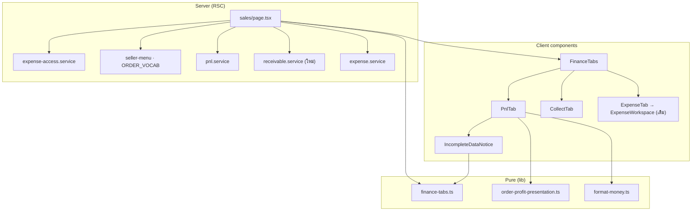
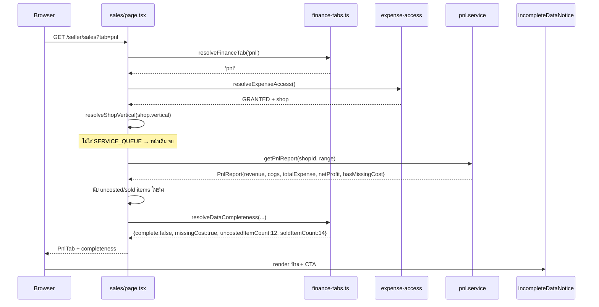
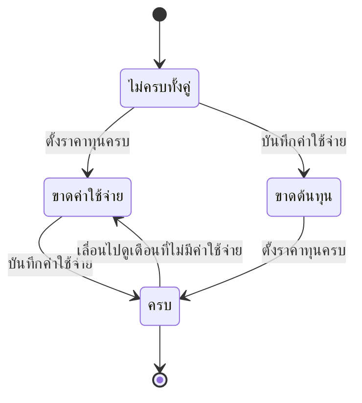

> **โมดูล:** 00067 — Shop Finance Tabs
> **ประเภทเอกสาร:** System Design Spec (SDS)
> **เวอร์ชัน:** 1.0
> **วันที่จัดทำ:** 2026-09-30
> **สถานะ:** Draft

# SDS: แท็บการเงินร้าน

---

## 1. บทนำ & References

### 1.1 วัตถุประสงค์

ระบุ **การออกแบบระดับไฟล์** ที่ dev เปิดแล้วลงมือได้ทันที: ไฟล์ไหนใหม่ ไฟล์ไหนแก้ อะไรอยู่ที่ชั้นไหน และการตัดสินใจทางเทคนิคพร้อมทางเลือกที่ถูกปัดทิ้ง

### 1.2 ขอบเขตการออกแบบ

เฉพาะ `(paces)/seller` + `src/lib` + `src/app/api/finance` — ไม่แตะ Prisma, ไม่แตะ `(marketing)/**`

### 1.3 เอกสารอ้างอิง

[[SRS]] · [[API]] · [[DATABASE]] · [[UX-Design-Spec]] · `docs/system/ui-guideline/paces-component-reference.md` · `docs/conventions/domain-term-single-definition.md`

---

## 2. Architecture Overview

### 2.1 มุมมองสถาปัตยกรรม

**หลักการแบ่งชั้น:**

| ชั้น | หน้าที่ | ห้ามทำ |
|------|--------|--------|
| **Pure (`src/lib`)** | นิยาม/สูตร/คำ/การตัดสินสถานะ | แตะ Prisma · แตะ `window` |
| **Service (`src/services`)** | query + รวมยอด | ตัดสินใจเรื่องคำหรือสี |
| **RSC (`page.tsx`)** | สิทธิ์ · vertical · เลือกแท็บ · ดึงข้อมูลเฉพาะแท็บ | render ตัวเลขเอง |
| **Client** | interaction + render | คำนวณกำไรเอง |

### 2.2 มุมมองการ Deploy

ไม่เปลี่ยน — ไม่มี migration, ไม่มี env ใหม่, ไม่มี cron

---

## 3. Component Design

> ## 🔄 บันทึกหลัง implement (2026-09-30) — ที่ต่างจากแผน
>
> | แผนเดิม | ของจริง | เหตุผล |
> |---|---|---|
> | `PnlTab.tsx` · `CollectTab.tsx` · `ExpenseTab.tsx` | **ไม่มี** — ประกอบจากของเดิมใน `sales/page.tsx` ตรง ๆ | `PnlReportCard`/`SalesChart`/`SalesTable`/`ExpenseWorkspace` ทำสิ่งที่แท็บต้องการอยู่แล้วครบ · การห่อ wrapper เพิ่มชั้นที่ไม่ตัดสินใจอะไรเลย และเสี่ยงให้ตัวเลขสองหน้า drift (`sibling-surface-parity.md`) |
> | เพิ่ม `tone: 'capped'` ที่ `order-profit-presentation.ts` | ขยาย `profitDisplay()` ที่ `format-money.ts` แทน | ไฟล์นั้นเป็นของ**กำไรรายใบ (ขั้นต้น)** คนละตัวกับกำไรสุทธิรายช่วง — ดู SRS TFR-004 |
> | ป้าย "กำไรได้มากที่สุด" | **"กำไรสุทธิไม่เกิน" / "ขาดทุนสุทธิอย่างน้อย"** | คำชุดนี้มีอยู่แล้วในรีโปพร้อมเหตุผลว่าทำไมไม่ใช้คำอื่น (Hard Rule 16) |
> | ช่วงเวลาใช้ `?from=&to=` | **แท็บกำไร/ค่าใช้จ่ายใช้ `?range=&start=&end=` · แท็บยอดเก็บเงินใช้ `?from=&to=`** | คอมโพเนนต์เดิมของแต่ละฝั่งผูกกับพารามิเตอร์คนละชุด การบังคับรวมในรอบนี้กระทบร้าน vertical อื่นที่ใช้ `SalesChart`/`SalesTable` ชุดเดียวกัน ⇒ **นอกขอบเขตที่เคาะไว้** · ทั้งสองชุดถูกคงไว้ใน URL เสมอ (ดู `FinanceTabs.go()` + `ExpenseWorkspace.syncUrl()`) — **เป็นหนี้ที่รู้ตัว ต้องรวมในรอบถัดไป** |
> | — | **เพิ่ม `src/services/cost-coverage.service.ts`** | ตัวนับ "ยังไม่ได้ตั้ง n จาก m" ต้อง query เอง และห้ามยัดเข้า `pnl.service` ซึ่งเป็นสัญญาที่ `/expenses` ใช้อยู่ |
> | — | **แก้ `ExpenseWorkspace.syncUrl()` ให้ seed จาก searchParams เดิม** | ของเดิมสร้าง `URLSearchParams` เปล่า ⇒ เปลี่ยนช่วงเวลาในแท็บค่าใช้จ่ายแล้ว `?tab=` หาย ผู้ใช้ถูกเด้งกลับแท็บแรกโดยไม่มีอะไรบอก |
> | — | **ต้องใช้ `withoutDrafted('CANCELLED')`** | พบตอนเทส `order-drafted-visibility` แดง — ร่างออเดอร์ (00061) จะถูกนับเป็นยอดค้างรับ |

### 3.1 ไฟล์ใหม่

| ไฟล์ | ชนิด | หน้าที่ | Base (Hard Rule 3) |
|------|------|--------|--------------------|
| `src/lib/finance-tabs.ts` | pure | `FINANCE_TABS`, `resolveFinanceTab`, `resolveDataCompleteness` | — (ไม่ใช่ UI) |
| `src/services/receivable.service.ts` | service | รายการที่ยังเก็บเงินไม่ครบ | — |
| `src/app/api/finance/receivables/route.ts` | route | GET รายการตามเก็บ (โหลดเพิ่ม) | มิเรอร์ `api/expenses/report/route.ts` |
| `.../sales/components/FinanceTabs.tsx` | client | แถบแท็บ + sync URL | `theme/paces/.../ui/tabs/page.tsx` (`.nav-tabs`) ผ่าน precedent `CustomerPanel.tsx:912` |
| `.../sales/components/PnlTab.tsx` | client | เนื้อหาแท็บ 1 | `products/page.tsx:181` (grid การ์ด) + `PacesStatCard` |
| `.../sales/components/CollectTab.tsx` | client | เนื้อหาแท็บ 2 | เดียวกับข้างบน + `SalesTable.tsx` เดิม |
| `.../sales/components/ExpenseTab.tsx` | client | wrapper บาง ๆ ครอบ `ExpenseWorkspace` | — |
| `.../sales/components/IncompleteDataNotice.tsx` | client | ป้าย + CTA | `SellerEmptyState.tsx` + `.card` |
| `.../sales/components/ReceivableList.tsx` | client | รายการตามเก็บ | `FollowUpCard.tsx` (โครงรายการมีปุ่มเข้าแชท) |

### 3.2 ไฟล์ที่แก้

| ไฟล์ | แก้อะไร | ความเสี่ยง |
|------|---------|-----------|
| `.../sales/page.tsx` | เพิ่มสาขา vertical + อ่าน `tab` + เรียก service ตามแท็บ | สูง — เป็นจุดตัดสินเดียว |
| `.../expenses/page.tsx` | ร้านบริการ → `redirect('/seller/sales?tab=expense')` | ต่ำ |
| `.../dashboard/components/SalesChartCard.tsx` | เพิ่มสวิตช์ 2 ทาง | กลาง — การ์ดนี้ใช้ร่วมหลาย vertical |
| `.../dashboard/components/SalesChartSheet.tsx` | โหมดกำไรใช้สูตรรวม | **สูง** — ไฟล์นี้คือที่ที่ v9 ถอดคำว่ากำไรออกไป |
| `src/lib/seller-menu.ts` | `costNoun` + เมนูต่อ vertical + **แก้คอมเมนต์บรรทัด 55 ที่อธิบายสูตรผิด** | กลาง |
| `src/lib/format-money.ts` | `netProfitFormula(costNoun)` + คงสูตรเดิมไว้พร้อมคำอธิบายว่าใครยังใช้ | **สูง** — Hard Rule 16 |
| `src/lib/order-profit-presentation.ts` | เพิ่ม `tone: 'capped'` | กลาง |
| `docs/20 - Features/00016 .../*.md` | ระบุว่าหน้า `/expenses` ถูก supersede โดย 00067 สำหรับ `SERVICE_QUEUE` | — (เอกสาร) |
| `docs/SRS.md` | sync ถ้ามีการเปลี่ยน constant ที่ระบบอ้าง | — (เอกสาร) |

### 3.3 สิ่งที่ตั้งใจ **ไม่** ทำ

| ไม่ทำ | เหตุผล |
|-------|--------|
| ไม่สร้าง `finance.service.ts` ก้อนใหญ่ | จะกลายเป็นถังรวมแบบเดียวกับที่เมนู "ตั้งค่า" เคยเป็น |
| ไม่ย้าย `ExpenseWorkspace` ออกจาก `expenses/` | ย้ายไฟล์ทำให้ diff อ่านไม่ออกว่าอะไรเปลี่ยนจริง — ครอบด้วย wrapper พอ |
| ไม่ทำ client-side cache ของแท็บ | ข้อมูลการเงินต้องสดเสมอ |
| ไม่ทำ animation สลับแท็บ | DESIGN.md §Motion ห้าม choreography ตอนโหลด |

---

## 4. Data Flow

### 4.1 Flow หลัก: เปิดแท็บกำไรขาดทุน

### 4.2 Flow กรณีข้อมูลไม่ครบ → ครบ

> 🛑 ลูกศรย้อนจาก "ครบ" กลับมา "ขาดค่าใช้จ่าย" มีจริงและสำคัญ — ผู้ใช้เลื่อนดูเดือนเก่าแล้วสถานะต้องเปลี่ยนตามช่วง ไม่ใช่จำสถานะของเดือนปัจจุบันไว้

### 4.3 Flow กรณีล้มเหลว

| เหตุการณ์ | พฤติกรรม |
|-----------|---------|
| `getPnlReport` throw | แสดง `SellerErrorState` เดิม พร้อมปุ่มลองใหม่ ไม่แสดงตัวเลขบางส่วน |
| API รายการตามเก็บล้ม | แท็บยังแสดงสมการได้ (มาจาก RSC) แต่ลิสต์แสดง error state เฉพาะส่วน |
| ช่วงวันที่ไม่ถูกต้อง | `resolveDateRange` ตกไปค่า default เดิม ไม่ throw |
| ไม่มีข้อมูลเลยในช่วง | empty state ผ่าน `SellerEmptyState` ไม่ใช่ตัวเลข 0 ลอย ๆ |

---

## 5. Integration Points

| จุดเชื่อม | ทิศทาง | สัญญา | ถ้าเปลี่ยนจะกระทบใคร |
|----------|--------|-------|---------------------|
| `pnl.service.getPnlReport` | อ่าน | `PnlReport` | `/expenses` เดิมด้วย — ห้ามเปลี่ยนรูป |
| `expense-access.service` | อ่าน | `ExpenseAccessDecision` | `/expenses`, `/sales` |
| `order-profit-presentation` | อ่าน | `ProfitPresentation` | หน้ารายการออเดอร์ |
| `ORDER_VOCAB` | อ่าน | `OrderVocab` | ทุกหน้าที่ผันคำตาม vertical |
| `SellerShortcutPreference` | อ่าน | slug เดิม | shortcut ที่ผู้ใช้ตั้งไว้ |
| `ExpenseWorkspace` | ครอบ | props เดิม | `/expenses` ของ vertical อื่น |

---

## 6. Technical Decisions

### TD-001: แท็บเก็บสถานะใน query string ไม่ใช่ state ในหน่วยความจำ

**ทางเลือก:**
- (ก) `useState` อย่างเดียว — เบาที่สุด
- (ข) query string `?tab=` ← **เลือก**
- (ค) path แยก `/sales/pnl`, `/sales/collect`

**เหตุผล:** (ก) แชร์ลิงก์/รีเฟรชแล้วหาย และ back ของเบราว์เซอร์พาออกจากหน้าเลย · (ค) ต้องสร้าง route 3 ตัวที่ layout ซ้ำกันและทำให้ redirect จาก `/expenses` ซับซ้อนขึ้นโดยไม่ได้อะไรกลับมา

**ผลที่ยอมรับ:** ต้องจัดการค่า `tab` ที่ผู้ใช้พิมพ์เองให้ fail-closed

### TD-002: ตัดสิน vertical ที่ RSC ชั้นบนสุดจุดเดียว

**ทางเลือก:**
- (ก) เช็คในแต่ละคอมโพเนนต์
- (ข) เช็คที่ `page.tsx` จุดเดียว ← **เลือก**
- (ค) middleware/proxy

**เหตุผล:** (ก) คือแพตเทิร์นที่เงียบเมื่อมี vertical ที่สี่ — เงื่อนไขกระจายแล้วตกหล่นโดยไม่มีอะไรฟ้อง · (ค) proxy ไม่รู้จัก shop ที่ active ต้อง query เพิ่มในชั้นที่ไม่ควร query

**ผลที่ยอมรับ:** `page.tsx` ยาวขึ้น — แลกกับการมีจุดเดียวที่เทสจ่อได้

### TD-003: เพิ่ม `tone: 'capped'` เข้า SSOT เดิม แทนที่จะทำคำใหม่ที่หน้านี้

**ทางเลือก:**
- (ก) เขียนป้าย "กำไรได้มากที่สุด" ในคอมโพเนนต์ใหม่
- (ข) เพิ่มโหมดเข้า `order-profit-presentation.ts` ← **เลือก**

**เหตุผล:** หน้ารายการออเดอร์แสดงกำไรรายใบที่เป็นเพดานบนอยู่แล้ว (`order-profit.ts` **ข้าม** `cost = null` ไม่ได้นับเป็น 0) ถ้าเขียนคำใหม่ที่นี่ จะได้สองคำเรียกของสิ่งเดียวกันคนละหน้าจอ ซึ่งเป็นคลาสที่ไม่มี gate ไหนจับได้ (Hard Rule 16)

### TD-004: คงสูตร `SALES_PROFIT_FORMULA` ไว้ ไม่ลบทิ้ง

**ทางเลือก:**
- (ก) ลบทิ้ง ให้เหลือสูตรเดียวทั้ง repo
- (ข) คงไว้สำหรับ vertical อื่น พร้อมคำอธิบายว่าใครยังใช้ ← **เลือก**

**เหตุผล:** ร้านขายของออนไลน์มีค่าส่งจริงที่หักรายใบ การบังคับให้ใช้สูตรเดียวในรอบนี้ = แตะ vertical อื่น ซึ่งขัดขอบเขตที่เคาะไว้

**ผลที่ยอมรับ:** ยังมีสองสูตรใน repo — บรรเทาด้วยการวางติดกันในไฟล์เดียว เขียนกำกับว่าอันไหนใช้ที่ไหน และ**เขียนไว้ว่าผลรวมของสองอันจะไม่เท่ากันเพราะอะไร** ตาม Hard Rule 16

### TD-005: ไม่แตะ schema

**เหตุผล:** ทุกตัวเลขที่ฟีเจอร์นี้ต้องการมีอยู่ในตารางเดิมครบแล้ว การเพิ่มคอลัมน์สรุป (เช่น `Order.paidAmount` แบบ denormalized) จะเร็วขึ้นเล็กน้อยแต่สร้างแหล่งความจริงที่สอง ซึ่งเป็นสิ่งที่ Hard Rule 16 ห้าม

**ผลที่ยอมรับ:** รายการตามเก็บต้อง aggregate ตอน query — จำกัด 20 รายการแรกและมี index `OrderPayment(shopId, receivedAt)` รองรับอยู่แล้ว

### TD-006: `/expenses` redirect ไม่ใช่ลบ

**เหตุผล:** ผู้ใช้บุ๊กมาร์กไว้ · shortcut ผูก slug ไว้ · และ vertical อื่นยังต้องใช้ route นี้จริง

---

## 7. Traceability

| TFR (SRS) | ไฟล์ | TD |
|-----------|------|----|
| TFR-001 | `finance-tabs.ts`, `FinanceTabs.tsx` | TD-001 |
| TFR-002 | `finance-tabs.ts`, `IncompleteDataNotice.tsx` | — |
| TFR-003 | `format-money.ts`, `PnlTab.tsx` | TD-004 |
| TFR-004 | `order-profit-presentation.ts` | TD-003 |
| TFR-005 | `receivable.service.ts`, `CollectTab.tsx` | TD-005 |
| TFR-006 | `sales/page.tsx` | TD-002 |
| TFR-007 | `seller-menu.ts`, `format-money.ts` | — |
| TFR-008 | `seller-menu.ts`, `expenses/page.tsx` | TD-006 |
| TFR-009 | `sales/page.tsx`, route handlers | — |

---

## 8. สรุป

การออกแบบนี้เพิ่มไฟล์ใหม่ 9 ไฟล์ แก้ไฟล์เดิม 8 ไฟล์ และ **ไม่แตะฐานข้อมูลเลย**

จุดที่ต้องระวังที่สุดคือ `SalesChartSheet.tsx` และ `format-money.ts` — สองไฟล์นี้คือที่ที่การตัดสินใจเรื่อง "คำว่ากำไรหมายถึงอะไร" ถูกเปลี่ยนมาแล้วหลายรอบ (2026-08-07 → 08-08 → 08-09 → 08-23) ทุกครั้งที่แตะต้องอ่านคอมเมนต์ประวัติในไฟล์ให้จบก่อน
