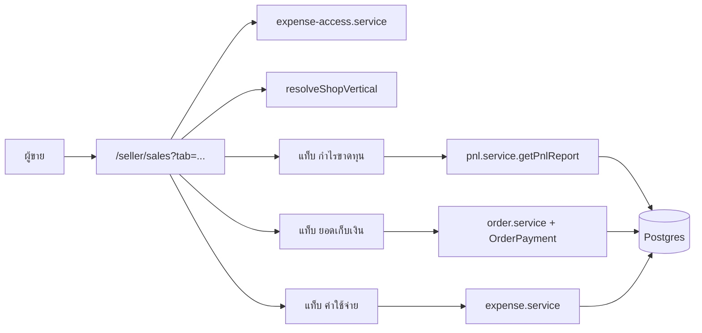
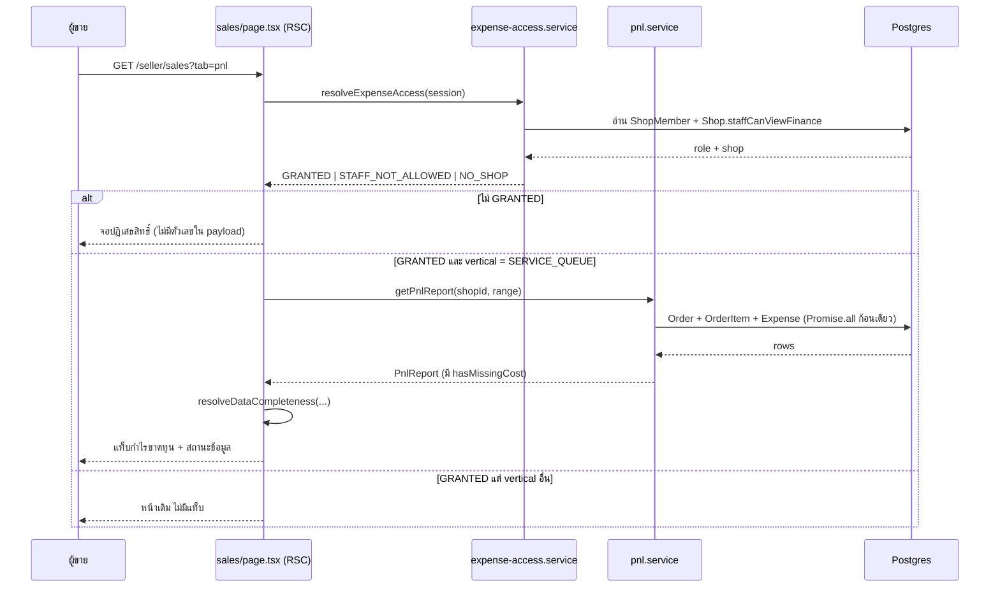
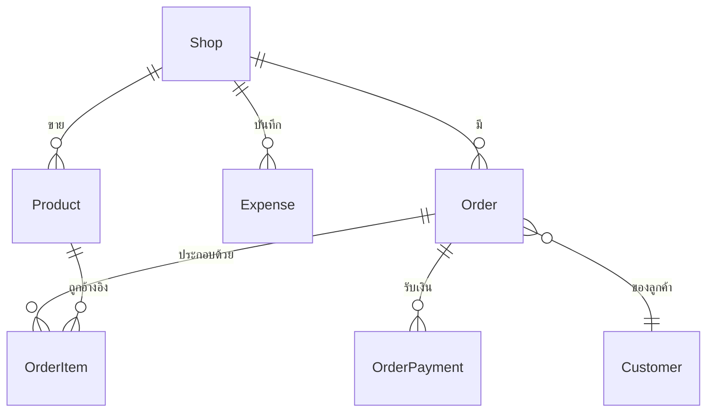

> **โมดูล:** 00067 — Shop Finance Tabs
> **ประเภทเอกสาร:** Software Requirements Specification (Technical)
> **เวอร์ชัน:** 1.0
> **วันที่จัดทำ:** 2026-09-30
> **สถานะ:** Draft

# SRS: แท็บการเงินร้าน (Technical)

---

## 1. บทนำ (Introduction)

### 1.1 วัตถุประสงค์ของเอกสาร

ระบุสเปกเชิงเทคนิคที่ dev ใช้สร้างได้ทันที: TFR พร้อมสูตร/เงื่อนไข/edge case, สัญญา interface, data requirement, NFR และ traceability กลับไปยัง FR ใน [[BRD]]

### 1.2 ขอบเขตเชิงระบบ

- **แก้ไข:** `src/app/(paces)/seller/(dashboard)/sales/**`, `.../expenses/**`, `.../dashboard/components/SalesChartCard.tsx` และ `SalesChartSheet.tsx`
- **แก้ไข:** `src/lib/seller-menu.ts` (`ORDER_VOCAB`, รายการเมนู), `src/lib/format-money.ts` (รวมสูตร)
- **ใช้ซ้ำโดยไม่แก้:** `src/services/pnl.service.ts`, `src/services/expense.service.ts`, `src/services/expense-access.service.ts`, `src/lib/order-profit.ts`, `src/lib/order-profit-presentation.ts`, `src/lib/order-revenue.ts`, `src/lib/date-range.ts`
- **ไม่แตะ:** Prisma schema, migration, ตารางใด ๆ

### 1.3 เอกสารอ้างอิง

| เอกสาร | ใช้ทำอะไร |
|--------|-----------|
| [[PRD]] · [[BRD]] | ที่มาของ FR/AC |
| `docs/20 - Features/00016 - Expense & Cost Tracking/` | FROZEN CONTRACT ที่ต้องแก้ควบคู่ |
| `docs/20 - Features/00050 - Service Queue End-to-End/` | `OrderPayment`, vertical `SERVICE_QUEUE` |
| `docs/conventions/domain-term-single-definition.md` | Hard Rule 16 |
| `docs/conventions/partial-data-must-be-labeled-or-filled.md` | กฎป้ายกำกับข้อมูลไม่ครบ |
| `docs/conventions/paces-charts-source.md` | Hard Rule 10 |
| `docs/system/ui-guideline/paces-component-reference.md` | Hard Rule 7/8 |
| `docs/SRS.md` (ระบบ) | ต้อง sync ถ้ามีการเปลี่ยน enum/validation |

### 1.4 นิยามและตัวย่อ

| ตัวย่อ | ความหมาย |
|--------|----------|
| **PnL** | Profit and Loss — กำไรขาดทุน |
| **COGS** | ต้นทุนของสิ่งที่ขายไป = ผลรวม `OrderItem.cost × qty` |
| **AR** | ลูกหนี้ / ยอดที่ยังเก็บไม่ครบ |
| **vertical** | `Shop.vertical` ∈ {`ONLINE_SALES`, `SERVICE_QUEUE`, `LODGING`} |
| **เพดานบน** | ตัวเลขที่คำนวณจากข้อมูลไม่ครบ ค่าจริงต่ำกว่าหรือเท่ากับเสมอ |

---

## 2. ภาพรวมสถาปัตยกรรม

### 2.1 บริบทระบบ



### 2.2 องค์ประกอบหลัก

| องค์ประกอบ | ชนิด | หน้าที่ | สถานะ |
|-----------|------|--------|-------|
| `sales/page.tsx` | RSC | ตัดสินสิทธิ์ + vertical + อ่าน `tab` แล้วดึงข้อมูลเฉพาะแท็บนั้น | แก้ไข |
| `sales/components/FinanceTabs.tsx` | Client | แถบแท็บ + sync กับ query string | **ใหม่** |
| `sales/components/PnlTab.tsx` | Client | ตัวเลขใหญ่ · แถบองค์ประกอบ · กราฟ · ตารางรายวัน | **ใหม่** |
| `sales/components/CollectTab.tsx` | Client | สมการเก็บเงิน · กราฟ · รายการต้องตามเก็บ | **ใหม่** |
| `sales/components/ExpenseTab.tsx` | Client | ครอบ `ExpenseWorkspace` เดิม | **ใหม่ (wrapper)** |
| `sales/components/IncompleteDataNotice.tsx` | Client | ป้าย + CTA เมื่อข้อมูลไม่ครบ | **ใหม่** |
| `expenses/components/ExpenseWorkspace.tsx` | Client | เนื้อหาแท็บค่าใช้จ่าย | ใช้ซ้ำ |
| `lib/finance-tabs.ts` | Pure | นิยามรายการแท็บ · parse/serialize `tab` · ตัดสินสถานะข้อมูลครบ | **ใหม่** |
| `pnl.service.ts` | Service | คำนวณ PnL | ใช้ซ้ำ ไม่แก้ |
| `expense-access.service.ts` | Service | สิทธิ์การเงิน | ใช้ซ้ำ ไม่แก้ |

### 2.3 มุมมองการ Deploy

ไม่มีผลต่อ deploy pipeline — ไม่มี migration ใหม่ (ดู [[DATABASE]]) การ deploy ยังรัน `prisma migrate deploy` ตามปกติตาม Hard Rule 15 แต่จะไม่มีไฟล์ migration ใหม่ให้รัน

---

## 3. ข้อกำหนดเชิงฟังก์ชันเชิงเทคนิค

### TFR-001: การ resolve แท็บจาก query string

**อ้างอิง:** FR-FIN-02

- นิยามแท็บอยู่ใน `src/lib/finance-tabs.ts` เป็น SSOT เดียว:

```ts
export const FINANCE_TABS = ['pnl', 'collect', 'expense'] as const
export type FinanceTab = (typeof FINANCE_TABS)[number]
export const DEFAULT_FINANCE_TAB: FinanceTab = 'pnl'

export function resolveFinanceTab(raw: string | null | undefined): FinanceTab {
  return (FINANCE_TABS as readonly string[]).includes(raw ?? '')
    ? (raw as FinanceTab)
    : DEFAULT_FINANCE_TAB
}
```

- ต้องเป็นฟังก์ชันบริสุทธิ์ ไม่แตะ `window`/`document` เพื่อให้ RSC เรียกได้
- **Edge:** `?tab=` (ว่าง) · `?tab=PNL` (ตัวพิมพ์ใหญ่) · `?tab=pnl&tab=expense` (ซ้ำ) → ทุกกรณีตกไป `DEFAULT_FINANCE_TAB` ไม่ throw
- การเปลี่ยนแท็บฝั่ง client ใช้ `router.replace` (ไม่ใช่ `push`) เพื่อไม่ให้ประวัติย้อนกลับเต็มไปด้วยการสลับแท็บ — **ยกเว้น** การสลับครั้งแรกจากค่า default ที่ใช้ `push` เพื่อให้ back กลับมาที่หน้าเดิมได้ (FR-FIN-02 AC-04)

### TFR-002: การตัดสินสถานะข้อมูลครบ

**อ้างอิง:** FR-FIN-09

```ts
export type DataCompleteness = {
  complete: boolean
  missingCost: boolean
  missingExpense: boolean
  /** จำนวนรายการที่ขายในช่วงนั้นและยังไม่ตั้งต้นทุน */
  uncostedItemCount: number
  /** จำนวนรายการที่ขายในช่วงนั้นทั้งหมด */
  soldItemCount: number
}

export function resolveDataCompleteness(input: {
  hasMissingCost: boolean
  expenseCount: number
  uncostedItemCount: number
  soldItemCount: number
}): DataCompleteness
```

- `complete = !hasMissingCost && expenseCount > 0`
- `hasMissingCost` มาจาก `PnlReport.hasMissingCost` ที่ `pnl.service.ts` คืนอยู่แล้ว — **ห้ามคำนวณซ้ำ**
- `uncostedItemCount` / `soldItemCount` นับจาก `OrderItem` ของออเดอร์ที่เข้า `revenueOrderWhere` ในช่วงนั้น โดยนับ **รายการที่ต่างกัน (distinct productId)** ไม่ใช่จำนวนชิ้น — เพราะข้อความคือ "ยังไม่ได้ตั้ง n จาก m รายการ"
- **Edge:** `soldItemCount = 0` (ไม่มีการขายเลยในช่วง) → `missingCost = false` (ไม่มีอะไรให้ตั้ง) แต่ `missingExpense` ยังตัดสินตามปกติ
- **Edge:** รายการที่เป็น custom/manual (ไม่ผูก `Product`) มี `cost = null` เสมอตาม 00016 — **ต้องไม่ถูกนับใน `uncostedItemCount`** เพราะไม่มีที่ให้ไปตั้ง แต่ **ยังทำให้ `hasMissingCost = true`** ตามเดิม ⇒ ป้ายเตือนยังขึ้น แต่ตัวนับไม่หลอกว่ามีรายการให้ตั้ง

### TFR-003: การรวมสูตรกำไร

**อ้างอิง:** FR-FIN-05 · Hard Rule 16

สถานะปัจจุบัน (ยืนยันจากโค้ด 2026-09-30):

| จุด | สูตรที่ใช้วันนี้ | ที่มา |
|-----|----------------|------|
| `/expenses` | `revenue − COGS − expense` | `NET_PROFIT_FORMULA` ใน `format-money.ts` |
| `/sales` | `revenue − COGS − shippingCost` | `SALES_PROFIT_FORMULA` ใน `format-money.ts` (มติ 2026-08-09) |
| คอมเมนต์เมนู `seller-menu.ts:55` | อ้างว่า `/sales` = `revenue − COGS − expense` | **ผิด ไม่ตรงกับโค้ด** |

**สิ่งที่ต้องทำ:**

1. หน้าการเงินร้านทั้ง 3 แท็บใช้ `NET_PROFIT_FORMULA` ตัวเดียว
2. `SALES_PROFIT_FORMULA` **ยังคงอยู่** สำหรับ vertical อื่นที่ยังใช้หน้าเดิม และคอมเมนต์ต้องเขียนให้ชัดว่าถูกใช้ที่ไหนบ้างหลังงานนี้
3. แก้คอมเมนต์ที่ `seller-menu.ts:55` ให้ตรงโค้ด — ถือเป็น **บั๊กเอกสาร** ที่ต้องปิดในงานนี้ ไม่ใช่งานฝาก
4. ค่าส่ง: ร้าน `SERVICE_QUEUE` ถูกล็อก `NO_SHIPPING` ⇒ พจน์ค่าส่งเป็น 0 เสมอ **ห้ามเขียนสาขา `if vertical === ...` เพื่อตัดพจน์ทิ้ง** ให้ปล่อยให้เป็น 0 ตามข้อมูลจริง (สาขาที่เขียนเองจะเงียบเมื่อมี vertical ที่สี่)

**Edge:** ร้านที่เคยดูตัวเลขเดือนก่อนด้วยสูตรเก่า จะเห็นตัวเลขเปลี่ยนหลัง deploy — ต้องมีข้อความบนหน้าจอครั้งแรก (ดู [[UX-Design-Spec]])

### TFR-004: การแสดงผลตัวเลขกำไร

**อ้างอิง:** FR-FIN-05 AC-05 · FR-FIN-10

- คำ/สี/ไอคอนของกำไรต้องมาจาก `src/lib/order-profit-presentation.ts` (`presentOrderProfit` + `PROFIT_TONE`) — ห้ามเขียนคำว่า "กำไรสุทธิ"/"ขาดทุน" หรือคลาสสีตรง ๆ ในคอมโพเนนต์
- ต้องเพิ่มโหมด **เพดานบน** เข้าไปใน SSOT นั้น ไม่ใช่ทำแยก:

```ts
export type ProfitPresentation = {
  label: string        // 'กำไรสุทธิ' | 'ขาดทุน' | 'กำไรได้มากที่สุด'
  text: string         // '+18,700' | '≤ 33,500'
  tone: 'positive' | 'negative' | 'capped'
  // ...ช่องเดิมคงไว้
}
```

- **แก้จากร่างเดิม (ยืนยันกับโค้ดแล้ว 2026-09-30):** `order-profit-presentation.ts` เป็นของ **กำไรรายใบ (ขั้นต้น)** ไม่ใช่กำไรสุทธิรายช่วง ⇒ ไม่เพิ่ม tone ที่นั่น แต่ขยาย `profitDisplay()` ใน `format-money.ts` (ตัวที่การ์ด P&L ใช้อยู่แล้ว) ให้รับ `{ capped }` แทน
- 🛑 **คำที่ใช้ต้องเป็นชุดเดียวกับกำไรรายใบเป๊ะ: "ไม่เกิน" / "อย่างน้อย"** — `order-profit-presentation.ts` เคยตัดคำว่า "ขั้นสูง" ทิ้งเพราะภาษาไทยอ่านเป็น *advanced* ⇒ ป้ายจริงคือ **"กำไรสุทธิไม่เกิน" / "ขาดทุนสุทธิอย่างน้อย"** **ไม่ใช่** "กำไรได้มากที่สุด" ตามที่ร่างไว้ในม็อกอัพ (คำที่สามของสิ่งเดียวกัน = Hard Rule 16)
- โทน: บวก → `text-warning-ink` (ห้ามเขียว — Verified-Means-Green) · ลบ → `text-danger-ink` (เพดานบนยังติดลบ = ขาดทุนแน่นอนแล้ว) · ไอคอน `alert-triangle` มาจาก `profitDisplay().icon`
- **เหตุผลที่ต้องอยู่ใน SSOT:** หน้ารายการออเดอร์ก็แสดงกำไรรายใบที่เป็นเพดานบนอยู่แล้ว (`order-profit.ts` ข้าม `cost = null`) — ถ้าเขียนคำใหม่ที่หน้านี้ จะได้สองคำเรียกของสิ่งเดียวกัน

### TFR-005: ข้อมูลของแท็บยอดเก็บเงิน

**อ้างอิง:** FR-FIN-12, FR-FIN-13

- `รับจริง` = `SUM(OrderPayment.amount) WHERE shopId = X AND receivedAt ∈ ช่วง AND voidedAt IS NULL`
- `ยอดขาย` = `SUM(Order.totalAmount)` ของออเดอร์ในช่วง ที่ผ่าน `withoutDrafted('CANCELLED')`
  🛑 **ต้องตัด `DRAFTED` ด้วย ไม่ใช่แค่ `CANCELLED`** — ร่างออเดอร์ (00061) อยู่ในตาราง `Order` แถวเดียวกัน และ Prisma รับ key `status` ได้ครั้งเดียวต่ออ็อบเจกต์ ⇒ เขียนสองบรรทัดจะทับกันเงียบ ๆ (มีเทส `order-drafted-visibility` คุมอยู่)
- `ค้างรับ` = `ยอดขาย − รับจริง`

> 🛑 นิยาม "ยอดขาย" ของแท็บนี้ (`!= CANCELLED`) **ต่างจาก** นิยามที่แท็บกำไรใช้ (`revenueOrderWhere`) โดยเจตนา — เพราะการตามเก็บเงินต้องเห็นบิลที่ยังไม่ยืนยันด้วย ส่วนกำไรต้องนับเฉพาะที่ยืนยันแล้ว **ทั้งสองนิยามต้องเขียนกำกับบนหน้าจอทั้งคู่** (Hard Rule 16 — ของต่างต้องตั้งชื่อต่างและอธิบายว่าทำไมไม่เท่ากัน)

- รายการต้องตามเก็บ: ออเดอร์ที่ `ค้างรับ > 0` เรียงตาม `createdAt` เก่าสุดก่อน จำกัด 20 รายการแรก + ปุ่ม "ดูทั้งหมด"
- จำนวนวันที่ค้าง = จำนวนวันตามปฏิทินไทยระหว่าง `Order.createdAt` กับวันนี้ ใช้ `thaiDayKey` ไม่ใช่ `Date` diff ดิบ
- **Edge:** บิลที่ `รับจริง > ยอดขาย` (บันทึกเกิน/คีย์ผิด) → `ค้างรับ` ติดลบ **ห้ามแสดงเป็นค่าติดลบในลิสต์ตามเก็บ** ให้ตัดออกจากลิสต์และนับรวมในสมการตามจริง
- **Edge:** ออเดอร์ที่ไม่มีลูกค้าผูก (`Customer` เป็น null) → แสดงชื่อจากบิลแทน ไม่ปล่อยว่าง

### TFR-006: ขอบเขต vertical

**อ้างอิง:** FR-FIN-18

- ตัดสินด้วย `resolveShopVertical(shop.vertical)` ตัวเดิม — ห้ามเทียบสตริงเอง (fail-closed ไปที่ `ONLINE_SALES`)
- จุดตัดสินอยู่ที่ **RSC ชั้นบนสุดของหน้า** จุดเดียว ไม่กระจายเงื่อนไขลงในคอมโพเนนต์ลูก
- ถ้าไม่ใช่ `SERVICE_QUEUE` → render โครงหน้าเดิมทั้งก้อน โดยไม่ import คอมโพเนนต์แท็บเลย (ให้ bundle ของร้านอื่นไม่โตขึ้น)
- **Edge:** ร้านที่เปลี่ยน vertical ระหว่างที่หน้าเปิดอยู่ → refresh แล้วต้องได้หน้าที่ถูกต้อง ไม่มี state ค้าง

### TFR-007: คำศัพท์ต้นทุนต่อ vertical

**อ้างอิง:** FR-FIN-19

- เพิ่มช่อง `costNoun` ใน `OrderVocab` (`src/lib/seller-menu.ts`)

| vertical | `costNoun` |
|----------|-----------|
| `ONLINE_SALES` | `ต้นทุนสินค้า` |
| `SERVICE_QUEUE` | `ต้นทุนอะไหล่` |
| `LODGING` | `ต้นทุนต่อห้อง` |

- `NET_PROFIT_FORMULA` ปัจจุบันเป็นสตริงคงที่ที่ฝังคำว่า "ต้นทุนสินค้า" → ต้องเปลี่ยนเป็นฟังก์ชันที่รับ `costNoun`:

```ts
export const netProfitFormula = (costNoun: string) =>
  `กำไรสุทธิ = ยอดขายที่ยืนยันแล้ว − ${costNoun} − ค่าใช้จ่าย`
```

- คงชื่อ export เดิมไว้เป็น alias ที่เรียกด้วย `'ต้นทุนสินค้า'` เพื่อไม่ให้ผู้เรียกเดิมพัง แล้วค่อยไล่เปลี่ยนผู้เรียกในงานเดียวกัน
- **เทสบังคับ:** ทุกคีย์ใน `ORDER_VOCAB` ต้องมี `costNoun` ที่ไม่ว่าง (มิเรอร์เทสเดิมที่บังคับว่า `PRODUCT_VOCAB` ต้องมีคีย์ครบเท่ากับ `ORDER_VOCAB`)

### TFR-008: เมนู

**อ้างอิง:** FR-FIN-04

- รายการเมนูเรื่องเงินถูกสร้างต่อ vertical:
  - `SERVICE_QUEUE` → 1 รายการ `{ url: '/sales', label: 'การเงินร้าน', icon: 'wallet' }`
  - อื่น ๆ → 2 รายการเดิม (`/sales` = `ภาพรวมกำไร/ขาดทุน`, `/expenses` = `ค่าใช้จ่าย`)
- slug ต้องคงเดิม (`seller:sales`, `seller:expenses`) เพื่อไม่ทำลาย shortcut ที่ผู้ใช้ตั้งไว้ (`SellerShortcutPreference`)
- **Edge:** ผู้ใช้ร้านบริการที่ตั้ง shortcut ไปที่ `seller:expenses` ไว้แล้ว → ยังกดได้ และพาไป `?tab=expense`

### TFR-009: สิทธิ์

**อ้างอิง:** FR-FIN-17

- ทุกแท็บใช้ `resolveExpenseAccess(session, ...)` ตัวเดียว ตัดสินที่ RSC ชั้นบนสุด
- `STAFF_NOT_ALLOWED` → render `ExpenseLockedCard` เดิม และ **ต้องไม่ fetch ข้อมูลการเงินเลย** (ตัดสินก่อน query ไม่ใช่ query แล้วค่อยซ่อน)
- API ที่แท็บเรียกต้องตัดสินซ้ำฝั่งตัวเอง ไม่เชื่อว่าหน้าเป็นคนกรอง

---

## 4. ข้อกำหนดส่วนต่อประสาน

### 4.1 API Endpoints

| Method | Path | สถานะ | ใช้ที่ |
|--------|------|-------|-------|
| GET | `/api/expenses/report` | **เดิม ไม่แก้** | แท็บกำไรขาดทุน (client refetch เมื่อเปลี่ยนช่วง) |
| GET | `/api/expenses` | **เดิม ไม่แก้** | แท็บค่าใช้จ่าย |
| POST | `/api/expenses` | **เดิม ไม่แก้** | ฟอร์มบันทึก |
| PATCH/DELETE | `/api/expenses/[id]` | **เดิม ไม่แก้** | แก้/ลบ |
| GET | `/api/finance/receivables` | **ใหม่** | รายการต้องตามเก็บ (แท็บยอดเก็บเงิน) |

รายละเอียดดู [[API]]

### 4.2 Events / Messaging

ไม่มี — ฟีเจอร์นี้ไม่ publish/subscribe event ใด

### 4.3 Sequence ของ flow สำคัญ



---

## 5. ข้อกำหนดด้านข้อมูล

### 5.1 Data Model / Entities

**ไม่มีการเพิ่ม/แก้ตารางใด ๆ** — ดู [[DATABASE]]

ตารางที่อ่าน:

| ตาราง | อ่านช่องอะไร | ใช้ทำอะไร |
|-------|-------------|----------|
| `Order` | `totalAmount`, `status`, `createdAt`, `shopId` | ยอดขาย · การนับ |
| `OrderItem` | `cost`, `qty`, `productId` | COGS · ตัวนับรายการที่ยังไม่ตั้งต้นทุน |
| `OrderPayment` | `amount`, `receivedAt`, `voidedAt` | รับจริง |
| `Expense` | `amount`, `category`, `expenseDate` | ค่าใช้จ่ายร้าน |
| `Product` | `cost` | ตรวจว่าตั้งราคาทุนหรือยัง |
| `Shop` | `vertical`, `staffCanViewFinance` | ขอบเขต · สิทธิ์ |
| `Customer` | `name` | ชื่อในรายการตามเก็บ |

### 5.2 ความสัมพันธ์ (ERD)



### 5.3 Migration / Data Lifecycle

- **ไม่มี migration**
- ไม่มีการ backfill — ออเดอร์เก่าที่ `cost` เป็น null ยังคงเป็น null ตลอดไป ตามหลัก historical accuracy ของ 00016
- ไม่มีการลบข้อมูล

---

## 6. ข้อกำหนดที่ไม่ใช่ฟังก์ชัน (NFR)

| NFR | หัวข้อ | เกณฑ์ |
|-----|--------|-------|
| **NFR-01** | จำนวน query | การเปิดแท็บใดแท็บหนึ่งต้องไม่เกินจำนวน query ที่หน้าเดิมใช้ (วัดด้วย Prisma log) |
| **NFR-02** | เวลาตอบสนอง | RSC ของแต่ละแท็บ p95 < 800ms บนข้อมูลร้านที่มี 500 ออเดอร์/เดือน |
| **NFR-03** | ขนาด bundle | ร้าน vertical อื่นต้องไม่โหลด JS ของคอมโพเนนต์แท็บเลย |
| **NFR-04** | มือถือ | ทุกแท็บใช้งานได้ที่ 390px โดยไม่เลื่อนแนวนอน |
| **NFR-05** | a11y | `role="tablist"`/`tab` + roving `tabindex` + `aria-selected` · เป้าแตะ ≥ 44px · contrast ≥ 4.5:1 |
| **NFR-06** | ความถูกต้อง | ผลรวมของตารางต้องเท่ากับหัว — ตรวจด้วยเทส ไม่ใช่สายตา |
| **NFR-07** | ธีม | ไม่มี arbitrary Tailwind value ใน `(paces)/**` (Hard Rule 7) |
| **NFR-08** | กราฟ | ผ่าน `@/components/wrappers/ApexChart` + `getColor('chart-*')` (Hard Rule 10) |
| **NFR-09** | ความปลอดภัย | ข้อมูลการเงินไม่ปรากฏใน payload ของผู้ไม่มีสิทธิ์ |

---

## 7. ข้อจำกัดทางเทคนิคและการพึ่งพา

### 7.1 ข้อจำกัดทางเทคนิค

- ห้ามแก้ Prisma schema ในฟีเจอร์นี้
- ห้ามสร้างสูตรกำไรใหม่ — ต้องใช้ `pnl.service.ts`
- ห้ามเขียนคำ/สีของกำไรเอง — ต้องผ่าน `order-profit-presentation.ts`
- UI ทุกชิ้นต้อง copy จาก Paces primitive พร้อม `Base:` line ใน commit (Hard Rule 1/3/7)
- ต้องผ่าน `safepay-ux` ก่อนแตะโค้ด frontend (Hard Rule 8)

### 7.2 การพึ่งพา

| พึ่งพา | ชนิด | ถ้าไม่มีจะเป็นอย่างไร |
|--------|------|---------------------|
| `pnl.service.getPnlReport` | ภายใน | แท็บกำไรทำงานไม่ได้ |
| `resolveExpenseAccess` | ภายใน | ไม่มีด่านสิทธิ์ |
| `order-profit-presentation` | ภายใน | คำ/สีของกำไรจะแตกเป็นสองชุด |
| `ExpenseWorkspace` | ภายใน | แท็บค่าใช้จ่ายว่างเปล่า |
| `resolveShopVertical` | ภายใน | ขอบเขตหลุด |
| ApexCharts wrapper | ภายใน | กราฟวาดไม่ได้ |

### 7.3 สมมติฐานทางเทคนิค

- `PnlReport.hasMissingCost` สะท้อนความจริงของช่วงที่ขอเสมอ (ยืนยันจากโค้ด: ตั้งค่าเมื่อเจอ `item.cost == null`)
- `OrderPayment.voidedAt` ถูกใช้จริงในการยกเลิกรายการรับเงิน ไม่มีการลบแถวทิ้ง
- ร้านบริการถูกล็อกไม่ให้มีค่าส่ง ⇒ พจน์ค่าส่งเป็น 0

---

## 8. ความเสี่ยงเชิงสถาปัตยกรรม

| ความเสี่ยง | ผลกระทบ | การลด |
|-----------|---------|-------|
| **เงื่อนไข vertical กระจายหลายที่** | วันหนึ่งมี vertical ที่สี่แล้วบางจุดตกหล่นเงียบ ๆ | ตัดสินที่ RSC ชั้นบนสุดจุดเดียว + เทส guard |
| **สองนิยามของ "ยอดขาย" บนหน้าเดียวกัน** | ผู้ใช้เทียบเลขสองแท็บแล้วไม่ตรง | เขียนนิยามบนจอทั้งสองแท็บ (TFR-005) + เทสที่บังคับว่าข้อความนิยามต้องมีอยู่ |
| **`order-profit-presentation` โตจนเป็นถังรวม** | แก้ที่เดียวกระทบหลายหน้า | เพิ่มเฉพาะ `tone: 'capped'` ไม่ยัด layout เข้าไป |
| **แท็บใหม่ทำให้หน้าเดิมของ vertical อื่นพังโดยไม่รู้ตัว** | ร้านขายของออนไลน์เสียหาย | เทสที่ render หน้าเดียวกันด้วย vertical ทั้ง 3 ค่า |
| **รวมสูตรแล้วตัวเลขย้อนหลังเปลี่ยน** | ร้านสับสน | ข้อความประกาศบนหน้าจอ + บันทึกใน retro |

---

## 9. Traceability Matrix

| FR (BRD) | TFR | Component | Test |
|----------|-----|-----------|------|
| FR-FIN-01 | TFR-001 | `FinanceTabs.tsx` | TC-001, TC-002 |
| FR-FIN-02 | TFR-001 | `finance-tabs.ts` | TC-003 |
| FR-FIN-03 | TFR-008 | `expenses/page.tsx` | TC-004 |
| FR-FIN-04 | TFR-008 | `seller-menu.ts` | TC-005 |
| FR-FIN-05 | TFR-003, TFR-004 | `PnlTab.tsx`, `format-money.ts` | TC-006, TC-007 |
| FR-FIN-06 | TFR-003 | `PnlTab.tsx` | TC-008 |
| FR-FIN-07 | — | `PnlTab.tsx` | TC-009 |
| FR-FIN-08 | — | `PnlTab.tsx` | TC-010 |
| FR-FIN-09 | TFR-002 | `finance-tabs.ts` | TC-011, TC-012 |
| FR-FIN-10 | TFR-004 | `IncompleteDataNotice.tsx` | TC-013, TC-014 |
| FR-FIN-11 | TFR-002 | `IncompleteDataNotice.tsx` | TC-015 |
| FR-FIN-12 | TFR-005 | `CollectTab.tsx` | TC-016 |
| FR-FIN-13 | TFR-005 | `CollectTab.tsx` | TC-017, TC-018 |
| FR-FIN-14 | — | `ExpenseTab.tsx` | TC-019 |
| FR-FIN-15 | — | `ExpenseTab.tsx` | TC-020 |
| FR-FIN-16 | TFR-003 | `SalesChartCard.tsx` | TC-021 |
| FR-FIN-17 | TFR-009 | `sales/page.tsx` | TC-022, TC-023 |
| FR-FIN-18 | TFR-006 | `sales/page.tsx` | TC-024, TC-025 |
| FR-FIN-19 | TFR-007 | `seller-menu.ts` | TC-026 |

---

## 10. สรุป

ฟีเจอร์นี้เป็นงาน **presentation + การรวมนิยาม** ล้วน ไม่มี migration ไม่มีตารางใหม่ ความเสี่ยงหลักอยู่ที่ **ความหมายของตัวเลข** ไม่ใช่ที่ความซับซ้อนของโค้ด — ซึ่งเป็นคลาสที่ `tsc`/build/lint จับไม่ได้เลย จึงต้องพึ่งเทสที่ตรวจ "ข้อความบนจอ" และ "ผลรวมที่ต้องลงตัว" เป็นหลัก

---

## 11. ส่วนขยาย 2026-10-01 — เก็บรายละเอียดหลังขึ้น prod (user สั่ง + review HR8)

| # | เรื่อง | พฤติกรรมใหม่ | บังคับด้วย |
|---|---|---|---|
| E1 | ช่วงเวลาทุกแท็บ | `?range=` (+`start`/`end`) ชุดเดียวผ่าน `resolveRangeFromParams` · default = เดือนนี้ทุกแท็บ · `?from=&to=` เดิมยังรับ · ทุกแท็บมีตัวกรอง (`DateRangeControl`) | `date-dmy-and-finance-range.test.ts` |
| E2 | แท็บยอดเก็บเงินร้านบริการ `/sales` | พูด **แกนเงิน** ชุดเดียวกับชีตหน้าหลัก: การ์ด เงินที่รับจริง / ค้างรับ / งานทั้งหมด / เฉลี่ยต่องาน จาก `receivable.service` · legend `รับจริง + ค้างรับ = ยอดขาย` · กราฟ = ยอดขาย(ยอดบิล)รายวัน · ตาราง วันที่ / งาน / ยอดขาย · ไม่มีกำไร/ค่าส่งในแท็บนี้ (กำไรอยู่แท็บกำไรขาดทุน) | `finance-truthful-margins.test.ts` |
| E3 | ร่างออเดอร์ | `/sales` ตัด `DRAFTED` ทิ้งก่อนนับทุกตัวเลข (เดิมนับเป็น "รอลูกค้ายืนยัน") — ชุดแถวเดียวกับ `receivable.service` | เทสเดียวกับ E2 |
| E4 | อัตรากำไรเมื่อข้อมูลไม่ครบ | ต้นทุนไม่ครบ → การ์ดกำไร `/sales` เป็น "กำไรจากการขายไม่เกิน" สีเตือน + caption บนจอ + อัตรากำไร "ตั้งต้นทุนไม่ครบ" (เดิม "100%") · การ์ด P&L บอกว่าขาดอะไร ("ตั้งต้นทุนไม่ครบ"/"ยังไม่บันทึกค่าใช้จ่าย") · การ์ดต้นทุนใช้ `costNoun` | เทสเดียวกับ E2 |
| E5 | ยอดค้างรับในชีตหน้าหลัก | `ReceivablesPanel` ใต้แท็บยอดเก็บเงินของชีต (ร้านบริการที่ดูการเงินได้) ใช้ `ReceivableList variant="plain"` ตัวเดียวกับ `/sales` · 403/404 = ไม่แสดง | เทสเดียวกับ E2 |
| E6 | แท็บ `.nav-tabs` นอก card-header | ต้องปิด `-my-3.75` ด้วย `mt-0`/`my-0` ทุกที่ (รวมตั้งค่าการจัดส่ง) | `nav-tabs-outside-card-header.test.ts` |

**ข้อจำกัดที่รู้:** กราฟรายวันของร้านบริการยังไม่แยกสี รับจริง/ค้างรับ รายวัน (หน้านี้ไม่มีข้อมูลรับเงินรายวัน — ชีตหน้าหลักมี) · HR8 รอบนี้ตรวจด้วย agent ตามสัญญา `safepay-ux` + critique แบบมือ (ปลั๊กอิน Impeccable ไม่ได้ติดตั้งในเครื่อง) คะแนนก่อนแก้ 27/40

### 11.1 รอบตรวจความถูกต้อง 2026-10-01 (review หลัง #92)

- `/sales` รายการ "ต้องตามเก็บ" ค้างของช่วงเก่าเมื่อเปลี่ยนช่วง (Next 16 คง state ข้าม search params) → `key` ตามช่วง
- การ์ดกำไรสุทธิในแท็บค่าใช้จ่าย + `/expenses` ไม่เคย capped → ส่ง `capped` (resolveDataCompleteness) + `costNoun`
- ปี ค.ศ. บนจอที่เหลือ 18 ไฟล์ (`currentYear` + `©`) → `formatYearTH` · ลบ `currentYear` · ด่านครอบรูป JSX แล้ว
- ตัวเลือกวันที่: `localDayKey`/`formatLocalCalendarDate` (เครื่องนอกโซนไทย) · handler ไม่สะสม (ไม่ส่ง onChange เป็น prop) · เกิน 366 วันเตือนทันที
- API `/api/finance/receivables` + `/api/expenses/report` validate ช่วงด้วย `isValidCustomRange` ตัวเดียวกับหน้า
- error ของช่องวันที่ผูก `aria-describedby` · ซ่อนป้าย พ.ศ. ระหว่างมี error ทุกช่อง
- ชีตหน้าหลักเริ่มที่ "เดือนนี้" ตามปฏิทินไทย (เดิมใช้ของเบราว์เซอร์)

### 11.2 มติ 3 ข้อที่ค้าง (user ให้ตัดสินเอง 2026-10-01 · อ้างหลักบัญชีแบบแอปบัญชี เช่น FlowAccount แต่ปรับให้เข้ากับระบบนี้)

| # | คำถาม | มติ | เหตุผล |
|---|---|---|---|
| D1 | บิล `RETURNED` ควรนับเป็นยอดขาย/ค้างรับไหม | **ไม่นับ** — ตัดออกจาก `/sales` (ทุกประเภทร้าน), `receivable.service`, และ series ของชีตหน้าหลัก | หลักใบลดหนี้: คืนของ = การขายถูกยกเลิก ไม่มีหนี้ให้ตามเก็บ · ระบบนี้นิยามไว้แล้วสองที่ — P&L (`revenueOrderWhere` ไม่นับ RETURNED) และยอดออเดอร์บนโปรไฟล์ (`public-order-count`) ⇒ ทำให้ทุกที่ตรงกัน (HR16) · คืน**บางส่วน**ไม่เปลี่ยน `Order.status` จึงยังนับเต็มใบ ตรงกับ P&L ปัจจุบัน · การ์ดนับหัวตามช่องทาง/จังหวัดยังนับใบคืน (ตั้งใจ — ของออกไปจริง) |
| D2 | กราฟรายวันร้านบริการแยก รับจริง/ค้างรับ ได้ไหม | **ได้** — `getReceivables` คืน `daily` จากแถวชุดเดียวกับ summary → กราฟแท่งซ้อน เขียว/เหลือง + ตาราง ยอดขาย/รับจริง/ค้างรับ | ข้อมูลมีอยู่แล้ว (`OrderPayment` ไม่ void) ไม่ต้อง query เพิ่ม · bucket ตามวันเปิดบิลเหมือนชีตหน้าหลัก ⇒ เลขสองจอตรงกัน · ค้างรับติดลบ (รับเกิน) วาด 0 ในกราฟ แต่ตารางบอก "รับเกิน ฿x" |
| D3 | ชิปช่วงเวลาที่จอ 320px | **4 ชิปแบ่งความกว้าง + ปุ่มปฏิทิน 44px** สำหรับกำหนดเอง ไม่ต้องเลื่อน | แถบเลื่อนแนวนอนซ่อนตัวเลือกโดยไม่มีอะไรบอก · แพตเทิร์นเดียวกับแอปบัญชี (ช่วงสำเร็จรูป + ไอคอนปฏิทิน) · ทุกปุ่มยัง ≥44px |

### 11.3 audit responsive หน้ารายงานทั้งหมด (2026-10-01)

ช่วงจอที่ตรวจ: มือถือ 320/390 (รวม iOS Safari + แอป WebView) · tablet 768–1023 · laptop 1024–1279 · desktop ≥1280
🛑 ที่ 1024 พื้นที่เนื้อหา **แคบกว่า tablet** (sidebar 245px: 1023→991px · 1024→739px) — grid ที่เพิ่มคอลัมน์ที่ `lg:` ล้นบ่อยที่สุด

| แก้แล้ว | ไฟล์ |
|---|---|
| pagination ตัดบรรทัดได้ — 320px ปุ่ม "ถัดไป" เคยถูกตัดหาย (ทุกตารางที่ใช้ TablePagination) | `components/table/TablePagination.tsx` |
| การ์ดสรุป: 6 ใบ → 3 คอลัมน์ · 4 ใบ → 4 คอลัมน์เฉพาะ ≥xl · ค่า+badge ตัดบรรทัดได้ | `SalesChart` · `PacesStatCard` |
| การ์ด P&L 5 ใบ: การ์ดคำตอบเต็มแถว + 2×2 จนถึง 2xl | `PnlReportCard` |
| ชีตเต็มจอรับ safe-area (แอป WebView) · ปุ่มปิด 44px · ปิดเองเมื่อหมุน iPad ข้าม 1024 (scroll ล็อกค้าง) | `SalesChartSheet` · `ProductDetailSheet` · `MonthPickerSheet` |
| รายงานผลงานแอดมินใช้ `DateRangeControl` ตัวเดียวกับหน้าการเงิน (ช่องวันที่ 320px เคยเหลือ ~88px) | `reports/agents/ReportFilters` |
| รายงานสินค้าสลับ layout ที่ lg พร้อมหัวแอป (tablet เคยไม่มีแถบเดือน + ชื่อหน้าซ้ำ) · ตัวเลือกเดือนกว้างไม่เกิน max-w-md บน desktop | `reports/products/**` · `PageBreadcrumb.hideTitleBelowLg` |
| modal ผลงานแอดมิน 90dvh (iOS vh ตัดหัว) + safe-area | `AgentDetailModal` |
| ค่าใช้จ่าย: แถบปุ่มมือถือเหนือเมนูล่าง 4.5rem · ช่องจำนวนเงิน text-2xl! · overscroll-contain · % ซ่อนบนจอแคบ · ลิงก์ 44px | `expenses/**` |
| แท็บการเงินกว้างตามคำบน desktop | `FinanceTabs` |

ยืนยันแล้วไม่ต้องแก้: iOS ไม่ซูมตอนแตะช่องกรอก (`maximumScale: 1` ที่ `(paces)/layout.tsx`) · ปุ่ม/ลิงก์ `.btn` ใต้ 1024 สูง 44px ทั้งระบบ
**ยังไม่ทำ (ตั้งใจ):** กราฟรายวันช่วงยาว >62 วันแท่งบางมาก (ควรรวมเป็นรายสัปดาห์ — เป็นการเปลี่ยนข้อมูล ไม่ใช่ layout) · ความสูงกราฟรายงานสินค้าบน desktop (240px)

