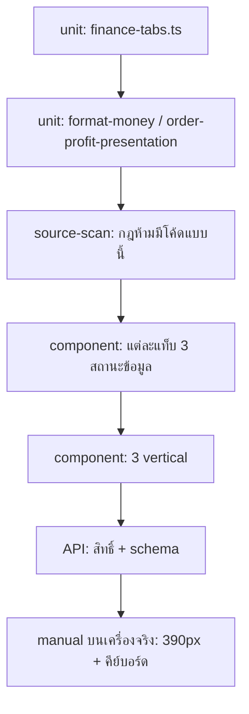

> **โมดูล:** 00067 — Shop Finance Tabs
> **ประเภทเอกสาร:** Test Case
> **เวอร์ชัน:** 1.0
> **วันที่จัดทำ:** 2026-09-30
> **สถานะ:** Draft — ยังไม่ execute (ยังไม่เริ่ม implement)

# Test Case: แท็บการเงินร้าน

---

## 1. Overview

| หัวข้อ | รายละเอียด |
|--------|-----------|
| **ระดับที่เทส** | unit (pure) · source-scan (กฎที่ grep ได้) · component · API |
| **ที่วางไฟล์** | `src/lib/__tests__/` · `src/app/(paces)/seller/(dashboard)/sales/components/__tests__/` |
| **รันด้วย** | `vitest` |
| **ข้อจำกัด** | Hard Rule 13 — ห้ามคำสั่งลบข้อมูลแบบไม่ scope · เทสที่แตะ DB ต้อง scope ด้วย id ที่เทสสร้างเอง |
| **การรัน** | ต้อง override `DATABASE_URL` ชี้ 5434 และตั้ง `STORAGE_DRIVER=local` ไม่งั้นเทสถูกข้ามแล้วเขียวหลอก |

### 1.1 เทสที่ต้องเป็น source-scan ไม่ใช่ behaviour

บางกฎของฟีเจอร์นี้ **พิสูจน์ด้วยการรันโค้ดไม่ได้** เพราะมันเป็นกฎว่า "ห้ามมีโค้ดแบบนี้อยู่" — ต้องสแกนซอร์ส:

| กฎ | วิธีสแกน |
|----|---------|
| ไม่มีไฟล์ใดใน `sales/**` คำนวณกำไรเอง | หาแพตเทิร์นลบ/ลบเลขที่ไม่ได้มาจาก `PnlReport` |
| ไม่มีคำว่า "กำไรสุทธิ" hardcode นอก SSOT | grep ในไฟล์ UI |
| ไม่มี arbitrary Tailwind value | grep `text-[`, `bg-[`, `rounded-[`, `shadow-[` |
| ไม่มี emoji | grep ช่วง unicode |
| ไม่ import chart lib ตรง ๆ | grep `from 'react-apexcharts'` ฯลฯ |

> 🛑 ทุกลูปสแกนต้องพิสูจน์ก่อนว่า**ไฟล์ที่ต้องการสแกนถูกอ่านจริง** (นับไฟล์ที่เจอ > 0) — เทสที่ walk ไดเรกทอรีแล้วไม่เจอไฟล์เลยจะผ่านเสมอโดยไม่ตรวจอะไร

---

## 2. Test Scenarios

### TC-001: แท็บ 3 อันครบและลำดับถูก
**อ้างอิง:** FR-FIN-01 AC-01/AC-02
1. render หน้าด้วยร้าน `SERVICE_QUEUE`
2. อ่านปุ่มใน `role="tablist"`
- **คาดหวัง:** ได้ 3 ปุ่ม ข้อความตามลำดับ `กำไรขาดทุน`, `ยอดเก็บเงิน`, `ค่าใช้จ่าย` และแท็บแรกมี `aria-selected="true"`

### TC-002: แถบแท็บใช้โครง Paces ไม่ใช่ที่เขียนเอง
**อ้างอิง:** FR-FIN-01 AC-02 · Hard Rule 7
1. สแกนซอร์ส `FinanceTabs.tsx`
- **คาดหวัง:** พบคลาส `nav-tabs` และ `nav-link` · ไม่พบ `rounded-[`, `text-[`, `bg-[`, `shadow-[`

### TC-003: resolve ค่า tab ที่แปลก
**อ้างอิง:** FR-FIN-02 AC-03 · TFR-001
| input | คาดหวัง |
|-------|---------|
| `'pnl'` | `'pnl'` |
| `'expense'` | `'expense'` |
| `null` / `undefined` / `''` | `'pnl'` |
| `'PNL'` | `'pnl'` (ไม่ใช่ throw) |
| `'../../etc/passwd'` | `'pnl'` |
- **คาดหวัง:** ไม่มี input ใดทำให้ throw

### TC-004: `/seller/expenses` ไม่ 404
**อ้างอิง:** FR-FIN-03
1. ร้าน `SERVICE_QUEUE` → เปิด `/seller/expenses`
2. ร้าน `ONLINE_SALES` → เปิด `/seller/expenses`
- **คาดหวัง:** (1) redirect ไป `/seller/sales?tab=expense` · (2) render หน้าเดิม ไม่ redirect

### TC-005: เมนูต่อ vertical
**อ้างอิง:** FR-FIN-04
- **คาดหวัง:** `SERVICE_QUEUE` ได้รายการเรื่องเงิน 1 รายการ ชื่อ `การเงินร้าน` · vertical อื่นได้ 2 รายการเดิม · slug ทั้งสองยังมีอยู่ในระบบ shortcut

### TC-006: กำไรบนการ์ดหน้าแรก = กำไรบนแท็บ
**อ้างอิง:** FR-FIN-05 AC-02
1. เตรียมข้อมูลร้านหนึ่งเดือน
2. เรียกฟังก์ชันที่การ์ดหน้าแรกใช้ และฟังก์ชันที่แท็บใช้ ด้วยช่วงเดียวกัน
- **คาดหวัง:** ค่าเท่ากันเป๊ะ (เทียบเป็น string หลัง format ไม่ใช่ float)

### TC-007: ไม่มีไฟล์ใดใน sales คำนวณกำไรเอง
**อ้างอิง:** FR-FIN-05 AC-04/AC-05
1. เดินไฟล์ทั้งหมดใน `sales/`
2. ยืนยันจำนวนไฟล์ที่สแกน > 0
3. หาการประกาศตัวแปรชื่อที่มี `profit`/`กำไร` ที่ไม่ได้มาจาก `PnlReport` หรือ `presentOrderProfit`
- **คาดหวัง:** 0 จุด

### TC-008: แถบองค์ประกอบบวกลงตัว
**อ้างอิง:** FR-FIN-06 AC-01
- **คาดหวัง:** `revenue − cogs − totalExpense === netProfit` ทุกชุดข้อมูลทดสอบ รวมกรณีติดลบ

### TC-009: กราฟ 2 ซีรีส์และชื่อแกนตรงกัน
**อ้างอิง:** FR-FIN-07 AC-02/AC-03
- **คาดหวัง:** ทุกค่า `yaxis[].seriesName` ปรากฏใน `series[].name` · ไม่มี hex ตรง ๆ ใน options (ต้องมาจาก `getColor`)

### TC-010: ผลรวมตาราง = หัว
**อ้างอิง:** FR-FIN-08 AC-02
- **คาดหวัง:** ผลรวมทุกคอลัมน์ตัวเลขของตารางรายวัน = ค่าบนหัวของแท็บ

### TC-011: ตัดสินสถานะข้อมูลครบ
**อ้างอิง:** FR-FIN-09 · TFR-002
| hasMissingCost | expenseCount | คาดหวัง `complete` |
|----------------|--------------|---------------------|
| false | 3 | **true** |
| true | 3 | false |
| false | 0 | false |
| true | 0 | false |

### TC-012: custom item ไม่ถูกนับใน uncostedItemCount
**อ้างอิง:** TFR-002 (edge)
1. ข้อมูลมี `OrderItem` ที่ `productId = null` และ `cost = null`
- **คาดหวัง:** `hasMissingCost = true` (ป้ายยังขึ้น) แต่ `uncostedItemCount` ไม่นับรายการนั้น

### TC-013: สถานะไม่ครบต้องไม่มีคำว่า "กำไรสุทธิ"
**อ้างอิง:** FR-FIN-10 AC-01/AC-05
1. render แท็บด้วยสถานะไม่ครบ
- **คาดหวัง:** พบข้อความ `กำไรได้มากที่สุด` และ `≤` · **ไม่พบ** ข้อความ `กำไรสุทธิ` ที่ใดในผลลัพธ์

### TC-014: สีของสถานะไม่ครบเป็นกลาง
**อ้างอิง:** FR-FIN-10 AC-03
- **คาดหวัง:** `PROFIT_TONE.capped.text` เป็นคลาส `text-default-*` · ไม่ใช่ `text-success-ink` หรือ `text-danger-ink`

### TC-015: CTA แสดง/หายตามสถานะ
**อ้างอิง:** FR-FIN-11
| สถานะ | ปุ่มตั้งราคาทุน | ปุ่มบันทึกค่าใช้จ่าย |
|-------|----------------|---------------------|
| ขาดทั้งคู่ | แสดง | แสดง |
| ขาดต้นทุนอย่างเดียว | แสดง | ซ่อน |
| ขาดค่าใช้จ่ายอย่างเดียว | ซ่อน | แสดง |
| ครบ | ซ่อน | ซ่อน |
- **คาดหวัง:** ปุ่มตั้งราคาทุนมีข้อความ "ยังไม่ได้ตั้ง n จาก m" ที่ n/m มาจาก completeness ไม่ใช่ค่าคงที่

### TC-016: สมการเก็บเงินลงตัว
**อ้างอิง:** FR-FIN-12 AC-01
- **คาดหวัง:** `receivedTotal + outstandingTotal === salesTotal` ทุกชุดข้อมูล รวมกรณีที่มี payment ถูก void

### TC-017: รายการตามเก็บ เรียงและกรองถูก
**อ้างอิง:** FR-FIN-13 AC-01/AC-05
- **คาดหวัง:** มีเฉพาะ `outstandingAmount > 0` · เรียง `createdAt` เก่าสุดก่อน · ไม่มีบิล `CANCELLED`

### TC-018: บิลที่รับเงินเกิน
**อ้างอิง:** TFR-005 (edge) · API R5
1. ข้อมูลมีบิลที่ `receivedAmount > totalAmount`
- **คาดหวัง:** บิลนั้น**ไม่อยู่ใน `items`** แต่ `receivedTotal` ยังรวมยอดจริง (สมการยังลงตัวตาม TC-016)

### TC-019: แท็บค่าใช้จ่ายมีความสามารถครบเท่าหน้าเดิม
**อ้างอิง:** FR-FIN-14 AC-02
1. ไล่รายการ element ที่หน้า `/expenses` เดิม render (สรุป · หมวด · ตัวกรอง · รายการ · ปุ่มบันทึก · ปุ่มแก้ · ปุ่มลบ)
- **คาดหวัง:** ทุกตัวปรากฏในแท็บด้วย

### TC-020: แยกต้นทุนอัตโนมัติออกจากค่าใช้จ่ายที่กรอกเอง
**อ้างอิง:** FR-FIN-15
- **คาดหวัง:** รายการต้นทุนอะไหล่ไม่มีปุ่มแก้/ลบ และมีข้อความว่าระบบคิดให้เอง

### TC-021: สวิตช์บนการ์ดหน้าแรก — 🛑 **ยังไม่รัน (FR-FIN-16 BLOCKED)**
**อ้างอิง:** FR-FIN-16 (ดูกล่องสถานะใน BRD — ติดมติรวมสูตรกำไรที่ยังไม่ถูกเคาะ)
- **คาดหวัง:** มี 2 ตัวเลือก · โหมดกำไรใช้ค่าชุดเดียวกับ TC-006 · ร้าน vertical อื่นไม่มีสวิตช์

### TC-022: พนักงานไม่มีสิทธิ์ไม่เห็นตัวเลขใน payload
**อ้างอิง:** FR-FIN-17 AC-02
1. render หน้าด้วย `staffCanViewFinance = false`
2. แปลงผลลัพธ์เป็นสตริง
- **คาดหวัง:** ไม่พบตัวเลขยอดขาย/กำไร/ค่าใช้จ่ายใด ๆ ในสตริงนั้น (เทียบกับค่าที่เตรียมไว้ในข้อมูลทดสอบ)

### TC-023: API ปฏิเสธผู้ไม่มีสิทธิ์
**อ้างอิง:** FR-FIN-17 AC-04 · API §5
| สถานการณ์ | คาดหวัง |
|-----------|---------|
| ไม่มี session | 401 |
| ไม่มีร้าน active | 403 `NO_SHOP` |
| ADMIN ไม่มีสิทธิ์การเงิน | 403 `STAFF_NOT_ALLOWED` |
| ร้าน `ONLINE_SALES` | 404 `NOT_FOUND` |
| `range=custom` ไม่มี `from` | 400 `INVALID_RANGE` |

### TC-024: ร้าน ONLINE_SALES ไม่เห็นแท็บ
**อ้างอิง:** FR-FIN-18 AC-01/AC-03
- **คาดหวัง:** ไม่มี `role="tablist"` ในผลลัพธ์ · หน้าที่ได้เหมือนก่อนฟีเจอร์นี้

### TC-025: ร้าน LODGING ไม่เห็นแท็บ
**อ้างอิง:** FR-FIN-18 AC-02
- **คาดหวัง:** เหมือน TC-024

### TC-026: ทุก vertical มี costNoun
**อ้างอิง:** FR-FIN-19 AC-01/AC-04
1. วนทุกคีย์ของ `ORDER_VOCAB`
- **คาดหวัง:** ทุกคีย์มี `costNoun` ที่เป็นสตริงไม่ว่าง และคีย์ของ `ORDER_VOCAB` เท่ากับของ `PRODUCT_VOCAB` (เทสเดิมที่มีอยู่แล้ว ต้องยังเขียว)

### TC-027: สองนิยามของยอดขายต้องถูกเขียนกำกับบนจอ
**อ้างอิง:** TFR-005 · Hard Rule 16
1. render แท็บกำไรขาดทุน และแท็บยอดเก็บเงิน
- **คาดหวัง:** ทั้งสองแท็บมีข้อความอธิบายนิยามยอดขายของตัวเองปรากฏอยู่ — ไม่ใช่แค่ในคอมเมนต์

### TC-028: ไม่มี emoji และไม่มี arbitrary value
**อ้างอิง:** Hard Rule 7 · 12
1. สแกนไฟล์ใหม่/ไฟล์ที่แก้ทั้งหมดของฟีเจอร์
- **คาดหวัง:** 0 จุด ทั้งสองอย่าง (ยกเว้น carve-out ที่มีคอมเมนต์กำกับบรรทัดเดียวกัน)

### TC-029: ไม่ import chart lib ตรง ๆ
**อ้างอิง:** Hard Rule 10
- **คาดหวัง:** `rg "from 'react-apexcharts'|from 'echarts'|from 'chart\.js'|from 'recharts'"` ในไฟล์ของฟีเจอร์ = 0

### TC-030: เปลี่ยนช่วงแล้วสถานะเปลี่ยนตาม
**อ้างอิง:** BRD Scenario 6 · SDS §4.2
1. เดือนปัจจุบันมีค่าใช้จ่าย → สถานะครบ
2. เปลี่ยนไปเดือนก่อนที่ไม่มี `Expense`
- **คาดหวัง:** สถานะกลับเป็นไม่ครบ ป้ายกลับมา — ไม่ใช่จำสถานะเดิมไว้

---

## 3. Traceability Matrix

| FR | AC | TC |
|----|----|----|
| FR-FIN-01 | AC-01..05 | TC-001, TC-002 |
| FR-FIN-02 | AC-01..04 | TC-003 |
| FR-FIN-03 | AC-01..03 | TC-004 |
| FR-FIN-04 | AC-01..03 | TC-005 |
| FR-FIN-05 | AC-01..05 | TC-006, TC-007 |
| FR-FIN-06 | AC-01..03 | TC-008 |
| FR-FIN-07 | AC-01..05 | TC-009 |
| FR-FIN-08 | AC-01..04 | TC-010 |
| FR-FIN-09 | AC-01..03 | TC-011, TC-012 |
| FR-FIN-10 | AC-01..05 | TC-013, TC-014 |
| FR-FIN-11 | AC-01..05 | TC-015 |
| FR-FIN-12 | AC-01..03 | TC-016, TC-027 |
| FR-FIN-13 | AC-01..05 | TC-017, TC-018 |
| FR-FIN-14 | AC-01..03 | TC-019 |
| FR-FIN-15 | AC-01..03 | TC-020 |
| FR-FIN-16 | AC-01..05 | TC-021 |
| FR-FIN-17 | AC-01..04 | TC-022, TC-023 |
| FR-FIN-18 | AC-01..04 | TC-024, TC-025 |
| FR-FIN-19 | AC-01..04 | TC-026 |
| Hard Rules | 7·10·12 | TC-028, TC-029 |
| Scenario 6 | — | TC-030 |

**ครอบคลุม:** 19 FR / 30 TC — ทุก FR มี TC อย่างน้อย 1 ตัว

---

## 4. Flow การทดสอบ

---

## 5. ผลล่าสุด

| รอบ | วันที่ | ผ่าน | ตก | หมายเหตุ |
|-----|--------|------|-----|---------|
| 1 | 2026-09-30 | 71 | 0 | unit + source-scan ของ 00067 ทั้งหมด · mutation 16 แบบแดงครบ |

**หมายเหตุรอบที่ 1:** ครอบเฉพาะเทสอัตโนมัติ — **browser QA ยังไม่เคยรันสักเคส** (ยังไม่เคยเปิดหน้าจริง)
และ TC-021 ยังไม่รันเพราะ FR-FIN-16 ถูกกันไว้ · เทสที่แดงในรีโป 8 ตัวพิสูจน์แล้วว่าแดงบน `origin/main` เหมือนกัน (หนี้เดิม)

---

## 6. สรุป

เทสของฟีเจอร์นี้แบ่งเป็นสองพวกที่ต่างกันโดยสิ้นเชิง:

1. **เทสตัวเลข** — พิสูจน์ว่าผลบวกลงตัวและสองจอให้ค่าเท่ากัน
2. **เทสข้อความ** — พิสูจน์ว่า *คำ* ที่อยู่บนจอถูกต้อง โดยเฉพาะว่า "กำไรสุทธิ" จะไม่โผล่เมื่อข้อมูลไม่ครบ

พวกที่สองสำคัญกว่าและถูกมองข้ามง่ายกว่า เพราะ `tsc`/build/lint ผ่านหมดไม่ว่าคำบนจอจะผิดแค่ไหน
