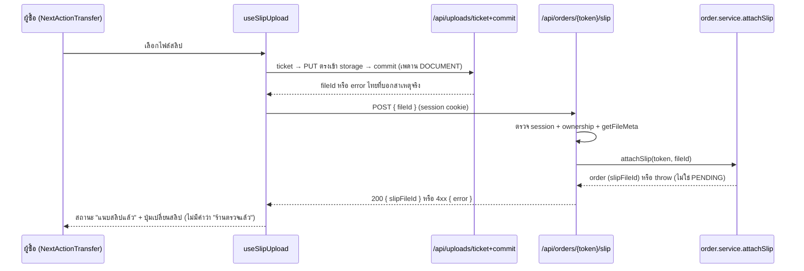

> **โมดูล:** 00068 — Buyer Order Page Redesign
> **ประเภทเอกสาร:** API Contract
> **เวอร์ชัน:** 0.1
> **วันที่จัดทำ:** 2026-10-05
> **สถานะ:** Draft
> **เจ้าของเอกสาร:** SA (ดู [[Feature-Docs-Ownership]]) · ร่างโดย `safepay-planner`

# API Contract: หน้าคำสั่งซื้อฝั่งผู้ซื้อ ฉบับปรับใหม่

---

## 1. Overview

**ฟีเจอร์นี้ไม่มี endpoint ใหม่ และไม่เปลี่ยนสัญญาของ endpoint เดิมแม้แต่ตัวเดียว** (ยืนยันกับซอร์สของ route handler ทั้ง 5 ตัวแล้ว) สิ่งเดียวที่เปลี่ยนคือ **สัญญาภายในฝั่งเซิร์ฟเวอร์** ที่ไม่ใช่ HTTP: รูป `where` ของ `getOrderByToken` และรูปร่าง `PublicOrderData` ที่ RSC ส่งให้ client — บันทึกใน §4

- **Provider:** Next.js 16 Route Handlers `src/app/api/orders/[token]/**` (service layer `src/services/order.service.ts`)
- **ผู้บริโภค:** `OrderDetailMobile.tsx` / `PublicOrderClient.tsx` / `useSlipUpload` (เบราว์เซอร์/WebView ของผู้ซื้อ)
- **เอกสารออกแบบต้นทาง:** [[SDS]] (§5 Integration Points, TD-005)
- **Base URL:** origin เดียวกับหน้า (`https://deepthailand.app`) — เรียกแบบ same-origin
- **Content-Type:** `application/json`
- **Convention:** ข้อความ error เป็นภาษาไทยพร้อมแสดงตรง ๆ ในฟิลด์ `error` (string) — **ไม่ใช่** envelope `{error:{code,message}}` ของ template (โปรเจกต์นี้ใช้รูป `{ error: string }` มาตลอด)

---

## 2. Authentication

| รายการ | ค่า |
|--------|-----|
| **วิธี (Auth Method)** | NextAuth.js v4 session cookie (httpOnly) — ไม่ใช่ Bearer |
| **Header** | ส่ง cookie อัตโนมัติ (same-origin) |
| **Token / Scope** | `sessionUserId(session)` ต้องไม่ว่าง · แล้วเทียบ `order.buyerUserId === sessionUserId` (ownership) — `cancel` ยอมให้สมาชิกร้านยกเลิกได้ด้วยแต่ผู้ซื้อในหน้านี้ได้ `initiator='buyer'` |
| **CSRF / rate-limit** | `guardApi` ใน `src/proxy.ts` (Origin-check + per-IP) — ไม่เปลี่ยน |
| **กรณีไม่ผ่าน** | 401 `{ error: "ไม่ได้เข้าสู่ระบบ" }` / 403 `{ error: "ไม่มีสิทธิ์…" }` |

---

## 3. Endpoint List

> ทั้งหมดเป็น endpoint เดิมที่หน้าเรียกอยู่ **ไม่มีรายการใหม่**

| Method | Path | คำอธิบาย |
|--------|------|----------|
| `POST` | `/api/orders/{token}/confirm` | ผู้ซื้อยืนยันรับ (PENDING/SHIPPED → CONFIRMED) |
| `POST` | `/api/orders/{token}/cancel` | ยกเลิกคำสั่งซื้อ (ปุ่มแถบล่าง ตอน PENDING) |
| `POST` | `/api/orders/{token}/dispute` | แจ้งปัญหา (ข้อความไม่บังคับ ≤ 500) |
| `POST` | `/api/orders/{token}/slip` | ผูกสลิป (`{ fileId }`) |
| `POST` | `/api/orders/{token}/review` | ส่งรีวิว (หลังยืนยันรับ) |
| `PATCH` | `/api/orders/{token}/review` | แก้รีวิว (ภายใน 24 ชม.) |
| `DELETE` | `/api/orders/{token}/review` | ลบรีวิว (soft delete) |
| `POST` | `/api/uploads/ticket` · `/api/uploads/commit` | direct upload ของสลิป (ผ่าน `uploadFileId(file,'DOCUMENT')`) |

---

## 4. Endpoint Detail

### 4.0 สัญญาภายในที่เปลี่ยน (ไม่ใช่ HTTP)

**(ก) `getOrderByToken(publicToken)`** — `src/services/order.service.ts`
- signature และ `include` คงเดิมทั้งหมด · เปลี่ยนเฉพาะ `shipments.where` จาก `{ status: 'CREATED' }` เป็น `ACTIVE_FORWARD_SHIPMENT` (`{ status:'CREATED', isDryRun:false, direction:'FORWARD' }`) `orderBy createdAt desc` `take 1` และ `select` คงเดิม
- ผู้เรียกในระบบ: `page.tsx` (เส้นทางล็อกอิน + guest) ที่เดียว (ยืนยันด้วย grep) ⇒ จอ guest ได้ผลด้วย (แก้พัสดุขากลับ/dry-run ที่เคยหลุดมา)
- ไม่มี Error ใหม่

**(ข) `PublicOrderData`** — เพิ่มฟิลด์ตาม [[SRS]] §4.2(ข): `shipmentTracking.courierCode`, `carrierStatus`, `problemAt`, `returnStartedAt`, `returnedAt`, `returnDispatchedAt`, `money.depositReceived` · ไม่มี PII เพิ่ม

### 4.1 `POST /api/orders/{token}/confirm`

ผู้ซื้อกดปุ่มแถบล่าง (ผ่าน dialog ถามซ้ำเสมอ) · **ไม่เปลี่ยน**

**Request**

| ส่วน | ฟิลด์ | ชนิด | บังคับ | คำอธิบาย |
|------|-------|------|--------|----------|
| Path Param | `token` | string | yes | `Order.publicToken` |
| Body | `{}` | object | no | ไม่ใช้ค่าใด (`PublicOrderClient` ส่ง `{}`) |

**Response — Success (200):** body = ออเดอร์ที่อัปเดต (JSON) · **ผู้เรียกใช้เฉพาะ `status`** (`data.status ?? 'CONFIRMED'`) — UI ใหม่ต้องไม่พึ่งฟิลด์อื่นของ response นี้

**Response — Error**

| HTTP | `error` | เงื่อนไข |
|------|---------|----------|
| 401 | `ไม่ได้เข้าสู่ระบบ` | ไม่มี session |
| 403 | `ไม่มีสิทธิ์ยืนยันคำสั่งซื้อนี้` | `OrderOwnershipError` |
| 403 | `เจ้าของที่พักจะยืนยันการจองให้หลังตรวจสลิปแล้ว` | `BookingConfirmViaShopError` (ใบจอง — ไม่เข้าหน้านี้) |
| 400 | `ยืนยันคำสั่งซื้อไม่สำเร็จ กรุณาตรวจสอบและลองใหม่` | อื่น ๆ (ไม่ echo `err.message`) |

```json
// Request
{}
// Response 200 (ย่อ — ใช้เฉพาะ status)
{ "status": "CONFIRMED" }
```

### 4.2 `POST /api/orders/{token}/cancel`

ปุ่มยกเลิกในแถบล่าง (เฉพาะ PENDING) ผ่าน dialog · **ไม่เปลี่ยน**

| ส่วน | ฟิลด์ | ชนิด | บังคับ | คำอธิบาย |
|------|-------|------|--------|----------|
| Path | `token` | string | yes | |
| Body | `reason` | string | no | ผู้ซื้อไม่ต้องส่ง — `cancelOrder` ตั้ง `BUYER_SELF_CANCEL_REASON`/`BUYER_REQUESTED` เอง; `initiator` มาจาก session ไม่รับจาก body |

**Success (200):** ออเดอร์ที่อัปเดต (มี `cancelInitiator`) — UI ใช้ `data.cancelInitiator` ผสมกับ state

| HTTP | `error` | เงื่อนไข |
|------|---------|----------|
| 403 | `ไม่มีสิทธิ์ยกเลิกคำสั่งซื้อนี้` | ไม่ใช่เจ้าของ/สมาชิกร้าน |
| 400 | `เลือกเหตุผลก่อนยกเลิก` / `เหตุผลที่เลือกไม่อยู่ในรายการ` | เฉพาะ initiator=seller |
| 400 | `คำสั่งซื้อนี้อยู่ในสถานะที่ยกเลิกไม่ได้แล้ว` | `assertTransition` ล้ม |
| 404 | `ไม่พบคำสั่งซื้อนี้` / `Order not found` | |
| 500 | `ยกเลิกไม่สำเร็จ กรุณาลองใหม่อีกครั้ง` | ข้อผิดพลาดที่ไม่คาด |

### 4.3 `POST /api/orders/{token}/dispute`

| ส่วน | ฟิลด์ | ชนิด | บังคับ | คำอธิบาย |
|------|-------|------|--------|----------|
| Body | `note` | string ≤ `DISPUTE_NOTE_MAX` (500) | no | ข้อความจากผู้ซื้อ |

**Success (200):** `{ "disputeOpenedAt": "<ISO>" }`

| HTTP | `error` | เงื่อนไข |
|------|---------|----------|
| 401 | `unauthorized` | ไม่มี session |
| 403 | `ไม่มีสิทธิ์แจ้งปัญหาคำสั่งซื้อนี้` | ไม่ใช่เจ้าของ |
| 400 | `รายละเอียดยาวเกิน 500 ตัวอักษร` | |
| 409 | `คำสั่งซื้อนี้ปิดจบไปแล้ว แจ้งปัญหาไม่ได้` | `OrderAlreadyClosedError` (CONFIRMED/CANCELLED ระหว่างโมดัลเปิดค้าง) |
| 404 | `Order not found` | |

### 4.4 `POST /api/orders/{token}/slip`

ผูกสลิปที่อัปโหลดแล้ว (direct upload) กับออเดอร์ · **ไม่เปลี่ยน** — และ **ไม่เช็ควิธีชำระ**: `attachSlip` ตรวจแค่ `status === 'PENDING'` ⇒ การซ่อนช่องแนบสลิปของออเดอร์ CASH (มติ D-5) เป็นเรื่อง UI ล้วน ไม่ได้สร้างด่านฝั่ง server

| ส่วน | ฟิลด์ | ชนิด | บังคับ | คำอธิบาย |
|------|-------|------|--------|----------|
| Header | `Content-Type: application/json` | | yes | ทางหลัก |
| Body | `fileId` | string | yes | จาก `uploadFileId(file,'DOCUMENT')` |

**Success (200):** `{ "slipFileId": "<fileId>" }`

| HTTP | `error` | เงื่อนไข |
|------|---------|----------|
| 401 | `ไม่ได้เข้าสู่ระบบ` | |
| 403 | `ไม่มีสิทธิ์แนบสลิปคำสั่งซื้อนี้` | `order.buyerUserId !== session` |
| 404 | `Order not found` / `ยังไม่พบไฟล์ที่อัปโหลด กรุณาลองแนบใหม่` | ไม่พบออเดอร์ / `getFileMeta` ว่าง |
| 400 | `กรุณาแนบไฟล์สลิป` / `แนบสลิปไม่สำเร็จ กรุณาตรวจสอบและลองใหม่` | ตรวจ Valibot ล้ม / `attachSlip` throw (สถานะไม่ใช่ PENDING) |

หมายเหตุ: ทางที่ 2 (multipart) ใน route ยังอยู่ แต่ไม่มีผู้เรียกจากหน้านี้แล้ว (เส้นทางเดียวคือ JSON) — คอมเมนต์ใน route/เทสที่บอกว่ายังมีผู้เรียกเป็นข้อมูลเก่า ไม่เกี่ยวกับงานนี้

### 4.5 `POST | PATCH | DELETE /api/orders/{token}/review`

ไม่เปลี่ยน — `POST` 201 / 409 `รีวิวได้หลังยืนยันรับแล้วเท่านั้น` / 409 `คำสั่งซื้อนี้รีวิวไปแล้ว` / 400 · `PATCH` 200 · `DELETE` `{ ok: true }` · แก้/ลบได้ภายใน 24 ชม. (409 `ReviewEditWindowExpiredError`) · 401/403/404 ตามเดิม

---

## 5. Error Code Table

โปรเจกต์นี้ไม่มีรหัส error ที่เป็น code — ใช้ `{ "error": "<ข้อความไทย>" }` + HTTP status ตามตารางของแต่ละ endpoint ข้างบน

| HTTP Status | ความหมาย | จัดการบน UI |
|-------------|----------|-------------|
| 400 | ข้อมูลไม่ผ่าน/สถานะไม่ถูกต้อง | toast `data.error` |
| 401 | ไม่มี session | (หน้านี้ผ่าน grant แล้ว — ไม่ควรเกิด) |
| 403 | ไม่ใช่เจ้าของ | toast `data.error` |
| 404 | ไม่พบ | toast `data.error` |
| 409 | ชนกับสถานะปัจจุบัน (ปิดจบแล้ว / รีวิวไปแล้ว) | toast `data.error` |
| 500 | ข้อผิดพลาดที่ไม่คาด | toast ข้อความกลาง |

**Cross-file error-mapping:** ไม่มี custom Error ใหม่ที่ service `throw` ⇒ ไม่ต้องเติม branch ใน route-catch ใด ๆ (ตารางของ 4.1–4.5 คงเดิมบรรทัดต่อบรรทัด)

---

## 6. Sequence (ถ้า flow ซับซ้อน)



---

## 7. Traceability

| Endpoint | SDS Component / Decision | BRD FR |
|----------|--------------------------|--------|
| `POST /confirm` | ConfirmBar · dialog ใน shell (TD-007) | FR-BOP-11 |
| `POST /cancel` | ConfirmBar (ปุ่มยกเลิก) | FR-BOP-11 (AC-BOP-11-7) |
| `POST /dispute` | HelpCard | FR-BOP-12 (#17) |
| `POST /slip` | NextActionTransfer · `useSlipUpload` (TD-005) | FR-BOP-05 |
| `POST/PATCH/DELETE /review` | โซนรีวิวใน shell · `ReviewSheet` | FR-BOP-12 (#25, #26, #31) |
| `getOrderByToken` (ภายใน) | Batch B1-U3 · TFR-014 | FR-BOP-06 (AC-BOP-06-5, 06-7) |
| `PublicOrderData` (ภายใน) | TD-003 · Batch B2 | FR-BOP-06, FR-BOP-13 |

---

## 8. สรุป (Summary)

เอกสาร API Contract นี้ยืนยันว่า **00068 ไม่มี endpoint ใหม่และไม่เปลี่ยนสัญญา endpoint เดิม** — การเปลี่ยนมีเพียงรูป query ของ `getOrderByToken` และฟิลด์พัสดุของ `PublicOrderData` ซึ่งไม่มี PII เพิ่ม QA ใช้ตารางใน §4 ทดสอบ negative case ได้เหมือนเดิมทุกข้อ

**Open Questions:**
- ไม่มีที่เกี่ยวกับ API โดยตรง (ประเด็น D-4 ฝั่ง guest ดู [[SRS]] O-1)
