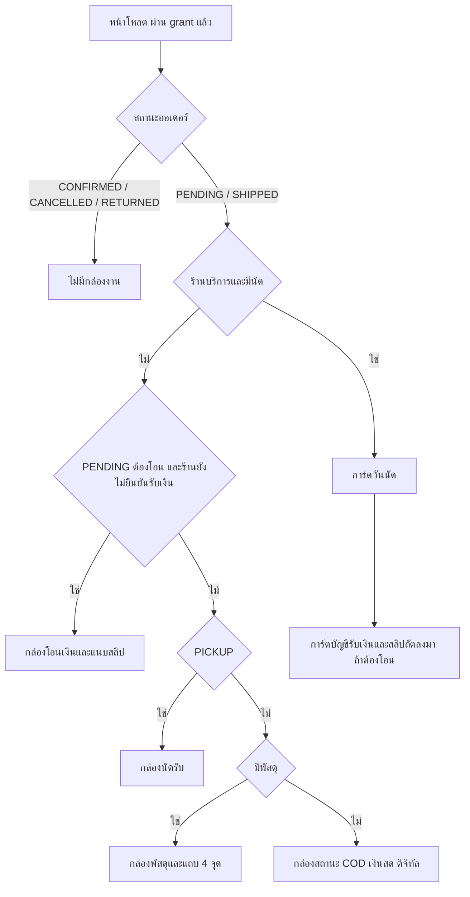
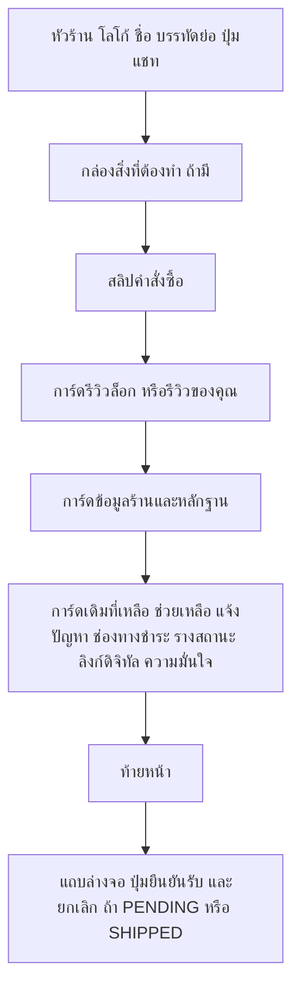
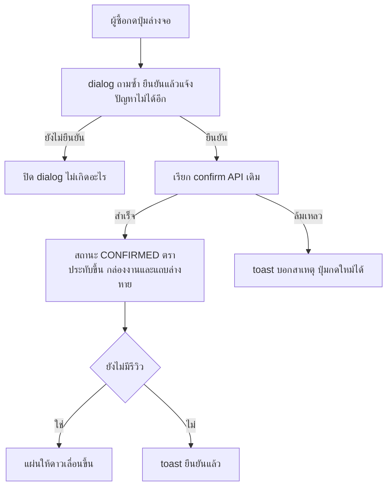

> **โมดูล:** 00068 — Buyer Order Page Redesign
> **ประเภทเอกสาร:** Business Requirements Document (BRD) - NON-TECHNICAL
> **เวอร์ชัน:** 1.0
> **วันที่จัดทำ:** 2026-10-05
> **สถานะ:** Draft — รอ user review
> **เจ้าของเอกสาร:** BA (ดู [[Feature-Docs-Ownership]]) · ร่างโดย `safepay-product`

# BRD: หน้าคำสั่งซื้อฝั่งผู้ซื้อ ฉบับปรับใหม่ (Business Requirements Document)

---

## 1. บทนำ

### 1.1 วัตถุประสงค์ของเอกสาร

เอกสารนี้มีวัตถุประสงค์เพื่อ:
1. แปลงความต้องการใน [[PRD]] เป็น Functional Requirements พร้อม Acceptance Criteria แบบ Given/When/Then ที่ตัดสินผ่าน/ไม่ผ่านได้
2. กำหนดว่ากล่อง "สิ่งที่ต้องทำ" แสดงอะไรในทุกสถานะ x ทุกประเภทร้าน x ทุกวิธีรับของ/ชำระเงิน
3. ทำ inventory ฟังก์ชันของหน้าเดิมจากโค้ดจริง และระบุที่ลงใหม่ของแต่ละอัน เพื่อกันการตัดฟังก์ชันเงียบ ๆ
4. สร้างความเข้าใจร่วมกันระหว่างทีมธุรกิจและทีมพัฒนา

### 1.2 ขอบเขตของระบบ

**หน้าคำสั่งซื้อฉบับเต็มฝั่งผู้ซื้อ** คือหน้า `/o/[token]` ที่ผู้ซื้อล็อกอินและผ่านการตรวจความเป็นเจ้าของออเดอร์แล้ว (ไฟล์ `OrderDetailMobile.tsx` + `PublicOrderClient.tsx` + ข้อมูลจาก `page.tsx`)

**เข้าสู่ระบบ (Input):**
- ข้อมูลออเดอร์ที่ผ่าน grant แล้ว (รายการ ยอด สถานะ วิธีชำระ วิธีรับของ นัด เงินที่ร้านยืนยันรับ)
- หลักฐานร้าน (ระดับยืนยัน คะแนนเฉลี่ย จำนวนรีวิว ออเดอร์สำเร็จ ช่องทาง)
- ข้อมูลพัสดุ (ขนส่ง เลขพัสดุ สถานะจากขนส่ง) **ใหม่สำหรับหน้านี้** ดู §7.2

**ออกจากระบบ (Output):**
- หน้าที่เรียงตามสิ่งที่ผู้ซื้อต้องทำ: หัวร้าน → กล่องสิ่งที่ต้องทำ → สลิป → การ์ดอื่น ๆ → ปุ่มยืนยันล่างจอ
- การกระทำของผู้ซื้อผ่าน API เดิม (แนบสลิป ยืนยันรับ ยกเลิก แจ้งปัญหา รีวิว)

**ระบบที่เกี่ยวข้อง:**
- `SmsAutoEnter` / `ReviewSheet` / `ConfirmStamp` (พื้นฐานที่มีแล้ว ไม่อยู่ในขอบเขต)
- `GuestOrderView` (จอ guest ไม่อยู่ในขอบเขต แต่เป็นต้นแบบของแถบพัสดุ/หัวข้อสถานะ)
- `BookingGuestView` (ใบจอง LODGING ไม่อยู่ในขอบเขต)
- feature 00015 / 00041 / 00050 / 00056 / 00062

**ไม่อยู่ในขอบเขต:** ดู [[PRD]] §5

### 1.3 กลุ่มผู้ใช้งาน

| กลุ่มผู้ใช้ | บทบาท | สิทธิ์การใช้งาน |
|-----------|--------|----------------|
| **ผู้ซื้อ (เจ้าของออเดอร์ที่ล็อกอินแล้ว)** | ผู้ใช้หลักของหน้า | ดูรายละเอียด แนบสลิป ยืนยันรับ ยกเลิก (เฉพาะ PENDING) แจ้งปัญหา รีวิว |
| **ผู้ใช้ที่ยังไม่ผ่าน grant** | ไม่เห็นหน้านี้ | ได้จอ OTP/ยืนยันเบอร์/บล็อกตามเดิม ไม่เห็นรายละเอียดออเดอร์ |
| **ผู้เยี่ยมชมที่ไม่ได้ล็อกอิน** | ไม่อยู่ในขอบเขต | ได้ `GuestOrderView` ตามเดิม |
| **ร้านค้า** | ไม่มีสิทธิ์ใดบนหน้านี้ | ได้ประโยชน์ทางอ้อม |

---

## 2. ความต้องการหลัก (Functional Requirements)

### 2.1 หัวร้านและหลักฐานร้าน

#### FR-BOP-01: หัวร้านติดบนสุด

**User Story:**
> ในฐานะผู้ซื้อ ฉันต้องการเห็นชื่อและโลโก้ร้านเด่นชัดบนสุดของหน้า เพื่อมั่นใจว่านี่คือร้านที่ฉันคุยด้วยจริง และกดแชทหาร้านได้ทันที

**Acceptance Criteria:**
- [ ] AC-BOP-01-1 Given ผู้ซื้อเปิดหน้าออเดอร์ที่ผ่าน grant When หน้าโหลดเสร็จ Then องค์ประกอบแรกบนสุดของหน้าคือหัวร้าน ประกอบด้วยโลโก้ ชื่อร้าน บรรทัดย่อ และปุ่มแชท และไม่มีปกไล่สี/ปกร้านและบล็อกร้านใหญ่ของหน้าเดิมเหนือมัน
- [ ] AC-BOP-01-2 Given ร้านมีโลโก้ When แสดงหัวร้าน Then โลโก้เป็นรูปกลมขนาด 52px (ตามม็อกอัพ) ใช้ลำดับ `Shop.logo` ก่อนรูปเจ้าของ แล้วผ่านตัวแปลง key เป็น URL
- [ ] AC-BOP-01-3 Given ร้านไม่มีโลโก้ When แสดงหัวร้าน Then แสดงอักษรตัวแรกของชื่อร้านแทน และหัวร้านไม่ว่าง
- [ ] AC-BOP-01-4 Given ชื่อร้านยาว 38 ตัวอักษร (เช่น "BT Premium Auto Xeon - สาขาสุขสวัสดิ์") When แสดงที่ความกว้าง 320px Then ชื่อตัดเป็นไม่เกิน 2 บรรทัด หน้าไม่เลื่อนซ้ายขวา และปุ่มแชทไม่ถูกดันหลุดจอ
- [ ] AC-BOP-01-5 Given ผู้ซื้อกดปุ่มแชท When กด Then ไปที่ `/messages/{shopId}` (ใช้ `Shop.id` ไม่ใช่ `userId`) และพื้นที่กดไม่เล็กกว่า 44x44px
- [ ] AC-BOP-01-6 Given ชื่อร้านบนหัว When ตรวจ DOM Then เป็น heading ที่ screen reader เข้าถึงได้ (ทางเข้าโปรไฟล์ร้านอยู่ที่การ์ดข้อมูลร้าน)

**Business Flow:**
1. หน้าโหลด → หัวร้านอยู่บนสุดทุกสถานะ (รวมออเดอร์ที่ปิดแล้ว/ยกเลิก)
2. เลื่อนหน้าลงแล้วกลับขึ้นมา หัวร้านอยู่ที่เดิม (ไม่บังคับให้ติดค้างเมื่อเลื่อน ดู Open Question)

#### FR-BOP-02: บรรทัดย่อหลักฐานร้านบนหัว

**User Story:**
> ในฐานะผู้ซื้อที่ระแวงมิจฉาชีพ ฉันต้องการเห็นตัวเลขที่บอกว่าร้านเคยขายจริงตั้งแต่หัวหน้า เพื่อตัดสินใจโอนอย่างมั่นใจ

**Acceptance Criteria:**
- [ ] AC-BOP-02-1 Given ร้านมีคะแนนเฉลี่ยและมีออเดอร์สำเร็จ When แสดงบรรทัดย่อ Then รูปแบบเป็น "{คะแนน} ดาว · ออเดอร์สำเร็จ {N} ครั้ง" (เช่น "4.7 ดาว · ออเดอร์สำเร็จ 38 ครั้ง") — ถ้อยคำ "ดาว" รอ ux ตัดสินเทียบ "คะแนนรีวิว" ของ `ShopStats` (Open Question 8)
- [ ] AC-BOP-02-2 Given ร้านมีแต่ออเดอร์สำเร็จ ไม่มีรีวิว (`avgRating = null`) When แสดง Then แสดงเฉพาะ "ออเดอร์สำเร็จ {N} ครั้ง" และไม่มีคำว่า "0 ดาว" หรือเลข 0 ใด ๆ
- [ ] AC-BOP-02-3 Given ร้านใหม่ที่ `completedOrders = null` และ `avgRating = null` When แสดง Then ไม่แสดงบรรทัดย่อเลย
- [ ] AC-BOP-02-4 Given บรรทัดย่อ When ตรวจข้อความ Then ไม่มีข้อความ "ผู้ซื้อยืนยันรับของ" และคำว่า "ออเดอร์สำเร็จ" ตรงกับป้ายใน `ShopEvidence`
- [ ] AC-BOP-02-5 Given ชื่อร้านใช้ 2 บรรทัด When แสดงบรรทัดย่อ Then บรรทัดย่ออยู่บรรทัดเดียวตัดด้วย ellipsis และตัวเลขต้องไม่ถูกตัด (ถ้าไม่พอให้ย่อคำ ไม่ใช่ตัดตัวเลข)

#### FR-BOP-03: การ์ดข้อมูลร้าน (ที่ลงใหม่ของหลักฐานร้านที่ไม่อยู่บนหัว)

**User Story:**
> ในฐานะผู้ซื้อ ฉันต้องการหาหลักฐานเต็มของร้านได้เมื่อต้องการตรวจสอบ เพื่อไม่ต้องเชื่อแค่บรรทัดย่อ

**Acceptance Criteria:**
- [ ] AC-BOP-03-1 Given หน้าใหม่ When ตรวจหาข้อมูลของหน้าเดิมต่อไปนี้ Then ทุกข้อยังหาเจอบนหน้า: ป้ายยืนยันร้าน (ผ่าน `resolveVerifyBadge` พร้อมระดับ) · ชั้นคะแนนความน่าเชื่อถือ (tier) · @username · สถิติร้าน (ออเดอร์สำเร็จ คะแนน จำนวนรีวิว) · ช่องทางที่เชื่อมต่อ (ShopChannels) · เพจต้นทางของออเดอร์ (ตามเงื่อนไข `shouldShowOrderOrigin` เดิม) · ลิงก์ "ดูโปรไฟล์ร้าน" ไป `/u/{username}`
- [ ] AC-BOP-03-2 Given การ์ดข้อมูลร้าน When แสดงป้ายยืนยัน Then ใช้คำและสีจาก `verify-badge.ts` (เช่น "ยืนยันเบอร์แล้ว") ห้ามประกอบเอง และระดับ 0 ไม่มีป้าย
- [ ] AC-BOP-03-3 Given ร้านที่มีช่องทางหลายเพจ When แสดงการ์ด Then ใช้เงื่อนไขกันซ้ำของ `shouldShowOrderOrigin` เดิม
- [ ] AC-BOP-03-4 Given การ์ดข้อมูลร้าน When ตรวจ payload ที่ส่งลง client Then ช่องทางส่งเฉพาะ 5 คีย์ (provider, name, avatarUrl, externalId, followerCount)
- [ ] AC-BOP-03-5 Given ปุ่มช่วยเหลือและแชร์ที่เดิมอยู่บนปก (`CoverActions`) และตราแบรนด์กลับหน้าแรก (`BrandHomeLink`) When ปกถูกถอด Then ทั้งสามอย่างยังเข้าถึงได้บนหน้า ณ ตำแหน่งที่ ux spec กำหนด (Open Question 1)

---

### 2.2 กล่อง "สิ่งที่ต้องทำตอนนี้"

#### FR-BOP-04: หลักการเลือกกล่องและลำดับความสำคัญ

**User Story:**
> ในฐานะผู้ซื้อ ฉันต้องการเห็นสิ่งที่ฉันต้องทำเป็นเรื่องแรกของหน้า เพื่อไม่ต้องอ่านทั้งหน้า

**Acceptance Criteria:**
- [ ] AC-BOP-04-1 Given ออเดอร์ใดก็ตามที่ยังไม่ปิด When หน้าโหลด Then กล่องสิ่งที่ต้องทำเป็นการ์ดแรกใต้หัวร้าน (ไม่มี banner หรือกล่องอื่นแทรกระหว่างกลาง)
- [ ] AC-BOP-04-2 Given ออเดอร์สถานะ CONFIRMED / CANCELLED / RETURNED When หน้าโหลด Then ไม่แสดงกล่องสิ่งที่ต้องทำ
- [ ] AC-BOP-04-3 Given กล่องใด ๆ When ตรวจหัวข้อ Then หัวข้อเป็นคำสั่งงานหรือสถานะ ไม่มีป้ายเล็ก (eyebrow) เหนือหัวข้อ และขนาดตัวอักษรอยู่ใน ramp ของ DESIGN.md
- [ ] AC-BOP-04-4 Given กล่องที่มีปุ่มหรือข้อมูลหลัก When เปิดที่ viewport 360x740 Then หัวข้อและปุ่ม/ข้อมูลหลักของกล่องเห็นครบโดยไม่ต้องเลื่อน
- [ ] AC-BOP-04-5 Given ออเดอร์ที่เข้าได้หลายเงื่อนไข When เลือกกล่อง Then ใช้ลำดับ: (1) ร้านบริการที่มีนัด → การ์ดนัด (2) PENDING ที่ต้องโอนและร้านยังไม่ยืนยันรับเงิน → กล่องโอน (3) PICKUP → กล่องนัดรับ (4) มีพัสดุ → กล่องพัสดุ (5) อื่น ๆ → กล่องสถานะ

#### FR-BOP-05: กล่องโอนเงินและแนบสลิป (ร้านขายของ รอโอน)

**User Story:**
> ในฐานะผู้ซื้อที่ต้องโอนเงิน ฉันต้องการเห็นยอด บัญชี และที่แนบสลิปในกล่องเดียว เพื่อโอนและแจ้งร้านได้โดยไม่ต้องหา

**Acceptance Criteria:**
- [ ] AC-BOP-05-1 Given ออเดอร์ PENDING, `needsPayoutAccount(paymentMethod) = true`, ร้านยังไม่ยืนยันรับเงิน (`paymentConfirmedAt = null`) When แสดงกล่อง Then หัวข้อเป็น "โอน ฿{totalAmount} ให้ร้าน" และใต้หัวข้อมีบรรทัด "โอนแล้วแนบสลิปเพื่อแจ้งร้าน"
- [ ] AC-BOP-05-2 Given ร้านมีบัญชีรับเงิน (`payoutSnapshot`) When แสดงกล่อง Then แสดงชื่อธนาคาร ชื่อบัญชี เลขบัญชี และปุ่มคัดลอกเลขบัญชีขนาดไม่เล็กกว่า 44px และคงพฤติกรรมเดิมของ `PayoutAccountCard` (คัดลอก/QR พร้อมเพย์/บันทึกรูป QR/fail-closed ถ้าสร้าง payload ไม่ได้)
- [ ] AC-BOP-05-3 Given ร้านยังไม่ตั้งบัญชี (`payoutSnapshot = null`) When แสดงกล่อง Then แสดงข้อความ fallback เดิมของ `PayoutAccountCard` พร้อมปุ่ม "ติดต่อร้านค้า" ไม่มีหัวข้อ "โอน ... ให้ร้าน" ที่ไม่มีบัญชีรองรับ
- [ ] AC-BOP-05-4 Given ยังไม่แนบสลิป When แสดงกล่อง Then มีปุ่มหลัก "แนบสลิป" (ปุ่มทึบม่วงเต็มความกว้างกล่อง) บอกเพดานไฟล์จาก `uploadMaxSize('DOCUMENT')` ไม่ใช่เลขที่พิมพ์เอง
- [ ] AC-BOP-05-5 Given แนบสลิปแล้ว (`slipFileId != null`) When แสดงกล่อง Then แสดงสถานะ "แนบสลิปแล้ว" พร้อมปุ่มเปลี่ยนสลิป และไม่มีข้อความบอกว่า "ร้านตรวจแล้ว" หรือ "ร้านจะ..." ใด ๆ
- [ ] AC-BOP-05-6 Given อัปโหลดสลิปล้มเหลว When แสดง error Then ข้อความบอกสาเหตุที่ทำได้จริง (เช่น ไฟล์ใหญ่เกิน/ชนิดไม่รองรับ) ไม่ใช่ "ลองอีกครั้ง" กับสิ่งที่ไม่มีวันสำเร็จ
- [ ] AC-BOP-05-7 Given ร้านยืนยันรับเงินแล้ว (`paymentConfirmedAt != null`) หรือออเดอร์ไม่ใช่ PENDING When แสดงหน้า Then ไม่แสดงกล่องโอน/QR กล่องถัดไปในลำดับ FR-BOP-04 ขึ้นแทน

#### FR-BOP-06: กล่องพัสดุ (กำลังจัดส่ง)

**User Story:**
> ในฐานะผู้ซื้อที่รอของ ฉันต้องการเห็นสถานะพัสดุและเลขพัสดุทันที เพื่อรู้ว่าของถึงไหนโดยไม่ต้องถามร้าน

**Acceptance Criteria:**
- [ ] AC-BOP-06-1 Given ออเดอร์มีพัสดุ (ร้านแจ้งเลขเอง หรือเปิดผ่าน iShip) When แสดงกล่อง Then หัวข้อมาจาก `resolveOrderStatusHeadline` (เช่น "กำลังจัดส่ง") และป้ายสถานะออเดอร์เล็กแสดงเฉพาะเมื่อไม่ซ้ำกับหัวข้อ
- [ ] AC-BOP-06-2 Given กล่องพัสดุ When แสดงรายละเอียด Then มีชื่อขนส่ง เลขพัสดุ และปุ่มคัดลอกเลข ที่ขนาดไม่เล็กกว่า 44px
- [ ] AC-BOP-06-3 Given กล่องพัสดุ When แสดงแถบพัสดุ Then มี 4 จุดคำ "รอส่งของ · รับเข้าระบบแล้ว · กำลังจัดส่ง · ส่งสำเร็จ" จาก `SHIPMENT_STAGES` ตัวเดียวกับฝั่งร้านและ `ParcelTimeline` ของจอ guest ขั้นที่ไฮไลต์คำนวณจาก `deriveShippingStage` / `describeProgress`
- [ ] AC-BOP-06-4 Given พัสดุสถานะ "มีปัญหา" หรือ "ตีกลับ" When แสดงแถบ Then แสดงกล่องเตือนและโทนสีตาม `ParcelTimeline` เดิม ไม่ใช้สีเขียวทั้งแถบ
- [ ] AC-BOP-06-5 Given ผู้ซื้อกับผู้ขายดูพัสดุใบเดียวกัน When เทียบขั้นที่ไฮไลต์ Then ตรงกัน (BR-BOE-12)
- [ ] AC-BOP-06-6 Given ออเดอร์สถานะ SHIPPED แต่ไม่มีข้อมูลพัสดุ When แสดงกล่อง Then แสดงหัวข้อสถานะออเดอร์ล้วน ไม่วาดแถบ 4 จุดให้พัสดุที่ไม่มี
- [ ] AC-BOP-06-7 Given ออเดอร์ที่ใบพัสดุขาไปและขากลับมีอยู่พร้อมกัน When แสดงกล่อง Then แสดงข้อมูลของพัสดุขาไปเท่านั้นเป็นเลขพัสดุหลัก ดู §7.2

#### FR-BOP-07: กล่องนัดรับที่ร้าน (PICKUP) และ COD / เงินสด / ดิจิทัล

**User Story:**
> ในฐานะผู้ซื้อที่ไม่ต้องโอนหรือไม่มีพัสดุ ฉันต้องการรู้ว่าต้องไปรับที่ไหน หรือต้องเตรียมจ่ายอย่างไร เพื่อไม่ต้องถามร้านซ้ำ

**Acceptance Criteria:**
- [ ] AC-BOP-07-1 Given ออเดอร์ PICKUP (`isPickupOrder`) When แสดงกล่อง Then แสดงจุดนัดรับ: ชื่อร้านเสมอ + ที่อยู่ร้านถ้ามี (ถ้าร้านไม่ได้กรอกที่อยู่ ใช้ข้อความ fallback เดิมของ `PickupInfoCard`)
- [ ] AC-BOP-07-2 Given ออเดอร์ PICKUP ที่ร้านกด "มอบสินค้าแล้ว" (`handedOverAt != null`) และยังไม่ปิด When แสดงกล่อง Then แสดงข้อความที่ระบบบันทึกจริงเท่านั้น "ร้านแจ้งว่ามอบสินค้าให้แล้วเมื่อ {เวลา}" และเวลาที่ระบบจะปิดอัตโนมัติ (มอบ + `PICKUP_AUTOCONFIRM_HOURS`) ไม่ใช้สีเขียว
- [ ] AC-BOP-07-3 Given ออเดอร์ PICKUP ที่ PENDING ต้องโอนและร้านยังไม่ยืนยันรับเงิน When แสดงหน้า Then กล่องโอน (FR-BOP-05) มาก่อน และข้อมูลนัดรับอยู่ในการ์ดถัดไป ไม่หายไป
- [ ] AC-BOP-07-4 Given ออเดอร์ COD ที่ยังไม่ส่ง When แสดงกล่อง Then หัวข้อมาจากสถานะออเดอร์ (SSOT) แสดงวิธีชำระด้วยคำจาก `paymentMethodLabel` และไม่มีปุ่มโอน/แนบสลิป/QR
- [ ] AC-BOP-07-5 Given ออเดอร์เงินสด (CASH) ที่ไม่ใช่ PICKUP และยังไม่ส่ง When แสดงกล่อง Then แสดงวิธีชำระด้วยคำจาก `paymentMethodLabel` ไม่มีปุ่มโอน และไม่เรียกเงินสดว่า "โอนเข้าบัญชี" (เงื่อนไขช่องแนบสลิป ดู Open Question 5)
- [ ] AC-BOP-07-6 Given ออเดอร์ดิจิทัล (`NO_SHIPPING` มี `accessUrl` เป็น http/https) When แสดงหน้า Then การ์ดลิงก์เข้าถึงเดิมยังอยู่ และไม่แสดงแถบพัสดุ

#### FR-BOP-08: การ์ดวันนัด (ร้านบริการ)

**User Story:**
> ในฐานะลูกค้าร้านบริการ ฉันต้องการเห็นวันนัดเป็นเรื่องแรก เพื่อมาตามนัดได้ถูกวัน

**Acceptance Criteria:**
- [ ] AC-BOP-08-1 Given ร้าน SERVICE_QUEUE และออเดอร์มีนัด (`appointment != null`) When แสดงกล่อง Then การ์ดวันนัดเป็นกล่องแรก แสดงวันที่ เวลาเริ่ม ระยะเวลา (จาก `formatDurationTH`) และชื่อช่าง/ทรัพยากร
- [ ] AC-BOP-08-2 Given การ์ดวันนัด When ตรวจฟังก์ชัน Then การกระทำของผู้ซื้อที่ `AppointmentCard` มีอยู่เดิม (ยืนยันนัด/ขอเลื่อน/สถานะนัด) ยังใช้ได้ครบ และแสดงโน้ตขอเลื่อนเดิมถ้ามี
- [ ] AC-BOP-08-3 Given ร้านบริการที่ไม่มีนัด (walk-in) When แสดงหน้า Then ไม่มีการ์ดนัด ไม่มีกล่องว่าง กล่องถัดไปตามลำดับ FR-BOP-04 ขึ้นแทน
- [ ] AC-BOP-08-4 Given ร้านบริการที่ออเดอร์ถูกยกเลิก When แสดงการ์ดนัด Then ส่ง `orderCancelled` เข้า `AppointmentCard` เหมือนเดิม
- [ ] AC-BOP-08-5 Given ร้านบริการที่มีนัดและต้องโอนด้วย When แสดงหน้า Then การ์ดนัดมาก่อน การ์ดบัญชีรับเงิน/สลิปอยู่ถัดลงมาทันที จำนวนเงินในส่วนโอนของร้านบริการรอ Open Question 4

#### FR-BOP-09: ออเดอร์ที่ปิดแล้ว (ยืนยัน / ยกเลิก / คืนของ)

**Acceptance Criteria:**
- [ ] AC-BOP-09-1 Given สถานะ CONFIRMED When แสดงหน้า Then ไม่มีกล่องสิ่งที่ต้องทำ ไม่มีปุ่มยืนยันล่างจอ มีตราประทับบนสลิป (ผู้ซื้อกดเอง = "ได้รับแล้ว"/"รับบริการแล้ว", ปิดโดยทางอื่น = "สำเร็จ") และข้อความท้ายหน้า "ธุรกรรมนี้สำเร็จและบันทึกแล้ว"
- [ ] AC-BOP-09-2 Given สถานะ CANCELLED When แสดงหน้า Then ไม่มีกล่องงาน แสดงกล่องเหตุผลยกเลิกตาม `cancelInitiator` รูปสินค้าเป็นสีเทา และข้อความท้ายหน้าเดิม
- [ ] AC-BOP-09-3 Given สถานะ RETURNED When แสดงหน้า Then ไม่มีกล่องงาน ป้ายสถานะมาจาก `resolveOrderStatusBadge('RETURNED')` และไม่แสดง QR โอนซ้ำ

---

### 2.3 สลิปคำสั่งซื้อ

#### FR-BOP-10: คำสั่งซื้อเป็นสลิปใบเดียว

**User Story:**
> ในฐานะผู้ซื้อ ฉันต้องการเห็นของที่สั่ง เลขคำสั่งซื้อ และยอดรวมในใบเดียว เพื่ออ่านออกเสียงให้ร้านฟังหรือเก็บเป็นหลักฐานได้

**Acceptance Criteria:**
- [ ] AC-BOP-10-1 Given สลิป When แสดงหัวสลิป Then มีคำนาม noun ตาม `ORDER_VOCAB` ("คำสั่งซื้อ" / "การเข้ารับบริการ") เลขคำสั่งซื้อเต็มจาก `formatOrderNo` และวันที่ (`formatDateTimeTH`) ไม่มีการตัดเลข
- [ ] AC-BOP-10-2 Given สลิป When แสดงรายการ Then ทุกรายการมีรูปสินค้า (ไม่มีรูปใช้ placeholder เดิมของ `ItemThumbnail`) ชื่อ จำนวน x ราคา และยอดต่อรายการ และคำอธิบายรายการที่หน้าเดิมแสดงยังแสดง (ตัดที่ 2 บรรทัด)
- [ ] AC-BOP-10-3 Given สลิป When แสดงยอด Then เส้นประคั่นก่อนยอดรวม ป้าย "ยอดรวม" และตัวเลขตัวหนา ป้าย "ยอดที่ต้องชำระ" ใช้เฉพาะ PENDING ที่ไม่มีการ์ดเงิน (ตรรกะ `totalLabel` เดิม)
- [ ] AC-BOP-10-4 Given สลิปมีขอบล่างแบบฉีก When แสดงบนพื้นหลังทุกสี Then ขอบฉีกไม่ทำให้เนื้อหาถูกตัด และตราประทับ (ถ้ามี) ไม่ทับยอดรวมหรือชื่อรายการ
- [ ] AC-BOP-10-5 Given ออเดอร์ขายของที่ร้านยืนยันรับเงินแล้ว (`paymentConfirmedAt != null`) When แสดงแถวยอดรวม Then มีป้าย "ร้านยืนยันรับเงินแล้ว" ข้างยอด และเมื่อยังไม่ยืนยันไม่มีป้ายนี้ ห้ามใช้คำว่า "ชำระแล้ว"
- [ ] AC-BOP-10-6 Given ออเดอร์ร้านบริการที่มีเรื่องเงิน (`order.money != null`) When แสดงสลิป Then มี 3 บรรทัด ยอดรวม · มัดจำ (พร้อมป้าย "ร้านยืนยันรับแล้ว" เฉพาะยอดที่ร้านบันทึกรับจริง) · "ยังค้างชำระ ฿X" และตัวเลขมาจากชุด `money` เดียวกับการ์ดเงิน
- [ ] AC-BOP-10-7 Given ร้านบริการที่ตกลงมัดจำไว้แต่ยังไม่ได้รับ When แสดงบรรทัดมัดจำ Then ไม่ขึ้นป้าย "ร้านยืนยันรับแล้ว" กับยอดนั้น
- [ ] AC-BOP-10-8 Given ออเดอร์ที่ผู้ซื้อกดยืนยันรับสำเร็จ When หน้าอัปเดต Then ตราประทับขึ้นบนสลิปทันทีโดยไม่ต้องรีโหลด กล่องสิ่งที่ต้องทำหายไป และปุ่มล่างจอหายไป

---

### 2.4 ปุ่มยืนยันล่างจอ

#### FR-BOP-11: ปุ่มยืนยันรับและคำกำกับ

**User Story:**
> ในฐานะผู้ซื้อ ฉันต้องการปุ่มยืนยันรับที่อยู่ในโซนนิ้วโป้ง พร้อมคำเตือนว่ากดเมื่อไร เพื่อไม่กดผิดจังหวะ

**Acceptance Criteria:**
- [ ] AC-BOP-11-1 Given สถานะ PENDING หรือ SHIPPED (`canConfirm`) When แสดงหน้า Then มีแถบล่างจอติดขอบ (fixed) และปุ่มหลักสูงไม่ต่ำกว่า 44px
- [ ] AC-BOP-11-2 Given ร้านขายของ When แสดงแถบ Then ใต้ปุ่มมีคำกำกับ "กดเมื่อได้ของครบแล้วเท่านั้น"
- [ ] AC-BOP-11-3 Given ร้านบริการ When แสดงแถบ Then ป้ายปุ่ม "ยืนยันว่ารับบริการแล้ว" และคำกำกับ "กดเมื่อรับบริการเรียบร้อยแล้วเท่านั้น"
- [ ] AC-BOP-11-4 Given ป้ายปุ่ม When ตรวจ Then ผันตาม `ctaLabel` เดิม และหัวข้อ dialog ถามซ้ำใช้คำเดียวกัน
- [ ] AC-BOP-11-5 Given ผู้ซื้อกดปุ่ม When กด Then เปิด dialog ถามซ้ำก่อนเสมอ ไม่ยิง API ทันที และ dialog บอกว่ายืนยันแล้วแจ้งปัญหากับคำสั่งซื้อนี้ไม่ได้อีก
- [ ] AC-BOP-11-6 Given ผู้ซื้อยืนยันใน dialog และออเดอร์ยังไม่มีรีวิว When สำเร็จ Then ตราประทับขึ้นแล้วแผ่นให้ดาว (`ReviewSheet`) เลื่อนขึ้น (พฤติกรรมของพื้นฐานที่มีแล้ว ห้ามเสีย)
- [ ] AC-BOP-11-7 Given สถานะ PENDING และ `onCancel` มีค่า When แสดงแถบ Then ปุ่มยกเลิกคำสั่งซื้อยังอยู่ในแถบล่างตามที่หัวหน้าเคาะ 2026-08-30 และเปิด dialog ยืนยันก่อนยกเลิก
- [ ] AC-BOP-11-8 Given แถบล่างจอ When เลื่อนสุดหน้า Then ท้ายหน้าไม่ถูกแถบบัง (กันที่ด้วยความสูงที่วัดจริง) และรองรับ safe-area ของ iOS
- [ ] AC-BOP-11-9 Given จอที่ ≥ จุดแยกสองคอลัมน์เดิม (`ORDER_TWO_COL_MQ` 1200px) When แสดงแถบ Then แสดงยอดที่ต้องชำระข้างปุ่มตามเดิม

---

### 2.5 คงฟังก์ชันเดิมทั้งหมด

#### FR-BOP-12: inventory ฟังก์ชันของหน้าเดิม และที่ลงใหม่

**User Story:**
> ในฐานะผู้ซื้อ ฉันต้องการให้ทุกอย่างที่เคยทำได้บนหน้านี้ยังทำได้ เพื่อไม่ต้องไปทักร้านแทน

ตารางนี้ทำจาก `OrderDetailMobile.tsx` ตัวจริง

| # | ฟังก์ชันเดิม (ที่มาในโค้ด) | เงื่อนไขแสดงเดิม | ที่ลงใหม่ |
|---|---------------------------|-----------------|----------|
| 1 | ปกร้าน `ShopCover` (ปกที่ร้านตั้งเอง/ไล่สี tier) | ทุกสถานะ | **ถอด** แทนด้วยหัวร้าน (FR-BOP-01) |
| 2 | ปุ่มช่วยเหลือ + ปุ่มแชร์ลิงก์ `CoverActions` | ทุกสถานะ | ต้องมีที่ใหม่ (AC-BOP-03-5, Open Question 1) |
| 3 | ตราแบรนด์ Deep กลับหน้าแรก `BrandHomeLink` (อยู่ใน ShopCover) | ทุกสถานะ | ต้องมีที่ใหม่ (Open Question 1) |
| 4 | โลโก้ร้าน + ตรา verify มุมโลโก้ | ทุกสถานะ | หัวร้าน (โลโก้) + การ์ดข้อมูลร้าน (ป้าย) |
| 5 | ชื่อร้าน @username ป้ายยืนยัน (`TrustPill` verify) ชั้น tier | ทุกสถานะ | หัวร้าน (ชื่อ) + การ์ดข้อมูลร้าน (ที่เหลือ) |
| 6 | สถิติร้าน `ShopStats` (ออเดอร์สำเร็จ คะแนน รีวิว) | ตามข้อมูลร้าน | หัวร้าน (บรรทัดย่อ) + การ์ดข้อมูลร้าน (เต็ม) |
| 7 | ช่องทางที่เชื่อมต่อ `ShopChannels` + ปุ่ม "ดูโปรไฟล์ร้าน" | ทุกสถานะ | การ์ดข้อมูลร้าน |
| 8 | เพจต้นทาง "จากการคุยที่ {เพจ}" | มี `originPage` และผ่าน `shouldShowOrderOrigin` | การ์ดข้อมูลร้าน |
| 9 | หัวเรื่องออเดอร์: เลขเต็ม + ปุ่มคัดลอก + ป้ายสถานะ + วันที่ + ลิงก์ "ดูคำสั่งซื้อทั้งหมด" (`/orders`) | ทุกสถานะ (ลิงก์เฉพาะจอกว้าง) | สลิป (เลข วันที่ ปุ่มคัดลอก) + ป้ายสถานะ/ลิงก์ `/orders` ตามที่ ux spec กำหนด ห้ามตัดปุ่มคัดลอกเลข |
| 10 | รางสถานะ `HorizontalTimeline` (3 ขั้น / 4 ขั้นร้านบริการ) | ทุกสถานะ | ยังไม่ตัดสิน (Open Question 6) ห้ามตัดเงียบ |
| 11 | กล่องกันพลาดร้านบริการ "ยืนยันนัดหมาย vs ยืนยันว่ารับบริการแล้ว (ย้อนกลับไม่ได้)" | ร้านบริการและ `canConfirm` | ต้องคงความหมายนี้ไว้ใกล้ปุ่มยืนยัน (BR-BOP-09) |
| 12 | กล่องเหตุผลยกเลิก | CANCELLED | ใต้สลิป คงข้อความตาม `cancelInitiator` |
| 13 | การ์ดนัดหมาย `AppointmentCard` (ยืนยันนัด/ขอเลื่อน) | มีนัด | กล่องบนสุดของร้านบริการ (FR-BOP-08) |
| 14 | รายการสินค้า/บริการ (รูป ชื่อ description จำนวน ราคา) + ตัวนับ + ยอดรวม | ทุกสถานะ | สลิป (FR-BOP-10) |
| 15 | ตราประทับ `ConfirmStamp` | CONFIRMED | สลิป (พื้นฐานที่มีแล้ว) |
| 16 | การ์ดช่วยเหลือ: ติดต่อร้านค้า | ทุกสถานะ | คงอยู่ (หัวร้านมีทางเข้าแชทเพิ่มอีกทาง) |
| 17 | แจ้งปัญหา + dialog (ข้อความไม่บังคับ ≤500) + แถบ "แจ้งปัญหาแล้ว เมื่อ {เวลา}" | ไม่ใช่ CONFIRMED/CANCELLED | คงอยู่ทั้งหมด (BR-BOP-08) |
| 18 | ยกเลิกคำสั่งซื้อ (แถบล่าง) + dialog + cancel API | PENDING และ `onCancel` มีค่า | คงอยู่ในแถบล่าง (AC-BOP-11-7) |
| 19 | การ์ดการชำระเงิน/ยอดค้างของร้านบริการ `PaymentSummaryCard` (วงแหวน + ประวัติรับเงิน) | `order.money != null` | ข้อเสนอ: สลิปมีสรุป 3 บรรทัด การ์ดประวัติรับเงินคงไว้ (BR-BOP-10) |
| 20 | บัญชีรับเงิน + QR `PayoutAccountCard` (คัดลอก บันทึกรูป QR) | `needsPayoutAccount` | กล่องโอน (FR-BOP-05) |
| 21 | จุดนัดรับ `PickupInfoCard` | PICKUP | กล่องนัดรับ (FR-BOP-07) |
| 22 | แนบสลิป (ว่าง / แนบแล้ว / เปลี่ยน / พรีวิว) | `showSlipZone` = PENDING และไม่ใช่ COD | กล่องโอน (FR-BOP-05) |
| 23 | การ์ดช่องทางชำระเงิน (COD/เงินสด `paymentMethodLabel` + detail) | `paymentMethod != null` และไม่ต้องโอน | กล่องสถานะ (FR-BOP-07) |
| 24 | การ์ดเลขพัสดุ + ปุ่มคัดลอก | มี `shipmentTracking` | กล่องพัสดุ (FR-BOP-06) |
| 25 | โซนรีวิว 5 สถานะ: แก้ไข / รีวิวของคุณ (+คำตอบร้าน, รูป, แก้/ลบภายใน 24 ชม.) / ลบแล้ว / ยังไม่เปิด / เขียนรีวิว | ตามสถานะรีวิว | คงอยู่ทั้งหมด |
| 26 | แผ่นให้ดาวหลังยืนยัน `ReviewSheet` | หลังยืนยันสำเร็จและยังไม่มีรีวิว | คงอยู่ (พื้นฐานที่มีแล้ว) |
| 27 | ลิงก์เข้าถึงดิจิทัล | `NO_SHIPPING` และ `accessUrl` เป็น http/https | คงอยู่ |
| 28 | การ์ด "ซื้อผ่าน Deep มั่นใจได้" | ทุกสถานะ | คงอยู่ (ท้ายหน้า) |
| 29 | ข้อความท้ายหน้า + `PublicProfileFooter` | ตามสถานะ | คงอยู่ |
| 30 | dialog ยืนยันรับของ (ถามซ้ำ) | กดปุ่มยืนยัน | คงอยู่ |
| 31 | dialog ลบรีวิว ("ลบแล้วเขียนใหม่ไม่ได้") | กดลบรีวิว | คงอยู่ |
| 32 | โครง 2 คอลัมน์จอกว้าง (หลัก/ข้าง) และกฎกันล้นจอ | จอ ≥ 1200px | คงกฎกันล้นจอ ส่วนการจัดคอลัมน์ให้ ux spec กำหนดใหม่ |

**Acceptance Criteria:**
- [ ] AC-BOP-12-1 Given ตารางข้างบน When ตรวจหน้าใหม่ในแต่ละสถานะที่ฟังก์ชันนั้นเคยแสดง Then ทุกข้อ (ยกเว้นข้อ 1 ที่ถอดโดยตั้งใจ) ยังเข้าถึงได้และทำงานเหมือนเดิม และมีเคสทดสอบรายข้อใน TestCase
- [ ] AC-BOP-12-2 Given ข้อ 2, 3, 10, 11, 19 ที่ยังรอ Open Question When Controller สั่งออก scope baseline Then ต้องมีมติเป็นลายลักษณ์อักษรก่อนเริ่ม task ที่แตะข้อนั้น

---

### 2.6 ข้อมูล ความปลอดภัย และการแสดงผลหลายจอ

#### FR-BOP-13: ข้อมูลและ PII

**Acceptance Criteria:**
- [ ] AC-BOP-13-1 Given ผู้ใช้ที่ยังไม่ผ่าน grant (OTP_CLAIM_REQUIRED / OWNER_MISMATCH / PHONE_VERIFY_REQUIRED / LEGACY_NO_CLAIM) When เข้า `/o/[token]` Then ได้จอเดิมของแต่ละกรณี ไม่มีรายละเอียดออเดอร์ใน payload ที่ส่งลง client
- [ ] AC-BOP-13-2 Given ข้อมูลใหม่ที่ส่งเข้าหน้าฉบับล็อกอินแล้ว (ข้อมูลพัสดุเพื่อแถบ 4 จุด) When ตรวจ payload Then ประกอบด้วยฟิลด์ที่จำเป็นต่อการแสดงเท่านั้น ไม่มีข้อมูลติดต่อหรือที่อยู่ผู้ซื้อเพิ่ม และไม่มีคีย์ของ `ShopChannel` นอกรายการ 5 คีย์
- [ ] AC-BOP-13-3 Given ผู้ซื้อกดยืนยัน/ยกเลิก/แจ้งปัญหา/แนบสลิป/รีวิว When ส่งคำขอ Then ใช้ endpoint เดิมและด่าน ownership เดิมทุกประการ ไม่เปลี่ยนสัญญา API

#### FR-BOP-14: มือถือ เดสก์ท็อป และธีม

**Acceptance Criteria:**
- [ ] AC-BOP-14-1 Given จอ 320, 360, 390, 768, 1024, 1440px When เปิดทุกสถานะ Then หน้าไม่เลื่อนซ้ายขวา ไม่มีข้อความทับกัน ปุ่มทุกตัวกดได้ไม่เล็กกว่า 44px
- [ ] AC-BOP-14-2 Given จอกว้างระดับเดสก์ท็อป When แสดงหน้า Then หัวร้านและกล่องงานยังอยู่ก่อนส่วนอื่น และโครงสองคอลัมน์ (ถ้า ux spec คงไว้) ไม่ทำให้กล่องงานตกไปอยู่คอลัมน์รอง
- [ ] AC-BOP-14-3 Given ทุกข้อความบนหน้า When ตรวจ Then ฟอนต์ Anuphan เท่านั้น ไม่มี emoji ไอคอนจาก `@iconify/react` (tabler) เท่านั้น สีเขียวใช้เฉพาะสิ่งที่ยืนยันจริง ม่วง #7367F0 เป็น accent ของ action
- [ ] AC-BOP-14-4 Given ทุกอย่างที่กดได้ When ตรวจ Then มีป้ายหรือชื่อที่บอกว่ากดแล้วเกิดอะไร และ element ที่ใช้ `aria-label` อยู่บน element ที่ role รองรับชื่อ
- [ ] AC-BOP-14-5 Given เปิดหน้าใน WebView ของแอป iOS/Android When แสดงหน้า Then ไม่พังจากเดิม (แถบล่างรองรับ safe-area, ไม่พึ่งแถบที่อยู่ของเบราว์เซอร์)
- [ ] AC-BOP-14-6 Given โหมดมืด (ถ้าธีมผู้ซื้อรองรับ) When แสดงสลิปและขอบฉีก Then อ่านออกและคอนทราสต์ผ่าน AA (ต้องตรวจจริง)

---

## 3. Acceptance Criteria สรุป

### 3.1 หัวร้านและหลักฐานร้าน
- ✅ หัวร้านอยู่บนสุดทุกสถานะ ชื่อ/โลโก้เด่น ชื่อยาวขึ้น 2 บรรทัดไม่ดันจอ
- ✅ บรรทัดย่อใช้คำ "ออเดอร์สำเร็จ" ไม่มีเลข 0 ของร้านใหม่ ไม่มีคำว่า "ผู้ซื้อยืนยันรับของ N ครั้ง"
- ✅ หลักฐานร้านที่ไม่อยู่บนหัวยังหาเจอครบ (ป้าย tier ช่องทาง เพจต้นทาง โปรไฟล์ร้าน ช่วยเหลือ แชร์)

### 3.2 กล่องสิ่งที่ต้องทำ
**เมื่อออเดอร์ยังไม่ปิด:**
- ✅ กล่องงานเป็นการ์ดแรกใต้หัวร้าน เห็นหัวข้อและปุ่มหลักในจอแรกที่ 360x740
- ✅ ร้านขายของรอโอน → "โอน ฿X ให้ร้าน" + บัญชี + คัดลอก + แนบสลิป
- ✅ กำลังจัดส่ง → หัวข้อจาก SSOT + ขนส่ง/เลขพัสดุ/แถบ 4 จุดคำจาก `SHIPMENT_STAGES`
- ✅ ร้านบริการมีนัด → การ์ดวันนัดมาก่อน
- ✅ PICKUP / COD / เงินสด ไม่มีปุ่มโอนที่ไม่เกี่ยว

**เมื่อออเดอร์ปิดแล้ว:**
- ✅ ไม่มีกล่องงาน ไม่มีปุ่มล่างจอ CONFIRMED มีตราประทับ CANCELLED มีเหตุผลยกเลิก

### 3.3 สลิปและปุ่มยืนยัน
- ✅ สลิปมีรูป เลขเต็ม วันที่ ยอดรวม ขอบฉีก ตราประทับ ไม่ทับกัน
- ✅ ป้ายเงินพูดว่า "ร้านยืนยันรับเงินแล้ว" เท่านั้น ไม่ใช่ "จ่ายแล้ว"
- ✅ ปุ่มยืนยันล่างจอ มีคำกำกับ มีด่านถามซ้ำ ปุ่มยกเลิกยังอยู่เมื่อ PENDING

### 3.4 ฟังก์ชันเดิม
- ✅ ทุกข้อในตารางข้อ 2.5 (ยกเว้นปก) ยังทำงานเหมือนเดิม มีเคสทดสอบรายข้อ

---

## 4. Business Flows (กระบวนการทำงาน)

### 4.1 Flow หลัก: เลือกกล่อง "สิ่งที่ต้องทำ"

### 4.2 โครงหน้า (ลำดับบนลงล่าง)

ลำดับการ์ดช่วงท้ายให้ ux spec กำหนดรายละเอียด แต่ต้องครบตามตารางข้อ 2.5

### 4.3 Flow ยืนยันรับของ

---

## 5. Use Case Scenarios (สถานการณ์การใช้งานจริง)

### Scenario 1: ร้านขายของ โอนเงิน (Best Case)

**ผู้เกี่ยวข้อง:** ผู้ซื้อ (ออเดอร์ล้อแม็ก ฿2,400)

**เงื่อนไขเริ่มต้น:** PENDING วิธีชำระ TRANSFER ร้านมีบัญชี ร้านยังไม่ยืนยันรับเงิน ยังไม่แนบสลิป

**ขั้นตอน:**
1. เปิดหน้า เห็นหัวร้าน และกล่อง "โอน ฿2,400 ให้ร้าน"
2. กดคัดลอกเลขบัญชี โอนเงินในแอปธนาคาร
3. กลับมากด "แนบสลิป" เลือกรูป

**ผลลัพธ์:** สลิปถูกบันทึกกับออเดอร์ กล่องแสดง "แนบสลิปแล้ว" ยอดบนสลิปยังไม่มีป้าย "ร้านยืนยันรับเงินแล้ว" จนกว่าร้านจะกดยืนยัน

### Scenario 2: ร้านขายของ กำลังจัดส่ง แล้วยืนยันรับ

**ผู้เกี่ยวข้อง:** ผู้ซื้อ

**เงื่อนไขเริ่มต้น:** SHIPPED ขนส่ง Flash Express พัสดุกำลังจัดส่ง ร้านยืนยันรับเงินแล้ว

**ขั้นตอน:**
1. เปิดหน้า เห็นกล่อง "กำลังจัดส่ง" พร้อมเลขพัสดุและแถบ 4 จุด (จุดที่ 3 สว่าง)
2. คัดลอกเลขพัสดุไปเช็คกับแอปขนส่ง
3. ได้ของแล้ว กดปุ่มล่างจอ ยืนยันใน dialog

**ผลลัพธ์:** ตราประทับ "ได้รับแล้ว" ขึ้นบนสลิป กล่องงานและแถบล่างหาย แผ่นให้ดาวเลื่อนขึ้น

### Scenario 3: ร้านบริการ มีนัดและมัดจำ

**ผู้เกี่ยวข้อง:** ลูกค้าร้านบริการ (ติดฟิล์ม ฿12,900 มัดจำ ฿2,000)

**เงื่อนไขเริ่มต้น:** PENDING มีนัด ร้านยืนยันรับมัดจำแล้ว

**ขั้นตอน:**
1. เปิดหน้า กล่องบนสุดคือการ์ดวันนัด
2. สลิปแสดงยอดรวม ฿12,900 · มัดจำ ฿2,000 (ร้านยืนยันรับแล้ว) · ยังค้างชำระ ฿10,900
3. หลังรับบริการเสร็จ กด "ยืนยันว่ารับบริการแล้ว"

**ผลลัพธ์:** ตรา "รับบริการแล้ว" ขึ้นบนสลิป

### Scenario 4: นัดรับที่ร้าน (PICKUP) ที่ร้านมอบของแล้ว

**ผู้เกี่ยวข้อง:** ผู้ซื้อ

**เงื่อนไขเริ่มต้น:** PICKUP ชำระเงินสด ร้านกด "มอบสินค้าแล้ว" ผู้ซื้อยังไม่ยืนยัน

**ขั้นตอน:**
1. เปิดหน้า เห็นกล่องจุดนัดรับ และข้อความ "ร้านแจ้งว่ามอบสินค้าให้แล้วเมื่อ ..." พร้อมเวลาที่ระบบจะปิดอัตโนมัติ
2. ตรวจของแล้ว กดยืนยันรับ หรือกดแจ้งปัญหา

**ผลลัพธ์:** ถ้ายืนยัน ตราประทับขึ้น ถ้าแจ้งปัญหา ระบบหยุดปิดอัตโนมัติตามกติกา 00062 และแสดงแถบ "แจ้งปัญหาแล้ว"

### Scenario 5: ผู้ซื้อต้องแจ้งปัญหา

**ผู้เกี่ยวข้อง:** ผู้ซื้อ

**เงื่อนไขเริ่มต้น:** SHIPPED ผ่านมาหลายวัน ยังไม่ได้ของ

**ขั้นตอน:**
1. เลื่อนหาการ์ดช่วยเหลือ กด "แจ้งปัญหาคำสั่งซื้อ"
2. พิมพ์ข้อความ (ไม่บังคับ) กดแจ้ง

**ผลลัพธ์:** แถวแจ้งปัญหาเปลี่ยนเป็นแถบ "แจ้งปัญหาแล้ว เมื่อ {เวลา}" ร้านเห็นเรื่องนี้ ออเดอร์ไม่ถูกยกเลิก

---

## 6. ความต้องการด้านคุณภาพ (Quality Requirements)

### 6.1 ความถูกต้องของข้อมูล
- ตัวเลข ป้าย และสถานะทุกตัวมาจาก SSOT เดิม ห้ามคำนวณหรือพิมพ์คำเองบนหน้าจอ (HR16)
- ตัวเลขเงินของร้านบริการ (สลิป การ์ดเงิน แถบล่าง) มาจากชุด `money`/`serviceMoney` ชุดเดียว
- ป้ายยืนยันและตราประทับต้องไม่อ้างเกินที่ข้อมูลบอก

### 6.2 ความรวดเร็ว
- ข้อมูลพัสดุที่เพิ่มต้องดึงในรอบ query เดียวกับที่มีอยู่ ไม่เพิ่มรอบ query ซ้ำ
- หน้าไม่โหลด component หนักที่ไม่ได้ใช้ในสถานะนั้น

### 6.3 ความน่าเชื่อถือ
- สถานะหลังกดยืนยัน/ยกเลิก/แจ้งปัญหา อัปเดตทันทีโดยไม่ต้องรีโหลด และไม่ค้างสถานะเก่าจาก state ฝั่ง client

### 6.4 ความปลอดภัย
- ด่าน grant/PII ของ `page.tsx` คงเดิม ข้อมูลใหม่ที่ส่งลง client ต้องไม่มี PII เพิ่ม
- แชร์ลิงก์คือการส่งต่อ "กุญแจ" ของออเดอร์ (ดูเหตุผลใน `CoverActions`) ตำแหน่งใหม่ของปุ่มนี้ต้องคงกติกาเดิม

### 6.5 ความสะดวกในการใช้งาน (Usability)
- ผู้ใช้อายุ 50+ ที่ digital literacy ต่ำทำงานหลักได้ ตัวหนังสืออ่านง่าย พื้นที่กด ≥ 44px
- คำบนจออ่านเป็นภาษาคน ไม่สัญญาแทนร้าน ข้อความ error บอกทางออกที่ทำได้จริง

---

## 7. ข้อจำกัด (Constraints)

### 7.1 ข้อจำกัดทางธุรกิจ
- ตามธีม Vuexy ฝั่งผู้ซื้อ (HR1/HR5/HR8/HR12) และ Impeccable (One Voice ม่วง ≤ ~10% ของจอ)
- ต้องผ่าน `safepay-ux` ก่อน build และรัน `/impeccable critique` + `/impeccable clarify` หลัง build
- WebView ของแอปเปิดหน้านี้อยู่ ห้ามเพี้ยนบนมือถือ
- ทุกการ์ดและ component ต้อง copy จากธีมหรือจาก component พี่น้องที่มีอยู่ (`sibling-surface-parity`)

### 7.2 ข้อจำกัดทางเทคนิค (ที่ยืนยันกับโค้ดแล้ว)
- **ข้อมูลพัสดุของฝั่งล็อกอินยังไม่มี:** `PublicOrderData` ของ `OrderDetailMobile` มีแค่ `shipmentTracking` (ขนส่ง + เลข) ส่วน stage, `carrierStatus`, `returnStartedAt/returnedAt/returnDispatchedAt` อยู่เฉพาะ `GuestOrderData` ใช้กับ `ParcelTimeline` และ `resolveOrderStatusHeadline` ที่ `GuestOrderView` เท่านั้น งานนี้ต้องเพิ่มข้อมูลชุดนี้ที่ `page.tsx` ฝั่งล็อกอิน
- **ปัญหาที่มีอยู่ก่อน ต้องแก้ก่อนหรือพร้อมงานนี้ (Controller ยืนยันกับโค้ดแล้ว 2026-10-05):** `getOrderByToken` (`order.service.ts`) ดึง `shipments` ด้วย `where: { status: 'CREATED' }` โดยไม่กรอง `direction` หลัง 00056 พัสดุขากลับ (ใหม่กว่าเสมอ) อาจถูกหยิบเป็น "พัสดุของออเดอร์นี้" ทั้งจอ guest และจอล็อกอิน ต้องใช้ `ACTIVE_FORWARD_SHIPMENT` (`src/lib/shipment-direction.ts`) ตามที่จุดอื่นแก้ไปแล้ว
- **เทสสแกนซอร์สผูกกับไฟล์เดิม:** `buyer-order-guardrails.test.ts`, `buyer-order-typography.test.ts`, `public-order-timeline-a11y.test.ts`, `error-copy-consistency.test.ts`, `sms-link-one-time.test.ts` ต้องไม่แดง ถ้าย้ายโค้ดไปไฟล์ใหม่ต้องย้ายเทสพร้อมพิสูจน์ด้วย mutation (`rule-must-be-enforced-not-described`)
- **ห้ามใช้เงื่อนไข boolean ที่ตัดสินว่า UI จะแสดงอะไรในเทอร์นารีกลาง JSX:** ตัวเลือกกล่อง (FR-BOP-04) ต้องเป็นฟังก์ชันบริสุทธิ์ใน `src/lib/**` พร้อมเทส `[blocker]`
- **ห้ามอ่าน session แล้ว cast:** ใช้ `sessionUserId()` ตามเดิม

---

## 8. กฎทางธุรกิจ (Business Rules)

### 8.1 กฎคำและการสื่อสาร

- **BR-BOP-01** ป้ายยืนยันร้านมาจาก `resolveVerifyBadge` ("ยืนยันเบอร์แล้ว" ฯลฯ) ระดับ 0 ไม่มีป้าย
- **BR-BOP-02** ห้ามเขียน "ผู้ซื้อยืนยันรับของ N ครั้ง" สถิติร้านใช้คำ "ออเดอร์สำเร็จ" เท่านั้น (CONFIRMED เกิดได้จากผู้ซื้อกดเอง / COD เคลียร์ / ระบบปิดเองหลังส่งถึง 7 วัน / ระบบปิดเองหลังมอบของนัดรับ 48 ชม. — สองอย่างหลังบันทึกเป็น `SYSTEM_CONFIRMED`)
- **BR-BOP-03** noun ผันผ่าน `ORDER_VOCAB` เท่านั้น ห้ามต่อสตริง ห้ามใช้ "ใบสั่งซื้อ" ร้านบริการใช้ "การเข้ารับบริการ"
- **BR-BOP-04** แถบพัสดุใช้คำ `SHIPMENT_STAGES` (`src/lib/iship/status.ts`) แยกแกนเงินกับแกนพัสดุด้วย `resolveOrderStatusHeadline`
- **BR-BOP-05** คำบอกผู้ซื้อห้ามสัญญาแทนร้าน ("โอนแล้วแนบสลิปเพื่อแจ้งร้าน" ถูก, "ร้านจะแพ็กของให้" ผิด) ข้อความที่อ้างการกระทำของร้านต้องเป็นข้อเท็จจริงที่ระบบบันทึกแล้วและมีเวลากำกับ
- **BR-BOP-06** ป้ายเงินที่บอกว่าร้านรับเงินแล้วใช้ "ร้านยืนยันรับเงินแล้ว/ร้านยืนยันรับแล้ว" ห้ามใช้ "จ่ายแล้ว/ชำระแล้ว" กับสิ่งที่ร้านยังไม่ได้ยืนยัน
- **BR-BOP-07** ยอดค้างใช้ "ยังค้างชำระ ฿X" จาก `order-payment.ts` เลขคำสั่งซื้อแสดงเต็มเสมอ (`formatOrderNo`) และห้ามสับสนกับเลขใบเสร็จ CA...

### 8.2 กฎการกระทำของผู้ซื้อ

- **BR-BOP-08** ปุ่มแจ้งปัญหา (หรือแถบ "แจ้งปัญหาแล้ว") ต้องเข้าถึงได้ในทุกสถานะที่ยังไม่ปิดจบ การยืนยันรับทำให้แจ้งปัญหาไม่ได้อีก จึงต้องมีด่านถามซ้ำเสมอ
- **BR-BOP-09** ร้านบริการที่มีนัดซึ่งผู้ซื้อยังไม่ยืนยัน ต้องมีข้อความแยกให้ชัดว่า "ยืนยันนัดหมาย" (ย้อนได้) ต่างจาก "ยืนยันว่ารับบริการแล้ว" (ปิดงาน ย้อนไม่ได้) ในจุดที่ผู้ซื้อเห็นก่อนกดปุ่มปิดงาน
- **BR-BOP-10** ร้านบริการที่มีเรื่องเงิน สลิปแสดงสรุป 3 บรรทัด และการ์ดประวัติรับเงิน (`PaymentSummaryCard`) ยังต้องมีให้ดูรายการรับเงินรายครั้ง ตัวเลขทั้งสองที่มาจากชุดเดียวกัน (ข้อเสนอ รอยืนยันใน Open Question 6)
- **BR-BOP-11** รีวิวเปิดได้หลังยืนยันรับแล้ว (CONFIRMED) เท่านั้น ก่อนนั้นแสดงการ์ดรีวิวล็อกที่อ้างคำบนปุ่มยืนยันจริง (`ctaLabel`)
- **BR-BOP-12** กล่องงานของ PICKUP ห้ามใช้สีเขียวก่อน CONFIRMED (คำ "ร้านแจ้งว่ามอบของแล้ว" เป็นคำบอกเล่าฝั่งเดียวของร้าน)

### 8.3 กฎการแสดงผล

- **BR-BOP-13** ตัวเลือกกล่องงานตามลำดับ FR-BOP-04 ต้องเป็นฟังก์ชันที่ทดสอบได้ ไม่ใช่เงื่อนไขกระจายใน JSX
- **BR-BOP-14** ข้อมูลที่ไม่รู้ ไม่แสดงเป็น 0 ข้อมูลที่ไม่มี ไม่ปล่อยกล่องว่าง
- **BR-BOP-15** ทุกอย่างที่กดได้ต้องบอกได้ว่ากดแล้วเกิดอะไร (ป้าย/คำ/aria-label)

---

## 9. อภิธานศัพท์ (Glossary)

| คำศัพท์ | ความหมาย |
|---------|----------|
| **กล่องสิ่งที่ต้องทำ** | การ์ดแรกใต้หัวร้านที่บอกงานของผู้ซื้อตอนนี้ |
| **สลิป** | การ์ดคำสั่งซื้อรูปทรงใบเสร็จขอบล่างฉีก |
| **grant** | ผล `resolveOrderAccess` ที่อนุญาตให้ส่งรายละเอียดออเดอร์ลง client |
| **สองแกนสถานะ** | สถานะออเดอร์ (PENDING ฯลฯ) กับสถานะพัสดุ (รอส่งของ ฯลฯ) |
| **ร้านยืนยันรับเงินแล้ว** | ร้านกดบันทึกรับเงิน/ยืนยันเอง ต่างจากผู้ซื้อแนบสลิป |
| **ออเดอร์สำเร็จ** | จำนวนออเดอร์ของร้านที่ CONFIRMED |
| **PICKUP** | นัดรับที่ร้าน |
| **SHIPMENT_STAGES** | 4 ขั้นของแถบพัสดุ ใน `src/lib/iship/status.ts` |

---

## 10. Open Questions (รอ user ตัดสิน — เรียงตามความสำคัญ)

1. **หลักฐานร้านที่ไม่อยู่บนหัวใหม่ไปอยู่ไหน** (ป้ายระดับ · tier · @username · ช่องทาง · เพจต้นทาง · ดูโปรไฟล์ร้าน · ปุ่มช่วยเหลือ · ปุ่มแชร์ · ตราแบรนด์กลับหน้าแรก) — ข้อเสนอ: การ์ด "ข้อมูลร้าน" ใต้สลิป ส่วนช่วยเหลือ/แชร์ให้ ux spec ตัดสินตำแหน่ง
2. **แถบปุ่มยืนยันตอน PENDING ที่ยังไม่โอน** — ม็อกอัพขั้น 3 ไม่วาด แต่โค้ดให้กดได้ตั้งแต่ PENDING เอกสารเขียนตามโค้ด (แสดงทุก PENDING/SHIPPED) เพราะ COD/นัดรับ/เงินสดยังต้องใช้
3. **จอ guest (`GuestOrderView`)** ยังเป็นแบบเดิมที่มีปก สองจอของออเดอร์ใบเดียวกันจะห่างกัน — ตั้งไว้นอกขอบเขต ต้องการให้ตามทีหลังไหม
4. **ร้านบริการที่จ่ายมัดจำแล้วบางส่วน ให้โอนเท่าไร** — `PayoutAccountCard` ทำ QR จาก `totalAmount` เสมอ ไม่ใช่ยอดค้าง
5. **เงินสด (CASH) ตอน PENDING** — `showSlipZone` ซ่อนแค่ COD (CASH ยังเห็นช่องแนบสลิป) แต่ `needsPayoutAccount` ไม่นับ CASH ว่าต้องโอน สองกฎขัดกัน
6. **รางสถานะ / กล่องกันพลาด "ยืนยันนัด vs ปิดงาน" / การ์ดประวัติรับเงิน** — ม็อกอัพไม่ได้วาด ข้อเสนอคือคงไว้ใต้สลิป
7. **LODGING** — แนะนำนอกขอบเขต (ตัวแยกคือ `order.type === 'BOOKING'`)
8. **ถ้อยคำและขนาด** — "4.7 ดาว" vs "คะแนนรีวิว" ของ `ShopStats` และขนาดชื่อร้าน 17.5px ที่อาจไม่อยู่บน ramp ของ DESIGN.md — ให้ ux spec ตัดสิน
9. **รายละเอียดเล็ก** — หัวร้าน sticky ไหม (สมมติไม่) · ลิงก์ "แจ้งปัญหา" ในกล่องพัสดุไหม · ปุ่มยกเลิกในแถบล่างคงไว้ตามที่เคาะ 2026-08-30

---

## 11. สรุป

**จุดเด่นของระบบ:**
- ผู้ซื้อเห็นร้านเด่นและงานที่ต้องทำเป็นเรื่องแรก ผันตามสถานะและประเภทร้าน
- คำสั่งซื้อเป็นสลิปที่เป็นหลักฐานจับต้องได้
- ทุกฟังก์ชันเดิมมีที่อยู่ที่ตรวจสอบได้ ไม่ตัดเงียบ ๆ

**ผลลัพธ์ที่คาดหวัง:**
- ผู้ซื้อทำงานหลัก 3 อย่าง (โอน/แนบสลิป ยืนยันรับ เช็คสถานะ) ได้โดยไม่ต้องหา
- สัดส่วนผู้ซื้อที่แนบสลิปหลังเปิดลิงก์ดีขึ้นเมื่อเทียบ baseline ที่วัดก่อน release

---

**หมายเหตุ:**
สำหรับความต้องการทางธุรกิจระดับภาพรวม/personas/KPI ดู [[PRD]] ของโมดูลนี้
สำหรับ technical specification ดู [[SRS]] ของโมดูลนี้ (ยังไม่ได้ทำ)
