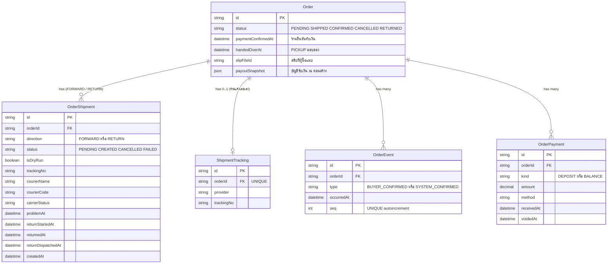

> **โมดูล:** 00068 — Buyer Order Page Redesign
> **ประเภทเอกสาร:** DATABASE Design
> **เวอร์ชัน:** 1.0
> **วันที่จัดทำ:** 2026-10-05
> **สถานะ:** Draft
> **เจ้าของเอกสาร:** SA / `safepay-database` (ดู [[Feature-Docs-Ownership]])

# DATABASE: หน้าคำสั่งซื้อฝั่งผู้ซื้อ ฉบับปรับใหม่

---

## 1. Overview

feature นี้เป็นงาน UI ของหน้า `/o/[token]` ฝั่งผู้ซื้อที่ล็อกอินและผ่าน grant แล้ว **ไม่เพิ่มตาราง คอลัมน์ index หรือ constraint ใหม่ และไม่มี migration** สิ่งที่เปลี่ยนคือ query สองจุดที่อ่านข้อมูลเดิม:

1. `getOrderByToken` (`src/services/order.service.ts`): เพิ่มตัวกรอง `direction` ให้ `shipments` (BRD §7.2)
2. `src/app/(marketing)/o/[token]/page.tsx`: ส่งข้อมูลพัสดุจาก query เดิมลง `PublicOrderData` เพิ่ม (`orderEvent.findFirst` ของ CONFIRMED มีอยู่แล้ว)

- **เอกสารออกแบบต้นทาง:** [[BRD]] §7.2 และมติ §10 (D-4)
- **Store ที่เกี่ยวข้อง:** PostgreSQL 16 (Supabase) ผ่าน Prisma
- **Engine / Charset:** PostgreSQL 16 / UTF-8

---

## 2. ERD

แสดงเฉพาะตารางที่หน้านี้อ่าน ไม่มีตารางใหม่

---

## 3. Tables

ไม่มีตารางใหม่ ตารางล่างยืนยันว่าข้อมูลที่หน้านี้ต้องใช้มีครบ (ตรวจกับ `prisma/schema.prisma` ณ 2026-10-05)

### 3.1 ข้อมูลพัสดุ (BRD §7.2, FR-BOP-06)

| ข้อมูลที่หน้าใช้ | ที่มา | สถานะ |
|---|---|---|
| ชื่อขนส่ง / รหัสขนส่ง | `OrderShipment.courierName`, `courierCode` | มีแล้ว select อยู่ใน `getOrderByToken` |
| เลขพัสดุ (iShip) | `OrderShipment.trackingNo` | มีแล้ว select อยู่ |
| เลขพัสดุ (ร้านแจ้งเอง) | `ShipmentTracking.provider`, `trackingNo` | มีแล้ว (`orderId` UNIQUE) ดึงด้วย `shipmentTracking: true` |
| ขั้นสถานะพัสดุ | `OrderShipment.carrierStatus` | มีแล้ว select อยู่ |
| พัสดุมีปัญหา | `OrderShipment.problemAt` | มีแล้ว select อยู่ |
| ขากลับ / ตีกลับ | `returnStartedAt`, `returnedAt`, `returnDispatchedAt` | มีแล้ว select อยู่ |
| ทิศทางพัสดุ | `OrderShipment.direction` (default `FORWARD`) | มีแล้ว แต่ **`getOrderByToken` ยังไม่กรองด้วยค่านี้** ดู §4 และ §5.3 |
| ผู้ซื้อกด หรือระบบปิดออเดอร์ | `OrderEvent.type` = `BUYER_CONFIRMED` / `SYSTEM_CONFIRMED` + `occurredAt` | มีแล้ว `page.tsx` อ่านอยู่ (ไม่ใช่ query ใหม่) |
| ค่า CHECK ของ `OrderEvent.type` | `OrderEvent_type_check` ล่าสุดที่ `20260828120000_order_event_pickup_payment_types` | มีทั้งสองค่า ไม่ต้องแก้ CHECK |

### 3.2 ข้อมูลเงิน (มติ D-4: กล่องโอนของร้านบริการ = ยอดที่ยังค้าง)

| ข้อมูล | ที่มา | สถานะ |
|---|---|---|
| รายการรับเงินที่ไม่ถูกยกเลิก | `OrderPayment` (`kind`, `amount`, `method`, `receivedAt`, `voidedAt`) | `getOrderByToken` select แบบ allow-list ที่ `where: { voidedAt: null }` อยู่แล้ว |
| ยอดค้าง | `computeOrderMoney` ใน `src/lib/order-payment.ts` → `outstanding = max(0, totalAmount - totalReceived)` | ได้จากข้อมูลเดิมครบ ไม่ต้องเก็บคอลัมน์เพิ่ม |
| บัญชีรับเงิน | `Order.payoutSnapshot` (Json) | มีแล้ว |
| ร้านยืนยันรับเงิน | `Order.paymentConfirmedAt` | มีแล้ว |
| สลิป | `Order.slipFileId` | มีแล้ว |

D-4 ข้อมูลพอ ไม่ต้องเพิ่มคอลัมน์ งานคือส่งยอดค้างเข้า `PayoutAccountCard` แทน `totalAmount` ซึ่งเป็นงานฝั่ง component (SDS)

---

## 4. Indexes

ไม่เสนอ index ใหม่

| Query | Index ที่รองรับ | ผลตรวจ |
|---|---|---|
| `shipments` ของ `getOrderByToken` หลังแก้เป็น `ACTIVE_FORWARD_SHIPMENT` (`status='CREATED' AND isDryRun=false AND direction='FORWARD'`), `orderBy createdAt desc`, `take 1` | partial index `OrderShipment_active_forward_latest_idx` ON `("orderId","createdAt" DESC) WHERE status='CREATED' AND isDryRun=false AND direction='FORWARD'` (migration `20260825060000_order_list_server_side_indexes`) | **ตรงเป๊ะ** predicate เท่ากับ `ACTIVE_FORWARD_SHIPMENT` ทุกเงื่อนไข กรองและเรียงได้โดยไม่ต้อง sort |
| ทางเลือก `LATEST_FORWARD_SHIPMENT` (`status <> 'CANCELLED' AND direction='FORWARD'`) | `OrderShipment_active_order_key` + `OrderShipment_orderId_direction_idx` | ใช้ได้ แต่ **ไม่แนะนำที่นี่**: รวมใบ PENDING/FAILED ที่ไม่มีเลขพัสดุ ผู้ซื้อจะเห็นกล่องพัสดุว่าง (คลาสเดียวกับบั๊ก `hasShipment` ที่เคยแก้) |
| `orderEvent.findFirst where orderId, type in [...] orderBy occurredAt desc` | `@@index([orderId, occurredAt, seq])` บน `OrderEvent` | เพียงพอ และรันเฉพาะ `status === 'CONFIRMED'` |
| `payments where orderId, voidedAt null orderBy receivedAt` | `@@index([orderId])` บน `OrderPayment` | เพียงพอ (ไม่กี่แถวต่อออเดอร์) |
| `shipmentTracking` | `orderId` UNIQUE | เพียงพอ |

ถ้าอนาคตมีคนเปลี่ยนตัวกรองของ `getOrderByToken` ให้ไม่ตรงกับ predicate ของ partial index ตัว index จะถูกมองข้ามเงียบ ๆ ผลคือช้าลงเล็กน้อย ไม่กระทบความถูกต้อง

---

## 5. Migration Plan

### 5.1 ลำดับการ Migrate

| ลำดับ | การเปลี่ยนแปลง | Store | หมายเหตุ |
|---|---|---|---|
| - | **ไม่มี** | - | `prisma/migrations/` ไม่เปลี่ยน |

### 5.2 Rollback

ไม่มีอะไรต้อง rollback ฝั่งฐานข้อมูล ย้อนด้วย `git revert` ของโค้ด

### 5.3 ผลกระทบ (Impact)

- ไม่มี lock ตาราง ไม่มี downtime ไม่มี backfill
- **ผลต่อพฤติกรรมของ query** เมื่อเปลี่ยนจาก `{ status: 'CREATED' }` เป็น `ACTIVE_FORWARD_SHIPMENT`:
  1. ตัดพัสดุขากลับ (`direction='RETURN'`) ออกจาก "พัสดุของออเดอร์นี้" ตามที่ BRD §7.2 ต้องการ
  2. **ตัดพัสดุจำลอง (`isDryRun=true`) ออกด้วย** — ตัวกรองเดิมไม่กรอง `isDryRun` ผู้ซื้ออาจเคยเห็นเลขพัสดุทดสอบ ซึ่งผิดนิยามเดียวของระบบ (BR-ISHIP-60/61) เป็นการแก้ ไม่ใช่การถดถอย — ต้องมีเคสใน TestCase
- `getOrderByToken` ใช้ร่วมกับจอ guest จอ guest ได้ประโยชน์ด้วย (แม้การออกแบบจอ guest อยู่นอกขอบเขต)

---

## 6. Retention / ข้อควรระวัง

- **Data Retention:** ไม่เปลี่ยน feature ไม่เขียนข้อมูลใหม่ ทุกการกระทำของผู้ซื้อใช้ endpoint เดิม (AC-BOP-13-3)
- **PII / ข้อมูลอ่อนไหว:**
  - ข้อมูลพัสดุที่เพิ่มลง client ไม่ใช่ PII ห้ามเพิ่มที่อยู่/ข้อมูลติดต่อผู้ซื้อ (AC-BOP-13-2)
  - `OrderPayment` คง allow-list เดิม **ห้ามเพิ่ม `note` / `receivedByUserId`** (บันทึกภายในร้าน)
  - `ShopChannel` ส่ง client ได้เฉพาะ 5 คีย์ ห้าม `accessTokenEnc`
  - `shipmentTracking: true` ดึงทั้งแถวฝั่ง server แต่ **ต้อง pick ฟิลด์ก่อนส่งลง client** ตามเดิม
- **Performance:** ไม่เพิ่มรอบ query ข้อมูลพัสดุอยู่ใน `include` เดิม
- **Unmanaged SQL:** `OrderShipment_active_order_key`, `OrderShipment_trackingNo_key`, `OrderShipment_active_forward_latest_idx`, `OrderEvent_type_check` ไม่อยู่ใน Prisma DSL — **ห้าม `prisma db pull` / `migrate dev`**

---

## 7. Traceability

| Table | อ้างอิง | สถานะ |
|---|---|---|
| `OrderShipment` | FR-BOP-06, BRD §7.2 | อ่านอย่างเดียว กรอง direction เพิ่ม |
| `ShipmentTracking` | FR-BOP-06 | อ่านอย่างเดียว |
| `OrderEvent` | FR-BOP-09, FR-BOP-10 (ตราประทับ) | อ่านอย่างเดียว ไม่เปลี่ยน |
| `OrderPayment` | FR-BOP-05, FR-BOP-10, มติ D-4 | อ่านอย่างเดียว ไม่เปลี่ยน |
| `Order` | FR-BOP-04..11 | อ่านอย่างเดียว |

---

## 8. สรุป (Summary)

**ไม่มี schema change และไม่มี migration** ข้อมูลที่หน้าใหม่ต้องใช้มีครบ query ที่เปลี่ยนหรือเพิ่มใช้ index ที่มีอยู่ได้โดยไม่ต้องเพิ่ม

**Open Questions:** ไม่มีด้านฐานข้อมูล
