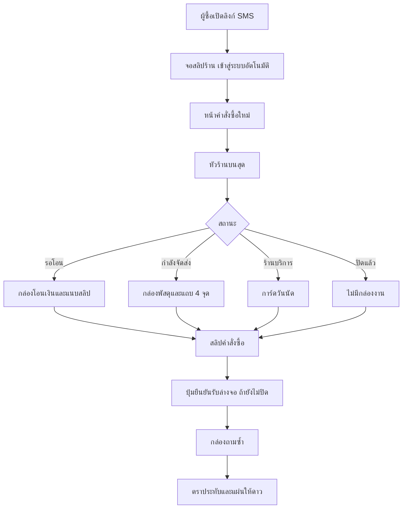

> **โมดูล:** 00068 — Buyer Order Page Redesign
> **ประเภทเอกสาร:** Product Requirements Document (PRD)
> **เวอร์ชัน:** 1.0
> **วันที่จัดทำ:** 2026-10-05
> **สถานะ:** Approved 2026-10-05 (มติดู BRD §10)
> **เจ้าของเอกสาร:** BA + PO + PM (ดู [[Feature-Docs-Ownership]]) · ร่างโดย `safepay-product`

# PRD: หน้าคำสั่งซื้อฝั่งผู้ซื้อ ฉบับปรับใหม่

---

## Executive Summary

ผู้ซื้อส่วนใหญ่เปิดหน้า `/o/[token]` จากลิงก์ใน SMS ที่ร้านส่งให้ คนกลุ่มนี้ระแวงมิจฉาชีพอยู่แล้ว และมีผู้สูงวัยหรือคนที่ไม่คล่องเทคโนโลยีรวมอยู่ด้วย หัวหน้าบอกว่าหน้าลิงก์ "ใช้ยาก" ปัญหาหลักของหน้าฉบับล็อกอินแล้ว (`OrderDetailMobile.tsx`) คือเรียงข้อมูลตามชนิดของข้อมูล ไม่ได้เรียงตามสิ่งที่ผู้ซื้อต้องทำ ผู้ซื้อต้องเลื่อนผ่านปกร้าน บล็อกร้านใหญ่ สถิติ ช่องทาง และรางสถานะ ก่อนจะถึงเรื่องที่มาทำจริง คือโอนเงิน ตรวจว่าของถึงไหน หรือกดยืนยันรับ

ฟีเจอร์นี้ปรับหน้าฉบับเต็มให้ตรงม็อกอัพ "แนวทาง 5" ที่หัวหน้าอนุมัติแล้ว (`docs/superpowers/specs/2026-10-04-sms-link-v5-detailed-mockup.html`) โดยเปลี่ยน 4 อย่าง

1. หัวร้านติดบนสุด โลโก้ใหญ่ ชื่อร้านตัวหนาเด่น แทนปกและบล็อกร้านใหญ่
2. กล่อง "สิ่งที่ต้องทำตอนนี้" อยู่บนสุด ผันตามสถานะและประเภทร้าน
3. คำสั่งซื้อเป็น "สลิป" ใบเดียว มีรูปสินค้า เลขเต็ม ยอดรวม ขอบฉีก และตราประทับ
4. ปุ่มยืนยันรับล่างจอ มีคำกำกับว่ากดเมื่อไรเท่านั้น

ฟังก์ชันทุกอย่างที่หน้าเดิมมี (แจ้งปัญหา ยกเลิก ช่องทางร้าน รีวิว นัดรับ แนบสลิป ฯลฯ) ต้องคงอยู่ ย้ายตำแหน่งได้ แต่ห้ามหายเงียบ ๆ — BRD §2.5 มีตารางรายการฟังก์ชันของหน้าเดิมจากโค้ดจริงพร้อมที่ลงใหม่ของแต่ละอัน

---

## 1. Business Goals & KPIs

### 1.1 เป้าหมายทางธุรกิจ

| เป้าหมาย | รายละเอียด |
|----------|-----------|
| **ผู้ซื้อทำงานหลักเสร็จได้โดยไม่ต้องหา** | งานหลัก 3 อย่างจาก SMS คือ (1) โอนเงิน/แนบสลิป (2) ยืนยันรับของ (3) เช็คสถานะ/เลขพัสดุ ต้องเห็นคำตอบหรือปุ่มของงานนั้นทันทีที่เปิดหน้า โดยไม่ต้องเลื่อนผ่านข้อมูลร้าน |
| **ร้านต้องดูน่าเชื่อถือตั้งแต่สายตาแรก** | ชื่อและโลโก้ร้านต้องเด่น ตัวเลขหลักฐานร้านใช้คำเดียวกับระบบ ไม่อ้างเกินที่ข้อมูลบอก |
| **หน้าเป็นหลักฐานที่จับต้องได้** | คำสั่งซื้อรูปทรงสลิป พร้อมตราประทับที่ผู้ซื้อกดเอง ช่วยให้ผู้ซื้อเชื่อว่าเรื่องนี้ถูกบันทึกจริง |
| **ไม่ตัดความสามารถเดิม** | ผู้ซื้อที่ต้องแจ้งปัญหา ยกเลิก หรือติดต่อร้าน ต้องหาปุ่มเจอเหมือนหรือดีกว่าเดิม |

### 1.2 ตัวชี้วัดความสำเร็จ (KPIs)

> ยังไม่มี baseline ในมือ ตัวเลขเป้าหมายเป็นข้อเสนอที่ต้อง user ยืนยัน ต้องวัด baseline ของหน้าเดิมก่อน release

| KPI | คำอธิบาย | เป้าหมาย (เสนอ) |
|-----|----------|-----------------|
| **งานหลักอยู่ในจอแรก** | ที่ viewport 360x740 กล่อง "สิ่งที่ต้องทำ" (หัวข้อ + ปุ่ม/ข้อมูลหลักของงานนั้น) ต้องเห็นครบโดยไม่เลื่อน ทุกสถานะที่มีกล่อง | 100% ของสถานะใน BRD §2.2 |
| **เวลาหาปุ่มทำงานหลัก** | ทดสอบผู้ใช้จริงอายุ 50 ปีขึ้นไป อย่างน้อย 5 คน ให้ทำงาน "แนบสลิป" และ "ยืนยันรับของ" บนมือถือ | ทุกคนทำสำเร็จโดยไม่ต้องถาม |
| **สัดส่วนออเดอร์ที่แนบสลิปหลังเปิดลิงก์** | ออเดอร์ PENDING แบบโอน ที่มี `slipFileId` ภายใน 24 ชม. หลังผู้ซื้อเปิดลิงก์ครั้งแรก | สูงกว่า baseline (วัดก่อน release) |
| **ฟังก์ชันเดิมครบ** | inventory ใน BRD §2.5 ทุกข้อมีที่อยู่ในหน้าใหม่และมีเคสทดสอบ | 100% |

---

## 2. User Personas (กลุ่มผู้ใช้งาน)

### 2.1 ผู้ซื้อสินค้าที่ได้ลิงก์ทาง SMS

**ข้อมูลพื้นฐาน:**
- คนทั่วไปที่ซื้อของจากร้านออนไลน์ผ่านแชท ได้ลิงก์ `deepthailand.app/o/...` ใน SMS
- รวมผู้สูงวัยและคนที่ digital literacy ต่ำ (ตาม PRODUCT.md) ใช้มือถือเป็นหลัก

**เป้าหมาย:**
- รู้ว่าต้องโอนเท่าไรและโอนไปที่ไหน แล้วแจ้งร้านว่าโอนแล้ว
- รู้ว่าของอยู่ถึงไหน
- กดยืนยันรับของเมื่อได้ของจริงเท่านั้น

**ความต้องการ:**
- เห็นชัดว่าร้านนี้คือร้านที่คุยด้วยจริง และ Deep ไม่ใช่ลิงก์หลอก
- คำที่อ่านแล้วไม่ต้องตีความ ปุ่มที่บอกว่ากดแล้วเกิดอะไร

**จุดปวด (Pain Points):**
- หน้าเดิมมีข้อมูลร้านจำนวนมากก่อนถึงเรื่องที่ต้องทำ
- สถานะออเดอร์กับสถานะพัสดุเป็นคนละเรื่อง แต่หน้าเดิมไม่แยกให้เห็น และไม่มีแถบพัสดุให้ผู้ซื้อที่ล็อกอินแล้ว
- กลัวกดยืนยันผิดจังหวะเพราะย้อนกลับไม่ได้

### 2.2 ผู้ใช้บริการจากร้านบริการ (SERVICE_QUEUE)

**ข้อมูลพื้นฐาน:**
- ลูกค้าร้านติดฟิล์ม ล้างแอร์ ฯลฯ ที่มีนัดหมาย อาจจ่ายมัดจำก่อน

**เป้าหมาย:**
- รู้ว่านัดวันไหน เวลาไหน ช่างคนไหน
- รู้ว่าจ่ายแล้วเท่าไร ค้างเท่าไร
- กดปิดงานหลังรับบริการเรียบร้อยแล้วเท่านั้น

**ความต้องการ:**
- "วันนัด" เป็นพระเอกของหน้า ยอดค้างใช้คำ "ยังค้างชำระ" ชุดเดียวกับทั้งระบบ

**จุดปวด (Pain Points):**
- หน้าเดิมให้ความสำคัญกับปกและบล็อกร้านมากกว่าวันนัด
- ปุ่ม "ยืนยันนัด" กับ "ยืนยันว่ารับบริการแล้ว" ต่างกันมาก (อันหลังปิดงานและย้อนไม่ได้) ผู้ซื้ออาจสับสนได้

### 2.3 ร้านค้า (ผู้ได้รับประโยชน์ทางอ้อม)

**ข้อมูลพื้นฐาน:** ผู้ขายที่ส่งลิงก์ SMS ให้ลูกค้า

**เป้าหมาย / ความต้องการ:** ลูกค้าแนบสลิปและยืนยันรับได้เร็วขึ้น ไม่ต้องตามถามในแชท

**จุดปวด (Pain Points):** ลูกค้าเปิดลิงก์แล้วหาที่แนบสลิปไม่เจอ ต้องถามในแชทซ้ำ

---

## 3. Business Requirements

### 3.1 หัวร้านติดบนสุด

**ความต้องการ:**
- แทนที่ปกร้านและบล็อกร้านใหญ่ด้วยหัวร้านเดียวบนสุดของหน้า
- ประกอบด้วยโลโก้ร้าน ชื่อร้านตัวหนา บรรทัดย่อหลักฐานร้าน และปุ่มแชทกับร้าน
- ชื่อและโลโก้ต้องเด่น (ผู้ใช้สั่งชัดเจน) ชื่อยาวขึ้นได้ 2 บรรทัด ไม่ดันจอ

**Business Rules:**
- บรรทัดย่อประกอบด้วยคะแนนรีวิวเฉลี่ยกับจำนวนออเดอร์สำเร็จของร้าน ใช้คำ "ออเดอร์สำเร็จ" ตาม SSOT เดิม
- ห้ามเขียน "ผู้ซื้อยืนยันรับของ N ครั้ง" เพราะสถานะ CONFIRMED เกิดได้ 3 ทาง: ผู้ซื้อกดเอง / COD เคลียร์ / ระบบปิดเอง (หลังส่งถึง 7 วัน หรือหลังมอบของนัดรับ 48 ชม.)
- ร้านใหม่ที่ยังไม่มีประวัติ ไม่แสดงเลข 0
- หลักฐานร้านที่หัวร้านไม่แสดง (ป้ายยืนยันระดับ ชั้นคะแนนความน่าเชื่อถือ ช่องทางที่เชื่อมต่อ เพจต้นทาง ทางเข้าโปรไฟล์ร้าน) ต้องไปอยู่การ์ดข้อมูลร้านในหน้าเดียวกัน ห้ามหายไป (BRD FR-BOP-03)

**เหตุผล:**
- ผู้ซื้อที่ระแวงต้องเห็นก่อนว่า "ร้านนี้คือร้านที่คุยด้วยจริง"
- หลักฐานร้านที่ซ่อนไว้ต้องหาเจอได้ เพราะหน้านี้มีหน้าที่พิสูจน์ความน่าเชื่อถือ

### 3.2 กล่อง "สิ่งที่ต้องทำตอนนี้" บนสุด

**ความต้องการ:**
- กล่องแรกใต้หัวร้านบอกสิ่งที่ผู้ซื้อต้องทำหรือต้องรู้ ณ ตอนนี้ ผันตามสถานะออเดอร์ ประเภทร้าน วิธีชำระเงิน และวิธีรับของ
- หัวข้อเป็นคำสั่งงาน ไม่มี eyebrow เช่น "โอน ฿2,400 ให้ร้าน" "กำลังจัดส่ง"
- ออเดอร์ที่ปิดแล้ว (ยืนยัน/ยกเลิก/คืนของ) ไม่มีกล่องงาน

**สถานะที่ต้องรองรับ:**

| สถานะ/สถานการณ์ | กล่องบนสุดต้องบอกอะไร | งานหลักของผู้ซื้อ |
|-----------------|----------------------|------------------|
| ร้านขายของ รอโอน | "โอน ฿X ให้ร้าน" + บัญชีร้าน + คัดลอกเลขบัญชี + แนบสลิป | โอนเงิน/แนบสลิป |
| ร้านขายของ กำลังจัดส่ง | "กำลังจัดส่ง" + ขนส่ง/เลขพัสดุ + แถบพัสดุ 4 จุด | เช็คสถานะ |
| นัดรับที่ร้าน (PICKUP) | จุดนัดรับ (ชื่อร้าน + ที่อยู่) + สถานะการมอบของ | ไปรับ/ยืนยันรับ |
| COD / เงินสด ยังไม่ส่ง | สถานะออเดอร์ + วิธีชำระที่ไม่ต้องโอน | รอรับของ |
| ร้านบริการ มีนัด | การ์ดวันนัด (วัน เวลา ใช้เวลา ช่าง) | มาตามนัด/ยืนยันนัด |
| ปิดแล้ว (ยืนยัน/ยกเลิก/คืนของ) | ไม่มีกล่องงาน | ไม่มี |

รายละเอียดครบทุกสถานะ x ทุกประเภทร้านอยู่ใน BRD §2.2

**Business Rules:**
- สถานะออเดอร์ (เรื่องดีล) กับสถานะพัสดุ (เรื่องกล่อง) เป็นคนละแกน ใช้ `resolveOrderStatusHeadline` เป็นตัวตัดสินคำของหัวข้อ ห้ามพิมพ์คำเองบนหน้าจอ
- คำบนแถบพัสดุมาจาก `SHIPMENT_STAGES` (`src/lib/iship/status.ts`) เท่านั้น
- คำที่บอกผู้ซื้อห้ามสัญญาแทนร้าน เช่นใช้ "โอนแล้วแนบสลิปเพื่อแจ้งร้าน" ห้ามใช้ "ร้านจะแพ็กของให้"
- ยอดค้างของร้านบริการใช้คำ "ยังค้างชำระ ฿X" จาก `order-payment.ts`
- ประเภทร้านผันคำผ่าน `ORDER_VOCAB` ห้ามต่อสตริง noun เอง (ร้านขายของ "คำสั่งซื้อ" ร้านบริการ "การเข้ารับบริการ")

**เหตุผล:**
- ผู้ซื้อไม่ต้องตีความเลยว่า "ตอนนี้ฉันต้องทำอะไร"
- แยกสองแกนสถานะ ผู้ซื้อจะไม่สับสนระหว่าง "ร้านยืนยันแล้ว" กับ "ของถึงไหน"

### 3.3 คำสั่งซื้อเป็นสลิป

**ความต้องการ:**
- รายการสินค้า/บริการ (พร้อมรูป) เลขคำสั่งซื้อเต็ม วันที่ ยอดรวม ป้ายสถานะเงิน และตราประทับ อยู่ในการ์ดรูปทรงสลิปใบเดียว มีขอบล่างแบบฉีก
- ตราประทับ (`ConfirmStamp`) มีแล้ว ใช้ต่อ

**Business Rules:**
- เลขคำสั่งซื้อแสดงเต็มเสมอ (`formatOrderNo`) ห้ามตัด และเลขใบเสร็จ CA... เป็นคนละอย่างกับเลขนี้
- ป้ายที่บอกว่าเงินเข้าแล้วต้องเป็น "ร้านยืนยันรับเงินแล้ว" เท่านั้น ห้ามเขียนว่า "จ่ายแล้ว" เพราะผู้ซื้อแนบสลิปแล้วยอดยังไม่ขยับจนกว่าร้านจะกดยืนยัน
- สีเขียวใช้กับสิ่งที่ยืนยันจริงเท่านั้น (Verified-Means-Green)
- ร้านบริการที่มีเรื่องเงิน สลิปแสดงยอดรวม มัดจำ และ "ยังค้างชำระ" จากชุดตัวเลขเดียวกับการ์ดเงินเดิม

**เหตุผล:**
- สลิปเป็นรูปทรงที่ผู้ซื้อไทยคุ้นที่สุดและตีความว่าเป็นหลักฐาน

### 3.4 ปุ่มยืนยันรับล่างจอ

**ความต้องการ:**
- ปุ่มยืนยันรับอยู่ล่างจอในโซนนิ้วโป้ง มีคำกำกับใต้ปุ่ม
  - ร้านขายของ "กดเมื่อได้ของครบแล้วเท่านั้น"
  - ร้านบริการ "กดเมื่อรับบริการเรียบร้อยแล้วเท่านั้น"
- คงด่านถามซ้ำก่อนยืนยัน (ย้อนกลับไม่ได้)

**Business Rules:**
- ปุ่มกดได้ตั้งแต่ PENDING (`canConfirm = PENDING || SHIPPED`) ตามโค้ดปัจจุบัน ไม่มีสถานะ "ร้านทำงานเสร็จ" และไม่มีรูปงานจากร้าน (ตัดออกแล้ว)
- ป้ายปุ่มผันตามประเภทร้านเหมือนเดิม และต้องตรงกับหัวข้อ dialog

### 3.5 คงฟังก์ชันเดิมทั้งหมด

**ความต้องการ:**
- ทุกฟังก์ชันที่หน้าเดิมมีต้องมีที่อยู่ในหน้าใหม่ BRD §2.5 เป็นตารางที่ทำจากโค้ดจริง

**Business Rules:**
- ห้ามตัดฟังก์ชันเงียบ ๆ ถ้าฟังก์ชันไหนตัดหรือเปลี่ยนที่อยู่ ต้องบันทึกเหตุผลใน BRD และให้ user รับรู้
- PII gate ของหน้า (ไม่ส่งรายละเอียดออเดอร์ลง client ก่อนผ่าน grant) ห้ามแตะ

### 3.6 พื้นฐานที่มีแล้ว (ไม่อยู่ในขอบเขต 00068)

ลงโค้ดแล้วใน commit `8bac192f` และ `ef911719` (branch `feat/sms-link-auto-claim`)

| ของที่มีแล้ว | ไฟล์ |
|-------------|------|
| จอเปิดลิงก์แบบสลิป (ขั้น 2 ของม็อกอัพ) | `SmsAutoEnter.tsx` |
| แผ่นให้ดาวหลังยืนยัน (ขั้น 6-7) | `ReviewSheet.tsx` |
| ตราประทับบนสลิป | `ConfirmStamp.tsx` |
| รีวิวได้เฉพาะ CONFIRMED | `OrderDetailMobile.tsx` (`canReview`) และ `review.service.ts` |

---

## 4. Business Rules & Constraints

### 4.1 กฎทางธุรกิจหลัก

| กฎ | คำอธิบาย |
|----|----------|
| **ศัพท์มีนิยามเดียว (HR16)** | ป้ายยืนยันร้านจาก `verify-badge.ts` · "ออเดอร์สำเร็จ" จาก `ShopEvidence` · แถบพัสดุจาก `SHIPMENT_STAGES` · ยอดค้างจาก `order-payment.ts` · คำผันจาก `ORDER_VOCAB` |
| **สองแกนสถานะแยกกัน** | สถานะออเดอร์ vs สถานะพัสดุ ไม่ยุบเป็นคำเดียว |
| **ห้ามสัญญาแทนร้าน** | คำบนจอห้ามบอกสิ่งที่ร้านจะทำ ยกเว้นข้อเท็จจริงที่ระบบบันทึกแล้ว |
| **ยืนยันรับย้อนไม่ได้** | ต้องมีด่านถามซ้ำและบอกผลที่ตามมา (แจ้งปัญหาไม่ได้อีก) |
| **เขียวเฉพาะที่ยืนยันจริง** | ห้ามใช้เขียวกับสิ่งที่ผู้ขายบอกฝั่งเดียว เช่น "ร้านแจ้งว่ามอบของแล้ว" |

### 4.2 ข้อจำกัดทางธุรกิจ

| ข้อจำกัด | รายละเอียด |
|---------|-----------|
| **Vuexy buyer theme** | ม่วง #7367F0 · Anuphan · มุมการ์ด 12px · ห้าม emoji · ห้ามใช้ UI ที่ไม่ได้ copy จากธีม (HR1) |
| **มือถือก่อน แต่ต้องมีเดสก์ท็อป** | โครง 2 คอลัมน์ที่มีอยู่แล้วต้องไม่พัง |
| **WebView ของแอป** | แอป iOS/Android เปิดหน้านี้อยู่ มือถือห้ามเพี้ยนจากการปรับ |
| **เอกสารก่อนโค้ด (HR11)** | SRS/SDS/API ต้องมีก่อน task ที่แตะส่วนนั้น |
| **ผ่าน ux gate (HR8)** | ต้องออก Design Spec จาก `safepay-ux` ก่อน build และรัน impeccable critique/clarify หลัง build |

### 4.3 ขอบเขตตามประเภทร้าน

| ประเภท | อยู่ในขอบเขต 00068 หรือไม่ |
|--------|---------------------------|
| ONLINE_SALES | อยู่ |
| SERVICE_QUEUE | อยู่ |
| LODGING (ใบจอง `order.type = 'BOOKING'` ใช้ `BookingGuestView`) | ไม่อยู่ (ข้อเสนอ รอ user ยืนยัน) |

ตัวแยกใบจองในโค้ดคือ `order.type === 'BOOKING'` ไม่ใช่ `shop.vertical`

---

## 5. Out of Scope (นอกขอบเขต)

| หัวข้อ | คำอธิบาย |
|--------|----------|
| **หน้าใบจอง LODGING** | `BookingGuestView` คนละ flow ผู้จองยืนยันเองไม่ได้ (ข้อเสนอ) |
| **จอ guest (ยังไม่ล็อกอิน)** | `GuestOrderView` คงเดิม (ดู Risks เรื่องความต่างของสองจอ) |
| **จอเปิดลิงก์ / แผ่นให้ดาว / ตราประทับ** | ทำเสร็จแล้ว (ดู §3.6) |
| **สถานะ "ร้านทำงานเสร็จ" และรูปงานจากร้าน** | user ตัดออกแล้ว |
| **เพิ่มลงปฏิทิน** | user ตัดออกแล้ว |
| **ขั้นตอนคืนสินค้า 00056 ฝั่งผู้ซื้อ** | หน้าล็อกอินแล้วไม่มี UI คืนสินค้าอยู่เลยปัจจุบัน ไม่เพิ่มใหม่ในรอบนี้ |
| **เปลี่ยน business logic ของ confirm/cancel/dispute/slip/review** | API และ service เดิมคงเดิม |
| **ฝั่งผู้ขาย** | ไม่แตะหน้า seller/admin |

---

## 6. Risks & Mitigation (ความเสี่ยงและแนวทางแก้ไข)

### 6.1 ความเสี่ยงทางธุรกิจ

| ความเสี่ยง | ผลกระทบ | ระดับความรุนแรง | แนวทางแก้ไข |
|-----------|---------|-----------------|-------------|
| **ตัดหลักฐานร้านออกจนผู้ซื้อระแวง** | ผู้ซื้อไม่เชื่อว่าร้านจริง ไม่โอน | สูง | บังคับให้หลักฐานที่ย้ายต้องอยู่ในการ์ดข้อมูลร้าน (FR-BOP-03) |
| **ผู้ซื้อกดยืนยันรับผิดจังหวะ** | ปิดงานก่อนได้ของ แจ้งปัญหาไม่ได้อีก (ช่องทางสแกม) | สูง | คงด่านถามซ้ำ คำกำกับใต้ปุ่ม และข้อความใน dialog |
| **คำบนจอสัญญาแทนร้าน** | เกิดข้อพิพาท | กลาง | ตรวจ copy ผ่าน `/impeccable clarify` และ BR-BOP-05 |
| **ฟังก์ชันเดิมหายเงียบ ๆ** | ผู้ซื้อหาปุ่มแจ้งปัญหา/ยกเลิกไม่เจอ | สูง | inventory ใน BRD §2.5 + เคสทดสอบรายข้อ |

### 6.2 ความเสี่ยงทางเทคนิค

| ความเสี่ยง | ผลกระทบ | แนวทางแก้ไข |
|-----------|---------|-------------|
| **ไฟล์เดิมใหญ่มาก (~3,000 บรรทัด)** | regression ในที่ที่ไม่เห็น | ทำเป็น batch เล็ก มี scope audit ต่อ batch และเทสสแกนซอร์สเดิมต้องไม่แดง |
| **เทส `[blocker]` ผูกกับสตริงใน `OrderDetailMobile.tsx`** | ย้ายโค้ดแล้วเทสแดง หรือแย่กว่านั้นคือเทสเขียวทั้งที่ด่านหาย | ถ้าย้ายโค้ดไปไฟล์ใหม่ ต้องย้ายเทสตามพร้อมพิสูจน์ด้วย mutation |
| **ข้อมูลพัสดุของฝั่งล็อกอินยังไม่พร้อม** | แถบพัสดุ 4 จุดและหัวข้อสถานะพัสดุเป็นของใหม่ของหน้านี้ (ปัจจุบันมีเฉพาะจอ guest) | ต้องเพิ่มข้อมูลที่ `page.tsx` (BRD §7.2) |
| **`getOrderByToken` ไม่กรองทิศทางพัสดุ (ยืนยันกับโค้ดแล้ว)** | หลัง 00056 พัสดุขากลับอาจถูกหยิบมาแสดงเป็นพัสดุขาไป | แก้ก่อนหรือพร้อมงานนี้ (BRD §7.2) |
| **dark mode ยังไม่ได้ตรวจ** | สลิปสีขาว/ขอบฉีกอาจเพี้ยน | ให้ ux spec ตรวจ |

---

## 7. Glossary (อภิธานศัพท์)

| คำศัพท์ | ความหมาย |
|---------|----------|
| **กล่องสิ่งที่ต้องทำ** | การ์ดแรกใต้หัวร้าน บอกงานของผู้ซื้อ ณ ตอนนี้ |
| **สลิป** | การ์ดคำสั่งซื้อรูปทรงใบเสร็จ มีขอบล่างฉีก |
| **สองแกนสถานะ** | สถานะออเดอร์ (เรื่องดีล) และสถานะพัสดุ (เรื่องกล่อง) |
| **ออเดอร์สำเร็จ** | จำนวนออเดอร์ของร้านที่มีสถานะ CONFIRMED (ไม่ได้แปลว่าผู้ซื้อกดเองทุกใบ) |
| **คำสั่งซื้อ / การเข้ารับบริการ** | noun ของร้านขายของ / ร้านบริการ ผ่าน `ORDER_VOCAB` (ห้าม "ใบสั่งซื้อ") |
| **PICKUP** | ออเดอร์นัดรับที่ร้าน (`fulfillmentMode = 'PICKUP'` feature 00062) |
| **grant** | ผลของ `resolveOrderAccess` ที่ยืนยันว่าผู้ซื้อเป็นเจ้าของออเดอร์ ก่อนส่งรายละเอียดลง client |
| **พื้นฐานที่มีแล้ว** | งานที่ลงโค้ดแล้วใน commit `8bac192f`/`ef911719` |

---

## 8. Success Metrics (ตัวชี้วัดความสำเร็จ)

| ตัวชี้วัด | ค่าที่คาดหวัง | วิธีวัด |
|----------|---------------|--------|
| กล่องงานเห็นครบในจอแรก | ทุกสถานะที่มีกล่อง ที่ 360x740 | ตรวจด้วย browser ตาม Tests |
| ผู้ใช้อายุ 50+ ทำงานหลักสำเร็จ | 5 จาก 5 คน | ทดสอบผู้ใช้จริง |
| อัตราแนบสลิป ภายใน 24 ชม. | สูงกว่า baseline | query `slipFileId` เทียบเวลาเปิดลิงก์ (ต้องวัด baseline ก่อน release) |
| ฟังก์ชันเดิมครบ | 100% ของ inventory | เทส/QA รายข้อ |
| ไม่มี regression ของเทส `[blocker]` เดิม | เขียวทั้งชุด `src/app/(marketing)/o/[token]/__tests__` | `npx vitest run src/` |

---

## 9. Dependencies & Assumptions

### 9.1 สิ่งที่ต้องพึ่งพา (Dependencies)

| ระบบ/ส่วนประกอบ | ความสัมพันธ์ |
|-----------------|-------------|
| **00015 Order Claim** | ด่าน grant/PII ของ `page.tsx` ห้ามแตะ |
| **00041 Buyer Order Experience** | dispute, review, ParcelTimeline (จอ guest), `resolveOrderStatusHeadline` |
| **00050 Service Queue** | การ์ดนัด การ์ดเงิน ป้ายสถานะบริการ |
| **00062 Pickup & Bank Transfer** | `PayoutAccountCard`, `PickupInfoCard`, `needsPayoutAccount`, `isPickupOrder` |
| **00056 Order Return** | สถานะ `RETURNED`, พัสดุขากลับ (`direction`) |
| **พื้นฐานที่มีแล้ว** | `SmsAutoEnter`, `ReviewSheet`, `ConfirmStamp` |
| **ม็อกอัพ v5** | แหล่งความจริงของดีไซน์ |

### 9.2 สมมติฐาน (Assumptions)

- ผู้ซื้อส่วนใหญ่ใช้มือถือ และเปิดจากลิงก์ SMS
- ข้อมูล shipment ฝั่งล็อกอินดึงมาได้จาก `getOrderByToken` เหมือนที่จอ guest ใช้ (ต้องแก้เรื่องทิศทางก่อน)
- LODGING ไม่อยู่ในขอบเขต (รอยืนยัน)
- ตัวเลขใน KPI เป็นข้อเสนอ ไม่ใช่ baseline จริง

---

## 10. Appendix

### 10.1 ตัวอย่าง User Journey

**Scenario A: ร้านขายของ ผู้ซื้อโอนเงินแล้วรอรับของ**

1. ผู้ซื้อเปิดลิงก์จาก SMS เห็นจอสลิปของร้านครู่เดียว แล้วเข้าหน้าคำสั่งซื้ออัตโนมัติ
2. หัวร้านขึ้นบนสุด กล่องแรกเขียนว่า "โอน ฿2,400 ให้ร้าน" พร้อมบัญชีและปุ่มแนบสลิป
3. ผู้ซื้อคัดลอกเลขบัญชี โอน แล้วแนบสลิป
4. ภายหลังร้านส่งของ กล่องแรกเปลี่ยนเป็น "กำลังจัดส่ง" มีขนส่ง เลขพัสดุ และแถบ 4 จุด
5. ของถึง ผู้ซื้อกดปุ่มล่างจอ ตอบ "ได้รับแล้ว" ในกล่องถามซ้ำ
6. ตราประทับ "ได้รับแล้ว" ขึ้นบนสลิป แล้วแผ่นให้ดาวเลื่อนขึ้น

**Scenario B: ร้านบริการ ผู้ซื้อตรวจนัดและปิดงาน**

1. ผู้ซื้อเปิดลิงก์ เห็นหัวร้าน กล่องแรกเป็นการ์ดวันนัด "นัดเข้ารับบริการ 10:00"
2. สลิปด้านล่างแสดงยอดรวม มัดจำ (ร้านยืนยันรับแล้ว) และยังค้างชำระ
3. หลังรับบริการเสร็จ ผู้ซื้อกด "ยืนยันว่ารับบริการแล้ว" ผ่านกล่องถามซ้ำ

---

**หมายเหตุ:**
เอกสารนี้เป็นการบันทึกความต้องการทางธุรกิจ (Business Requirements) โดยไม่มีรายละเอียดทางเทคนิค
สำหรับ Functional Requirements / User Story / Acceptance Criteria ดู [[BRD]] ของโมดูลนี้
สำหรับ technical specification ดู [[SRS]] ของโมดูลนี้ (ยังไม่ได้ทำ)
