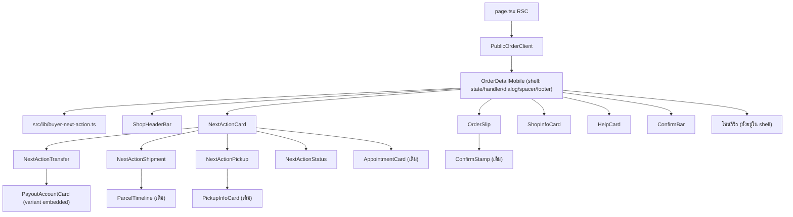
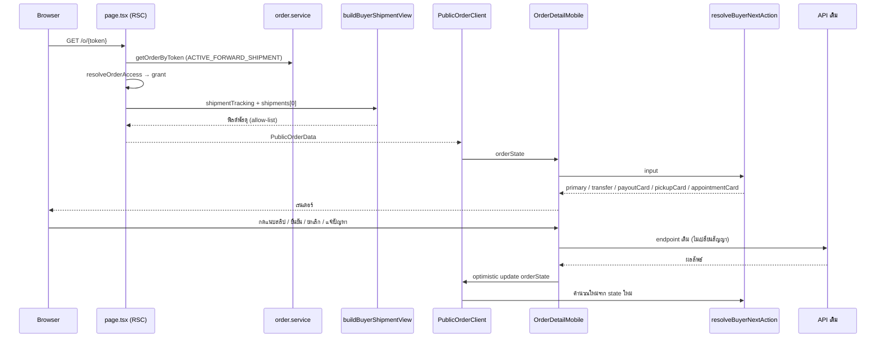
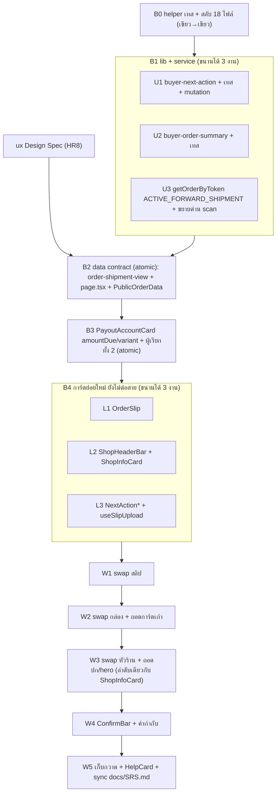

> **โมดูล:** 00068 — Buyer Order Page Redesign
> **ประเภทเอกสาร:** System Design Spec (SDS)
> **เวอร์ชัน:** 0.1
> **วันที่จัดทำ:** 2026-10-05
> **สถานะ:** Draft
> **เจ้าของเอกสาร:** SA (ดู [[Feature-Docs-Ownership]]) · ร่างโดย `safepay-planner`

# SDS: หน้าคำสั่งซื้อฝั่งผู้ซื้อ ฉบับปรับใหม่ (System Design Spec)

---

## 1. บทนำ & References

### 1.1 วัตถุประสงค์
ออกแบบการ implement ของ [[SRS]] โดยตอบ 4 คำถามที่ DEV ต้องรู้ก่อนเริ่ม

1. แตก `OrderDetailMobile.tsx` (~2,900 บรรทัด) เป็นชิ้นใดบ้าง และชิ้นละ `Base:` อะไร (HR1/HR3)
2. ลำดับ batch ที่ commit แยกได้และ regression ต่ำ
3. แผนย้ายเทสสแกนซอร์สพร้อม mutation
4. data flow `page.tsx` → client

### 1.2 ขอบเขตการออกแบบ
เฉพาะโฟลเดอร์ `src/app/(marketing)/o/[token]/` + `src/lib/**` + `getOrderByToken` + เทส · ไม่แตะ guest/booking/ผู้ขาย · ไม่มี DB/API ใหม่

### 1.3 เอกสารอ้างอิง
| เอกสาร | ความสัมพันธ์ |
|--------|-------------|
| [[SRS]] | TFR-001..014 ที่ SDS นี้ realize |
| [[BRD]] | FR-BOP-01..14, มติ D-1..D-9 |
| [[PRD]] | เป้าหมาย/KPI |
| [[API]] | ไม่มี endpoint ใหม่ |
| ม็อกอัพ v5 | ดีไซน์เป้าหมาย |
| `docs/conventions/sibling-surface-parity.md` | เปิดอ่านหน้าพี่น้องก่อนสร้างชิ้นใหม่ |
| `docs/conventions/rule-must-be-enforced-not-described.md` | ย้ายด่านต้องพิสูจน์ด้วย mutation |

---

## 2. Architecture Overview

### 2.1 มุมมองสถาปัตยกรรม
**หลักการ:** shell เดิมชื่อ `OrderDetailMobile.tsx` คงอยู่ ถือ **state + handler + dialog + แถบล่าง + บล็อกกันที่ท้าย flow** ส่วนที่เป็นการแสดงผลล้วนแยกเป็นการ์ดย่อย ตัดสินใจ "อะไรแสดง" ด้วยฟังก์ชันบริสุทธิ์ใน `src/lib/` — ย้ายแบบ **strangler รายส่วนในที่เดิม** ไม่เขียนทั้งหน้าใหม่แล้วสลับ เพราะ (ก) มี WebView ของแอปเปิดอยู่ (ข) ด่านเทส 18 ไฟล์ผูกกับไฟล์นี้

### 2.2 มุมมองการ Deploy
ไม่เปลี่ยน (Vercel เดิม · ไม่มี migration)

---

## 3. Component Design

### 3.1 รายการ component

| Component | หน้าที่ (หน้าที่เดียว) | Base ที่ copy (HR1/HR3) | สถานะ |
|-----------|----------------------|--------------------------|-------|
| **`buyer-next-action.ts`** | `resolveBuyerNextAction` · `resolveTransferAmount` · `buyerShipmentStatus` (pure) | N/A (no UI) | ใหม่ |
| **`buyer-order-summary.ts`** | `buildShopSummaryLine` · `buildSlipMoneyView` (pure) | N/A (no UI) | ใหม่ |
| **`order-shipment-view.ts`** | `buildBuyerShipmentView` allow-list ข้อมูลพัสดุ (pure) | N/A (no UI) | ใหม่ |
| **`ShopHeaderBar.tsx`** | โลโก้ + ชื่อ (clamp 2 บรรทัด) + บรรทัดย่อ + ปุ่มแชท | `theme/vuexy/typescript-version/full-version/src/views/apps/ecommerce/orders/details/CustomerDetailsCard.tsx` (แถว avatar+ชื่อ) + `.../OrderDetailHeader.tsx` (แถวหัว+ปุ่ม) · ม็อกอัพ `.top` | ใหม่ |
| **`NextActionCard.tsx`** | เปลือกกล่อง (หัวข้อ + เนื้อ) + switch ตาม `primary` | sibling `PayoutAccountCard.tsx` (`<Card>` + หัวข้อ) | ใหม่ |
| **`NextActionTransfer.tsx`** | หัวข้อยอด + บัญชี (PayoutAccountCard `embedded`) + ปุ่มแนบสลิป | sibling `PayoutAccountCard.tsx` + บล็อกแนบสลิปเดิมใน shell (บรรทัด ~2229-2317) | ใหม่ |
| **`NextActionShipment.tsx`** | หัวข้อ+ป้ายสถานะ + `ParcelTimeline` | sibling `ParcelTimeline.tsx` · theme `.../orders/details/ShippingActivityCard.tsx` | ใหม่ |
| **`NextActionPickup.tsx`** | หัวข้อ + `PickupInfoCard` | sibling `PickupInfoCard.tsx` | ใหม่ |
| **`NextActionStatus.tsx`** | หัวข้อสถานะ + ช่องทางชำระ (COD/CASH/ดิจิทัล/PLAIN) | การ์ด "ช่องทางการชำระเงิน" เดิมใน shell (~2322-2372) | ใหม่ |
| **`OrderSlip.tsx`** | ใบสลิป: หัว (noun · เลขเต็ม · วันที่ · คัดลอก) · รายการ+รูป · ยอด · chip/3 บรรทัดร้านบริการ · ตราประทับ · ขอบฉีก | theme `.../orders/details/OrderDetailsCard.tsx` (รายการ+ยอด) · sibling `ConfirmStamp.tsx` · ม็อกอัพ `.slip` | ใหม่ (ย้าย `ItemThumbnail` มา) |
| **`ShopInfoCard.tsx`** | ป้ายยืนยัน · tier · @username · สถิติ · ช่องทาง · เพจต้นทาง · ดูโปรไฟล์ร้าน (+ที่ใหม่ของ ช่วยเหลือ/แชร์/ตราแบรนด์ตาม ux) | sibling `ShopEvidence.tsx` (`ShopStats`/`ShopChannels`) · `TrustPill.tsx` · `CoverActions.tsx` · `BrandHomeLink.tsx` | ใหม่ |
| **`HelpCard.tsx`** | การ์ดช่วยเหลือ: ติดต่อร้าน + แจ้งปัญหา + แถบ "แจ้งปัญหาแล้ว" (+ `HelpActionRow`) | บล็อกเดิมใน shell (~2062-2136) ย้ายตรง ๆ | ย้าย (batch สุดท้าย) |
| **`ConfirmBar.tsx`** | แถบ fixed: ยอด · ปุ่มยืนยัน · คำกำกับ · ปุ่มยกเลิก | แถบเดิมใน shell (~2739-2870) | ย้าย + เพิ่มคำกำกับ |
| **`useSlipUpload.ts`** | state + handler แนบสลิป (hook) | `handleSlipUpload` เดิม | ใหม่ (สกัด) |
| **`PayoutAccountCard.tsx`** | เพิ่ม `amountDue` (บังคับ) + `variant` | — (แก้ไฟล์เดิม) | แก้ |
| **`ParcelTimeline.tsx`** | เติม `minHeight:44` ที่ปุ่มคัดลอก | — | แก้เล็ก |
| **`OrderDetailMobile.tsx`** | shell | — | แก้ → เหลือ shell |

**ที่ไม่แตะ:** `GuestOrderView` (ยกเว้นส่ง `amountDue` ตาม O-1) · `ShopCover` / `CoverActions` / `BrandHomeLink` (จอ guest ยังใช้ — ห้ามลบไฟล์) · `AppointmentCard` · `PickupInfoCard` · `PaymentSummaryCard` · `ReviewSheet` · `ReviewForm` · `ConfirmStamp` · `SmsAutoEnter`

### 3.2 แผนที่บรรทัดของ shell ปัจจุบัน → ปลายทาง (ประมาณจากการอ่านซอร์ส ไม่ได้นับด้วยเครื่องมือ)

| บรรทัดโดยประมาณ | เนื้อหา | ปลายทาง |
|---|---|---|
| 1-90 | import/คอมเมนต์หัวไฟล์ | อัปเดต |
| 91-251 | `PublicOrderData` | คงใน shell (เพิ่มฟิลด์ SRS §4.2) |
| 271-800 | `TimelineDot` · `HorizontalTimeline` · `HelpActionRow` · `ItemThumbnail` | `HorizontalTimeline` อยู่ต่อ (D-6) · `HelpActionRow`→HelpCard · `ItemThumbnail`→OrderSlip |
| 800-1146 | state/handler/derive ค่า | shell (สลิปออกไป hook) |
| 1233-1770 | ปกร้าน + hero + ชื่อ/สถิติ/ช่องทาง + หัวเลขงาน | **ถอด** → ShopHeaderBar + ShopInfoCard + OrderSlip |
| 1771-1836 | รางสถานะ + กล่องกันพลาดร้านบริการ | คงใต้สลิป (D-6) · กล่องกันพลาดย้ายใกล้ ConfirmBar |
| 1856-2136 | grid + เหตุผลยกเลิก + นัด + รายการ + ช่วยเหลือ | slot ใน shell · รายการ→OrderSlip · ช่วยเหลือ→HelpCard |
| 2155-2318 | การ์ดเงิน · บัญชี · นัดรับ · แนบสลิป | →NextActionTransfer/Pickup |
| 2320-2408 | ช่องทางชำระ · เลขพัสดุ | →NextActionStatus / **ถอด** (ParcelTimeline มีแล้ว) |
| 2410-2704 | รีวิว 5 สถานะ · ลิงก์ดิจิทัล | คงใน shell (ไม่เกี่ยวกับ redesign) |
| 2704-2735 | ท้ายหน้า + footer + spacer | shell (ลำดับ spacer หลัง footer ห้ามเปลี่ยน) |
| 2739-2870 | แถบล่าง | →ConfirmBar |
| 2872-3030 | dialog ทั้งหมด | คงใน shell |

เป้าหมาย: shell < ~900 บรรทัด · การ์ดย่อยแต่ละไฟล์ < ~400 บรรทัด

### 3.3 กติกา layout (สำคัญ)
- การ์ดย่อย **ห้ามถือ `order:` ของ flex/grid เอง** — shell เป็นเจ้าของ slot (เทส `public-order-two-column` บังคับ `order` ต่อเนื่อง ไม่ซ้ำ ซ่อนตัวเองเมื่อว่าง `'&:empty': { display:'none' }`)
- กล่องงานต้องเป็นลูกคนแรกของ content flow **ทุกความกว้าง** (AC-BOP-14-2) — ที่ ≥ `ORDER_TWO_COL_MQ` (861px) ห้ามตกไปคอลัมน์รอง · ว่าจะคงโครง 2 คอลัมน์หรือไม่ เป็นมติของ ux Design Spec
- ชื่อไฟล์ใหม่ไม่ชนชื่อ reserved ของ App Router

---

## 4. Data Flow

### 4.1 Flow หลัก: เปิดหน้า → แสดง → กระทำ

### 4.2 Flow กรณีล้มเหลว / ชดเชย
- อัปโหลดสลิปล้ม → toast `err.message` จาก `uploadFileId` (บอกสาเหตุจริง เช่น ไฟล์ใหญ่เกิน) ไม่ใช่ "ลองอีกครั้ง"
- confirm/cancel/dispute 4xx/5xx → toast ข้อความจาก server (`data.error`) ปุ่มกดใหม่ได้ · ไม่มี optimistic update ก่อน response สำเร็จ
- query สถิติร้านล้ม → `page.tsx` เดิม (ไม่ใช่งานนี้) — การ์ดย่อยต้องรองรับค่า `null`/ว่าง ไม่แสดงกล่องว่าง
- `status` ไม่รู้จัก → `primary='NONE'` (fail-closed) ไม่พัง

---

## 5. Integration Points

| จุดเชื่อม | ประเภท | Protocol / Contract | ความเสี่ยงเมื่อล่ม |
|-----------|--------|----------------------|---------------------|
| **API ออเดอร์เดิม** (confirm/cancel/dispute/slip/review) | internal | REST/JSON session cookie — [[API]] | ปุ่มล้ม → toast |
| **Storage direct upload** (`/api/uploads/ticket`,`commit`) | internal | PUT ตรงเข้า storage | แนบสลิปไม่ได้ |
| **iShip** | external | ไม่ถูกเรียกตอน render (อ่านจากฐาน) | ไม่กระทบหน้า |

- **Timeout/Retry/Idempotency:** ไม่เปลี่ยนจากเดิม · `confirm` ซ้ำ → server ตอบตาม state · dialog ถามซ้ำกันกดพลาด
- **สัญญา API เต็ม:** ดู [[API]]

---

## 6. Technical Decisions

### TD-001: Strangler รายส่วนในที่เดิม ไม่เขียนทั้งหน้าใหม่แล้วสลับ
- **ตัดสินใจ:** ย้ายทีละส่วนของ `OrderDetailMobile.tsx` ทุก commit ต้อง `tsc` 0 + เทสเขียว + ฟังก์ชันเดิมของส่วนนั้นยังใช้ได้
- **เหตุผล:** WebView ของแอปเปิดหน้านี้ · ด่านเทส 18 ไฟล์ผูกกับไฟล์เดียว · inventory 32 แถวห้ามหาย · rollback ทีละ commit ได้
- **ทางเลือกที่ตัดทิ้ง:** (ก) big-bang เขียนไฟล์ใหม่ทั้งหน้า — เสี่ยงที่สุด ตรวจ regression ไม่ได้ทีละจุด (ข) feature flag สองหน้าคู่ขนาน — เพิ่ม dead code และเทสสองชุด ไม่คุ้ม (YAGNI)
- **ผลกระทบ:** ระหว่างทางหน้ามี "สองภาษา" ชั่วคราว — ยอมรับ (เป็นสถานะกลางที่ไม่ deploy ค้าง: deploy เมื่อครบ W3 เป็นอย่างน้อย)

### TD-002: ตัวเลือกกล่องเป็นฟังก์ชันบริสุทธิ์ที่ให้ธงแยกต่อการ์ด
- **ตัดสินใจ:** `resolveBuyerNextAction` คืน `primary` + ธง `transfer`/`payoutCard`/`pickupCard`/`appointmentCard`
- **เหตุผล:** BRD ขัดกันเองสองจุด (C-4, C-5) ที่ต้องแยก "กล่องงาน" กับ "การ์ดข้อมูลที่ยังอยู่" · เกณฑ์ `ui-boolean-needs-a-testable-home.md` "เขียนกลับด้านแล้วมีอะไรจับไหม"
- **ทางเลือกที่ตัดทิ้ง:** enum เดียว — ไม่พอแสดง "กล่องโอน + การ์ดนัดรับ" พร้อมกัน (AC-BOP-07-3)
- **ผลกระทบ:** เทส `[blocker]` ตารางทุกกิ่ง + mutation

### TD-003: ตัวสร้างข้อมูลพัสดุตัวเดียว (`buildBuyerShipmentView`)
- **ตัดสินใจ:** สกัดตรรกะ "ร้านแจ้งเองมาก่อน แล้วค่อย fallback iShip" + allow-list ฟิลด์พัสดุไว้ฟังก์ชันเดียวใน `src/lib/order-shipment-view.ts` · `page.tsx` เรียกทันที · `buildGuestOrderData` เปลี่ยนไปใช้ภายหลังเป็น commit แยก (O-5) พิสูจน์ด้วยเทส `guest-order-data.test.ts` เดิมที่ไม่แก้สักบรรทัด
- **เหตุผล:** ตรรกะเดียวกันเขียน 2 ที่แล้วเคยหลุดจริง (`courierCode` ขาดบนจอล็อกอิน) — HR16
- **ทางเลือกที่ตัดทิ้ง:** ก๊อปจาก guest ลง `page.tsx` — คือสาเหตุเดิมของความต่าง
- **ผลกระทบ:** guest เปลี่ยนโค้ดแต่ไม่เปลี่ยนผลลัพธ์ (ขัดกับ D-3 เฉพาะตัวอักษร ไม่ขัดเจตนา) ⇒ แยกเป็น commit ที่ Controller ตัดทิ้งได้

### TD-004: `PayoutAccountCard` เพิ่ม `amountDue` (บังคับ) และ `variant`
- **ตัดสินใจ:** `amountDue: number` ไม่มี default · `variant: 'card' | 'embedded'` default `'card'`
- **เหตุผล:** เรื่องเงินต้องให้ `tsc` ไล่ผู้เรียกทุกจุด (บทเรียน `describeProgress` `audience`) · `variant` เป็นเรื่องรูปลักษณ์จึง default ได้
- **ทางเลือกที่ตัดทิ้ง:** default `amountDue = totalAmount` — ผู้เรียกที่ลืมจะได้ QR ยอดเต็มเงียบ ๆ
- **ผลกระทบ:** `GuestOrderView` แก้ 1 บรรทัด (ค่าตาม O-1) · เทส regex ที่อ่าน `PayoutAccountCard.tsx` (`isSettled` ฯลฯ) ต้องไม่แดง (ไม่แก้บรรทัดเหล่านั้น)

### TD-005: สกัดสลิปเป็น `useSlipUpload` hook
- **ตัดสินใจ:** state + `handleSlipUpload` ย้ายเข้า hook ที่รับ `(token, initialSlipFileId)` คืน `{ slipFileId, slipPreview, slipName, uploading, inputRef, upload }`
- **เหตุผล:** `NextActionTransfer` ต้องใช้ และ shell ไม่ควรถือ state ของส่วนที่แสดงเฉพาะบางสถานะ
- **ทางเลือกที่ตัดทิ้ง:** ส่ง state ผ่าน props ลึก — ยาวและซ้ำ
- **ผลกระทบ:** 🛑 **ห้ามใส่ค่าที่ hook คืนทั้งก้อนใน dep array** (`hook-return-identity-in-deps.md`) — destructure เฉพาะ `useCallback` ที่ต้องใช้ · เทส `[blocker]` สแกน `useSlipUpload` คล้าย `useListBusy` · เทสเดิมที่ตรวจ `uploadFileId(file, 'DOCUMENT')`, `uploadMaxSize('DOCUMENT')`, `err instanceof Error ? err.message`, `new FormData()` ต้องอ่านจากไฟล์ hook ผ่าน helper

### TD-006: Helper อ่านซอร์สหลายไฟล์แบบ fail-closed สำหรับเทสสแกนซอร์ส
- **ตัดสินใจ:** สร้าง `src/lib/__tests__/helpers/buyer-order-sources.ts` (ชื่อไม่ลงท้าย `.test.ts`) export `readBuyerOrderSource(): string` (ต่อซอร์สของ shell + การ์ดย่อยทุกไฟล์ที่อยู่ใน allow-list array ที่เดียว ตัดคอมเมนต์ด้วย `stripComments` เดิม) และ `readBuyerOrderFile(name)` · **meta-test fail-closed:** ทุกไฟล์ `.tsx` ในโฟลเดอร์ `o/[token]/` ที่ไม่อยู่ใน allow-list หรือ exclude-list ที่ระบุเหตุผล ⇒ เทสแดง (กันไฟล์ใหม่หลุดจากด่านเงียบ ๆ)
- **เหตุผล:** เทส 18 ไฟล์ hardcode `OrderDetailMobile.tsx` ย้ายโค้ดแล้วด่านเขียวแต่ว่าง · คลาสเดียวกับ "ด่านที่ผูกกับตำแหน่งสตริง"
- **ทางเลือกที่ตัดทิ้ง:** แก้ path ทีละเทสโดยไม่มี helper — ลืมได้ ไม่มีตัวบังคับ
- **ผลกระทบ:** B0 สลับ 18 ไฟล์ให้ใช้ helper **ก่อนย้ายโค้ดใด ๆ** (เขียว→เขียว พิสูจน์กลไก) แล้วแต่ละ batch ย้ายโค้ดโดยเทสยังเห็นโค้ดที่ย้าย
- ข้อควรระวัง: เทสที่ดูตำแหน่งสัมพัทธ์ (`indexOf` ก่อน/หลัง เช่น spacer หลัง `<PublicProfileFooter />`) ต้องอ่าน **ไฟล์เดียวที่ทั้งสองอยู่** (shell) ไม่ใช่ซอร์สต่อกัน

### TD-007: Shell คงเป็นเจ้าของ state/handler/dialog/spacer/footer
- **ตัดสินใจ:** `OrderDetailMobile.tsx` ถือ `submitting`, dialogs ทั้งหมด, `ctaBarRef`+`ResizeObserver`, spacer `{canConfirm && <Box aria-hidden sx={{ height: ctaBarHeight }} />}` **หลัง** `<PublicProfileFooter />`, `key` remount ใน `page.tsx`
- **เหตุผล:** ด่านเดิมหลายตัว (cta-bar-clearance, guardrails ข้อ dialog) ผูกกับ shell · ลด blast radius
- **ผลกระทบ:** `ConfirmBar` เป็น presentational รับ props (ไม่มี state เอง)

### TD-008: ใช้ `ParcelTimeline` เดิมในกล่องพัสดุ (ไม่เขียนแถบใหม่)
- **ตัดสินใจ:** `NextActionShipment` เรียก `ParcelTimeline` ด้วยชุด props เดียวกับ guest · ถอดการ์ดเลขพัสดุเดิม+`handleCopyTracking`
- **เหตุผล:** `rail-single-source.test.ts` บังคับว่าห้ามใครวาดแถบเอง (5 จอเคย drift) · BR-BOE-12
- **ผลกระทบ:** เติม `minHeight: 44` ที่ปุ่มคัดลอกเลข (กระทบ guest เล็กน้อย ปลอดภัย)

### TD-009: ลบ `showSlipZone` (D-5)
- **ตัดสินใจ:** ย้ายเคสทดสอบ 9 เคสไป `buyer-next-action.test.ts` + เพิ่มเคส CASH แล้วลบฟังก์ชัน
- **เหตุผล:** ผู้เรียกเดียวคือ shell · เก็บไว้ = นิยามที่สองของ "ต้องแนบสลิปไหม" · ย้ายไป `needsPayoutAccount` ไม่ได้ (import วน)
- **ทางเลือกที่ตัดทิ้ง:** คงไว้แล้วแก้เป็น `!isCashPayment` — ใช้ได้เป็นทางสำรอง (O-6)

---

## 7. Traceability

| SRS Requirement | SDS Element | สถานะ |
|-----------------|-------------|-------|
| TFR-001 | ShopHeaderBar · `buyer-order-summary.ts` | Draft |
| TFR-002 | ShopInfoCard | Draft |
| TFR-003 | TD-002 · `buyer-next-action.ts` | Draft |
| TFR-004 | NextActionTransfer · TD-004 · TD-005 · TD-009 | Draft |
| TFR-005 | NextActionShipment · TD-008 · TD-003 | Draft |
| TFR-006 | NextActionPickup · NextActionStatus | Draft |
| TFR-007 | AppointmentCard (เดิม) ใน NextActionCard | Draft |
| TFR-008 | OrderSlip · shell | Draft |
| TFR-009 | OrderSlip · `buildSlipMoneyView` | Draft |
| TFR-010 | ConfirmBar · TD-007 | Draft |
| TFR-011 | TD-006 · §8 | Draft |
| TFR-012 | TD-003 · page.tsx | Draft |
| TFR-013 | §3.3 กติกา layout | Draft |
| TFR-014 | Batch B1-U3 | Draft |
| NFR Maintainability | §3.2 เป้าขนาดไฟล์ · TD-006 | Draft |

---

## 8. แผน implement (ลำดับ batch · แผนย้ายเทส · mutation)

> **หมายเหตุ HR8:** ทุก batch ที่แตะ `src/app/(marketing)/**` ต้องมี Design Spec จาก `safepay-ux` **ก่อน** (รวม `page.tsx` ที่ B2) และรัน `/impeccable critique` + `clarify` หลังปิด W3/W4 (audit เมื่อแตะ a11y/touch) · B0 และ B1 อยู่ใต้ `src/lib/**`/`src/services/**` ไม่ต้องรอ ux

### 8.1 รายชื่อเทสที่ต้องย้าย (จาก grep — 18 ไฟล์อ่านซอร์ส `OrderDetailMobile.tsx` + ที่เกี่ยวข้อง)

| กลุ่ม | ไฟล์เทส | ผูกกับส่วนใด | ย้ายใน |
|---|---|---|---|
| ด่านยืนยัน/สลิป/คำ | `o/[token]/__tests__/buyer-order-guardrails.test.ts` | dialog ยืนยัน · `uploadFileId` · `SLIP_MAX_MB` · safe-area · คำปุ่ม | W2 (สลิป) · W4 (ปุ่ม) |
| การ์ดบัญชี | `o/[token]/__tests__/payout-account-card-settled-order.test.ts` | `PayoutAccountCard` (regex `isSettled`, `{!isSettled && qrPayload && (`) + ส่ง `status`/`paymentConfirmedAt` ทั้งสองจอ | B3 (ต้องยังเขียว) |
| ตัวอักษร/คำ | `buyer-order-typography.test.ts` · `error-copy-consistency.test.ts` | ramp ตัวอักษร · ข้อความ error | ทุก batch (ผ่าน helper) |
| ข้อมูล guest | `guest-order-data.test.ts` | `buildGuestOrderData` | ต้องเขียวไม่แก้ (หลักฐาน TD-003) |
| โครง 2 คอลัมน์ | `lib/__tests__/public-order-two-column.test.ts` | `order` slot · `display:contents` · การ์ด hero+ราง เฉพาะจอกว้าง | W3 (ต้องเขียนใหม่ — hero ถูกถอด) |
| รางสถานะ/หัวเรื่อง | `public-order-service-hero.test.ts` | กล่องสอง "ยืนยัน" · เลข h1 · ธงคัดลอก · `hasAppointment` | W3-W4 |
| ร้าน/รีวิว | `public-order-shop-and-review.test.ts` · `public-order-affordance.test.ts` | ทางเข้าโปรไฟล์ร้าน · รีวิวล็อก · ลิงก์ external | W3 |
| เงิน | `public-order-money.test.ts` · `service-order-badge.test.ts` · `payment-method-label.test.ts` · `buyer-seller-payment-parity.test.ts` | ป้ายเงิน · บรรทัดมัดจำ · `paymentMethodLabel` | W1-W2 |
| ที่มา/โครง v5 | `order-origin-row.test.ts` (ข้อ `actions={<CoverActions` · ยกเลิกต้องผ่าน dialog · ยอดในแถบล่าง) | cover actions ถูกถอด → ต้องแทนด้วยเคสที่ใหม่ของ ช่วยเหลือ/แชร์ | W3-W4 |
| a11y/รัศมี/padding/tap | `public-order-timeline-a11y.test.ts` · `public-order-radius-scale.test.ts` · `public-order-card-padding.test.ts` · `public-order-tap-target.test.ts` | ทุกไฟล์ของหน้า (บางไฟล์ hardcode shell) | B0 (helper) |
| แถบล่าง | `public-order-cta-bar-clearance.test.ts` | `ref={ctaBarRef}` · `ResizeObserver` · spacer หลัง footer | W4 |
| ลิงก์ครั้งเดียว | `sms-link-one-time.test.ts` | `canReview` · ตราประทับ `byBuyer` | อ่าน shell (คงอยู่) |
| พัสดุ | `iship/__tests__/rail-single-source.test.ts` · `shipment-stage-dot-index.test.ts` · `shipment-direction.test.ts` | `ParcelTimeline` · ขยายด่าน `status:'CREATED'` | B1-U3 / W2 |
| ที่ต้องเพิ่ม allow-list | `upload-no-multipart-callers.test.ts` · `slip-route.test.ts` | ตรวจว่าไม่มีรายการอ้าง path ที่ย้าย | W2 |

**กติกาการย้ายเทสต่อ 1 ด่าน (บังคับ):**
1. สลับให้อ่านผ่าน helper **ก่อน** ย้ายโค้ด (เขียว→เขียว)
2. ย้ายโค้ด · เทสต้องยังเขียว
3. **mutation:** กลับตรรกะ/ลบบรรทัดที่ด่านนั้นปกป้อง ในไฟล์ที่ **โค้ดไปอยู่จริง** ⇒ เทสต้องแดง ถ้าเขียน = ด่านว่าง ต้องแก้ input/คำสั่งซื้อแล้วรันซ้ำ (`mutation-silence-means-weak-corpus.md`)
4. ด่านที่ปกป้องของที่ถูกถอดโดยเจตนา (ปกร้าน/hero) ⇒ **ห้ามลบเฉย ๆ** ให้เขียนเหตุผลใน commit และแทนด้วยเคสของที่ใหม่ (inventory #1 เท่านั้นที่ถอดได้)

### 8.2 ลำดับ batch (≤3 concurrent เฉพาะไฟล์อิสระ)

| Batch | งาน (atomic-commit unit) | ขึ้นกับ | พิสูจน์ |
|---|---|---|---|
| **B0** | helper `buyer-order-sources` + meta-test fail-closed + สลับ 18 เทสให้ใช้ helper | — | `npx vitest run src/` เขียว · mutation 1 ด่านต่อกลุ่มยังแดง |
| **B1-U1** | `buyer-next-action.ts` + `__tests__/buyer-next-action.test.ts` (ตาราง 14 กิ่ง) · ย้าย 9 เคส `showSlipZone` + เคส CASH | B0 | mutation: สลับลำดับ TRANSFER/PICKUP · ถอด `!paymentConfirmedAt` · ถอด `amountDue>0` · ใช้ deny-list แทน allow-list ของ `open` · ถอดธง `payoutCard` · ให้ SHIPMENT ไม่เช็ค `fulfillmentMode` — ทุกตัวต้องแดง |
| **B1-U2** | `buyer-order-summary.ts` + เทส (null ≠ 0 · 4 เคสบรรทัดย่อ · `paidChip` · `serviceLines` ไม่มีป้ายเมื่อมัดจำยังไม่รับ) | B0 | mutation: ตีเลข 0 แทน null · `paidChip` ใช้กับร้านบริการ |
| **B1-U3** | แก้ `order.service.ts:1668` + ขยาย `shipment-direction.test.ts` ให้จับรูป `where: { status: 'CREATED' }` เปล่า ๆ | B0 | mutation: ถอด `ACTIVE_FORWARD_SHIPMENT` → ด่านแดง |
| **B2** | `order-shipment-view.ts` + เทส · `page.tsx` ใช้ · `PublicOrderData` เพิ่มฟิลด์ (+`money.depositReceived`) — **bundle เดียว (tsc ไม่ผ่านจนกว่าครบ)** | B1 + ux | `tsc` 0 · เทส payload ไม่มีคีย์นอก allow-list (รวม `ShopChannel` 5 คีย์) · mutation: ปล่อย `courierCode` หาย |
| **B3** | `PayoutAccountCard` `amountDue` (บังคับ)+`variant` · `OrderDetailMobile` + `GuestOrderView` ส่ง `amountDue` — **bundle เดียว** | B2 | `payout-account-card-settled-order.test.ts` เขียวไม่แก้ · เพิ่มเทส `QR ใช้ amountDue` · mutation: ใช้ `totalAmount` ใน QR → แดง |
| **B4-L1** | `OrderSlip.tsx` (ยังไม่ต่อสาย) | B3 | tsc |
| **B4-L2** | `ShopHeaderBar.tsx` + `ShopInfoCard.tsx` | B3 | tsc |
| **B4-L3** | `NextAction*.tsx` + `useSlipUpload.ts` | B3 | tsc |
| **W1** | shell ใช้ `OrderSlip` แทนการ์ดรายการเดิม + ย้ายตราประทับ/ป้ายเงิน · migrate เทสเงิน/ป้าย | B4 | mutation ที่ไฟล์ใหม่ |
| **W2** | shell ใช้ `NextActionCard` แทนการ์ดบัญชี/นัดรับ/แนบสลิป/ช่องทางชำระ/เลขพัสดุ · ถอด `handleCopyTracking` · ถอด `showSlipZone` | W1 | guardrails (สลิป) · rail-single-source · mutation |
| **W3** | shell ใช้ `ShopHeaderBar` + `ShopInfoCard` · **ถอดปก/hero/ปุ่มบนปกของจอล็อกอิน** (ไฟล์ `ShopCover`/`CoverActions`/`BrandHomeLink` อยู่ต่อ) · เขียน `public-order-two-column` ใหม่ · ที่ใหม่ของ ช่วยเหลือ/แชร์/ตราแบรนด์ตาม ux | W2 | inventory #1-8 ทุกแถวมีเทส · mutation |
| **W4** | `ConfirmBar` + คำกำกับ + กล่องกันพลาดย้ายใกล้ปุ่ม | W3 | cta-bar-clearance · tap-target · mutation |
| **W5** | `HelpCard` ย้ายออก · ลบ dead code · อัปเดตคอมเมนต์ที่ขัด · sync `docs/SRS.md` | W4 | เทสทั้งชุด |

**หลังแต่ละ W:** `tsc` 0 · `npx vitest run src/` (ระบุ `src/` กันดูด e2e) · theme-guard · browser QA โดย user · ก่อน push: HR17 (`comm -12` ไฟล์ชนกับ `origin/main` + verify หลัง rebase)

**ควรหยุด deploy ไว้จนจบ W3 อย่างน้อย** — สถานะระหว่าง W1-W2 หน้ามีทั้งปกเก่า+กล่องใหม่ ไม่ควรขึ้น prod

### 8.3 งานนอกโค้ดที่ต้องไม่ลืม
- Test cases (`safepay-qa`): TestCase.md ไม่มีในโฟลเดอร์ ต้องสร้างก่อน W-batch ที่ตรวจ inventory (มีเคสรายข้อ 32 แถว — AC-BOP-12-1)
- scope baseline `docs/scope/` ก่อนเริ่ม B2 (Controller)
- `docs/SRS.md` sync ตอน W5

---

## 9. สรุป (Summary)

SDS นี้กำหนดการออกแบบเชิงระบบของ **หน้าคำสั่งซื้อฝั่งผู้ซื้อ ฉบับปรับใหม่** ให้ DEV implement ได้แบบ regression ต่ำ: ฟังก์ชันบริสุทธิ์ก่อน → ข้อมูล → การ์ดย่อย → ต่อสายทีละส่วน โดยด่านเทส 18 ไฟล์ถูกย้ายผ่าน helper ที่ fail-closed และพิสูจน์ด้วย mutation ทุกครั้ง

**ลำดับการ build ที่แนะนำ:** B0 → B1 (3 งานขนาน) → B2 → B3 → B4 (3 งานขนาน) → W1 → W2 → W3 → W4 → W5

**Open Questions:** O-1..O-6 ใน [[SRS]] §10 (ต้องมีมติก่อน B3 สำหรับ O-1, ก่อน W2 สำหรับ O-2/O-3/O-6, ก่อน W3 สำหรับ O-4/O-5)
