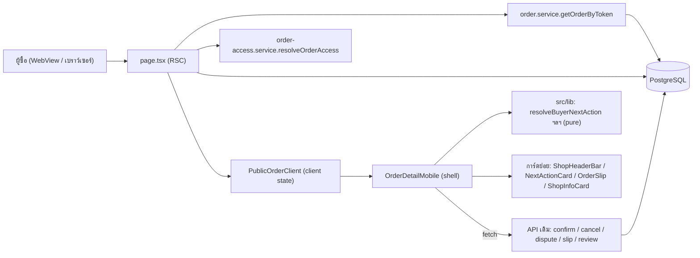
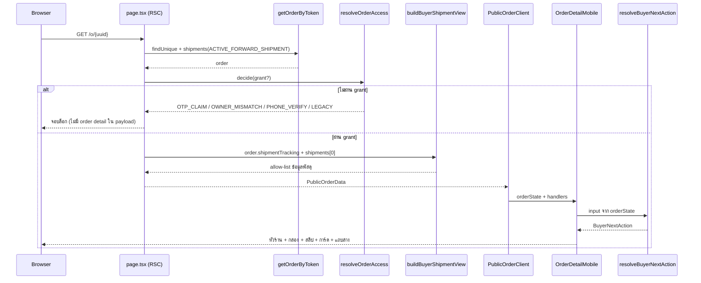
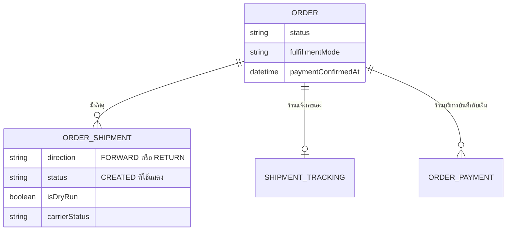

> **โมดูล:** 00068 — Buyer Order Page Redesign
> **ประเภทเอกสาร:** Software Requirements Specification (SRS) - TECHNICAL
> **เวอร์ชัน:** 0.1
> **วันที่จัดทำ:** 2026-10-05
> **สถานะ:** Draft (รอ Controller ตรวจ + user review ข้อขัดใน §7.4)
> **เจ้าของเอกสาร:** SA (ดู [[Feature-Docs-Ownership]]) · ร่างโดย `safepay-planner`

# SRS: หน้าคำสั่งซื้อฝั่งผู้ซื้อ ฉบับปรับใหม่ (Software Requirements Specification — Technical)

---

## 1. บทนำ (Introduction)

### 1.1 วัตถุประสงค์ของเอกสาร
กำหนดข้อกำหนดเชิงเทคนิคที่ทำให้ FR-BOP-01..14 ใน [[BRD]] เป็นจริงบนโค้ดจริง สำหรับ DEV/QA/Reviewer ครอบ 5 เรื่อง

1. ฟังก์ชันบริสุทธิ์ที่ตัดสินว่ากล่อง "สิ่งที่ต้องทำ" แสดงอะไร (`resolveBuyerNextAction`) พร้อมทุกกิ่ง
2. การขยาย data contract ของ `PublicOrderData` (ข้อมูลพัสดุ) โดยไม่เพิ่ม PII
3. การแก้ `getOrderByToken` ให้กรองทิศทางพัสดุ (ผลกระทบต่อจอ guest ด้วย)
4. มติ D-4 (ยอดโอนของร้านบริการ) และ D-5 (เงินสดซ่อนช่องแนบสลิป)
5. ข้อขัดระหว่าง BRD กับโค้ดจริงที่ต้องตัดสินก่อน implement (§7.4)

### 1.2 ขอบเขตเชิงระบบ (System Scope)
**อยู่ในขอบเขต:** `src/app/(marketing)/o/[token]/{page.tsx, OrderDetailMobile.tsx, PublicOrderClient.tsx}` และไฟล์พี่น้องที่ต้องแตก/แก้ · `src/services/order.service.ts::getOrderByToken` · ฟังก์ชันบริสุทธิ์ใหม่ใต้ `src/lib/**` · `PayoutAccountCard.tsx` · เทสสแกนซอร์สที่ผูกกับไฟล์เหล่านี้

**นอกขอบเขต (ตาม PRD §5 + มติ D-3, D-7):** `GuestOrderView` (จอ guest) · `BookingGuestView` (ใบจอง LODGING) · `SmsAutoEnter` / `ReviewSheet` / `ConfirmStamp` (พื้นฐานที่มีแล้ว) · business logic ของ confirm / cancel / dispute / slip / review · ฝั่งผู้ขาย · schema / migration (ไม่มี)

### 1.3 เอกสารอ้างอิง (References)
| เอกสาร | ความสัมพันธ์ |
|--------|-------------|
| [[PRD]] ของโมดูลนี้ | เป้าหมายธุรกิจและ KPI |
| [[BRD]] ของโมดูลนี้ | FR-BOP-01..14, ตาราง inventory §2.5, BR-BOP-01..15, มติ D-1..D-9 (§10) |
| [[SDS]] ของโมดูลนี้ | แผนโครงสร้าง component, ลำดับ batch, แผนย้ายเทส |
| [[API]] ของโมดูลนี้ | ยืนยันว่าไม่มี endpoint ใหม่ + สัญญา endpoint เดิมที่หน้าเรียก |
| ม็อกอัพ `docs/superpowers/specs/2026-10-04-sms-link-v5-detailed-mockup.html` | แหล่งความจริงของดีไซน์ (ขั้น 3-4) |
| `docs/conventions/ui-boolean-needs-a-testable-home.md` | เหตุที่ตัวเลือกกล่องต้องเป็นฟังก์ชันบริสุทธิ์ |
| `docs/conventions/rule-must-be-enforced-not-described.md` | เกณฑ์ว่า "บังคับได้" = มี mutation ที่ทำให้เทสแดง |
| `docs/conventions/domain-term-single-definition.md` (HR16) | ศัพท์มีนิยามเดียว |

### 1.4 นิยามและตัวย่อ (Definitions & Acronyms)
| คำ/ตัวย่อ | ความหมายเชิงเทคนิค |
|-----------|-------------------|
| **grant** | ผลของ `resolveOrderAccess` ที่ยืนยันว่าเป็นเจ้าของออเดอร์ — `page.tsx` return early ก่อนสร้าง `PublicOrderData` ถ้ายังไม่ผ่าน (PII gate) |
| **PublicOrderData** | ข้อมูลที่ส่ง RSC → client ของจอล็อกอินแล้ว (type อยู่ใน `OrderDetailMobile.tsx`) |
| **ACTIVE_FORWARD_SHIPMENT** | ตัวกรอง "พัสดุขาไปที่มีอยู่จริง" `{ status:'CREATED', isDryRun:false, direction:'FORWARD' }` ใน `src/lib/shipment-direction.ts` |
| **primary** | ชนิดของกล่อง "สิ่งที่ต้องทำ" ที่เป็นการ์ดแรกใต้หัวร้าน |
| **สองแกนสถานะ** | สถานะออเดอร์ vs สถานะพัสดุ (`resolveOrderStatusHeadline`) |
| **ORDER_TWO_COL_MQ** | `'@media (min-width:861px)'` — จุดแยก 2 คอลัมน์ของหน้านี้ (ดู §7.4 ข้อ C-2: BRD เขียนผิดเป็น 1200px) |
| **strangler** | ย้ายทีละส่วนในที่เดิม ทุก commit ต้อง tsc และเทสเขียว ไม่เขียนใหม่ทั้งหน้าแล้วสลับ |

---

## 2. ภาพรวมสถาปัตยกรรม (Architecture Overview)

### 2.1 บริบทระบบ (System Context)



### 2.2 องค์ประกอบหลัก (Components)
| Component | หน้าที่ | Stack / ที่อยู่ |
|-----------|---------|----------------|
| **page.tsx** | PII gate + ประกอบ `PublicOrderData` (allow-list) | RSC · `src/app/(marketing)/o/[token]/` |
| **getOrderByToken** | ดึงออเดอร์+พัสดุขาไปเพียงใบเดียว | `src/services/order.service.ts` |
| **buyer-next-action.ts (ใหม่)** | `resolveBuyerNextAction`, `resolveTransferAmount`, `buyerShipmentStatus` | pure · `src/lib/` |
| **buyer-order-summary.ts (ใหม่)** | `buildShopSummaryLine`, `buildSlipMoneyView` | pure · `src/lib/` |
| **order-shipment-view.ts (ใหม่)** | `buildBuyerShipmentView` allow-list ข้อมูลพัสดุ ชุดเดียวกับ guest | pure · `src/lib/` |
| **OrderDetailMobile (shell)** | ถือ state/handler/dialog/แถบล่าง แล้วประกอบการ์ดย่อย | client · Vuexy/MUI |
| **การ์ดย่อยใหม่** | ดู [[SDS]] §3 | client/presentational |
| **PayoutAccountCard** | บัญชี+QR ใช้ร่วมกับจอ guest | client |

### 2.3 มุมมองการ Deploy (Deployment View)
ไม่เปลี่ยน — Vercel Next.js 16 เดิม ไม่มี migration · `prisma migrate deploy` ตอน build ไม่มีไฟล์ใหม่ · WebView ของแอป iOS/Android เปิด URL เดิม

---

## 3. ข้อกำหนดเชิงฟังก์ชันเชิงเทคนิค (Technical Functional Requirements)

### TFR-001: หัวร้านและบรรทัดย่อหลักฐาน
- **Trace to:** FR-BOP-01, FR-BOP-02 (AC-BOP-01-1..6, AC-BOP-02-1..5)
- **คำอธิบายเชิงเทคนิค:**
  - ข้อมูลที่ใช้มีใน `PublicOrderData` แล้วทั้งหมด **ไม่เพิ่มฟิลด์:** `shop.shopName`, `shop.user.avatar` (page.tsx ทำ `toFileUrl(logo) ?? toFileUrl(user.avatar)` ไว้แล้ว), `shopId`, `completedOrders`, `avgRating`
  - ปุ่มแชทลิงก์ `/messages/${order.shopId}` (ใช้ `Shop.id` ไม่ใช่ `userId`)
  - บรรทัดย่อสร้างจากฟังก์ชันบริสุทธิ์ `buildShopSummaryLine({ avgRating, completedOrders }): string | null` ใน `src/lib/buyer-order-summary.ts`:

    | avgRating | completedOrders | ผลลัพธ์ |
    |---|---|---|
    | มีค่า > 0 | มีค่า | `"{r} {SHOP_RATING_UNIT} · ออเดอร์สำเร็จ {N} ครั้ง"` |
    | null (หรือ ≤ 0) | มีค่า | `"ออเดอร์สำเร็จ {N} ครั้ง"` |
    | มีค่า > 0 | null | `"{r} {SHOP_RATING_UNIT}"` |
    | null | null | `null` (ไม่แสดงบรรทัดย่อ) |

    `r` = `toFixed(1)` · `N` = `toLocaleString('th-TH')` · **ห้ามมีเลข 0 ปรากฏจากค่า null** (BR-BOP-14) · `SHOP_RATING_UNIT` = `'ดาว'` ประกาศเป็นค่าคงที่ตัวเดียวรอ ux ตัดสินตามมติ D-8 (ไม่พิมพ์คำซ้ำที่อื่น)
  - ชื่อร้านเป็น heading ที่ screen reader เข้าถึงได้ ลำดับ heading ทั้งหน้าให้ ux กำหนด (ต้องมี h1 เพียงตัวเดียว)
- **Precondition:** ผ่าน grant แล้ว (`PublicOrderData` ถูกสร้าง)
- **Postcondition:** หัวร้านอยู่บนสุดของหน้าทุกสถานะ (รวม CONFIRMED / CANCELLED / RETURNED)
- **Error / Edge cases:** ชื่อ 38 ตัวอักษรที่ 320px → clamp 2 บรรทัด + `minWidth:0` ครบชุดตาม `flex-header-truncation.md` · ไม่มีโลโก้ → ตัวอักษรแรกของ `shopName` · `avgRating` หลัง `Math.round(x*10)/10` เป็น `4` ต้องแสดง `4.0`

### TFR-002: การ์ดข้อมูลร้าน
- **Trace to:** FR-BOP-03 (AC-BOP-03-1..5), มติ D-1
- **คำอธิบายเชิงเทคนิค:** ประกอบจาก SSOT เดิมทั้งหมด ไม่พิมพ์คำเอง (HR16)

  | หลักฐานเดิม | SSOT | ที่มาใน payload |
  |---|---|---|
  | ป้ายยืนยัน | `resolveVerifyBadge(maxVerifyLevel)` (ระดับ 0 = null) | `maxVerifyLevel` |
  | ชั้นความน่าเชื่อถือ | `getTierLabel` / `getTierColor` (`trust-tier`) | `shop.user.trustScore` |
  | @username | — | `shop.user.username` |
  | สถิติ | `ShopStats` | `completedOrders` / `avgRating` / `reviewCount` |
  | ช่องทาง | `ShopChannels` | `channels` (5 คีย์ allow-list เดิม ห้ามเพิ่ม) |
  | เพจต้นทาง | `shouldShowOrderOrigin(...)` (`order-display.ts`) | `originPage` |
  | โปรไฟล์ร้าน | — | `/u/{username}` |

  ปุ่มช่วยเหลือ (`HELP_CENTER_HREF` จาก `src/lib/public-links`), ปุ่มแชร์ลิงก์ (`CoverActions`) และตราแบรนด์ (`BrandHomeLink`) ต้องมีที่ใหม่บนหน้า — **ตำแหน่งให้ ux กำหนดใน Design Spec** · `CoverActions`/`BrandHomeLink`/`ShopCover` **ห้ามลบไฟล์** เพราะ `GuestOrderView` ยังใช้
- **Error / Edge cases:** แชร์ = ส่งต่อ "กุญแจ" ของออเดอร์ (กติกาเดิมใน `CoverActions` ต้องคงเมื่อย้ายตำแหน่ง) · ร้านมีเพจเดียวและเพจเดียวกับต้นทาง → `shouldShowOrderOrigin` คืน false เหมือนเดิม

### TFR-003: ตัวเลือกกล่อง "สิ่งที่ต้องทำ" `resolveBuyerNextAction`
- **Trace to:** FR-BOP-04 (AC-BOP-04-1..5), BR-BOP-13
- **คำอธิบายเชิงเทคนิค:** ฟังก์ชันบริสุทธิ์ใน `src/lib/buyer-next-action.ts` (ห้าม import React/prisma) — เป็น **ที่เดียว** ที่ตัดสินว่าอะไรแสดง ห้ามมีเงื่อนไขเดียวกันซ้ำใน JSX

```ts
export type BuyerNextActionInput = {
  status: string                    // OrderStatus; ค่านอก allow-list ถือว่า "ปิด" (fail-closed)
  isServiceShop: boolean
  hasAppointment: boolean           // order.appointment !== null
  paymentMethod: string | null
  paymentConfirmedAt: string | null
  fulfillmentMode: string
  hasShipment: boolean              // order.shipmentTracking !== null
  totalAmount: number
  outstanding: number | null        // order.serviceMoney?.outstanding ?? null  (ร้านขายของ = null)
}

export type BuyerNextAction = {
  primary: 'NONE' | 'APPOINTMENT' | 'TRANSFER' | 'PICKUP' | 'SHIPMENT' | 'STATUS'
  /** non-null ก็ต่อเมื่อ primary === 'STATUS' */
  statusVariant: 'COD' | 'CASH' | 'DIGITAL' | 'PLAIN' | null
  /** ต้องแสดงบล็อกโอน+ที่แนบสลิป — ในกล่องหลักหรือการ์ดถัดลงมา */
  transfer: boolean
  /** การ์ดบัญชีรับเงินแบบสรุป (ถอด QR เมื่อ settled) — คง inventory #20 และด่าน P0-2 */
  payoutCard: boolean
  /** การ์ดจุดนัดรับ (ทุกสถานะ — การ์ดเองจัดการ status) */
  pickupCard: boolean
  /** การ์ดนัดหมาย (ทุกสถานะ รวม CANCELLED — AC-BOP-08-4) */
  appointmentCard: boolean
}
```

  **อัลกอริทึม (ลำดับสำคัญ)**

  1. `open = status ∈ {'PENDING','SHIPPED'}` — ใช้ allow-list ไม่ใช้ deny-list (`enum-value-removal.md`: ค่าที่ 3 ต้องไม่ตกเข้า branch ผิด)
  2. `amountDue = resolveTransferAmount({ totalAmount, outstanding })` (= `outstanding ?? totalAmount`)
  3. `transfer = open && status === 'PENDING' && needsPayoutAccount(paymentMethod) && !paymentConfirmedAt && amountDue > 0`
  4. `payoutCard = needsPayoutAccount(paymentMethod) && !transfer`
  5. `pickupCard = isPickupOrder(fulfillmentMode)`
  6. `appointmentCard = hasAppointment`
  7. `primary` (ถ้า `!open` → `'NONE'` และ `transfer = false`):
     1. `isServiceShop && hasAppointment` → `APPOINTMENT`
     2. `transfer` → `TRANSFER`
     3. `isPickupOrder(fulfillmentMode)` → `PICKUP`
     4. `fulfillmentMode === 'SHIPPED' && hasShipment` → `SHIPMENT`
     5. อื่น ๆ → `STATUS` โดย `statusVariant` = COD (`isCODPayment`) · CASH (`isCashPayment`) · DIGITAL (`fulfillmentMode === 'NO_SHIPPING'`) · PLAIN

  **ตารางทุกกิ่ง (ใช้เป็นเคสเทส `[blocker]`)**

  | # | status | เงื่อนไขเด่น | primary | transfer | payoutCard |
  |---|---|---|---|---|---|
  | 1 | CONFIRMED / CANCELLED / RETURNED / DRAFTED / ค่าไม่รู้จัก | — | NONE | false | `needsPay` |
  | 2 | PENDING | ร้านบริการ + มีนัด (ต้องโอน) | APPOINTMENT | true | false |
  | 3 | PENDING | ร้านบริการ + มีนัด + `outstanding = 0` | APPOINTMENT | false | `needsPay` |
  | 4 | PENDING | ร้านขายของ + TRANSFER + ยังไม่ confirm | TRANSFER | true | false |
  | 5 | PENDING | เหมือน 4 แต่ `paymentConfirmedAt` มีค่า | (ลงตามกิ่งถัดไป) | false | true |
  | 6 | PENDING | PICKUP + TRANSFER ยังไม่ confirm | TRANSFER | true | false |
  | 7 | PENDING | PICKUP + CASH | PICKUP | false | false |
  | 8 | PENDING | COD ไม่มีพัสดุ | STATUS/COD | false | false |
  | 9 | PENDING | CASH ไม่ใช่ PICKUP | STATUS/CASH | false | false |
  | 10 | SHIPPED | มีพัสดุ (SHIPPED fulfillment) | SHIPMENT | false | `needsPay` |
  | 11 | SHIPPED | ไม่มีพัสดุ (ร้านแจ้งส่งเอง) | STATUS/PLAIN | false | `needsPay` |
  | 12 | PENDING | `NO_SHIPPING` + `accessUrl` | STATUS/DIGITAL | ตามเงื่อนไข 3 | — |
  | 13 | PENDING | `paymentMethod = null` | (needsPay = true) → TRANSFER ถ้า `amountDue > 0` | ตาม 3 | — |
  | 14 | PENDING | `totalAmount = 0` ร้านขายของ | ไม่ใช่ TRANSFER | false | — |

  (`needsPay` = `needsPayoutAccount(paymentMethod)`; `needsPayoutAccount(null) = true` เป็นพฤติกรรมเดิมโดยตั้งใจ — ดูคอมเมนต์ใน `shop-payout.ts`)
- **Precondition:** อินพุตมาจาก state ปัจจุบันของ client (`orderState` หลัง optimistic update) ไม่ใช่ prop ตั้งต้น
- **Postcondition:** `primary === 'NONE'` ⇒ ไม่มีกล่องและไม่มีปุ่มล่างจอเรื่องงาน (ปุ่มล่างจอผูกกับ `canConfirm` แยกต่างหาก — TFR-010)
- **Error / Edge cases:** ห้ามอ่าน `Date.now()` / ไม่มี side effect · `status` ที่ไม่รู้จัก → NONE ไม่ใช่ STATUS (ไม่เดาว่า "ยังเปิด")

### TFR-004: กล่องโอนเงินและแนบสลิป (D-4, D-5)
- **Trace to:** FR-BOP-05 (AC-BOP-05-1..7), BR-BOP-05, BR-BOP-06
- **คำอธิบายเชิงเทคนิค:**
  - **ยอดที่แสดงและฝังใน QR = `resolveTransferAmount`** — ร้านขายของ = `totalAmount` (คงเดิม) · ร้านบริการ = `serviceMoney.outstanding` (มติ D-4)
  - `PayoutAccountCard` เพิ่ม prop **`amountDue: number` แบบบังคับ (ไม่มี default)** ใช้กับแถว "ยอดที่ต้องโอน" และ `buildPromptPayPayload({ amount })` ส่วนแถว `isSettled` ("ยอดที่ชำระ") ใช้ `totalAmount` เดิม — เหตุผล: ไม่ให้ "ยอดค้าง" ไปปรากฏในป้ายที่แปลว่า "จ่ายแล้ว"
  - **ผลต่อจอ guest (ตอบ D-4):** `PayoutAccountCard` ใช้ร่วมกัน ⇒ prop บังคับ ทำให้ `tsc` ไล่ให้ `GuestOrderView` ส่งค่าด้วย · ค่า default ที่เสนอสำหรับ guest คือ **`amountDue={order.totalAmount}` (พฤติกรรมเดิม ไม่ขยับ)** ซึ่งเป็นไปตาม D-3 — แต่จะทำให้ **QR ของบิลร้านบริการใบเดียวกันมียอดต่างกันระหว่างจอ guest (ยอดเต็ม) กับจอล็อกอิน (ยอดค้าง)** เป็นเรื่องเงิน (HR16) จึงเป็นข้อตัดสินใจเปิด **O-1** ให้ user เลือก: (ก) ปล่อย guest ตามเดิม (ข) ให้ guest ส่ง `order.money?.outstanding ?? order.totalAmount` ซึ่ง `GuestOrderData.money.outstanding` มีอยู่แล้ว เปลี่ยนโค้ดบรรทัดเดียว
  - เพิ่ม prop `variant: 'card' | 'embedded'` (ค่าตั้งต้น `'card'` = พฤติกรรมเดิม ปลอดภัยเพราะไม่ใช่เรื่องเงิน): `embedded` ตัด `<Card>` ครอบ + แถวหัวข้อ "ช่องทางชำระเงิน" + แถว "ยอดที่ต้องโอน" (หัวข้อกล่องพูดยอดอยู่แล้ว) คงแถวบัญชี/ชื่อบัญชี/ข้อความผูกบัญชี/QR/ปุ่มบันทึก QR และกติกา fail-closed
  - **เงื่อนไขซ่อน/แสดงของ "บล็อกโอน" ใช้ `action.transfer` เป็นตัวเดียว** — ครอบ AC-BOP-05-7 (PENDING เท่านั้น · `paymentConfirmedAt` ว่าง · ยอด > 0)
  - ร้านบริการ: **ไม่ใช้ `paymentConfirmedAt`** เป็นตัวตัดสินว่า "ร้านรับเงินแล้ว" — `setPaymentConfirmed` throw `PaymentConfirmNotEligibleError` เมื่อ `shop.vertical !== 'ONLINE_SALES'` (order.service.ts ~1923-1931) จึงเป็น `null` เสมอสำหรับร้านบริการ · ตัวตัดสินที่ถูกคือ `outstanding > 0` (ดู §7.4 C-3)
  - ที่แนบสลิป: state เดิม (`slipFileId`, `slipPreview`, `slipName`, `uploadingSlip`, `slipInputRef`, `handleSlipUpload`) ย้ายเข้า custom hook `useSlipUpload(token, initialSlipFileId)` (ดู [[SDS]] TD-005) · เส้นทางอัปโหลดเดิมห้ามเปลี่ยน: `uploadFileId(file,'DOCUMENT')` → `POST /api/orders/{token}/slip` `{ fileId }` · เพดานไฟล์อ่านจาก `uploadMaxSize('DOCUMENT')` (AC-BOP-05-4) · ข้อความ error ใช้ `err.message` จาก `uploadFileId` ก่อนข้อความกลางเสมอ (AC-BOP-05-6)
  - **D-5 (CASH ซ่อนช่องแนบสลิป):** ตรรกะใหม่อยู่ที่ `resolveBuyerNextAction.transfer` ซึ่งใช้ `needsPayoutAccount` (ตัด COD และ CASH) · **`showSlipZone` (`order-display.ts:122`) ถูกถอด** — ผู้เรียกเดียวคือ `OrderDetailMobile.tsx` (ยืนยันด้วย grep ทั้ง `src/` แล้ว มีเทสอีก 9 เคสใน `order-display.test.ts` ที่ต้องย้ายเคสเข้า `buyer-next-action.test.ts` พร้อมเคส CASH ใหม่) ไม่เก็บไว้เพราะจะเป็นนิยามที่สองของ "ต้องแนบสลิปไหม" และย้ายไป `needsPayoutAccount` แทนไม่ได้ (`shop-payout.ts` import `order-display.ts` อยู่ → import วน) · ถ้า Controller อยากเก็บ ให้แก้เป็น `status==='PENDING' && !isCODPayment && !isCashPayment` ในฟังก์ชันเดิม
  - **ผลต่อ API slip: ไม่มี** — `attachSlip` (order.service.ts:2399) เช็คแค่ `status === 'PENDING'` ไม่เช็ควิธีชำระ ⇒ การซ่อนช่องเป็นเรื่อง UI ล้วน ไม่ใช่ด่านความปลอดภัย (ถ้า client ส่งสลิปมาให้ออเดอร์ CASH เซิร์ฟเวอร์ยังรับ) ไม่เสนอเพิ่มด่านฝั่ง server (YAGNI — สลิปเกินไม่ทำให้ใครเสียหาย)
- **Precondition:** `action.transfer === true`
- **Postcondition:** ผู้ซื้อเห็นยอด+บัญชี+ปุ่มแนบสลิปในกล่องเดียว · `payoutSnapshot = null` → fallback เดิม ("ร้านยังไม่ได้แจ้งเลขบัญชี" + ติดต่อร้าน) ไม่มีหัวข้อ "โอน … ให้ร้าน" ที่ไม่มีบัญชีรองรับ (AC-BOP-05-3)
- **Error / Edge cases:** `buildPromptPayPayload` คืน `null` เมื่อ `amount ≤ 0` ⇒ QR หายเอง (fail-closed) · แนบสลิปแล้ว server ไม่ได้บอกว่า "ร้านตรวจแล้ว" ⇒ ห้ามมีคำนั้นบนจอ · ไม่มี Error ใหม่ที่ service throw (ดู §4.2)

### TFR-005: กล่องพัสดุ
- **Trace to:** FR-BOP-06 (AC-BOP-06-1..7), BR-BOP-04
- **คำอธิบายเชิงเทคนิค:**
  - ใช้ **`ParcelTimeline` เดิมตรง ๆ** ที่ `GuestOrderView` เรียกอยู่ (แถบ 4 จุด · แถวขากลับ `describeReturnLeg` · กล่องเตือนตีกลับ/มีปัญหา) ⇒ ไม่เขียนตรรกะพัสดุใหม่ และ BR-BOE-12 (สองจอชี้จุดเดียวกัน) ยังคงเป็นจริงเพราะใช้ตัวเดียวกัน
  - หัวข้อ+ป้ายสถานะมาจาก `buyerShipmentStatus(input)` ใน `buyer-next-action.ts`:
    - เรียก `deriveShippingStage({ status, carrierStatus, hasShipment, paymentMethod, codReceivedAt: null, fulfillmentMode, problemAt })` แล้ว `resolveOrderStatusHeadline({ status, stage, hasShipment, carrierStatus })` — **อาร์กิวเมนต์รูปเดียวกับ `GuestOrderView.tsx:84-104` ทุกตัว** (รวม `codReceivedAt: null` และ `hasShipment = shipmentTracking != null`)
    - คืน `{ hasShipment, stage, headline, statusPill }` · `statusPill = null` เมื่อซ้ำกับ headline
  - **ข้อมูลที่ต้องเพิ่มใน `PublicOrderData`** (ดู §4.2): `carrierStatus`, `problemAt`, `returnStartedAt`, `returnedAt`, `returnDispatchedAt`, และ `shipmentTracking.courierCode`
  - การ์ดเลขพัสดุเดิม (inventory #24: `handleCopyTracking` + state `copied` ในไฟล์ shell) **ถูกแทนที่** ด้วยหัวของ `ParcelTimeline` (โลโก้ขนส่ง+เลขพัสดุ+ปุ่มคัดลอก) — ถอด handler/state ซ้ำออกจาก shell
  - AC-BOP-06-6 (SHIPPED แต่ไม่มีข้อมูลพัสดุ): `hasShipment=false` ⇒ ไม่เรนเดอร์ `ParcelTimeline` และหัวข้อ = สถานะออเดอร์ล้วน (`resolveOrderStatusHeadline` คืน `statusLabel` เมื่อ `!hasShipment`)
  - AC-BOP-06-7: `getOrderByToken` ต้องกรองขาไป (TFR-014)
- **Error / Edge cases:** ปุ่มคัดลอกเลขใน `ParcelTimeline` คำนวณจากซอร์สได้ ~32px (ButtonBase `py:0.25` + บรรทัด 25px/ปุ่มไอคอน 28px) **ต่ำกว่า 44px ของ AC-BOP-06-2** → ต้องเติม `minHeight: 44` (กระทบจอ guest ด้วยแต่ปลอดภัย) และ **ต้องวัดบนจอจริงก่อนปิดงาน** (ตัวเลข 32px ยังไม่ได้วัด) · คำ "รอเงิน COD" (stage `AWAITING_COD`) เป็นภาษาฝั่งร้านที่จะขึ้นหัวข้อให้ผู้ซื้อออเดอร์ COD ที่พัสดุส่งถึงแล้ว (ดู §7.4 C-8, O-3)

### TFR-006: กล่องนัดรับ / COD / เงินสด / ดิจิทัล
- **Trace to:** FR-BOP-07 (AC-BOP-07-1..6), BR-BOP-05, BR-BOP-12
- **คำอธิบายเชิงเทคนิค:**
  - PICKUP: ใช้ `PickupInfoCard` เดิม (props `shopName`, `shopAddress`, `handedOverAt`, `status`) — ชื่อร้านเสมอ ที่อยู่ถ้ามี · ข้อความ "ร้านแจ้งว่ามอบสินค้าให้แล้วเมื่อ {เวลา}" และเวลาปิดอัตโนมัติ `computeAutoConfirmDeadline(handedOverAt)` (`PICKUP_AUTOCONFIRM_HOURS = 48` จาก `order-pickup.ts`) **ห้ามพิมพ์ 48 ซ้ำ** · **ห้ามสีเขียว** ก่อน CONFIRMED
  - COD / CASH: ป้ายด้วย `paymentMethodLabel` (ไม่เรียกเงินสดว่า "โอนเข้าบัญชี") และ `paymentMethodDetail` เฉพาะที่บอกเกินป้าย · ไม่มีปุ่มโอน/แนบสลิป/QR
  - ดิจิทัล: การ์ดลิงก์เข้าถึงเดิมเมื่อ `accessUrl` ผ่าน `isHttpUrl` (กัน `javascript:`/`data:`) · ไม่มีแถบพัสดุ (`fulfillmentMode !== 'SHIPPED'`)
  - PICKUP + ต้องโอน: กล่องโอนมาก่อน (`primary = TRANSFER`) ส่วนข้อมูลนัดรับยังแสดงเป็นการ์ดถัดลงมาผ่าน `pickupCard` (AC-BOP-07-3)

### TFR-007: การ์ดวันนัด (ร้านบริการ)
- **Trace to:** FR-BOP-08 (AC-BOP-08-1..5)
- **คำอธิบายเชิงเทคนิค:** ใช้ `AppointmentCard` เดิมโดยไม่แก้ props (`token`, `appointment`, `orderCancelled`) · เป็นกล่องแรกเมื่อ `primary === 'APPOINTMENT'` · เมื่อออเดอร์ปิดแล้วแต่ยังมีนัด (`appointmentCard = true`, `primary = 'NONE'`) ยังเรนเดอร์เป็นการ์ดปกติในตำแหน่งเดิม (ดู §7.4 C-4) · ระยะเวลาใช้ `formatDurationTH` · walk-in (`appointment = null`) ไม่มีการ์ด

### TFR-008: ออเดอร์ที่ปิดแล้ว
- **Trace to:** FR-BOP-09 (AC-BOP-09-1..3)
- **คำอธิบายเชิงเทคนิค:** `primary = NONE` · ไม่มีปุ่มล่างจอ (`canConfirm = false`) · CONFIRMED ⇒ `ConfirmStamp` บนสลิป (คำ "ได้รับแล้ว"/"รับบริการแล้ว" เมื่อ `confirmation.byBuyer`, อื่น ๆ "สำเร็จ" — เทสเดิมใน `sms-link-one-time.test.ts` ยังต้องเขียวหลังย้าย) · CANCELLED ⇒ กล่องเหตุผลตาม `cancelInitiator` + รูปสินค้าเทา · RETURNED ⇒ ป้ายจาก `resolveOrderStatusBadge('RETURNED')`; การ์ดบัญชีที่ settled/ยกเลิกยังต้องถอด QR ผ่าน `PayoutAccountCard.isSettled` (ด่าน P0-2 เดิม)

### TFR-009: สลิปคำสั่งซื้อ
- **Trace to:** FR-BOP-10 (AC-BOP-10-1..8), BR-BOP-03, BR-BOP-06, BR-BOP-07
- **คำอธิบายเชิงเทคนิค:**
  - หัวสลิป: noun จาก `ORDER_VOCAB[vertical].noun` (ผ่าน `isServiceShop` → key) · เลข `formatOrderNo(publicToken, createdAtIso)` เต็มเสมอ · วันที่ `formatDateTimeTH` · ปุ่มคัดลอกเลข (ห้ามตัด — inventory #9)
  - รายการ: `ItemThumbnail` เดิมพร้อม placeholder · `description` ตัด 2 บรรทัด
  - ยอด: `buildSlipMoneyView({ totalAmount, paymentConfirmedAt, money, status })` ใน `buyer-order-summary.ts` คืน `{ totalLabel, paidChip, serviceLines }`:
    - `totalLabel` = `'ยอดที่ต้องชำระ'` เมื่อ `status==='PENDING' && money == null` ไม่เช่นนั้น `'ยอดรวม'` (ย้ายตรรกะ `totalLabel` เดิมมา)
    - `paidChip` (ป้าย "ร้านยืนยันรับเงินแล้ว") = `money == null && paymentConfirmedAt != null` — **ห้ามคำว่า "ชำระแล้ว"** ทุกกรณี
    - `serviceLines` (ร้านบริการที่ `money != null`) = `{ total, deposit: { amount, received } | null, outstanding }` โดย `deposit.received` ต้องมาจาก `money.depositReceived` (ฟิลด์ที่เพิ่มใน payload จาก `computeOrderMoney` เดิม — ห้ามบวก `entries` เองในหน้าจอ) ⇒ ป้ายยืนยันขึ้นเฉพาะมัดจำที่ร้านบันทึกรับจริง (AC-BOP-10-7) · `outstanding` ใช้ `completionWarning`-สไตล์ข้อความ "ยังค้างชำระ ฿X" จาก `order-payment.ts` (ห้ามพิมพ์คำเอง)
  - ตราประทับไม่ทับยอดรวม/ชื่อรายการ · ขอบฉีกด้วย CSS mask (ไม่ตัดเนื้อหา) · dark mode ต้องตรวจจริง
  - หลังกดยืนยันสำเร็จ: `PublicOrderClient` optimistic update `status`, `confirmation` ⇒ ตราขึ้นทันที กล่อง/ปุ่มหายเพราะ `resolveBuyerNextAction` คำนวณจาก `orderState` (AC-BOP-10-8)

### TFR-010: แถบล่างจอ (ปุ่มยืนยันรับ/ยกเลิก)
- **Trace to:** FR-BOP-11 (AC-BOP-11-1..9), มติ D-2, D-9
- **คำอธิบายเชิงเทคนิค:**
  - `canConfirm = status === 'PENDING' || 'SHIPPED'` (เดิม) · ปุ่มเปิด dialog ก่อนเสมอ (`onClick={() => setConfirmDialogOpen(true)}`) · ป้ายปุ่ม `ctaLabel` เดิมและ dialog ใช้คำเดียวกัน
  - **คำกำกับใต้ปุ่มใหม่:** ร้านขายของ "กดเมื่อได้ของครบแล้วเท่านั้น" · ร้านบริการ "กดเมื่อรับบริการเรียบร้อยแล้วเท่านั้น" — **ผลต่อโค้ดเดิม:** ใน shell มีคอมเมนต์ "คำอธิบายใต้ปุ่มถูกถอดออก…" และเทส `ไม่มีคำอธิบายที่บรรยายท่าทางการกด` (`/แตะเพื่อ/`) — คำกำกับใหม่ต้องไม่ขึ้นต้นด้วยหรือมี "แตะเพื่อ" และต้องแก้คอมเมนต์เดิมให้ไม่ขัด (เหตุผลที่ถอดคือ "บรรยายท่าทาง" ส่วนข้อความใหม่บอก *เงื่อนไขก่อนกด* ต่างกัน)
  - ปุ่มยกเลิกคงที่ `showCancel = status==='PENDING' && !!onCancel` ผ่าน dialog ยืนยัน (ด่าน "ทุกทางเข้าต้องผ่าน dialog")
  - ความสูงแถบวัดจริงด้วย `ResizeObserver` + บล็อกกันที่ท้าย flow **หลัง** `<PublicProfileFooter />` + safe-area `env(safe-area-inset-bottom)` (กฎเดิมจาก `public-order-cta-bar-clearance.test.ts`)
  - จอ ≥ `ORDER_TWO_COL_MQ` แสดงยอด (`totalLabel` + `formatBaht`) ข้างปุ่ม
- **Error / Edge cases:** ร้านบริการที่นัดยังไม่ถึงเวลา ปุ่มยังกดได้ (น้ำหนักปุ่มผ่าน `ctaReady`/`isFinalStepReady` เดิม) · กล่องกันพลาด "ยืนยันนัดหมาย vs ปิดงาน" ย้ายไปใกล้ปุ่มยืนยัน (BR-BOP-09, D-6)

### TFR-011: คงฟังก์ชันเดิมครบ (inventory)
- **Trace to:** FR-BOP-12 (AC-BOP-12-1, 12-2), PRD §3.5
- **คำอธิบายเชิงเทคนิค:** ทุกแถวของตาราง BRD §2.5 ต้องมีเทสรายข้อ · ข้อ 2/3/10/11/19 ที่ BRD ติดไว้ ตอนนี้ได้มติ D-1/D-6 แล้ว (คงไว้ใต้สลิป/ย้ายใกล้ปุ่มยืนยัน) · **แผนย้ายเทส:** เทสสแกนซอร์สที่อ่าน `OrderDetailMobile.tsx` มี **18 ไฟล์** (ไม่ใช่ 5 ตาม BRD §7.2 — ดู §7.4 C-1) ต้องผ่าน helper อ่านซอร์สหลายไฟล์แบบ fail-closed และพิสูจน์ด้วย mutation ทุกครั้งที่ย้าย (รายละเอียด [[SDS]] §6 TD-006 และ §8)

### TFR-012: ข้อมูลและ PII
- **Trace to:** FR-BOP-13 (AC-BOP-13-1..3), BR-BOE PII gate ของ 00015
- **คำอธิบายเชิงเทคนิค:**
  - **ห้ามแตะ** ลำดับใน `page.tsx`: `resolveOrderAccess` → early return (`ClaimOtpPrompt` / `OrderAccessBlock` / `PhoneVerifyPrompt`) → `guaranteeOrderLink` → ประกอบ `PublicOrderData`
  - ข้อมูลพัสดุที่เพิ่ม ผ่าน `buildBuyerShipmentView(order)` (allow-list ทีละฟิลด์ ตามหลัก `guest-order-data.ts`): `{ shipmentTracking:{provider,trackingNo,courierCode}|null, carrierStatus, problemAt, returnStartedAt, returnedAt, returnDispatchedAt }` — **ไม่มีที่อยู่/เบอร์/ชื่อผู้ซื้อ ไม่มี key ของ `ShopChannel` นอก 5 คีย์** · ไม่มี endpoint ใหม่ · ไม่เปลี่ยนด่าน ownership ของ confirm/cancel/dispute/slip/review
  - ใช้ `sessionUserId()` ตามเดิม ห้าม cast session
- **Error / Edge cases:** `ShipmentTracking` (ร้านแจ้งเลขเอง) ไม่มี `courierCode` ⇒ `null` คือความจริงของแถวนั้น ไม่ใช่ข้อมูลหาย (ตามคอมเมนต์ใน `guest-order-data.ts`)

### TFR-013: การแสดงผลหลายจอ ธีม และการเข้าถึง
- **Trace to:** FR-BOP-14 (AC-BOP-14-1..6)
- **คำอธิบายเชิงเทคนิค:** Vuexy/MUI เท่านั้น (ห้ามใช้ utility ของ Paces ในโฟลเดอร์ `(marketing)` เพราะ `marketing.css` ไม่มีนิยามคลาสเหล่านั้น) · Anuphan · ไอคอน tabler ผ่าน `@iconify/react` · ห้าม emoji · รัศมี 12px ชุดเดียว · ระยะขอบ `cardBodySx`/`cardInlinePadSx` · `aria-label` เฉพาะ element ที่ role รองรับชื่อ · ปุ่มกด ≥ 44px · ชุดกันล้นจอ (`minWidth:0` + `maxWidth:100%` + `overflowX:'clip'` ที่กล่องนอกสุด) · ตัวสลิป `ConfirmStamp`/`VERIFIED_INK` ผ่าน AA · **component ย่อยห้ามถือ `order` ของ flex/grid เอง** — shell เป็นเจ้าของ slot (เทส `public-order-two-column` บังคับ `order` ต่อเนื่องไม่ซ้ำ)

### TFR-014: แก้ `getOrderByToken` ให้กรองทิศทางพัสดุ
- **Trace to:** BRD §7.2 (ปัญหาที่มีอยู่ก่อน), AC-BOP-06-5, AC-BOP-06-7
- **คำอธิบายเชิงเทคนิค:** `order.service.ts:1668` เขียน `shipments: { where: { status: 'CREATED' }, orderBy:{createdAt:'desc'}, take:1 }` — **ยืนยันกับโค้ดแล้ว** ว่าไม่มี `direction` และ `isDryRun` เปลี่ยนเป็น `where: ACTIVE_FORWARD_SHIPMENT` (import อยู่ในไฟล์แล้วบรรทัด 2) · ยืนยันด้วย grep ว่านี่คือ **จุดเดียวที่เหลือ** ใน `src/` ที่เขียน `where: { status: 'CREATED' }` เปล่า ๆ (อีก 2 จุดใน `order-return.service.ts:52` และ `return-quote/route.ts:76` ระบุ direction ครบแล้ว) · คอลัมน์ `direction` มี `@default("FORWARD")` (schema.prisma:2766) ⇒ แถวเก่าทุกแถวเป็น FORWARD ไม่ต้อง backfill
  - **ผลต่อจอ guest (ตอบข้อซักถาม):** `getOrderByToken` เป็นต้นทางข้อมูลพัสดุของจอ guest ด้วย (`buildGuestOrderData` อ่าน `shipments[0]`) ⇒ การแก้นี้เปลี่ยนผลกับจอ guest เฉพาะออเดอร์ที่มีพัสดุขากลับ (เดิมอาจแสดงขากลับเป็นขาไป) และพัสดุ dry-run (เดิมหลุดมาแสดง) — **เป็นการแก้ความถูกต้อง ไม่ใช่การเปลี่ยน UX** · ออเดอร์ปกติผลเท่าเดิม · ไม่ขัด D-3 เพราะเป็นชั้น service ไม่ใช่ชั้นหน้า
  - **ตรวจจับ:** เทส `[blocker]` ใน `shipment-direction.test.ts` จับเฉพาะรูป `where: { status: { not: 'CANCELLED' } }` **จึงมองไม่เห็นบั๊กนี้** (รูป `where: { status: 'CREATED' }`) — ต้องขยายด่านให้จับรูปนี้ด้วย
- **Error / Edge cases:** ไม่มี Error ใหม่ · ไม่เปลี่ยน signature · `select` คงเดิม

---

## 4. ข้อกำหนดส่วนต่อประสาน (Interface / API Specification)

### 4.1 API Endpoints
**ไม่มี endpoint ใหม่ และไม่เปลี่ยนสัญญา endpoint เดิม** — endpoint ที่หน้าเรียกอยู่แล้วดู [[API]] §3

| Method | Path | ที่เรียก | Auth |
|--------|------|----------|------|
| POST | `/api/orders/{token}/confirm` | `PublicOrderClient.handleConfirm` | NextAuth session + `buyerUserId` |
| POST | `/api/orders/{token}/cancel` | `PublicOrderClient.handleCancel` | session (ผู้ซื้อเจ้าของ → initiator=buyer) |
| POST | `/api/orders/{token}/dispute` | shell `handleDispute` | session + ownership |
| POST | `/api/orders/{token}/slip` | `useSlipUpload` | session + ownership |
| POST/PATCH/DELETE | `/api/orders/{token}/review` | `ReviewForm` / `ReviewSheet` / shell | session + ownership |
| POST | `/api/uploads/ticket`, `/api/uploads/commit` | `uploadFileId` (direct upload) | session |

### 4.2 รายละเอียดสัญญาฝั่งเซิร์ฟเวอร์ที่เปลี่ยน (ไม่ใช่ HTTP)

#### (ก) `getOrderByToken(publicToken)` — เปลี่ยนเฉพาะ `where` ของ `shipments`
```ts
shipments: {
  where: ACTIVE_FORWARD_SHIPMENT, // เดิม { status: 'CREATED' }
  select: { trackingNo: true, courierName: true, courierCode: true, carrierStatus: true,
            problemAt: true, returnStartedAt: true, returnedAt: true, returnDispatchedAt: true },
  orderBy: { createdAt: 'desc' },
  take: 1,
},
```

#### (ข) `PublicOrderData` — ฟิลด์ที่เพิ่ม/แก้ (ฟิลด์เดิมทั้งหมดคงเดิม)
```ts
shipmentTracking: { provider: string; trackingNo: string; courierCode: string | null } | null // เพิ่ม courierCode
carrierStatus: string | null
problemAt: string | null
returnStartedAt: string | null
returnedAt: string | null
returnDispatchedAt: string | null
money: { /* …เดิม… */ depositReceived: number } | null // เพิ่ม 1 ฟิลด์ จาก computeOrderMoney เดิม
```
เหตุที่ `courierCode` ต้องมี: `courierLogoUrl(courierCode, provider)` จับแบรนด์ได้แม่นขึ้น และจอล็อกอินเคยขาดฟิลด์นี้ทั้งที่จอ guest มี (ความต่างที่ไม่มีใครตั้งใจ) · ทุกฟิลด์ผ่าน `buildBuyerShipmentView` (allow-list) · ชนิด `Date` แปลงเป็น ISO string ที่ server boundary

#### (ค) Cross-file error-mapping (บังคับ enumerate)
**ไม่มี custom Error ใหม่ที่ service จะ `throw`** — งานนี้แก้เฉพาะรูป query (`where`) ใน `getOrderByToken` ไม่เพิ่ม/เปลี่ยน throw ใดเลย ⇒ ไม่ต้องเติม branch ใน route handler ใด ๆ · ตาราง route-catch เดิมของ confirm/cancel/dispute/slip/review คงเดิมทุกบรรทัด (ดู [[API]] §5)

### 4.3 Events / Messaging
ไม่มี

### 4.4 Sequence ของ flow สำคัญ



---

## 5. ข้อกำหนดด้านข้อมูล (Data Requirements)

### 5.1 Data Model / Entities
| Entity | คำอธิบาย | Owner store |
|--------|----------|-------------|
| **Order** | `status`, `paymentMethod`, `fulfillmentMode`, `paymentConfirmedAt`, `handedOverAt`, `payoutSnapshot`, `slipFileId` | PostgreSQL |
| **OrderShipment** | `direction` (FORWARD/RETURN), `status`, `isDryRun`, `carrierStatus`, `problemAt`, `returnStartedAt/returnedAt/returnDispatchedAt` | PostgreSQL |
| **ShipmentTracking** | เลขพัสดุที่ร้านแจ้งเอง (ไม่มี `courierCode`) | PostgreSQL |
| **OrderPayment** | บันทึกรับเงินของร้านบริการ (ที่มาของ `serviceMoney`) | PostgreSQL |

### 5.2 ความสัมพันธ์ (ERD)


### 5.3 Migration / Data Lifecycle
**ไม่มี migration** — ไม่แตะ schema · `direction` มี default `FORWARD` อยู่แล้ว · ไม่ต้อง backfill · ไม่เปลี่ยนเวลา retention · ไม่ต้องแจ้งเรื่อง `prisma migrate deploy` (ไม่มีไฟล์ migration ใหม่) · **ไม่ต้อง dispatch `safepay-database`**

---

## 6. ข้อกำหนดที่ไม่ใช่ฟังก์ชัน (Non-Functional Requirements)

| ด้าน | ข้อกำหนด | เป้าหมายที่วัดได้ |
|------|----------|-------------------|
| **Performance** | ไม่เพิ่มรอบ query ของ `page.tsx`/`getOrderByToken` (แก้ `where` เดิม) · payload เพิ่มเฉพาะ ~6 ฟิลด์สตริงสั้น · ไม่โหลด component ที่สถานะนั้นไม่ใช้ (`ParcelTimeline`/`PayoutAccountCard` เรนเดอร์ตามเงื่อนไข) | จำนวน query ต่อการโหลดหน้า = เท่าก่อนงานนี้ (นับจาก `page.tsx`) |
| **Scalability** | ไม่มีผล (RSC ต่อคำขอ ไม่มี cache ใหม่) | — |
| **Availability** | WebView ของแอปต้องไม่พังจากเดิม: แถบล่าง fixed + safe-area · ไม่พึ่งแถบที่อยู่ของเบราว์เซอร์ | ตรวจ iOS/Android WebView ก่อนปิดงาน |
| **Security** | PII gate คงเดิม · allow-list ทีละฟิลด์ · `channels` 5 คีย์ · `isHttpUrl` กับลิงก์ดิจิทัล · QR ถอดเมื่อ settled/ยกเลิก (P0-2) · ใช้ `sessionUserId()` | เทส `[blocker]` เดิม + ใหม่เขียวทั้งชุด · mutation แดง |
| **Observability** | ไม่เพิ่ม log (หน้านี้ไม่มี log ของ business) · ความล้มเหลวของ `slip`/`dispute` ยังขึ้น toast บอกสาเหตุ | — |
| **Maintainability** | `OrderDetailMobile.tsx` เหลือเป็น shell · ไฟล์ใหม่ละ < ~400 บรรทัด · ตัวเลือกกล่อง/สรุปร้าน/มุมมองเงินสลิป เป็นฟังก์ชันบริสุทธิ์พร้อมเทส `[blocker]` และ mutation · เทสสแกนซอร์สอ่านผ่าน helper เดียวแบบ fail-closed | `tsc` 0 · `npx vitest run src/` เขียว · mutation ครบทุกตัวใน [[SDS]] §8 |
| **Accessibility** | พื้นที่กด ≥ 44px · `aria-label` อยู่บน element ที่ role รองรับ · ไอคอน external `aria-hidden` · dialog มี `aria-modal` ตามแบบเดิม · สีไม่ใช่ตัวสื่อความหมายตัวเดียว | `/impeccable audit` ไม่มี P0/P1 a11y |

---

## 7. ข้อจำกัดทางเทคนิคและการพึ่งพา (Technical Constraints & Dependencies)

### 7.1 ข้อจำกัดทางเทคนิค
- Next.js 16 App Router · MUI v9 + Emotion (Vuexy) ในโฟลเดอร์ `(marketing)` · ห้ามใช้คลาส Tailwind/Paces
- vitest `environment: "node"` ไม่มี jsdom ⇒ เทสพฤติกรรม UI ทำไม่ได้ ใช้ฟังก์ชันบริสุทธิ์ (พฤติกรรม) + สแกนซอร์ส (ความคงอยู่ของด่าน)
- เงื่อนไข boolean ที่ตัดสินว่า UI แสดงอะไรห้ามอยู่ในเทอร์นารีกลาง JSX (`ui-boolean-needs-a-testable-home.md`)
- ห้าม `component={Link}` ใน server component (HR2) · ห้ามประกาศ component ไว้ในตัว render (`component-declared-in-render.md`) · ห้ามใส่ค่าที่ custom hook คืนทั้งก้อนใน dep array (`hook-return-identity-in-deps.md` — ใช้กับ `useSlipUpload`)
- `PublicOrderClient` ถือ `useState(order)` ซึ่งไม่ซิงก์ prop ใหม่ ⇒ ต้องคง `key={status-hasReview}` ใน `page.tsx`
- ชื่อไฟล์ในโฟลเดอร์ `src/app/**` ห้ามชนชื่อ convention (`template`/`layout`/`page`/`loading`/`error`/`default`/`route`/`not-found`)

### 7.2 การพึ่งพาภายนอก/ภายใน
| Dependency | ประเภท | ความเสี่ยง |
|------------|--------|------------|
| **00015 Order Claim** (`resolveOrderAccess`) | internal | แตะ = รั่ว PII ⇒ ห้ามแตะ |
| **ParcelTimeline / describeProgress / describeReturnLeg** | internal | ใช้ร่วมกับจอ guest และจอร้าน — แก้ที่ `minHeight` อย่างเดียว |
| **PayoutAccountCard** | internal ใช้ร่วมกับ guest | prop บังคับใหม่ทำให้ guest ต้องแก้ 1 บรรทัด (ภายใต้ O-1) |
| **safepay-ux (HR8)** | process | ต้องออก Design Spec ก่อนแตะ `(marketing)/**` ทุกไฟล์ |
| **Impeccable CLI** | process | critique + clarify หลัง build (audit เมื่อแตะ a11y) |

### 7.3 สมมติฐานทางเทคนิค (Assumptions)
- แถว `OrderShipment` เก่าทั้งหมดมี `direction='FORWARD'` (default ใน schema) — **ยืนยันจากซอร์ส ไม่ได้ query ฐาน prod** (เครื่อง dev ไม่มี DATABASE_URL ของ prod) ถ้าต้องการยืนยันให้ Controller รัน SELECT อ่านอย่างเดียวผ่าน Supabase PAT: `SELECT direction, count(*) FROM "OrderShipment" GROUP BY 1`
- `hasMoneyStory`/`serviceMoney` ยังเป็นชุดเดียวที่ `page.tsx` คำนวณครั้งเดียวและใช้ทั้ง 2 สาขา
- LODGING (`order.type==='BOOKING'`) ไม่เข้าหน้านี้ (ใช้ `BookingGuestView`)

### 7.4 ผลการยืนยันข้อจำกัดกับโค้ด — ข้อขัดกับ BRD ที่พบ (HR16 ทิศกลับ)
> ทุกข้อด้านล่างตรวจกับโค้ดจริงแล้ว (ระบุไฟล์/บรรทัด) — ข้อที่ขัดกับถ้อยคำใน BRD ต้องให้ Controller/user รับรู้ก่อนล็อกเป็นมติ

| # | BRD ระบุ | โค้ดจริงบอก | ผลต่อ SRS | ต้องตัดสิน |
|---|----------|-------------|------------|------------|
| **C-1** | §7.2: เทสสแกนซอร์สผูกไฟล์เดิม 5 ไฟล์ | เทส **18 ไฟล์** อ่านซอร์ส `OrderDetailMobile.tsx` ตรง ๆ (รายชื่อ [[SDS]] §8.1) บางไฟล์ hardcode path (`public-order-tap-target`, `card-padding`, `cta-bar-clearance`) ⇒ ย้ายโค้ดแล้วเทส **เขียวแต่ไม่ได้ตรวจอะไร** | TFR-011 + SDS TD-006 | ไม่ (เป็นแผนงาน) |
| **C-2** | AC-BOP-11-9: `ORDER_TWO_COL_MQ` = 1200px | `content-width.ts:46` = `'@media (min-width:861px)'` (คอมเมนต์ใน shell เขียน "1200px" แต่ค่าคงที่จริงคือ 861) | TFR-010 ใช้ค่าคงที่ ไม่พิมพ์เลข | แก้ BRD AC-BOP-11-9 |
| **C-3** | AC-BOP-05-7: ซ่อนกล่องโอนเมื่อ `paymentConfirmedAt != null` | ร้านบริการ **ไม่มีทางมี `paymentConfirmedAt`** (`setPaymentConfirmed` throw `PaymentConfirmNotEligibleError` เมื่อ vertical ≠ ONLINE_SALES — order.service.ts ~1923-1931) | TFR-003/004 ใช้ `outstanding > 0` ควบคู่ | ยืนยัน |
| **C-4** | AC-BOP-04-2: CANCELLED ไม่มีกล่องงาน · AC-BOP-08-4: ใบยกเลิกยังส่ง `orderCancelled` ให้ `AppointmentCard` | สองข้อนี้ขัดกันถ้าถือว่าการ์ดนัด = กล่องงาน | แยกธง `appointmentCard` (การ์ดข้อมูล) ออกจาก `primary` (กล่องงาน) | ยืนยัน |
| **C-5** | AC-BOP-05-7: ไม่ใช่ PENDING → ไม่แสดงกล่องโอน/QR | inventory #20 กำหนดเงื่อนไขการ์ดบัญชีเป็น `needsPayoutAccount` ทุกสถานะ และ `PayoutAccountCard` มี safeguard P0-2 ("ออเดอร์นี้ถูกยกเลิกแล้ว — ห้ามโอนเงิน") ที่เทสบังคับ | ธง `payoutCard` คงการ์ดแบบ settled/ยกเลิกไว้ (ไม่มี QR) นอกกล่องหลัก | **O-2 user ยืนยัน** |
| **C-6** | AC-BOP-11-2/3: คำกำกับใต้ปุ่ม | shell มีคอมเมนต์ถอดคำอธิบายใต้ปุ่มไปแล้ว + เทส `/แตะเพื่อ/` | BRD ที่อนุมัติแล้วชนะ แต่ต้องแก้คอมเมนต์เดิมและห้ามใช้คำ "แตะเพื่อ" | แจ้งรับทราบ |
| **C-7** | AC-BOP-06-2: ปุ่มคัดลอกเลขพัสดุ ≥ 44px | `ParcelTimeline` ปุ่มคัดลอก (`ButtonBase py:0.25`) ราว ~32px จากซอร์ส (ยังไม่วัดจอจริง) | TFR-005 เติม `minHeight:44` | ไม่ (วัดจริงตอน QA) |
| **C-8** | AC-BOP-06-1: หัวข้อจาก `resolveOrderStatusHeadline` | ออเดอร์ COD ที่พัสดุส่งถึงแล้วและร้านยังไม่กดรับเงิน ได้ stage `AWAITING_COD` ⇒ หัวข้อ "รอเงิน COD" (ภาษาฝั่งร้าน) ขึ้นให้ผู้ซื้อ — ปัญหาเดียวกันมีอยู่ในจอ guest แล้ว (`codReceivedAt: null`) | TFR-005 ทำตาม guest ทุกตัวอักษร (parity) | **O-3 ux/user** |
| **C-9** | (ไม่ได้ระบุ) | `slip-route.test.ts:69` และคอมเมนต์ใน `slip/route.ts` อ้างว่า multipart ยังเหลือผู้เรียก `OrderDetailMobile` แต่ shell ใช้ `uploadFileId` (JSON) ไปแล้ว — ข้อมูลเก่า | ไม่เกี่ยวกับงานนี้ ไม่แก้ (บันทึกไว้) | ไม่ |

ข้อสังเกตเพิ่ม (นอกขอบเขตแต่เจอ): `cancel/route.ts:34` อ่าน `session.user.id` ด้วย cast (`as { id?: string }`) ทั้งที่ convention ให้ใช้ `sessionUserId()` — ไม่แก้ในงานนี้

---

## 8. ความเสี่ยงเชิงสถาปัตยกรรม (Architectural Risks)

| ความเสี่ยง | ผลกระทบ | แนวทางลด |
|-----------|---------|----------|
| **เทสสแกนซอร์สเขียวว่างหลังย้ายโค้ด** (C-1) | ด่านที่เคยกัน P0/P1 หายเงียบ | helper อ่านหลายไฟล์ fail-closed + mutation ทุกครั้งที่ย้าย ([[SDS]] TD-006) |
| **ไฟล์ 3,000 บรรทัดแตก = regression ที่ไม่เห็น** | ฟังก์ชันเดิมหาย | strangler รายส่วน · commit atomic · inventory 32 แถวมีเทสรายข้อ |
| **ยอด QR ของบิลร้านบริการต่างกันระหว่าง guest/ล็อกอิน** (D-3 vs D-4) | ผู้ซื้อสับสนเรื่องเงิน | O-1 · prop `amountDue` บังคับ |
| **ธง `payoutCard` ถูกตัดทิ้ง ⇒ ด่าน "ห้ามโอน" ของใบยกเลิกหาย** | โอนเข้าออเดอร์ที่ยกเลิก = เงินหาย | C-5 / O-2 |
| **`getOrderByToken` แก้แล้วจอ guest เปลี่ยนผล** | ผู้ถือลิงก์เห็นพัสดุต่างจากเดิมเฉพาะเคสขากลับ/dry-run | บันทึกเป็นการแก้ความถูกต้อง · เทสบนข้อมูลจำลองสองเคส |
| **ตรรกะพัสดุสองชุด (`page.tsx` กับ `buildGuestOrderData`) หลุดจากกัน** | เคยพลาดแล้ว (`courierCode` ขาดบนจอล็อกอิน) | `buildBuyerShipmentView` ตัวเดียว (guest เลือกใช้ตามหลัง — [[SDS]] TD-003) |
| **ภาษาฝั่งร้านโผล่ให้ผู้ซื้อ** ("รอเงิน COD") | อ่านผิด | O-3 |
| **ปุ่ม/แถบทับกันบน WebView iOS** | ปุ่มยืนยันหาย | คงกลไกวัดความสูงจริง + safe-area · เทส cta-bar-clearance |
| **browser QA ยังไม่ทำ (รีโปไม่มี jsdom)** | ปัญหาภาพที่ static ไม่เห็น | user ตรวจเองตามแนวปฏิบัติ + `/impeccable critique`/`clarify` |

---

## 9. Traceability Matrix

| BRD FR-ID | SRS TFR-ID | Component / ไฟล์ | สถานะ |
|-----------|------------|------------------|-------|
| FR-BOP-01, 02 | TFR-001 | ShopHeaderBar · `buyer-order-summary.ts` | Draft |
| FR-BOP-03 | TFR-002 | ShopInfoCard | Draft |
| FR-BOP-04 | TFR-003 | `buyer-next-action.ts` · NextActionCard | Draft |
| FR-BOP-05 | TFR-004 | NextActionTransfer · PayoutAccountCard · `useSlipUpload` | Draft |
| FR-BOP-06 | TFR-005, TFR-014 | NextActionShipment · ParcelTimeline · `getOrderByToken` · `order-shipment-view.ts` | Draft |
| FR-BOP-07 | TFR-006 | NextActionPickup · NextActionStatus · PickupInfoCard | Draft |
| FR-BOP-08 | TFR-007 | AppointmentCard (ไม่แก้) | Draft |
| FR-BOP-09 | TFR-008 | OrderSlip · ConfirmStamp | Draft |
| FR-BOP-10 | TFR-009 | OrderSlip · `buyer-order-summary.ts` | Draft |
| FR-BOP-11 | TFR-010 | ConfirmBar (+ dialog ใน shell) | Draft |
| FR-BOP-12 | TFR-011 | ชุดเทสย้าย + helper ([[SDS]] §8) | Draft |
| FR-BOP-13 | TFR-012, TFR-014 | page.tsx · `order-shipment-view.ts` | Draft |
| FR-BOP-14 | TFR-013 | shell + `content-width.ts` | Draft |

---

## 10. สรุป (Summary)

SRS นี้กำหนดข้อกำหนดเชิงเทคนิคของ **หน้าคำสั่งซื้อฝั่งผู้ซื้อ ฉบับปรับใหม่** ให้ DEV/QA นำไปสร้างและทดสอบได้ตรงกับ [[PRD]] และ [[BRD]]

**ขอบเขตที่ครอบคลุม:**
- ฟังก์ชันบริสุทธิ์ใหม่ 3 ไฟล์ (`buyer-next-action`, `buyer-order-summary`, `order-shipment-view`) พร้อมตารางทุกกิ่ง
- ขยาย `PublicOrderData` เฉพาะข้อมูลพัสดุ + `money.depositReceived` ไม่เพิ่ม PII
- แก้ `getOrderByToken` ให้ใช้ `ACTIVE_FORWARD_SHIPMENT`
- D-4 (ยอดโอน = ยอดค้างของร้านบริการ) และ D-5 (CASH ซ่อนสลิป ถอด `showSlipZone`) · ไม่มี endpoint ใหม่ ไม่มี migration ไม่มี Error ใหม่

**ประเด็นที่ต้องตัดสินใจเพิ่ม (Open Questions):**
- **O-1** ยอด QR ฝั่ง guest ของบิลร้านบริการ: คงยอดเต็ม (ตาม D-3) หรือเปลี่ยนเป็นยอดค้างให้ตรงกับจอล็อกอิน — แนะนำ (ข) เพราะเป็นเรื่องเงิน
- **O-2** การ์ดบัญชี settled/ยกเลิกยังแสดงนอกกล่องหลักหรือไม่ (C-5) — แนะนำคงไว้เพื่อรักษาด่าน "ห้ามโอน"
- **O-3** คำ "รอเงิน COD" ขึ้นให้ผู้ซื้อ — ต้องผันคำฝั่งผู้ซื้อ (ต้องเพิ่ม `audience` ให้ `resolveOrderStatusHeadline`) หรือยอมรับ parity กับ guest
- **O-4** ถ้อยคำ "ดาว" vs "คะแนนรีวิว" และลำดับ heading (D-8 — ux)
- **O-5** ให้ `GuestOrderView` หันมาใช้ `buildBuyerShipmentView` ด้วยหรือไม่ (refactor ล้วน พฤติกรรมเท่าเดิม แยก commit ได้)
- **O-6** ถอด `showSlipZone` (แนะนำ) หรือคงไว้แล้วแก้เป็น `!isCashPayment`
- **งานเอกสารที่ต้องตามหลัง implement:** sync `docs/SRS.md` (มี 4 จุดที่อ้าง `/o/[token]`/`PublicOrderData`) ตามกฎ HR11
