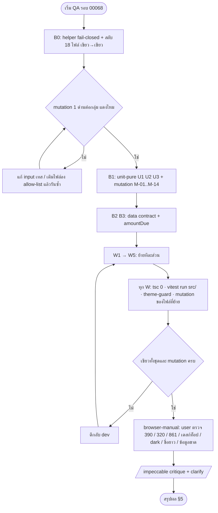

> **โมดูล:** 00068 — Buyer Order Page Redesign
> **ประเภทเอกสาร:** Test Case
> **เวอร์ชัน:** 0.1
> **วันที่จัดทำ:** 2026-10-05
> **สถานะ:** Draft (รอมติข้อขัดกันของเอกสารใน §7 ก่อนเขียนเทสที่ติดธง "รอมติ")
> **เจ้าของเอกสาร:** QA (ดู [[Feature-Docs-Ownership]]) · ร่างโดย `safepay-qa`

# Test Case: หน้าคำสั่งซื้อฝั่งผู้ซื้อ ฉบับปรับใหม่ (`/o/[token]` ฉบับล็อกอินแล้ว)

---

## 1. Overview

ชุดเคสนี้ trace กลับ Acceptance Criteria ทุกข้อ (`AC-BOP-01-1` .. `AC-BOP-14-6` = 77 ข้อ) ใน [[BRD]] และมติ D-1..D-9 (BRD §10) โดยใช้ชื่อโค้ดตาม [[SDS]] (`resolveBuyerNextAction`, `NextActionCard`, `ShopHeaderBar`, `ShopInfoCard`, `ConfirmBar`, `OrderSlip`, `HelpCard`, `useSlipUpload`) — **ไม่ใช้** ชื่อที่ [[UX-Design-Spec]] เสนอ (`resolveOrderActionBox` / `src/lib/order-action-box.ts`)

**ชนิดของเคส (tag ในหัวทุกเคส)**

| Tag | ความหมาย | รันที่ไหน | ใครรัน |
|-----|----------|-----------|--------|
| `[unit-pure]` | ฟังก์ชันบริสุทธิ์ใน `src/lib/**` (ไม่มี React/prisma/เวลา) — เทสพฤติกรรมจริง | `npx vitest run src/` | dev/QA |
| `[source-scan blocker]` | สแกนซอร์ส (vitest `environment: node` ไม่มี jsdom) ตรึงว่าด่านยังอยู่ในไฟล์ที่โค้ด **ไปอยู่จริง** — ต้องพิสูจน์ด้วย mutation (§2.7) | `npx vitest run src/` | dev/QA |
| `[browser-manual]` | ต้องเปิดหน้าจริง · user ตรวจเองตามแนวปฏิบัติ (memory: user ตรวจ visual ด้วยตาเอง) · QA เตรียม seed + checklist | เบราว์เซอร์/มือถือจริง | user |
| `[doc-check]` | ตรวจจากเอกสาร (ไม่มีโค้ด) | อ่านเอกสาร | QA |

- **เอกสารต้นทาง:** [[BRD]] (AC-BOP-*, §10 มติ D-1..D-9), [[SRS]] (TFR-001..014), [[SDS]] (§8 batch B0→W5 + รายการเทสที่ต้องย้าย), [[API]], [[DATABASE]], [[UX-Design-Spec]]
- **ขอบเขต in-scope:** หน้า `/o/[token]` ฉบับผู้ซื้อล็อกอิน+ผ่าน grant · ฟังก์ชันบริสุทธิ์ใหม่ 3 ไฟล์ · `getOrderByToken` (`ACTIVE_FORWARD_SHIPMENT`) · `PayoutAccountCard` (`amountDue`/`variant`) · การย้ายเทสสแกนซอร์สพร้อม mutation · regression ของงานรอบก่อน (SMS link auto-enter, `ReviewSheet`, `ConfirmStamp`, รีวิวเฉพาะ CONFIRMED)
- **ขอบเขต out-of-scope:** `GuestOrderView` (D-3 — เทสเฉพาะว่า "ไม่ถูกแตะ" และพฤติกรรม `amountDue` ตาม O-1) · `BookingGuestView`/LODGING (D-7) · ฝั่งผู้ขาย · endpoint ใหม่ (ไม่มี) · migration (ไม่มี)
- **สภาพแวดล้อม:**
  - unit/scan: local, `npx vitest run src/` (ระบุ `src/` กันดูด e2e) · 🛑 `npm test` ในเครื่องชี้ Supabase prod ต้อง override `DATABASE_URL` เป็น 5434 (CLAUDE.md snapshot 00067) และห้ามเทสลบข้อมูลไม่ scope (HR13)
  - browser-manual: `http://deepth.local:4000` (buyer), `http://seller.deepth.local:4000` (เทียบพัสดุ), seed ผ่าน Prisma บนฐาน dev (ไม่ใช่ prod) · ห้าม `localhost`
- **Playwright E2E:** **ยังไม่ได้ออกแบบ** — งานนี้เป็นงานเอกสาร ไม่ได้เขียน/รัน spec ใด ๆ · ยังไม่ได้ตรวจว่า `e2e/helpers/auth.ts` รองรับการ seed ออเดอร์ + login ฝั่งผู้ซื้อ (helper ที่ทราบรองรับ `createSeller`) · ต้องตัดสินก่อนว่าจะเขียน `e2e/buyer-order-page.spec.ts` หรือคง manual ตามความเห็น user
- **ข้อมูล seed ที่ browser-manual ต้องเตรียม (ผ่าน Prisma, scope ด้วย id ที่สร้างเอง, cleanup ปลายรัน):** ร้านขายของ (ONLINE_SALES) 1 · ร้านบริการ (SERVICE_QUEUE) 1 · ชื่อร้านยาวเป๊ะ `BT Premium Auto Xeon - สาขาสุขสวัสดิ์` (38 ตัว) · ร้านไม่มีโลโก้/ร้านใหม่ (`completedOrders=null`,`avgRating=null`) · ออเดอร์ตามตาราง D1 ด้านล่าง

**D1 — ชุดออเดอร์ seed (ใช้อ้างใน browser-manual)**

| Seed | ประเภทร้าน | สถานะ | วิธีชำระ | รับของ | อื่น ๆ |
|------|-----------|-------|----------|--------|--------|
| O-T1 | ขายของ | PENDING | TRANSFER | SHIPPED | มี `payoutSnapshot`, ยังไม่แนบสลิป, `paymentConfirmedAt=null` |
| O-T2 | ขายของ | PENDING | TRANSFER | SHIPPED | เหมือน O-T1 แต่ `payoutSnapshot=null` |
| O-T3 | ขายของ | PENDING | TRANSFER | SHIPPED | `paymentConfirmedAt` มีค่า |
| O-T4 | ขายของ | PENDING | TRANSFER | PICKUP | ยังไม่ confirm เงิน |
| O-P1 | ขายของ | PENDING | CASH | PICKUP | `handedOverAt=null` |
| O-P2 | ขายของ | PENDING | CASH | PICKUP | `handedOverAt` มีค่า |
| O-C1 | ขายของ | PENDING | COD | SHIPPED | ไม่มีพัสดุ |
| O-C2 | ขายของ | PENDING | CASH | SHIPPED | ไม่ใช่ PICKUP |
| O-S1 | ขายของ | SHIPPED | TRANSFER | SHIPPED | `OrderShipment` FORWARD CREATED (stage 3) + `paymentConfirmedAt` |
| O-S2 | ขายของ | SHIPPED | TRANSFER | SHIPPED | มีพัสดุ `problemAt` / อีกใบ `returnStartedAt` |
| O-S3 | ขายของ | SHIPPED | TRANSFER | SHIPPED | FORWARD CREATED **และ** RETURN CREATED (ใหม่กว่า) + dry-run ใหม่กว่า |
| O-S4 | ขายของ | SHIPPED | TRANSFER | SHIPPED | ไม่มีพัสดุเลย |
| O-S5 | ขายของ | SHIPPED | TRANSFER | SHIPPED | `ShipmentTracking` (ร้านแจ้งเลขเอง ไม่มี courierCode) |
| O-D1 | ขายของ | PENDING | TRANSFER | NO_SHIPPING | `accessUrl` เป็น https · O-D2 = `accessUrl` เป็น `javascript:...` |
| O-V1 | บริการ | PENDING | TRANSFER | — | มีนัด `SCHEDULED` + มัดจำ ฿2,000 รับแล้ว (ยอด ฿12,900) |
| O-V2 | บริการ | PENDING | TRANSFER | — | มีนัด + ตกลงมัดจำ ฿2,000 **ยังไม่รับ** |
| O-V3 | บริการ | PENDING | TRANSFER | — | มีนัด + รับมัดจำบางส่วน (ได้ ฿1,000 จาก ฿2,000) |
| O-V4 | บริการ | PENDING | TRANSFER | — | walk-in (ไม่มีนัด) ค้างชำระ · O-V5 = ชำระครบ |
| O-V6 | บริการ | CANCELLED | — | — | มีนัด |
| O-X1 | ขายของ | CONFIRMED | — | — | ผู้ซื้อกดเอง (`BUYER_CONFIRMED`) · O-X2 = `SYSTEM_CONFIRMED` |
| O-X3 | ขายของ | CANCELLED | — | — | `cancelInitiator` = buyer / shop / อื่น (3 ใบ) |
| O-X4 | ขายของ | RETURNED | — | — | — |

---

## 2. Test Scenarios

> **รูปแบบ:** เคสกลุ่มใหญ่ที่เหมือนกันหมด (gate migration §2.4) ใช้ block สั้น · ทุกเคสมี `Linked to` · ID เรียงเลข 001–046 unit · 050–088 scan/doc · 100–113 gate migration · 120–130 regression · 200–259 browser-manual
> ค่าเงื่อนไขของ `resolveBuyerNextAction` ใน §2.1 ใช้ตาราง 14 กิ่งของ [[SRS]] TFR-003 เป็นฐาน (เลข "row N" อ้างตารางนั้น)

### 2.1 [unit-pure] `resolveBuyerNextAction` / `resolveTransferAmount`

ไฟล์เทส: `src/lib/__tests__/buyer-next-action.test.ts` (ใหม่ — Batch B1-U1) · ทุกเคสในกลุ่มนี้ติดป้าย `[blocker]` ตาม BR-BOP-13 / `ui-boolean-needs-a-testable-home`

### TC-001 [unit-pure]: สถานะปิด → ไม่มีกล่องงาน (row 1)
- **Linked to:** AC-BOP-04-2, AC-BOP-09-1, AC-BOP-09-2, AC-BOP-09-3
- **Precondition:** อินพุตที่ถ้าเป็น PENDING จะได้ TRANSFER (TRANSFER, ยังไม่ confirm, ยอด > 0)
- **Steps:** เรียกด้วย `status` ∈ {CONFIRMED, CANCELLED, RETURNED, DRAFTED}
- **Expected Result:** ทุกตัว `primary='NONE'`, `transfer=false`, `statusVariant=null`, `payoutCard=needsPayoutAccount(paymentMethod)`

### TC-002 [unit-pure]: `open` ใช้ allow-list ไม่ใช่ deny-list
- **Linked to:** AC-BOP-04-1, AC-BOP-04-2
- **Precondition:** อินพุต TRANSFER-ready เหมือน TC-001
- **Steps:** `status` = `'PROCESSING'`, `'pending'` (ตัวพิมพ์เล็ก), `''`, `'ZZZ'`, `undefined as never`
- **Expected Result:** `primary='NONE'`, `transfer=false`, ไม่ throw (fail-closed ไม่เดาว่า "ยังเปิด")

### TC-003 [unit-pure]: ร้านขายของ TRANSFER ยังไม่ยืนยัน → กล่องโอน (row 4)
- **Linked to:** AC-BOP-05-1, AC-BOP-04-5
- **Precondition:** `PENDING`, `paymentMethod='TRANSFER'`, `paymentConfirmedAt=null`, `fulfillmentMode='SHIPPED'`, `hasShipment=false`, `totalAmount=2400`, `outstanding=null`
- **Steps:** เรียกฟังก์ชัน
- **Expected Result:** `primary='TRANSFER'`, `transfer=true`, `payoutCard=false`, `statusVariant=null`

### TC-004 [unit-pure]: ร้านยืนยันรับเงินแล้ว → ไม่ใช่กล่องโอน แต่ยังมีการ์ดบัญชี (row 5)
- **Linked to:** AC-BOP-05-7
- **Precondition:** เหมือน TC-003 แต่ `paymentConfirmedAt='2026-10-05T01:00:00Z'`
- **Steps:** (ก) `hasShipment=false` (ข) `hasShipment=true`
- **Expected Result:** `transfer=false`, `payoutCard=true` · (ก) `STATUS/PLAIN` · (ข) `SHIPMENT`

### TC-005 [unit-pure]: PICKUP + ต้องโอน → กล่องโอนมาก่อน (row 6)
- **Linked to:** AC-BOP-07-3, AC-BOP-04-5
- **Precondition:** `PENDING`, `fulfillmentMode='PICKUP'`, `TRANSFER`, ยังไม่ confirm, ยอด > 0
- **Steps:** เรียกฟังก์ชัน
- **Expected Result:** `primary='TRANSFER'`, `transfer=true`, `pickupCard=true` (ข้อมูลนัดรับยังแสดงเป็นการ์ดถัดไป)

### TC-006 [unit-pure]: PICKUP + เงินสด → กล่องนัดรับ ไม่มีโอน (row 7)
- **Linked to:** AC-BOP-07-1, AC-BOP-07-5
- **Precondition:** `PENDING`, `PICKUP`, `paymentMethod='CASH'`
- **Steps:** เรียกด้วย `'CASH'` และ `'เงินสด'`
- **Expected Result:** `primary='PICKUP'`, `transfer=false`, `payoutCard=false`, `pickupCard=true`

### TC-007 [unit-pure]: COD ไม่มีพัสดุ → กล่องสถานะ COD (row 8)
- **Linked to:** AC-BOP-07-4
- **Precondition:** `PENDING`, `paymentMethod` ตรง `isCODPayment` (เช่น `'COD'`, `'ปลายทาง'` ตามที่ regex รับ), `hasShipment=false`
- **Steps:** เรียกฟังก์ชัน
- **Expected Result:** `primary='STATUS'`, `statusVariant='COD'`, `transfer=false`, `payoutCard=false`

### TC-008 [unit-pure]: เงินสดไม่ใช่ PICKUP → กล่องสถานะ CASH ไม่มีช่องแนบสลิป (row 9 · D-5)
- **Linked to:** AC-BOP-07-5, มติ D-5
- **Precondition:** `PENDING`, `SHIPPED` fulfillment, `paymentMethod='CASH'`, `hasShipment=false`
- **Steps:** เรียกฟังก์ชัน
- **Expected Result:** `primary='STATUS'`, `statusVariant='CASH'`, `transfer=false` (นี่คือ **พฤติกรรมที่กลับด้าน** จาก `showSlipZone` เดิมที่ให้ CASH เห็นช่องสลิป — ต้องมี assert ชัดเจน)

### TC-009 [unit-pure]: SHIPPED มีพัสดุ → กล่องพัสดุ (row 10)
- **Linked to:** AC-BOP-06-1, AC-BOP-04-5
- **Precondition:** `SHIPPED`, `fulfillmentMode='SHIPPED'`, `hasShipment=true`, `TRANSFER` (ร้านยืนยันแล้ว)
- **Steps:** เรียกฟังก์ชัน
- **Expected Result:** `primary='SHIPMENT'`, `transfer=false`, `payoutCard=true`

### TC-010 [unit-pure]: SHIPPED ไม่มีข้อมูลพัสดุ → กล่องสถานะล้วน (row 11)
- **Linked to:** AC-BOP-06-6
- **Precondition:** `SHIPPED`, `hasShipment=false`
- **Steps:** เรียกฟังก์ชัน
- **Expected Result:** `primary='STATUS'`, `statusVariant='PLAIN'` (ไม่ใช่ SHIPMENT)

### TC-011 [unit-pure]: ดิจิทัล `NO_SHIPPING` (row 12)
- **Linked to:** AC-BOP-07-6
- **Precondition:** `PENDING`, `fulfillmentMode='NO_SHIPPING'`
- **Steps:** (ก) COD/CASH/ร้านยืนยันแล้ว (ข) TRANSFER ยังไม่ confirm ยอด > 0
- **Expected Result:** (ก) `STATUS/DIGITAL` (ข) `TRANSFER` ชนะ (ตามกฎ `transfer` ก่อน)

### TC-012 [unit-pure]: `paymentMethod = null` (row 13)
- **Linked to:** AC-BOP-05-1
- **Precondition:** `PENDING`, `paymentMethod=null`, ยังไม่ confirm, `totalAmount>0`
- **Steps:** เรียกฟังก์ชัน
- **Expected Result:** `needsPayoutAccount(null)=true` ⇒ `primary='TRANSFER'`, `transfer=true` (พฤติกรรมเดิมโดยตั้งใจ — ตรึงไว้กันถูกแก้เงียบ)

### TC-013 [unit-pure]: ยอดที่ต้องโอน = 0 → ไม่ใช่กล่องโอน (row 14)
- **Linked to:** AC-BOP-05-7
- **Precondition:** TRANSFER-ready แต่ (ก) `totalAmount=0, outstanding=null` (ข) ร้านบริการ `outstanding=0`
- **Steps:** เรียกฟังก์ชัน
- **Expected Result:** `transfer=false` ทั้งสอง (เงื่อนไข `amountDue > 0` ต้องมี)

### TC-014 [unit-pure]: ร้านบริการมีนัด + ยังค้าง → การ์ดนัดมาก่อน กล่องโอนเป็นการ์ดตามติด (row 2 · D-4)
- **Linked to:** AC-BOP-08-1, AC-BOP-08-5, มติ D-4
- **Precondition:** `isServiceShop=true`, `hasAppointment=true`, `PENDING`, TRANSFER, `totalAmount=12900`, `outstanding=10900`, `paymentConfirmedAt=null`
- **Steps:** เรียกฟังก์ชัน
- **Expected Result:** `primary='APPOINTMENT'`, `transfer=true`, `payoutCard=false`, `appointmentCard=true`

### TC-015 [unit-pure]: ร้านบริการมีนัด ค้าง 0 → ไม่มีกล่องโอน (row 3)
- **Linked to:** AC-BOP-08-5, AC-BOP-05-7
- **Precondition:** เหมือน TC-014 แต่ `outstanding=0`
- **Steps:** เรียกฟังก์ชัน
- **Expected Result:** `primary='APPOINTMENT'`, `transfer=false`, `payoutCard=true`

### TC-016 [unit-pure]: ร้านบริการไม่มีนัด (walk-in)
- **Linked to:** AC-BOP-08-3, AC-BOP-04-5
- **Precondition:** `isServiceShop=true`, `hasAppointment=false`, `PENDING`, TRANSFER
- **Steps:** (ก) `outstanding=10900` (ข) `outstanding=0`
- **Expected Result:** (ก) `TRANSFER` ยอดโอน = 10900 (ไม่ใช่ `totalAmount`) · (ข) `STATUS/PLAIN` · ทั้งสองไม่มี `APPOINTMENT`

### TC-017 [unit-pure]: ลำดับความสำคัญ นัด > โอน > นัดรับ > พัสดุ > สถานะ
- **Linked to:** AC-BOP-04-5
- **Precondition:** ร้านบริการ + `hasAppointment` + `PICKUP` + `hasShipment=true` + TRANSFER ยังไม่ confirm
- **Steps:** ไล่ถอดเงื่อนไขทีละชั้น (ถอดนัด → ถอดโอน → ถอด PICKUP → ถอดพัสดุ)
- **Expected Result:** `APPOINTMENT` → `TRANSFER` → `PICKUP` → `SHIPMENT` → `STATUS` ตามลำดับ · ที่ชั้นแรก `pickupCard=true` และ `transfer=true` พร้อมกัน

### TC-018 [unit-pure]: ธง `appointmentCard` ไม่ผูกกับ `primary` (C-4)
- **Linked to:** AC-BOP-08-4, AC-BOP-04-2
- **Precondition:** `hasAppointment=true`
- **Steps:** `status` = CANCELLED / CONFIRMED / RETURNED / PENDING
- **Expected Result:** ทุกสถานะ `appointmentCard=true`; สถานะปิด `primary='NONE'` · `hasAppointment=false` ⇒ `appointmentCard=false`

### TC-019 [unit-pure]: `APPOINTMENT` ต้องเป็นร้านบริการเท่านั้น
- **Linked to:** AC-BOP-04-5
- **Precondition:** `isServiceShop=false`, `hasAppointment=true`
- **Steps:** เรียกฟังก์ชัน
- **Expected Result:** `primary≠'APPOINTMENT'` แต่ `appointmentCard=true`

### TC-020 [unit-pure]: `SHIPMENT` ต้องเช็ค `fulfillmentMode`
- **Linked to:** AC-BOP-06-1, AC-BOP-07-6
- **Precondition:** `hasShipment=true`
- **Steps:** `fulfillmentMode` = `'NO_SHIPPING'` และ `'PICKUP'`
- **Expected Result:** `primary≠'SHIPMENT'` (NO_SHIPPING → `STATUS/DIGITAL`; PICKUP → `PICKUP`)

### TC-021 [unit-pure]: ธง `payoutCard` คงการ์ดบัญชี (settled/ยกเลิก) นอกกล่องหลัก (C-5)
- **Linked to:** AC-BOP-05-7, AC-BOP-09-2
- **Precondition:** —
- **Steps:** ตาราง `status` × `paymentMethod` (TRANSFER/null/COD/CASH) × (transfer จริง/ไม่จริง)
- **Expected Result:** `payoutCard = needsPayoutAccount(paymentMethod) && !transfer` ทุกแถว (CANCELLED+TRANSFER ⇒ true เพื่อคงด่าน "ห้ามโอน" ของ `PayoutAccountCard`; COD/CASH ⇒ false)

### TC-022 [unit-pure]: ผลคูณทุกมิติ (property) — ครบ สถานะ × วิธีชำระ × vertical × รับของ × มีนัด × พัสดุ × confirm × outstanding
- **Linked to:** AC-BOP-04-1, AC-BOP-04-2, AC-BOP-04-5, AC-BOP-05-7, AC-BOP-07-4, AC-BOP-07-5
- **Precondition:** สร้างอินพุตจากผลคูณ: status {PENDING, SHIPPED, CONFIRMED, CANCELLED, RETURNED, DRAFTED, 'ZZZ'} × paymentMethod {TRANSFER, null, COD, CASH, 'เงินสด', 'ค่าที่ระบบไม่รู้จัก'} × isServiceShop {t,f} × hasAppointment {t,f} × fulfillmentMode {SHIPPED, NO_SHIPPING, PICKUP} × hasShipment {t,f} × paymentConfirmedAt {null, มีค่า} × outstanding {null, 0, >0} × totalAmount {0, >0}
- **Steps:** วนเรียกทุกชุด ตรวจ invariant
- **Expected Result:** (i) ไม่ throw (ii) สถานะนอก {PENDING,SHIPPED} ⇒ `primary='NONE'` และ `transfer=false` (iii) `transfer` ⇒ PENDING ∧ `needsPayoutAccount` ∧ `!paymentConfirmedAt` ∧ `amountDue>0` และ `primary∈{TRANSFER,APPOINTMENT}` (iv) COD/CASH ⇒ ไม่เคย `transfer` (v) `statusVariant≠null` ⇔ `primary='STATUS'` (vi) `payoutCard ⇒ !transfer` (vii) `ร้านขายของ ⇒ primary≠'APPOINTMENT'` · **มิติ guest/login:** ฟังก์ชันไม่มีอินพุตนี้ (เรียกเฉพาะหลังผ่าน grant) — ครอบด้วย TC-065 และ TC-085

### TC-023 [unit-pure]: `resolveTransferAmount` (D-4)
- **Linked to:** AC-BOP-05-1, มติ D-4
- **Precondition:** —
- **Steps:** `{totalAmount:2400, outstanding:null}` · `{12900, 10900}` · `{12900, 0}` · `{12900, 12900}`
- **Expected Result:** 2400 · 10900 · **0** (ไม่ตกกลับไป `totalAmount` — ต้องใช้ `??` ไม่ใช่ `||`) · 12900

### TC-024 [unit-pure]: ย้ายเคส `showSlipZone` ครบ 9 เคส + เคส CASH ใหม่ (TD-009)
- **Linked to:** AC-BOP-07-5, AC-BOP-12-1 (inventory #22), มติ D-5
- **Precondition:** `order-display.test.ts` เดิมมี 9 เคสของ `showSlipZone`
- **Steps:** แปลงทีละเคสเป็นเคสของ `resolveBuyerNextAction.transfer` ใน `buyer-next-action.test.ts` · เพิ่มเคส CASH · ลบ `showSlipZone`
- **Expected Result:** จำนวนเคสไม่ลดลง · ทุกเคสเดิมให้ผลเท่าเดิม **ยกเว้น** เคส CASH (กลับด้านโดยมติ D-5 ต้องเขียนเหตุผลกำกับ) · `rg showSlipZone src/` = 0 (ตรึงที่ TC-054)

### 2.2 [unit-pure] ฟังก์ชันบริสุทธิ์อื่น

### TC-025 [unit-pure]: `buildShopSummaryLine` 4 เคสตามตาราง TFR-001
- **Linked to:** AC-BOP-02-1, AC-BOP-02-2, AC-BOP-02-3
- **Precondition:** ไฟล์ `src/lib/__tests__/buyer-order-summary.test.ts` (B1-U2)
- **Steps:** `{4.7, 38}` · `{null, 38}` · `{4.7, null}` · `{null, null}`
- **Expected Result:** `"4.7 ดาว · ออเดอร์สำเร็จ 38 ครั้ง"` · `"ออเดอร์สำเร็จ 38 ครั้ง"` · `"4.7 ดาว"` · `null`

### TC-026 [unit-pure]: ค่า null/≤0 ไม่กลายเป็นเลข 0
- **Linked to:** AC-BOP-02-2, AC-BOP-02-3, BR-BOP-14
- **Precondition:** —
- **Steps:** `avgRating` = null, 0, -1 ร่วมกับ `completedOrders` = 38 / null
- **Expected Result:** ผลลัพธ์ไม่มีคำว่า "0 ดาว" และไม่มีตัวอักษร `0` ที่มาจากค่า null/≤0 (`"ออเดอร์สำเร็จ 38 ครั้ง"` หรือ `null`)

### TC-027 [unit-pure]: `completedOrders = 0` ที่ไม่ใช่ null — **รอมติ**
- **Linked to:** AC-BOP-02-3, BR-BOP-14
- **Precondition:** [[SRS]] TFR-001 กำหนดเฉพาะ "มีค่า" กับ "null" · ไม่ได้บอกว่าค่า `0` จริง ๆ (ร้านที่มีข้อมูลแล้วแต่ออเดอร์สำเร็จ 0) แสดงอย่างไร
- **Steps:** `{avgRating:null, completedOrders:0}` และ `{4.7, 0}`
- **Expected Result:** **ยังไม่ได้กำหนดในเอกสาร** — ต้องให้ SA ตัดสินว่าเป็น `null` (ไม่แสดง) หรือ "ออเดอร์สำเร็จ 0 ครั้ง" ก่อนเขียน assert · ดู §7 ข้อ 12 · ตรวจเพิ่มว่า `page.tsx` ส่ง `0` หรือ `null` ให้ร้านใหม่

### TC-028 [unit-pure]: รูปแบบตัวเลขบรรทัดย่อ
- **Linked to:** AC-BOP-02-1, AC-BOP-02-5
- **Precondition:** —
- **Steps:** `avgRating` = 4 (หลัง `Math.round(x*10)/10`), 4.66, 5 · `completedOrders` = 38, 1234, 1000000
- **Expected Result:** `4.0`, `4.7`, `5.0` · `38`, `1,234`, `1,000,000` (`toLocaleString('th-TH')`) · หน่วย "ดาว" มาจากค่าคงที่ `SHOP_RATING_UNIT` ตัวเดียว

### TC-029 [unit-pure]: `buildSlipMoneyView().totalLabel`
- **Linked to:** AC-BOP-10-3
- **Precondition:** —
- **Steps:** ตาราง `status` × `money` (null/มี) × `paymentConfirmedAt` (null/มี)
- **Expected Result:** `'ยอดที่ต้องชำระ'` เมื่อ PENDING ∧ `money==null` ∧ `paymentConfirmedAt==null` · `'ยอดรวม'` เมื่อ `money!=null` หรือสถานะอื่น · **กรณี PENDING ∧ `money==null` ∧ `paymentConfirmedAt` มีค่า — รอมติ** ([[SRS]] ย้ายตรรกะเดิมซึ่งตอบ "ยอดที่ต้องชำระ" ส่วน [[UX-Design-Spec]] สั่งเติม `!paymentConfirmedAt` ให้ตอบ "ยอดรวม" เพื่อไม่ขัดกับป้าย "ร้านยืนยันรับเงินแล้ว") — ดู §7 ข้อ 5 · อย่าล็อกผลก่อนมติ

### TC-030 [unit-pure]: `buildSlipMoneyView().paidChip`
- **Linked to:** AC-BOP-10-5
- **Precondition:** —
- **Steps:** (ก) ขายของ `money=null`, `paymentConfirmedAt` มีค่า (ข) ขายของ ยังไม่ confirm (ค) ร้านบริการ `money!=null` (`paymentConfirmedAt` ใด ๆ) (ง) CANCELLED + confirm (จ) CONFIRMED + confirm
- **Expected Result:** (ก) true (ข) false (ค) **false เสมอ** (ง) **รอมติ** ([[SRS]] ไม่เช็ค status → true; [[UX-Design-Spec]] ให้แสดงเมื่อ "ไม่ใช่ CANCELLED" → false) (จ) true · ไม่มีกรณีใดคืนข้อความ "ชำระแล้ว"/"จ่ายแล้ว"

### TC-031 [unit-pure]: `buildSlipMoneyView().serviceLines` (ร้านบริการ 3 บรรทัด)
- **Linked to:** AC-BOP-10-6, AC-BOP-10-7
- **Precondition:** `money` จาก `computeOrderMoney` เดิม (มี `depositReceived` ใหม่)
- **Steps:** (ก) ยอด 12900 มัดจำตกลง 2000 รับแล้ว 2000 (ข) ตกลงมัดจำ 2000 ยังไม่รับ (ค) ตกลง 2000 รับ 1000 (ง) ไม่มีมัดจำ (จ) ชำระครบ (outstanding=0)
- **Expected Result:** (ก) total 12900 · มัดจำ 2000 พร้อมสถานะ "รับแล้ว" · ค้าง 10900 (ข) บรรทัดมัดจำ **ไม่มี** สถานะ "ร้านยืนยันรับแล้ว" (ค) ป้าย "ร้านยืนยันรับแล้ว" ต้องไม่อยู่ข้างตัวเลข 2000 — ตัวเลขที่ยืนยันต้องเป็นยอดที่รับจริง (1000) · รูปแบบของ `deposit.received` (boolean หรือจำนวน) **[[SRS]] ไม่ระบุชัด รอมติ §7 ข้อ 10** (ง) `deposit=null` (จ) ไม่มีเลข `฿0` ของยอดค้าง — บรรทัดที่ 3 ต่างกันระหว่าง BRD ("ยังค้างชำระ ฿X") กับ UX ("ชำระเงินแล้ว") **รอมติ §7 ข้อ 11** · ตัวเลขทั้งสามต้องเท่ากับ `computeOrderMoney` ทุกค่า (ไม่มีการบวก `entries` ใหม่)

### TC-032 [unit-pure]: ผลลัพธ์ของ pure function ไม่มีคำต้องห้าม
- **Linked to:** AC-BOP-10-5, AC-BOP-05-5, AC-BOP-02-4, BR-BOP-06
- **Precondition:** —
- **Steps:** วนผลของ `buildSlipMoneyView`, `buildShopSummaryLine`, `buyerShipmentStatus` ทุกชุดอินพุตจาก TC-025..031/036
- **Expected Result:** ไม่มีข้อความ "ชำระแล้ว", "จ่ายแล้ว", "ผู้ซื้อยืนยันรับของ", "ร้านตรวจแล้ว"

### TC-033 [unit-pure]: `buildBuyerShipmentView` allow-list + ไม่มี PII
- **Linked to:** AC-BOP-13-2
- **Precondition:** ไฟล์ `src/lib/__tests__/order-shipment-view.test.ts` (B2)
- **Steps:** ป้อนออเดอร์จำลองที่มีฟิลด์เกิน (ที่อยู่/เบอร์/ชื่อผู้ซื้อ, `id`, `labelUrl`, `isDryRun`, `direction`, ฟิลด์ลึกใน `shipments[0]`) แล้วเทียบ key ทุกระดับของผลลัพธ์
- **Expected Result:** keys ของผลลัพธ์ตรงชุด `{ shipmentTracking:{provider,trackingNo,courierCode}|null, carrierStatus, problemAt, returnStartedAt, returnedAt, returnDispatchedAt }` เท่านั้น · ไม่มีค่าฟิลด์เกินปรากฏที่ใดในผลลัพธ์

### TC-034 [unit-pure]: ลำดับ "ร้านแจ้งเองก่อน แล้ว fallback iShip"
- **Linked to:** AC-BOP-06-1, AC-BOP-06-5
- **Precondition:** —
- **Steps:** (ก) มีทั้ง `ShipmentTracking` และ `shipments[0]` (ข) มีแต่ `shipments[0]` (ค) มีแต่ `ShipmentTracking` (ง) ไม่มีเลย
- **Expected Result:** (ก) ใช้ของร้านแจ้งเอง (ข) provider=`courierName`, `courierCode` ถูกส่ง (ค) `courierCode=null` (ความจริงของแถวนั้น) (ง) `shipmentTracking=null` และ `carrierStatus` ฯลฯ เป็น `null`

### TC-035 [unit-pure]: วันที่เป็น ISO string, null คง null
- **Linked to:** AC-BOP-13-2
- **Precondition:** —
- **Steps:** ป้อน `Date` ใน `problemAt/returnStartedAt/returnedAt/returnDispatchedAt` และ `null`
- **Expected Result:** ผลเป็น ISO string / `null` ไม่มี `Date` object หลุดข้ามเส้น RSC

### TC-036 [unit-pure]: `buyerShipmentStatus` ตรงกับ `GuestOrderView` ทุกขั้น
- **Linked to:** AC-BOP-06-1, AC-BOP-06-3, AC-BOP-06-4, AC-BOP-06-5
- **Precondition:** อ้างอาร์กิวเมนต์ของ `GuestOrderView.tsx` (`codReceivedAt: null`, `hasShipment = shipmentTracking != null`)
- **Steps:** ตาราง stage ทั้ง 4 ของ `SHIPMENT_STAGES` + มีปัญหา (`problemAt`) + ตีกลับ (`returnStartedAt`/`returnedAt`/`returnDispatchedAt`) · เทียบผลกับการเรียก `deriveShippingStage` + `resolveOrderStatusHeadline` ตรง ๆ แบบ guest
- **Expected Result:** `headline`/`stage` เท่ากับฝั่ง guest ทุกแถว · `statusPill=null` เมื่อซ้ำกับ headline และไม่ null เมื่อไม่ซ้ำ

### TC-037 [unit-pure]: SHIPPED + stage DONE — headline กับ `statusPill` ต้องไม่ขัดกัน — **รอมติ**
- **Linked to:** AC-BOP-06-1
- **Precondition:** [[UX-Design-Spec]] F7/Q13 ระบุว่า `resolveOrderStatusHeadline` อาจให้ headline "ส่งถึงแล้ว" + `statusPill` "กำลังจัดส่ง" (ยังไม่ได้รันยืนยัน)
- **Steps:** (1) รันฟังก์ชันจริงด้วย `status='SHIPPED'`, stage ขั้น 4 และบันทึกผล (2) ตัดสินว่าขัดกันหรือไม่
- **Expected Result:** ถ้าขัดกันจริง ต้องแก้ที่ `order-status-headline.ts` (ไม่ใช่ที่หน้าจอ) แล้วเพิ่ม assert "headline และ pill ไม่ระบุขั้นต่างกัน" · ค่าที่คาดยังไม่ได้ตัดสินในเอกสาร

### TC-038 [unit-pure]: คำ "รอเงิน COD" ที่ขึ้นให้ผู้ซื้อ — **รอมติ O-3**
- **Linked to:** AC-BOP-06-1, AC-BOP-07-4
- **Precondition:** ออเดอร์ COD, พัสดุส่งถึงแล้ว (stage `AWAITING_COD`), ร้านยังไม่กดรับเงิน
- **Steps:** เรียก `buyerShipmentStatus`
- **Expected Result:** ตามมติ O-3 — ถ้ารับ parity กับ guest: ตรึงผลปัจจุบัน ("รอเงิน COD") พร้อมคอมเมนต์ว่าเป็นหนี้ที่รู้ · ถ้าเพิ่ม `audience`: headline เป็นภาษาฝั่งผู้ซื้อ · เอกสารยังไม่ตัดสิน

### TC-039 [unit-pure]: ไม่มีพัสดุ → ไม่วาดแถบ
- **Linked to:** AC-BOP-06-6
- **Precondition:** `SHIPPED`, `shipmentTracking=null`
- **Steps:** เรียก `buyerShipmentStatus`
- **Expected Result:** `hasShipment=false`, headline = สถานะออเดอร์ล้วน (`statusLabel`), ไม่มีธงให้เรนเดอร์ `ParcelTimeline`

### TC-040 [unit-pure]: `shouldShowOrderOrigin` กันซ้ำเมื่อร้านมีหลายเพจ (ของเดิม)
- **Linked to:** AC-BOP-03-3, AC-BOP-12-1 (inventory #8)
- **Precondition:** เทสเดิมใน `order-origin-row.test.ts`
- **Steps:** (ก) เพจเดียวและเป็นเพจต้นทาง (ข) หลายเพจ (ค) ไม่มี `originPage`
- **Expected Result:** (ก) false (ข) true (ค) false — เทสเดิมต้องเขียวโดยไม่แก้ expect

### TC-041 [unit-pure]: `formatOrderNo` แสดงเลขเต็ม ไม่ตัด
- **Linked to:** AC-BOP-10-1, BR-BOP-07
- **Precondition:** —
- **Steps:** `formatOrderNo(publicToken, createdAtIso)` ด้วยตัวอย่างจริง (เช่นรูป `DP256910A6E2C3B9`)
- **Expected Result:** คืนสตริงเต็มตามรูปแบบเดิมทุกตัวอักษร ไม่มี "…" (ถ้ายังไม่มีเทสของฟังก์ชันนี้ ให้เพิ่ม)

### TC-042 [unit-pure]: `resolveVerifyBadge` — ระดับ 0 ไม่มีป้าย
- **Linked to:** AC-BOP-03-2, BR-BOP-01
- **Precondition:** เทสเดิมของ `verify-badge.ts`
- **Steps:** ระดับ 0, 1, 2, 3
- **Expected Result:** ระดับ 0 = `null` · ระดับ 1 คำ "ยืนยันเบอร์แล้ว" (และสีตาม SSOT — ไม่ใช่เขียวที่ UX F3 ห้าม)

### TC-043 [unit-pure]: `paymentMethodLabel` ไม่เรียกเงินสดว่าโอน
- **Linked to:** AC-BOP-07-4, AC-BOP-07-5
- **Precondition:** เทสเดิม `payment-method-label.test.ts`
- **Steps:** COD / CASH / `'เงินสด'` / TRANSFER / ค่าไม่รู้จัก / null
- **Expected Result:** `'ชำระเมื่อได้รับสินค้า'` / `'เงินสด'` / `'เงินสด'` / `'โอนเข้าบัญชี'` / `'โอนเข้าบัญชี'` / `'โอนเข้าบัญชี'` · CASH ไม่มีคำว่า "โอน"

### TC-044 [unit-pure]: `computeAutoConfirmDeadline` = มอบ + `PICKUP_AUTOCONFIRM_HOURS`
- **Linked to:** AC-BOP-07-2
- **Precondition:** เทสเดิมของ `order-pickup.ts`
- **Steps:** `handedOverAt` ตัวอย่าง → ผลลัพธ์
- **Expected Result:** เวลา = มอบ + 48 ชม. โดยค่า 48 มาจากค่าคงที่ ไม่ใช่ตัวเลขซ้ำ (ตรึงที่ TC-071)

### TC-045 [unit-pure]: `isHttpUrl` กัน `javascript:`/`data:`
- **Linked to:** AC-BOP-07-6, AC-BOP-12-1 (inventory #27)
- **Precondition:** —
- **Steps:** `https://x.co`, `http://x.co`, `javascript:alert(1)`, `data:text/html,x`, `ftp://x`, `''`, `null`
- **Expected Result:** true, true, false, false, false, false, false

### TC-046 [unit-pure]: `buyerShipmentStatus` ค่าที่ไม่รู้จักไม่ throw
- **Linked to:** AC-BOP-06-4, [[SDS]] §4.2 (fail-closed)
- **Precondition:** —
- **Steps:** `carrierStatus='ZZZ'`, `status='ZZZ'`, ฟิลด์ทั้งหมด null
- **Expected Result:** ไม่ throw · คืน headline จากสถานะออเดอร์ ไม่มีกล่องเตือนที่ไม่มีเหตุ

### TC-047 [unit-pure]: `isConfirmReady` (น้ำหนักปุ่มล่างจอ) — **ทำเมื่อ Q2 อนุมัติเท่านั้น**
- **Linked to:** AC-BOP-11-1 ([[UX-Design-Spec]] Q2 — เป็นพฤติกรรมใหม่ที่ BRD/SDS ไม่มี)
- **Precondition:** ได้มติให้ขยาย `isFinalStepReady` ครอบทุก vertical
- **Steps:** SHIPPED + ขนส่งแจ้งส่งถึง · PICKUP + `handedOverAt` · ดิจิทัลมี `accessUrl` · ร้านบริการถึงเวลา · ทุกกรณีอื่น · มี dispute เปิดอยู่
- **Expected Result:** contained เฉพาะสี่กรณีแรก · tonal ที่เหลือและเมื่อมี dispute · **ไม่มีกรณี disabled** (BR-RSV-18 + เทสเดิมใน `public-order-timeline-a11y`) · ถ้าไม่อนุมัติ Q2 เคสนี้ตัดทิ้ง

### 2.3 [source-scan blocker] เคสใหม่ (ตรึงด่านของ redesign)

> ทุกเคสในกลุ่มนี้อ่านซอร์สผ่าน `readBuyerOrderSource()` / `readBuyerOrderFile(name)` ของ helper `src/lib/__tests__/helpers/buyer-order-sources.ts` (TD-006) · ต้องผ่าน mutation ใน §2.7 · เคสที่ดูตำแหน่งสัมพัทธ์ (`indexOf`) ต้องอ่านไฟล์เดียวที่ทั้งสองอยู่ (shell)

### TC-050 [source-scan blocker]: `getOrderByToken` ใช้ `ACTIVE_FORWARD_SHIPMENT`
- **Linked to:** AC-BOP-06-7, AC-BOP-06-5, TFR-014
- **Precondition:** ขยาย `shipment-direction.test.ts` (B1-U3)
- **Steps:** สแกน `order.service.ts` ส่วน `getOrderByToken` → ต้องมี `where: ACTIVE_FORWARD_SHIPMENT` · ห้ามมีรูป `where: { status: 'CREATED' }` เปล่า ๆ ที่ไหนใน `src/` (ด่านเดิมจับได้เฉพาะรูป `status: { not: 'CANCELLED' }`)
- **Expected Result:** เขียวเมื่อใช้ constant · แดงเมื่อถอดหรือคืนรูปเดิม (M-01) · พฤติกรรมจริงกับ DB ตรวจที่ TC-208/TC-209 (browser-manual) — **ยังไม่ได้ออกแบบเทสพฤติกรรมอัตโนมัติกับ DB** ([[SRS]] §8 ระบุ "เทสบนข้อมูลจำลองสองเคส" แต่ไม่ได้ระบุกลไก — vitest ไม่มี DB ที่ปลอดภัยตาม HR13)

### TC-051 [source-scan blocker]: `ORDER_TWO_COL_MQ = 861px` และไม่มีเลขซ้ำ
- **Linked to:** AC-BOP-11-9, AC-BOP-14-2, C-2
- **Precondition:** `content-width.ts`
- **Steps:** (ก) `ORDER_TWO_COL_MQ === '@media (min-width:861px)'` (ข) ไฟล์ทั้งโฟลเดอร์ (shell + การ์ดย่อย + `ConfirmBar`) ไม่มี `@media (min-width:1200px)`/`(min-width:861px)` เขียนตรง ๆ — ต้องอ้างตัวแปร `[ORDER_TWO_COL_MQ]` เท่านั้น
- **Expected Result:** เขียว · แดงเมื่อเปลี่ยนค่าเป็น 1200 หรือมีใครเขียนตัวเลขซ้ำ (M-10)

### TC-052 [source-scan blocker]: `PayoutAccountCard` — `amountDue` บังคับ และ QR ใช้ `amountDue` (D-4)
- **Linked to:** AC-BOP-05-2, มติ D-4, TD-004
- **Precondition:** B3
- **Steps:** สแกน `PayoutAccountCard.tsx`: (ก) props มี `amountDue: number` ไม่มี `?` ไม่มี default (ข) `buildPromptPayPayload({ amount: amountDue })` ไม่ใช้ `totalAmount` (ค) แถว `isSettled` ("ยอดที่ชำระ") ใช้ `totalAmount` เดิม (ง) บรรทัด `isSettled`/`{!isSettled && qrPayload && (` ไม่ถูกแก้ (ร่วมกับ G2/TC-101)
- **Expected Result:** เขียว · แดงเมื่อใช้ `totalAmount` ใน QR / ทำให้ prop optional / ให้ "ยอดค้าง" ไปอยู่ในป้ายที่แปลว่า "จ่ายแล้ว" (M-08)

### TC-053 [source-scan blocker]: ผู้เรียก `PayoutAccountCard` ทุกจุดส่ง `amountDue`
- **Linked to:** AC-BOP-05-2, มติ D-4, O-1
- **Precondition:** B3
- **Steps:** สแกนผู้เรียก: `NextActionTransfer` (และ shell ถ้ายังเรียกตรง) ส่ง `amountDue={resolveTransferAmount(...)}` ไม่ใช่ `order.totalAmount` · `GuestOrderView` ส่ง `amountDue` (ค่าตามมติ O-1)
- **Expected Result:** เขียว · แดงเมื่อฝั่งล็อกอินส่ง `totalAmount` (M-08) · **ค่าที่ guest ส่ง รอมติ O-1** ((ก) `order.totalAmount` คงเดิม หรือ (ข) `order.money?.outstanding ?? order.totalAmount`) — เทสต้องตรึงตามมติที่ได้ ไม่ใช่เดา

### TC-054 [source-scan blocker]: D-5 — ถอด `showSlipZone` และช่องแนบสลิปผูกกับ `action.transfer` ตัวเดียว
- **Linked to:** AC-BOP-07-5, AC-BOP-05-7, มติ D-5
- **Precondition:** W2
- **Steps:** (ก) `rg showSlipZone src/` = 0 (ข) บล็อกแนบสลิปใน `NextActionTransfer` ถูกเรนเดอร์ด้วยเงื่อนไข `action.transfer` เท่านั้น ไม่มี `isCODPayment`/`isCashPayment`/`status==='PENDING'` เขียนซ้ำใน JSX
- **Expected Result:** เขียว · แดงเมื่อคืน `showSlipZone` หรือเขียนเงื่อนไขซ้ำ (M-09)

### TC-055 [source-scan blocker]: ไม่มีนิยามที่สองของ "กล่องไหนแสดง" ใน JSX
- **Linked to:** AC-BOP-04-5, BR-BOP-13
- **Precondition:** W2
- **Steps:** สแกน shell + `NextAction*.tsx` + `NextActionCard.tsx`: `resolveBuyerNextAction(` ถูกเรียก **ครั้งเดียว** (ใน shell) · ไม่มี `needsPayoutAccount(`/`isCODPayment(`/`isCashPayment(`/`isPickupOrder(` ใช้ตัดสินการแสดง (ใช้เพื่อเลือกคำป้ายผ่าน `paymentMethodLabel` ได้) · switch ที่ `NextActionCard` อ่านจาก `action.primary`
- **Expected Result:** เขียว · แดงเมื่อมีการ์ดตัดสินเอง · **allow-list ไฟล์ที่ยกเว้น (เช่น `PayoutAccountCard`) ให้ dev ระบุเหตุผลในเทส** (เอกสารยังไม่ระบุ)

### TC-056 [source-scan blocker]: ไฟล์ lib ใหม่บริสุทธิ์จริง
- **Linked to:** AC-BOP-04-5, BR-BOP-13, TFR-003
- **Precondition:** B1, B2
- **Steps:** สแกน `buyer-next-action.ts`, `buyer-order-summary.ts`, `order-shipment-view.ts`: ไม่ import `react`/`@prisma/client`/`@/lib/prisma`/`@mui/*` · ไม่มี `Date.now(`/`new Date(` (ยกเว้นแปลง ISO ใน `order-shipment-view` ตามที่ TC-035 กำหนด — ให้เทสระบุ allow-list) · ไม่มี `console.`
- **Expected Result:** เขียว · แดงเมื่อเพิ่ม import/เวลา

### TC-057 [source-scan blocker]: กติกา slot — การ์ดย่อยห้ามถือ `order:` เอง
- **Linked to:** AC-BOP-14-2, TFR-013, [[SDS]] §3.3
- **Precondition:** W3 (เขียน `public-order-two-column` ใหม่)
- **Steps:** (ก) การ์ดย่อยทุกตัวไม่มี `order:` (ข) shell กำหนด `order` ต่อเนื่อง ไม่ซ้ำ (ค) slot ที่ว่างมี `'&:empty': { display:'none' }` (ง) กล่องงาน/หัวร้านเป็นลูกคนแรกของ flow ทุกความกว้าง — ที่ `[ORDER_TWO_COL_MQ]` ไม่ตกไปคอลัมน์รอง
- **Expected Result:** เขียว · แดงเมื่อการ์ดย่อยเพิ่ม `order:` หรือ `order` ซ้ำ (M-17) · เทสเดิมเรื่อง hero+ราง "เฉพาะจอกว้าง" ต้องเขียนใหม่ (hero ถูกถอด)

### TC-058 [source-scan blocker]: ลำดับในหน้า — หัวร้านก่อน กล่องงานเป็นการ์ดแรก ไม่มีอะไรคั่น
- **Linked to:** AC-BOP-01-1, AC-BOP-04-1
- **Precondition:** W3 (shell)
- **Steps:** `indexOf` ใน shell: `ShopHeaderBar` < `NextActionCard` < `OrderSlip` < โซนรีวิว < `ShopInfoCard` < `HelpCard` · ไม่มี JSX อื่น (banner/กล่อง) ระหว่าง `ShopHeaderBar` กับ `NextActionCard` · ไม่มี `<ShopCover` / `CoverActions` ในหน้าล็อกอิน
- **Expected Result:** เขียว · แดงเมื่อสลับลำดับหรือแทรก banner (M-18)

### TC-059 [source-scan blocker]: `<h1>` ตัวเดียวและเป็นชื่อร้าน
- **Linked to:** AC-BOP-01-6
- **Precondition:** W3
- **Steps:** นับ `<h1`/`component="h1"`/`variant="h1"` ทั้งโฟลเดอร์ (ยกเว้นไฟล์ guest/`SmsAutoEnter` ที่เป็นหน้าอื่น) · ต้องอยู่ที่ชื่อร้านใน `ShopHeaderBar` · เลขคำสั่งซื้อใน `OrderSlip` ไม่เป็น heading
- **Expected Result:** ตรง 1 ตัวใน tree ของหน้านี้ · แดงเมื่อเลขคำสั่งซื้อยังเป็น `h1` (M-16)

### TC-060 [source-scan blocker]: `ShopHeaderBar` — ปุ่มแชท/ตัดชื่อ/พื้นที่กด
- **Linked to:** AC-BOP-01-4, AC-BOP-01-5
- **Precondition:** W3
- **Steps:** สแกน `ShopHeaderBar.tsx`: (ก) ลิงก์ `/messages/${shopId}` ไม่ใช่ `userId` (ข) คอลัมน์ชื่อมี `minWidth:0` + line-clamp + `title`/ชื่อเต็ม ครบชุดตาม `flex-header-truncation` (ค) ปุ่มแชท `minHeight/minWidth ≥ 44` (ง) ใช้ `LinkButton`/`<a>` ไม่ใช่ `component={Link}` ใน server component
- **Expected Result:** เขียว · แดงเมื่อลิงก์ด้วย `userId` หรือถอด `minWidth:0` (M-15)

### TC-061 [source-scan blocker]: ลำดับโลโก้และ fallback อักษรแรก
- **Linked to:** AC-BOP-01-2, AC-BOP-01-3
- **Precondition:** W3
- **Steps:** `page.tsx` ยังทำ `toFileUrl(logo) ?? toFileUrl(user.avatar)` · `ShopHeaderBar` มี fallback อักษรตัวแรกของ `shopName` เมื่อไม่มี URL · เส้นผ่านศูนย์กลางโลโก้ 52 (มือถือ)
- **Expected Result:** เขียว · แดงเมื่อสลับลำดับ/ถอด fallback

### TC-062 [source-scan blocker]: บรรทัดย่อใช้ฟังก์ชันเดียว + คำ "ออเดอร์สำเร็จ" ตรงกัน
- **Linked to:** AC-BOP-02-4, AC-BOP-02-5
- **Precondition:** W3
- **Steps:** `ShopHeaderBar` เรียก `buildShopSummaryLine` · คำ "ออเดอร์สำเร็จ" ในหัวร้านกับ `ShopEvidence` มาจากแหล่งเดียวกัน (หรือสตริงเท่ากัน) · คำ "ดาว" มี definition เดียว (`SHOP_RATING_UNIT`) · ไม่มี "ผู้ซื้อยืนยันรับของ" · ตัวเลขไม่ถูกครอบด้วย ellipsis แยกจากหน่วย (ผล `AC-BOP-02-5` — **ข้อขัดกัน BRD(ellipsis 1 บรรทัด) vs UX(flex-wrap ไม่ ellipsis) รอมติ §7 ข้อ 3**)
- **Expected Result:** เขียว · แดงเมื่อเพิ่มคำต้องห้ามหรือประกาศ "ดาว" ซ้ำ

### TC-063 [source-scan blocker]: `ShopInfoCard` ใช้ SSOT ครบ ไม่พิมพ์คำเอง
- **Linked to:** AC-BOP-03-1, AC-BOP-03-2, AC-BOP-03-3, AC-BOP-03-5
- **Precondition:** W3
- **Steps:** สแกน `ShopInfoCard.tsx`: เรียก `resolveVerifyBadge`/`resolveVerifyLevelImage`, `getTierLabel`/`getTierColor`, `shouldShowOrderOrigin`, `ShopStats`, `ShopChannels` · ลิงก์ `/u/${username}` · มี `BrandHomeLink` (`/`) · ไม่มีข้อความ "ยืนยันเบอร์แล้ว"/ชื่อ tier เขียนตรง · พิล "ร้านใหม่ · ยังไม่มีประวัติเพียงพอ" ย้ายมาแล้ว (F5)
- **Expected Result:** เขียว · แดงเมื่อพิมพ์คำป้ายเอง (M-37)

### TC-064 [source-scan blocker]: payload ช่องทางส่ง 5 คีย์เท่านั้น + `PublicOrderData` ไม่มีคีย์เกิน
- **Linked to:** AC-BOP-03-4, AC-BOP-13-2
- **Precondition:** B2
- **Steps:** สแกน `page.tsx` ส่วนประกอบ `channels` → keys = `{provider,name,avatarUrl,externalId,followerCount}` · type `PublicOrderData` เพิ่มได้เฉพาะ `courierCode,carrierStatus,problemAt,returnStartedAt,returnedAt,returnDispatchedAt,money.depositReceived`
- **Expected Result:** เขียว · แดงเมื่อเพิ่มคีย์ที่ 6 หรือฟิลด์ติดต่อ/ที่อยู่ผู้ซื้อ (M-36) · ไฟล์เทสเป้าหมาย **ยังไม่ได้กำหนดใน SDS** (ให้ dev เลือกที่วาง)

### TC-065 [source-scan blocker]: ด่าน grant/PII ใน `page.tsx` ไม่ถูกแตะ
- **Linked to:** AC-BOP-13-1, TFR-012
- **Precondition:** B2
- **Steps:** `indexOf` ใน `page.tsx`: `resolveOrderAccess` < early return (`ClaimOtpPrompt`/`OrderAccessBlock`/`PhoneVerifyPrompt`) < `guaranteeOrderLink` < `buildBuyerShipmentView` < ประกอบ `PublicOrderData` · ใช้ `sessionUserId(` ไม่มี `as { id` cast · `key` ของ `PublicOrderClient` ยังเป็น `status-hasReview`
- **Expected Result:** เขียว · แดงเมื่อสลับลำดับ/cast session (M-31)

### TC-066 [source-scan blocker]: สัญญา API ไม่เปลี่ยน — ชุด endpoint ที่หน้าเรียก
- **Linked to:** AC-BOP-13-3
- **Precondition:** W-ทุก batch
- **Steps:** สกัด URL ที่ `fetch(`/`uploadFileId(` ในโฟลเดอร์ `o/[token]/` → ต้องเท่ากับชุด `confirm`, `cancel`, `dispute`, `slip`, `review` (POST/PATCH/DELETE) และ `uploads/ticket|commit` ผ่าน `uploadFileId(file,'DOCUMENT')` เท่านั้น · route handler 5 ตัวไม่ถูกแก้ ownership
- **Expected Result:** เขียว · แดงเมื่อเพิ่ม endpoint ใหม่ (M-32)

### TC-067 [source-scan blocker]: `NextActionShipment` ใช้ `ParcelTimeline` ตัวเดียว
- **Linked to:** AC-BOP-06-1, AC-BOP-06-3, AC-BOP-06-4, AC-BOP-06-5, TD-008
- **Precondition:** W2
- **Steps:** `NextActionShipment` เรียก `ParcelTimeline` ด้วยชุด props เดียวกับ `GuestOrderView` · ใช้ `buyerShipmentStatus` · ไม่วาด 4 จุดเอง ไม่พิมพ์คำ `SHIPMENT_STAGES` ตรง ๆ · `handleCopyTracking` + state `copied` ถูกถอดจาก shell
- **Expected Result:** เขียว (+ `rail-single-source.test.ts` เขียว) · แดงเมื่อวาดแถบเอง (M-19)

### TC-068 [source-scan blocker]: ปุ่มคัดลอกเลขพัสดุ `minHeight: 44`
- **Linked to:** AC-BOP-06-2
- **Precondition:** B-กล่องพัสดุ (`ParcelTimeline.tsx`)
- **Steps:** สแกนปุ่มคัดลอก → `minHeight: 44` · วัดจริงที่ TC-206
- **Expected Result:** เขียว · แดงเมื่อถอด (M-20) · (C-7 ประมาณ ~32px จากซอร์ส ยังไม่ได้วัด)

### TC-069 [source-scan blocker]: `NextActionTransfer` — หัวข้อ ยอด เพดานไฟล์ และคำต้องห้าม
- **Linked to:** AC-BOP-05-1, AC-BOP-05-3, AC-BOP-05-4, AC-BOP-05-5, BR-BOP-05
- **Precondition:** W2
- **Steps:** (ก) ยอดหัวข้อมาจาก `resolveTransferAmount`/`action` ไม่ใช่ `totalAmount` (ข) มีบรรทัด "โอนแล้วแนบสลิปเพื่อแจ้งร้าน" (ค) เพดานไฟล์จาก `uploadMaxSize('DOCUMENT')` ไม่มีเลข MB ตรง (ง) ไม่มี "ร้านตรวจแล้ว"/"ร้านจะ" (จ) `payoutSnapshot=null` ใช้ fallback ของ `PayoutAccountCard` + ติดต่อร้านค้า ไม่มีหัวข้อ "โอน ... ให้ร้าน" **— ดู §7 ข้อ 7: pure function ตาม SRS ไม่รับ `payoutSnapshot` จึงตัดสินเรื่องนี้ได้เฉพาะที่ชั้น component**
- **Expected Result:** เขียว · แดงเมื่อพิมพ์เลข MB/คำต้องห้าม (M-21)

### TC-070 [source-scan blocker]: `useSlipUpload` — เส้นทางอัปโหลดเดิม + deps
- **Linked to:** AC-BOP-05-4, AC-BOP-05-6, AC-BOP-13-3, TD-005
- **Precondition:** B4-L3/W2
- **Steps:** อ่านไฟล์ hook ผ่าน helper: `uploadFileId(file, 'DOCUMENT')` → `POST /api/orders/{token}/slip` `{fileId}` · `err instanceof Error ? err.message` มาก่อนข้อความกลาง · ไม่มี `new FormData()` · ผู้ใช้ hook ไม่ใส่ค่าที่ hook คืนทั้งก้อนใน dep array (destructure เฉพาะ `useCallback`)
- **Expected Result:** เขียว (เทส guardrails เดิม 4 assertion ต้องอ่านจากไฟล์ hook) · แดงเมื่อใส่ทั้งก้อนใน deps (M-21)

### TC-071 [source-scan blocker]: `NextActionPickup` — ห้ามเขียว ห้ามเลข 48 ซ้ำ ข้อความจากข้อเท็จจริง
- **Linked to:** AC-BOP-07-1, AC-BOP-07-2, BR-BOP-12
- **Precondition:** W2
- **Steps:** ไม่มีสีเขียว (`success`/`VERIFIED_INK`/hex เขียว) ในไฟล์ · ไม่มีตัวเลข `48` ตรง · ข้อความ "ร้านแจ้งว่ามอบสินค้าให้แล้ว" แสดงเฉพาะเมื่อ `handedOverAt` มีค่า
- **Expected Result:** เขียว · แดงเมื่อใส่เขียว/เลข 48 (M-33)

### TC-072 [source-scan blocker]: `NextActionStatus` — COD/CASH ไม่มีโอน/สลิป/QR; ลิงก์ดิจิทัลผ่าน `isHttpUrl`
- **Linked to:** AC-BOP-07-4, AC-BOP-07-5, AC-BOP-07-6
- **Precondition:** W2
- **Steps:** ป้ายวิธีชำระจาก `paymentMethodLabel` · ไม่ import `PayoutAccountCard`/ไม่มี `slip` ใน variant COD/CASH · การ์ดลิงก์ดิจิทัลเรนเดอร์เมื่อ `isHttpUrl(accessUrl)` เท่านั้น · ไม่มีแถบพัสดุเมื่อ `fulfillmentMode !== 'SHIPPED'`
- **Expected Result:** เขียว · แดงเมื่อใช้ `href={accessUrl}` ตรง ๆ

### TC-073 [source-scan blocker]: `OrderSlip` — คำนาม เลขเต็ม รูป ขอบฉีก ตราประทับ
- **Linked to:** AC-BOP-10-1, AC-BOP-10-2, AC-BOP-10-3, AC-BOP-10-4, AC-BOP-03-5
- **Precondition:** W1
- **Steps:** noun จาก `ORDER_VOCAB` ผ่าน `resolveOrderVocab` · เลขจาก `formatOrderNo` · วันที่ `formatDateTimeTH` · ไม่มีสตริง "ใบสั่งซื้อ"/"รายละเอียดคำสั่งซื้อ"/"รายละเอียดคำสั่งบริการ" · `ItemThumbnail` มี placeholder · description ตัด 2 บรรทัด · ปุ่มคัดลอกเลข + ปุ่มแชร์ (`aria-label` ผันตาม noun, ≥ 44) · ขอบฉีกด้วย `mask` ชั้นในและ `drop-shadow` ชั้นนอก พร้อมคอมเมนต์กำกับบรรทัดเดียวกัน (HR7) · `ConfirmStamp` อยู่ในโซนเว้นที่ ไม่ใช้ `position:absolute` ทับเนื้อหา · ยอดรวมไม่ทาม่วง
- **Expected Result:** เขียว · แดงเมื่อพิมพ์ noun เอง (M-38)

### TC-074 [source-scan blocker]: คำต้องห้ามทั้งโฟลเดอร์
- **Linked to:** AC-BOP-02-4, AC-BOP-05-5, AC-BOP-10-5, AC-BOP-11-2, BR-BOP-05, BR-BOP-06
- **Precondition:** ทุก W
- **Steps:** สแกนซอร์ส JSX/ข้อความทุกไฟล์ใน allow-list (หลัง `stripComments`): ไม่มี `ชำระแล้ว`, `จ่ายแล้ว`, `ร้านตรวจแล้ว`, `ร้านจะ`, `ผู้ซื้อยืนยันรับของ`, `แตะเพื่อ` · `ชำระเงินแล้ว` มาได้เฉพาะผ่าน `PAYMENT_STATE_LABEL.paid` (ร้านบริการรับครบ ซึ่ง SSOT กำหนด)
- **Expected Result:** เขียว · แดงเมื่อเพิ่มคำใดคำหนึ่ง (M-29)

### TC-075 [source-scan blocker]: `ConfirmBar` — คำกำกับและป้ายปุ่มมาจาก `ctaLabel`
- **Linked to:** AC-BOP-11-2, AC-BOP-11-3, AC-BOP-11-4
- **Precondition:** W4
- **Steps:** คำกำกับ: ขายของ "กดเมื่อได้ของครบแล้วเท่านั้น" · บริการ "กดเมื่อรับบริการเรียบร้อยแล้วเท่านั้น" · ป้ายปุ่มและหัว dialog ใช้ตัวแปร `ctaLabel` เดียวกัน · ไม่มี "แตะเพื่อ" · คอมเมนต์เดิมที่ขัด ("คำอธิบายใต้ปุ่มถูกถอดออก…") ถูกแก้แล้ว · คำกำกับดิจิทัล "กดเมื่อได้รับแล้วเท่านั้น" **เป็นของ UX ที่ BRD ไม่ได้กำหนด (Q15) — รอมติ**
- **Expected Result:** เขียว · แดงเมื่อคำกำกับขึ้นต้น/มี "แตะเพื่อ" หรือป้ายปุ่มต่างจากหัว dialog (M-22)

### TC-076 [source-scan blocker]: ปุ่มยืนยัน/ยกเลิกต้องผ่าน dialog เสมอ
- **Linked to:** AC-BOP-11-5, AC-BOP-11-7
- **Precondition:** W4
- **Steps:** `onClick` ของปุ่มยืนยันเรียก `setConfirmDialogOpen(true)` ไม่เรียก handler ยิง API ตรง · ปุ่มยกเลิกเปิด dialog ยืนยันก่อน · dialog ยืนยันมีข้อความว่ายืนยันแล้วแจ้งปัญหาไม่ได้อีก
- **Expected Result:** เขียว · แดงเมื่อ `onClick={handleConfirm}` (M-23)

### TC-077 [source-scan blocker]: แถบล่างไม่บังท้ายหน้า (วัดจริง + safe-area + spacer หลัง footer)
- **Linked to:** AC-BOP-11-1, AC-BOP-11-8, AC-BOP-14-5
- **Precondition:** W4 (อ่าน shell ไฟล์เดียว)
- **Steps:** `ref={ctaBarRef}` + `ResizeObserver` · spacer `{canConfirm && <Box aria-hidden sx={{ height: ctaBarHeight }} />}` อยู่ **หลัง** `<PublicProfileFooter />` (`indexOf`) · `env(safe-area-inset-bottom)` ใน `ConfirmBar` · `position: fixed` · ปุ่มหลัก `minHeight ≥ 44`
- **Expected Result:** เขียว · แดงเมื่อ spacer ก่อน footer / ถอด `ResizeObserver` / ถอด safe-area (M-24)

### TC-078 [source-scan blocker]: ปุ่มยกเลิกเฉพาะ PENDING และมี `onCancel`
- **Linked to:** AC-BOP-11-7, มติ D-9
- **Precondition:** W4
- **Steps:** `showCancel = status==='PENDING' && !!onCancel` · `canConfirm = status==='PENDING' || status==='SHIPPED'` (D-2)
- **Expected Result:** เขียว · แดงเมื่อ `showCancel` ไม่เช็ค PENDING (M-25)

### TC-079 [source-scan blocker]: ยอดข้างปุ่มบนจอกว้างอ้างค่าคงที่ ไม่ใช่เลข
- **Linked to:** AC-BOP-11-9
- **Precondition:** W4
- **Steps:** `ConfirmBar` แสดง `totalLabel` + `formatBaht` ภายใต้ `[ORDER_TWO_COL_MQ]` · ไม่มี media query ตัวเลข (ร่วมกับ TC-051)
- **Expected Result:** เขียว · แดงเมื่อเขียน `@media (min-width:1200px)` (M-10)

### TC-080 [source-scan blocker]: meta-test helper fail-closed (มีไฟล์อยู่แล้ว `buyer-order-sources.test.ts`)
- **Linked to:** AC-BOP-12-1, TFR-011, TD-006
- **Precondition:** `src/lib/__tests__/buyer-order-sources.test.ts` + `helpers/buyer-order-sources.ts` (`BUYER_ORDER_FILES`, `BUYER_ORDER_EXCLUDED`)
- **Steps:** (ก) ทุก `.tsx` ใน `o/[token]/` อยู่ใน allow-list หรือ excluded (มีเหตุผล) (ข) ไม่อยู่ทั้งสองลิสต์พร้อมกัน (ค) ทุกชื่อมีไฟล์จริง · เพิ่มไฟล์ใหม่ทีละ batch (B4-L1..L3) ต้องจัดเข้าลิสต์ในคอมมิตเดียวกัน
- **Expected Result:** เขียว · แดงเมื่อวาง `Foo.tsx` เปล่าในโฟลเดอร์ (M-26)

### TC-081 [source-scan blocker]: ramp ตัวอักษร / รัศมี / padding ของไฟล์ใหม่
- **Linked to:** AC-BOP-04-3, TFR-013
- **Precondition:** B0 (helper) · W-ทุก batch
- **Steps:** `buyer-order-typography`, `public-order-radius-scale`, `public-order-card-padding` อ่านผ่าน helper ครอบไฟล์ใหม่ (ไม่มี `fontSize` นอก ramp เช่น 17.5px/9px · รัศมี 12/8/6 · ใช้ `cardBodySx`/`cardInlinePadSx`) · ไม่มี eyebrow/overline เหนือหัวข้อกล่อง
- **Expected Result:** เขียว · แดงเมื่อใส่ `fontSize: '17.5px'` ใน `ShopHeaderBar` (M-40)

### TC-082 [source-scan blocker]: ฟอนต์ ไอคอน emoji `Link` Paces ชื่อไฟล์
- **Linked to:** AC-BOP-14-3, HR2, HR5, HR7, HR12
- **Precondition:** ทุก W
- **Steps:** ไม่มี emoji ในไฟล์ใหม่ · ไม่มี `fontFamily` อื่นนอก Anuphan/monospace code · ไอคอนผ่าน `@iconify/react` ชื่อ `tabler-*` · ไม่มี `component={Link}` ในไฟล์ที่เป็น server component · ไม่มีคลาส utility ของ Paces ใน `(marketing)` · ชื่อไฟล์ไม่ชน reserved (`template`/`layout`/`page`/`loading`/`error`/`default`/`route`/`not-found`)
- **Expected Result:** เขียว · แดงเมื่อใส่ emoji/`component={Link}` (M-27)

### TC-083 [source-scan blocker]: `aria-label` อยู่บน element ที่ role รองรับ
- **Linked to:** AC-BOP-14-4, AC-BOP-01-6
- **Precondition:** ทุก W
- **Steps:** สแกนไฟล์ใหม่: `aria-label` ต้องอยู่บน `button`/`a`/`IconButton`/`role=group|list|status` เท่านั้น · บรรทัดย่อใช้ข้อความ `sr-only` · ตรา `role="status"` · **ยังไม่ได้ตรวจว่าเทสเดิมใด (เช่น `public-order-timeline-a11y`) มีกฎ aria-label นี้อยู่แล้วหรือไม่ — ถ้าไม่มี ต้องออกแบบเทสใหม่ (ช่องว่าง)**
- **Expected Result:** เขียว · แดงเมื่อใส่ `aria-label` บน `
`/`` (M-28)

### TC-084 [source-scan blocker]: เป้าขนาดไฟล์ (เป้าหมาย ไม่ใช่ AC)
- **Linked to:** NFR Maintainability ([[SRS]] §6), [[SDS]] §3.2
- **Precondition:** W5
- **Steps:** `OrderDetailMobile.tsx` < ~900 บรรทัด · การ์ดย่อยแต่ละไฟล์ < ~400 บรรทัด
- **Expected Result:** รายงานจำนวนบรรทัดจริง (คำเตือนไม่ใช่ blocker — ตัวเลขใน SDS "ประมาณ")

### TC-085 [source-scan blocker]: จอ guest ไม่ถูกแตะ — ไฟล์ปกยังอยู่
- **Linked to:** AC-BOP-03-5, มติ D-3
- **Precondition:** W3
- **Steps:** `ShopCover.tsx`/`CoverActions.tsx`/`BrandHomeLink.tsx` ยังมีไฟล์ · `GuestOrderView` ยัง import ทั้งสาม · `guest-order-data.test.ts` เขียวโดยไม่แก้สักบรรทัด (TD-003/O-5)
- **Expected Result:** เขียว · แดงเมื่อลบไฟล์/ลบ import (M-30)

### TC-086 [source-scan blocker]: คอมโพเนนต์ที่ห้ามแก้ — สัญญา props เดิม
- **Linked to:** AC-BOP-08-2, AC-BOP-08-4, [[SDS]] §3.1 "ที่ไม่แตะ"
- **Precondition:** ทุก W
- **Steps:** `AppointmentCard` ยังรับ `token`, `appointment`, `orderCancelled` · ใบยกเลิกส่ง `orderCancelled` ต่อ · `PickupInfoCard` รับ `shopName`, `shopAddress`, `handedOverAt`, `status` · `ReviewSheet`/`ReviewForm`/`ConfirmStamp`/`SmsAutoEnter` export/ตำแหน่งเดิม
- **Expected Result:** เขียว · แดงเมื่อเปลี่ยน signature (หมายเหตุ: [[UX-Design-Spec]] ยังไม่ได้อ่าน `AppointmentCard` ตั้งแต่บรรทัด 200 และ `PayoutAccountCard` ตั้งแต่บรรทัด 260 — เสี่ยง)

### TC-087 [source-scan blocker]: ตัวเลือกกล่องคำนวณจาก state หลัง optimistic update
- **Linked to:** AC-BOP-10-8, AC-BOP-11-6
- **Precondition:** W2/W4
- **Steps:** input ของ `resolveBuyerNextAction` และ `canConfirm` สร้างจาก `orderState` (ไม่ใช่ prop ตั้งต้น) · `PublicOrderClient` อัปเดต `status` + `confirmation` (`byBuyer: true`) หลัง confirm สำเร็จ ก่อนเรียกคำนวณใหม่ · ไม่มี optimistic ก่อน response สำเร็จ (SDS §4.2)
- **Expected Result:** เขียว · แดงเมื่อส่ง prop ตั้งต้นเข้าฟังก์ชัน (M-35)

### TC-088 [doc-check]: ข้อ inventory 2, 3, 10, 11, 19 มีมติลายลักษณ์อักษรแล้ว
- **Linked to:** AC-BOP-12-2
- **Precondition:** BRD §10
- **Steps:** ตรวจว่ามติครอบ: #2/#3 → D-1 (+ตำแหน่งตาม [[UX-Design-Spec]]) · #10/#11/#19 → D-6
- **Expected Result:** พบมติครบทั้ง 5 ข้อ (D-1, D-6) และ Controller ออก scope baseline ก่อนเริ่ม B2 ([[SDS]] §8.3) · **หมายเหตุ:** #1 ถอด "รูปปกที่ร้านตั้งเอง" โดยไม่มีมติเฉพาะ (UX Q16) — ดู §7 ข้อ 14

### 2.4 [source-scan blocker] ย้ายด่านเทส 18 ไฟล์ (B0) — กติกา 4 ข้อของ [[SDS]] §8.1

> **กติกาต่อ 1 ด่าน:** (1) สลับให้อ่านผ่าน helper ก่อนย้ายโค้ด (เขียว→เขียว) (2) ย้ายโค้ด เทสต้องยังเขียว (3) **mutation:** กลับตรรกะ/ลบบรรทัดที่ด่านปกป้อง **ในไฟล์ที่โค้ดไปอยู่จริง** ⇒ ต้องแดง · ถ้าเขียว = ด่านว่าง ให้แก้ input แล้วรันซ้ำ (4) ของที่ถอดโดยเจตนา (ปกร้าน/hero) ⇒ ห้ามลบเฉย ๆ ให้เขียนเหตุผลในคอมมิตและแทนด้วยเคสของที่ใหม่
> **หมายเหตุจำนวน:** [[SDS]] §8.1 ระบุ "18 ไฟล์" แต่ตารางของ SDS ลิสต์ 25 ไฟล์ และ `grep -rl OrderDetailMobile src --include='*.test.ts'` ได้ **20 ไฟล์** (รวม `buyer-order-sources.test.ts` และ `order-status-label-ssot.test.ts` ซึ่งไม่อยู่ในตาราง SDS) — ดู §7 ข้อ 1 · แต่ละเคสด้านล่างครอบกลุ่มของ SDS ทั้งหมด และเพิ่มกลุ่ม TC-113 สำหรับไฟล์ที่ตกหล่น

### TC-100 [source-scan blocker]: G1 `buyer-order-guardrails.test.ts` (dialog ยืนยัน · `uploadFileId` · `SLIP_MAX_MB` · safe-area · คำปุ่ม)
- **Linked to:** AC-BOP-05-4, AC-BOP-05-6, AC-BOP-11-4, AC-BOP-11-5, AC-BOP-11-8, AC-BOP-12-1
- **Precondition:** ย้ายใน W2 (สลิป) · W4 (ปุ่ม)
- **Steps:** หลังย้าย รันเทสแล้วทำ mutation ในไฟล์ปลายทาง: ลบ `uploadFileId(file,'DOCUMENT')` ใน `useSlipUpload` · ลบ dialog ถามซ้ำใน shell · ลบ `safe-area` ใน `ConfirmBar`
- **Expected Result:** เขียวหลังย้าย · แดงทุก mutation

### TC-101 [source-scan blocker]: G2 `payout-account-card-settled-order.test.ts` (ต้องเขียว **โดยไม่แก้**)
- **Linked to:** AC-BOP-05-7, AC-BOP-09-2, AC-BOP-09-3, TD-004
- **Precondition:** B3 · เทสอ่านบรรทัด `isSettled`, `{!isSettled && qrPayload && (` และตรวจว่า `status`/`paymentConfirmedAt` ถูกส่งทั้งสองจอ
- **Steps:** เพิ่ม prop `amountDue`/`variant` โดยไม่แตะบรรทัดที่เทสผูก · mutation: ลบ `!isSettled &&` · ถอด `status` ที่ผู้เรียกส่ง
- **Expected Result:** เขียวไม่แก้เทส · แดงทั้งสอง mutation (ด่าน P0-2 "ห้ามโอนออเดอร์ที่ยกเลิก/ปิดแล้ว")

### TC-102 [source-scan blocker]: G3 `buyer-order-typography.test.ts` + `error-copy-consistency.test.ts`
- **Linked to:** AC-BOP-04-3, AC-BOP-05-6, AC-BOP-14-3
- **Precondition:** B0 helper · ทุก batch
- **Steps:** mutation: ใส่ `fontSize` นอก ramp ในการ์ดใหม่ · ใส่ข้อความ error ชนิด "ลองอีกครั้ง" กับเหตุที่ไม่มีวันสำเร็จ
- **Expected Result:** แดงทั้งสอง

### TC-103 [source-scan blocker]: G4 `guest-order-data.test.ts` (หลักฐาน TD-003)
- **Linked to:** AC-BOP-13-2, มติ D-3
- **Precondition:** B2 (และ O-5 ถ้าให้ guest ใช้ `buildBuyerShipmentView` — คอมมิตแยก)
- **Steps:** รันโดยไม่แก้ expect · mutation: ปล่อย `courierCode` หายใน `buildBuyerShipmentView`
- **Expected Result:** เขียวไม่แก้ · mutation ทำให้ `order-shipment-view` แดง (TC-033/034) และถ้า guest ใช้ฟังก์ชันนี้ ต้องทำ `guest-order-data` แดงด้วย

### TC-104 [source-scan blocker]: G5 `public-order-two-column.test.ts` (เขียนใหม่ใน W3)
- **Linked to:** AC-BOP-14-2, AC-BOP-12-1 (inventory #32)
- **Precondition:** hero+ราง ถูกถอด/ย้าย
- **Steps:** เขียนใหม่ให้ตรึง slot/`order`/`display:contents`/`&:empty`/`overflowX:'clip'` ไม่ใช่ `hidden` · mutation: `clip`→`hidden` · เพิ่ม `order` ซ้ำ
- **Expected Result:** แดงทั้งสอง · ห้ามลบเทสเดิมเฉย ๆ

### TC-105 [source-scan blocker]: G6 `public-order-service-hero.test.ts` (กล่องกันพลาด · h1 · ธงคัดลอก · `hasAppointment`)
- **Linked to:** AC-BOP-08-1, AC-BOP-01-6, AC-BOP-12-1 (inventory #11)
- **Precondition:** W3–W4
- **Steps:** แปลงให้ตรึง: กล่องกันพลาดอยู่ใน hero การ์ดนัด ใต้ปุ่ม "ยืนยันนัดหมาย" แสดงเฉพาะ `SCHEDULED && canConfirm` และ `{ctaLabel}` มาจากตัวแปรเดียวกับปุ่มล่างจอ · mutation: ลบเงื่อนไข `canConfirm` · ใช้คำ ctaLabel พิมพ์ตรง
- **Expected Result:** แดงทั้งสอง

### TC-106 [source-scan blocker]: G7 `public-order-shop-and-review.test.ts` + `public-order-affordance.test.ts`
- **Linked to:** AC-BOP-03-1, AC-BOP-14-4, AC-BOP-12-1 (inventory #7, #25)
- **Precondition:** W3
- **Steps:** ทางเข้าโปรไฟล์ร้านตรึงที่ `ShopInfoCard` · รีวิวล็อกอ้างคำ `ctaLabel` · ลิงก์ external มี `aria-hidden` ไอคอน/`rel` · mutation: ลบลิงก์ `/u/${username}` · ลบ `rel`
- **Expected Result:** แดงทั้งสอง

### TC-107 [source-scan blocker]: G8 เงิน/ป้าย: `public-order-money` · `service-order-badge` · `payment-method-label` · `buyer-seller-payment-parity` · `order-status-label-ssot`
- **Linked to:** AC-BOP-10-5, AC-BOP-10-6, AC-BOP-07-4, AC-BOP-07-5, BR-BOP-06
- **Precondition:** W1–W2
- **Steps:** ป้ายเงิน/บรรทัดมัดจำ/`paymentMethodLabel` ถูกอ่านจากไฟล์ใหม่ (`OrderSlip`, `NextActionStatus`) · mutation: เปลี่ยนป้าย "ร้านยืนยันรับเงินแล้ว" เป็น "ชำระแล้ว" · ให้ CASH ขึ้น "โอนเข้าบัญชี"
- **Expected Result:** แดงทั้งสอง

### TC-108 [source-scan blocker]: G9 `order-origin-row.test.ts` (`actions={<CoverActions` · ยกเลิกผ่าน dialog · ยอดในแถบล่าง)
- **Linked to:** AC-BOP-03-5, AC-BOP-11-7, AC-BOP-11-9, AC-BOP-12-1 (inventory #2, #3, #8)
- **Precondition:** W3–W4 (cover actions ถูกถอด)
- **Steps:** เปลี่ยน assert `actions={<CoverActions` เป็นเคสของที่ใหม่ (แชร์ที่หัวสลิป · ช่วยเหลือในการ์ด · ตราแบรนด์ในการ์ดข้อมูลร้าน) · ห้ามลบเฉย ๆ · mutation: ถอดปุ่มแชร์จาก `OrderSlip` · ถอดตราแบรนด์
- **Expected Result:** แดงทั้งสอง

### TC-109 [source-scan blocker]: G10 a11y/รัศมี/padding/tap: `public-order-timeline-a11y` · `-radius-scale` · `-card-padding` · `-tap-target`
- **Linked to:** AC-BOP-14-1, AC-BOP-14-4, AC-BOP-06-2
- **Precondition:** B0 (บางไฟล์ hardcode `OrderDetailMobile.tsx`)
- **Steps:** สลับเป็น helper ก่อนย้าย · mutation: ปุ่มที่ `minHeight < 44` ในการ์ดใหม่ · ปุ่มยืนยัน `disabled` ตามความพร้อม (ห้าม — BR-RSV-18)
- **Expected Result:** แดงทั้งสอง

### TC-110 [source-scan blocker]: G11 `public-order-cta-bar-clearance.test.ts`
- **Linked to:** AC-BOP-11-8, AC-BOP-14-5
- **Precondition:** W4
- **Steps:** ดู TC-077 (เป็นด่านเดียวกัน) · mutation: spacer ก่อน footer · ถอด `ResizeObserver`
- **Expected Result:** แดงทั้งสอง

### TC-111 [source-scan blocker]: G12 `sms-link-one-time.test.ts` (อ่าน shell — คงอยู่)
- **Linked to:** AC-BOP-09-1, AC-BOP-11-6 (regression ดู TC-120..130)
- **Precondition:** ทุก W
- **Steps:** รันเมื่อ shell เหลือแต่โครง · mutation: ดู TC-123..127
- **Expected Result:** เขียวและแดงตาม mutation เดิม

### TC-112 [source-scan blocker]: G13 พัสดุ: `rail-single-source` · `shipment-stage-dot-index` · `shipment-direction`
- **Linked to:** AC-BOP-06-3, AC-BOP-06-5, AC-BOP-06-7
- **Precondition:** B1-U3 / W2
- **Steps:** `rail-single-source` รวมไฟล์ใหม่ใน allow-list (ห้ามใครวาดแถบเอง) · `shipment-direction` ขยายจับ `where: { status: 'CREATED' }` · mutation: วาดแถบเองใน `NextActionShipment` · ถอด `ACTIVE_FORWARD_SHIPMENT`
- **Expected Result:** แดงทั้งสอง

### TC-113 [source-scan blocker]: G14 `upload-no-multipart-callers` · `slip-route` + ไฟล์ที่ตกหล่น (`buyer-order-sources`, `order-status-label-ssot`)
- **Linked to:** AC-BOP-05-4, AC-BOP-12-1, C-9
- **Precondition:** W2
- **Steps:** allow-list ผู้เรียกอัปโหลดอัปเดตเป็น path `useSlipUpload` · `slip-route.test.ts:69` ที่อ้าง `OrderDetailMobile` (ข้อมูลเก่า C-9) ไม่แดงเพราะย้าย · ตรวจว่า `order-status-label-ssot.test.ts` ยังอ่านไฟล์ที่ถูกต้อง · mutation: ให้ `useSlipUpload` ส่ง `new FormData()`
- **Expected Result:** แดงที่ mutation · ไม่มีเทสเขียวเพราะอ่านไฟล์ว่าง

### 2.5 Regression ของงานรอบก่อน (ต้องไม่พัง)

### TC-120 [source-scan blocker]: SMS link — GET `/api/o/sms/[code]` และหน้า `/o/[token]` **ไม่เผาโค้ด**
- **Linked to:** AC-BOP-13-1, AC-BOP-13-3 (regression ของ `SmsAutoEnter`)
- **Precondition:** เทสเดิม `sms-link-one-time.test.ts` ข้อ 1 (`[blocker] SMS order link = one-time, เผาตอนยืนยัน`)
- **Steps:** รันเทส · mutation: เพิ่มการ consume/burn ใน route GET หรือใน `page.tsx`
- **Expected Result:** เขียว · แดงเมื่อเผาโค้ดตอน GET (M-34 ข) · พฤติกรรมจริงที่ TC-235

### TC-121 [source-scan blocker]: provider `sms-link` เผาโค้ดก่อนแล้วจึงสร้างบัญชี + ผูกลูกค้า/ออเดอร์
- **Linked to:** AC-BOP-13-1 (regression)
- **Precondition:** เทสเดิมข้อ 2
- **Steps:** รัน · mutation: สลับลำดับ (สร้างบัญชีก่อนเผาโค้ด)
- **Expected Result:** เขียว · แดงเมื่อสลับ

### TC-122 [source-scan blocker]: ทุกทางเข้าที่มีลิงก์ใช้ได้โดยไม่ต้องกรอกเบอร์
- **Linked to:** AC-BOP-13-1 (regression)
- **Precondition:** เทสเดิมข้อ 3 (ล็อกอินบัญชีอื่นค้าง + ใบจอง)
- **Steps:** รัน · mutation: ถอดทางเข้าของใบจอง/บัญชีอื่นค้าง
- **Expected Result:** เขียว · แดงเมื่อถอด

### TC-123 [source-scan blocker]: `SmsAutoEnter` ยิง `signIn` ครั้งเดียว (Strict Mode/effect ซ้ำ = ลิงก์ตาย)
- **Linked to:** AC-BOP-13-1 (regression)
- **Precondition:** เทสเดิมข้อ 4
- **Steps:** รัน · mutation: ถอด guard ครั้งเดียว (ref) ใน `SmsAutoEnter.tsx`
- **Expected Result:** เขียว · แดงเมื่อถอด (M-34 ค)

### TC-124 [source-scan blocker]: หลังยืนยันรับสำเร็จและยังไม่มีรีวิว → `ReviewSheet` เลื่อนขึ้น
- **Linked to:** AC-BOP-11-6
- **Precondition:** shell ยังเป็นเจ้าของ handler/`ReviewSheet` (TD-007)
- **Steps:** สแกน shell: หลัง confirm สำเร็จ ถ้า `!hasReview` เปิดแผ่นรีวิว · ไฟล์ `ReviewSheet.tsx` ไม่ถูกแก้ props · พฤติกรรมจริงที่ TC-223
- **Expected Result:** เขียว · แดงเมื่อถอดการเปิดแผ่นรีวิว

### TC-125 [source-scan blocker]: service ปฏิเสธรีวิวทุกสถานะที่ไม่ใช่ CONFIRMED (รวม SHIPPED)
- **Linked to:** BR-BOP-11 (regression), AC-BOP-13-3
- **Precondition:** เทสเดิมข้อ `[blocker] รีวิวได้หลังยืนยันรับเท่านั้น` ข้อ 1
- **Steps:** รัน · mutation: อนุญาตรีวิวเมื่อ SHIPPED
- **Expected Result:** เขียว · แดงเมื่อ mutation

### TC-126 [source-scan blocker]: หน้าออเดอร์เปิดการ์ดรีวิวเฉพาะ CONFIRMED (`canReview`)
- **Linked to:** BR-BOP-11 (regression), AC-BOP-12-1 (inventory #25)
- **Precondition:** เทสเดิมข้อ 2 (อ่าน shell)
- **Steps:** รัน · mutation: `canReview = status !== 'CANCELLED'`
- **Expected Result:** เขียว · แดงเมื่อ mutation · การ์ดรีวิวล็อกก่อน CONFIRMED อ้างคำ `ctaLabel`

### TC-127 [source-scan blocker]: `ConfirmStamp` — "ได้รับแล้ว"/"รับบริการแล้ว" เฉพาะเมื่อ `byBuyer`, ไม่ใช่ → "สำเร็จ"
- **Linked to:** AC-BOP-09-1 (regression)
- **Precondition:** เทสเดิมข้อ "ตราประทับอ้างว่า 'ได้รับแล้ว' เฉพาะเมื่อผู้ซื้อกดเอง" อ่าน `ConfirmStamp.tsx`
- **Steps:** รัน · mutation: ให้แสดง "ได้รับแล้ว" โดยไม่เช็ค `byBuyer`
- **Expected Result:** เขียว · แดงเมื่อ mutation (M-34) · พฤติกรรมจริงที่ TC-227

### TC-128 [source-scan blocker]: `OrderSlip` ฝัง `ConfirmStamp` และ `PublicOrderClient` ตั้ง `confirmation.byBuyer`
- **Linked to:** AC-BOP-09-1, AC-BOP-10-8
- **Precondition:** W1
- **Steps:** `OrderSlip` เรนเดอร์ `ConfirmStamp` เมื่อมี `confirmation` · `PublicOrderClient` ใส่ `confirmation: { byBuyer: true, ... }` หลัง confirm สำเร็จ
- **Expected Result:** เขียว · แดงเมื่อถอดตราจากสลิป (ด่านเดิมผูกกับ shell ต้องย้ายตามตาม G12)

### TC-129 [source-scan blocker]: ตราประทับไม่ทับยอดรวม/ชื่อรายการ
- **Linked to:** AC-BOP-10-4
- **Precondition:** W1
- **Steps:** ดู TC-073 (ไม่มี `position:absolute` ทับเนื้อหา โซนเว้นที่ ≥ 96px เมื่อมี `confirmation`) · พฤติกรรมจริงที่ TC-253
- **Expected Result:** เขียว

### TC-130 [source-scan blocker]: คำกำกับดาวสมดุล (3 ดาว = พอใช้) — ด่านคำที่ป้อน Trust Score
- **Linked to:** AC-BOP-14-3 (regression ของ audit คำ 2026-10-04)
- **Precondition:** เทสเดิม `[blocker] คำที่ป้อน Trust Score ต้องไม่เอียง/ไม่อ้างเกินจริง` ข้อ 1
- **Steps:** รัน หลังย้ายโซนรีวิว/`ReviewSheet` (ไม่ควรเปลี่ยน)
- **Expected Result:** เขียว

### 2.6 [browser-manual] — ตรวจโดย user

> **วิธีใช้:** แต่ละเคสบอก seed (ตาราง D1), ขนาดจอ, สิ่งที่ต้องเห็น · เปิดที่ `http://deepth.local:4000/o/{token}` (ล็อกอินเป็นผู้ซื้อเจ้าของออเดอร์) · เปิด DevTools Console ทุกเคส (ต้องไม่มี runtime error) · ภาพหน้าจอเก็บใน `.screenshots/{YYYY}/{M}/{D}/` ตามกฎ QA
> **วัดขนาดพื้นที่กด:** ใน Console รัน `[...document.querySelectorAll('button,a,[role=button]')].map(e=>[e.textContent.trim().slice(0,20), e.getBoundingClientRect().height|0])` แล้วดูตัวที่ < 44

**ก. มือถือ 390 (หลัก) — ร้านขายของ**

### TC-200 [browser-manual]: O-T1 รอโอน ยังไม่แนบสลิป (Scenario 1)
- **Linked to:** AC-BOP-01-1, AC-BOP-04-1, AC-BOP-04-3, AC-BOP-05-1, AC-BOP-05-2, AC-BOP-05-4, AC-BOP-11-1, AC-BOP-11-2
- **Precondition:** seed O-T1 · จอ 390x844
- **Steps:** เปิดหน้า · ดูลำดับจากบน · กดคัดลอกเลขบัญชี · เลื่อนถึงท้ายหน้า
- **Expected Result:** บนสุดคือหัวร้าน (ไม่มีปก/บล็อกร้านใหญ่) · การ์ดแรกใต้หัวร้านคือกล่อง "โอน ฿{ยอด} ให้ร้าน" + "โอนแล้วแนบสลิปเพื่อแจ้งร้าน" · ธนาคาร/ชื่อบัญชี/เลขบัญชี + ปุ่มคัดลอก ≥ 44px · ปุ่ม "แนบสลิป" ทึบม่วงเต็มกว้างกล่อง + บอกเพดานไฟล์ · ไม่มี eyebrow เหนือหัวข้อ · แถบล่างติดขอบพร้อมคำกำกับ "กดเมื่อได้ของครบแล้วเท่านั้น" · เลื่อนสุดหน้าไม่ถูกแถบบัง

### TC-201 [browser-manual]: แนบสลิปสำเร็จ
- **Linked to:** AC-BOP-05-5, AC-BOP-10-5
- **Precondition:** seed O-T1
- **Steps:** กดแนบสลิป เลือกรูปที่ไม่เกินเพดาน · ดูกล่อง/สลิป · กด "เปลี่ยนสลิป" แล้วรีโหลดหน้า
- **Expected Result:** กล่องแสดง "แนบสลิปแล้ว" + ปุ่มเปลี่ยนสลิป · **ไม่มี** ข้อความ "ร้านตรวจแล้ว"/"ร้านจะ..." · สถานะแนบสลิปไม่เป็นสีเขียว · แถวยอดรวมบนสลิป **ไม่มี** ป้าย "ร้านยืนยันรับเงินแล้ว" · หลังรีโหลดสลิปยังอยู่ (persist)

### TC-202 [browser-manual]: อัปโหลดสลิปล้มเหลว บอกสาเหตุจริง
- **Linked to:** AC-BOP-05-6
- **Precondition:** seed O-T1 · ไฟล์ทดสอบ 2 ไฟล์: ใหญ่เกิน `uploadMaxSize('DOCUMENT')` และชนิดไม่รองรับ (เช่น `.txt`)
- **Steps:** แนบทีละไฟล์
- **Expected Result:** toast ระบุสาเหตุ (ไฟล์ใหญ่เกิน/ชนิดไม่รองรับ) ไม่ใช่ "ลองอีกครั้ง" กับสิ่งที่ไม่มีวันสำเร็จ · ปุ่มกดใหม่ได้

### TC-203 [browser-manual]: ร้านไม่ได้ตั้งบัญชีรับเงิน
- **Linked to:** AC-BOP-05-3
- **Precondition:** seed O-T2 (`payoutSnapshot=null`)
- **Steps:** เปิดหน้า
- **Expected Result:** ข้อความ fallback เดิมของ `PayoutAccountCard` ("ร้านยังไม่ได้แจ้งเลขบัญชี") + ปุ่ม "ติดต่อร้านค้า" · **ไม่มี** หัวข้อ "โอน ... ให้ร้าน"

### TC-204 [browser-manual]: ไม่มี QR ไม่แสดงเงียบ ๆ แต่ยังมีเลขบัญชี
- **Linked to:** AC-BOP-05-2
- **Precondition:** seed ร้านไม่มี promptpay id (หรือยอดที่ทำให้ payload เป็น `null`)
- **Steps:** เปิดหน้า · ทดสอบปุ่มบันทึกรูป QR ในกรณีมี QR
- **Expected Result:** ไม่มี QR (fail-closed) · เลขบัญชี/คัดลอกยังใช้ได้ · กรณีมี QR: คัดลอก/บันทึกรูป QR ทำงานเหมือนเดิม

### TC-205 [browser-manual]: ร้านยืนยันรับเงินแล้ว (ยัง PENDING)
- **Linked to:** AC-BOP-05-7, AC-BOP-10-5
- **Precondition:** seed O-T3
- **Steps:** เปิดหน้า
- **Expected Result:** ไม่มีกล่องโอน/QR · กล่องสถานะ "รอดำเนินการ" + "ร้านยืนยันรับเงินแล้วเมื่อ {เวลา}" · แถวยอดบนสลิปมีป้าย "ร้านยืนยันรับเงินแล้ว" (โทน info ตาม SSOT ไม่ใช่ "ชำระแล้ว") · ป้ายยอด = "ยอดรวม" (ดูมติ §7 ข้อ 5) · การ์ดบัญชียังเห็นแบบสรุป (ไม่มี QR)

### TC-206 [browser-manual]: O-S1 กำลังจัดส่ง (Scenario 2)
- **Linked to:** AC-BOP-06-1, AC-BOP-06-2, AC-BOP-06-3
- **Precondition:** seed O-S1 · จอ 390
- **Steps:** เปิดหน้า · วัดปุ่มคัดลอกเลขพัสดุ · กดคัดลอก
- **Expected Result:** กล่อง "กำลังจัดส่ง" · โลโก้ขนส่ง + ชื่อขนส่ง + เลขพัสดุ + ปุ่มคัดลอก **สูง ≥ 44px (วัดจริง — ซอร์สประมาณ ~32px)** · แถบ 4 จุด "รอส่งของ · รับเข้าระบบแล้ว · กำลังจัดส่ง · ส่งสำเร็จ" จุดที่ 3 สว่าง · ป้ายสถานะเล็กไม่ซ้ำหัวข้อ · แถบล่างปุ่มยืนยัน (tonal ถ้า Q2 อนุมัติ) · ไม่มีการ์ดเลขพัสดุซ้ำ

### TC-207 [browser-manual]: พัสดุมีปัญหา / ตีกลับ
- **Linked to:** AC-BOP-06-4
- **Precondition:** seed O-S2 (สองออเดอร์: `problemAt` และ `returnStartedAt`)
- **Steps:** เปิดแต่ละใบ
- **Expected Result:** กล่องเตือนและโทนสีตาม `ParcelTimeline` เดิม (ไม่ใช้เขียวทั้งแถบ)

### TC-208 [browser-manual]: มีพัสดุขาไปและขากลับพร้อมกัน
- **Linked to:** AC-BOP-06-7, AC-BOP-06-5
- **Precondition:** seed O-S3 (RETURN CREATED ใหม่กว่า FORWARD)
- **Steps:** เปิดหน้า · เทียบเลขพัสดุกับแถว FORWARD ในฐานข้อมูล
- **Expected Result:** เลขพัสดุหลัก/ขั้นที่ไฮไลต์เป็นของขาไป (ไม่ใช่ขากลับ) · **ก่อนแก้ `getOrderByToken` เคสนี้ควรเห็นเลขขากลับ (ใช้ยืนยันว่า seed จับบั๊กได้จริง)**

### TC-209 [browser-manual]: พัสดุ dry-run ใหม่กว่า ไม่หลุดมาแสดง
- **Linked to:** AC-BOP-06-7
- **Precondition:** seed O-S3 (เพิ่มแถว `isDryRun=true` ใหม่สุด)
- **Steps:** เปิดหน้า
- **Expected Result:** ไม่แสดงเลข/ขั้นของพัสดุ dry-run

### TC-210 [browser-manual]: SHIPPED ไม่มีข้อมูลพัสดุ
- **Linked to:** AC-BOP-06-6
- **Precondition:** seed O-S4
- **Steps:** เปิดหน้า
- **Expected Result:** หัวข้อสถานะออเดอร์ล้วน · ไม่มีแถบ 4 จุด · ไม่มีกล่องว่าง

### TC-211 [browser-manual]: ผู้ซื้อกับผู้ขายเห็นขั้นพัสดุตรงกัน
- **Linked to:** AC-BOP-06-5
- **Precondition:** seed O-S1 + บัญชีผู้ขายของร้านนั้น
- **Steps:** เปิดหน้าออเดอร์ฝั่งผู้ขาย `http://seller.deepth.local:4000` และฝั่งผู้ซื้อเทียบกัน
- **Expected Result:** ขั้นที่ไฮไลต์ตรงกัน (BR-BOE-12)

### TC-212 [browser-manual]: PICKUP ยังไม่มอบ
- **Linked to:** AC-BOP-07-1
- **Precondition:** seed O-P1 (กรณี A ร้านมีที่อยู่ · กรณี B ร้านไม่กรอกที่อยู่)
- **Steps:** เปิดหน้าทั้งสองกรณี
- **Expected Result:** แสดงชื่อร้านเสมอ + ที่อยู่ถ้ามี · ไม่มีที่อยู่ → ข้อความ fallback เดิมของ `PickupInfoCard` · ไม่มีปุ่มโอน/QR (CASH)

### TC-213 [browser-manual]: PICKUP ที่ร้านกดมอบแล้ว (Scenario 4)
- **Linked to:** AC-BOP-07-2
- **Precondition:** seed O-P2
- **Steps:** เปิดหน้า · ดูสี · กดยืนยันรับ หรือแจ้งปัญหา
- **Expected Result:** "ร้านแจ้งว่ามอบสินค้าให้แล้วเมื่อ {เวลา}" + เวลาปิดอัตโนมัติ (มอบ + 48 ชม.) · **ไม่มีสีเขียว** · ยืนยัน → ตราประทับ · แจ้งปัญหา → แถบ "แจ้งปัญหาแล้ว"

### TC-214 [browser-manual]: PICKUP + ต้องโอน
- **Linked to:** AC-BOP-07-3
- **Precondition:** seed O-T4
- **Steps:** เปิดหน้า
- **Expected Result:** กล่องโอนมาก่อน · การ์ดข้อมูลนัดรับอยู่ถัดไป (ไม่หาย)

### TC-215 [browser-manual]: COD ยังไม่ส่ง
- **Linked to:** AC-BOP-07-4
- **Precondition:** seed O-C1
- **Steps:** เปิดหน้า
- **Expected Result:** หัวข้อสถานะ (SSOT) + "ชำระเมื่อได้รับสินค้า" · **ไม่มี** ปุ่มโอน/แนบสลิป/QR

### TC-216 [browser-manual]: เงินสด PENDING ไม่ใช่ PICKUP (D-5)
- **Linked to:** AC-BOP-07-5, มติ D-5
- **Precondition:** seed O-C2
- **Steps:** เปิดหน้า
- **Expected Result:** วิธีชำระ "เงินสด" (ไม่ใช่ "โอนเข้าบัญชี") · ไม่มีช่องแนบสลิปและไม่มีปุ่มโอน · แถบล่างยังมีปุ่มยืนยัน/ยกเลิก (D-2)

### TC-217 [browser-manual]: ดิจิทัล
- **Linked to:** AC-BOP-07-6
- **Precondition:** seed O-D1 (https) และ O-D2 (`javascript:`)
- **Steps:** เปิดทั้งสองใบ
- **Expected Result:** O-D1 มีการ์ดลิงก์เข้าถึง (เปิดได้) ไม่มีแถบพัสดุ · O-D2 ไม่มีลิงก์ที่กดแล้วรัน script

**ข. มือถือ 390 — ร้านบริการ**

### TC-218 [browser-manual]: O-V1/V2/V3 มีนัด + มัดจำ (Scenario 3, D-4)
- **Linked to:** AC-BOP-08-1, AC-BOP-08-5, AC-BOP-05-2
- **Precondition:** seed O-V1, O-V2, O-V3
- **Steps:** เปิดแต่ละใบ · สแกน QR ในกล่องโอนด้วยแอปธนาคาร (หรือถอดรหัสภาพ QR) ดูยอดที่ถูกกรอก
- **Expected Result:** การ์ดวันนัดเป็นกล่องแรก (วันที่ เวลา ระยะเวลา ช่าง) · การ์ดโอนอยู่ถัดลงมา · ยอดหัวข้อและ **ยอดใน QR = ยอดที่ยังค้าง** (O-V1 = 10,900 · O-V2 = 12,900 · O-V3 = 11,900) ไม่ใช่ยอดเต็ม · ข้อความหัวกล่องกรณี O-V3: BRD บอก "โอน ฿{totalAmount}" แต่ D-4 ให้ยอดค้าง และ UX ใช้ "โอนส่วนที่ค้าง ฿X" **รอมติ §7 ข้อ 4**

### TC-219 [browser-manual]: การกระทำของผู้ซื้อบนการ์ดนัด + กล่องกันพลาด
- **Linked to:** AC-BOP-08-2, BR-BOP-09
- **Precondition:** seed O-V1
- **Steps:** กด "ยืนยันนัดหมาย" · "ขอเลื่อนนัด" · ดูข้อความกันพลาด · ดูแถบล่าง
- **Expected Result:** ยืนยัน/ขอเลื่อน/สถานะนัด/โน้ตขอเลื่อน ทำงานเหมือนเดิมทุกอย่าง · ข้อความ "ยืนยันนัดหมาย คือยืนยันว่าคุณจะมาตามนัด ส่วน “ยืนยันว่ารับบริการแล้ว” คือปิดงาน ... ย้อนกลับไม่ได้" แสดงเฉพาะตอน `SCHEDULED` และเห็นพร้อมปุ่มล่างจอในจอแรก 360x740 · ยืนยันนัดแล้วกล่องกันพลาดหายไป

### TC-220 [browser-manual]: ร้านบริการ walk-in (ไม่มีนัด)
- **Linked to:** AC-BOP-08-3
- **Precondition:** seed O-V4 (ค้างชำระ) และ O-V5 (ชำระครบ)
- **Steps:** เปิดทั้งสอง
- **Expected Result:** ไม่มีการ์ดนัดและไม่มีกล่องว่าง · O-V4 กล่องโอนด้วยยอดค้าง · O-V5 กล่องสถานะ (ชำระครบ)

### TC-221 [browser-manual]: ร้านบริการยกเลิกแล้วที่มีนัด
- **Linked to:** AC-BOP-08-4
- **Precondition:** seed O-V6
- **Steps:** เปิดหน้า
- **Expected Result:** ไม่มีกล่องงาน · การ์ดนัดแสดงแบบประวัติ ไม่มีปุ่มกระทำ (`orderCancelled`)

### TC-222 [browser-manual]: สลิปร้านบริการ 3 บรรทัด
- **Linked to:** AC-BOP-10-6, AC-BOP-10-7
- **Precondition:** seed O-V1, O-V2, O-V3, O-V5
- **Steps:** เปิดแต่ละใบ เทียบกับ "ประวัติการรับเงิน" (`PaymentSummaryCard`)
- **Expected Result:** O-V1: ยอดรวม ฿12,900 · ร้านยืนยันรับแล้ว ฿2,000 · ยังค้างชำระ ฿10,900 · O-V2: บรรทัดมัดจำเป็น "มัดจำที่ตกลงไว้" **ไม่มี** "ร้านยืนยันรับแล้ว" · O-V3: ยอดข้าง "ร้านยืนยันรับแล้ว" เป็น ฿1,000 (ยอดรับจริง) · O-V5: บรรทัดที่ 3 ตามมติ §7 ข้อ 11 · ตัวเลขสลิปเท่าการ์ดประวัติทุกค่า · การ์ดประวัติไม่มีตัวเลขซ้ำถ้ารับ Q4

**ค. การกระทำของผู้ซื้อ**

### TC-223 [browser-manual]: ยืนยันรับ (dialog ถามซ้ำ → ตราประทับ → ReviewSheet)
- **Linked to:** AC-BOP-11-5, AC-BOP-11-6, AC-BOP-10-8, AC-BOP-09-1
- **Precondition:** seed O-S1 (ยังไม่มีรีวิว)
- **Steps:** กดปุ่มล่างจอ → ปิด dialog (ไม่ยืนยัน) → กดซ้ำ → ยืนยัน
- **Expected Result:** กดแล้วเปิด dialog ก่อนเสมอ ไม่ยิง API ทันที (ดู Network) · dialog บอกว่าแจ้งปัญหากับคำสั่งซื้อนี้ไม่ได้อีกหลังยืนยัน · ปิด dialog = ไม่เกิดอะไร · ยืนยัน → ตราประทับ "ได้รับแล้ว" ขึ้นบนสลิปทันทีโดยไม่รีโหลด · กล่องงานและแถบล่างหาย · `ReviewSheet` เลื่อนขึ้น · ท้ายหน้า "ธุรกรรมนี้สำเร็จและบันทึกแล้ว" · ร้านบริการ (O-V1): ป้ายปุ่ม/ตรา "ยืนยันว่ารับบริการแล้ว"/"รับบริการแล้ว"

### TC-224 [browser-manual]: ยืนยันล้มเหลว (สถานะชนกัน)
- **Linked to:** AC-BOP-13-3, [[SDS]] §4.2
- **Precondition:** seed O-S1 · เปิดหน้าสองแท็บ
- **Steps:** แท็บ A ยืนยันสำเร็จ · แท็บ B (ข้อมูลเก่า) กดยืนยัน
- **Expected Result:** toast ข้อความจาก server (`data.error`) · ปุ่มกดใหม่ได้ · ไม่มี optimistic update ก่อน response สำเร็จ

### TC-225 [browser-manual]: ยกเลิกคำสั่งซื้อ (PENDING)
- **Linked to:** AC-BOP-11-7, AC-BOP-09-2
- **Precondition:** seed O-T1 · และ O-X3 สามใบ (`cancelInitiator` = buyer/shop/อื่น)
- **Steps:** เห็นปุ่ม "ยกเลิก" ในแถบล่าง → กด → dialog → ยืนยัน · เปิด O-X3 ทั้งสามใบ
- **Expected Result:** ปุ่มเป็นข้อความ (มีคำ) ห่างปุ่มหลัก · dialog "ยืนยันการยกเลิก?" ก่อนเสมอ · หลังยืนยัน CANCELLED ทันที · กล่องเหตุผลต่างกันตาม `cancelInitiator` ("ร้านค้ายกเลิกคำสั่งซื้อ"/"คุณยกเลิกคำสั่งซื้อ"/"คำสั่งซื้อนี้ถูกยกเลิก") · รูปสินค้าสีเทา · ไม่มีกล่องงาน/แถบล่าง · ท้ายหน้า "คำสั่งซื้อนี้ถูกยกเลิกแล้ว ไม่สามารถดำเนินการต่อได้"

### TC-226 [browser-manual]: CANCELLED / RETURNED / CONFIRMED ไม่มีกล่องงานและไม่มี QR
- **Linked to:** AC-BOP-04-2, AC-BOP-09-2, AC-BOP-09-3, AC-BOP-05-7
- **Precondition:** seed O-X3, O-X4, O-X1
- **Steps:** เปิดแต่ละใบ
- **Expected Result:** ไม่มีกล่องงาน · ไม่มีแถบล่าง · ไม่มี QR โอนซ้ำ (CANCELLED/RETURNED ยังขึ้นการ์ดบัญชีแบบ "ห้ามโอน"/settled ตาม C-5 โดยไม่มี QR — รอมติ O-2) · RETURNED ป้ายจาก `resolveOrderStatusBadge('RETURNED')`

### TC-227 [browser-manual]: ตราประทับ ผู้ซื้อกดเอง vs ปิดโดยทางอื่น
- **Linked to:** AC-BOP-09-1
- **Precondition:** seed O-X1 และ O-X2
- **Steps:** เปิดทั้งสองใบ
- **Expected Result:** O-X1 ตรา "ได้รับแล้ว" (บริการ: "รับบริการแล้ว") · O-X2 ตรา "สำเร็จ" · ตราไม่ทับยอดรวม/ชื่อรายการ · ท้ายหน้าตามสถานะ

### TC-228 [browser-manual]: แจ้งปัญหา (Scenario 5)
- **Linked to:** BR-BOP-08, AC-BOP-12-1 (inventory #17)
- **Precondition:** seed O-S1
- **Steps:** การ์ดช่วยเหลือ → "แจ้งปัญหาคำสั่งซื้อ" → พิมพ์ข้อความ (ทดสอบ 501 ตัว) → ส่ง · ทดสอบ 409 (แท็บอื่นยืนยันก่อน)
- **Expected Result:** เกิน 500 ตัวอักษรถูกกันด้วยข้อความ · สำเร็จ → แถว "แจ้งปัญหาแล้ว เมื่อ {เวลา}" · ออเดอร์ไม่ถูกยกเลิก · ปุ่มยืนยันยังกดได้ · 409 → toast "คำสั่งซื้อนี้ปิดจบไปแล้ว แจ้งปัญหาไม่ได้" · CONFIRMED/CANCELLED ไม่มีแถวแจ้งปัญหา

### TC-229 [browser-manual]: โซนรีวิว 5 สถานะ + การ์ดล็อก
- **Linked to:** AC-BOP-12-1 (inventory #25), BR-BOP-11
- **Precondition:** ออเดอร์ CONFIRMED 5 ใบ: ยังไม่รีวิว · รีวิวแล้ว (ในหน้าต่าง 24 ชม.) · รีวิวแล้ว (เกิน 24 ชม.) · มีคำตอบร้าน/รูป · ลบแล้ว + O-S1 (ก่อนยืนยัน)
- **Steps:** เปิดแต่ละใบ · แก้/ลบรีวิว (ดู dialog ลบ)
- **Expected Result:** ก่อนยืนยัน การ์ดล็อกอ้างคำบนปุ่มยืนยันจริง · CONFIRMED ที่ยังไม่รีวิว การ์ดเขียนรีวิวอยู่ถัดจากสลิปทันที · แก้/ลบได้เฉพาะภายใน 24 ชม. · dialog ลบรีวิวบอก "ลบแล้วเขียนใหม่ไม่ได้" · รีวิวไม่เปิดก่อน CONFIRMED

### TC-230 [browser-manual]: แชร์ลิงก์ และคัดลอกเลขคำสั่งซื้อ
- **Linked to:** AC-BOP-03-5, AC-BOP-12-1 (inventory #2, #9)
- **Precondition:** seed O-T1
- **Steps:** กดคัดลอกเลข · กดแชร์ลิงก์ (มือถือจริง: Web Share · เดสก์ท็อป: ตกไปคัดลอก) · ตรวจบน `http://deepth.local` (ไม่ใช่ secure context) ว่าปุ่มคัดลอกยังแสดง/ซ่อนตามจริง
- **Expected Result:** toast "คัดลอกเลข{noun}แล้ว"/"คัดลอกลิงก์{noun}แล้ว" (noun ผันตาม `ORDER_VOCAB`) · ปุ่มทั้งสองสูง ≥ 44 · กติกาเดิมของแชร์ ("กุญแจ" ของออเดอร์) ยังคงอยู่ · บันทึกพฤติกรรมจริงของ clipboard บน host นี้ (เอกสารบอกว่าซ่อนเมื่อไม่มี `navigator.clipboard`)

### TC-231 [browser-manual]: การ์ดช่วยเหลือ 3 แถว
- **Linked to:** AC-BOP-03-5, AC-BOP-12-1 (inventory #2, #16)
- **Precondition:** seed O-S1
- **Steps:** กดแต่ละแถว
- **Expected Result:** "ติดต่อร้านค้า" ไปแชทร้านทุกสถานะ · "แจ้งปัญหา" (ซ่อนเมื่อปิดจบ) · "ศูนย์ช่วยเหลือของ Deep" เปิดแท็บใหม่ (`HELP_CENTER_HREF`) · ลิงก์ช่วยเหลือใน footer ยังอยู่

**ง. หัวร้าน การ์ดข้อมูลร้าน**

### TC-232 [browser-manual]: การ์ดข้อมูลร้านครบทุกหลักฐาน
- **Linked to:** AC-BOP-03-1, AC-BOP-03-2, AC-BOP-03-3, AC-BOP-03-5
- **Precondition:** ร้านที่มี verify L1/L2, tier, @username, ช่องทางหลายเพจ, ออเดอร์มี `originPage` · ร้านอีกแห่งมีเพจเดียวเหมือนต้นทาง
- **Steps:** เลื่อนถึงการ์ด "หลักฐานของร้าน" · กดตราแบรนด์ · กด "ดูโปรไฟล์ร้าน"
- **Expected Result:** ป้ายยืนยัน (คำ/สีจาก `verify-badge.ts` ระดับ 0 ไม่มีแถว) · tier · @username · ออเดอร์สำเร็จ/คะแนน/รีวิว · ช่องทาง · "จากการคุยที่ {เพจ}" เฉพาะที่ผ่าน `shouldShowOrderOrigin` · ตราแบรนด์ไป `/` · "ดูโปรไฟล์ร้าน" ไป `/u/{username}` · ไม่มีเลข 0 ปลอม · ป้าย tier "ชั้นความน่าเชื่อถือ" เป็นคำที่ UX ตั้งเอง (Q10)

### TC-233 [browser-manual]: บรรทัดย่อของหัวร้านทุกรูปแบบ
- **Linked to:** AC-BOP-02-1, AC-BOP-02-2, AC-BOP-02-3, AC-BOP-02-4, AC-BOP-02-5
- **Precondition:** ร้าน 4 แบบ: (4.7, 38) · (null, 38) · (4.0, 38) · (null, null)
- **Steps:** เปิดที่ 390 และ 320
- **Expected Result:** "4.7 ดาว · ออเดอร์สำเร็จ 38 ครั้ง" · "ออเดอร์สำเร็จ 38 ครั้ง" · "4.0 ดาว · ..." · ไม่มีบรรทัดย่อ · ไม่มี "0 ดาว" · ไม่มี "ผู้ซื้อยืนยันรับของ" · ตัวเลขไม่ถูกตัด · การตกบรรทัดของหน่วย (UX) vs ellipsis (BRD) — **รอมติ §7 ข้อ 3**

### TC-234 [browser-manual]: ปุ่มแชทไป `/messages/{Shop.id}`
- **Linked to:** AC-BOP-01-5
- **Precondition:** ร้านที่ `Shop.id ≠ userId` (query ทั้งสองค่าจากฐาน)
- **Steps:** กดปุ่มแชท · ดู URL · วัดขนาดปุ่ม
- **Expected Result:** URL = `/messages/{Shop.id}` (ไม่ใช่ `userId`) · พื้นที่กด ≥ 44x44 (ที่ < 360 เหลือไอคอนล้วนต้องมี aria-label "แชทกับร้าน")

### TC-235 [browser-manual]: SMS link เข้าหน้าอัตโนมัติ + โค้ดใช้ครั้งเดียว (regression)
- **Linked to:** AC-BOP-13-1 (regression `SmsAutoEnter`)
- **Precondition:** ออเดอร์ที่มีลิงก์ SMS ฝัง short-code 12 ตัว (สร้างผ่าน `sms-code.service` ในฐาน dev เพื่อให้รู้ plaintext code)
- **Steps:** (1) เปิดลิงก์ `/api/o/sms/{code}` แล้วหยุดก่อนเข้าสู่ระบบ → เปิดซ้ำอีกครั้ง (2) เปิดลิงก์ในแท็บใหม่ปล่อยให้ `SmsAutoEnter` ทำงานจนเข้าหน้าออเดอร์ (3) ใช้ลิงก์เดิมอีกครั้งหลังเข้าสู่ระบบสำเร็จ
- **Expected Result:** (1) GET ไม่เผาโค้ด — เปิดซ้ำได้ (2) เห็นจอสลิปหลักฐานร้าน → เข้าระบบอัตโนมัติ (signIn ครั้งเดียว ไม่ค้างลิงก์ตาย) → หัวร้าน + กล่องงานขึ้นในจอแรก (3) โค้ดถูกใช้แล้ว ลิงก์ตายตามกติกา · Console ไม่มี error

**จ. จอ/ขนาด**

### TC-240 [browser-manual]: 320px — ชื่อร้านยาว 38 ตัว ไม่ดันจอ
- **Linked to:** AC-BOP-01-4, AC-BOP-14-1
- **Precondition:** ร้านชื่อ `BT Premium Auto Xeon - สาขาสุขสวัสดิ์` · seed O-T1, O-V1, O-X1
- **Steps:** DevTools ตั้ง 320x640 · เปิดแต่ละใบ · Console: `document.documentElement.scrollWidth <= innerWidth`
- **Expected Result:** ไม่เลื่อนซ้ายขวา · ปุ่มแชทไม่หลุดจอ · ชื่อตัดไม่ทับปุ่ม (ลดโลโก้เป็น 44 / ปุ่มแชทไอคอนล้วน ตาม UX) · **จำนวนบรรทัดชื่อ: BRD ≤ 2 บรรทัด vs UX 3 บรรทัดที่ < 360 — ห้ามตัดสิน PASS/FAIL ในข้อนี้ก่อนมติ §7 ข้อ 2** · ตัวเลขความกว้างที่ UX ประมาณ ~160px ต้องวัดจริงและบันทึก

### TC-241 [browser-manual]: 390 — จอแรกเห็นหัวข้อและปุ่มหลักของกล่องงาน
- **Linked to:** AC-BOP-04-1, AC-BOP-04-4, AC-BOP-01-1
- **Precondition:** seed O-T1, O-S1, O-C1, O-P2, O-V1 · จอ 390x844 และ 360x740
- **Steps:** เปิดแต่ละใบ (ยังไม่เลื่อน)
- **Expected Result:** หัวร้าน → กล่องงานเป็นการ์ดแรก ไม่มีอะไรคั่น · หัวข้อและปุ่ม/ข้อมูลหลักเห็นครบโดยไม่เลื่อน (นับเหนือแถบล่าง)

### TC-242 [browser-manual]: 360x740 — ร้านบริการเห็นการ์ดนัด + กล่องกันพลาด + แถบล่างพร้อมกัน
- **Linked to:** AC-BOP-04-4, BR-BOP-09
- **Precondition:** seed O-V1 · ร้านชื่อยาว (จอบีบสุดที่ยังรองรับ)
- **Steps:** เปิดที่ 360x740 ไม่เลื่อน
- **Expected Result:** วันนัด ปุ่ม "ยืนยันนัดหมาย" กล่องกันพลาด และปุ่มล่างจอเห็นพร้อมกัน (UX คำนวณไว้ ~420px จากบน ไม่รวมแถบล่าง ~130px — ต้องวัดจริง)

### TC-243 [browser-manual]: เส้นแบ่ง 860 / 861
- **Linked to:** AC-BOP-11-9, AC-BOP-14-2
- **Precondition:** seed O-T1 · DevTools responsive แบบกำหนดความกว้างเอง
- **Steps:** ตั้ง 860px แล้ว 861px ดูโครงและแถบล่าง
- **Expected Result:** 860: คอลัมน์เดียว แถบล่างไม่มียอดข้างปุ่ม · 861: สองคอลัมน์ (main: กล่องงาน+สลิป · aside: หลักฐานร้าน/ช่วยเหลือ/ความมั่นใจ) แถบล่างมี "ยอด" ข้างปุ่ม · ไม่มีกรณีที่ใช้เส้นแบ่ง 1200 (BRD ข้อ 32 ใน inventory ยังเขียน 1200 — §7 ข้อ 13)

### TC-244 [browser-manual]: เดสก์ท็อป 1024 / 1440 / 1920
- **Linked to:** AC-BOP-14-2, AC-BOP-12-1 (inventory #32)
- **Precondition:** seed O-T1, O-V1, O-X1
- **Steps:** เปิดที่ 1024, 1440, 1920
- **Expected Result:** หัวร้านและกล่องงานอยู่ก่อนส่วนอื่น · กล่องงานอยู่คอลัมน์หลักเสมอ (ไม่ตกไปคอลัมน์รอง) · ความกว้างกรอบเนื้อหา 1152 (1392 ที่ ≥ 1920) · aside ไม่ว่างเปล่าผิดปกติ · โลโก้ 64px · ปุ่ม "แชทกับร้าน" มีคำ

### TC-245 [browser-manual]: 320/360/390/768/1024/1440 ทุกสถานะ ไม่เลื่อนซ้ายขวา
- **Linked to:** AC-BOP-14-1
- **Precondition:** ชุด seed ทั้งหมดใน D1
- **Steps:** ไล่ทุกจอ × ทุกสถานะ · Console เช็ค `scrollWidth`
- **Expected Result:** ไม่เลื่อนซ้ายขวา · ข้อความไม่ทับกัน

### TC-246 [browser-manual]: พื้นที่กดทุกปุ่ม ≥ 44px
- **Linked to:** AC-BOP-14-1, AC-BOP-14-4, AC-BOP-06-2, AC-BOP-01-5
- **Precondition:** seed O-T1, O-S1, O-V1 · จอ 390
- **Steps:** รัน script วัดความสูงใน "วิธีใช้" ด้านบน
- **Expected Result:** ปุ่ม/ลิงก์ที่กดได้ไม่มีตัวใดต่ำกว่า 44px (ปุ่มแชท, คัดลอกเลขบัญชี, คัดลอก/แชร์เลขคำสั่งซื้อ, คัดลอกเลขพัสดุ, ยกเลิก, CTA) · ทุกปุ่มมีป้าย/aria บอกผลของการกด

**ฉ. โหมดมืด ข้อมูลขาด และอื่น ๆ**

### TC-247 [browser-manual]: โหมดมืด — สลิป ขอบฉีก ตรา คอนทราสต์ AA
- **Linked to:** AC-BOP-14-6, AC-BOP-10-4
- **Precondition:** ตรวจก่อนว่าธีมผู้ซื้อ (`(marketing)`) มีสวิตช์โหมดมืดหรือไม่ ([[UX-Design-Spec]] ระบุ "ไม่ทราบ")
- **Steps:** ถ้ามีสวิตช์ → เปิดโหมดมืด เปิด O-X1 (มีตรา) และ O-V1 · วัดคอนทราสต์ตรา/พิล (`VERIFY_BADGE_PALETTE` ตายตัว) และเงา · ถ้าไม่มีสวิตช์ → บันทึกว่า "ธีมผู้ซื้อไม่รองรับ" (AC-BOP-14-6 มีเงื่อนไข "ถ้าธีมผู้ซื้อรองรับ")
- **Expected Result:** สลิป/ขอบฉีก/ตรา/พิลอ่านออก คอนทราสต์ผ่าน AA (ตัวหนังสือปกติ ≥ 4.5:1) · พื้นสลิปและเส้นประตามธีม · เงา drop-shadow แทบมองไม่เห็น = ยอมรับได้ (UX)

### TC-248 [browser-manual]: ชื่อร้านยาว 38 ตัว ทุกจอ
- **Linked to:** AC-BOP-01-4, AC-BOP-02-5
- **Precondition:** ร้านชื่อ `BT Premium Auto Xeon - สาขาสุขสวัสดิ์` (นับแล้ว 38 ตัว)
- **Steps:** เปิดที่ 320, 360, 390, 861, 1440 · ทั้งมีและไม่มีบรรทัดย่อ
- **Expected Result:** ชื่อไม่ดันปุ่มแชท · ไม่ล้นซ้ายขวา · สระ/วรรณยุกต์ไทยไม่ถูกตัด (lineHeight ≥ 1.4) · บรรทัดย่อตัวเลขไม่ถูกตัด · มี `title`/ชื่อเต็มสำหรับ screen reader

### TC-249 [browser-manual]: ข้อมูลที่ขาด — ไม่มีโลโก้ ไม่มีรีวิว ร้านใหม่
- **Linked to:** AC-BOP-01-3, AC-BOP-01-2, AC-BOP-02-2, AC-BOP-02-3, BR-BOP-14
- **Precondition:** ร้าน 3 แบบ: ไม่มีโลโก้ (ทั้ง `Shop.logo` และ avatar) · มีออเดอร์สำเร็จแต่ไม่มีรีวิว · ร้านใหม่ (`completedOrders=null`,`avgRating=null`) · และร้านที่มีโลโก้
- **Steps:** เปิดหน้า
- **Expected Result:** ไม่มีโลโก้ → อักษรตัวแรกของชื่อร้าน (หัวร้านไม่ว่าง) · มีโลโก้ → วงกลม 52px ลำดับ `Shop.logo` ก่อนรูปเจ้าของ · ไม่มีรีวิว → ไม่มี "0 ดาว" · ร้านใหม่ → ไม่มีบรรทัดย่อ + พิล "ร้านใหม่ · ยังไม่มีประวัติเพียงพอ" ที่การ์ดข้อมูลร้าน · ไม่มีช่องทาง/ไม่มี @username → แถวนั้นไม่แสดง ไม่มีกล่องว่าง

### TC-250 [browser-manual]: จำนวนเงินและรายการสุดขอบ
- **Linked to:** AC-BOP-10-2, AC-BOP-10-3
- **Precondition:** ออเดอร์ ฿0 · ฿1,234,567.50 · 0 รายการ · >6 รายการ · มีรายการไม่มีรูป + คำอธิบายยาว
- **Steps:** เปิดแต่ละใบ
- **Expected Result:** ฿0 แสดง `฿0` ไม่มีกล่องโอน · ยอดใหญ่ไม่ล้น (หัวข้อ hero ตกสองบรรทัดได้) · 0 รายการ: ไม่มีข้อความ "ไม่มีรายการ" · >6: แสดงครบ · ไม่มีรูป → placeholder เดิม · คำอธิบายตัด 2 บรรทัด · ตัวนับ "(N รายการ)" เมื่อ N ≥ 2

### TC-251 [browser-manual]: WebView ของแอป iOS/Android
- **Linked to:** AC-BOP-14-5, AC-BOP-11-8
- **Precondition:** เปิดหน้า `/o/{token}` ผ่าน Deep-App บนเครื่องจริงทั้ง iOS (มี home indicator) และ Android (ถ้าเครื่องใดไม่มี = บันทึก Blocked ไม่ใช่ PASS)
- **Steps:** เปิด O-T1, O-S1 · เลื่อนสุดหน้า · หมุนจอ · เปิดแป้นพิมพ์ (หน้า dispute)
- **Expected Result:** แถบล่างรองรับ safe-area ไม่ชน home indicator · เลื่อนสุดหน้าไม่ถูกแถบบัง · ไม่พึ่งแถบที่อยู่ของเบราว์เซอร์ · ไม่พังจากเวอร์ชันก่อน

### TC-252 [browser-manual]: คีย์บอร์ด โฟกัส และ screen reader
- **Linked to:** AC-BOP-01-6, AC-BOP-14-4
- **Precondition:** seed O-T1
- **Steps:** Tab ผ่านทุกจุด · เปิด VoiceOver/NVDA อ่านหัวร้านและบรรทัดย่อ
- **Expected Result:** วงโฟกัสเห็นชัดทุกตัวที่กดได้ · ชื่อร้านเป็น heading ระดับ 1 ตัวเดียว · บรรทัดย่ออ่านว่า "คะแนนรีวิวเฉลี่ย 4.7 ดาว · ..." · ปุ่มไอคอนมีชื่อ · dialog ปิดด้วยคีย์บอร์ดได้

### TC-253 [browser-manual]: คุณภาพภาพของสลิป — ขอบฉีกบนทุกพื้น ตราไม่ทับ
- **Linked to:** AC-BOP-10-4
- **Precondition:** seed O-X1 (มีตรา), O-T1 · iOS Safari + Android Chrome จริง (`mask` + `filter` ต่างกันตามเบราว์เซอร์/WebView — UX S2)
- **Steps:** ดูสลิปบนพื้นสว่าง/มืด · ชื่อรายการยาว + ยอดใหญ่
- **Expected Result:** ขอบฉีกไม่ตัดเนื้อหา · เงาตามขอบฉีก · ตราไม่ทับยอดรวม/ชื่อรายการ · มีโซนเว้นที่สำหรับตราโดยไม่ทำให้สลิปที่ยังไม่ปิดมีที่ว่างเกิน

### TC-254 [browser-manual]: เขียว/ม่วง ใช้ตามความหมาย
- **Linked to:** AC-BOP-14-3
- **Precondition:** seed O-T1, O-S1, O-P2, O-X1, O-V1
- **Steps:** ตรวจทุกจุดสีเขียวและม่วง
- **Expected Result:** เขียวเฉพาะสิ่งที่ยืนยันจริง (ตราประทับ, "ส่งสำเร็จ" จากขนส่ง, ชำระครบจาก SSOT) — "แนบสลิปแล้ว", "ร้านแจ้งว่ามอบสินค้า", ตราติ๊กบนโลโก้ ต้องไม่เขียว · ม่วง #7367F0 เฉพาะ action (ปุ่มทึบใบเดียวต่อจอ) · ไม่มีไล่สีพื้นหลัง · ฟอนต์ Anuphan ทั้งหมด · ไม่มี emoji

### TC-255 [browser-manual]: ด่านกระบวนการ HR8 — `/impeccable critique` + `clarify` (และ `audit` เมื่อแตะ a11y)
- **Linked to:** AC-BOP-14-3, AC-BOP-14-4 ([[SDS]] §8 หมายเหตุ HR8)
- **Precondition:** ปิด W3/W4
- **Steps:** รัน critique + clarify (+ audit) บนหน้าที่ build แล้ว
- **Expected Result:** ไม่มี P0/P1 a11y · ปุ่ม tonal ตัวหนังสือ `primary.dark` ผ่าน AA (UX ประเมิน ~3.7:1 ของค่าธีมเดิม ต้องวัดจริง) · จุดเสี่ยงที่ UX ระบุ (ขอบฉีกบนจอจริง ขนาดแถบล่างบน iPhone ความกว้างชื่อร้านที่ 320/360) มีตัวเลขวัดจริงแนบ

### TC-256 [browser-manual]: ช่วงเปลี่ยนหลังกดยืนยัน (S1) และ header ไม่ sticky (S4)
- **Linked to:** AC-BOP-10-8, AC-BOP-11-6, มติ D-9
- **Precondition:** seed O-S1 (ยังไม่รีวิว) · มือถือจริง
- **Steps:** ยืนยัน → ดูจังหวะเนื้อหาใต้ hero หายแล้วหน้ากระโดดใต้ `ReviewSheet` · เลื่อนลงดูว่าหัวร้าน/ปุ่มแชทหายตามมติไม่ sticky
- **Expected Result:** บันทึกความรู้สึกของจังหวะ (ไม่มี animation ใหม่ตามค่าตั้งต้น) · header ไม่ sticky ตาม D-9 · ถ้า user ไม่ยอมรับ เปิด Q ใหม่ (ไม่ใช่ FAIL ของเคส)

### TC-257 [browser-manual]: ผู้ใช้ที่ยังไม่ผ่าน grant — จอเดิม + ไม่มีรายละเอียดออเดอร์ใน payload
- **Linked to:** AC-BOP-13-1
- **Precondition:** ออเดอร์ในสี่สถานะ: `OTP_CLAIM_REQUIRED`, `OWNER_MISMATCH`, `PHONE_VERIFY_REQUIRED`, `LEGACY_NO_CLAIM` (ล็อกอินเป็นผู้ใช้ต่างกันตามเคส)
- **Steps:** เปิด `/o/{token}` · DevTools Network → document + RSC payload · ค้นชื่อสินค้า/ยอด/ชื่อผู้ซื้อ
- **Expected Result:** ได้จอเดิมของแต่ละเคส · ไม่พบรายละเอียดออเดอร์ใน HTML/payload

### TC-258 [browser-manual]: สัญญา API ไม่เปลี่ยน — negative ของ endpoint เดิม
- **Linked to:** AC-BOP-13-3
- **Precondition:** ออเดอร์ของผู้ซื้อ A · ล็อกอินเป็นผู้ซื้อ B
- **Steps:** จาก Console เรียก `POST /api/orders/{tokenA}/confirm|dispute|slip` และ `cancel` · เรียกโดยไม่ล็อกอิน
- **Expected Result:** 401 `ไม่ได้เข้าสู่ระบบ` ตอนไม่ล็อกอิน · 403 `ไม่มีสิทธิ์...` ตามตาราง [[API]] §4 ทุกข้อ · ข้อความ error ตรงตามเดิม

### TC-259 [browser-manual]: PII และช่องทางใน payload ที่ส่งลง client
- **Linked to:** AC-BOP-03-4, AC-BOP-13-2
- **Precondition:** seed O-S1 + ร้านที่มีหลายช่องทาง
- **Steps:** ดู RSC payload (`__next_f`) ของหน้า ค้นคีย์ในออบเจ็กต์ `channels` และที่อยู่/เบอร์/ชื่อผู้ซื้อ
- **Expected Result:** `channels` มีเฉพาะ `provider, name, avatarUrl, externalId, followerCount` · ข้อมูลพัสดุมีเฉพาะฟิลด์ที่จำเป็น · ไม่มีที่อยู่/เบอร์/ชื่อผู้ซื้อเพิ่ม

### 2.7 ทะเบียน mutation ของเคส `[blocker]`

> วิธี: ทำ mutation ในไฟล์ที่โค้ด **อยู่จริงตอนนั้น** → รัน `npx vitest run src/ -t "<ชื่อเคส>"` → ต้อง **แดง** → ย้อนกลับ → ต้องเขียว · ถ้าเขียวตอน mutation = input อ่อน แก้ input/เคสแล้วรันซ้ำ (`mutation-silence-means-weak-corpus`) · บันทึกผลแต่ละ mutation ใน §5

| M-ID | เคส | Mutation ที่ต้องทำ | ต้องแดงที่ |
|------|-----|---------------------|-----------|
| M-01 | TC-050, TC-112 | `order.service.ts` `getOrderByToken`: เปลี่ยน `where: ACTIVE_FORWARD_SHIPMENT` กลับเป็น `where: { status: 'CREATED' }` (และอีกรอบ: ลบ import ของ constant) | `shipment-direction.test.ts` (ที่ขยายแล้ว) |
| M-02 | TC-002, TC-001 | `buyer-next-action.ts`: เปลี่ยน allow-list `open` เป็น deny-list (`!['CONFIRMED','CANCELLED','RETURNED'].includes(status)`) | TC-002 (และ TC-001 กรณี DRAFTED) |
| M-03 | TC-004, TC-003 | ถอดเงื่อนไข `!paymentConfirmedAt` ออกจาก `transfer` | TC-004 |
| M-04 | TC-013, TC-015 | ถอดเงื่อนไข `amountDue > 0` ออกจาก `transfer` | TC-013, TC-015 |
| M-05 | TC-005, TC-017 | สลับลำดับตัดสิน `TRANSFER` กับ `PICKUP` | TC-005, TC-017 |
| M-06 | TC-021 | ทำให้ `payoutCard` เป็น `false` เสมอ (หรือถอด `&& !transfer`) | TC-021 |
| M-07 | TC-020 | ให้ `SHIPMENT` ไม่เช็ค `fulfillmentMode === 'SHIPPED'` | TC-020 |
| M-08 | TC-014, TC-016, TC-023, TC-052, TC-053 | (ก) `resolveTransferAmount` คืน `totalAmount` เสมอ (ข) `PayoutAccountCard` ใช้ `totalAmount` ใน `buildPromptPayPayload` (ค) ทำ `amountDue` เป็น optional (ง) `NextActionTransfer` ส่ง `order.totalAmount` — **QR ร้านบริการต้องเป็นยอดค้าง (D-4)** | (ก) TC-014/016/023 (ข)(ค) TC-052 (ง) TC-053 |
| M-09 | TC-008, TC-054, TC-024 | (ก) `needsPayoutAccount` ให้ CASH เป็นโอน (หรือ `transfer` ไม่ตัด CASH) (ข) คืน `showSlipZone` หรือเขียนเงื่อนไขช่องสลิปใน JSX — **CASH ต้องไม่มีโซนสลิป (D-5)** | (ก) TC-008/024 (ข) TC-054 |
| M-10 | TC-051, TC-079 | (ก) `content-width.ts` เปลี่ยน `ORDER_TWO_COL_MQ` เป็น `(min-width:1200px)` (ข) เขียน `@media (min-width:1200px)` ตรง ๆ ใน `ConfirmBar` | (ก) TC-051 (ข) TC-051/079 — **ค่า = 861px** |
| M-11 | TC-030 | `paidChip` ไม่เช็ค `money == null` (ใช้กับร้านบริการ) | TC-030 |
| M-12 | TC-025, TC-026 | `buildShopSummaryLine` คืน `0` แทน null / ไม่ตัด `avgRating ≤ 0` | TC-025, TC-026 |
| M-13 | TC-031 | `deposit.received` มาจากยอดตกลงแทน `depositReceived` หรือบวก `entries` เอง | TC-031 |
| M-14 | TC-033, TC-034, TC-103 | `buildBuyerShipmentView` spread ฟิลด์ทั้งก้อนของ `shipments[0]` / ปล่อย `courierCode` หาย | TC-033, TC-034 |
| M-15 | TC-060 | `ShopHeaderBar` ลิงก์แชทด้วย `userId` | TC-060 |
| M-16 | TC-059 | ใส่ `component="h1"` ที่เลขคำสั่งซื้อใน `OrderSlip` | TC-059 |
| M-17 | TC-057, TC-104 | การ์ดย่อยเพิ่ม `order: 1` ใน `sx` · `overflowX:'clip'` → `'hidden'` | TC-057, TC-104 |
| M-18 | TC-058 | แทรกกล่องอื่นระหว่าง `ShopHeaderBar` กับ `NextActionCard` | TC-058 |
| M-19 | TC-067, TC-112 | `NextActionShipment` วาดแถบ 4 จุดเอง | TC-067, `rail-single-source` |
| M-20 | TC-068 | ถอด `minHeight: 44` ของปุ่มคัดลอกใน `ParcelTimeline` | TC-068 |
| M-21 | TC-069, TC-070, TC-100, TC-113 | (ก) ใส่ค่าที่ `useSlipUpload` คืนทั้งก้อนใน dep array (ข) พิมพ์เลข MB ตรงใน `NextActionTransfer` (ค) ถอด `uploadFileId(file,'DOCUMENT')` (ง) ใช้ `new FormData()` | TC-070 / TC-069 / TC-100 / TC-113 |
| M-22 | TC-075 | เปลี่ยนคำกำกับเป็นขึ้นต้น "แตะเพื่อ..." / ป้ายปุ่มต่างจากหัว dialog | TC-075 |
| M-23 | TC-076 | ปุ่มยืนยันเรียก `handleConfirm` ตรง (ข้าม dialog) | TC-076 |
| M-24 | TC-077, TC-110 | spacer ย้ายมาก่อน `<PublicProfileFooter />` · ถอด `ResizeObserver` · ถอด `env(safe-area-inset-bottom)` | TC-077/110 |
| M-25 | TC-078 | `showCancel` ไม่เช็ค `status==='PENDING'` | TC-078 |
| M-26 | TC-080 | วางไฟล์ `Foo.tsx` เปล่าในโฟลเดอร์ `o/[token]/` | TC-080 |
| M-27 | TC-082 | ใส่ emoji ใน `NextActionCard` · `component={Link}` ใน server component | TC-082 |
| M-28 | TC-083 | ใส่ `aria-label` บน `
` ของบรรทัดย่อ | TC-083 (หรือ **ช่องว่าง** ถ้ายังไม่มีเทสจับ) |
| M-29 | TC-074, TC-107 | ใส่ข้อความ "ชำระแล้ว" / "ร้านตรวจแล้ว" ในไฟล์ใหม่ใดก็ได้ | TC-074 |
| M-30 | TC-085 | ลบ import `CoverActions` ออกจาก `GuestOrderView` หรือลบไฟล์ `ShopCover.tsx` | TC-085 |
| M-31 | TC-065 | สลับ `guaranteeOrderLink` ไปก่อน early return · cast `session.user.id` | TC-065 |
| M-32 | TC-066 | เพิ่ม `fetch('/api/orders/x/new')` ในการ์ดใหม่ | TC-066 |
| M-33 | TC-071 | ใส่สี `success` หรือเลข `48` ใน `NextActionPickup` | TC-071 |
| M-34 | TC-127, TC-120, TC-123 | (ก) `ConfirmStamp` แสดง "ได้รับแล้ว" โดยไม่เช็ค `byBuyer` (ข) เพิ่มการเผาโค้ดใน GET route (ค) ถอด guard ครั้งเดียวของ `SmsAutoEnter` | TC-127 / TC-120 / TC-123 |
| M-35 | TC-087 | ส่ง prop ตั้งต้น (ไม่ใช่ `orderState`) เข้า `resolveBuyerNextAction` | TC-087 |
| M-36 | TC-064 | เพิ่มคีย์ที่ 6 ใน payload ช่องทาง | TC-064 |
| M-37 | TC-063 | พิมพ์ "ยืนยันเบอร์แล้ว" ตรงใน `ShopInfoCard` | TC-063 |
| M-38 | TC-073 | พิมพ์ "รายละเอียดคำสั่งซื้อ" / "ใบสั่งซื้อ" ใน `OrderSlip` | TC-073 |
| M-39 | TC-101 | ลบ `!isSettled &&` ใน `PayoutAccountCard` | `payout-account-card-settled-order.test.ts` |
| M-40 | TC-081, TC-102 | ใส่ `fontSize: '17.5px'` ใน `ShopHeaderBar` | TC-081/102 |

---

## 3. Traceability Matrix

> ครบทุก AC ใน [[BRD]] (77 ข้อ) · "U" = unit-pure · "S" = source-scan blocker · "M" = browser-manual · "D" = doc-check · ช่อง ⚠ = ติดข้อขัดกันของเอกสารใน §7

| AC / FR ใน [[BRD]] | Test Case | ชนิด | ครอบคลุม |
|---|---|---|---|
| AC-BOP-01-1 | TC-058, TC-200, TC-241 | S, M | Yes |
| AC-BOP-01-2 | TC-061, TC-249 | S, M | Yes |
| AC-BOP-01-3 | TC-061, TC-249 | S, M | Yes |
| AC-BOP-01-4 | TC-060, TC-240, TC-248 | S, M | ⚠ (§7-2) |
| AC-BOP-01-5 | TC-060, TC-234, TC-246 | S, M | Yes |
| AC-BOP-01-6 | TC-059, TC-252 | S, M | Yes |
| AC-BOP-02-1 | TC-025, TC-028, TC-233 | U, M | Yes |
| AC-BOP-02-2 | TC-025, TC-026, TC-233, TC-249 | U, M | Yes |
| AC-BOP-02-3 | TC-025, TC-026, TC-027, TC-233, TC-249 | U, M | ⚠ (§7-12) |
| AC-BOP-02-4 | TC-032, TC-062, TC-074, TC-233 | U, S, M | Yes |
| AC-BOP-02-5 | TC-028, TC-062, TC-233, TC-240, TC-248 | U, S, M | ⚠ (§7-3) |
| AC-BOP-03-1 | TC-063, TC-106, TC-232 | S, M | Yes |
| AC-BOP-03-2 | TC-042, TC-063, TC-232 | U, S, M | Yes |
| AC-BOP-03-3 | TC-040, TC-063, TC-232 | U, S, M | Yes |
| AC-BOP-03-4 | TC-064, TC-259 | S, M | Yes |
| AC-BOP-03-5 | TC-063, TC-073, TC-085, TC-108, TC-230, TC-231 | S, M | Yes |
| AC-BOP-04-1 | TC-002, TC-022, TC-058, TC-200, TC-241 | U, S, M | Yes |
| AC-BOP-04-2 | TC-001, TC-002, TC-018, TC-022, TC-226 | U, M | Yes |
| AC-BOP-04-3 | TC-081, TC-102, TC-200 | S, M | Yes |
| AC-BOP-04-4 | TC-241, TC-242 | M | Yes (วัดบนจอจริงเท่านั้น) |
| AC-BOP-04-5 | TC-003, TC-005, TC-006, TC-009, TC-014, TC-016, TC-017, TC-019, TC-022, TC-055 | U, S | Yes |
| AC-BOP-05-1 | TC-003, TC-012, TC-023, TC-069, TC-200 | U, S, M | ⚠ (§7-4) |
| AC-BOP-05-2 | TC-052, TC-053, TC-069, TC-204, TC-218 | S, M | Yes |
| AC-BOP-05-3 | TC-069, TC-203 | S, M | ⚠ (§7-7) |
| AC-BOP-05-4 | TC-069, TC-070, TC-100, TC-113, TC-200 | S, M | Yes |
| AC-BOP-05-5 | TC-032, TC-069, TC-074, TC-201 | U, S, M | Yes |
| AC-BOP-05-6 | TC-070, TC-100, TC-102, TC-202 | S, M | Yes |
| AC-BOP-05-7 | TC-004, TC-013, TC-015, TC-021, TC-022, TC-101, TC-205, TC-226 | U, S, M | Yes |
| AC-BOP-06-1 | TC-009, TC-034, TC-036, TC-037, TC-038, TC-067, TC-206 | U, S, M | ⚠ (§7-6 / TC-037/038 รอมติ) |
| AC-BOP-06-2 | TC-068, TC-109, TC-206, TC-246 | S, M | Yes |
| AC-BOP-06-3 | TC-036, TC-067, TC-112, TC-206 | U, S, M | Yes |
| AC-BOP-06-4 | TC-036, TC-046, TC-067, TC-207 | U, S, M | Yes |
| AC-BOP-06-5 | TC-034, TC-036, TC-050, TC-067, TC-112, TC-208, TC-211 | U, S, M | Yes |
| AC-BOP-06-6 | TC-010, TC-039, TC-210 | U, M | Yes |
| AC-BOP-06-7 | TC-050, TC-112, TC-208, TC-209 | S, M | Yes (เทสพฤติกรรมอัตโนมัติ: ยังไม่ได้ออกแบบ) |
| AC-BOP-07-1 | TC-006, TC-071, TC-212 | U, S, M | Yes |
| AC-BOP-07-2 | TC-044, TC-071, TC-213 | U, S, M | Yes |
| AC-BOP-07-3 | TC-005, TC-214 | U, M | Yes |
| AC-BOP-07-4 | TC-007, TC-038, TC-043, TC-072, TC-107, TC-215 | U, S, M | Yes |
| AC-BOP-07-5 | TC-006, TC-008, TC-024, TC-043, TC-054, TC-072, TC-216 | U, S, M | Yes |
| AC-BOP-07-6 | TC-011, TC-045, TC-072, TC-217 | U, S, M | Yes |
| AC-BOP-08-1 | TC-014, TC-105, TC-218 | U, S, M | Yes |
| AC-BOP-08-2 | TC-086, TC-219 | S, M | Yes |
| AC-BOP-08-3 | TC-016, TC-220 | U, M | Yes |
| AC-BOP-08-4 | TC-018, TC-086, TC-221 | U, S, M | Yes |
| AC-BOP-08-5 | TC-014, TC-015, TC-218 | U, M | Yes |
| AC-BOP-09-1 | TC-001, TC-127, TC-128, TC-223, TC-227 | U, S, M | Yes |
| AC-BOP-09-2 | TC-001, TC-021, TC-101, TC-225, TC-226 | U, S, M | Yes |
| AC-BOP-09-3 | TC-001, TC-101, TC-226 | U, S, M | Yes |
| AC-BOP-10-1 | TC-041, TC-073 | U, S | Yes |
| AC-BOP-10-2 | TC-073, TC-250 | S, M | Yes |
| AC-BOP-10-3 | TC-029, TC-073, TC-250 | U, S, M | ⚠ (§7-5) |
| AC-BOP-10-4 | TC-129, TC-247, TC-253 | S, M | Yes (วัดภาพจริงเท่านั้น) |
| AC-BOP-10-5 | TC-030, TC-032, TC-107, TC-201, TC-205 | U, S, M | ⚠ (§7-6) |
| AC-BOP-10-6 | TC-031, TC-107, TC-222 | U, S, M | ⚠ (§7-10, §7-11) |
| AC-BOP-10-7 | TC-031, TC-222 | U, M | ⚠ (§7-10) |
| AC-BOP-10-8 | TC-087, TC-128, TC-223, TC-256 | S, M | Yes |
| AC-BOP-11-1 | TC-047, TC-075, TC-077, TC-200 | U*, S, M | Yes (*TC-047 เฉพาะเมื่ออนุมัติ Q2) |
| AC-BOP-11-2 | TC-074, TC-075, TC-200 | S, M | Yes |
| AC-BOP-11-3 | TC-075, TC-223 | S, M | Yes |
| AC-BOP-11-4 | TC-075, TC-100 | S | Yes |
| AC-BOP-11-5 | TC-076, TC-100, TC-223 | S, M | Yes |
| AC-BOP-11-6 | TC-087, TC-124, TC-223, TC-256 | S, M | Yes |
| AC-BOP-11-7 | TC-076, TC-078, TC-108, TC-225 | S, M | Yes |
| AC-BOP-11-8 | TC-077, TC-110, TC-200, TC-251 | S, M | Yes |
| AC-BOP-11-9 | TC-051, TC-079, TC-108, TC-243 | S, M | ⚠ (§7-13) |
| AC-BOP-12-1 | ตาราง inventory 32 ข้อ (§3.1) + TC-024, TC-040, TC-045, TC-080, TC-100..113, TC-228, TC-229, TC-231, TC-244 | U, S, M | ⚠ (§7-14) |
| AC-BOP-12-2 | TC-088 | D | Yes |
| AC-BOP-13-1 | TC-065, TC-103, TC-120..123, TC-235, TC-257 | S, M | Yes |
| AC-BOP-13-2 | TC-033, TC-035, TC-064, TC-103, TC-259 | U, S, M | Yes |
| AC-BOP-13-3 | TC-066, TC-070, TC-125, TC-224, TC-258 | S, M | Yes |
| AC-BOP-14-1 | TC-109, TC-240, TC-245, TC-246 | S, M | Yes |
| AC-BOP-14-2 | TC-051, TC-057, TC-104, TC-243, TC-244 | S, M | Yes |
| AC-BOP-14-3 | TC-081, TC-082, TC-102, TC-130, TC-254, TC-255 | S, M | Yes |
| AC-BOP-14-4 | TC-083, TC-106, TC-109, TC-246, TC-252, TC-255 | S, M | ⚠ (aria-label: อาจไม่มีเทสเดิมจับ §2.3 TC-083) |
| AC-BOP-14-5 | TC-077, TC-110, TC-251 | S, M | Yes (ต้องใช้เครื่องจริง) |
| AC-BOP-14-6 | TC-247, TC-253 | M | Yes (มีเงื่อนไข "ถ้าธีมรองรับ") |

> **AC ที่ไม่มีเคสคุม:** ไม่มี — ทุก AC มี ≥ 1 เคส · แต่ AC ที่คุมได้ด้วย `[browser-manual]` อย่างเดียว (ไม่มีด่านอัตโนมัติ): AC-BOP-04-4, AC-BOP-10-4, AC-BOP-14-5, AC-BOP-14-6 · และ AC-BOP-06-7 ไม่มีเทสพฤติกรรมอัตโนมัติ (มีแต่สแกนซอร์ส + manual)

### 3.1 ตาราง inventory 32 ข้อ ([[BRD]] §2.5, AC-BOP-12-1) → เคสรายข้อ

| # | ฟังก์ชันเดิม | เคสที่คุม (อัตโนมัติ + manual) |
|---|---|---|
| 1 | ปกร้าน `ShopCover` (ถอดโดยตั้งใจ) | TC-058 (ไม่มี `<ShopCover` ในหน้าล็อกอิน), TC-085 (ไฟล์ยังอยู่ให้ guest), TC-200 · **รูปปกที่ร้านตั้งเองหายจากหน้านี้ — ไม่มีมติเฉพาะ (§7-14)** |
| 2 | ปุ่มช่วยเหลือ + แชร์ (`CoverActions`) | TC-073 (แชร์ที่หัวสลิป), TC-108, TC-230, TC-231 |
| 3 | ตราแบรนด์กลับหน้าแรก | TC-063, TC-108, TC-232 |
| 4 | โลโก้ร้าน + ตรา verify | TC-061, TC-063, TC-249 |
| 5 | ชื่อ/@username/ป้ายยืนยัน/tier | TC-042, TC-063, TC-232 |
| 6 | `ShopStats` | TC-025, TC-063, TC-233 |
| 7 | `ShopChannels` + ดูโปรไฟล์ร้าน | TC-063, TC-106, TC-232 |
| 8 | เพจต้นทาง | TC-040, TC-063, TC-108, TC-232 |
| 9 | หัวเรื่องออเดอร์ (เลขเต็ม + คัดลอก + ป้ายสถานะ + วันที่ + `/orders` เฉพาะจอกว้าง) | TC-041, TC-073, TC-230, TC-243 |
| 10 | รางสถานะ `HorizontalTimeline` | TC-104, TC-105 (ยังอยู่ใต้สลิป — D-6), TC-244 |
| 11 | กล่องกันพลาดร้านบริการ | TC-105, TC-219, TC-242 |
| 12 | กล่องเหตุผลยกเลิก | TC-225 (3 รูปแบบตาม `cancelInitiator`) |
| 13 | `AppointmentCard` | TC-014, TC-018, TC-086, TC-219, TC-221 |
| 14 | รายการ + ตัวนับ + ยอดรวม | TC-029, TC-073, TC-250 |
| 15 | `ConfirmStamp` | TC-127, TC-128, TC-129, TC-227 |
| 16 | การ์ดช่วยเหลือ: ติดต่อร้านค้า | TC-231, TC-234 |
| 17 | แจ้งปัญหา + dialog + แถบ "แจ้งปัญหาแล้ว" | TC-100, TC-228 |
| 18 | ยกเลิก (แถบล่าง) + dialog + API | TC-076, TC-078, TC-225, TC-258 |
| 19 | `PaymentSummaryCard` | TC-031, TC-222 (ตัดตัวเลขซ้ำตาม Q4 — ถ้า user ไม่รับ Q4 ต้องแก้ expected) |
| 20 | `PayoutAccountCard` | TC-021, TC-052, TC-101, TC-204 |
| 21 | `PickupInfoCard` | TC-044, TC-071, TC-212, TC-213 |
| 22 | แนบสลิป (ว่าง/แนบแล้ว/เปลี่ยน/พรีวิว) | TC-024, TC-054, TC-070, TC-201, TC-202, TC-216 |
| 23 | การ์ดช่องทางชำระ COD/เงินสด + detail | TC-007, TC-008, TC-043, TC-072, TC-215, TC-216 |
| 24 | การ์ดเลขพัสดุ + คัดลอก | TC-067, TC-068, TC-206 |
| 25 | โซนรีวิว 5 สถานะ | TC-106, TC-126, TC-229 |
| 26 | `ReviewSheet` | TC-124, TC-223 |
| 27 | ลิงก์เข้าถึงดิจิทัล | TC-045, TC-072, TC-217 |
| 28 | การ์ด "ซื้อผ่าน Deep มั่นใจได้" | TC-254 (พื้นเรียบ ไม่เขียว/ม่วง) · **ยังไม่มีด่านอัตโนมัติที่ตรึงว่าการ์ดนี้ยังอยู่** (ออกแบบเพิ่ม: สแกน `OrderDetailMobile`/ไฟล์ปลายทางหาข้อความ/คอมโพเนนต์ของการ์ด) |
| 29 | ข้อความท้ายหน้า + `PublicProfileFooter` | TC-077 (ลำดับ spacer หลัง footer), TC-223, TC-225, TC-227 |
| 30 | dialog ยืนยันรับของ | TC-076, TC-100, TC-223 |
| 31 | dialog ลบรีวิว ("ลบแล้วเขียนใหม่ไม่ได้") | TC-229 · **ยังไม่มีด่านอัตโนมัติเฉพาะข้อความ dialog** (ถ้าไม่มีในเทสเดิม ต้องเพิ่ม scan) |
| 32 | โครง 2 คอลัมน์ + กฎกันล้นจอ | TC-051, TC-057, TC-104, TC-243, TC-244, TC-245 |

---

## 4. Flow (การรัน)

---

## 5. ผลล่าสุด

| Run | วันที่ | ผล (Pass/Fail/Blocked) | ผู้ทดสอบ (Tester) |
|-----|--------|--------------------------|---------------------|
| 0 | 2026-10-05 | ยังไม่ได้รันเทสใด — งานนี้เป็นการเขียนเอกสารชุดเคสเท่านั้น (ไม่เปิด browser ไม่รัน vitest ไม่แตะ git) | safepay-qa |

---

## 6. สรุป (Summary)

เอกสาร Test Case นี้กำหนดชุดเคสทดสอบของ **หน้าคำสั่งซื้อฝั่งผู้ซื้อ ฉบับปรับใหม่ (00068)** ที่ trace กลับ Acceptance Criteria ใน [[BRD]] ครบทุกข้อ (AC-BOP-01-1..AC-BOP-14-6) พร้อมทะเบียน mutation 40 รายการสำหรับเคส `[blocker]` และ inventory 32 ข้อเป็นเคสรายข้อ

**Open Questions:** ดู §7

---

## 7. ข้อขัดกันของเอกสาร / ช่องว่าง ที่พบระหว่างเขียนเคส (ต้องมีมติก่อนเขียนเทสที่ติดธง)

| # | เรื่อง | เอกสาร A | เอกสาร B | เคสที่ติด |
|---|-------|----------|----------|-----------|
| 1 | จำนวนเทสสแกนซอร์สที่ผูก `OrderDetailMobile.tsx` | BRD §7.2: **5** ไฟล์ | SRS/SDS: **18** ไฟล์ · ตารางของ SDS ลิสต์ **25** ไฟล์ · `grep` จริง = **20** ไฟล์ (รวม `buyer-order-sources.test.ts`, `order-status-label-ssot.test.ts` ที่ไม่อยู่ในตาราง SDS) | TC-100..113 |
| 2 | ชื่อร้านที่ 320px | AC-BOP-01-4: ≤ **2 บรรทัด** | UX: **3 บรรทัด** ที่ < 360 (ลดโลโก้เป็น 44) | TC-240, TC-248 |
| 3 | บรรทัดย่อเมื่อชื่อร้านยาว | AC-BOP-02-5: บรรทัดเดียว **ตัดด้วย ellipsis** | UX: flex-wrap หน่วยละบรรทัด **ไม่ใช้ ellipsis** | TC-062, TC-233 |
| 4 | หัวกล่องโอนของร้านบริการที่จ่ายมัดจำบางส่วน | AC-BOP-05-1: "โอน ฿**{totalAmount}** ให้ร้าน" | D-4 + SRS: ยอดค้าง (`outstanding`) · UX copy "โอนส่วนที่ค้าง ฿X" ซึ่ง BRD ไม่มี | TC-218 |
| 5 | `totalLabel` เมื่อ PENDING + ร้านยืนยันรับเงินแล้ว | SRS: ย้ายตรรกะเดิม → "ยอดที่ต้องชำระ" | UX: เติม `!paymentConfirmedAt` → "ยอดรวม" | TC-029, TC-205 |
| 6 | `paidChip` เมื่อ CANCELLED + ร้านเคยยืนยัน | SRS: ไม่เช็ค status | UX: ไม่แสดงเมื่อ CANCELLED · UX F7/Q13 headline "ส่งถึงแล้ว" vs pill "กำลังจัดส่ง" ขัดกันเอง | TC-030, TC-037 |
| 7 | ฟังก์ชันตัดสินกล่อง | SDS/SRS: `resolveBuyerNextAction` (ธง `transfer/payoutCard/pickupCard/appointmentCard`, **ไม่รับ `payoutSnapshot`**, ไม่มี variant บัญชีว่าง) | UX: `resolveOrderActionBox` คืน `{primary, followUps[]}` มี `TRANSFER_NO_ACCOUNT` และ SHIPMENT เมื่อ `tracking != null \|\| status==='SHIPPED'` (SRS: `fulfillmentMode==='SHIPPED' && hasShipment`) · UX มี STATUS "ร้านบริการชำระครบ" (SRS `statusVariant` ไม่มี) | TC-069, TC-009, TC-010 · AC-BOP-05-3 ยืนยันด้วยฟังก์ชันบริสุทธิ์ไม่ได้ตาม SRS |
| 8 | ชนิดของ SHIPPED + ไม่มีพัสดุ | SRS row 11: `STATUS/PLAIN` | UX: ตาราง copy "SHIPMENT · SHIPPED แต่ไม่มีพัสดุ" ใช้หัว `กำลังจัดส่ง` + ปุ่มแชท | TC-010 (ตรึงตาม SRS) |
| 9 | คำกำกับใต้ปุ่มของสินค้าดิจิทัล | BRD AC-BOP-11-2/3: เฉพาะขายของ/บริการ | UX Q15: เพิ่ม "กดเมื่อได้รับแล้วเท่านั้น" | TC-075 |
| 10 | `serviceLines.deposit.received` ชนิด/ความหมาย (boolean vs จำนวน) และกรณีรับมัดจำบางส่วน | SRS: `deposit: { amount, received }` + `money.depositReceived: number` | UX: ตัวเลขข้าง "ร้านยืนยันรับแล้ว" ต้องเป็นยอดที่รับจริง | TC-031, TC-218, TC-222 |
| 11 | บรรทัดที่ 3 เมื่อชำระครบ | AC-BOP-10-6: "ยังค้างชำระ ฿X" | UX: เปลี่ยนเป็น "ชำระเงินแล้ว" ไม่มี ฿0 | TC-031, TC-222 |
| 12 | `completedOrders = 0` (ไม่ใช่ null) | SRS TFR-001 กำหนดเฉพาะ "มีค่า"/"null" ไม่ระบุกรณี 0 | — | TC-027 |
| 13 | จุดแยกสองคอลัมน์ | AC-BOP-11-9 แก้เป็น 861 แล้ว (C-2) | BRD inventory ข้อ 32 ยังเขียน "จอ ≥ **1200px**" · UX Q12 ยังเข้าใจว่า AC-11-9 เขียน 1200 | TC-051, TC-243 |
| 14 | inventory ข้อ 1 ถอดปก | AC-BOP-12-1: "ข้อ 1 ถอดโดยตั้งใจ" | UX F5/Q16: **รูปปกที่ร้านตั้งเอง จะไม่ขึ้นหน้านี้อีก** — ฟังก์ชันของร้านที่หาย ยังไม่มีมติ user เฉพาะข้อนี้ | TC-088, §3.1 ข้อ 1 |
| 15 | SDS "ด่านเทส 18 ไฟล์" กับ `public-order-two-column` | SDS แยกไฟล์เทสไว้ที่ `lib/__tests__` | `payout-account-card-settled-order` ฯลฯ อยู่ใต้ `o/[token]/__tests__` — เอกสารไม่ระบุว่าไฟล์ไหนอยู่ที่ใด (เคสอ้างเฉพาะชื่อไฟล์) | TC-100..113 |
| 16 | ไฟล์/วิธีทดสอบที่ **ยังไม่ได้ออกแบบ** | — | — | (ก) พฤติกรรม `getOrderByToken` กับข้อมูล FORWARD+RETURN+dry-run แบบอัตโนมัติ (TC-050) (ข) ไฟล์เทส payload `channels` 5 คีย์ (TC-064) (ค) ด่านอัตโนมัติของ inventory ข้อ 28 และข้อความ dialog ลบรีวิว (ข้อ 31) (ง) เทส aria-label บนไฟล์ใหม่ (TC-083) (จ) Playwright E2E ฝั่งผู้ซื้อ + helper seed ออเดอร์ |
