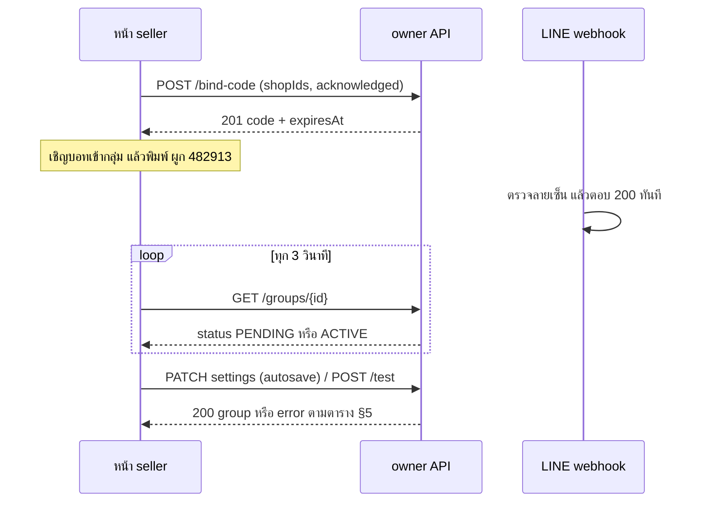

> **โมดูล:** M68-LineGroupSummary (00068) · **ประเภท:** API Contract · **เวอร์ชัน:** 1.0 · **วันที่:** 2026-10-05 · **สถานะ:** Approved 2026-10-05

# API Contract: รายงานสรุปยอดเข้ากลุ่ม LINE

## 1. Overview
API ชุดนี้ให้บริการ 3 กลุ่ม: **owner API** (หน้า seller เรียก) · **webhook** (LINE เรียก) · **cron** (Vercel เรียก) · provider = Next.js 16 route handlers ใน `src/app/api/` (service layer `src/services/line-report-*`) · ผู้บริโภค = หน้า `business/line-reports/**` · Base URL: same-origin (`https://seller.deepthailand.app`, dev `http://seller.deepth.local:4000`) · Content-Type: `application/json`
- ต้นทาง: [[SDS]] §3 · TFR: [[SRS]] §3 · **ทุก response ของ owner API ใส่ `Cache-Control: no-store`**
- เวลาใน JSON = ISO-8601 UTC · "นาที" ของ slot = จำนวนเต็ม 30..1440 (1440 = 24:00) · วันที่ธุรกิจเป็น `YYYY-MM-DD` (ไทย)

## 2. Authentication
| รายการ | ค่า |
|---|---|
| owner API | NextAuth session cookie ของ subdomain seller · ระบุตัวตนด้วย `sessionUserId()` (ห้าม cast) · browser mutation ผ่าน CSRF Origin check ของ `src/proxy.ts` ตามปกติ |
| **L1** | session + เป็น `Shop.userId` ของร้านใดร้านหนึ่ง (`deletedAt/purgedAt` = null) → อ่าน / ลบ / รับทราบ |
| **L2** | L1 + `BusinessPackageSubscription.status = 'ACTIVE'` (ทุก tier/source) → สร้าง/แก้/ส่ง |
| webhook | header `x-line-signature` = base64 HMAC-SHA256(raw body, `LINE_REPORT_BOT_CHANNEL_SECRET`) · ยกเว้น CSRF เฉพาะ pathname `/api/line-report/webhook` (เทียบตรงตัว) + bucket rate-limit แยก |
| cron | `Authorization: Bearer <CRON_SECRET>` · env ว่าง = 401 |
| กรณีไม่ผ่าน | ดู §5 |

## 3. Endpoint List
| # | Method | Path | Auth | คำอธิบาย |
|---|---|---|---|---|
| 1 | GET | `/api/line-report/groups` | L1 | รายการกลุ่ม + meta |
| 2 | POST | `/api/line-report/bind-code` | L2 | สร้างกลุ่ม `PENDING` + โค้ดผูก |
| 3 | POST | `/api/line-report/groups/{id}/bind-code` | L2 | โค้ดใหม่ให้กลุ่มเดิม (regenerate `PENDING` / ผูกใหม่ `INACTIVE`) |
| 4 | GET | `/api/line-report/groups/{id}` | L1 | รายละเอียด + สถานะ (ใช้ poll ทุก 3 วิ) |
| 5 | PATCH | `/api/line-report/groups/{id}` | L2 | แก้ตั้งค่า (autosave รายฟิลด์) |
| 6 | PUT | `/api/line-report/groups/{id}/shops` | L2 | แทนที่ร้านที่รวม |
| 7 | POST | `/api/line-report/groups/{id}/test` | L2 | ส่งทดสอบ (≤5/วัน/กลุ่ม) |
| 8 | DELETE | `/api/line-report/groups/{id}` | L1 | ยกเลิกการผูก (`REMOVED`) |
| 9 | POST | `/api/line-report/groups/{id}/ack` | L1 | รับทราบแจ้งเตือน |
| 10 | POST | `/api/line-report/webhook` | ลายเซ็น LINE | event `join`/`leave`/`message` |
| 11 | GET | `/api/cron/line-report-sweep` | `CRON_SECRET` | sweep ทุก 30 นาที |

## 4. Endpoint Detail

### 4.1 `GET /api/line-report/groups`
Query: ไม่มี · scope `ownerId` ที่ query แรก · เรียงใน DTO: มีปัญหา → รอผูก → ปกติ (UI เรียงต่อเอง)

**200**
```json
{
  "groups": [{
    "id": "7a1f…", "groupName": "ทีมบริหารและบัญชี BT Premium", "status": "ACTIVE",
    "paused": false,
    "shopCount": 3, "mixedVertical": true,
    "shops": [{ "id": "s1", "name": "BT Premium Auto Xenon", "vertical": "SERVICE_QUEUE" }],
    "schedule": { "dailyEnabled": true, "dailyTimes": [540, 1260, 1440], "monthlyEnabled": true, "cutoffDay": 5 },
    "nextSendAt": "2026-10-05T14:00:00.000Z",
    "lastDelivery": { "at": "2026-10-05T02:00:03.000Z", "kind": "DAILY", "status": "SENT", "reason": null, "reasonLabel": null },
    "alert": { "kind": "BOT_REMOVED", "at": "2026-10-04T09:12:00.000Z", "acked": false },
    "bind": { "codeExpiresAt": null },
    "boundAt": "2026-10-01T03:00:00.000Z", "leftAt": null
  }],
  "meta": { "count": 3, "limit": 10, "canCreate": true, "paused": false, "botReady": true, "unackedAlerts": 1 }
}
```
| ฟิลด์ | หมายเหตุ |
|---|---|
| `status` | `PENDING` · `ACTIVE` · `INACTIVE` (ไม่คืน `REMOVED`) |
| `paused` | **คำนวณสดต่อเจ้าของ** จาก `getSubscriptionStatus` (`status≠ACTIVE`) — ไม่ใช่ค่าที่เก็บ |
| `shops` | สูงสุด 2 ร้านแรก (ที่เหลือดู `shopCount`) |
| `nextSendAt` | `null` เมื่อ `status≠ACTIVE` / `paused` / ไม่มีตารางเปิดอยู่ (คำนวณจาก `schedule.ts`) |
| `meta.canCreate` | `count < 10 ∧ botReady ∧ ¬paused` |

Errors: 401 · 403 `NOT_OWNER`

### 4.2 `POST /api/line-report/bind-code`
สร้างกลุ่ม `PENDING` + ร้านที่เลือก + โค้ด 6 หลักใน transaction เดียว (lock แถว `User` กันแข่งเพดาน 10 กลุ่ม)

| ส่วน | ฟิลด์ | ชนิด | บังคับ | คำอธิบาย |
|---|---|---|---|---|
| Body | `shopIds` | `string[]` 1..10 ไม่ซ้ำ | ✅ | ต้องเป็นร้านที่เจ้าของ `userId` และไม่ลบ/purge/ถูกล็อก |
| Body | `acknowledged` | `true` | ✅ | ผู้ใช้รับทราบว่าทุกคนในกลุ่มเห็นตัวเลขและลบข้อความที่ส่งแล้วไม่ได้ |

**201**
```json
{ "groupId": "7a1f…", "code": "482913", "expiresAt": "2026-10-05T10:10:00.000Z",
  "addFriendUrl": "https://line.me/R/ti/p/@123abcde", "groupCount": 4 }
```
- `code` คืนครั้งเดียว ไม่มีที่ไหนเก็บค่าดิบ · `addFriendUrl` = `null` เมื่อไม่ได้ตั้ง `LINE_REPORT_BOT_BASIC_ID`
- อายุ 10 นาที ใช้ครั้งเดียว · โค้ดสดเดิมของเจ้าของถูก revoke ทันที

Errors: 400 `VALIDATION` · 400 `SHOP_NOT_ALLOWED` · 400 `SHOP_COUNT_OUT_OF_RANGE` · 403 · 409 `GROUP_LIMIT_REACHED` · 503 `BOT_NOT_CONFIGURED`

### 4.3 `POST /api/line-report/groups/{id}/bind-code`
Body: `{}` (ไม่ต้องรับทราบซ้ำ) · `PENDING` = ออกโค้ดใหม่ (ของเก่าใช้ไม่ได้) · `INACTIVE` = เปลี่ยนเป็น `PENDING` พร้อมโค้ดใหม่ **คงค่าตั้งทั้งหมด** (ผูกใหม่ — ย้ายไปกลุ่ม LINE อื่นได้)

**200** `{ "groupId": "7a1f…", "status": "PENDING", "code": "913028", "expiresAt": "…", "addFriendUrl": "…" }`

Errors: 403 · 404 `GROUP_NOT_FOUND` (ไม่ใช่ของตน/`REMOVED`) · 409 `INVALID_STATE` (`ACTIVE`) · 409 `SHOPS_INVALID` (ร้านในกลุ่มไม่พร้อมทั้งหมด) · 503 `BOT_NOT_CONFIGURED`

### 4.4 `GET /api/line-report/groups/{id}`
ใช้เป็น **poll สถานะผูกกลุ่ม** ทุก 3 วินาที (UI หยุดเมื่อแท็บไม่ active / โค้ดหมดอายุ) — GET auth rate-limit 120/นาที/IP

**200**
```json
{ "group": {
  "id": "7a1f…", "status": "ACTIVE", "groupName": "ทีมบัญชี", "paused": false,
  "boundAt": "…", "leftAt": null,
  "settings": {
    "dailyEnabled": true, "dailyTimes": [540, 1260], "monthlyEnabled": false, "cutoffDay": null,
    "showOrders": true, "showSales": true, "showCancelled": true, "showTopProducts": true,
    "showProfit": false, "skipWhenNoOrders": false, "attachCycleToDaily": false, "profitEnabledAt": null
  },
  "shops": [{ "shopId": "s1", "name": "BT Premium Auto Xenon", "vertical": "SERVICE_QUEUE", "kind": "BUSINESS", "state": "OK" }],
  "nextSendAt": "2026-10-05T14:00:00.000Z",
  "cycle": { "startIso": "2026-09-06", "endIso": "2026-10-05", "nextFireDate": "2026-10-06" },
  "bind": { "hasLiveCode": false, "expiresAt": null },
  "alert": null,
  "test": { "limit": 5, "usedToday": 2, "remaining": 3 },
  "deliveries": [{ "id": "d1", "at": "2026-10-05T02:00:03.000Z", "kind": "DAILY", "status": "SENT",
                   "reason": null, "reasonLabel": null, "pushMessageCount": 12 }]
} }
```
| ฟิลด์ | หมายเหตุ |
|---|---|
| `shops[].state` | `OK` · `LOCKED` (`packageLockedAt`) · `DELETED` — อ่านสดจาก `Shop` ไม่เก็บธง |
| `cycle` | `null` เมื่อ `monthlyEnabled=false` (ใช้แสดงตัวอย่างวันตัดรอบ) |
| `bind` | **ไม่มีโค้ดดิบ** — มีเฉพาะ `hasLiveCode`/`expiresAt` (hash at rest) |
| `deliveries` | `take 10` ล่าสุดก่อน · **ไม่คืน `pendingPayload`** · `reasonLabel` ภาษาไทยจาก SSOT |
| `test.usedToday` | นับ `TEST` วันไทย สถานะ CLAIMED/RETRY_PENDING/SENT |

Errors: 401 · 403 · 404 `GROUP_NOT_FOUND`

### 4.5 `PATCH /api/line-report/groups/{id}`
autosave รายฟิลด์ — ส่งเฉพาะคีย์ที่เปลี่ยน (≥1) · `strictObject` (คีย์แปลกถูกปฏิเสธ) · ตรวจกฎข้ามฟิลด์บน **state ที่รวมแล้ว**

| Body | ชนิด | กฎ |
|---|---|---|
| `dailyEnabled`, `monthlyEnabled`, `showOrders`, `showSales`, `showCancelled`, `showTopProducts`, `showProfit`, `skipWhenNoOrders`, `attachCycleToDaily` | boolean | — |
| `dailyTimes` | `number[]` | 0..4 ค่า · 30..1440 ก้าว 30 · ไม่ซ้ำ (เรียง asc ที่ server) |
| `cutoffDay` | `number|null` | 1..31 หรือ `null` (สิ้นเดือน) |
| `confirmProfit` | `true` | **บังคับเมื่อ `showProfit` เปลี่ยน false→true** (ยืนยันว่าทุกคนในกลุ่มเห็นกำไร) |

กฎที่ server บังคับ (ไม่ผ่าน = 400 `INVALID_SETTINGS` + `details.rule`):
- `NEEDS_TIME` — `(dailyEnabled ∨ monthlyEnabled)` ต้องมี `dailyTimes ≥ 1`
- `METRIC_REQUIRED` — เปิดอย่างน้อย 1 ตัวเลขจาก 5 ตัว
- ปิด `monthlyEnabled` → `attachCycleToDaily` ถูกล้างเป็น `false` อัตโนมัติ (ไม่ error)
- เปิด `showProfit` → ตั้ง `profitEnabledAt=now` · ปิด → `null`
- แก้ได้เมื่อ `PENDING`/`ACTIVE`/`INACTIVE` (`REMOVED` = 404)

**200** `{ "group": { …รูปเดียวกับ §4.4 } }` (client ใช้ค่าที่ normalize แล้วแทนค่าที่ส่ง)

Errors: 400 `VALIDATION` · 400 `INVALID_SETTINGS` · 400 `PROFIT_CONFIRM_REQUIRED` · 403 `PACKAGE_REQUIRED` · 404

### 4.6 `PUT /api/line-report/groups/{id}/shops`
Body `{ "shopIds": ["s1","s2"] }` (1..10) · ร้านที่ **เพิ่มใหม่** ต้อง reportable (`userId=owner ∧ ¬deleted ∧ ¬purged ∧ ¬locked`) · ร้านที่อยู่ในกลุ่มเดิมแต่ถูกล็อก/ลบภายหลัง **คงไว้ได้** (ไม่ลบเงียบ)

**200** `{ "shops": [ { "shopId", "name", "vertical", "kind", "state" } ] }`

Errors: 400 `VALIDATION` · 400 `SHOP_COUNT_OUT_OF_RANGE` · 400 `SHOP_NOT_ALLOWED` · 403 · 404

### 4.7 `POST /api/line-report/groups/{id}/test`
ส่งข้อความจริงตามค่าที่บันทึก (ป้าย "ทดสอบ") เข้ากลุ่ม · push ครั้งเดียว ไม่ retry · กินโควตา push จริง · ไม่ใช้ `skipWhenNoOrders` · ผ่านด่านเดียวกับการส่งจริง (แพ็กเกจ ACTIVE ณ ตอนกด · กลุ่ม `ACTIVE` · มีร้านส่งได้)

**200** `{ "deliveryId": "d9", "sentAt": "…", "remaining": 2, "summary": "2 ร้าน · ช่วง 00:00–18:02" }`

Errors: 403 `PACKAGE_REQUIRED` · 404 · 409 `GROUP_NOT_ACTIVE` · 409 `NO_SENDABLE_SHOPS` · 409 `BOT_NOT_IN_GROUP` (กลุ่มถูกตั้งเป็น `INACTIVE` + แจ้งเตือน) · 429 `TEST_QUOTA_EXCEEDED` · 502 `LINE_UNAVAILABLE` / `BOT_UNAVAILABLE` · 503 `BOT_NOT_CONFIGURED`

### 4.8 `DELETE /api/line-report/groups/{id}`
`status → REMOVED` · revoke โค้ดสด · บอทพยายามออกจากกลุ่ม LINE (best-effort — ล้มก็ไม่ทำให้การลบล้ม) · log คงอยู่ · นับออกจากเพดาน 10 กลุ่ม · **ไม่ต้องมีแพ็กเกจ ACTIVE** (มติ: แพ็กเกจหมดแล้วยกเลิกการผูกได้)

**200** `{ "removed": true, "botLeft": true }` (`botLeft`: `true`/`false`/`null` เมื่อไม่ใช่กลุ่มที่เคย ACTIVE)

Errors: 401 · 403 `NOT_OWNER` · 404 `GROUP_NOT_FOUND`

### 4.9 `POST /api/line-report/groups/{id}/ack`
ตั้ง `alertAckAt=now` (idempotent; ไม่มีแจ้งเตือน = no-op) · แบนเนอร์/จุดแจ้งหาย แต่ `alertKind` คงเดิมจนเหตุถูกแก้ (ไม่แจ้งซ้ำสำหรับเหตุเดียวกัน)

**200** `{ "acked": true }` · Errors: 401 · 403 · 404

### 4.10 `POST /api/line-report/webhook`
LINE ยิง server-to-server · ตรวจลายเซ็นก่อนทำอะไรทั้งสิ้น · ประมวลผลทีละ event ใน `after()` หลังตอบ

**Request:** raw JSON ตามสเปก LINE (อ้าง [[LINE-API-Facts]] §1) — ฟิลด์ที่ใช้ `events[].type` ∈ `join|leave|message` · `source.type==='group'` + `source.groupId` · `source.userId` **optional** (ห้ามบังคับ) · `replyToken` (ไม่มีเมื่อ `leave`/`mode:standby`) · `message.type==='text'` + `message.text` · `webhookEventId` · `timestamp` · `deliveryContext.isRedelivery`

| event | พฤติกรรม |
|---|---|
| `join` | reply ทักทาย + วิธีผูก (ทุกกรณี) |
| `leave` | กลุ่ม `ACTIVE` → `INACTIVE` + แจ้งเตือน `BOT_REMOVED` (ไม่มีแถว/`REMOVED` = เมินเงียบ) |
| `message` = `ผูก <6 หลัก>` | ผูกกลุ่ม (ผลเป็นข้อความ reply เดียวกันทุกเหตุผิด) |
| `message` = `สรุปวันนี้` / `สรุปเดือนนี้` | reply สรุป (reply token เท่านั้น) |
| `message` อื่น | **เงียบ** — ไม่ตอบ ไม่เก็บ |
| แชทเดี่ยว/ห้อง | ข้อความช่วยเหลือสั้นๆ (แชทเดี่ยวเท่านั้น) · ที่เหลือเมิน |

**Response:** `200 {"ok":true}` เสมอเมื่อลายเซ็นถูก (แม้ประมวลผลภายในล้ม — กัน LINE ส่งซ้ำรัว) · ลายเซ็นผิด/ไม่มี → `401 {"error":"INVALID_SIGNATURE"}` · secret ยังไม่ตั้ง → `200` + log warn

ตัวอย่าง body (ย่อ — ต้องพิสูจน์ซ้ำด้วย payload จริงจาก OA ทดสอบก่อนล็อก validator):
```json
{ "destination": "U…", "events": [{
  "type": "message", "mode": "active", "timestamp": 1790000000000, "webhookEventId": "01H…",
  "deliveryContext": { "isRedelivery": false },
  "source": { "type": "group", "groupId": "C…" },
  "replyToken": "…", "message": { "type": "text", "id": "…", "text": "ผูก 482913" }
}] }
```

### 4.11 `GET /api/cron/line-report-sweep`
Vercel Cron `*/30 * * * *` · `maxDuration = 300` · เริ่มกลุ่มใหม่จนถึง 240 วินาที (ที่เหลือรอ tick ถัดไป) · tick แรกหลัง 03:00 ไทยรัน cleanup ต่อท้าย

**200** `{ "ok": true, "groups": 12, "sent": 9, "retried": 1, "skipped": 2, "missed": 0, "finalNotices": 0, "cleanup": { "ran": false } }` · env ของ OA ไม่ครบ → `{ "ok": true, "skipped": "NOT_CONFIGURED" }`

**Errors:** 401 `{ "error": "unauthorized" }` (env `CRON_SECRET` ว่าง / header ไม่ตรง — แบบ `line-token-health`) · 500 `{ "error": message }` เฉพาะล้มทั้งรอบ (ความล้มเหลวของกลุ่มเดียวไม่ทำให้ล้ม)

## 5. Error Code Table
รูป error มาตรฐานของโมดูล (ตามธรรมเนียม repo: `error` = รหัส string + `message` ไทยสำหรับ UI):
```json
{ "error": "TEST_QUOTA_EXCEEDED", "message": "ส่งทดสอบครบ 5 ครั้งวันนี้แล้ว ส่งได้อีกครั้งพรุ่งนี้", "details": {} }
```
| Error | HTTP | ข้อความไทยที่ UI ใช้ | Endpoint |
|---|---|---|---|
| `UNAUTHORIZED` | 401 | กรุณาเข้าสู่ระบบ | ทุกตัวของ owner API |
| `NOT_OWNER` | 403 | ฟีเจอร์นี้สำหรับเจ้าของร้านเท่านั้น | ทุกตัวของ owner API |
| `PACKAGE_REQUIRED` | 403 | ต้องมีแพ็กเกจธุรกิจที่ใช้งานอยู่ | 2,3,5,6,7 |
| `VALIDATION` | 400 | ข้อมูลไม่ถูกต้อง (`details.fields` = ชื่อฟิลด์ที่ผิด) | 2,3,5,6 |
| `SHOP_NOT_ALLOWED` | 400 | เลือกได้เฉพาะร้านที่คุณเป็นเจ้าของและยังใช้งานอยู่ | 2,6 |
| `SHOP_COUNT_OUT_OF_RANGE` | 400 | เลือกร้านได้ 1–10 ร้าน | 2,6 |
| `INVALID_SETTINGS` | 400 | ตั้งค่านี้ไม่ได้ (`details.rule`: `NEEDS_TIME` = "ต้องมีอย่างน้อย 1 เวลา ปิดรายวันถ้าไม่ต้องการส่ง" · `METRIC_REQUIRED` = "ต้องแสดงตัวเลขอย่างน้อย 1 รายการ") | 5 |
| `PROFIT_CONFIRM_REQUIRED` | 400 | ต้องยืนยันก่อนแสดงกำไรในกลุ่ม LINE | 5 |
| `GROUP_NOT_FOUND` | 404 | ไม่พบกลุ่มนี้ | 3–9 |
| `GROUP_LIMIT_REACHED` | 409 | ครบ 10 กลุ่มแล้ว ยกเลิกการผูกกลุ่มที่ไม่ได้ใช้ก่อน แล้วค่อยเพิ่มกลุ่มใหม่ | 2 |
| `INVALID_STATE` | 409 | กลุ่มนี้อยู่ในสถานะที่ทำรายการนี้ไม่ได้ | 3 |
| `SHOPS_INVALID` | 409 | ร้านในกลุ่มบางร้านไม่พร้อมใช้งาน แก้รายการร้านก่อน | 3 |
| `GROUP_NOT_ACTIVE` | 409 | ส่งทดสอบไม่ได้จนกว่ากลุ่มจะผูกใหม่ | 7 |
| `NO_SENDABLE_SHOPS` | 409 | ทุกร้านในกลุ่มนี้ถูกล็อกหรือถูกลบ รายงานจึงยังไม่ถูกส่ง | 7 |
| `BOT_NOT_IN_GROUP` | 409 | บอทไม่อยู่ในกลุ่มแล้ว เชิญบอทกลับเข้ากลุ่มแล้วกดผูกใหม่ | 7 |
| `TEST_QUOTA_EXCEEDED` | 429 | ครบ 5 ครั้งวันนี้แล้ว ส่งทดสอบได้อีกครั้งพรุ่งนี้ | 7 |
| `LINE_UNAVAILABLE` | 502 | LINE ไม่พร้อมรับข้อความตอนนี้ ลองอีกครั้ง | 7 |
| `BOT_UNAVAILABLE` | 502 | ระบบส่งข้อความขัดข้อง แจ้งทีมงาน Deep | 7 |
| `BOT_NOT_CONFIGURED` | 503 | ฟีเจอร์ยังไม่พร้อมใช้งาน | 2,3,7 (+หน้า) |
| `INTERNAL` | 500 | เกิดข้อผิดพลาด ลองอีกครั้ง | ทุกตัว (error นอกชุด) |
| `INVALID_SIGNATURE` | 401 | — (LINE ไม่แสดง) | 10 |
| *(proxy)* `Rate limit exceeded` | 429 | ส่งคำขอถี่เกินไป ลองใหม่ภายหลัง | owner API (mutation 30/นาที/IP, GET 120/นาที/IP) — UI autosave ต้อง debounce |

> การจับคู่ "service throw → route catch → HTTP" ของทุกโค้ดข้างบนอยู่ที่ [[SRS]] §4.3 (เก็บที่ `_shared.ts` ที่เดียว + เทส exhaustive)

**ป้ายสาเหตุประวัติการส่ง (`reasonLabel`)** — จาก `delivery-reasons.ts`
| `reason` | ป้ายไทย |
|---|---|
| `BOT_NOT_IN_GROUP` | บอทไม่อยู่ในกลุ่มแล้ว |
| `HTTP_5xx` / `HTTP_429` / `TIMEOUT` / `NETWORK` | LINE ไม่พร้อมรับข้อความ ระบบจะลองใหม่ในรอบถัดไป |
| `HTTP_400` | LINE ปฏิเสธข้อความ |
| `TOKEN_INVALID` | ระบบส่งข้อความขัดข้อง ทีมงานกำลังตรวจสอบ |
| `NO_SENDABLE_SHOPS` | ทุกร้านถูกล็อกหรือถูกลบ |
| `ALL_SHOPS_FAILED` | ดึงข้อมูลร้านไม่สำเร็จ |
| `NO_ORDERS` | ไม่มีออเดอร์ในช่วงนั้น |
| `PACKAGE_PAUSED` | แพ็กเกจหยุดใช้งาน |
| `REPLY_TOKEN_EXPIRED` | ตอบไม่ทันเวลา |
| `IN_DAILY_PUSH` | ส่งรวมกับรายงานรายวัน |
| `MISSED` (status) | พลาดรอบส่ง ไม่ส่งย้อนหลัง |

## 6. Sequence
ผูกกลุ่มจนใช้งาน (owner ↔ LINE):


## 7. Traceability
| Endpoint | SDS | BRD FR |
|---|---|---|
| GET `/groups` | §3.1 group.service · presenter | 03, 07, 24 |
| POST `/bind-code`, `/groups/{id}/bind-code` | bind.service · §4.2 · TD-002/004 | 04, 07 |
| GET `/groups/{id}` | group.service · delivery.listRecent | 05, 23 |
| PATCH `/groups/{id}` | group.service.updateSettings | 10, 11, 12 |
| PUT `/groups/{id}/shops` | shop.service.replaceGroupShops | 09 |
| POST `/groups/{id}/test` | send.service.sendTest · §4.4 | 13 |
| DELETE / POST ack | group.service | 08, 24 |
| POST `/webhook` | command.service · bind.service · §4.2–4.3 | 05, 06, 07, 22 |
| GET cron | sweep.service · §4.1 · TD-001 | 19, 20, 21, 23 |

## 8. สรุป
สัญญานี้ให้ DEV สร้าง owner API / webhook / cron ได้โดยไม่ต้องตัดสินรูป request/response เพิ่ม · QA ใช้ตาราง §5 ทดสอบ negative case ได้ครบ · ข้อเท็จจริงที่ยังต้องพิสูจน์ด้วย payload จริง: รูป `webhookEventId`, ความยาว `groupId`

**Open Questions:** ตัดสินแล้วทั้งหมด — [[SDS]] §12
