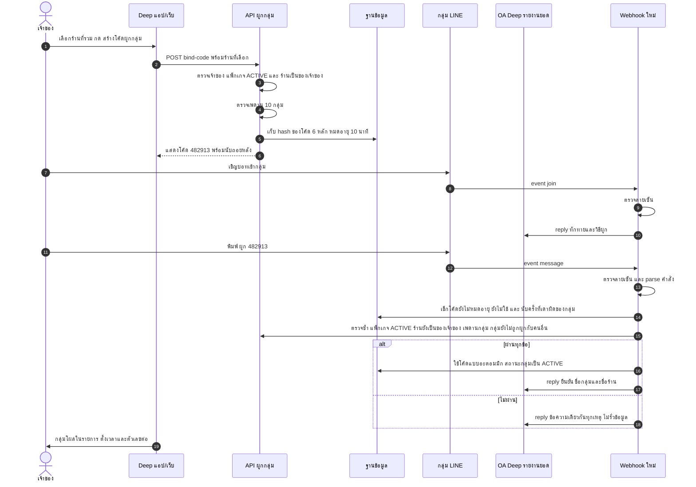
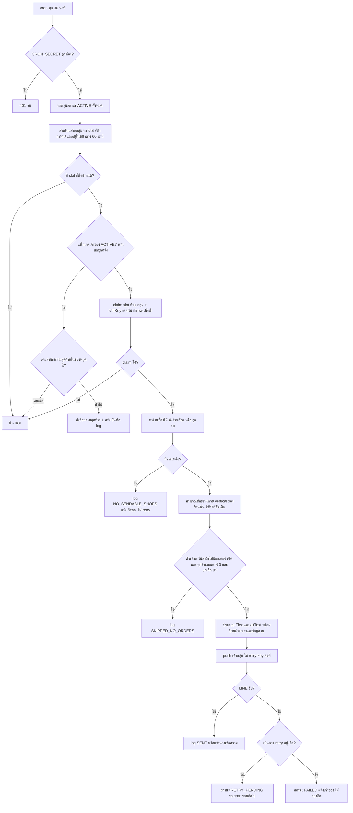
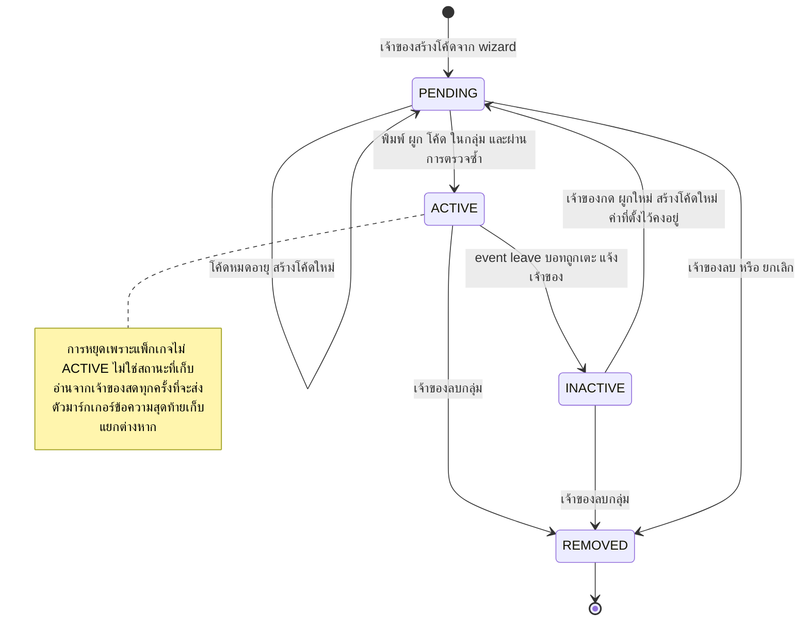
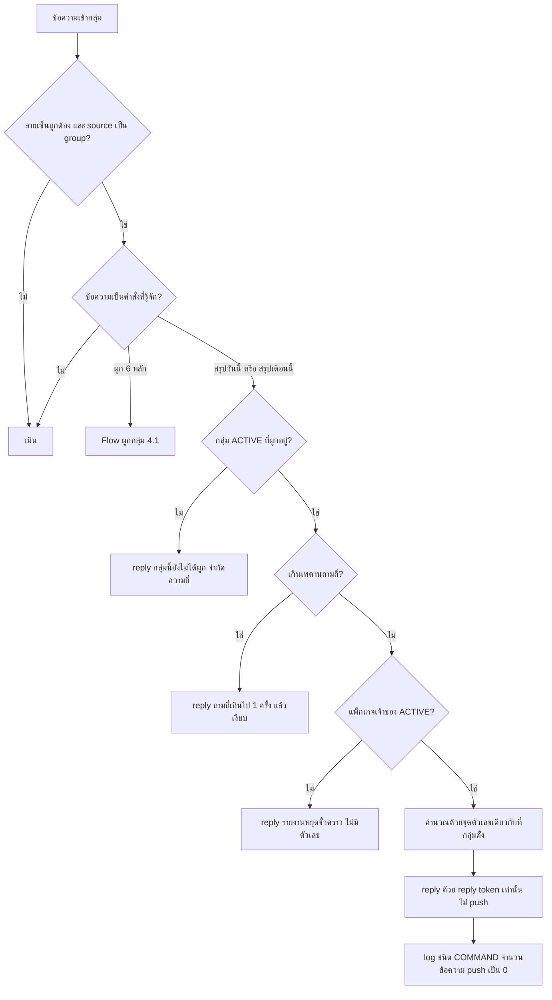

> **โมดูล:** M68-LineGroupSummary (00068)
> **ประเภทเอกสาร:** Business Requirements Document (BRD) - NON-TECHNICAL
> **เวอร์ชัน:** 1.0
> **วันที่จัดทำ:** 2026-10-05
> **สถานะ:** Approved 2026-10-05 — ค่าที่รอยืนยัน (§8.6) อนุมัติทั้งหมด · ข้อเท็จจริง LINE API: [[LINE-API-Facts]]
> **เจ้าของเอกสาร:** BA (ดู [[Feature-Docs-Ownership]])

# BRD: รายงานสรุปยอดเข้ากลุ่ม LINE (Business Requirements Document)

---

## 1. บทนำ

### 1.1 วัตถุประสงค์ของเอกสาร

เอกสารนี้มีวัตถุประสงค์เพื่อ:
1. แปลงความต้องการใน [[PRD]] เป็น Functional Requirements (FR-LGS-xx) ที่มี Acceptance Criteria ซึ่งตอบได้ว่า **ผ่าน/ไม่ผ่าน**
2. กำหนดขอบเขต: ผูกกลุ่ม, ตั้งค่าต่อกลุ่ม, ส่งตามเวลา, ตอบคำสั่งในกลุ่ม, และความทนทานของการส่ง
3. อธิบายกฎทางธุรกิจ (BR-LGS-xx) ที่ทุก FR ต้องปฏิบัติตาม และที่มาของตัวเลขทุกตัว (ใช้นิยามเดิมของระบบ)
4. สร้างความเข้าใจร่วมระหว่างทีมธุรกิจ ทีมพัฒนา และ QA

> **วิธีอ่านคอลัมน์ "บังคับที่ / เทสที่แดงถ้าถอดออก"** — ตามconvention `docs/conventions/rule-must-be-enforced-not-described.md` ทุก AC ต้องชี้ได้ว่า "โค้ดบรรทัดไหนบังคับ" และ "เทสตัวไหนแดงถ้าเอาบรรทัดนั้นออก" ขณะนี้ยังไม่มีโค้ด ค่าในคอลัมน์จึงเป็น **สัญญาตำแหน่งที่ dev ต้องสร้าง** (ชื่อไฟล์/ฟังก์ชันเป็นข้อเสนอ ยืนยันใน SRS) เมื่อปิดงานต้องแทนด้วย `file:line` จริง และพิสูจน์ด้วย mutation จริงว่าเทสแดง AC ใดที่ยังไม่มีทั้งสองอย่างห้าม mark เสร็จ

### 1.2 ขอบเขตของระบบ

**รายงานสรุปยอดเข้ากลุ่ม LINE** คือบริการที่ให้เจ้าของร้านที่มี Business Package ACTIVE ผูกกลุ่ม LINE เข้ากับ OA "Deep รายงานยอด" เพื่อรับสรุปยอดตามเวลาและถามยอดด้วยคำสั่งในกลุ่ม

**เข้าสู่ระบบ (Input):**
- การตั้งค่าของเจ้าของ: ร้านที่รวม, เวลา, ตัวเลขที่แสดง, วันตัดรอบ, ตัวเลือก
- event จาก LINE: `join`, `leave`, `message` (ข้อความในกลุ่ม) ผ่าน webhook ใหม่
- เวลา (cron ทุก 30 นาที)
- ข้อมูลออเดอร์/ค่าใช้จ่ายของร้านที่เลือก (อ่านผ่านฟังก์ชันเดิม)

**ออกจากระบบ (Output):**
- ข้อความ Flex + altText เข้ากลุ่ม (push ตามเวลา / reply ตามคำสั่ง / ส่งทดสอบ)
- ข้อความยืนยันการผูก ข้อความทักทายเมื่อบอทเข้ากลุ่ม ข้อความสุดท้ายเมื่อแพ็กเกจหยุด
- บันทึกการส่ง (log) พร้อมจำนวนข้อความ
- แจ้งเจ้าของผ่านแบนเนอร์ในหน้าตั้งค่า

**ระบบที่เกี่ยวข้อง:**
- 00008 Business Package · 00067 กติกาการเงินร้านบริการ · 00063 ยอดขายรายสินค้า · LINE Messaging API
- ไม่เกี่ยว (แยกขาด): 00064 บอทเช็คสถานะร้าน · 00025/00045 LINE OA รายร้าน

**ไม่อยู่ในขอบเขต (รอบแรก):** เลือกวันในสัปดาห์ · รายงานรายสัปดาห์ · เลือกภาษา · ส่ง 1:1 · กราฟรูปภาพ · ใช้ OA ของร้านเอง · คิดเงินแยกต่อข้อความ — รายละเอียดครบใน [[PRD]] §5

### 1.3 กลุ่มผู้ใช้งาน

| กลุ่มผู้ใช้ | บทบาท | สิทธิ์การใช้งาน |
|-----------|--------|----------------|
| **เจ้าของ + แพ็กเกจ ACTIVE** | ตั้งค่าและควบคุมกลุ่มรายงาน | เต็ม: สร้าง/แก้/ลบกลุ่ม, เลือกร้านของตัวเอง, ส่งทดสอบ, ดูประวัติ |
| **เจ้าของ ไม่มีแพ็กเกจ ACTIVE** | ผู้เห็นหน้าล็อก | เห็นคำอธิบาย + CTA ตามด่าน App Store; ตั้งค่าไม่ได้; ข้อมูลเดิมที่เคยตั้งไม่ถูกลบ |
| **ShopMember ADMIN** | พนักงาน | ไม่เห็นฟีเจอร์ (ไม่มีเมนู, URL ตรงถูก redirect, API ปฏิเสธ) |
| **สมาชิกในกลุ่ม LINE** | ผู้ถามยอด (อาจไม่มีบัญชี Deep) | พิมพ์ `สรุปวันนี้` / `สรุปเดือนนี้` ได้ พิมพ์ `ผูก <โค้ด>` ได้ ไม่มีสิทธิ์อื่น |
| **ทีมปฏิบัติการ Deep** | ผู้ดูแล OA/ต้นทุน | อ่านจำนวนข้อความจาก log; ตั้งค่า env/แผน OA |

---

## 2. ความต้องการหลัก (Functional Requirements)

> ลำดับความสำคัญ: **Must** = ต้องมีในรอบแรก · **Should** = ควรมี ตัดได้ถ้าเวลาไม่พอ โดยแจ้ง Controller

### 2.1 สิทธิ์และการเข้าถึง

#### FR-LGS-01: ผู้ตั้งค่าต้องเป็นเจ้าของที่มีแพ็กเกจ ACTIVE (Must)

**User Story:**
> ในฐานะ Deep ฉันต้องการให้เฉพาะเจ้าของที่จ่ายแพ็กเกจเท่านั้นตั้งค่าและส่งรายงาน เพื่อให้ฟีเจอร์นี้เป็นสิทธิ์ที่ผูกกับแพ็กเกจและไม่หลุดไปถึงพนักงาน

**Acceptance Criteria:**

| AC | เกณฑ์ | บังคับที่ / เทสที่แดงถ้าถอดออก |
|----|-------|-------------------------------|
| **AC-LGS-01-1** | ฟังก์ชันตัดสิน "จ่ายแล้ว" รับ `ownerId` คืน true เฉพาะเมื่อ `getSubscriptionStatus(ownerId)?.status === 'ACTIVE'`; `LOCKED_RENEWAL_FAILED` และไม่มีแถว คืน false | `src/services/line-report-access.service.ts` `isOwnerPaidForReports(ownerId)` · เทส `line-report-access.test.ts` 3 เคส (ACTIVE/LOCKED/ไม่มีแถว) แดงถ้าเปลี่ยนเป็น `!== null` |
| **AC-LGS-01-2** | ถ้าอ่านสถานะแพ็กเกจแล้ว throw → ถือว่าไม่จ่าย (fail-closed) ไม่ใช่ปล่อยผ่าน | ตัวเดียวกัน บรรทัด try/catch คืน false · เทส mock `getSubscriptionStatus` ให้ throw แล้วคาดว่า false |
| **AC-LGS-01-3** | tier ใดก็ได้ (GROWTH/PRO/BUSINESS) ผ่านเท่ากัน และ `source` เป็น `WALLET` หรือ `APPLE_IAP` ผ่านเท่ากัน | เทสตาราง 3 tier × 2 source |
| **AC-LGS-01-4** | ทุก API เขียน/ส่ง (สร้างโค้ด, แก้ตั้งค่า, ส่งทดสอบ) ระบุตัวตนด้วย `sessionUserId()` และปฏิเสธเมื่อไม่ใช่เจ้าของแพ็กเกจ ACTIVE ที่ชั้น route/service ไม่ใช่แค่ซ่อนปุ่ม · ลบ/ยกเลิกการผูก = L1 (มติ: แพ็กเกจหมดยกเลิกได้) | route handlers ใต้ `src/app/api/line-report/**` เรียก `isOwnerPaidForReports` ก่อนเขียน · เทส route: ADMIN-only user และผู้ไม่จ่าย ได้ 403 ทุก endpoint (วนทุก route จากการสแกนซอร์สจริง ไม่ใช่รายชื่อ hardcode) |
| **AC-LGS-01-5** | ผู้ใช้ที่ไม่ได้เป็น `Shop.userId` ของร้านใดเลย (ADMIN ล้วน) เปิด URL ของหน้าฟีเจอร์ตรง ๆ แล้วถูก redirect ออก ไม่เห็นหน้าล็อก | หน้า `business/line-reports/page.tsx` ตรวจเจ้าของก่อน render · เทส/Playwright: ผู้ใช้ ADMIN ถูกเด้ง |
| **AC-LGS-01-6** | ตัวตัดสินถูกเรียกซ้ำ ณ จุดที่จะ **ส่งจริง** ทุกครั้ง (cron, คำสั่งในกลุ่ม, ส่งทดสอบ) ไม่อาศัยสถานะที่เก็บไว้ในแถวกลุ่ม | `line-report-send.service.ts` เรียก `isOwnerPaidForReports(group.ownerId)` ก่อน push · เทส: เปลี่ยนแพ็กเกจเป็น LOCKED แล้วเรียก sweep → ไม่มีการเรียก LINE |

#### FR-LGS-02: หน้าแบบล็อกสำหรับผู้ไม่จ่าย พร้อม CTA ตามด่าน App Store (Must)

**User Story:**
> ในฐานะเจ้าของที่ยังไม่มีแพ็กเกจ ฉันต้องการเห็นว่าฟีเจอร์นี้คืออะไรและทำไมใช้ไม่ได้ เพื่อตัดสินใจว่าจะสมัครหรือไม่ (เมื่อช่องทางอนุญาต)

**Acceptance Criteria:**

| AC | เกณฑ์ | บังคับที่ / เทสที่แดงถ้าถอดออก |
|----|-------|-------------------------------|
| **AC-LGS-02-1** | เจ้าของที่ไม่ ACTIVE เปิดหน้าฟีเจอร์ → เห็นคำอธิบายฟีเจอร์ (ตัวอย่างข้อความ + สิ่งที่ได้) และไม่เห็นฟอร์มตั้งค่า/รายการกลุ่มที่แก้ได้ | หน้า `line-reports/page.tsx` แตกสาขาตามผล `isOwnerPaidForReports` · เทส render ทั้งสองสาขา |
| **AC-LGS-02-2** | เว็บ (ไม่ใช่แอป): CTA ลิงก์ไป `/business` (หน้าแพ็กเกจ) | เทสด้วย `deep_shell` ไม่ตั้ง |
| **AC-LGS-02-3** | iOS (`shouldOfferIap()` = true): CTA ลิงก์ไป `/business/subscribe` | เทสด้วย `deep_shell=app` + UA iOS; ยิงจริงด้วย cookie แล้วหา `business/subscribe` ในเนื้อสตรีม (skill `app-store-surfaces` ข้อ "วิธีพิสูจน์") |
| **AC-LGS-02-4** | Android (`shouldHidePayments()` = true และ `shouldOfferIap()` = false): **ไม่มี CTA** และไม่มีคำว่า สมัคร/อัปเกรด/ราคา/ชื่อแพ็กเกจที่มีราคาติดในหน้านั้น | เทสสแกน HTML ที่ render ด้วย shell android: ไม่มี `/business`, `/business/subscribe`, `฿`, "สมัคร", "อัปเกรด" |
| **AC-LGS-02-5** | หน้าปลายทางเองมีด่านของตัวเอง ไม่ใช่พึ่งการซ่อนเมนู (พิมพ์ URL ตรงได้) และ **ไม่เรียก** `shouldHidePaidFeatures()` (เพราะ Business Package ขายเป็น IAP — ดู `app-shell-server.ts:51`) | เทสสแกนซอร์สหน้า `line-reports/**`: ต้องมีการเรียก `shouldHidePayments(` และ **ไม่มี** `shouldHidePaidFeatures(` |
| **AC-LGS-02-6** | ข้อความหน้าล็อกไม่เปรียบเทียบราคาหรือเชิญจ่ายเงินในสาขา shell ที่ห้าม | รวมกับ AC-LGS-02-4 |

#### FR-LGS-03: ทางเข้าครบทุก surface และบรรทัดฟีเจอร์ใน tier (Must)

**User Story:**
> ในฐานะเจ้าของที่ใช้แอปบนมือถือ ฉันต้องการเดินไปถึงหน้ารายงานได้จริง และเห็นว่าฟีเจอร์นี้อยู่ในสิ่งที่แพ็กเกจให้

**Acceptance Criteria:**

| AC | เกณฑ์ | บังคับที่ / เทสที่แดงถ้าถอดออก |
|----|-------|-------------------------------|
| **AC-LGS-03-1** | `featuresForTier()` คืนบรรทัดฟีเจอร์ "รายงานสรุปยอดเข้ากลุ่ม LINE" ให้ **ทั้ง 3 tier** และข้อความมาจากแหล่งเดียว ไม่ก็อปไปจอขายอื่น | `src/lib/business-package.ts` `featuresForTier` · เทสต่อยอด `subscription-benefits.test.ts`: ทั้ง 3 tier มีบรรทัดนี้ และ `PackageTierGrid` กับ `IapSubscribeClient` อ่านจากฟังก์ชันเดียวกัน |
| **AC-LGS-03-2** | ทางเข้าบน **เดสก์ท็อป** (sidebar/ `seller-menu.ts`) มี 1 รายการ แสดงเฉพาะเจ้าของ | `src/lib/seller-menu.ts` · เทสพฤติกรรม: เมนูของ ADMIN ไม่มีรายการนี้ |
| **AC-LGS-03-3** | ทางเข้าบน **มือถือ/แอป** ครบทั้งการ์ด "จัดการร้าน" (`ShopQuickLinks.tsx`) และแถบล่าง (`SellerBottomNav.tsx`) ตามเช็กลิสต์ skill `app-store-surfaces` | เทสพฤติกรรมของฟังก์ชันเมนู + Playwright บน viewport มือถือ: เดินถึงหน้ารายงานได้ใน ≤ 3 แตะจากแถบล่าง |
| **AC-LGS-03-4** | ทางเข้าไม่ผ่านหน้า `/business` root ซึ่งเด้งออกในแอปที่ห้ามจ่ายเงิน (`business/page.tsx:65`) — ใช้ path ย่อย `/business/line-reports` ที่ไม่ถูกด่านนั้นครอบ | เทส: เปิด `/business/line-reports` ด้วย shell iOS ของเจ้าของ ACTIVE → ได้หน้าฟีเจอร์ ไม่ถูก redirect |
| **AC-LGS-03-5** | รายการเมนูใหม่ไม่ทำให้ "เมนูลัด" (`shortcut.service` ที่สร้าง catalog จากเมนูชุดเดียวกัน) แสดงผิด: ADMIN ไม่เห็นรายการนี้ใน catalog, เจ้าของเห็นปกติ | เทส `buildEligibleCatalog` (บทเรียน 00067 FR-FIN-04) |
| **AC-LGS-03-6** | `settings/` ของร้านมีเพียงลิงก์ชี้ไปหน้านี้ ไม่มีฟอร์มตั้งค่าซ้ำ (ที่เดียวทั้งระบบ) | เทสสแกนซอร์ส `settings/**`: ไม่มี import ของคอมโพเนนต์ฟอร์มรายงาน |
| **AC-LGS-03-7** | ไม่มี segment แบบ dynamic ใหม่ที่เป็นพี่น้องกับ `business/[shopId]` — ใช้ `business/line-reports/[groupId]` | เทสโครงไฟล์ (`glob` ใต้ `business/`) |

---

### 2.2 ผูกกลุ่ม

#### FR-LGS-04: สร้างโค้ดผูกกลุ่มจากหน้าตั้งค่า (Must)

**User Story:**
> ในฐานะเจ้าของ ฉันต้องการสร้างโค้ดชั่วคราวเพื่อผูกกลุ่ม LINE เข้ากับร้านของฉัน โดยคนนอกผูกกลุ่มตัวเองเข้าร้านฉันไม่ได้

**Acceptance Criteria:**

| AC | เกณฑ์ | บังคับที่ / เทสที่แดงถ้าถอดออก |
|----|-------|-------------------------------|
| **AC-LGS-04-1** | ขั้นตอน: เลือกร้าน (≥ 1) → ติ๊กรับทราบประกาศ (OQ-3 อนุมัติ — ปุ่มปิดจนกว่าจะติ๊ก) → กด "สร้างโค้ดผูกกลุ่ม" → ได้โค้ด 6 หลักตัวเลข พร้อมเวลาหมดอายุและปุ่มเพิ่มเพื่อน OA | หน้า `line-reports/new` + `POST /api/line-report/bind-code` · เทส route |
| **AC-LGS-04-2** | โค้ดอายุ 10 นาทีเต็ม ไม่มากกว่า; ใช้ได้ครั้งเดียว | `line-report-bind.service.ts` กำหนด `expiresAt = now + 10 นาที` และ consume แบบอะตอมมิก (`updateMany where usedAt null`) · เทส: เวลา 10:00 ใช้ได้/10:01 ไม่ได้ (นาฬิกาปลอม) และใช้ซ้ำครั้งที่สองไม่ได้ |
| **AC-LGS-04-3** | เจ้าของมีโค้ดที่ใช้ได้อยู่ครั้งละ 1 โค้ด — สร้างโค้ดใหม่แล้วโค้ดเก่าใช้ไม่ได้ทันที | เทส: สร้างสองโค้ด ใช้โค้ดแรก → ปฏิเสธ |
| **AC-LGS-04-4** | โค้ดเก็บเป็น **HMAC-SHA256 พร้อม secret ฝั่ง server** (ไม่ใช่ sha256 เปล่า เพราะ space 10⁶ brute-force จาก hash ได้ทันทีถ้าฐานรั่ว) ไม่เก็บค่าจริง | เทสอ่านแถวหลังสร้าง: ไม่มีค่า 6 หลักดิบในคอลัมน์ใด |
| **AC-LGS-04-5** | ร้านที่เลือกถูกกรองที่ query แรกด้วย `Shop.userId = ownerId`, `deletedAt = null`, `purgedAt = null`; ส่ง `shopId` ของร้านที่ไม่ใช่ของเจ้าของ (รวมร้านที่เป็นแค่ ADMIN) → ปฏิเสธทั้งคำขอ | `line-report-shop.service.ts` `listReportableShops(ownerId)` (ห้ามเรียก `listAccessibleShopIds`) · เทส: ผู้ใช้เป็น ADMIN ของร้านอื่น ส่ง id ร้านนั้น → 400/403 และเทสสแกนซอร์ส `line-report-*` ไม่มี `listAccessibleShopIds(` |
| **AC-LGS-04-6** | เจ้าของที่มีกลุ่มครบ 10 (นับทุกสถานะที่ไม่ลบ) สร้างโค้ดเพิ่มไม่ได้ ข้อความบอกเพดานชัดเจน | `bind-code` ตรวจใน transaction · เทส: 10 กลุ่ม → ครั้งที่ 11 ถูกปฏิเสธ; เทสแข่งกัน 2 คำขอพร้อมกันที่ 9 กลุ่ม → ผ่านได้เพียง 1 |
| **AC-LGS-04-7** | หน้าแสดงโค้ดบอกเวลาที่เหลือ และเมื่อหมดอายุแสดงปุ่ม "สร้างโค้ดใหม่" ไม่ค้างโค้ดที่ใช้ไม่ได้ | Playwright |

#### FR-LGS-05: webhook ใหม่ของ OA "Deep รายงานยอด" และการผูกด้วยคำสั่ง `ผูก` (Must)

**User Story:**
> ในฐานะเจ้าของ ฉันต้องการพิมพ์ `ผูก 482913` ในกลุ่มแล้วบอทยืนยันการผูกพร้อมบอกว่าผูกกับกลุ่มและร้านไหน เพื่อให้มั่นใจว่าผูกถูกกลุ่ม

**Acceptance Criteria:**

| AC | เกณฑ์ | บังคับที่ / เทสที่แดงถ้าถอดออก |
|----|-------|-------------------------------|
| **AC-LGS-05-1** | webhook เป็น route ใหม่ (`/api/line-report/webhook`) ไม่แตะ `/api/channels/line/webhook`; ตรวจลายเซ็น `x-line-signature` ด้วย `validateSignature` กับ channel secret ของ OA นี้ (env `LINE_REPORT_BOT_CHANNEL_SECRET`) | route ใหม่ · เทส: ลายเซ็นผิด/ไม่มี → ไม่ประมวลผล; และเทสสแกน: ไฟล์ route ของ 00025 ไม่ถูกแก้ (diff ว่างในรอบนี้) |
| **AC-LGS-05-2** | เพิ่ม path ใหม่ใน CSRF Origin-check exemption ของ `src/proxy.ts` แบบเปรียบเทียบตรงตัว | `src/proxy.ts` (เทียบกับบรรทัด 53-55) · เทส proxy: POST ไม่มี Origin ไปที่ path ใหม่ไม่ถูก 403 และ path อื่นยังถูก 403 |
| **AC-LGS-05-3** | event `join` เข้ากลุ่ม → บอทตอบ (reply) ข้อความทักทายที่บอกวิธีผูก ไม่ว่าจะมีโค้ดค้างหรือไม่ | handler `join` · เทสด้วย payload ตัวอย่างจากของจริง |
| **AC-LGS-05-4** | ข้อความ `ผูก <6 หลัก>` ในกลุ่ม (รับช่องว่างหน้า/หลัง/ระหว่างได้ แต่โค้ดต้องเป็นตัวเลข 6 หลัก) → ตรวจโค้ด; ถูก → กลุ่มสถานะ ACTIVE และบอทตอบยืนยันที่มี **ชื่อกลุ่ม** และ **ชื่อร้านที่ผูก** | `line-report-command.ts` parser + `line-report-bind.service.ts` · เทส parser (ตาราง input) + เทส service |
| **AC-LGS-05-5** | ณ ตอนใช้โค้ด ระบบเช็คซ้ำ: เจ้าของโค้ดยังเป็นแพ็กเกจ ACTIVE; ร้านในโค้ดยังเป็นของเจ้าของและไม่ถูกลบ; จำนวนกลุ่มยังไม่เกิน 10; ไม่ผ่านข้อใด → ไม่ผูก ตอบข้อความเหตุผลที่ไม่รั่วข้อมูลของเจ้าของ | เทสทีละข้อ (4 เคส) |
| **AC-LGS-05-6** | ข้อความอื่นในกลุ่มที่ไม่ใช่คำสั่งที่รู้จัก → บอทไม่ตอบอะไรเลย | เทส: ข้อความทั่วไป ไม่เกิดการเรียก reply |
| **AC-LGS-05-7** | event จากแชทเดี่ยว/ห้อง (`source.type` ไม่ใช่ `group`) ไม่ถูกประมวลผลเป็นการผูก | เทส |
| **AC-LGS-05-8** | webhook ตอบ 200 ให้ LINE เมื่อประมวลผลภายในล้มเหลวหลังตรวจลายเซ็นแล้ว (กัน LINE ส่งซ้ำรัว) และบันทึก error ไม่มี token/secret ใน log | เทส + grep log ไม่มี `LINE_REPORT_BOT_` ค่าจริง |
| **AC-LGS-05-9** | ถ้า env ของ OA ยังไม่ตั้ง: หน้าตั้งค่าแสดง "ฟีเจอร์ยังไม่พร้อมใช้งาน" แทนการล้ม และ cron ข้ามโดยไม่ throw | เทสด้วย env ว่าง |

#### FR-LGS-06: ความปลอดภัยของการผูก (Must)

**User Story:**
> ในฐานะเจ้าของ ฉันต้องการมั่นใจว่าไม่มีใครเดาโค้ดหรือยึดกลุ่มของฉันไปผูกกับบัญชีอื่น

**Acceptance Criteria:**

| AC | เกณฑ์ | บังคับที่ / เทสที่แดงถ้าถอดออก |
|----|-------|-------------------------------|
| **AC-LGS-06-1** | พิมพ์โค้ดผิดเกิน 5 ครั้งใน 10 นาทีจากกลุ่มเดียวกัน → กลุ่มนั้นถูกปฏิเสธการลองโค้ดที่เหลือในช่วงนั้น แม้โค้ดจะถูก (ตัวเลขตาม OQ-4) | `line-report-bind.service.ts` ตัวนับต่อ `groupId` · เทส: 5 ผิดแล้วโค้ดถูกครั้งที่ 6 → ปฏิเสธ; ผ่านช่วง 10 นาที → ผ่าน |
| **AC-LGS-06-2** | กลุ่มที่ ACTIVE กับเจ้าของรายหนึ่งแล้ว พิมพ์ `ผูก` ด้วยโค้ดของเจ้าของรายอื่น → ปฏิเสธและบอกว่ากลุ่มนี้ถูกผูกอยู่แล้ว **โดยไม่เปิดเผยว่าผูกกับใคร** และโค้ดนั้นไม่ถูกใช้ | เทส + unique constraint บน `groupId` สถานะ ACTIVE ที่ฐานข้อมูล |
| **AC-LGS-06-3** | กลุ่มที่ผูกกับเจ้าของรายเดียวกันอยู่แล้ว พิมพ์ `ผูก` อีก → ตอบว่าผูกอยู่แล้ว ไม่สร้างแถวซ้ำและไม่เผาโค้ด | เทส |
| **AC-LGS-06-4** | ข้อความตอบเมื่อโค้ดผิด/หมดอายุ/ใช้แล้ว เป็นข้อความเดียวกัน (ไม่แยกว่าผิดแบบไหน) เพื่อไม่ให้ใช้เป็นตัวบอกว่าโค้ดใดเคยมีอยู่ | เทส เปรียบเทียบข้อความทั้ง 3 เคส |
| **AC-LGS-06-5** | ไม่มีการเก็บ LINE userId ของสมาชิกกลุ่ม ไม่เก็บเนื้อหาข้อความที่ไม่ใช่คำสั่ง | เทสสแกนสคีมา: ไม่มีคอลัมน์ userId ของสมาชิก; เทส handler: ข้อความทั่วไปไม่ถูกเขียนลง DB |

#### FR-LGS-07: บอทถูกเตะ → inactive ทันที และผูกใหม่ (Must)

**User Story:**
> ในฐานะเจ้าของ ฉันต้องการรู้ทันทีเมื่อบอทถูกนำออกจากกลุ่ม และผูกใหม่ได้โดยไม่ต้องตั้งค่าทั้งหมดใหม่

**Acceptance Criteria:**

| AC | เกณฑ์ | บังคับที่ / เทสที่แดงถ้าถอดออก |
|----|-------|-------------------------------|
| **AC-LGS-07-1** | event `leave` ของกลุ่มที่ ACTIVE → สถานะเป็น `INACTIVE` ทันทีใน request เดียวกัน (ไม่รอ cron) | handler `leave` · เทส |
| **AC-LGS-07-2** | กลุ่ม `INACTIVE` ไม่ถูกหยิบโดย sweep และไม่ตอบคำสั่ง | เทส sweep + เทส command |
| **AC-LGS-07-3** | เจ้าของเห็นแบนเนอร์ในหน้ากลุ่ม/รายการกลุ่ม "บอทถูกนำออกจากกลุ่ม … เมื่อ …" ตามช่องทางที่ตัดสินใน OQ-2 | Playwright / เทส presenter |
| **AC-LGS-07-4** | ปุ่ม "ผูกใหม่" สร้างโค้ดใหม่ผูกกับแถวเดิม (ใช้ในกลุ่ม LINE อื่นได้ = ย้ายรายงานไปกลุ่มใหม่ ตั้งใจให้ทำได้ เพราะผู้ถือโค้ดคือเจ้าของ); ใช้โค้ดสำเร็จ → แถวเดิมกลับเป็น `ACTIVE` ค่าที่ตั้งไว้ (เวลา ตัวเลข ร้านที่รวม) คงเดิม | เทส: ตั้งค่า → leave → ผูกใหม่ → ค่าตรงเดิมทุกฟิลด์ |
| **AC-LGS-07-5** | `leave` ของกลุ่มที่ไม่มีแถว/`REMOVED` ถูกเมินโดยไม่ error | เทส |

#### FR-LGS-08: เจ้าของลบกลุ่มรายงาน (Must)

**Acceptance Criteria:**

| AC | เกณฑ์ | บังคับที่ / เทสที่แดงถ้าถอดออก |
|----|-------|-------------------------------|
| **AC-LGS-08-1** | เจ้าของกดลบ (ยืนยันก่อน) → สถานะ `REMOVED` ไม่ถูกหยิบโดย sweep/คำสั่ง และนับออกจากเพดาน 10 กลุ่ม | `DELETE /api/line-report/groups/[id]` · เทส |
| **AC-LGS-08-2** | บอทพยายามออกจากกลุ่ม LINE (best-effort) ล้มเหลวไม่ทำให้การลบล้ม | เทส mock LINE ล้ม |
| **AC-LGS-08-3** | ประวัติการส่ง (log) ยังคงอยู่ตามอายุเก็บ ไม่ถูกลบตามกลุ่ม | เทส |
| **AC-LGS-08-4** | แถวที่ลบไม่ใช่ของเจ้าของที่ล็อกอิน → 404 (ไม่ใช่ 403 ที่บอกว่ามีอยู่) | เทส scope ด้วย `ownerId` ใน where ตั้งแต่ query แรก |

---

### 2.3 การตั้งค่าต่อกลุ่ม

#### FR-LGS-09: เลือกร้านที่รวมในกลุ่ม (Must)

**User Story:**
> ในฐานะเจ้าของ ฉันต้องการกำหนดว่ากลุ่มนี้เห็นยอดของร้านไหนบ้าง — ร้านเดียวสำหรับกลุ่มสาขา หรือหลายร้านสำหรับกลุ่มหุ้นส่วน

**Acceptance Criteria:**

| AC | เกณฑ์ | บังคับที่ / เทสที่แดงถ้าถอดออก |
|----|-------|-------------------------------|
| **AC-LGS-09-1** | แก้รายการร้านของกลุ่มได้ ≥ 1 ร้านและ ≤ 10 ร้าน; ร้านเดียวกันอยู่ได้หลายกลุ่ม | `PUT /api/line-report/groups/[id]/shops` · เทส |
| **AC-LGS-09-2** | บังคับกฎ AC-LGS-04-5 ซ้ำที่จุดแก้ไข (กรองด้วย `Shop.userId`) | เทสเดียวกัน ชุดเคสแยก |
| **AC-LGS-09-3** | ร้านที่ใส่ไว้แล้วภายหลังไม่พร้อม (ถูกล็อก/ลบ) ยังแสดงในรายการตั้งค่าพร้อมป้ายสถานะ ไม่ถูกลบเงียบ | เทส presenter |
| **AC-LGS-09-4** | รายการร้านที่เลือกได้แสดง vertical ของแต่ละร้านเพื่อให้เจ้าของเห็นว่ากลุ่มผสมประเภท (มีผลกับการรวมกำไร — BR-LGS-07) | Playwright |

#### FR-LGS-10: ตารางเวลาส่งรายวัน (Must)

**User Story:**
> ในฐานะเจ้าของ ฉันต้องการเลือกหลายเวลาในวัน (ทีละ 30 นาที) เพื่อให้กลุ่มได้ยอดตอนที่คนทำงานต้องการ

**Acceptance Criteria:**

| AC | เกณฑ์ | บังคับที่ / เทสที่แดงถ้าถอดออก |
|----|-------|-------------------------------|
| **AC-LGS-10-1** | ตัวเลือกเวลามี 48 ค่า: `00:30` ถึง `23:30` ทุก 30 นาที และ `24:00`; ไม่มี `00:00` แยก | `src/lib/line-report/schedule.ts` `SLOT_OPTIONS` · เทสนับ 48 ค่า + ไม่มี 00:00 |
| **AC-LGS-10-2** | ตั้งได้ 1–4 เวลาต่อกลุ่ม ซ้ำเวลาเดิมไม่ได้; ส่ง 5 เวลาถูกปฏิเสธที่ server | Valibot schema + service · เทส 4 ผ่าน/5 ไม่ผ่าน/ซ้ำไม่ผ่าน |
| **AC-LGS-10-3** | เวลาทุกค่าตีความเป็น Asia/Bangkok เสมอ (ใช้ `TZ_OFFSET_MS` จาก `date-range.ts`) ไม่ขึ้นกับ timezone เซิร์ฟเวอร์ | เทสด้วย `TZ` ของโปรเซสเป็น UTC และ `America/Los_Angeles` ได้ผลเดียวกัน |
| **AC-LGS-10-4** | slot `HH:MM` (ไม่ใช่ 24:00) ของวัน D → ยอดสะสม **วัน D 00:00 ถึงเวลาที่คำนวณ**; slot `24:00` ของวัน D → ยอดของ **วัน D ทั้งวัน (00:00–24:00)** ส่งเวลา 00:00 ของ D+1 | `schedule.ts` `resolveDailyWindow(slot, fireDate)` · เทสตารางเวลา: slot 18:00 ที่รัน 18:02 → ช่วง D 00:00..18:02; slot 24:00 ที่รัน 00:03 ของ D+1 → ช่วงทั้งวัน D |
| **AC-LGS-10-5** | ลำดับเวลาจริงในหนึ่งวันปฏิทิน: รอบ `24:00` (ของเมื่อวาน) ยิง 00:00 ก่อนรอบอื่น | เทสการเรียง `fireOrder` |
| **AC-LGS-10-6** | รายงานรายวันเปิด/ปิดแยกจากรายงานรายเดือน (ปิดรายวันแต่เปิดรายเดือนได้ และกลับกัน) | เทส sweep 4 คู่ผสม |

#### FR-LGS-11: รายงานรายเดือน วันตัดรอบ และยอดสะสมรอบ (Must)

**User Story:**
> ในฐานะเจ้าของที่ปิดบัญชีทุกวันที่ 5 ฉันต้องการให้รอบรายเดือนของกลุ่มเริ่มวันที่ 6 และจบวันที่ 5 เพื่อให้ตัวเลขตรงกับรอบบัญชีของฉัน

**Acceptance Criteria:**

| AC | เกณฑ์ | บังคับที่ / เทสที่แดงถ้าถอดออก |
|----|-------|-------------------------------|
| **AC-LGS-11-1** | วันตัดรอบเลือกได้ 1–31 หรือ "สิ้นเดือน" (ค่าตั้งต้น); ค่านอกช่วงถูกปฏิเสธ | Valibot + เทส |
| **AC-LGS-11-2** | ฟังก์ชันรอบ `cycleContaining(date, cutoffDay)` คืน `{start, end}` ตามตัวอย่าง: ตัดรอบ 5, วันที่ 20 ต.ค. 2569 → 6 ต.ค. 00:00 ถึง 5 พ.ย. 23:59:59 | `src/lib/line-report/cycle.ts` · เทสตารางตัวอย่าง (ด้านล่าง) |
| **AC-LGS-11-3** | เดือนที่ไม่มีวันตัดรอบ (29–31) ใช้วันสุดท้ายของเดือน: ตัดรอบ 31 → ก.พ. 2569 ตัดที่ 28 ก.พ.; ตัดรอบ 30 → รอบที่ปิด 28 ก.พ. เริ่ม 31 ม.ค. | เทสตารางตัวอย่าง |
| **AC-LGS-11-4** | รายงานรายเดือนส่งในวัน **ถัดจากวันตัดรอบ** ที่เวลาแรกสุดตามลำดับเวลาจริงของเวลาที่กลุ่มตั้ง (ถ้ามี 24:00 คือ 00:00 ของวันนั้น) และสรุป **ช่วงรอบที่เพิ่งปิดทั้งรอบ** (ไม่ขึ้นกับเวลาที่ส่ง) | `cycle.ts` `monthlyFireInfo` · เทส: ตั้ง 09:00, 21:00 → ส่ง 09:00; ตั้ง 24:00, 21:00 → ส่ง 00:00 |
| **AC-LGS-11-5** | รายงานรายเดือนไปใน push เดียวกับข้อความรายวันของ slot แรกของวันนั้นเป็น message object แยก ไม่เพิ่มจำนวนรอบ/วัน และถ้าปิดรายวันก็ส่งเดี่ยว | เทสจำนวน push ต่อกลุ่มต่อวัน ≤ 4 ในวันที่มีรายงานรายเดือน |
| **AC-LGS-11-6** | ตัวเลือก "แนบยอดสะสมรอบนี้ในรายงานรายวัน" เพิ่มส่วนยอดสะสมของ **รอบที่มีวันที่สรุปอยู่** ป้ายระบุช่วง เช่น "6 ต.ค. – 20 ต.ค." ที่ปลายช่วง = วันที่สรุป | เทส flex builder |
| **AC-LGS-11-7** | ถ้ารายงานรายเดือนอยู่ใน push เดียวกัน ส่วนแนบยอดสะสมรอบถูกข้าม (ไม่ซ้ำเนื้อหา) | เทส |
| **AC-LGS-11-8** | คำสั่ง `สรุปเดือนนี้` ใช้รอบ **ของกลุ่มนั้น** (รวมกรณีรายงานรายเดือนปิดอยู่) ป้ายระบุช่วงวันที่เสมอ | เทส command handler |
| **AC-LGS-11-9** | รอบที่คร่อมสองเดือนปฏิทินให้ผลเท่ากับการรวมวันในช่วงจากผล `getSalesSeries` รายเดือนสองเดือน (ไม่เขียนการคำนวณยอดขายใหม่) | `line-report-summary.service.ts` · เทส parity ด้านล่าง AC-LGS-14-3 |

ตารางตัวอย่างสำหรับเทส `cycleContaining` (พ.ศ. 2569 = ค.ศ. 2026):

| วันตัดรอบ | วันที่ที่ถาม | รอบที่ได้ | ส่งรายงานรอบนี้เมื่อ |
|-----------|--------------|-----------|---------------------|
| 5 | 20 ต.ค. 2569 | 6 ต.ค. – 5 พ.ย. 2569 | 6 พ.ย. 2569 |
| 5 | 5 ต.ค. 2569 | 6 ก.ย. – 5 ต.ค. 2569 | 6 ต.ค. 2569 |
| สิ้นเดือน | 20 ต.ค. 2569 | 1 ต.ค. – 31 ต.ค. 2569 | 1 พ.ย. 2569 |
| 31 | 10 ก.พ. 2569 | 1 ก.พ. – 28 ก.พ. 2569 | 1 มี.ค. 2569 |
| 30 | 10 ก.พ. 2569 | 31 ม.ค. – 28 ก.พ. 2569 | 1 มี.ค. 2569 |

#### FR-LGS-12: เลือกตัวเลขที่แสดง (Must)

**User Story:**
> ในฐานะเจ้าของ ฉันต้องการเลือกว่ากลุ่มเห็นตัวเลขอะไร และต้องการให้กำไรปิดอยู่จนกว่าฉันจะเปิดเอง

**Acceptance Criteria:**

| AC | เกณฑ์ | บังคับที่ / เทสที่แดงถ้าถอดออก |
|----|-------|-------------------------------|
| **AC-LGS-12-1** | ตัวเลือก: จำนวนออเดอร์ · ยอดขาย · ยกเลิก · สินค้าขายดี 3 อันดับ (ค่าตั้งต้น เปิดทั้ง 4) และ กำไร (ค่าตั้งต้น **ปิด**) | `schema` default + เทสกลุ่มใหม่ `showProfit = false` |
| **AC-LGS-12-2** | ต้องเปิดอย่างน้อย 1 ตัวเลข; ปิดหมดถูกปฏิเสธที่ server | เทส |
| **AC-LGS-12-3** | เมื่อ `showProfit = false` ข้อความที่ประกอบ **ไม่มีค่ากำไรและไม่เรียก `getPnlReport`** (ไม่ใช่คำนวณแล้วซ่อน) ทั้งในข้อความตามเวลา ส่งทดสอบ และคำสั่งในกลุ่ม | `line-report-summary.service.ts` · เทส spy: `getPnlReport` ไม่ถูกเรียก + ข้อความไม่มีคำว่า "กำไร" |
| **AC-LGS-12-4** | การเปิดกำไรต้องผ่านการยืนยัน (บอกว่าตัวเลขนี้ทุกคนในกลุ่มเห็น) และบันทึกเวลาที่เปิด | เทส route + Playwright |

#### FR-LGS-13: ปุ่มส่งทดสอบ (Must)

**Acceptance Criteria:**

| AC | เกณฑ์ | บังคับที่ / เทสที่แดงถ้าถอดออก |
|----|-------|-------------------------------|
| **AC-LGS-13-1** | ส่งทดสอบได้ ≤ 5 ครั้ง/วัน (ปฏิทินไทย)/กลุ่ม นับเฉพาะครั้งที่ LINE รับ; ครั้งที่ 6 ถูกปฏิเสธพร้อมบอกว่าครบเพดาน | `line-report-send.service.ts` `sendTest` นับจาก log (ชนิด `TEST`, สำเร็จ, วันเดียวกัน) ใน transaction · เทส: 5 ผ่าน/6 ไม่ผ่าน/ข้ามเที่ยงคืนไทยรีเซ็ต; เทสแข่งกัน |
| **AC-LGS-13-2** | ข้อความทดสอบมีป้าย "ทดสอบ" ที่เห็นชัดและมีตัวเลขจริงตามค่าที่ตั้ง (ไม่ใช่ตัวเลขปลอม) | เทส flex builder |
| **AC-LGS-13-3** | ส่งทดสอบถูกกันด้วยด่านเดียวกับการส่งจริง (แพ็กเกจ ACTIVE, กลุ่ม ACTIVE, ร้านพร้อม) | เทส |
| **AC-LGS-13-4** | ปุ่มปิดระหว่างรอผล เพื่อกันกดรัว | Playwright |

---

### 2.4 ตัวเลขและเนื้อหา

#### FR-LGS-14: คำนวณทีละร้านด้วยนิยามเดิม (Must)

**User Story:**
> ในฐานะเจ้าของ ฉันต้องการให้ตัวเลขในกลุ่มตรงกับ dashboard ทุกบาท เพื่อไม่ต้องอธิบายว่าทำไมสองที่ไม่เท่ากัน

**แหล่งของแต่ละตัวเลข (SSOT map):**

| ตัวเลขในข้อความ | แหล่งความจริง | หมายเหตุ |
|-----------------|----------------|----------|
| จำนวนออเดอร์ | `getSalesSeries(...).orderCounts` รวมเฉพาะวันในช่วง | ใบที่ไม่ใช่ร่างและไม่ยกเลิก (ร้านบริการตัด `RETURNED` ด้วย) ตามกติกาของร้านนั้น |
| ยอดขาย (นับแล้ว) | `getSalesSeries(...).confirmedValues` | เกณฑ์ `countsAsRevenue` |
| ยังไม่นับเป็นยอดขาย | `getSalesSeries(...).unconfirmedValues` | `values − confirmedValues` |
| ยกเลิก | ฟังก์ชันนับใหม่ 1 ตัว: `Order.status = 'CANCELLED'` และ `createdAt` ในช่วง | parity กับ `jobStatusCounts.cancelled` |
| กำไร (ถ้าเปิด) | `getPnlReport(shopId, range, vertical).netProfit` | ช่วงกำหนดเอง ≤ 366 วัน |
| Top 3 | แถวสินค้าจาก `getProductSalesMonth` รวมจำนวนชิ้นเฉพาะวันในช่วง | เกณฑ์ 00063: ไม่ยกเลิก; ไม่รวมแถวพิมพ์เอง |

**Acceptance Criteria:**

| AC | เกณฑ์ | บังคับที่ / เทสที่แดงถ้าถอดออก |
|----|-------|-------------------------------|
| **AC-LGS-14-1** | ตัวเลขทุกตัวด้านบนมาจากฟังก์ชันในตาราง ไม่มี query/สูตรยอดขายหรือกำไรที่เขียนซ้ำในไฟล์ `line-report-*` | เทสสแกนซอร์ส: ไฟล์ `src/services/line-report-*.ts` ต้องไม่มี `revenueOrderWhere` / `totalAmount` / `cost` อ่านตรง ๆ และต้องมีการเรียก `getSalesSeries(` และ (เมื่อเปิดกำไร) `getPnlReport(` ตามแพตเทิร์นที่ผลถูกนำไปใช้ (`/=\s*await getSalesSeries\(/`) ไม่ใช่แค่ import |
| **AC-LGS-14-2** | แต่ละร้านถูกคำนวณด้วย `vertical` ของร้านนั้นเอง (`Shop.vertical`) และ `getSalesSeries` ได้รับ `vertical` นั้น | เทส: กลุ่ม 2 ร้าน (ONLINE_SALES + SERVICE_QUEUE) — ตรวจว่าเรียกด้วย vertical ต่างกัน และผลร้านบริการตรงกับกติกา 00067 (ตัด RETURNED) |
| **AC-LGS-14-3** | **parity**: สำหรับร้านทดสอบทุก vertical และทุกช่วง (วันนี้, เมื่อวาน, รอบที่คร่อมเดือน) ยอดขายและจำนวนออเดอร์ในข้อความ = ผลรวมของวันในช่วงจาก `getSalesSeries` ที่เรียกตรง ๆ ต่างกัน 0 บาท/0 ใบ | เทส integration กับฐาน local ที่ scope ด้วย id ที่เทสสร้าง (HR13/HR14); เทสนี้แดงถ้ามีใครแก้การรวมช่วง |
| **AC-LGS-14-4** | เมื่อเปิดกำไร กำไรของช่วงที่ไม่คร่อมเดือน = `getPnlReport(...).netProfit` ของช่วงเดียวกัน และยอดขายใน P&L (`revenue`) เท่ากับ "ยอดขาย (นับแล้ว)" ในข้อความของร้านเดียวกัน | เทส parity `pnl.revenue === confirmed รวม` |
| **AC-LGS-14-5** | ฟังก์ชันนับ "ยกเลิก" ให้ผลเท่ากับ `jobStatusCounts.cancelled` สำหรับร้าน SERVICE_QUEUE ในช่วงเดือนเดียวกัน; ใบ `DRAFTED` ไม่ถูกนับ; แกนเวลาคือ `createdAt` | เทส parity + เทสใบที่เปิดเมื่อวานแต่ยกเลิกวันนี้ → ไม่นับในวันนี้ |
| **AC-LGS-14-6** | ข้อความระบุว่ายกเลิก = "ใบที่เปิดในช่วงนี้" | เทส flex builder: มีข้อความกำกับ |
| **AC-LGS-14-7** | ถ้าฟังก์ชันตัวเลขของร้านใดล้มเหลว ร้านนั้นแสดง "ดึงข้อมูลไม่สำเร็จ" และไม่ถูกนับในยอดรวม — **ไม่แสดง 0** และยอดรวมมีหมายเหตุว่าไม่ครบ | เทส: mock ร้านที่ 2 throw → ข้อความมีบรรทัดดังกล่าว ยอดรวมเท่าร้านที่ 1 และมีหมายเหตุ |
| **AC-LGS-14-8** | ถ้าทุกร้านดึงไม่สำเร็จ → ไม่ส่ง (บันทึก log สาเหตุ) และนับเป็นล้มเหลวสำหรับ retry | เทส |

#### FR-LGS-15: รวมหลายร้านในข้อความเดียว (Must)

**Acceptance Criteria:**

| AC | เกณฑ์ | บังคับที่ / เทสที่แดงถ้าถอดออก |
|----|-------|-------------------------------|
| **AC-LGS-15-1** | กลุ่มหลายร้านได้ข้อความเดียว: ยอดรวมด้านบน รายร้านด้านล่าง; กลุ่มร้านเดียวไม่มีบล็อก "ยอดรวม" ซ้ำกับรายร้าน | เทส flex builder 1/2/10 ร้าน |
| **AC-LGS-15-2** | ยอดรวมของ จำนวนออเดอร์ · ยอดขาย · ยังไม่นับ · ยกเลิก = ผลบวกของค่าที่แสดงรายร้านพอดี | เทส property: รวมแล้วเท่ากับผลบวกทุกร้าน |
| **AC-LGS-15-3** | กำไรรวม แสดงเฉพาะเมื่อทุกร้านในกลุ่มใช้กติกาเดียวกัน (`usesServiceFinanceRules` เท่ากันหมด); กลุ่มผสม → แสดงรายร้านและมีบรรทัด "กำไรแต่ละร้านคิดตามกติกาของประเภทธุรกิจ จึงไม่รวมเป็นยอดเดียว" | `line-report-summary.service.ts` ตัวตัดสิน `canSumProfit(shops)` (อยู่ใน `src/lib` ให้เทสจับได้) · เทส mutation: เปลี่ยนเงื่อนไขเป็น `true` ตลอด → เทสแดง |
| **AC-LGS-15-4** | กลุ่มที่ผสมร้านบริการกับร้านอื่นมีหมายเหตุ "ยอดแต่ละร้านคิดตามกติกาของประเภทธุรกิจ" ใต้ยอดรวม | เทส |
| **AC-LGS-15-5** | ร้านถูกเรียงตามลำดับที่เสถียร (ยอดขายมาก→น้อย แล้วชื่อ) เพื่อให้ข้อความสองรอบเทียบกันได้ | เทส |
| **AC-LGS-15-6** | ลำดับตัดทอนเมื่อข้อความเกินข้อจำกัดของ LINE: (1) ตัด Top 3 (2) ย่อบรรทัดรายร้าน (3) ย่อ altText — ไม่ตัดยอดรวม ไม่ตัดป้ายช่วงเวลา/ข้อมูล ณ | เทส flex builder ด้วยข้อมูล 10 ร้านใหญ่; ตรวจขนาดตามข้อจำกัดจริงที่ยืนยันใน SRS |

#### FR-LGS-16: สินค้าขายดี 3 อันดับ (Must)

**Acceptance Criteria:**

| AC | เกณฑ์ | บังคับที่ / เทสที่แดงถ้าถอดออก |
|----|-------|-------------------------------|
| **AC-LGS-16-1** | อันดับ = จำนวนชิ้นรวมของช่วงนั้น ตามเกณฑ์ 00063 (ทุกใบที่ไม่ยกเลิก/ไม่ใช่ร่าง; ร้านบริการตัด `RETURNED` และหักคืนบางส่วนตามกติกา 00067) จัดจากแถวของ `getProductSalesMonth` ไม่ใช่ `getBestSellerProducts` (ตลอดชีพ) | เทส: สินค้าที่ขายมากในเดือนก่อนแต่ไม่ขายในช่วงนี้ ต้องไม่ติดอันดับ |
| **AC-LGS-16-2** | ไม่รวมแถว "รายการที่พิมพ์เอง" (`isCustom`) ในอันดับ | เทส |
| **AC-LGS-16-3** | เสมอกันตัดสินด้วย: จำนวนชิ้น มาก→น้อย, ยอดเงินในช่วง มาก→น้อย, ชื่อ ก→ฮ | เทสตารางเสมอ |
| **AC-LGS-16-4** | Top 3 แสดงต่อร้าน ไม่รวมข้ามร้าน | เทสกลุ่ม 2 ร้านชื่อสินค้าซ้ำ → ไม่ถูกรวม |
| **AC-LGS-16-5** | ไม่มีรายการ (เช่น ทุกใบเป็นรายการพิมพ์เอง) → แสดงบรรทัด "ยังไม่มีรายการสินค้าที่ระบุในช่วงนี้" ไม่เว้นว่าง ไม่ใช่เลข 0 | เทส |
| **AC-LGS-16-6** | ป้ายหัวข้อ Top 3 ระบุเกณฑ์ ("นับทุกใบที่ไม่ยกเลิก") และคำเรียกสินค้า/บริการมาจาก `ORDER_VOCAB` ของ vertical นั้น (ONLINE_SALES/SERVICE_QUEUE) · ร้าน LODGING ไม่มี Top 3 และไม่มีบรรทัดหัวข้อนี้ (precedent 00063) | เทสต่อ 3 vertical; ถ้า `ORDER_VOCAB` ยังไม่มีช่องที่ใช้ได้ ให้เพิ่มที่ SSOT เดิม (บทเรียน 00067 `costNoun`) |
| **AC-LGS-16-7** | รอบที่คร่อมสองเดือนเรียก `getProductSalesMonth` สองครั้งและรวมเฉพาะวันในช่วง; ผลลัพธ์ต่อ (ร้าน, เดือน) ถูก cache ภายในรอบ sweep เดียว | เทสจำนวนครั้งเรียก |

#### FR-LGS-17: ข้อความ Flex + altText + ป้ายกำกับ (Must)

**Acceptance Criteria:**

| AC | เกณฑ์ | บังคับที่ / เทสที่แดงถ้าถอดออก |
|----|-------|-------------------------------|
| **AC-LGS-17-1** | ทุกข้อความเป็น Flex พร้อม `altText` ที่มีตัวเลขสรุปในตัว (ชื่อรายงาน, ช่วง, จำนวนออเดอร์, ยอดขาย) และไม่เกินความยาวที่ LINE รับ | `src/lib/line/flex-summary-report.ts` (ไฟล์ใหม่ตามรูปแบบ `flex-order-card.ts`) · เทส: altText มีตัวเลขทุกตัวที่เปิด |
| **AC-LGS-17-2** | ทุกข้อความมี **ป้ายช่วงวันที่** (เช่น "5 ต.ค. 2569", "6 ต.ค. – 20 ต.ค.") และ **"ข้อมูล ณ HH:MM น."** ที่เป็นเวลาคำนวณจริง (เวลาไทย) | เทส flex builder; เทสว่า retry รอบถัดไปแสดงเวลาใหม่ ไม่ใช่เวลา slot เดิม |
| **AC-LGS-17-3** | รอบ 24:00 ป้ายเป็น "สรุปวันที่ D (ครบทั้งวัน)" ไม่ใช่ "วันนี้" | เทส |
| **AC-LGS-17-4** | วันที่แสดงผลใช้ helper วันที่กลาง (`format-date.ts`) ไม่เขียนรูปแบบเอง; จำนวนเงินใช้ตัวจัดรูปเงินเดียวกับหน้าจอ (`formatBaht`) | เทสสแกนซอร์ส: ไม่มี `toLocaleString('th` / `toFixed(` ใน flex builder |
| **AC-LGS-17-5** | ปุ่มลิงก์ "เปิด Deep" ไปหน้า dashboard ผู้ขาย (ไม่มี token/ข้อมูลส่วนตัวใน URL) | เทส URL |
| **AC-LGS-17-6** | ถ้อยคำกำไรมาจาก SSOT `profitDisplay()` (`src/lib/format-money.ts`) เท่านั้น (`netProfit` คือกำไรสุทธิตามนิยามระบบ) · เมื่อข้อมูลต้นทุน/ค่าใช้จ่ายไม่ครบ ใช้ป้ายเพดาน (`capped`) ทุก vertical และมีหมายเหตุ "ค่าใช้จ่ายลงตามวันที่บันทึก ไม่เฉลี่ยรายวัน" | เทส presenter: เคส `hasMissingCost = true` และเคสไม่มีค่าใช้จ่ายในช่วง; ถ้อยคำมาจาก SSOT เดียวกับ 00067 (`order-profit-presentation.ts` หรือที่ SRS ระบุ) ไม่ก็อปข้อความ |
| **AC-LGS-17-7** | ข้อความทุกใบเป็นภาษาไทย ชื่อที่ผู้ใช้เห็นคือ "Deep" ไม่มีคำว่า SafePay | เทสสแกนข้อความที่ builder สร้าง |

#### FR-LGS-18: ร้านที่ถูกล็อก/ไม่พร้อม ถูกตัดออกพร้อมหมายเหตุ (Must)

**Acceptance Criteria:**

| AC | เกณฑ์ | บังคับที่ / เทสที่แดงถ้าถอดออก |
|----|-------|-------------------------------|
| **AC-LGS-18-1** | ร้านที่ `packageLockedAt != null`, `deletedAt != null` หรือ `purgedAt != null` ณ เวลาส่ง ไม่ถูกคำนวณและไม่อยู่ในยอดรวม | `line-report-shop.service.ts` `resolveSendableShops(group)` · เทส 3 เงื่อนไข |
| **AC-LGS-18-2** | ข้อความมีหมายเหตุ "ไม่รวมร้าน X (ถูกล็อก)" ระบุชื่อร้านและเหตุผล | เทส flex builder |
| **AC-LGS-18-3** | ไม่เหลือร้านที่ส่งได้เลย → ไม่ส่ง; บันทึก log สาเหตุ `NO_SENDABLE_SHOPS`; แจ้งเจ้าของ (ไม่นับเป็นครั้งที่ส่งและไม่ retry) | เทส |
| **AC-LGS-18-4** | หมายเหตุหายเมื่อร้านกลับมาพร้อม (อ่านสถานะสดทุกครั้ง ไม่เก็บธง) | เทส: ปลดล็อกแล้วรอบถัดไปรวมร้านนั้น |

---

### 2.5 การส่งตามเวลา

#### FR-LGS-19: cron ทุก 30 นาทีกวาดกลุ่มที่ถึงเวลา (Must)

**User Story:**
> ในฐานะเจ้าของ ฉันต้องการให้รายงานออกตามเวลาที่ตั้งโดยไม่ต้องทำอะไร

**Acceptance Criteria:**

| AC | เกณฑ์ | บังคับที่ / เทสที่แดงถ้าถอดออก |
|----|-------|-------------------------------|
| **AC-LGS-19-1** | route ใหม่ (`/api/cron/line-report-sweep`) ลงทะเบียนใน `vercel.json` ที่ `*/30 * * * *` | `vercel.json` · เทสอ่านไฟล์: มี path นี้และ schedule นี้ |
| **AC-LGS-19-2** | auth เหมือน `line-token-health`: env `CRON_SECRET` ว่าง → 401 ทันที; header ไม่ตรง → 401; ห้ามเทียบกับ "Bearer undefined" | route ใหม่ · เทส 3 เคส (env ว่าง/header ผิด/ถูก) |
| **AC-LGS-19-3** | slot ถึงกำหนดเมื่อ `เวลา slot ≤ ตอนนี้` และยังไม่เกิน 60 นาทีหลัง slot (ครอบรอบ cron ปกติ + 1 รอบสำหรับ retry); slot เก่ากว่านั้นที่ไม่เคยถูกส่ง บันทึก `MISSED` และไม่ส่งย้อนหลัง | `schedule.ts` `dueSlots(group, now)` · เทสตารางเวลา: 18:00 slot ที่ tick 18:00 → ส่ง; tick 18:30 (ยังไม่เคยส่ง) → ส่ง (หน้าต่าง retry); tick 19:00 → `MISSED` |
| **AC-LGS-19-4** | sweep หยิบเฉพาะกลุ่ม `ACTIVE` ของเจ้าของที่แพ็กเกจ ACTIVE; กลุ่ม `INACTIVE`/`REMOVED`/`PENDING` ไม่ถูกหยิบ | เทส |
| **AC-LGS-19-5** | ความผิดพลาดของกลุ่มหนึ่งไม่ทำให้กลุ่มอื่นในรอบเดียวกันล้ม | เทส: กลุ่ม 1 throw → กลุ่ม 2 ถูกส่ง |
| **AC-LGS-19-6** | sweep ตั้ง `maxDuration` และหยุดรับกลุ่มใหม่เมื่อเหลือเวลาน้อยกว่าเกณฑ์ที่กำหนดใน SRS; slot ที่ยังไม่ทันถูกทิ้งไว้ให้รอบถัดไปภายในหน้าต่าง 60 นาที | เทส (นาฬิกาปลอม) |
| **AC-LGS-19-7** | "ไม่ส่งถ้าไม่มีออเดอร์": ข้ามเมื่อทุกร้านที่ส่งได้ มีออเดอร์ 0 **และ** ยกเลิก 0 ในช่วงของรายงานนั้น; บันทึก `SKIPPED_NO_ORDERS` (ไม่นับเป็นการส่ง ไม่ retry); มีออเดอร์ที่ร้านใดร้านหนึ่ง หรือมียกเลิกอย่างเดียว → ส่ง | `line-report-send.service.ts` · เทส 4 เคส (0/0 ทุกร้าน, ร้านหนึ่งมีออเดอร์, ยกเลิกอย่างเดียว, ตัวเลือกปิด) |
| **AC-LGS-19-8** | ตัวเลือก "ไม่ส่ง..." ไม่มีผลกับ `สรุปวันนี้`/`สรุปเดือนนี้` และส่งทดสอบ (ตอบเสมอ) | เทส |

#### FR-LGS-20: ไม่ส่งซ้ำ และ retry 1 ครั้ง แล้วแจ้งเจ้าของ (Must)

**Acceptance Criteria:**

| AC | เกณฑ์ | บังคับที่ / เทสที่แดงถ้าถอดออก |
|----|-------|-------------------------------|
| **AC-LGS-20-1** | idempotency key = `(groupId, slotKey)` โดย `slotKey` เป็นวันที่ไทย + ชนิด + เวลา เช่น `D:2026-10-05@18:00`, `D:2026-10-04@24:00`, `M:2026-10-05` (ปลายรอบ) | unique index ที่ DB + `claimSlot()` · เทส: เรียก sweep พร้อมกัน 2 ตัวบน slot เดียวกัน → ข้อความออก 1 ครั้ง |
| **AC-LGS-20-2** | การ claim ใช้ insert ที่ไม่ throw เมื่อซ้ำ (`createMany skipDuplicates` / `ON CONFLICT DO NOTHING`) ไม่ใช่ปล่อยชนแล้วดัก P2002 | เทสสแกนซอร์ส: ไม่มี `P2002`/`isUniqueViolation` ใน `line-report-send.service.ts` (convention `insert-then-catch-logs-every-error`) |
| **AC-LGS-20-3** | การเรียก push ใส่ `X-Line-Retry-Key` ตั้งแต่ครั้งแรก เป็น **UUIDv5 ที่ได้จาก `(groupId, slotKey)`** (LINE บังคับรูปแบบ UUID, กันซ้ำ 24 ชม., ซ้ำ = 409 ซึ่งต้องถือว่า `SENT`) และ retry เฉพาะเมื่อได้ 500/timeout | `lineApiRequest(..., { retryKey })` · เทส: การเรียกแรกและ retry ใช้ key เดียวกัน |
| **AC-LGS-20-4** | ส่งล้มเหลวครั้งแรก → สถานะ `RETRY_PENDING`; รอบ cron ถัดไป (≈30 นาที) ลองอีก **ครั้งเดียว**; ล้มอีก → `FAILED` ถาวรสำหรับ slot นั้น และแจ้งเจ้าของ; ไม่ลองครั้งที่ 3 | เทส state: 2 ครั้งล้ม → ไม่เรียก LINE ครั้งที่ 3 |
| **AC-LGS-20-5** | รอบ retry **ส่ง payload เดิมทุกไบต์** (เก็บไว้ตอนครั้งแรก) ด้วย retry key เดิม — LINE กำหนดให้คำขอ retry เหมือนต้นฉบับ ⇒ ป้าย "ข้อมูล ณ" เป็นเวลาที่คำนวณครั้งแรก (แก้จากร่างเดิมที่ให้คำนวณใหม่ ตาม [[LINE-API-Facts]] §3) | เทส: payload ครั้งที่ 2 === ครั้งแรก และ header retry key เท่ากัน |
| **AC-LGS-20-6** | ความล้มเหลวที่ไม่ควร retry (ลบกลุ่ม/บอทไม่อยู่ในกลุ่มแล้ว/ไม่เหลือร้าน) ไม่เผา retry: ตั้งสถานะตามสาเหตุและแจ้งเจ้าของทันที · push ได้ 400 (ข้อความกลาง แยกสาเหตุไม่ได้) → เรียก `GET /v2/bot/group/{groupId}/summary` ยืนยัน: 404 = บอทไม่อยู่ → `INACTIVE` | เทส: LINE ตอบว่าบอทไม่อยู่ในกลุ่ม → กลุ่มเป็น `INACTIVE` + แจ้งเจ้าของ |
| **AC-LGS-20-7** | ล้มเหลวที่ TOKEN ใช้ไม่ได้ (401/403) ไม่เผา retry ของกลุ่ม แต่บันทึกสาเหตุ `TOKEN_INVALID` และแจ้งทีม ops ผ่านช่องทางที่ ops ใช้อยู่ (ระบุใน SRS) | เทส |

#### FR-LGS-21: แพ็กเกจไม่ ACTIVE → หยุดทุกกลุ่ม ส่งข้อความสุดท้าย 1 ครั้ง เก็บการตั้งค่า (Must)

**Acceptance Criteria:**

| AC | เกณฑ์ | บังคับที่ / เทสที่แดงถ้าถอดออก |
|----|-------|-------------------------------|
| **AC-LGS-21-1** | เจ้าของที่แพ็กเกจเป็น `LOCKED_RENEWAL_FAILED` (หรือไม่มีแถวเพราะยกเลิก) → ทุกกลุ่มของเขาไม่ถูกส่งรายงานตามเวลา และไม่ตอบ `สรุป...` ด้วยตัวเลข | เทส sweep + command |
| **AC-LGS-21-2** | บอทส่งข้อความสุดท้าย **1 ครั้งต่อช่วงที่หยุด** ต่อกลุ่ม: ข้อความบอกว่ารายงานหยุดชั่วคราวและให้เจ้าของตรวจสอบบัญชีใน Deep — ไม่มีราคา ไม่มีลิงก์ชวนจ่ายเงิน | เทส ตรวจข้อความไม่มี `฿`/URL แพ็กเกจ; ตัวมาร์กเกอร์ `finalNoticeSentAt` กันซ้ำ |
| **AC-LGS-21-3** | ในช่วงหยุด ถ้ามีคนพิมพ์ `สรุป...` บอทตอบ (reply) ข้อความสั้นว่ารายงานหยุดชั่วคราว ไม่แสดงตัวเลข | เทส |
| **AC-LGS-21-4** | การตั้งค่าทั้งหมด (กลุ่ม ร้าน เวลา ตัวเลข วันตัดรอบ ประวัติ) คงอยู่ ไม่ถูกลบ | เทส |
| **AC-LGS-21-5** | แพ็กเกจกลับมา ACTIVE → กลุ่ม `ACTIVE` ทำงานต่อโดยอัตโนมัติ มาร์กเกอร์ข้อความสุดท้ายถูกรีเซ็ต; **ไม่ส่งย้อนหลัง** slot ที่ผ่านไปแล้ว | เทส |
| **AC-LGS-21-6** | ข้อความสุดท้ายถูกส่งด้วย reply token ถ้ามีคำสั่งเข้ามาก่อน; ถ้าไม่ มีคำสั่งเข้ามา ส่งด้วย push ได้ **ครั้งเดียว** ผ่านด่านเดียวกับการส่งอื่น (ไม่ผ่านด่านจ่ายเงินของเจ้าของ) | เทส |
| **AC-LGS-21-7** | หน้าตั้งค่าของเจ้าของ (ล็อก) แสดงสถานะ "หยุดชั่วคราว" ของกลุ่ม พร้อมคำอธิบายที่เป็นไปตามด่าน App Store (FR-LGS-02) | Playwright 3 shell |

---

### 2.6 คำสั่งในกลุ่ม

#### FR-LGS-22: ตอบ `สรุปวันนี้` และ `สรุปเดือนนี้` (Must)

**User Story:**
> ในฐานะสมาชิกในกลุ่ม ฉันต้องการพิมพ์ถามยอดตอนนี้ได้เองโดยไม่ต้องรอรอบถัดไป

**Acceptance Criteria:**

| AC | เกณฑ์ | บังคับที่ / เทสที่แดงถ้าถอดออก |
|----|-------|-------------------------------|
| **AC-LGS-22-1** | `สรุปวันนี้` → ยอดสะสม วันนี้ 00:00 ถึงตอนนี้ ของร้านที่กลุ่มเลือก | `line-report-command.ts` + `line-report-summary.service.ts` · เทส |
| **AC-LGS-22-2** | `สรุปเดือนนี้` → ยอดสะสมของรอบปัจจุบันตามวันตัดรอบของกลุ่ม ป้ายระบุช่วง (เช่น "6 ต.ค. – 20 ต.ค.") | เทส |
| **AC-LGS-22-3** | ตอบด้วย **reply token เท่านั้น** ไม่เรียก push ไม่ว่ากรณีใด (รวมกรณีล้มเหลวที่คิดจะ fallback) | เทสสแกนซอร์ส handler คำสั่ง: ไม่มีการเรียก push; เทส: reply token หมดอายุ → ไม่ push แต่บันทึก log `REPLY_FAILED` |
| **AC-LGS-22-4** | ใช้ชุดตัวเลขเดียวกับที่ตั้งให้กลุ่ม: กำไรปิด → คำตอบไม่มีกำไรและไม่คำนวณกำไร (เช่นเดียวกับ AC-LGS-12-3) | เทสเดียวกัน ชุดเคสคำสั่ง |
| **AC-LGS-22-5** | ใครในกลุ่มก็พิมพ์ได้ ไม่ตรวจว่าเป็นเจ้าของหรือสมาชิกร้านใด | เทส: ผู้ส่งสุ่มได้คำตอบ |
| **AC-LGS-22-6** | คำสั่งต้องตรงทั้งข้อความ (หลังตัดช่องว่างหัวท้ายและช่องว่างซ้ำ): "สรุปวันนี้", "สรุปเดือนนี้" — ข้อความที่แค่มีคำนี้ปนอยู่ในประโยคไม่ถูกตีความเป็นคำสั่ง | เทส parser ตาราง input |
| **AC-LGS-22-7** | ตอบเสมอแม้ยอดเป็น 0 ("วันนี้ยังไม่มีออเดอร์" พร้อมป้ายช่วงเวลา) ไม่ใช้ตัวเลือก "ไม่ส่งถ้าไม่มีออเดอร์" | เทส (AC-LGS-19-8) |
| **AC-LGS-22-8** | เพดานถามถี่ต่อกลุ่ม (ค่าตามอนุมัติ OQ-4: ≤ 10 ครั้ง/10 นาที): เกินแล้วตอบ 1 ข้อความว่าถามถี่เกินไป จากนั้นเงียบจนกว่าจะพ้นช่วง | เทสด้วยนาฬิกาปลอม |
| **AC-LGS-22-9** | กลุ่มที่ยังไม่ผูก (ไม่มีแถว ACTIVE) พิมพ์คำสั่ง → ตอบ 1 ครั้งว่ากลุ่มนี้ยังไม่ได้ผูกกับร้านใน Deep พร้อมบอกวิธีผูก (ไม่เปิดเผยข้อมูลเจ้าของ) โดยจำกัดความถี่เดียวกับ AC-LGS-22-8 | เทส |
| **AC-LGS-22-10** | **Should:** ข้อความช่วยเหลือสั้นใน **แชทเดี่ยว** กับ OA ("บอทนี้ทำงานในกลุ่ม LINE — ตั้งค่าที่ Deep") ตอบด้วย reply เท่านั้น | เทส |

---

### 2.7 ความทนทานและตรวจสอบ

#### FR-LGS-23: บันทึกการส่งทุกครั้ง และแสดง 10 รายการล่าสุด (Must)

**Acceptance Criteria:**

| AC | เกณฑ์ | บังคับที่ / เทสที่แดงถ้าถอดออก |
|----|-------|-------------------------------|
| **AC-LGS-23-1** | ทุกความพยายามส่ง (ตามเวลา/รายเดือน/ส่งทดสอบ/ตอบคำสั่ง/ข้อความสุดท้าย) มีแถว log: เวลา, ชนิด, `slotKey`, ผล (`SENT`/`FAILED`/`RETRY_PENDING`/`SKIPPED_NO_ORDERS`/`MISSED`/...), สาเหตุ, **จำนวนข้อความ push ที่ใช้** (reply = 0) | `line-report-send.service.ts` `writeLog` ทุกทางออก · เทสสแกนทุก return path ของ `sendToGroup` ว่ามี `writeLog(` + เทสผลต่อสถานะ |
| **AC-LGS-23-2** | หน้ากลุ่มแสดง 10 รายการล่าสุดของกลุ่มนั้น (เวลาไทย, ชนิด, ผล, สาเหตุภาษาไทยที่เจ้าของอ่านรู้เรื่อง) | Playwright + เทส query `take: 10` เรียงล่าสุดก่อน และ scope ด้วยเจ้าของ |
| **AC-LGS-23-3** | log ไม่เก็บ token/secret; เนื้อหาข้อความเก็บได้ **ชั่วคราว** เฉพาะ `pendingPayload` เพื่อ retry ด้วย payload เดิม (AC-LGS-20-5) และต้องล้างเมื่อจบสถานะ (`SENT`/`FAILED`) หรือเกิน 24 ชม. (อายุ retry key) | เทส: หลัง SENT/FAILED `pendingPayload` เป็น null; cleanup ล้างแถวที่ค้างเกิน 24 ชม. |
| **AC-LGS-23-4** | ทีม ops ดึงจำนวนข้อความ push รวมต่อวัน/ต่อกลุ่ม/ต่อเจ้าของได้จาก log ด้วย query ที่ระบุใน SRS (เพื่อประเมินต้นทุน OA) | เทส query ตัวอย่างใน `__tests__` |
| **AC-LGS-23-5** | log เก็บ 90 วันแล้วลบอัตโนมัติ (ตามอนุมัติ OQ-4) | เทส cleanup |
| **AC-LGS-23-6** | กลุ่ม `PENDING` ที่ไม่เคยผูกสำเร็จเกิน 7 วัน → `REMOVED` อัตโนมัติ (ไม่กินเพดาน 10 กลุ่มค้าง) | เทส cleanup (นาฬิกาปลอม) |

#### FR-LGS-24: แจ้งเจ้าของเมื่อรายงานมีปัญหา (Must — ช่องทางตาม OQ-2)

**Acceptance Criteria:**

| AC | เกณฑ์ | บังคับที่ / เทสที่แดงถ้าถอดออก |
|----|-------|-------------------------------|
| **AC-LGS-24-1** | เหตุที่ต้องแจ้ง: บอทถูกเตะ · ส่งล้มเหลวรอบสอง · ไม่เหลือร้านที่ส่งได้ · แพ็กเกจหยุด (มีกลุ่มที่ได้รับผล) | เทสต่อเหตุ |
| **AC-LGS-24-2** | รอบแรก: แบนเนอร์ในหน้ารายการกลุ่ม/หน้ากลุ่ม + จุดแจ้งบนเมนูรายงาน จนกว่าเจ้าของกดรับทราบหรือแก้เหตุ | Playwright |
| **AC-LGS-24-3** | การแจ้งไม่ซ้ำสำหรับเหตุเดียวกันที่ยังไม่ถูกแก้ | เทส |
| **AC-LGS-24-4** | ข้อความแจ้งบน iOS/Android ไม่มี CTA/ราคาที่ผิดด่าน App Store (ผูก FR-LGS-02) | เทส 3 shell |

---

## 3. Acceptance Criteria สรุป

### 3.1 สิทธิ์และหน้าล็อก

**เมื่อระบบทำงานถูกต้อง:**
- ✅ เจ้าของที่แพ็กเกจ ACTIVE (ทุก tier ทุก source) ตั้งค่าได้; ADMIN ไม่เห็นและเรียก API ไม่ได้
- ✅ ผู้ไม่จ่ายเห็นหน้าล็อก; เว็บมี CTA ไป `/business`, iOS ไป `/business/subscribe`, Android ไม่มี CTA
- ✅ เจ้าของ iOS เดินถึงหน้าฟีเจอร์ได้จริงโดยไม่ผ่าน `/business` root

### 3.2 ผูกกลุ่ม

**เมื่อเจ้าของสร้างโค้ดและพิมพ์ในกลุ่ม:**
- ✅ โค้ด 6 หลัก อายุ 10 นาที ใช้ครั้งเดียว hash ในฐานข้อมูล
- ✅ บอทตอบยืนยันพร้อมชื่อกลุ่มและชื่อร้าน
- ✅ คนนอกใช้โค้ดไม่ได้ เดาซ้ำถูกจำกัด กลุ่มที่ถูกผูกแล้วผูกกับอีกบัญชีไม่ได้
- ✅ บอทถูกเตะ → inactive ทันที + แจ้งเจ้าของ; ผูกใหม่ค่าเดิมคงอยู่

### 3.3 ตัวเลขและข้อความ

**เมื่อส่งรายงาน:**
- ✅ ยอดขายและจำนวนออเดอร์ตรงกับ `getSalesSeries` ต่างกัน 0 บาท
- ✅ กำไรปิดแล้วไม่ถูกคำนวณและไม่ปรากฏทุกช่องทาง; เปิดแล้วข้อมูลไม่ครบติดป้าย "กำไรได้มากที่สุด ≤"
- ✅ ทุกข้อความมีช่วงวันที่ และ "ข้อมูล ณ HH:MM น."
- ✅ กลุ่มหลายร้าน: ยอดรวม = ผลบวกรายร้าน; กำไรไม่รวมข้ามกติกา; Top 3 ต่อร้าน
- ✅ ร้านที่ถูกล็อกหรือดึงข้อมูลไม่ได้ ไม่หายเงียบ มีหมายเหตุกำกับ

### 3.4 เวลาและรอบ

**เมื่อถึงเวลา:**
- ✅ slot ก้าว 30 นาที ≤ 4/กลุ่ม; 24:00 = วันที่เพิ่งจบทั้งวัน
- ✅ รอบรายเดือนตามวันตัดรอบ (ตัวอย่าง 5 → 6 ถึง 5); วันที่ 29–31 ไม่มีในเดือน → วันสุดท้ายของเดือน
- ✅ ไม่ส่งซ้ำ; ล้มเหลว retry 1 ครั้งแล้วแจ้งเจ้าของ; ไม่ส่งย้อนหลัง

### 3.5 ความทนทาน

**เมื่อแพ็กเกจหมดหรือร้านถูกล็อก:**
- ✅ แพ็กเกจไม่ ACTIVE → หยุดทุกกลุ่ม ข้อความสุดท้าย 1 ครั้ง การตั้งค่าอยู่ครบ กลับมา ACTIVE → ทำต่อ
- ✅ ทุกการส่งมี log พร้อมจำนวนข้อความ; แสดง 10 ล่าสุดต่อกลุ่ม

---

## 4. Business Flows (กระบวนการทำงาน)

### 4.1 Flow ผูกกลุ่ม (Sequence)

### 4.2 Flow cron ส่งรายงาน (ทุก 30 นาที)

### 4.3 สถานะของการผูกกลุ่ม (State)

### 4.4 Flow คำสั่งในกลุ่ม

---

## 5. Use Case Scenarios (สถานการณ์การใช้งานจริง)

### Scenario 1: กลุ่มสาขาร้านเดียว — Best Case

**ผู้เกี่ยวข้อง:** เจ้าของ (แพ็กเกจ PRO), ผู้จัดการสาขา

**เงื่อนไขเริ่มต้น:**
- เจ้าของมีร้านขายของออนไลน์ 1 ร้าน และแพ็กเกจ ACTIVE
- กลุ่ม LINE "สาขาลาดพร้าว" ที่เจ้าของเป็นสมาชิกอยู่

**ขั้นตอน:**
1. เจ้าของเลือกร้าน สร้างโค้ด ใส่บอทเข้ากลุ่ม พิมพ์ `ผูก 482913`
2. บอทยืนยัน; เจ้าของเปิดรายวัน 21:00 และ 24:00 เปิดตัวเลขตามค่าตั้งต้น กำไรปิด
3. 21:00 ของวันที่ 5 ต.ค. บอท push ข้อความ: "สรุปวันนี้ 5 ต.ค. 2569 · ข้อมูล ณ 21:02 น. · ออเดอร์ 11 ใบ · ยอดขาย ฿15,600 · ยังไม่นับ ฿2,100 · ยกเลิก 1 ใบ (ใบที่เปิดวันนี้) · Top 3 …"
4. 00:00 ของวันที่ 6 บอท push "สรุปวันที่ 5 ต.ค. 2569 (ครบทั้งวัน)"

**ผลลัพธ์:**
- ตัวเลขของวัน 5 ต.ค. ตรงกับ dashboard ทุกบาท; log 2 แถว (จำนวนข้อความที่ใช้อย่างละ 1 ใบ)

### Scenario 2: กลุ่มหุ้นส่วน 3 ร้าน คนละประเภท

**ผู้เกี่ยวข้อง:** เจ้าของ (แพ็กเกจ BUSINESS), หุ้นส่วน 2 คน

**เงื่อนไขเริ่มต้น:**
- ร้านเอ (ONLINE_SALES), ร้านบี (SERVICE_QUEUE), ร้านซี (ONLINE_SALES) ที่เจ้าของเป็น `Shop.userId` ทั้งหมด
- เจ้าของเปิด "แสดงกำไร"

**ขั้นตอน:**
1. ถึงเวลาส่ง: ระบบคำนวณทีละร้านด้วย vertical ของร้านนั้น (ร้านบีใช้กติกา 00067)
2. ยอดรวมด้านบน (จำนวนออเดอร์ ยอดขาย ยังไม่นับ ยกเลิก) = ผลบวก 3 ร้าน
3. เพราะกลุ่มผสมกติกา → กำไรแสดงรายร้านเท่านั้น และมีบรรทัด "กำไรแต่ละร้านคิดตามกติกาของประเภทธุรกิจ จึงไม่รวมเป็นยอดเดียว"
4. ร้านบีไม่ได้ตั้งต้นทุนอะไหล่ → กำไรของร้านบีแสดงเป็น "กำไรได้มากที่สุด ≤ …"
5. หุ้นส่วนพิมพ์ `สรุปวันนี้` ได้ข้อความรูปแบบเดียวกัน ตอบทันที

**ผลลัพธ์:**
- ไม่มีตัวเลขที่ผสมกติกาถูกบวกเป็นตัวเดียว ไม่มีกำไรที่ยังไม่ครบถูกเรียกว่า "กำไรสุทธิ"

### Scenario 3: วันตัดรอบที่ 5 พร้อมแนบยอดสะสม

**ผู้เกี่ยวข้อง:** เจ้าของ, ทีมบัญชีในกลุ่ม

**เงื่อนไขเริ่มต้น:**
- กลุ่มตั้งวันตัดรอบ = 5, เปิดรายวัน 21:00 และ 24:00, เปิดรายเดือน, เปิด "แนบยอดสะสมรอบนี้"

**ขั้นตอน:**
1. 20 ต.ค. 21:00: ข้อความรายวันมีส่วน "ยอดสะสมรอบ 6 ต.ค. – 20 ต.ค."
2. ทีมบัญชีพิมพ์ `สรุปเดือนนี้` ได้ช่วง "6 ต.ค. – 20 ต.ค." เดียวกัน
3. 6 พ.ย. 00:00: บอท push ข้อความรายวัน 24:00 (วันที่ 5 พ.ย.) + รายงานรอบ "6 ต.ค. – 5 พ.ย." เป็น message object แยกใน push เดียวกัน (ไม่แนบยอดสะสมซ้ำ)

**ผลลัพธ์:**
- ใน 6 พ.ย. ส่ง push 1 ครั้ง (2 message object) สำหรับ slot 24:00 และ slot 21:00 ส่งตามปกติ รวมไม่เกิน 4 รอบ/วัน

### Scenario 4: บอทถูกเตะ

**ผู้เกี่ยวข้อง:** สมาชิกกลุ่ม, เจ้าของ

**ขั้นตอน:**
1. สมาชิกกลุ่มเตะบอท → LINE ส่ง `leave`
2. สถานะกลุ่มเป็น `INACTIVE` ทันที; sweep ไม่หยิบอีก
3. เจ้าของเห็นแบนเนอร์ใน Deep และกด "ผูกใหม่" → โค้ดใหม่ → เชิญบอทกลับ พิมพ์ `ผูก …`
4. กลุ่มกลับเป็น `ACTIVE` โดยเวลา/ตัวเลขที่ตั้งไว้ครบ

**ผลลัพธ์:**
- ไม่มี push ไปยังกลุ่มที่บอทไม่ได้อยู่ (ไม่เผาโควตา ไม่ error ซ้ำ)

### Scenario 5: แพ็กเกจหมดอายุ

**ผู้เกี่ยวข้อง:** เจ้าของ, สมาชิกกลุ่ม

**ขั้นตอน:**
1. แพ็กเกจเจ้าของเป็น `LOCKED_RENEWAL_FAILED`
2. tick ถัดไปของ cron: ทุกกลุ่มของเจ้าของไม่ถูกส่งรายงาน; บอทส่งข้อความสุดท้ายเข้าแต่ละกลุ่มกลุ่มละ 1 ครั้ง
3. สมาชิกพิมพ์ `สรุปวันนี้` → บอทตอบสั้น ๆ ว่ารายงานหยุดชั่วคราว ไม่มีตัวเลข
4. เจ้าของต่อแพ็กเกจสำเร็จ → tick ถัดไป กลุ่มทำงานต่อโดยไม่ส่งย้อนหลัง

**ผลลัพธ์:**
- การตั้งค่าไม่หาย; ข้อความสุดท้ายไม่ซ้ำ; ไม่มีราคาหรือลิงก์จ่ายเงินในกลุ่ม

### Scenario 6: ผู้ไม่จ่ายเปิดหน้าฟีเจอร์ (3 surface)

**ผู้เกี่ยวข้อง:** เจ้าของที่ไม่มีแพ็กเกจ

| surface | สิ่งที่เห็น |
|---------|-----------|
| เว็บ | คำอธิบาย + ตัวอย่างข้อความ + ปุ่มไปหน้าแพ็กเกจ (`/business`) |
| แอป iOS | คำอธิบาย + ปุ่มไปหน้าซื้อ IAP (`/business/subscribe`) |
| แอป Android | คำอธิบาย **ไม่มีปุ่ม ไม่มีราคา ไม่มีคำเชิญสมัคร** |

**ผลลัพธ์:**
- ไม่มีทางไปจ่ายเงินนอกร้านแอปจากหน้านี้ในแอปทั้งสองระบบ

### Scenario 7: คนนอกพยายามผูกกลุ่ม

**ผู้เกี่ยวข้อง:** ผู้ไม่หวังดีในกลุ่มของตัวเอง

**ขั้นตอน:**
1. พิมพ์ `ผูก 100001`, `ผูก 100002` … ลองเดา
2. หลังผิด 5 ครั้งใน 10 นาที กลุ่มนั้นถูกปฏิเสธการลองโค้ดต่อ แม้ลองโค้ดถูกก็ไม่ผ่านในช่วงนั้น
3. ข้อความตอบทุกเหตุผิดเหมือนกัน

**ผลลัพธ์:**
- ไม่มีทางรู้ว่าโค้ดใดเคยมีอยู่; ไม่ได้เห็นยอดของใคร

### Scenario 8: ส่งไม่สำเร็จแล้ว retry

**ขั้นตอน:**
1. 18:00 push ล้ม (LINE ไม่พร้อม) → `RETRY_PENDING`
2. 18:30 retry: คำนวณใหม่ ป้าย "ข้อมูล ณ 18:30 น."; สำเร็จ → `SENT`
3. ถ้า 18:30 ล้มอีก → `FAILED` แจ้งเจ้าของ ไม่ลองครั้งที่ 3

### 5.1 Edge cases

| # | กรณี | พฤติกรรมที่ต้องเป็น | AC ที่ผูก |
|---|------|--------------------|-----------|
| E-1 | วันตัดรอบ 31 ในเดือนที่มี 30 วัน | ใช้วันที่ 30 | AC-LGS-11-3 |
| E-2 | รอบรายเดือนคร่อมสองเดือนปฏิทิน | เรียกฟังก์ชันรายเดือนสองครั้ง รวมเฉพาะวันในช่วง | AC-LGS-11-9, 14-3 |
| E-3 | slot `24:00` กับรายงานรายเดือนวันเดียวกัน | push เดียว สองข้อความ ไม่แนบยอดสะสมซ้ำ | AC-LGS-11-5, 11-7 |
| E-4 | เจ้าของตั้งรายเดือนแต่ปิดรายวัน | ส่งรายเดือนที่เวลาแรกสุดของเวลาที่ตั้ง | AC-LGS-10-6, 11-4 |
| E-5 | ทุกร้านเป็น 0 และเปิด "ไม่ส่งถ้าไม่มีออเดอร์" | ข้ามและ log `SKIPPED_NO_ORDERS` | AC-LGS-19-7 |
| E-6 | มีแต่ใบยกเลิก ไม่มีออเดอร์ | ส่ง (ยกเลิกคือกิจกรรม) | AC-LGS-19-7 |
| E-7 | ร้านหนึ่งในกลุ่มถูกล็อก | ตัดออกพร้อมหมายเหตุชื่อร้าน | AC-LGS-18-1/2 |
| E-8 | ทุกร้านในกลุ่มถูกล็อก/ลบ | ไม่ส่ง แจ้งเจ้าของ ไม่ retry | AC-LGS-18-3 |
| E-9 | ร้านหนึ่งดึงข้อมูลไม่สำเร็จ | แสดง "ดึงข้อมูลไม่สำเร็จ" ไม่ใช่ 0; ยอดรวมมีหมายเหตุไม่ครบ | AC-LGS-14-7 |
| E-10 | กลุ่มผสมร้านบริการกับร้านอื่น | กำไรไม่รวมเป็นยอดเดียว | AC-LGS-15-3 |
| E-11 | ใบที่เปิดเมื่อวานแต่ยกเลิกวันนี้ | ไม่นับเป็น "ยกเลิก" ของวันนี้ (แกน `createdAt`) | AC-LGS-14-5 |
| E-12 | ทุกรายการเป็นรายการพิมพ์เอง | Top 3 แสดงข้อความ "ยังไม่มีรายการสินค้าที่ระบุในช่วงนี้" | AC-LGS-16-5 |
| E-13 | ร้านเดียวกันอยู่หลายกลุ่ม | คำนวณแยกต่อกลุ่ม; ผลต่อ (ร้าน, ช่วง) cache ในรอบ sweep เดียว | AC-LGS-16-7 |
| E-14 | cron รันซ้อน 2 ตัว | ข้อความออกครั้งเดียว | AC-LGS-20-1 |
| E-15 | push สำเร็จแต่ response หาย แล้ว retry | `X-Line-Retry-Key` เดิมกันส่งซ้ำ | AC-LGS-20-3 |
| E-16 | cron ล่มเกิน 60 นาที | slot ที่พลาดบันทึก `MISSED` ไม่ส่งย้อนหลัง | AC-LGS-19-3 |
| E-17 | โค้ดหมดอายุก่อนพิมพ์ | ข้อความผิดเหมือนทุกเหตุ; หน้าแอปมีปุ่มสร้างใหม่ | AC-LGS-06-4, 04-7 |
| E-18 | เจ้าของสร้างโค้ดสองครั้ง | โค้ดแรกใช้ไม่ได้ | AC-LGS-04-3 |
| E-19 | กลุ่มที่ผูกกับเจ้าของรายอื่นแล้ว | ปฏิเสธ ไม่บอกว่าผูกกับใคร | AC-LGS-06-2 |
| E-20 | พิมพ์ "สรุปวันนี้ครับ" หรือประโยคที่มีคำนี้ปน | ไม่ใช่คำสั่ง บอทเงียบ | AC-LGS-22-6 |
| E-21 | reply token หมดอายุ | ไม่ push แทน บันทึก log | AC-LGS-22-3 |
| E-22 | แพ็กเกจ LOCKED ระหว่าง sweep | อ่านสดต่อกลุ่ม; ไม่ส่งถ้าไม่ ACTIVE ณ จุดส่ง | AC-LGS-01-6 |
| E-23 | เจ้าของลบกลุ่ม แต่บอทออกจากกลุ่ม LINE ไม่สำเร็จ | การลบยังสำเร็จ | AC-LGS-08-2 |
| E-24 | ผู้ใช้ ADMIN ที่ไม่มีร้านของตัวเอง เปิด URL ตรง | redirect ออก | AC-LGS-01-5 |
| E-25 | ส่งทดสอบข้ามเที่ยงคืนไทย | โควตา 5 ครั้งรีเซ็ตตามวันไทย | AC-LGS-13-1 |
| E-26 | Flex ใหญ่เกินจากข้อมูล 10 ร้าน | ตัดตามลำดับ Top 3 → รายร้าน → altText; ยอดรวมและป้ายเวลาคงอยู่ | AC-LGS-15-6 |
| E-27 | env ของ OA ยังไม่ตั้ง | หน้าแสดงยังไม่พร้อม; cron ข้ามไม่ throw | AC-LGS-05-9 |

---

## 6. ความต้องการด้านคุณภาพ (Quality Requirements)

### 6.1 ความถูกต้องของข้อมูล
- ตัวเลขทุกตัวใช้นิยามเดิมของระบบ (ตาราง SSOT map FR-LGS-14) ห้ามนิยามใหม่ขนาน; ของใหม่ 2 อย่าง (นับยกเลิก, รวมช่วงวันที่จากผลรายเดือน) ต้องมีเทส parity
- ผลต่างระหว่างข้อความกับ dashboard ในช่วงเดียวกันต้องเป็น 0 บาท / 0 ใบ (เทส integration ต่อ vertical)
- ตัวเลขที่ไม่ครบต้องบอก ไม่แสดงเป็น 0 และไม่เงียบ (ร้านที่ล็อก ดึงไม่สำเร็จ กำไรเพดานบน Top 3 ว่าง) — convention `partial-data-must-be-labeled-or-filled`
- เวลาทุกค่า Asia/Bangkok ผ่าน helper กลาง ไม่ขึ้นกับ timezone เซิร์ฟเวอร์

### 6.2 ความรวดเร็ว
- คำตอบคำสั่งในกลุ่มต้องออกภายในอายุ reply token ของ LINE (ค่าที่ยืนยันใน SRS) จึงไม่เรียก network ภายนอกระหว่างคำนวณนอกจาก LINE เอง
- sweep: ผล (ร้าน, ช่วง/เดือน) ถูก cache ภายในรอบเดียวกัน; เมื่อใกล้ `maxDuration` หยุดรับกลุ่มใหม่และปล่อยให้รอบถัดไปภายในหน้าต่าง 60 นาที
- Top 3 ใช้ `getProductSalesMonth` ที่ดึงสินค้าทั้งเดือน (เพดาน 20,000 แถวตามที่ 00063 ตั้ง) จึงคำนวณเฉพาะเมื่อกลุ่มเปิด Top 3 และยอมรับผล `truncated` ด้วยหมายเหตุ

### 6.3 ความน่าเชื่อถือ
- ไม่ส่งซ้ำ (unique `(groupId, slotKey)` + claim ที่ไม่ throw + retry key) · retry ได้ 1 ครั้ง · ไม่ส่งย้อนหลัง
- ความล้มเหลวของกลุ่มหนึ่งไม่ลามไปกลุ่มอื่น
- ทุกทางออกของการส่งเขียน log
- webhook ตอบ 200 หลังตรวจลายเซ็นผ่านเสมอ เพื่อไม่ให้ LINE ส่งซ้ำรัว

### 6.4 ความปลอดภัย
- ลายเซ็น webhook ตรวจด้วย `validateSignature` (timing-safe) ก่อนทำอะไรทั้งสิ้น
- โค้ดผูกกลุ่ม hash at rest, อายุสั้น, ใช้ครั้งเดียว, จำกัดการเดาผิดต่อกลุ่ม, ข้อความผิดเหมือนกันทุกเหตุ
- ทุก query ของเจ้าของ scope ด้วย `ownerId` ตั้งแต่ query แรก (404 ไม่ใช่ 403 เมื่อไม่ใช่ของตน); ระบุตัวตนด้วย `sessionUserId()`
- ไม่เก็บข้อมูลสมาชิกกลุ่ม ไม่ log token/secret
- env ใหม่แยกชื่อชัดเจน ไม่ชน `LINE_CHANNEL_*` ของ LINE Login

### 6.5 ความสะดวกในการใช้งาน (Usability)
- UI ผ่าน `safepay-ux` ทุกชิ้น (HR8) และคัดจากธีม Paces (HR1, HR7) ห้ามอีโมจิ (HR12)
- หน้าตั้งค่าใช้งานบนมือถือ 390px ได้ครบ (ทางเข้าใน ≤ 3 แตะจากแถบล่าง)
- ข้อความภาษาไทย อ่านได้ในแจ้งเตือนของ LINE ผ่าน altText
- เจ้าของเห็นสถานะกลุ่ม (ผูกแล้ว / รอผูก / บอทถูกเตะ / หยุดชั่วคราว) และเหตุผลที่อ่านรู้เรื่อง

---

## 7. ข้อจำกัด (Constraints)

### 7.1 ข้อจำกัดทางธุรกิจ
- ต้นทุน push คิดตามจำนวนสมาชิกกลุ่ม และ Deep เลือกแผน OA เอง (ข้อสมมติที่ user รับทราบ) — ต้นทุนเป็นของ Deep
- เจ้าของใช้เพดานเต็มได้: 10 กลุ่ม × 4 รอบ/วัน × ส่งทดสอบ 5 ครั้ง/วัน/กลุ่ม
- รอบแรกไม่มีรายสัปดาห์ เลือกวันในสัปดาห์ เลือกภาษา ส่ง 1:1 กราฟรูป ใช้ OA ร้านเอง หรือคิดเงินต่อข้อความ
- ตัวเลขที่ส่งเข้ากลุ่มทุกคนเห็นเท่ากันและลบย้อนหลังไม่ได้

### 7.2 ข้อจำกัดทางเทคนิค และงานที่ตามมา

**ข้อจำกัด:**
- `getSalesSeries` / `getProductSalesMonth` รับได้เฉพาะเดือน/ปี ไม่มี API "ช่วงวันที่ใดก็ได้" ช่วงที่คร่อมเดือนต้องเรียกซ้ำแล้วรวมวันในช่วง; ยอดไม่ตัดตามชั่วโมง
- `getPnlReport` ต้องรับ `vertical` เสมอ และช่วงกำหนดเองสูงสุด 366 วัน
- ร้านขายของ/บ้านพัก ไม่มี SSOT นับ "ยกเลิก" (มีเฉพาะ SERVICE_QUEUE) → ฟังก์ชันนับใหม่
- webhook ร้านเดิมตัด event กลุ่มโดยตั้งใจ — ห้ามแก้
- กลุ่ม LINE เท่านั้น (`group`); ห้อง (`room`)/แชทเดี่ยวไม่รองรับ

**งานที่ตามมา (ต้องทำและระบุให้ครบ):**

| # | งาน | เหตุผล/ผู้รับผิดชอบ |
|---|-----|-------------------|
| 1 | **sync `docs/SRS.md`** — data model (กลุ่มรายงาน, ร้านในกลุ่ม, โค้ดผูก, log การส่ง, ตัวนับเดาโค้ด/ถามถี่), API (`/api/line-report/*`, webhook, cron), enum (สถานะกลุ่ม/สถานะ log/ชนิดการส่ง), authorization matrix, validation (Valibot) | HR11 — แตะ data model/API/enum ต้อง sync SRS; ต้องจัดทำ SRS/API/DATABASE ของ 00068 หลัง PRD+BRD ผ่าน |
| 2 | **UX ต้องผ่าน `safepay-ux` ก่อนทุกชิ้น** (HR8): หน้ารายการกลุ่ม · wizard · หน้ากลุ่ม · หน้าล็อก 3 shell · ข้อความ Flex; ผูก UI กับ `docs/system/ui-guideline/README.md`, `DESIGN.md`, `PRODUCT.md`, `.impeccable/design.json`; commit ที่แตะ UI ต้องมี `Base: theme/...` (HR3) | gate ของ frontend ทุก task |
| 3 | **env ใหม่ของ OA กลาง** — เสนอชื่อ: `LINE_REPORT_BOT_CHANNEL_SECRET` (ตรวจลายเซ็น webhook), `LINE_REPORT_BOT_CHANNEL_ACCESS_TOKEN` (เรียก Messaging API), `LINE_REPORT_BOT_BASIC_ID` (แสดงลิงก์เพิ่มเพื่อนในหน้าตั้งค่า) · ห้ามใช้ `LINE_CHANNEL_ID`/`LINE_CHANNEL_SECRET` ที่เป็นของ LINE Login (`src/lib/auth.ts:339-340`) · ตั้งใน Vercel (prod) และ `.env.local` (dev) · ไม่ commit ค่าจริง | ops + dev |
| 4 | **ตั้งค่า LINE Developers** — สร้าง OA/Messaging API channel, ตั้ง webhook URL เป็น `/api/line-report/webhook`, เปิด "Allow bot to join group chats", เลือกแผน OA | ops (ไม่ใช่งานโค้ด) |
| 5 | **เพิ่ม path webhook ใหม่ใน CSRF exemption ของ `src/proxy.ts`** (เปรียบเทียบตรงตัว) | ลืมแล้ว webhook โดน 403 ทั้งหมด |
| 6 | **เพิ่ม cron ใน `vercel.json`** `*/30 * * * *` → `/api/cron/line-report-sweep` | |
| 7 | **เพิ่มบรรทัดฟีเจอร์ใน `featuresForTier()`** ทุก tier ให้จอขายเว็บ/แอปบอกว่าได้อะไร | Guideline 3.1.2(c) |
| 8 | **เช็กเมนูทั้งสองชุด + แถบล่าง + หน้าปลายทาง** ตาม skill `app-store-surfaces` และไล่ผู้บริโภคของ `sellerMenuItems` (เมนูลัด) ก่อนเพิ่ม/เปลี่ยนรายการ | บทเรียน 00067 FR-FIN-04 |
| 9 | **เพิ่มช่องคำเรียก vertical ใน `ORDER_VOCAB`** ถ้าช่องที่มีไม่พอสำหรับหัวข้อ Top 3 | HR16 (SSOT ของคำ) |
| 10 | **ยืนยัน payload ของจริงจาก LINE** ก่อนล็อก SRS: event `join`/`leave`/`message` ของกลุ่ม, การดึงชื่อกลุ่ม/จำนวนสมาชิก, ข้อจำกัดขนาด Flex/altText/จำนวนข้อความต่อ push | convention `external-payload-schema` |
| 11 | **เทส DB ต้องไม่แตะฐานนอก scope** — สร้างข้อมูลด้วย id ของเทสเอง ห้าม `deleteMany()` เปล่า; รันที่ localhost (HR13/HR14; เครื่อง dev ชี้ Supabase prod ต้อง override `DATABASE_URL` เป็น 5434) | |
| 12 | **หลัง migrate**: ห้ามสั่ง migrate ชี้ prod เอง — push `main` = deploy migrate (HR15) ต้องแจ้ง user 3 ข้อก่อน | |
| 13 | **เลขฟีเจอร์ 00068 ว่าง** (ตรวจ `docs/20 - Features/` เมื่อ 2026-10-05) แต่มีโฟลเดอร์ 00064 สองอัน (LINE Shop Status Bot และ Apple In-App Purchase) — เอกสารนี้อ้าง `[[00064 - LINE Shop Status Bot]]` ชัดเจนเพื่อไม่สับสน | feedback เลขฟีเจอร์ชนกัน |

---

## 8. กฎทางธุรกิจ (Business Rules)

> รหัส BR-LGS-xx ตรงกับ [[PRD]] §4.1 — ตารางเต็มอยู่ที่นั่น ส่วนนี้จัดกลุ่มตามหัวข้อและผูกกับ FR

### 8.1 สิทธิ์และการเข้าถึง
- **BR-LGS-01** ผู้ตั้งค่า = เจ้าของที่แพ็กเกจ `ACTIVE` ทุก tier, fail-closed; ADMIN ไม่เห็นฟีเจอร์ → FR-LGS-01, 02, 03
- **BR-LGS-20** ด่าน App Store: CTA ตาม `shouldOfferIap()`/`shouldHidePayments()`; ไม่เรียก `shouldHidePaidFeatures()` → FR-LGS-02, 03, 21, 24

### 8.2 การผูกกลุ่มและโมเดลกลุ่ม–ร้าน
- **BR-LGS-02** ร้านที่รวมได้ = `Shop.userId` ของเจ้าของ กรองที่ query แรก ห้าม `listAccessibleShopIds` → FR-LGS-04, 09
- **BR-LGS-03** โค้ด 6 หลัก/10 นาที/ครั้งเดียว/1 โค้ดต่อเจ้าของ/hash/จำกัดเดาผิดต่อกลุ่ม → FR-LGS-04, 05, 06
- **BR-LGS-04** กลุ่ม LINE ผูก ACTIVE ได้กับเจ้าของรายเดียว; เจ้าของ ≤ 10 กลุ่ม → FR-LGS-04, 06
- **BR-LGS-05** บอทถูกเตะ → inactive ทันที + แจ้งเจ้าของ → FR-LGS-07
- **BR-LGS-19** เก็บเฉพาะ `groupId` กับชื่อกลุ่ม → FR-LGS-06
- **BR-LGS-21** OA แยกจาก 00064/00025 → FR-LGS-05

### 8.3 ตัวเลขและเนื้อหา
- **BR-LGS-06** นิยามจาก SSOT เดิม; ของใหม่ต้องมี parity test → FR-LGS-14
- **BR-LGS-07** คำนวณทีละร้าน; รวมเฉพาะที่ความหมายตรง; กำไรไม่รวมข้ามกติกา; Top 3 ไม่รวมข้ามร้าน → FR-LGS-14, 15, 16
- **BR-LGS-08** ป้ายช่วงวันที่ + "ข้อมูล ณ" = เวลาคำนวณจริง → FR-LGS-17
- **BR-LGS-09** กำไรปิดเป็นค่าตั้งต้น; เปิดแล้วต้องติดป้ายเพดานบนเมื่อไม่ครบ → FR-LGS-12, 17

### 8.4 เวลาและการส่ง
- **BR-LGS-10** ก้าว 30 นาที ≤ 4 รอบ/วัน 24:00 = วันที่เพิ่งจบ Asia/Bangkok → FR-LGS-10
- **BR-LGS-11** วันตัดรอบ/วันที่ไม่มีในเดือน/ส่งวันถัดไปในเวลาแรกสุด → FR-LGS-11
- **BR-LGS-12** ไม่ส่งถ้าทุกร้านออเดอร์ 0 และยกเลิก 0 (เฉพาะตามตาราง) → FR-LGS-19
- **BR-LGS-13** ไม่ส่งซ้ำ; retry 1 ครั้ง; แล้วแจ้งเจ้าของ → FR-LGS-20
- **BR-LGS-14** ร้านล็อก/ลบ → ตัดออกพร้อมหมายเหตุ; ไม่เหลือ → ไม่ส่ง → FR-LGS-18
- **BR-LGS-15** แพ็กเกจหยุด → หยุดทุกกลุ่ม ข้อความสุดท้าย 1 ครั้ง กลับมา ACTIVE ทำต่อ ไม่ส่งย้อนหลัง → FR-LGS-21

### 8.5 คำสั่ง ส่งทดสอบ และ log
- **BR-LGS-16** คำสั่งในกลุ่มตอบด้วย reply token เท่านั้น ชุดตัวเลขเดียวกับที่ตั้ง → FR-LGS-22
- **BR-LGS-17** ส่งทดสอบ ≤ 5 ครั้ง/วัน/กลุ่ม → FR-LGS-13
- **BR-LGS-18** log ทุกการส่ง + จำนวนข้อความ + 10 ล่าสุด → FR-LGS-23

### 8.6 ค่าที่ user อนุมัติแล้ว 2026-10-05 (ดู [[PRD]] §11)
| ค่า | ค่าที่เสนอ | OQ |
|-----|-----------|----|
| หัวข้อหลัก "ยอดขาย" = ยอดที่นับแล้ว + บรรทัดรอง "ยังไม่นับ" | ใช้ตามนี้ | OQ-1 |
| ช่องแจ้งเจ้าของ | แบนเนอร์ในหน้าตั้งค่า + จุดแจ้งบนเมนู | OQ-2 |
| ขั้นรับทราบก่อนสร้างโค้ด | มี | OQ-3 |
| ร้านต่อกลุ่ม / เดาโค้ดผิด / ถามถี่ / อายุ log | ≤ 10 / 5 ครั้ง ต่อ 10 นาที / 10 ครั้ง ต่อ 10 นาที / 90 วัน | OQ-4 |
| ค่าตั้งต้นหลังผูก | ปิดทุกรายงาน | OQ-5 |

> ข้อเท็จจริงเพิ่ม ([[LINE-API-Facts]] §7): กลุ่มหนึ่งมี OA ได้ตัวเดียว — หน้าผูกกลุ่มต้องบอกให้นำ OA อื่น (เช่น OA ของร้าน) ออกก่อน · event `message` ในกลุ่ม `source.userId` เป็น optional — validator ห้ามบังคับ · `mode: standby` ไม่มี replyToken

---

## 9. อภิธานศัพท์ (Glossary)

| คำศัพท์ | ความหมาย |
|---------|----------|
| **Deep รายงานยอด** | ชื่อ OA กลางของ 00068 (คนละตัวกับบอทของ 00064) |
| **กลุ่มรายงาน** | กลุ่ม LINE หนึ่งกลุ่มที่ผูกกับเจ้าของหนึ่งราย พร้อมการตั้งค่าและร้านที่รวม |
| **สถานะกลุ่ม** | `PENDING` รอผูก · `ACTIVE` ใช้งาน · `INACTIVE` บอทถูกเตะ · `REMOVED` เจ้าของลบ (การหยุดเพราะแพ็กเกจอ่านสดจากเจ้าของ ไม่ใช่สถานะที่เก็บ) |
| **slot / slotKey** | เวลาที่กำหนดส่งของกลุ่มในหนึ่งวัน และกุญแจ idempotency ของมัน |
| **รอบ 24:00** | slot ที่ส่ง 00:00 ของวันถัดไปเพื่อสรุปทั้งวันที่เพิ่งจบ |
| **วันตัดรอบ / รอบรายเดือน** | วันสุดท้ายของรอบที่กลุ่มเลือก (ค่าตั้งต้นสิ้นเดือน) และช่วงตั้งแต่วันถัดจากการตัดรอบก่อนหน้าถึงวันตัดรอบนี้ |
| **ยอดสะสมรอบ** | ยอดตั้งแต่ต้นรอบปัจจุบันถึงเวลาที่คำนวณ |
| **ยอดขาย (นับแล้ว)** | ยอดจากออเดอร์เข้าเกณฑ์ `countsAsRevenue` (ยืนยัน หรือขนส่งรับของแล้ว) |
| **ยังไม่นับเป็นยอดขาย** | ออเดอร์ไม่ยกเลิกแต่ยังไม่เข้าเกณฑ์ข้างบน |
| **ยกเลิก** | จำนวนออเดอร์ `CANCELLED` ที่ **เปิดบิลในช่วงนั้น** |
| **ข้อมูล ณ** | เวลา (ไทย) ที่คำนวณตัวเลขจริง |
| **กำไรได้มากที่สุด ≤** | กำไรที่คำนวณจากข้อมูลไม่ครบ (เพดานบน) ถ้อยคำตาม 00067 §3.3 |
| **reply token / push** | ตอบกลับฟรีด้วยโทเคนของ event / ส่งเองมีต้นทุน |
| **retry key** | `X-Line-Retry-Key` ที่ให้ LINE กันส่งซ้ำเมื่อส่งใหม่ |
| **fail-closed** | ตัดสินสิทธิ์ไม่ได้ = ไม่ให้สิทธิ์ |
| **vertical** | `ONLINE_SALES` · `SERVICE_QUEUE` · `LODGING` |

---

## 10. สรุป

เอกสาร BRD นี้อธิบายความต้องการหลักของ **รายงานสรุปยอดเข้ากลุ่ม LINE (00068)** แบบไม่ใช่เทคนิค

**จุดเด่นของระบบ:**
- ตัวเลขในกลุ่มตรงกับ Deep ทุกบาท เพราะใช้นิยามเดิมทีละร้านและมีเทส parity บังคับ
- ผูกกลุ่มด้วยโค้ดที่เจ้าของเป็นฝั่งออก — คนนอกผูกกลุ่มเข้าร้านเราไม่ได้
- กำไรปิดเป็นค่าตั้งต้น คำสั่งในกลุ่มเคารพค่านั้น และไม่เรียกคำนวณเมื่อปิด
- ตัวเลขที่ไม่ครบไม่หายเงียบ: ร้านที่ถูกล็อก ดึงข้อมูลไม่ได้ หรือกำไรเพดานบน มีป้ายกำกับทุกกรณี
- ไม่ส่งซ้ำ ไม่ส่งย้อนหลัง มี log จำนวนข้อความเพื่อประเมินต้นทุน OA จริง
- ผ่านด่าน App Store ทั้งเว็บ iOS และ Android

**ผลลัพธ์ที่คาดหวัง:**
- เจ้าของ Business Package เลิกแคปหน้าจอส่งกลุ่มเอง และสมาชิกกลุ่มถามยอดได้เอง
- Adoption ≥ 40% ของเจ้าของที่แพ็กเกจ ACTIVE ใน 60 วัน; ส่งซ้ำ 0; ตัวเลขไม่ตรง dashboard 0
- Deep ประเมินต้นทุน OA จริงจาก log เพื่อกำหนดนโยบายรอบถัดไป (Phase 2: รายสัปดาห์, เลือกวัน, ส่ง 1:1, กราฟรูป, OA ของร้านเอง, คิดเงินต่อข้อความ)

---

**หมายเหตุ:**
สำหรับความต้องการทางธุรกิจระดับภาพรวม/personas/KPI/Open Questions ดู [[PRD]] ของโมดูลนี้
สำหรับ technical specification (architecture/API/data/NFR) ดู [[SRS]] ของโมดูลนี้ (ยังไม่จัดทำ — ต้องทำหลัง PRD+BRD ผ่าน review และ sync `docs/SRS.md`)
