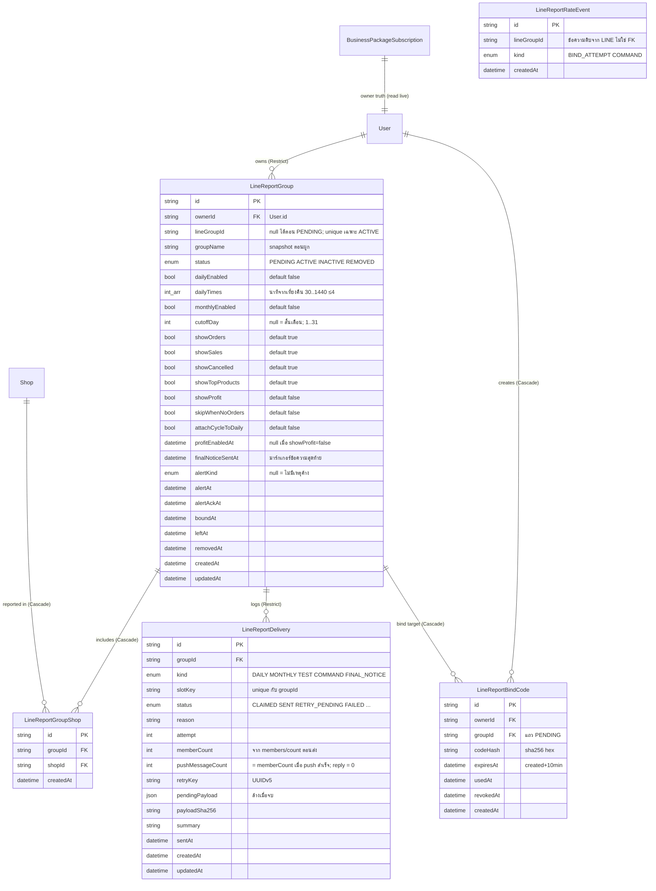

> **โมดูล:** 00068 — LINE Group Summary Report
> **ประเภทเอกสาร:** Database Design
> **เวอร์ชัน:** 1.0
> **วันที่จัดทำ:** 2026-10-05
> **สถานะ:** Draft (รอ Controller review — มีข้อที่ต้องตัดสินใน §9)
> **เจ้าของเอกสาร:** SA / safepay-database

# DATABASE: รายงานสรุปยอดเข้ากลุ่ม LINE

> 🛑 เอกสารนี้ออกแบบอย่างเดียว — **ยังไม่ได้แก้ `prisma/schema.prisma` ยังไม่มีไฟล์ migration ยังไม่ได้รันคำสั่ง prisma/DB ใด ๆ** ชื่อ field/โมเดลเป็น "ข้อเสนอ" ที่ยืนยันกับสไตล์ schema จริงแล้ว (ดู §1.2) DEV เป็นผู้เขียน schema + migration ตามเอกสารนี้

---

## 1. Overview

ฟีเจอร์นี้เพิ่ม **5 ตารางใหม่ + 5 enum ใหม่** ไม่แตะตาราง/คอลัมน์เดิม (additive ล้วน) เก็บข้อมูลของ: กลุ่ม LINE ที่ผูก, ร้านที่รวมในกลุ่ม, โค้ดผูกชั่วคราว, ตัวนับกันเดา/ถามถี่, และ log การส่ง (ซึ่งเป็นทั้ง idempotency claim, ที่เก็บ payload สำหรับ retry, และข้อมูลต้นทุนสำหรับ ops)

- **Store:** PostgreSQL 16 (Supabase) ผ่าน Prisma — ที่เดียว ไม่มี store อื่น
- **เอกสารต้นทาง:** [[BRD]] §2.2–2.7, §4.3 (state), §8 · [[LINE-API-Facts]] §3 (retry key), §5 (ต้นทุน) · [[PRD]] §11 (OQ-1..5 อนุมัติแล้ว) · [[SDS]] ของโมดูลนี้ยังไม่จัดทำ — §7 trace กลับ BRD แทนและต้องย้ายอ้างไป SDS เมื่อมี
- **ไม่มี RLS** — authorization อยู่ที่ service (`ownerId` ใน where ตั้งแต่ query แรก — AC-LGS-04-5, 08-4)

### 1.1 การตัดสินใจหลัก (สรุป — เหตุผลอยู่ในหัวข้อที่อ้าง)

| # | เรื่อง | ตัดสิน | ที่ |
|---|--------|--------|-----|
| D-1 | ผูกกลุ่มผ่านอะไร | **แถว `LineReportGroup` สถานะ `PENDING` แถวเดียว** + โค้ดชี้ `groupId` (ไม่เก็บ `shopIds` ในโค้ด) | §3.3 |
| D-2 | กลุ่มเดียวกัน 2 เจ้าของ | **partial unique index** บน `lineGroupId` WHERE `status='ACTIVE'` (raw SQL) | §3.1, §5 |
| D-3 | เวลาส่งรายวัน | `Int[]` = นาทีจากเที่ยงคืน (30..1440) + CHECK | §3.1 |
| D-4 | ตัวนับเดาโค้ด/ถามถี่ | **ตาราง DB** (`LineReportRateEvent`) ไม่ใช่ in-memory | §3.4 |
| D-5 | log การส่ง | `LineReportDelivery` unique `(groupId, slotKey)`; claim ด้วย `createMany skipDuplicates`; payload เก็บชั่วคราวเฉพาะระหว่างรอ retry | §3.5 |
| D-6 | แจ้งเจ้าของ | **ฟิลด์บนกลุ่ม** (`alertKind/alertAt/alertAckAt`) ไม่ทำตารางแจ้งเตือน; "แพ็กเกจหยุด" ไม่เก็บเป็นธง อ่านสดจากเจ้าของ | §3.1, §6 |
| D-7 | onDelete | `Restrict` จาก Group→User และ Delivery→Group (log ไม่ถูก cascade ลบ) · `Cascade` เฉพาะข้อมูลชั่วคราว/คอนฟิก | §4 |

### 1.2 Existing schema reviewed (`prisma/schema.prisma`)

- PK = `String @id @default(uuid())` ทุกโมเดล · timestamp = `createdAt DateTime @default(now())` + `updatedAt DateTime @updatedAt` · **ไม่ใช้ `@@map`** (0 จุด) ชื่อตาราง = ชื่อโมเดล PascalCase
- ค่าสถานะที่เป็นวงจรชีวิตใช้ `enum` (เช่น `BusinessPackageStatus { ACTIVE LOCKED_RENEWAL_FAILED }`); ค่าที่ราคา/ชนิดเปลี่ยนบ่อยใช้ `String` (`tier`, `source`, `Shop.kind`)
- `SmsCode` (บรรทัด ~1556): `codeHash String @unique` = SHA-256 hex, `expiresAt`, `usedAt DateTime?`, `deliveryStatus String` — **ใช้เป็นต้นแบบโค้ดผูก**
- `BusinessPackageSubscription`: `ownerId String @unique` → `User` (`onDelete: Cascade`), `status BusinessPackageStatus` — **มีแถว = เป็น/เคยเป็นสมาชิก, ไม่มีแถว = FREE** (ใช้อ่านสถานะสดต่อเจ้าของ ไม่คัดลอกมาเก็บ)
- `Shop.userId` = owner-at-creation (ไม่ unique), `deletedAt`, `purgedAt`, `packageLockedAt`; `User.deletedAt/purgedAt` — **ทั้ง User และ Shop เป็น soft-delete + purge PII ไม่ใช่ลบแถวจริง** (`src/services/account-deletion.service.ts`)
- partial unique index ที่มีอยู่แล้ว (`Shop_userId_personal_key`, `UserBadge_*`) = **unmanaged SQL ที่ Prisma DSL ประกาศไม่ได้** → ตามแบบเดียวกัน (คอมเมนต์ 🛑 บนโมเดล + ห้าม `db pull`/`migrate dev`)
- **ไม่มี model/field ของฟีเจอร์นี้อยู่แล้ว** (ไม่มีโมเดลชื่อ `LineReport*`) — `LineChannel`/แชท LINE ของ 00025 เป็นคนละ OA ไม่ใช้ร่วม (BR-LGS-21)

---

## 2. ERD



---

## 3. Tables (PostgreSQL / Prisma)

### 3.1 `LineReportGroup` — กลุ่ม LINE ที่ผูก + การตั้งค่าทั้งหมดของกลุ่ม

หนึ่งแถว = หนึ่ง "การผูก" (BRD §4.3) การตั้งค่าอยู่ในแถวเดียวกัน (ไม่แยกตาราง settings — 1:1 และอ่านพร้อมกันทุกครั้ง) แถว `PENDING` คือ wizard ที่ยังไม่ได้พิมพ์ `ผูก` (ดู §3.3 เหตุผล)

| Column | Type | Null | Default | Key / หมายเหตุ |
|--------|------|------|---------|----------------|
| `id` | `text` (uuid) | NO | `uuid()` | PK |
| `ownerId` | `text` | NO | — | FK → `User.id` `Restrict` · IDX |
| `lineGroupId` | `text` | **YES** | NULL | `null` ได้เฉพาะ `PENDING` ที่ยังไม่เคยผูก · **partial UNIQUE WHERE status='ACTIVE'** (raw SQL) + IDX ธรรมดา |
| `groupName` | `text` | NO | `''` | snapshot จาก `GET /group/{id}/summary` ตอนผูก (ไม่ sync ภายหลัง — AC ระบุเก็บแค่ groupId + ชื่อ, BR-LGS-19) |
| `status` | `LineReportGroupStatus` | NO | `PENDING` | `PENDING`/`ACTIVE`/`INACTIVE`/`REMOVED` |
| `dailyEnabled` | `boolean` | NO | `false` | OQ-5: ปิดหลังผูก |
| `dailyTimes` | `integer[]` | NO | `{}` | นาทีจากเที่ยงคืน: `30`=00:30 … `1410`=23:30, `1440`=24:00 · CHECK §5 |
| `monthlyEnabled` | `boolean` | NO | `false` | OQ-5 |
| `cutoffDay` | `integer` | YES | NULL | `null` = สิ้นเดือน · CHECK 1..31 |
| `showOrders` / `showSales` / `showCancelled` / `showTopProducts` | `boolean` | NO | `true` | AC-LGS-12-1 |
| `showProfit` | `boolean` | NO | `false` | AC-LGS-12-1 ค่าตั้งต้นปิด |
| `skipWhenNoOrders` | `boolean` | NO | `false` | AC-LGS-19-7 |
| `attachCycleToDaily` | `boolean` | NO | `false` | AC-LGS-11-6 |
| `profitEnabledAt` | `timestamptz` | YES | NULL | ตั้งเมื่อ `showProfit` false→true, **ล้างเป็น NULL เมื่อปิด** ⇒ non-null ⇔ `showProfit` (AC-LGS-12-4 "บันทึกเวลาที่เปิด") |
| `finalNoticeSentAt` | `timestamptz` | YES | NULL | มาร์กเกอร์ "ส่งข้อความสุดท้ายของช่วงหยุดแล้ว" (AC-LGS-21-2) — ดู §6 |
| `alertKind` | `LineReportAlertKind` | YES | NULL | เหตุที่ค้างอยู่ — §6 |
| `alertAt` | `timestamptz` | YES | NULL | เวลายกเหตุ |
| `alertAckAt` | `timestamptz` | YES | NULL | เจ้าของกดรับทราบ |
| `boundAt` | `timestamptz` | YES | NULL | ผูกสำเร็จล่าสุด (ผูกใหม่ = ทับ) |
| `leftAt` | `timestamptz` | YES | NULL | เวลาที่บอทถูกนำออก (`leave`) |
| `removedAt` | `timestamptz` | YES | NULL | เจ้าของลบ (เพิ่มเองนอกรายการที่สั่ง — ใช้กับ cleanup §6) |
| `createdAt` / `updatedAt` | `timestamptz` | NO | `now()` / `@updatedAt` | ตาม convention |

**ตัดสินใจ `dailyTimes`: `Int[]` ไม่ใช่ `String[]`**
- ตัวเลือกเวลาเป็นก้าว 30 นาที + `24:00` (BRD AC-LGS-10-1) → จำนวนเต็ม 30..1440 แทน `"HH:MM"` ได้ตรงตัว; `24:00` = 1440 เรียงท้ายสุดโดยไม่ต้อง special-case (String `"24:00"` ต้อง parse พิเศษ ไม่ใช่ `Date`)
- เทียบ/เรียง/หา "เวลาแรกสุดของวัน" (AC-LGS-11-4) = `Math.min`/`sort()` ตัวเลข ไม่ต้อง parse
- DB บังคับค่าได้ด้วย CHECK `<@ ARRAY[30,60,…,1440]` (§5) — String ทำแบบนี้ไม่สะอาด
- แลกกับ: อ่านใน psql แล้วไม่ตรงตา → ให้ `SLOT_OPTIONS` ใน `src/lib/line-report/schedule.ts` เป็น SSOT เดียวของการแปลง นาที↔`HH:MM`
- ไม่แยกตาราง `LineReportSlot`: เพดาน 4 ค่าและอ่านทุกครั้งพร้อมกลุ่ม (ตรงกับเหตุผลที่ `Room.images` เป็น Json ไม่แยกตาราง)
- "ซ้ำเวลาเดิมไม่ได้" และ "เรียงลำดับ" บังคับที่ service/Valibot (CHECK ซ้ำไม่ได้โดยไม่มี subquery) — slotKey unique ใน §3.5 เป็นตาข่ายชั้นสองกันส่งซ้ำอยู่แล้ว

**ค่าตั้งต้นหลังผูก (OQ-5):** `dailyEnabled=false`, `monthlyEnabled=false`, `dailyTimes={}` — **ผูกสำเร็จต้องไม่เปลี่ยนค่าเหล่านี้** (แถวใหม่ได้ค่า default; ผูกใหม่ของแถวเดิมคงค่าที่ตั้งไว้ตาม AC-LGS-07-4) และ sweep ต้องไม่ถือ "dailyTimes ว่าง" เป็นเวลาส่ง

**ธง `showProfit` เทียบ stored-flag convention:** `showProfit` เป็นคำสั่งของเจ้าของ (ไม่ใช่ภาพนิ่งของสถานะอื่น) จึงเป็นตัวตัดสินได้ แต่ **ต้องไม่ให้ธงชนะความจริงอื่น**: ถ้าร้านใดในกลุ่มไม่มีสิทธิ์/ข้อมูลกำไรไม่ครบ ตัวประกอบข้อความตัดสินจากสถานะร้านสดตอนส่ง (AC-LGS-14/15/18) ไม่ใช่จากธงนี้อย่างเดียว

### 3.2 `LineReportGroupShop` — ร้านที่รวมในกลุ่ม

| Column | Type | Null | Default | Key |
|--------|------|------|---------|-----|
| `id` | `text` (uuid) | NO | `uuid()` | PK |
| `groupId` | `text` | NO | — | FK → `LineReportGroup.id` `Cascade` |
| `shopId` | `text` | NO | — | FK → `Shop.id` `Cascade` · IDX |
| `createdAt` | `timestamptz` | NO | `now()` | — |

- `@@unique([groupId, shopId])` — ร้านเดียวกันอยู่ได้หลายกลุ่ม (E-13) แต่ซ้ำในกลุ่มเดียวไม่ได้
- **≤ 10 ร้านต่อกลุ่ม และ ≥ 1 ร้าน บังคับที่ service** (`line-report-group.service.ts` ใน transaction เดียวกับการแก้รายการ) — ไม่ทำ trigger/CHECK ข้ามแถว เพราะ PostgreSQL CHECK ดูข้ามแถวไม่ได้ และ trigger เป็นของที่ Prisma drift/ทีมไม่คุ้น; เทสแข่งกันบังคับ (เหมือน AC-LGS-04-6)
- ที่จุดเขียนทุกจุด (สร้างโค้ด, `PUT .../shops`) ต้องกรองร้านด้วย `Shop.userId = ownerId AND deletedAt IS NULL AND purgedAt IS NULL` ใน query แรก (BR-LGS-02) — ตารางนี้ **ไม่ได้ตรวจความเป็นเจ้าของให้**
- ร้านที่ถูกล็อก/ลบภายหลัง **แถวยังอยู่** (AC-LGS-09-3 ห้ามลบเงียบ) — สถานะอ่านสดจาก `Shop` ตอนแสดง/ส่ง (ไม่คัดลอกธงมาเก็บ)

### 3.3 `LineReportBindCode` — โค้ดผูกกลุ่ม 6 หลัก

| Column | Type | Null | Default | Key |
|--------|------|------|---------|-----|
| `id` | `text` (uuid) | NO | `uuid()` | PK |
| `ownerId` | `text` | NO | — | FK → `User.id` `Cascade` · IDX |
| `groupId` | `text` | NO | — | FK → `LineReportGroup.id` `Cascade` (แถว `PENDING`) |
| `codeHash` | `text` | NO | — | SHA-256 hex ของโค้ด 6 หลัก (แบบ `SmsCode.codeHash`) · **partial UNIQUE** §5 |
| `expiresAt` | `timestamptz` | NO | — | `createdAt + 10 นาที` (AC-LGS-04-2) |
| `usedAt` | `timestamptz` | YES | NULL | consume แบบอะตอมมิก `updateMany where usedAt null` |
| `revokedAt` | `timestamptz` | YES | NULL | โค้ดเก่าถูกแทนด้วยโค้ดใหม่ (AC-LGS-04-3) |
| `createdAt` | `timestamptz` | NO | `now()` | — |

**ตัดสินใจ D-1: ผูกผ่านแถว `PENDING` ไม่ใช่เก็บ `shopIds` ในโค้ด**
- state diagram (BRD §4.3) มีสถานะ `PENDING` เป็นของจริงอยู่แล้ว และ `INACTIVE → PENDING` ("ผูกใหม่") ต้อง **คงค่าที่ตั้งไว้** — ถ้าเก็บ `shopIds` ในโค้ดจะมี 2 ที่เก็บรายการร้าน (โค้ด + `LineReportGroupShop`) ต้อง copy ตอนผูกและผูกใหม่ต้องมี path พิเศษ; ใช้แถวกลุ่มเป็นที่เดียวทั้ง wizard ใหม่และผูกใหม่ → **โค้ดเหลือแค่ "กุญแจชั่วคราวที่ชี้ groupId"**
- ตอนใช้โค้ด (AC-LGS-05-5) ตรวจซ้ำจากแถวสด: เจ้าของแพ็กเกจ ACTIVE, ร้านใน `LineReportGroupShop` ยังเป็นของเจ้าของ/ไม่ลบ, ยังไม่เกิน 10 กลุ่ม → แล้ว `PENDING → ACTIVE` พร้อมใส่ `lineGroupId`/`groupName`/`boundAt` ใน transaction เดียว
- **ผลข้างเคียงที่ต้องรู้:** เพดาน 10 กลุ่ม "นับทุกสถานะที่ไม่ลบ" (AC-LGS-04-6) = นับ `status <> 'REMOVED'` รวม `PENDING` ⇒ wizard ที่ทิ้งค้างกินโควตา → cleanup §6 + เจ้าของลบ `PENDING` ได้ (`PENDING → REMOVED`, BRD §4.3) ผูกใหม่ของ `INACTIVE` ใช้แถวเดิม ไม่เพิ่มจำนวน
- **ผูกใหม่ข้ามกลุ่ม LINE:** แถวเดิมที่ `INACTIVE→PENDING` ยังถือ `lineGroupId` เก่า (partial unique ไม่นับเพราะไม่ใช่ `ACTIVE`); พอผูกสำเร็จ `lineGroupId` ถูกทับด้วยกลุ่มที่พิมพ์โค้ดจริง ⇒ เจ้าของย้ายรายงานไปกลุ่ม LINE ใหม่ได้โดยคงค่า (ข้อ 3 ใน §9 ขอยืนยันว่าตั้งใจหรือไม่)

**โค้ด 6 หลัก = space เล็ก (10⁶) → ต้องกันชนกันข้ามเจ้าของ:** ตอนพิมพ์ `ผูก 482913` ระบบหาโค้ดจากค่าอย่างเดียว (ไม่รู้เจ้าของ) ⇒ โค้ดที่ยังใช้ได้ต้อง **ไม่ซ้ำกันทั้งระบบ** → partial unique บน `codeHash` (§5); service สร้างด้วย `createMany({ skipDuplicates })` แล้วเช็ก `count === 1`, ชนก็สุ่มใหม่ (สูงสุดไม่กี่ครั้ง) — **ห้ามปล่อยชนแล้วดัก P2002** (convention insert-then-catch)
- **1 โค้ดที่ใช้ได้ต่อเจ้าของ (AC-LGS-04-3):** ใน transaction เดียวกัน `SELECT … FOR UPDATE` แถว `User` ของเจ้าของ (ตัวเดียวกับที่ serialize เพดาน 10 กลุ่ม — AC-LGS-04-6 แข่ง 2 คำขอ) → `UPDATE … SET revokedAt=now() WHERE ownerId AND usedAt IS NULL AND revokedAt IS NULL` → insert โค้ดใหม่ + partial unique `(ownerId) WHERE usedAt IS NULL AND revokedAt IS NULL` เป็นตาข่ายชั้นสองถ้ามีใครข้าม lock
- **hash:** ตาม AC-LGS-04-4 ใช้ SHA-256 แบบ `sms-code.service` — ข้อควรรู้: 6 หลัก brute-force จาก hash ที่หลุดได้ในไม่กี่วินาที จึงพึ่ง expiry 10 นาที + ใช้ครั้งเดียว + ตัวนับเดา; ถ้า DEV ใช้ HMAC-SHA256 กับ pepper (`NEXTAUTH_SECRET`) แทน sha256 เปล่า จะแข็งกว่าและยังเป็น "hash" ตาม AC (ข้อ 4 ใน §9)
- ไม่ลบแถวทันทีหลังใช้ (เก็บ `usedAt` เพื่อตอบว่า "ใช้แล้ว" ภายในข้อความเดียวกับผิด/หมดอายุ — AC-LGS-06-4 ข้อความเหมือนกัน แต่ log ภายในแยกได้) cleanup §6

### 3.4 `LineReportRateEvent` — ตัวนับเดาโค้ดผิด + ถามถี่ต่อกลุ่ม

| Column | Type | Null | Default | Key |
|--------|------|------|---------|-----|
| `id` | `text` (uuid) | NO | `uuid()` | PK |
| `lineGroupId` | `text` | NO | — | **ไม่ใช่ FK** (กลุ่มที่ยังไม่ผูกก็ต้องนับได้ — AC-LGS-22-9) · IDX |
| `kind` | `LineReportRateKind` | NO | — | `BIND_ATTEMPT` / `COMMAND` |
| `createdAt` | `timestamptz` | NO | `now()` | — |

`@@index([lineGroupId, kind, createdAt])` · เก็บเฉพาะ `lineGroupId` ที่ LINE ส่งมา + ชนิด + เวลา — **ไม่เก็บ userId สมาชิก ไม่เก็บเนื้อความ/โค้ดที่พิมพ์** (AC-LGS-06-5, BR-LGS-19)

**ตัดสินใจ D-4: ตาราง DB ไม่ใช่ in-memory**
- `lib/sms-consume-rl.ts` เป็น `globalThis` ต่อ instance — บน Vercel serverless ที่มีหลาย instance/ cold start ตัวนับ **ไม่ถูกแชร์**: ผู้โจมตีกระจายคำขอข้าม instance ได้เกิน "5 ครั้ง/10 นาที" ตามอำเภอใจ และ instance ใหม่เริ่มนับ 0 — ใช้ไม่ได้กับกติกาความปลอดภัยของการผูก (AC-LGS-06-1) ที่เทสต้อง "5 ผิดแล้วโค้ดถูกครั้งที่ 6 → ปฏิเสธ" แบบ deterministic
- ต้นทุน DB เล็ก: 1 insert + 1 count บน index ต่อ 1 คำสั่งในกลุ่ม (คำสั่ง `สรุป…` ปริมาณต่ำ) — ไม่มี Redis/KV ในสแตก ไม่เพิ่ม infra
- **วิธีนับ "บันทึกก่อน แล้วนับ" (กัน race โดยไม่ต้องล็อก):** ทุกครั้งที่เข้า path เสี่ยง → insert 1 แถว → นับแถว `kind` เดียวกันของ `lineGroupId` ในช่วง 10 นาทีที่ผ่านมา (รวมแถวตัวเอง) → `BIND_ATTEMPT`: นับ > 5 ⇒ ปฏิเสธโดยไม่ตรวจโค้ด · `COMMAND`: นับ = 11 ⇒ ตอบ "ถามถี่เกินไป" ครั้งเดียว, นับ > 11 ⇒ เงียบ (ตรง AC-LGS-22-8 โดยไม่ต้องมีธง "เตือนแล้ว") — นับ "ทุกครั้งที่พิมพ์" ไม่ใช่เฉพาะผิด เพราะเทียบ AC "ผิดเกิน 5 แล้วครั้งที่ 6 ที่ถูกก็ปฏิเสธ" ได้เหมือนกันและไม่ต้อง update แถวหลังรู้ผล (overshoot สูงสุด = จำนวน event ขนานของกลุ่มเดียว ซึ่งไม่เกินความถี่ที่ LINE ส่ง)
- insert เป็น insert ธรรมดา **ไม่มี unique** ⇒ ไม่เกิด ERROR ใน log Postgres (convention insert-then-catch-logs-every-error)
- ข้อจำกัดที่รับ: ตารางโตตามปริมาณคำสั่ง → cleanup แถวเก่ากว่า 1 วันใน cron เดียวกับ §6; ถ้าปริมาณสูงจริงค่อยย้ายไป KV (`ponytail:` เพดาน = หลายสิบ event/วินาทีรวมทั้งระบบ)

### 3.5 `LineReportDelivery` — log การส่ง (claim + retry + ต้นทุน)

หนึ่งแถว = หนึ่ง "ความตั้งใจจะส่ง/ตอบ" ที่มีกุญแจ `(groupId, slotKey)` — เป็นทั้ง idempotency claim (AC-LGS-20-1), ที่เก็บ payload สำหรับ retry (AC-LGS-20-5), ประวัติ 10 รายการ (AC-LGS-23-2) และฐานคิดต้นทุน (AC-LGS-23-4)

| Column | Type | Null | Default | Key / หมายเหตุ |
|--------|------|------|---------|----------------|
| `id` | `text` (uuid) | NO | `uuid()` | PK |
| `groupId` | `text` | NO | — | FK → `LineReportGroup.id` **`Restrict`** |
| `kind` | `LineReportDeliveryKind` | NO | — | `DAILY`/`MONTHLY`/`TEST`/`COMMAND`/`FINAL_NOTICE` |
| `slotKey` | `text` | NO | — | รูปแบบด้านล่าง · **UNIQUE กับ `groupId`** |
| `status` | `LineReportDeliveryStatus` | NO | `CLAIMED` | ดู enum §3.6 |
| `reason` | `text` | YES | NULL | โค้ดสาเหตุสั้น (เช่น `HTTP_500`, `TIMEOUT`, `BOT_NOT_IN_GROUP`, `TOKEN_INVALID`, `NO_SENDABLE_SHOPS`, `REPLY_TOKEN_EXPIRED`) — ชุดค่าเต็มกำหนดใน SRS; ห้ามใส่ token/secret (AC-LGS-23-3) |
| `attempt` | `integer` | NO | `0` | จำนวนครั้งที่เรียก LINE จริง (สูงสุด 2: ครั้งแรก + retry 1 ครั้ง — AC-LGS-20-4) |
| `httpStatus` | `integer` | YES | NULL | status ของความพยายามล่าสุด (debug) |
| `memberCount` | `integer` | YES | NULL | ค่า `count` จาก `GET /group/{id}/members/count` **ณ ตอนส่ง** |
| `pushMessageCount` | `integer` | NO | `0` | หน่วยต้นทุนที่ใช้จริง — ดูด้านล่าง |
| `retryKey` | `text` | YES | NULL | UUIDv5 จาก `(groupId, slotKey)` — คงที่ข้าม retry (LINE-API-Facts §3) |
| `pendingPayload` | `jsonb` | YES | NULL | `messages[]` ที่จะ push — **ชั่วคราว** ดูด้านล่าง |
| `payloadSha256` | `text` | YES | NULL | hash ของ payload ที่ส่ง (หลักฐานถาวรแทนเนื้อหา) |
| `summary` | `text` | YES | NULL | สรุปสั้นอ่านออก เช่น "2 ร้าน · ช่วง 00:00–18:02" (ไม่มียอดเงิน) |
| `sentAt` | `timestamptz` | YES | NULL | LINE รับสำเร็จเมื่อไร (รวม 409 = ถือว่า SENT) |
| `createdAt` | `timestamptz` | NO | `now()` | = เวลา claim |
| `updatedAt` | `timestamptz` | NO | `@updatedAt` | — |

**รูปแบบ `slotKey` (unique ต่อกลุ่ม — ทุกชนิดต้องมีค่าเฉพาะตัวเพื่อให้ unique ใช้ได้ทุกแถว):**

| kind | slotKey | หมายเหตุ |
|------|---------|----------|
| `DAILY` | `D:2026-10-05@18:00` / `D:2026-10-04@24:00` | ตาม AC-LGS-20-1 (วันที่ไทย + เวลา slot) |
| `MONTHLY` | `M:2026-10-05` | วันที่ไทยของรอบที่ปิด |
| `TEST` | `T:<uuid สุ่ม>` | ทุกครั้งเป็นแถวใหม่; โควตา 5/วัน = นับแถว `TEST` + `SENT` ของวันไทยนั้น (ใน transaction — AC-LGS-13-1) |
| `COMMAND` | `C:<webhookEventId>` | ULID ของ LINE ⇒ **webhook redelivery ไม่ตอบซ้ำ** (idempotent ฟรี) |
| `FINAL_NOTICE` | `F:<ISO เวลาที่ package เริ่มหยุด>` | key ต่อ "ช่วงหยุด" — หยุดรอบใหม่ = key ใหม่ (SRS กำหนดแหล่งเวลาให้ตรง `lockedAt`/วันยกเลิก) |

> push เดียวที่รวมรายวัน+รายเดือน (AC-LGS-11-5): claim **2 แถว** (`D:` และ `M:`) แต่ push ครั้งเดียวใช้ retry key ของแถว `D:`; แถว `D:` ถือ `pushMessageCount`, แถว `M:` เก็บ `0` + `reason='IN_DAILY_PUSH'` เพื่อไม่ให้ต้นทุนถูกนับซ้ำ (ข้อ 5 ใน §9)

**`pushMessageCount` — เก็บอะไร:** ตาม [[LINE-API-Facts]] §5 ต้นทุนนับ **ตามจำนวนผู้รับในกลุ่ม ไม่ใช่จำนวน message object** ⇒ `pushMessageCount = memberCount` (จาก `members/count` ตอนส่ง; ไม่คูณจำนวน bubble) เมื่อ push **สำเร็จ**; ล้มเหลว/ข้าม/MISSED = `0`; **reply = `0` เสมอ** (ไม่นับโควตา) เป็นค่า **ประมาณขอบบน** เพราะ `count` รวมคนที่บล็อกซึ่ง LINE ไม่นับ และยังไม่ยืนยันว่านับ OA เองหรือไม่ (UNCONFIRMED) — ใช้คำนวณต้นทุนโดยประมาณ ไม่ใช่ใบแจ้งหนี้ ถ้าเรียก `members/count` ไม่ได้ ให้ใช้ค่าล่าสุดของกลุ่มจากแถวก่อนหน้า (SRS กำหนด) แล้วใส่ `reason` กำกับ

**`pendingPayload` (Json) — เก็บเพื่อ retry แล้วล้าง:**
- LINE บังคับ retry เนื้อหา "เหมือนเดิมทุกไบต์" + key เดิม (LINE-API-Facts §3, AC-LGS-20-5) ⇒ ต้องเก็บ payload ตั้งแต่ก่อน push ครั้งแรก: ลำดับ = claim (`createMany skipDuplicates`) → คำนวณ → **เขียน `pendingPayload`+`retryKey` ลงแถว** → push → ผลสำเร็จ/ล้มถาวร ⇒ **`pendingPayload = NULL`** (เหลือ `payloadSha256` + `summary`)
- กัน crash หลัง claim ก่อน push: แถว `CLAIMED` ที่ค้างเกิน N นาทีถูก sweep รอบถัดไปหยิบมา push ซ้ำด้วย key เดิม — **ปลอดภัยเพราะ retry key กันซ้ำ 24 ชม.** (409 = SENT)
- payload มีตัวเลขยอดขายของร้าน (ข้อมูลธุรกิจ ไม่มี PII ลูกค้า) → **cleanup ล้าง `pendingPayload` ของแถวที่เก่ากว่า 24 ชม.ทุกแถว** (เกิน 24 ชม. retry key หมดอายุ ส่งซ้ำไม่ได้อยู่แล้ว)
- ⚠️ ขัดกับถ้อยคำ AC-LGS-23-3 ("ไม่เก็บเนื้อหาข้อความทั้งก้อน") ถ้าตีความว่า "ห้ามเก็บแม้ชั่วคราว" — ผมตีความว่าห้ามเก็บ **ถาวรใน log** (ข้อ 1 ใน §9)

**ตรวจ "ไม่ส่งซ้ำ" ที่ DB:** `createMany({ data, skipDuplicates: true })` → ได้ `count===1` = เราเป็นผู้ชนะ claim; `count===0` = มีคนถือ slot แล้ว (cron ซ้อน E-14) — ไม่ throw ⇒ ไม่มี 23505 ใน log ทุก tick (ตรง AC-LGS-20-2)

### 3.6 Enums ใหม่

```prisma
enum LineReportGroupStatus   { PENDING ACTIVE INACTIVE REMOVED }
enum LineReportDeliveryKind  { DAILY MONTHLY TEST COMMAND FINAL_NOTICE }
enum LineReportDeliveryStatus {
  CLAIMED RETRY_PENDING SENT FAILED
  SKIPPED_NO_ORDERS MISSED NO_SENDABLE_SHOPS REPLY_FAILED
}
enum LineReportAlertKind     { BOT_REMOVED SEND_FAILED NO_SENDABLE_SHOPS }
enum LineReportRateKind      { BIND_ATTEMPT COMMAND }
```

- ใช้ `enum` (ไม่ใช่ `String`) เพราะเป็นชุดปิดที่ partial index/CHECK/โค้ดอ้างตรง ๆ และให้ `tsc` บังคับ exhaustiveness (convention enum-value-removal); แลกกับ `ALTER TYPE … ADD VALUE` ถ้าจะเพิ่มค่าทีหลัง (เพิ่มได้ปลอดภัย, **ลบค่าไม่ได้ง่าย** → ตั้งชื่อให้ครอบคลุมตั้งแต่แรก ไม่ใส่ค่าที่ยังไม่แน่ใจ)
- `PENDING`/`INACTIVE` ของกลุ่ม ≠ "แพ็กเกจหยุด": **การหยุดเพราะแพ็กเกจไม่เป็น enum ค่า** (BRD §4.3 note) — อ่านสดจาก `BusinessPackageSubscription.status` ของเจ้าของ (stored-flag-vs-owner-truth) ⇒ ไม่มี `PAUSED` ใน `LineReportGroupStatus` และไม่มี `PACKAGE_PAUSED` ใน `LineReportAlertKind` (หน้าตั้งค่าแสดงแบนเนอร์ "หยุดชั่วคราว" จากสถานะแพ็กเกจสด — AC-LGS-21-7)
- ไม่มีสถานะ delivery แยกสำหรับ `TOKEN_INVALID` — ใช้ `RETRY_PENDING` + `reason='TOKEN_INVALID'` โดย **ไม่เพิ่ม `attempt`** (ไม่เผา retry — AC-LGS-20-7) และหมดหน้าต่าง 60 นาที → `MISSED`; `BOT_NOT_IN_GROUP`/ลบกลุ่ม → `FAILED` + reason (AC-LGS-20-6) — SRS ต้องล็อก state machine นี้

---

## 4. ความสัมพันธ์และ `onDelete`

| FK | onDelete | เหตุผล |
|----|----------|--------|
| `LineReportGroup.ownerId → User` | **Restrict** | `User` ไม่ถูกลบแถวจริง — `account-deletion.service` ทำ soft-delete + purge PII (`deletedAt/purgedAt`) ⇒ Restrict ไม่ขวางเส้นทางจริง; กัน "ลบ User แล้ว log/กลุ่ม/ประวัติต้นทุนหายเป็นลูกโซ่" ที่ไม่ได้ตั้งใจ (เทียบ `BusinessPackageSubscription` ที่ `Cascade` เพราะเป็นข้อมูลสิทธิ์ล้วน ไม่ใช่ log) |
| `LineReportDelivery.groupId → LineReportGroup` | **Restrict** | log ต้องอยู่ตามอายุ 90 วัน ไม่ตามกลุ่ม (AC-LGS-08-3: ลบกลุ่ม = `status REMOVED` ไม่ลบแถว) ⇒ ไม่มี path ลบกลุ่มจริงในแอป; ห้ามมี `deleteMany` ของ `LineReportGroup` ในโค้ด production |
| `LineReportGroupShop.groupId → LineReportGroup` | Cascade | คอนฟิกล้วน ไม่ใช่หลักฐาน |
| `LineReportGroupShop.shopId → Shop` | Cascade | `Shop` ก็ soft-delete/purge (แถวไม่หาย — AC-LGS-09-3 ต้องเห็นร้านพร้อมป้ายสถานะ); Cascade มีผลเฉพาะ hard-delete ร้านซึ่งไม่เกิดในแอป |
| `LineReportBindCode.ownerId → User` / `.groupId → LineReportGroup` | Cascade | ข้อมูลชั่วคราว (หมดอายุ 10 นาที) — ไม่มีค่าหลักฐาน |
| `LineReportRateEvent` | — (ไม่มี FK) | อ้าง `lineGroupId` ดิบ ตั้งใจให้นับกลุ่มที่ยังไม่ผูกได้ |

**Account purge:** `src/services/account-deletion.service.ts` ต้องเพิ่มขั้น (งาน DEV/ติดตามใน SRS): ทุกกลุ่มของ user → `status='REMOVED'`, `removedAt=now()`, ล้าง `groupName`, **ล้างค่า `lineGroupId` (set NULL)** เพราะเป็นตัวระบุภายนอก, พยายามให้บอท `leave` (best-effort — AC-LGS-08-2) และ revoke โค้ดค้างทั้งหมด; log (`LineReportDelivery`) **คงไว้ตามอายุ 90 วัน** (ไม่มี PII — มีแต่ id/ตัวเลขต้นทุน/ข้อความสาเหตุ) การ test ที่ต้องล้างข้อมูลต้องลบตามลำดับ Delivery → BindCode/GroupShop → Group → User **scope ด้วย id ที่เทสสร้าง** (HR13) — Restrict จะทำให้ลบผิดลำดับล้มเสียงดัง ซึ่งตั้งใจ

---

## 5. Indexes และ Constraints

### 5.1 Indexes (Prisma-managed)

| Table | Columns | Type | Rationale (query pattern) |
|-------|---------|------|---------------------------|
| `LineReportGroup` | `(ownerId, status)` | BTREE | รายการกลุ่มของเจ้าของ + นับเพดาน 10 (`status <> REMOVED`) + นับแบนเนอร์ |
| `LineReportGroup` | `(status)` | BTREE | sweep หยิบ `ACTIVE` ทุก 30 นาที |
| `LineReportGroup` | `(lineGroupId)` | BTREE | webhook ค้นหากลุ่มจาก groupId ที่ LINE ส่งมา (join/leave/ผูก) |
| `LineReportGroupShop` | `(groupId, shopId)` | **UNIQUE** | ไม่ซ้ำร้านในกลุ่ม · ครอบคลุม lookup ตาม `groupId` |
| `LineReportGroupShop` | `(shopId)` | BTREE | หา "ร้านนี้อยู่กลุ่มไหนบ้าง" + FK |
| `LineReportBindCode` | `(ownerId)` | BTREE | หาโค้ดค้างของเจ้าของ + FK |
| `LineReportBindCode` | `(groupId)` | BTREE | FK + หาโค้ดของ PENDING |
| `LineReportBindCode` | `(expiresAt)` | BTREE | cleanup |
| `LineReportRateEvent` | `(lineGroupId, kind, createdAt)` | BTREE | นับ event ใน 10 นาทีล่าสุดต่อกลุ่ม/ชนิด · cleanup ใช้ `createdAt` ผ่าน seq/สแกนช่วงเก่า (ตารางเล็ก) |
| `LineReportDelivery` | `(groupId, slotKey)` | **UNIQUE** | idempotent claim (AC-LGS-20-1) |
| `LineReportDelivery` | `(groupId, createdAt)` | BTREE | "10 ล่าสุดต่อกลุ่ม" (`orderBy createdAt desc take 10`) และนับส่งทดสอบวันนี้ (range `createdAt ≥ ต้นวันไทย` + กรอง `kind='TEST'` ในผลเล็กมาก) |
| `LineReportDelivery` | `(status, createdAt)` | BTREE | sweep หยิบ `RETRY_PENDING`/`CLAIMED` ค้าง |
| `LineReportDelivery` | `(createdAt)` | BTREE | cleanup 90 วัน + ops: `SUM(pushMessageCount)` ต่อวัน (join `LineReportGroup.ownerId` ต่อเจ้าของ) |

ไม่ทำ index แยกสำหรับ "นับส่งทดสอบ" (`(groupId, kind, createdAt)`): ต่อกลุ่มต่อวันมีแถวไม่เกินหลักสิบ → `(groupId, createdAt)` พอ (ไม่ over-index ตารางที่เขียนบ่อย)

### 5.2 Constraints ที่ต้องเขียนเป็น raw SQL ในไฟล์ migration (Prisma ประกาศไม่ได้)

```sql
-- D-2: กลุ่ม LINE หนึ่งกลุ่ม ACTIVE ได้กับ 1 แถว (= 1 เจ้าของ) — AC-LGS-06-2
CREATE UNIQUE INDEX "LineReportGroup_lineGroupId_active_key"
  ON "LineReportGroup"("lineGroupId")
  WHERE "status" = 'ACTIVE' AND "lineGroupId" IS NOT NULL;

-- โค้ดที่ยังใช้ได้ต้องไม่ซ้ำทั้งระบบ (หาเจ้าของจากโค้ดอย่างเดียว) + 1 โค้ดที่ใช้ได้ต่อเจ้าของ
CREATE UNIQUE INDEX "LineReportBindCode_codeHash_live_key"
  ON "LineReportBindCode"("codeHash")
  WHERE "usedAt" IS NULL AND "revokedAt" IS NULL;
CREATE UNIQUE INDEX "LineReportBindCode_ownerId_live_key"
  ON "LineReportBindCode"("ownerId")
  WHERE "usedAt" IS NULL AND "revokedAt" IS NULL;

-- CHECK (ตารางใหม่ล้วน ไม่มีแถวเดิมให้ชน = additive ปลอดภัย)
ALTER TABLE "LineReportGroup"
  ADD CONSTRAINT "LineReportGroup_dailyTimes_valid_chk"
    CHECK (cardinality("dailyTimes") <= 4
           AND "dailyTimes" <@ ARRAY[30,60,90,120,150,180,210,240,270,300,330,360,390,420,450,480,
                                     510,540,570,600,630,660,690,720,750,780,810,840,870,900,930,960,
                                     990,1020,1050,1080,1110,1140,1170,1200,1230,1260,1290,1320,1350,
                                     1380,1410,1440]::integer[]),
  ADD CONSTRAINT "LineReportGroup_cutoffDay_valid_chk"
    CHECK ("cutoffDay" IS NULL OR "cutoffDay" BETWEEN 1 AND 31),
  ADD CONSTRAINT "LineReportGroup_metric_any_chk"          -- AC-LGS-12-2 ต้องเปิดอย่างน้อย 1 ตัวเลข
    CHECK ("showOrders" OR "showSales" OR "showCancelled" OR "showTopProducts" OR "showProfit"),
  ADD CONSTRAINT "LineReportGroup_active_has_group_chk"    -- ACTIVE ต้องมี groupId
    CHECK ("status" <> 'ACTIVE' OR "lineGroupId" IS NOT NULL);

ALTER TABLE "LineReportDelivery"
  ADD CONSTRAINT "LineReportDelivery_counts_nonneg_chk"
    CHECK ("attempt" BETWEEN 0 AND 2 AND "pushMessageCount" >= 0);
```

- CHECK ทั้งหมดอยู่บน **ตารางที่สร้างใหม่ใน migration เดียวกัน** ⇒ ไม่มีแถวเดิม, ไม่ชนกับ constraint/ข้อมูลเดิม (ตามกฎ "migration CHECK ต้อง additive" — ห้ามไป `ALTER` CHECK บนตารางเดิมในฟีเจอร์นี้)
- ชื่อ constraint ใหม่ไม่ซ้ำของเดิม (ขึ้นต้น `LineReport…`) — DEV ต้อง `rg` ยืนยันก่อนเขียน
- unmanaged index/CHECK ข้างต้นต้องมีคอมเมนต์ 🛑 บนโมเดลใน `schema.prisma` (แบบ `Shop`/`UserBadge`) และ **ห้าม `prisma db pull` / `migrate dev`** หลัง apply (introspection ไม่เห็นของพวกนี้ อาจพยายาม "แก้ให้ตรง" แล้ว DROP) — ตามกฎ "ห้าม migrate dev" ของโปรเจกต์

### 5.3 สิ่งที่บังคับที่ service (ไม่ใช่ DB) — ต้องมีเทสที่แดงถ้าถอด

| กฎ | จุดบังคับ | เหตุที่ DB บังคับไม่ได้ |
|----|-----------|---------------------------|
| ≤ 10 ร้าน/กลุ่ม, ≥ 1 ร้าน | `line-report-group.service` (transaction) | CHECK ข้ามแถวไม่ได้ |
| ≤ 10 กลุ่ม/เจ้าของ (นับ `status<>REMOVED`) | `bind-code` + ตอนใช้โค้ด ใน transaction ที่ `FOR UPDATE` แถว `User` (AC-LGS-04-6) | เช่นเดียวกัน; serialize ด้วยล็อกแถวเจ้าของ |
| `dailyTimes` ไม่ซ้ำ + เรียงลำดับ | Valibot + service | CHECK ตรวจซ้ำในอาร์เรย์ไม่ได้ (subquery ไม่อนุญาต) |
| ร้านต้องเป็นของเจ้าของ (`Shop.userId`) | `listReportableShops(ownerId)` | ข้ามตาราง |
| ส่งทดสอบ ≤ 5/วัน | `sendTest` นับแถว `TEST`+`SENT` | ขึ้นกับ "วันไทย" |

---

## 6. การแจ้งเจ้าของ (OQ-2) — ฟิลด์บนกลุ่ม ไม่ทำตาราง

**ตัดสินใจ D-6:** ใช้ `alertKind` + `alertAt` + `alertAckAt` บน `LineReportGroup` ไม่สร้างตาราง `LineReportAlert`
- เหตุผล: OQ-2 อนุมัติแค่ **แบนเนอร์ในหน้าตั้งค่า + จุดแจ้งบนเมนู** (ไม่มีกล่องแจ้งเตือน/ประวัติ/ช่องทางนอกแอป) ⇒ ต้องการ "เหตุที่ค้างอยู่ตอนนี้ต่อกลุ่ม" เพียง 1 ค่า; ตารางแยกให้ประวัติที่ไม่มีใครอ่านและต้อง join ทุกหน้า
- กติกา "ไม่แจ้งซ้ำสำหรับเหตุเดียวกัน" (AC-LGS-24-3):
  - **raise(kind):** ถ้า `alertKind = kind` อยู่แล้ว → **ไม่ทำอะไร** (ไม่ปลุกซ้ำ แม้เจ้าของรับทราบแล้ว); ถ้า `alertKind` เป็น NULL หรือชนิดอื่น → ตั้ง `alertKind=kind, alertAt=now, alertAckAt=NULL`
  - **ack:** ตั้ง `alertAckAt=now` เท่านั้น (แบนเนอร์/จุดแจ้งหาย แต่ `alertKind` คงไว้ ⇒ เหตุเดิมยังไม่ถูกยกใหม่)
  - **resolve:** เมื่อแก้เหตุ (ผูกใหม่สำเร็จ → ล้าง `BOT_REMOVED`; ส่งสำเร็จครั้งถัดไป → ล้าง `SEND_FAILED`/`NO_SENDABLE_SHOPS`) → ตั้ง `alertKind/alertAt/alertAckAt = NULL`
  - จุดแจ้งบนเมนู = มีกลุ่มของเจ้าของที่ `alertKind IS NOT NULL AND alertAckAt IS NULL` (นับด้วย index `(ownerId, status)` + กรอง — ปริมาณ ≤ 10 แถว/เจ้าของ)
- ข้อจำกัดที่รับ: เก็บได้ **1 เหตุต่อกลุ่ม** (เหตุใหม่ชนิดอื่นทับเหตุเก่า) พอสำหรับ MVP — ถ้าต้องการประวัติ/หลายเหตุพร้อมกัน ค่อยแยกตาราง
- **"แพ็กเกจหยุด" ไม่เก็บเป็น `alertKind`** — เจ้าของเปลี่ยนสถานะได้เอง (ต่ออายุ) ธงที่เก็บจะค้างผิดจริง (stored-flag-vs-owner-truth) ⇒ แบนเนอร์/จุดแจ้งส่วนนี้ **คำนวณสดจาก `BusinessPackageSubscription.status` ของเจ้าของ** ตอนเปิดหน้า (ต่อ owner ไม่ใช่ต่อกลุ่ม); BRD AC-LGS-24-1 ที่ระบุ "แพ็กเกจหยุด" เป็นเหตุแจ้งจึงบรรลุผลด้วย presenter ไม่ใช่คอลัมน์
- **`finalNoticeSentAt`** เป็นเพียง "ตัวกันส่งซ้ำ" ไม่ใช่ตัวตัดสินว่าแพ็กเกจหยุดหรือไม่: sweep อ่านสถานะแพ็กเกจสดก่อนเสมอ → ถ้าหยุดและ `finalNoticeSentAt IS NULL` ⇒ ส่งข้อความสุดท้าย (claim `F:` slotKey) แล้วตั้งมาร์กเกอร์; ถ้าแพ็กเกจ ACTIVE และมาร์กเกอร์ไม่ว่าง ⇒ ล้างเป็น NULL (lazy reset ในรอบ sweep — AC-LGS-21-5) ไม่ต้องผูก hook เข้า package service

### Retention / cleanup (cron ใหม่ หรือพ่วง route sweep — SRS ตัดสิน; ทุกคำสั่งลบมี predicate เวลาเสมอ ไม่มี `deleteMany()` เปล่า)

| ข้อมูล | อายุ | การกระทำ |
|--------|------|----------|
| `LineReportDelivery` | 90 วัน (OQ-4) | ลบแถว `createdAt < now-90d` แบบเป็นชุด |
| `LineReportDelivery.pendingPayload` | 24 ชม. | `UPDATE … SET pendingPayload=NULL WHERE pendingPayload IS NOT NULL AND createdAt < now-24h` |
| `LineReportRateEvent` | 1 วัน | ลบ `createdAt < now-1d` (หน้าต่างนับสูงสุด 10 นาที) |
| `LineReportBindCode` | 7 วัน | ลบ `createdAt < now-7d` |
| `LineReportGroup` ที่ `PENDING` ไม่เคยผูก | 7 วันหลังโค้ดสุดท้ายหมดอายุ | ตั้ง `REMOVED` (ไม่ลบแถว) — คืนโควตา 10 กลุ่ม (ข้อ 2 ใน §9) |

- แถว `REMOVED` คงอยู่ (ไม่มี purge ในรอบนี้) — เก็บ `lineGroupId`/`groupName` ของกลุ่มที่เจ้าของลบเอง จนกว่าจะมีนโยบาย purge (ข้อ 6 ใน §9)
- **PII:** ไม่มีคอลัมน์ PII ของสมาชิกกลุ่ม/ลูกค้า (AC-LGS-06-5: ไม่มี LINE userId, ไม่มีเนื้อข้อความ); `lineGroupId`/`groupName` เป็นตัวระบุกลุ่มของเจ้าของ — ล้างตอน account purge (§4); `pendingPayload` มียอดขายระดับร้าน → ชั่วคราว (ข้างบน)

---

## 7. Query impact (ตัวอย่าง — ห้าม `select *`; เลือกเฉพาะคอลัมน์)

- **sweep:** `LineReportGroup` `where { status:'ACTIVE', OR:[{dailyEnabled:true},{monthlyEnabled:true}] }` `select { id, ownerId, lineGroupId, dailyTimes, cutoffDay, ... }` → index `(status)`; สถานะแพ็กเกจเจ้าของอ่านสดต่อ `ownerId` (batch `findMany where ownerId in`) ไม่ใช้ธงในกลุ่ม
- **claim:** `lineReportDelivery.createMany({ data:[{groupId, kind, slotKey, status:'CLAIMED'}], skipDuplicates:true })` → unique `(groupId, slotKey)`
- **10 ล่าสุด:** `where { groupId } orderBy { createdAt:'desc' } take 10 select { createdAt, kind, status, reason }` + กลุ่มต้อง `where { id, ownerId }` ก่อน (AC-LGS-23-2, 08-4) — **ไม่ select `pendingPayload`**
- **ops ต้นทุน (ตัวอย่าง SQL อ่านอย่างเดียว):**
  ```sql
  SELECT date_trunc('day', d."createdAt" AT TIME ZONE 'Asia/Bangkok') AS day_th,
         g."ownerId", d."groupId", SUM(d."pushMessageCount") AS push_units
  FROM "LineReportDelivery" d JOIN "LineReportGroup" g ON g."id" = d."groupId"
  WHERE d."createdAt" >= now() - interval '30 days' AND d."status" = 'SENT'
  GROUP BY 1, 2, 3 ORDER BY 1 DESC;
  ```
  ใช้ `(createdAt)`; เจ้าของสกัดผ่าน join ไม่เก็บ `ownerId` ซ้ำใน log (เจ้าของกลุ่มไม่เปลี่ยน แต่ไม่จำเป็นต้อง denormalize ที่ปริมาณนี้)
- **ปริมาณประมาณ:** เจ้าของ ≤ 10 กลุ่ม × ≤ 4 รอบ/วัน × 90 วัน ≈ ≤ 3,600 แถว/เจ้าของ ⇒ ต่อ 1,000 เจ้าของ ≈ 3.6M แถวขอบบนสุด (ส่วนใหญ่ใช้น้อยกว่ามาก) — index ข้างบนรองรับ; ถ้าเกินค่อย partition ตามเดือน (`ponytail:` ยังไม่ทำ)

---

## 8. Migration Plan

### 8.1 ไฟล์และลำดับ

| ลำดับ | การเปลี่ยนแปลง | หมายเหตุ |
|-------|----------------|----------|
| 1 | `CREATE TYPE` 5 enum (§3.6) | ไม่มี dependency |
| 2 | `CREATE TABLE "LineReportGroup"` + index ธรรมดา + FK → `User` (`ON DELETE RESTRICT`) | ต้องมี enum |
| 3 | `CREATE TABLE "LineReportGroupShop"` (FK → Group, Shop Cascade) | หลัง 2 |
| 4 | `CREATE TABLE "LineReportBindCode"` (FK → User, Group Cascade) | หลัง 2 |
| 5 | `CREATE TABLE "LineReportRateEvent"` | ไม่มี FK |
| 6 | `CREATE TABLE "LineReportDelivery"` (FK → Group `RESTRICT`) | หลัง 2 |
| 7 | raw SQL: partial unique index ×3 + CHECK (§5.2) | ต่อท้ายไฟล์เดียวกัน (ตารางว่าง จึงไม่ล็อกนาน) |

- **ชื่อ migration (เสนอ):** `20261005100000_line_group_summary_reports` — ไฟล์เดียว (ล่าสุดบน branch นี้คือ `20260930100000_media_image_size`); DEV ต้องเช็กเลขที่ไม่ชนกับ migration ที่ merge เข้า `main` ระหว่างนี้ก่อน commit
- **วิธีสร้างไฟล์:** ห้ามใช้ `prisma migrate dev` / `db pull` (กฎโปรเจกต์: shared-DB drift + partial index ถูก introspect ทิ้ง) — เขียน SQL ตาราง/enum/index ธรรมดาให้ตรง `schema.prisma` (สร้างด้วย `prisma migrate diff --from-empty --to-schema-datamodel … --script` ซึ่งไม่ต้องต่อ DB ได้) แล้วต่อ raw SQL §5.2 ด้วยมือ → apply ด้วย `prisma migrate deploy` ที่ **ปักหมุด URL localhost:5434 ในคำสั่งตรง ๆ** (HR14)
- ตรวจหลังเขียน: `npx prisma validate` + เทียบ SQL กับ schema; ยืนยัน partial index ถูกสร้างจริงด้วย `\d "LineReportGroup"` บน local

### 8.2 Rollback

เป็นตารางใหม่ล้วน ยังไม่มีข้อมูลก่อน go-live ⇒ rollback = `DROP` ตามลำดับย้อนกลับ (Delivery → RateEvent → BindCode → GroupShop → Group → enum 5 ตัว) **แต่ห้ามรันเอง/ห้ามอัตโนมัติ** ("ห้าม drop เว้นแต่ Controller สั่งชัด"); หลัง go-live ที่มีแถว log/ตั้งค่าอยู่ การ rollback = **ข้อมูลหาย** ต้องสำรองก่อน (`pg_dump` เฉพาะ 5 ตาราง) — ทางที่ปลอดภัยกว่าคือ **ปิดฟีเจอร์ที่ชั้นแอป** (ลบ cron ใน `vercel.json`/ปิด route) ทิ้งตารางไว้ ไม่ต้อง DROP
rollback note ของ enum: `ALTER TYPE … ADD VALUE` ที่เพิ่มภายหลังย้อนไม่ได้ในทางปฏิบัติ

### 8.3 ผลกระทบ (Impact)

- **Prod:** ตารางใหม่ ไม่แตะตาราง/คอลัมน์/constraint ของเดิมแม้แต่ตัวเดียว ⇒ ไม่มี backfill, ไม่มี lock ตารางเดิม, ไม่มี downtime; โค้ดเก่าไม่รู้จักตารางเหล่านี้ ⇒ backward compatible เต็มที่ (deploy แล้วฟีเจอร์ยังไม่ทำงานจนตั้ง env `LINE_REPORT_BOT_*` — AC-LGS-05-9)
- **FK → `User`/`Shop`** เพิ่ม lock สั้นระดับ `SHARE ROW EXCLUSIVE` บนตารางพ่อตอน `ADD CONSTRAINT` (ตารางลูกว่าง ตรวจเร็ว) — ผลจริงเล็กน้อย

### 8.4 🛑 HR15 — ต้องบอก user ก่อน migrate (3 ข้อ)

1. **prod ไม่ต้องสั่งเอง** — push `main` = `prisma migrate deploy` บน prod ในตัว (ห้ามสั่ง migrate ชี้ prod)
2. **local ต้อง apply เอง** — ฐาน dev (localhost:5434) ยังไม่มีตารางเหล่านี้จนกว่าจะรัน `migrate deploy` ปักหมุด localhost
3. **migrate ล้ม = deploy ไม่ขึ้น** — SQL ที่ผิด (เช่น CHECK/partial index พิมพ์ผิด) ทำให้ build บน Vercel ล้มทั้งชุด ⇒ ต้องพิสูจน์ SQL บน local ก่อน merge

### 8.5 Enum ใหม่ที่ต้อง sync `docs/SRS.md` (HR11)

`LineReportGroupStatus` · `LineReportDeliveryKind` · `LineReportDeliveryStatus` · `LineReportAlertKind` · `LineReportRateKind` — พร้อมโมเดล 5 ตัว (data model section), รูปแบบ `slotKey`, และชุดค่า `reason` ที่ใช้ได้ (SSOT)

---

## 9. ข้อที่ไม่แน่ใจ / ต้องให้ Controller ตัดสิน

> **Controller ตัดสิน 2026-10-05:** (1) `pendingPayload` ชั่วคราวได้ — แก้ AC-LGS-23-3 แล้ว · (2) cleanup PENDING 7 วัน → เพิ่ม AC-LGS-23-6 · (3) ผูกใหม่ย้ายไปกลุ่ม LINE อื่นได้ ตั้งใจ (AC-LGS-07-4) · (4) ใช้ HMAC-SHA256 + secret ฝั่ง server (AC-LGS-04-4) — security ยืนยันอีกรอบตอนรีวิวโค้ด · (5)(6)(7) ยอมรับตามที่เสนอ

1. **AC-LGS-23-3 vs retry payload:** เก็บ `pendingPayload` ชั่วคราว (ล้างเมื่อจบ/ครบ 24 ชม.) — ตีความว่าไม่ขัด ถ้า AC หมายถึง "ห้ามแม้ชั่วคราว" จะทำ AC-LGS-20-5 (ส่ง payload เดิมทุกไบต์) ไม่ได้ ⇒ ต้องเลือก: แก้ถ้อยคำ AC-23-3 หรือยอมคำนวณใหม่+key ใหม่ (เสี่ยงส่งซ้ำ ตาม LINE-API-Facts §3)
2. **PENDING กินโควตา 10 กลุ่ม:** AC-LGS-04-6 นับ "ทุกสถานะที่ไม่ลบ" ⇒ wizard ที่ทิ้งค้างกินโควตา; เสนอ cleanup `PENDING` ไม่เคยผูก → `REMOVED` หลัง 7 วัน (เป็นข้อเสนอใหม่ ยังไม่อยู่ใน BRD) หรือเปลี่ยนนิยามเพดานเป็น "นับเฉพาะ `ACTIVE`+`INACTIVE`"
3. **ผูกใหม่ไปกลุ่ม LINE อื่น:** การออกแบบนี้ปล่อยให้ `INACTIVE→PENDING→ACTIVE` ทับ `lineGroupId` เป็นกลุ่มใหม่ได้ (คงค่าตั้งไว้) — BRD AC-LGS-07-4 พูดแค่ "แถวเดิมกลับเป็น ACTIVE"; ถ้าต้องการให้ผูกใหม่ได้เฉพาะกลุ่มเดิม ต้องเพิ่มเงื่อนไขตรวจ `lineGroupId` ตอนใช้โค้ด
4. **sha256 เปล่า vs HMAC สำหรับโค้ด 6 หลัก:** AC ระบุ "แบบ sms-code"; แนะนำ HMAC+pepper เพราะ space เล็ก — ขอ Controller/Security ยืนยัน
5. **push รวมรายวัน+รายเดือน:** ใช้ 2 แถว claim ต่อ 1 push (ต้นทุนบันทึกที่แถว `D:` เท่านั้น) — ต้องให้ SRS ล็อกว่า `M:` ล้ม/สำเร็จตาม push เดียวกัน
6. **นโยบาย purge แถว `REMOVED`:** ยังเก็บ `groupName`/`lineGroupId` ถาวรสำหรับกลุ่มที่เจ้าของลบ — ควรกำหนดอายุ (เช่น ล้าง 2 ฟิลด์หลัง 90 วัน เท่า log) หรือไม่
7. **`pushMessageCount` = ค่าประมาณขอบบน** (รวมคนบล็อก; ยังไม่ยืนยันว่านับ OA เอง/โควตา broadcast คือ pool เดียวกัน — LINE-API-Facts §5 UNCONFIRMED) — ใช้ประเมินต้นทุนได้ ไม่ใช่บัญชี
8. **ยังไม่ได้พิสูจน์ด้วย payload จริง:** รูปแบบ `webhookEventId` (ULID) ที่ใช้เป็น `slotKey` ของ `COMMAND` และขนาด `groupId` ของ LINE (ใช้ `text` ไม่จำกัดความยาวจึงปลอดภัย) — ตาม convention external-payload-schema ต้องเก็บ payload ดิบจาก OA ทดสอบก่อนล็อก validator

---

## 10. เทสฐานข้อมูล (HR13 / HR14)

- **HR14:** เทส/คำสั่งที่สร้าง-ล้าง schema (`migrate deploy` บน local, vitest integration) ต้องปักหมุด `DATABASE_URL=postgresql://…@localhost:5434/…` ในคำสั่งตรง ๆ — พิสูจน์ไม่ได้ว่า localhost = ห้ามรัน (prod ถูกล้างมาแล้ว 2026-07-31; `npm test` ในเครื่องชี้ Supabase prod ต้อง override)
- **HR13:** ห้าม `deleteMany()` เปล่า/TRUNCATE/DROP/`migrate reset`/`db pull` ในไฟล์เทส — เทสสร้าง `User`/`Shop`/`LineReportGroup` ด้วย id เฉพาะแล้วลบ **scope ด้วย id นั้น** ตามลำดับ Delivery → BindCode → GroupShop → Group → Shop → User (Restrict บังคับลำดับ); `LineReportRateEvent` ลบด้วย `lineGroupId` ที่เทสสร้าง (ใช้ prefix สุ่มต่อเทส เช่น `Ctest-<uuid>`)
- เทสที่ต้องมี (แดงถ้าถอด constraint): partial unique กลุ่ม ACTIVE ซ้ำ 2 เจ้าของ (INACTIVE/PENDING ซ้ำได้) · partial unique โค้ดสด (ชน `codeHash`, 2 โค้ดสดต่อเจ้าของ) · CHECK `dailyTimes` (5 ค่า/31 นาที/ค่า 0/ค่า 1441 ล้ม; 4 ค่า+1440 ผ่าน) · CHECK `cutoffDay` 0/32 ล้ม · CHECK ปิด metric ทั้งหมดล้ม · `createMany skipDuplicates` ซ้ำ `(groupId, slotKey)` → `count 0` ไม่ throw · แข่ง 2 คำขอพร้อมกันที่กลุ่มที่ 9 (AC-LGS-04-6) · สแกน `schema.prisma` ว่าไม่มีคอลัมน์ `userId` ของสมาชิก LINE (AC-LGS-06-5)

---

## 11. Traceability

| Table | BRD / Decision | สถานะ |
|-------|----------------|-------|
| `LineReportGroup` | FR-LGS-05..12, 21, 24 · §4.3 state · BR-LGS-03/04/05/09/15/19 | Draft |
| `LineReportGroupShop` | FR-LGS-04, 09 · BR-LGS-02 · E-7/E-8/E-13 | Draft |
| `LineReportBindCode` | FR-LGS-04, 05, 06 · BR-LGS-03 | Draft |
| `LineReportRateEvent` | AC-LGS-06-1, AC-LGS-22-8/9 (OQ-4) | Draft |
| `LineReportDelivery` | FR-LGS-13, 19, 20, 21, 22, 23 · BR-LGS-12/13/17/18 · LINE-API-Facts §3/§5 | Draft |

---

## 12. สรุป

เอกสารนี้กำหนดโครงสร้างข้อมูลของฟีเจอร์ 00068: **5 ตารางใหม่ + 5 enum, additive ล้วน, migration ไฟล์เดียว** ที่ผูกความถูกต้องสำคัญไว้ที่ DB (กลุ่ม ACTIVE ไม่ซ้ำเจ้าของ, โค้ดสดไม่ซ้ำ, slot ไม่ส่งซ้ำ, ค่าตารางเวลาอยู่ในช่วง) และกฎข้ามแถว (≤10 ร้าน/กลุ่ม, ≤10 กลุ่ม/เจ้าของ, วันไทย) ไว้ที่ service พร้อมเทสที่แดงถ้าถอดออก

**Open Questions:** ดู §9 (8 ข้อ — ข้อ 1, 2, 3, 4 ควรตัดสินก่อน DEV เขียน schema)
