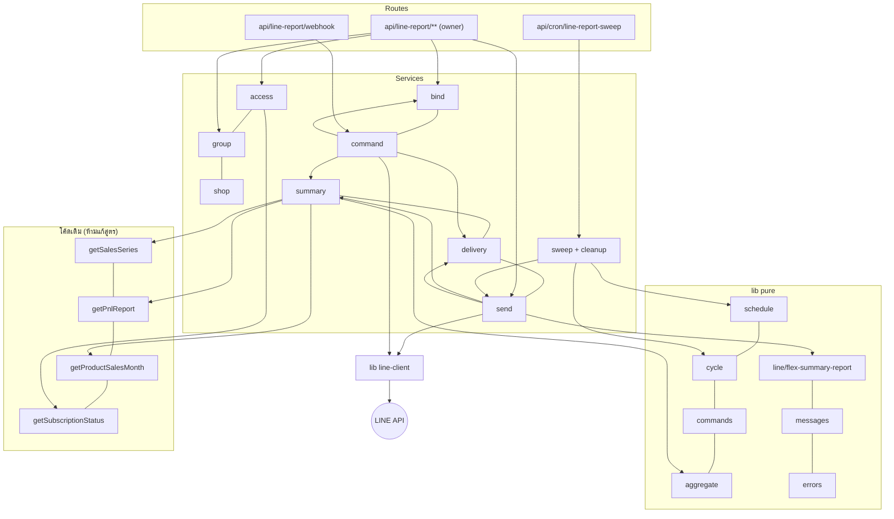
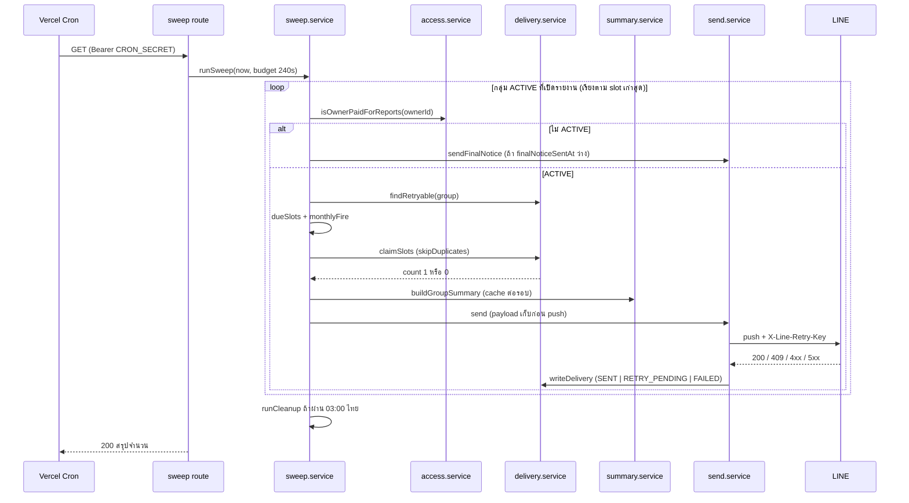
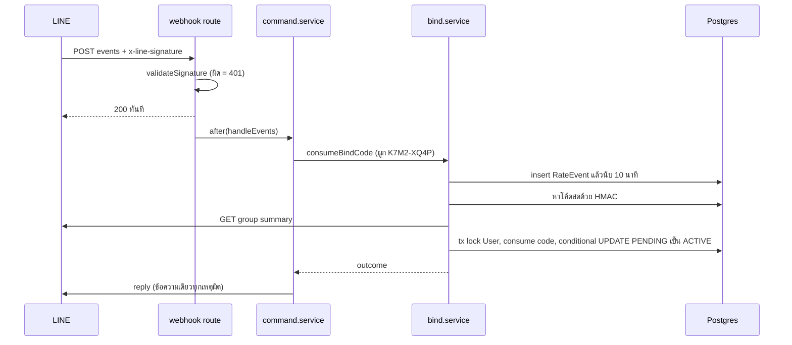

> **โมดูล:** M68-LineGroupSummary (00068) · **ประเภท:** SDS · **เวอร์ชัน:** 1.0 · **วันที่:** 2026-10-05 · **สถานะ:** Approved 2026-10-05 (Controller ตัดสิน NOTES — §12)
> ผู้อ่าน: Controller / DEV / QA · ทุกชื่อไฟล์/ฟังก์ชันของโค้ดเดิมที่อ้างถึงตรวจกับ repo จริงแล้ว (HR16) · ชื่อไฟล์ใหม่ = ข้อเสนอสัญญา

# SDS: รายงานสรุปยอดเข้ากลุ่ม LINE

## 1. บทนำ
### 1.1 วัตถุประสงค์
ออกแบบระดับไฟล์ + ลำดับงาน agent team (HR4) ให้ dev ลงมือได้โดยไม่ต้องเดา · stack: Next.js 16.1.1 App Router · Prisma 6.19.1 · Valibot 1.2.0 · NextAuth (service guard ไม่ใช่ RLS)
### 1.2 ขอบเขต
แตะ `prisma/` (ตาม [[DATABASE]] — **dispatch `safepay-database` ก่อน**) · `src/lib/line-report/**` · `src/lib/line/` · `src/services/` · `src/app/api/**` · `src/proxy.ts` · `vercel.json` · UI ใต้ `(paces)/seller/(dashboard)/business/line-reports/**` + 3 ทางเข้า + `docs/SRS.md`
### 1.3 อ้างอิง
[[SRS]] (TFR-LGS-xx) · [[API]] · UX spec `docs/superpowers/specs/2026-10-05-line-group-summary-report-design.md` · `docs/conventions/agent-team-workflow.md` · `docs/system/ui-guideline/README.md` (+ `seller/page-sourcing.md`) · skill `app-store-surfaces`

## 2. Architecture
### 2.1 มุมมอง
แบ่งชั้นตามของเดิม: **pure lib** (ตัดสิน/สูตรเวลา/ข้อความ — เทสได้ไม่แตะ DB) → **service** (query + side effect) → **route** (auth + validate + แปลง error) · ไม่เพิ่ม framework/ไลบรารีใหม่ (ใช้ `uuid` ที่มีแล้ว)

### 2.2 Deploy
เหมือนเดิม + cron ใหม่ 1 เส้นใน `vercel.json`: `{ "path": "/api/cron/line-report-sweep", "schedule": "*/30 * * * *" }` · `Asia/Bangkok = UTC+7` ไม่มี DST ⇒ `:00/:30` ตรงกันทั้งสองเขตเวลา

## 3. Component Design

### 3.1 ไฟล์ใหม่ทั้งหมด
**lib — `src/lib/line-report/`** (ห้าม import prisma · เว้น `line-client.ts`/`config.ts` ที่อ่าน env)
| ไฟล์ | หน้าที่ / export หลัก |
|---|---|
| `types.ts` | `ShopRef`, `ShopSummary{state:'OK'|'ERROR'|'EXCLUDED', orders, confirmed, unconfirmed, cancelled, top3?, profit?}`, `GroupSummary`, `Window{startIso,endIso,computedAt}`, `DueSlot`, `ReportKind` — **freeze ก่อน batch B** (workflow ข้อ 28) |
| `config.ts` | `isReportBotReady()`, `getReportBotConfig()`, `addFriendUrl()`, `sellerDashboardUrl()` |
| `schedule.ts` | `SLOT_OPTIONS`, `slotLabel`, `parseSlot`, `fireAt`, `dueSlots`, `resolveDailyWindow`, `dailySlotKey`, `nextSendAt` (UI/รายการกลุ่ม), `SLOT_WINDOW_MIN=60`, `RETRY_WINDOW_MIN=90`, `MISSED_LOOKBACK_MIN=180` |
| `cycle.ts` | `effectiveCutoff`, `cycleContaining`, `monthlyFire(group, now)`, `monthsInRange`, `cycleSlotKey` |
| `commands.ts` | `parseGroupCommand(text)` → `BIND{code}|TODAY|MONTH|null` |
| `bind-code.ts` | `generateBindCode()`, `hashBindCode(code)` (HMAC derive จาก `NEXTAUTH_SECRET`, fail-closed ถ้าไม่ตั้ง), `BIND_CODE_TTL_MS` |
| `retry-key.ts` | `retryKeyFor(groupId, slotKey)` = `v5(`${groupId}\|${slotKey}`, NS)` — NS เป็น UUID คงที่ที่ประกาศในไฟล์ |
| `aggregate.ts` | `sumDays`, `combineTotals`, `mergeTop3`, `canSumProfit(shops)`, `isMixedFinanceRules` |
| `errors.ts` | `LineReportError`, `LineReportErrorCode`, `LINE_REPORT_ERROR_STATUS` |
| `messages.ts` | ข้อความบอท (ทักทาย · ผูกสำเร็จ · ผูกไม่สำเร็จชุดเดียว · ผูกอยู่แล้ว(ตนเอง/คนอื่น) · ยังไม่ผูก · ถามถี่ · แพ็กเกจหยุด · ข้อความสุดท้าย · ช่วยเหลือแชทเดี่ยว) — ไทยล้วน ห้ามราคา |
| `delivery-reasons.ts` | ชุด `reason` + `describeReason(reason)` ป้ายไทย (ใช้ทั้ง API และ UI) |
| `validations.ts` | Valibot schemas ([[SRS]] §8) |
| `presenter.ts` | boolean/ป้ายที่ UI ตัดสิน: `groupBadge`, `canTest`, `canEdit`, `lockedCta(shell)`, `bannerFor(group, paused)` (+เทส mutation — `ui-boolean-needs-a-testable-home`) |
| `line-client.ts` | `pushToGroup`, `replyTo`, `fetchGroupSummary`, `fetchMemberCount`, `leaveGroup` — ห่อ `lineApiRequest` + token จาก config; `assertReady()` throw `BOT_NOT_CONFIGURED`; ห้าม log token |

**lib — `src/lib/line/flex-summary-report.ts`**: `buildSummaryReportFlex(input)`, `buildPlainNotice(text)`, `fitToLimits(messages)` (ตัดทอนตามลำดับ) · pure · รับข้อความ/เงินที่ format แล้วจากผู้เรียกหรือเรียก `formatBaht`/`format-date` (ไม่เขียนรูปแบบเอง)

**services — `src/services/`**
| ไฟล์ | หน้าที่ |
|---|---|
| `line-report-access.service.ts` | `isOwnerPaidForReports`, `ownsAnyShop`, `resolveReportAccess`, `countUnackedAlerts(ownerId)` |
| `line-report-shop.service.ts` | `listReportableShops(ownerId)` (query แรกกรอง `userId`+`deletedAt`+`purgedAt`+`packageLockedAt`), `assertReportable`, `resolveSendableShops(group)` → `{sendable, excluded[]}`, `replaceGroupShops` |
| `line-report-group.service.ts` | `listGroups`, `getGroupDetail`, `updateSettings` (ตรวจ state รวม), `removeGroup`, `raiseAlert/ackAlert/resolveAlert`, `markInactive(lineGroupId)` |
| `line-report-bind.service.ts` | `createBindCode(ownerId,{shopIds})`, `reissueBindCode(ownerId, groupId)`, `consumeBindCode(input)` → `BindOutcome`, `recordRateEvent`, `countRecent` |
| `line-report-summary.service.ts` | `buildGroupSummary(group, sendableShops, window, flags, cache)`; `SweepCache` |
| `cancelled-order-count.service.ts` | `countCancelledOrders(shopId, startIso, endIso)` — SSOT นับยกเลิก (คอมเมนต์อ้าง `jobStatusCounts`) |
| `line-report-delivery.service.ts` | `claimSlots`, `writeDelivery`, `markSent/markRetry/markFailed/markMissed`, `countTestsToday`, `listRecent(groupId,10)`, `findRetryable`, `clearPayload` |
| `line-report-send.service.ts` | `sendScheduled(group, due, ctx)`, `retryDelivery`, `sendTest`, `sendFinalNotice` — **ที่เดียวที่เรียก push** |
| `line-report-command.service.ts` | `handleEvents(events)` → `join/leave/message`; `replyCommand` — **ไม่ import push** (เทสสแกน) |
| `line-report-sweep.service.ts` | `runSweep({now, budgetMs})`, `runCleanup(now)` |

**routes**
`src/app/api/line-report/_shared.ts` (`requireReportAccess`, `parseBody`, `json` ที่ใส่ `Cache-Control: no-store`, `toErrorResponse`) · `groups/route.ts` · `bind-code/route.ts` · `groups/[id]/route.ts` · `groups/[id]/bind-code/route.ts` · `groups/[id]/shops/route.ts` · `groups/[id]/test/route.ts` · `groups/[id]/ack/route.ts` · `webhook/route.ts` · `src/app/api/cron/line-report-sweep/route.ts`

**UI** (ไฟล์ใต้ `src/app/(paces)/seller/(dashboard)/business/line-reports/`) `page.tsx` · `loading.tsx` · `new/page.tsx` · `[groupId]/page.tsx` · `components/` {`GroupList`, `GroupRow`, `StatusBadge`, `LockedState`, `EmptyState`, `BindWizard`, `BindCodeBox`, `GroupSettings`, `ShopPicker`, `ScheduleCard`, `MetricsCard`, `FlexPreview`, `SampleBubble`, `DeliveryHistory`, `GroupMenu`, `AlertBanner`}

**แก้ไฟล์เดิม:** `prisma/schema.prisma` (+migration) · `src/proxy.ts` · `vercel.json` · `src/lib/seller-menu.ts` · `src/i18n/dictionaries/{th,en}.ts` · `src/lib/business-package.ts` · `src/services/account-deletion.service.ts` · `shop/components/ShopQuickLinks.tsx` · `_shared/SellerBottomNav.tsx` · `(dashboard)/layout.tsx` · `shop/page.tsx` · `business/page.tsx` · `.env.example` · `docs/SRS.md`

### 3.2 สัญญาฟังก์ชันที่ต้อง freeze (ลายเซ็น)
```ts
// schedule.ts
type DueSlot = { slotKey: string; dateIso: string; minutes: number; fireAtMs: number }
dueSlots(g: {dailyEnabled; dailyTimes; boundAt}, now: Date):
  { send: DueSlot[]; missed: DueSlot[] }
// cycle.ts
cycleContaining(dateIso: string, cutoffDay: number | null): { startIso: string; endIso: string }
monthlyFire(g: {monthlyEnabled; cutoffDay; dailyTimes}, now: Date):
  { cycle: { startIso; endIso }; fireAtMs: number; slotKey: string } | null
// bind.service.ts
type BindOutcome = 'OK'|'INVALID'|'RATE_LIMITED'|'ALREADY_BOUND_SELF'|'ALREADY_BOUND_OTHER'|'NOT_PAID'
consumeBindCode(i: { lineGroupId: string; code: string; now: Date }):
  Promise<{ outcome: BindOutcome; groupName?: string; shopNames?: string[] }>
// send.service.ts — push อยู่ที่นี่ที่เดียว
sendScheduled(group, due: { daily?: DueSlot; monthly?: MonthlyDue }, ctx: SweepCtx): Promise<void>
// command.service.ts
handleEvents(events: unknown[], receivedAtMs: number): Promise<void>
```

### 3.3 การรวมช่วงข้ามเดือน (ทีละร้าน)
```
months = monthsInRange(startIso, endIso)                // ≤2 เดือน (รอบ ≤31 วัน)
for each shop (allSettled):
  for m in months:  series = cache(shop,m) ?? getSalesSeries(shop,'daily',{year,month},false,vertical)
                    orders += Σ series.orderCounts[d-1]  for d in daysOf(m ∩ [start,end])
                    confirmed/unconfirmed likewise
  cancelled = cache ?? countCancelledOrders(shop,start,end)
  if flags.showTopProducts: rows = months.flatMap(getProductSalesMonth) → รวม qty/amount เฉพาะวัน → ตัด isCustom → rank
  if flags.showProfit:      pnl = getPnlReport(shop, resolveDateRange('custom',start,end), vertical)   // guard — ไม่เรียกเมื่อปิด
```
`sumDays` ใน `aggregate.ts` เป็นฟังก์ชันเดียวที่ตัดวัน (เทส mutation: เปลี่ยนขอบ ±1 วัน → parity แดง)

### 3.4 สัญญาการส่ง (`send.service`)
1. `isOwnerPaidForReports(group.ownerId)` (ไม่ผ่าน → ออก/final notice) → 2. `claimSlots` → 3. `resolveSendableShops` → 4. summary → 5. skip-check → 6. build + `fitToLimits` → 7. เขียน `pendingPayload={raw}`+`retryKey` → 8. `pushToGroup` → 9. จัดผลตามตาราง [[SRS]] TFR-18 → 10. `writeDelivery` ทุกทางออก (เทส: ทุก `return` ก่อนหน้ามี `writeDelivery(` — AC-23-1)

## 4. Data Flow

### 4.1 Sweep

### 4.2 Webhook + ผูกกลุ่ม

### 4.3 คำสั่ง `สรุปวันนี้`
`handleEvents` → parse → (กลุ่มไม่ผูก: reply "ยังไม่ผูก") → `RateEvent(COMMAND)` นับ → claim `C:<eventId>` → `isOwnerPaidForReports` (ไม่ ACTIVE: reply หยุดชั่วคราว) → `buildGroupSummary` (ธงเดียวกับกลุ่ม) → ตรวจ `now − event.timestamp < 50s` → `replyTo` → `writeDelivery(COMMAND, pushMessageCount 0)`
### 4.4 ส่งทดสอบ
route (L2) → `sendTest` tx: lock แถวกลุ่ม → นับ TEST วันไทย (CLAIMED/RETRY_PENDING/SENT) → ≥5 = 429 → insert `T:` → commit → summary → push ครั้งเดียว → ผล + `remaining`
### 4.5 กรณีล้มเหลว
| กรณี | ผล |
|---|---|
| push 5xx/429/timeout รอบแรก | `RETRY_PENDING` → tick ถัดไปส่ง `payload` เดิม + key เดิม; ล้มอีก = `FAILED` + alert `SEND_FAILED` |
| push 400 + summary 404 | `INACTIVE` + alert `BOT_REMOVED` + `FAILED(BOT_NOT_IN_GROUP)` ไม่ retry |
| 401/403 | `RETRY_PENDING` ไม่เพิ่ม attempt + `[line-report][OPS]` log; พ้น RETRY_WINDOW = `MISSED` |
| 409 | `SENT` |
| ร้านหนึ่ง throw | แสดง "ดึงข้อมูลไม่สำเร็จ" ไม่นับยอด · ทุกร้าน throw = `ALL_SHOPS_FAILED` → retry |
| cron ล่ม >60 นาที | slot → `MISSED` (≥ `boundAt`) ไม่ส่งย้อนหลัง |
| after() ถูกตัดกลางคัน (webhook) | คำสั่งหาย (ผู้ใช้พิมพ์ใหม่) — ยอมรับ ไม่มี queue |

## 5. Integration Points
| จุด | ประเภท | สัญญา | ถ้าล่ม |
|---|---|---|---|
| LINE Messaging API | external | `src/lib/line/client.ts` `lineApiRequest` (Bearer ผ่าน header, timeout 10s) | ตาม §4.5 |
| ฟังก์ชันตัวเลขเดิม | internal | `getSalesSeries(shopId,mode,period,includeFinance,vertical)` `dashboard.service.ts:215` · `getPnlReport(shopId,range,vertical)` `pnl.service.ts:110` · `getProductSalesMonth(shopId,year,month0)` `product-sales-series.service.ts:96` · `resolveDateRange('custom',s,e)` `date-range.ts:169` | ร้านนั้น = ERROR ไม่ใช่ 0 |
| แพ็กเกจ | internal | `getSubscriptionStatus(ownerId)` `business-package.service.ts:36` | catch → ถือว่าไม่จ่าย |
| App Store | internal | `shouldHidePayments()`/`shouldOfferIap()` | หน้าล็อกไม่มี CTA |
| Vercel Cron | platform | `GET` + `Authorization: Bearer CRON_SECRET` | 401 |
- **Idempotency:** ที่ DB (`(groupId,slotKey)` unique) + LINE (retry key 24 ชม.) · **Timeout:** 10s ต่อคำขอ LINE · **Retry:** push 1 ครั้งต่อ slot (ต่าง tick) ไม่มี retry ใน request เดียว

## 6. Technical Decisions
| TD | ตัดสินใจ | เหตุผล | ตัดทิ้ง |
|---|---|---|---|
| 001 | **cleanup อยู่ใน sweep tick แรกหลัง 03:00 ไทย** | ไม่เพิ่ม cron/route/`CRON_SECRET` path · งานเบา (predicate เวลา) · ล้มก็ไม่กระทบรายงาน (try/catch แยก) | cron รายวันแยก (เพิ่มพื้นผิว + env ซ้ำโดยไม่ได้อะไร) — `ponytail:` เพดาน = ข้อมูลระดับ 10⁵ แถว/วัน; เกินค่อยแยก |
| 002 | โค้ดผูก HMAC derive จาก `NEXTAUTH_SECRET` | ไม่เพิ่ม env · มี precedent + fail-closed | env ใหม่ `LINE_REPORT_BIND_SECRET` |
| 003 | `pendingPayload = {raw: string}` | รักษาไบต์เดิมใน jsonb (LINE บังคับ retry เหมือนต้นฉบับ) | เก็บ object ตรงๆ (key reorder), เพิ่มคอลัมน์ text (เปลี่ยน contract) |
| 004 | claim ด้วย `createMany skipDuplicates` · เปลี่ยนสถานะกลุ่มด้วย `$executeRaw` conditional | ไม่ throw P2002 (convention `insert-then-catch…`) | try/catch P2002 |
| 005 | ส่วน "ยอดสะสมรอบ" ในรายวัน = รวมทุกร้านเฉพาะ orders/ยอดขาย/ยังไม่นับ/ยกเลิก (ตามธง) | จำกัดต้นทุน query + ข้อความสั้น (BRD ไม่ระบุเนื้อหาละเอียด) | ใส่ Top 3/กำไรด้วย |
| 006 | `RETRY_WINDOW=90` แยกจาก `SLOT_WINDOW=60` | รอบแรกเริ่มช้า 1 tick แล้วล้ม retry ยังทัน (ไม่งั้นโดน `MISSED`) | ใช้ 60 เดียว |
| 007 | owner API ทุกตัวผ่าน `_shared.ts` (`requireReportAccess`/`toErrorResponse`) | จุดเดียวของ error→HTTP (กันซ้ำรอย 00003 `OutOfStockError`) | try/catch ต่อ route |
| 008 | validations เป็นไฟล์ feature-local | `src/lib/validations.ts` เป็น hot file (HR17) · ยังเป็น Valibot ตามสไตล์ | ต่อท้ายไฟล์ใหญ่ |
| 009 | sweep ส่งทีละกลุ่ม (sequential) | ง่าย · budget 240s พอสำหรับ ~100+ กลุ่ม/tick · slot ค้างเก็บ tick ถัดไป — `ponytail:` เพิ่ม concurrency 3 เมื่อวัดแล้วไม่พอ | worker pool |
| 010 | ทางเข้ามือถือ: จุดแจ้งอยู่ที่แท็บ "ร้านค้า" | แถบล่างไม่มีแท็บ "ธุรกิจ" | เพิ่มแท็บ (ล้ม 5 ช่อง/FAB) |

## 7. Theme-source mapping (UI — ทุกชิ้นผ่าน `safepay-ux` ก่อน; commit ต้องมีบรรทัด `Base:`)
ราก theme: `/Users/craftman/orca/workspaces/safepay/Line-Group-Summary-Reports/theme/paces/Admin/TS/src/app/(admin)` (ตรวจแล้วมีจริงทุกไฟล์ในตาราง) · ราก repo: `/Users/craftman/orca/workspaces/safepay/Line-Group-Summary-Reports` · `{BL}` = `{repo}/src/app/(paces)/seller/(dashboard)/business/line-reports`

| ส่วน | target | theme source | ต้นแบบใน src |
|---|---|---|---|
| page shell/breadcrumb | `{BL}/page.tsx`, `new/page.tsx`, `[groupId]/page.tsx` | `(admin)/pages/pricing/page.tsx` | `business/page.tsx`, `business/[shopId]/invites/page.tsx` |
| การ์ด + header เส้นประ | `{BL}/components/GroupList.tsx` | `(admin)/ui/cards/page.tsx` | `business/components/QuotaUsageCard.tsx` |
| แถวกลุ่ม + ป้ายสถานะ | `GroupRow.tsx`, `StatusBadge.tsx` | `(admin)/ui/badges/page.tsx` | `settings/channels/LineChannelCard.tsx` (`TONE_BADGE`, โลโก้ `/images/logos/line.svg`) |
| แบนเนอร์ | `AlertBanner.tsx` | `(admin)/ui/alerts/page.tsx` | `business/components/LockedStateBanner.tsx` |
| switch/checkbox | `ScheduleCard.tsx`, `MetricsCard.tsx`, `ShopPicker.tsx` | `(admin)/form/elements/components/ChecksRadioSwitches.tsx` | `settings/auto-reply/order-agent/OrderAgentClient.tsx` · `business/[shopId]/invites/components/FinanceVisibilityToggle.tsx` |
| form-select (เวลา/วันตัดรอบ) | `ScheduleCard.tsx` | `(admin)/form/elements/components/InputTextfieldType.tsx` | — (ห้าม `hs-dropdown`/`FilterDropdown` — HR6a) |
| เมนู `⋯` | `GroupMenu.tsx` | `(admin)/ui/dropdowns/page.tsx` | `orders/components/OrderCardMenu.tsx` (React-controlled) |
| ตารางประวัติ | `DeliveryHistory.tsx` | `(admin)/apps/ecommerce/(orders)/orders/components/OrdersList.tsx` | `inventory/movements/[productId]/MovementHistoryTable.tsx` |
| ปุ่มคัดลอก/QR | `BindCodeBox.tsx` | `(admin)/ui/buttons/page.tsx` | `orders/[token]/components/CopyLinkButton.tsx` · `orders/components/OrderQrSheet.tsx` |
| confirm/toast | (ใน client components) | `(admin)/plugins/sweet-alerts/components/SweetAlerts.tsx` | `src/lib/paces-swal.ts` · `src/lib/paces-toast.ts` (HR9 `pacesToast` เท่านั้น) |
| skeleton | `loading.tsx` | — | `shop/loading.tsx` (`animate-pulse`) |
| stepper 3 ขั้น | `BindWizard.tsx` | `(admin)/form/wizard/components/Steps.tsx` (แนวคิดเท่านั้น — UX ระบุ "ไม่พบ match ที่ตรงพอ") | `LineChannelCard.tsx` `LineConnectWizard` — **ต้อง Controller ยืนยัน exception ก่อน dispatch E2** |
| countdown | `BindCodeBox.tsx` | **ต้อง Explore:** theme ไม่มี countdown — ใช้ `.badge` + `setInterval` ตาม UX spec | — |
| Flex preview | `FlexPreview.tsx`, `SampleBubble.tsx` | **ต้อง Explore:** ภาพแทนวัตถุภายนอก (LINE bubble) ไม่มี template ใน theme — ประกอบจาก `.card` + token Paces (ห้าม arbitrary value HR7) ตาม mockup `docs/superpowers/specs/2026-10-05-line-group-summary-report-mockup.html` | — |
| แถวลิงก์ `/business` | `business/page.tsx` | `(admin)/ui/cards/page.tsx` | `QuotaUsageCard.tsx` |
| ทางเข้ามือถือ | `ShopQuickLinks.tsx`, `SellerBottomNav.tsx` | `ProfileCard.tsx` ตามหัวไฟล์เดิม (ไม่ต้องหา theme ใหม่) | ไฟล์เดิมนั้นเอง |

## 8. Traceability
| SRS | SDS |
|---|---|
| TFR-01,02 | §3.1 access · presenter · หน้าล็อก |
| TFR-03 | §3.1 (แก้ไฟล์เดิม) · TD-010 |
| TFR-04,06,07 | bind.service · §4.2 · TD-002/004 |
| TFR-05 | webhook route · proxy |
| TFR-09,10 | schedule.ts · cycle.ts |
| TFR-13,14 | summary.service · aggregate · §3.3 |
| TFR-15 | flex-summary-report |
| TFR-17,18,19 | sweep · send · §4.1 · TD-001/003/006/009 |
| TFR-20 | command.service · §4.3 |
| TFR-21,22,23,24 | delivery · group · cleanup · account-deletion |
| §4.3 error map | `_shared.ts` · TD-007 |

## 9. Phase plan (agent team — HR4, batch ≤3, atomic commit ตาม retro 2026-05-10 "Bundle commits ตาม atomic unit")

**Gate ล่วงหน้า (Controller — ไม่ใช่โค้ด):** ① สร้าง OA + ตั้ง env (3 ตัว) + เปิด "Allow bot to join group chats" + webhook URL ② เก็บ payload ดิบ `join/leave/message(group)` ก่อนล็อก validator ③ ตัดสิน issue #1–#14 (NOTES) ที่เกี่ยวกับ scope — **ตัดสินแล้ว §12** · ④ ตัดสิน exception theme (stepper/countdown/Flex preview)

**ต้องผ่านขั้น UX:** **ใช่** สำหรับ P6 ทั้งหมด (paths: `src/app/(paces)/seller/(dashboard)/business/line-reports/**` · `shop/components/ShopQuickLinks.tsx` · `_shared/SellerBottomNav.tsx` · `(dashboard)/layout.tsx` · `shop/page.tsx` · `business/page.tsx`) — HR8 ไม่มีข้อยกเว้น · **ไม่** สำหรับ P1–P5 และ `src/lib/seller-menu.ts`/`src/i18n/**`/`src/lib/business-package.ts` (ไม่อยู่ใต้ path ที่ HR8 ระบุ; ป้ายเมนู/ไอคอนมาจาก UX spec แล้ว)

`{R}` = `/Users/craftman/orca/workspaces/safepay/Line-Group-Summary-Reports` (expand ก่อน dispatch)

| # | target path | theme source | scope | atomic unit | depends | batch |
|---|---|---|---|---|---|---|
| A1 | `{R}/prisma/schema.prisma` · `{R}/prisma/migrations/20261005100000_line_group_summary_reports/migration.sql` (dispatch `safepay-database`) | N/A (no UI) | 5 โมเดล + 5 enum + SQL ดิบ partial unique ×3 / CHECK ×6; `prisma generate` + `tsc` สะอาด; apply local ปักหมุด `localhost:5434` (HR14/15) + เทส constraint ([[DATABASE]] §10) | **U1** | — | A |
| A2 | `{R}/src/lib/line-report/{types,config,schedule,cycle,commands,bind-code,retry-key,aggregate,errors,messages,delivery-reasons,validations}.ts` + `__tests__` + `{R}/.env.example` | N/A (no UI) | pure libs ทั้งหมด + เทสตารางเวลา/รอบ/parser/canSumProfit/error map exhaustive | **U2** | — | A |
| A3 | `{R}/src/lib/line/flex-summary-report.ts` + `__tests__` | N/A (no UI) | builder + altText + ตัดทอน + เทสขนาด 10 ร้าน (ไม่มี `toFixed`/`toLocaleString('th')`) | **U3** | A2 `types.ts`/`messages.ts` freeze (ประกาศ contract ก่อน dispatch — ใช้ type ใน prompt) | A |
| B1 | `{R}/src/services/line-report-{access,shop,group}.service.ts` · `{R}/src/services/account-deletion.service.ts` | N/A (no UI) | สิทธิ์ L1/L2 · reportable shops · group CRUD/settings/alert · hook ลบบัญชี + เทส (scope id เทส HR13) | **U4** | U1, U2 | B |
| B2 | `{R}/src/services/line-report-summary.service.ts` · `{R}/src/services/cancelled-order-count.service.ts` | N/A (no UI) | aggregation ทีละร้าน + cache + นับยกเลิกใหม่ + **เทส parity integration** (AC-14-3/4/5, 16-7, spy `getPnlReport`) | **U5** | U2 | B |
| B3 | `{R}/src/services/line-report-delivery.service.ts` · `{R}/src/lib/line-report/line-client.ts` | N/A (no UI) | claim/log/transition + wrapper LINE (mock `lineApiRequest`) + เทส skipDuplicates ไม่ throw | **U6** | U1, U2 | B |
| C1 | `{R}/src/services/line-report-{bind,command}.service.ts` · `{R}/src/app/api/line-report/webhook/route.ts` · `{R}/src/proxy.ts` | N/A (no UI) | ผูก/leave/join/คำสั่ง/ตัวนับ + webhook ลายเซ็น + CSRF exemption + bucket rate-limit — **bundle** (route ไม่ compile จนมี service) | **U7** | B1, B2, B3 | C |
| C2 | `{R}/src/services/line-report-{send,sweep}.service.ts` · `{R}/src/app/api/cron/line-report-sweep/route.ts` · `{R}/vercel.json` | N/A (no UI) | claim→push→retry→log + final notice + cleanup + cron auth + เทส 3 เคส env/header | **U8** | B1, B2, B3 | C |
| D1 | `{R}/src/app/api/line-report/{_shared.ts,groups/route.ts,bind-code/route.ts,groups/[id]/route.ts,groups/[id]/bind-code/route.ts,groups/[id]/shops/route.ts,groups/[id]/test/route.ts,groups/[id]/ack/route.ts}` | N/A (no UI) | owner API + เทส route วนจากสแกนซอร์ส + เทสตาราง error→HTTP | **U9** | C1, C2 | D |
| D2 | `{R}/src/lib/seller-menu.ts` · `{R}/src/i18n/dictionaries/th.ts` · `en.ts` · `{R}/src/lib/business-package.ts` · `{R}/src/lib/line-report/presenter.ts` + เทส | N/A (no UI) | `applyLineReportMenu` + คำแปล + `featuresForTier` + presenter + เทส `buildEligibleCatalog` — **bundle** (type `Dictionary` บังคับ th/en พร้อมกัน) | **U10** | A2 | D |
| D3 | `{R}/docs/SRS.md` (`safepay-docs`) | N/A (no UI) | sync ตาม [[SRS]] §11 | **U11** | D1 (API นิ่ง) | D |
| E1 | `{BL}/page.tsx` · `loading.tsx` · `components/{GroupList,GroupRow,StatusBadge,LockedState,EmptyState,AlertBanner}.tsx` | §7 (cards/badges/alerts · `LineChannelCard.tsx`) | หน้ารายการ + empty + locked 3 shell | **U12** | D1, D2 | E-1 |
| E2 | `{BL}/new/page.tsx` · `components/{BindWizard,BindCodeBox,ShopPicker}.tsx` | §7 (pricing · buttons · checkbox) + exception stepper/countdown | wizard 3 ขั้น + เลือกร้าน (AC-04-1) + ติ๊กรับทราบ + poll 3s | **U13** | D1 | E-1 |
| E4 | `{R}/src/app/(paces)/seller/(dashboard)/shop/components/ShopQuickLinks.tsx` · `_shared/SellerBottomNav.tsx` · `layout.tsx` · `shop/page.tsx` · `business/page.tsx` | §7 (แถวลิงก์) | ทางเข้ามือถือ+จุดแจ้ง+แถวใน `/business` — **bundle** (prop บังคับใหม่ → call-site พร้อมกัน) | **U14** | D1, D2 | E-1 |
| E3 | `{BL}/[groupId]/page.tsx` · `components/{GroupSettings,ScheduleCard,MetricsCard,FlexPreview,SampleBubble,DeliveryHistory,GroupMenu}.tsx` | §7 (switches · form-select · dropdowns · OrdersList · sweet-alerts) | หน้า detail: ร้าน/เวลา/ตัวเลข/พรีวิว/ประวัติ/เมนู + autosave (debounce กัน rate-limit 30/นาที) | **U15** | E2 (`BindCodeBox` ใช้ใน PENDING mode), D1 | E-2 |
| G1 | `safepay-security` review → `safepay-reviewer` → `safepay-qa` (Playwright + curl จำลอง webhook ลงลายเซ็นด้วย secret เทส) | — | gate ตามกลุ่ม: **security หลัง C1/C2/D1 ก่อน commit** · UX critique+clarify หลัง E · QA 3 ระดับ + E2E จริงกับ OA ทดสอบ | — | ตามกลุ่ม | ทุก batch |
| G2 | `docs/retro/2026-10-xx-line-group-summary-report.md` | — | retro + sign-off | **U16** | ทั้งหมด | ท้ายสุด |

**ขนานได้ / ห้ามขนาน:** A1∥A2∥A3 · B1∥B2∥B3 (ไฟล์ไม่ซ้ำ; B1 แตะ `account-deletion.service.ts` เจ้าเดียว) · C1∥C2 (ไม่แชร์ไฟล์ — `proxy.ts` อยู่ C1 ที่เดียว) · D1∥D2∥D3 · E1∥E2∥E4 · **E3 หลัง E2** (shared component `BindCodeBox`) · `seller-menu.ts` เป็น parent ที่ซ่อน (ใช้โดย `shortcut.service`) — แตะที่ D2 task เดียว

**dependency สรุป:** U1→(U4,U6) · U2→(U3,U4,U5,U6,U10) · (U4,U5,U6)→(U7,U8) · (U7,U8)→U9 · U9→(U12,U13,U14,U11) · U10→(U12,U14) · U13→U15

## 10. ความเสี่ยง
| ความเสี่ยง | ผล | แนวทาง |
|---|---|---|
| ตัวเลขเพี้ยนจาก dashboard | ฟีเจอร์ตาย | เทส parity ก่อน P3; ห้ามสูตรซ้ำ (สแกนซอร์ส) |
| webhook โดน 429 จาก proxy | คำสั่งหาย | bucket แยก (U7) |
| `tsc` ไม่ผ่านระหว่างทาง | commit แตก | bundle ตาม unit (U7/U10/U14) |
| autosave ชน rate-limit mutation 30/นาที/IP | แถบบันทึกไม่สำเร็จ | UI debounce + คิวต่อฟิลด์ (E3) |
| `lg:sticky` พรีวิวใน scroll container | พรีวิวไม่ติด | วัดในโค้ดจริง (convention `scroll-container-clips-popovers`) |
| HR13/HR14 | ล้างฐานผิด | เทสทุกชุดปักหมุด `localhost:5434` + scope id |

## 11. สรุป
ลำดับ build: **U1/U2/U3 → U4/U5/U6 → U7/U8 → U9/U10/U11 → U12/U13/U14 → U15 → gate security/QA → retro** · ทุก unit tsc สะอาดก่อน commit · อย่า merge ถ้า parity test หรือ security ยังไม่เขียว

**Open Questions:** ตัดสินแล้วทั้งหมด — §12

## 12. Controller decisions on NOTES (2026-10-05)

| # | ประเด็น (planner NOTES) | มติ Controller |
|---|---|---|
| 1 | ไม่มีแท็บ "ธุรกิจ" ใน `SellerBottomNav` | **ยอมรับ** — จุดแจ้งอยู่ที่แท็บ "ร้านค้า" (→ `/shop` → แถวใน `ShopQuickLinks`) |
| 2 | `/new` ไม่มีขั้นเลือกร้าน · โค้ดดิบดูซ้ำไม่ได้ | **ยอมรับ** — `/new` มี shop picker (preselect เมื่อเจ้าของมีร้านเดียว, บังคับก่อน "สร้างโค้ด") · หน้า PENDING ที่โหลดใหม่แสดง "สร้างโค้ดใหม่" เพราะเก็บแค่ hash · ต้องอัปเดต UX spec ก่อน E2 |
| 3 | ถ้อยคำกำไรขัด SSOT | **ยอมรับ** — ถ้อยคำกำไรมาจาก `profitDisplay()` เท่านั้น (HR16) · ป้ายเพดานเมื่อข้อมูลไม่ครบใช้ทุก vertical · แก้ AC-LGS-17-6 + BR-LGS-09 แล้ว |
| 4 | AC-LGS-01-4 ขัดมติ "แพ็กเกจหมดยกเลิกได้" | **ยอมรับ** — DELETE = L1 · แก้ AC-LGS-01-4 แล้ว |
| 5 | redirect vs `notFound()` | **ยอมรับ** — `redirect` ตาม BRD |
| 6 | jsonb จัดเรียง key ใหม่ | **ยอมรับ** — `pendingPayload={raw:<JSON string>}` |
| 7 | proxy rate-limit กิน webhook | **ยอมรับ** — bucket แยก (U7) |
| 8 | ความหมาย `attempt` / live-key ไม่มี `expiresAt` | **ยอมรับ** — `attempt` = งบ retry ที่ใช้ · lookup กรอง `expiresAt > now` เสมอ |
| 9 | slot ที่เพิ่งเปิดภายใน 60 นาทีถูกส่งย้อนหลัง | **ยอมรับเป็น known limitation** — บันทึกใน PRD §4.2 แล้ว |
| 10 | precedent HMAC | **ยอมรับ** — `mobile-ticket.ts`/`link-intent.ts` |
| 11 | ช่อง ops TOKEN_INVALID | **ยอมรับ** — log tag `[line-report][OPS]` · ops ตั้ง log alert เอง |
| 12 | LODGING + Top 3 | **ตัดสิน** — ร้าน LODGING ข้าม Top 3 (ตาม precedent 00063) · แก้ AC-LGS-16-6 แล้ว |
| 13 | ข้อความสุดท้ายส่งเฉพาะกลุ่มที่เปิดรายงาน | **ยอมรับ** |
| 14 | `maxDuration = 300` | **ยอมรับ** — ค่า default ของ Vercel ตอนนี้คือ 300s ทุก plan |


## 13. มติจาก security review U7 (2026-10-05)

| ข้อ | มติ |
|---|---|
| H-1 เดาโค้ดข้ามหลายกลุ่ม | โค้ด 8 ตัว Crockford base32 (`XXXX-XXXX`) แทนเลข 6 หลัก |
| M-1 oracle | โค้ดสดที่ใช้ในกลุ่มที่ผูกกับเจ้าของอื่น → `BIND_FAILED_MESSAGE` (ไม่ใช่ ALREADY_BOUND_OTHER) · ALREADY_BOUND_SELF เฉพาะเจ้าของเดียวกัน |
| M-2 race ตัวนับ | insert+count ใน tx เดียวใต้ `pg_advisory_xact_lock(hashtext(lineGroupId))` |
| M-3 | `createBindCode`/`reissueBindCode` ตรวจ `isOwnerPaidForReports` เองที่ service |
| L-1/L-3/L-4 | ไม่ insert เมื่อเกินเพดาน · log เฉพาะชื่อ error · ตัด events ที่ 100 |
| L-2 | prod อยู่บน Vercel (x-real-ip ตั้งโดยแพลตฟอร์ม) — คงเพดาน 1200/นาที/IP |


## 14. มติจาก review/security U8 (2026-10-05)

| ข้อ | มติ |
|---|---|
| ยอดสะสมรอบไม่ครบ | ส่ง `failedShops` ถึงการ์ด · มีหมายเหตุ "ยอดรวมยังไม่ครบ" · ล้มทุกร้าน = "ดึงข้อมูลไม่สำเร็จ" ไม่ใช่ ฿0 |
| claim D:+M: | `claimSlotRows([D,M])` คำสั่งเดียว · ได้เฉพาะ M: = ส่งรายเดือนเดี่ยว · retryKey ของ M: ตั้งใน tx เดียวกับ payload |
| M2 อ่านแพ็กเกจไม่ได้ | `readOwnerPaidState` → PAID/UNPAID/UNKNOWN · UNKNOWN = ข้ามกลุ่มรอบนั้น ไม่เขียนไม่ส่ง · final notice ต้องเป็น UNPAID ที่อ่านซ้ำ |
| M1 โควตาส่งทดสอบ | นับ TEST ทุกสถานะของวันไทย (`testQuotaWhere`) |
| L1 | `resolveSendableShops` กรอง `shop.userId = group.ownerId` → อื่น = NOT_OWNED "ไม่พร้อมใช้งาน" |
| L3/L4 | cron 500 = `{error:'sweep_failed'}` · log เฉพาะชื่อ error · เช็คงบเวลาระหว่าง slot |
