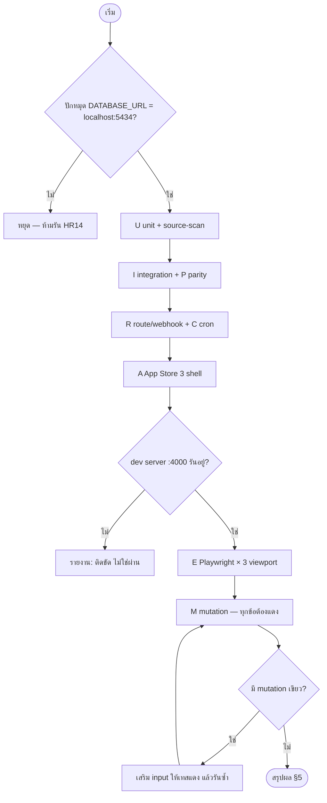

> **โมดูล:** 00068 — LINE Group Summary Report
> **ประเภทเอกสาร:** Test Case
> **เวอร์ชัน:** 1.0
> **วันที่จัดทำ:** 2026-10-05
> **สถานะ:** Draft — ยังไม่ execute (ยังไม่เริ่ม implement)
> **เจ้าของเอกสาร:** QA (ดู [[Feature-Docs-Ownership]])

# Test Case: รายงานสรุปยอดเข้ากลุ่ม LINE

---

## 1. Overview

ชุดเทสนี้ trace กลับ AC-LGS ทั้ง 150 ข้อใน [[BRD]] (FR-LGS-01..24) · **TC = 1 แถวต่อเคส** คอลัมน์ "AC" คือสิ่งที่เคสนั้นพิสูจน์ — ตาราง §3 สร้างจากคอลัมน์นี้โดยตรง

| ระดับ | ช่วง ID | รันด้วย | ที่วาง |
|-------|---------|---------|--------|
| U — unit / source-scan (pure lib) | TC-LGS-001..049 | `vitest` | `src/lib/line-report/__tests__/` · `src/lib/line/__tests__/` |
| I — integration (service + ฐาน local) | TC-LGS-101..139 | `vitest` | `src/services/__tests__/line-report-*.test.ts` |
| R — route / webhook | TC-LGS-201..229 | `vitest` (เรียก handler ตรง) | `src/app/api/line-report/**/__tests__/` |
| C — cron | TC-LGS-301..322 | `vitest` + นาฬิกาปลอม | `src/app/api/cron/line-report-sweep/__tests__/` |
| P — parity ตัวเลข | TC-LGS-401..409 | `vitest` integration | `src/services/__tests__/line-report-parity.test.ts` |
| A — App Store 3 shell | TC-LGS-501..508 | `vitest` (render/สแกน HTML) + cookie จริง | `.../line-reports/__tests__/` |
| E — Playwright | TC-LGS-601..620 | `npm run e2e` | `e2e/line-group-summary-report.spec.ts` |
| M — mutation | TC-LGS-701..748 | มือ + สคริปต์ (§2.8) | บันทึกผลใน §5 |

- **ขอบเขต:** in = ทุก FR-LGS · out = การส่งจริงเข้า OA ผลิต (ต้องพิสูจน์ด้วย payload จริงจาก OA ทดสอบก่อนล็อก validator — ตาม [[LINE-API-Facts]] และ convention `external-payload-schema`), ใบเสร็จค่าใช้จ่าย LINE, ฝั่งแอป native
- **สภาพแวดล้อม:** dev server `:4000` ที่ user รันเอง · `http://seller.deepth.local:4000` เท่านั้น (ห้าม localhost) · LINE API ถูก mock ที่ชั้น `lineApiRequest` (ไม่ยิงจริงในเทสอัตโนมัติ)

### 1.1 คำสั่งรัน (HR13 / HR14)

> 🛑 `npm test` ในเครื่องนี้ชี้ Supabase prod — **ต้องปักหมุด localhost ในคำสั่งทุกครั้ง** ไม่ปักหมุด = ห้ามรัน
> `DATABASE_URL=postgresql://<user>:<pw>@localhost:5434/<db> STORAGE_DRIVER=local npx vitest run <path>`
> `DATABASE_URL=<ปักหมุด 5434 เช่นเดียวกัน> npm run e2e` (ตั้ง `TZ` ต่างกันเฉพาะเคส TC-LGS-003)

- เทสที่แตะฐานสร้าง `User`/`Shop`/`LineReportGroup` ด้วย id เฉพาะ (prefix สุ่มต่อเทส `Ctest-<uuid>`) แล้วลบ **scope ด้วย id นั้น** ตามลำดับ Delivery → BindCode → GroupShop → Group → Shop → User · `LineReportRateEvent` ลบด้วย `lineGroupId` ที่เทสสร้าง · ห้าม `deleteMany()` เปล่า/TRUNCATE/DROP/`migrate reset`/`db pull`
- E2E ใช้ `e2e/helpers/auth.ts` (`createSeller` + `loginAs`, `cleanup(userId)` ใน `finally`) — ต้องขยาย helper ให้ seed `BusinessPackageSubscription` (ACTIVE/LOCKED/ไม่มี), tier, source, และผู้ใช้ ADMIN-only
- 🛑 **source-scan ทุกลูปต้องยืนยันก่อนว่าอ่านไฟล์ได้จริง (นับไฟล์ > 0)** ไม่งั้นเขียวเปล่า (บทเรียน 00067)

### 1.2 Fixture กลาง (จาก UX spec "ยาวสุดจริง")

| รายการ | ค่า |
|--------|-----|
| ชื่อกลุ่ม 52 ตัว | `ทีมบริหารและบัญชี BT Premium Auto Xenon คลอง 4 ธัญบุรี` · `ครัวคุณยาย โฮมเมด` · `ฝ่ายขาย ศรีสุข อะไหล่ออนไลน์ สาขารังสิต (ภายใน)` |
| 5 ร้านในกลุ่มรวม | `BT Premium Auto Xenon คลอง4 ธัญบุรี` (SERVICE_QUEUE, 32 · ฿412,900) · `ศรีสุข อะไหล่ออนไลน์ เซ็นเตอร์ สาขารังสิต คลอง 3` (ONLINE_SALES, 61 · ฿538,200) · `ครัวคุณยาย โฮมเมด ขนมไทยและอาหารสั่งทำ` (24 · ฿96,460) · `สมชาย ใจดี` (ส่วนตัว, 11 · ฿236,000) · `ล้างรถ คลอง 4 โปรแคร์ ธัญบุรี` (SERVICE_QUEUE, **packageLockedAt**) |
| เวลา / รอบ | `09:00` `12:30` `18:00` `24:00` · ตัดรอบวันที่ 6 |
| ตัวเลข | 128 ออเดอร์ · ฿1,284,560 · ยกเลิก 6 · กำไร ฿312,480 · ยอดสะสม ฿18,902,340 · ศูนย์ `0` / `฿0` |
| top 3 | `ฟิล์มกรองแสงเซรามิก รุ่นพรีเมียม ทุกขนาด รถเก๋ง` 42 · `ผ้าคลุมรถยนต์ กันน้ำ กันแดด UV ซีดาน` 31 · `น้ำยาเคลือบแก้ว 9H` 18 |
| ประวัติ 10 แถว | สำเร็จรายวัน · ล้ม (บอทไม่อยู่ในกลุ่มแล้ว) · ทดสอบ · รายเดือน · คำสั่งในกลุ่ม · ข้าม (ไม่มีออเดอร์) |

### 1.3 Payload ตัวอย่าง webhook (ตาม [[LINE-API-Facts]] §1)

| ชื่อ | โครง |
|------|------|
| `W-join` | `{type:"join", mode:"active", replyToken, source:{type:"group", groupId:"Cxxx"}, webhookEventId}` |
| `W-bind` | `{type:"message", mode:"active", replyToken, source:{type:"group", groupId, userId:"Uxxx"}, message:{type:"text", text:"ผูก K7M2-XQ4P"}}` |
| `W-bind-nouser` | เหมือน `W-bind` แต่ `source` **ไม่มี `userId`** (field optional — validator ห้ามบังคับ) |
| `W-leave` | `{type:"leave", mode:"active", source:{type:"group", groupId}}` — **ไม่มี `replyToken`** |
| `W-standby` | `W-bind` แต่ `mode:"standby"` และ **ไม่มี `replyToken`** |
| `W-redeliver` | `W-bind` เดิมทุกไบต์ + `deliveryContext:{isRedelivery:true}` + `webhookEventId` เดิม |
| `W-user` / `W-room` | `source.type` = `user` / `room` |
| `W-memberJoined` | event ที่ฟีเจอร์ไม่ใช้ → เมินเงียบ ๆ |

---

## 2. Test Scenarios

### 2.1 U — Unit / source-scan (pure lib)

| ID | AC | ขั้นตอน | คาดหวัง |
|----|----|---------|---------|
| TC-LGS-001 | AC-LGS-10-1 | นับ `SLOT_OPTIONS` | 48 ค่า `00:30..23:30` ทุก 30 นาที + `24:00`; ไม่มี `00:00` |
| TC-LGS-002 | AC-LGS-10-2 | schema เวลา: 1, 4 ค่า / 0 ค่า / 5 ค่า / ซ้ำ / `00:15` / `00:00` | 1 และ 4 ผ่าน; ที่เหลือถูกปฏิเสธ |
| TC-LGS-003 | AC-LGS-10-3 | `dueSlots`+`resolveDailyWindow` ชุดเดียวกันภายใต้ `TZ=UTC` และ `TZ=America/Los_Angeles` | ผลเท่ากันทุกไบต์ (อิง `TZ_OFFSET_MS`) |
| TC-LGS-004 | AC-LGS-10-4, AC-LGS-17-3 | `resolveDailyWindow`: slot 18:00 ของ D; slot 24:00 ของ D (ยิง 00:00 ของ D+1) | 18:00 → D 00:00..ตอนนี้ · 24:00 → D 00:00..24:00 ทั้งวัน และ label "ครบทั้งวัน" ไม่ใช่ "วันนี้" |
| TC-LGS-005 | AC-LGS-10-5 | เรียง `fireOrder` ตั้ง `[09:00,24:00,18:00]` ในวันเดียว | รอบ `24:00` ของเมื่อวานมาก่อนเสมอ (00:00) |
| TC-LGS-006 | AC-LGS-11-1 | cutoff: 1, 31, "สิ้นเดือน"(default) / 0, 32, -1, 1.5, "abc" | ช่วงผ่าน; นอกช่วง/ไม่ใช่จำนวนเต็มถูกปฏิเสธ |
| TC-LGS-007 | AC-LGS-11-2 | `cycleContaining` cutoff 5: 20 ต.ค. 2569; 5 ต.ค. 23:59:59; 6 ต.ค. 00:00; 1 ม.ค.; 31 ธ.ค. | 20 ต.ค. → 6 ต.ค. 00:00..5 พ.ย. 23:59:59 · ขอบ 5/6 ตกคนละรอบพอดี · ข้ามปีถูก |
| TC-LGS-008 | AC-LGS-11-3 | cutoff 31 ใน ก.พ. 2569; cutoff 30 รอบที่ปิด 28 ก.พ.; ปี อธิกสุรทิน (ก.พ. 29) | ตัด 28 ก.พ. · รอบถัดไปเริ่ม 31 ม.ค. ตามตัวอย่าง BRD · ปีอธิกฯ ตัด 29 |
| TC-LGS-009 | AC-LGS-11-4 | `monthlyFireInfo` ตั้ง `[09:00,21:00]` และ `[24:00,09:00]` วันถัดจากตัดรอบ | ส่งวันถัดจากวันตัดรอบที่เวลาแรกสุด (ชุดที่ 2 = 00:00) สรุป "ทั้งรอบที่เพิ่งปิด" ไม่ขึ้นกับเวลาส่ง |
| TC-LGS-010 | AC-LGS-19-3 | `dueSlots` slot 18:00 ที่ now = 17:59 / 18:00 / 18:29 / 18:59 / 19:00 / 19:01 | 17:59 ไม่ถึง · 18:00..19:00 ถึง · เกิน 60 นาที → `MISSED` ไม่ส่งย้อนหลัง (ขอบ 60 นาทีพอดี = ทดสอบ off-by-one ทั้งสองด้าน) |
| TC-LGS-011 | AC-LGS-05-4, AC-LGS-22-6 | parser ตาราง: `ผูก K7M2-XQ4P`, `  ผูก   K7M2-XQ4P  `, `ผูกK7M2-XQ4P`, `ผูก 48291`, `ผูก K7M2-XQ4P3`, `ผูก ABC123`, `ผูก 482 913`; `สรุปวันนี้`, ` สรุป  วันนี้ `, `สรุปวันนี้ครับ`, `ช่วยสรุปวันนี้หน่อย`, `สรุปเดือนนี้`, `สรุปเดือน` | ผูก: 8 ตัวตัวเลขเท่านั้น (ช่องว่างหัว/ท้าย/ระหว่างคำสั่งกับโค้ดได้) · สรุป: ตรงทั้งข้อความหลัง trim/ยุบช่องว่างซ้ำ · มีคำปนในประโยค = null |
| TC-LGS-012 | AC-LGS-15-3 | `canSumProfit`: 1 ร้าน / 3 ร้านกติกาเดียวกัน (ทั้ง 3 บริการ) / ผสมบริการ+ขายของ / ผสมส่วนตัว+ขายของ (`usesServiceFinanceRules` เท่ากันหมดหรือไม่) | true / true / false / ตามค่า flag จริง — ผสมแล้วแสดงรายร้าน + บรรทัด "กำไรแต่ละร้านคิดตามกติกาของประเภทธุรกิจ จึงไม่รวมเป็นยอดเดียว" |
| TC-LGS-013 | AC-LGS-16-1, AC-LGS-16-2, AC-LGS-16-3 | top-N จากแถว `getProductSalesMonth` ปลอม: เสมอจำนวนชิ้น; เสมอทั้งชิ้นและเงิน; มีแถว `isCustom`; มี >3 รายการ | เรียงชิ้น↓ → เงิน↓ → ชื่อ ก→ฮ · `isCustom` ถูกตัด · คืน ≤ 3 |
| TC-LGS-014 | AC-LGS-16-4 | 2 ร้านมีสินค้าชื่อเดียวกัน | แยกต่อร้าน ไม่รวมข้ามร้าน |
| TC-LGS-015 | AC-LGS-16-5 | ไม่มีรายการ / ทุกใบเป็นรายการพิมพ์เอง | บรรทัด "ยังไม่มีรายการสินค้าที่ระบุในช่วงนี้" ไม่ว่าง ไม่ใช่ 0 |
| TC-LGS-016 | AC-LGS-16-6 | หัวข้อ Top 3 ต่อ vertical (ขายของ/บริการ/ห้องพัก) | มีป้ายเกณฑ์ "นับทุกใบที่ไม่ยกเลิก" + คำเรียกจาก `ORDER_VOCAB` ของ vertical นั้น (ไม่ hardcode "สินค้า") |
| TC-LGS-017 | AC-LGS-01-1, AC-LGS-01-3 | `isOwnerPaidForReports` mock `getSubscriptionStatus`: ACTIVE × (GROWTH,PRO,BUSINESS) × (WALLET,APPLE_IAP); `LOCKED_RENEWAL_FAILED`; ไม่มีแถว (null) | 6 เคส ACTIVE → true ทั้งหมด · LOCKED → false · null → false |
| TC-LGS-018 | AC-LGS-01-2 | mock ให้ throw | false (fail-closed) ไม่ throw ออก |
| TC-LGS-019 | AC-LGS-15-1 | flex builder 1 / 2 / 10 ร้าน | 1 ร้าน: ไม่มีบล็อก "ยอดรวม" ซ้ำ · 2+ ร้าน: ยอดรวมบน รายร้านล่าง |
| TC-LGS-020 | AC-LGS-15-2 | property 200 seed สุ่ม (ร้าน 1–10, ค่า 0..หลักล้าน) | ยอดรวมออเดอร์/ยอดขาย/ยังไม่นับ/ยกเลิก = ผลบวกของค่ารายร้านพอดี |
| TC-LGS-021 | AC-LGS-15-4 | กลุ่มผสมบริการ + ขายของ | หมายเหตุ "ยอดแต่ละร้านคิดตามกติกาของประเภทธุรกิจ" ใต้ยอดรวม |
| TC-LGS-022 | AC-LGS-15-5 | ร้านยอดเท่ากัน / ต่างกัน สลับลำดับ input | เรียงยอดขาย↓ แล้วชื่อ — input ลำดับใดก็ได้ output เดิมทุกไบต์ |
| TC-LGS-023 | AC-LGS-15-6 | fixture 5 ร้านขยาย 10 ร้านยอดใหญ่ + ชื่อยาวสุด; วัด bubble เป็นไบต์ และ altText | ลำดับตัด: Top 3 → ย่อรายร้าน → ย่อ altText · **ยอดรวม + ป้ายช่วง + "ข้อมูล ณ" อยู่ครบทุกกรณี** · bubble ≤ 30 KB, altText ≤ 1500 ตัวอักษร |
| TC-LGS-024 | AC-LGS-17-1 | altText ของรายวัน (กำไรเปิด/ปิด) | มีชื่อรายงาน, ช่วง, จำนวนออเดอร์, ยอดขายครบ ตามตัวเลขที่เปิด |
| TC-LGS-025 | AC-LGS-17-2 | ป้ายช่วง + "ข้อมูล ณ HH:MM น." ที่เวลาคำนวณ 18:07 ไทย | ป้ายตรงช่วง ("5 ต.ค. 2569" / "6 ต.ค. – 20 ต.ค.") · เวลาเป็นเวลาไทยของจังหวะคำนวณ ไม่ใช่เวลา slot |
| TC-LGS-026 | AC-LGS-17-4, AC-LGS-17-7 | สแกน `flex-summary-report.ts` + ข้อความที่ builder ผลิต | ไม่มี `toLocaleString('th`/`toFixed(` · ใช้ `formatBaht`/`format-date` · ข้อความเป็นไทย มี "Deep" ไม่มี "SafePay" |
| TC-LGS-027 | AC-LGS-17-5 | ปุ่ม "เปิด Deep" | URL = dashboard ผู้ขาย ไม่มี query/token/id ส่วนตัว |
| TC-LGS-028 | AC-LGS-17-6 | `hasMissingCost=true` และ `false`; ค่าใช้จ่ายไม่ครบ | ใช้ถ้อยคำ 00067 §3.3 ("กำไรได้มากที่สุด ≤ … ยังไม่ใช่กำไรจริง") + "ค่าใช้จ่ายลงตามวันที่บันทึก ไม่เฉลี่ยรายวัน" · ไม่มีคำ "กำไรสุทธิ" |
| TC-LGS-029 | AC-LGS-14-6 | ป้ายยกเลิก | "ใบที่เปิดในช่วงนี้" |
| TC-LGS-030 | AC-LGS-14-7 | ร้านที่ 2 ผลเป็น failed | บรรทัด "ดึงข้อมูลไม่สำเร็จ" (ไม่ใช่ 0) · ยอดรวม = ร้านที่ 1 · หมายเหตุว่าไม่ครบ |
| TC-LGS-031 | AC-LGS-18-2 | ร้านล็อก `ล้างรถ คลอง 4 โปรแคร์ ธัญบุรี` | "ไม่รวมร้าน ล้างรถ … (ถูกล็อก)" ระบุชื่อ+เหตุผล |
| TC-LGS-032 | AC-LGS-12-3 (builder), AC-LGS-22-4 | `showProfit=false` | ข้อความ/altText ไม่มีคำ "กำไร" และไม่มีค่ากำไร |
| TC-LGS-033 | AC-LGS-12-1, AC-LGS-12-2 | schema metric: default กลุ่มใหม่; ปิดครบ 5 ตัว; เปิดแค่กำไร | default: orders/sales/cancelled/top3 = true, `showProfit=false` · ปิดหมด = ปฏิเสธ · เปิดตัวเดียวผ่าน |
| TC-LGS-034 | AC-LGS-13-2 | builder โหมด TEST | ป้าย "ทดสอบ" เห็นชัด + ตัวเลขจริง (ไม่ใช่ค่าปลอม) |
| TC-LGS-035 | AC-LGS-21-2 | builder ข้อความสุดท้าย | ไม่มี `฿`, ไม่มี URL แพ็กเกจ/ลิงก์ชวนจ่าย, บอกว่าหยุดชั่วคราว + ให้ตรวจบัญชีใน Deep |
| TC-LGS-036 | AC-LGS-11-6, AC-LGS-11-7 | แนบยอดสะสมรอบ: เปิด+รายวัน; เปิดแต่มีรายเดือนใน push เดียวกัน | เปิด → ส่วนยอดสะสมป้าย "6 ต.ค. – 20 ต.ค." ปลายช่วง = วันที่สรุป · มีรายเดือนด้วย → ส่วนแนบถูกข้าม |
| TC-LGS-037 | AC-LGS-20-3 | `retryKeyFor(groupId, slotKey)` | UUIDv5 รูป hex ถูกต้อง · input เดิม → key เดิม · slotKey/group ต่าง → key ต่าง |
| TC-LGS-038 | AC-LGS-06-5 | สแกน `schema.prisma` (นับโมเดล LineReport* > 0) | ไม่มีคอลัมน์ userId สมาชิก LINE ในโมเดลใด |
| TC-LGS-039 | AC-LGS-20-2 | สแกน `line-report-send.service.ts` (อ่านไฟล์ได้จริง) | ไม่มี `P2002` / `isUniqueViolation`; มี `skipDuplicates` หรือ `ON CONFLICT DO NOTHING` |
| TC-LGS-040 | AC-LGS-22-3 | สแกน handler คำสั่ง | ไม่มีการเรียก push แม้ในกิ่ง fallback ของ error |
| TC-LGS-041 | AC-LGS-14-1 | สแกน `src/services/line-report-*.ts` | ไม่มี `revenueOrderWhere` / `totalAmount` / `cost` อ่านตรง · มีการเรียก `getSalesSeries` / `getPnlReport` / `getProductSalesMonth` จริง |
| TC-LGS-042 | AC-LGS-19-1 | อ่าน `vercel.json` | มี path `/api/cron/line-report-sweep` + schedule `*/30 * * * *` |
| TC-LGS-043 | AC-LGS-03-1 | `featuresForTier` ทั้ง 3 tier (ต่อยอด `subscription-benefits.test.ts`) | ทุก tier มีบรรทัด "รายงานสรุปยอดเข้ากลุ่ม LINE" ข้อความมาจากแหล่งเดียว (ไม่ก็อปที่จออื่น) |
| TC-LGS-044 | AC-LGS-03-2, AC-LGS-03-5 | `seller-menu` + `buildEligibleCatalog` ของเจ้าของ vs ADMIN-only | เจ้าของ: 1 รายการเมนูใหม่ + อยู่ใน catalog · ADMIN: ไม่มีทั้งเมนูและ catalog |
| TC-LGS-045 | AC-LGS-03-6 | สแกน `settings/**` (นับไฟล์ > 0) | มีแต่ลิงก์ ไม่ import ฟอร์มรายงาน |
| TC-LGS-046 | AC-LGS-03-7 | glob ใต้ `business/` | มี `line-reports/[groupId]` · ไม่มี segment dynamic ใหม่พี่น้องกับ `business/[shopId]` |
| TC-LGS-047 | AC-LGS-02-5 | สแกนซอร์สหน้า `line-reports/**` | **ไม่มี** `shouldHidePaidFeatures` · มีการตรวจเจ้าของ/แพ็กเกจเองในหน้า |
| TC-LGS-048 | AC-LGS-09-3, AC-LGS-23-2 | presenter: ร้านถูกล็อก/ลบ → ป้ายสถานะ; reason code → ข้อความไทย | ร้านยังอยู่ในรายการพร้อมป้าย · ทุก reason code (รวม `NO_SENDABLE_SHOPS`, `REPLY_FAILED`, `TOKEN_INVALID`, `MISSED`) มีข้อความไทย ไม่เหลือโค้ดดิบ |
| TC-LGS-049 | AC-LGS-17-1 | `parse` ผลลัพธ์ flex ผ่านตัว validate โครง Flex ของ LINE (ถ้ามี) / schema ตรวจประเภท component | ไม่มี component นอก spec · ไม่ใช้ emoji (HR12) |

### 2.2 I — Integration (service + ฐาน local)

| ID | AC | ขั้นตอน | คาดหวัง |
|----|----|---------|---------|
| TC-LGS-101 | AC-LGS-04-1, AC-LGS-04-2 | สร้างโค้ดด้วยนาฬิกาปลอม 10:00; consume ที่ 10:09:59 / 10:10:00 / 10:10:01 | โค้ด 8 ตัวตัวเลข · `expiresAt = +10 นาทีพอดี` · ขอบ 10:00 ใช้ได้ถึง 10 นาทีเต็ม เกินไม่ได้ |
| TC-LGS-102 | AC-LGS-04-2 | consume โค้ดเดียวกัน 2 ครั้ง และ 2 คำขอพร้อมกัน | สำเร็จครั้งเดียว (`updateMany where usedAt null`) ที่เหลือปฏิเสธ |
| TC-LGS-103 | AC-LGS-04-3 | สร้างโค้ดที่ 2 แล้วใช้โค้ดแรก; partial unique 2 โค้ดสด/เจ้าของ | โค้ดแรกใช้ไม่ได้ทันที · ฐานปฏิเสธโค้ดสดที่ 2 หากข้าม service |
| TC-LGS-104 | AC-LGS-04-4 | อ่านแถวหลังสร้างโค้ด | ไม่มีค่า 8 ตัวดิบในคอลัมน์ใด · ค่าที่เก็บ ≠ `sha256(code)` เปล่า (HMAC + secret) |
| TC-LGS-105 | AC-LGS-04-5, AC-LGS-09-2 | เลือกร้าน: ของตัวเอง / ของคนอื่น / ร้านที่เป็นแค่ ADMIN / `deletedAt` / `purgedAt` / ผสมถูก+ผิดในคำขอเดียว | ใช้ได้เฉพาะ `Shop.userId=owner` ไม่ลบ ไม่ purge · ผสมผิด 1 ร้าน = ปฏิเสธทั้งคำขอ (ไม่ผูกบางส่วน) · ทั้งที่สร้างโค้ดและที่แก้ร้านทีหลัง |
| TC-LGS-106 | AC-LGS-04-6 | เจ้าของ 10 กลุ่ม (ผสมสถานะที่ไม่ลบ) สร้างโค้ดอีก; 9 กลุ่ม + 2 คำขอพร้อมกัน | ครั้งที่ 11 ถูกปฏิเสธพร้อมข้อความบอกเพดาน · แข่งกันที่ 9 กลุ่ม → ผ่านเพียง 1 |
| TC-LGS-107 | AC-LGS-05-4 | ใช้โค้ดถูก | กลุ่ม ACTIVE · reply มีชื่อกลุ่ม (จาก `GET .../summary`) และชื่อร้านที่ผูก |
| TC-LGS-108 | AC-LGS-05-5 | ตอนใช้โค้ด: (ก) เจ้าของแพ็กเกจ LOCKED (ข) ร้านเปลี่ยนเจ้าของ/ถูกลบ (ค) ครบ 10 กลุ่มแล้ว (ง) เจ้าของถูกลบ | 4 เคสไม่ผูก · ข้อความเหตุผลไม่รั่วชื่อ/ข้อมูลเจ้าของ |
| TC-LGS-109 | AC-LGS-06-1 | 5 ครั้งผิดจากกลุ่มเดียวกัน แล้วโค้ดถูก (ครั้งที่ 6); เลื่อนเวลา +10 นาที | ครั้งที่ 6 ปฏิเสธแม้ถูก · พ้นช่วงผ่าน · กลุ่มอื่นไม่โดนไปด้วย |
| TC-LGS-110 | AC-LGS-06-2 | กลุ่ม ACTIVE ของเจ้าของ A; กลุ่มเดียวกันพิมพ์โค้ดของ B; ลองสอดแถว ACTIVE ที่ 2 ตรงฐาน | ปฏิเสธ + "ผูกอยู่แล้ว" **ไม่บอกว่ากับใคร** · โค้ด B ไม่ถูกใช้ (`usedAt` ยัง null) · partial unique บน `lineGroupId` WHERE ACTIVE ล้มจริง; INACTIVE/PENDING ซ้ำได้ |
| TC-LGS-111 | AC-LGS-06-3 | กลุ่มผูกกับ A แล้ว A พิมพ์ผูกอีก | ตอบผูกอยู่แล้ว · ไม่มีแถวใหม่ · โค้ดไม่ถูกเผา |
| TC-LGS-112 | AC-LGS-06-4 | โค้ดผิด / หมดอายุ / ใช้แล้ว | ข้อความตอบ **เหมือนกันทุกไบต์** ทั้ง 3 เคส |
| TC-LGS-113 | AC-LGS-07-1, AC-LGS-07-2 | `leave` ของกลุ่ม ACTIVE; หลังจากนั้นรัน sweep + ส่งคำสั่ง | INACTIVE ใน request เดียวกัน · sweep ไม่หยิบ · ไม่ตอบคำสั่ง |
| TC-LGS-114 | AC-LGS-07-4 | ตั้งค่า (เวลา/ตัวเลข/ร้าน) → leave → "ผูกใหม่" → ผูกในกลุ่ม LINE **อื่น** | แถวเดิมกลับ ACTIVE ค่าเดิมครบ · `lineGroupId` ถูกทับด้วยกลุ่มใหม่ · ไม่เกิดแถวซ้ำ |
| TC-LGS-115 | AC-LGS-07-5 | `leave` ของกลุ่มที่ไม่มีแถว / `REMOVED` | เมินเงียบ ไม่ error ไม่สร้างแถว |
| TC-LGS-116 | AC-LGS-08-1, AC-LGS-08-2 | ลบกลุ่ม ACTIVE; mock `leave` ของ LINE ล้ม | `REMOVED` · sweep/คำสั่งไม่หยิบ · พ้นเพดาน 10 · การลบยังสำเร็จแม้ LINE ล้ม |
| TC-LGS-117 | AC-LGS-08-3 | ลบกลุ่มที่มี log | log ยังอยู่ครบจนครบอายุ 90 วัน |
| TC-LGS-118 | AC-LGS-08-4 | ลบ id ของเจ้าของอื่น / id ไม่มีจริง | 404 ทั้งสองเคสเหมือนกัน (ไม่ใช่ 403) · where มี `ownerId` ตั้งแต่ query แรก |
| TC-LGS-119 | AC-LGS-09-1 | PUT ร้าน: 0 / 1 / 10 / 11 ร้าน; ร้านเดียวใส่ 2 กลุ่ม; ใส่ซ้ำในกลุ่มเดียว | 0 และ 11 ปฏิเสธ · 1,10 ผ่าน · ข้ามกลุ่มได้ · ซ้ำในกลุ่มเดียวไม่ได้ (`@@unique`) |
| TC-LGS-120 | AC-LGS-12-4 | เปิดกำไร (ต้องส่ง flag ยืนยัน) / ไม่ส่ง flag | ไม่มี flag = ปฏิเสธ · มี flag = เปิด + บันทึก `profitEnabledAt` · ปิดแล้วเปิดใหม่ต้องยืนยันใหม่ |
| TC-LGS-121 | AC-LGS-13-1 | `sendTest` 5 ครั้งสำเร็จ; ครั้งที่ 6; LINE ปฏิเสธ 1 ครั้งก่อนหน้า; ข้ามเที่ยงคืนไทย | 5 ผ่าน · ครั้งที่ 6 ปฏิเสธบอก "ครบเพดาน" · ครั้งที่ LINE ปฏิเสธไม่นับ · หลัง 00:00 ไทยนับใหม่ · นับใน transaction (กดพร้อมกันไม่ทะลุ 5) |
| TC-LGS-122 | AC-LGS-13-3 | ส่งทดสอบเมื่อ: แพ็กเกจ LOCKED / กลุ่ม INACTIVE / ไม่เหลือร้านพร้อม | ปฏิเสธทั้งสามด้วยด่านเดียวกับส่งจริง ไม่เรียก LINE |
| TC-LGS-123 | AC-LGS-18-1 | `resolveSendableShops`: `packageLockedAt`, `deletedAt`, `purgedAt` อย่างละ 1 ร้าน | ทั้ง 3 ถูกตัด ไม่ถูกคำนวณ ไม่อยู่ยอดรวม |
| TC-LGS-124 | AC-LGS-18-3 | ทุกร้านถูกล็อก แล้วรัน sweep | ไม่ส่ง · log `NO_SENDABLE_SHOPS` · มี alert · ไม่นับเป็นครั้งส่ง ไม่ retry |
| TC-LGS-125 | AC-LGS-18-4 | ล็อกร้านแล้วส่งรอบหนึ่ง → ปลดล็อก → ส่งรอบถัดไป | รอบหลังรวมร้านนั้นและไม่มีหมายเหตุเก่า (อ่านสถานะสด ไม่เก็บธง) |
| TC-LGS-126 | AC-LGS-23-1 | ทุกชนิด: DAILY, MONTHLY, TEST, COMMAND, FINAL_NOTICE | ทุกความพยายามมีแถว log: เวลา/ชนิด/`slotKey`/ผล/สาเหตุ/จำนวน push (reply = 0, push 2 object = ตามจริง) |
| TC-LGS-127 | AC-LGS-23-3 | อ่าน log หลัง SENT, FAILED, RETRY_PENDING, และเกิน 24 ชม. | `pendingPayload` มีเฉพาะระหว่างรอ retry · null หลัง SENT/FAILED/เกิน 24 ชม. · ไม่มี token/secret ในแถวใด |
| TC-LGS-128 | AC-LGS-23-4 | query ops: push รวมต่อวัน/กลุ่ม/เจ้าของ จาก log ตัวอย่าง | ผลรวมตรงกับที่ seed (ไม่นับ reply) |
| TC-LGS-129 | AC-LGS-23-5 | cleanup: log 89/91 วัน | 91 วันถูกลบ · 89 คงอยู่ (scope ด้วย id ที่เทสสร้าง) |
| TC-LGS-130 | AC-LGS-23-6 | กลุ่ม PENDING อายุ 6 วัน 23 ชม. / 7 วัน 1 ชม. | แบบหลัง → `REMOVED` อัตโนมัติ · พ้นเพดาน · แบบแรกคงเดิม |
| TC-LGS-131 | AC-LGS-24-1, AC-LGS-24-3 | สร้างเหตุ: BOT_REMOVED, SEND_FAILED (รอบ 2), NO_SENDABLE_SHOPS, แพ็กเกจหยุด; เหตุเดิมซ้ำ; แก้เหตุแล้วเกิดใหม่ | แต่ละเหตุสร้าง alert 1 รายการ · เหตุเดิมที่ยังไม่แก้ไม่สร้างซ้ำ · แก้แล้วเกิดใหม่ = alert ใหม่ |
| TC-LGS-132 | AC-LGS-01-6 | กลุ่ม ACTIVE; เปลี่ยนแพ็กเกจเจ้าของเป็น LOCKED (ไม่แตะแถวกลุ่ม) แล้วเรียก sweep / `sendTest` / คำสั่ง | ไม่มีการเรียก LINE ตัวเลข — ตัดสินสดจาก `isOwnerPaidForReports` ณ จุดส่ง ไม่อ่านสถานะที่เก็บในแถว |
| TC-LGS-133 | AC-LGS-10-2, AC-LGS-11-1, AC-LGS-12-2 | สอดข้อมูลตรงฐานข้าม service: `dailyTimes` 5 ค่า/31 นาที/0/1441; cutoff 0/32; ปิด metric หมด; (4 ค่า+1440, cutoff 1/31 ผ่าน) | CHECK constraint ล้มเฉพาะค่าผิด (แดงถ้าถอด constraint) |
| TC-LGS-134 | AC-LGS-20-1, AC-LGS-20-2 | `claimSlot` ซ้ำ `(groupId, slotKey)`; รูป `slotKey` `D:2026-10-05@18:00`, `D:2026-10-04@24:00`, `M:2026-10-05` | ครั้งแรก count 1, ซ้ำ count 0 **ไม่ throw** และไม่มี ERROR ใน log Postgres · ทุกชนิดมี slotKey เฉพาะตัว |
| TC-LGS-135 | AC-LGS-21-2, AC-LGS-21-5 | แพ็กเกจหยุด → sweep 2 ครั้ง → กลับ ACTIVE → หยุดอีกรอบ | ข้อความสุดท้าย 1 ครั้งต่อช่วงที่หยุด (`finalNoticeSentAt`) · กลับ ACTIVE รีเซ็ตมาร์กเกอร์ · ช่วงหยุดรอบใหม่ส่งได้อีก 1 ครั้ง |
| TC-LGS-136 | AC-LGS-21-4 | หลังหยุด ตรวจกลุ่ม/ร้าน/เวลา/ตัวเลข/cutoff/log | ครบ ไม่ถูกลบ |
| TC-LGS-137 | AC-LGS-14-8 | ทุกร้านดึงตัวเลขล้ม (mock throw) | ไม่ส่ง · log สาเหตุ · นับเป็นล้มเหลวสำหรับ retry |
| TC-LGS-138 | AC-LGS-19-7, AC-LGS-19-8 | ตั้ง "ไม่ส่งถ้าไม่มีออเดอร์": ทุกร้าน 0 ออเดอร์+0 ยกเลิก / มีออเดอร์ร้านหนึ่ง / มียกเลิกอย่างเดียว; แล้วคำสั่ง `สรุปวันนี้` และส่งทดสอบ | ข้าม → `SKIPPED_NO_ORDERS` (ไม่นับส่ง ไม่ retry) · อีก 2 เคสส่ง · คำสั่ง/ทดสอบตอบเสมอไม่ขึ้นกับตัวเลือก |
| TC-LGS-139 | AC-LGS-05-9 | env `LINE_REPORT_BOT_*` ว่าง: โหลดหน้าตั้งค่า + รัน sweep | หน้าแสดง "ฟีเจอร์ยังไม่พร้อมใช้งาน" ไม่ล้ม · sweep ข้ามไม่ throw |

### 2.3 R — Route / webhook

| ID | AC | ขั้นตอน | คาดหวัง |
|----|----|---------|---------|
| TC-LGS-201 | AC-LGS-05-1 | POST `/api/line-report/webhook` ลายเซ็นผิด / ไม่มี header / ลายเซ็นของ OA อื่น / ถูก | ผิดทุกแบบ → ปฏิเสธ ไม่ประมวลผล · ถูก → 200 · ไม่แตะ `/api/channels/line/webhook` (สแกนว่าไม่ import ร่วม) |
| TC-LGS-202 | AC-LGS-05-2 | proxy: POST ไม่มี Origin ไป path ใหม่; ไป `/api/line-report/webhook/x`, `/api/line-report/webhookx`, path อื่น | path ใหม่ตรงตัวไม่ถูก 403 · ที่เหลือยัง 403 (เทียบตรงตัว ไม่ `startsWith`) |
| TC-LGS-203 | AC-LGS-05-3 | `W-join` (มี / ไม่มีโค้ดค้าง) | reply ทักทายบอกวิธีผูกทั้งสองกรณี · ไม่มี push |
| TC-LGS-204 | AC-LGS-05-4 | `W-bind` โค้ดถูก (ผ่าน route จริงพร้อมลายเซ็น) | 200 + reply ยืนยันมีชื่อกลุ่ม+ร้าน · กลุ่ม ACTIVE |
| TC-LGS-205 | AC-LGS-05-6, AC-LGS-06-5 | ข้อความทั่วไปในกลุ่มที่ ACTIVE และไม่ผูก | ไม่เรียก reply · **ไม่มีการเขียน DB เลย** (นับ query/แถวก่อน-หลัง) · ไม่เก็บ userId |
| TC-LGS-206 | AC-LGS-05-7 | `W-user`, `W-room` ข้อความ `ผูก K7M2-XQ4P` | ไม่เกิดการผูก · ไม่ error (แชทเดี่ยวไปทาง TC-LGS-219) |
| TC-LGS-207 | AC-LGS-05-8 | บังคับ service throw หลังลายเซ็นผ่าน | ตอบ 200 · log error · log ไม่มีค่า `LINE_REPORT_BOT_*` จริง / token |
| TC-LGS-208 | AC-LGS-05-4, AC-LGS-05-6 | `W-bind-nouser` (ไม่มี `source.userId`) | ผ่าน validator ปกติ ผูกสำเร็จ ไม่ถูกทิ้งทั้ง event (field optional) |
| TC-LGS-209 | AC-LGS-05-8, AC-LGS-22-3 | `W-standby` (`mode:standby`, ไม่มี replyToken) | ไม่พยายาม reply (ไม่มี token) ไม่ throw ตอบ 200 · ไม่เปลี่ยนสถานะกลุ่ม ไม่เผาโค้ด |
| TC-LGS-210 | AC-LGS-06-3 | `W-redeliver` ซ้ำ `webhookEventId` เดิม ทั้งตอนที่ครั้งแรกสำเร็จ และตอนที่ครั้งแรกล้มกลางทาง | ผลกระทบครั้งเดียว: ไม่มีแถวซ้ำ ไม่เผาโค้ดสองครั้ง ไม่ reply ซ้ำ (dedupe ด้วย `webhookEventId`) |
| TC-LGS-211 | AC-LGS-07-1 | `W-leave` ไม่มี replyToken | INACTIVE · ไม่พยายาม reply · 200 |
| TC-LGS-212 | AC-LGS-01-4 | สแกน `src/app/api/line-report/**/route.ts` (นับไฟล์ > 0 และ ≥ จำนวน route ที่คาดจากแผน) แล้ววนยิงทุก route เขียน/ส่ง ด้วย (ก) ไม่ล็อกอิน (ข) ADMIN-only (ค) เจ้าของแพ็กเกจ LOCKED | ทุก route (ยกเว้น webhook ที่ใช้ลายเซ็น) ปฏิเสธ (ก)=401 (ข)(ค)=403 · รายชื่อ route มาจากการสแกนซอร์ส ไม่ hardcode |
| TC-LGS-213 | AC-LGS-01-4 | สแกนทุก route เขียน | ระบุตัวตนด้วย `sessionUserId()` ไม่ cast session · มีการเรียก `isOwnerPaidForReports` ก่อนบรรทัดเขียนแรก |
| TC-LGS-214 | AC-LGS-22-1, AC-LGS-22-2, AC-LGS-11-8 | คำสั่ง `สรุปวันนี้` / `สรุปเดือนนี้` ในกลุ่มที่ cutoff 6; รายงานรายเดือนปิดอยู่ | วันนี้ → 00:00..ตอนนี้ · เดือนนี้ → รอบของกลุ่มพร้อมป้ายช่วง (เช่น "6 ต.ค. – 20 ต.ค.") แม้รายเดือนปิด |
| TC-LGS-215 | AC-LGS-22-3 | reply token หมดอายุ/ใช้แล้ว (mock LINE 400) | ไม่ push · log `REPLY_FAILED` · ไม่ throw |
| TC-LGS-216 | AC-LGS-22-7, AC-LGS-19-8 | กลุ่มไม่มีออเดอร์ + เปิด "ไม่ส่งถ้าไม่มีออเดอร์" | ตอบ "วันนี้ยังไม่มีออเดอร์" พร้อมป้ายช่วง (ไม่เงียบ) |
| TC-LGS-217 | AC-LGS-22-8 | 10 คำสั่งใน 10 นาที (นาฬิกาปลอม); คำสั่งที่ 11, 12; พ้นช่วง | 1–10 ตอบ · 11 ตอบ "ถามถี่เกินไป" 1 ครั้ง · 12 เงียบ · พ้นช่วงตอบปกติ |
| TC-LGS-218 | AC-LGS-22-9 | คำสั่งในกลุ่มที่ไม่มีแถว ACTIVE (และกลุ่ม REMOVED/PENDING) | ตอบ 1 ครั้ง "ยังไม่ได้ผูกกับร้านใน Deep" + วิธีผูก · ไม่เปิดเผยข้อมูลเจ้าของ · จำกัดความถี่เท่า TC-LGS-217 |
| TC-LGS-219 | AC-LGS-22-10 | ข้อความใดก็ได้ในแชทเดี่ยว (`W-user`) — **Should** | reply ข้อความช่วยเหลือสั้น ๆ ด้วย reply เท่านั้น ไม่ push |
| TC-LGS-220 | AC-LGS-22-5 | ผู้ส่ง 3 คนต่างกัน รวมที่ไม่มี `userId` | ทุกคนได้คำตอบ ไม่ตรวจสิทธิ์ผู้ส่ง |
| TC-LGS-221 | AC-LGS-21-1, AC-LGS-21-3 | แพ็กเกจ LOCKED / ไม่มีแถว แล้วมีคนพิมพ์ `สรุปวันนี้` | reply สั้นว่ารายงานหยุดชั่วคราว **ไม่มีตัวเลข** ไม่เรียก `getSalesSeries` |
| TC-LGS-222 | AC-LGS-07-2 | กลุ่ม INACTIVE พิมพ์ `สรุปวันนี้` | ไม่ตอบ |
| TC-LGS-223 | AC-LGS-22-4, AC-LGS-12-3 | คำสั่งเมื่อ `showProfit=false` (spy `getPnlReport`) | ไม่เรียก `getPnlReport` · คำตอบไม่มีกำไร |
| TC-LGS-224 | AC-LGS-04-1 | POST bind-code: ไม่เลือกร้าน / ไม่ส่ง ack / ครบ | ไม่มีร้านหรือไม่ ack = 400 · ครบ = โค้ด + `expiresAt` + ลิงก์เพิ่มเพื่อน OA |
| TC-LGS-225 | AC-LGS-13-3, AC-LGS-13-1 | POST test-send: ครบเพดาน/แพ็กเกจหยุด/กลุ่มไม่ใช่ของตน | 429/ปฏิเสธบอกเพดาน · 403 · 404 ตามลำดับ |
| TC-LGS-226 | AC-LGS-24-2, AC-LGS-24-3 | POST ack alert; ack ซ้ำ | alert หายจากแบนเนอร์/จุดแจ้ง · ซ้ำไม่ error · เป็นของเจ้าของเท่านั้น (404 ถ้าไม่ใช่) |
| TC-LGS-227 | AC-LGS-23-2 | GET history ของกลุ่ม | `take: 10` ล่าสุดก่อน · scope ด้วย `ownerId` · กลุ่มคนอื่น 404 |
| TC-LGS-228 | AC-LGS-07-4 | POST "ผูกใหม่" ของกลุ่ม INACTIVE / ACTIVE / ของคนอื่น | INACTIVE → โค้ดใหม่ผูกแถวเดิม · ACTIVE → ปฏิเสธหรือ idempotent ตามสเปก · คนอื่น 404 |
| TC-LGS-229 | AC-LGS-05-1 | `W-memberJoined`, event ชนิดอื่นที่ไม่ใช้ | เมินเงียบ 200 ไม่ error |

### 2.4 C — Cron `/api/cron/line-report-sweep`

> ทุกเคสใช้นาฬิกาปลอม + LINE mock (`lineApiRequest`) ที่นับครั้งเรียกและจับ header/body

| ID | AC | ขั้นตอน | คาดหวัง |
|----|----|---------|---------|
| TC-LGS-301 | AC-LGS-19-2 | `CRON_SECRET` ว่าง (+ header `Bearer undefined`) / header ผิด / ถูก | ว่าง → 401 ทันที **แม้ header = "Bearer undefined"** · ผิด 401 · ถูก 200 |
| TC-LGS-302 | AC-LGS-19-3 | 18:00 slot; sweep ที่ 18:00, 18:30, 19:00, 19:30 | 18:00 ส่ง · ตก → 18:30 retry ได้ · 19:30 (เกิน 60) บันทึก `MISSED` ไม่ส่งย้อนหลัง |
| TC-LGS-303 | AC-LGS-19-4 | กลุ่ม ACTIVE/INACTIVE/REMOVED/PENDING × เจ้าของ ACTIVE/LOCKED | หยิบเฉพาะ ACTIVE ของเจ้าของ ACTIVE · ส่งแล้วเรียก `isOwnerPaidForReports` ซ้ำที่จุดส่ง |
| TC-LGS-304 | AC-LGS-19-5 | กลุ่ม 1 throw ระหว่างประกอบ กลุ่ม 2 ปกติ | กลุ่ม 2 ถูกส่ง · กลุ่ม 1 log ล้ม · sweep ตอบ 200 |
| TC-LGS-305 | AC-LGS-19-6 | หน่วงให้เหลือเวลาน้อยกว่าเกณฑ์; ตรวจ `export const maxDuration` | หยุดรับกลุ่มใหม่ · slot ที่เหลือส่งรอบถัดไปภายในหน้าต่าง 60 นาที ไม่หาย ไม่ MISSED เร็วเกิน |
| TC-LGS-306 | AC-LGS-10-6 | 4 คู่ผสม (รายวัน เปิด/ปิด × รายเดือน เปิด/ปิด) ในวันส่งรายเดือน | ส่งเฉพาะที่เปิด: ปิดรายวัน+เปิดรายเดือน → ส่งรายเดือนเดี่ยว · กลับกันก็ถูก · ปิดทั้งคู่ไม่ส่ง |
| TC-LGS-307 | AC-LGS-11-4, AC-LGS-11-5 | วันถัดจากตัดรอบ ตั้ง `[09:00,12:30,18:00,24:00]` นับ push ทั้งวัน | รายเดือนอยู่ใน push เดียวกับ slot แรกของวันเป็น message object แยก · **≤ 4 push/กลุ่ม/วัน** · แต่ละ push ≤ 5 messages |
| TC-LGS-308 | AC-LGS-20-1 | sweep 2 ตัวพร้อมกันบน slot เดียวกัน | push เกิด **ครั้งเดียว** (claim ชนะ 1) |
| TC-LGS-309 | AC-LGS-20-3 | จับ header คำขอแรก | มี `X-Line-Retry-Key` ตั้งแต่ครั้งแรก เป็น UUIDv5 ตาม TC-LGS-037 |
| TC-LGS-310 | AC-LGS-20-3 | LINE ตอบ 409 + `sentMessages` | ถือว่า `SENT` ไม่ retry ไม่แจ้งเจ้าของ |
| TC-LGS-311 | AC-LGS-20-4, AC-LGS-20-5, AC-LGS-17-2 | ครั้งแรก 500; sweep ถัดไป (+30 นาที) ส่งอีก; แล้วล้มอีก | สถานะ `RETRY_PENDING` → retry ส่ง **body เดิมทุกไบต์** + key เดิม (ป้าย "ข้อมูล ณ" เป็นเวลาคำนวณครั้งแรก ไม่คำนวณใหม่) · ล้มอีก → `FAILED` + alert · sweep ที่ 3 ไม่เรียก LINE |
| TC-LGS-312 | AC-LGS-20-4 | ครั้งแรก timeout แล้ว retry สำเร็จ | `SENT` · `pendingPayload` ถูกล้าง (TC-LGS-127) |
| TC-LGS-313 | AC-LGS-20-6 | push 400 → mock `GET /group/{id}/summary` = 404; อีกเคส summary = 200 | 404 → กลุ่ม `INACTIVE` + alert BOT_REMOVED ทันที ไม่เผา retry · 200 → ถือเป็นล้มเหลวทั่วไป เข้า retry |
| TC-LGS-314 | AC-LGS-20-6 | กลุ่มถูกลบระหว่างส่ง / ไม่เหลือร้านระหว่างส่ง | ไม่ retry · ตั้งสถานะตามสาเหตุ · แจ้งเจ้าของทันที |
| TC-LGS-315 | AC-LGS-20-7 | push 401 / 403 | log `TOKEN_INVALID` · แจ้ง ops · retry ของกลุ่มไม่ถูกเผา (ยังส่งได้เมื่อแก้ token) |
| TC-LGS-316 | AC-LGS-21-1, AC-LGS-21-2, AC-LGS-21-6 | เจ้าของ LOCKED มี 3 กลุ่ม; sweep 3 รอบ; อีกกลุ่มมีคำสั่งเข้ามาก่อน | ไม่ส่งรายงานตามเวลา · ข้อความสุดท้ายกลุ่มละ 1 ครั้ง (push ครั้งเดียวผ่านด่านส่งปกติ แต่ไม่ผ่านด่านจ่ายเงิน; ถ้ามีคำสั่งก่อน ใช้ reply token แทน) · รอบหลังเงียบ |
| TC-LGS-317 | AC-LGS-21-5 | ต่อแพ็กเกจกลับ ACTIVE ที่ 15:00 (slot 12:30 ผ่านไปแล้ว) | กลุ่มกลับทำงานเอง · **ไม่ส่งย้อนหลัง** 12:30 · slot 18:00 ส่งปกติ |
| TC-LGS-318 | AC-LGS-19-7 | ทุกร้าน 0/0 ใน sweep | `SKIPPED_NO_ORDERS` ไม่เรียก LINE ไม่ retry (ดู TC-LGS-138) |
| TC-LGS-319 | AC-LGS-14-8 | ทุกร้านดึงตัวเลขล้ม ใน sweep | ไม่ส่ง · เข้าเส้น retry |
| TC-LGS-320 | AC-LGS-16-7 | กลุ่ม 2 ร้านในรอบ sweep เดียว หลายกลุ่มใช้ร้านเดียวกัน | `getProductSalesMonth` เรียกต่อ (ร้าน, เดือน) **ครั้งเดียว** ต่อรอบ sweep (cache) |
| TC-LGS-321 | AC-LGS-24-1 | sweep ที่เจอ: ไม่เหลือร้าน, ส่งล้มรอบ 2, แพ็กเกจหยุด | alert ครบตามเหตุ ไม่ซ้ำ |
| TC-LGS-322 | AC-LGS-23-1 | หลัง sweep ผสมผลลัพธ์ | แถว log ทุกผล (`SENT`/`FAILED`/`RETRY_PENDING`/`SKIPPED_NO_ORDERS`/`MISSED`) พร้อมจำนวน push |

### 2.5 P — Parity ตัวเลข (integration กับฐาน local)

> ร้านทดสอบ 1 ร้านต่อ vertical (ONLINE_SALES, SERVICE_QUEUE, LODGING, ส่วนตัว) seed ออเดอร์หลายสถานะ (ปกติ/ยกเลิก/DRAFTED/RETURNED/คืนบางส่วน/ใบพิมพ์เอง) ด้วย id ที่เทสสร้าง

| ID | AC | ขั้นตอน | คาดหวัง |
|----|----|---------|---------|
| TC-LGS-401 | AC-LGS-14-3, AC-LGS-11-9 | ต่อทุก vertical × ช่วง (วันนี้, เมื่อวาน, รอบคร่อมเดือนเช่น 6 ก.ย.–5 ต.ค., ช่วง 0 ออเดอร์): เทียบข้อความกับผลรวมวันจาก `getSalesSeries` ตรง ๆ | ยอดขาย/จำนวนออเดอร์ต่างกัน **0 บาท / 0 ใบ** · รอบคร่อมเดือน = ผลรวมช่วงจาก `getSalesSeries` รายเดือน 2 เดือน (ไม่มีสูตรเขียนซ้ำ) |
| TC-LGS-402 | AC-LGS-14-2 | กลุ่ม ONLINE_SALES + SERVICE_QUEUE (spy `getSalesSeries`) | เรียกด้วย `vertical` ของแต่ละร้านเอง · ผลร้านบริการตัด `RETURNED` ตามกติกา 00067 |
| TC-LGS-403 | AC-LGS-14-4 | เปิดกำไร ช่วงไม่คร่อมเดือน | กำไรในข้อความ = `getPnlReport(...).netProfit` · `pnl.revenue` = ยอดขาย (นับแล้ว) ของร้านเดียวกัน |
| TC-LGS-404 | AC-LGS-14-5 | ยกเลิก SERVICE_QUEUE ในเดือนเดียวกัน เทียบ `jobStatusCounts.cancelled`; ใบ DRAFTED; ใบที่เปิดเมื่อวานยกเลิกวันนี้ | เท่ากับ `jobStatusCounts.cancelled` · DRAFTED ไม่นับ · แกนเวลา `createdAt` ⇒ ใบเปิดเมื่อวานยกเลิกวันนี้ **ไม่นับในวันนี้** |
| TC-LGS-405 | AC-LGS-16-1 | สินค้าขายมากเดือนก่อน แต่ไม่ขายในช่วง; ร้านบริการมี `RETURNED`/คืนบางส่วน | อันดับมาจาก `getProductSalesMonth` ของช่วง ไม่ใช่ `getBestSellerProducts` ตลอดชีพ · นับตามเกณฑ์ 00063/00067 |
| TC-LGS-406 | AC-LGS-16-7, AC-LGS-11-9 | รอบคร่อมเดือน | เรียก `getProductSalesMonth` 2 ครั้ง รวมเฉพาะวันในช่วง · ผลถูกต้องเทียบแถวตรง |
| TC-LGS-407 | AC-LGS-14-7 | mock `getSalesSeries` ของร้านที่ 2 throw | บรรทัด "ดึงข้อมูลไม่สำเร็จ" · ไม่ใช่ 0 · ยอดรวมไม่นับร้านนั้น + หมายเหตุ |
| TC-LGS-408 | AC-LGS-12-3 | `showProfit=false` กับ `true` (spy) | false: `getPnlReport` เรียก **0 ครั้ง** (ไม่ใช่คำนวณแล้วซ่อน) · true: เรียกตามร้าน |
| TC-LGS-409 | AC-LGS-15-3 | กำไรรวมกลุ่มกติกาเดียวกัน vs ผสม | เดียวกัน = ผลบวก `netProfit` รายร้าน · ผสม = ไม่มีบรรทัดกำไรรวม |

### 2.6 A — App Store 3 shell (web / iOS / Android)

> ยิงจริงด้วย cookie `deep_shell=app` + UA ตามกรณี แล้วค้นเนื้อสตรีมจริง (skill `app-store-surfaces` ข้อ "วิธีพิสูจน์") ไม่ใช่แค่ render ใน unit

| ID | AC | ขั้นตอน | คาดหวัง |
|----|----|---------|---------|
| TC-LGS-501 | AC-LGS-02-1, AC-LGS-02-2 | เจ้าของไม่ ACTIVE เปิด `/business/line-reports` (ไม่ตั้ง `deep_shell`) | เห็นคำอธิบาย+ตัวอย่างข้อความ · ไม่เห็นฟอร์ม/รายการกลุ่มที่แก้ได้ · CTA ลิงก์ `/business` |
| TC-LGS-502 | AC-LGS-02-3 | `deep_shell=app` + UA iOS (`shouldOfferIap()`) | CTA ลิงก์ `/business/subscribe` (พบ path ในสตรีม) |
| TC-LGS-503 | AC-LGS-02-4, AC-LGS-02-6 | `deep_shell=app` + UA Android | **ไม่มี CTA** · HTML ไม่มี `/business`, `/business/subscribe`, `฿`, สมัคร/อัปเกรด/ราคา/ชื่อแพ็กเกจติดราคา · ข้อความตาม E1 hidePayments |
| TC-LGS-504 | AC-LGS-03-4 | เจ้าของ ACTIVE ด้วย shell iOS เปิด `/business/line-reports` ตรง ๆ | ได้หน้าฟีเจอร์ ไม่ถูกเด้งออกแบบที่ `/business` root ทำ (`business/page.tsx:65`) |
| TC-LGS-505 | AC-LGS-03-3 | ฟังก์ชันเมนู `ShopQuickLinks` + `SellerBottomNav` ของเจ้าของ / ADMIN-only | เจ้าของ: มีทางเข้าทั้งการ์ด "จัดการร้าน" และแถบล่าง · ADMIN: ไม่มี (ตามเช็กลิสต์ `app-store-surfaces`) |
| TC-LGS-506 | AC-LGS-21-7, AC-LGS-07-3, AC-LGS-24-4 | แบนเนอร์แพ็กเกจหยุด + บอทถูกนำออก ใน 3 shell | web: ปุ่ม "ต่ออายุแพ็กเกจ" · iOS: ปุ่มไป `/business/subscribe` (หรือเทียบเท่าตามด่าน) · Android: ข้อความ "ยังไม่ได้เปิดใช้แพ็กเกจธุรกิจ" **ไม่มีปุ่ม/ลิงก์/ราคา** · สถานะ "หยุดชั่วคราว" แสดงในหน้าล็อก |
| TC-LGS-507 | AC-LGS-01-5 | ADMIN-only (ไม่เป็น `Shop.userId` ของร้านใด) เปิด URL หน้าฟีเจอร์ตรง ๆ ทั้ง 3 shell | redirect ออก ไม่เห็นหน้าล็อก ไม่เห็นหน้าตั้งค่า |
| TC-LGS-508 | AC-LGS-02-1 | render 2 สาขา (ACTIVE / ไม่ ACTIVE) | ACTIVE เห็นรายการ+ฟอร์ม · ไม่ ACTIVE เห็นหน้าล็อกเท่านั้น และ POST เขียนตรงยัง 403 (ไม่พึ่งการซ่อน UI — ผูก TC-LGS-212) |

### 2.7 E — Playwright E2E (`seller.deepth.local:4000`)

> **รันทุกเคสที่ 3 viewport: 375×812 · 768×1024 · 1180×800** (ต่ำกว่า 1024 = mobile shell + bottom nav 72px · ≥ 1024 = sidebar) — แต่ละเคสต้องเช็ค (ก) ไม่มี horizontal scroll (`scrollWidth ≤ clientWidth`) (ข) ไม่มี console error (ค) screenshot ลง `.screenshots/{Y}/{M}/{D}/` · ทุกเคส seed ผ่าน `createSeller` + ขยาย helper แล้ว `cleanup(userId)` ใน `finally`

| ID | AC | ขั้นตอน | คาดหวัง |
|----|----|---------|---------|
| TC-LGS-601 | AC-LGS-01-5, AC-LGS-03-7 | ADMIN-only เปิด `/business/line-reports` และ `/business/line-reports/<id จริงของคนอื่น>`; เจ้าของเปิด id ที่ไม่มี | ADMIN เด้งออก · id ของคนอื่น/ไม่มี → `notFound()` เหมือนกัน |
| TC-LGS-602 | AC-LGS-02-1, AC-LGS-03-2 | เจ้าของไม่มีแพ็กเกจ (E1) เปิดหน้าจาก sidebar (≥1024) | เห็น E1 ตัวอย่าง Flex static · 375 CTA ก่อนตัวอย่าง · 768 ขั้นตอน `md:grid-cols-3` · 1180 2 คอลัมน์ · ไม่มีฟอร์ม |
| TC-LGS-603 | AC-LGS-21-7, AC-LGS-24-2 | เจ้าของ LOCKED มีกลุ่ม 2 กลุ่ม (E2) | สถานะ "หยุดชั่วคราว" ต่อกลุ่ม · ค่าที่ตั้งไว้ยังเห็นแบบอ่านอย่างเดียว · ข้อความ+CTA ตามด่าน shell (ทำซ้ำ 3 shell จาก TC-LGS-506) |
| TC-LGS-604 | AC-LGS-03-3 | มือถือ/แอป: เริ่มจากแถบล่าง "ธุรกิจ"/การ์ด "จัดการร้าน" นับแตะ | ถึงหน้ารายงานภายใน **≤ 3 แตะ** · จุดแจ้งเตือนบนแท็บเมื่อมี alert |
| TC-LGS-605 | AC-LGS-04-1, AC-LGS-04-7 | หน้า `new`: เลือกร้าน (ไม่เลือก = ปิดปุ่ม) → ปุ่ม "สร้างโค้ด" ปิดจนกว่าจะติ๊กรับทราบ → สร้าง; เร่งนาฬิกา/รอจนหมดอายุ | ปุ่มปิดจนติ๊ก · ได้โค้ด 8 ตัว + นับถอยหลัง + ปุ่มเพิ่มเพื่อน OA · หมดอายุ → ปุ่ม "สร้างโค้ดใหม่" ไม่ค้างโค้ดตาย |
| TC-LGS-606 | AC-LGS-09-4 | รายการร้านที่เลือกได้ (fixture 5 ร้านผสมประเภท) | แต่ละร้านแสดง vertical · ชื่อยาว `truncate` + `title=` ไม่ดันจอ |
| TC-LGS-607 | AC-LGS-04-6 | เจ้าของมี 10 กลุ่ม เปิดหน้าสร้าง | บอกเพดานชัดเจน ไม่ให้สร้างต่อ |
| TC-LGS-608 | AC-LGS-24-2 | หน้า list ชื่อกลุ่ม 52 ตัว ×3 กลุ่ม + PENDING | list `truncate`+`title=` · PENDING นับถอยหลังสดจนเป็น "โค้ดหมดอายุ" · ไม่มี layout shift ตอน skeleton → ข้อมูล |
| TC-LGS-609 | AC-LGS-10-2, AC-LGS-11-1, AC-LGS-12-2 | detail: ตั้งเวลา (เพิ่มจนครบ 4 → ปุ่มเพิ่ม disabled+helper; ลดเหลือ 1 → ปุ่มลบ disabled), วันตัดรอบ 1–31/สิ้นเดือน, ปิด metric ทีละตัวจนเหลือ 1 | autosave สำเร็จ + reload คงค่า (read-back) · ตัวสุดท้ายปิดไม่ได้ · ชื่อกลุ่มยาวใน detail `break-words` |
| TC-LGS-610 | AC-LGS-12-4 | เปิดสวิตช์กำไร | ขึ้นกล่องยืนยัน "ตัวเลขนี้ทุกคนในกลุ่มเห็น" · ยกเลิก = ไม่เปิด · ยืนยัน = เปิด + พรีวิวมีกำไร |
| TC-LGS-611 | AC-LGS-10-2 | บังคับ autosave ล้ม (บล็อกเครือข่าย/route 500) | ค่า revert เป็นเดิม + `pacesToast.error` "บันทึกไม่สำเร็จ ค่ากลับเป็นเดิมแล้ว ลองอีกครั้ง" |
| TC-LGS-612 | AC-LGS-13-1, AC-LGS-13-4 | กด "ส่งทดสอบ" (หน่วงคำตอบ mock) แล้วกดรัว; ทำครบ 5 ครั้ง | ปุ่ม disabled + spinner ระหว่างรอ (ยิงเพียง 1 request) · ครบ 5 → disabled + helper บอกเพดาน |
| TC-LGS-613 | AC-LGS-23-2 | ประวัติ 10 แถวผสม (fixture §1.2) + กรณีว่าง | แสดง 10 ล่าสุดเรียงใหม่→เก่า เวลาไทย/ชนิด/ผล/สาเหตุไทย · ว่าง "ยังไม่เคยส่งรายงานให้กลุ่มนี้" · ตารางไม่ล้นจอ 375 |
| TC-LGS-614 | AC-LGS-07-3, AC-LGS-07-4, AC-LGS-24-3 | กลุ่ม INACTIVE: แบนเนอร์ "บอทไม่อยู่ในกลุ่มนี้แล้ว…" + เวลาที่ถูกนำออก; กด "ผูกใหม่" | แบนเนอร์แสดงจนกดรับทราบ/แก้เหตุ · "ผูกใหม่" ได้โค้ดใหม่ ค่าที่ตั้งไว้เดิมยังอยู่ |
| TC-LGS-615 | AC-LGS-08-1 | ลบกลุ่ม: ยกเลิกยืนยัน / ยืนยัน | ยกเลิก = ไม่ลบ · ยืนยัน = หายจาก list + นับเพดานคืน (Swal ยืนยัน ไม่ใช้โมดัลเอง) |
| TC-LGS-616 | AC-LGS-12-1, AC-LGS-17-2 | พรีวิวในหน้า detail ตามตัวเลขที่เปิด; กลุ่ม 5 ร้านใน fixture; ตัวเลขใหญ่ ฿18,902,340 | พรีวิวตรงตัวเลขที่ตั้ง · มีป้ายช่วง/"ข้อมูล ณ" · `tabular-nums` · แถวไม่ตัดกลางตัวเลขที่ 375 (label `min-w-0`) · ร้านล็อกมีหมายเหตุ |
| TC-LGS-617 | AC-LGS-24-2 | ทำ alert ในฐาน (BOT_REMOVED) แล้วดูเมนู + list | จุดแจ้งบนเมนูรายงานและแบนเนอร์ในหน้า list/detail · รับทราบแล้วหาย |
| TC-LGS-618 | AC-LGS-03-6 | หน้า `settings` ของร้าน | มีลิงก์ชี้ไปหน้ารายงานเท่านั้น ไม่มีฟอร์มซ้ำ |
| TC-LGS-619 | AC-LGS-08-4 | เปิด/ลบกลุ่มของเจ้าของอื่นจาก UI (ใส่ id ใน URL) | 404 เหมือนไม่มีกลุ่ม |
| TC-LGS-620 | AC-LGS-05-9 | env OA ว่างตอนเปิดหน้าตั้งค่า | "ฟีเจอร์ยังไม่พร้อมใช้งาน" ไม่ล้ม ไม่ stack trace |

### 2.8 M — Mutation checks (ต้อง **แดง**)

วิธี: แก้ซอร์สทีละจุดตามคอลัมน์ "Mutation" แล้วรันเทสที่ระบุ → บันทึกผลใน §5 · **ต้องแดง** (ตาม convention `rule-must-be-enforced-not-described`: AC ต้องชี้บรรทัดที่บังคับ + เทสที่แดง)
🛑 ถ้า mutation แล้ว **ยังเขียว** = ชุด input อ่อน (convention `mutation-silence-means-weak-corpus`) — ห้ามถอด mutation ออก ต้องเพิ่ม/เสริม input จนแดง แล้วย้อนบันทึก TC ใหม่ · mutation ที่ compile ไม่ผ่านให้เลือกใหม่ที่ type-check ผ่าน · หลังทุกข้อต้อง revert ด้วย `git checkout -- <ไฟล์>` เฉพาะไฟล์ที่แก้

| ID | AC | Mutation | เทสที่ต้องแดง |
|----|----|----------|---------------|
| TC-LGS-701 | AC-LGS-01-1 | `isOwnerPaidForReports` เปลี่ยน `=== 'ACTIVE'` → `!== null` | TC-LGS-017 |
| TC-LGS-702 | AC-LGS-01-2 | ลบ try/catch (หรือคืน true ใน catch) | TC-LGS-018 |
| TC-LGS-703 | AC-LGS-01-6 | ลบการเรียก `isOwnerPaidForReports` ใน send service | TC-LGS-132 |
| TC-LGS-704 | AC-LGS-01-4 | ถอดการเรียกตัวตัดสินออกจาก route เขียน 1 ตัว | TC-LGS-212 |
| TC-LGS-705 | AC-LGS-04-2 | `expiresAt` +10 → +11 นาที (และ → +9) | TC-LGS-101 |
| TC-LGS-706 | AC-LGS-04-2 | consume ตัด `where usedAt: null` | TC-LGS-102 |
| TC-LGS-707 | AC-LGS-04-4 | เก็บ `sha256(code)` เปล่าแทน HMAC | TC-LGS-104 |
| TC-LGS-708 | AC-LGS-04-5, AC-LGS-09-2 | ตัด filter `Shop.userId` / `deletedAt` / `purgedAt` ทีละตัว | TC-LGS-105 (ต้องแดงทีละตัว) |
| TC-LGS-709 | AC-LGS-04-6 | ถอด `FOR UPDATE` / เพดาน 10→11 | TC-LGS-106 |
| TC-LGS-710 | AC-LGS-04-3 | ไม่ invalidate โค้ดเก่า | TC-LGS-103 |
| TC-LGS-711 | AC-LGS-06-1 | เพดานผิด 5 → 6 | TC-LGS-109 |
| TC-LGS-712 | AC-LGS-06-2 | ดรอป partial unique + ลบ service check | TC-LGS-110 |
| TC-LGS-713 | AC-LGS-06-4 | ข้อความ expired ต่างจาก wrong | TC-LGS-112 |
| TC-LGS-714 | AC-LGS-07-1 | handler `leave` เป็น no-op | TC-LGS-113 |
| TC-LGS-715 | AC-LGS-07-2, AC-LGS-19-4 | sweep หยิบ INACTIVE ด้วย | TC-LGS-303 |
| TC-LGS-716 | AC-LGS-08-4 | คืน 403 แทน 404 / ตัด `ownerId` ออกจาก where | TC-LGS-118 |
| TC-LGS-717 | AC-LGS-10-1 | เพิ่ม `00:00` ใน `SLOT_OPTIONS` | TC-LGS-001 |
| TC-LGS-718 | AC-LGS-10-4 | `24:00` ตีเป็น 00:00 วันเดียวกัน | TC-LGS-004 |
| TC-LGS-719 | AC-LGS-10-3 | ใช้ `new Date().getHours()` (เวลาเซิร์ฟเวอร์) แทน offset | TC-LGS-003 |
| TC-LGS-720 | AC-LGS-11-2 | `cycleContaining` start = cutoffDay (ไม่ +1) | TC-LGS-007 |
| TC-LGS-721 | AC-LGS-11-3 | ถอด clamp วันสิ้นเดือนสั้น | TC-LGS-008 |
| TC-LGS-722 | AC-LGS-11-7 | ไม่ข้ามส่วนแนบยอดสะสมเมื่อมีรายเดือน | TC-LGS-036 |
| TC-LGS-723 | AC-LGS-12-3 | เรียก `getPnlReport` เสมอแล้วซ่อนผล | TC-LGS-408, TC-LGS-223 |
| TC-LGS-724 | AC-LGS-14-1 | เขียน `revenueOrderWhere` ซ้ำใน `line-report-*.ts` | TC-LGS-041 |
| TC-LGS-725 | AC-LGS-14-2 | ส่ง vertical ตายตัวให้ `getSalesSeries` | TC-LGS-402 |
| TC-LGS-726 | AC-LGS-14-5 | นับ DRAFTED / ใช้แกนเวลาอื่นที่ไม่ใช่ `createdAt` | TC-LGS-404 |
| TC-LGS-727 | AC-LGS-15-3 | `canSumProfit` คืน true เสมอ | TC-LGS-012, TC-LGS-409 |
| TC-LGS-728 | AC-LGS-15-6 | ลำดับตัดทอน: ตัดยอดรวมก่อน Top 3 | TC-LGS-023 |
| TC-LGS-729 | AC-LGS-16-1 | ใช้ `getBestSellerProducts` (ตลอดชีพ) | TC-LGS-405 |
| TC-LGS-730 | AC-LGS-16-2 | ไม่กรอง `isCustom` | TC-LGS-013 |
| TC-LGS-731 | AC-LGS-18-1 | ตัดเงื่อนไข `packageLockedAt` ออก | TC-LGS-123 |
| TC-LGS-732 | AC-LGS-19-2 | เทียบ `Bearer ${process.env.CRON_SECRET}` โดยไม่เช็ค env ว่าง | TC-LGS-301 |
| TC-LGS-733 | AC-LGS-19-3 | หน้าต่าง 60 → 61 นาที | TC-LGS-010, TC-LGS-302 |
| TC-LGS-734 | AC-LGS-20-2 | เปลี่ยน claim เป็น `create` + ดัก P2002 | TC-LGS-039, TC-LGS-134 |
| TC-LGS-735 | AC-LGS-20-3 | retry key สุ่มทุกครั้ง / ไม่ใส่ครั้งแรก | TC-LGS-037, TC-LGS-309 |
| TC-LGS-736 | AC-LGS-20-5 | retry คำนวณ payload ใหม่ | TC-LGS-311 |
| TC-LGS-737 | AC-LGS-20-4 | อนุญาต retry ครั้งที่ 3 | TC-LGS-311 |
| TC-LGS-738 | AC-LGS-20-6 | 400 → INACTIVE ทันทีโดยไม่เรียก summary | TC-LGS-313 |
| TC-LGS-739 | AC-LGS-21-2 | ไม่ตั้ง `finalNoticeSentAt` | TC-LGS-135 |
| TC-LGS-740 | AC-LGS-22-3 | handler คำสั่งมี push fallback | TC-LGS-040, TC-LGS-215 |
| TC-LGS-741 | AC-LGS-22-6 | parser ใช้ `includes` แทนตรงทั้งข้อความ | TC-LGS-011 |
| TC-LGS-742 | AC-LGS-23-3 | ไม่ล้าง `pendingPayload` หลัง SENT/FAILED | TC-LGS-127 |
| TC-LGS-743 | AC-LGS-02-4 | Android แสดง CTA/ราคา | TC-LGS-503 |
| TC-LGS-744 | AC-LGS-02-5 | หน้าเรียก `shouldHidePaidFeatures()` | TC-LGS-047, TC-LGS-504 |
| TC-LGS-745 | AC-LGS-05-1, AC-LGS-05-2 | ข้ามตรวจลายเซ็น / exemption เปลี่ยนเป็น `startsWith` | TC-LGS-201, TC-LGS-202 |
| TC-LGS-746 | AC-LGS-05-8 | internal error คืน 500 ให้ LINE | TC-LGS-207 |
| TC-LGS-747 | AC-LGS-13-1 | เพดานทดสอบ 5 → 6 / นับครั้งที่ LINE ปฏิเสธด้วย | TC-LGS-121 |
| TC-LGS-748 | AC-LGS-17-1 | altText ไม่ใส่ตัวเลข | TC-LGS-024 |

---

## 3. Traceability Matrix

| AC ใน [[BRD]] | Test Case | ครอบคลุม |
|---|---|---|
| AC-LGS-01-1 | 017, 701 | Yes |
| AC-LGS-01-2 | 018, 702 | Yes |
| AC-LGS-01-3 | 017 | Yes |
| AC-LGS-01-4 | 212, 213, 704 | Yes |
| AC-LGS-01-5 | 507, 601 | Yes |
| AC-LGS-01-6 | 132, 703 | Yes |
| AC-LGS-02-1 | 501, 508, 602 | Yes |
| AC-LGS-02-2 | 501 | Yes |
| AC-LGS-02-3 | 502 | Yes |
| AC-LGS-02-4 | 503, 743 | Yes |
| AC-LGS-02-5 | 047, 744 | Yes |
| AC-LGS-02-6 | 503 | Yes |
| AC-LGS-03-1 | 043 | Yes |
| AC-LGS-03-2 | 044, 602 | Yes |
| AC-LGS-03-3 | 505, 604 | Yes |
| AC-LGS-03-4 | 504 | Yes |
| AC-LGS-03-5 | 044 | Yes |
| AC-LGS-03-6 | 045, 618 | Yes |
| AC-LGS-03-7 | 046, 601 | Yes |
| AC-LGS-04-1 | 101, 224, 605 | Yes |
| AC-LGS-04-2 | 101, 102, 705, 706 | Yes |
| AC-LGS-04-3 | 103, 710 | Yes |
| AC-LGS-04-4 | 104, 707 | Yes |
| AC-LGS-04-5 | 105, 708 | Yes |
| AC-LGS-04-6 | 106, 607, 709 | Yes |
| AC-LGS-04-7 | 605 | Yes |
| AC-LGS-05-1 | 201, 229, 745 | Yes |
| AC-LGS-05-2 | 202, 745 | Yes |
| AC-LGS-05-3 | 203 | Yes |
| AC-LGS-05-4 | 011, 107, 204, 208 | Yes |
| AC-LGS-05-5 | 108 | Yes |
| AC-LGS-05-6 | 205, 208 | Yes |
| AC-LGS-05-7 | 206 | Yes |
| AC-LGS-05-8 | 207, 209, 746 | Yes |
| AC-LGS-05-9 | 139, 620 | Yes |
| AC-LGS-06-1 | 109, 711 | Yes |
| AC-LGS-06-2 | 110, 712 | Yes |
| AC-LGS-06-3 | 111, 210 | Yes |
| AC-LGS-06-4 | 112, 713 | Yes |
| AC-LGS-06-5 | 038, 205 | Yes |
| AC-LGS-07-1 | 113, 211, 714 | Yes |
| AC-LGS-07-2 | 113, 222, 715 | Yes |
| AC-LGS-07-3 | 506, 614 | Yes |
| AC-LGS-07-4 | 114, 228, 614 | Yes |
| AC-LGS-07-5 | 115 | Yes |
| AC-LGS-08-1 | 116, 615 | Yes |
| AC-LGS-08-2 | 116 | Yes |
| AC-LGS-08-3 | 117 | Yes |
| AC-LGS-08-4 | 118, 619, 716 | Yes |
| AC-LGS-09-1 | 119 | Yes |
| AC-LGS-09-2 | 105, 708 | Yes |
| AC-LGS-09-3 | 048 | Yes |
| AC-LGS-09-4 | 606 | Yes |
| AC-LGS-10-1 | 001, 717 | Yes |
| AC-LGS-10-2 | 002, 133, 609, 611 | Yes |
| AC-LGS-10-3 | 003, 719 | Yes |
| AC-LGS-10-4 | 004, 718 | Yes |
| AC-LGS-10-5 | 005 | Yes |
| AC-LGS-10-6 | 306 | Yes |
| AC-LGS-11-1 | 006, 133, 609 | Yes |
| AC-LGS-11-2 | 007, 720 | Yes |
| AC-LGS-11-3 | 008, 721 | Yes |
| AC-LGS-11-4 | 009, 307 | Yes |
| AC-LGS-11-5 | 307 | Yes |
| AC-LGS-11-6 | 036 | Yes |
| AC-LGS-11-7 | 036, 722 | Yes |
| AC-LGS-11-8 | 214 | Yes |
| AC-LGS-11-9 | 401, 406 | Yes |
| AC-LGS-12-1 | 033, 616 | Yes |
| AC-LGS-12-2 | 033, 133, 609 | Yes |
| AC-LGS-12-3 | 032, 223, 408, 723 | Yes |
| AC-LGS-12-4 | 120, 610 | Yes |
| AC-LGS-13-1 | 121, 225, 612, 747 | Yes |
| AC-LGS-13-2 | 034 | Yes |
| AC-LGS-13-3 | 122, 225 | Yes |
| AC-LGS-13-4 | 612 | Yes |
| AC-LGS-14-1 | 041, 724 | Yes |
| AC-LGS-14-2 | 402, 725 | Yes |
| AC-LGS-14-3 | 401 | Yes |
| AC-LGS-14-4 | 403 | Yes |
| AC-LGS-14-5 | 404, 726 | Yes |
| AC-LGS-14-6 | 029 | Yes |
| AC-LGS-14-7 | 030, 407 | Yes |
| AC-LGS-14-8 | 137, 319 | Yes |
| AC-LGS-15-1 | 019 | Yes |
| AC-LGS-15-2 | 020 | Yes |
| AC-LGS-15-3 | 012, 409, 727 | Yes |
| AC-LGS-15-4 | 021 | Yes |
| AC-LGS-15-5 | 022 | Yes |
| AC-LGS-15-6 | 023, 728 | Yes |
| AC-LGS-16-1 | 013, 405, 729 | Yes |
| AC-LGS-16-2 | 013, 730 | Yes |
| AC-LGS-16-3 | 013 | Yes |
| AC-LGS-16-4 | 014 | Yes |
| AC-LGS-16-5 | 015 | Yes |
| AC-LGS-16-6 | 016 | Yes |
| AC-LGS-16-7 | 320, 406 | Yes |
| AC-LGS-17-1 | 024, 049, 748 | Yes |
| AC-LGS-17-2 | 025, 311, 616 | Yes |
| AC-LGS-17-3 | 004 | Yes |
| AC-LGS-17-4 | 026 | Yes |
| AC-LGS-17-5 | 027 | Yes |
| AC-LGS-17-6 | 028 | Yes |
| AC-LGS-17-7 | 026 | Yes |
| AC-LGS-18-1 | 123, 731 | Yes |
| AC-LGS-18-2 | 031 | Yes |
| AC-LGS-18-3 | 124 | Yes |
| AC-LGS-18-4 | 125 | Yes |
| AC-LGS-19-1 | 042 | Yes |
| AC-LGS-19-2 | 301, 732 | Yes |
| AC-LGS-19-3 | 010, 302, 733 | Yes |
| AC-LGS-19-4 | 303, 715 | Yes |
| AC-LGS-19-5 | 304 | Yes |
| AC-LGS-19-6 | 305 | Yes |
| AC-LGS-19-7 | 138, 318 | Yes |
| AC-LGS-19-8 | 138, 216 | Yes |
| AC-LGS-20-1 | 134, 308 | Yes |
| AC-LGS-20-2 | 039, 134, 734 | Yes |
| AC-LGS-20-3 | 037, 309, 310, 735 | Yes |
| AC-LGS-20-4 | 311, 312, 737 | Yes |
| AC-LGS-20-5 | 311, 736 | Yes |
| AC-LGS-20-6 | 313, 314, 738 | Yes |
| AC-LGS-20-7 | 315 | Yes |
| AC-LGS-21-1 | 221, 316 | Yes |
| AC-LGS-21-2 | 035, 135, 316, 739 | Yes |
| AC-LGS-21-3 | 221 | Yes |
| AC-LGS-21-4 | 136 | Yes |
| AC-LGS-21-5 | 135, 317 | Yes |
| AC-LGS-21-6 | 316 | Yes |
| AC-LGS-21-7 | 506, 603 | Yes |
| AC-LGS-22-1 | 214 | Yes |
| AC-LGS-22-10 | 219 | Yes |
| AC-LGS-22-2 | 214 | Yes |
| AC-LGS-22-3 | 040, 209, 215, 740 | Yes |
| AC-LGS-22-4 | 032, 223 | Yes |
| AC-LGS-22-5 | 220 | Yes |
| AC-LGS-22-6 | 011, 741 | Yes |
| AC-LGS-22-7 | 216 | Yes |
| AC-LGS-22-8 | 217 | Yes |
| AC-LGS-22-9 | 218 | Yes |
| AC-LGS-23-1 | 126, 322 | Yes |
| AC-LGS-23-2 | 048, 227, 613 | Yes |
| AC-LGS-23-3 | 127, 742 | Yes |
| AC-LGS-23-4 | 128 | Yes |
| AC-LGS-23-5 | 129 | Yes |
| AC-LGS-23-6 | 130 | Yes |
| AC-LGS-24-1 | 131, 321 | Yes |
| AC-LGS-24-2 | 226, 603, 608, 617 | Yes |
| AC-LGS-24-3 | 131, 226, 614 | Yes |
| AC-LGS-24-4 | 506 | Yes |

> เลขในคอลัมน์ Test Case = `TC-LGS-` ตามด้วยเลขนั้น · รวม **224 TC** · **150 AC** · AC ที่ไม่มี TC = **0**

---

## 4. Flow (ลำดับรัน)

---

## 5. ผลล่าสุด

| Run | วันที่ | ผล (Pass/Fail/Blocked) | ผู้ทดสอบ (Tester) |
|-----|--------|--------------------------|---------------------|
| 0 | 2026-10-05 | ยังไม่ execute — เอกสารจัดทำก่อน implement | QA |

### 5.1 ยังไม่ได้เทส (carry)

- การส่งจริงเข้า OA "Deep รายงานยอด" (ต้องเก็บ payload ดิบจาก OA ทดสอบก่อนล็อก validator; ยืนยันซ้ำว่า `join`/`leave`/`message` ตรง [[LINE-API-Facts]] §1)
- ต้นทุน push จริงต่อผู้รับ และ UNCONFIRMED ใน [[LINE-API-Facts]] §5 (นับ OA เองเป็นผู้รับหรือไม่)
- เกณฑ์ "เวลาเหลือน้อย" ของ sweep (AC-LGS-19-6) และช่องทาง ops (AC-LGS-20-7) รอ SRS ระบุค่า → TC-LGS-305/315 ปรับค่าตามนั้น
- TC-LGS-219 (AC-LGS-22-10) เป็น **Should** — ตัดได้ถ้าเวลาไม่พอ โดยแจ้ง Controller

---

## 6. สรุป (Summary)

เอกสารนี้กำหนดชุดเคสทดสอบของ **รายงานสรุปยอดเข้ากลุ่ม LINE (00068)** ที่ trace กลับ AC-LGS ใน [[BRD]] ทุกข้อ ครบ 8 ระดับ (unit · integration · route/webhook · cron · parity · App Store 3 shell · Playwright 3 viewport · mutation) · เคสสำคัญที่มักหลุด: `userId` หายใน payload, `mode: standby`, redelivery, 409 → SENT, 400 → ยืนยันด้วย summary 404, retry ด้วย payload เดิมทุกไบต์, รอบคร่อมเดือน, ร้านผสม vertical

**Open Questions:**
- จำนวน route จริงใน `src/app/api/line-report/**` (TC-LGS-212) ยืนยันหลัง SRS/API.md ล็อก
- TC-LGS-228: พฤติกรรม "ผูกใหม่" กับกลุ่ม ACTIVE ตาม SRS
- ชื่อ reason code ของ log/alert (TC-LGS-048) ตามที่ SRS ล็อก
