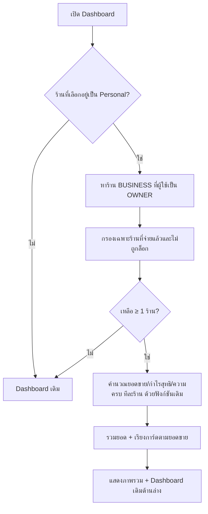
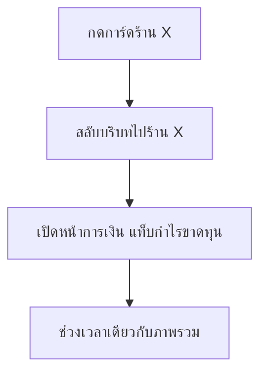

> **โมดูล:** 00069 — Professional Multi-Business Dashboard
> **ประเภทเอกสาร:** Business Requirements Document (BRD) - NON-TECHNICAL
> **เวอร์ชัน:** 1.0
> **วันที่จัดทำ:** 2026-10-05
> **สถานะ:** Approved — user อนุมัติ 2026-10-05
> **เจ้าของเอกสาร:** BA

# BRD: ภาพรวมทุกธุรกิจบน Dashboard (Business Requirements Document)

---

## 1. บทนำ

### 1.1 วัตถุประสงค์ของเอกสาร

เอกสารนี้มีวัตถุประสงค์เพื่อ:
1. อธิบายความต้องการของส่วน "ภาพรวมทุกธุรกิจ" บนหน้า Dashboard ผู้ขาย
2. กำหนดว่าใครเห็น ร้านไหนถูกนับ และตัวเลขแต่ละตัวมาจากนิยามใด
3. อธิบายพฤติกรรมเมื่อข้อมูลไม่ครบ และการแสดงผลบนมือถือ/desktop
4. สร้างความเข้าใจร่วมกันก่อนเริ่มเขียนโค้ด

### 1.2 ขอบเขตของระบบ

**ภาพรวมทุกธุรกิจ** คือส่วนบนสุดของหน้า Dashboard ผู้ขายในบริบทร้าน Personal ที่รวมยอดขายและกำไรสุทธิของทุกร้าน BUSINESS ที่ผู้ใช้เป็นเจ้าของและจ่ายเงินแล้ว

**เข้าสู่ระบบ (Input):**
- ผู้ใช้ที่เข้าสู่ระบบ + ร้านที่เลือกอยู่
- ช่วงเวลาที่เลือก

**ออกจากระบบ (Output):**
- ยอดรวม (ยอดขาย · กำไรสุทธิ · จำนวนออเดอร์) + ป้ายความครบ
- การ์ดรายร้าน เรียงตามยอดขาย
- กราฟเส้นรวม 2 เส้น

**ระบบที่เกี่ยวข้อง:**
- แพ็กเกจธุรกิจ (00008) · บทบาทสมาชิก (00012) · การเงินร้าน (00016/00067) · การสลับร้าน

### 1.3 กลุ่มผู้ใช้งาน

| กลุ่มผู้ใช้ | บทบาท | สิทธิ์การใช้งาน |
|-----------|--------|----------------|
| **เจ้าของหลัก** | OWNER (`Shop.userId`) | เห็นร้านของตัวเองที่จ่ายแล้ว |
| **เจ้าของร่วม** | OWNER (สมาชิกร้าน) | เห็นร้านที่ร่วมเป็นเจ้าของ ถ้าเจ้าของหลักจ่ายแล้ว |
| **ผู้ดูแล** | ADMIN | ไม่เห็นร้านนั้นในภาพรวม |

---

## 2. ความต้องการหลัก (Functional Requirements)

### 2.1 การแสดงส่วนภาพรวม

#### FR-001: เงื่อนไขการแสดงส่วนภาพรวม

**User Story:**
> ในฐานะเจ้าของหลายธุรกิจ ฉันต้องการเห็นภาพรวมทุกธุรกิจเมื่อเปิด Dashboard ในบริบท Personal เพื่อไม่ต้องสลับร้านทีละร้าน

**Acceptance Criteria:**
- [ ] แสดงเมื่อร้านที่เลือกอยู่เป็น Personal **และ** มีร้านที่เข้าเงื่อนไข FR-002 อย่างน้อย 1 ร้าน
- [ ] บริบทร้าน BUSINESS → ไม่แสดง Dashboard เหมือนเดิมทุกจุด
- [ ] ไม่มีร้านเข้าเงื่อนไข → ไม่แสดง (ไม่มี empty state ไม่มีปุ่มชวนซื้อ)
- [ ] Dashboard เดิมของร้าน Personal ยังอยู่ครบด้านล่าง

#### FR-002: ร้านที่ถูกนับ

**User Story:**
> ในฐานะเจ้าของ ฉันต้องการให้ภาพรวมมีเฉพาะธุรกิจที่ฉันเป็นเจ้าของและจ่ายเงินแล้ว เพื่อให้ตัวเลขสะท้อนธุรกิจที่ใช้งานจริง

**Acceptance Criteria:**
- [ ] นับร้านเมื่อครบทุกข้อ: ประเภท BUSINESS · ผู้ใช้มีบทบาท OWNER (เจ้าของหลักหรือเจ้าของร่วม) · ร้านไม่ถูกล็อกแพ็กเกจ · เจ้าของหลักของร้านมีแพ็กเกจ ACTIVE
- [ ] ร้าน Personal ไม่ถูกนับ
- [ ] ร้านที่ผู้ใช้เป็น ADMIN ไม่ถูกนับ
- [ ] ร้านที่ไม่จ่าย / ล็อก / แพ็กเกจต่ออายุไม่ผ่าน ไม่ถูกนับและไม่ปรากฏบนจอ
- [ ] นิยามนี้อยู่ที่เดียวในระบบ และมีเทสครอบทุกเงื่อนไขข้างบน (ลบเงื่อนไขใดออก เทสต้องแดง)

**Example:**
```
ผู้ใช้ A มี: Personal · ร้าน X (BUSINESS, A จ่าย ACTIVE) · ร้าน Y (BUSINESS, A เป็นเจ้าของร่วม, B จ่าย ACTIVE)
          · ร้าน Z (BUSINESS, A เป็น ADMIN) · ร้าน W (BUSINESS, A จ่าย แต่ร้านถูกล็อก)
ผลลัพธ์: ภาพรวมมี X, Y เท่านั้น
```

### 2.2 ตัวเลข

#### FR-003: ยอดรวมด้านบน

**User Story:**
> ในฐานะเจ้าของ ฉันต้องการเห็นยอดขายรวมและกำไรสุทธิรวมของทุกธุรกิจ เพื่อรู้ผลประกอบการรวมในพริบตา

**Acceptance Criteria:**
- [ ] ยอดขายรวม = ผลรวมยอดขายของทุกร้านใน FR-002 ตามนิยามยอดขายกลางของระบบ
- [ ] กำไรสุทธิรวม = ผลรวมกำไรสุทธิของทุกร้าน คำนวณด้วยฟังก์ชันเดียวกับแท็บกำไรขาดทุน (00067)
- [ ] จำนวนออเดอร์รวม = ผลรวมออเดอร์ที่นับเป็นยอดขาย
- [ ] ยอดรวมกำไรติดป้าย "ข้อมูลยังไม่ครบ" เมื่อมีอย่างน้อย 1 ร้านข้อมูลไม่ครบ (FR-005)
- [ ] มีหมายเหตุสั้นอธิบายว่าร้านบริการหักค่าส่ง ร้านขายของไม่หัก (แสดงเมื่อมีร้านต่างประเภทกันในภาพรวม)

#### FR-004: การ์ดรายร้าน

**User Story:**
> ในฐานะเจ้าของ ฉันต้องการเห็นตัวเลขแยกแต่ละร้าน เพื่อรู้ว่าร้านไหนทำได้ดีหรือแย่

**Acceptance Criteria:**
- [ ] แต่ละการ์ดมี: ชื่อร้าน + โลโก้ · ยอดขาย · กำไรสุทธิ + % margin · จำนวนออเดอร์ · ป้ายข้อมูลไม่ครบ (ถ้ามี)
- [ ] เรียงตามยอดขายมากไปน้อย
- [ ] ตัวเลขบนการ์ดตรงกับแท็บกำไรขาดทุนของร้านเดียวกัน ช่วงเดียวกัน ทุกบาท
- [ ] % margin คำนวณไม่ได้ (ยอดขาย 0) → แสดง "—"
- [ ] คำบนการ์ดใช้ศัพท์ตามประเภทร้าน (เช่น ร้านบริการ)

#### FR-005: ข้อมูลไม่ครบ

**User Story:**
> ในฐานะเจ้าของ ฉันต้องการรู้เมื่อตัวเลขกำไรยังไม่ใช่ค่าจริง เพื่อไม่ตัดสินใจจากตัวเลขที่สูงเกินจริง

**Acceptance Criteria:**
- [ ] ใช้เกณฑ์ความครบเดิมของหน้าการเงิน (ยังไม่ตั้งราคาทุน / ไม่มีรายการค่าใช้จ่ายในช่วงนั้น)
- [ ] ป้ายบอกได้ว่าขาดอะไร (ต้นทุน หรือ ค่าใช้จ่าย)
- [ ] ยังแสดงตัวเลขกำไร ไม่ซ่อน ไม่แทนด้วย "—"

### 2.3 ช่วงเวลา กราฟ และการนำทาง

#### FR-006: ตัวเลือกช่วงเวลา

**User Story:**
> ในฐานะเจ้าของ ฉันต้องการเลือกช่วงเวลา เพื่อดูภาพรวมของวันนี้ สัปดาห์นี้ หรือเดือนนี้

**Acceptance Criteria:**
- [ ] ตัวเลือกชุดเดียวกับหน้าการเงินของร้าน ค่าเริ่มต้น "เดือนนี้" ตามเวลาไทย (ดู PRD §4.3)
- [ ] ช่วงเวลาที่เลือกใช้กับยอดรวม การ์ดทุกใบ และกราฟ
- [ ] ช่วงเวลาที่เลือกอยู่ใน URL (รีเฟรช/แชร์ลิงก์แล้วได้ช่วงเดิม)

#### FR-007: กราฟแนวโน้มรวม

**User Story:**
> ในฐานะเจ้าของ ฉันต้องการเห็นแนวโน้มยอดขายและกำไรรวม เพื่อรู้ว่าธุรกิจโดยรวมกำลังขึ้นหรือลง

**Acceptance Criteria:**
- [ ] กราฟเส้น 2 เส้น: ยอดขายรวม + กำไรสุทธิรวม รายวัน (ขอบเขตตาม PRD §4.3)
- [ ] สร้างจากชุดข้อมูลกราฟเดิมของ Dashboard ร้าน รวมทุกร้านใน FR-002
- [ ] โครงกราฟ copy จาก Paces charts ผ่าน `ApexChart` สีจาก `getColor('chart-*')` (HR10)

#### FR-008: กดการ์ดเข้าร้าน

**User Story:**
> ในฐานะเจ้าของ ฉันต้องการกดการ์ดร้านแล้วไปดูรายละเอียดการเงินของร้านนั้นทันที

**Acceptance Criteria:**
- [ ] กดการ์ด → สลับบริบทไปร้านนั้นด้วยกลไกสลับร้านเดิม → ไปแท็บกำไรขาดทุน ช่วงเวลาเดียวกัน
- [ ] ตัวเลขที่หน้าปลายทางเท่ากับบนการ์ด
- [ ] การ์ดเป็นปุ่ม/ลิงก์ที่ใช้คีย์บอร์ดได้ และมีชื่อที่ screen reader อ่านได้

### 2.4 การแสดงผลตามขนาดจอ

#### FR-009: มือถือและ desktop

**User Story:**
> ในฐานะเจ้าของ ฉันต้องการดูภาพรวมได้ทั้งบนมือถือและคอมพิวเตอร์

**Acceptance Criteria:**
- [ ] มือถือ: ยอดรวม → กราฟ → การ์ดเรียงแนวตั้ง 1 คอลัมน์ ไม่มี scroll แนวนอน
- [ ] desktop: ยอดรวมเป็นแถว · การ์ดเป็นกริดหลายคอลัมน์
- [ ] แสดงในแอปมือถือ (iOS shell) ได้ตามปกติ — ไม่มีปุ่มซื้อ (ตรวจด้วย skill `app-store-surfaces`)
- [ ] UI ประกอบจาก Paces primitive ตาม HR1/HR7 ผ่านด่าน `safepay-ux` ก่อนเขียน

---

## 3. Acceptance Criteria สรุป

### 3.1 การมองเห็น

**เมื่อระบบทำงานถูกต้อง:**
- ✅ เห็นเฉพาะบริบท Personal + เป็น OWNER ของร้าน BUSINESS ที่จ่ายแล้ว ≥1
- ✅ ร้าน ADMIN / ไม่จ่าย / ล็อก / Personal ไม่ปรากฏ
- ✅ ไม่มีปุ่มซื้อหรือชวนอัปเกรดใด ๆ

### 3.2 ความถูกต้องของตัวเลข

**เมื่อเปิดการ์ดร้านใดก็ได้:**
- ✅ ยอดขาย/กำไรเท่ากับแท็บกำไรขาดทุนของร้านนั้นในช่วงเดียวกัน
- ✅ ยอดรวม = ผลบวกของการ์ดทุกใบ
- ✅ ข้อมูลไม่ครบมีป้ายเสมอ

---

## 4. Business Flows (กระบวนการทำงาน)

### 4.1 Flow หลัก: เปิด Dashboard



### 4.2 Flow ย่อย: กดการ์ดร้าน



---

## 5. Use Case Scenarios (สถานการณ์การใช้งานจริง)

### Scenario 1: เจ้าของ 2 ธุรกิจ ข้อมูลครบ

**ผู้เกี่ยวข้อง:** เจ้าของหลัก

**เงื่อนไขเริ่มต้น:**
- มีร้าน BUSINESS 2 ร้าน จ่ายแล้วทั้งคู่ ตั้งราคาทุนและบันทึกค่าใช้จ่ายครบ

**ขั้นตอน:**
1. เปิด Dashboard ในบริบท Personal
2. เห็นยอดรวมและการ์ด 2 ใบ ไม่มีป้ายใด ๆ

**ผลลัพธ์:**
- ยอดรวม = ผลบวก 2 ร้าน ตรงกับหน้าการเงินของแต่ละร้าน

### Scenario 2: ร้านบริการยังไม่บันทึกค่าใช้จ่าย

**ผู้เกี่ยวข้อง:** เจ้าของหลัก

**เงื่อนไขเริ่มต้น:**
- ร้านขายของ 1 ร้าน (ครบ) + ร้านบริการ 1 ร้าน (ไม่มีรายการค่าใช้จ่ายในเดือนนี้)

**ขั้นตอน:**
1. เปิด Dashboard
2. การ์ดร้านบริการแสดงกำไรพร้อมป้าย "ยังไม่บันทึกค่าใช้จ่าย"
3. ยอดรวมกำไรติดป้าย "ข้อมูลยังไม่ครบ" + หมายเหตุฐานค่าส่งต่างกัน

**ผลลัพธ์:**
- ผู้ใช้รู้ว่ากำไรรวมเป็นเพดานบน

### Scenario 3: เจ้าของร่วม + ร้านที่เป็น ADMIN

**ผู้เกี่ยวข้อง:** เจ้าของร่วม

**เงื่อนไขเริ่มต้น:**
- เป็นเจ้าของร่วมของร้าน Y (หุ้นส่วนจ่าย) และเป็น ADMIN ของร้าน Z (จ่ายแล้ว)
- ตัวเองไม่ได้จ่ายแพ็กเกจใด

**ขั้นตอน:**
1. เปิด Dashboard ในบริบท Personal

**ผลลัพธ์:**
- เห็นร้าน Y เท่านั้น ร้าน Z ไม่ปรากฏ

### Scenario 4: แพ็กเกจต่ออายุไม่ผ่าน

**ผู้เกี่ยวข้อง:** เจ้าของหลัก

**เงื่อนไขเริ่มต้น:**
- มีร้าน BUSINESS 1 ร้าน แพ็กเกจสถานะ LOCKED_RENEWAL_FAILED

**ขั้นตอน:**
1. เปิด Dashboard ในบริบท Personal

**ผลลัพธ์:**
- ไม่มีส่วนภาพรวม Dashboard เหมือนเดิม

---

## 6. ความต้องการด้านคุณภาพ (Quality Requirements)

### 6.1 ความถูกต้องของข้อมูล
- ใช้ฟังก์ชันคำนวณเดิมทั้งหมด ไม่มีสูตรใหม่ (HR16)
- มีเทสยืนยันว่าตัวเลขการ์ดเท่ากับรายงานกำไรขาดทุนของร้านเดียวกัน

### 6.2 ความรวดเร็ว
- คำนวณทุกร้านขนานกัน ไม่ทีละร้านต่อคิว
- วัดเวลาจริงก่อนปรับแต่งเพิ่ม (ไม่ทำ cache ล่วงหน้า)

### 6.3 ความน่าเชื่อถือ
- ร้านหนึ่งคำนวณล้ม → ไม่ทำให้ทั้งหน้า Dashboard ล้ม (ส่วนภาพรวมแสดงข้อความผิดพลาด Dashboard เดิมยังใช้ได้)

### 6.4 ความปลอดภัย
- กรองบทบาท OWNER และร้านที่จ่ายแล้วที่ชั้น query ก่อนคำนวณ — ไม่คำนวณแล้วค่อยซ่อนตอน render (ค่าที่ข้าม RSC ถูก serialize ลง HTML)
- ระบุตัวผู้ใช้ด้วย `sessionUserId()` ไม่ cast session

### 6.5 ความสะดวกในการใช้งาน (Usability)
- ใช้ได้บนมือถือ 1 มือ การ์ดมีพื้นที่กดเพียงพอ
- ไม่มี emoji ใช้ icon จริง (HR12) · font Anuphan (HR5)

---

## 7. ข้อจำกัด (Constraints)

### 7.1 ข้อจำกัดทางธุรกิจ
- ฐานกำไรต่างกันระหว่างร้านบริการกับร้านขายของ (มติ 00067)
- ไม่มีปุ่มซื้อในส่วนนี้ (กฎ App Store)

### 7.2 ข้อจำกัดทางเทคนิค
- รายงานกำไรขาดทุนเดิมรับได้ทีละร้าน → ต้องเรียกหลายครั้ง
- ชุดข้อมูลกราฟเดิมทำงานเป็นรายเดือน/รายปี ไม่รองรับช่วงอิสระ
- ไม่เปลี่ยน schema ฐานข้อมูล

---

## 8. กฎทางธุรกิจ (Business Rules)

### 8.1 กฎการมองเห็น
- เห็นเฉพาะบริบท Personal
- นับเฉพาะร้านที่ผู้ใช้เป็น OWNER

### 8.2 กฎร้านที่จ่ายเงิน
- BUSINESS + ไม่ถูกล็อก + เจ้าของหลักมีแพ็กเกจ ACTIVE
- ไม่เข้าเงื่อนไข = ซ่อน

### 8.3 กฎตัวเลข
- ยอดขาย = นิยามกลาง · กำไร = กำไรสุทธิของแท็บกำไรขาดทุน
- ร้าน Personal ไม่นับในยอดรวม
- ข้อมูลไม่ครบ = แสดงตัวเลข + ป้ายเสมอ

---

## 9. อภิธานศัพท์ (Glossary)

| คำศัพท์ | ความหมาย |
|---------|----------|
| **ภาพรวมทุกธุรกิจ** | ส่วนใหม่บน Dashboard ของฟีเจอร์นี้ |
| **ร้านที่จ่ายเงินแล้ว** | ตาม §8.2 |
| **กำไรสุทธิ** | ตัวเลขเดียวกับแท็บกำไรขาดทุนของร้าน |
| **ข้อมูลไม่ครบ** | ยังไม่ตั้งราคาทุน หรือไม่มีรายการค่าใช้จ่ายในช่วงนั้น |
| **เจ้าของร่วม** | สมาชิกร้านที่มีบทบาท OWNER แต่ไม่ใช่เจ้าของหลัก |

---

## 10. สรุป

เอกสาร BRD นี้อธิบายความต้องการหลักของ **ภาพรวมทุกธุรกิจบน Dashboard** แบบไม่ใช่เทคนิค

**จุดเด่นของระบบ:**
- เห็นยอดขาย/กำไรสุทธิของทุกธุรกิจในหน้าเดียว ทั้งมือถือและ desktop
- ตัวเลขตรงกับหน้าการเงินของแต่ละร้านทุกบาท
- บอกตรง ๆ เมื่อกำไรยังเป็นตัวเลขไม่ครบ

**ผลลัพธ์ที่คาดหวัง:**
- เจ้าของหลายธุรกิจเลิกสลับร้านเพื่อบวกเลขเอง
- เพิ่มเหตุผลในการเปิดและจ่ายแพ็กเกจร้าน BUSINESS เพิ่ม

---

**หมายเหตุ:**
สำหรับความต้องการทางธุรกิจระดับภาพรวม/personas/KPI ดู [[PRD]] ของโมดูลนี้
สำหรับ technical specification (architecture/API/data/NFR) ดู [[SRS]] ของโมดูลนี้
