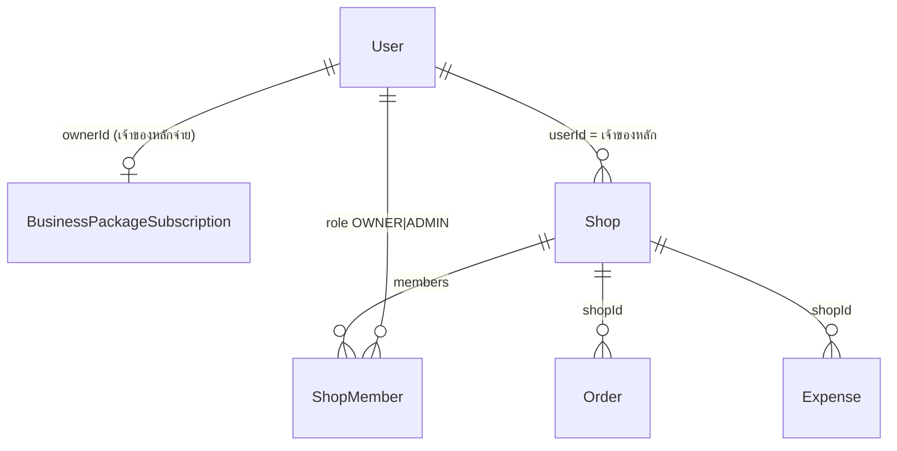

> **โมดูล:** 00069 — Professional Multi-Business Dashboard
> **ประเภทเอกสาร:** Database Design
> **เวอร์ชัน:** 1.0
> **วันที่จัดทำ:** 2026-10-05
> **สถานะ:** Draft

# DATABASE: ภาพรวมทุกธุรกิจบน Dashboard

---

## 1. Overview
**ไม่มีการเปลี่ยน schema · ไม่มี migration** — อ่านอย่างเดียวจากตารางเดิม

## 2. ERD

## 3. Tables
อ่านเท่านั้น

### 3.1 `Shop` (Postgres/Supabase)
ใช้ `id, shopName, logo, vertical, kind, userId, packageLockedAt, deletedAt, purgedAt`

### 3.2 `ShopMember`
ใช้ `shopId, userId, role`

### 3.3 `BusinessPackageSubscription`
ใช้ `ownerId, status`

### 3.4 `Order` / `Expense`
ผ่าน `getPnlReport` / `getSalesSeries` / `expense.count` เดิม

## 4. Indexes
ใช้ index เดิม: `ShopMember @@index([userId])` · `Shop.userId` · `BusinessPackageSubscription.ownerId @unique` — ไม่เพิ่ม

## 5. Migration Plan

### 5.1 ลำดับการ Migrate
ไม่มี

### 5.2 Rollback
revert commit ได้ทันที ไม่มีข้อมูลค้าง

### 5.3 ผลกระทบ (Impact)
ไม่มีผลต่อ prod DB (HR15 ไม่เกี่ยว)

## 6. Retention / ข้อควรระวัง
เทสที่สร้างข้อมูลต้อง scope ด้วย id ที่เทสสร้าง (HR13) · รันเทสชี้ localhost:5434 เท่านั้น

## 7. Traceability
FR-002 → 3.1–3.3 · FR-003/004 → 3.4

## 8. สรุป (Summary)
ไม่แตะฐานข้อมูล
