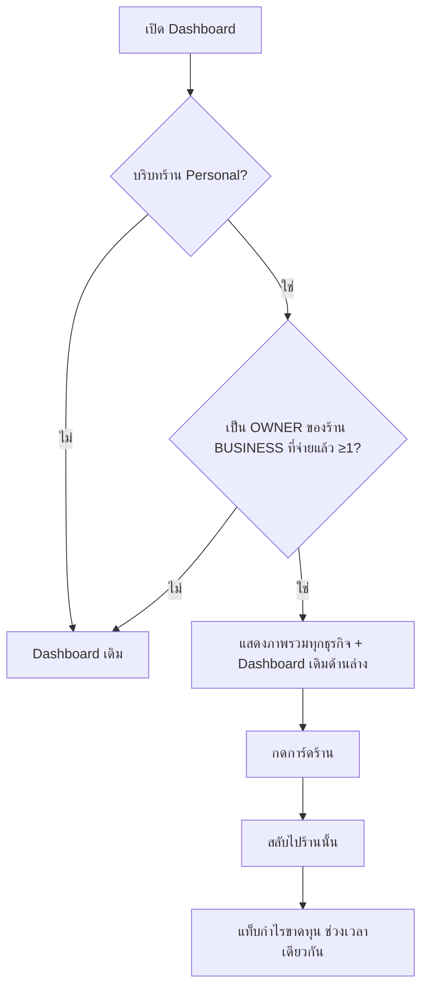

> **โมดูล:** 00069 — Professional Multi-Business Dashboard
> **ประเภทเอกสาร:** Product Requirements Document (PRD)
> **เวอร์ชัน:** 1.0
> **วันที่จัดทำ:** 2026-10-05
> **สถานะ:** Approved — user อนุมัติ 2026-10-05 (รวม §4.3)
> **เจ้าของเอกสาร:** BA + PO + PM

# PRD: ภาพรวมทุกธุรกิจบน Dashboard

---

## Executive Summary

ผู้ใช้หนึ่งคนมีร้าน Personal ได้ 1 ร้าน และเปิดร้าน BUSINESS เพิ่มได้หลายร้าน ทุกวันนี้หน้า `/seller/dashboard` และหน้าการเงิน `/seller/sales` แสดงตัวเลขทีละร้านตาม "ร้านที่เลือกอยู่" เท่านั้น เจ้าของที่มีหลายธุรกิจต้องสลับร้านทีละร้านแล้วบวกเลขเองเพื่อตอบคำถามว่า "ธุรกิจทั้งหมดของฉันเดือนนี้ขายได้เท่าไหร่ เหลือกำไรเท่าไหร่"

ฟีเจอร์นี้เพิ่มส่วน **"ภาพรวมทุกธุรกิจ"** ที่ด้านบนของหน้า Dashboard เมื่อผู้ใช้อยู่ในบริบทร้าน Personal และเป็นเจ้าของร้าน BUSINESS ที่จ่ายเงินอย่างน้อย 1 ร้าน แสดงยอดขายรวมและกำไรสุทธิรวม พร้อมการ์ดแยกรายร้านที่กดเข้าไปดูหน้าการเงินของร้านนั้นได้ทันที ใช้ได้ทั้งมือถือและ desktop

ตัวเลขทุกตัวใช้นิยามเดิมของระบบ **ไม่มีสูตรใหม่** — ยอดขายคือนิยามเดียวกับทุกหน้า และกำไรคือกำไรสุทธิตัวเดียวกับแท็บ "กำไรขาดทุน" ของร้าน (00067) เพื่อให้ตัวเลขบนการ์ดตรงกับหน้าปลายทางทุกบาท

---

## 1. Business Goals & KPIs

### 1.1 เป้าหมายทางธุรกิจ

| เป้าหมาย | รายละเอียด |
|----------|-----------|
| **เจ้าของหลายธุรกิจเห็นภาพรวมในหน้าเดียว** | ตอบ "ทุกธุรกิจเดือนนี้ขายได้/กำไรเท่าไหร่" โดยไม่ต้องสลับร้าน |
| **เพิ่มคุณค่าของแพ็กเกจที่จ่ายเงิน** | ภาพรวมนี้เห็นได้เฉพาะร้าน BUSINESS ที่จ่ายเงินแล้ว — เป็นเหตุผลให้เปิดธุรกิจที่ 2, 3 บน Deep |
| **ตัวเลขเดียวทั้งระบบ** | ยอดขาย/กำไรบนการ์ดต้องตรงกับหน้าการเงินของร้านนั้นทุกบาท (HR16) |

### 1.2 ตัวชี้วัดความสำเร็จ (KPIs)

| KPI | คำอธิบาย | เป้าหมาย |
|-----|----------|---------|
| **อัตราการใช้งาน** | สัดส่วนเจ้าของที่มีร้าน BUSINESS จ่ายเงิน ≥1 ร้าน ที่เปิด Dashboard ในบริบท Personal อย่างน้อย 1 ครั้ง/สัปดาห์ | ≥ 50% ใน 30 วันแรก |
| **การกดเข้าร้าน** | จำนวนครั้งที่กดการ์ดร้านแล้วไปหน้าการเงิน ต่อผู้ใช้ที่เห็นส่วนนี้ | ≥ 1 ครั้ง/สัปดาห์ |
| **ความตรงของตัวเลข** | ส่วนต่างระหว่างตัวเลขบนการ์ดกับแท็บกำไรขาดทุนของร้านเดียวกัน ช่วงเดียวกัน | 0 บาท |

---

## 2. User Personas (กลุ่มผู้ใช้งาน)

### 2.1 เจ้าของหลายธุรกิจ (Multi-business Owner)

**ข้อมูลพื้นฐาน:**
- มีร้าน Personal 1 ร้าน และร้าน BUSINESS ที่จ่ายเงิน 1 ร้านขึ้นไป (เช่น ร้านเสื้อผ้า + ร้านทำเล็บ)
- ใช้ทั้งมือถือ (แอป/เว็บ) ระหว่างวัน และ desktop ตอนสรุปยอด

**เป้าหมาย:**
- รู้ยอดขายและกำไรรวมของทุกธุรกิจในพริบตา และรู้ว่าร้านไหนทำได้ดี/แย่

**ความต้องการ:**
- ตัวเลขรวม + แยกรายร้าน ในช่วงเวลาที่เลือกได้
- กดจากร้านที่สนใจไปดูรายละเอียดได้ทันที

**จุดปวด (Pain Points):**
- ต้องสลับร้านทีละร้านแล้วจดเลขมาบวกเอง
- ไม่แน่ใจว่าตัวเลขแต่ละร้านคิดด้วยฐานเดียวกันหรือไม่

### 2.2 เจ้าของร่วม (Co-owner)

**ข้อมูลพื้นฐาน:**
- มีบทบาท OWNER ในร้าน BUSINESS ที่คนอื่นเป็นเจ้าของหลักและเป็นคนจ่ายแพ็กเกจ (บทบาทจาก 00012)

**เป้าหมาย:**
- เห็นภาพรวมของร้านที่ตัวเองร่วมเป็นเจ้าของ รวมกับธุรกิจของตัวเอง

**ความต้องการ:**
- ร้านที่ตัวเองเป็นเจ้าของร่วมต้องปรากฏในภาพรวมเหมือนร้านของตัวเอง

**จุดปวด (Pain Points):**
- ปัจจุบันต้องสลับเข้าไปดูทีละร้านเหมือนกลุ่ม 2.1

---

## 3. Business Requirements

### 3.1 ใครเห็นส่วนภาพรวม

**ความต้องการ:**
- แสดงส่วน "ภาพรวมทุกธุรกิจ" เมื่อ (1) ร้านที่เลือกอยู่คือร้าน Personal ของผู้ใช้ และ (2) ผู้ใช้มีบทบาท **OWNER** ในร้าน BUSINESS ที่จ่ายเงินแล้วอย่างน้อย 1 ร้าน
- ไม่เข้าเงื่อนไข → ไม่แสดงส่วนนี้เลย หน้า Dashboard เหมือนเดิมทุกอย่าง

**Business Rules:**
- นับเฉพาะบทบาท OWNER (เจ้าของหลัก + เจ้าของร่วม) — ผู้ดูแล (ADMIN) ไม่เห็นร้านนั้นในภาพรวม แม้ร้านจะเปิดให้ staff ดูการเงินก็ตาม
- เมื่ออยู่ในบริบทร้าน BUSINESS ใด ๆ หน้า Dashboard ทำงานแบบเดิม ไม่แสดงส่วนนี้

**เหตุผล:**
- ภาพรวมรวมกำไรของหลายร้านเข้าด้วยกัน เป็นข้อมูลระดับเจ้าของ ไม่ใช่ระดับพนักงาน

### 3.2 ร้านที่นับว่า "จ่ายเงินแล้ว"

**ความต้องการ:**
- ร้านจะอยู่ในภาพรวมเมื่อครบ 3 ข้อ: เป็นร้านประเภท BUSINESS · ร้านไม่ถูกล็อกแพ็กเกจ · เจ้าของหลักของร้านมีแพ็กเกจสถานะใช้งานอยู่ (ACTIVE)

**Business Rules:**
- แพ็กเกจผูกกับ "คน" (เจ้าของหลัก) ไม่ได้ผูกกับร้าน — เจ้าของร่วมจึงเห็นร้านที่คนอื่นจ่ายเงินได้
- ร้านที่ยังไม่จ่าย / ถูกล็อก / แพ็กเกจต่ออายุไม่ผ่าน → **ซ่อน** ไม่แสดงการ์ดล็อก ไม่มีปุ่มชวนอัปเกรด
- นิยามนี้ต้องอยู่ที่เดียวในระบบ ใช้ซ้ำได้ ไม่เขียนซ้ำในหน้าจอ

**เหตุผล:**
- ไม่มีปุ่มซื้อ = ไม่ชนกฎ App Store ในแอปมือถือ และไม่ขยายขอบเขตงาน

### 3.3 ตัวเลขที่แสดง

**ความต้องการ:**
- **ยอดรวมด้านบน:** ยอดขายรวม · กำไรสุทธิรวม · จำนวนออเดอร์ที่นับเป็นยอดขายรวม ของทุกร้าน BUSINESS ที่เข้าเงื่อนไข
- **การ์ดรายร้าน:** ชื่อร้าน + โลโก้ · ยอดขาย · กำไรสุทธิ + % margin · จำนวนออเดอร์ · ป้ายเมื่อข้อมูลไม่ครบ
- เรียงการ์ดตามยอดขายจากมากไปน้อย
- กราฟเส้นแนวโน้มรวม (ดู §4.3 จุดที่ต้องยืนยัน)

**Business Rules:**
- ยอดขาย = นิยามเดียวกับทุกหน้าในระบบ
- กำไร = **กำไรสุทธิ** ตัวเดียวกับแท็บ "กำไรขาดทุน" ของร้าน (หักต้นทุนสินค้า ค่าใช้จ่ายร้าน และค่าส่งตามกติกาของประเภทร้าน)
- ร้าน Personal **ไม่นับ** ในยอดรวม (ตัวเลขของร้าน Personal ยังอยู่ใน Dashboard เดิมด้านล่าง)
- ข้อมูลไม่ครบ (ยังไม่ตั้งราคาทุน หรือยังไม่บันทึกค่าใช้จ่าย) → แสดงตัวเลขพร้อมป้าย "ยังไม่ครบ" บนการ์ดร้านนั้น และยอดรวมกำไรติดป้ายเมื่อมีอย่างน้อย 1 ร้านไม่ครบ
- ร้านต่างประเภทใช้ศัพท์ตามประเภทร้านของตัวเองบนการ์ด

**เหตุผล:**
- ตัวเลขบนการ์ดต้องตรงกับหน้าที่กดเข้าไป ไม่งั้นผู้ใช้จะเห็น "กำไร" สองค่าในสองหน้า (HR16)
- ร้านบริการที่ยังไม่บันทึกค่าใช้จ่ายจะได้กำไรเท่ากับยอดขาย — ต้องติดป้ายเสมอ (บทเรียน 2026-08-23)

### 3.4 ช่วงเวลา

**ความต้องการ:**
- ตัวเลือกช่วงเวลาชุดเดียวกับหน้าการเงินของร้าน ค่าเริ่มต้น "เดือนนี้" ตามเวลาไทย
- ไม่มีการเทียบ % กับช่วงก่อนหน้าในรอบนี้

**Business Rules:**
- ช่วงเวลาเดียวใช้กับยอดรวม การ์ดทุกใบ และกราฟ

**เหตุผล:**
- ใช้ชุดตัวเลือกเดิมเพื่อให้ช่วงเวลาตรงกันเมื่อกดเข้าหน้าการเงินของร้าน

### 3.5 การกดการ์ดร้าน

**ความต้องการ:**
- กดการ์ด → สลับบริบทไปร้านนั้น แล้วไปที่แท็บกำไรขาดทุนของหน้าการเงิน ด้วยช่วงเวลาเดียวกัน

**Business Rules:**
- ใช้กลไกสลับร้านเดิมของระบบ ไม่สร้างกลไกใหม่

**เหตุผล:**
- ผู้ใช้เห็นตัวเลขเดียวกันต่อเนื่องจากการ์ดไปถึงรายละเอียด

---

## 4. Business Rules & Constraints

### 4.1 กฎทางธุรกิจหลัก

| กฎ | คำอธิบาย |
|----|----------|
| **ไม่มีสูตรใหม่** | ยอดขาย/กำไร/ความครบของข้อมูล ใช้นิยามเดิมของระบบทั้งหมด |
| **OWNER เท่านั้น** | ร้านที่ผู้ใช้เป็น ADMIN ไม่ถูกนับ |
| **จ่ายเงินแล้วเท่านั้น** | ร้านที่ไม่เข้า §3.2 ถูกซ่อน |
| **Personal ไม่นับ** | ยอดรวมคือของร้าน BUSINESS เท่านั้น |

### 4.2 ข้อจำกัดทางธุรกิจ

| ข้อจำกัด | รายละเอียด |
|---------|-----------|
| **ฐานกำไรต่างกันตามประเภทร้าน** | ร้านบริการหักค่าส่งเป็นค่าใช้จ่าย ร้านขายของไม่หัก (มติ 00067 / 2026-10-02) — ยอดรวมกำไรต้องมีหมายเหตุอธิบาย |
| **กำไรอาจเป็นเพดานบน** | เมื่อข้อมูลต้นทุน/ค่าใช้จ่ายไม่ครบ ต้องติดป้ายเสมอ |

### 4.3 จุดที่ต้องยืนยัน (ปรับจากมติระหว่างตรวจโค้ด)

| จุด | มติเดิม | ข้อเท็จจริงในโค้ด | ข้อเสนอ |
|-----|---------|--------------------|---------|
| **ตัวเลือกช่วงเวลา** | วันนี้ / 7 วัน / เดือนนี้ / เดือนก่อน / กำหนดเอง | ชุดกลางของระบบ (`DATE_RANGE_OPTIONS`) คือ วันนี้ / 7 วัน / 30 วัน / เดือนนี้ / กำหนดเอง — ไม่มี "เดือนก่อน" | ใช้ชุดกลางตามเดิม ("เดือนก่อน" เลือกผ่าน "กำหนดเอง") เพื่อให้ตรงกับหน้าการเงินที่กดเข้าไป |
| **กราฟ** | 2 เส้น: ยอดขาย + กำไรขั้นต้น | กำไรเปลี่ยนเป็นกำไรสุทธิ (Q15) · ชุดข้อมูลกราฟเดิม (`getSalesSeries`) ทำงานเป็นรายเดือน (แท่งรายวัน) หรือรายปี ไม่รองรับช่วงอิสระ | กราฟรายวันของ "เดือน" ที่ช่วงเวลาสิ้นสุด แสดง 2 เส้น: ยอดขายรวม + กำไรสุทธิรวม จากชุดข้อมูลเดิม |

---

## 5. Out of Scope (นอกขอบเขต)

| หัวข้อ | คำอธิบาย |
|--------|----------|
| **การ์ดล็อก/ชวนอัปเกรด** | ร้านที่ไม่จ่ายถูกซ่อน ไม่มี CTA ซื้อ |
| **เทียบ % กับช่วงก่อน** | ยังไม่ทำในรอบนี้ |
| **กราฟแยกเส้นรายร้าน** | อ่านยากเมื่อมีหลายร้าน |
| **งบกำไรขาดทุนรวมแบบละเอียด** | รายละเอียดดูในหน้าการเงินของแต่ละร้าน |
| **ส่งออกไฟล์ (CSV/PDF)** | ไม่อยู่ในรอบนี้ |
| **ภาพรวมในบริบทร้าน BUSINESS** | แสดงเฉพาะบริบท Personal |
| **ผู้ดูแล (ADMIN) ดูภาพรวม** | ไม่รองรับ |

---

## 6. Risks & Mitigation (ความเสี่ยงและแนวทางแก้ไข)

### 6.1 ความเสี่ยงทางธุรกิจ

| ความเสี่ยง | ผลกระทบ | ระดับความรุนแรง | แนวทางแก้ไข |
|-----------|---------|-----------------|-------------|
| **ตัวเลขการ์ดไม่ตรงหน้าการเงิน** | ผู้ใช้ไม่เชื่อตัวเลขทั้งระบบ | สูง | เรียกฟังก์ชันคำนวณตัวเดียวกับหน้าการเงิน + เทสเทียบค่า |
| **กำไรสูงเกินจริงโดยไม่บอก** | ตัดสินใจธุรกิจผิด | สูง | ป้ายความครบของข้อมูลบนการ์ดและยอดรวมเสมอ |
| **กำไรรั่วถึงคนที่ไม่ใช่เจ้าของ** | ข้อมูลการเงินรั่ว | สูง | กรองบทบาท OWNER ที่ชั้น query ไม่ใช่ตอน render |

### 6.2 ความเสี่ยงทางเทคนิค

| ความเสี่ยง | ผลกระทบ | แนวทางแก้ไข |
|-----------|---------|-------------|
| **คำนวณทีละร้าน N ครั้ง** | หน้า Dashboard ช้าเมื่อมีหลายร้าน | รันขนานกัน · วัดเวลาก่อนปรับ (เจ้าของส่วนใหญ่มี 1–3 ร้าน) |
| **นิยาม "จ่ายเงิน" กระจายหลายที่** | ร้านโผล่/หายไม่ตรงกัน | helper เดียวใน `src/lib` + เทส |

---

## 7. Glossary (อภิธานศัพท์)

| คำศัพท์ | ความหมาย |
|---------|----------|
| **ร้าน Personal** | ร้านส่วนตัวของผู้ใช้ มีได้ 1 ร้าน/คน (`Shop.kind = 'PERSONAL'`) |
| **ร้าน BUSINESS** | ร้านธุรกิจที่เปิดเพิ่ม (`Shop.kind = 'BUSINESS'`) |
| **เจ้าของ (OWNER)** | เจ้าของหลัก (`Shop.userId`) หรือเจ้าของร่วม (ShopMember role OWNER) |
| **ร้านที่จ่ายเงินแล้ว** | ตาม §3.2 |
| **ยอดขาย** | ออเดอร์ที่นับเป็นรายได้ตามนิยามกลางของระบบ หักยอดคืน |
| **กำไรสุทธิ** | ยอดขาย − ต้นทุนสินค้า − ค่าใช้จ่ายร้าน (− ค่าส่งสำหรับร้านบริการ) ตามแท็บกำไรขาดทุน |
| **ข้อมูลไม่ครบ** | มีรายการที่ยังไม่ตั้งราคาทุน หรือไม่มีรายการค่าใช้จ่ายในช่วงนั้น |

---

## 8. Success Metrics (ตัวชี้วัดความสำเร็จ)

| ตัวชี้วัด | ค่าที่คาดหวัง | วิธีวัด |
|----------|---------------|--------|
| **ตัวเลขตรงหน้าการเงิน** | ต่าง 0 บาท | เทสเทียบค่าการ์ดกับรายงานของร้านเดียวกัน |
| **ไม่มีร้านที่ไม่ควรเห็นโผล่** | 0 ร้าน | เทส: ร้าน ADMIN / ไม่จ่าย / ล็อก / Personal ไม่อยู่ในผล |
| **ใช้งานได้ทั้ง 2 จอ** | ผ่านทั้งมือถือและ desktop | ตรวจด้วยตาบนจอจริง 3 ขนาด |

---

## 9. Dependencies & Assumptions

### 9.1 สิ่งที่ต้องพึ่งพา (Dependencies)

| ระบบ/ส่วนประกอบ | ความสัมพันธ์ |
|-----------------|-------------|
| **00008 Business Account & Packages** | สถานะแพ็กเกจของเจ้าของหลัก + การล็อกร้าน |
| **00012 บทบาทสมาชิก** | OWNER/ADMIN และเจ้าของร่วม |
| **00016 / 00067 การเงินร้าน** | สูตรกำไรสุทธิ ความครบของข้อมูล หน้าปลายทาง |
| **Dashboard ผู้ขาย** | หน้าที่ส่วนนี้ถูกแทรกเข้าไป |
| **การสลับร้าน** | ใช้กดการ์ดเข้าร้าน |

### 9.2 สมมติฐาน (Assumptions)

- เจ้าของส่วนใหญ่มีร้าน BUSINESS ไม่เกิน 5 ร้าน
- ทุกร้านใช้สกุลเงินบาท จึงรวมยอดกันได้ตรง ๆ
- ไม่ต้องเปลี่ยน schema ฐานข้อมูล

---

## 10. Appendix

### 10.1 ตัวอย่าง User Journey

**Scenario: เจ้าของ 2 ธุรกิจเช็คยอดต้นเดือน**

1. คุณเอมีร้าน Personal + ร้านเสื้อผ้า (BUSINESS, จ่ายแล้ว) + ร้านทำเล็บ (BUSINESS, เป็นเจ้าของร่วม, หุ้นส่วนจ่าย)
2. เปิดแอปในบริบท Personal → Dashboard แสดง "ภาพรวมทุกธุรกิจ" ช่วง "เดือนนี้"
3. เห็นยอดขายรวม ฿182,400 · กำไรสุทธิรวม ฿41,250 (ป้าย: ร้านทำเล็บยังไม่บันทึกค่าใช้จ่าย)
4. การ์ดร้านเสื้อผ้าอยู่บนสุด (ยอดขายสูงกว่า) ร้านทำเล็บตามมาพร้อมป้าย "ยังไม่ครบ"
5. กดการ์ดร้านทำเล็บ → ระบบสลับไปร้านทำเล็บ → เปิดแท็บกำไรขาดทุน "เดือนนี้" เห็นตัวเลขตรงกับการ์ด

---

**หมายเหตุ:**
เอกสารนี้เป็นการบันทึกความต้องการทางธุรกิจ (Business Requirements) โดยไม่มีรายละเอียดทางเทคนิค
สำหรับ Functional Requirements / User Story / Acceptance Criteria ดู [[BRD]] ของโมดูลนี้
สำหรับ technical specification ดู [[SRS]] ของโมดูลนี้

---

## ส่วนแก้ไข v1.1 (2026-10-05 — user อนุมัติผ่านการถามตอบ Q17–Q25)

> ส่วนนี้ **ชนะ** เนื้อหาเดิมข้างบนเมื่อขัดกัน

| # | มติ | แทนที่ |
|---|-----|-------|
| Q17 | มือถือ: การ์ด "ยอดขาย" บน CommandCenter ในบริบท Personal **กลายเป็นยอดรวมทุกธุรกิจ** (ไม่มีส่วนแยกด้านบน) · กดแล้วเปิด **ชีตรวมเต็มจอ** ที่เห็นทุกร้านในจอเดียวและเทียบกันได้ | §3.1 (ตำแหน่งบนมือถือ) |
| Q18 / Q23 | ร้าน Personal **ไม่นับ** ในยอดรวม แต่มี **แถวของตัวเอง** ในตารางเทียบ ป้าย "ส่วนตัว · ไม่นับในยอดรวม" | §3.3 (Personal หายจากหน้าแรกมือถือ) |
| Q19 | การ์ดมือถือคงตัวเลือก "วันนี้ \| เดือนนี้" | — |
| Q20 | เทียบร้าน = **กราฟแท่งซ้อนแยกสีตามร้าน** + **ตารางเทียบ** (ร้าน · ยอดขาย · กำไรสุทธิ · % ของยอดรวม) · เกิน 5 ร้าน → ร้านเล็กสุดรวมเป็น "อื่น ๆ" ในกราฟ (ตารางยังแสดงครบ) | Out of scope "กราฟแยกเส้นรายร้าน" |
| Q21 | ชีตรวม **ไม่มี** ส่วนที่มีความหมายเฉพาะร้านเดียว (แท็บการเงินร้านบริการ · ยอดค้างรับ · สถานะงาน · ตารางต้นทุน/ค่าส่งรายวัน) · กดแถวร้านในตาราง → สลับไปร้านนั้น | — |
| Q22 | **ยอดขาย** ทุกจอของฟีเจอร์นี้ = นิยามของการ์ดยอดขายเดิม (ยืนยันแล้ว + รอยืนยัน จาก `getSalesSeries`) ⇒ ยอดรวม = ผลบวกการ์ดหน้าแรกของแต่ละร้าน · **กำไรสุทธิ** ยังมาจาก `getPnlReport` | §3.3 "ยอดขาย = นิยามเดียวกับทุกหน้า" · กลับมติ Q3/§4.3 กราฟ |
| Q24 | desktop ใช้รูปแบบเดียวกับมือถือ: กราฟแท่งซ้อน + ตารางเทียบ แทนกราฟ 2 เส้น | FR-007 เดิม |
| Q25 | ช่วงเวลา = รูปแบบชีตยอดขาย: **รายวัน (ทีละเดือน) / รายเดือน (ทีละปี)** + ลูกศร ‹ › · เลิกใช้ 5 ตัวเลือกบน desktop · กำไรสุทธิ = `getPnlReport` ของเดือน/ปีนั้น · ลิงก์การ์ดร้านส่งช่วงเดียวกัน (`range=custom`) | §3.4 · §4.3 ช่วงเวลา |

**ข้อสังเกตที่ผู้ใช้ต้องรู้:** ยอดขายในภาพรวมนับ "รอยืนยัน" ด้วย จึง **มากกว่า** ยอดขายบนหน้าการเงินของร้าน (ซึ่งนับเฉพาะที่เป็นรายได้แล้ว) — ตารางเทียบต้องบอกที่มาของตัวเลขทั้งสองคอลัมน์
