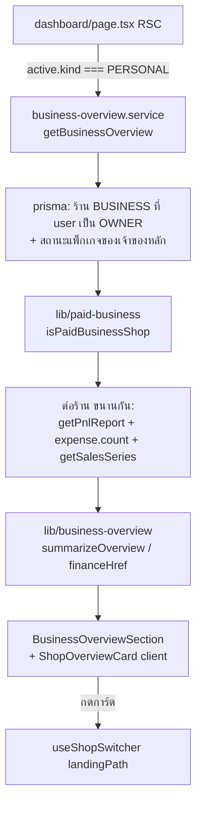
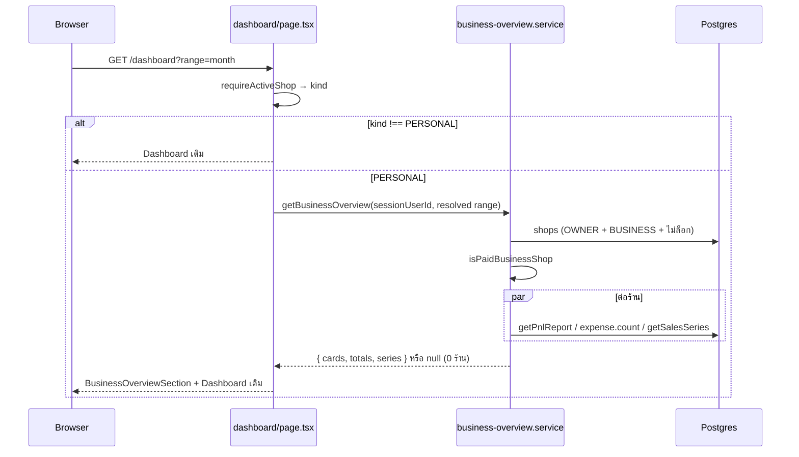

> **โมดูล:** 00069 — Professional Multi-Business Dashboard
> **ประเภทเอกสาร:** System Design Spec (SDS)
> **เวอร์ชัน:** 1.0
> **วันที่จัดทำ:** 2026-10-05
> **สถานะ:** Draft (user สั่ง "ลุยเลย" 2026-10-05 — ข้าม approval รายไฟล์)

# SDS: ภาพรวมทุกธุรกิจบน Dashboard (System Design Spec)

---

## 1. บทนำ & References

### 1.1 วัตถุประสงค์
ออกแบบวิธีหาร้านที่เข้าเงื่อนไข · รวมตัวเลขจากฟังก์ชันการเงินเดิม · แสดงผลบน `/seller/dashboard` โดยไม่เพิ่มสูตรใหม่

### 1.2 ขอบเขตการออกแบบ
server-side (RSC) ทั้งหมด ไม่มี API route ใหม่ ไม่มี migration

### 1.3 เอกสารอ้างอิง
- `src/services/pnl.service.ts` — `getPnlReport(shopId, range, vertical)` (SSOT กำไรสุทธิ)
- `src/lib/finance-tabs.ts` — `resolveDataCompleteness`
- `src/lib/date-range.ts` — `resolveRangeFromParams` / `DATE_RANGE_OPTIONS`
- `src/services/dashboard.service.ts` — `getSalesSeries`
- `src/lib/finance-rules.ts` — `usesServiceFinanceRules`
- `src/hooks/useShopSwitcher.ts` — `landingPath`
- `docs/20 - Features/00012 - Shop Staff Invite Links/EXTENSIONS-2026-10-05-member-roles.md` — BR-MR-02/08 (เจ้าของหลัก = `Shop.userId`)

---

## 2. Architecture Overview

### 2.1 มุมมองสถาปัตยกรรม



### 2.2 มุมมองการ Deploy (ถ้าจำเป็น)
ไม่เปลี่ยน

---

## 3. Component Design

| Component | ไฟล์ | หน้าที่ |
|-----------|------|--------|
| `isPaidBusinessShop` | `src/lib/paid-business.ts` (ใหม่) | ฟังก์ชันบริสุทธิ์: `kind==='BUSINESS' && packageLockedAt==null && ownerSubscriptionStatus==='ACTIVE'` |
| `summarizeOverview` · `marginPercent` · `financeHrefFor` · `sumSeries` | `src/lib/business-overview.ts` (ใหม่) | ฟังก์ชันบริสุทธิ์: รวมยอด · เรียงการ์ด · % margin (`null` เมื่อยอดขาย ≤ 0) · ลิงก์ปลายทางตามประเภทร้าน · รวมกราฟ |
| `getBusinessOverview(userId, range)` | `src/services/business-overview.service.ts` (ใหม่) | query ร้าน → กรอง → ยิงฟังก์ชันการเงินเดิมทีละร้านขนานกัน → ส่งผลให้ lib รวม |
| `BusinessOverviewSection` | `dashboard/components/BusinessOverviewSection.tsx` (ใหม่, server) | ยอดรวม + กราฟ + กริดการ์ด ตาม UX-Design-Spec |
| `ShopOverviewCard` | `dashboard/components/ShopOverviewCard.tsx` (ใหม่, client) | การ์ดกดได้ → `useShopSwitcher({ landingPath })` |
| ตัวเลือกช่วงเวลา | reuse ตาม UX-Design-Spec | URL `?range=&start=&end=` |

### 3.1 query หาร้าน (fail-closed ที่ชั้น query)

```ts
prisma.shop.findMany({
  where: {
    kind: 'BUSINESS', deletedAt: null, purgedAt: null, packageLockedAt: null,
    OR: [{ userId }, { members: { some: { userId, role: 'OWNER' } } }],
  },
  select: { id, shopName, logo, vertical, kind, packageLockedAt,
            user: { select: { businessPackageSubscription: { select: { status: true } } } } },
})
```
แล้วกรองซ้ำด้วย `isPaidBusinessShop` (เงื่อนไขเดียวกันต้องอยู่ใน lib ที่เทสได้ — WHERE เป็นแค่การตัดแถวล่วงหน้า)

### 3.2 ต่อร้าน (Promise.allSettled)
- `getPnlReport(shop.id, range, shop.vertical)` → `revenue` · `netProfit` · `orderCount` · `hasMissingCost`
- `prisma.expense.count({ where: { shopId, expenseDate: range.expenseRange } })` → `expenseCount` (ตัวเดียวกับที่ `/sales` ใช้ `listExpenses().length`)
- `resolveDataCompleteness({ hasMissingCost, expenseCount, uncostedItemCount: 0, soldItemCount: 0 })` — ใช้แค่ `complete/missingCost/missingExpense` (ไม่มีปุ่มตั้งราคาทุนบนการ์ด)
- `getSalesSeries(shop.id, 'daily', { year, month }, true, shop.vertical)` → `values` · `netProfitValues` (เดือนที่ `range` จบ)
- ร้านใดล้ม → การ์ดร้านนั้นสถานะ error, ไม่นับในยอดรวม, ยอดรวมติดป้าย "ไม่ครบ" (partial-data convention)

---

## 4. Data Flow

### 4.1 Flow หลัก: เปิด Dashboard



### 4.2 Flow กรณีล้มเหลว / ชดเชย (ถ้ามี)
- service ทั้งก้อน throw → page จับ แล้วไม่ render ส่วนนี้ (Dashboard เดิมยังขึ้น) + `console.error('[business-overview]', …)`
- ร้านเดียวล้ม → ตาม §3.2

---

## 5. Integration Points

| จุด | การใช้ | หมายเหตุ |
|-----|-------|---------|
| `getPnlReport` | กำไรสุทธิ/ยอดขาย/จำนวนออเดอร์ | ปลายทางของการ์ดเรียกตัวเดียวกัน ⇒ ตรงกันทุกบาท |
| `getSalesSeries` | กราฟ | ดู TD-003 |
| `useShopSwitcher` | สลับร้าน | `landingPath` = ผล `financeHrefFor` |
| ปลายทางร้านบริการ | `/sales?tab=pnl&range=…` | แท็บ pnl มีเฉพาะ SERVICE_QUEUE |
| ปลายทางร้านอื่น | `/expenses?range=…` | การ์ด P&L ของ `/expenses` ใช้ `getPnlReport` เดียวกัน (`/sales` ของร้านขายของเป็นของเดิม ไม่มีกำไรสุทธิ) |

---

## 6. Technical Decisions

### TD-001: ไม่สร้าง API route — เรียก service ตรงจาก RSC
หน้าเป็น RSC อยู่แล้ว เปลี่ยนช่วงเวลา = เปลี่ยน URL → RSC render ใหม่ ไม่ต้องมี endpoint ให้ดูแลเพิ่ม

### TD-002: ปลายทางแยกตามประเภทร้าน
แท็บ "กำไรขาดทุน" (`/sales?tab=pnl`) มีเฉพาะร้านบริการ ร้านอื่นมีการ์ด P&L ที่ `/expenses` — ทั้งสองเรียก `getPnlReport` ด้วยช่วงจาก `resolveDateRange` ตัวเดียวกัน ⇒ ตัวเลขตรงกับการ์ด (PRD §3.5 "แท็บกำไรขาดทุน" อ่านเป็น "หน้าที่แสดงกำไรสุทธิของร้านนั้น")
**ข้อระวัง:** `/expenses` default = `30d` ต้องส่ง `range` ไปเสมอ

### TD-003: กราฟใช้ `getSalesSeries` ซึ่งร้านที่ไม่ใช่บริการนับยอดแบบเดิม
มติ user 2026-10-02 ให้ร้านขายของใช้กติกาเดิมในกราฟ/ชีต ⇒ ผลรวมของกราฟอาจไม่เท่ากับยอดรวมบนการ์ดเมื่อมีร้านขายของ — กราฟติดคำอธิบาย "แนวโน้มรายวัน · ตัวเลขชุดเดียวกับกราฟหน้าแรกของแต่ละร้าน" และ**ไม่แสดงยอดรวมบนกราฟ** เพื่อไม่ให้มีตัวเลขรวมสองค่า (HR16) · ไม่แก้ `getSalesSeries` ในงานนี้

### TD-004: ช่วงเวลาของส่วนนี้แยกจาก cookie `seller_dashboard_range`
ส่วนล่างของ Dashboard ใช้ cookie (วันนี้|เดือนนี้) · ส่วนนี้ใช้ URL `range/start/end` + `resolveRangeFromParams(sp, 'month')` — สองตัวคุมคนละส่วน ตัวเลือกต้องวางอยู่ในหัวของส่วนนี้เท่านั้น (UX-Design-Spec)

### TD-005: ไม่ cache
เจ้าของส่วนใหญ่มี 1–3 ร้าน · วัดด้วย `Server-Timing` ก่อนถ้าช้า (feedback: วัดก่อนแก้)

---

## 7. Traceability

| FR (BRD) | ออกแบบที่ |
|----------|-----------|
| FR-001 | page.tsx gate `active.kind === 'PERSONAL'` + service คืน `null` เมื่อ 0 ร้าน |
| FR-002 | §3.1 + `isPaidBusinessShop` |
| FR-003/004 | `summarizeOverview` + `getPnlReport` |
| FR-005 | `resolveDataCompleteness` |
| FR-006 | TD-004 |
| FR-007 | TD-003 + `sumSeries` |
| FR-008 | TD-002 + `financeHrefFor` + `useShopSwitcher` |
| FR-009 | UX-Design-Spec |

---

## 8. สรุป (Summary)
งานนี้มีไฟล์ใหม่ 2 lib + 1 service + 2 component แล้วแทรกเข้า page.tsx 1 จุด ไม่มี API route, migration หรือสูตรเงินใหม่ ตัวเลขทุกตัวมาจาก `getPnlReport`/`getSalesSeries` ตัวเดิม
