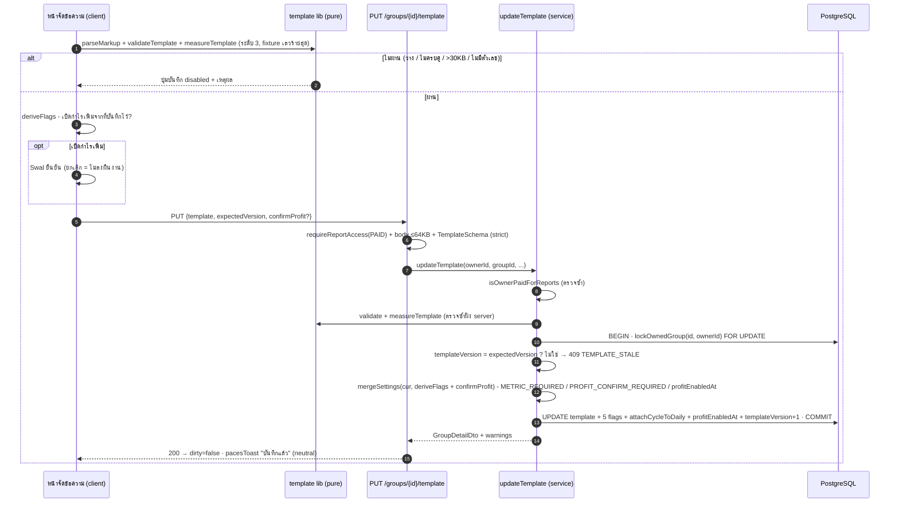
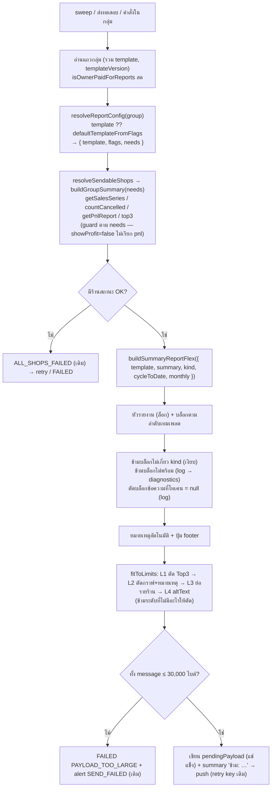
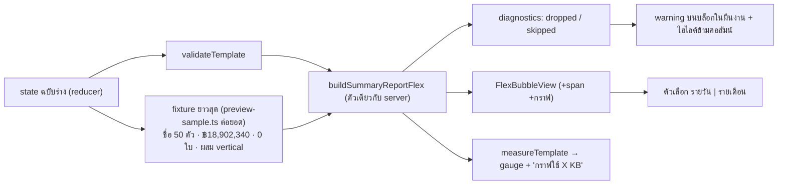
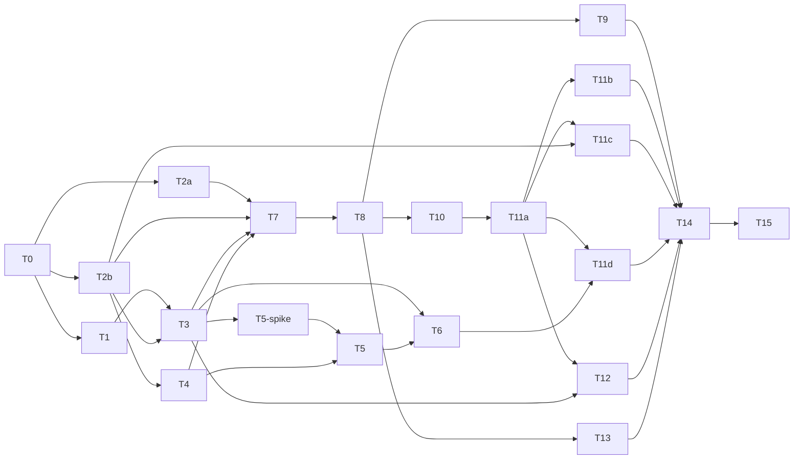

# ส่วนขยาย 2026-10-05 — ตัวจัดข้อความรายงานเข้ากลุ่ม LINE + บล็อกกราฟ

> เอกสารนี้ = PRD + BRD ส่วนขยายรวมไฟล์เดียว ต่อยอดจาก PRD/BRD/SRS ของ 00070 ที่อนุมัติแล้ว (v1.0 · 2026-10-05) **ไม่แก้ความหมายของ FR-LGS-01..24 เดิม** เว้นที่ระบุในหัวข้อ "ผลต่อ FR เดิม" (§13)
>
> 🛑 **Doc-First (HR11):** ผ่านการอนุมัติจาก user ก่อน แล้วจึงเริ่มโค้ด · งานแตะ data model/API/enum → ต้อง sync `docs/SRS.md` (งาน T13)
>
> ตัวเลขบรรทัดโค้ดที่อ้างในเอกสารนี้ = อ่านจากโค้ดจริง ณ 2026-10-05 (HR16)

---

## 1. Goals

**G-1** ให้เจ้าของจัดข้อความที่บอท "Deep รายงานยอด" ส่งเข้ากลุ่มได้เอง (เลือกบล็อก · เรียงลำดับ · เติมข้อความของตัวเอง · ใส่กราฟ) โดย **ตัวเลขยังมาจาก SSOT เดิมทุกตัว** (HR16)

**G-2** **กลุ่มเดิมทุกกลุ่มต้องไม่เปลี่ยนแม้ไบต์เดียว** จนกว่าเจ้าของจะกดบันทึกเทมเพลตเอง (`template = null` ⇒ ข้อความเดิมทุกไบต์ — บังคับด้วย golden test, §12 R-1)

**G-3** ทางประกอบข้อความ **ทางเดียว** ใช้ทั้ง ส่งตามตาราง · ส่งทดสอบ · ตอบคำสั่งในกลุ่ม · พรีวิวในหน้าจัดข้อความ (HR16 — ห้ามมีสองทาง)

**G-4** ข้อความของเจ้าของ **ไม่ถูกตัดเงียบ ๆ** · ข้อความที่ใหญ่เกิน LINE รับ **บันทึกไม่ได้ตั้งแต่ตอนแก้** ไม่ใช่มาล้มตอนส่ง 09:00

**ไม่ใช่เป้าหมาย:** รายงานแบบใหม่ · ตัวเลขนิยามใหม่ · template ข้ามกลุ่ม (ดู §11)

---

## 2. User Stories (รูปแบบ §2 ของ PRD)

| # | ในฐานะ | ฉันต้องการ | เพื่อ | Must/Nice |
|---|---|---|---|---|
| US-EXT-1 | เจ้าของร้าน (แพ็กเกจ ACTIVE) | ลาก/แตะเลือกบล็อกตัวเลขและเรียงลำดับในข้อความที่ส่งเข้ากลุ่ม | ให้ทีมเห็นสิ่งที่ฉันอยากให้เห็นก่อน | Must |
| US-EXT-2 | เจ้าของร้าน | เพิ่มข้อความของตัวเอง (หัวข้อ/คำขอบคุณ/ประกาศ) ปรับตัวหนา ขนาด สี และเน้นบางคำ | ให้ข้อความอ่านเป็นเสียงของทีมฉัน ไม่ใช่รายงานแห้ง ๆ | Must |
| US-EXT-3 | เจ้าของร้าน | ใส่ตัวแปร เช่น {ยอดขาย (นับแล้ว)} ในประโยคของฉัน | เขียนประโยคเองแต่ตัวเลขถูกเสมอ | Must |
| US-EXT-4 | เจ้าของร้าน | เห็นตัวอย่างบับเบิลสดข้างตัวแก้ ด้วยชื่อร้านยาวสุด/ตัวเลขหลักล้าน | รู้ก่อนบันทึกว่าข้อความจะล้น/แตกไหม | Must |
| US-EXT-5 | เจ้าของร้าน | ใส่กราฟแนวโน้ม 7 วัน และกราฟเทียบรายร้านในข้อความ | ให้ทีมเห็นแนวโน้มโดยไม่ต้องเปิดแอป | Must |
| US-EXT-6 | เจ้าของร้าน | กด "คืนเป็นแบบมาตรฐาน" ได้ทุกเมื่อ | ถ้าจัดแล้วไม่ชอบ กลับไปแบบเดิมได้ทันที | Must |
| US-EXT-7 | เจ้าของร้าน (มือถือ) | จัดข้อความบนมือถือด้วยปุ่มย้ายขึ้น/ลง ไม่ต้องลาก | ผู้ขายส่วนใหญ่ใช้มือถือ | Must |
| US-EXT-8 | เจ้าของที่มีหลายกลุ่ม | จัดข้อความแยกกลุ่มกันได้ | กลุ่มคนละทีมต้องการข้อความต่างกัน | Must (ผลของ "1 เทมเพลตต่อกลุ่ม") |
| US-EXT-9 | สมาชิกกลุ่ม LINE | ได้ข้อความที่ไม่มีบรรทัดว่าง/"-" หลอกว่าเป็นศูนย์ | ไม่เข้าใจผิดว่าไม่มีกำไรทั้งที่ระบบคำนวณไม่ได้ | Must |

---

## 3. สรุปการตัดสินใจที่ user อนุมัติแล้ว (ห้ามเปลี่ยนในเอกสารนี้)

| # | มติ |
|---|---|
| D-EXT-1 | ทิศทาง **A** — route เต็มจอ `/business/line-reports/[groupId]/template` · เดสก์ท็อป 3 ช่อง (คลัง ┃ ผืนงาน ┃ พรีวิว LINE) · มือถือใช้ตัวสลับ ผืนงาน/ตัวอย่าง แทนช่อง ไม่มี bottom nav · เปิดจากการ์ดใหม่ "ข้อความที่ส่งเข้ากลุ่ม" ที่แทน `MetricsCard` + `PreviewCard` |
| D-EXT-2 | **1 เทมเพลตต่อกลุ่ม** ใช้ทุก kind (DAILY · MONTHLY · TEST · COMMAND) · บล็อกที่ไม่เกี่ยวกับ kind นั้นข้ามอัตโนมัติ · `null` = แบบมาตรฐานที่ **สร้างจากเลย์เอาต์ปัจจุบัน** |
| D-EXT-3 | บล็อก: หัวรายงาน(ล็อก) · จำนวน{คำ} · ยอดขาย(นับแล้ว)+ยังไม่นับ(บล็อกเดียว) · ยกเลิก · รายร้าน(ตัวเลือกย่อย Top3 ไม่รวม LODGING + กำไรต่อร้าน) · ยอดสะสมรอบ · กำไร(ต้องยืนยัน) · ข้อความอิสระ(≤6 บล็อก ≤120 ตัวอักษร) · เส้นคั่น · ปุ่ม "เปิด Deep"(ป้ายแก้ได้ ≤20 ตัว URL ตายตัว) · หมายเหตุอัตโนมัติ(ล็อกท้าย) |
| D-EXT-4 | ข้อความอิสระ: ต่อบรรทัด ตัวหนา · ขนาด s/m/l→xs/sm/md · สี ink/slate/accent · ต่อคำ ตัวหนา/accent ผ่าน Flex `span` พิมพ์ `**…**` `^^…^^` หรือเลือกคำแล้วกดปุ่ม · **ไม่มี** เขียว/แดง/ขีดเส้นใต้/ลิงก์เอง |
| D-EXT-5 | กราฟ Flex-native ไม่ใช้รูป 2 บล็อก: "แนวโน้ม 7 วันล่าสุด" (แท่งตั้ง วันรายงานสี accent) · "เทียบรายร้าน" (แท่งนอน เรียงมาก→น้อย ปิดเมื่อกลุ่ม 1 ร้าน) · สวิตช์วัดจาก ยอดขาย(นับแล้ว) \| จำนวน{คำ} · ข้อมูลจาก SSOT `getSalesSeries` เท่านั้น · **ไม่ทำ** กราฟรายชั่วโมง/กราฟรูป |
| D-EXT-6 | โทเคน 10 ตัว เก็บเป็น key คงที่ · คำนวณไม่ได้ในรอบส่งนั้น = **ตัดบรรทัดทิ้ง + บันทึก** ห้าม render "-" |
| D-EXT-7 | flag `show*` 5 ตัว **derive จากเทมเพลต** (มีบล็อก ⇔ เปิด) · คงกติกา "ต้องมีตัวเลขอย่างน้อย 1" |
| D-EXT-8 | ลำดับตัดเมื่อเกินเพดาน: **Top3 → กราฟ → ย่อรายร้าน → altText** · ข้อความอิสระไม่เคยถูกตัดเงียบ · บันทึกไม่ได้ถ้าเกิน 30KB ตาม fixture กรณีเลวร้ายสุด |
| D-EXT-9 | บันทึกด้วยปุ่ม ไม่ autosave · dirty ⇒ "บันทึกเทมเพลต" เป็น primary + ส่งทดสอบ disabled พร้อมเหตุผล · มี leave-page confirm และ reset (Swal) |
| D-EXT-10 | กำไร (บล็อก/โทเคน) ต้องผ่านขั้นยืนยันเดิม · ความหมาย `profitEnabledAt` คงเดิม |
| D-EXT-11 | โมเดลข้อมูล: `template Json?` + `templateVersion Int` บน `LineReportGroup` + migration (HR11/HR15) + Valibot schema + API `PUT …/template` (L2) + reset + sync `docs/SRS.md` |

---

## 4. Functional Requirements (FR-LGS-EXT-xx) + Acceptance Criteria

> **วิธีอ่านตาราง AC** (ตาม `rule-must-be-enforced-not-described`): ทุกข้อต้องชี้ได้ 2 อย่างก่อนติ๊กว่าเสร็จ — **จุดบังคับ** (ไฟล์ · ฟังก์ชัน) และ **เทสที่แดงเมื่อถอดกลไก** (พิสูจน์ด้วย mutation จริงตอนปิดงาน — "mutation" ในคอลัมน์ท้าย = สิ่งที่ต้องแก้โค้ดให้ผิดแล้วเทสต้องแดง)
> `Must` ทุกข้อเว้นที่ระบุ · พาธไฟล์ใหม่ = ข้อเสนอ ยืนยันที่ SDS

### สัญญาข้อมูลกลาง (ล็อกก่อนงานขนาน — `feedback_lock_contract_before_parallel`)

```ts
// src/lib/line-report/template.ts  (pure · ใช้ทั้ง server และ client — ห้าม import prisma/node:*)
export type TemplateV1 = {
  v: 1
  title?: string                    // ≤60 · แทน titleOverride (ใช้กับข้อความแรกของ push เท่านั้น — พฤติกรรมเดิม)
  button: { show: boolean; label: string }   // label ≤20 · URL ตายตัว sellerDashboardUrl()
  blocks: Block[]                   // ≤20 บล็อกรวมเส้นคั่น
}
export type Block =
  | { id: string; type: 'orders' }
  | { id: string; type: 'sales' }                 // ยอดขาย(นับแล้ว)+ยังไม่นับ ผูกกัน
  | { id: string; type: 'cancelled' }
  | { id: string; type: 'shops'; top3: boolean; profit: boolean }
  | { id: string; type: 'cycle' }
  | { id: string; type: 'profit' }
  | { id: string; type: 'text'; style: { bold: boolean; size: 's'|'m'|'l'; color: 'ink'|'slate'|'accent' }; runs: Run[] }
  | { id: string; type: 'separator' }
  | { id: string; type: 'chart_trend'; measure: 'sales'|'orders' }
  | { id: string; type: 'chart_compare'; measure: 'sales'|'orders' }
export type Run = ({ t: string } | { tok: TokenKey }) & { b?: true; accent?: true }
export type TokenKey = 'shop_name'|'shop_count'|'date_range'|'computed_at'|'orders_count'
  |'sales_counted'|'sales_pending'|'cancelled_count'|'cycle_sales'|'profit'
```

- ข้อจำกัดโครงสร้าง: `orders|sales|cancelled|shops|cycle|profit|chart_trend|chart_compare` อย่างละ ≤1 · `text` ≤6 · `separator` ≤8 · `id` = uuid ฝั่ง client (ใช้เป็น React key และอ้างใน diagnostics เท่านั้น **ไม่ส่งลง Flex JSON**)
- `header` และ `auto-notes` **ไม่อยู่ใน `blocks`** (ล็อก — composer ใส่ให้เอง) → เอาออกไม่ได้โดยโครงสร้าง ไม่ใช่โดยการตรวจ
- ข้อความที่แก้ได้ในหน้าจอเป็น markup (`**…**` `^^…^^` `{ป้ายโทเคน}`) แต่ **เก็บเป็น `runs`** (parse ที่ client + validate ซ้ำที่ server) — ฟังก์ชัน `parseMarkup` / `serializeMarkup` อยู่ใน `template.ts` ตัวเดียว

### FR-LGS-EXT-01 — โมเดลเทมเพลตและแบบมาตรฐาน

`LineReportGroup.template` (null = แบบมาตรฐาน) + `templateVersion`. `defaultTemplateFromFlags(group)` สร้างแบบมาตรฐานจากเลย์เอาต์ปัจจุบัน:
`[orders?, sales?, cancelled?, profit?, separator, shops{top3:showTopProducts, profit:showProfit}, separator, cycle?]` โดย `?` = ตาม flag (`cycle` = `showSales ∧ attachCycleToDaily ∧ monthlyEnabled`) · `button.show = true`, `label = 'เปิด Deep'`, `title` = ไม่ตั้ง

| AC | ข้อกำหนด | จุดบังคับ | เทสแดงถ้าถอด |
|---|---|---|---|
| AC-EXT-01-1 | `template=null` ⇒ ข้อความที่ประกอบ **เหมือนโค้ดก่อน refactor ทุกไบต์** (เทียบสตริง `JSON.stringify` ไม่ใช่ deep-equal — ลำดับ key ก็นับ) ครบเมทริกซ์ใน §12 R-1 | `resolveTemplate(group)` = `group.template ?? defaultTemplateFromFlags(group)` เป็นทางเดียวที่ send/command/test/preview เรียก | `__tests__/flex-summary-report.golden.test.ts` (golden จับจาก **commit ก่อน refactor** — T1) · mutation: เปลี่ยน margin 1 จุด / ลบ separator 1 ตัว / สลับลำดับ 2 บล็อก → ต้องแดง |
| AC-EXT-01-2 | กลุ่มเดิมทุกกลุ่มหลัง migrate มี `template=NULL, templateVersion=0` และ **ไม่มี backfill** | migration SQL (ADD COLUMN ล้วน) | `line-report-db-constraints.test.ts` ต่อยอด: แถวเดิมหลัง apply ได้ NULL/0 |
| AC-EXT-01-3 | `defaultTemplateFromFlags` ∘ `deriveFlags` = identity บนทุกชุด flag ที่ถูกต้อง (31 ชุด = 2⁵−1) | `template.ts` | property test วนครบ 31 ชุด · mutation: ตัด `shops.profit` ออกจาก default → แดง |

### FR-LGS-EXT-02 — แคตตาล็อกบล็อกและความถูกต้องของเทมเพลต

| AC | ข้อกำหนด | จุดบังคับ | เทสแดงถ้าถอด |
|---|---|---|---|
| AC-EXT-02-1 | `TemplateSchema` (Valibot) ปฏิเสธ: type นอกชุด · เกินเพดานจำนวนต่อชนิด · เกิน 20 บล็อก · `size/color` นอกชุด · `tok` นอก `TokenKey` · ฟิลด์เกิน (`strictObject`) | `src/lib/line-report/validations.ts` → `TemplateSchema` | `template-schema.test.ts` ตารางกรณีเสีย ≥15 แถว · mutation: ถอด `strictObject` → แถว "ฟิลด์เกิน" แดง |
| AC-EXT-02-2 | ปฏิเสธเมื่อไม่มี flag ตัวเลขเปิดเลย (`deriveFlags` ทั้ง 5 เป็น false) → `INVALID_SETTINGS:METRIC_REQUIRED` · **กราฟอย่างเดียว/ข้อความอย่างเดียวไม่นับเป็นตัวเลข** (เหตุ: DB CHECK `LineReportGroup_metric_any_chk` อ่าน 5 flag) | `updateTemplate()` → `mergeSettings` เดิม (ใช้ซ้ำ ไม่เขียนกฎใหม่) | `line-report-merge-settings.test.ts` ต่อยอด + db test: PUT เทมเพลตกราฟอย่างเดียว → 400 ไม่ใช่ raw DB error |
| AC-EXT-02-3 | `PUT` ของกลุ่ม `REMOVED`/ไม่ใช่ของ owner = 404 `GROUP_NOT_FOUND` (query `{id, ownerId}` ตั้งแต่แรก) | `lockOwnedGroup` เดิม | `routes.test.ts` สแกน route จริง (`glob …/template/route.ts`) + ผู้ใช้อื่น → 404 |
| AC-EXT-02-4 | ความยาวข้อความอิสระ ≤120 วัดจาก **ข้อความต้นฉบับที่โทเคนนับเป็นป้ายมาตรฐานคงที่** (ไม่ผันตาม vertical) เพื่อให้ client/server ตัดสินตรงกัน · นับเป็น code point (`Array.from`) | `template.ts` → `authoredLength()` | `template.test.ts` ชื่อไทยสระซ้อน/emoji ที่ผู้ใช้พิมพ์เอง · mutation: นับด้วย `.length` → แดง |

### FR-LGS-EXT-03 — หัวรายงานล็อก + แก้ชื่อ

| AC | ข้อกำหนด | จุดบังคับ | เทสแดงถ้าถอด |
|---|---|---|---|
| AC-EXT-03-1 | ทุกข้อความมีหัว: ชื่อ · ช่วงวันที่ · "ข้อมูล ณ HH:MM น." · "รวม N ร้าน"(หลายร้าน) **ไม่ว่าเทมเพลตจะเป็นอะไร** — ไม่มีบล็อก `header` ใน schema ให้ลบ (BR-LGS-08) | composer `renderHead()` ไม่รับ input จากเทมเพลตนอกจาก `title` | `flex-summary-report.test.ts`: เทมเพลตที่ `blocks=[]`(ผ่านการข้าม validate) ยังมีช่วงวันที่+ข้อมูล ณ |
| AC-EXT-03-2 | `title` (≤60, ไม่ว่าง) แทนชื่อรายงานเฉพาะ **ข้อความแรกของ push** · ข้อความรายเดือนที่ติดมา = ชื่อมาตรฐานเสมอ (พฤติกรรม `build({...input, titleOverride: undefined}…)` เดิม) · ชนะป้าย "ครบทั้งวัน" ตามเดิม · ป้าย "ทดสอบ" ของ kind TEST ใส่เองเสมอ | composer | golden: `title` + monthly ที่ติดมา · mutation: ให้ title ทับข้อความที่ 2 → แดง |

### FR-LGS-EXT-04 — ข้อความอิสระ

| AC | ข้อกำหนด | จุดบังคับ | เทสแดงถ้าถอด |
|---|---|---|---|
| AC-EXT-04-1 | สไตล์ต่อบรรทัด map: `bold→weight`, `s/m/l→xs/sm/md`, `ink/slate/accent→FLEX_COLORS.*` (เพดานขนาด `md`) · ไม่มีค่าอื่นผ่าน schema ได้ | `composer.renderText` + `TemplateSchema` | `flex-summary-report.test.ts` ตาราง 3×3×2 · ใช้ `FLEX_COLORS` เดิม (ห้ามฮาร์ดโค้ดสีซ้ำ) |
| AC-EXT-04-2 | ต่อคำ: `b` → `span{weight:'bold'}` · `accent` → `span{color:FLEX_COLORS.ACCENT}` · ไม่ใส่ `decoration`/`style`/`size` ใน span · เมื่อมี span ต้อง **ไม่มี `text`** บน text แม่ (LINE ใช้ `contents` แทน `text`) | composer | test ตรวจรูป JSON + สแกนไม่มี `"decoration"` ใน output ทุก fixture · mutation: เติม `decoration:'underline'` → แดง |
| AC-EXT-04-3 | ไวยากรณ์ markup: `**…**` ตัวหนา · `^^…^^` accent · ซ้อนกันได้ 1 ชั้น · เครื่องหมายไม่ครบคู่ = **error ตอนแก้/บันทึก** ("ปิดเครื่องหมาย ** ให้ครบ") ไม่ถือเป็นตัวอักษรธรรมดา · `parse(serialize(runs))` = runs (normalize แล้ว) | `template.ts` | property test round-trip 500 ตัวอย่างสุ่ม (seed คงที่) · mutation: ให้ unbalanced ผ่านเงียบ → แดง |
| AC-EXT-04-4 | 1 บล็อก = 1 ย่อหน้า ไม่มีขึ้นบรรทัดใหม่ในบล็อก (`wrap:true` ห่อเอง) · ข้อความว่างหลัง trim = บันทึกไม่ได้ (ไม่ใช่ส่ง "-") | schema (`\n` ถูกปฏิเสธ) + `renderText` ไม่มี fallback `'-'` สำหรับข้อความอิสระ | test: ข้อความว่าง/มีแต่ช่องว่าง → `VALIDATION` · mutation: ใส่ fallback `'-'` กลับ → แดง |
| AC-EXT-04-5 | ไม่มีตัวเลือกเขียว/แดง/ขีดเส้นใต้/ลิงก์/ตัวเอียง/emoji picker ใน UI และ schema (HR12) | schema + UI | สแกน `rg` ใน `template/**` ไม่มี `#`-hex สีเขียว/แดงนอก token, ไม่มีชื่อ icon emoji · schema ปฏิเสธ `color:'green'` |

### FR-LGS-EXT-05 — ตัวแปร (โทเคน)

ตารางโทเคน = SSOT เดียวใน `template.ts` (`TOKENS`): key · ป้ายไทย(ผัน vertical ผ่าน `reportOrderWord`) · ฟังก์ชันคำนวณ `(ctx) => string | null` · เงื่อนไข

| key | ป้ายที่เห็น | ค่า | `null` (ตัดบรรทัด) เมื่อ |
|---|---|---|---|
| `shop_name` | {ชื่อร้าน} | ร้านเดียว = ชื่อร้าน · หลายร้านที่นับ = "N ร้าน" | ไม่มีร้านที่นับ |
| `shop_count` | {จำนวนร้าน} | จำนวนร้านที่นับ (ไม่รวม EXCLUDED) | — |
| `date_range` | {วันที่} | `rangeText(window)` | — |
| `computed_at` | {เวลาข้อมูล} | "HH:MM น." | — |
| `orders_count` | **{จำนวนรายการ}** (ป้ายต้นฉบับคงที่ที่พิมพ์/เก็บ — ปีกกาซ้อน `{จำนวน{คำ}}` parse ไม่ได้ · ข้อความที่ผู้อ่านเห็นและป้ายใน diagnostics ผันตามร้านของกลุ่ม เช่น "จำนวนบริการ") | `combineTotals(...).orders` | flag/need ไม่ครบ หรือทุกร้าน ERROR |
| `sales_counted` | {ยอดขาย (นับแล้ว)} | `formatBaht(confirmed)` — **ป้ายคงคำว่า "นับแล้ว" เสมอ** | ทุกร้าน ERROR |
| `sales_pending` | {ยังไม่นับ} | `formatBaht(unconfirmed)` | ทุกร้าน ERROR |
| `cancelled_count` | {ยกเลิก} | จำนวนใบ | ทุกร้าน ERROR |
| `cycle_sales` | {ยอดสะสมรอบ} | `formatBaht(cycleToDate.totals.confirmed)` | ไม่มี `cycleToDate` (kind ≠ DAILY · ครบทั้งวัน 24:00 · มีรายเดือนใน push เดียวกัน · `monthlyEnabled=false`) หรือทุกร้านล้ม |
| `profit` | {กำไร} | ผลรวมกำไรผ่าน `profitDisplay` | ยังไม่ผ่านขั้นยืนยัน · ไม่มีร้านที่มีกำไร · ร้านต่างกติกาการเงิน (`!profitSummable`) ขณะมี ≥2 ร้าน · มีร้าน ERROR (กฎเดียวกับแถวกำไรรวมเดิม) |

| AC | ข้อกำหนด | จุดบังคับ | เทสแดงถ้าถอด |
|---|---|---|---|
| AC-EXT-05-1 | บล็อกข้อความที่มีโทเคนคำนวณไม่ได้ **ถูกตัดทั้งบล็อก** (ไม่ตัดแค่โทเคน ไม่ render "-"/"฿0") แล้วบันทึกลง diagnostics | composer `renderText` คืน `null` + `diagnostics.dropped.push({blockId, tok})` | `flex-summary-report.test.ts`: ร้านต่างกติกา + {กำไร} → ไม่มีบล็อกนั้นใน JSON และไม่มีสตริง `-` เดี่ยว ๆ · mutation: เปลี่ยนให้ render "-" → แดง |
| AC-EXT-05-2 | **บันทึกการตัดลง `LineReportDelivery.summary`** เช่น `5 ร้าน · ข้าม: {กำไร}` (ไม่มียอดเงิน — ตรง DATABASE §3.5) + แสดงในประวัติ 10 ครั้งล่าสุด (เพิ่ม `summary` ใน `select` ของ `deliveries`) · ⚠️ **ห้ามใช้ `console.warn` อย่างเดียว** — log runtime บน Vercel ย้อนหลังอ่านไม่ได้ = ไม่มี (บทเรียน 00025 EXT connection-health §1) | `send.service` ส่ง `diagnostics` → `summary` · `getGroupDetail` select | `line-report-send-sweep.db.test.ts` ต่อยอด: ส่งจริงด้วยเทมเพลตที่มี {ยอดสะสมรอบ} ใน MONTHLY → แถว Delivery.summary มี "ข้าม" |
| AC-EXT-05-3 | `ส่งทดสอบ` ตอบ `skipped[]` กลับ UI ทันที (ชื่อป้ายโทเคน/บล็อกที่ถูกข้าม + เหตุผล) | `sendTest` → route response | route test: field `skipped` มีเมื่อมีการข้าม |
| AC-EXT-05-4 | โทเคน `{กำไร}` ในข้อความอิสระ ⇒ `deriveFlags.showProfit=true` และต้องผ่าน `confirmProfit` (ดู EXT-07) | `deriveFlags` | test: เทมเพลตมีแต่ {กำไร} ในข้อความ ไม่มี confirm → `PROFIT_CONFIRM_REQUIRED` |
| AC-EXT-05-5 | {ยอดขาย (นับแล้ว)} ใส่เดี่ยว ๆ ได้ ไม่บังคับคู่ {ยังไม่นับ} (สมมติฐาน A-2) | — | — (ไม่มีกลไก = ไม่มีเทส · ถ้า user สั่งบังคับคู่ → เพิ่ม AC) |

### FR-LGS-EXT-06 — Composer ทางเดียว (ประกอบข้อความ)

`buildSummaryReportFlex(input)` เดิมคงชื่อและคงที่เรียก 3 จุดเดิม (`send.service` ×2 · `command.service` ×1) — รับ `template: TemplateV1` (จาก `resolveTemplate`) แทน `flags`/`titleOverride` · คืน `ReportFlexMessage[]` + `diagnostics` (ผ่าน WeakMap เดียวกับ `rebuilders` — **ห้ามใส่ key แปลกลง JSON ที่ส่ง LINE**)

**กติกาประกอบ** (ต้องตรงกับพฤติกรรมเดิมเพื่อให้ AC-EXT-01-1 ผ่าน):
- บล็อก `orders|sales|cancelled|profit` ที่อยู่ติดกัน **รวมเป็น `section` เดียว** (เหมือน `totals` เดิม) · `separator` ที่อยู่ต้น/ท้าย/ซ้อนกัน/ชิดบล็อกที่ไม่ render → **ยุบทิ้ง** (ทำให้ default ที่เคยมี separator ตามเงื่อนไขออกเหมือนเดิม)
- ตัวเลขต่อร้านในบล็อก `shops` ตาม **การมีบล็อก** orders/sales/cancelled (เหมือนที่ `f.showOrders/showSales/showCancelled` ขับอยู่เดิม — ไม่ใช่ตามโทเคน)
- ร้านเดียว: ไม่มีหัว "แยกรายร้าน" และไม่มีแถวตัวเลขต่อร้าน (เดิม)
- บล็อก `profit` = แถวกำไรรวม (เฉพาะ ≥2 ร้าน ∧ รวมได้ ∧ ไม่มี ERROR ∧ ทุกร้านมีกำไร — เดิม) · `shops.profit` = แถวกำไรต่อร้าน

**ตาราง kind × บล็อก** (ข้ามเงียบ ๆ ไม่ log เมื่อ "ไม่เกี่ยวกับ kind"; log ใน `summary` เมื่อ "ไม่พร้อมตามเงื่อนไข")

| บล็อก | DAILY | DAILY 24:00 | MONTHLY | TEST | COMMAND | ข้ามเมื่อ (log) |
|---|---|---|---|---|---|---|
| orders/sales/cancelled/shops/profit/text/separator/button | ✓ | ✓ | ✓ | ✓ | ✓ | — |
| cycle | ✓ | ข้าม(เงียบ) | ข้าม(เงียบ) | ข้าม(เงียบ) | ข้าม(เงียบ) | `monthlyEnabled=false` · มีรายเดือนใน push เดียวกัน(AC-11-7) · ทุกร้านล้ม → แสดง "ดึงข้อมูลไม่สำเร็จ" ตามเดิม (ไม่ข้าม) |
| chart_trend | ✓ | ✓ | ✓ | ✓ | ✓ | ไม่มีร้านสถานะ OK |
| chart_compare | ✓ | ✓ | ✓ | ✓ | ✓ | ร้านสถานะ OK < 2 |

| AC | ข้อกำหนด | จุดบังคับ | เทสแดงถ้าถอด |
|---|---|---|---|
| AC-EXT-06-1 | ไม่มีทางประกอบข้อความอื่น: ไฟล์ `line-report-*.service.ts` และ UI พรีวิวเรียก `buildSummaryReportFlex` เท่านั้น · ทุกจุดเรียกส่ง `template` ที่มาจาก `resolveTemplate(group)` (แทน `flagsOf`) | สแกนซอร์ส | **แทนที่** `line-report-flags-wiring.test.ts` ด้วยเวอร์ชันเข้มกว่า: ทุก `buildSummaryReportFlex({` ต้องมี `template:` ที่มาจาก `resolveTemplate(` · ห้ามเหลือ `flagsOf` ที่อ่านคอลัมน์ `show*` ตรงในเส้นทางส่ง (ห้ามลดความเข้มของเทสเดิม) |
| AC-EXT-06-2 | ตัวเลขทุกตัว (บล็อก/โทเคน/กราฟ) มาจาก `ShopSummary`/`getSalesSeries` ที่ `line-report-summary.service` คำนวณ — ไฟล์ composer/charts **ห้าม** มี `revenueOrderWhere` / `totalAmount` / `cost` / สูตรบวกข้ามออเดอร์เอง (HR16, ต่อ AC-LGS-14-1) | สแกนซอร์ส | ต่อยอดเทสสแกน AC-14-1 ให้ครอบไฟล์ใหม่ (`flex-report-*.ts`) |
| AC-EXT-06-3 | ผลบวกค่าที่แสดงรายร้านเท่ากับยอดรวม (AC-15-2 เดิม) ยังจริงเมื่อบล็อกอยู่ลำดับใดก็ได้ | composer ใช้ `combineTotals(summary.shops)` เดิม ไม่ใช้ `summary.total` | property test สลับลำดับบล็อกสุ่ม 200 ชุด ยอดรวม = Σรายร้าน |
| AC-EXT-06-4 | พรีวิวใน UI = ผลของ composer ตัวเดียวกัน ด้วยข้อมูลจาก fixture (EXT-11) | `FlexBubbleView` รับ JSON จาก composer | test: JSON ที่ preview ได้ = JSON ที่ `send` สร้างจาก `ShopSummary` ชุดเดียวกัน (string equal) |
| AC-EXT-06-5 | ข้อความรายเดือนที่ติดมา (`monthly`) ใช้เทมเพลตเดียวกันกับข้อความรายวัน (ยกเว้น `title`) | composer | golden รายวัน+รายเดือนใน push เดียว |
| AC-EXT-06-6 | retry ใช้ `pendingPayload` ที่แช่แข็งไว้ ⇒ **แก้เทมเพลตระหว่างรอ retry ไม่เปลี่ยนข้อความที่ retry** (ไบต์เดิม + key เดิม — TFR-18) | ไม่แตะเส้นทาง retry เดิม | db test: แก้ template ระหว่าง `RETRY_PENDING` → push ที่สองไบต์เดียวกับครั้งแรก |

### FR-LGS-EXT-07 — flag `show*` derive จากเทมเพลต + ยืนยันกำไร

`deriveFlags(template)`:
- `showOrders` = มีบล็อก `orders` · `showSales` = มี `sales` · `showCancelled` = มี `cancelled`
- `showTopProducts` = `shops.top3`
- `showProfit` = มีบล็อก `profit` **หรือ** `shops.profit` **หรือ** โทเคน `profit` ในข้อความอิสระ ใดข้อหนึ่ง
- `attachCycleToDaily` = มีบล็อก `cycle` **หรือ** โทเคน `cycle_sales` (และ `monthlyEnabled` — ตามกติกาล้างเดิมใน `mergeSettings`)
- โทเคนอื่นนอกจาก `profit`/`cycle_sales` **ไม่** พลิก flag (แค่ขอข้อมูลผ่าน `deriveNeeds` — ดูด้านล่าง)

`deriveNeeds(template)` ⊇ flags: เพิ่ม `needSeries` (ถ้ามี chart/โทเคนยอด/จำนวน — ให้ `summarizeShop` ดึง series แม้ไม่มีบล็อก orders/sales) · `needTrend7` · `needCompare` · `needCancelled` · `needTop3` · `needPnl`(=showProfit) · `needCycle`

**แหล่งความจริงเดียว:** `resolveReportConfig(group) → { template, flags, needs }` — เส้นทางส่งทุกเส้นอ่านผ่านฟังก์ชันนี้เท่านั้น (template ≠ null → derive จากเทมเพลต · null → จากคอลัมน์) · **คอลัมน์ `show*`/`attachCycleToDaily`/`profitEnabledAt` ถูกเขียนใน transaction เดียวกับเทมเพลตเสมอ** เพื่อให้ DB CHECK + UI รายการ + `isEmptyReport` ใช้ต่อได้ (denormalized cache ไม่ใช่ตัวตัดสินเมื่อมีเทมเพลต)

| AC | ข้อกำหนด | จุดบังคับ | เทสแดงถ้าถอด |
|---|---|---|---|
| AC-EXT-07-1 | หลัง `PUT` ทุกครั้ง คอลัมน์ 5 flag + `attachCycleToDaily` = `deriveFlags(template)` | `updateTemplate()` เขียนทั้งหมดใน tx เดียว | db test property: เทมเพลตสุ่ม 100 ชุด → คอลัมน์ตรง derive ทุกชุด |
| AC-EXT-07-2 | `PATCH` ที่ส่ง `show*`/`attachCycleToDaily` ขณะ `template ≠ null` → **409 `FLAGS_DERIVED_FROM_TEMPLATE`** (ไม่เขียนเงียบ ไม่ปล่อยให้สองแหล่งขัดกัน) · `template = null` → PATCH ใช้ได้ตามเดิม (API compat) | `updateSettings` | `line-report-services.db.test.ts` ต่อยอด · mutation: ถอด guard → แดง |
| AC-EXT-07-3 | showProfit false→true (ทางใดก็ได้: บล็อก/ตัวเลือกย่อยต่อร้าน/โทเคน) ต้องมี `confirmProfit:true` ใน body ไม่งั้น `PROFIT_CONFIRM_REQUIRED` · ตั้ง `profitEnabledAt=now` ครั้งแรกที่เปิด · เปิดค้างไว้ = คงค่าเดิม · ปิด = NULL | `updateTemplate` เรียก `mergeSettings(cur, derivedFlags+confirmProfit, now)` (ใช้ฟังก์ชันเดิม ไม่เขียนซ้ำ) | `line-report-unit.test.ts` ต่อยอด 3 แถวเดิมในเส้นทางเทมเพลต · mutation: ข้าม `mergeSettings` → แดง |
| AC-EXT-07-4 | `showProfit=false` (derive) ⇒ **ไม่เรียก `getPnlReport`** (TFR-11 เดิม) แม้เทมเพลตมีข้อความอื่นที่อ้างข้อมูลอื่น | `summarizeShop` guard เดิม | `line-report-summary.test.ts` "showProfit=false → ไม่เรียก getPnlReport" ยังเขียว + กรณีใหม่: มี chart แต่ไม่มีกำไร → ไม่เรียก pnl |
| AC-EXT-07-5 | **ทุกจุดเรียก** ที่ตัดสินด้วย flag ใน send/command ใช้ผลจาก `resolveReportConfig` ไม่ใช่ `group.showX` ตรง ๆ (กฎ OR/stored-flag ต้องกั้นทุก operand) | สแกนซอร์ส (AC-EXT-06-1) | ตัวเดียวกับ 06-1 |

### FR-LGS-EXT-08 — ขนาด การตัดทอน และด่านตอนบันทึก

ลำดับตัด (ระดับ `level`): **0** เต็ม → **1** ตัด Top3 → **2** ตัดกราฟ (+บรรทัดหมายเหตุ "กราฟถูกตัดเพราะข้อความยาวเกินที่ LINE รับได้") → **3** ย่อรายร้าน (เดิม level 2) → **4** ย่อ altText (เดิม level 3) · `fitToLimits` **ข้ามระดับที่ไม่เปลี่ยนผลลัพธ์** (เทมเพลตไม่มีกราฟ → ข้ามระดับ 2) ⇒ สำหรับ `null` ลำดับขั้นตอนและผลสุดท้ายเหมือนเดิม

| AC | ข้อกำหนด | จุดบังคับ | เทสแดงถ้าถอด |
|---|---|---|---|
| AC-EXT-08-1 | ข้อความอิสระ/หัวรายงาน/ตัวเลขหลัก/หมายเหตุอัตโนมัติ **ไม่ถูกตัด** ในทุกระดับ | composer ไม่รับ `level` ที่กระทบบล็อกเหล่านี้ | test: fixture ที่ต้องตัดถึงระดับ 4 → ข้อความอิสระครบทุกตัวอักษร |
| AC-EXT-08-2 | **ด่านตอนบันทึก:** ประกอบด้วย fixture กรณีเลวร้ายสุด (10 ร้านชื่อ 50 ตัวอักษร · แต่ละร้าน Top3 ชื่อสินค้า 60 ตัวอักษร · กำไรเปิด · 10 ร้าน EXCLUDED · cycle ล้มบางร้าน · รายวัน+รายเดือนใน push เดียว · เลข ฿18,902,340) ที่ **ระดับ 3** (ตัดได้ทุกอย่างที่ตัดได้: ไม่มี Top3/กราฟ/ย่อรายร้าน) — วัดเป็นไบต์ UTF-8 ของ **ทั้ง message** (`JSON.stringify(message)` รวม altText = ตัววัดของ `send.service.ts:176` ที่เข้มกว่า `fitToLimits`) — เกิน 30,000 → `TEMPLATE_TOO_LARGE` (400) · ถ้าระดับ 0 เกินแต่ระดับ 3 ผ่าน = **บันทึกได้ พร้อม warning** "รอบที่ข้อมูลเยอะ ระบบอาจตัดกราฟ/ขายดี 3 อันดับ" | `measureTemplate()` (pure — ใช้ทั้ง client `TextEncoder` และ server `Buffer`) เรียกใน `updateTemplate` | `template-size.test.ts`: ข้อความอิสระ 6×120 ตัวอักษรไทย + span หนัก → ผ่าน · เพิ่มจนเกิน → `TEMPLATE_TOO_LARGE` · mutation: ถอดการเรียก → แดง |
| AC-EXT-08-3 | `Buffer` กับ `TextEncoder` ให้ไบต์เท่ากันทุก fixture (ตัวอักษรไทย 3 ไบต์) | `bytesOf` เดียว | test เทียบสองวิธี |
| AC-EXT-08-4 | ส่งจริงแล้วยังเกิน (ข้อมูลโตกว่า fixture) → พฤติกรรมเดิม: `FAILED(PAYLOAD_TOO_LARGE)` + alert `SEND_FAILED` ไม่ retry | `send.service` ด่านเดิม | `line-report-send-sweep.db.test.ts` เดิม |
| AC-EXT-08-5 | gauge ใน UI: เทา → warning เมื่อ >80% ของ 30,000 · บล็อกปุ่มบันทึกเมื่อ >100% (ตัววัดเดียวกับ AC-EXT-08-2 ระดับ 3) · แถว "กราฟใช้ X KB ของ 30 KB" | `measureTemplate` → UI | test ฟังก์ชันตัดสินสถานะ gauge แยกจาก JSX (`ui-boolean-needs-a-testable-home`) |

### FR-LGS-EXT-09 — บล็อกกราฟ

**ข้อมูล (HR16):** `getSalesSeries(shopId,'daily',{year,month},false,vertical)` → `confirmedValues`/`orderCounts` ผ่าน memo `cache.series` เดิม (key `shopId:year:month0`) · 7 วันคร่อมเดือน → 2 เดือน · ตัดวันด้วยตัวช่วยใหม่ `dailyValues(series, month, startIso, endIso): number[]` ใน `aggregate.ts` (ข้าง `sumDays`) · เพิ่ม `ShopSummary.trend?: { dates: string[]; confirmed: number[]; orders: number[] }` เติมเมื่อ `needTrend7` · (ค) ใช้ `ShopSummary.confirmed/orders` เดิม ⇒ ตัวเลขกราฟ = ตัวเลขบล็อกรายร้านโดยโครงสร้าง

| AC | ข้อกำหนด | จุดบังคับ | เทสแดงถ้าถอด |
|---|---|---|---|
| AC-EXT-09-1 | (ก) 7 แท่ง จบที่ `window.endIso` · แท่งวันรายงานสี `FLEX_COLORS.ACCENT` ที่เหลือเทาอ่อน `#D9DBE0` (ค่าคงที่ตัวเดียวใน `FLEX_COLORS`) · ป้ายใต้แท่ง = วันย่อไทย + วันที่ · **ตัวเลขแสดงเฉพาะเหนือแท่งสูงสุด** · ความสูงแท่ง ≥2% เมื่อ >0 · ค่า 0 = ไม่มีแท่ง · 7 วันเป็น 0 ทั้งหมด → เส้นฐานแบน + "ยังไม่มียอดขายใน 7 วันนี้" (วัดจากจำนวน: "ยังไม่มี{คำ}ใน 7 วันนี้") | `flex-report-charts.ts` → `trendChart()` | `flex-report-charts.test.ts` snapshot ต่อ fixture: ปกติ · 0 ทั้งหมด · ค่าเดียว · ล้านบาท · คร่อมเดือน |
| AC-EXT-09-2 | ยอดรวมต่อวันของ (ก) = Σ ร้านสถานะ OK ของ `confirmedValues[วัน]` ผลต่าง **0 บาท/0 ใบ** กับการเรียก `getSalesSeries` ตรง ๆ (parity เหมือน `line-report-summary.parity.test.ts`) · ร้าน ERROR/EXCLUDED ไม่เข้ากราฟ และ **หมายเหตุ "ยอดรวมยังไม่ครบ…" เดิมขึ้นตามปกติ** | `summarizeShop` + `sumTrend` | ต่อยอด `line-report-summary.parity.test.ts`: ต่อ vertical × {วันนี้, เมื่อวาน, คร่อมเดือน} · mutation: เปลี่ยน `confirmedValues` เป็น `orderCounts` → แดง |
| AC-EXT-09-3 | **แท่งบางส่วนต้องบอก:** รอบที่ `window.endIso` = วันนี้ (ไทย) และไม่ใช่ `fullDay` → แท่งสุดท้ายนับถึงเวลาที่คำนวณ ไม่ใช่ทั้งวัน ⇒ ใส่บรรทัดหมายเหตุใต้กราฟ "แท่งสุดท้ายนับถึง HH:MM น." (partial-data convention) | `trendChart()` รับ `partialUntil` | test: DAILY 18:00 มีหมายเหตุ · DAILY 24:00 ไม่มี · mutation: ลบหมายเหตุ → แดง |
| AC-EXT-09-4 | (ค) 1 แถวต่อร้าน เรียง **ค่าที่วัด** มาก→น้อย (เท่ากันเรียงชื่อ ก→ฮ) · ชื่อซ้ายตัดที่ ~38% (`maxLines:1`) · แท่งอันดับ 1 accent ที่เหลือเทาอ่อน · ใช้ได้เมื่อร้านสถานะ OK ≥2 ที่เวลาส่ง (ไม่ใช่เมื่อจำนวนร้านในกลุ่ม ≥2 — ร้านล้มอาจเหลือ 1) · ไม่ครบเงื่อนไข = ข้ามบล็อก + log | `compareChart()` | test: 1 ร้านที่ OK → ข้าม + `diagnostics` · ชื่อ 50 ตัวอักษรไม่ทำ JSON พัง · ค่าเสมอกัน |
| AC-EXT-09-5 | สวิตช์ `measure`: `sales`(ค่าเริ่ม) → `confirmed`, `formatBaht` · `orders` → จำนวน, ป้ายใช้ `reportOrderWord` เดิม (ผสม = "รายการ") | charts | test ต่อ vertical ONLINE/SERVICE/LODGING/ผสม |
| AC-EXT-09-6 | สีกราฟ = accent + เทาอ่อนเท่านั้น (ไม่มีเขียว/แดง) | `FLEX_COLORS` | สแกน output ทุก fixture: สีที่ปรากฏ ⊆ {ACCENT, INK, SLATE, GRID_GRAY} |
| AC-EXT-09-7 | ไม่ใช้รูป: ไม่มี node `type:'image'` ในผลลัพธ์กราฟ | charts | สแกน JSON |
| AC-EXT-09-8 | `FlexBubbleView` (พรีวิว) render กราฟและ `span` ได้ (ปัจจุบันยังไม่รองรับ — งาน T11d) | `FlexBubbleView.tsx` + `flex-preview-tokens.ts` | `flex-preview-tokens.test.ts` ต่อยอด: ทุกสี/คุณสมบัติที่ composer ปล่อยมี mapping ในพรีวิว |

> ⚠️ **spike บังคับก่อนทำ T5:** ยืนยันว่า LINE render `box` ที่ `height`/`width` เป็น `%` ใน parent ความสูงคงที่ ตามที่สเปก design ใช้ — ยิง push จริงเข้า OA ทดสอบ (`project_line_oa_test_channel`) ด้วย **เส้นทางเดียวกับ production** (`pushToGroup`) ไม่ใช่แค่ Flex Simulator (`feedback_spike_must_match_production_path`) · ผลไม่ตรง → กลับมาแก้ AC-09-1/4 ก่อนเขียนโค้ดต่อ

### FR-LGS-EXT-10 — API บันทึก/คืนค่า + ความขัดแย้ง

| AC | ข้อกำหนด | จุดบังคับ | เทสแดงถ้าถอด |
|---|---|---|---|
| AC-EXT-10-1 | `PUT /api/line-report/groups/{id}/template` (L2) body `{ template, expectedVersion, confirmProfit? }` → ตรวจ Valibot → ตรวจกฎความหมาย → `measureTemplate` → tx: `lockOwnedGroup` → เทียบ `templateVersion` → เขียน template + flags + `templateVersion+1` → คืน DTO | `requireReportAccess('PAID')` + `updateTemplate` | `routes.test.ts` + db test |
| AC-EXT-10-2 | `expectedVersion ≠ templateVersion` → 409 `TEMPLATE_STALE` (เปิดสองแท็บ/สองเครื่อง) · UI แสดง "มีการแก้จากที่อื่น โหลดใหม่" และ **ไม่ทิ้งฉบับร่าง** | `updateTemplate` | db test: สอง PUT ขนาน → หนึ่งสำเร็จ หนึ่ง 409 (ไม่เขียนทับ) · mutation: ถอดการเทียบ version → แดง |
| AC-EXT-10-3 | `DELETE …/template` (L2) = คืนแบบมาตรฐาน: `template=NULL`, `templateVersion+1`, **flag 5 ตัวกลับค่าตั้งต้นคอลัมน์** (orders/sales/cancelled/top3 = true, profit = false → `profitEnabledAt=NULL`), `attachCycleToDaily` คงเดิมถ้า `monthlyEnabled` (สมมติฐาน A-6) · ข้อความที่ส่งไปแล้ว/ที่รอ retry ไม่เปลี่ยน | `resetTemplate` | db test |
| AC-EXT-10-4 | `GET …/groups/{id}` (L1 อ่านได้แม้แพ็กเกจหยุด) เพิ่ม `template`, `templateVersion`, `effectiveTemplate` (= แบบมาตรฐานที่สร้างแล้วเมื่อ null) · **ไม่ select `pendingPayload`** (เดิม) | `getGroupDetail` select ชัดเจน | test DTO |
| AC-EXT-10-5 | error ใหม่ทุกตัวมี route-catch + อยู่ใน `LINE_REPORT_ERROR_STATUS` (exhaustive): `TEMPLATE_INVALID` 400 (พร้อม `rule`) · `TEMPLATE_TOO_LARGE` 400 · `TEMPLATE_STALE` 409 · `FLAGS_DERIVED_FROM_TEMPLATE` 409 | `errors.ts` + `_shared.ts` | เทสเดิม "วนทุกค่าของ `LineReportErrorCode` ยืนยันมี status" แดงถ้าลืม map |
| AC-EXT-10-6 | แพ็กเกจไม่ ACTIVE → PUT/DELETE = 403 `PACKAGE_REQUIRED` · GET ได้ · เทมเพลตเดิม **เก็บไว้** กลับมา ACTIVE ใช้ต่อ | `requireReportAccess` + service ตรวจซ้ำเอง (`isOwnerPaidForReports`) | ต่อยอด `line-report-services.db.test.ts` L116 |
| AC-EXT-10-7 | ขนาด body ของ PUT จำกัด (≤64KB) ก่อน parse · DB CHECK `octet_length(template::text) <= 16384` เป็นตาข่ายชั้นสอง | route + migration | test body ใหญ่ → 413/400 · db constraint test |

### FR-LGS-EXT-11 — หน้าจัดข้อความเต็มจอ (ทิศทาง A)

Route: `src/app/(paces)/seller/(fullscreen)/business/line-reports/[groupId]/template/page.tsx` (ชื่อ dynamic segment **ต้องเป็น `[groupId]` เหมือน `(dashboard)/…/[groupId]`** ไม่งั้น API ตายทั้งระบบ — `feedback_route_slug_collision_kills_all_apis`) · 🛑 **ห้ามสร้างไฟล์ชื่อ `template.tsx` ใน `src/app`** (ชื่อสงวนของ Next — `feedback_app_router_reserved_filenames`; โฟลเดอร์ชื่อ `template/` ปลอดภัย)

| AC | ข้อกำหนด | จุดบังคับ | เทสแดงถ้าถอด |
|---|---|---|---|
| AC-EXT-11-1 | เดสก์ท็อป ≥1180: คลัง ┃ ผืนงาน ┃ พรีวิว · 768: ผืนงาน ┃ พรีวิว (คลังเป็นแถบเลื่อนแนวนอน) · 375: ตัวสลับ ผืนงาน/ตัวอย่าง · ไม่มี bottom nav ในทุกขนาด · action-bar บน sticky ตาม `seller-action-placement` | page + layout fullscreen | Playwright 3 viewport (375/768/1180) |
| AC-EXT-11-2 | เพิ่มบล็อก = ลากจากคลัง **หรือ** กด ＋ (เพิ่มต่อท้าย) · ย้าย = ลากที่ grip **หรือ** ปุ่มขึ้น/ลง (≥44px) · คีย์บอร์ด: Space ยก · ลูกศรย้าย · Space วาง · Esc ยกเลิก · ประกาศ a11y ภาษาไทย · ใช้ `@hello-pangea/dnd` + pattern `public-profile/builder` (sibling parity — ห้ามประดิษฐ์ใหม่) | `LibraryPanel`/`CanvasFrame` ต้นแบบ | Playwright: ย้ายบล็อกด้วยคีย์บอร์ดอย่างเดียวสำเร็จ · test pure ของ `reorder()`/`canAdd()` |
| AC-EXT-11-3 | คลังแสดงบล็อกที่ **ใช้ไม่ได้เพราะเงื่อนไขของกลุ่ม** เป็น **disabled + เหตุผล** ไม่หาย: ยอดสะสมรอบ (ปิดรายเดือน) · เทียบรายร้าน (กลุ่ม 1 ร้าน: "ใช้ได้เมื่อกลุ่มรวมมากกว่า 1 ร้าน") · ขายดี 3 อันดับ (ทุกร้านเป็นบ้านพัก — เป็นตัวเลือกย่อยของบล็อกรายร้าน) · **บล็อกที่ใส่ลงผืนงานแล้ว (ชนิดเดียวใส่ซ้ำไม่ได้) ซ่อนจากคลัง ไม่แสดงแถว "ใช้ครบแล้ว"** (มติ ux 2026-10-05 ตาม audit "คลังแน่นเกิน" — เอาออกจากผืนงานแล้วกลับมาในคลัง) · ข้อความ/เส้นคั่นที่ครบเพดาน (6/8) และเมื่อครบ 20 บล็อก ยังแสดงแถว disabled พร้อมเหตุผล ("ใช้ครบ N บล็อกแล้ว" / "ครบ 20 บล็อกแล้ว") · เหตุผลทุกข้อมาจาก `REASON.*` ใน `availability.ts` (ฟังก์ชัน `libraryAvailability` ยังคืน "ใช้ครบแล้ว" สำหรับชนิดเดียวที่ใส่แล้ว — **ชั้น UI เป็นผู้ซ่อน** ไม่ใช่ชั้น lib) | `availability.ts` (pure) + UI คลัง (รอโค้ด) | `availability.test.ts` ต่อเหตุผลทุกข้อ · UI: Playwright |
| AC-EXT-11-4 | เทมเพลตที่อ้างบล็อกที่ตอนนี้ใช้ไม่ได้ (ปิดรายเดือนทีหลัง/ร้านเหลือ 1) → บล็อกในผืนงานขึ้น warning "ไม่ถูกส่งตอนนี้ (เหตุผล)" · **ไม่ลบเงียบ** | `availability.ts` | test |
| AC-EXT-11-5 | บันทึกด้วยปุ่ม (ไม่ autosave — ไม่ใช้ `useAutosave`) · dirty ⇒ "บันทึกเทมเพลต" = primary ตัวเดียว + "ส่งทดสอบ" เป็นปุ่มขอบ `disabled` พร้อมเหตุผล "บันทึกเทมเพลตก่อน" · ไม่ dirty ⇒ ส่งทดสอบกลับเป็น primary · **ไม่เคยมี primary สองปุ่มพร้อมกัน** | `getPrimaryAction(state)` (pure) | `primary-action.test.ts` ทุก state (clean/dirty/saving/paused/botRemoved) |
| AC-EXT-11-6 | ออกจากหน้าตอน dirty (ปุ่มย้อน/ลิงก์/ปิดแท็บ) → Swal "ทิ้งการแก้ที่ยังไม่บันทึก?" (`pacesConfirm.warning`) + `beforeunload` | หน้าเทมเพลต | Playwright: dirty แล้วกดย้อน → เห็น Swal · ยกเลิก = อยู่ต่อ |
| AC-EXT-11-7 | "คืนเป็นแบบมาตรฐาน" ใน `⋯` → Swal (ข้อความตามสเปก §7) → `DELETE …/template` | หน้า + API | Playwright |
| AC-EXT-11-8 | เปิดกำไร (บล็อก/ตัวเลือกย่อยต่อร้าน/โทเคนในข้อความ) → Swal ยืนยันเดิม ("แสดงกำไรในกลุ่ม LINE?") **ก่อนบล็อก/ตัวเลือกลงผืนงาน** · ยกเลิก = ไม่ลง · แถบเตือนถาวรเมื่อมีกำไรในเทมเพลต | `confirmProfitExposure()` | Playwright + unit ของฟังก์ชันตัดสิน "เทมเพลตนี้เปิดกำไรเพิ่มจากที่บันทึกไว้ไหม" |
| AC-EXT-11-9 | เอาบล็อกออก = ไม่มี Swal · toast `pacesToast` + ปุ่ม "ย้อนกลับ" · บล็อกกลับคลัง | page | Playwright |
| AC-EXT-11-10 | พรีวิวใช้ **โครงของกลุ่มจริง** (จำนวนร้าน · vertical · สถานะร้าน ตามกลุ่มนี้ — เพื่อให้คำ {คำ} และ availability ของพรีวิวตรงกับกลุ่มที่กำลังจัด) **ด้วยข้อมูลกรณีเลวร้ายสุด** (ชื่อร้านแรก 50 ตัวอักษร · ฿18,902,340 · ร้านที่ 0 ใบ · ร้านถูกล็อก · ร้านล้ม) สลับ รายวัน/รายเดือน ได้ · ติดป้าย "ตัวอย่าง" · caption "การตัดบรรทัดในกลุ่มอาจต่างเล็กน้อย" ถาวร · (แก้ถ้อยคำเดิมที่เขียน "ผสม vertical" — มติ ux 2026-10-05: ไม่บังคับผสม vertical เพราะกลุ่มร้านเดียวจะเห็นป้าย/Top3 ที่ไม่ใช่ของกลุ่มตัวเอง) | ต่อยอด `preview-sample.ts` (มีอยู่แล้ว) · ข้อมูลเลวร้ายสุดจาก `worstCaseSummary` (`template-size.ts`) | `preview-sample*.test.ts` ต่อยอด · `template/lib/__tests__/preview-data.test.ts` |
| AC-EXT-11-11 | แพ็กเกจหยุด/บอทถูกนำออก → หน้าอ่านอย่างเดียว + แบนเนอร์เดิมจาก `bannerFor` · ไม่ชวนบันทึก | `bannerFor` เดิม | Playwright state paused |
| AC-EXT-11-12 | ปฏิบัติตาม HR1/3/5/7/8/9/10/12 · commit ที่แตะ UI มีบรรทัด `Base: theme/...` · ผ่าน `safepay-ux` ก่อน build และ `/impeccable critique` + `clarify` หลัง build | — | reviewer grep (HR7/9/12) |
| AC-EXT-11-13 | ตัวแก้ข้อความ: ช่อง `form-textarea` ธรรมดา (ไม่ contentEditable) · toolbar: ตัวหนา(ปุ่ม `aria-pressed` ป้ายตัวหนังสือ) · ขนาด seg 3 · สี seg 3 · ปุ่ม "ตัวหนา/เน้น (คำที่เลือก)" · ปุ่ม "+ ข้อมูล" แทรกโทเคนที่เคอร์เซอร์ (ทางหลักบนมือถือ) · เดสก์ท็อปลากชิปไปวางได้ (HTML5 drag) | สเปก design §2.2/2.4 | unit ของ "แทรกที่ตำแหน่งเลือก" แยกจาก JSX |

### FR-LGS-EXT-12 — การ์ด "ข้อความที่ส่งเข้ากลุ่ม" ในหน้าตั้งค่า

| AC | ข้อกำหนด | จุดบังคับ | เทสแดงถ้าถอด |
|---|---|---|---|
| AC-EXT-12-1 | การ์ดใหม่ **แทนที่** `MetricsCard` + `PreviewCard` ในหน้า `[groupId]` · แสดง mini bubble (จาก composer เดียวกัน) + ป้าย "ใช้แบบมาตรฐานอยู่" (`template=null`) / "จัดเองแล้ว" + ปุ่ม "จัดข้อความ" → route เทมเพลต | `GroupDetailClient.tsx` | Playwright · test `rg` ว่าไม่เหลือ import `MetricsCard`/`PreviewCard` (ลบไฟล์ที่ไม่มีผู้ใช้ — แต่ **ถามผู้ใช้ก่อนลบไฟล์** ตาม `feedback_ask_before_any_delete`) |
| AC-EXT-12-2 | ร้าน · เวลา · ประวัติ · คำสั่ง · ส่งทดสอบ · ยกเลิกการผูก อยู่ที่เดิมทั้งหมด · ปุ่ม "ส่งทดสอบ" ในหน้านี้อ่านเทมเพลตที่บันทึกแล้ว | ไม่แตะ | Playwright regression |
| AC-EXT-12-3 | **กติกา "ต้องมีตัวเลขอย่างน้อย 1" (`isLastMetric` ใน `settings-guards.ts`) ย้ายไปบังคับในตัวจัดข้อความ** (ปุ่มบันทึก disabled + ข้อความ `METRIC_REQUIRED_HELPER` เดิม) — ห้ามหายไปพร้อมกับ `MetricsCard` | `settings-guards.ts` ใช้ต่อ | `settings-guards.test.ts` เดิมเขียว + test ใหม่ที่ UI ใช้ฟังก์ชันเดียวกัน |
| AC-EXT-12-4 | ประวัติ 10 ครั้งล่าสุดแสดงบรรทัด "ข้าม …" จาก `summary` (AC-EXT-05-2) | `HistoryCard` | test presenter |

### FR-LGS-EXT-13 — หมายเหตุอัตโนมัติ (ล็อก)

หมายเหตุ 4 แบบเดิม: "ไม่รวมร้าน X (ถูกล็อก/ถูกลบ)" · "ยอดรวมยังไม่ครบ…" · "ยอดแต่ละร้านคิดตามกติกา…" · "กำไรแต่ละร้านคิดตามกติกา… / ค่าใช้จ่ายลงตามวันที่บันทึก…" · เพิ่ม: "กราฟถูกตัด…" (EXT-08) · "แท่งสุดท้ายนับถึง…" (EXT-09)

| AC | ข้อกำหนด | จุดบังคับ | เทสแดงถ้าถอด |
|---|---|---|---|
| AC-EXT-13-1 | ไม่มีบล็อกหมายเหตุใน schema ⇒ เอาออก/ซ่อน/ย้ายออกจากบล็อกแม่ไม่ได้ (ตามโครงสร้าง) | schema + composer | test: เทมเพลตทุกแบบที่ valid ยังมีหมายเหตุเมื่อเงื่อนไขเกิด (ร้านถูกล็อก/ร้านล้ม/ผสมกติกา) — สุ่มเทมเพลต 200 ชุด |
| AC-EXT-13-2 | **ตำแหน่งหมายเหตุ = ติดบล็อกแม่ (มติ Q1 = A §14)** ผูกกับ AC-EXT-01-1 | composer | golden |

### FR-LGS-EXT-14 — ปุ่ม "เปิด Deep"

| AC | ข้อกำหนด | จุดบังคับ | เทสแดงถ้าถอด |
|---|---|---|---|
| AC-EXT-14-1 | `button.label` ≤20 code point ไม่ว่าง · `uri` = `sellerDashboardUrl()` เท่านั้น (ไม่มีฟิลด์ URL ใน schema) · ไม่มี URL/ไม่ใช่ https → ไม่ render ปุ่ม (พฤติกรรมเดิม) · `show=false` → ไม่มี footer | composer + schema | test: schema ปฏิเสธ `uri` ใน body (`strictObject`) · test ไม่มี `NEXT_PUBLIC_SELLER_URL` → ไม่มี footer |

### FR-LGS-EXT-15 — สิทธิ์ · ความเป็นเจ้าของ · ความเป็นส่วนตัว

| AC | ข้อกำหนด | จุดบังคับ | เทสแดงถ้าถอด |
|---|---|---|---|
| AC-EXT-15-1 | ทุก route ใหม่เข้ารายการเทส "สแกน route จริงจาก `glob src/app/api/line-report/**/route.ts`" ของ authorization matrix เดิม (AC-01-4) | `routes.test.ts` | เทสเดิมแดงถ้า route ใหม่ไม่ถูกจัดระดับ |
| AC-EXT-15-2 | ใช้ `sessionUserId()` ระบุตัวตน ห้าม cast (`session-exists-is-not-identity`) | `requireReportAccess` เดิม | — (ใช้ตัวเดิม) |
| AC-EXT-15-3 | เทมเพลตไม่เก็บข้อมูลลูกค้า/PII · log ใหม่ใช้ prefix `[line-report]` ไม่มีเนื้อหาข้อความอิสระ/ยอดเงิน | — | สแกน `console.*` ในไฟล์ใหม่ ไม่มีตัวแปร template/text |

---

## 5. Business Rules เพิ่ม (ต่อจาก BR-LGS-01..21)

| BR | กฎ | FR |
|---|---|---|
| **BR-LGS-22** | 1 เทมเพลตต่อกลุ่ม ใช้ทุก kind · `null` = แบบมาตรฐานจากเลย์เอาต์เดิม และ **ต้องไม่เปลี่ยนข้อความของกลุ่มที่ยังไม่เคยแก้** | EXT-01, 06 |
| **BR-LGS-23** | ตัวเลขทุกตัวที่ปรากฏ (บล็อก/โทเคน/กราฟ) มาจาก SSOT เดิม (`getSalesSeries` ฯลฯ) · ห้ามนิยามใหม่ · ป้าย "ยอดขาย (นับแล้ว)" ห้ามย่อเป็น "ยอดขาย" (HR16 — นิยามเดียวทั้งระบบ) · ตัวเลขในกราฟต้องเท่าตัวเลขบล็อกรายร้านที่ช่วงเวลาเดียวกัน | EXT-05, 09 |
| **BR-LGS-24** | **ล็อก:** หัวรายงาน (ช่วงวันที่ + "ข้อมูล ณ" แก้ไม่ได้ — ต่อ BR-LGS-08 แก้ได้เฉพาะชื่อ) และหมายเหตุอัตโนมัติ เอาออกไม่ได้ | EXT-03, 13 |
| **BR-LGS-25** | ค่าที่คำนวณไม่ได้ในรอบนั้น = **ไม่ส่งบรรทัดนั้น + บันทึก** · ห้ามแสดง "-", "0", "฿0" แทน "ไม่รู้" (partial-data-must-be-labeled-or-filled) | EXT-05 |
| **BR-LGS-26** | กำไรทุกทางเข้า (บล็อก · ตัวเลือกย่อยต่อร้าน · โทเคน) ต้องผ่านขั้นยืนยันเดียวกัน · `profitEnabledAt` ไม่ใช่ธงที่ client ตั้งได้ · ปิดกำไร = ไม่คำนวณกำไร | EXT-07 |
| **BR-LGS-27** | ข้อความของเจ้าของ: สีได้เฉพาะ ink/slate/accent (เขียว = ยืนยันแล้ว · แดง = ดึงข้อมูลไม่สำเร็จ ในรายงานนี้) · ไม่มีขีดเส้นใต้/ลิงก์ที่กำหนดเอง (กันข้อความที่ดูเหมือนลิงก์หลอกในแบรนด์ต้านมิจฉาชีพ) · ปลายทางปุ่มตายตัว · ขนาดสูงสุด = md | EXT-04, 14 |
| **BR-LGS-28** | ข้อความของเจ้าของไม่ถูกตัดเงียบ · ลำดับตัด Top3 → กราฟ → ย่อรายร้าน → altText · ตัดกราฟต้องบอกในข้อความ · ข้อความที่ใหญ่เกินเพดาน LINE บันทึกไม่ได้ | EXT-08 |
| **BR-LGS-29** | บันทึกเทมเพลตเป็นการกระทำชัดแจ้ง (ไม่ autosave) เพราะผลออกถึงทีมและลบคืนไม่ได้ · ข้อความที่ส่งไปแล้ว/ที่รอ retry ไม่ถูกเปลี่ยนย้อนหลัง | EXT-06, 10, 11 |
| **BR-LGS-30** | กราฟ: สี accent + เทาอ่อนเท่านั้น · ไม่รวมร้านสถานะ ERROR/EXCLUDED · แท่งที่ข้อมูลยังไม่ครบวันต้องมีป้ายบอก · "เทียบรายร้าน" ใช้ได้เมื่อมีร้านที่นับได้ ≥2 ณ เวลาส่ง | EXT-09 |

---

## 6. Edge Cases (ทุกข้อต้องมี fixture ในเทส — ไม่ใช้ข้อมูลสวย)

| # | กรณี | พฤติกรรมที่กำหนด | อ้าง AC |
|---|---|---|---|
| E-1 | **ชื่อร้านยาวสุดจริง** (50 ตัวอักษร ไทยสระซ้อน) ในแถวรายร้าน · แถวกราฟเทียบ · โทเคน {ชื่อร้าน} · แถวบล็อกใน UI | Flex: `wrap`/`maxLines` ไม่ล้น · กราฟตัด `…` ที่ ~38% · UI `truncate`+`title=` เป็นชุด (`flex-header-truncation`) | 09-4, 11-10 |
| E-2 | **ไม่มีข้อมูล (0 ใบ ทุกร้าน)** | ตัวเลขแสดง `0`/`฿0` ตามเดิม (นี่คือ "รู้ว่าเป็น 0") · กราฟ 7 วัน 0 = เส้นฐาน + ข้อความ · `skipWhenNoOrders` ยังตัดสินด้วย flag ตามเดิม | 09-1, 06 |
| E-3 | **ทุกร้านดึงข้อมูลไม่สำเร็จ** | ไม่ส่ง (`ALL_SHOPS_FAILED` เดิม) · โทเคนตัวเลขเป็น null · กราฟข้าม | 05-1 |
| E-4 | **ผสม vertical** (ขายออนไลน์+บริการ+บ้านพัก) | {คำ} = "รายการ" · Top3 ข้ามร้านบ้านพัก · กำไรรวมไม่รวมข้ามกติกา (หมายเหตุ) · กราฟ measure=orders ป้าย "รายการ" | 05, 09-5 |
| E-5 | **กลุ่ม 1 ร้าน** | "เทียบรายร้าน" ปิดในคลัง + ข้ามถ้ามีอยู่ · ไม่มีหัว "แยกรายร้าน" (เดิม) · {ชื่อร้าน} = ชื่อร้านจริง | 09-4, 11-3 |
| E-6 | **หลายร้านแต่ร้านล้มจนเหลือ OK 1 ร้าน** ณ เวลาส่ง | "เทียบรายร้าน" ข้าม + log · หมายเหตุ "ยอดรวมยังไม่ครบ" เดิมขึ้น | 09-4 |
| E-7 | **แพ็กเกจหยุด (ไม่ ACTIVE)** | PUT/DELETE 403 · หน้าจัดข้อความอ่านอย่างเดียว · เทมเพลตเดิมเก็บไว้ · กลับ ACTIVE ใช้ต่อ · ข้อความสุดท้าย (FINAL_NOTICE) ไม่ผ่านเทมเพลต (`buildPlainNotice` เดิม) | 10-6, 11-11 |
| E-8 | **ปิดรายเดือนทีหลัง** ขณะเทมเพลตมีบล็อก `cycle`/โทเคน {ยอดสะสมรอบ} | คงอยู่ในเทมเพลต · warning ในผืนงาน · ตอนส่งข้าม + log · `attachCycleToDaily` derive = false | 11-4, 07 |
| E-9 | **เทมเพลตอ้างบล็อกที่ใช้ไม่ได้แล้ว** (ร้านหลุดจนเหลือ 1 · ทุกร้านเป็นบ้านพักแต่ `shops.top3=true`) | ข้ามพร้อม warning/ log · ไม่ลบเงียบ · ไม่ error ตอนส่ง | 11-4 |
| E-10 | **ส่งรายวัน+รายเดือนใน push เดียว** | ข้อความ 2 ใบใช้เทมเพลตเดียวกัน · cycle ข้าม (AC-11-7) · title ใช้ใบแรกเท่านั้น | 06-5 |
| E-11 | **รอบ 24:00 (ครบทั้งวัน)** | cycle ข้าม(เงียบ) · {ยอดสะสมรอบ} → ตัดบรรทัด+log · กราฟแนวโน้มแท่งสุดท้ายไม่ติดป้ายบางส่วน | 09-3, 05-1 |
| E-12 | **ร้านต่างกติกาการเงิน + {กำไร}** | ตัดบรรทัด+log · ใช้ `shops.profit` แทน (แนะนำใน UI) | 05-1 |
| E-13 | **ข้อความอิสระล้วน ๆ ที่ใหญ่ที่สุด** (6×120 ตัวอักษรไทย + span หนัก) + fixture กรณีเลวร้ายสุด | ผ่านด่านบันทึกที่ระดับ 3 หรือถูกปฏิเสธ `TEMPLATE_TOO_LARGE` · ไม่เคยตัดข้อความอิสระ | 08-1/2 |
| E-14 | **สองแท็บ/สองเครื่องแก้พร้อมกัน** | `TEMPLATE_STALE` 409 · ฉบับร่างอยู่ | 10-2 |
| E-15 | **แก้เทมเพลตตอน sweep กำลังส่ง** | in-flight ใช้ snapshot ที่อ่านตอนเริ่ม · retry ใช้ payload แช่แข็ง | 06-6 |
| E-16 | **เปลี่ยนร้านในกลุ่มตอนมีเทมเพลต** | key คงเดิม · ป้าย {คำ}/หัวข้อ Top3 ผันตามร้านใหม่เอง · บล็อกที่ไม่พร้อมขึ้น warning | 11-4 |
| E-17 | **ใส่กราฟอย่างเดียวไม่มีบล็อกตัวเลข** | บันทึกไม่ได้ (`METRIC_REQUIRED`) | 02-2 |
| E-18 | **ผู้ใช้พิมพ์ `**` ไม่ครบคู่/ `{ป้ายที่ไม่รู้จัก}`** | error ตอนแก้ ("ปิดเครื่องหมายให้ครบ"/"ไม่รู้จักตัวแปร") ไม่บันทึกเป็นข้อความตรง ๆ | 04-3 |
| E-19 | **ข้อความอิสระที่ทุกบรรทัดถูกตัดเพราะโทเคนคำนวณไม่ได้** | ข้อความส่งได้ต่อ (หัว+ตัวเลข) · ไม่ใช่ข้อความว่าง | 05-1 |
| E-20 | **วันตัดเดือน/คร่อมเดือน** ของกราฟ 7 วัน | ดึง 2 เดือนผ่าน cache เดิม · ตัดวันถูก (ทดสอบ 28/29/30/31 วัน) | 09-2 |

---

## 7. Data model impact

**ตาราง `LineReportGroup` (แก้) — additive ล้วน ไม่แตะคอลัมน์เดิม ไม่มี backfill**

| Column | Type | Null | Default | หมายเหตุ |
|---|---|---|---|---|
| `template` | `jsonb` (`Json?`) | YES | NULL | NULL = แบบมาตรฐาน (BR-LGS-22) · รูป `TemplateV1` · `v:1` ใน JSON = เวอร์ชัน schema |
| `templateVersion` | `integer` | NO | `0` | ตัวนับ optimistic lock — +1 ทุกครั้งที่ PUT/DELETE สำเร็จ |

- **CHECK (ตารางเดิม แต่คอลัมน์ใหม่ล้วน ไม่มีแถวเดิมให้ชน = additive ปลอดภัย):**
  `ADD CONSTRAINT "LineReportGroup_template_size_chk" CHECK ("template" IS NULL OR octet_length("template"::text) <= 16384);`
  ชื่อไม่ซ้ำของเดิม (ขึ้นต้น `LineReport…` — `rg` ยืนยันก่อนเขียน) · `templateVersion >= 0` ผ่าน CHECK อีกตัว
- **ไม่มี index ใหม่** (ไม่ query ตามเนื้อ template) · ไม่เพิ่ม enum · ไม่เพิ่มตาราง
- **คอลัมน์เดิมที่ความหมายเปลี่ยน:** `showOrders/showSales/showCancelled/showTopProducts/showProfit/attachCycleToDaily/profitEnabledAt` = **denormalized จากเทมเพลตเมื่อ `template ≠ null`** (AC-EXT-07-1) · เป็นตัวตัดสินเองเมื่อ `template = null` (เหมือนเดิม) · DB CHECK `metric_any_chk` ยังอยู่และยังทำหน้าที่
- `LineReportDelivery`: **ไม่เปลี่ยนสคีมา** — ใช้ `summary` เดิมเก็บ "ข้าม: …" (ไม่มียอดเงิน — ตรง DATABASE §3.5)
- **Migration:** ไฟล์เดียว `prisma/migrations/<timestamp>_line_report_template/migration.sql` (เขียนมือ — ห้าม `migrate dev`/`db pull`/`--shadow-database-url`) · **HR14:** คำสั่งทุกตัวที่แตะสคีมาต้องปักหมุด URL `localhost:5434` ในคำสั่งตรง ๆ · **HR15 — ก่อน migrate ต้องบอก user 3 ข้อ:** (1) prod ไม่ต้องสั่ง — push `main` = `prisma migrate deploy` ในตัว (2) local ต้อง apply เอง (3) migrate ล้ม = deploy ไม่ขึ้น · rollback: โค้ดเก่าไม่อ่านคอลัมน์ใหม่ (ปลอดภัย) · ล้างค่า = `UPDATE … SET template=NULL` ผ่านปุ่ม reset
- ต้องมีคอมเมนต์ 🛑 บนโมเดลใน `schema.prisma` เรื่อง unmanaged CHECK (แบบที่ทำไว้กับตารางเดิมของฟีเจอร์นี้)
- Sync: `DATABASE.md` §3.1 (+2 แถว +CHECK §5.2) · `docs/SRS.md` data model (HR11)

---

## 8. API

| Method | Path | Auth | Body → Response |
|---|---|---|---|
| GET | `/api/line-report/groups/{id}` (เดิม) | L1 | **เพิ่ม** `template`, `templateVersion`, `effectiveTemplate` ที่ระดับ `group.*` (ไม่ใช่ใน `group.settings` — ตามโค้ดจริง) · `deliveries[].summary` |
| **PUT** | `/api/line-report/groups/{id}/template` | **L2** | `{ template: TemplateV1, expectedVersion: number, confirmProfit?: boolean }` → `{ group: GroupDetailDto, warnings: string[], size: { bytes, limit } }` (ตามโค้ดจริง: `warnings` เป็นข้อความไทยตรง ๆ ไม่ใช่ `{code,…}`) |
| **DELETE** | `/api/line-report/groups/{id}/template` | **L2** | — → `{ group: GroupDetailDto }` (reset) |
| PATCH | `/api/line-report/groups/{id}` (เดิม) | L2 | `show*`/`attachCycleToDaily` ขณะมี template → 409 `FLAGS_DERIVED_FROM_TEMPLATE` |
| POST | `/api/line-report/groups/{id}/test` (เดิม) | L2 | response เพิ่ม `skipped: { label: string; reason: string }[]` |

| Error | HTTP | throw ที่ | route ที่ต้องครอบ |
|---|---|---|---|
| `TEMPLATE_INVALID` (+`rule`) | 400 | `updateTemplate` / `TemplateSchema` | PUT |
| `TEMPLATE_TOO_LARGE` | 400 | `updateTemplate` | PUT |
| `TEMPLATE_STALE` | 409 | `updateTemplate` | PUT |
| `FLAGS_DERIVED_FROM_TEMPLATE` | 409 | `updateSettings` | PATCH |
| ที่มีอยู่แล้ว: `PROFIT_CONFIRM_REQUIRED` 400 · `INVALID_SETTINGS` 400 · `GROUP_NOT_FOUND` 404 · `PACKAGE_REQUIRED` 403 · `NOT_OWNER` 403 · `UNAUTHORIZED` 401 | — | — | — |

- ไม่มี endpoint "validate/preview" ฝั่ง server: client ใช้ `validateTemplate` + `measureTemplate` ตัวเดียวกันกับ server (pure lib) · server ตรวจซ้ำเสมอ (ไม่เชื่อ client)
- ทุก route ครอบด้วย `toErrorResponse` จาก `_shared.ts` (ไม่มี catch ต่อ route) · header `Cache-Control: no-store` ตามที่ route เดิมทำ
- Sync: `API.md` §4.4–4.5 + ส่วนใหม่ · `docs/SRS.md` API reference

---

## 9. Flows (Mermaid)

### 9.1 บันทึกเทมเพลต



### 9.2 ประกอบข้อความตอนส่ง (ทางเดียวทุก kind)



### 9.3 พรีวิวในหน้าจัดข้อความ



---

## 10. NFR (ต่อยอดตาราง NFR ใน SRS §6)

| ด้าน | ข้อกำหนด | เป้าที่วัดได้ |
|---|---|---|
| Correctness | `null` ≡ ข้อความเดิม · ตัวเลขกราฟ = ตัวเลขรายร้าน | golden string-equal ทุก fixture · parity ผลต่าง 0 |
| Performance (ประกอบ) | เพิ่ม query ได้เฉพาะ series ย้อนหลัง 7 วัน (≤1 เดือนเพิ่มต่อร้าน เมื่อคร่อมเดือน) ผ่าน memo เดิม — ไม่มี query ใหม่ต่อชนิด | `getSalesSeries` เรียก ≤2 ครั้งต่อ (ร้าน,เดือน) ต่อรอบ sweep (ต่อ AC-16-7) |
| Performance (UI) | พรีวิวอัปเดต ≤100ms ต่อการแก้ที่ 10 ร้าน (composer pure ไม่ยิงเครือข่าย) | วัดตอน QA |
| Reply latency | คำสั่งในกลุ่มยังตอบ p95 ≤10s (ต่อ SRS NFR) แม้มีกราฟ | ไม่เพิ่ม I/O เกิน series เดิม |
| Size | ทุกเทมเพลตที่บันทึกได้ส่งได้ในกรณีเลวร้ายสุด | AC-EXT-08-2 |
| Accessibility | ลาก/ย้ายด้วยคีย์บอร์ดได้ · target ≥44px มือถือ · `aria-pressed` ปุ่มตัวหนา · ประกาศไทย | Playwright + checklist |
| Security | owner-scoped ตั้งแต่ query แรก · body ≤64KB · schema strict · ไม่มี URL ที่ผู้ใช้ตั้งได้ · ไม่ log เนื้อหา | `safepay-security` ต้อง PASS ก่อน commit T7–T8 |
| i18n | UI ไทยเป็นหลัก · ถ้า `useT` ครอบหน้านี้ต้องเติมคีย์ en ตามกติกา 00047 (ไม่มี slug ไทยหลุด) | `dictionaries.test.ts` |

---

## 11. Out of Scope

| MVP นี้ไม่ทำ | หมายเหตุ |
|---|---|
| เทมเพลตร่วมระดับเจ้าของ / แก้แล้วกระทบทุกกลุ่ม | ต้องมีตารางแยก + มติผลกระทบ |
| คัดลอกเทมเพลตจากกลุ่มอื่น | เพิ่มทีหลังได้ (เทมเพลตเป็น JSON อิสระต่อกลุ่ม) |
| กราฟเป็นรูป (render/โฮสต์รูป) · กราฟรายชั่วโมง · กราฟกำไร | D-EXT-5 · กราฟกำไรรอมติบล็อกกำไร |
| emoji picker ใน UI | HR12 (ผู้ขายพิมพ์ emoji เองในข้อความได้ตามปกติ — ไม่ใช่ข้อมูลที่ระบบสร้าง) |
| สีอื่นนอก ink/slate/accent · ขีดเส้นใต้ · ตัวเอียง · ลิงก์เอง · ขนาดต่อคำ | BR-LGS-27 |
| ขึ้นบรรทัดใหม่ในบล็อกข้อความ · escape ตัวอักษร `**`/`^^` | ใช้หลายบล็อกแทน (≤6) |
| ทิศทาง B/C/D (แก้บนบับเบิล · แท็บ 3 คำถาม · กองการ์ด) | เก็บใน mockup เป็นบันทึก |
| เทมเพลตแยกตาม kind (รายวัน≠รายเดือน) | D-EXT-2 (ใช้ตัวเดียว ข้ามบล็อกอัตโนมัติ) |
| Phase 2 (ตาม PRD §8 ของ 00070): รายสัปดาห์ · เลือกวัน · หลายภาษา · 1:1 · OA ของร้านเอง · คิดเงินต่อข้อความ | ไม่เปลี่ยน |
| แก้ `fitToLimits` ให้วัดทั้ง message (ดู R-3) | แก้แล้วกระทบ golden ของ `null` ในช่วง 28–30KB — ต้องมติแยก |
| Top3 ถูกตัดเงียบ (เดิม — ไม่มีหมายเหตุ) | **Known gap เดิม** (partial-data convention) ไม่แก้ในรอบนี้เพราะกระทบ AC-EXT-01-1 · เสนอเป็นงานแยก |
| AI เขียนข้อความให้ · ตั้งเวลาข้อความอิสระ | ไม่มีใครขอ |

---

## 12. Risks

| # | ความเสี่ยง | ผลถ้าพลาด | การป้องกัน (ต้องบังคับได้) |
|---|---|---|---|
| **R-1** | **`null` ≠ ข้อความเดิมทุกไบต์** (ลำดับ key, margin, separator เงื่อนไข, หมายเหตุ inline, ระดับการตัด) | กลุ่มเดิมทุกกลุ่มส่งข้อความหน้าตาเปลี่ยนโดยไม่มีใครกดอะไร | **T1 จับ golden จาก commit ก่อน refactor ก่อนแตะโค้ด** (บันทึก SHA ใน commit message) · เมทริกซ์: kind {DAILY, DAILY-24:00, MONTHLY, TEST, COMMAND, DAILY+MONTHLY} × จำนวนร้าน {1,2,5,12} × flag ถูกต้องทั้ง 31 ชุด × สถานะร้าน {OK, ERROR, EXCLUDED ผสม} × vertical {ONLINE, SERVICE, LODGING, ผสม} × cycle {ไม่มี, ปกติ, ล้มบางส่วน, ล้มทั้งหมด} × กำไร {รวมได้, ต่างกติกา, capped} × level {0,1,2,3(เดิม)} · เก็บ JSON เต็มสำหรับ ~20 เคสอ่านออก + sha256 manifest สำหรับเมทริกซ์ที่เหลือ · เทียบด้วย **string equality** · **mutation proof** ก่อนปิดงาน: แก้ margin/ลบ separator/สลับ key/ย้ายหมายเหตุ → ต้องแดงทุกตัว |
| **R-2** | flag ใน DB กับเทมเพลตขัดกัน (ค่าเดียวหลายทางเข้า) | ส่งข้อความผิด/กำไรรั่วโดยไม่ยืนยัน | `resolveReportConfig` ทางเดียว · เขียนคอลัมน์ใน tx เดียวกับเทมเพลต · PATCH ถูกกั้น (409) · สแกนซอร์สแทน `flags-wiring.test.ts` (AC-EXT-06-1) · property test (AC-EXT-07-1) |
| **R-3** | **พบจากโค้ด:** `fitToLimits` วัด `JSON.stringify(m.contents)` (`flex-summary-report.ts:325`) แต่ด่านสุดท้ายใน `send.service.ts:176` วัดทั้ง message รวม altText (≤1500 ตัวอักษร ≈ 4.5KB ไทย) ⇒ บับเบิลที่ 28–30KB หยุดตัดแล้วไปล้ม `PAYLOAD_TOO_LARGE` | เทมเพลตใหญ่ล้มตอนส่ง | ด่านตอนบันทึกวัด **แบบเข้มกว่า (ทั้ง message ที่ระดับ 3)** จึงไม่มีเทมเพลตที่บันทึกได้แล้วชนช่องว่างนี้ · **ไม่แก้ `fitToLimits` ในรอบนี้** (กระทบ golden ของ `null`) · รายงานเป็นข้อค้นพบให้ Controller ตัดสิน |
| **R-4** | LINE render กราฟ `%` ไม่ตรงสเปก (ความสูงแท่งใน box แม่ความสูงคงที่) | กราฟเพี้ยนในกลุ่มจริง ทั้งที่พรีวิวเว็บสวย | spike ยิงจริงผ่าน `pushToGroup` เข้า OA ทดสอบ **ก่อน** T5 · ตรวจบน iOS+Android (user ดูด้วยตาเอง) |
| **R-5** | ด่านความปลอดภัยเรื่อง "คำพูดปลอมในนามบอทรายงาน" — เจ้าของพิมพ์ข้อความที่ดูเป็นตัวเลขทางการ | เกิดในกลุ่มของเจ้าของเองเท่านั้น (ผู้อ่าน = ทีมตัวเอง) ความเสี่ยงต่ำ | หัวรายงาน/ข้อมูล ณ ล็อก · ขนาดสูงสุด md ไม่ทับตัวเลขหลัก · ไม่มีสีเขียว/แดงที่มีความหมาย · บันทึกว่ารับความเสี่ยงโดยรู้ตัว |
| **R-6** | ชื่อ route ชนกัน (`[groupId]` สองกลุ่ม) / ไฟล์ชื่อสงวน | API/หน้าพังทั้งระบบ แม้ build exit 0 | ใช้ `[groupId]` เหมือนเดิม · ห้ามไฟล์ `template.tsx` · QA เปิดหน้าจริงบน `next start` หลัง build + ตัดสิน build ด้วย exit code |
| **R-7** | migration บน prod (HR15) | deploy ไม่ขึ้นถ้า SQL ล้ม | additive + CHECK บนคอลัมน์ใหม่เท่านั้น · ทดสอบ apply บน local 5434 · แจ้ง 3 ข้อก่อน push |
| **R-8** | composer เดียวกันบน client และ server ให้ผลต่าง (`Buffer` vs `TextEncoder`, env URL, `Intl`) | UI บอกบันทึกได้แต่ server ปฏิเสธ (หรือกลับกัน) | pure module ห้าม import `node:*`/prisma · AC-EXT-08-3 · server ตัดสินสุดท้ายเสมอ |
| **R-9** | ทดสอบ DB ชี้ prod | ลบ/ล้างข้อมูลจริง (HR13/14, prod เคยถูกล้าง 2026-07-31) | เทส DB ปักหมุด `localhost:5434` · scope ลบด้วย id ที่เทสสร้าง · `npm test` override `DATABASE_URL` (ตามบันทึก 00067) |
| **R-10** | ทิ้งไฟล์ `MetricsCard`/`PreviewCard` ที่ไม่มีผู้ใช้ | — | **ห้ามลบเองโดยไม่ถาม** (`feedback_ask_before_any_delete`) — ขอ user ก่อน |
| **R-11** | UI ซับซ้อน (3 ช่อง + dnd + toolbar + mobile) เกินที่ QA จับได้ครั้งเดียว | บั๊กหน้าขาว (hook ใต้ early return ฯลฯ) | แยก T11a–d · ตัดสินใจ boolean ของ UI ลง `src/lib` ที่เทสได้ (`ui-boolean-needs-a-testable-home`) · hooks ก่อน early return · `[client-error]` log |
| **R-12** | `FlexBubbleView` ยังไม่รองรับ `span`/กราฟ | พรีวิวไม่ตรงของจริง ผู้ขายเข้าใจผิด | T11d + AC-EXT-09-8 + test mapping ใน `flex-preview-tokens.test.ts` |

**การ rollback:** โค้ดใหม่ถอยกลับได้ปลอดภัยโดยไม่ต้องถอย migration (คอลัมน์ใหม่ถูกเมินโดยโค้ดเก่า) · กลุ่มที่บันทึกเทมเพลตแล้วจะส่งแบบเก่าหลังถอย (ผลของ flag ที่ derive ไว้ในคอลัมน์ — ใกล้เคียงแต่ไม่เท่ากับเทมเพลต) → แจ้งเป็น known behavior

---

## 13. ผลต่อ FR/AC เดิม และเอกสารที่ต้อง sync

| FR/AC เดิม | ผลกระทบ |
|---|---|
| FR-LGS-12 เลือกตัวเลข | ต้นทางของ flag ย้ายไปที่เทมเพลตเมื่อ `template≠null` · กติกา ≥1 ตัวเลข/ยืนยันกำไร/`profitEnabledAt` **คงเดิม** (ใช้ `mergeSettings` ตัวเดิม) · UI `MetricsCard` ถูกแทน |
| FR-LGS-17 Flex | TFR-15 ลำดับตัดทอนเปลี่ยนเป็นมี "กราฟ" เพิ่ม (ไม่กระทบ `null`) · ปุ่ม label แก้ได้ |
| FR-LGS-11 AC-11-7 | ยังบังคับ (cycle ข้ามเมื่อมีรายเดือนใน push เดียว) |
| FR-LGS-13/22 | ใช้เทมเพลตเดียวกัน (ส่งทดสอบ · คำสั่งในกลุ่ม) · "ส่งทดสอบ" ตอบ `skipped[]` เพิ่ม |
| FR-LGS-23 | ประวัติแสดง `summary` เพิ่ม |
| `line-report-flags-wiring.test.ts` | **แทนที่ด้วยเวอร์ชันเข้มกว่า** (ไม่ลดความเข้ม) |

**ไฟล์เอกสารที่ต้องแก้ (T13 + T0 ฉบับร่าง):**
`docs/20 - Features/00070 …/` → `PRD.md` (ชี้ส่วนขยาย · §scope) · `BRD.md` (FR-LGS-EXT + BR-LGS-22..30 + traceability) · `SRS.md` (TFR-LGS-25..: composer/derive/size · §4.1 endpoint · §4.3 error mapping · §8 validation) · `SDS.md` (โครงไฟล์ใหม่ + flow) · `DATABASE.md` (§3.1 +2 คอลัมน์ · §5.2 CHECK) · `API.md` (§4.4/4.5 + template) · `TestCase.md` (TC-EXT-*) · **`docs/SRS.md`** (data model/API/enum — HR11) · `docs/claude/state-snapshots.md` (+1 บรรทัดใน CLAUDE.md ตอนปิดงาน)

---

## 14. Open Questions — ปิดแล้ว

> **มติ 2026-10-05:** Q1 = **ตัวเลือก A** (หมายเหตุติดบล็อกแม่) — user สั่ง "ลุยต่อได้เลย พัฒนาจนจบ" จึงใช้ค่าที่แนะนำ

**Q1 — หมายเหตุอัตโนมัติ "ล็อกอยู่ท้ายสุด" ชนกับ "`null` ต้องเท่าข้อความเดิมทุกไบต์"**

ข้อความปัจจุบันวางหมายเหตุ **ในบล็อกแม่** ไม่ใช่ท้ายสุด: "ยอดแต่ละร้านคิดตามกติกา…" และ "ยอดรวมยังไม่ครบ…" อยู่ใน section ตัวเลขรวม (`flex-summary-report.ts:166-167`) · "กำไรแต่ละร้านคิดตามกติกา…/ค่าใช้จ่ายลงตามวันที่บันทึก…" อยู่ท้าย section รายร้าน (`:213-218`) · มีเฉพาะ "ไม่รวมร้าน X" ที่อยู่ท้ายสุดจริง

- **ตัวเลือก A (สมมติใช้ไปก่อน — แนะนำ):** หมายเหตุ **ติดบล็อกแม่** ทั้งใน `null` และเทมเพลตเอง (ล็อก เอาออก/แยกไม่ได้) · ผืนงานแสดงกล่อง "อัตโนมัติ" ท้ายเป็นรายการให้รู้ว่าจะมีอะไรบ้าง และหมายเหตุตามไปอยู่ข้างข้อมูลที่มันอธิบายในพรีวิว · ข้อดี: เส้นทางเดียว, golden ผ่านตรง ๆ, ป้ายอยู่ชิดตัวเลขที่ตัวเองอธิบาย (partial-data convention) · ข้อเสีย: ไม่ตรงมติ "ล็อกท้ายสุด" ตามตัวอักษร 3 จาก 4 แบบ
- **ตัวเลือก B:** เทมเพลตที่ผู้ใช้บันทึกย้ายหมายเหตุทั้งหมดไปท้ายสุด ส่วน `null` คงตำแหน่งเดิม · ข้อดี: ตรงมติตามตัวอักษร · ข้อเสีย: composer มี 2 โหมดวางหมายเหตุ (ชนข้อ G-3 ในเชิงโครงสร้าง) และกลุ่มที่ "บันทึกเทมเพลตแต่ไม่แก้อะไร" ข้อความจะเปลี่ยนตำแหน่งหมายเหตุ

ผมสมมติ A ไว้ใน AC-EXT-13-2 / AC-EXT-01-1 เพื่อไม่ให้งานหยุด — ถ้า user เลือก B ต้องแก้ AC-EXT-13-2 + เพิ่ม golden ของโหมด B ก่อน T3

### Assumptions (สมมติแล้วจด — ไม่ต้องถาม ถ้าผิดค่อยแก้)

| # | สมมติฐาน |
|---|---|
| A-1 | ตัวเลือกย่อย "กำไรต่อร้าน" ในบล็อกรายร้านเป็นสวิตช์อิสระ (ตามมติ user) ไม่ผูกกับบล็อก "กำไร" ตามที่ design spec เดิมเสนอ — ทั้งสองทางเข้าต้องยืนยันกำไร |
| A-2 | {ยอดขาย (นับแล้ว)} ใส่เดี่ยว ๆ ได้ ไม่บังคับคู่ {ยังไม่นับ} (design spec คำถามที่ 6 ยังไม่มีมติ — ป้ายโทเคนคงคำว่า "นับแล้ว" อยู่แล้ว) |
| A-3 | {กำไร} ในกลุ่ม 1 ร้านและร้านนั้นมีกำไร = กำไรของร้านนั้น (ตัวเลขเดียวกับแถวกำไรต่อร้าน — ไม่ได้ผูกกับเงื่อนไข "หลายร้าน" ของแถวกำไรรวม) |
| A-4 | กราฟอย่างเดียว/โทเคนในข้อความอย่างเดียวไม่นับเป็น "ตัวเลขอย่างน้อย 1" (เพราะ DB CHECK อ่าน 5 flag) |
| A-5 | altText ไม่รวมข้อความอิสระ (ใช้ logic เดิมจาก flag ที่ derive) |
| A-6 | reset = `template NULL` + flag กลับค่าตั้งต้นคอลัมน์ (orders/sales/cancelled/top3 เปิด · กำไรปิด) ไม่ใช่คง flag ล่าสุดของเทมเพลต เพราะ "แบบมาตรฐาน" ต้องเป็นแบบเดียวกับกลุ่มสร้างใหม่ |
| A-7 | `title` ใช้กับข้อความแรกของ push เท่านั้น (พฤติกรรม `titleOverride` เดิม) |
| A-8 | บล็อกข้อความอิสระ = 1 ย่อหน้า ไม่มีขึ้นบรรทัดใหม่ |

---

## 15. แผนงานสำหรับ agent team (phase ≥3 tasks → Planner→Developer→Reviewer→QA→Controller + retro — HR4)

**Gate:** Gate 0 = PM ออก Scope Baseline (mode 2) หลัง user อนุมัติเอกสารนี้ · แต่ละ batch ผ่าน Scope Audit (Gate 1) · ปิดด้วย Sign-off (Gate 2) · `safepay-ux` เป็น gate ของทุก task frontend · dev ขนานห้าม commit เอง (Controller commit) · ล็อกสัญญาข้อมูล (§4 บนสุด) ก่อนขนาน

| Task | งาน (หน่วยอะตอม) | แตะไฟล์หลัก | FR | ต้องรอ | ผู้ทำ |
|---|---|---|---|---|---|
| **T0** | อนุมัติเอกสารนี้ + ตอบ Q1 · ร่าง sync PRD/BRD/SRS/DATABASE/API/TestCase (ฉบับร่าง) · PM Scope Baseline | docs | ทั้งหมด | — | PM · docs · **user** |
| **T1** | **จับ golden ก่อน refactor**: fixture generator (seeded) + golden JSON ~20 เคสเต็ม + manifest sha256 เมทริกซ์ · เทสเขียวบนโค้ดเดิม · commit แยกพร้อมบันทึก SHA | `src/lib/line/__tests__/flex-summary-report.golden.test.ts`, `__golden__/` | 01-1 | T0 | developer |
| **T2a** | DB: `schema.prisma` +2 คอลัมน์ · migration SQL + CHECK ×2 · คอมเมนต์ 🛑 · apply local 5434 · เทส constraint | `prisma/schema.prisma`, `prisma/migrations/*`, `line-report-db-constraints.test.ts` | 01-2, 10-7 | T0 | database |
| **T2b** | **สัญญา + pure lib:** `template.ts` (types · `TOKENS` · `defaultTemplateFromFlags` · `deriveFlags/deriveNeeds` · `parseMarkup/serializeMarkup` · `authoredLength`) · `TemplateSchema` · `availability.ts` · `getPrimaryAction` · เทส property | `src/lib/line-report/template.ts`, `validations.ts`, `availability.ts` | 01-3, 02, 04-3, 05, 07 | T0 | developer |
| **T3** | **Composer refactor (ไม่มีกราฟ):** `renderBubble` → composer ขับด้วยเทมเพลต · `resolveTemplate` · section รวม/ยุบ separator · span · โทเคน · diagnostics · title/button · **golden ต้องเขียวทุกเคส** · แทนที่ flags-wiring test · mutation proofs ของ R-1 | `src/lib/line/flex-summary-report.ts` (+แยก `flex-report-blocks.ts`) | 03,04,05,06,13,14 | T1, T2b | developer |
| **T4** | Summary: `SummaryNeeds` · `ShopSummary.trend` · `dailyValues`/`sumTrend` ใน `aggregate.ts` · gate ดึง series ตาม needs · parity test ต่อยอด | `line-report-summary.service.ts`, `aggregate.ts`, `types.ts` | 07-4, 09-2 | T2b | developer |
| **T5-spike** | **spike กราฟบน LINE จริง** (push ผ่าน `pushToGroup` เข้า OA ทดสอบ · iOS+Android) — ผลบันทึกใน TestCase | สคริปต์ชั่วคราว (ไม่ commit) | 09 | T3 | developer + **user ดูจอ** |
| **T5** | Charts: `flex-report-charts.ts` (`trendChart`/`compareChart`) · measure · สี `GRID_GRAY` ใน `FLEX_COLORS` · หมายเหตุแท่งบางส่วน · ข้ามบล็อกเมื่อไม่พร้อม | `src/lib/line/flex-report-charts.ts` | 09 | T3, T4, T5-spike | developer |
| **T6** | ลำดับตัด 5 ระดับ + บรรทัดหมายเหตุกราฟ · `measureTemplate` (fixture เลวร้ายสุด · TextEncoder/Buffer) · เทส AC-08 | `flex-summary-report.ts`, `template-size.ts` | 08 | T3, T5 | developer |
| **T7** | Services: `resolveReportConfig` · ต่อ send/sendTest/command · `updateTemplate`/`resetTemplate` (ใช้ `mergeSettings`) · PATCH guard · `summary` "ข้าม:" · `skipped[]` · error codes + `LINE_REPORT_ERROR_STATUS` · select ชัดเจน | `line-report-send/command/group.service.ts`, `errors.ts` | 05-2/3, 06-1, 07, 10 | T2a, T2b, T3, T4 | developer |
| **T8** | API: `…/template/route.ts` (PUT/DELETE) · `_shared` mapping · body ≤64KB · เทส route + authz scan + db test (stale/ขนาน/profit confirm) | `src/app/api/line-report/groups/[id]/template/route.ts` | 10, 15 | T7 | developer |
| **T9** | Security review: ownerId scoping · IDOR · DoS ขนาด/ความลึก JSON · paused path · ไม่มี URL ผู้ใช้ตั้งได้ · log ไม่มีเนื้อหา | — | 15 | T8 | security |
| **T10** | **UX gate:** safepay-ux ตรวจสเปก A + mockup 3 จอ ต่อ `DESIGN.md`/`.impeccable/design.json` · ยืนยันชื่อ icon กับ gallery ธีม · รายการ `Base: theme/...` | docs/สเปก | 11, 12 | T8 (สัญญา API ล็อก) | ux |
| **T11a** | UI shell: route fullscreen · โหลดข้อมูล · reducer ฉบับร่าง (dirty/undo-ขั้นเดียวสำหรับ "ย้อนกลับ") · action-bar · save/reset/ทิ้งฉบับร่าง · leave-guard · stale handling · แบนเนอร์ paused | `…/(fullscreen)/business/line-reports/[groupId]/template/**` | 10, 11-5/6/7/11 | T8, T10 | developer |
| **T11b** | คลัง + ผืนงาน: DnD + ปุ่มขึ้น/ลง + คีย์บอร์ด · availability/disabled+เหตุผล · warning บล็อกไม่พร้อม · ยืนยันกำไร (Swal) · toast ย้อนกลับ | `LibraryPanel`/`CanvasPane` (copy จาก builder หน้าร้าน) | 11-2/3/4/8/9 | T11a | developer |
| **T11c** | ตัวแก้ข้อความ: textarea · toolbar · แทรกโทเคน · ปุ่มคำที่เลือก · parseMarkup/ข้อผิดพลาด inline · ปุ่ม/label ปุ่ม "เปิด Deep" | `TextBlockEditor.tsx` | 04, 05, 11-13, 14 | T11a, T2b | developer |
| **T11d** | พรีวิว: `FlexBubbleView` รองรับ span + กราฟ · mapping `flex-preview-tokens` · fixture ยาวสุด · seg รายวัน/รายเดือน · gauge · ไฮไลต์ข้ามคอลัมน์ · ตัวสลับ มือถือ | `FlexBubbleView.tsx`, `flex-preview-tokens.ts`, `preview-sample.ts` | 06-4, 08-5, 09-8, 11-10 | T6, T11a | developer |
| **T12** | การ์ดหน้าตั้งค่า "ข้อความที่ส่งเข้ากลุ่ม" แทน Metrics/Preview · ประวัติแสดง "ข้าม" · (ถาม user ก่อนลบไฟล์เก่า) | `GroupDetailClient.tsx`, `HistoryCard`, การ์ดใหม่ | 12 | T11a, T3 | developer |
| **T13** | **SRS sync:** ฉบับสุดท้ายของ PRD/BRD/SRS/SDS/DATABASE/API/TestCase ของ 00070 + **`docs/SRS.md`** (data model · API · enum/error · validation · authz) · diff ชื่อไฟล์กับ template (HR11) | docs | ทั้งหมด | T8 (ขนานกับ T11) | docs |
| **T14** | **QA:** (1) golden+mutation proofs R-1 (2) parity กราฟ (3) property flags (4) Playwright E2E: สร้าง/ย้ายด้วยคีย์บอร์ด/บันทึก/ทิ้ง/reset/ส่งทดสอบ/paused ที่ 375·768·1180 (5) ส่งจริงเข้า OA ทดสอบ แล้วให้ **user ดูจอเอง** (6) `/impeccable critique` + `clarify` (HR8) (7) `rg` HR7/9/12 (8) build exit code + เปิดหน้าจริงบน `next start` (R-6) | — | ทั้งหมด | T11–T13 | qa |
| **T15** | PM Gate 2 Sign-off · retro `docs/retro/` · เพิ่ม snapshot ใน `docs/claude/state-snapshots.md` + บรรทัดเดียวใน CLAUDE.md | docs | — | T14 | PM · docs |

**กราฟพึ่งพา:**



**ขนานได้อย่างปลอดภัย (ไฟล์ไม่ชน):** T1 ∥ T2a ∥ T2b · T3 ∥ T4 (หลังสัญญา T2b ล็อก) · T11b ∥ T11c ∥ T11d (คนละไฟล์ — Controller commit) · T13 ∥ T11
**ห้ามขนาน:** T3 กับ T1 (golden ต้องจับก่อนแตะ) · T7 กับ T3 (แก้ไฟล์ service/สัญญาร่วม)

**Definition of Done ต่อ task:** ผูก AC → จุดบังคับ + เทสแดงเมื่อถอด (พิสูจน์ด้วย mutation จริง) · `tsc` + `vitest` เขียว (ใช้ `DATABASE_URL` ชี้ 5434) · reviewer grep ผ่าน · task UI ผ่าน ux gate ก่อน และ critique/clarify หลัง · เปิดหน้าจริงอย่างน้อย 1 ครั้ง (ไม่ใช่แค่ type-check)

---

## 16. ไฟล์ที่เกี่ยวข้อง (อ่านจากโค้ดจริงแล้ว)

- `src/lib/line/flex-summary-report.ts` — builder ปัจจุบัน (`renderBubble` ~117–266, `fitToLimits` ~333, `bytes` 325)
- `src/services/line-report-send.service.ts` (`flagsOf` 43 · `runSlot` 127 · ด่านสุดท้าย 176 · `sendTest` ~287–301)
- `src/services/line-report-command.service.ts` (`flagsOf` 103 · `composeAndReply` 117 · select กลุ่ม 148–154)
- `src/services/line-report-summary.service.ts` (`summarizeShop` 58 · `buildGroupSummary` 140 · `buildCycleCumulative` 183)
- `src/services/line-report-group.service.ts` (`getGroupDetail` 103 · `mergeSettings` 177 · `updateSettings` 197)
- `src/lib/line-report/{aggregate,validations,errors,types,settings-guards,preview-sample,flex-preview-tokens}.ts` · `src/app/api/line-report/_shared.ts`
- `src/app/(paces)/seller/(dashboard)/business/line-reports/_components/{FlexBubbleView,detail/MetricsCard,detail/PreviewCard}.tsx` · `[groupId]/GroupDetailClient.tsx`
- `src/services/__tests__/line-report-flags-wiring.test.ts` (ต้องแทนที่) · `line-report-summary.parity.test.ts` (ต่อยอด)
- design: `docs/superpowers/specs/2026-10-05-line-report-message-builder-design.md` · mockup `…-mockup.html` (เปิดที่ `#a`, `#a-pv`, `#a-edge`)
- convention ที่ใช้: `rule-must-be-enforced-not-described` · `one-value-many-entry-points` · `stored-flag-vs-owner-truth` · `partial-data-must-be-labeled-or-filled` · `ui-boolean-needs-a-testable-home` · `sibling-surface-parity` · `session-exists-is-not-identity`
