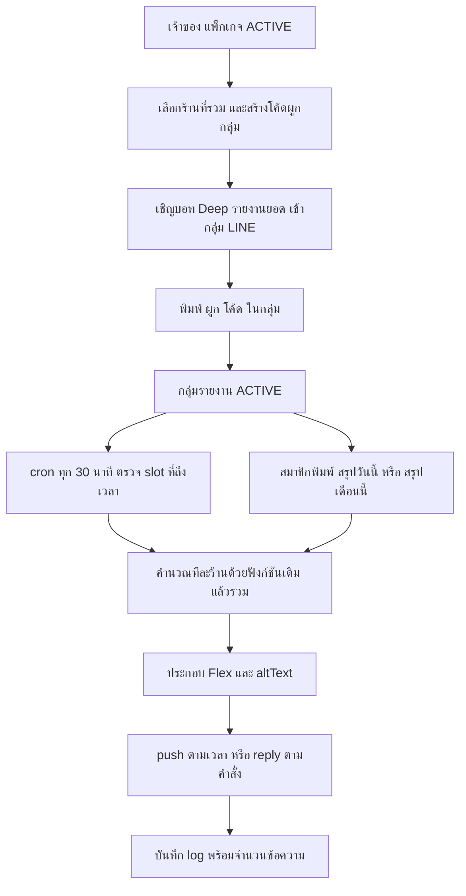

> **โมดูล:** M68-LineGroupSummary (00070)
> **ประเภทเอกสาร:** Product Requirements Document (PRD)
> **เวอร์ชัน:** 1.0
> **วันที่จัดทำ:** 2026-10-05
> **สถานะ:** Approved 2026-10-05 — user อนุมัติ PRD+BRD และค่าที่เสนอใน §11 ทั้งหมด ("ลุยเลย") · ข้อเท็จจริง LINE API ที่ยืนยันแล้วอยู่ใน [[LINE-API-Facts]]
> **เจ้าของเอกสาร:** BA + PO + PM (ดู [[Feature-Docs-Ownership]])

# PRD: รายงานสรุปยอดเข้ากลุ่ม LINE (LINE Group Summary Report)

> 🛑 **แก้ 2026-10-05 (security H-1):** โค้ดผูกเปลี่ยนจากเลข 6 หลัก (10⁶) เป็น **8 ตัว Crockford base32** (`XXXX-XXXX`, ~1.1×10¹²) เพราะเพดานเดา 5 ครั้ง/10 นาทีนับต่อกลุ่ม — คนร้ายเปิดหลายกลุ่มเดาขนานได้ (200 กลุ่ม × 50 โค้ดสด ≈ 5%/10 นาที) · parser รับตัวพิมพ์เล็ก/ไม่มีขีด และแปลง O→0, I/L→1 · ตัวเลข 10⁶/1,000,000 ในเหตุผลเดิมของเอกสารนี้คือค่าก่อนแก้

---

## Executive Summary

เจ้าของร้านจำนวนมากคุยงานกับหุ้นส่วน ผู้จัดการสาขา หรือทีมบัญชีใน **กลุ่ม LINE** อยู่แล้ว แต่ตัวเลขยอดขายอยู่ใน Deep ซึ่งคนในกลุ่มส่วนใหญ่ไม่ได้ล็อกอิน เจ้าของจึงต้องเปิด dashboard แคปหน้าจอแล้วส่งเข้ากลุ่มเองทุกวัน

ฟีเจอร์นี้ให้เจ้าของที่มี **Business Package สถานะ ACTIVE** (tier ใดก็ได้) ผูก **LINE OA กลางของ Deep ชื่อ "Deep รายงานยอด"** เข้ากับกลุ่ม LINE ของตัวเอง แล้วให้บอทส่ง **สรุปยอดตามเวลาที่ตั้ง** (รายวัน หลายรอบต่อวัน และรายเดือนตามวันตัดรอบ) พร้อมตอบคำสั่ง `สรุปวันนี้` / `สรุปเดือนนี้` ที่ใครในกลุ่มก็พิมพ์ได้ ข้อความเป็น Flex ภาษาไทย มีจำนวนออเดอร์ ยอดขาย ยกเลิก สินค้าขายดี 3 อันดับ และลิงก์เปิด Deep (กำไรปิดไว้ก่อน เปิดได้ต่อกลุ่ม)

หนึ่งกลุ่มเลือกได้ว่ารวมร้านไหนบ้าง — ร้านเดียว (กลุ่มสาขา) หรือหลายร้าน (กลุ่มหุ้นส่วน) โดยข้อความเดียวมียอดรวมด้านบนและรายร้านด้านล่าง ร้านที่ใส่ได้เฉพาะร้านที่เจ้าของเป็น `Shop.userId` เท่านั้น

**ฟีเจอร์นี้ไม่ใช่บอทเดียวกับ 00064** — 00064 คือ OA กลางสำหรับ "คนทั่วไปเช็คความน่าเชื่อถือร้านก่อนโอนเงิน" (ตอบเฉพาะ reply, ไม่ต้องมีบัญชี) ส่วน 00070 คือ OA คนละตัวสำหรับ "เจ้าของส่งยอดของตัวเองเข้ากลุ่มของตัวเอง" (ใช้ push ซึ่งมีต้นทุน, ต้องมีแพ็กเกจ) ทั้งสองไม่ใช้ credential, webhook, หรือโควตาร่วมกัน และไม่แตะ LINE OA รายร้าน (00025/00045)

**จุดที่ต้องระวังที่สุดไม่ใช่เทคนิค แต่คือตัวเลขสองชุดที่นิยามต่างกัน** — "ยอดขาย" ที่ dashboard ใช้ (`revenueOrderWhere`) กับ "สินค้าขายดี" (นับทุกใบที่ไม่ยกเลิก) คนละเกณฑ์กัน และยังไม่มีโค้ดใดในระบบที่รวมตัวเลขข้ามร้านต่าง vertical ฟีเจอร์นี้จึงถูกออกแบบให้ใช้ฟังก์ชันเดิมทีละร้านด้วย vertical ของร้านนั้นแล้วค่อยรวม, บวกเฉพาะตัวเลขที่ความหมายตรงกัน, และติดป้ายบอกเกณฑ์/ช่วงเวลาทุกครั้งที่ตัวเลขอาจถูกอ่านผิด

---

## 1. Business Goals & KPIs

### 1.1 เป้าหมายทางธุรกิจ

| เป้าหมาย | รายละเอียด |
|----------|-----------|
| **ให้ Business Package มีของที่ "เห็นผลทุกวัน"** | tier ที่ต่างกันที่จำนวนธุรกิจ/ผู้ดูแล ยังไม่มีสิ่งที่เจ้าของเห็นคุณค่าด้วยตัวเองทุกวัน รายงานในกลุ่ม LINE คือสิ่งที่เจ้าของเห็นโดยไม่ต้องเปิดแอป |
| **ตัวเลขของร้านไปอยู่ที่เดียวกับการคุยงาน** | เลิกแคปหน้าจอส่งกลุ่มเอง ลดโอกาสส่งตัวเลขผิดช่วง/ผิดร้าน |
| **ตัวเลขในกลุ่มตรงกับ dashboard ทุกบาท** | นิยามเดียวกับหน้าจอ Deep (HR16) — ถ้าตัวเลขในกลุ่มไม่ตรงกับแอป เจ้าของจะเลิกเชื่อทั้งสองที่ |
| **คุมต้นทุนข้อความของ OA กลาง** | push เข้ากลุ่มมีต้นทุนต่อจำนวนสมาชิก จึงต้องมีเพดาน (กลุ่ม/รอบ/ส่งทดสอบ) และ log จำนวนข้อความเพื่อประเมินต้นทุนจริง |
| **ไม่ทำให้ผู้ไม่จ่ายรู้สึกถูกบังคับ และไม่ทำให้ Apple/Google ตีกลับ** | เห็นหน้าแบบล็อกพร้อมคำอธิบาย; CTA สมัครเป็นไปตามด่านร้านแอป |

### 1.2 ตัวชี้วัดความสำเร็จ (KPIs)

> ตัวเลขเป้าหมายเป็นค่าตั้งต้นเพื่อวางแผน ยังไม่ใช่มติ (ฐานผู้สมัคร Business Package ณ 2026-09-01 มีเพียง 1 แถว — ดู `prisma/schema.prisma:1409` — เป้าจึงใช้สัดส่วน ไม่ใช่จำนวนสัมบูรณ์)

| KPI | คำอธิบาย | เป้าหมาย |
|-----|----------|---------|
| **Adoption** | เจ้าของที่มีแพ็กเกจ ACTIVE และมีกลุ่มสถานะ ACTIVE ≥ 1 กลุ่ม ÷ เจ้าของที่มีแพ็กเกจ ACTIVE ทั้งหมด | ≥ 40% ใน 60 วัน |
| **การส่งตรงเวลา** | ส่งสำเร็จภายใน 5 นาทีหลังเวลา slot ÷ slot ที่ถึงกำหนดและไม่ถูกข้ามด้วยเหตุผลที่ตั้งใจ | ≥ 95% |
| **อัตราส่งสำเร็จสุดท้าย** | slot ที่จบสถานะ "ส่งแล้ว" ÷ slot ที่พยายามส่ง (รวม retry) | ≥ 99% |
| **ส่งซ้ำ** | จำนวน (กลุ่ม, slot) ที่มี log "ส่งสำเร็จ" มากกว่า 1 แถว | **ต้องเป็น 0 เสมอ** (ตรวจด้วยเทส/ query ไม่ใช่ analytics) |
| **ตัวเลขในกลุ่มไม่ตรง dashboard** | ผลต่างยอดขายของช่วงเดียวกัน ระหว่างข้อความกับ `getSalesSeries` | **ต้องเป็น 0 เสมอ** (เทส parity) |
| **ต้นทุนข้อความ** | ข้อความ push เฉลี่ยต่อกลุ่มต่อวัน (จาก log) | ใช้เป็น baseline หลังเปิด — ยังไม่มีเป้า |
| **Conversion จากหน้าล็อก** | กด CTA บนหน้าล็อก ÷ เปิดหน้าล็อก (เฉพาะ surface ที่มี CTA) | baseline หลังเปิด |

---

## 2. User Personas (กลุ่มผู้ใช้งาน)

### 2.1 เจ้าของร้านที่มี Business Package (ผู้ตั้งค่า)

**ข้อมูลพื้นฐาน:**
- ผู้ใช้ที่เป็น `Shop.userId` ของร้านอย่างน้อยหนึ่งร้าน (รวมร้าน Personal) และมี `BusinessPackageSubscription.status = ACTIVE` (GROWTH / PRO / BUSINESS)
- คุยงานในกลุ่ม LINE กับหุ้นส่วน/ผู้จัดการสาขา/ทีมบัญชี

**เป้าหมาย:**
- ให้คนในกลุ่มเห็นยอดตรงเวลาโดยไม่ต้องส่งเอง

**ความต้องการ:**
- ตั้งครั้งเดียว เลือกร้านที่รวม เวลา และตัวเลขที่ให้เห็น
- ควบคุมได้ว่ากำไรจะไม่ถูกเปิดเผยในกลุ่มโดยไม่ตั้งใจ
- รู้ทันทีเมื่อรายงานส่งไม่ได้ (บอทถูกเตะ/ส่งล้มเหลว)

**จุดปวด (Pain Points):**
- แคปหน้าจอ dashboard ส่งกลุ่มทุกวัน ลืมบ้าง ส่งผิดช่วงบ้าง
- หุ้นส่วนอยากเห็นยอดรวมหลายร้านแต่ Deep ไม่มีหน้ารวมข้ามร้าน

### 2.2 สมาชิกในกลุ่ม LINE (หุ้นส่วน/ผู้จัดการ/ทีมบัญชี)

**ข้อมูลพื้นฐาน:**
- อาจไม่มีบัญชี Deep และไม่ใช่สมาชิกร้านใด ๆ — เห็นข้อมูลเพราะเจ้าของเลือกส่งเข้ากลุ่ม

**เป้าหมาย:**
- ถามยอดตอนนี้ได้เองโดยไม่ต้องทักเจ้าของ

**ความต้องการ:**
- พิมพ์ `สรุปวันนี้` / `สรุปเดือนนี้` แล้วได้คำตอบทันทีในกลุ่ม
- ตัวเลขที่บอกช่วงเวลาและเกณฑ์ชัด ไม่ต้องถามว่า "นับถึงเมื่อไหร่"

**จุดปวด (Pain Points):**
- ตัวเลขที่เจ้าของแคปมาไม่บอกว่าเป็นช่วงไหน ตัวเลขสองวันต่างเวลาเทียบกันไม่ได้

### 2.3 เจ้าของที่ยังไม่มี Business Package (ผู้เห็นหน้าล็อก)

**ข้อมูลพื้นฐาน:**
- เป็นเจ้าของร้านแต่ไม่มี subscription หรือสถานะไม่ใช่ ACTIVE

**เป้าหมาย:**
- เข้าใจว่าฟีเจอร์นี้คืออะไรและทำไมใช้ไม่ได้ในตอนนี้

**ความต้องการ:**
- คำอธิบายที่บอกว่าจะได้อะไร (ไม่ใช่หน้าว่าง/404) และทางสมัครเมื่อแพลตฟอร์มอนุญาต

**จุดปวด (Pain Points):**
- บนแอป iOS/Android กฎ App Store/Play ห้ามนำทางไปจ่ายเงินนอกร้านแอป — หน้าล็อกที่ใส่ปุ่มสมัครผิดทางทำให้แอปถูกตีกลับ

### 2.4 แอดมินร้าน (ShopMember role = ADMIN)

**ข้อมูลพื้นฐาน:**
- ได้สิทธิ์เข้าร้านที่คนอื่นเป็นเจ้าของ

**ความต้องการ / ข้อกำหนด:**
- **ไม่เห็นฟีเจอร์นี้เลย** (ไม่มีเมนู, URL ตรงถูก redirect) — การส่งตัวเลขการเงินของร้านเข้ากลุ่มภายนอกเป็นการตัดสินใจของเจ้าของเท่านั้น และผูกกับแพ็กเกจของเจ้าของ

### 2.5 ทีมปฏิบัติการ Deep (Ops)

**ข้อมูลพื้นฐาน:**
- ดูแล OA "Deep รายงานยอด" (แผน LINE, token, ต้นทุนข้อความ)

**ความต้องการ:**
- เห็นจำนวนข้อความที่ใช้จริงต่อกลุ่มเพื่อประเมินต้นทุนและเลือกแผน OA
- เพดานกันกลุ่ม/รอบ/ส่งทดสอบถูกบังคับที่ server ไม่ใช่แค่ซ่อนปุ่ม

---

## 3. Business Requirements

### 3.1 ใครใช้ได้: เจ้าของ + แพ็กเกจ ACTIVE เท่านั้น

**ความต้องการ:**
- ผู้ตั้งค่าได้เฉพาะเจ้าของที่มี Business Package `ACTIVE` (ทุก tier นับเท่ากัน)
- ผู้ที่เป็นเจ้าของแต่ไม่มีแพ็กเกจ ACTIVE เห็นหน้าแบบล็อกพร้อมคำอธิบาย ไม่ใช่หน้าว่าง
- ShopMember ADMIN ไม่เห็นฟีเจอร์นี้ทุก surface

**Business Rules:**
- การตัดสิน "จ่ายแล้ว" ใช้แนวเดียวกับ `isOwnerPaidPlan` — เฉพาะ `status === 'ACTIVE'` เท่านั้น `LOCKED_RENEWAL_FAILED` และไม่มีแถวเลยถือว่าไม่จ่าย และ **fail-closed**: อ่านสถานะไม่ได้ = ไม่จ่าย
- ตัวตัดสินต้องถามเจ้าของ (`ownerId`) ไม่ใช่ร้านที่ active — ฟีเจอร์นี้เป็นของเจ้าของ ไม่ใช่ของร้านใดร้านหนึ่ง
- CTA บนหน้าล็อกตามด่าน App Store: เว็บ → ไปหน้าแพ็กเกจ; iOS (`shouldOfferIap()`) → ลิงก์ไปหน้าซื้อ IAP; Android (`shouldHidePayments()` แต่ไม่มี IAP) → **ซ่อน CTA ทั้งหมดและไม่มีคำเชิญ/ราคา/ชื่อแพ็กเกจที่มีราคา**
- เพิ่มบรรทัดฟีเจอร์นี้ใน `featuresForTier()` ทุก tier เพื่อให้จอขายแพ็กเกจทั้งเว็บและแอปบอกได้ว่าจ่ายแล้วได้อะไร (สอดคล้อง Guideline 3.1.2(c) ที่ Apple เคยตีกลับ)

**เหตุผล:**
- Business Package ผูกที่เจ้าของ (`ownerId @unique`) การให้ ADMIN ตั้งค่าได้เท่ากับให้คนที่ไม่ใช่เจ้าของเงินตัดสินใจส่งตัวเลขการเงินออกนอกระบบ
- ฟีเจอร์ที่ "จ่ายแล้วปลดล็อก" ไม่ผ่านด่าน `isPaidFeatureRestricted` เพราะ Business Package ขายเป็น IAP แล้ว (ตามคอมเมนต์ใน `src/lib/app-shell-server.ts:51`)

### 3.2 OA กลางใหม่ "Deep รายงานยอด" แยกจาก 00064 และ 00025

**ความต้องการ:**
- เปิด LINE OA ใหม่ของแพลตฟอร์มสำหรับงานนี้โดยเฉพาะ ใช้ชื่อแบรนด์ "Deep"
- webhook เป็น route ใหม่ ไม่แตะ webhook ของร้าน

**Business Rules:**
- credential (channel secret / access token) แยกจาก 00064 และจาก `ShopChannel` ของ 00025 โดยสิ้นเชิง
- ใช้ env ใหม่ — ห้ามใช้ `LINE_CHANNEL_ID` / `LINE_CHANNEL_SECRET` ซึ่งถูกใช้เป็น LINE Login ของระบบล็อกอินอยู่แล้ว (`src/lib/auth.ts:339-340`)
- Deep เลือกแผน LINE OA ของบอทกลางเอง (ข้อสมมติที่ user รับทราบ)

**เหตุผล:**
- webhook ร้านตัด event จากกลุ่มทิ้งโดยเจตนา (`src/app/api/channels/line/webhook/route.ts:159`, เทส TC-26) การขยาย route นั้นให้รับกลุ่มจะเสี่ยงต่อบอทแชทรายร้านที่ใช้งานจริงอยู่
- OA ต่างตัวมีโควตาข้อความต่างตัว — ต้นทุน push ของงานนี้ต้องไม่ไปกินโควตา 00064 (ซึ่งตั้งใจให้ reply-only ต้นทุนศูนย์)

### 3.3 ผูกกลุ่มด้วยโค้ดชั่วคราว

**ความต้องการ:**
- เจ้าของเลือกร้านที่จะรวมแล้วกด "สร้างโค้ดผูกกลุ่ม" ในหน้าตั้งค่า → ได้โค้ด 8 ตัว (ตัวอย่าง `K7M2-XQ4P`) → เชิญบอทเข้ากลุ่ม → พิมพ์ `ผูก K7M2-XQ4P` ในกลุ่ม → บอทตอบยืนยันพร้อมชื่อกลุ่มและชื่อร้านที่ผูก

**Business Rules:**
- โค้ดอายุ 10 นาที ใช้ได้ครั้งเดียว เจ้าของมีโค้ดที่ใช้ได้อยู่ได้ครั้งละ 1 โค้ด (สร้างใหม่ = ของเก่าใช้ไม่ได้) เก็บแบบ hash at rest
- ผู้พิมพ์ `ผูก <โค้ด>` ไม่จำเป็นต้องเป็นเจ้าของ — การครอบครองโค้ดคือหลักฐานสิทธิ์ (โค้ดถูกสร้างจากบัญชีเจ้าของเท่านั้น)
- กลุ่ม LINE หนึ่งกลุ่มผูกสถานะใช้งานได้กับเจ้าของได้รายเดียว; เจ้าของมีกลุ่มได้ ≤ 10 กลุ่ม
- ผู้ไม่ใช่เจ้าของ "ผูกกลุ่มของตัวเองเข้ากับร้านเรา" ไม่ได้ เพราะไม่มีโค้ดที่ออกจากบัญชีเรา
- บอทถูกเตะ (`leave`) → กลุ่มเป็น inactive ทันที + แจ้งเจ้าของในแอป

**เหตุผล:**
- ถ้ากลุ่มเป็นฝั่งที่ "ขอผูกเข้าหาร้าน" ใครก็ใส่ชื่อร้านคนอื่นแล้วดูยอดได้ การให้เจ้าของเป็นฝั่งออกโค้ดกลับทิศความเสี่ยงนี้
- โค้ด 8 ตัวมีพื้นที่เดาเพียง 1,000,000 ค่า จึงต้องมีทั้งอายุสั้น ใช้ครั้งเดียว และเพดานการเดาผิด (ดู §4.1 BR-LGS-03)

### 3.4 โมเดล "กลุ่ม" ถือการตั้งค่า และเลือกร้านที่รวม

**ความต้องการ:**
- การตั้งค่าอยู่ที่ระดับกลุ่ม (report group) แต่ละกลุ่มเลือกร้านที่รวม: 1 ร้าน = กลุ่มสาขา, หลายร้าน = กลุ่มหุ้นส่วน/บัญชี
- ร้านหนึ่งอยู่ได้หลายกลุ่ม
- ข้อความหลายร้านเป็นข้อความเดียว: ยอดรวมด้านบน รายร้านด้านล่าง

**Business Rules:**
- ร้านที่ใส่ได้ = `Shop.userId` เท่ากับเจ้าของเท่านั้น (รวม `Shop.kind = PERSONAL`) และ `deletedAt`/`purgedAt` เป็น null — กรองตั้งแต่ query แรก ห้ามใช้ `listAccessibleShopIds` ตรง ๆ เพราะมันรวมร้านที่เป็นแค่ ADMIN (`src/lib/shop-context.ts:43-56`)
- เพดานต่อเจ้าของ: ≤ 10 กลุ่ม; เพดานต่อกลุ่ม: ≤ 4 รอบ/วัน, ส่งทดสอบ ≤ 5 ครั้ง/วัน
- เพดานจำนวนร้านต่อกลุ่ม ≤ 10 (user ไม่ได้ระบุ — เสนอเพื่อคุมขนาดข้อความ ดู OQ-4)

**เหตุผล:**
- การเลือกร้านจากรายการที่ "เข้าถึงได้" โดยไม่กรองเจ้าของ จะพาร้านของคนอื่นที่เราเป็น ADMIN เข้ามาในรายงานที่ส่งออกนอกระบบ
- ผู้ถือเงินต้องเป็นผู้ตัดสินใจเรื่องที่ตัวเลขร้านจะไปอยู่ที่ไหนเสมอ

### 3.5 ตัวเลขในรายงานต้องตรงกับหน้าจอ Deep (HR16)

**ความต้องการ:**
- ตัวเลขรอบแรก: จำนวนออเดอร์, ยอดขาย, ยกเลิก, สินค้าขายดี 3 อันดับ, ลิงก์เปิด dashboard; กำไรปิดเป็นค่าตั้งต้น เปิดได้ต่อกลุ่ม

**Business Rules:**
- ใช้นิยามเดิมเท่านั้น: `getSalesSeries` (จำนวนออเดอร์ ยอดขาย) · `getPnlReport` (กำไร) · `revenueOrderWhere`/`countsAsRevenue` (เกณฑ์ "นับเป็นยอดขายแล้ว") · `usesServiceFinanceRules(vertical)` (ร้าน SERVICE_QUEUE ใช้กติกา 00067)
- คำนวณ **ทีละร้านด้วย vertical ของร้านนั้น** แล้วค่อยรวม; บวกเฉพาะตัวเลขที่ความหมายตรงกันทุก vertical; ตัวเลขเฉพาะ vertical แสดงรายร้าน (รายละเอียด §4.1 BR-LGS-07)
- ยอดขายที่เป็นหัวข้อหลัก = ยอดที่ **นับเป็นยอดขายแล้ว** (`confirmedValues`) โดยแสดงบรรทัดรอง "ยังไม่นับเป็นยอดขาย (รอยืนยัน/รอขนส่งรับ)" เพื่อให้รวมกันได้เท่าตัวเลขทุกใบที่ยังไม่ยกเลิก (`values`) — ดู OQ-1
- "ยกเลิก" = จำนวนออเดอร์ `status = CANCELLED` ที่ **เปิดบิลในช่วงนั้น** (แกนเวลา `createdAt` เหมือนตัวเลขอื่นทั้งหมด) ไม่ใช่ "ถูกยกเลิกในช่วงนั้น" — ต้องเขียนกำกับในข้อความ
- "สินค้าขายดี 3 อันดับ" ใช้เกณฑ์ของ 00063 (นับทุกใบที่ไม่ยกเลิก ไม่ใช่ `revenueOrderWhere`) และต้องบอกเกณฑ์นี้ในข้อความเพราะต่างจากยอดขายที่แสดงอยู่ข้างบน

**เหตุผล:**
- `getSalesSeries` รับได้แค่ "เดือน" หรือ "ปี" (`src/services/dashboard.service.ts:215-225`) และ `getProductSalesMonth` รับแค่เดือน (`src/services/product-sales-series.service.ts:96`) ส่วน `getBestSellerProducts` เป็นตลอดชีพ (`src/services/product.service.ts:486`) — ไม่มีฟังก์ชันใดตอบ "ช่วงวันที่ใดก็ได้" ตรง ๆ รอบวันตัดรอบที่คร่อมเดือนจึงต้องเรียกสองเดือนแล้วรวมเฉพาะวันในช่วง **ห้ามเขียนนิยามใหม่ขนานกับของเดิม**
- ตัวเลขยกเลิกสำหรับ vertical อื่นนอกจากร้านบริการยังไม่มีใน SSOT (`jobStatusCounts.cancelled` มีเฉพาะ SERVICE_QUEUE ที่ `dashboard.service.ts:548-561`) จึงต้องมีฟังก์ชันนับใหม่ 1 ตัว ที่มีนิยามตรงกับตัวเดิมและมีเทส parity

### 3.6 ตารางเวลาและรอบรายเดือน

**ความต้องการ:**
- เวลาเลือกทีละ 30 นาที ตั้งได้หลายเวลา (สูงสุด 4 รอบ/วัน/กลุ่ม) เวลา Asia/Bangkok เสมอ
- รายงานรายวัน = ยอดสะสมตั้งแต่ 00:00 ถึงเวลาที่คำนวณ; รอบ **24:00** = สรุปทั้งวันที่เพิ่งจบ (ส่ง 00:00 ของวันถัดไป)
- รายงานรายเดือน = ตามวันตัดรอบที่กลุ่มเลือก (ค่าตั้งต้น = สิ้นเดือน); เดือนที่ไม่มีวันนั้น (29–31) ใช้วันสุดท้ายของเดือน
- ตัวอย่างวันตัดรอบ 5: รอบ = 6 เดือนก่อน 00:00 ถึง 5 เดือนนี้ 23:59 ส่งวันที่ 6 ในเวลาแรกของวันที่กลุ่มตั้งไว้
- ตัวเลือก "แนบยอดสะสมรอบนี้ในรายงานรายวัน" และคำสั่ง `สรุปเดือนนี้` ใช้รอบของกลุ่ม; ป้ายระบุช่วงวันที่เสมอ (เช่น "6 ต.ค. – 20 ต.ค.")
- ตัวเลือก "ไม่ส่งถ้าไม่มีออเดอร์": ข้ามเฉพาะเมื่อทุกร้านในกลุ่มเป็น 0

**Business Rules:**
- ต้องใช้ helper เวลากลางเท่านั้น (`src/lib/date-range.ts`: `TZ_OFFSET_MS`, `thaiMidnightUtc`, `todayThaiIsoDate`, `thaiTodayBounds`; `src/lib/format-date.ts` สำหรับวันที่แสดงผล) ห้ามคำนวณ offset เอง
- ตัวเลขทุกชุดมีป้าย "ข้อมูล ณ HH:MM น." ที่เป็นเวลาที่ **คำนวณจริง** ไม่ใช่เวลา slot (เพราะ cron ไม่ตรงเสี้ยววินาทีและรอบ retry ส่งช้ากว่า slot) — ดู BR-LGS-08

**เหตุผล:**
- ผู้เกี่ยวข้องที่อ่านข้อความในกลุ่มไม่มีทางรู้ว่า "ยอดวันนี้" นับถึงเมื่อไหร่ ถ้าป้ายไม่บอก ตัวเลขสองข้อความจึงเทียบกันไม่ได้ (partial-data-must-be-labeled-or-filled)

### 3.7 ตั้งค่าต่อกลุ่ม คำสั่งในกลุ่ม และส่งทดสอบ

**ความต้องการ:**
- ตั้งต่อกลุ่ม: เปิด/ปิดรายวันและรายเดือนแยกกัน · เวลาหลายเวลา · ตัวเลขที่แสดง · ไม่ส่งถ้าไม่มีออเดอร์ · แนบยอดสะสมรอบ · ปุ่มส่งทดสอบ
- ใครในกลุ่มก็พิมพ์ `สรุปวันนี้` / `สรุปเดือนนี้` ได้ ตอบด้วย reply token (ไม่กินโควตา push) และแสดงตัวเลขชุดเดียวกับที่ตั้งให้กลุ่มนั้น (ถ้าซ่อนกำไร คำสั่งก็ไม่โชว์กำไร)
- ภาษาไทยอย่างเดียว

**Business Rules:**
- ข้อความอื่นในกลุ่มที่ไม่ใช่คำสั่ง บอทต้องเงียบ (ไม่ตอบ ไม่แสดงตัวว่าอ่านแชท)
- ปุ่มส่งทดสอบกินโควตา push จริง จึงมีเพดาน ≤ 5 ครั้ง/วัน/กลุ่ม
- ข้อความเป็น Flex + `altText` ที่มียอดสรุปในตัว (ผู้ที่ปิดการแสดง Flex หรือดูจากการแจ้งเตือนเห็นยอดได้)

**เหตุผล:**
- ผู้ใช้จริงในกลุ่มไม่ใช่เจ้าของ จึงต้องพิมพ์ถามได้เอง แต่ถ้าคำสั่งโชว์กำไรทั้งที่เจ้าของปิดไว้ = ช่องโหว่ที่เจ้าของไม่มีทางรู้

### 3.8 ความทนทาน: การหยุดเมื่อแพ็กเกจหมดหรือร้านถูกล็อก

**ความต้องการ:**
- log ทุกครั้งที่ส่ง: เวลา, สำเร็จ/ไม่, สาเหตุ, **จำนวนข้อความที่ใช้** (เพื่อประเมินต้นทุน OA) แสดง 10 รายการล่าสุดต่อกลุ่ม
- กันส่งซ้ำด้วย idempotency key (กลุ่ม + slot); ล้มเหลวให้ retry 1 ครั้งในรอบ cron ถัดไป แล้วแจ้งเจ้าของ
- ร้านที่ถูกล็อก (`Shop.packageLockedAt`) ถูกตัดออกจากรายงานพร้อมหมายเหตุในข้อความ
- แพ็กเกจของเจ้าของสถานะ `LOCKED_RENEWAL_FAILED` → หยุดทุกกลุ่ม + บอทส่งข้อความสุดท้าย 1 ครั้ง (เก็บการตั้งค่าไว้)

**Business Rules:**
- สถานะแพ็กเกจต้องอ่านจากเจ้าของ (`getSubscriptionStatus(ownerId)`) **ทุกครั้งที่จะส่ง** ไม่เก็บเป็นธงในแถวกลุ่ม (stored-flag-vs-owner-truth)
- ข้อความสุดท้ายห้ามมีราคา/ลิงก์ชวนจ่ายเงินนอกร้านแอป
- ไม่มีการส่งย้อนหลัง (backfill) ของ slot ที่ผ่านไปในช่วงที่หยุด

**เหตุผล:**
- ร้านที่ถูกล็อกแล้วยังโชว์ยอดในรายงาน = ข้อมูลเก่าที่ดูเหมือนปัจจุบัน; ร้านที่หายไปเงียบ ๆ = ยอดรวมต่ำกว่าจริงโดยไม่มีใครรู้ (ทั้งสองทิศคือตัวเลขไม่ครบที่ดูเหมือนครบ)

### 3.9 ต้นทุนข้อความและความเป็นส่วนตัว

**ความต้องการ:**
- ต้นทุน push เข้ากลุ่มเป็นของ Deep (ไม่คิดเงินเจ้าของแยกต่อข้อความในรอบแรก) จึงต้องมีเพดานและ log
- บอทไม่เก็บข้อมูลสมาชิกกลุ่ม

**Business Rules:**
- เก็บเฉพาะ `groupId` กับชื่อกลุ่ม (snapshot เพื่อแสดงผล) ไม่เก็บ LINE userId ของสมาชิก ไม่เก็บข้อความอื่นในกลุ่ม
- ตัวเลขที่ส่งเข้ากลุ่มถึงทุกคนในกลุ่มและลบจากฝั่ง Deep ไม่ได้ — ต้องแจ้งเจ้าของก่อนผูก (ข้อเสนอเพิ่ม ดู OQ-3)

**เหตุผล:**
- ข้อมูลการเงินของร้านไปอยู่ในพื้นที่ที่ Deep ควบคุมสิทธิ์ไม่ได้อีกต่อไป เจ้าของต้องตัดสินใจโดยรู้ตัว

---

## 4. Business Rules & Constraints

### 4.1 กฎทางธุรกิจหลัก

| กฎ | คำอธิบาย |
|----|----------|
| **BR-LGS-01 เจ้าของ + ACTIVE เท่านั้น** | ผู้ตั้งค่า = เจ้าของที่ `BusinessPackageSubscription.status = ACTIVE` (ทุก tier) ตัดสิน fail-closed ที่ server ทุกจุดที่เขียน/ส่ง; ADMIN ไม่เห็นฟีเจอร์ |
| **BR-LGS-02 ร้านที่รวมได้ = ร้านที่เจ้าของเป็น `Shop.userId`** | กรองตั้งแต่ query แรก ห้ามใช้ `listAccessibleShopIds` ตรง ๆ |
| **BR-LGS-03 โค้ดผูกกลุ่ม** | 8 ตัว · 10 นาที · ใช้ครั้งเดียว · 1 โค้ดที่ใช้ได้/เจ้าของ · hash at rest · เดาผิดซ้ำถูกจำกัดต่อกลุ่ม (≤ 5 ครั้ง/10 นาที — ข้อเสนอ OQ-4) · ผู้พิมพ์ไม่ต้องเป็นเจ้าของ |
| **BR-LGS-04 กลุ่ม ↔ เจ้าของ** | LINE group หนึ่งผูกสถานะใช้งานได้รายเดียว · เจ้าของมี ≤ 10 กลุ่ม (นับทุกสถานะที่ยังไม่ลบ) บังคับใน transaction |
| **BR-LGS-05 บอทถูกเตะ** | `leave` event → inactive ทันที + แจ้งเจ้าของ; ผูกใหม่ได้ด้วยโค้ดใหม่ ค่าที่ตั้งไว้คงอยู่ |
| **BR-LGS-06 นิยามตัวเลขจาก SSOT เดิม** | ห้ามนิยามยอดขาย/กำไร/อันดับสินค้าใหม่ — ใช้ `getSalesSeries`, `getPnlReport`, `revenueOrderWhere`/`countsAsRevenue`, เกณฑ์ 00063; ของใหม่ได้เฉพาะ "นับยกเลิก" และ "รวมช่วงวันที่จากผลรายเดือน" ซึ่งต้องมีเทส parity กับของเดิม |
| **BR-LGS-07 คำนวณทีละร้าน แล้วรวมอย่างระวัง** | คำนวณด้วย vertical ของร้านนั้น; รวมได้: จำนวนออเดอร์ · ยอดขายที่นับแล้ว · ยังไม่นับ · ยกเลิก; **กำไรรวมได้เฉพาะเมื่อทุกร้านใช้กติกาเดียวกัน** (ทั้งหมดเป็นร้านบริการ หรือทั้งหมดไม่ใช่) ไม่งั้นแสดงรายร้านและไม่มียอดรวมกำไร; Top 3 ไม่รวมข้ามร้าน (ชื่อสินค้าเป็นของร้านนั้น); กลุ่มที่ผสมร้านบริการกับร้านอื่นต้องมีหมายเหตุ "ยอดแต่ละร้านคิดตามกติกาของประเภทธุรกิจ" |
| **BR-LGS-08 ป้ายช่วงเวลา** | ทุกข้อความระบุช่วงวันที่ของตัวเลข และ "ข้อมูล ณ HH:MM น." ที่เป็นเวลาคำนวณจริง |
| **BR-LGS-09 กำไรปิดเป็นค่าตั้งต้น** | เปิดได้ต่อกลุ่ม; เมื่อแสดงแล้วข้อมูลต้นทุน/ค่าใช้จ่ายไม่ครบ ต้องติดป้ายเพดาน (`capped`) ทุก vertical · ถ้อยคำกำไรมาจาก SSOT `profitDisplay()` (`src/lib/format-money.ts`) เท่านั้น (`netProfit` = กำไรสุทธิตามนิยามระบบ) |
| **BR-LGS-10 ตาราง slot** | ก้าว 30 นาที · ≤ 4 เวลา/กลุ่ม · 24:00 = วันที่เพิ่งจบ · Asia/Bangkok · เลือกซ้ำเวลาเดิมไม่ได้ |
| **BR-LGS-11 รอบรายเดือน** | วันตัดรอบ 1–31 หรือ "สิ้นเดือน" (ค่าตั้งต้น); วันที่ไม่มีในเดือนนั้น → วันสุดท้ายของเดือน; ส่งวันถัดจากวันตัดรอบ ในเวลาแรกสุด (ตามลำดับเวลาจริงในวันนั้น) ของเวลาที่กลุ่มตั้ง |
| **BR-LGS-12 ไม่ส่งถ้าไม่มีออเดอร์** | ข้ามเมื่อ **ทุกร้านที่เหลือ** มีออเดอร์ 0 **และ** ยกเลิก 0 (ใช้กับการส่งตามตารางเท่านั้น; คำสั่งในกลุ่มและส่งทดสอบตอบเสมอ) |
| **BR-LGS-13 ไม่ส่งซ้ำ** | idempotency key (กลุ่ม + slot) บังคับที่ฐานข้อมูล; ล้มเหลว retry 1 ครั้งในรอบ cron ถัดไป จากนั้นหยุดและแจ้งเจ้าของ |
| **BR-LGS-14 ร้านที่ไม่พร้อม** | ร้าน `packageLockedAt != null` / `deletedAt != null` / `purgedAt != null` ถูกตัดออกพร้อมหมายเหตุในข้อความ; ไม่เหลือร้านเลย → ไม่ส่ง + แจ้งเจ้าของ |
| **BR-LGS-15 แพ็กเกจหยุด** | เจ้าของไม่ ACTIVE → หยุดทุกกลุ่ม + ข้อความสุดท้าย 1 ครั้งต่อช่วงที่หยุด; เก็บการตั้งค่า; กลับมา ACTIVE → ทำงานต่ออัตโนมัติโดยไม่ส่งย้อนหลัง |
| **BR-LGS-16 คำสั่งในกลุ่มตอบด้วย reply token เท่านั้น** | ไม่ใช้ push; ใช้ชุดตัวเลขเดียวกับที่ตั้งให้กลุ่ม; มีเพดานถามถี่ต่อกลุ่ม (ข้อเสนอ OQ-4) |
| **BR-LGS-17 ส่งทดสอบ** | ≤ 5 ครั้ง/วัน/กลุ่ม (นับครั้งที่ LINE รับ) กินโควตา push จริง |
| **BR-LGS-18 log การส่ง** | ทุกครั้ง: เวลา, ผล, สาเหตุ, จำนวนข้อความ push ที่ใช้ (reply = 0); แสดง 10 ล่าสุดต่อกลุ่ม |
| **BR-LGS-19 ไม่เก็บข้อมูลสมาชิก** | เก็บ `groupId` + ชื่อกลุ่ม เท่านั้น |
| **BR-LGS-20 ด่าน App Store** | CTA หน้าล็อกตาม `shouldOfferIap()` / `shouldHidePayments()`; หน้าฟีเจอร์ไม่เรียก `shouldHidePaidFeatures()`; เช็คเมนูทั้งสองชุด + แถบล่าง + หน้าปลายทาง (skill `app-store-surfaces`) |
| **BR-LGS-21 OA แยกขาด** | credential/webhook/โควตาแยกจาก 00064 และ 00025; env ใหม่ ไม่ใช้ `LINE_CHANNEL_*` |

### 4.2 ข้อจำกัดทางธุรกิจ

| ข้อจำกัด | รายละเอียด |
|---------|-----------|
| **ไม่มีโค้ดรวมข้ามร้านอยู่ก่อน** | ทุกฟังก์ชันตัวเลขรับ `shopId` ทีละร้าน — การรวมเป็นของใหม่ทั้งหมด จึงเป็นจุดเสี่ยงต่อ HR16 ที่ต้องมีเทส |
| **ยอดสะสมคำนวณ ณ ตอนส่ง** | `getSalesSeries` ตัดตามวันเป็นถัง (ไม่ตัดตามชั่วโมง) ข้อความจึงไม่สามารถ "ตัดที่ 18:00 เป๊ะ" ได้ — ตัวเลขนับถึงเวลาที่คำนวณจริง |
| **Top 3 ผูกกับเกณฑ์ 00063** | นับทุกใบที่ไม่ยกเลิก (ต่างจากยอดขายที่นับเฉพาะใบที่ยืนยัน/ขนส่งรับแล้ว) และไม่รวมรายการที่พิมพ์เอง (ไม่มี `productId`) |
| **คืนของ (RETURNED) เป็นเรื่องของกติการ้านบริการ** | ร้านบริการตัดใบ `RETURNED` และหักคืนบางส่วน (00067) ร้านอื่นไม่ตัด — รายงานทำตามกติกาของแต่ละร้าน ไม่ปรับให้เท่ากัน |
| **ผู้ถือ LINE OA คือ Deep** | ข้อความทุกใบออกในนาม OA "Deep รายงานยอด"; เจ้าของแก้ชื่อ/รูป OA ไม่ได้ |
| **ต้นทุน push คิดตามจำนวนสมาชิกกลุ่ม** (ข้อสมมติที่ user รับทราบ) | ตัวอย่างประกอบ ไม่ใช่ราคา: เจ้าของที่ใช้เพดานเต็ม 10 กลุ่ม × 4 รอบ × 30 สมาชิก × 30 วัน = 36,000 ข้อความ/เดือน (ยังไม่รวมรายงานรายเดือนที่แนบในรอบแรกของวัน) |
| **ใช้ได้เฉพาะกลุ่ม LINE (`group`)** | แชทเดี่ยวและห้อง (`room`) ไม่รองรับ |
| **slot ที่เพิ่งเปิด (known limitation)** | slot ที่เพิ่งเปิดภายใน 60 นาทีหลังเวลา slot จะถูกส่งที่ tick ถัดไป (known limitation) |

### 4.3 ความต่างจาก 00064 และ OA รายร้าน (00025/00045)

| หัวข้อ | **00070 Deep รายงานยอด** | 00064 บอทเช็คสถานะร้าน | 00025/00045 LINE OA รายร้าน |
|--------|---------------------------|--------------------------|------------------------------|
| ผู้ใช้หลัก | เจ้าของร้านที่จ่ายแพ็กเกจ + คนในกลุ่มของเขา | ผู้ซื้อทั่วไป (ไม่ต้องมีบัญชี) | ร้านกับลูกค้าของร้าน |
| ช่องทาง | **กลุ่ม** LINE | แชทเดี่ยว | แชทเดี่ยว (event กลุ่มถูกตัดทิ้ง) |
| ทิศทาง | บอท **push ตามเวลา** + ตอบคำสั่ง | ผู้ใช้ถาม บอทตอบ | ลูกค้าทัก ร้านตอบ |
| ต้นทุนข้อความ | push มีต้นทุน → มีเพดาน/log | reply-only ศูนย์บาท | ใช้ SellerWallet ของร้าน |
| ข้อมูลที่เปิดเผย | ตัวเลขการเงินของร้านตัวเอง ให้คนที่เจ้าของเลือก | ข้อมูลสาธารณะของร้านอื่น | บทสนทนาของร้าน |
| การยืนยันสิทธิ์ | โค้ดผูกกลุ่มที่ออกจากบัญชีเจ้าของ + แพ็กเกจ ACTIVE | ไม่ระบุตัวตน | token ที่ร้านกรอกเอง |
| ตัวบอท | OA ใหม่ "Deep รายงานยอด" | OA กลางอีกตัว (ยังไม่มีในโค้ด) | `ShopChannel` ต่อร้าน |
| webhook | route ใหม่ของ 00070 | route ใหม่ของ 00064 | `/api/channels/line/webhook` |

ทั้งสามเรื่องไม่ share credential/webhook/โควตาข้อความ

---

## 5. Out of Scope (นอกขอบเขต)

สิ่งที่ฟีเจอร์นี้ **ไม่รองรับ** หรือ **ไม่รับผิดชอบ**:

| หัวข้อ | ระยะ | คำอธิบาย |
|--------|------|----------|
| **เลือกวันในสัปดาห์** | Phase 2 | รอบแรกส่งทุกวันที่ตั้งเวลาไว้ |
| **รายงานรายสัปดาห์** | Phase 2 | รอบแรกมีเฉพาะรายวัน/รายเดือน |
| **เลือกภาษา** | ไม่ทำรอบแรก | ภาษาไทยอย่างเดียว |
| **ส่งแบบ 1:1** | Phase 2 | ไม่ส่งเข้าแชทเดี่ยวของใคร (ข้อความช่วยเหลือในแชทเดี่ยวเป็น nice-to-have ใน BRD) |
| **กราฟรูปภาพ** | Phase 2 | ข้อความเป็น Flex ตัวหนังสือ/ตัวเลขล้วน |
| **ใช้ OA ของร้านเอง** | Phase 2 | OA รายร้านมีโครง 00025 แยก; ฟีเจอร์นี้ใช้ OA กลางเท่านั้น |
| **คิดเงินแยกต่อข้อความ** | Phase 2 | ต้นทุนเป็นของ Deep ในรอบแรก; เพดานคุมความเสี่ยงแทน |
| **ตัวเลขเฉพาะ vertical** (งานค้างรับ/ไม่มาตามนัดของร้านบริการ ยอดเก็บเงิน) | Phase 2 | รอบแรกมีเฉพาะตัวเลขที่รวมข้าม vertical ได้ |
| **ห้อง LINE (`room`) และแชทเดี่ยว** | ไม่ทำ | รองรับเฉพาะ `group` |
| **ส่งตัวเลขการเงินให้คนในกลุ่มเลือกเองว่าจะเห็นหรือไม่** | ไม่ทำ | ทุกคนในกลุ่มเห็นเท่ากัน — ควบคุมได้ที่ระดับกลุ่มเท่านั้น |
| **ลบข้อความที่ส่งไปแล้ว** | ไม่ทำ | LINE ไม่ให้บอทลบข้อความย้อนหลังในกลุ่ม |
| **ส่งย้อนหลัง (backfill) slot ที่พลาด** | ไม่ทำ | ตามกฎ BR-LGS-15 และ BR-LGS-13 |
| **รายงานของร้านที่เจ้าของเป็นแค่ ADMIN** | ไม่ทำ | ตามกฎ BR-LGS-02 |
| **การแจ้งเตือนเจ้าของนอกหน้าตั้งค่า** (push/อีเมล/LINE ส่วนตัว) | รอ OQ-2 | ยังไม่พบช่องแจ้งเตือนฝั่งผู้ขายที่ใช้ได้ |
| **ทำให้ OA 00064 ตอบคำสั่งสรุปยอด** | ไม่ทำ | คนละ OA คนละกลุ่มเป้าหมาย |

---

## 6. Risks & Mitigation (ความเสี่ยงและแนวทางแก้ไข)

### 6.1 ความเสี่ยงทางธุรกิจ

| ความเสี่ยง | ผลกระทบ | ระดับความรุนแรง | แนวทางแก้ไข |
|-----------|---------|-----------------|-------------|
| **ตัวเลขในกลุ่มไม่ตรงกับ dashboard** | เจ้าของเลิกเชื่อทั้งสองที่ ฟีเจอร์ตาย | **สูง** | ใช้ SSOT เดิม + เทส parity กับ `getSalesSeries`/`getPnlReport` + ป้ายเกณฑ์/ช่วงเวลา |
| **กำไรหลุดเข้ากลุ่มโดยไม่ตั้งใจ** | ข้อมูลที่ละเอียดอ่อนที่สุดถึงคนที่ไม่ควรเห็น และลบไม่ได้ | สูง | ปิดเป็นค่าตั้งต้น; คำสั่งในกลุ่มเคารพค่าเดียวกัน; ข้อเสนอให้เจ้าของยอมรับประกาศก่อนผูก (OQ-3) |
| **คนนอกผูกกลุ่มเข้าร้านเรา/เดาโค้ด** | เห็นยอดร้านผู้อื่น | สูง | เจ้าของเป็นฝั่งออกโค้ด + อายุสั้น + ใช้ครั้งเดียว + hash + จำกัดการเดาผิดต่อกลุ่ม |
| **ต้นทุน push บานปลาย** | Deep แบกค่า OA | กลาง | เพดานกลุ่ม/รอบ/ส่งทดสอบ + log จำนวนข้อความ + ตัวอย่างคำนวณใน §4.2 |
| **รวมตัวเลขข้ามร้านต่าง vertical ผิดความหมาย** | ยอดรวมที่หน้าตาครบแต่ผสมกติกา | สูง | BR-LGS-07: รวมเฉพาะที่ความหมายตรงกัน; กำไรไม่รวมข้ามกติกา; หมายเหตุในข้อความ |
| **ตัวเลขร้านที่ถูกล็อกหายเงียบ** | ยอดรวมต่ำกว่าจริง | กลาง | ตัดออกพร้อมหมายเหตุชื่อร้านในข้อความ (BR-LGS-14) |
| **แอปถูก Apple/Google ตีกลับจากหน้าล็อก** | ปล่อยแอปไม่ได้ | สูง | CTA ตามด่าน; ไล่ครบ 6 surface ตาม skill; หน้าปลายทางมีด่านของตัวเอง |
| **เจ้าของ iOS เข้าฟีเจอร์ไม่ถึง** | จ่ายแล้วใช้ไม่ได้ | สูง | หน้า `/business` เด้งออกในแอป (`business/page.tsx:65`) — ทางเข้าฟีเจอร์ต้องไม่ผ่านหน้านั้น และเดินถึงได้จริงบนมือถือ |

### 6.2 ความเสี่ยงทางเทคนิค

| ความเสี่ยง | ผลกระทบ | แนวทางแก้ไข |
|-----------|---------|-------------|
| **cron ซ้อนกัน/รันซ้ำ → ส่งซ้ำ** | กลุ่มได้ข้อความซ้ำ เสียโควตา | idempotency key `(groupId, slotKey)` unique ที่ DB; claim ก่อนส่งด้วย insert ที่ไม่ throw เมื่อซ้ำ (`createMany skipDuplicates`/`ON CONFLICT DO NOTHING` ไม่ใช่ปล่อยให้ชนแล้วดัก — convention `insert-then-catch-logs-every-error`) |
| **ส่ง LINE สำเร็จแต่เขียน log ล้ม** | slot ถูกส่งซ้ำรอบ retry | บันทึกสถานะ "กำลังส่ง" ก่อนเรียก LINE; ใช้ `X-Line-Retry-Key` ที่ `src/lib/line/client.ts` รองรับอยู่แล้ว เพื่อให้ LINE กันส่งซ้ำ |
| **sweep ไม่ทันภายใน `maxDuration`** | slot บางส่วนไม่ถูกส่ง | หน้าต่าง slot ครอบ 2 รอบ cron (retry ได้ 1 ครั้ง); cache ผลต่อ (ร้าน, ช่วง) ภายในรอบเดียวกัน; ดู BRD §6.2 |
| **Flex เกินขนาด/altText เกินความยาวที่ LINE รับ** | ส่งไม่สำเร็จทั้งก้อน | ลำดับตัดทอน: ตัด Top 3 → ย่อรายร้าน → ย่อ altText; ตรวจก่อนส่ง (ตัวเลขข้อจำกัดยืนยันกับของจริงตอนทำ SRS) |
| **ชื่อ env/route ชนของเดิม** | login LINE พัง / webhook 403 | env ใหม่ `LINE_REPORT_BOT_*`; เพิ่มเส้นทาง webhook ใหม่ใน CSRF exemption ของ `src/proxy.ts` (เปรียบเทียบ pathname ตรงตัว บรรทัด 53-55) |
| **นิยาม "สินค้าขายดี" ต่างจากยอดขาย** | อ่านแล้วขัดกัน | เขียนเกณฑ์กำกับในข้อความ ("นับทุกใบที่ไม่ยกเลิก") |
| **สถานะแพ็กเกจเปลี่ยนระหว่าง sweep** | ส่งหลังหมดอายุ 1 รอบ | อ่านสถานะ ณ จุดส่งต่อกลุ่ม ไม่ cache ข้ามกลุ่ม |

---

## 7. Glossary (อภิธานศัพท์)

| คำศัพท์ | ความหมาย |
|---------|----------|
| **Deep รายงานยอด** | ชื่อ OA กลางของ 00070 (คนละตัวกับ OA ของ 00064) |
| **กลุ่มรายงาน (report group)** | หนึ่งกลุ่ม LINE ที่ผูกกับเจ้าของหนึ่งราย พร้อมการตั้งค่า ร้านที่รวม และตารางเวลา |
| **เจ้าของ** | ผู้ใช้ที่เป็น `Shop.userId` ของร้านที่เลือก และเป็นเจ้าของ Business Package |
| **โค้ดผูกกลุ่ม** | โค้ด 8 ตัวที่เจ้าของสร้างในแอป ใช้พิมพ์ `ผูก <โค้ด>` ในกลุ่ม |
| **slot** | เวลาที่กำหนดส่ง (ก้าว 30 นาที) ของกลุ่มหนึ่งในวันหนึ่ง |
| **รอบ 24:00** | slot ที่ส่ง 00:00 ของวันถัดไป และสรุปทั้งวันที่เพิ่งจบ |
| **วันตัดรอบ** | วันที่ปิดรอบรายเดือนของกลุ่ม (ค่าตั้งต้น = สิ้นเดือน) |
| **ยอดสะสมรอบ** | ยอดตั้งแต่ต้นรอบรายเดือนปัจจุบันถึงเวลาที่คำนวณ |
| **ยอดขายที่นับแล้ว** | ยอดจากออเดอร์ที่เข้าเกณฑ์ `revenueOrderWhere` / `countsAsRevenue` |
| **ยังไม่นับเป็นยอดขาย** | ยอดจากออเดอร์ที่ไม่ยกเลิกแต่ยังไม่เข้าเกณฑ์ข้างบน (รอยืนยัน/รอขนส่งรับ) |
| **ยกเลิก** | จำนวนออเดอร์ `status = CANCELLED` ที่ **เปิดบิลในช่วงนั้น** |
| **reply token** | โทเคนฟรีที่ LINE ให้พร้อม event ใช้ตอบกลับได้ครั้งเดียวในเวลาสั้น |
| **push** | ข้อความที่บอทส่งเองนอกกรอบ reply — มีต้นทุน |
| **ACTIVE (แพ็กเกจ)** | `BusinessPackageSubscription.status = ACTIVE` |
| **vertical** | ประเภทกิจการของร้าน: `ONLINE_SALES` · `SERVICE_QUEUE` · `LODGING` |

---

## 8. Success Metrics (ตัวชี้วัดความสำเร็จ)

เมื่อระบบทำงานได้ดี ควรมีผลลัพธ์ดังนี้:

| ตัวชี้วัด | ค่าที่คาดหวัง | วิธีวัด |
|----------|---------------|--------|
| **ส่งซ้ำ (กลุ่ม + slot เดียวกัน)** | 0 | query log + เทส idempotency |
| **ยอดขายในข้อความไม่ตรง `getSalesSeries`** | 0 ทุกบาท | เทส parity ต่อ vertical |
| **ตัวเลขกำไรที่แสดงโดยไม่มีป้ายเมื่อข้อมูลไม่ครบ** | 0 | เทสอัตโนมัติบน presenter |
| **ข้อความที่ไม่มีป้ายช่วงวันที่/"ข้อมูล ณ"** | 0 | เทสบน flex builder |
| **ส่งตรงเวลา ≤ 5 นาที** | ≥ 95% | เวลาส่งจริง − เวลา slot จาก log |
| **ผู้ไม่จ่ายหรือ ADMIN ที่ส่ง/ตั้งค่าสำเร็จ** | 0 | เทสสิทธิ์ที่ service + route |
| **Adoption** | ≥ 40% ใน 60 วัน | query ตาม KPI §1.2 |
| **ข้อความ push ต่อกลุ่มต่อวัน** | baseline | log `จำนวนข้อความ` |

---

## 9. Dependencies & Assumptions

### 9.1 สิ่งที่ต้องพึ่งพา (Dependencies)

> ทุกบรรทัดด้านล่างตรวจกับโค้ดจริงเมื่อ 2026-10-05 (HR16)

| ระบบ/ส่วนประกอบ | ความสัมพันธ์ |
|-----------------|-------------|
| **00008 Business Account & Packages** — `BusinessPackageSubscription` (`ownerId @unique`, `prisma/schema.prisma:1393-1395`), `getSubscriptionStatus(ownerId)` (`src/services/business-package.service.ts:36`) | แหล่งความจริงของ "จ่ายแล้วไหม"; แถว `source` ได้ทั้ง `WALLET` และ `APPLE_IAP` ที่ ACTIVE ถือว่าจ่ายเท่ากัน |
| **`isOwnerPaidPlan`** (`src/services/ai-suggest-quota.service.ts:35-40`) | รูปแบบ gate ที่ยึด: `sub?.status === 'ACTIVE'`; ตัวนี้รับ `shopId` แต่ฟีเจอร์นี้ต้องการตัวรับ `ownerId` ที่ให้ผลเทียบเท่า |
| **`src/lib/business-package.ts`** (`featuresForTier` :48, `tierQuotaFeatures` :33) | เพิ่มบรรทัดฟีเจอร์ทุก tier; `featuresForTier` ถูกใช้ใน `PackageTierGrid.tsx` และ `IapSubscribeClient.tsx` |
| **`src/lib/app-shell-server.ts`** (`shouldHidePayments` :38, `shouldHidePaidFeatures` :53, `shouldOfferIap` :63) และ `src/lib/app-shell.ts` | ด่านร้านแอป; skill `.claude/skills/app-store-surfaces/SKILL.md` |
| **`/business` hub** (`src/app/(paces)/seller/(dashboard)/business/page.tsx`) | หน้า root เด้งออกในแอปที่ห้ามจ่ายเงิน (บรรทัด 65) และ `/business/subscribe` เด้งกลับเมื่อไม่ใช่แอป (`subscribe/page.tsx:51,55`) |
| **`getSalesSeries`** (`src/services/dashboard.service.ts:215`) | จำนวนออเดอร์ (`orderCounts`), ยอดที่นับแล้ว (`confirmedValues`), ยังไม่นับ (`unconfirmedValues`) — รับ `month`/`year` เท่านั้น |
| **`getPnlReport`** (`src/services/pnl.service.ts:110`) | กำไร (`netProfit`, `hasMissingCost`) — รับ `ResolvedDateRange` ที่ช่วงกำหนดเองได้ ≤ 366 วัน (`src/lib/date-range.ts:47,169`); ต้องส่ง `vertical` เสมอ |
| **`revenueOrderWhere` / `countsAsRevenue`** (`src/lib/order-revenue.ts:42,63`) | เกณฑ์ "นับเป็นยอดขายแล้ว" |
| **`usesServiceFinanceRules`** (`src/lib/finance-rules.ts:25`) | ร้าน SERVICE_QUEUE ใช้กติกาใหม่ของ 00067 ร้านอื่นของเดิม |
| **00063 Product Sales Time Series** — `getProductSalesMonth` (`src/services/product-sales-series.service.ts:96`), `SALES_BASIS_NOTE` (`src/lib/product-sales-month.ts:40`) | ฐานของ Top 3 (รายวันภายในเดือน รวมเฉพาะวันในช่วงได้); ห้ามใช้ `getBestSellerProducts` (ตลอดชีพ) |
| **`jobStatusCounts.cancelled`** (`dashboard.service.ts:548-561`, เฉพาะ SERVICE_QUEUE) | ตัวเทียบ parity ของฟังก์ชันนับยกเลิกใหม่ |
| **`src/lib/line/*`** — `client.ts` (`lineApiRequest`, `retryKey`), `signature.ts` (`validateSignature`), `flex-order-card.ts` (รูปแบบ builder) | HTTP helper / ตรวจลายเซ็น / รูปแบบ Flex เดิม — ใช้ซ้ำ ไม่เขียนใหม่ |
| **`src/app/api/cron/line-token-health/route.ts`** (:22-26) | รูปแบบ auth `CRON_SECRET` (env ว่าง = 401) ของ cron ตัวใหม่ |
| **`vercel.json`** | เพิ่ม cron ใหม่ทุก 30 นาที (ไฟล์มี cron ความถี่สูงอยู่แล้ว เช่น `*/5` และ `* * * * *`) |
| **`src/proxy.ts`** (:53-55) | ต้องเพิ่ม webhook route ใหม่ใน CSRF Origin-check exemption |
| **`src/lib/date-range.ts`, `src/lib/format-date.ts`, `src/lib/auto-reply-schedule.ts`** | helper เวลา Asia/Bangkok; ตัวอย่างโครงตารางเวลา (pure function ที่เทสได้) |
| **`src/lib/shop-context.ts`** (`listAccessibleShopIds` :43) | **ห้ามใช้** กับการเลือกร้านของฟีเจอร์นี้ (รวมร้านที่เป็นแค่ ADMIN) |
| **`src/services/sms-code.service.ts`** (hash `sha256` ที่ :27) | แบบอย่าง hash-at-rest/single-use สำหรับโค้ดผูกกลุ่ม |
| **`src/lib/session-user.ts`** (`sessionUserId` :20) | ระบุตัวตนผู้ตั้งค่า — ห้าม cast session (convention `session-exists-is-not-identity`) |
| **`Notification` model** (`schema.prisma:1718`) | ตรวจพบว่าถูกอ่านผ่าน `/api/app/notifications` (แอปผู้ซื้อ) ยังไม่พบ surface ฝั่งผู้ขาย → ดู OQ-2 |
| **00064 LINE Shop Status Bot** | OA คนละตัว — อ้างความต่างใน §4.3 ไม่พึ่งพาโค้ดกัน |
| **LINE OA ใหม่ "Deep รายงานยอด"** | งาน ops: สร้างบัญชี/เลือกแผน/ออก token — ต้องมี env ใหม่ (BRD §7.2) |

### 9.2 สมมติฐาน (Assumptions)

- Deep เลือกแผน LINE OA ของบอทกลางเอง และต้นทุน push เข้ากลุ่มคิดต่อจำนวนสมาชิกในกลุ่ม (user รับทราบแล้ว)
- ค่าตั้งต้นหลังผูกกลุ่ม: **ทุกรายงานปิด** จนกว่าเจ้าของเปิดเอง (กันไม่ให้กลุ่มจริงได้ข้อความแรกโดยที่เจ้าของไม่ได้ตั้งใจ) — ดู OQ-5
- ร้านที่มีรายการ `OrderItem` ที่พิมพ์เองทั้งหมด (ไม่มี `productId`) จะไม่มี Top 3; ข้อความแสดงบรรทัด "ยังไม่มีรายการสินค้าที่ระบุในช่วงนี้" แทนการเงียบหรือเลข 0
- คำเรียก "สินค้า/บริการ/ห้องพัก" ในหัวข้อ Top 3 ต้องมาจาก `ORDER_VOCAB` (`src/lib/seller-menu.ts`) ตาม vertical ของร้าน ไม่พิมพ์เอง
- รายงานรายเดือนที่ตรงกับวันที่ส่งของ slot แรกถูกส่งใน push เดียวกับข้อความรายวันของ slot นั้น (เป็นอีกหนึ่ง message object ในคำขอเดียว) ไม่นับเป็นรอบเพิ่มและไม่ทำให้เกินเพดาน ≤ 4 รอบ/วัน แต่ log นับจำนวนข้อความตามจริง
- ถ้ารายงานรายเดือนถูกส่งใน push เดียวกัน ข้อความรายวันจะไม่แนบ "ยอดสะสมรอบ" ซ้ำ (เนื้อหาจะซ้ำกับรายงานเดือน)
- LINE มี endpoint ดึงชื่อกลุ่มและจำนวนสมาชิกของกลุ่มที่บอทอยู่ — ต้องยืนยันกับ response จริงตอนทำ SRS (convention `external-payload-schema`); ถ้าได้ชื่อกลุ่มไม่ได้ ใช้ข้อความยืนยันที่ไม่มีชื่อกลุ่ม
- ตัวเลขข้อจำกัดของ LINE (ขนาด Flex, ความยาว altText, จำนวน message object ต่อ push) ยืนยันกับเอกสาร LINE ตอนทำ SRS ไม่ใช่ตัวเลขที่เดาในเอกสารนี้
- ร้านที่ถูกลบ (`deletedAt`/`purgedAt`) นับเป็น "ไม่พร้อม" เช่นเดียวกับร้านที่ถูกล็อก
- ค่าตั้งต้น "ไม่ส่งถ้าไม่มีออเดอร์": ปิด

---

## 10. Appendix

### 10.1 ตัวอย่าง User Journey

**Scenario A: เจ้าของตั้งค่ากลุ่มสาขาเป็นครั้งแรก**

1. เจ้าของที่มีแพ็กเกจ ACTIVE เปิด Deep > ธุรกิจ > รายงานเข้ากลุ่ม LINE → กด "เพิ่มกลุ่ม"
2. เลือกร้านที่จะรวม (เห็นเฉพาะร้านที่ตัวเองเป็นเจ้าของ) → อ่านประกาศว่าตัวเลขจะถึงทุกคนในกลุ่ม → กด "สร้างโค้ดผูกกลุ่ม"
3. หน้าจอแสดง `K7M2-XQ4P` พร้อมนับถอยหลัง 10 นาที และปุ่มเพิ่มเพื่อน OA "Deep รายงานยอด"
4. เจ้าของเชิญบอทเข้ากลุ่ม "สาขาลาดพร้าว" บอททักทายและบอกวิธีผูก
5. ในกลุ่มพิมพ์ `ผูก K7M2-XQ4P` → บอทตอบ "ผูกกลุ่ม 'สาขาลาดพร้าว' กับร้าน … แล้ว ตั้งเวลาและตัวเลขที่ Deep"
6. กลับมาที่แอป กลุ่มโผล่ในรายการ สถานะ "ผูกแล้ว · ยังไม่เปิดรายงาน" → เปิดรายวัน เลือก 21:00 และ 24:00 → กด "ส่งทดสอบ" → ข้อความถึงกลุ่ม

**Scenario B: หุ้นส่วนถามยอดกลางวัน**

1. ในกลุ่ม หุ้นส่วนพิมพ์ `สรุปวันนี้`
2. บอทตอบทันที (reply) ด้วยตัวเลขที่เจ้าของเปิดไว้: ออเดอร์ · ยอดขาย · ยกเลิก · Top 3 · "ข้อมูล ณ 13:42 น."

**Scenario C: รอบตัดวันที่ 5**

1. กลุ่มตั้งวันตัดรอบ = 5 และเปิด "แนบยอดสะสมรอบ"
2. วันที่ 20 ต.ค. รายงานรายวัน 21:00 มีหัวข้อ "ยอดสะสมรอบ 6 ต.ค. – 20 ต.ค."
3. วันที่ 6 พ.ย. (เวลาแรกของวันตามที่กลุ่มตั้ง) บอทส่งรายงานรอบ "6 ต.ค. – 5 พ.ย."

**Scenario D: บอทถูกเตะ**

1. สมาชิกเตะบอทออกจากกลุ่ม → LINE ส่ง `leave` → กลุ่มเป็น inactive ทันที
2. เจ้าของเปิดแอปเห็นแบนเนอร์ "บอทถูกนำออกจากกลุ่ม 'สาขาลาดพร้าว'" และปุ่ม "ผูกใหม่" (ค่าที่ตั้งไว้ยังอยู่)

### 10.2 ตัวอย่างหน้าตาข้อความ (ภาพประกอบ ไม่ใช่ดีไซน์สุดท้าย)

```
Deep รายงานยอด · สรุปวันนี้ 5 ต.ค. 2569
ข้อมูล ณ 21:02 น.

ยอดรวม 2 ร้าน
ออเดอร์ 18 ใบ · ยอดขาย ฿24,300
ยังไม่นับเป็นยอดขาย ฿3,900 (รอยืนยัน/รอขนส่งรับ)
ยกเลิก 1 ใบ (ใบที่เปิดวันนี้)

ร้านเอ  · ออเดอร์ 11 · ฿15,600
  สินค้าสั่งมากสุด: 1) ครีมกันแดด ×6  2) เซรั่ม ×4  3) โทนเนอร์ ×2
ร้านบี  · ออเดอร์ 7  · ฿8,700
  บริการสั่งมากสุด: 1) ติดฟิล์ม ×5  2) เปลี่ยนไฟ ×2
* ยอดแต่ละร้านคิดตามกติกาของประเภทธุรกิจ
* อันดับนับทุกใบที่ไม่ยกเลิก ต่างจากยอดขายที่นับเฉพาะใบที่ยืนยัน/ขนส่งรับแล้ว
[ เปิด Deep ]
```

### 10.3 แผนภาพ: ภาพรวมการทำงาน



---

## 11. Open Questions → ตัดสินแล้ว 2026-10-05

> user อนุมัติค่าที่เสนอทุกข้อ ("ลุยเลย") — ข้อความเดิมคงไว้เพื่อเหตุผล; ค่าที่ใช้คือค่าที่เสนอ
>
> | OQ | มติ |
> |---|---|
> | OQ-1 | ยอดขายหลัก = ยอดที่นับแล้ว + บรรทัดรอง "ยังไม่นับเป็นยอดขาย" |
> | OQ-2 | แบนเนอร์ในหน้าตั้งค่า + จุดแจ้งบนเมนู (แถบล่าง "ธุรกิจ" + แถวในการ์ดจัดการร้าน) |
> | OQ-3 | มีขั้นรับทราบ (checkbox) ก่อนสร้างโค้ด |
> | OQ-4 | ร้าน/กลุ่ม ≤ 10 · เดาโค้ดผิด ≤ 5/10 นาที/กลุ่ม · คำสั่ง ≤ 10/10 นาที/กลุ่ม · log 90 วัน |
> | OQ-5 | หลังผูก ทุกรายงานปิด จนเจ้าของเปิดเอง |
> | เพิ่ม | ทางเข้า iOS ผ่านเมนูมือถือ ไม่ผ่าน `/business` root · Android หน้าล็อกใช้ถ้อยคำ "ฟีเจอร์ของบัญชีธุรกิจ" ไม่มีปุ่ม/ราคา |
> | เปิดค้าง (ops) | แผน LINE OA ของบอทกลาง — แผนฟรี 300 ข้อความ/เดือนไม่พอ ต้องเลือกเบสิก/โปร ([[LINE-API-Facts]] §5) |

**OQ-1 (นิยาม "ยอดขาย" บนข้อความ):**
เสนอให้หัวข้อหลักคือ "ยอดขายที่นับแล้ว" (ตรงกับกำไรและหน้า /sales) พร้อมบรรทัดรอง "ยังไม่นับเป็นยอดขาย" แทนที่จะโชว์ยอดรวมทุกใบที่ไม่ยกเลิกเป็นตัวหลัก เพราะกำไรที่ตั้งใจให้เปิดได้ใช้เกณฑ์ "นับแล้ว" ถ้าโชว์ยอดรวมเป็นตัวหลัก กำไรกับยอดขายจะคนละฐาน — ยอมรับหรือต้องการแบบอื่น?

**OQ-2 (ช่องแจ้งเจ้าของ):**
user กำหนดให้ "แจ้งเจ้าของในแอป" เมื่อบอทถูกเตะ / ส่งล้มเหลวรอบสอง / แพ็กเกจหมด แต่ที่ตรวจพบ `Notification` ถูกอ่านเฉพาะแอปผู้ซื้อ ยังไม่พบ surface แจ้งเตือนฝั่งผู้ขาย — เสนอให้รอบแรกใช้แบนเนอร์ในหน้าตั้งค่า + จุดแจ้งบนเมนูรายงาน หากต้องการแจ้งนอกหน้า (เช่น LINE ส่วนตัวของเจ้าของ) ต้องเป็นงานเพิ่ม

**OQ-3 (ประกาศก่อนผูก):**
เสนอเพิ่มขั้น "รับทราบ" ก่อนสร้างโค้ด: ตัวเลขที่ส่งจะมองเห็นได้โดยทุกคนในกลุ่มและ Deep ลบข้อความออกจากกลุ่มไม่ได้ — ไม่เปลี่ยนมติเดิมใดแต่เป็นข้อเสนอเพิ่ม ต้องการหรือไม่?

**OQ-4 (เพดานที่ user ยังไม่ได้ระบุ):**
เสนอ: ร้านต่อกลุ่ม ≤ 10 · เดาโค้ดผิด ≤ 5 ครั้ง/10 นาที/กลุ่ม · คำสั่งในกลุ่ม ≤ 10 ครั้ง/10 นาที/กลุ่ม (เกินแล้วตอบ 1 ครั้งว่าถามถี่เกินไปแล้วเงียบ) · เก็บ log 90 วัน — ขอยืนยันหรือปรับตัวเลข

**OQ-5 (ค่าตั้งต้นหลังผูก):**
เสนอให้ทุกรายงานปิดจนกว่าเจ้าของเปิดเอง (ปลอดภัยกว่า) หรือจะให้เปิดรายวัน 21:00 อัตโนมัติ?

---

**หมายเหตุ:**
เอกสารนี้เป็นการบันทึกความต้องการทางธุรกิจ (Business Requirements) โดยไม่มีรายละเอียดทางเทคนิคที่ลึกเกินความจำเป็นต่อการตัดสินใจ
สำหรับ Functional Requirements / User Story / Acceptance Criteria ดู [[BRD]] ของโมดูลนี้
สำหรับ technical specification ดู [[SRS]] ของโมดูลนี้ (ยังไม่จัดทำ — ตาม Documentation-First ต้องทำหลัง PRD+BRD ผ่าน review และต้อง sync `docs/SRS.md` เพราะแตะ data model/API/enum)
