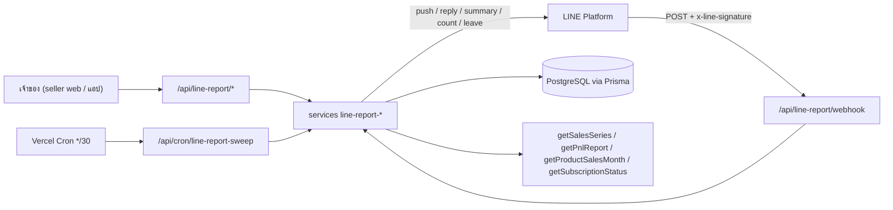
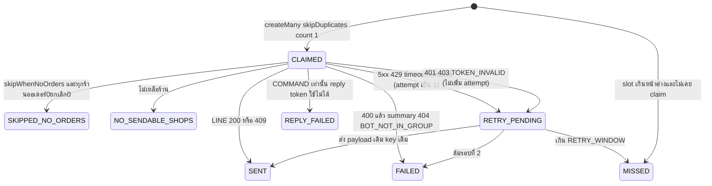

> **โมดูล:** M68-LineGroupSummary (00070) · **ประเภท:** SRS (Technical) · **เวอร์ชัน:** 1.0 · **วันที่:** 2026-10-05 · **สถานะ:** Approved 2026-10-05 (Controller ตัดสิน NOTES แล้ว — ดู [[SDS]] §12)
> **เจ้าของเอกสาร:** SA · ต้นทาง: [[PRD]] + [[BRD]] (อนุมัติแล้ว) · สัญญาข้อมูล: [[DATABASE]] (ห้ามเปลี่ยนชื่อโมเดล/ฟิลด์ — ปัญหาที่พบยกเป็น issue ท้าย SRS) · ข้อเท็จจริง LINE: [[LINE-API-Facts]]

# SRS: รายงานสรุปยอดเข้ากลุ่ม LINE

> 🛑 **แก้ 2026-10-05 (security H-1):** โค้ดผูกเปลี่ยนจากเลข 6 หลัก (10⁶) เป็น **8 ตัว Crockford base32** (`XXXX-XXXX`, ~1.1×10¹²) เพราะเพดานเดา 5 ครั้ง/10 นาทีนับต่อกลุ่ม — คนร้ายเปิดหลายกลุ่มเดาขนานได้ (200 กลุ่ม × 50 โค้ดสด ≈ 5%/10 นาที) · parser รับตัวพิมพ์เล็ก/ไม่มีขีด และแปลง O→0, I/L→1 · ตัวเลข 10⁶/1,000,000 ในเหตุผลเดิมของเอกสารนี้คือค่าก่อนแก้

## 1. บทนำ

### 1.1 วัตถุประสงค์
กำหนดข้อกำหนดเชิงเทคนิคที่ DEV/QA/Security ใช้สร้างและพิสูจน์ FR-LGS-01..24 ของ [[BRD]] โดยระบุกลไกบังคับ (ไม่ใช่แค่คำอธิบาย) ตาม `rule-must-be-enforced-not-described` และโค้ดจริงที่ตรวจแล้ว (HR16)

### 1.2 ขอบเขตเชิงระบบ
| อยู่ในขอบเขต | นอกขอบเขต |
|---|---|
| webhook ใหม่ `/api/line-report/webhook` · API เจ้าของ `/api/line-report/**` · cron `/api/cron/line-report-sweep` · 5 ตาราง + 5 enum ([[DATABASE]]) · services `line-report-*` · lib `src/lib/line-report/**` · Flex builder · หน้า `business/line-reports/**` + ทางเข้า 3 จุด · `featuresForTier` · sync `docs/SRS.md` | แก้ `/api/channels/line/webhook` (00025) · OA ของ 00064 · รายสัปดาห์/เลือกวัน/ภาษา/1:1/กราฟรูป/OA ร้านเอง/คิดเงินต่อข้อความ · ตัวเลขเฉพาะ vertical |

### 1.3 เอกสารอ้างอิง
[[PRD]] · [[BRD]] · [[DATABASE]] · [[LINE-API-Facts]] · UX spec `docs/superpowers/specs/2026-10-05-line-group-summary-report-design.md` · ตัวอย่างโครง `00067 SRS/SDS/API` · `docs/conventions/rule-must-be-enforced-not-described.md` · `insert-then-catch-logs-every-error.md` · `stored-flag-vs-owner-truth.md` · `session-exists-is-not-identity.md` · skill `app-store-surfaces`

### 1.4 นิยาม
| คำ | ความหมายเชิงเทคนิค |
|---|---|
| **slot** | จำนวนเต็มนาที 30..1440 ก้าว 30 (1440 = 24:00) เก็บใน `LineReportGroup.dailyTimes` |
| **fireAt(D, M)** | `thaiMidnightUtc(D) + M·60000` — M=1440 ของวัน D ยิงตอน 00:00 ของ D+1 |
| **SLOT_WINDOW** | 60 นาที — slot ส่งได้เมื่อ `0 ≤ now − fireAt < 60min` |
| **RETRY_WINDOW** | 90 นาทีหลัง fireAt (เพื่อให้ retry รอบ cron ถัดไปทันแม้รอบแรกเริ่มช้า 1 tick) |
| **window** | ช่วงวันที่ไทย inclusive `[startIso, endIso]` ของตัวเลขหนึ่งชุด + `computedAt` |
| **cycle** | รอบรายเดือนตาม `cutoffDay` (null = สิ้นเดือน) |
| **claim** | `createMany({skipDuplicates})` บน `(groupId, slotKey)` ได้ `count===1` = ผู้ชนะ |
| **L1 / L2** | L1 = session + เป็น `Shop.userId` ของร้านใดร้านหนึ่ง (อ่าน/ลบ/รับทราบ) · L2 = L1 + `getSubscriptionStatus(ownerId)?.status === 'ACTIVE'` (สร้าง/แก้/ส่ง) |
| **reply window** | 50 วินาที นับจาก `event.timestamp` (`REPLY_WINDOW_MS` ใน `line-report-command.service.ts` — เผื่อกว่า 55s ของ `src/lib/line/constants.ts`) |

## 2. ภาพรวมสถาปัตยกรรม

### 2.1 บริบทระบบ

### 2.2 องค์ประกอบ
| Component | หน้าที่ | ที่อยู่ |
|---|---|---|
| lib บริสุทธิ์ | schedule · cycle · command parser · aggregate/canSumProfit · bind-code hash · retry key · errors · messages · reasons · validations · presenter | `src/lib/line-report/**` |
| Flex builder | ประกอบ Flex + altText + ลำดับตัดทอน | `src/lib/line/flex-summary-report.ts` |
| services | access · shop · group · bind · summary · delivery · send · command · sweep(+cleanup) · cancelled-count | `src/services/line-report-*.ts` |
| routes | owner API · webhook · cron | `src/app/api/line-report/**`, `src/app/api/cron/line-report-sweep/` |
| UI | list · wizard · detail · locked | `src/app/(paces)/seller/(dashboard)/business/line-reports/**` |

### 2.3 Deployment / env
- ไม่มี infra ใหม่: Vercel function + cron เดิม · cron ใหม่ `*/30 * * * *` ใน `vercel.json` (ไฟล์มี `* * * * *` และ `*/5` อยู่แล้ว)
- env ใหม่ (ห้ามใช้ `LINE_CHANNEL_*` ซึ่งเป็น LINE Login — `src/lib/auth.ts:339-340`):

| env | ใช้ที่ | จำเป็น | หมายเหตุ |
|---|---|---|---|
| `LINE_REPORT_BOT_CHANNEL_SECRET` | `validateSignature` ของ webhook | ใช่ | ว่าง = webhook ตอบ 200 โดยไม่ประมวลผล + log warn |
| `LINE_REPORT_BOT_CHANNEL_ACCESS_TOKEN` | `lineApiRequest` ทุกคำขอขาออก | ใช่ | ใช้ long-lived token · ห้าม log |
| `LINE_REPORT_BOT_BASIC_ID` | ลิงก์/QR เพิ่มเพื่อน (`https://line.me/R/ti/p/<basicId>`) | ไม่ (ลดระดับ: ซ่อนปุ่มเพิ่มเพื่อน) | ค่ารูป `@xxxxxxxx` |
| *(ไม่เพิ่ม)* secret โค้ดผูก | HMAC-SHA256 ของโค้ด 8 ตัว | — | **derive จาก `NEXTAUTH_SECRET`**: `key = HMAC(NEXTAUTH_SECRET, "line-report:bind-code:v1")` แล้ว `hash = HMAC(key, code)` hex (precedent: `src/lib/mobile-ticket.ts`, `link-intent.ts` ใช้ `NEXTAUTH_SECRET` + fail-closed ถ้าไม่ตั้ง) · เหตุ: ไม่เพิ่มตัวแปรให้ ops · ผลข้างเคียง: หมุน `NEXTAUTH_SECRET` ทำให้โค้ดที่ค้าง (≤10 นาที) ใช้ไม่ได้ — ยอมรับ |

- `isReportBotReady()` = secret ∧ token มีค่า → หน้าตั้งค่าแสดง "ฟีเจอร์ยังไม่พร้อมใช้งาน" เมื่อ false (AC-LGS-05-9) · sweep คืน `{skipped:'NOT_CONFIGURED'}` ไม่ throw
- `.env.example` ต้องเพิ่มทั้ง 3 ตัว (ค่าว่าง + คอมเมนต์ห้ามใช้ `LINE_CHANNEL_*`)

## 3. ข้อกำหนดเชิงฟังก์ชันเชิงเทคนิค (TFR)

> ตำแหน่งไฟล์ = ข้อเสนอสัญญาของ [[BRD]] ที่ยืนยันโครงแล้วใน [[SDS]] §3 · "เทสแดงถ้าถอด" ต้องพิสูจน์ด้วย mutation จริงตอนปิดงาน

### TFR-LGS-01 ด่านสิทธิ์ (FR-01)
- **กลไก:** `isOwnerPaidForReports(ownerId)` = `try { (await getSubscriptionStatus(ownerId))?.status === 'ACTIVE' } catch { false }` (fail-closed; รูปเดียวกับ `isOwnerPaidPlan` ใน `ai-suggest-quota.service.ts:35-40` แต่รับ `ownerId`) · `resolveReportAccess(session)` → `ANON | NOT_OWNER | LOCKED{reason:'NEVER'|'RENEWAL_FAILED'} | OK` โดยระบุตัวตนด้วย `sessionUserId()` (`src/lib/session-user.ts:20`) ห้าม cast · `NOT_OWNER` = ไม่มี `Shop` ที่ `userId=ownerId ∧ deletedAt=null ∧ purgedAt=null`
- **ระดับ endpoint:** L1 = GET groups/ GET group / DELETE group / POST ack · L2 = POST bind-code (ทั้งสอง) / PATCH / PUT shops / POST test
- **จุดส่งจริงเรียกซ้ำเสมอ** (AC-01-6): `sendScheduled` · `sendTest` · `replyCommand` · `sendFinalNotice` เรียก `isOwnerPaidForReports(group.ownerId)` ก่อนแตะ LINE — ห้ามอ่านจากแถวกลุ่ม
- **เหตุที่ DELETE เป็น L1:** มติ user 2026-10-05 ข้อ 11 ("แพ็กเกจหมด → ยกเลิกการผูกได้อย่างเดียว") ขัดกับถ้อยคำ AC-LGS-01-4 ที่ระบุ "ลบ" ในรายการที่ต้องเป็น ACTIVE — ใช้ตามมติ user (issue #4)
- **Error:** `UNAUTHORIZED 401` · `NOT_OWNER 403` · `PACKAGE_REQUIRED 403`

### TFR-LGS-02 หน้าล็อก + CTA (FR-02)
- หน้า `line-reports/page.tsx` แตกสาขาตาม `resolveReportAccess` · CTA ตัดสินด้วย `shouldHidePayments()` + `shouldOfferIap()` (`app-shell-server.ts:38,63`):

| shell | CTA | ปลายทาง |
|---|---|---|
| เว็บ | "ดูแพ็กเกจธุรกิจ" / "ต่ออายุแพ็กเกจ" (ตาม `reason`) | `/business` |
| iOS (`hidePayments ∧ offerIap`) | "ดูแพ็กเกจธุรกิจ" | `/business/subscribe` |
| Android (`hidePayments ∧ ¬offerIap`) | **ไม่มี** + ห้ามมี `฿` · สมัคร · อัปเกรด · ราคา | — |

- 🛑 ห้ามเรียก `shouldHidePaidFeatures()` ใต้ `line-reports/**` (AC-02-5 — เทสสแกนซอร์ส: ต้องมี `shouldHidePayments(` และไม่มี `shouldHidePaidFeatures(`)

### TFR-LGS-03 ทางเข้า + tier line (FR-03)
| จุด | การแก้ | ด่าน |
|---|---|---|
| sidebar | เพิ่ม item `seller:line-reports` (กลุ่ม SHOPS · url `/business/line-reports` · icon `brand-line` ยืนยันมีใน tabler แล้ว) + `applyLineReportMenu` ใน `resolveVisibleSellerMenu` ซ่อนเมื่อ `staff.role !== 'OWNER'` · **ไม่** ผูก `hidePaidFeatures` | `shortcut.service.buildEligibleCatalog` ใช้ pipeline เดียวกัน (AC-03-5 ได้ฟรี) |
| i18n | `menu.lineReports` ใน `th.ts` + `en.ts` + `BY_SLUG` ใน `applyMenuLocale` | เทส `dictionaries.test.ts` "[blocker] ไม่มี slug หลุดเป็นไทย" จะแดงถ้าไม่เติม |
| มือถือ | แถวใน `ShopQuickLinks.tsx` (prop ใหม่บังคับ `showLineReports`, `lineReportAlert` — ไม่มี default) **ไม่อยู่ใน** `PAYMENT_LINK_URLS`/`IAP_LINK_URLS` · จุดแจ้งบนแท็บ "ร้านค้า" ของ `SellerBottomNav.tsx` (prop `lineReportAlert?`) | ไม่มีแท็บ "ธุรกิจ" ในแถบล่างจริง (issue #1) |
| `/business` | แถวลิงก์ใต้ `QuotaUsageCard` (เฉพาะเว็บ เพราะ root เด้งออกในแอป `business/page.tsx:65`) | — |
| ปลายทาง | `business/line-reports/**` ไม่ถูกด่านที่ `business/page.tsx:65` ครอบ (AC-03-4) · เป็น static segment ไม่ชน `business/[shopId]` | — |
| `featuresForTier` | เพิ่ม `'รายงานสรุปยอดเข้ากลุ่ม LINE'` ใน `tierQuotaFeatures` สาขา `maxBusinesses !== 0` เท่านั้น (Free pseudo-tier ไม่ได้) → `PackageTierGrid` + `IapSubscribeClient` อ่านจากฟังก์ชันเดียวกัน | `subscription-benefits.test.ts` (ต่อยอด) |
| `settings/` | ลิงก์ชี้เฉยๆ ไม่มีฟอร์มซ้ำ (AC-03-6) | — |

### TFR-LGS-04 สร้างโค้ดผูกกลุ่ม (FR-04)
- ทำใน `prisma.$transaction` เดียว: ① `SELECT … FROM "User" WHERE id=$1 FOR UPDATE` ② ตรวจ `shopIds` ด้วย `findMany({id in, userId: ownerId, deletedAt:null, purgedAt:null, packageLockedAt:null})` ต้องได้ครบ (ไม่ใช้ `listAccessibleShopIds`) ③ นับ `status <> 'REMOVED'` ≥ 10 → `GROUP_LIMIT_REACHED` ④ สร้างแถว `PENDING` + `LineReportGroupShop` ⑤ revoke โค้ดสดทั้งหมดของเจ้าของ ⑥ สร้างโค้ดด้วย `generateBindCode()` (สุ่มทีละตัวจาก Crockford base32 ด้วย `crypto.randomInt`) → `createMany({skipDuplicates:true})` ถ้า `count===0` สุ่มใหม่ ≤5 ครั้ง (ห้ามดัก P2002) · `expiresAt = now + 10 นาที`
- body ต้องมี `acknowledged: true` (บังคับที่ server — ไม่ใช่แค่ปุ่ม disabled)
- โค้ดดิบคืนใน response ครั้งเดียว ไม่มีที่ไหนเก็บค่าดิบ (AC-04-4) → หน้า PENDING ที่โหลดใหม่แสดงโค้ดเดิมไม่ได้ ต้อง regenerate (issue #2)
- **Error:** `GROUP_LIMIT_REACHED 409` · `SHOP_NOT_ALLOWED 400` · `SHOP_COUNT_OUT_OF_RANGE 400` · `BOT_NOT_CONFIGURED 503`

### TFR-LGS-05 Webhook ingress (FR-05)
- ลำดับ: อ่าน `raw = await request.text()` → ถ้า secret ว่าง: 200 + warn → `validateSignature(raw, secret, header)` (`src/lib/line/signature.ts:16`, timing-safe) ผิด/ไม่มี: **401 `INVALID_SIGNATURE`** โดยไม่แตะ DB → parse JSON (ผิด: 200) → `after()` ประมวลผลทีละ event → ตอบ 200 ทันที (pattern `channels/line/webhook/route.ts:274+`)
- validator ผ่อนปรน: `source.userId` **optional** · `mode==='standby'` → ข้าม (ไม่มี replyToken) · ชนิดที่รู้จัก: `join`, `leave`, `message` (text) เท่านั้น · event ที่ `source.type !== 'group'`: `message` ของแชทเดี่ยว → ตอบช่วยเหลือสั้นๆ (Should AC-22-10) ที่เหลือเมิน
- ทุก event ครอบ try/catch แยก: ล้ม = log `[line-report-webhook]` (ห้ามมี token/secret/ข้อความผู้ใช้) แล้วทำ event ถัดไป · `deliveryContext.isRedelivery===true` ของ `ผูก` = ข้าม (ไม่มี dedupe table; ผู้ใช้พิมพ์ใหม่ได้)
- proxy: เพิ่ม `pathname !== '/api/line-report/webhook'` ใน CSRF exemption (`src/proxy.ts:49-56`) **และ** bucket rate-limit แยกเพดาน 1200/นาที (default unauth mutation = 100/นาที/IP จะทำให้คำสั่งหายเงียบเมื่อกลุ่มพูดคุยหนาแน่น — issue #7)
- **Error:** ไม่มี status ธุรกิจ (ตอบ 200 เสมอหลังลายเซ็นผ่าน — AC-05-8)

### TFR-LGS-06 ผูกด้วย `ผูก <โค้ด>` + กันเดา (FR-05/06)
ลำดับตายตัว (`consumeBindCode`):
1. parse (`commands.ts`) → insert `RateEvent(BIND_ATTEMPT)` → นับ 10 นาทีล่าสุดของ `lineGroupId` (รวมตัวเอง) → `> 5` = ตอบข้อความ "ไม่ถูกต้อง" ชุดเดียว ไม่ตรวจโค้ด
2. `codeHash = HMAC` → หาแถวสด `usedAt null ∧ revokedAt null ∧ expiresAt > now` ไม่เจอ = ข้อความเดียวกัน (ผิด/หมดอายุ/ใช้แล้ว เหมือนกันทุกตัวอักษร — AC-06-4)
3. กลุ่ม LINE นี้ `ACTIVE` กับเจ้าของอื่น → `INVALID` ข้อความเดียวกับโค้ดผิด (security M-1: ไม่เป็น oracle, **ไม่เผาโค้ด**) · กับเจ้าของเดียวกัน → `ALREADY_BOUND_SELF` (ไม่เผา, ไม่สร้างแถว)
4. ตรวจซ้ำ: เจ้าของ `isOwnerPaidForReports` · ทุกร้านใน `LineReportGroupShop` ยัง `userId=owner ∧ ¬deleted ∧ ¬purged` · จำนวนกลุ่ม ≤10 — ผิดข้อใด = ข้อความเดียวกับข้อ 2
5. เรียก `GET /v2/bot/group/{id}/summary` (นอก tx; ล้ม → ชื่อ `''`) 
6. tx: `FOR UPDATE` แถว `User` → `updateMany(code: id ∧ usedAt null ∧ revokedAt null ∧ expiresAt>now → usedAt=now)` ต้อง `count===1` → **`$executeRaw` conditional update** `PENDING→ACTIVE … WHERE id=$ ∧ status='PENDING' ∧ NOT EXISTS(ACTIVE ที่ lineGroupId เดียวกัน)` ได้ 0 แถว = rollback + `ALREADY_BOUND_OTHER` (ไม่ใช้ P2002; partial unique เป็นตาข่ายชั้นสอง)
7. ตั้ง `boundAt=now`, ล้าง `alertKind/alertAt/alertAckAt/finalNoticeSentAt` · **ไม่แตะ** `dailyEnabled/monthlyEnabled/dailyTimes/ร้าน` (OQ-5 + AC-07-4)
8. `reply` ข้อความยืนยัน (ชื่อกลุ่ม + ชื่อร้าน ≤10 รายการ)
- `join` → reply ทักทาย + วิธีผูก เสมอ · ไม่เก็บ LINE userId หรือข้อความที่ไม่ใช่คำสั่ง (AC-06-5)

### TFR-LGS-07 leave / ผูกใหม่ / ลบ (FR-07/08)
- `leave`: `updateMany({lineGroupId, status:'ACTIVE'} → INACTIVE, leftAt=now)` + raise `BOT_REMOVED` (count 0 = เมินเงียบ — AC-07-5) ในคำขอเดียวกัน
- ผูกใหม่ = `POST /groups/{id}/bind-code` กับแถว `INACTIVE` → `PENDING` (คง `lineGroupId` เก่าไว้จนผูกสำเร็จ — ย้ายไปกลุ่ม LINE ใหม่ได้โดยตั้งใจ AC-07-4) · กับ `PENDING` = regenerate
- ลบ: `findFirst({id, ownerId, status≠REMOVED})` ไม่เจอ = 404 · → `REMOVED, removedAt` + revoke โค้ดสด + (ถ้าเคย ACTIVE) `POST /group/{id}/leave` แบบ best-effort หลัง commit (ล้ม = ไม่ทำให้การลบล้ม — AC-08-2) · ไม่ลบ `LineReportDelivery` (Restrict)

### TFR-LGS-08 ร้านที่รวม (FR-09)
`PUT shops`: tx เดียว — validate เซตใหม่ 1..10 ไม่ซ้ำ · **เพิ่มใหม่ต้องเป็นร้านที่ reportable** (`userId=owner ∧ ¬deleted ∧ ¬purged ∧ ¬packageLockedAt`) · ร้านที่อยู่ในกลุ่มเดิมและตอนนี้ล็อก/ลบ **คงไว้ได้** (AC-09-3 ห้ามลบเงียบ) · `deleteMany` เฉพาะแถวที่หลุดเซต (scope ด้วย `groupId`) + `createMany skipDuplicates`

### TFR-LGS-09 ตารางเวลา (FR-10)
- `SLOT_OPTIONS` 48 ค่า (30..1440) ใน `schedule.ts` เป็น SSOT แปลง นาที↔`HH:MM` (`1440→"24:00"`, ไม่มี `00:00`)
- `dueSlots(group, now)` → `{ send, missed, monthly }`: วันตั้งต้น `D ∈ {todayThai−1, todayThai}` · `send`: `0 ≤ now − fireAt < 60min` · `missed`: `60 ≤ now − fireAt < 180min ∧ fireAt ≥ boundAt` (บันทึก `MISSED` ไม่ส่งย้อนหลัง) · ใช้ `TZ_OFFSET_MS`/`thaiMidnightUtc`/`todayThaiIsoDate(now)` จาก `src/lib/date-range.ts` ห้ามคำนวณ offset เอง
- `resolveDailyWindow(M, D)`: `M<1440` → `[D, D]` (สะสม 00:00→คำนวณ) · `M=1440` → `[D, D]` ครบวัน ป้าย "สรุปวันที่ D (ครบทั้งวัน)"
- `fireOrder`: 24:00 ของเมื่อวานยิง 00:00 ก่อนเสมอ (AC-10-5) · slotKey `D:<D>@<HH:MM>`
- **ความคงที่ข้ามฟิลด์** (บังคับที่ service บน state หลังรวม patch): `(dailyEnabled ∨ monthlyEnabled) ⇒ dailyTimes.length ≥ 1` · `dailyTimes` เรียงน้อย→มาก ไม่ซ้ำ ≤4 · `attachCycleToDaily` ถูกล้างเป็น false อัตโนมัติเมื่อ `monthlyEnabled=false`

### TFR-LGS-10 รอบรายเดือน (FR-11)
- `eff(y,m) = min(cutoffDay ?? 31, daysInMonth(y,m))` · `cycleContaining(dateIso, cutoff)`: ถ้า `day ≤ eff(y,m)` → `end = eff(y,m)` ของเดือนนี้, `start = eff(เดือนก่อน)+1 วัน`; ไม่งั้น `end = eff(เดือนถัดไป)`, `start = eff(เดือนนี้)+1 วัน` (ผลตรง 5 แถวตัวอย่าง BRD §FR-11 ทั้งหมด — เทสตาราง)
- `monthlyFire`: ส่งในวัน F เมื่อ `F−1` เป็นวัน eff ของเดือนนั้น · เวลา = `firstOffset = times∋1440 ? 0 : min(times)` · due เมื่อ `0 ≤ now − (F00:00 + firstOffset) < 60min` · ผู้สมัครวัน F ∈ {todayThai−1, todayThai} (กรณี offset ข้ามเที่ยงคืน) · window = รอบที่ `F−1` เป็นวันสุดท้าย · slotKey `M:<end>`
- ส่งรวม push เดียวกับ daily slot แรกของวัน (message object แยก ≤2) · ถ้า daily ปิด/ไม่ตรง tick = ส่งเดี่ยว · ส่วน "ยอดสะสมรอบ" ของรายวันถูกข้ามเมื่อมีรายเดือนใน push เดียวกัน (AC-11-7) · ส่วนแนบประกอบด้วยรวมทุกร้าน: ออเดอร์/ยอดขาย/ยังไม่นับ/ยกเลิก (ตามธง) ไม่มี Top 3/กำไร (ตัดสินใจ TD-005 ของ SDS)
- `สรุปเดือนนี้` = `[cycleContaining(today).start, today]` ใช้ได้แม้ `monthlyEnabled=false`

### TFR-LGS-11 ตัวเลขที่แสดง (FR-12)
- `showProfit=false` → **ไม่เรียก `getPnlReport`** ทุกช่องทาง (guard ก่อนเรียก ไม่ใช่ซ่อนหลังคำนวณ) · เปิด (false→true) ต้องมี `confirmProfit:true` ใน PATCH → ตั้ง `profitEnabledAt=now`; ปิด → NULL (ตรงกับ `non-null ⇔ showProfit` ใน [[DATABASE]] §3.1)
- ต้องเปิดอย่างน้อย 1 ตัวเลข (`showOrders ∨ showSales ∨ showCancelled ∨ showTopProducts ∨ showProfit`) — CHECK ที่ DB + ตรวจก่อนที่ service เพื่อให้ได้ `INVALID_SETTINGS` ไม่ใช่ error ดิบของ DB

### TFR-LGS-12 ส่งทดสอบ (FR-13)
`sendTest`: L2 → tx: `SELECT … FOR UPDATE` แถวกลุ่ม → นับ `LineReportDelivery(kind=TEST, status∈{CLAIMED,RETRY_PENDING,SENT}, createdAt ≥ thaiTodayBounds().from)` ≥5 → `TEST_QUOTA_EXCEEDED` → insert แถว `T:<uuid>` (`CLAIMED`) → commit → คำนวณ + push **ครั้งเดียว ไม่ retry** (ล้ม = `FAILED` + แปลงเป็น error ให้ผู้เรียก) · ตัวเลขจริงตามค่าที่บันทึก · ป้าย "ทดสอบ" · ไม่ใช้ `skipWhenNoOrders` (AC-19-8)

### TFR-LGS-13 รวมตัวเลขทีละร้าน (FR-14/16)
SSOT map (ตรวจกับโค้ดแล้ว):
| ตัวเลข | เรียก | หมายเหตุที่ตรวจจริง |
|---|---|---|
| ออเดอร์ / ยอดขายนับแล้ว / ยังไม่นับ | `getSalesSeries(shopId,'daily',{year,month},false,vertical)` → `orderCounts` / `confirmedValues` / `unconfirmedValues` | `dashboard.service.ts:215`; ตัด `DRAFTED` (+`RETURNED` เมื่อ `usesServiceFinanceRules`) · `includeFinance=false` เสมอ (ไม่ query ต้นทุน) · query ครอบ 2 เดือน/ครั้ง |
| ยกเลิก | ฟังก์ชันใหม่ `countCancelledOrders(shopId, startIso, endIso)` = `order.count({shopId, status:'CANCELLED', createdAt∈[thaiMidnightUtc(start), thaiMidnightUtc(end+1))})` | parity กับ `jobStatusCounts.cancelled` (`dashboard.service.ts:548-561`: `status==='CANCELLED'`, แกน `createdAt`) |
| กำไร | `getPnlReport(shopId, resolveDateRange('custom', start, end), vertical)` → `netProfit`, `hasMissingCost` | `pnl.service.ts:110` · `capped = !resolveDataCompleteness({hasMissingCost, expenseCount, …}).complete` โดย `expenseCount = listExpenses(shopId,{range}).length` (`finance-tabs.ts:65`, ชุดเดียวกับ `sales/page.tsx:176-187`) · ป้ายจาก `profitDisplay(n,{capped})` (`format-money.ts:115`) |
| Top 3 | `getProductSalesMonth(shopId,year,month0)` → รวม `qty`/`amount` เฉพาะวันในช่วง (sparse `[dayIdx0,value]`) · ตัด `isCustom` · เรียง qty↓, amount↓, ชื่อ ก→ฮ | `product-sales-series.service.ts:96` · เกณฑ์ `status≠CANCELLED` (ต่างจากยอดขาย — ต้องมีป้าย `SALES_BASIS_NOTE`) · `truncated` → หมายเหตุ |
- ช่วงคร่อมเดือน: เรียกทีละเดือน (`monthsInRange`) แล้วรวมเฉพาะวัน `[start..end]` — ห้ามเขียนสูตรยอดขาย/กำไรเอง (AC-14-1: ไฟล์ `line-report-*.ts` ห้ามมี `revenueOrderWhere`/`totalAmount`/`cost`)
- แต่ละร้านครอบ try/catch แยก ล้ม → `state:'ERROR'` ไม่นับในยอดรวม + หมายเหตุ "ดึงข้อมูลไม่สำเร็จ"; ทุกร้านล้ม → ไม่ส่ง (`ALL_SHOPS_FAILED`) นับเป็นล้มเพื่อ retry
- cache ต่อรอบ sweep: key `(shopId,y,m)` ของ series/top3, `(shopId,start,end)` ของ cancelled/pnl (AC-16-7: เรียกครั้งเดียวต่อ key)

### TFR-LGS-14 รวมหลายร้าน (FR-15)
- ยอดรวมของ orders/sales/unconfirmed/cancelled = ผลบวกค่าที่แสดงรายร้านพอดี (เทส property) · กลุ่มร้านเดียวไม่มีบล็อกรวม
- `canSumProfit(shops)` (pure ใน `aggregate.ts`) = ทุกร้านมี `usesServiceFinanceRules` เท่ากัน; ไม่ใช่ → กำไรรายร้านเท่านั้น + หมายเหตุ · ผสมบริการ/อื่น → หมายเหตุ "ยอดแต่ละร้านคิดตามกติกาของประเภทธุรกิจ"
- เรียงร้าน: ยอดขายนับแล้ว↓ แล้วชื่อ (เสถียร)

### TFR-LGS-15 Flex + altText (FR-17)
- builder pure `buildSummaryReportFlex(input): LineFlexMessage[]` (ไฟล์ `src/lib/line/flex-summary-report.ts`; รูป `LineFlexMessage` จาก `flex-order-card.ts:53`) · เงินใช้ `formatBaht`, วันที่/เวลาใช้ `format-date.ts` (ห้าม `toFixed`/`toLocaleString('th')`) · ป้ายช่วงวันที่ + "ข้อมูล ณ HH:MM น." = `computedAt` (retry ส่ง payload เดิมจึงเป็นเวลาเดิม)
- ข้อจำกัด (LINE-API-Facts §6): `altText ≤ 1500` · bubble ≤ 30KB (วัดเป็นไบต์ UTF-8 ของ `JSON.stringify`) · `messages ≤ 5` ต่อ push (เราใช้ ≤2) · ลำดับตัดทอน: Top 3 → ย่อรายร้าน → ย่อ altText — ไม่ตัดยอดรวม/ป้ายช่วงเวลา/"ข้อมูล ณ" · **[EXT 2026-10-05] ปัจจุบันเป็น 4 ระดับ Top 3 → กราฟ → ย่อรายร้าน → ย่อ altText** และ builder ขับด้วยเทมเพลต (ดู §13.4–13.5) — กลุ่มที่ `template = null` ได้ผลเหมือนเดิมทุกไบต์ (ข้ามระดับกราฟเพราะไม่มีกราฟ)
- ปุ่ม "เปิด Deep" → `${NEXT_PUBLIC_SELLER_URL}/dashboard` เฉพาะเมื่อเป็น `https` (LINE ปฏิเสธ uri ที่ไม่ใช่ https) · label ≤20 ตัวอักษร · สี accent = น้ำเงิน seller `#236dc9` (มติ UX) · ไม่มีคำว่า SafePay
- ข้อความกำไรจาก `profitDisplay` เท่านั้น (ถ้อยคำ SSOT: "กำไรสุทธิ" / "กำไรสุทธิไม่เกิน" / "ขาดทุนสุทธิอย่างน้อย") + หมายเหตุ "ค่าใช้จ่ายลงตามวันที่บันทึก ไม่เฉลี่ยรายวัน" (issue #3)

### TFR-LGS-16 ร้านที่ไม่พร้อม (FR-18)
`resolveSendableShops(group)` อ่านสดทุกครั้งส่ง ตรวจตามลำดับ (สถานะปลายทางก่อน): `purgedAt≠null` → `PURGED` · `deletedAt≠null` → `DELETED` · `packageLockedAt≠null` → `LOCKED` → ตัดออก + หมายเหตุ "ไม่รวมร้าน X (ถูกล็อก)" · ไม่เหลือ → `NO_SENDABLE_SHOPS` (ไม่ส่ง ไม่ retry, raise alert `NO_SENDABLE_SHOPS`)

### TFR-LGS-17 Sweep (FR-19)
`GET /api/cron/line-report-sweep`: auth `CRON_SECRET` (env ว่าง/ไม่ตรง → 401; แบบ `line-token-health/route.ts:22-26`) · `maxDuration = 300` (มี precedent `admin/iship/backfill-evidence` — ops ยืนยัน plan) · หยุดเริ่มกลุ่มใหม่เมื่อ `elapsed ≥ 240s` (เหลือ 60s กันงานค้างกลางทาง) · กลุ่มที่เหลือรอ tick ถัดไปภายใน SLOT_WINDOW · ต่อกลุ่ม try/catch แยก (AC-19-5) · ลำดับ: เรียงกลุ่มตาม slot ที่เก่าสุดก่อน · เลือกเฉพาะ `status='ACTIVE' ∧ (dailyEnabled ∨ monthlyEnabled)` · **cleanup รวมใน tick ที่ผ่าน 03:00 ไทย** (TFR-23) ไม่เพิ่ม cron
- ต่อกลุ่ม: ① `isOwnerPaidForReports` (อ่านสดต่อกลุ่ม ไม่ cache ข้ามกลุ่ม) ไม่ ACTIVE → TFR-19 ② ACTIVE: ล้างมาร์กเกอร์ข้อความสุดท้ายถ้าไม่ว่าง (lazy reset — AC-21-5) ③ retry งานค้าง ④ `dueSlots` → `missed` บันทึก ⑤ `send` ส่ง

### TFR-LGS-18 claim / ส่ง / retry (FR-20)

- retry key = `uuidv5(`${groupId}|${slotKey}`, LINE_REPORT_NS)` (`uuid ^11.1.0` อยู่ใน dependencies แล้ว — `import { v5 } from 'uuid'` ไม่ต้องเขียนเอง) ใส่ตั้งแต่คำขอแรกผ่าน `lineApiRequest(path, token, {retryKey})` (`client.ts:46-49` มีจริง) · **409 = SENT** (`LineApiError.status===409`) · retry เฉพาะ 5xx/429/timeout/network
- ลำดับต่อ slot: claim → resolve ร้าน → คำนวณ → ประกอบ → **เขียน `pendingPayload={raw:<JSON string>}` + `retryKey` + `payloadSha256`** → push → ผลลัพธ์ล้าง `pendingPayload` · เก็บเป็น string ใน jsonb เพราะ jsonb จัดเรียง key ใหม่ ทำให้ไบต์ต่างจากครั้งแรก (issue #6) · retry: `JSON.parse(raw)` → `lineApiRequest` stringify ได้ไบต์เดิม (round-trip ของ `JSON.stringify`)
- `400` จาก push → `GET /group/{id}/summary`: `404` → `INACTIVE` + `FAILED(BOT_NOT_IN_GROUP)` + alert · อื่น → ล้มธรรมดา · `CLAIMED` ค้าง >5 นาที (crash) = ถือเป็น retry: มี payload → ส่งซ้ำ key เดิม; ไม่มี → คำนวณใหม่ (ยังไม่เคยส่ง) · `RETRY_WINDOW` หมด → `MISSED`
- รายวัน+รายเดือนใน push เดียว: claim 2 แถว (`D:`,`M:`) · push ครั้งเดียวด้วย key ของ `D:` · แถว `M:` ติดสถานะตาม push เดียวกัน, `pushMessageCount=0`, `reason='IN_DAILY_PUSH'`
- `pushMessageCount = memberCount` ณ ตอนส่ง (จาก `GET /group/{id}/members/count` หลัง push สำเร็จ; ล้ม = ใช้ค่าล่าสุดของกลุ่ม) · reply = 0 · เป็นค่าประมาณขอบบน (LINE-API-Facts §5)
- TOKEN_INVALID: แจ้ง ops ด้วย `console.error('[line-report][OPS] TOKEN_INVALID')` เท่านั้น (ยังไม่มีช่อง ops อื่นในโค้ด — issue #11) · ห้ามเผา retry ของกลุ่ม
- alert: ล้มรอบสอง → `SEND_FAILED` · ส่งสำเร็จครั้งถัดไป → resolve `SEND_FAILED`/`NO_SENDABLE_SHOPS` (TFR-22)

### TFR-LGS-19 แพ็กเกจหยุด (FR-21)
- sweep เห็น owner ไม่ ACTIVE ∧ `finalNoticeSentAt IS NULL` → claim `F:<key>` (key = `lockedAt.toISOString()` ถ้ามีแถว `LOCKED_RENEWAL_FAILED`; ไม่มีแถว (ยกเลิก) → `F:<todayThaiIso>`) → push ข้อความสุดท้าย 1 ครั้ง (**ไม่ผ่าน** ด่านจ่ายเงินของเจ้าของ; ไม่มี `฿`/ราคา/ลิงก์) → ตั้ง `finalNoticeSentAt` · ไม่ส่งรายงาน ไม่ตอบ `สรุป…` ด้วยตัวเลข (ตอบข้อความสั้นว่าหยุดชั่วคราว) · ธง "หยุด" **ไม่เก็บ** — แบนเนอร์/ป้ายคำนวณสดจากสถานะแพ็กเกจ (`stored-flag-vs-owner-truth`)
- กลับ ACTIVE → ทำงานต่อใน tick ถัดไป ไม่ส่งย้อนหลัง · ข้อความสุดท้ายส่งเฉพาะกลุ่มที่เปิดรายงานอย่างน้อยหนึ่งชนิด (กลุ่มที่ไม่เคยได้รับอัตโนมัติไม่ต้องถูกรบกวน — issue #13)

### TFR-LGS-20 คำสั่งในกลุ่ม (FR-22)
- parser (`commands.ts`): `NFKC` + trim + ยุบช่องว่าง แล้วเทียบ **ทั้งข้อความ**: `สรุปวันนี้` · `สรุปเดือนนี้` · `^ผูก\s*([0-9A-Z]{4}-?[0-9A-Z]{4})$` · ค่าคงที่เปรียบเทียบผ่าน normalize เดียวกัน (กัน NFKC ทำสระต่างจากค่าคงที่) · "สรุปวันนี้ครับ" ไม่ใช่คำสั่ง (AC-22-6)
- ตัวนับ: ทุกคำสั่งรู้จัก insert `RateEvent(COMMAND)` → นับ 10 นาที: `=11` ตอบ "ถามถี่เกินไป" ครั้งเดียว · `>11` เงียบ (AC-22-8) · กลุ่มไม่ผูก: ตอบ "ยังไม่ได้ผูก" ภายใต้ตัวนับเดียวกัน (AC-22-9)
- ตอบด้วย `POST /v2/bot/message/reply` เท่านั้น — handler **ไม่ import/เรียก push** (เทสสแกนซอร์ส AC-22-3) · ไม่ใช้ retry key (reply ใช้ไม่ได้ — LINE-API-Facts §4) · เกิน reply window (นับจาก `event.timestamp`) → ไม่ส่ง, log `COMMAND` `REPLY_FAILED/REPLY_TOKEN_EXPIRED` · idempotency: claim `C:<webhookEventId>` (กลุ่มที่ผูกแล้วเท่านั้นมีที่ log)
- ชุดตัวเลขเดียวกับที่ตั้งให้กลุ่ม (กำไรปิด = ไม่คำนวณ) · ตอบเสมอแม้ 0 (ไม่ใช้ `skipWhenNoOrders`)

### TFR-LGS-21 Log (FR-23)
- ทุกทางออกของ `sendToGroup`/`replyCommand`/`sendTest`/`sendFinalNotice` เรียก `writeDelivery` (เทสสแกน return path) · แสดง 10 ล่าสุด: `where{groupId} orderBy createdAt desc take 10 select{createdAt,kind,status,reason,pushMessageCount}` หลังตรวจ `where{id, ownerId}` · **ไม่ select `pendingPayload`** · ops cost SQL ตาม [[DATABASE]] §7 (เก็บเป็นเทส `__tests__`)
- reason ใช้ชุดค่าใน §5.3 เท่านั้น (SSOT `delivery-reasons.ts` พร้อมป้ายไทย)

### TFR-LGS-22 แจ้งเจ้าของ (FR-24)
`raise(kind)`: ถ้า `alertKind===kind` → no-op · ไม่งั้นตั้ง `alertKind,alertAt=now,alertAckAt=NULL` · `ack` → `alertAckAt=now` (คง kind) · `resolve` → NULL ทั้งสาม · จุดแจ้งเมนู = มีกลุ่มของเจ้าของที่ `alertKind IS NOT NULL ∧ alertAckAt IS NULL` (`count`, ≤10 แถว) · "แพ็กเกจหยุด" คำนวณสดที่ presenter ไม่ใช่ `alertKind` · ข้อความแจ้งในแอป iOS/Android ไม่มี CTA/ราคา (AC-24-4)

### TFR-LGS-23 Cleanup (FR-23-5/6)
`runCleanup(now)` (ทุกคำสั่งลบมี predicate เวลา — ห้าม `deleteMany()` เปล่า): `Delivery.createdAt < now−90d` · `pendingPayload=NULL` ที่ `createdAt < now−24h` · `RateEvent < now−1d` · `BindCode.createdAt < now−7d` · กลุ่ม `PENDING ∧ boundAt IS NULL` ที่ `COALESCE(max(code.expiresAt), createdAt) < now−7d` → `REMOVED` · รันใน tick แรกที่ `now` ผ่าน 03:00 ไทยของวัน (ครอบด้วย try/catch แยก — ล้มไม่ทำให้ sweep ล้ม)

### TFR-LGS-24 ลบบัญชี
`deleteAccount` (tx เดิม `account-deletion.service.ts:199-222`) เพิ่ม: กลุ่มทุกแถวของ user ≠ `REMOVED` → `REMOVED, removedAt=now` + revoke โค้ดสด · เก็บ `lineGroupId` ไว้ก่อนเพื่อ `leave` best-effort หลัง commit · `purgeExpiredAccounts` (tx ต่อ user) เพิ่มล้าง `lineGroupId=NULL, groupName=''` · log คงตามอายุ 90 วัน

## 4. Interface

### 4.1 Endpoint (รายละเอียด → [[API]])
| Method | Path | Auth | FR |
|---|---|---|---|
| GET | `/api/line-report/groups` | L1 | 03,07,24 |
| POST | `/api/line-report/bind-code` | L2 | 04 |
| POST | `/api/line-report/groups/{id}/bind-code` | L2 | 04,07 |
| GET | `/api/line-report/groups/{id}` | L1 | 05(poll),23 |
| PATCH | `/api/line-report/groups/{id}` | L2 | 10–12 |
| PUT | `/api/line-report/groups/{id}/shops` | L2 | 09 |
| POST | `/api/line-report/groups/{id}/test` | L2 | 13 |
| DELETE | `/api/line-report/groups/{id}` | L1 | 08 |
| POST | `/api/line-report/groups/{id}/ack` | L1 | 24 |
| POST | `/api/line-report/webhook` | ลายเซ็น LINE | 05–07,22 |
| GET | `/api/cron/line-report-sweep` | `CRON_SECRET` | 19–21,23 |
| PUT | `/api/line-report/groups/{id}/template` | L2 | EXT-02,07,08,10 (§13) |
| DELETE | `/api/line-report/groups/{id}/template` | L2 | EXT-10 (§13) |

### 4.2 LINE API ที่เรียก (ทั้งหมดผ่าน `lineApiRequest` ด้วย token ของ OA นี้)
`POST /v2/bot/message/push` (retry key) · `POST /v2/bot/message/reply` · `GET /v2/bot/group/{id}/summary` · `GET /v2/bot/group/{id}/members/count` · `POST /v2/bot/group/{id}/leave` — timeout 10s (ค่า default ของ client) · ไม่ใช้ `/members/ids`

### 4.3 Cross-file error mapping (บังคับ — service throw ↔ route catch)
`LineReportError(code)` ใน `src/lib/line-report/errors.ts` + `LINE_REPORT_ERROR_STATUS: Record<LineReportErrorCode, number>` (exhaustive — เพิ่มโค้ดแล้วลืม map = tsc แดง) · **ทุก route** ครอบ `try { … } catch (e) { return toErrorResponse(e) }` จาก `_shared.ts` ที่เดียว (ไม่มี catch ต่อ route) · error นอกชุด = 500 `INTERNAL` + log

| โค้ด | HTTP | throw ที่ | route ที่ต้องครอบ |
|---|---|---|---|
| `UNAUTHORIZED` | 401 | `requireReportAccess` | ทุก route owner |
| `NOT_OWNER` | 403 | `requireReportAccess` | ทุก route owner |
| `PACKAGE_REQUIRED` | 403 | `requireReportAccess(level 'PAID')` | POST bind-code ×2 · PATCH · PUT shops · POST test · **EXT:** PUT/DELETE template |
| `VALIDATION` | 400 | `parseBody` (Valibot) | POST/PATCH/PUT ทั้งหมด |
| `SHOP_NOT_ALLOWED` / `SHOP_COUNT_OUT_OF_RANGE` | 400 | `line-report-shop.service`, `bind.service` | POST bind-code · PUT shops |
| `INVALID_SETTINGS` / `PROFIT_CONFIRM_REQUIRED` | 400 | `line-report-group.service.updateSettings` · **EXT:** `updateTemplate` (ผ่าน `mergeSettings`) | PATCH · PUT template |
| `TEMPLATE_INVALID` (+`details.rule`/`blockId?`) · `TEMPLATE_TOO_LARGE` | 400 | **EXT:** `updateTemplate` (`validateTemplate` · `assertTemplateSize`) · route PUT (body >64KB → `TEMPLATE_TOO_LARGE`+`reason:'BODY'`) | PUT template |
| `TEMPLATE_STALE` | 409 | **EXT:** `updateTemplate` (เทียบ `templateVersion` ใน tx) | PUT template |
| `FLAGS_DERIVED_FROM_TEMPLATE` | 409 | **EXT:** `updateSettings` (มี `template` ∧ patch มี flag) | PATCH |
| `GROUP_NOT_FOUND` | 404 | group/bind/send service (query `{id, ownerId}`) | ทุก route `groups/[id]` |
| `GROUP_LIMIT_REACHED` | 409 | `bind.service.createBindCode` | POST bind-code |
| `INVALID_STATE` / `SHOPS_INVALID` | 409 | `bind.service.reissueBindCode` | POST groups/{id}/bind-code · PUT shops · PATCH (กลุ่ม REMOVED = 404) |
| `GROUP_NOT_ACTIVE` / `NO_SENDABLE_SHOPS` / `BOT_NOT_IN_GROUP` | 409 | `send.service.sendTest` | POST test |
| `TEST_QUOTA_EXCEEDED` | 429 | `send.service.sendTest` | POST test |
| `LINE_UNAVAILABLE` / `BOT_UNAVAILABLE` | 502 | `send.service` แปลง `LineApiError` (`kind` `LINE_UNAVAILABLE`/`TOKEN_INVALID`) — ห้ามปล่อย `LineApiError` ถึง route | POST test |
| `BOT_NOT_CONFIGURED` | 503 | `line-client.assertReady` | POST bind-code · POST test |
| webhook / cron | — | ภายในจับเอง | webhook ตอบ 200 เสมอหลังลายเซ็น · cron 500 เฉพาะล้มทั้งรอบ |

เทสบังคับ: วนทุกค่าของ `LineReportErrorCode` ยืนยันมีสถานะ · เทส route ต่อ endpoint ว่าแต่ละโค้ดที่ service throw ได้ status ตรงตาราง (ไม่ใช่ 500)

## 5. ข้อมูล
### 5.1 โมเดล/enum
ตาม [[DATABASE]] เป๊ะ (5 โมเดล: `LineReportGroup` · `LineReportGroupShop` · `LineReportBindCode` · `LineReportRateEvent` · `LineReportDelivery`) — SRS นี้ไม่เพิ่ม/เปลี่ยนคอลัมน์ · **EXT 2026-10-05:** `LineReportGroup` เพิ่ม `template Json?` + `templateVersion Int` (ดู §13 และ [[DATABASE]] §3.1)

### 5.2 slotKey
`D:<YYYY-MM-DD>@<HH:MM>` · `M:<วันสุดท้ายของรอบ>` · `T:<uuid>` · `C:<webhookEventId>` · `F:<lockedAt ISO | YYYY-MM-DD>`

### 5.3 ชุด `reason` (SSOT `delivery-reasons.ts`) — ห้ามมี token/secret
`HTTP_<status>` · `TIMEOUT` · `NETWORK` · `TOKEN_INVALID` · `BOT_NOT_IN_GROUP` · `NO_SENDABLE_SHOPS` · `ALL_SHOPS_FAILED` · `NO_ORDERS` · `PACKAGE_PAUSED` · `REPLY_TOKEN_EXPIRED` · `REPLY_REJECTED` · `IN_DAILY_PUSH` · `PAYLOAD_TOO_LARGE` · `STALE_CLAIM` · `INTERNAL`

### 5.4 Migration / lifecycle
ตามแผน [[DATABASE]] §8 (ไฟล์เดียว `20261005100000_…`, SQL ดิบ partial unique ×3 + CHECK, ห้าม `migrate dev`/`db pull`, HR14/HR15) · retention ตาม TFR-23

## 6. NFR
| ด้าน | ข้อกำหนด | เป้าที่วัดได้ |
|---|---|---|
| Reply latency | ตอบคำสั่งก่อน reply window หมด (55s จาก `event.timestamp`) | p95 ≤ 10s (10 ร้าน เปิด Top 3) · ถ้าเกิน 50s ยกเลิกคำนวณ ไม่ push |
| Webhook | ตอบหลัง verify ลายเซ็น แล้วทำงานใน `after()` | ตอบ ≤ 1s · `maxDuration = 60` |
| Sweep | `maxDuration = 300` · เริ่มกลุ่มใหม่ถึง 240s | slot ถึงมือภายใน SLOT_WINDOW ≥ 95% (KPI ส่งตรงเวลา ≤5 นาที) |
| Correctness | parity กับ `getSalesSeries` | ผลต่าง 0 บาท / 0 ใบ ต่อ vertical × {วันนี้, เมื่อวาน, คร่อมเดือน} |
| Idempotency | ส่งซ้ำ | 0 (unique + claim + retry key 24 ชม.) |
| Security | HMAC โค้ด · timing-safe ลายเซ็น · scope `ownerId` ที่ query แรก · ไม่ log token/secret/ข้อความผู้ใช้ | `safepay-security` ต้อง PASS ก่อน commit P3–P5 (external-call + free→paid ตาม workflow ข้อ 9) |
| DB load | ต่อร้านต่อรอบ: series ×1–2 (2 เดือน/ครั้ง) + cancelled ×1 + (Top 3: ×1–2) + (กำไร: ~7 query) | cache ต่อรอบ sweep · กลุ่ม ≤10 ร้าน |
| Privacy | ไม่เก็บ LINE userId/ข้อความทั่วไป | เทสสแกนสคีมา + handler |
| Observability | prefix `[line-report]` / `[line-report-webhook]` / `[line-report][OPS]` | ops cost query ใน `__tests__` |
| Test hygiene | HR13/HR14 | เทส DB ปักหมุด `localhost:5434` · ลบ scope ด้วย id ที่เทสสร้าง ตามลำดับ Delivery→BindCode→GroupShop→Group→Shop→User |

## 7. Authorization matrix
| Actor | GET list/group · DELETE · ack | bind-code · PATCH · PUT shops · test | webhook | cron |
|---|---|---|---|---|
| ไม่ล็อกอิน | 401 | 401 | — | — |
| ล็อกอิน ไม่มีร้านที่เป็น `Shop.userId` (ADMIN ล้วน) | 403 `NOT_OWNER` | 403 `NOT_OWNER` | — | — |
| เจ้าของ ไม่ ACTIVE (`LOCKED_RENEWAL_FAILED`/ไม่มีแถว) | ✅ (อ่านได้ ลบได้) | 403 `PACKAGE_REQUIRED` (**EXT:** รวม PUT/DELETE template — GET ยังคืน `template` เดิม) | — | — |
| เจ้าของ ACTIVE (ทุก tier ทุก source) | ✅ เฉพาะกลุ่มของตน (อื่น = 404) | ✅ (**EXT:** รวม PUT/DELETE template — `lockOwnedGroup` query `{id, ownerId}` ตั้งแต่แรก) | — | — |
| LINE (ลายเซ็นถูก) | — | — | ✅ | — |
| Vercel Cron (`CRON_SECRET`) | — | — | — | ✅ |
| สมาชิกกลุ่ม LINE (ไม่ล็อกอิน) | — | — | พิมพ์ `สรุปวันนี้/เดือนนี้` · `ผูก` ได้ผ่าน webhook เท่านั้น | — |

เทสสิทธิ์วนทุก route จากการสแกนซอร์สจริง (`glob src/app/api/line-report/**/route.ts`) ไม่ใช่รายชื่อ hardcode (AC-01-4)

## 8. Validation (Valibot — `src/lib/line-report/validations.ts` สไตล์ `v.object` + `v.pipe` + ข้อความไทย แบบ `src/lib/validations.ts`)
| Schema | กฎ |
|---|---|
| `ShopIdsSchema` | `array(pipe(string, minLength 1, maxLength 64))` · `minLength 1` `maxLength 10` · ไม่ซ้ำ (`v.check`) |
| `SlotMinutesSchema` | `pipe(number, integer, minValue 30, maxValue 1440, check(n%30===0))` |
| `DailyTimesSchema` | `pipe(array(SlotMinutesSchema), maxLength 4, check(unique))` → service เรียง asc |
| `CutoffDaySchema` | `nullable(pipe(number, integer, minValue 1, maxValue 31))` (null = สิ้นเดือน) |
| `CreateBindCodeSchema` | `object({ shopIds: ShopIdsSchema, acknowledged: literal(true) })` |
| `UpdateSettingsSchema` | `pipe(strictObject({dailyEnabled?, dailyTimes?, monthlyEnabled?, cutoffDay?, showOrders?, showSales?, showCancelled?, showTopProducts?, showProfit?, skipWhenNoOrders?, attachCycleToDaily?, confirmProfit?}), check(≥1 คีย์))` — กฎข้ามฟิลด์ตรวจที่ service บน state ที่รวมแล้ว |
| `TemplateSchema` **[EXT]** | `strictObject({ v: literal(1), title?: ≤60 ไม่ว่าง ไม่มีขึ้นบรรทัด, button: strictObject({show, label ≤20 ไม่ว่าง}), blocks: pipe(array(BlockSchema), maxLength 20, ต่อชนิดไม่เกิน BLOCK_LIMITS, id ไม่ซ้ำ) })` — รายละเอียดเพดานดู §13.3 · ข้อความของ `v.check` = รหัสกฎ `TemplateRule` ที่ `validateTemplate()` แปลงเป็น `{ ok:false, rule, blockId? }` |
| route PUT template **[EXT]** | `strictObject({ template: unknown, expectedVersion: pipe(number, integer, minValue 0), confirmProfit?: boolean })` + body ≤64KB — `template` เป็น `unknown` โดยตั้งใจ เพื่อให้ service ตอบ `TEMPLATE_INVALID` พร้อม `rule` แทน `VALIDATION` เฉย ๆ |
| `ReplaceShopsSchema` | `object({ shopIds: ShopIdsSchema })` |
| `GroupIdParam` | `pipe(string, minLength 1, maxLength 64)` |
| webhook body | **ไม่ใช้ schema ปิด** — อ่านแบบ defensive (`unknown` + type guard); ฟิลด์ `userId` optional |
| โค้ดผูก | `/^[0-9A-Z]{4}-?[0-9A-Z]{4}$/` ใน parser เท่านั้น |

## 9. Constraints / Assumptions / Risks
- ข้อจำกัด: `getSalesSeries`/`getProductSalesMonth` รับได้ทีละเดือน (ไม่ตัดตามชั่วโมง) · `getPnlReport` ช่วงกำหนดเอง ≤366 วัน · กลุ่ม LINE เท่านั้น · OA 1 ตัวต่อกลุ่ม (บอกในหน้าผูก) · ต้องเปิด "Allow bot to join group chats" ใน Console
- สมมติ: แผน LINE OA เสียเงินตั้งแต่วันแรก (ฟรี 300/เดือนไม่พอ) · ยังไม่ยืนยันด้วย payload จริง: รูป `webhookEventId` (ULID), ความยาว `groupId` (ใช้ `text`), reply token ของ event `join` → ต้องเก็บ payload ดิบจาก OA ทดสอบก่อนล็อก validator (convention `external-payload-schema`)

| ความเสี่ยง | แนวทาง |
|---|---|
| ตัวเลขไม่ตรง dashboard | ใช้ SSOT + เทส parity integration ต่อ vertical + mutation บน `sumDays` |
| webhook โดน rate-limit เงียบ | bucket แยกใน `proxy.ts` |
| ส่งซ้ำ | unique + claim ไม่ throw + retry key + payload เดิม |
| กำไรหลุด | guard ก่อนเรียก `getPnlReport` + `confirmProfit` + ค่าตั้งต้นปิด |
| Flex เกินขนาด | ลำดับตัดทอน + เทสข้อมูล 10 ร้านใหญ่สุด |
| `maxDuration` ไม่พอ | budget 240s + กลุ่มค้างเก็บ tick ถัดไป + cache |

## 10. Traceability
| FR (BRD) | TFR | NFR/อื่น |
|---|---|---|
| 01 | 01 | §7 |
| 02 | 02 | — |
| 03 | 03 | — |
| 04 | 04 | §2.3 (HMAC) |
| 05 | 05, 06 | webhook NFR |
| 06 | 06 | Security |
| 07 | 07, 24 | — |
| 08 | 07, 24 | — |
| 09 | 08 | — |
| 10 | 09 | — |
| 11 | 10 | — |
| 12 | 11 | — |
| 13 | 12 | — |
| 14, 16 | 13 | Correctness |
| 15 | 14 | — |
| 17 | 15 | — |
| 18 | 16 | — |
| 19 | 17 | Sweep NFR |
| 20 | 18 | Idempotency |
| 21 | 19 | — |
| 22 | 20 | Reply latency |
| 23 | 21, 23 | — |
| 24 | 22 | — |

## 11. สิ่งที่ต้อง sync เข้า `docs/SRS.md` (HR11 — ทำใน P7 โดย `safepay-docs`)
| ส่วน | เพิ่ม |
|---|---|
| §3.4 Seller routes | `business/line-reports` · `/new` · `/[groupId]` (+ ข้อความว่าไม่ถูกด่าน `/business` root) |
| §3.6 Route Auth | 3 หน้าข้างบน = เจ้าของ (L1) + หน้าล็อก; `/api/line-report/webhook` = ลายเซ็น LINE |
| §4 NFR-2 Security | webhook ลายเซ็น · โค้ดผูก HMAC · bucket rate-limit webhook |
| §5 Tech stack / env | 3 env ใหม่ + หมายเหตุห้ามใช้ `LINE_CHANNEL_*` · HMAC derive จาก `NEXTAUTH_SECRET` |
| §6 (ใหม่ §6.67) | 5 โมเดล + ERD ย่อ + partial unique ×3 + CHECK ×5 (ลอกจาก [[DATABASE]]) |
| §7 (ใหม่ §7.24) | ตาราง endpoint §4.1 + error code (จาก [[API]] §5) |
| §7.20 Cron | แถว `/api/cron/line-report-sweep` `*/30 * * * *` (+ cleanup 03:00 ไทยใน tick เดียวกัน) |
| §8 (ใหม่ §8.12) | enum 5 ตัว · slotKey · reason set · `SLOT_OPTIONS` · ค่าคงที่ (10 กลุ่ม, 10 ร้าน, 4 slot, 5 test/วัน, 5 ผิด/10 นาที, 10 คำสั่ง/10 นาที, 90 วัน log, 10 นาที โค้ด, 60/90 นาที window) |
| §9 (ใหม่ §9.10) | ตาราง §7 |
| §10 (ใหม่ §10.13) | ตาราง §8 |
| §7.3/§8.7 ที่ `featuresForTier` ถูกอ้าง | บรรทัดฟีเจอร์ใหม่ใน tier ทุกตัว |

## 12. สรุป + ประเด็นเปิด
ออกแบบให้ทุกกฎเสี่ยงมีจุดบังคับเดียว: สิทธิ์ที่จุดส่ง · ไม่ส่งซ้ำที่ DB · กำไรไม่ถูกคำนวณเมื่อปิด · error → HTTP ผ่านตารางเดียว

**Issues กับ contract/โค้ดจริง:** ตัดสินแล้วทั้ง #1–#14 — ดู [[SDS]] §12

---

## 13. ส่วนต่อขยาย EXT 2026-10-05 — ตัวจัดข้อความรายงาน (Message Template) + บล็อกกราฟ

> ต้นทาง: [[EXTENSIONS-2026-10-05-message-template-and-charts]] (มติ + AC) · **เขียนจากโค้ดที่ commit แล้ว** (T2b/T3/T4/T5/T6/T7/T8) — สิ่งที่ไม่มีในโค้ดไม่ถูกอ้างในหัวข้อนี้ · ไม่แก้ความหมาย FR-LGS-01..24 เดิม
> สถานะ: backend + API **ทำแล้ว** · หน้า UI จัดข้อความ **กำลังสร้าง** (ดู §13.9)

### 13.1 สัญญาเทมเพลต (`src/lib/line-report/template.ts` — pure, ใช้ทั้ง client/server, ห้าม import prisma/`node:*`)
- `TemplateV1 = { v:1, title?, button:{show,label}, blocks: Block[] }` · `Block` 10 ชนิด: `orders` · `sales` (ยอดขาย(นับแล้ว)+ยังไม่นับ ผูกกัน) · `cancelled` · `shops{top3,profit}` · `cycle` · `profit` · `text{style{bold,size s|m|l,color ink|slate|accent},runs}` · `separator` · `chart_trend{measure}` · `chart_compare{measure}` (`measure` = `sales`|`orders`)
- `header` (หัวรายงาน) กับ `auto-notes` (หมายเหตุอัตโนมัติ) **ไม่อยู่ใน `blocks`** — composer ใส่ให้เอง ⇒ เอาออกไม่ได้โดยโครงสร้าง
- `Run = ({t} | {tok}) & {b?:true, accent?:true}` · `TokenKey` 10 ตัว: `shop_name` · `shop_count` · `date_range` · `computed_at` · `orders_count` · `sales_counted` · `sales_pending` · `cancelled_count` · `cycle_sales` · `profit`
- ฟังก์ชัน: `defaultTemplateFromFlags(group)` · `resolveTemplate(group)` (= `group.template ?? defaultTemplateFromFlags`) · `deriveFlags(t)` · `deriveNeeds(t)` · `parseMarkup/serializeMarkup` (`**…**` ตัวหนา · `^^…^^` เน้นสี · `{ป้าย}` โทเคน — ไม่ครบคู่/ป้ายไม่รู้จัก = error ไม่ถือเป็นตัวอักษรธรรมดา) · `authoredLength(runs)` (นับ code point · โทเคนนับเป็นป้ายมาตรฐาน)
- **ป้ายโทเคน (`TOKENS`) — SSOT เดียว:** `{ชื่อร้าน}` · `{จำนวนร้าน}` · `{วันที่}` · `{เวลาข้อมูล}` · **`{จำนวนรายการ}`** · `{ยอดขาย (นับแล้ว)}` · `{ยังไม่นับ}` · `{ยกเลิก}` · `{ยอดสะสมรอบ}` · `{กำไร}` — 🛑 โทเคน `orders_count` ต้นฉบับ (ที่พิมพ์/เก็บ) ใช้ป้ายคงที่ **`{จำนวนรายการ}`** ไม่ใช่ `{จำนวน{คำ}}` ตามร่างใน EXT เพราะปีกกาซ้อน parse ไม่ได้ · ป้ายที่ **ผู้อ่านในกลุ่มเห็น** และป้ายใน diagnostics ผันตามร้านของกลุ่ม (`reportOrderWord`: "จำนวนบริการ" ฯลฯ ผสม = "รายการ") — ต้นฉบับกับที่เห็นจึงต่างกันได้โดยตั้งใจ เพื่อให้ client/server วัดความยาว ≤120 ตรงกัน (AC-EXT-02-4)
- ป้ายโทเคน `{ยอดขาย (นับแล้ว)}` คงคำว่า "นับแล้ว" เสมอ (HR16 — นิยามเดียว)

### 13.2 แหล่งความจริงเดียว: `resolveReportConfig(group) → { template, flags, needs }` (`src/lib/line-report/report-config.ts`)
- `send` (รายวัน/รายเดือน) · `sendTest` · คำสั่งในกลุ่ม อ่านผ่านฟังก์ชันนี้เท่านั้น — ไม่อ่านคอลัมน์ `show*` ตรง ๆ (stored-flag convention)
- `template` ในฐานเป็น `null` → `defaultTemplateFromFlags` จากคอลัมน์ (เหมือนเดิมทุกไบต์ — BR-LGS-22) · ไม่ผ่าน `validateTemplate` (ข้อมูลเสีย) → ใช้แบบมาตรฐานแทน + `console.error` เฉพาะรหัสกฎ (ไม่ log เนื้อหา) · ผ่าน → derive จากเทมเพลต
- `needs ⊇ flags`: `needSeries` / `needTrend7` / `needCompare` / `needCancelled` / `needTop3` / `needPnl` (=`showProfit`) / `needCycle` — โทเคนหรือกราฟขอข้อมูลได้แม้ไม่มีบล็อกตัวเลข · `needCycle` ของเทมเพลตถูกปิดเมื่อ `monthlyEnabled=false` (E-8: เทมเพลตอ้างได้ แต่ไม่มีรอบให้สะสม → ข้าม)
- `deriveFlags`: `showOrders/Sales/Cancelled` = มีบล็อก · `showTopProducts` = `shops.top3` · `showProfit` = มีบล็อก `profit` **หรือ** `shops.profit` **หรือ** โทเคน `profit` ในข้อความ · `attachCycleToDaily` = มีบล็อก `cycle` หรือโทเคน `cycle_sales` · โทเคนอื่นไม่พลิก flag
- `showProfit=false` (derive) ⇒ ไม่เรียก `getPnlReport` (TFR-LGS-11 เดิม คงอยู่)

### 13.3 TemplateSchema และเพดาน (`validations.ts` — `validateTemplate()` ใช้ทั้ง client/server)
| เพดาน | ค่า | รหัสกฎ |
|---|---|---|
| บล็อกรวม | ≤ 20 | `TOTAL_LIMIT` |
| ต่อชนิด | `orders/sales/cancelled/shops/cycle/profit/chart_trend/chart_compare` ≤1 · `text` ≤6 · `separator` ≤8 | `TYPE_LIMIT` |
| `id` ซ้ำ | ห้าม (id ใช้เป็น React key/diagnostics ไม่ลง Flex JSON) | `DUPLICATE_ID` |
| ข้อความอิสระ | ≤120 code point ต่อบล็อก (โทเคนนับเป็นป้ายมาตรฐาน) · ไม่ว่างหลัง trim (โทเคนนับเป็นเนื้อหา) · `runs` 1–60 · ไม่มี `\r\n` | `TEXT_TOO_LONG` · `TEXT_EMPTY` · `TEXT_NEWLINE` · `RUN_SHAPE` |
| `title` | ≤60 code point ไม่ว่าง ไม่ขึ้นบรรทัด | `TITLE` |
| `button.label` | ≤20 code point ไม่ว่าง (ไม่มีฟิลด์ URL — ปลายทางตายตัว `sellerDashboardUrl()`) | `BUTTON_LABEL` |
| ค่านอกชุด | `size` ∈ s/m/l · `color` ∈ ink/slate/accent (ไม่มีเขียว/แดง) · `measure` ∈ sales/orders · `tok` ∈ `TokenKey` · `type` นอกชุด | `STYLE` · `MEASURE` · `TOKEN` · `BLOCK_TYPE` |
| ฟิลด์เกิน | ทุก object เป็น `strictObject` | `EXTRA_FIELD` · `SHAPE` (รูปผิดอื่น) |
- ขนาด JSON ของเทมเพลต ≤ 16,384 ไบต์ (ตรวจใน service ก่อนถึง DB CHECK) · body ของ PUT ≤ 64 KB (route)
- กราฟอย่างเดียว/ข้อความอย่างเดียว **ไม่นับเป็นตัวเลข** → `INVALID_SETTINGS{rule:'METRIC_REQUIRED'}` (DB CHECK `metric_any_chk` อ่าน 5 flag) — ผ่าน `mergeSettings` ตัวเดิม ไม่เขียนกฎซ้ำ

### 13.4 Composer — ทางเดียว (`src/lib/line/flex-summary-report.ts` + `flex-report-blocks.ts` + `flex-report-charts.ts`)
- `buildSummaryReportFlex({ summary, kind, template, cycleToDate, monthly })` คงชื่อและที่เรียกเดิม 3 จุด (`send` ×2 · `command` ×1) + `measureTemplate` · คืน `ReportFlexMessage[]` · diagnostics (`skipped[]`) อยู่ใน `WeakMap` นอก JSON ที่ส่ง LINE · `collectSkipped(messages)` รวมที่ถูกข้ามแบบไม่ซ้ำ
- `renderHead` (หัวรายงาน) รับจากเทมเพลตได้แค่ `title` · ป้าย "ทดสอบ" ของ kind TEST ใส่เองเสมอ · `title` ใช้กับข้อความแรกของ push เท่านั้น (ข้อความรายเดือนที่ติดมา = ชื่อมาตรฐาน) · ชนะป้าย "ครบทั้งวัน" ตามเดิม
- `orders|sales|cancelled|profit` ที่ติดกัน = `section` เดียว (เหมือน `totals` เดิม) · `separator` ที่ต้น/ท้าย/ซ้อน/ชิดบล็อกที่ไม่ render ถูกยุบ
- **มติ Q1 = A — หมายเหตุอัตโนมัติ "ติดบล็อกแม่":** "ยอดแต่ละร้านคิดตามกติกา…" และ "ยอดรวมยังไม่ครบ…" ต่อท้าย section ตัวเลขรวมใบสุดท้าย (ถ้าเทมเพลตไม่มีบล็อกตัวเลขรวมเลย → section สมอที่ต้นเนื้อหา) · "กำไรแต่ละร้านคิดตามกติกา… / ค่าใช้จ่ายลงตามวันที่บันทึก…" ต่อท้าย section รายร้าน · "ไม่รวมร้าน X (…)" อยู่ท้ายสุดของข้อความ — เพื่อให้ `template=null` ได้ผลเดิมทุกไบต์ (golden) · ผลคือหมายเหตุไม่อยู่ "ท้ายสุดตามตัวอักษร" 3 จาก 4 แบบ ตามที่มติยอมรับ · หมายเหตุเอาออกไม่ได้โดยโครงสร้าง (ไม่มีบล็อกหมายเหตุใน schema)
- **ข้อความอิสระ:** 1 บล็อก = 1 ย่อหน้า · สไตล์บรรทัด `bold→weight` · `s/m/l→xs/sm/md` · `ink/slate/accent→FLEX_COLORS` · ต่อคำ `b`/`accent` → Flex `span` (`weight`/`color` เท่านั้น ไม่มี decoration) · เมื่อมี span ตัว `text` แม่ไม่มี `text` (ใช้ `contents`)
- **โทเคนคำนวณไม่ได้ = ตัดทั้งบล็อกข้อความ** (ไม่ render "-"/"฿0") + บันทึก `skipped{label, reason:'คำนวณไม่ได้ในรอบนี้'}` (BR-LGS-25) · เงื่อนไข `null`: `shop_name` ไม่มีร้านที่นับ · `orders_count/sales_*/cancelled_count` ไม่มีร้านสถานะ OK · `cycle_sales` ไม่ใช่ DAILY / ครบทั้งวัน / ไม่มี `cycleToDate` / ทุกร้านล้ม · `profit` ร้านเดียว = กำไรร้านนั้น, หลายร้านใช้กฎเดียวกับแถวกำไรรวม · `{ยอดสะสมรอบ}` ที่ดึงสำเร็จบางร้าน = ต่อท้ายหมายเหตุ "ยอดสะสมรอบยังไม่ครบ…"
- **kind × บล็อก:** `cycle` แสดงเฉพาะ DAILY ที่ไม่ใช่ครบทั้งวัน (ที่เหลือข้ามเงียบ) · ไม่มี `cycleToDate` (ปิดรายเดือน/มีรายเดือนใน push เดียวกัน) = ข้ามพร้อม log "ไม่มียอดสะสมรอบในรอบนี้" · ที่เหลือใช้ได้ทุก kind
- ข้อความรายวัน+รายเดือนใน push เดียวใช้เทมเพลตเดียวกัน (ยกเว้น `title`) · retry ใช้ `pendingPayload` ที่แช่แข็ง ⇒ แก้เทมเพลตระหว่างรอ retry ไม่เปลี่ยนข้อความที่ retry

### 13.5 บล็อกกราฟ + ลำดับตัดทอน 4 ระดับ
- กราฟเป็น Flex-native (ไม่มี `image`) · สี `ACCENT` + `GRID_GRAY` (`#D9DBE0`) เท่านั้น
  - `chart_trend` = แท่งตั้ง 7 วัน จบที่ `window.endIso` · แท่งวันรายงานสี accent · ตัวเลขเหนือแท่งสูงสุดเท่านั้น · 7 วันเป็น 0 = เส้นฐาน + "ยังไม่มียอดขายใน 7 วันนี้" (วัดจำนวน: "ยังไม่มี{คำ}ใน 7 วันนี้") · **แท่งสุดท้ายนับถึงเวลาคำนวณ** (รอบที่ `endIso` = วันนี้ ∧ ไม่ใช่ครบทั้งวัน) → หมายเหตุ "แท่งสุดท้ายนับถึง HH:MM น." · `trendPartial` (มีร้านล้ม) → บอกว่ายอดไม่ครบ
  - `chart_compare` = แท่งนอนรายร้านเรียงค่าที่วัดมาก→น้อย (เสมอ → ชื่อ ก→ฮ) · ≤`COMPARE_ROW_LIMIT`(10) แถว · ใช้ได้เมื่อมีร้านสถานะ OK ≥2 **ณ เวลาส่ง** (ไม่ใช่ตามจำนวนร้านในกลุ่ม) ไม่ครบ = ข้ามพร้อม log
- ข้อมูลมาจาก SSOT เดิม: `getSalesSeries` ผ่าน `summarizeShop` (`needTrend7`) → `dailyValues(series, month, startIso, endIso)` + `sumTrend` ใน `aggregate.ts` → `ShopSummary.trend` / `GroupSummary.trend` (7 วันคร่อมเดือน = ดึง 2 เดือนผ่าน memo เดิม) · ไฟล์ composer/charts ไม่มีสูตรบวกข้ามออเดอร์เอง
- **ลำดับตัด (`level`):** 0 เต็ม → 1 ตัด Top3 → 2 ตัดกราฟ (แทนด้วยหมายเหตุ "กราฟถูกตัดเพราะข้อความยาวเกินที่ LINE รับได้" + บันทึก `skipped`) → 3 ย่อรายร้าน (ชื่อสั้น · ยอดขายอย่างเดียว · จำกัดจำนวนแถว · ตัดกำไรต่อร้าน) → 4 ย่อ `altText` · `fitToLimits` **ข้ามระดับ 2 เมื่อข้อความไม่มีกราฟ** ⇒ `template=null` ลำดับและผลสุดท้ายเหมือนเดิม · ข้อความอิสระ/หัวรายงาน/ตัวเลขหลัก/หมายเหตุอัตโนมัติ **ไม่เคยถูกตัด** · `fitToLimits` ผูกกับ object ที่ `buildSummaryReportFlex` สร้างเองเท่านั้น (WeakMap) — ข้อความที่ clone/โหลดจาก JSON ตัดได้แค่ `altText`
- ⚠️ **ข้อสังเกตที่ยังจริง (R-3):** `fitToLimits` วัด `JSON.stringify(m.contents)` แต่ด่านสุดท้ายใน `send.service` วัดทั้ง message รวม `altText` ⇒ บับเบิลที่อยู่ช่วงใกล้เพดานอาจล้ม `PAYLOAD_TOO_LARGE` ตอนส่ง (พฤติกรรมเดิม ไม่แก้ในรอบนี้ — กระทบ golden ของ `null`) · ด่านตอนบันทึกจึงวัดแบบเข้มกว่า (ข้อ 13.6)
- Top3 ที่ถูกตัดที่ระดับ 1 **ไม่มีหมายเหตุบอกในข้อความ** (known gap เดิม — partial-data convention · ไม่แก้ในรอบนี้เพราะกระทบ golden)

### 13.6 `measureTemplate(template, ctx?)` — ด่านขนาดตอนบันทึก (`template-size.ts`, pure)
- ประกอบข้อความด้วยข้อมูล "กรณีเลวร้ายสุด" (`worstCaseSummary`: 10 ร้าน OK ชื่อ 50 ตัวอักษร · Top3 ชื่อสินค้า 60 ตัวอักษร · กำไรเปิด + capped · 10 ร้าน EXCLUDED · cycle ล้มบางร้าน · รายวัน+รายเดือนใน push เดียว · เลข ฿18,902,340) ผ่าน `buildSummaryReportFlex` ตัวเดียวกับการส่งจริง
- **วัดทั้ง message (`JSON.stringify(message)` รวม altText) ที่ระดับ 3** — ตัววัดเดียวกับด่านสุดท้ายใน `send.service` ที่เข้มกว่า `fitToLimits` · ใช้ใบที่ใหญ่สุดของ push · `bytesOf` ใช้ `TextEncoder` (เท่า `Buffer.byteLength` ทุกกรณี) → รันบน client ได้
- คืน `{ bytes (ระดับ 3), limit (30,000), fullBytes (ระดับ 0), warnings }` · `bytes > limit` → `TEMPLATE_TOO_LARGE` (บันทึกไม่ได้) · `fullBytes > limit` แต่ `bytes ≤ limit` → บันทึกได้ พร้อม warning "รอบที่ข้อมูลเยอะ ระบบอาจตัดกราฟ/ขายดี 3 อันดับ"
- ส่งจริงแล้วยังเกิน (ข้อมูลโตกว่า fixture) → พฤติกรรมเดิม `FAILED(PAYLOAD_TOO_LARGE)` + alert `SEND_FAILED` ไม่ retry

### 13.7 Service/API (`line-report-group.service.ts` · route `groups/[id]/template/route.ts`)
- `updateTemplate(ownerId, groupId, {template, expectedVersion, confirmProfit?})`: แพ็กเกจ ACTIVE → `validateTemplate` → `assertTemplateSize` → tx { `lockOwnedGroup` (`{id, ownerId}`) → เทียบ `templateVersion` (`TEMPLATE_STALE`) → `mergeSettings(cur, deriveFlags(template)+confirmProfit)` → `update` template + 5 flag + `attachCycleToDaily` + `profitEnabledAt` + `templateVersion+1` } — flag เขียนใน tx เดียวกับเทมเพลตเสมอ · คืน `GroupDetailDto & { measure }` → route ตอบ `{ group, warnings: string[], size: {bytes, limit} }`
- `resetTemplate`: `template=NULL` · `templateVersion+1` · flag กลับค่าตั้งต้นคอลัมน์ · `attachCycleToDaily` คงเดิมเมื่อ `monthlyEnabled`
- `updateSettings` (PATCH): มี `template` ∧ patch มี `show*`/`attachCycleToDaily` → `FLAGS_DERIVED_FROM_TEMPLATE` · เปิดรายเดือนกลับมาหลังปิด → `attachCycleToDaily` คืนตามที่เทมเพลตขอ
- `getGroupDetail`: เพิ่ม `group.template` (null ถ้าไม่ผ่านการตรวจ) · `group.templateVersion` · `group.effectiveTemplate` · `deliveries[].summary` (select ชัดเจน — ยังไม่ select `pendingPayload`)
- error ใหม่ 4 ตัว (`TEMPLATE_INVALID`/`TEMPLATE_TOO_LARGE` 400 · `TEMPLATE_STALE`/`FLAGS_DERIVED_FROM_TEMPLATE` 409) อยู่ใน `LINE_REPORT_ERROR_STATUS` (`Record` exhaustive) ผ่าน `toErrorResponse` จุดเดียว
- `Delivery.summary`: ต่อท้าย ` · ข้าม: <ป้าย> (<เหตุผล>)` จาก `collectSkipped` (`skippedNote`) ทั้งรอบจริงและส่งทดสอบ · ไม่มียอดเงิน
- `sendTest` คืน `skipped: {label, reason}[]` จาก service และ route `POST …/test` ส่งต่อใน response

### 13.8 Authorization (ต่อ §7)
| การกระทำ | ระดับ | หมายเหตุ |
|---|---|---|
| GET group (รวม `template`/`templateVersion`/`effectiveTemplate`) | L1 | อ่านได้แม้แพ็กเกจหยุด · scope `ownerId` |
| PUT / DELETE `…/template` | **L2** | `requireAccess('PAID')` ที่ route + `isOwnerPaidForReports` ซ้ำที่ service · แพ็กเกจหยุด = 403 `PACKAGE_REQUIRED` และเทมเพลตเดิมถูกเก็บไว้ · เจ้าของ = `Shop.userId` ของร้านใดร้านหนึ่ง · ทุก query `{id, ownerId}` ตั้งแต่แรก → ไม่ใช่ของตน/`REMOVED`/id เพี้ยน = 404 `GROUP_NOT_FOUND` |
| ข้อความสุดท้าย (`FINAL_NOTICE`) | — | ไม่ผ่านเทมเพลต (`buildPlainNotice` เดิม) |

### 13.9 UI route (สถานะ: **กำลังสร้าง — ยังไม่ commit**)
- route เป้าหมาย: `src/app/(paces)/seller/(fullscreen)/business/line-reports/[groupId]/template/page.tsx` (URL `/business/line-reports/[groupId]/template`) — ชื่อ segment ต้องเป็น `[groupId]` และห้ามมีไฟล์ชื่อ `template.tsx` ใน `src/app` (ชื่อสงวน Next)
- ณ วันที่เขียน: มีเฉพาะ helper pure ใต้ `…/template/lib/` (ยังไม่ commit) — ยังไม่มี `page.tsx`/client component ที่ยืนยันได้จากโค้ด · รายละเอียดหน้าจอ (layout 3 ช่อง ฯลฯ) ดูมติใน EXT §4 FR-LGS-EXT-11/12 และ UX spec — **ยังไม่ใช่พฤติกรรมที่ตรวจจากโค้ดแล้ว**
- การ์ด "ข้อความที่ส่งเข้ากลุ่ม" แทน `MetricsCard`+`PreviewCard` ในหน้า `[groupId]`: **ยังไม่ทำ** (ไฟล์เดิมยังอยู่ ไม่ลบจนกว่า user ตอบ)

### 13.10 Traceability (EXT)
| FR-LGS-EXT | จุดบังคับ |
|---|---|
| 01 โมเดล/แบบมาตรฐาน | `template.ts` `defaultTemplateFromFlags`/`resolveTemplate` · migration `20261005200000` |
| 02 schema | `validations.ts` `TemplateSchema`/`validateTemplate` |
| 03, 04, 05, 13, 14 หัวรายงาน/ข้อความอิสระ/โทเคน/หมายเหตุ/ปุ่ม | `flex-report-blocks.ts` |
| 06 composer ทางเดียว | `flex-summary-report.ts` `buildSummaryReportFlex` · `report-config.ts` |
| 07 flag derive + ยืนยันกำไร | `template.ts` `deriveFlags/deriveNeeds` · `mergeSettings` · `updateSettings` guard |
| 08 ขนาด/ตัดทอน | `flex-summary-report.ts` `fitToLimits/rebuildAtLevel` · `template-size.ts` |
| 09 กราฟ | `flex-report-charts.ts` · `aggregate.ts` `dailyValues/sumTrend` · `line-report-summary.service.ts` |
| 10 API | `groups/[id]/template/route.ts` · `updateTemplate/resetTemplate` |
| 11, 12 หน้าจัดข้อความ + การ์ด | **รอ UI** (§13.9) |
| 15 สิทธิ์ | §13.8 · `routes.test.ts` (สแกน route จริง) |
