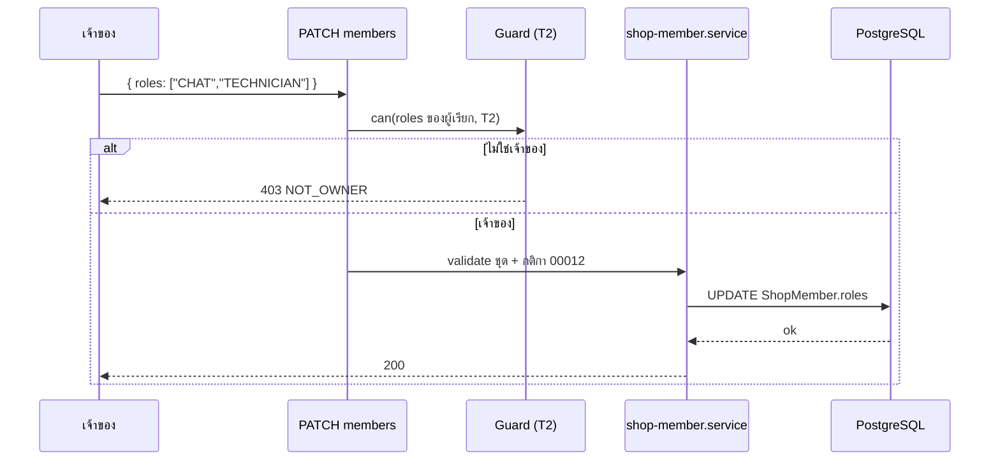

> **โมดูล:** 00071 - Shop Member Roles & Permissions
> **ประเภทเอกสาร:** API Contract
> **เวอร์ชัน:** 1.0
> **วันที่จัดทำ:** 2026-10-10
> **สถานะ:** P1 implement แล้ว (§4.3-§4.4) · **P2 implement แล้ว** (§4.1-§4.2 ตรงโค้ด) · **P3 implement แล้ว** (§4.4-§4.5 ตรงโค้ด — ทะเบียนจริงอยู่ `src/lib/route-capabilities.ts`)
> **เจ้าของเอกสาร:** SA (ดู [[Feature-Docs-Ownership]])

# API Contract: บทบาทและสิทธิ์สมาชิกร้าน

---

## 1. Overview

ฟีเจอร์นี้ **ไม่สร้าง endpoint ใหม่** — ขยาย 3 สัญญาเดิมของ 00008/00012 (P2), ลบ 1 endpoint (P1) และเพิ่มพฤติกรรมปฏิเสธ `403 FORBIDDEN_ROLE` ให้ทุก endpoint ฝั่งร้าน (P1 เฉพาะผิวการเงินเต็ม · P3 ทุก route)

- **เอกสารออกแบบต้นทาง:** [[SDS]] ของโมดูลนี้
- **Provider:** Next.js route handlers (`src/app/api/**`) บน Vercel
- **Base URL:** same-origin (`seller.deepthailand.app` ฯลฯ)
- **Content-Type:** `application/json`
- **Convention:** error ของ route ฝั่งร้านเป็นรูป `{ error: '<CODE>' }` (ไม่ใช่ envelope `error.code` ของ template) ตามที่ route เดิมใช้

---

## 2. Authentication

| รายการ | ค่า |
|--------|-----|
| **วิธี (Auth Method)** | NextAuth session cookie (แยกตาม subdomain) |
| **Header** | cookie ของ session (ไม่มี Bearer) |
| **Token / Scope** | สิทธิ์ตัดสินจากบทบาทใน `ShopMember` ที่อ่านสดต่อคำขอ ตาม capability ของ route (BRD §8.3) |
| **กรณีไม่ผ่าน** | ไม่มี session → `401`; ไม่มีร้าน/ไม่ใช่สมาชิก → ตาม guard เดิม; มีร้านแต่ไม่มีสิทธิ์ตามบทบาท → `403 { error: 'FORBIDDEN_ROLE' }` |

---

## 3. Endpoint List

| Method | Path | คำอธิบาย | Phase |
|--------|------|----------|-------|
| `PATCH` | `/api/business/shops/[shopId]/members/[memberId]` | เปลี่ยน `role` และ/หรือ `roles` ของสมาชิก (เจ้าของเท่านั้น) | P2 ✅ |
| `POST` | `/api/business/shops/[shopId]/invites` | สร้างคำเชิญอีเมล/เบอร์ พร้อม `roles` (00008) | P2 ✅ |
| `POST` | `/api/shops/current/invite-links` | สร้างลิงก์เชิญ พร้อม `roles` (00012) | P2 ✅ |
| `GET` | `/api/business/shops/[shopId]/invites` · `/api/shops/current/invite-links` | คืน `roles` ต่อรายการเพิ่ม | P2 ✅ |
| `POST` | `/api/invites/[inviteId]/accept` | คืน `roles` ที่ได้รับเพิ่ม | P2 ✅ |
| `PATCH` | `/api/business/shops/[shopId]/finance-visibility` | **ลบแล้ว** (สวิตช์ `staffCanViewFinance` ถูกยกเลิก) | P1 ✅ |

---

## 4. Endpoint Detail

### 4.1 `PATCH /api/business/shops/[shopId]/members/[memberId]`

เปลี่ยนบทบาทสมาชิก — **ขยาย** สัญญาเดิมของ 00012 (`{ role }`) ให้รับ `roles` ด้วย · เฉพาะเจ้าของ (T2) · แตะเจ้าของหลักไม่ได้ (`PRIMARY_OWNER_LOCKED`) · ส่งซ้ำด้วยค่าเดิม = ผลเดิม

**Request**

| ส่วน | ฟิลด์ | ชนิด | บังคับ | คำอธิบาย |
|------|-------|------|--------|----------|
| Path Param | `shopId` | `string` | yes | |
| Path Param | `memberId` | `string` | yes | |
| Body | `role` | `'OWNER' \| 'ADMIN'` | no | เจ้าของ vs พนักงาน (ความหมายเดิม) |
| Body | `roles` | `ShopRole[]` | no | พนักงาน: 1-4 ค่าไม่ซ้ำจาก `MANAGER`/`CHAT`/`BILLING`/`TECHNICIAN` · ต้องส่งอย่างน้อย `role` หรือ `roles` |

กฎ (`planMemberRoleChange` ใน `src/lib/shop-role-assignment.ts`):
- ตั้ง `role:'OWNER'` → ล้าง `roles` เป็น `[]` · ส่ง `roles` ไม่ว่างพร้อมผลลัพธ์ OWNER → `INVALID_ROLES`
- `OWNER → ADMIN` โดยไม่ส่ง `roles` → ค่าตั้งต้น `['MANAGER']`
- ส่งเฉพาะ `role:'ADMIN'` กับพนักงานอยู่แล้ว → คง `roles` เดิม (idempotent · ชุดเดิมที่มี BILLING ไม่ถูกตีกลับถ้าไม่ได้ตั้งชุดใหม่)
- `BILLING` ใช้ได้เฉพาะร้านที่ `canUseAppointments(shop)` (vertical `SERVICE_QUEUE`) → ไม่ใช่ = `BILLING_NOT_AVAILABLE`

**Response — Success (200)**

```json
{ "role": "ADMIN", "roles": ["CHAT", "TECHNICIAN"] }
```

**Response — Error** (รูป `{ error: '<CODE>' }`)

| HTTP | `error` | เมื่อ |
|---|---|---|
| 400 | `INVALID_INPUT` | body ไม่ผ่าน valibot (`ChangeMemberRoleSchema`: ไม่ส่ง `role`/`roles` สักตัว · `roles` ว่าง/เกิน 4/ซ้ำ/ค่าไม่รู้จัก) |
| 400 | `INVALID_ROLES` | ชั้น service: ผลลัพธ์เป็น OWNER แต่ส่ง `roles` ไม่ว่าง |
| 400 | `BILLING_NOT_AVAILABLE` | ตั้ง `BILLING` ในร้านที่ไม่ใช่ร้านบริการ |
| 403 | `NOT_OWNER` | ผู้เรียกไม่ใช่เจ้าของ (**ไม่ใช่ `FORBIDDEN_ROLE`** — มติ P2 0.4: ใช้ `NOT_OWNER` เดิมของ 00012) |
| 403 / 404 / 409 | `NOT_PRIMARY_OWNER` · `NOT_A_MEMBER` · `PRIMARY_OWNER_LOCKED` ฯลฯ | เดิมของ 00012 คงเดิม (ตาราง `src/lib/shop-member-errors.ts`) |

**ตัวอย่าง JSON**

```json
// Request
{ "roles": ["CHAT", "TECHNICIAN"] }

// Response 403 (ผู้เรียกไม่ใช่เจ้าของ)
{ "error": "NOT_OWNER" }
```

### 4.2 invite create และ invite-link create

เพิ่ม body ฟิลด์ `roles` (optional) ใน 2 endpoint จริง:

| Endpoint | Body | Success |
|---|---|---|
| `POST /api/business/shops/[shopId]/invites` | `{ contact, contactType: 'PHONE'\|'EMAIL', roles? }` | `201 { inviteId, status }` |
| `POST /api/shops/current/invite-links` (ร้าน active) | `{ expiryKey?: '24h'\|'7d'\|'30d', roles? }` | `201 { url, slug, expiresAt }` |

| ฟิลด์ | ชนิด | คำอธิบาย |
|---|---|---|
| `roles` | `StaffRole[]` | 1-4 ค่าไม่ซ้ำจาก `MANAGER`/`CHAT`/`BILLING`/`TECHNICIAN` · ค่าตั้งต้น `["MANAGER"]` (ไม่ส่ง) · ใส่ `OWNER` ไม่ได้ (เชิญเป็นเจ้าของไม่ได้) · `BILLING` เฉพาะร้านที่ `canUseAppointments` |

Error: `400 VALIDATION_ERROR` (valibot: ชุดว่าง/เกิน/ซ้ำ/ค่าไม่รู้จัก) · `400 INVALID_ROLES` / `400 BILLING_NOT_AVAILABLE` (ชั้น service — `validateAssignableRoles`) · `403 NOT_OWNER` (ไม่ใช่เจ้าของ — ลิงก์: ต้อง `kind=BUSINESS` และ `role=OWNER`) · error เดิมของ 00008/00012 (`NO_ACTIVE_PACKAGE` · `SHOP_LOCKED` · `ADMIN_QUOTA_EXCEEDED` 403 · `INVITE_ALREADY_PENDING` 409) คงเดิม

ผู้ยอมรับ (ผ่าน `POST /api/invites/[inviteId]/accept` หรือเปิดลิงก์ `/i/<slug>`) ได้ `role='ADMIN'` + `roles` คัดลอกจากคำเชิญ/ลิงก์ตอนสร้าง · accept คืน `{ shopId, role: 'ADMIN', roles }` · สมาชิกเดิมที่เปิดลิงก์ซ้ำไม่ถูกเขียนทับ `roles` · `GET` รายการคำเชิญ/ลิงก์คืน `roles` ต่อรายการ

### 4.3 ลบ `PATCH /api/business/shops/[shopId]/finance-visibility` (P1)

ตัด endpoint สลับ `staffCanViewFinance` ออกพร้อมสวิตช์ในหน้าสมาชิก · ลบไฟล์ route ทิ้ง ไม่ทำ 410 — หลังลบได้ 404 ตามปกติของ Next

### 4.4 พฤติกรรมปฏิเสธบน endpoint เดิมอื่น

| Phase | ผิวที่คืน `403 FORBIDDEN_ROLE` เมื่อไม่ใช่เจ้าของ |
|-------|----------------------------------------------------|
| P1 ✅ | ดูตารางสัญญา P1 ด้านล่าง |
| P3 ✅ | ทุก route ฝั่งร้านตาม capability §8.3 (แชท H1-H3 · ออเดอร์ O1-O7 · พัสดุ S1-S2 · สินค้า P1-P3 · ลูกค้า C1-C3 ฯลฯ) — ดู §4.5 |

**สัญญา P1 จริง (จากโค้ด · ผู้ที่ไม่ใช่เจ้าของ):**

| Endpoint | พฤติกรรม |
|---|---|
| `/api/expenses` · `/api/expenses/[id]` · `/api/expenses/report` · `/api/finance/receivables` · `/api/seller/sales-series` | `403 FORBIDDEN_ROLE` |
| `/api/wallet` · `/api/wallet/topup` · `/api/wallet/events` | `403 FORBIDDEN_ROLE` (F3) — เส้นหักเครดิตภายในของ ADMIN ไม่โดนด่าน |
| `POST /api/products` · `PATCH /api/products/[id]` | `403` เมื่อ body มี `cost` |
| `POST /api/inventory/csv/import` | `403` ทั้งคำขอ เมื่อแถวใดมี `cost` (ไม่ทิ้งเงียบ) |
| `GET /api/products` · `SerializedProduct` · CSV export | `cost` เป็น optional — ไม่มีคีย์ |
| `GET/POST /api/orders` · `GET/PATCH /api/orders/[token]` | ไม่มี `items[].cost` · PATCH ทิ้ง `cost` ใน body เงียบ ๆ และคงต้นทุนเดิมของบรรทัด (`keepLineCosts`) |
| `GET /api/chat/ai-quota` | `balance: number \| null` (`null` = ไม่ใช่เจ้าของ) |
| `POST …/ai-suggest` | `402 INSUFFICIENT_CREDIT` ไม่มี `balance` |
| `GET /api/chat/shop-context` | เพิ่ม `canSeeCost` |
| `GET /api/seller/reports/agents*` | โหมด SELF: `revenue` = `null` ทุกชั้น |

ไม่เปลี่ยนรูป request/response ของ endpoint เหล่านั้นนอกจากฟิลด์เงินที่ถูกตัดตาม `moneyLevel` สำหรับผู้ที่ไม่ใช่เจ้าของ

### 4.5 สัญญา P3 จริง (จากโค้ด)

**ด่านและ response ปฏิเสธ** (`requireShopCapability` ใน `src/lib/shop-capability.ts`):

| HTTP | body | เมื่อ |
|---|---|---|
| 401 | `{ error: 'unauthorized' }` | ไม่รู้ตัวตนผู้เรียก |
| 404 | `{ error: 'NO_SHOP' }` | ไม่มีร้านให้ทำงานด้วย |
| 403 | `{ error: 'FORBIDDEN' }` | ไม่ใช่สมาชิกของร้านที่ระบุ (`reason:'NOT_MEMBER'`) — route ที่ระบุทรัพยากร (เช่น `orders/[token]`, `orders/[token]/cancel`) แปลงเป็น **404** ไม่บอกว่ามีอยู่ |
| 403 | `{ error: 'FORBIDDEN_ROLE' }` | เป็นสมาชิกแต่ไม่มี capability |

ทุกตัวส่ง `Cache-Control: private, no-store` · บทบาทอ่านสดจาก `ShopMember` ทุกคำขอ (เปลี่ยนบทบาทแล้วคำขอถัดไปมีผล) · cap ที่ประกาศเป็นอาร์เรย์ต้องผ่านทุกตัว

**ทะเบียน:** path → เมธอด → capability อยู่ใน `ROUTE_CAPABILITIES` (`src/lib/route-capabilities.ts`) ซึ่งเป็น SSOT ของ "route ไหนใช้ cap อะไร" — ไม่คัดลอกซ้ำที่นี่ · route ที่ไม่ใช่ capability ของสมาชิกร้านจัดคลาส `MEMBER`/`SELF`/`BUYER`/`PUBLIC`/`PLATFORM_ADMIN`/`CRON`/`WEBHOOK` พร้อมเหตุผล · route เดียวมีหลายคลาสได้รายเมธอด (`api/chat/conversations` GET = H1, POST = BUYER)

**เปลี่ยนบน endpoint เดิม:**

| Endpoint | สัญญา |
|---|---|
| `GET /api/business/context` | `businesses[].roles: ShopRole[]` เพิ่ม (แสดงผลเท่านั้น) |
| session (NextAuth `session.user`) | `activeShopRoles: ShopRole[] \| null` เพิ่ม (เคียง `activeShopRole`) — แสดงผลเท่านั้น ห้ามใช้ตัดสินสิทธิ์ · `null` = อ่านสมาชิกไม่ได้/ไม่มีร้าน |
| `POST /api/orders` | ด่าน `O2s` · ผู้ที่ไม่มี O2 (BILLING) → บังคับ `type=SERVICE` และปฏิเสธบรรทัดที่อ้างสินค้าไม่ใช่ SERVICE → `403 FORBIDDEN_ROLE` · `conversationId` ถูกทิ้งเงียบถ้าผู้เรียกไม่มี H1 · `shopId` ใน body ระบุร้านปลายทางได้ (ตรวจสิทธิ์ที่ร้านนั้น) |
| `PATCH /api/orders/[token]` | ด่าน `O3` · BILLING แก้ได้เฉพาะ SERVICE ที่ยังไม่ชำระ มิฉะนั้น `403 FORBIDDEN_ROLE` (ไม่มี field บอกเหตุ) |
| `GET /api/orders` · `GET /api/orders/[token]` · นัดหมาย | ผู้ถือเฉพาะ TECHNICIAN (ระดับ NONE) ได้ payload ผ่าน allow-list ไม่มีราคา/ยอด/ชำระ/ต้นทุน |
| แชททั้งกลุ่ม | อ่าน H1 · เขียน H2 · ตั้งค่า/ช่องทาง H3 · เครื่องมือเสริม X2 · กล่องรวม/unread/push กรองรายร้านตาม H1 |
| `ship` · `handover` · `shipment-evidence` · `seller/iship/**` | S1 (สร้างพัสดุ/พิมพ์ป้าย/เลขพัสดุ) · เชื่อม/ตั้งค่า iShip (`connection` POST/DELETE, `connection/verify`, `settings` PUT) = S2 (เจ้าของ + ผู้ดูแล) |
| `orders/[token]/payments/[paymentId]` DELETE · cancel · returns · dispute | O6 (เจ้าของ + ผู้ดูแล) · บันทึกชำระ/COD = O5 |
| `inventory/{subscribe,upgrade,reactivate}` · `seller/pin-slots/buy` | F4 (หักเครดิตกระเป๋า · ไม่เห็นยอด) |

**ที่ไม่ใช่ `FORBIDDEN_ROLE` มาตรฐาน (หนี้):** `orders/[token]/returns` ตอบ `{ error: 'Forbidden' }` และ iShip ตอบ `{ error: { code, message } }` — ดูแผน P3

---

## 5. Error Code Table

| Error Code | HTTP Status | ความหมาย / เงื่อนไข |
|------------|-------------|----------------------|
| `FORBIDDEN_ROLE` | `403` | **ใหม่** — เป็นสมาชิกแต่บทบาทไม่มีสิทธิ์ใน capability นี้ (BR-RP-11) · capability ที่ยังไม่จัดหมวดก็ตอบรหัสนี้ |
| `UNAUTHORIZED` | `401` | ไม่มี session (ด่าน P3 ตอบ `{ error: 'unauthorized' }` ตัวพิมพ์เล็ก) |
| `FORBIDDEN` | `403` | **P3** ไม่ใช่สมาชิกของร้านที่ระบุ (route ที่ระบุทรัพยากรแปลงเป็น 404) |
| `NO_SHOP` | `404` | **P3** ไม่มีร้านให้ทำงานด้วย |
| `NOT_OWNER` / `NOT_PRIMARY_OWNER` | `403` | เดิมของ 00012 — **P2: ใช้กับ PATCH members / สร้างคำเชิญ / สร้างลิงก์ เมื่อผู้เรียกไม่ใช่เจ้าของ** (ไม่ใช้ `FORBIDDEN_ROLE`) |
| `INVALID_ROLES` | `400` | **P2** ผลลัพธ์เป็น OWNER แต่ส่ง `roles` ไม่ว่าง (ชั้น service) |
| `BILLING_NOT_AVAILABLE` | `400` | **P2** `BILLING` ในร้านที่ไม่ใช่ร้านบริการ (`canUseAppointments` = false) |
| `INVALID_INPUT` / `VALIDATION_ERROR` | `400` | **P2** schema ไม่ผ่าน (PATCH members ใช้ `INVALID_INPUT` · invites/invite-links ใช้ `VALIDATION_ERROR`) |
| `PRIMARY_OWNER_LOCKED` | เดิม | เปลี่ยนบทบาท/ลบเจ้าของหลักไม่ได้ |
| `NOT_A_MEMBER` | `404` | เดิม |

**โครง error response มาตรฐาน (ตามที่ route ฝั่งร้านใช้อยู่)**

```json
{ "error": "FORBIDDEN_ROLE" }
```

---

## 6. Sequence (ถ้า flow ซับซ้อน)



---

## 7. Traceability

| Endpoint | SDS Component / Decision | BRD FR |
|----------|--------------------------|--------|
| `PATCH members/[memberId]` | `shop-member.service` / TD-001 | FR-RP-01, FR-RP-08 |
| invite create / invite-link create | Invite services / TD-001 | FR-RP-08, FR-RP-10 |
| ลบ `finance-visibility` | Finance access / TD-003 | FR-RP-04 |
| พฤติกรรม `FORBIDDEN_ROLE` | Guard / TD-005 / Flow 4.1 | FR-RP-02, FR-RP-03 |

---

## 8. สรุป (Summary)

เอกสาร API Contract นี้กำหนด **สัญญาการเชื่อมต่อ** ของ **บทบาทและสิทธิ์สมาชิกร้าน (00071)** ให้ชัดพอที่ DEV นำไป implement ได้ QA ใช้ตารางข้อ 5 วางแผนทดสอบ negative case และทุก endpoint trace กลับ [[SDS]] ได้

**Open Questions:**
- ~~path ของ invite create / invite-link create และรูป response~~ — ยืนยันจากโค้ดแล้ว (§4.2)
- ~~finance-visibility 404 หรือ 410~~ — ตัดสินแล้ว: ลบ route = 404
- ~~รายการ path API การเงินเต็ม~~ — ตัดสินแล้ว (ตารางสัญญา P1 §4.4)
