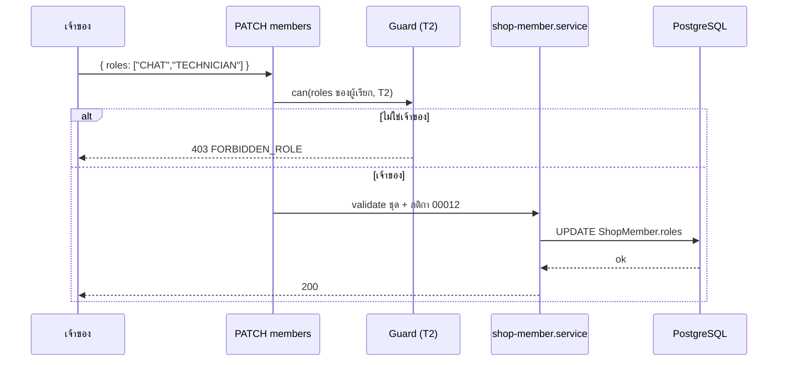

> **โมดูล:** 00071 - Shop Member Roles & Permissions
> **ประเภทเอกสาร:** API Contract
> **เวอร์ชัน:** 1.0
> **วันที่จัดทำ:** 2026-10-10
> **สถานะ:** P1 implement แล้ว (§4.3-§4.4) · P2/P3 ยังเป็นสัญญาก่อน implement
> **เจ้าของเอกสาร:** SA (ดู [[Feature-Docs-Ownership]])

# API Contract: บทบาทและสิทธิ์สมาชิกร้าน

---

## 1. Overview

ฟีเจอร์นี้ **ไม่สร้าง endpoint ใหม่** — ขยาย 3 สัญญาเดิมของ 00008/00012 (P2), ลบ 1 endpoint (P1) และเพิ่มพฤติกรรมปฏิเสธ `403 FORBIDDEN_ROLE` ให้ทุก endpoint ฝั่งร้าน (P1 เฉพาะผิวการเงินเต็ม · P3 ทุก route)

- **เอกสารออกแบบต้นทาง:** [[SDS]] ของโมดูลนี้
- **Provider:** Next.js route handlers (`src/app/api/**`) บน Vercel
- **Base URL:** same-origin (`seller.deepthailand.app` ฯลฯ)
- **Content-Type:** `application/json`
- **Convention:** error ของ route ฝั่งร้านเป็นรูป `{ error: '<CODE>' }` (ไม่ใช่ envelope `error.code` ของ template) ตามที่ route เดิมใช้

---

## 2. Authentication

| รายการ | ค่า |
|--------|-----|
| **วิธี (Auth Method)** | NextAuth session cookie (แยกตาม subdomain) |
| **Header** | cookie ของ session (ไม่มี Bearer) |
| **Token / Scope** | สิทธิ์ตัดสินจากบทบาทใน `ShopMember` ที่อ่านสดต่อคำขอ ตาม capability ของ route (BRD §8.3) |
| **กรณีไม่ผ่าน** | ไม่มี session → `401`; ไม่มีร้าน/ไม่ใช่สมาชิก → ตาม guard เดิม; มีร้านแต่ไม่มีสิทธิ์ตามบทบาท → `403 { error: 'FORBIDDEN_ROLE' }` |

---

## 3. Endpoint List

| Method | Path | คำอธิบาย | Phase |
|--------|------|----------|-------|
| `PATCH` | `/api/business/shops/[shopId]/members/[memberId]` | เปลี่ยน `role` และ/หรือ `roles` ของสมาชิก (เจ้าของเท่านั้น) | P2 |
| `POST` | invite create (path เดิมของ 00008) | สร้างคำเชิญอีเมล/เบอร์ พร้อม `roles` | P2 |
| `POST` | invite-link create (path เดิมของ 00012) | สร้างลิงก์เชิญ พร้อม `roles` | P2 |
| `PATCH` | `/api/business/shops/[shopId]/finance-visibility` | **ลบแล้ว** (สวิตช์ `staffCanViewFinance` ถูกยกเลิก) | P1 ✅ |

path ของสอง invite endpoint ยืนยันจากโค้ดจริงตอน implement P2 (ไม่ระบุที่นี่เพื่อไม่เดา)

---

## 4. Endpoint Detail

### 4.1 `PATCH /api/business/shops/[shopId]/members/[memberId]`

เปลี่ยนบทบาทสมาชิก — **ขยาย** สัญญาเดิมของ 00012 (`{ role }`) ให้รับ `roles` ด้วย · เฉพาะเจ้าของ (T2) · แตะเจ้าของหลักไม่ได้ (`PRIMARY_OWNER_LOCKED`) · ส่งซ้ำด้วยค่าเดิม = ผลเดิม

**Request**

| ส่วน | ฟิลด์ | ชนิด | บังคับ | คำอธิบาย |
|------|-------|------|--------|----------|
| Path Param | `shopId` | `string` | yes | |
| Path Param | `memberId` | `string` | yes | |
| Body | `role` | `'OWNER' \| 'ADMIN'` | no | เจ้าของ vs พนักงาน (ความหมายเดิม) |
| Body | `roles` | `ShopRole[]` | no | พนักงาน: 1-4 ค่าไม่ซ้ำจาก `MANAGER`/`CHAT`/`BILLING`/`TECHNICIAN` · ต้องส่งอย่างน้อย `role` หรือ `roles` |

กฎ: ตั้ง `role:'OWNER'` → ล้าง `roles` เป็น `[]` · ส่ง `roles` กับสมาชิกที่เป็น/กำลังเป็น OWNER → 400 · `BILLING` ในร้านที่ไม่มีบริการ → 400

**Response — Success (200)**

รูปเดิมของ endpoint (ไม่เปลี่ยน) — ยืนยันตอน implement P2

**Response — Error**

`403 FORBIDDEN_ROLE` (ไม่ใช่เจ้าของ) · `400` ชุดว่าง/เกิน 4/ซ้ำ/ค่าไม่รู้จัก/OWNER+roles/BILLING ร้านไม่มีบริการ (รหัสข้อความย่อยกำหนดตอน implement P2) · error เดิมของ 00012 (`PRIMARY_OWNER_LOCKED` · `NOT_A_MEMBER` 404 · อื่น ๆ 409) คงเดิม

**ตัวอย่าง JSON**

```json
// Request
{ "roles": ["CHAT", "TECHNICIAN"] }

// Response 403 (ผู้เรียกไม่ใช่เจ้าของ)
{ "error": "FORBIDDEN_ROLE" }
```

### 4.2 invite create และ invite-link create

เพิ่ม body ฟิลด์ `roles` (optional) ใน 2 endpoint เดิม

| ส่วน | ฟิลด์ | ชนิด | บังคับ | คำอธิบาย |
|------|-------|------|--------|----------|
| Body | `roles` | `ShopRole[]` | no | 1-4 ค่าจาก `MANAGER`/`CHAT`/`BILLING`/`TECHNICIAN` · ค่าตั้งต้น `["MANAGER"]` · ใส่ `OWNER` ไม่ได้ (เชิญเป็นเจ้าของไม่ได้) |

ผู้ยอมรับคำเชิญได้ชุด `roles` ตามคำเชิญ (`role='ADMIN'`) · ฟิลด์ response เดิมคงไว้ — ถ้ามีการคืน `roles` เพิ่ม ยืนยันตอน implement P2 · error: `403 FORBIDDEN_ROLE` · `400` ชุดไม่ถูกต้อง/BILLING ร้านไม่มีบริการ

### 4.3 ลบ `PATCH /api/business/shops/[shopId]/finance-visibility` (P1)

ตัด endpoint สลับ `staffCanViewFinance` ออกพร้อมสวิตช์ในหน้าสมาชิก · ลบไฟล์ route ทิ้ง ไม่ทำ 410 — หลังลบได้ 404 ตามปกติของ Next

### 4.4 พฤติกรรมปฏิเสธบน endpoint เดิมอื่น

| Phase | ผิวที่คืน `403 FORBIDDEN_ROLE` เมื่อไม่ใช่เจ้าของ |
|-------|----------------------------------------------------|
| P1 ✅ | ดูตารางสัญญา P1 ด้านล่าง |
| P3 | ทุก route ฝั่งร้านตาม capability §8.3 (แชท H1-H3 · ออเดอร์ O1-O7 · พัสดุ S1-S2 · สินค้า P1-P3 · ลูกค้า C1-C3 ฯลฯ) |

**สัญญา P1 จริง (จากโค้ด · ผู้ที่ไม่ใช่เจ้าของ):**

| Endpoint | พฤติกรรม |
|---|---|
| `/api/expenses` · `/api/expenses/[id]` · `/api/expenses/report` · `/api/finance/receivables` · `/api/seller/sales-series` | `403 FORBIDDEN_ROLE` |
| `/api/wallet` · `/api/wallet/topup` · `/api/wallet/events` | `403 FORBIDDEN_ROLE` (F3) — เส้นหักเครดิตภายในของ ADMIN ไม่โดนด่าน |
| `POST /api/products` · `PATCH /api/products/[id]` | `403` เมื่อ body มี `cost` |
| `POST /api/inventory/csv/import` | `403` ทั้งคำขอ เมื่อแถวใดมี `cost` (ไม่ทิ้งเงียบ) |
| `GET /api/products` · `SerializedProduct` · CSV export | `cost` เป็น optional — ไม่มีคีย์ |
| `GET/POST /api/orders` · `GET/PATCH /api/orders/[token]` | ไม่มี `items[].cost` · PATCH ทิ้ง `cost` ใน body เงียบ ๆ และคงต้นทุนเดิมของบรรทัด (`keepLineCosts`) |
| `GET /api/chat/ai-quota` | `balance: number \| null` (`null` = ไม่ใช่เจ้าของ) |
| `POST …/ai-suggest` | `402 INSUFFICIENT_CREDIT` ไม่มี `balance` |
| `GET /api/chat/shop-context` | เพิ่ม `canSeeCost` |
| `GET /api/seller/reports/agents*` | โหมด SELF: `revenue` = `null` ทุกชั้น |

ไม่เปลี่ยนรูป request/response ของ endpoint เหล่านั้นนอกจากฟิลด์เงินที่ถูกตัดตาม `moneyLevel` สำหรับผู้ที่ไม่ใช่เจ้าของ

---

## 5. Error Code Table

| Error Code | HTTP Status | ความหมาย / เงื่อนไข |
|------------|-------------|----------------------|
| `FORBIDDEN_ROLE` | `403` | **ใหม่** — เป็นสมาชิกแต่บทบาทไม่มีสิทธิ์ใน capability นี้ (BR-RP-11) · capability ที่ยังไม่จัดหมวดก็ตอบรหัสนี้ |
| `UNAUTHORIZED` | `401` | ไม่มี session |
| `NOT_OWNER` / `NOT_PRIMARY_OWNER` | `403` | เดิมของ 00012 (ยังใช้กับกติกาเจ้าของ/เจ้าของหลัก) |
| `PRIMARY_OWNER_LOCKED` | เดิม | เปลี่ยนบทบาท/ลบเจ้าของหลักไม่ได้ |
| `NOT_A_MEMBER` | `404` | เดิม |
| `VALIDATION` (รหัสย่อยกำหนดตอน implement P2) | `400` | `roles` ว่าง/เกิน 4/ซ้ำ/ไม่รู้จัก · OWNER+roles · BILLING ร้านไม่มีบริการ |

**โครง error response มาตรฐาน (ตามที่ route ฝั่งร้านใช้อยู่)**

```json
{ "error": "FORBIDDEN_ROLE" }
```

---

## 6. Sequence (ถ้า flow ซับซ้อน)



---

## 7. Traceability

| Endpoint | SDS Component / Decision | BRD FR |
|----------|--------------------------|--------|
| `PATCH members/[memberId]` | `shop-member.service` / TD-001 | FR-RP-01, FR-RP-08 |
| invite create / invite-link create | Invite services / TD-001 | FR-RP-08, FR-RP-10 |
| ลบ `finance-visibility` | Finance access / TD-003 | FR-RP-04 |
| พฤติกรรม `FORBIDDEN_ROLE` | Guard / TD-005 / Flow 4.1 | FR-RP-02, FR-RP-03 |

---

## 8. สรุป (Summary)

เอกสาร API Contract นี้กำหนด **สัญญาการเชื่อมต่อ** ของ **บทบาทและสิทธิ์สมาชิกร้าน (00071)** ให้ชัดพอที่ DEV นำไป implement ได้ QA ใช้ตารางข้อ 5 วางแผนทดสอบ negative case และทุก endpoint trace กลับ [[SDS]] ได้

**Open Questions:**
- path ที่แน่นอนของ invite create / invite-link create และรูป response — ยืนยันจากโค้ดตอน implement P2
- ~~finance-visibility 404 หรือ 410~~ — ตัดสินแล้ว: ลบ route = 404
- ~~รายการ path API การเงินเต็ม~~ — ตัดสินแล้ว (ตารางสัญญา P1 §4.4)
