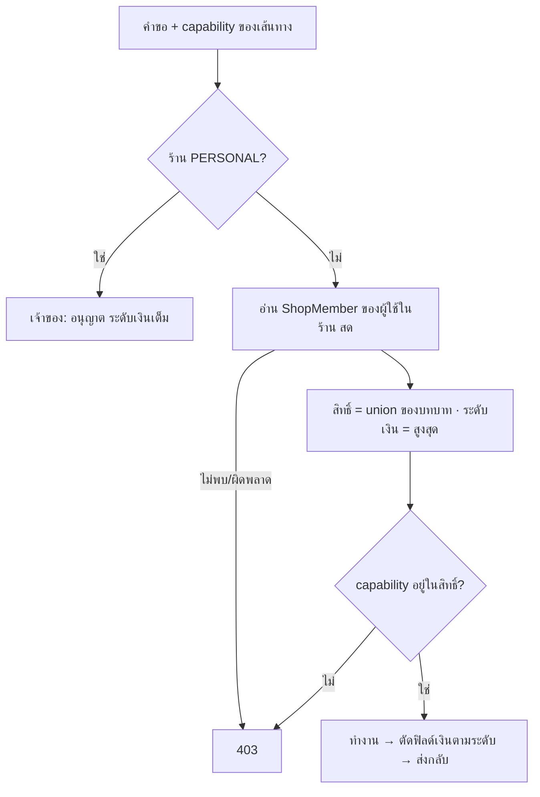
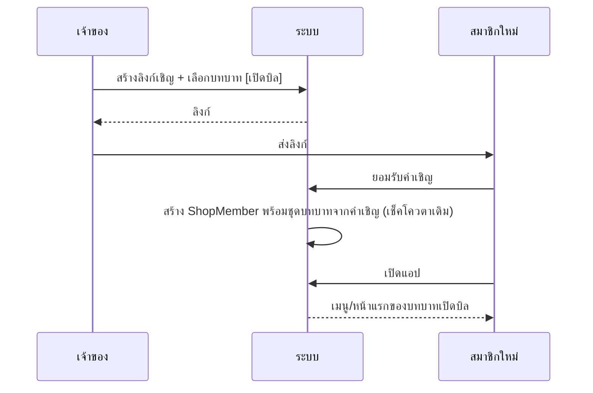

> **โมดูล:** 00071 - Shop Member Roles & Permissions
> **ประเภทเอกสาร:** Business Requirements Document (BRD)
> **เวอร์ชัน:** 2.0
> **วันที่จัดทำ:** 2026-10-10
> **สถานะ:** Approved — user อนุมัติ 2026-10-10 ใช้ค่าแนะนำทุกข้อ (Q-1..Q-7)
> **เจ้าของเอกสาร:** BA + PO + PM (ดู [[Feature-Docs-Ownership]])

# BRD: บทบาทและสิทธิ์สมาชิกร้าน (Business Requirements Document)

---

## 1. บทนำ

### 1.1 วัตถุประสงค์ของเอกสาร

กำหนดกฎทางธุรกิจของบทบาทสมาชิกร้าน 5 บทบาท ตารางสิทธิ์ที่เป็น SSOT ระดับการเห็นตัวเลขเงิน และการแสดงผลบนมือถือ ให้ทีมพัฒนาสร้างและทดสอบได้ตรงกัน

### 1.2 ขอบเขตของระบบ

**อยู่ในขอบเขต:**
- บทบาท เจ้าของ / ผู้ดูแล / ตอบแชท / เปิดบิล / ฝ่ายช่าง · ถือหลายบทบาทต่อร้าน
- ตัวตัดสินสิทธิ์กลางที่เซิร์ฟเวอร์ ใช้กับทุกหน้าและ API ของฝั่งผู้ขาย
- ระดับการเห็นตัวเลขเงิน (เต็ม / รายใบ / ไม่มี) ตัดที่ข้อมูลต้นทาง
- เมนูเดสก์ท็อป + มือถือ (แถบล่าง ปุ่มสร้าง หน้าแรก ทางลัด หน้า "ร้าน") ตามบทบาท
- เลือกบทบาทตอนเชิญ / เปลี่ยนในตารางสมาชิก
- ย้ายข้อมูล ADMIN เดิม → [ผู้ดูแล] และยกเลิกสวิตช์ `staffCanViewFinance`

**นอกขอบเขต:** ดู [[PRD]] §5

### 1.3 กลุ่มผู้ใช้งาน

| กลุ่ม | บทบาทในระบบ |
|---|---|
| เจ้าของ (หลัก/ร่วม) | มอบบทบาท ดูการเงินเต็ม |
| ผู้ดูแล | งานร้านประจำวัน |
| ตอบแชท | แชท + สร้างรายการ |
| เปิดบิล | สร้างบิลบริการ |
| ฝ่ายช่าง | อัปเดตงาน |

---

## 2. ความต้องการหลัก (Functional Requirements)

### 2.1 โมเดลบทบาท

#### FR-RP-01: ถือหลายบทบาทต่อร้าน

**คำอธิบาย:** สมาชิกที่ไม่ใช่เจ้าของถือชุดบทบาท 1-4 บทบาทจาก {ผู้ดูแล, ตอบแชท, เปิดบิล, ฝ่ายช่าง} แยกรายร้าน

**Acceptance Criteria:**
- [ ] ชุดว่างบันทึกไม่ได้
- [ ] เจ้าของบันทึกพร้อมบทบาทอื่นไม่ได้ (เลื่อนเป็นเจ้าของ = ล้างชุดบทบาท)
- [ ] ร้านที่ไม่มีบริการ เลือก "เปิดบิล" ไม่ได้ (BR-RP-07)

#### FR-RP-02: ตัวตัดสินสิทธิ์กลาง

**คำอธิบาย:** ทุกหน้าและ API ของร้านประกาศ capability (ตาม §8.3) แล้วถามตัวตัดสินกลางด้วยบทบาทที่อ่านสดจากฐานข้อมูล

**Acceptance Criteria:**
- [ ] ไม่มีสิทธิ์ → API 403 `FORBIDDEN_ROLE` · หน้า RSC แสดงหน้าแจ้งไม่มีสิทธิ์ (ไม่ใช่ 404 เงียบ)
- [ ] เปลี่ยนบทบาทแล้วคำขอถัดไปใช้สิทธิ์ใหม่ ไม่ต้องเข้าระบบใหม่
- [ ] อ่านบทบาทผิดพลาด/ไม่ใช่สมาชิก → ปฏิเสธ (ไม่ fallback เป็นเจ้าของ)
- [ ] มีเทสที่แดงเมื่อพบ route ร้านที่ไม่ประกาศ capability

### 2.2 การเงิน

#### FR-RP-03: ระดับการเห็นตัวเลขเงิน

**คำอธิบาย:** ข้อมูลที่ออกจาก service ถูกตัดตามระดับ (§8.2) ก่อนถึง UI/API

**Acceptance Criteria:**
- [ ] ระดับ "ไม่มี": payload ออเดอร์/นัดหมาย/สินค้าไม่มีฟิลด์ราคา ยอด การชำระ ต้นทุน
- [ ] ระดับ "รายใบ": มีราคาขาย ยอดและการชำระรายใบ ไม่มีต้นทุน/กำไร/ยอดรวมหลายใบ/ยอดสะสมลูกค้า/ยอดกระเป๋า
- [ ] ระดับ "เต็ม": เหมือนวันนี้
- [ ] หน้า `/sales` `/expenses` `/reports/*` และ API การเงิน → เจ้าของเท่านั้น

#### FR-RP-04: ยกเลิกสวิตช์ `staffCanViewFinance`

**Acceptance Criteria:**
- [ ] สวิตช์หายจากหน้าสมาชิก API ของสวิตช์ตอบ 410 หรือถูกลบ
- [ ] ตัวตัดสิน `expense/agent-report/product-report access` ใช้กฎ "การเงินเต็ม = เจ้าของ" แทนธง

### 2.3 แชทและการสร้างรายการ

#### FR-RP-05: ตอบแชท

**Acceptance Criteria:**
- [ ] เห็นทุกห้องของร้านที่ตนมีสิทธิ์แชท รวมกล่องรวมหลายร้าน ตัวเลขยังไม่อ่าน และแจ้งเตือน
- [ ] ส่งข้อความในห้องได้แม้ไม่ใช่เจ้าของหลัก
- [ ] สร้างออเดอร์ทุกประเภทจากแชทและจากหน้าสร้างออเดอร์ได้

#### FR-RP-06: เปิดบิล

**Acceptance Criteria:**
- [ ] สร้างออเดอร์ได้เฉพาะ `type = SERVICE` — ส่งประเภทอื่นมาที่ API → 403
- [ ] หน้าสร้างออเดอร์แสดงเฉพาะสินค้า/บริการประเภทบริการ
- [ ] เข้าแชท/กล่องรวม/แจ้งเตือนแชทไม่ได้
- [ ] พิมพ์ใบเสร็จได้

### 2.4 งานช่าง

#### FR-RP-07: ฝ่ายช่าง

**Acceptance Criteria:**
- [ ] เห็นรายการออเดอร์/นัดหมายทั้งหมดของร้าน ไม่มีตัวเลขเงิน
- [ ] เปลี่ยนสถานะออเดอร์ (ยกเว้นยกเลิก/คืนเงิน) และบันทึกสถานะ/ผลการเข้ารับบริการได้
- [ ] แก้รายการ ราคา ลูกค้า การชำระ ไม่ได้ (403)

### 2.5 การมอบบทบาทและมือถือ

#### FR-RP-08: เชิญและเปลี่ยนบทบาท

**Acceptance Criteria:**
- [ ] คำเชิญอีเมลและลิงก์เชิญเก็บชุดบทบาท (ค่าตั้งต้น [ผู้ดูแล]) ผู้รับได้ชุดนั้นตอนยอมรับ
- [ ] ตารางสมาชิกแก้ชุดบทบาทได้ แสดงคำอธิบายสั้นของแต่ละบทบาท
- [ ] เฉพาะเจ้าของทำได้ (BR-MR-01/07 คงเดิม)

#### FR-RP-09: เมนูเดสก์ท็อปและมือถือตามบทบาท

**Acceptance Criteria:**
- [ ] sidebar · ChatNavRail · แถบล่างมือถือ · ปุ่มสร้าง (FAB) · หน้าแรก (Command Center) · ทางลัดที่ปักหมุด · หน้า "ร้าน" อ่านกฎจากที่เดียว
- [ ] แถบล่างตาม §8.5 · ทางลัดที่ปักหมุดไว้แต่ไม่มีสิทธิ์แล้ว ซ่อนอัตโนมัติ
- [ ] หน้าแรกของระดับเงิน "รายใบ"/"ไม่มี" ไม่มีกราฟยอดขาย ยอดกระเป๋า และตัวเลขสินค้าขายดี

#### FR-RP-10: ย้ายข้อมูล

**Acceptance Criteria:**
- [ ] สมาชิก ADMIN เดิมทุกคน → [ผู้ดูแล] · คำเชิญ/ลิงก์ที่ค้าง → [ผู้ดูแล]
- [ ] migration เป็นแบบ additive ไม่ลบข้อมูล ย้อนกลับได้

---

## 3. Acceptance Criteria สรุป

### 3.1 สิทธิ์และการเงิน
- [ ] ทุกคู่ (บทบาท × capability) ใน §8.3 ผ่านเทสฟังก์ชันตัดสินกลาง
- [ ] ไม่มีบทบาทใดนอกจากเจ้าของเรียกข้อมูลการเงินเต็มสำเร็จ
- [ ] ถือหลายบทบาท = ผลรวม (union) และระดับเงินสูงสุด

### 3.2 มือถือและการเปลี่ยนแปลง
- [ ] เมนูมือถือแต่ละบทบาทตรง §8.5
- [ ] ผู้ดูแลเดิมทำงานที่เคยทำได้ทั้งหมด ยกเว้นการเงินเต็ม

---

## 4. Business Flows (กระบวนการทำงาน)

### 4.1 Flow หลัก: ตัดสินสิทธิ์ต่อคำขอ

### 4.2 เชิญและมอบบทบาท

---

## 5. Use Case Scenarios (สถานการณ์การใช้งานจริง)

### Scenario 1: ร้านบริการ — เปิดบิล + ช่าง

**สถานการณ์:** ร้านคาร์แคร์มี น้องเอ [เปิดบิล] และ ช่างบี [ฝ่ายช่าง]

**ผลลัพธ์ที่คาดหวัง:**
- น้องเอเปิดบิลล้างรถ พิมพ์ใบเสร็จ ไม่เห็นแชท แดชบอร์ดไม่มียอดขาย
- ช่างบีเห็นงานล้างรถในรายการ ไม่เห็นราคา กดเปลี่ยนสถานะ/บันทึกผลเข้ารับบริการ
- น้องเอยิง API สร้างออเดอร์ `PHYSICAL` → 403

### Scenario 2: แอดมินแชท + ช่างในคนเดียว

**สถานการณ์:** ร้านเล็ก "ซี" ถือ [ตอบแชท, ฝ่ายช่าง]

**ผลลัพธ์ที่คาดหวัง:**
- ตอบแชท สร้างออเดอร์ อัปเดตสถานะงานได้ · ระดับเงิน = รายใบ (สูงสุดของสองบทบาท)
- ไม่เห็นหน้ายอดขาย/ค่าใช้จ่าย/กำไร

### Scenario 3: เจ้าของถอดบทบาทระหว่างใช้งาน

**สถานการณ์:** "ซี" เปิดห้องแชทค้างไว้ เจ้าของถอด [ตอบแชท] ออก

**ผลลัพธ์ที่คาดหวัง:**
- ข้อความถัดไปที่ "ซี" ส่ง → 403 พร้อมข้อความว่าไม่มีสิทธิ์แชทแล้ว · รีเฟรชแล้วเมนูแชทหาย

### Scenario 4: ผู้ดูแลเดิมหลังขึ้นระบบ

**ผลลัพธ์ที่คาดหวัง:**
- ทำงานออเดอร์ สินค้า ลูกค้า แชท ตั้งค่าร้านได้เหมือนเดิม
- เมนู "ยอดขาย" "ค่าใช้จ่าย" "รายงาน" หาย · แดชบอร์ดไม่มีรายรับ/กำไร · บัตรกำไรในหน้าออเดอร์หาย

---

## 6. ความต้องการด้านคุณภาพ (Quality Requirements)

### 6.1 ความถูกต้องของข้อมูล
- ตารางสิทธิ์มีที่เดียว (ฟังก์ชันบริสุทธิ์ใน `src/lib`) ทุกที่อ่านจากนั้น

### 6.2 ความรวดเร็ว
- อ่านบทบาทเพิ่มไม่เกิน 1 query ต่อคำขอ (รวมกับที่ `resolveActiveShopContext` อ่าน `ShopMember` อยู่แล้ว)

### 6.3 ความน่าเชื่อถือ
- fail-closed: ผิดพลาด = ปฏิเสธ

### 6.4 ความปลอดภัย
- ตัดฟิลด์เงินที่ service/DAL ไม่ใช่ซ่อนที่ UI · การซ่อนเมนูไม่ใช่ตัวกั้น

### 6.5 ความสะดวกในการใช้งาน (Usability)
- หน้าแจ้งไม่มีสิทธิ์บอกว่าต้องขอบทบาทไหนจากเจ้าของ · ตัวเลือกบทบาทมีคำอธิบายบรรทัดเดียว

---

## 7. ข้อจำกัด (Constraints)

### 7.1 ข้อจำกัดทางธุรกิจ
- 5 บทบาทตายตัว · ไม่มีการมอบหมายงาน/ห้องรายคน · ร้าน PERSONAL ไม่มีบทบาท

### 7.2 ข้อจำกัดทางเทคนิค
- push `main` = `prisma migrate deploy` บน prod (HR15) · migration ต้อง additive
- route ฝั่งร้านจำนวนมากใช้ `requireActiveShop`/`requireShopMember`/`canAccessShop` ที่เช็คแค่ความเป็นสมาชิก ต้องไล่จัดหมวดทั้งหมด
- แอป DeepSellerApp ห่อเว็บเดียวกัน — ไม่ต้องแก้แอปแยก

---

## 8. กฎทางธุรกิจ (Business Rules)

### 8.1 โมเดลบทบาท
- **BR-RP-01** บทบาท: เจ้าของ (`OWNER`), ผู้ดูแล (`MANAGER`), ตอบแชท (`CHAT`), เปิดบิล (`BILLING`), ฝ่ายช่าง (`TECHNICIAN`) — รหัสสุดท้ายกำหนดใน SRS
- **BR-RP-02** ไม่ใช่เจ้าของ ถือ 1-4 บทบาทต่อร้าน ชุดว่างไม่ได้
- **BR-RP-03** สิทธิ์ = union ของทุกบทบาท · ระดับเงิน = สูงสุดของทุกบทบาท
- **BR-RP-04** เจ้าของไม่ถือบทบาทอื่นร่วม · เจ้าของหลัก (`Shop.userId`) เป็นเจ้าของเสมอ (BR-MR-02)
- **BR-RP-05** ร้าน PERSONAL = เจ้าของเสมอ
- **BR-RP-06** ผู้ดูแล = สิทธิ์ ADMIN วันนี้ ลบการเงินเต็ม
- **BR-RP-07** "เปิดบิล" เลือกได้เฉพาะร้านที่ขายบริการได้ · สร้างได้เฉพาะ `Order.type = SERVICE`

### 8.2 ระดับการเห็นตัวเลขเงิน
- **BR-RP-08** เต็ม = เจ้าของ · รายใบ = ผู้ดูแล ตอบแชท เปิดบิล · ไม่มี = ฝ่ายช่าง
- **BR-RP-09** "การเงินเต็ม" = ยอดขาย/รายรับรวมหลายใบ กำไร/P&L ต้นทุนสินค้าและต้นทุนรายบรรทัด ค่าใช้จ่าย ลูกหนี้ รายงานเอเจนต์/สินค้าที่มีรายได้ แท็บการเงินร้านบริการ ยอดใช้จ่ายสะสมของลูกค้า ยอดกระเป๋า SMS
- **BR-RP-10** ยกเลิก `staffCanViewFinance`
- **BR-RP-11** capability ที่ยังไม่จัดหมวด = เจ้าของเท่านั้น · ไม่มีสิทธิ์ = 403 `FORBIDDEN_ROLE`

### 8.3 ตารางสิทธิ์ (SSOT)

Y = ได้ · - = ไม่ได้ · "เจ้าของ" รวมเจ้าของร่วม ยกเว้นแถว T4

| รหัส | capability | เจ้าของ | ผู้ดูแล | ตอบแชท | เปิดบิล | ฝ่ายช่าง |
|---|---|---|---|---|---|---|
| H1 | อ่านแชททุกห้อง กล่องรวม แจ้งเตือน ความคิดเห็น ติดตามลูกค้า | Y | Y | Y | - | - |
| H2 | ตอบ/ส่งไฟล์/ปิดห้อง | Y | Y | Y | - | - |
| H3 | ตั้งค่าบอท/ตอบอัตโนมัติ/AI/ice breakers/เชื่อม-ตัดช่องทาง | Y | Y | - | - | - |
| O1 | ดูรายการ/รายละเอียดออเดอร์และนัดหมาย | Y | Y | Y | Y | Y |
| O2 | สร้างออเดอร์ทุกประเภท (รวมสร้างด่วน/จากแชท) | Y | Y | Y | - | - |
| O2s | สร้างออเดอร์บริการ | Y | Y | Y | Y | - |
| O3 | แก้รายการ/ราคา/ลูกค้าของออเดอร์ | Y | Y | Y | Y เฉพาะบริการที่ยังไม่ชำระ | - |
| O4 | เปลี่ยนสถานะออเดอร์ · สถานะ/ผลเข้ารับบริการ (ไม่รวมจัดส่ง — ดู S1) | Y | Y | Y | - | Y |
| O5 | บันทึก/ยืนยันการชำระ · COD ได้รับเงิน | Y | Y | Y | Y | - |
| O6 | ยกเลิก/คืนเงิน/ข้อพิพาท/คืนสินค้า | Y | Y | - | - | - |
| O7 | ส่ง SMS ลิงก์ · ตั้งลิงก์เข้าถึงออเดอร์ | Y | Y | Y | Y | - |
| D1 | พิมพ์ใบเสร็จ/เอกสารออเดอร์ | Y | Y | Y | Y | - |
| S1 | จัดส่ง: สร้างพัสดุ iShip/พิมพ์ป้าย/กรอกเลขพัสดุ/ส่งมอบ/หลักฐานจัดส่ง | Y | Y | Y | - | - |
| S2 | เชื่อม/ตั้งค่า iShip | Y | Y | - | - | - |
| P1 | ดูสินค้า/บริการ + ราคาขาย | Y | Y | Y | Y (เฉพาะบริการ) | - |
| P2 | สร้าง/แก้/ลบ/ปักหมุดสินค้า หมวดหมู่ สต็อก | Y | Y | - | - | - |
| P3 | ดู/แก้ต้นทุนสินค้า | Y | - | - | - | - |
| Q1 | ดูคิว/ปฏิทิน/ห้อง/งานแม่บ้าน | Y | Y | Y | Y | Y |
| Q2 | ตั้งค่าคิว/ประเภทงาน/ห้อง/ทรัพยากรบริการ | Y | Y | - | - | - |
| C1 | ดูรายชื่อ/โปรไฟล์ลูกค้า (mask เดิม ไม่มียอดสะสม) | Y | Y | Y | Y | - |
| C2 | สร้างลูกค้าระหว่างสร้างออเดอร์ | Y | Y | Y | Y | - |
| C3 | แก้/ลบ/รวมลูกค้า | Y | Y | - | - | - |
| F1 | การเงินเต็ม (BR-RP-09) ทุกหน้า/API | Y | - | - | - | - |
| F2 | บันทึก/แก้ค่าใช้จ่าย | Y | - | - | - | - |
| F3 | กระเป๋า SMS: ดูยอด/เติมเงิน | Y | - | - | - | - |
| F4 | ใช้เครดิตกระเป๋าซื้อฟีเจอร์ร้าน (สมัคร/อัปเกรดคลังสินค้า, ซื้อสล็อตปักหมุด) — ไม่เห็นยอด | Y | Y | - | - | - |
| T1 | โปรไฟล์ร้าน/หน้าร้าน/page builder/วิดีโอ/รีวิว/ยืนยันตัวตน | Y | Y | - | - | - |
| T2 | สมาชิก/เชิญ/เปลี่ยนบทบาท/ลบสมาชิก | Y | - | - | - | - |
| T3 | บัญชีรับเงิน (payout) — การตั้งค่าการจัดส่ง (iShip) ย้ายไป S2 ตามมติ C-2 | Y | - | - | - | - |
| T4 | แพ็กเกจ/โอนเจ้าของหลัก/ลบ-กู้คืนร้าน/รายงาน LINE กลุ่ม/แผนตรวจสอบร้าน | เจ้าของหลักเท่านั้น | - | - | - | - |
| X1 | ประมูลผู้ขาย (สร้าง/แก้/ปิด) | Y | Y | - | - | - |
| X2 | เครื่องมือแชทเสริม: ข้อความด่วน/แท็ก/กลุ่ม/คลังไฟล์/ค่ากล่องแชท/เปิด-ปิดตอบอัตโนมัติรายห้อง/ติดตามลูกค้า — อ่านตาม H1 เขียนตาม H2 | Y | Y | Y | - | - |
| X3 | สร้างออเดอร์อัตโนมัติจากแชท (ตั้งค่า) | Y | Y | - | - | - |
| X4 | ผลงานตัวเองในรายงานแอดมิน (โหมด SELF) | Y | Y | Y | - | - |
| X5 | โปรไฟล์ใบเสร็จของร้าน | Y | Y | - | - | - |
| X6 | ดูแผนตรวจสอบร้าน (อ่านอย่างเดียว · การกระทำ = T4) — มติ C-13 | Y | Y | - | - | - |

มติ 2026-10-10 (P3 C-1/C-2/C-5/C-9 — `docs/superpowers/plans/2026-10-10-00071-p3-plan.md`): แยกจัดส่งออกจาก O4 ไป S1 (ช่างกรอกเลขพัสดุไม่ได้) · S2 ผู้ดูแลได้ · F4 ใหม่ · X1–X5 ฟีเจอร์ที่ตารางเดิมไม่มีแถว (กันผู้ดูแลเสียงานจาก BR-RP-11)

การเปลี่ยนแปลงที่ตั้งใจจากวันนี้: ผู้ดูแลเสีย F1-F3 และ P3 · ส่วนแถวอื่นของผู้ดูแลต้องเท่า ADMIN วันนี้ ถ้าตอนไล่ route พบสิ่งที่ ADMIN ทำได้วันนี้แต่ตารางไม่ให้ → รายงาน Controller ก่อนตัดสิน

### 8.4 การเชิญ โควตา และข้ามร้าน
- **BR-RP-12** คำเชิญ/ลิงก์เก็บชุดบทบาท 1-4 ค่าตั้งต้น [ผู้ดูแล] เชิญเป็นเจ้าของไม่ได้
- **BR-RP-13** เฉพาะเจ้าของเปลี่ยน/ลบสมาชิก ห้ามลบตนเอง (BR-MR-01/07)
- **BR-RP-14** โควตาสมาชิกนับคนตาม `staffCountWhere()` เดิม
- **BR-RP-15** กล่องแชทรวม/แจ้งเตือน/ตัวเลขยังไม่อ่าน กรองรายร้านตาม H1
- **BR-RP-16** migration: ADMIN → [ผู้ดูแล] ทุกแถว รวมคำเชิญ/ลิงก์ที่ค้าง

### 8.5 เมนูมือถือตามบทบาท

| บทบาท (ระดับสูงสุดที่ถือ) | แถบล่าง | ปุ่มสร้าง (FAB) | หน้าแรก |
|---|---|---|---|
| เจ้าของ | หน้าแรก · ออเดอร์ · แชท · ร้าน | ตามประเภทร้าน (เท่าวันนี้) | เท่าวันนี้ (ยอดขาย กราฟ กระเป๋า สินค้าขายดี) |
| ผู้ดูแล | หน้าแรก · ออเดอร์ · แชท · ร้าน | เท่าวันนี้ | สถานะงาน + ทางลัด ไม่มีตัวเลขเงิน |
| ตอบแชท | หน้าแรก · ออเดอร์ · แชท | สร้างออเดอร์ | สถานะงาน + ทางลัด |
| เปิดบิล | หน้าแรก · ออเดอร์ | ปุ่มสร้างตามคำของร้าน (`vocab.createLabel` — ร้านบริการ = "สร้างงานบริการ") | สถานะงาน + ทางลัด |
| ฝ่ายช่าง | หน้าแรก · งาน | ไม่มี | งานวันนี้/คิว ไม่มีราคา |

ถือหลายบทบาท = รวมแท็บ/ตัวเลือกของทุกบทบาท (เรียงตามลำดับของเจ้าของ) · เดสก์ท็อป sidebar ซ่อนรายการที่ไม่มี capability ตาม §8.3 ด้วยกฎเดียวกัน

---

## 9. อภิธานศัพท์ (Glossary)

| คำ | ความหมาย |
|---|---|
| capability | สิทธิ์ทำงานหนึ่งอย่างตาม §8.3 |
| ระดับการเห็นเงิน | เต็ม / รายใบ / ไม่มี (§8.2) |
| การเงินเต็ม | ดู BR-RP-09 |
| ตัวตัดสินกลาง | ฟังก์ชันเดียวที่ตอบว่า (บทบาท, capability) ได้หรือไม่ |
| เจ้าของหลัก | `Shop.userId` |

---

## 10. สรุป

เจ้าของเห็นการเงินเต็มคนเดียว พนักงานได้บทบาทตามหน้าที่ (ผู้ดูแล ตอบแชท เปิดบิล ฝ่ายช่าง) ถือรวมกันได้ สิทธิ์ตัดสินที่เซิร์ฟเวอร์จากตารางเดียว ตัวเลขเงินตัดที่ข้อมูลต้นทาง และเมนูมือถือ/เดสก์ท็อปตามกฎเดียวกัน ผู้ดูแลเดิมทำงานต่อได้โดยเสียเฉพาะการเงิน

ลำดับส่งมอบที่เสนอ (แต่ละขั้นขึ้น prod ได้เอง):
1. **P1 ปิดการเงิน** — ตัวตัดสินกลาง + ระดับเงิน + ยกเลิก `staffCanViewFinance` → แก้ "ทุกคนเห็นกำไรขาดทุน" ทันที (ผู้ดูแลเดิม = ระดับรายใบ)
2. **P2 โมเดลบทบาท** — migration ชุดบทบาท + เลือกตอนเชิญ + ตารางสมาชิก
3. **P3 บังคับรายบทบาท** — แชท/สร้างออเดอร์/บิลบริการ/งานช่าง ทุก route + เมนูเดสก์ท็อปและมือถือ
