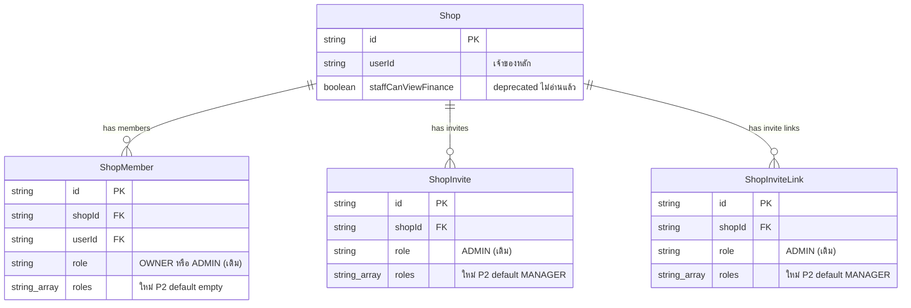

> **โมดูล:** 00071 - Shop Member Roles & Permissions
> **ประเภทเอกสาร:** DATABASE Design
> **เวอร์ชัน:** 1.0
> **วันที่จัดทำ:** 2026-10-10
> **สถานะ:** P1 implement แล้ว (ไม่มี migration) · **P2 implement แล้ว** (migration `20261010120000_shop_member_roles` · คอลัมน์ `roles` + CHECK 3 ตัว) · **P3 implement แล้ว ไม่มี migration เพิ่ม** (การตัดต้นทุน = Prisma global `omit` ใน `src/lib/prisma.ts` ไม่ใช่การเปลี่ยน schema · ไม่มี query ค้นตาม `roles` จึงไม่เพิ่ม GIN index — ด่านกลางอ่านแถวสมาชิกของ `userId` แล้วกรองบทบาทใน memory)
> **เจ้าของเอกสาร:** SA (ดู [[Feature-Docs-Ownership]])

# DATABASE: บทบาทและสิทธิ์สมาชิกร้าน

---

## 1. Overview

เพิ่มคอลัมน์ `roles` (additive) ให้ 3 ตารางที่มีอยู่แล้ว เพื่อเก็บหน้าที่ของพนักงานหลายบทบาทต่อร้าน · ไม่สร้างตารางใหม่ · ไม่ DROP · `Shop.staffCanViewFinance` ยังอยู่ใน schema แต่เลิกอ่าน (deprecated)

- **เอกสารออกแบบต้นทาง:** [[SDS]] (TD-001, TD-003)
- **Store ที่เกี่ยวข้อง:** PostgreSQL 16 (Supabase) ผ่าน Prisma — ตาม `prisma/schema.prisma` (`ShopMember` · `ShopInvite` · `ShopInviteLink` · `Shop`)
- **Engine / Charset (ถ้ามี):** PostgreSQL มาตรฐาน · enum ทุกตัวเป็น String ตาม convention โปรเจกต์
- **Phase:** P1 ไม่มี migration · P2 มี migration · P3 ไม่มี migration เพิ่ม

---

## 2. ERD

---

## 3. Tables

### 3.1 `ShopMember` (PostgreSQL / Prisma)

membership User↔Shop · `role` คงเดิม (`'OWNER'|'ADMIN'` = เจ้าของ vs พนักงาน) · เพิ่ม `roles` สำหรับหน้าที่ของพนักงาน (รองรับ SDS TD-001)

| Column | Type | Null | Default | Key |
|--------|------|------|---------|-----|
| `id` | `String (uuid)` | NO | `uuid()` | PK |
| `shopId` | `String` | NO | - | FK → Shop (Cascade) |
| `userId` | `String` | NO | - | FK → User (Cascade) |
| `role` | `String` | NO | - | (เดิม) |
| **`roles`** | `String[]` | NO | `[]` | **ใหม่ P2** |
| `createdAt` / `updatedAt` | `DateTime` | NO | now / updatedAt | - |

invariant: `role='OWNER' ⇒ roles=[]` · `role='ADMIN' ⇒` 1-4 ค่าใน {MANAGER, CHAT, BILLING, TECHNICIAN} — **บังคับที่ DB ด้วย CHECK `ShopMember_roles_check`** (§3.5) และที่ service (`planMemberRoleChange` / `validateAssignableRoles` ใน `src/lib/shop-role-assignment.ts`; ความไม่ซ้ำตรวจที่ service/valibot — CHECK ไม่ตรวจซ้ำ)

> คำศัพท์ (มติ P2): `ShopMember.role` = **ประเภทสมาชิก** แสดงเป็น "เจ้าของ" / "พนักงาน" · "ผู้ดูแล" = บทบาท `MANAGER` ใน `roles` เท่านั้น (ไม่ใช่ชื่อของ `role='ADMIN'` อีกต่อไป)

### 3.2 `ShopInvite` (PostgreSQL / Prisma)

คำเชิญผ่านเบอร์/อีเมล (00008) · เพิ่ม `roles` เก็บชุดที่ผู้รับจะได้ตอนยอมรับ

| Column | Type | Null | Default | Key |
|--------|------|------|---------|-----|
| `role` | `String` | NO | `"ADMIN"` | (เดิม) |
| **`roles`** | `String[]` | NO | `["MANAGER"]` | **ใหม่ P2** |

(คอลัมน์อื่นเดิมไม่เปลี่ยน) · เชิญเป็นเจ้าของไม่ได้ จึงไม่มี `OWNER` ใน `roles`

### 3.3 `ShopInviteLink` (PostgreSQL / Prisma)

ลิงก์เชิญ reusable `/i/<slug>` (00012) · เพิ่ม `roles` เช่นเดียวกัน

| Column | Type | Null | Default | Key |
|--------|------|------|---------|-----|
| `role` | `String` | NO | `"ADMIN"` | (เดิม) |
| **`roles`** | `String[]` | NO | `["MANAGER"]` | **ใหม่ P2** |

### 3.4 `Shop.staffCanViewFinance` (deprecated)

`Boolean @default(true)` คงอยู่ใน schema · P1 เลิกอ่านทุกจุดแล้ว (3 ไฟล์ `*-access` ใช้กฎ "การเงินเต็ม = เจ้าของ" · `rg staffCanViewFinance src` เหลือแค่คอมเมนต์ · ตั้งเป็น `true` ก็ไม่มีผล) · **ไม่ drop** — การ drop ต้องขออนุมัติ user แยก (OOS-9)

---

### 3.5 CHECK constraints (P2 · unmanaged SQL)

อยู่ใน `prisma/migrations/20261010120000_shop_member_roles/migration.sql` เท่านั้น — Prisma DSL ประกาศไม่ได้ (schema.prisma มีคอมเมนต์กำกับ) 🛑 **ห้าม `prisma db pull` / `migrate dev`** (introspect ไม่เห็นแล้วจะสร้าง migration DROP ทิ้ง · HR14)

| Constraint | ตาราง | เงื่อนไข |
|---|---|---|
| `ShopMember_roles_check` | `ShopMember` | `role='OWNER'` และ `cardinality(roles)=0` **หรือ** `role='ADMIN'` และ `cardinality(roles)` 1..4 และ `roles <@ {MANAGER,CHAT,BILLING,TECHNICIAN}` |
| `ShopInvite_roles_check` | `ShopInvite` | `cardinality(roles)` 1..4 และ `roles <@ {MANAGER,CHAT,BILLING,TECHNICIAN}` |
| `ShopInviteLink_roles_check` | `ShopInviteLink` | เช่นเดียวกับ `ShopInvite` |

ผลต่อโค้ด: เขียน `role='OWNER'` ต้องส่ง `roles: []` คู่กันเสมอ (เลื่อนเป็นเจ้าของ/โอนเจ้าของหลักล้าง `roles`) · ค่านอกชุดหรือชุดว่างของ ADMIN → DB ปฏิเสธ `23514` · เทส: `src/lib/__tests__/shop-roles-db-constraint.test.ts` (source ของ migration + DB local เท่านั้น)

---

## 4. Indexes

| Table | Columns | Type | Rationale (query pattern ที่รองรับ) |
|-------|---------|------|--------------------------------------|
| `ShopMember` | `(shopId, role)` | BTREE (เดิม) | list/count สมาชิก + `staffCountWhere()` — ไม่เปลี่ยน |
| `ShopMember` | `(userId)` | BTREE (เดิม) | switcher ร้านของ user |
| `roles` (ทั้ง 3 ตาราง) | - | ไม่เพิ่ม index | อ่านตามแถวของสมาชิกที่ระบุ (`shopId+userId` unique เดิม) ไม่ได้ค้นด้วย `roles` — ถ้า P3 พบ query ค้นตามบทบาท (เช่น "ใครถือ CHAT") ค่อยกำหนด GIN index ตอน implement |

---

## 5. Migration Plan

### 5.1 ลำดับการ Migrate

| ลำดับ | การเปลี่ยนแปลง | Submodule / Store | หมายเหตุ (dependency) |
|-------|----------------|--------------------|------------------------|
| 1 | `ADD COLUMN "roles" TEXT[] DEFAULT '{}'` (ShopMember) · `DEFAULT ARRAY['MANAGER']` (ShopInvite, ShopInviteLink) | `20261010120000_shop_member_roles` | เพิ่มแบบ nullable+default ก่อน |
| 2 | Backfill: `UPDATE "ShopMember" SET "roles" = ARRAY['MANAGER'] WHERE "role" = 'ADMIN'` | เช่นเดียวกัน | หลังลำดับ 1 · `ShopInvite`/`ShopInviteLink` ได้ `['MANAGER']` จาก DEFAULT (รวมแถวค้าง) |
| 3 | `ALTER COLUMN "roles" SET NOT NULL` ทั้ง 3 ตาราง | เช่นเดียวกัน | หลัง backfill |
| 4 | `ADD CONSTRAINT … CHECK … NOT VALID` แล้ว `VALIDATE CONSTRAINT` (3 ตัว §3.5) | เช่นเดียวกัน | หลัง backfill — แถวเดิมต้องผ่านก่อน validate |

ไฟล์เดียว ไม่มี DROP/TRUNCATE/DELETE (เทส source จับ) · preflight prod 2026-10-10: `ShopMember` role = ADMIN 19 / OWNER 16 เท่านั้น ⇒ ผ่าน CHECK ทุกแถว

### 5.2 Rollback

- คอลัมน์ใหม่ไม่ถูกโค้ด P1 อ่าน จึงย้อนโค้ดกลับ P1 ได้โดยไม่ต้องย้อน schema
- ถ้าต้องถอน schema จริง: `DROP COLUMN roles` 3 ตาราง — **การลบคอลัมน์ต้องขออนุมัติ user** (OOS-9) ข้อมูล `roles` ที่ตั้งหลัง P2 จะหาย ตัวเดิม `role` ยังครบจึงกลับไปใช้ ADMIN ล้วนได้
- backfill ไม่ทำลายข้อมูลเดิม (เขียนเฉพาะคอลัมน์ใหม่)

### 5.3 ผลกระทบ (Impact)

- ADD COLUMN พร้อม DEFAULT คงที่บน PostgreSQL 16 ไม่เขียนตารางใหม่ทั้งตาราง — lock สั้น ตารางเล็ก
- backward compatibility: โค้ดเดิมที่เช็ค `role` ใช้ต่อได้ทั้งหมด (`staffCountWhere()` · `canAccessShop` · กติกา 00012)
- push `main` = `prisma migrate deploy` บน prod ในตัว (HR15) — ก่อน push ต้องบอก user 3 ข้อ: prod ไม่ต้องสั่งเอง · local ต้อง apply เอง · migrate ล้ม = deploy ไม่ขึ้น
- local apply ด้วย `migrate deploy` ปักหมุด URL localhost เท่านั้น (HR14) · ห้าม `migrate dev` (shared DB drift)
- ตรวจ: นับแถว `ShopMember` ก่อน/หลังตรงกัน · จำนวนแถว `role='ADMIN'` = จำนวนแถวที่ `roles=['MANAGER']`

---

## 6. Retention / ข้อควรระวัง

- **Data Retention:** ไม่เพิ่มข้อมูลที่โตเร็ว (array สั้น ≤4 ค่า) · ไม่มี audit log การเปลี่ยนบทบาท (OOS-4 รอบหน้า)
- **PII / ข้อมูลอ่อนไหว:** `roles` ไม่ใช่ PII · `ShopInvite.invitedContact` เป็น PII เดิม (mask ที่ RSC boundary ตามเดิม)
- **Performance:** อ่านบทบาทอยู่ในแถว `ShopMember` ที่ `resolveActiveShopContext` อ่านอยู่แล้ว (≤1 query เพิ่ม)
- **Consistency ข้าม store:** store เดียว · แหล่งความจริงของสิทธิ์ = `ShopMember` (อ่านสด) · ไม่ใช้ค่าใน JWT ตัดสินสิทธิ์ (R-5)

---

## 7. Traceability

| Table / Collection | SDS Component / Decision | สถานะ |
|--------------------|--------------------------|-------|
| `ShopMember.roles` | `shop-member.service` / TD-001 | Implemented (P2) |
| `ShopInvite.roles` | Invite services / TD-001 | Implemented (P2) |
| `ShopInviteLink.roles` | Invite services / TD-001 | Implemented (P2) |
| `Shop.staffCanViewFinance` (deprecated) | Finance access / TD-003 | Draft |

---

## 8. สรุป (Summary)

เอกสาร DATABASE นี้กำหนด **โครงสร้างข้อมูล** ของ **บทบาทและสิทธิ์สมาชิกร้าน (00071)** ให้ DEV นำไปเขียน migration additive จริง QA ใช้เข้าใจ data model เพื่อวางแผนทดสอบ และทุกตาราง trace กลับ [[SDS]] ได้

**Open Questions:**
- ~~เพิ่ม DB CHECK~~ — ตัดสินแล้ว (P2 มติ 0.3): เพิ่ม 3 ตัว §3.5
- ~~ต้องมี GIN index บน `roles` หรือไม่~~ — ตัดสินแล้วใน P3: ไม่ต้อง (ไม่มี query ค้นตามบทบาท)
