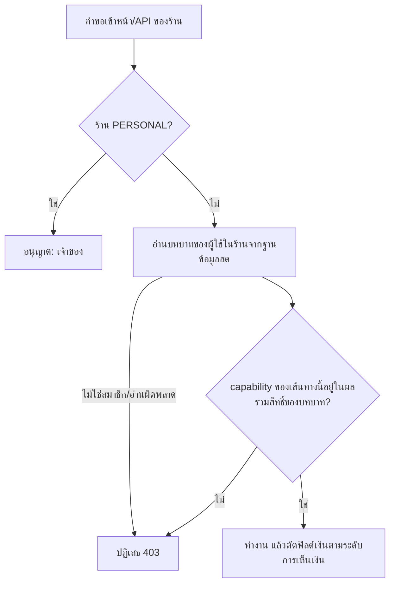

> **โมดูล:** 00071 - Shop Member Roles & Permissions
> **ประเภทเอกสาร:** Product Requirements Document (PRD)
> **เวอร์ชัน:** 2.0
> **วันที่จัดทำ:** 2026-10-10
> **สถานะ:** Approved — user อนุมัติ 2026-10-10 ใช้ค่าแนะนำทุกข้อ (Q-1..Q-7)
> **เจ้าของเอกสาร:** BA + PO + PM (ดู [[Feature-Docs-Ownership]])
>
> **แทนที่ฉบับร่าง 1.0 (2026-10-05)** ที่เสนอ 5 บทบาท เจ้าของ/ผู้ดูแล/ออกบิล/ตอบแชท/บัญชี — ฉบับร่างนั้นไม่เคย commit และ user สั่งชุดบทบาทใหม่ 2026-10-10 (ไม่มี "บัญชี" · เพิ่ม "ฝ่ายช่าง" · "เปิดบิล" สร้างได้เฉพาะบริการ)

# PRD: บทบาทและสิทธิ์สมาชิกร้าน (Shop Member Roles & Permissions)

---

## Executive Summary

วันนี้สมาชิกร้านทุกคนเห็นกำไรขาดทุน เพราะสิทธิ์เห็นการเงินคุมด้วยสวิตช์เดียวต่อร้าน (`Shop.staffCanViewFinance`) ซึ่งตั้งค่าตั้งต้นเป็น "เปิด" ตั้งแต่ 2026-08-08 และ migration ตั้งให้ทุกร้านเป็น "เปิด" ไปแล้ว นอกจากนี้ตัวเลขเงินหลายจุดไม่ได้ผ่านสวิตช์นั้นเลย (ยอดขายบนแดชบอร์ด รายได้ในหน้ายอดขาย ต้นทุนสินค้า ยอดใช้จ่ายสะสมของลูกค้า ยอดกระเป๋า SMS) และเมนูมือถือ (แถบล่าง ปุ่มสร้าง หน้าแรก) ไม่กรองตามบทบาทเลย

ฟีเจอร์นี้ให้เจ้าของมอบบทบาทตามหน้าที่จริงของร้าน 5 บทบาท สมาชิก 1 คนถือได้หลายบทบาทต่อร้าน สิทธิ์คือผลรวมของบทบาทที่ถือ:

| บทบาท | หน้าที่ |
|---|---|
| **เจ้าของ** | ทำได้ทุกอย่าง และเป็นคนเดียวที่เห็นมุมมองการเงินเต็ม — รายรับรวม กำไรขาดทุน ต้นทุน ค่าใช้จ่าย |
| **ผู้ดูแล** | บทบาทเดิมของสมาชิกทุกคนวันนี้ ทำงานร้านได้เกือบทั้งหมดเหมือนเดิม แต่ไม่เห็นกำไรขาดทุน |
| **ตอบแชท** | เข้าแชทและสร้างรายการ เห็นราคาเฉพาะรายใบ |
| **เปิดบิล** | เปิดบิลได้เฉพาะงานบริการ ไม่เห็นยอดขาย กำไร และแชท |
| **ฝ่ายช่าง** | อัปเดตสถานะคำสั่งซื้อ/การเข้ารับบริการเท่านั้น ไม่เห็นราคาและแชท |

ระบบตัดสินสิทธิ์ที่เซิร์ฟเวอร์ทุกเส้นทาง การซ่อนเมนู (เดสก์ท็อปและมือถือ) เป็นแค่ความสะดวก ไม่ใช่ตัวกั้น

---

## 1. Business Goals & KPIs

### 1.1 เป้าหมายทางธุรกิจ

| เป้าหมาย | รายละเอียด |
|----------|-----------|
| **ข้อมูลการเงินอยู่กับเจ้าของ** | กำไรขาดทุน ต้นทุน ค่าใช้จ่าย รายรับรวม เห็นเฉพาะเจ้าของ |
| **มอบงานตามหน้าที่จริง** | ร้านจ้างคนตอบแชท คนเปิดบิลหน้าร้าน ช่าง ได้โดยไม่เปิดข้อมูลเกินหน้าที่ |
| **ผู้ดูแลเดิมทำงานต่อได้** | สมาชิกเดิมไม่เสียสิทธิ์งานประจำวัน เสียเฉพาะการเงินที่ตั้งใจกั้น |
| **มือถือสอดคล้องกับสิทธิ์** | แถบล่าง ปุ่มสร้าง และหน้าแรกบนมือถือแสดงเฉพาะสิ่งที่บทบาททำได้ |

### 1.2 ตัวชี้วัดความสำเร็จ (KPIs)

| KPI | คำอธิบาย | เป้าหมาย |
|-----|----------|---------|
| **การเงินรั่ว** | เทสที่สมาชิกที่ไม่ใช่เจ้าของเรียกข้อมูลกำไร/ต้นทุน/ค่าใช้จ่าย/รายรับรวมได้สำเร็จ | 0 |
| **ผู้ดูแลเดิมเสียสิทธิ์งาน** | สิทธิ์ที่ ADMIN ทำได้วันนี้แต่หายไป (ไม่นับการเงิน) | 0 |
| **เส้นทางที่จัดหมวดสิทธิ์** | route ของร้านที่ผ่านตัวตัดสินสิทธิ์กลาง | 100% |
| **การใช้งาน** | ร้านที่มีสมาชิกถือบทบาทอื่นนอกจากผู้ดูแล หลังขึ้นระบบ 30 วัน | รายงานค่า |

---

## 2. User Personas (กลุ่มผู้ใช้งาน)

### 2.1 เจ้าของร้าน (เจ้าของหลัก / เจ้าของร่วม)

**ข้อมูลพื้นฐาน:**
- เจ้าของหลัก = `Shop.userId` (ผู้ถือแพ็กเกจ) · เจ้าของร่วม = สมาชิกที่เป็นเจ้าของ (00012 BR-MR-01..08)

**เป้าหมาย:**
- ดูภาพการเงินของร้านคนเดียว มอบงานให้พนักงานตรงหน้าที่

**ความต้องการ:**
- เลือกบทบาทตอนเชิญ เปลี่ยนภายหลังได้ทันที เห็นสรุปว่าบทบาทไหนทำอะไรได้

**จุดปวด (Pain Points):**
- พนักงานทุกคนเห็นกำไรขาดทุนอยู่ตอนนี้ และปิดได้ทีละร้านแบบทั้งหมดหรือไม่มีเลย

### 2.2 ผู้ดูแล

**ข้อมูลพื้นฐาน:**
- ผู้จัดการร้าน/มือขวาเจ้าของ = สมาชิกทุกคนที่มีอยู่วันนี้

**เป้าหมาย:**
- ดูแลออเดอร์ สินค้า ลูกค้า แชท และการตั้งค่าร้านได้เหมือนเดิม

**ความต้องการ:**
- ไม่สะดุดเมื่อเปิดระบบบทบาท

**จุดปวด (Pain Points):**
- ไม่มี — ถูกถอดเฉพาะการเงิน

### 2.3 พนักงานตอบแชท

**ข้อมูลพื้นฐาน:**
- แอดมินแชทของร้าน ตอบลูกค้าแล้วสร้างรายการให้

**เป้าหมาย:**
- ตอบทุกห้องของร้าน สร้างออเดอร์/นัดหมายจากแชทได้

**ความต้องการ:**
- เห็นสินค้าและราคาขาย เห็นยอดของแต่ละใบที่สร้าง

**จุดปวด (Pain Points):**
- ต้องได้สิทธิ์ทั้งร้านเพียงเพื่อตอบแชท

### 2.4 พนักงานเปิดบิล

**ข้อมูลพื้นฐาน:**
- คนหน้าเคาน์เตอร์ร้านบริการ รับลูกค้าแล้วเปิดบิลบริการ

**เป้าหมาย:**
- เปิดบิลบริการได้เร็ว พิมพ์ใบเสร็จ

**ความต้องการ:**
- เห็นรายการบริการ ราคา และค้นหาลูกค้า

**จุดปวด (Pain Points):**
- ไม่ควรเห็นยอดขายรวม กำไร หรือแชทกับลูกค้า

### 2.5 ฝ่ายช่าง

**ข้อมูลพื้นฐาน:**
- ช่าง/ผู้ให้บริการที่ลงมือทำงาน ใช้มือถือเป็นหลัก

**เป้าหมาย:**
- เห็นงานที่ต้องทำ อัปเดตสถานะงานและผลการเข้ารับบริการ

**ความต้องการ:**
- หน้าจอที่มีแต่งาน ไม่มีราคา ไม่มีเมนูที่ไม่ใช้

**จุดปวด (Pain Points):**
- วันนี้ได้เมนูทั้งร้านรวมตัวเลขเงินทั้งหมด

---

## 3. Business Requirements

### 3.1 ชุดบทบาทและการถือหลายบทบาท

**ความต้องการ:**
- 5 บทบาท: เจ้าของ, ผู้ดูแล, ตอบแชท, เปิดบิล, ฝ่ายช่าง
- สมาชิกที่ไม่ใช่เจ้าของถือได้ 1-4 บทบาทต่อร้าน (เช่น ตอบแชท + ฝ่ายช่าง) ตั้งแยกในแต่ละร้าน

**Business Rules:**
- สิทธิ์ = ผลรวมของทุกบทบาทที่ถือ
- เจ้าของไม่ถือร่วมกับบทบาทอื่น (ทำได้ทั้งหมดอยู่แล้ว)
- ร้านส่วนตัว (PERSONAL) มีเจ้าของคนเดียว ไม่ใช้ระบบบทบาท

**เหตุผล:**
- ร้านเล็กคนหนึ่งทำหลายหน้าที่ (มติ user 2026-10-10)

### 3.2 การเงิน

**ความต้องการ:**
- มุมมองการเงินเต็ม (รายรับรวม กำไรขาดทุน ต้นทุน ค่าใช้จ่าย ลูกหนี้ รายงานที่มีรายได้ ยอดใช้จ่ายสะสมของลูกค้า) เห็นเฉพาะเจ้าของ
- ตอบแชท / เปิดบิล / ผู้ดูแล เห็นราคาและยอดเฉพาะรายใบ ไม่เห็นยอดรวม
- ฝ่ายช่างไม่เห็นตัวเลขเงินเลย

**Business Rules:**
- ยกเลิกสวิตช์ `staffCanViewFinance`

**เหตุผล:**
- user: "ตอนนี้ทุกคนเห็นกำไรขาดทุนหมด" — ต้องปิดตั้งแต่ต้นทาง ไม่ใช่ซ่อนเฉพาะบางหน้า

### 3.3 ตารางสิทธิ์ (ฉบับเต็ม = [[BRD]] §8.3)

| กลุ่มงาน | เจ้าของ | ผู้ดูแล | ตอบแชท | เปิดบิล | ฝ่ายช่าง |
|---|---|---|---|---|---|
| แชท อ่าน/ตอบ | ได้ | ได้ | ได้ | - | - |
| สร้างออเดอร์ทุกประเภท | ได้ | ได้ | ได้ | - | - |
| สร้างบิลบริการ | ได้ | ได้ | ได้ | ได้ | - |
| ดูรายการ/รายละเอียดออเดอร์ | ได้ | ได้ | ได้ | ได้ | ได้ (ไม่มีราคา) |
| อัปเดตสถานะ/ผลเข้ารับบริการ | ได้ | ได้ | ได้ | - | ได้ |
| ราคา/ยอดรายใบ | ได้ | ได้ | ได้ | ได้ | - |
| ยอดขายรวม กำไร ต้นทุน ค่าใช้จ่าย | ได้ | - | - | - | - |
| สินค้า: จัดการ | ได้ | ได้ | ดู | ดู | - |
| ตั้งค่าร้าน/ช่องทางแชท/บอท | ได้ | ได้ | - | - | - |
| สมาชิก/บทบาท/บัญชีรับเงิน | ได้ | - | - | - | - |

### 3.4 มือถือ

**ความต้องการ:**
- แถบล่าง ปุ่มสร้าง (FAB) หน้าแรก (Command Center) ทางลัดที่ปักหมุด และหน้า "ร้าน" แสดงเฉพาะสิ่งที่บทบาททำได้
- หน้าแรกของบทบาทที่ไม่ใช่เจ้าของ ไม่มีกราฟยอดขาย ยอดกระเป๋า และสินค้าขายดีแบบมีตัวเลขเงิน

**Business Rules:**
- เมนูมือถือและเดสก์ท็อปใช้กฎชุดเดียวกัน (ที่เดียว)

**เหตุผล:**
- พนักงานส่วนใหญ่ใช้มือถือ (แอป DeepSellerApp ห่อเว็บ seller เดียวกัน)

### 3.5 การเชิญและเปลี่ยนบทบาท

**ความต้องการ:**
- เจ้าของเลือกบทบาท (อย่างน้อย 1) ตอนสร้างคำเชิญ/ลิงก์เชิญ ค่าตั้งต้น = ผู้ดูแล
- เจ้าของเปลี่ยนชุดบทบาทในตารางสมาชิกได้ มีผลทันทีโดยไม่ต้องเข้าระบบใหม่

**Business Rules:**
- เชิญเป็นเจ้าของผ่านลิงก์ไม่ได้ (คงตาม 00012) · โควตาสมาชิกนับคนเหมือนเดิม จำนวนบทบาทไม่กระทบโควตา

**เหตุผล:**
- รักษากฎ 00012 ที่ขึ้น prod แล้ว

---

## 4. Business Rules & Constraints

### 4.1 กฎทางธุรกิจหลัก

| กฎ | คำอธิบาย |
|----|----------|
| **การเงินเต็มเฉพาะเจ้าของ** | ทุกบทบาทอื่นไม่เห็นยอดรวม กำไร ต้นทุน ค่าใช้จ่าย |
| **ผู้ดูแลเดิมไม่เสียสิทธิ์งาน** | ADMIN เดิมทั้งหมดกลายเป็น [ผู้ดูแล] — เสียเฉพาะการเงิน |
| **เปิดบิล = บริการเท่านั้น** | สร้างได้เฉพาะออเดอร์ประเภทบริการ ร้านที่ไม่มีบริการ บทบาทนี้ใช้ไม่ได้ (เลือกไม่ได้) |
| **ฝ่ายช่างเห็นทุกงานของร้าน** | ไม่มีระบบมอบหมายงานรายช่างรอบนี้ (มติ user) |
| **สิทธิ์ตัดสินที่เซิร์ฟเวอร์** | ไม่มีสิทธิ์ = API 403 / หน้าแจ้งไม่มีสิทธิ์ · สิ่งที่ยังไม่จัดหมวด = เจ้าของเท่านั้น |

### 4.2 ข้อจำกัดทางธุรกิจ

| ข้อจำกัด | รายละเอียด |
|---------|-----------|
| **บทบาทตายตัว** | 5 บทบาท ไม่มีบทบาทกำหนดเอง/ติ๊กสิทธิ์รายข้อ |
| **บทบาทรายร้าน** | คนเดียวเป็นผู้ดูแลร้าน A และช่างร้าน B ได้ |
| **ร้านส่วนตัว** | ไม่มีสมาชิก ไม่มีบทบาท |

### 4.3 ระดับการเห็นตัวเลขเงิน

| ระดับ | เห็นอะไร | บทบาท |
|---|---|---|
| **เต็ม** | ทุกอย่าง รวมยอดรวม กำไร ต้นทุน ค่าใช้จ่าย ลูกหนี้ ยอดสะสมลูกค้า ยอดกระเป๋า | เจ้าของ |
| **รายใบ** | ราคาขายสินค้า/บริการ ยอดและการชำระของแต่ละออเดอร์ | ผู้ดูแล ตอบแชท เปิดบิล |
| **ไม่มี** | ไม่มีตัวเลขเงิน | ฝ่ายช่าง |

ถือหลายบทบาท = ได้ระดับที่สูงสุด (เช่น ฝ่ายช่าง + ตอบแชท = รายใบ)

---

## 5. Out of Scope (นอกขอบเขต)

| หัวข้อ | คำอธิบาย |
|--------|----------|
| **มอบหมายงานรายช่าง / มอบหมายห้องแชทรายคน** | ทุกคนในบทบาทเห็นทุกงาน/ทุกห้องของร้าน (มติ user) |
| **บทบาทบัญชี** | ไม่อยู่ในชุดที่ user สั่ง — การเงินเต็มเป็นของเจ้าของ |
| **บทบาทกำหนดเอง** | ไม่มี |
| **บันทึกประวัติการเปลี่ยนบทบาท (audit log)** | ไว้รอบหน้า |
| **แก้กฎเจ้าของร่วม/โอนเจ้าของหลัก/โควตา** | คงตาม 00012 |
| **ฝั่งผู้ซื้อ / API แอปผู้ซื้อ `/api/app/*`** | ไม่เกี่ยว |

---

## 6. Risks & Mitigation (ความเสี่ยงและแนวทางแก้ไข)

### 6.1 ความเสี่ยงทางธุรกิจ

| ความเสี่ยง | ผลกระทบ | ระดับความรุนแรง | แนวทางแก้ไข |
|-----------|---------|-----------------|-------------|
| ผู้ดูแลที่ใช้หน้าค่าใช้จ่าย/ยอดขายทำงานประจำวันถูกตัดกะทันหัน | งานบันทึกค่าใช้จ่ายสะดุด | กลาง | Q-1/Q-2 ให้ user ตัดสินก่อนขึ้น · แจ้งในหน้าสมาชิกว่าการเงินเป็นของเจ้าของแล้ว |
| เจ้าของไม่รู้ว่าบทบาทไหนเห็นอะไร | มอบผิด | กลาง | แสดงคำอธิบายสั้นใต้แต่ละบทบาทตอนเลือก |
| ร้านที่ไม่ใช่ร้านบริการเลือก "เปิดบิล" | สมาชิกทำอะไรไม่ได้เลย | ต่ำ | ซ่อนตัวเลือกนี้ในร้านที่ไม่มีบริการ |

### 6.2 ความเสี่ยงทางเทคนิค

| ความเสี่ยง | ผลกระทบ | แนวทางแก้ไข |
|-----------|---------|-------------|
| route ของร้านจำนวนมากเช็คแค่ "เป็นสมาชิก" (`requireActiveShop`/`requireShopMember`/`canAccessShop`) | ซ่อนเมนูแล้วแต่ API ยังเรียกได้ | ตัวตัดสินกลาง + เทส inventory ที่แดงเมื่อพบ route ร้านที่ไม่ประกาศ capability |
| ตัวเลขเงินกระจายในหน้าที่ไม่ใช่หน้าการเงิน (แดชบอร์ด รายการออเดอร์ สินค้า ลูกค้า) | ตัวเลขรั่วในจุดที่ไม่ได้ไล่ | ตัดตัวเลขที่ service/DAL ตามระดับการเห็นเงิน ไม่ใช่ซ่อนที่ UI (convention RSC PII neutralize at source) |
| `src/lib/auth.ts` fallback `activeShopRole="OWNER"` เมื่อคำนวณผิดพลาด | error ให้สิทธิ์เกิน | fail-closed สำหรับร้าน BUSINESS |
| เมนูมือถือมี 4 ที่ประกอบเอง (แถบล่าง FAB หน้าแรก หน้าร้าน) ไม่ผ่าน `seller-menu.ts` | มือถือหลุดกฎ | ทุกที่อ่านจากกฎชุดเดียว |
| กล่องแชทรวมหลายร้าน (00037) | เห็นห้องของร้านที่ไม่มีสิทธิ์แชท | กรองรายร้านตามสิทธิ์แชท รวมตัวเลขยังไม่อ่านและแจ้งเตือน |

---

## 7. Glossary (อภิธานศัพท์)

| คำศัพท์ | ความหมาย |
|---------|----------|
| **เจ้าของ** | สมาชิกระดับ OWNER (รวมเจ้าของร่วม) ทำได้ทั้งหมด ยกเว้นงานเฉพาะเจ้าของหลัก |
| **เจ้าของหลัก** | `Shop.userId` ผู้ถือแพ็กเกจ |
| **ผู้ดูแล** | บทบาทสืบจาก ADMIN เดิม ทำงานร้านได้เกือบทั้งหมด ยกเว้นการเงินเต็ม |
| **ตอบแชท** | อ่าน/ตอบทุกห้องแชทของร้าน + สร้างรายการ |
| **เปิดบิล** | สร้างออเดอร์ประเภทบริการ + พิมพ์ใบเสร็จ |
| **ฝ่ายช่าง** | ดูงาน + อัปเดตสถานะออเดอร์/การเข้ารับบริการ |
| **การเงินเต็ม** | ยอดขายรวม รายรับรวม กำไร/P&L ต้นทุน ค่าใช้จ่าย ลูกหนี้ รายงานที่มีรายได้ ยอดสะสมลูกค้า ยอดกระเป๋า SMS |
| **ราคารายใบ** | ราคาขายและยอด/การชำระของออเดอร์ทีละใบ |

---

## 8. Success Metrics (ตัวชี้วัดความสำเร็จ)

| ตัวชี้วัด | ค่าที่คาดหวัง | วิธีวัด |
|----------|---------------|--------|
| **ตารางสิทธิ์ครบทุกคู่** | ทุก (บทบาท × capability) ได้ผลตรงตาราง | เทสฟังก์ชันตัดสินกลาง + mutation |
| **API 403 ถูกต้อง** | บทบาทที่ไม่มีสิทธิ์ได้ 403 | เทส route ตัวแทนแต่ละกลุ่ม |
| **ไม่มีตัวเลขเงินรั่ว** | payload ของฝ่ายช่างไม่มีฟิลด์เงิน · ของตอบแชท/เปิดบิล/ผู้ดูแลไม่มีกำไร/ต้นทุน/ยอดรวม | เทส DAL ตามระดับการเห็นเงิน |
| **เปลี่ยนบทบาทมีผลทันที** | คำขอถัดไปใช้สิทธิ์ใหม่ | เทสเปลี่ยนบทบาทแล้วเรียกซ้ำ |
| **ผู้ดูแลเดิมไม่เสียสิทธิ์งาน** | 0 | เทียบตาราง ADMIN วันนี้กับ [ผู้ดูแล] |

---

## 9. Dependencies & Assumptions

### 9.1 สิ่งที่ต้องพึ่งพา (Dependencies)

| ระบบ/ส่วนประกอบ | ความสัมพันธ์ |
|-----------------|-------------|
| **00012 สมาชิกร้าน + ส่วนขยาย 2026-10-05** | เจ้าของร่วม/โอนเจ้าของหลัก/โควตา `staffCountWhere()` คงเดิม · ตารางสมาชิกเป็นที่เปลี่ยนบทบาท |
| **00016 ค่าใช้จ่าย/สวิตช์ `staffCanViewFinance`** | ถูกแทนด้วยกฎ "การเงินเต็มเฉพาะเจ้าของ" |
| **00024/00030/00036 นัดหมาย/ร้านบริการ** | ฝ่ายช่างอัปเดตสถานะ/ผลเข้ารับบริการ · เปิดบิลสร้างบิลบริการ |
| **00037 กล่องแชทรวมหลายร้าน** | กรองตามสิทธิ์แชทรายร้าน |
| **00069 แดชบอร์ด** | ตัดตัวเลขเงินตามระดับการเห็นเงิน |
| **`src/lib/seller-menu.ts` + เมนูมือถือ** | เมนูตามบทบาท |
| **00019-ext-mem / 00072** | อ้างว่า "ถ้า 00071 กำหนดสิทธิ์แชทละเอียดกว่า ให้ตาม 00071" → ใช้สิทธิ์แชทของฉบับนี้ |

### 9.2 สมมติฐาน (Assumptions)

- "สร้างบริการเท่านั้น" = สร้างได้เฉพาะออเดอร์ประเภทบริการ (`Order.type = SERVICE`) รวมการจองคิว/นัดหมายที่เกิดจากบิลนั้น
- "สร้างรายการ" ของตอบแชท = สร้างออเดอร์ได้ทุกประเภทที่ร้านขาย
- "อัปเดตงาน" ของฝ่ายช่าง = เปลี่ยนสถานะออเดอร์ (ไม่ใช่ยกเลิก/คืนเงิน) + สถานะ/ผลการเข้ารับบริการ ไม่แก้รายการ/ราคา/ลูกค้า
- ผู้ดูแลเห็นราคารายใบ (เท่าวันนี้) แต่ไม่เห็นยอดรวม/กำไร

### 9.3 คำถามที่ต้องให้ user ตัดสิน

ถ้าไม่ตอบ ใช้ค่าแนะนำและจดใน Change Log

| # | คำถาม | ค่าแนะนำ |
|---|-------|----------|
| Q-1 | ยกเลิกสวิตช์ "ให้พนักงานเห็นการเงิน" เลยไหม | ยกเลิก — การเงินเต็มเป็นของเจ้าของเท่านั้น ถ้าอยากให้ใครเห็น ตั้งเป็นเจ้าของร่วม |
| Q-2 | ผู้ดูแลเห็นยอดขายรวม (แดชบอร์ด/หน้ายอดขาย ไม่รวมกำไร) ได้ไหม | ไม่ได้ — เห็นแค่จำนวนงานและสถานะ |
| Q-3 | เปิดบิลรับชำระเงิน/ยืนยันชำระของบิลที่เปิด และแก้บิลก่อนชำระได้ไหม | ได้ทั้งคู่ (เคาน์เตอร์รับเงินจริง) แต่ยกเลิก/คืนเงินไม่ได้ |
| Q-4 | ใครยกเลิก/คืนเงินออเดอร์ได้ | เจ้าของ + ผู้ดูแล |
| Q-5 | ตอบแชทเปลี่ยนสถานะ/จัดส่ง/พิมพ์ป้ายพัสดุได้ไหม | ได้ (ร้านเล็กคนตอบแชทคือคนแพ็กของ) |
| Q-6 | ฝ่ายช่างเห็นชื่อ/เบอร์ลูกค้าในงานได้ไหม | เห็นชื่อ + เบอร์ (ต้องติดต่อหน้างาน) แต่ไม่เข้าหน้าลูกค้า |
| Q-7 | ต้นทุนสินค้าในหน้าสินค้า ผู้ดูแลกรอกได้ไหม | ไม่เห็นและไม่กรอก — เจ้าของเท่านั้น (ต้นทุน = การเงินเต็ม) |

---

## 10. Appendix

### 10.1 ตัวอย่าง User Journey

1. เจ้าของร้านคาร์แคร์เปิด "สมาชิก" → เชิญ "น้องเอ" เลือก [เปิดบิล] และ "ช่างบี" เลือก [ฝ่ายช่าง]
2. น้องเอเปิดแอป เห็นแถบล่าง "หน้าแรก · งาน" ปุ่มสร้างมีตัวเลือกเดียว "เปิดบิลบริการ" ไม่มีแชท ไม่มีกราฟยอดขาย
3. ช่างบีเปิดแอป เห็นรายการงานวันนี้ไม่มีราคา กด "เริ่มงาน" → "เสร็จแล้ว"
4. เจ้าของเปิดแดชบอร์ด เห็นรายรับและกำไรของวัน — มีเขาคนเดียวที่เห็น

### 10.2 ภาพรวมการตัดสินสิทธิ์

---

## Change Log

| วันที่ | เวอร์ชัน | รายการ |
|---|---|---|
| 2026-10-10 | 2.0 | ร่างใหม่ตามคำสั่ง user 5 บทบาท (แทนฉบับร่าง 1.0 ของ 2026-10-05) |
| 2026-10-10 | 2.0 | user อนุมัติ PRD+BRD — "อนุมัติ ใช้ค่าแนะนำทั้งหมด" ⇒ Q-1 ยกเลิกสวิตช์ · Q-2 ผู้ดูแลไม่เห็นยอดขายรวม · Q-3 เปิดบิลรับชำระ/แก้บิลยังไม่ชำระได้ ยกเลิก/คืนเงินไม่ได้ · Q-4 ยกเลิก/คืนเงิน = เจ้าของ+ผู้ดูแล · Q-5 ตอบแชทเปลี่ยนสถานะ/จัดส่ง/พิมพ์ป้ายได้ · Q-6 ช่างเห็นชื่อ+เบอร์ในงาน ไม่เข้าหน้าลูกค้า · Q-7 ต้นทุน = เจ้าของเท่านั้น |
